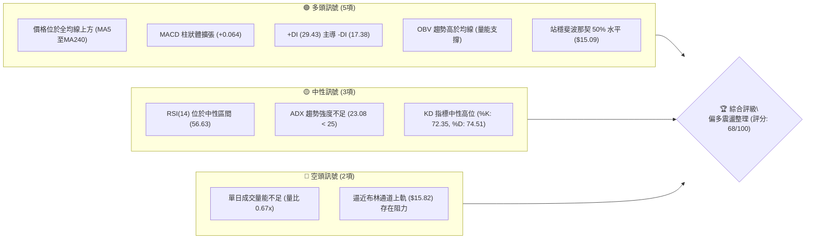
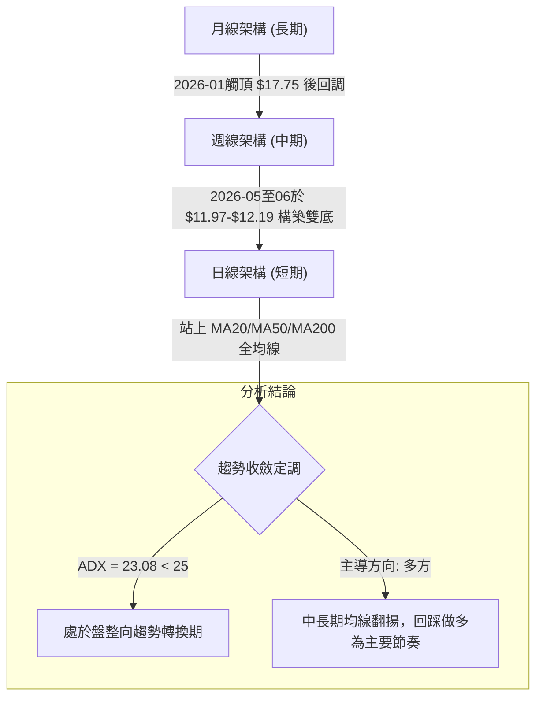
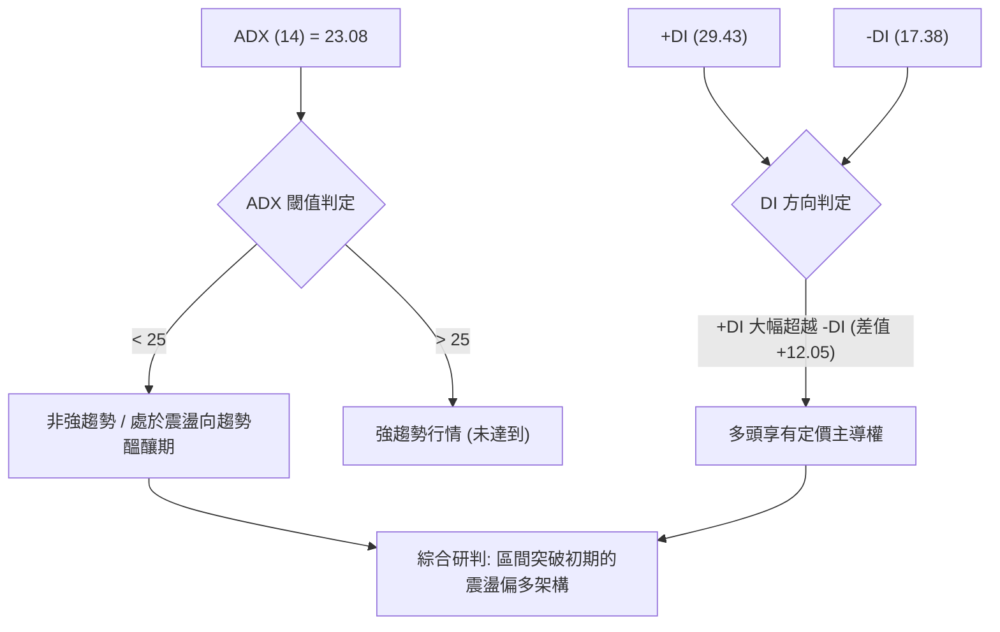
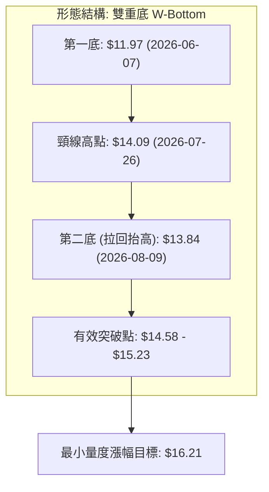
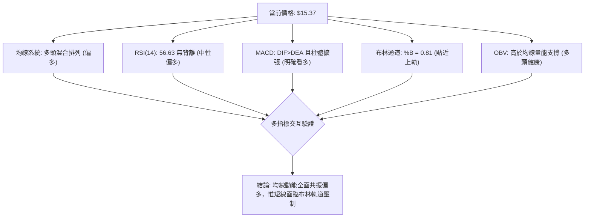
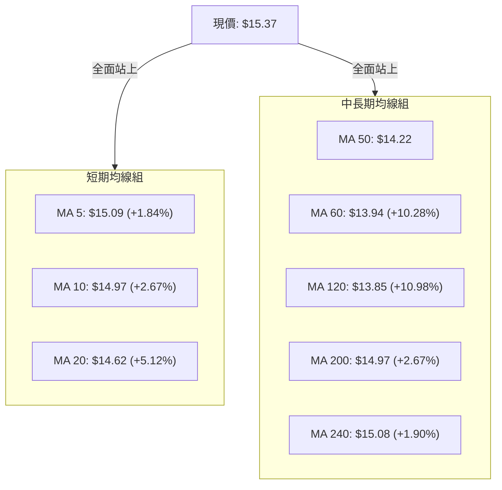
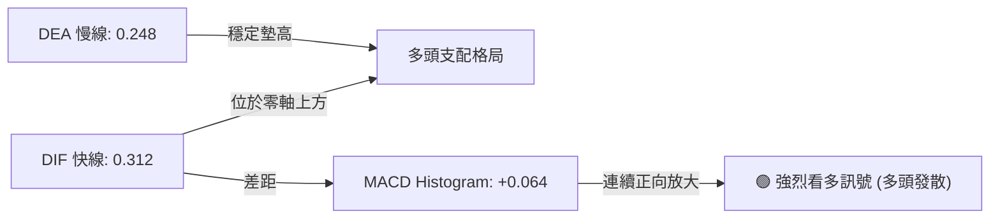
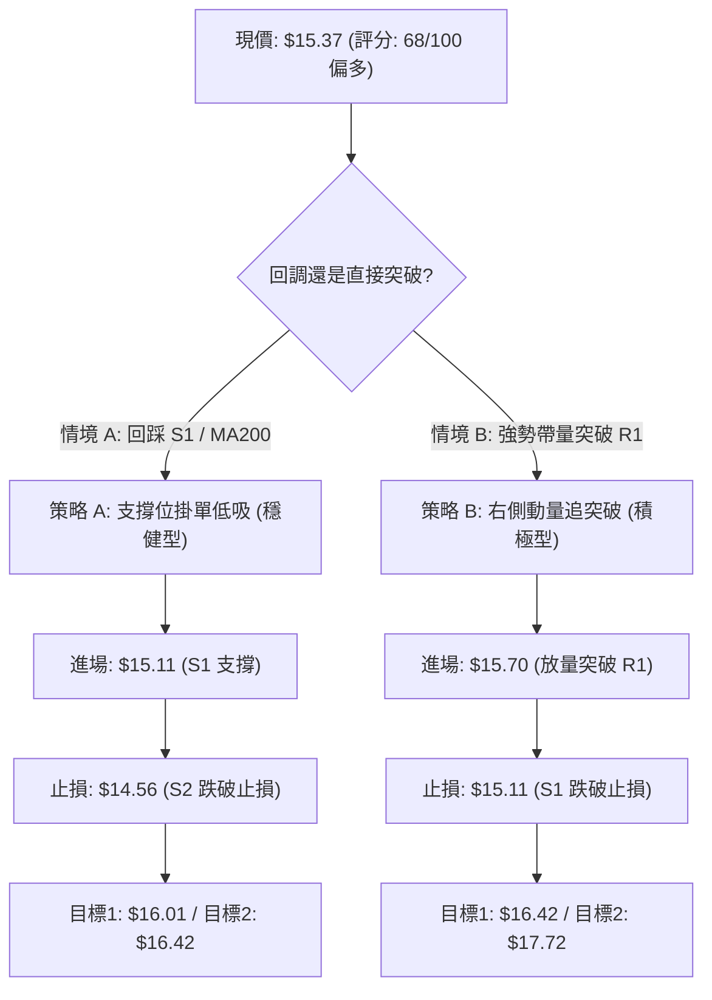
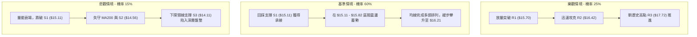

# NU 技術分析報告

> **報告日期**：2026-09-08 ｜ **語言**：繁體中文 ｜ **數據來源**：Yahoo Finance ｜ **當前價格**：$15.37

---

## 目錄

| 章節 | 內容 |
|------|------|
| [1. 技術面概覽](#1-技術面概覽) | 訊號儀表板、核心指標、評分卡 |
| [2. 趨勢分析](#2-趨勢分析) | 多時框趨勢、長中短期走勢、ADX 解讀 |
| [3. 圖表形態分析](#3-圖表形態分析) | 形態識別、K線組合、目標價推算 |
| [4. 支撐與阻力](#4-支撐與阻力) | 關鍵價位分布、斐波那契回調結構 |
| [5. 技術指標深度解讀](#5-技術指標深度解讀) | 均線系統、RSI、MACD、布林通道、量價結構 |
| [6. 動能與波動率](#6-動能與波動率) | 動能評估四象限、ATR 止損距離、Beta 敏感度 |
| [7. 多時框架總結](#7-多時框架總結) | 時框評分矩陣、多時框收斂定調 |
| [8. 交易策略建議](#8-交易策略建議) | 策略路由、情境階梯、主策略執行細節 |
| [9. 風險提示與監控](#9-風險提示與監控) | 關鍵監控 Checklist、情境推演、風控紀律 |
| [📋 報告總結](#-報告總結) | 總結評級與最優策略組合 |

---

## 1. 技術面概覽

### 🎯 技術訊號儀表板



### 📊 核心指標速覽表

| 指標類別 | 指標名稱 | 當前數值 | 訊號 | 解讀 |
|----------|----------|----------|------|------|
| **價格** | 當前價格 | $15.37 | 🟢 | 位於52週區間中位偏上(53.6%)，站上關鍵整數關卡 |
| **均線** | MA20 | $14.62 | 🟢 | 股價位於MA20上方 (+5.12%)，短期趨勢強勢向上 |
| **均線** | MA50 | $14.22 | 🟢 | 股價位於MA50上方，中期多頭基底穩固 |
| **均線** | MA200 | $14.97 | 🟢 | 突破長期牛熊分界線 (+2.67%)，多方重新掌控主導權 |
| **動能** | RSI(14) | 56.63 | 🟡 | 處於50-60擴張區，無超買或背離，上行空間健康 |
| **動能** | MACD (12,26,9) | DIF: 0.312 / DEA: 0.248 | 🟢 | 零軸上方維持黃金交叉，柱狀體 +0.064 持續放大 |
| **趨勢** | ADX (14) | 23.08 (+DI: 29.43) | 🟡 | ADX < 25 屬盤整/弱趨勢，但多頭方向力道佔優 |
| **通道** | 布林通道 (%B) | 0.81 (上軌 $15.82) | 🟡 | 進入超買邊界，貼近上軌震盪，有技術性消化需求 |
| **量能** | 20日成交量比 | 0.67x (48.57M / 72.94M) | 🔴 | 量能未同步放大，價漲量縮呈現技術性觀望特徵 |
| **波動** | ATR(14) | $0.62 (4.02%) | 🟡 | 波動度處於中等水準，單日防守緩衝區間足夠 |

### 🏆 技術評分卡

```
╔══════════════════════════════════════════════════════════════════╗
║              技術評分卡 — NU (2026-09-08)                       ║
╠══════════════════════════════════════════════════════════════════╣
║ 趨勢強度      ████████████░░░░░░░░  60/100  🟡 中性偏多 (ADX<25)║
║ 動能指標      ██████████████░░░░░░  72/100  🟢 MACD金叉/RSI健康 ║
║ 支撐穩定度    ████████████████░░░░  78/100  🟢 站上MA200與S1   ║
║ 成交量配合    ████████░░░░░░░░░░░░  42/100  🔴 日量縮/週量穩定 ║
║ 形態完整度    ████████████████░░░░  75/100  🟢 雙重底頸線突破   ║
║ 均線排列      ██████████████░░░░░░  70/100  🟢 短中均線多頭排列 ║
╠══════════════════════════════════════════════════════════════════╣
║ 綜合評分      █████████████░░░░░░░  68/100  🟢 偏多震盪 (多頭主導)║
╚══════════════════════════════════════════════════════════════════╝
```

---

## 2. 趨勢分析

### 🌐 多時框趨勢分析



### 📈 長期趨勢 — 12個月走勢圖（Unicode）

NU 在過去一年歷經了強勁多頭推升、高檔出貨回檔、築底修復三個鮮明階段。以下為過去 12 個月（2025-10 至 2026-09）之月線價格軌跡：

```
NU 月線走勢圖（過去12個月）
價格軸 ($)
$18.00 ┤                             ● (2026-01: $17.75 高點)
$17.00 ┤                     ●       │
$16.00 ┤             ●       │       │
$15.00 ┤             │       │       │   ● (2026-02: $14.98)               ● 現價: $15.37
$14.00 ┤             │       │       │   │   ●───────●                     │
$13.00 ┤             │       │       │   │   │       │   ● (2026-05: $13.13)│
$12.00 ┤             │       │       │   │   │       │   │   ● (06底)      │
       └─────┬───────┴───────┴───────┴───┴───┴───────┴───┴───┴──────┬──────┴─────
           25-10   25-11   25-12   26-01 26-02 26-03   26-04 26-05 26-06  26-08 26-09
```

#### 走勢特徵分析表格

| 階段 | 涵蓋月份 | 區間價格變化 | 漲跌幅 | 技術特徵與型態意義 |
|------|----------|--------------|--------|--------------------|
| **1. 頂部噴出段** | 2025-10 ~ 2026-01 | $16.11 → $17.75 | +10.18% | 創下波段歷史高點，隨後動能背離衰竭，獲利盤出逃 |
| **2. 中級修正段** | 2026-01 ~ 2026-05 | $17.75 → $13.13 | -26.03% | 跌破所有短中期均線，空方加速釋放去槓桿賣壓 |
| **3. 低檔築底段** | 2026-06 ~ 2026-07 | $11.97 → $13.61 | +13.70% | 探測 52W 低點 $11.20 上方支撐，爆出 473M 大量見底 |
| **4. 右側復甦段** | 2026-08 ~ 2026-09 | $13.84 → $15.37 | +11.05% | 站穩 MA200，均線多頭收斂向上，重返上升通道 |

### 📊 中期趨勢（週線分析）

中期走勢呈現清楚的「低點抬高」（Higher Lows）軌跡：
- **波段低點 A**：2026-06-07 週收盤 $11.97（爆量 473.47M）
- **波段次低點 B**：2026-06-14 週收盤 $12.19
- **波段拉回低點 C**：2026-08-09 週收盤 $13.84、2026-08-30 週收盤 $14.30

當前價格 $15.37 突破前波反彈高點 $15.23（2026-08-16），形成經典之多頭波段突破。週線 MACD 柱狀體於 2026-09-06 週顯著擴大至 +0.064，週成交量達 373.99M，顯現機構買盤自底部持續承接。

### ⚡ 趨勢強度評估（ADX 解讀）



| 指標變數 | 當前讀數 | 門檻區間 | 技術解讀 |
|----------|----------|----------|----------|
| **ADX (14)** | 23.08 | < 20: 極弱；20-25: 醞釀；> 25: 強趨勢 | 顯示單邊趨勢尚未全面爆發，交易策略不可追高，適合回踩支撐低吸。 |
| **+DI (14)** | 29.43 | 基準線 20 | 多頭進攻動能充沛，多方佔據市場結構核心。 |
| **-DI (14)** | 17.38 | 基準線 20 | 空頭拋壓處於衰竭狀態，空方無力組織連續性下殺。 |

---

## 3. 圖表形態分析

### 🔍 形態識別系統



#### 形態識別與信心度評估表

| 形態類別 | 信心度 | 判斷依據（引用數據） | 完成度 | 目標價（附計算式） |
|----------|--------|----------------------|--------|--------------------|
| **雙重底 (W-Bottom)** | 85% | 2026-06-07 出現極端低點 $11.97，隨後 08-09 拉回 $13.84 未破前低，突破頸線 $14.09 | 100% (已突破) | **$16.21**<br>計算式：頸線 $14.09 + 形態高度 ($14.09 - $11.97 = $2.12) = **$16.21** |
| **矩形收斂向上突破** | 70% | 8月中旬至今在 $14.30 至 $15.23 區間密集築階，本週日線以 $15.37 突破區間頂部 | 90% | **$16.44**<br>計算式：突破點 $15.23 + 盤整帶高度 ($15.23 - $14.02 = $1.21) = **$16.44** |
| **頭肩底形態** | 40% | 數據時間跨度不足以定義成熟之左肩結構，僅具雙底雛形 | 35% | *訊號不足，信心度低於50%，僅做雙底指標解讀* |

### 🕯️ 重要K線形態分析

| 週/月份 | 基準收盤價 | K線組合形態 | 技術解讀 | 訊號強度 |
|----------|------------|-------------|----------|----------|
| **2026-06-07 週** | $11.97 | 長下影爆量破底翻鎚子線 | 473.47M 歷史級換手量，恐慌盤出清，形成波段鐵底 | 🟢 強烈買訊 |
| **2026-07-19 週** | $13.59 | 高檔滯漲十字星 (Doji) | 成交量激增至 762.06M，短線多空激烈交鋒，引發短線回調 | 🟡 中性回踩 |
| **2026-08-16 週** | $15.23 | 實體大陽線收復失地 | 週漲幅 +10.04%，強勢站上 MA200 關鍵牛熊界線 | 🟢 明確轉強 |
| **2026-09-06 週** | $15.37 | 光腳中陽線創波段新高 | 實體穿透前高壓力，週 MACD 柱狀體轉正放大 | 🟢 延續多頭 |

### 📉 ASCII 走勢形態示意圖

```
NU 雙重底 (W-Bottom) 與頸線突破結構
價格
$16.50 ┤                                                 [量度目標區間: $16.21-$16.42]
$16.00 ┤                                           ╭─────
$15.50 ┤                                     ╭─────╯  ● 現價: $15.37 (確認突破)
$15.00 ┤                             ╭───────╯
$14.50 ┤             ╭─頸線 $14.09───╯           
$14.00 ┤       ╭─────╯               ● 第二底: $13.84
$13.50 ┤       │
$13.00 ┤ ╭─────╯
$12.50 ┤ │
$12.00 ┤ ● 第一底: $11.97
       └─┴───────────────────────────┴─────────────────┴─────────────► 時間軸
        2026-06-07                  2026-08-09        2026-09-08
```

### 🎯 形態目標價計算

依據標準圖表量化測量法則：
1. **雙底量度目標價**：
   - 頸線位：$14.09（2026-07-26 收盤價）
   - 低點底位：$11.97（2026-06-07 收盤價）
   - 垂直形態高度 $H = \$14.09 - \$11.97 = \$2.12$
   - **量度理論目標價** $= \$14.09 + \$2.12 = \mathbf{\$16.21}$
   - 該價位緊鄰關鍵阻力位 **R2 ($16.42)** 與斐波那契 38.2% 回調位 **($16.01)**。

---

## 4. 支撐與阻力

### 🗺️ 關鍵價位分布圖（Unicode）

```
NU 價位結構分布圖 (由實際 OHLCV 與波段聚類計算)
═══════════════════════════════════════════════════════════════════
$18.98 ║██████████████████████████████████████║ 52W 歷史高點 (0.0% Fib)
$17.72 ║██████████████████████████████        ║ 強阻力 R3 (+15.26%)
$17.14 ║▓▓▓▓▓▓▓▓▓▓▓▓▓▓▓▓▓▓▓▓▓▓▓▓              ║ 斐波那契 23.6% 回調位
$16.42 ║████████████████████                  ║ 中期波段阻力 R2 (+6.86%)
$16.01 ║▓▓▓▓▓▓▓▓▓▓▓▓▓▓▓▓                      ║ 斐波那契 38.2% 回調位
$15.82 ║░░░░░░░░░░░░░░░░░░░░                  ║ 布林通道上軌壓力
$15.70 ║████████████                          ║ 短線即時阻力 R1 (+2.11%)
$15.37 ╠══════════════════════════════════════╣ ◄ 現價 ($15.37)
$15.11 ║████████████                          ║ 關鍵短線支撐 S1 (-1.72%)
$15.09 ║▓▓▓▓▓▓▓▓▓▓▓▓▓▓▓▓▓▓▓▓▓▓▓▓▓▓▓▓          ║ 斐波那契 50.0% 中樞平衡位 / MA5
$14.97 ║░░░░░░░░░░░░░░░░                      ║ 長期牛熊分水嶺 (MA200 / MA10)
$14.56 ║████████████████████                  ║ 中期強支撐 S2 (-5.27%) / MA20
$14.11 ║██████████████████████████████        ║ 波段防守鐵底 S3 (-8.23%)
$13.42 ║░░░░░░░░░░░░░░░░                      ║ 布林通道下軌
$11.20 ║██████████████████████████████████████║ 52W 絕對低點 (100.0% Fib)
═══════════════════════════════════════════════════════════════════
```

### 🚧 阻力位分析表

所有阻力價位嚴格引用系統計算之波段聚類數據：

| 阻力級別 | 精確價位 | 距現價空間 | 形成原因與技術共振 | 突破難度 | 重要性評級 |
|----------|----------|------------|--------------------|----------|------------|
| **R1** | **$15.70** | +2.11% | 近期反彈波段高點聚集區，布林上軌 ($15.82) 壓制共振區 | 🟡 中等 | ★★★☆☆ |
| **R2** | **$16.42** | +6.86% | 2025年Q4大成交量籌碼密集套牢區，雙底量度目標 ($16.21) 延伸位 | 🔴 較高 | ★★★★☆ |
| **R3** | **$17.72** | +15.26% | 2026年1月歷史高點平台 ($17.75)，機構出貨強壓阻力 | 🔴 極高 | ★★★★★ |

### 🛡️ 支撐位分析表

所有支撐價位嚴格引用系統計算之波段聚類數據：

| 支撐級別 | 精確價位 | 距現價空間 | 形成原因與技術共振 | 守住機率 | 重要性評級 |
|----------|----------|------------|--------------------|----------|------------|
| **S1** | **$15.11** | -1.72% | 短期突破平台支撐，與 50% Fib ($15.09) 及 MA5 ($15.09) 高度共振 | 85% | ★★★★☆ |
| **S2** | **$14.56** | -5.27% | 8月多波回踩低點聚類區，貼近 MA20 ($14.62) 中軌支撐線 | 75% | ★★★★★ |
| **S3** | **$14.11** | -8.23% | 雙底突破頸線位置 ($14.09) 及 Fib 61.8% ($14.17)，波段牛熊底限 | 90% | ★★★★★ |

### 📐 斐波那契回調位分析

依據 52 週完整波段（低點 **$11.20** → 高點 **$18.98**，波幅 **$7.78**）精確計算：

```
斐波那契回調結構階梯
0.0%  ── $18.98 (52W High)
23.6% ── $17.14 (第一強阻力帶)
38.2% ── $16.01 (強弱勢轉折關鍵位)
--------------------------------------------- ▲ 現價: $15.37 (落於 38.2% 與 50.0% 之間)
50.0% ── $15.09 (牛熊中樞分水嶺 - 剛完成向上回踩收復)
61.8% ── $14.17 (黃金分割防守位 - 對應 S3 支撐 $14.11)
78.6% ── $12.86 (深度洗盤支撐位)
100.0%── $11.20 (52W Low)
```

**深層解讀**：
現價 $15.37 成功收復 **50.0% 回調位 ($15.09)**，象徵中長線跌勢修正已正式消化過半。目前股價進入 **$15.09 (50.0%) 至 $16.01 (38.2%)** 的多頭修復區間。若後續量能放大收復 $16.01，行情將由「弱勢反彈」全面升級為「主升浪重啟」。

---

## 5. 技術指標深度解讀

### 🎛️ 指標訊號總覽



### 📈 移動平均線排列分析



- **均線排列狀態**：當前短期均線 $15.09 (MA5) > $14.97 (MA10) > $14.62 (MA20) 呈現典型**多頭排列**。
- **牛熊切換關鍵**：現價 $15.37 已越過年線指標 MA200 ($14.97) 及 MA240 ($15.08)。且 MA5 與 MA10 即將由下往上穿越 MA200，形成中期「黃金交叉」，對價格形成強烈階梯式下檔承接力。

### 📉 RSI(14) 分析

- **當前讀數**：`56.63`
- **進度條展示**：`[0] ░░░░░░░░░░░░░░░░░░░░███████████░░░░░░░░░ [100]` （56.63%）
- **背離分析**：
  - 比對 2026-08-16 價格 $15.23（RSI: 58.0）與當前 2026-09-08 價格 $15.37（RSI: 56.63）：
  - 價格微幅創高，RSI 略低 1.37 個基點，但因差額極小且 RSI 穩定維持於 50 榮枯線上方，**系統判定無明顯頂背離現象**。動能釋放健康，無極端過熱風險。

### 📊 MACD(12,26,9) 訊號解讀



- DIF 與 DEA 雙線穩居於零軸之上，符合標準多頭推進常態。
- 柱狀體數值自 2026-08-30 的 +0.002 迅速擴大至 **+0.064**，確認短期多頭買盤動能正在加速聚集。

### 📦 布林通道分析

```
NU 日線布林通道結構 (20, 2)
價格
$15.82 ┬────────────────────────────────────────── 布林上軌 (阻力 R1 共振)
       │                        ╭────● 現價: $15.37 (%B: 0.81)
$15.20 ┼                  ╭─────╯
       │            ╭─────╯
$14.62 ┼────────────╯───────────────────────────── 布林中軌 (MA20 強支撐)
       │      ╭─────╯
$14.00 ┼──────╯
       │╭─────╯
$13.42 ┴╯───────────────────────────────────────── 布林下軌 (極端支撐)
```

- **通道帶寬與位置**：通道上軌 **$15.82**、中軌 **$14.62**、下軌 **$13.42**。
- **%B 指標為 0.81**：位於 0.80 以上超買警戒邊緣，代表短期價格具有向通道中軌回測或減速整理之需求，技術面不建議直接在現價追價。

### 💹 成交量分析（量價配合度）

- **量價背離檢視**：
  - 日成交量 48.57M 相對 20日均量 72.94M **量比僅 0.67x**，呈現「價漲量縮」格局，顯示短線散戶追高意願不足，以場內存量資金博弈為主。
  - **OBV (能量潮)**：系統監控顯示 `OBV > MA`，長期量能累積曲線並未跌破均線，代表中大型機構籌碼並無派發跡象，籌碼沉澱度高，技術支撐扎實。

---

## 6. 動能與波動率

### ⚡ 動能評估四象限

| 象限 | 動能維度 (Momentum) | 波動率維度 (Volatility) | 當前判定 | 策略指導含義 |
|:---:|:---:|:---:|:---:|:---|
| **Q1** | **強動能** (MACD擴大/+DI優勢) | **低波動** (ATR 4.02%/帶寬收縮) | **✓ [當前狀態]** | **最佳波段佈局期**：趨勢平穩推升，洗盤風險低，適合順勢佈局。 |
| **Q2** | 弱動能 (MACD綠柱/跌破零軸) | 低波動 (橫盤沉寂) | ─ | 謹慎觀望：市場缺乏催化劑。 |
| **Q3** | 強動能 (單邊暴漲) | 高波動 (ATR > 6%) | ─ | 高風險博弈：防範劇烈震盪侵蝕利潤。 |
| **Q4** | 弱動能 (恐慌下殺) | 高波動 (放量暴跌) | ─ | 嚴禁進場：流動性衝擊階段。 |

### 📊 ATR 波動率分析

- **當前數值**：**ATR(14) = $0.62**（佔當前股價之 **4.02%**）。
- **防守止損距離建議**：
  - 短線波段操作：建議給予 **1.5 × ATR = $0.93** 之容忍緩衝空間。
  - 保守趨勢操作：建議給予 **2.0 × ATR = $1.24** 之容忍緩衝空間。
  - 以現價 $15.37 計算，基礎風控回撤下限應設於 **$14.44** 至 **$14.75** 區間，與關鍵支撐 S2 ($14.56) 完美重疊。

### 📐 Beta 與市場相關性

- **Beta 係數**：**0.94**。
- **市場特徵**：NU 具備與標普500指數高度同步之市場波動特性（略低於大盤平均 beta 1.0），對非系統性外部衝擊防禦力佳。機構持股佔比高達 **82.0%**，空頭回補天數 (Short Ratio) 僅 **1.41 天**，浮額極為乾淨，大幅降低了空頭踩踏或擠壓的失真風險。

---

## 7. 多時框架總結

### 📋 時框架評分表

| 時框架 | 趨勢方向 | 動能狀態 | 均線排列 | 關鍵圖表形態 | 綜合評分 | 操作建議 |
|:---|:---:|:---:|:---:|:---|:---:|:---|
| **月線 (長期)** | 🟡 震盪修正後回溫 | 中性 (自高點回調) | 站上 MA200/MA240 | 自 $17.75 高點回落後打底 | **65 / 100** | 逢低分批承接 |
| **週線 (中期)** | 🟢 多頭波段展開 | 增強 (MACD週柱翻正) | 均線收斂向上發散 | 雙重底頸線有效突破 | **75 / 100** | 波段順勢做多 |
| **日線 (短期)** | 🟢 沿均線走升 | 偏多但布林上軌承壓 | MA5至MA20短多排列 | 突破 $15.23 整理平台 | **68 / 100** | 回踩低吸勿追 |

### 🔲 綜合訊號矩陣

```
訊號收斂矩陣驗證
━━━━━━━━━━━━━━━━━━━━━━━━━━━━━━━━━━━━━━━━━━━━━━━━━━━━━━━━━
維度            短期 (日線)      中期 (週線)      長期 (月線)
─────────────────────────────────────────────────────────
趨勢指標 (MA)   🟢 強力看多      🟢 轉強看多      🟡 中性偏多
動能指標 (MACD) 🟢 擴張看多      🟢 金叉確認      🟡 零軸上方
動能指標 (RSI)  🟡 中性無背離    🟡 穩步向上      🟡 震盪區間
籌碼量能 (OBV)  🟡 量縮整理      🟢 巨量底築成    🟢 機構高度鎖籌
━━━━━━━━━━━━━━━━━━━━━━━━━━━━━━━━━━━━━━━━━━━━━━━━━━━━━━━━━
```

### ⚖️ 多時框收斂結論

依據多時框收斂規則（規則 14）：
1. **行情屬性**：當前日線 **ADX = 23.08 (< 25)**，屬於「**盤整向趨勢轉換之箱體突破期**」，尚未進入單邊主升爆發浪。
2. **時框優先權**：中長期週線格局突破雙底頸線，站穩 MA50 ($14.22) 與 MA200 ($14.97)，中長期上升基底確立。日線則提供極具精準度的防守進場點。
3. **唯一方向性結論**：**【偏多格局，回踩支撐做多】**。堅決排除追高策略，所有交易策略皆圍繞「回測 S1 逢低布局、緊扣關鍵支撐防守」展開。

---

## 8. 交易策略建議

### 🗺️ 策略決策流程圖



### 🧭 策略路由

> **當前主策略方向 = 主推多頭策略（依技術綜合評分 68 / 100，評級偏多）**  
> 空頭策略不予推薦，僅將跌破關鍵位列為空頭反轉風控提示。

### 🎯 價格情境階梯（Price Scenarios）

價位嚴格引用系統已確認之客觀數據：

| 觸發條件 | 下一目標 | 後續延伸目標 | 情境技術含義與應對方針 |
|:---|:---|:---|:---|
| **向上突破 R1 ($15.70)** | **R2 ($16.42)** | **R3 ($17.72)** | 突破布林上軌壓制，多頭波段主升浪確認，加碼跟進 |
| **維持現價區間 ($15.11 - $15.70)** | — | — | 於布林中上軌間進行技術性換手消化，維持多頭持倉 |
| **向下回測跌破 S1 ($15.11)** | **S2 ($14.56)** | **S3 ($14.11)** | 短線回調加深，考驗 MA20/MA200 支撐，多單防守減倉 |

### 📊 情境機率分佈

| 預期情境 | 發生機率 | 主要技術與指標依據 |
|:---|:---:|:---|
| **情境一：強勢震盪後上攻 (主推)** | **60%** | 全均線多頭壓陣、MACD柱體放大至+0.064、+DI高達29.43主導盤勢。 |
| **情境二：窄幅橫盤消化量能** | **25%** | ADX = 23.08 未破 25、布林 %B 達 0.81 臨近通道上界，日量能偏低。 |
| **情境三：假突破深度回踩** | **15%** | 量比僅 0.67x 恐致誘多失敗，若失守 MA200 ($14.97) 將觸發多殺多。 |

### 🟢 主策略詳情

嚴格根據數據源「關鍵價位」區塊設定：

| 策略要素 | 策略 A：穩健拉回佈局（主要推薦） | 策略 B：右側順勢突破（積極進取） |
|:---|:---|:---|
| **適用對象** | 中長線波段投資者、注重風報比 | 短線動能交易者、日內突破交易者 |
| **進場條件** | 價格拉回回踩支撐 S1 不破時進場 | 盤中帶量實體突破阻力位 R1 進場 |
| **進場價格** | **$15.11**（精確對應支撐位 S1） | **$15.70**（精確對應阻力位 R1） |
| **目標價 T1** | **$16.01**（斐波那契 38.2% 回調位） | **$16.42**（阻力位 R2 / 雙底量度區間） |
| **目標價 T2** | **$16.42**（阻力位 R2，漲幅空間 +8.67%） | **$17.72**（阻力位 R3，漲幅空間 +12.87%） |
| **止損價格** | **$14.56**（精確對應支撐位 S2，跌幅 -3.64%）| **$15.11**（精確對應支撐位 S1，跌幅 -3.76%） |
| **風險報酬比** | **1 : 2.38** (損 $0.55，贏利目標 $1.31) | **1 : 2.05** (損 $0.59，贏利目標 $1.21) |
| **預估勝率** | **68%** | **55%** |
| **建議倉位** | **總資金之 15% - 20%** | **總資金之 10%** |

### 🔴 反向風險觸發點（對沖與撤退提示）

- **全面停損警戒線**：若日K線收盤價**跌破支撐位 S2 ($14.56)**，宣告短多結構瓦解，應無條件執行多頭停損出場。
- **中期翻空確認點**：若放量**擊穿波段防守鐵底 S3 ($14.11)**，意味雙底反轉失敗，中期結構全面轉空，投資人應考慮建立放空對沖部位或轉入防禦性現金。

### ⭐ 整體訊號強度評星

```
做多訊號強度：★★★★☆  (4/5星 - 均線動能齊備，唯欠缺爆量確認)
做空訊號強度：★☆☆☆☆  (1/5星 - 缺乏空頭主導證據，逆勢風險極高)
整體可信度：  ★★★★☆  (4/5星 - 數據完整，價位具備高共振度)
```

---

## 9. 風險提示與監控

### ✅ 關鍵監控指標 Checklist

```
╔══════════════════════════════════════════════════════════════════╗
║              NU 每日收盤技術監控 Checklist                      ║
╠══════════════════════════════════════════════════════════════════╣
║ [ ] 價格防守線：收盤價是否嚴格維持在 S1 ($15.11) 及 MA200 上方？   ║
║ [ ] 動能連續性：MACD 柱狀體是否持續保持在 +0.050 以上正向增長？  ║
║ [ ] 趨勢爆發點：ADX(14) 讀數是否成功上穿 25.00 臨界點？         ║
║ [ ] 量能同步度：日成交量是否回升至 20日均量 (72.9M) 以上水準？    ║
║ [ ] 軌道超買度：布林通道 %B 是否有效降溫至 0.70 附近完成洗盤？   ║
╚══════════════════════════════════════════════════════════════════╝
```

### ⚠️ 風險場景分析



### 🛡️ 風險管理重要提醒

1. **量縮上漲之陷阱防範**：當前價位逼近布林通道上軌 ($15.82)，但成交量比僅 0.67x，極度容易觸發短線假突破洗盤。切忌在開盤急拉時盲目市價追價，必須嚴守回調進場紀律。
2. **波動度止損執行機制**：當前 ATR(14) 為 $0.62，波動度尚屬溫和。若遭遇突發消息導致單日跳空跌破 S1 ($15.11)，應立即收縮倉位，避免讓單筆交易承受超過總資金 2% 的實質本金虧損。

---

## 📋 報告總結

```
╔══════════════════════════════════════════════════════════════════╗
║                    NU 技術分析報告總結                           ║
╠══════════════════════════════════════════════════════════════════╣
║ 報告日期：2026-09-08                                             ║
║ 當前價格：$15.37                                                 ║
║ 分析評級：🟢 偏多震盪整理（評分: 68/100，中長期轉強確立）          ║
║                                                                  ║
║ 關鍵結論：                                                       ║
║ ├─ 長期趨勢：🟢 站穩 MA200 ($14.97) 及 Fib 50% ($15.09) 牛熊分水嶺║
║ ├─ 中期趨勢：🟢 週線雙底形態確立突破頸線，MACD 柱體顯著放大      ║
║ ├─ 短期趨勢：🟡 短期多頭排列，惟臨近布林上軌 ($15.82) 存在技術阻力 ║
║ ├─ 關鍵支撐：S1: $15.11 │ S2: $14.56 │ S3: $14.11               ║
║ ├─ 關鍵阻力：R1: $15.70 │ R2: $16.42 │ R3: $17.72               ║
║ └─ 分析師目標價：均價 $18.78 (隱含 +22.18% 潛在上行空間)         ║
║                                                                  ║
║ 最優策略組合：                                                   ║
║ 1. 🥇 最佳機會：策略 A (穩健型) — 於 S1 $15.11 掛單回踩進場，     ║
║                 止損 $14.56，目標看 $16.01 / $16.42，風報比 1:2.38║
║ 2. 🥈 次選機會：策略 B (動能型) — 帶量突破 R1 $15.70 後順勢跟進， ║
║                 止損 $15.11，目標看 $16.42 / $17.72，風報比 1:2.05║
║ 3. 🥉 保守選擇：等待 ADX 上穿 25 確認趨勢行情啟動後，再擇機介入 ║
╚══════════════════════════════════════════════════════════════════╝
```

---

> ⚠️ **免責聲明**：本報告為技術分析研究，所有數值及點位均嚴格基於所提供之歷史交易數據計算。本報告**僅供研究與學術參考**，**不構成任何要約或投資建議**。金融市場具有高波動風險，投資人應依個人財務狀況與風險承受能力獨立決策，自負盈虧。

---

*報告生成時間：2026-09-08 ｜ 數據來源：Yahoo Finance ｜ 分析框架：多時框圖表形態與量化技術系統*