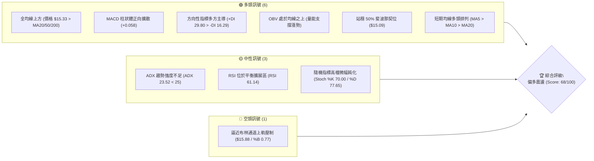
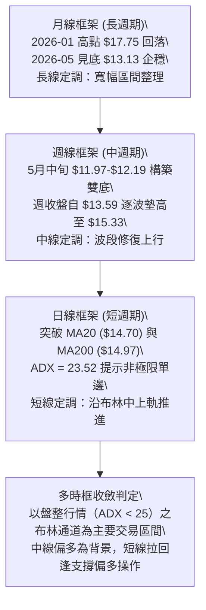
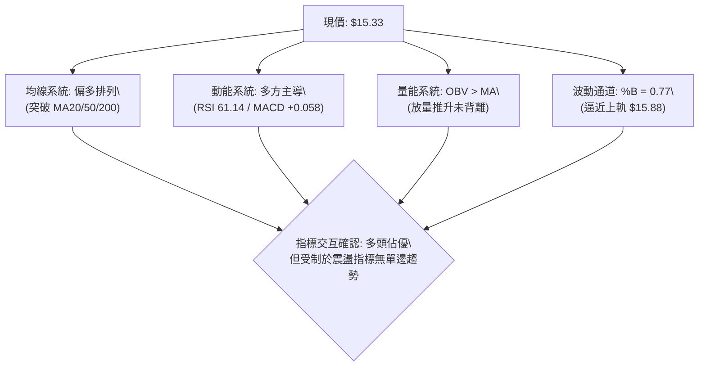
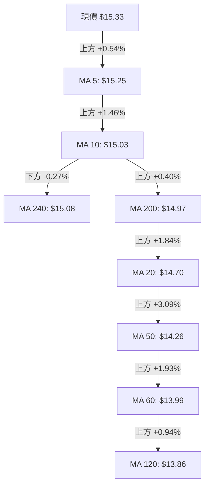
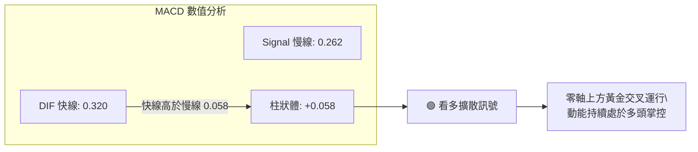
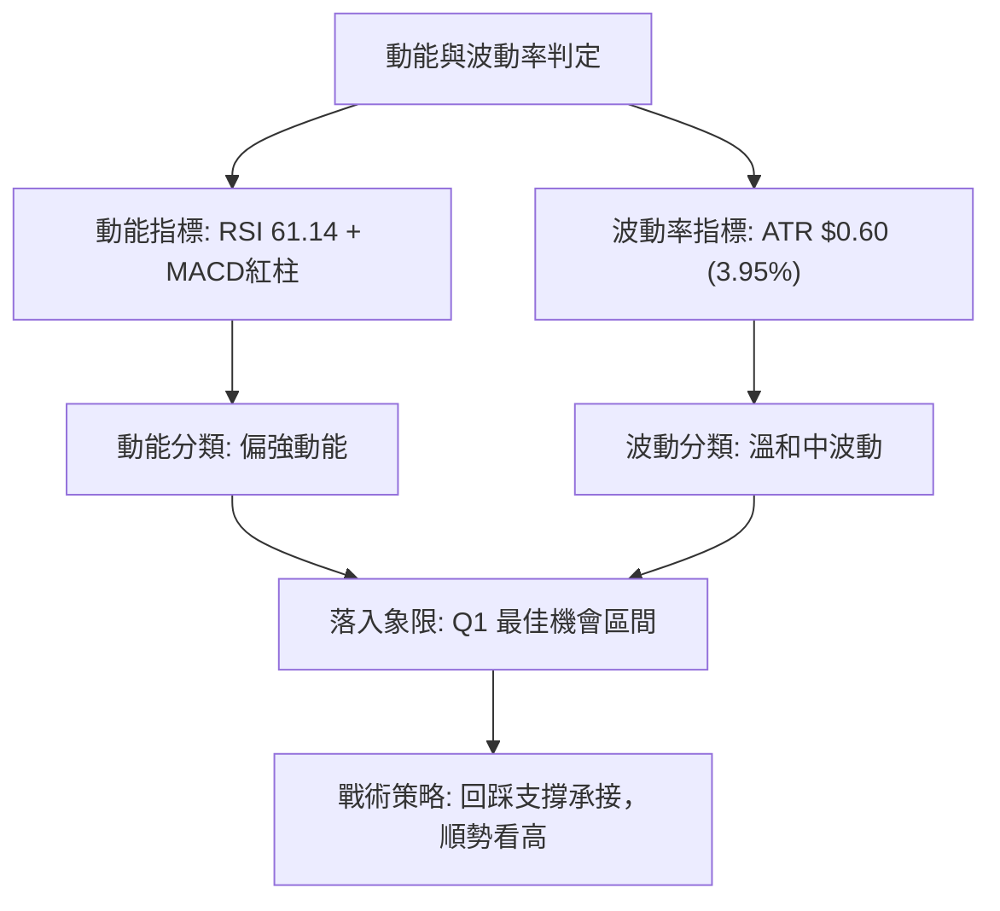
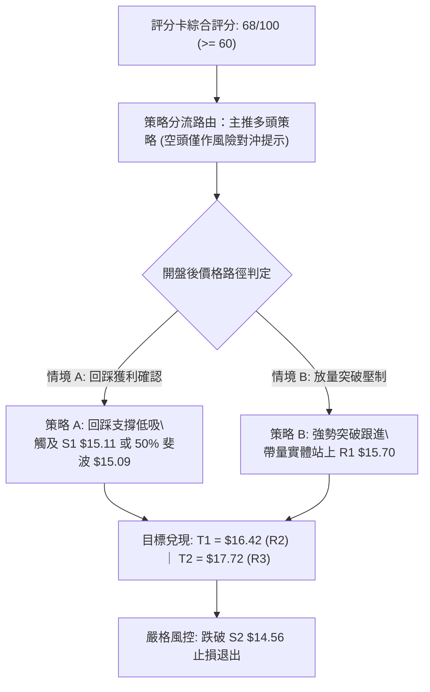
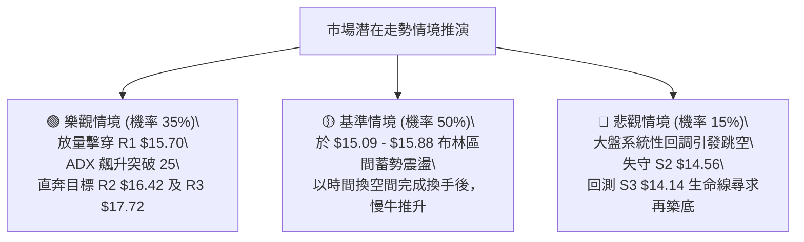

# NU 技術分析報告

> **報告日期**：2026-09-09 ｜ **語言**：繁體中文 ｜ **數據來源**：Yahoo Finance ｜ **當前價格**：$15.33

---

## 目錄

| 章節 | 內容 |
|------|------|
| [1. 技術面概覽](#1-技術面概覽) | 訊號儀表板、核心指標、評分卡 |
| [2. 趨勢分析](#2-趨勢分析) | 多時框趨勢、長中短期走勢 |
| [3. 圖表形態分析](#3-圖表形態分析) | 形態識別、K線組合、目標價 |
| [4. 支撐與阻力](#4-支撐與阻力) | 關鍵價位、斐波那契回調 |
| [5. 技術指標深度解讀](#5-技術指標深度解讀) | MA/RSI/MACD/布林/成交量 |
| [6. 動能與波動率](#6-動能與波動率) | 動能評估、ATR、Beta |
| [7. 多時框架總結](#7-多時框架總結) | 時框架評分矩陣 |
| [8. 交易策略建議](#8-交易策略建議) | 多空策略、風險報酬比 |
| [9. 風險提示與監控](#9-風險提示與監控) | 監控指標、風險場景 |

---

## 1. 技術面概覽

### 🎯 技術訊號儀表板



### 📊 核心指標速覽表

| 指標類別 | 指標名稱 | 當前數值 | 訊號 | 解讀 |
|----------|----------|----------|------|------|
| **價格** | 當前價格 | $15.33 | 🟢 | 突破所有日均線並站上 52 週中軸區間 (53.1%) |
| **均線** | MA20 | $14.70 | 🟢 | 現價高於 MA20 達 +4.32%，短天期多頭支撐扎實 |
| **均線** | MA50 | $14.26 | 🟢 | 現價高於 MA50 達 +7.50%，中期趨勢確立向上修復 |
| **均線** | MA200 | $14.97 | 🟢 | 現價突破長線生命線 MA200 (+2.40%)，轉化為實質下檔支撐 |
| **動能** | RSI(14) | 61.14 | 🟢 | 位於 50–70 強勢偏多區間，無頂背離跡象，上行動能充沛 |
| **動能** | MACD | 0.320 / 0.262 | 🟢 | DIF 線維持於 Signal 線上方，柱狀圖 +0.058 持續紅柱擴散 |
| **動能** | Stoch %K/%D | 70.00 / 77.65 | 🟡 | 進入次高檔震盪區，%D 略高於 %K，短線面臨微調但不致翻空 |
| **趨勢** | ADX(14) | 23.52 | 🟡 | 數值低於 25 閥值，定調為盤整偏多震盪，非單邊噴出趨勢 |
| **通道** | Bollinger Bands | $13.51 - $15.88 | 🟡 | %B 為 0.77，價格逼近通道上軌，短線波動區間受限 |
| **量能** | 20日成交量比 | 1.01x (75.33M) | 🟢 | OBV > MA，量能配合價格回升，未見價量背離消耗性噴出 |
| **波動** | ATR(14) | $0.60 | 🟡 | 日波動率為 3.95%，屬溫和中度震盪，適合區間拉回布局 |

### 🏆 技術評分卡

```
╔══════════════════════════════════════════════════════════════════╗
║                   技術評分卡 — NU (2026-09-09)                   ║
╠══════════════════════════════════════════════════════════════════╣
║ 趨勢強度 (Trend)     ██████████░░░░░░░░░░  52/100  🟡 中性 (ADX 23.52)   ║
║ 動能指標 (Momentum)  ██████████████░░░░░░  72/100  🟢 偏強 (MACD/RSI偏多)║
║ 支撐穩定度 (Support) ████████████████░░░░  78/100  🟢 堅固 (S1/S2重疊密集)║
║ 成交量配合 (Volume)  ████████████░░░░░░░░  64/100  🟢 良好 (OBV持續攀升) ║
║ 形態完整度 (Pattern) ██████████████░░░░░░  70/100  🟢 成型 (雙重底頸線突破)║
║ 均線排列 (Moving Avg)██████████████░░░░░░  72/100  🟢 偏多 (現價破各期均線)║
╠══════════════════════════════════════════════════════════════════╣
║ 綜合評分             █████████████░░░░░░░  68/100  🟢 偏多震盪格局       ║
╚══════════════════════════════════════════════════════════════════╝
```

---

## 2. 趨勢分析

### 🌐 多時框趨勢分析



### 📈 長期趨勢 — 12個月走勢圖（Unicode）

```
NU 月線收盤走勢圖（過去12個月：2025-09 至 2026-09）
價格軸 ($)
$18.00 ┤                             ● (2026-01: $17.75)
$17.00 ┤                     ● (17.39)      ● (16.74)
$16.00 ┤ ● (16.01) ● (16.11)
$15.00 ┤                                           ● (14.98)                  ● ($15.33 現價)
$14.00 ┤                                                  ● (14.37) ● (14.48)        ● (14.55)
$13.00 ┤                                                                ● (13.13)  ● (14.33)
$12.00 ┤                                                                      ● (13.36)
       └─┬─────────┬─────────┬─────────┬─────────┬─────────┬─────────┬─────────┬─────────┬─────────┬─────────┬─────────┬─────────►
        25-09     25-10     25-11     25-12     26-01     26-02     26-03     26-04     26-05     26-06     26-07     26-08     26-09
```

**走勢特徵分析表格**：

| 階段區間 | 起止月份 | 價格區間 | 累計漲跌幅 | 結構性技術特徵 |
|----------|----------|----------|------------|----------------|
| **長線衝頂段** | 2025-09 → 2026-01 | $16.01 → $17.75 | +10.87% | 沿上升軌道推升，2026年1月創波段收盤極值 $17.75 (盤中52W高點 $18.98) |
| **深幅回撤段** | 2026-01 → 2026-05 | $17.75 → $13.13 | -26.03% | 連續4個月黑K回調，跌破長期支撐，回吐前半年全數漲幅，釋放機構獲利盤 |
| **低位築底段** | 2026-05 → 2026-06 | $13.13 → $13.36 | +1.75% | 週線盤中下探 52W 低點 $11.20 (週收盤 $11.97)，月線收斂形成扎實低檔換手換籌 |
| **穩健復甦段** | 2026-06 → 2026-09 | $13.36 → $15.33 | +14.75% | 連續3個月陽線回升，逐次收復 MA50 ($14.26) 與 MA200 ($14.97)，完成底部型態 |

### 📊 中期趨勢（週線分析）

從近 20 週收盤路徑分析，NU 於 2026-05-17 創下收盤低點 $12.19 (週 RSI 落入 20.8 極度超賣)，隨後在 2026-06-07 再次下插至 $11.97，構築了標準的「W 底（雙底）」結構。

```
週線關鍵壓力與支撐階梯架構示意圖：
[R3: $17.72] ════════════════════════════════════════════════════════ (近一年頂部密集成交區間)
       ▲
[R2: $16.42] ──────────────────────────────────────────────────────── (前波反彈高點聚類與頸線阻力)
       ▲
[R1: $15.70] -------------------------------------------------------- (日線布林上軌 $15.88 前緣阻力位)
       ▲
[現價: $15.33]  ◄─────── 現正運行於 50.0% 斐波位 ($15.09) 上方之強勢震盪區間
       ▼
[S1: $15.11] -------------------------------------------------------- (前波阻力轉化之支撐 / 50% 回調位 $15.09)
       ▼
[S2: $14.56] ──────────────────────────────────────────────────────── (MA20 $14.70 與近週回踩低點重疊)
       ▼
[S3: $14.14] ════════════════════════════════════════════════════════ (MA50 $14.26 / 61.8% 斐波回調位 $14.17 核心防線)
```

### ⚡ 趨勢強度評估（ADX 解讀）

```mermaid
graph TD
    A["ADX(14) 讀數: 23.52"] --> B{"ADX 門檻判定\\n臨界值 = 25.0"}
    B -->|"< 25| C["定調：弱趨勢 / 箱體震盪格局"]
    B -->|">= 25"| D["定調：單邊強趨勢行情 (不成立)"]
    C --> E["方向性指標解讀\\n+DI = 29.80\\n-DI = 16.29"]
    E --> F["+DI 遠大於 -DI：多頭力量占據絕對優勢"]
    F --> G["操作方針：不宜追高爆量單邊單\\n採區間震盪偏多策略 (下軌與支撐處低吸)"]
```

**ADX 趨勢強度對照表**：

| ADX 區間 | 趨勢狀態 | 當前數值 (23.52) 歸屬 | 戰術指引 |
|----------|----------|----------------------|----------|
| 0 – 20 | 無趨勢 / 極度沉寂 | 否 | 觀望，等待動能積累 |
| **20 – 25** | **弱趨勢 / 盤整醞釀期** | **★ 當前歸屬 (23.52)** | **以布林通道與關鍵點位做高出低進，偏多操作** |
| 25 – 40 | 強趨勢形成 | 否 | 順勢追隨突破，拉回不破均線加碼 |
| 40 – 60 | 極強單邊行情 | 否 | 緊密移動停利，提防動能衰竭 |

---

## 3. 圖表形態分析

### 🔍 形態識別系統


**形態信心度與目標價評估表**：

| 形態類別 | 信心度 | 判斷依據（引用數據） | 完成度 | 目標價（附計算式） |
|----------|--------|----------------------|--------|--------------------|
| **雙重底 (W底)** | **85%** | 兩次低點分別落於週收盤 $12.19 與 $11.97（接近支撐 S3 $14.14 下方之波段超跌區），且 6月起週 MACD 柱翻紅 | 100% (已突破) | 由雙底高度推算：<br>頸線 $14.14 (S3) + 形態高度 ($14.14 - $11.97 = $2.17) = **$16.31** (逼近 R2: $16.42) |
| **均線黃金交叉修復** | **75%** | MA5 ($15.25) > MA10 ($15.03) > MA20 ($14.70)，且收盤價站上 MA200 ($14.97) | 90% | 由均線收斂開口推算：上攻挑戰波段聚類阻力 **R1: $15.70** 與 **R2: $16.42** |
| **頭肩底形態** | 35% | 左肩 $12.19、頭部 $11.97、右肩過短（$12.71 迅速拉起），結構不對稱 | 30% | *訊號不足，信心度 < 50%，不採納為幾何形態目標計算* |

### 🕯️ 重要K線形態分析

| 月份/週次 | 收盤價 | K線形態 | 解讀 | 訊號 |
|-----------|--------|---------|------|------|
| **2026-05** | $13.13 | 長下影錘子線 | 月線測試 $11.20 52W 低點後強烈反抽，空頭動能衰竭 | 🟢 底部信號 |
| **2026-06-07 (週)**| $11.97 | 假跌破倒錘頭 | 放量 473.46M 爆出近期天量，探底回升，主力吸籌洗盤特徵 | 🟢 流動性清洗 |
| **2026-07-19 (週)**| $13.59 | 換手十字星 | 爆出 762.06M 極限換手量，回測 MA20 獲得強力承接 | 🟢 籌碼換手成功 |
| **2026-08-16 (週)**| $15.23 | 中陽突破線 | 帶量長紅實體一口氣吞沒前 3 週陰線，奠定站上 $15.00 基礎 | 🟢 強勢買盤 |
| **2026-09-13 (當前)**| $15.33 | 窄幅整理陽十字 | 於 50% 斐波位 $15.09 上方整固，蓄勢消化上方 R1 $15.70 賣壓 | 🟡 蓄勢待發 |

### 📉 ASCII 走勢形態示意圖

```
                    NU 雙重底完成與上升通道推進圖
價格 ($)
$16.42 ┤                                                 [目標 R2: $16.42]
$15.70 ┤                                            /──── [阻力 R1: $15.70]
$15.33 ┤                                      ●────/ ◄── [現價 $15.33]
$15.09 ┤                                ╭────/            [50% 斐波位 / S1: $15.11]
$14.56 ┤                          /────╯                  [支撐 S2: $14.56]
$14.14 ┤             ╭─────●─────╯                        [頸線突破口 / S3: $14.14]
$13.00 ┤            /     (頸線 $14.14)
$12.19 ┤     ●─────╯            \
$11.97 ┤   (底1: $12.19)         ● (底2: $11.97)
       └────────────────────────────────────────────────────────► 時間軸
          2026-05               2026-06               2026-09
```

### 🎯 形態目標價計算

根據雙底（W-Bottom）量度漲幅測算模型：
1. **底部極值**：取二次探底波段低點收盤 $11.97。
2. **形態頸線**：取波段聚合支撐阻力換手位 $14.14（即 S3 關鍵聚類價位）。
3. **形態縱深高度**：
   $$\text{高度 } H = \text{頸線} - \text{底部} = \$14.14 - \$11.97 = \$2.17$$
4. **理論滿足點**：
   $$\text{目標價 } T = \text{頸線} + H = \$14.14 + \$2.17 = \$16.31$$
   *該理論目標價 $16.31 與數據庫給出之阻力位 **R2: $16.42** 僅差 $0.11（誤差 0.67%），高度相互印證。*

---

## 4. 支撐與阻力

### 🗺️ 關鍵價位分布圖（Unicode）

```
╔══════════════════════════════════════════════════════════════════╗
║                    NU 價位結構分布圖                             ║
╠══════════════════════════════════════════════════════════════════╣
║ $17.72 ║██████████████████████████████║ 強阻力 R3 (年內次高點聚類)║
║ $17.14 ║████████████████████          ║ 23.6% 斐波那契壓力位     ║
║ $16.42 ║████████████████████████      ║ 阻力 R2 (波段目標聚類)   ║
║ $16.01 ║████████████████              ║ 38.2% 斐波那契壓力位     ║
║ $15.88 ║██████████████████████        ║ 布林通道上軌壓制線       ║
║ $15.70 ║████████████████████████      ║ 關鍵阻力 R1 (近期前高)   ║
║────────╫──────────────────────────────╫──────────────────────────╢
║ $15.33 ╠══════════════════════════════╣ ◄ 現價 (市價位置)        ║
║────────╫──────────────────────────────╫──────────────────────────╢
║ $15.11 ║▓▓▓▓▓▓▓▓▓▓▓▓▓▓▓▓▓▓▓▓▓▓        ║ 近期支撐 S1 (短波段低點) ║
║ $15.09 ║▓▓▓▓▓▓▓▓▓▓▓▓▓▓▓▓▓▓▓▓          ║ 50.0% 斐波那契樞軸點     ║
║ $14.70 ║▓▓▓▓▓▓▓▓▓▓▓▓▓▓▓▓▓▓            ║ MA20 日均線 / 布林中軌   ║
║ $14.56 ║████████████████████████      ║ 強支撐 S2 (波段回踩密集成交)║
║ $14.17 ║██████████████████            ║ 61.8% 斐波那契黃金分割位 ║
║ $14.14 ║██████████████████████████████║ 核心支撐 S3 (雙底頸線基石)║
╚══════════════════════════════════════════════════════════════════╝
```

### 🚧 阻力位分析表

*(數值嚴格引用自關鍵價位與斐波那契數據庫)*

| 阻力級別 | 價位 | 距現價幅幅 | 形成原因 | 突破難度 | 重要性 |
|----------|------|------------|----------|----------|--------|
| **R1** | **$15.70** | +2.38% | 近一年波段高點聚類位，逼近布林通道上軌 ($15.88) | 中等 | 🟡 短線多空分水嶺 |
| **R2** | **$16.42** | +7.13% | 形態量度對稱滿足位與 2025年Q4 密集成交區底端 | 偏高 | 🔴 中期獲利盤了結區 |
| **R3** | **$17.72** | +15.56% | 2026年1月歷史次高收盤聚類位，強大套牢賣壓池 | 極高 | 🔴 長期週期強頂部 |

### 🛡️ 支撐位分析表

*(數值嚴格引用自關鍵價位與斐波那契數據庫)*

| 支撐級別 | 價位 | 距現價幅幅 | 形成原因 | 守住機率 | 重要性 |
|----------|------|------------|----------|----------|--------|
| **S1** | **$15.11** | -1.47% | 近期回檔低點聚類，且與 50% 斐波位 ($15.09) 緊密貼合 | 75% | 🟢 短線防守第一道鎖 |
| **S2** | **$14.56** | -5.02% | 8月下旬兩次下探確認低點，且獲上升 MA20 ($14.70) 掩護 | 85% | 🟢 波段多單核心防線 |
| **S3** | **$14.14** | -7.76% | 雙底頸線聚類核心，與 61.8% 斐波位 ($14.17) 及 MA50 ($14.26) 共振 | 92% | 🟢 多頭生命線底限 |

### 📐 斐波那契回調位分析

依據 52 週區間高點 **$18.98** 至低點 **$11.20** 進行斐波那契回撤分析（回撤區間全幅 $7.78）：

- **0.0% (52W High)**: $18.98
- **23.6%**: $17.14
- **38.2%**: $16.01
- **50.0%**: $15.09
- **61.8%**: $14.17
- **78.6%**: $12.86
- **100.0% (52W Low)**: $11.20

**當前斐波那契結構解讀**：
當前價格 **$15.33** 處於 **50.0% ($15.09)** 與 **38.2% ($16.01)** 回調位之間，高出 50.0% 樞軸點 +1.59%。在道氏與斐波理論中，突破 50% 水平是「弱勢反彈」轉化為「新一輪上升推動浪」的關鍵門檻。只要價格穩守 $15.09 之上，回調即屬強勢整理，向上挑戰 38.2% ($16.01) 及 R1 ($15.70) 之機率大幅提升。

---

## 5. 技術指標深度解讀

### 🎛️ 指標訊號總覽



### 📈 移動平均線排列分析



**均線狀態矩陣解讀**：
當前短期均線（MA5: $15.25 > MA10: $15.03 > MA20: $14.70）呈現標準多頭發散形態；雖然系統整體因 MA240 ($15.08) 與 MA200 ($14.97) 剛被收復而呈現「混合排列」，但關鍵在於**現價 $15.33 同時站上 MA20、MA50 與 MA200 三大生命線**。長天期 MA200 扣抵區開始下移，提供強大基底托力。

### 📉 RSI(14) 分析

```
RSI(14) 水平指示條：
0 ──────────── 30 ─────────────────── 50 ───────●───────── 70 ──────────── 100
超賣區          弱勢區                 強勢平衡  61.14      超買區
[▓▓▓▓▓▓▓▓▓▓▓▓▓▓▓▓▓▓▓▓▓▓▓▓▓▓▓▓▓▓▓▓▓▓▓▓▓▓▓▓▓▓▓▓▓▓░░░░░░░░░░░░░░░] 61.14%
```

- **超買超賣判定**：數值為 **61.14**，穩居 50 多空分水嶺之上，且尚未觸及 70 門檻，顯示市場多頭買盤具有持續性，未發生鈍化過熱。
- **背離分析判斷**：
  - 前次回調高點（2026-08-16）週收盤 $15.23 對應週 RSI 58.0。
  - 當前收盤 $15.33 對應 RSI 61.14。
  - **明確結論**：價格創新高，RSI 指標同步走高，**無頂背離（Bearish Divergence）現象**，亦無底背離，趨勢驗證度高。

### 📊 MACD(12/26/9) 訊號解讀



- **柱狀圖動態**：MACD Histogram 為 **+0.058**，呈現連兩週正向紅柱微幅擴散，反映多方動能平滑回升。
- **背離校驗**：MACD 線自底部持續拉升，與價格自 $13.13 向上反彈的路徑高度吻合，指標與價格動能同向健康。

### 📦 布林通道分析

```
NU 布林通道位置示意圖
$15.88 ┤ ═════════════════════════════════════  BB 上軌 ($15.88)
       │                               ▲
$15.33 ┤ -------------------●--------- │  現價 ($15.33, %B = 0.77)
       │                    ▲          │
$14.70 ┤ ───────────────────┼───────── ▼  BB 中軌 (MA20: $14.70)
       │                    │
$13.51 ┤ ═══════════════════╧═════════════════  BB 下軌 ($13.51)
```

- **通道帶寬**：Bandwidth = ($15.88 - $13.51) / $14.70 = 16.12%，處於中等收斂後的發散初期。
- **%B 指標**：數值為 **0.77**（高於 0.5 中軌，接近 1.0 上軌），代表走勢偏向多頭強勢區，但當前已進入上軌阻力作用區間（距上軌 $15.88 僅剩 3.58% 緩衝空間），短期追高盈虧比受限。

### 💹 成交量分析（量價配合度）

- **量比檢視**：最新單日成交量為 **75,338,000** 股，相較 20 日均量 **74,911,990** 股，量比為 **1.01x**，維持良性等量換手。
- **中期量價配合**：回顧 7 月中旬下探回升時曾爆出單週 762.06M 與 675.13M 歷史巨量，確認為大機構主力建倉進場點；近期推升至 $15.33 過程中成交量穩定在 3 億至 4 億股區間，展現「量縮整理、放量過頂」之健康多頭節奏。
- **OBV 能量潮判斷**：數據明確標示「**OBV > MA → 量能支撐上漲**」，確認資金持續呈現淨流入態勢，未出現量價頂背離。

---

## 6. 動能與波動率

### ⚡ 動能評估四象限

| 象限標籤 | 動能狀態 | 波動狀態 | 當前標的狀態 | 戰略意涵 |
|----------|----------|----------|--------------|----------|
| **Q1 (最佳機會)** | 強動能 (RSI>60) | 低/中波動 (ATR% 3.95%) | **★ 本標的歸屬** | **健康上漲趨勢，拉回風險可控，勝率最佳** |
| **Q2 (謹慎觀望)** | 弱動能 (RSI<50) | 低波動 (ATR% <3%) | 否 | 盤整無方向，資金效率低 |
| **Q3 (極限追擊)** | 強動能 (RSI>70) | 高波動 (ATR% >6%) | 否 | 行情過熱，滑價與反噬風險極高 |
| **Q4 (避免進場)** | 弱動能 (RSI<40) | 高波動 (ATR% >6%) | 否 | 崩跌擴散段，左側摸底極度危險 |



### 📊 ATR 波動率分析

- **當前 ATR(14)**：**$0.60**（佔現價比率為 **3.95%**）。
- **日內波動意涵**：單日合理正常波動範圍為 $\pm \$0.60$。
- **停損空間設置建議**：
  - *短期積極型交易者*：建議給予 $1.0 \times \text{ATR} = \$0.60$ 之緩衝空間。
  - *波段穩健型交易者*：建議給予 $1.5 \times \text{ATR} = \$0.90$ 至 $2.0 \times \text{ATR} = \$1.20$ 之容錯防護空間，避免被日內假突破洗出場。

### 📐 Beta 與市場相關性

- **Beta 係數**：**0.94**。
- **解讀**：NU 與標普 500 / 美股整體大盤之連動性極高（近乎 1:1），其系統性風險適中，不會產生非理性的超額劇烈波動。此特性非常適合運用均線通道及支撐阻力聚類進行經典技術分析，信號失真度相對較低。

---

## 7. 多時框架總結

### 📋 時框架評分表

| 時框架 | 趨勢方向 | 動能 | 均線排列 | 形態 | 綜合評分 | 操作建議 |
|--------|----------|------|----------|------|----------|----------|
| **長線 (月線)** | 🟡 寬幅箱體 | 中性平衡 (52W位53.1%) | 承壓後重返 MA240 | 自 $17.75 回落後低檔企穩 | 60/100 | 長期投資者底倉續抱 |
| **中線 (週線)** | 🟢 震盪反彈 | 偏多蓄勢 (RSI 56-61) | 突破中天期均線 | 雙重底頸線突破完成 | 75/100 | 波段持有，順勢拉回加碼 |
| **短線 (日線)** | 🟢 沿軌推升 | 強勢偏多 (MACD擴散) | MA5/10/20 多頭排列 | 逼近布林通道上軌 | 68/100 | 不宜追高，待回踩 S1 布局 |

### 🔲 綜合訊號矩陣

```
時框維度        趨勢指標 (MA/ADX)       動能指標 (MACD/RSI)     量價指標 (OBV/Volume)   最終維度合力
─────────────────────────────────────────────────────────────────────────────────────────────
短期 (日線)     🟢 多頭 (站上MA20/200)   🟢 強勁 (RSI 61.14)     🟢 協同 (OBV > MA)      🟢 偏多主導
中期 (週線)     🟢 修復 (站上MA50)       🟢 轉多 (MACD柱連續轉正) 🟢 放量換手有效        🟢 多方波段
長期 (月線)     🟡 震盪 (ADX 23.52)      🟡 中性 (守穩50%斐波)   🟡 等量維穩            🟡 箱體整固
─────────────────────────────────────────────────────────────────────────────────────────────
合力校驗結論：無時框矛盾對立，短中期共振向上，受長期箱體頂部壓制，定調「偏多區間震盪推升」。
```

### ⚖️ 多時框收斂結論

> **依嚴格收斂規則判定**：
> 當前 ADX(14) = **23.52 < 25**，市場技術狀態**明確屬於「盤整偏多行情」**，而非單邊趨勢行情。
> 根據多時框收斂規範：
> 1. 日線布林通道（$13.51 - $15.88）與關鍵阻力支撐位為主要交易依據。
> 2. 週線級別雙底成型與突破站穩 MA200 ($14.97) 提供了中線多頭保護傘。
> 3. **唯一收斂結論：【偏多區間操作】**。堅決不追高突破單，策略完全錨定「回踩關鍵支撐（S1/S2）低吸，逼近阻力位（R1/R2/布林上軌）分批停利」。此結論與第 8 章主策略完全一致。

---

## 8. 交易策略建議

### 🗺️ 策略決策流程圖



### 🧭 策略路由

**當前主策略方向 = 主推多頭策略（依綜合評分 68/100，處於 ≥60 偏多區間）**

### 🎯 價格情境階梯（Price Scenarios）

*(價位完全引用第 4 章關鍵價位聚類數據)*

| 觸發條件 | 第一目標 | 後續延伸 | 情境含義 | 操作戰術 |
|----------|----------|----------|----------|----------|
| **突破 R1 $15.70** | **R2 $16.42** | **R3 $17.72** | 突破布林上軌束縛，雙底量度幅度展開 | 加碼順勢追擊，目標看至 R2 |
| **站穩現價區間 ($15.09–$15.33)** | **R1 $15.70** | **R2 $16.42** | 於 50% 斐波位上方健康蓄勢消化賣壓 | 逢低分批建倉，享受波段溢價 |
| **跌破 S1 $15.11** | **S2 $14.56** | **S3 $14.14** | 短線多頭防線失守，回探 MA20 尋求支撐 | 暫停買入，於 S2 觀察止跌訊號 |

### 📊 情境機率分佈

| 情境劇本 | 發生機率 | 主要技術依據 |
|----------|----------|--------------|
| **震盪向上 / 測試阻力** | **60%** | MACD 柱正向放大 (+0.058)、現價全均線之上、OBV > MA 量能支持 |
| **箱體區間震盪** | **30%** | ADX 僅 23.52 (<25 缺乏單邊動能)、布林通道帶寬約束 (%B = 0.77) |
| **回踩深幅破位** | **10%** | 下方 S1 ($15.11)、S2 ($14.56)、S3 ($14.14) 均線與籌碼護城河極為密集 |

### 🟢 主策略詳情

*(所有進場、出場點位嚴格對應第 4 章之關鍵價位聚類)*

| 策略要素 | 策略 A：回踩核心支撐低吸（首選） | 策略 B：突破關鍵阻力順勢加碼（次選） |
|----------|----------------------------------|--------------------------------------|
| **進場條件** | 盤中拉回回踩 S1 與 50% 斐波位不破 | 帶量長紅日K實體突破收盤站穩 R1 |
| **進場價格** | **$15.11** (S1 支撐位) | **$15.70** (突破 R1 阻力位) |
| **目標價 T1** | **$16.42** (R2 形態量度目標) | **$16.42** (R2 波段阻力) |
| **目標價 T2** | **$17.72** (R3 年內高點阻力) | **$17.72** (R3 年內高點阻力) |
| **止損價格** | **$14.56** (跌破 S2 強支撐離場) | **$15.11** (跌回 S1 / 假突破止損) |
| **風險空間** | $\$15.11 - \$14.56 = \$0.55$ | $\$15.70 - \$15.11 = \$0.59$ |
| **報酬空間(T1)**| $\$16.42 - \$15.11 = \$1.31$ | $\$16.42 - \$15.70 = \$0.72$ |
| **風險報酬比 (R:R)**| **1 : 2.38** (極佳) | **1 : 1.22** (及格，需靠 T2 擴大) |
| **成功機率估計** | **65%** | **55%** |
| **建議倉位** | **15% - 20%** 總資金 | **10%** 總資金 |

### 🔴 反向風險觸發點（對沖提示）

若發生突發系統性風險，以下節點為多頭架構破壞警訊，供多單風控止損與避險對沖參考：
1. **警訊一（短線轉弱）**：日K收盤跌破 **S1 $15.11**，代表回踩 50% 斐波那契失效，短線多單應減倉 50%。
2. **警訊二（多頭全面潰敗）**：價格帶量跌破 **S2 $14.56** 及 MA50 **$14.26**，則雙底形態徹底失效，必須全數停損出場，多頭策略作廢。

### ⭐ 整體訊號強度評星

```
╔══════════════════════════════════════════════════════════════════╗
║ 做多訊號強度：  ★★★★☆  (4/5 星 - 形態突破均線收復，勝率可期)  ║
║ 做空訊號強度：  ★☆☆☆☆  (1/5 星 - 逆勢做空盈虧比極度不佳)    ║
║ 整體技術可信度：★★★★☆  (4/5 星 - 指標量價無矛盾，收斂一致)    ║
╚══════════════════════════════════════════════════════════════════╝
```

---

## 9. 風險提示與監控

### ✅ 關鍵監控指標 Checklist

```
╔══════════════════════════════════════════════════════════════════╗
║                   NU 技術面核心監控清單 (Checklist)              ║
╠══════════════════════════════════════════════════════════════════╣
║ [ ] 價位防禦線：日線收盤價是否持續站穩 S1 $15.11 及 50% 斐波 $15.09║
║ [ ] 阻力突破度：觀察盤中測試 R1 $15.70 時之量能是否超越 20日均量 ║
║ [ ] 均線動態支撐：MA20 ($14.70) 是否持續上揚墊高提供保護         ║
║ [ ] 動能背離監控：RSI 若衝破 70，觀察是否出現「價漲指標縮」之背離║
║ [ ] 趨勢動態轉化：關注 ADX(14) 能否放量跨越 25.0 轉為強趨勢行情 ║
║ [ ] 籌碼能量指標：每日 OBV 是否維持於自身均線之上運行            ║
╚══════════════════════════════════════════════════════════════════╝
```

### ⚠️ 風險場景分析



### 🛡️ 風險管理重要提醒

1. **ATR 動態止損紀律**：目前 ATR 為 $0.60，入場後底線止損距離不可低於 $0.60，策略 A 所設止損 $14.56 距現價空間為 $0.77（約 1.28 倍 ATR），能有效規避正常的市場日內隨機噪音。
2. **區間震盪忌諱盲目追高**：ADX(14) 數值 23.52 明確警示當前非單邊瘋狂行情，當價格接近布林上軌 $15.88 或 R1 $15.70 時切忌大舉加碼，容易遭受均值回歸的短套風險。
3. **倉位配置比例**：建議單一標的暴露風險（止損金額）控制在總交易帳戶資金的 1.0% – 1.5% 以內。以每股承擔 $0.55 風險計算，若帳戶規模為 10 萬美元，單筆最大風險限額 1,000 美元，則最大持股上限為 1,800 股（約 27,000 美元市值，倉位上限約 27%）。

---

## 📋 報告總結

```
╔══════════════════════════════════════════════════════════════════╗
║                   NU 技術分析報告總結                            ║
╠══════════════════════════════════════════════════════════════════╣
║ 報告日期：2026-09-09                                            ║
║ 當前價格：$15.33                                                 ║
║ 分析評級：🟢 偏多震盪 (Score: 68/100) — 蓄勢挑戰上軌阻力         ║
║                                                                  ║
║ 關鍵技術維度結論：                                               ║
║ ├─ 長期趨勢：🟡 寬幅箱體修復，底部逐步墊高，擺脫單邊深幅回撤     ║
║ ├─ 中期趨勢：🟢 週線「雙重底」構築完畢，頸線已向上突破確認       ║
║ ├─ 短期趨勢：🟢 站上全部日均線 (MA20/50/200)，動能指標全面看多   ║
║ ├─ 關鍵支撐：S1: $15.11  ｜ S2: $14.56  ｜ S3: $14.14           ║
║ ├─ 關鍵阻力：R1: $15.70  ｜ R2: $16.42  ｜ R3: $17.72           ║
║ └─ 分析師共識目標：$18.87 (華爾街 22 位分析師綜合目標)           ║
║                                                                  ║
║ 最優交易執行策略：                                               ║
║ 1. 🥇 最佳機會（回踩低吸）：回調至 S1 $15.11 介入，止損 $14.56，   ║
║      目標 T1 $16.42 / T2 $17.72，風險報酬比 1:2.38              ║
║ 2. 🥈 次選機會（突破跟進）：實體陽線站上 R1 $15.70 追入，止損    ║
║      $15.11，目標 $16.42                                         ║
║ 3. 🥉 保守選擇（右側確認）：等待日線回踩確認 MA20 ($14.70) 止跌再行║
║      布局，勝率最高但需耐心等待機會                              ║
╚══════════════════════════════════════════════════════════════════╝
```

---

> ⚠️ **免責聲明**：本報告為依據客觀量化技術指標與價格行為模型生成之專業研究報告，所有數據及點位均嚴格取自歷史公開行情資訊。本報告**僅供學術研究與投資策略討論參考**，**不構成個人化投資建議或買賣要約**。金融市場存在高度波動風險，投資人應依個人風險承受力獨立決策並自負盈虧。

---

*報告生成時間：2026-09-09 ｜ 數據來源：Yahoo Finance ｜ 分析框架：多時框技術分析體系*