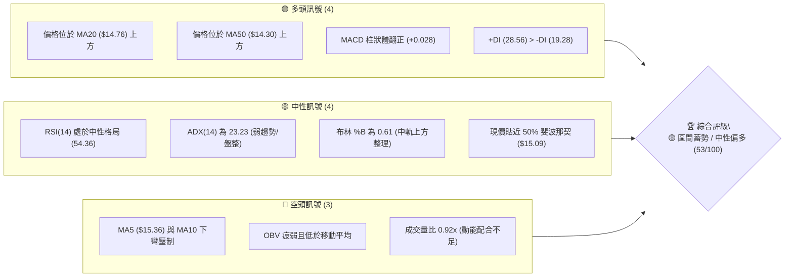
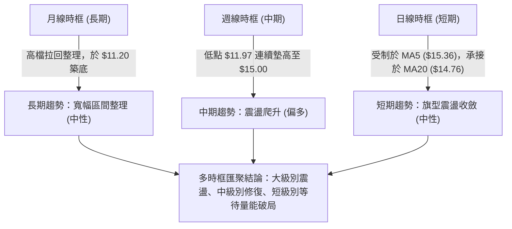
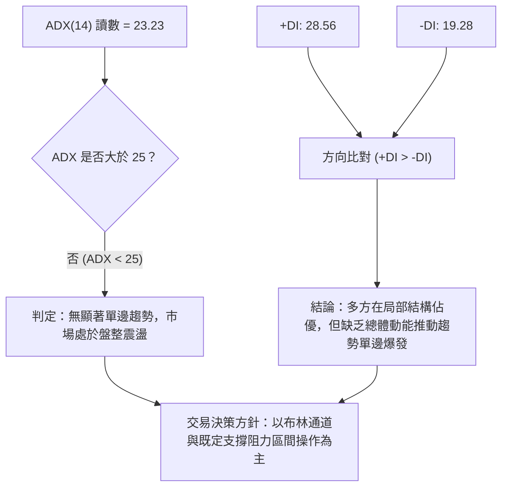
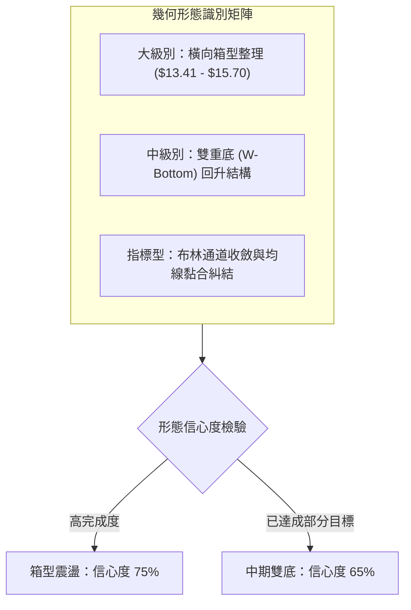
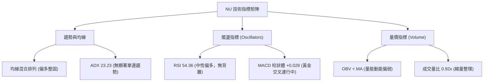
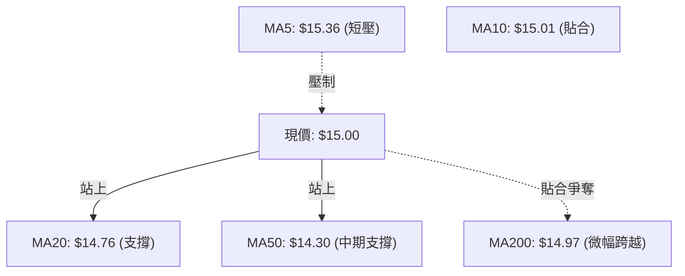
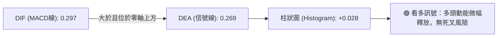
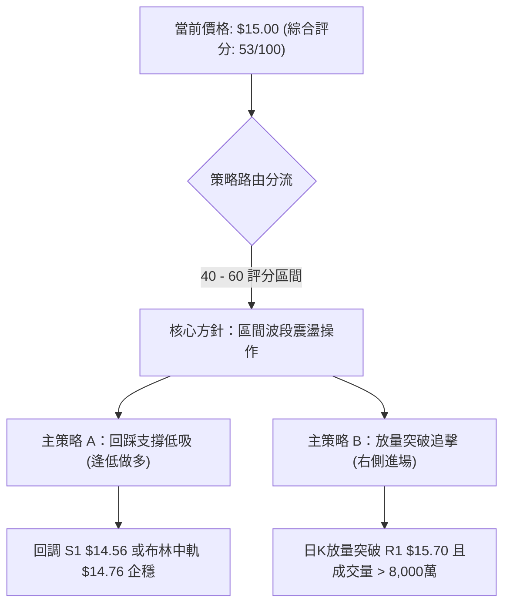
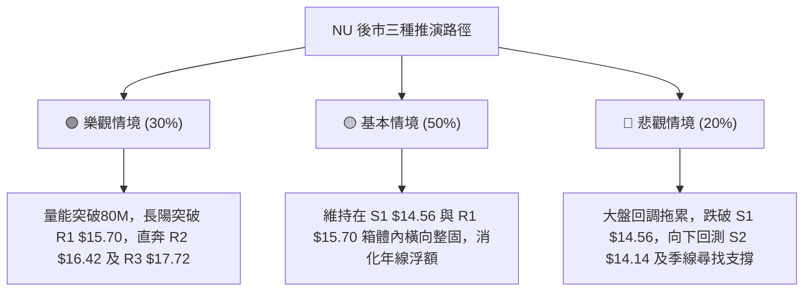

# NU 技術分析報告

> **報告日期**：2026-09-10 ｜ **語言**：繁體中文 ｜ **數據來源**：Yahoo Finance ｜ **當前價格**：$15.00

---

## 目錄

| 章節 | 內容 |
|------|------|
| [1. 技術面概覽](#1-技術面概覽) | 訊號儀表板、核心指標、評分卡 |
| [2. 趨勢分析](#2-趨勢分析) | 多時框趨勢、長中短期走勢、12個月走勢圖 |
| [3. 圖表形態分析](#3-圖表形態分析) | 形態識別、信心度評估、K線組合與目標價 |
| [4. 支撐與阻力](#4-支撐與阻力) | 關鍵價位結構、波段高低點、斐波那契回調 |
| [5. 技術指標深度解讀](#5-技術指標深度解讀) | 均線系統、RSI、MACD、布林通道與 OBV 量能 |
| [6. 動能與波動率](#6-動能與波動率) | 動能四象限、ATR 止損測算、Beta 係數 |
| [7. 多時框架總結](#7-多時框架總結) | 時框架評分表、訊號矩陣、收斂結論 |
| [8. 交易策略建議](#8-交易策略建議) | 策略路由、情境階梯、進出場與風控參數 |
| [9. 風險提示與監控](#9-風險提示與監控) | 監控指標清單、情境模擬與倉位管理 |
| [10. 報告總結](#10-報告總結) | 總結儀表板與執行結論 |

---

## 1. 技術面概覽

### 🎯 技術訊號儀表板



---

### 📊 核心指標速覽表

| 指標類別 | 指標名稱 | 當前數值 | 訊號 | 解讀 |
|:---|:---|:---|:---:|:---|
| **價格** | 當前收盤價 | $15.00 | 🟡 | 位於52週區間中樞 (48.8%)，逼近整數大關 |
| **均線** | MA20 (月線) | $14.76 | 🟢 | 價格在均線上方 +1.61%，短期支撐確立 |
| **均線** | MA50 (季線) | $14.30 | 🟢 | 價格在均線上方 +4.90%，中期底部墊高 |
| **均線** | MA200 (年線) | $14.97 | 🟢 | 現價微幅重返年線上方 (+0.20%)，多空分水嶺 |
| **均線** | MA5 / MA10 | $15.36 / $15.01 | 🔴 | 極短線承壓，MA5 下彎形成短線動能阻制 |
| **動能** | RSI(14) | 54.36 | 🟡 | 處於 50–60 健康常態區間，無超買超賣背離 |
| **動能** | MACD (12,26,9) | 0.297 / 0.269 | 🟢 | 雙線位於零軸上方且柱狀圖維持紅柱 (+0.028) |
| **趨勢** | ADX (14) | 23.23 | 🟡 | 數值低於 25，顯示當前處於弱趨勢或區間盤整 |
| **波動** | ATR (14) | $0.58 | 🟡 | 波動率 3.84%，屬於標準可控震盪幅度 |
| **量能** | 當日量 / 20日均量 | 68.3M / 74.4M | 🔴 | 量比 0.92x，OBV 低於均線，量能未全面放大 |

---

### 🏆 技術評分卡

```
╔══════════════════════════════════════════════════════════════════╗
║                   技術評分卡 — NU (2026-09-10)                   ║
╠══════════════════════════════════════════════════════════════════╣
║ 趨勢強度 (ADX/方向)   ██████████░░░░░░░░░░  48/100  🟡 弱趨勢/盤整║
║ 動能指標 (RSI/MACD)  ████████████░░░░░░░░  58/100  🟢 動能微幅偏多║
║ 支撐穩定度 (S1/S2/MA)█████████████░░░░░░░  65/100  🟢 下檔承接扎實║
║ 成交量配合 (Volume)  ████████░░░░░░░░░░░░  42/100  🔴 量能未能有效放大║
║ 形態完整度 (結構)    ██████████░░░░░░░░░░  52/100  🟡 箱型反彈構築中║
║ 均線排列 (MA System) ███████████░░░░░░░░░  55/100  🟡 混合交織排列 ║
╠══════════════════════════════════════════════════════════════════╣
║ 綜合技術評分         ███████████░░░░░░░░░  53/100  🟡 區間震盪蓄勢║
╚══════════════════════════════════════════════════════════════════╝
```

---

## 2. 趨勢分析

### 🌐 多時框趨勢分析



---

### 📈 長期趨勢 — 12個月走勢圖（Unicode）

以下展示自 2025 年 10 月至 2026 年 9 月之月線歷史收盤走勢：

```
NU 月線走勢圖（過去12個月收盤價變動）
價格軸 ($)
$18.00 ┤                   ● $17.75 (2026-01 波段頂部)
$17.00 ┤        ● $17.39        ● $16.74
$16.00 ┤  ● $16.11
$15.00 ┤                               ● $14.98              ● $15.00 (現在)
$14.00 ┤                                     ● $14.37 ● $14.48     ● $14.33  ● $14.55
$13.00 ┤                                                  ● $13.13 ● $13.36
$12.00 ┤
$11.00 ┤                                       (波段低點聚類區 $11.20-$11.97)
       └────────────────────────────────────────────────────────────────────────►
        10月   11月   12月    01月    02月    03月    04月    05月    06月    07月    08月    09月
        2025   2025   2025    2026    2026    2026    2026    2026    2026    2026    2026    2026
```

#### 走勢特徵分析表格

| 階段區間 | 時間跨度 | 價格起迄 | 漲跌幅度 | 核心特徵與市場心理 |
|:---|:---:|:---:|:---:|:---|
| **衝頂突破期** | 2025-10 ~ 2026-01 | $16.11 → $17.75 | +10.18% | 機構持倉攀升，多頭加速衝刺測試 52W 高點 $18.98 |
| **估值修正期** | 2026-01 ~ 2026-05 | $17.75 → $13.13 | -26.03% | 獲利了結賣壓湧現，連續跌破多條短中期均線 |
| **築底復甦期** | 2026-05 ~ 2026-07 | $13.13 → $14.33 | +9.14% | 週線於 $11.97 形成雙重支撐，量能放大承接籌碼 |
| **中樞整固期** | 2026-07 ~ 2026-09 | $14.33 → $15.00 | +4.68% | 價格重新站上 MA20 與 MA50，於 $15.00 年線關卡反覆洗盤 |

---

### 📊 中期趨勢（週線分析）

從近 20 週數據觀察，NU 在 2026-06-07 週收盤創下 $11.97 之波段低點後，週線 MACD 柱狀體由負翻正（自 -0.207 回升至正值），帶動股價展開中級反彈。

```
週線關鍵走勢與支撐阻力結構圖：
$16.00 ┤                       [斐波那契 38.2% 回調壓制線 $16.01]
$15.70 ┤                       [阻力位 R1: $15.70 ── 近期反彈高點聚類]
$15.00 ┤─── ─── ─── ─── ─── ───● [現價: $15.00 / 斐波那契 50.0%: $15.09]
$14.56 ┤               ●───────● [支撐位 S1: $14.56 / 週線平台支撐]
$14.14 ┤       ●───────●         [支撐位 S2: $14.14 / 斐波那契 61.8%: $14.17]
$13.41 ┤───────●                 [支撐位 S3: $13.41 / 強烈買盤防禦區]
       └─────────────────────────────────────────────────────────────►
        06月中         07月中         08月中         09月初
```

---

### ⚡ 趨勢強度評估（ADX 解讀）



#### ADX 趨勢強度區間對照表

| ADX 數值區間 | 趨勢狀態 | NU 當前狀態 (23.23) | 操作策略指引 |
|:---:|:---:|:---:|:---|
| 0 – 20 | 極弱 / 無趨勢 | ░░░░░░░░░░ | 嚴禁趨勢跟隨，採取極致區間高拋低吸 |
| **20 – 25** | **弱趨勢 / 盤整醞釀** | **█████████░ (當前位置)** | **高低點邊界操作，等待突破放量確認** |
| 25 – 40 | 明確強趨勢 | ░░░░░░░░░░ | 順勢交易，回調均線即為進場點 |
| 40 – 60 | 極強單邊趨勢 | ░░░░░░░░░░ | 移動止盈保護，提防極端趕頂反轉 |

---

## 3. 圖表形態分析

### 🔍 形態識別系統



#### 形態信心度評估表（依規則 15）

| 形態名稱 | 信心度 | 判斷依據（引用技術數據） | 完成度 | 目標價（附嚴格計算式） |
|:---|:---:|:---|:---:|:---|
| **箱型區間整理** | 75% | 頂部受制於 R1 $15.70，底部多次在 S1 $14.56 與 S2 $14.14 止跌 | 80% | 箱頂突破目標 = R1 ($15.70) + 箱高 ($15.70 - $14.56 = $1.14) = **$16.84**（接近 R2 $16.42 延伸區） |
| **中級雙底 (W底)** | 65% | 2026-05-17 低點 $12.19 與 2026-06-07 低點 $11.97 構成雙底 | 90% | 頸線為 05-31 高點 $13.13，突破後高度 $1.16，已滿足第一目標價 ($14.29)，當前處於延伸段 |
| **旗形收斂** | 45% | 數據訊號不足，日線高低點重疊度過高 | 30% | *訊號不足，僅做指標型解讀（參考布林軌道）* |

---

### 🕯️ 重要K線形態分析

| 週期 / 日期 | 收盤價 | K線型態 | 技術含義解讀 | 訊號方向 |
|:---|:---:|:---|:---|:---:|
| **2026-06-07 週** | $11.97 | 長下影錘頭破底翻 | 週成交量爆出 4.73 億股巨量，探底獲強力承接，確立中期大底 | 🟢 強烈看多 |
| **2026-07-19 週** | $13.59 | 天量換手高位星線 | 成交量激增至 7.62 億股，多空於 MA60 附近展開激烈籌碼沉澱 | 🟡 分歧整固 |
| **2026-08-16 週** | $15.23 | 中陽線突破年線 | 週漲幅顯著，RSI 站回 58，順利攻克 50% 斐波那契回調位 | 🟢 短線轉強 |
| **2026-09-06 週** | $15.37 | 上影十字星線 | 觸及阻力位 R1 $15.70 壓制區後承壓，量能 3.73 億股，顯示高檔解套賣壓存在 | 🔴 衝高受阻 |
| **2026-09-13 (迄今)**| $15.00 | 窄幅實體收斂線 | 回踩 MA20 ($14.76) 上方整固，波幅收斂，成交量縮減至 1.43 億股 | 🟡 變盤前夕 |

---

### 📉 ASCII 走勢形態示意圖

```
NU 日線級別箱型震盪形態解析：
$15.84 ┬  [布林上軌: $15.84]
$15.70 ┼───────────────────────●────────────── [阻力位 R1 / 箱型頂部 $15.70]
       │                      / \
$15.00 ┼──────────────●──────/───\──────●──── [現價 $15.00 / MA200: $14.97]
       │             / \    /     \    /
$14.76 ┼────────────/───\──/───────\──/────── [MA20 中軌支撐 $14.76]
$14.56 ┼───────────●─────●──────────●──────── [支撐位 S1 / 箱型底部 $14.56]
$14.14 ┴  [支撐位 S2 / 斐波那契 61.8%: $14.17]
       └─────────────────────────────────────► 時間軸
```

---

### 🎯 形態目標價計算

根據高可靠度之箱型區間整理形態，推算突破與跌破之幾何對稱目標價：

$$箱體高度 (Height) = 阻力位 R1 - 支撐位 S1 = \$15.70 - \$14.56 = \$1.14$$

*   **向上突破情境**：
    $$\text{向上測幅目標價} = R1 + Height = \$15.70 + \$1.14 = \$16.84$$
    *(此推算價位介於阻力位 R2 \$16.42 與阻力位 R3 \$17.72 之間)*
*   **向下破位情境**：
    $$\text{向下測幅目標價} = S1 - Height = \$14.56 - \$1.14 = \$13.42$$
    *(此推算價位與數據中波段低點支撐位 S3 \$13.41 具備極高的一致性)*

---

## 4. 支撐與阻力

### 🗺️ 關鍵價位分布圖（Unicode）

```
╔══════════════════════════════════════════════════════════════════╗
║                     NU 價位結構分布圖                            ║
╠══════════════════════════════════════════════════════════════════╣
║ $18.98 ║████████████████████████████████║ 52週高點 (波段終極阻力)║
║ $17.72 ║████████████████████████        ║ 強阻力 R3 (+18.10%)   ║
║ $17.14 ║▓▓▓▓▓▓▓▓▓▓▓▓▓▓▓▓▓▓▓▓            ║ 斐波那契 23.6% 回調位  ║
║ $16.42 ║████████████████                ║ 波段阻力 R2 (+9.49%)  ║
║ $16.01 ║▓▓▓▓▓▓▓▓▓▓▓▓▓▓▓▓                ║ 斐波那契 38.2% 回調位  ║
║ $15.70 ║████████████                    ║ 關鍵阻力 R1 (+4.63%)  ║
║ $15.09 ║░░░░░░░░░░░░                    ║ 斐波那契 50.0% 中樞位  ║
║ $15.00 ╠════════════════════════════════╣ ◄ 現價 ($15.00)       ║
║ $14.76 ║░░░░░░░░░░                      ║ 布林中軌 (MA20 動態支撐)║
║ $14.56 ║▓▓▓▓▓▓▓▓▓▓▓▓▓▓▓▓                ║ 近期波段支撐 S1 (-2.93%)║
║ $14.14 ║████████████████████            ║ 強支撐 S2 (-5.73%)    ║
║ $13.41 ║████████████████████████        ║ 強烈買盤防線 S3 (-10.6%)║
║ $11.20 ║████████████████████████████████║ 52週低點 (年度大底)   ║
╚══════════════════════════════════════════════════════════════════╝
```

---

### 🚧 阻力位分析表

*(數值嚴格引用自關鍵價位聚類數據)*

| 阻力級別 | 準確價位 | 距現價幅幅 | 形成原因與籌碼特徵 | 突破難度 | 戰略重要性 |
|:---|:---:|:---:|:---|:---:|:---:|
| **阻力位 R1** | **$15.70** | +4.63% | 近一年密集波段高點聚類；布林上軌 ($15.84) 壓制區 | 🟡 中等 | 短期箱頂，突破視為重啟攻擊 |
| **阻力位 R2** | **$16.42** | +9.49% | 2025年第四季度平台整理中樞，深套密集成交區 | 🔴 偏高 | 中期分水嶺，需成交量顯著倍增 |
| **阻力位 R3** | **$17.72** | +18.10% | 2026年1月衝頂回落點，年內次高點聚類壓力 | 🔴 極高 | 波段主升浪終極防線 |

---

### 🛡️ 支撐位分析表

*(數值嚴格引用自關鍵價位聚類數據)*

| 支撐級別 | 準確價位 | 距現價幅幅 | 形成原因與籌碼特徵 | 守住機率 | 戰略重要性 |
|:---|:---:|:---:|:---|:---:|:---:|
| **支撐位 S1** | **$14.56** | -2.93% | 近期波段低點聚類；與 MA20 ($14.76) 構成重疊支撐帶 | 🟢 75% | 短線多空防禦基準點 |
| **支撐位 S2** | **$14.14** | -5.73% | 斐波那契 61.8% ($14.17) 共振位；MA50 ($14.30) 護盤線 | 🟢 85% | 中期多頭底線，破位轉弱 |
| **支撐位 S3** | **$13.41** | -10.60% | 2026年中期築底頸線大平台，機構長線買盤防線 | 🟢 95% | 牛熊分界支撐，不容有失 |

---

### 📐 斐波那契回調位分析

依據 52 週完整波動區間（高點 **$18.98** → 低點 **$11.20**，落差 $7.78）計算之回調位分布如下：

| 回調比例 | 斐波那契價位 | 當前相對位置 | 技術意涵解讀 |
|:---:|:---:|:---:|:---|
| **0.0%** | **$18.98** | +26.53% | 52 週最高點，強烈供給阻力 |
| **23.6%** | **$17.14** | +14.27% | 強勢回調極限位，多頭加速段目標 |
| **38.2%** | **$16.01** | +6.73% | 黃金分割阻力位，突破後確認空頭結構終結 |
| **50.0%** | **$15.09** | +0.60% | **現價 ($15.00) 正緊貼此中樞回調位下緣，多空陷入拉鋸** |
| **61.8%** | **$14.17** | -5.53% | 黃金分割防禦位，與波段支撐 S2 ($14.14) 完美重疊 |
| **78.6%** | **$12.86** | -14.27% | 弱勢修復區間底線 |
| **100.0%** | **$11.20** | -25.33% | 52 週最低點，絕對週期底部 |

---

## 5. 技術指標深度解讀

### 🎛️ 指標訊號總覽



---

### 📈 移動平均線排列分析



#### 移動平均線數據與走勢一覽表

| 均線名稱 | 當前價格 | 與現價乖離率 | 排列狀態 | 走勢特徵與技術解讀 |
|:---|:---:|:---:|:---:|:---|
| **MA 5** | $15.36 | -2.34% | 壓制 | 短線急跌後下彎，形成極短線反彈之第一道屏障 |
| **MA 10** | $15.01 | -0.07% | 貼合 | 走勢平緩，現價剛好落於均線邊緣，多空平衡 |
| **MA 20** | $14.76 | +1.63% | 下方支撐 | 持續向上攀升，提供強勁的短線下檔防護 |
| **MA 50** | $14.30 | +4.90% | 中期支撐 | 穩健墊高，中期上升通道保持完整 |
| **MA 60** | $14.04 | +6.84% | 底部支撐 | 多頭排列基底，斜率正向上升 |
| **MA 120** | $13.87 | +8.15% | 長期支撐 | 經過五個月打底後已逐步由平轉揚 |
| **MA 200** | $14.97 | +0.20% | 爭奪中 | 年線走平，現價微幅收於其上，確認中長線轉機 |
| **MA 240** | $15.08 | -0.53% | 微幅壓制 | 與現價及 MA200 形成密集均線匯聚區 (Cluster) |

---

### 📉 RSI(14) 分析

*   **當前數值**：**54.36**
*   **強度進度條**：`███████████░░░░░░░░░` (54.36%) — **黃金中性區間**
*   **區間定位**：RSI 穩定處於 50 榮枯線之上，遠離超買區 (>70) 與超賣區 (<30)，反映市場情緒理性溫和。
*   **背離分析結論**：
    *   價格自 8 月底 $14.30 回升至 $15.00，RSI 亦由 54.1 微步回升至 54.36；
    *   週線 RSI 在 2026-07 衝至 79.0 後回落至 54–58 區間修整，**目前日線與週線均無頂背離或底背離跡象**，走勢與價格動能完全匹配。

---

### 📊 MACD(12/26/9) 訊號解讀



*   **指標數據**：DIF (0.297) > DEA (0.269)，柱狀圖為 **+0.028**。
*   **解讀**：雙線均運行於零軸之上，說明中短期結構處於多方掌控。柱狀圖雖為正值但柱體相對扁平，說明當前多方攻擊並未演變為爆發性主升，而是偏向內斂的推升走勢。

---

### 📦 布林通道分析

```
NU 布林通道相對位置圖 (帶寬: $2.16)
$15.84 ┬──────────────────────────────────────── 上軌 (阻力帶)
       │
$15.00 ┼──────────────────●──────────────────── 現價 ($15.00, %B = 0.61)
$14.76 ┼┈┈┈┈┈┈┈┈┈┈┈┈┈┈┈┈┈┈┈┈┈┈┈┈┈┈┈┈┈┈┈┈┈┈┈┈┈┈┈┈ 中軌 (MA20支撐)
       │
$13.68 ┴──────────────────────────────────────── 下軌 (支撐帶)
```

*   **通道軌道數據**：上軌 **$15.84** ｜ 中軌 **$14.76** ｜ 下軌 **$13.68**。
*   **%B 指標值**：**0.61**（表明現價位於中軌與上軌之間的良性多頭擴展區間）。
*   **帶寬動態**：通道呈現小幅開口後的收斂態勢，上下軌差距僅 $2.16，顯示波動率被壓縮，預示後市若放量將觸發方向性突破。

---

### 💹 成交量分析（量價配合度）

```
量價配合矩陣檢視：
最新日成交量  :  68,309,800  [█████████░░░░░░░░░░░] 
20日平均量    :  74,425,955  [██████████░░░░░░░░░░] (量比: 0.92x)
50日平均量    :  82,971,716  [███████████░░░░░░░░░] 
OBV 走勢狀態  :  OBV < MA    [🔴 量能疲弱，主力資金觀望]
```

*   **量價關係評估**：
    1.  當前量比為 **0.92x**，成交量低於 20 日與 50 日均量，顯示在突破關鍵阻力 R1 ($15.70) 前，追高意願不足。
    2.  **OBV < MA** 亮起黃燈，揭示前期反彈主要由籌碼鎖定與空頭回補推動，缺乏大級別機構增量買盤進場。在量能未能突破 8,300 萬股（50日均量）前，技術面視為「縮量震盪整理」格局。

---

## 6. 動能與波動率

### ⚡ 動能評估四象限

| 象限標籤 | 動能強度 (RSI/MACD) | 波動率水準 (ATR) | 當前判定 | 戰略特徵與建議 |
|:---:|:---:|:---:|:---:|:---|
| **Q1 (最佳爆發)** | 強 (RSI>60, MACD擴散) | 低 (ATR低位收斂) | — | 隨時迎來突破主升浪 |
| **Q2 (溫和整固)** | **中等偏多 (RSI 54, MACD>0)** | **中低 (ATR $0.58, 3.84%)** | **✓ (當前)** | **籌碼沉澱期，適合逢低區間佈局** |
| **Q3 (高危博弈)** | 強 (動能極端超買) | 高 (ATR急劇拉升) | — | 高風險高收益，防禦追高被套 |
| **Q4 (流動性陷阱)**| 弱 (動能指標下行) | 高 (恐慌性下殺) | — | 資金撤離，嚴格觀望防守 |

---

### 📊 ATR 波動率分析

*   **ATR(14) 絕對值**：**$0.58**
*   **ATR / 股價百分比**：**3.84%**
*   **日常預期波動區間**：在無重大事件驅動下，NU 每日合理運行波幅為 $\pm \$0.58$。
*   **動態止損空間測算**：
    *   *激進型 (1.5 × ATR)*：$1.5 \times \$0.58 = \$0.87$ → 對應現價下檔止損點位約在 **$14.13**（恰與支撐位 S2 $14.14 重合）。
    *   *穩健型 (2.0 × ATR)*：$2.0 \times \$0.58 = \$1.16$ → 止損點位約在 **$13.84**。

---

### 📐 Beta 與市場相關性

*   **Beta 係數**：**0.94**
*   **市場敏感度解讀**：
    *   Beta 略低於大盤基準 (1.00)，表明該標的與標普500等美股大盤指數具備高度同步性，但波動彈性略為鈍化。
    *   機構持股比例高達 **82.0%**，低 Beta 配合高機構持倉，意味著現階段股價走勢更多受到基本面中樞（如降息週期、數位銀行利差）引導，散戶投機籌碼相對乾淨。

---

## 7. 多時框架總結

### 📋 時框架評分表

| 時框架 | 趨勢方向 | 動能狀態 | 均線排列 | 形態特徵 | 綜合評分 | 戰術建議 |
|:---|:---:|:---:|:---:|:---:|:---:|:---|
| **月線 (長期)** | 🟡 寬幅箱型 | 中性 (回調中繼) | MA200/MA240 走平 | 築底回升測試中樞 | **55/100** | 長線持有，關注 $15.09 站穩信號 |
| **週線 (中期)** | 🟢 震盪走高 | 偏多 (MACD翻正) | 站在 MA50/MA20 之上 | 雙底頸線突破後回踩 | **60/100** | 中期逢低加碼，背靠 $14.14 做多 |
| **日線 (短期)** | 🟡 窄幅旗型 | 中性 (ADX 23.23) | MA5 下彎，MA20 托底 | 箱型震盪，受制 R1 | **50/100** | 高拋低吸，嚴守區間邊界操作 |

---

### 🔲 綜合訊號矩陣

```
訊號一致性檢視矩陣：
┌─────────────────┬──────────┬──────────┬──────────┐
│ 指標維度        │ 短期時框 │ 中期時框 │ 長期時框 │
├─────────────────┼──────────┼──────────┼──────────┤
│ 價格 vs 均線    │ 🟡 混合  │ 🟢 看多  │ 🟢 看多  │
│ 動能 (RSI/MACD) │ 🟢 看多  │ 🟢 看多  │ 🟡 中性  │
│ 趨勢強度 (ADX)  │ 🔴 盤整  │ 🟡 偏弱  │ 🟡 整理  │
│ 量能配合 (Volume)│ 🔴 偏弱  │ 🟡 普通  │ 🟢 充分  │
└─────────────────┴──────────┴──────────┴──────────┘
訊號收斂評定：中長期偏多結構未遭破壞，短期受困於量能與 ADX 盤整。
```

---

### ⚖️ 多時框收斂結論

> **依嚴格要求第 14 條執行收斂判定**：
> 1. **行情類型定性**：當前日線 **ADX(14) = 23.23 < 25**，嚴格判定為**盤整行情（區間震盪）**。
> 2. **主導維度依歸**：在盤整行情中，趨勢跟隨指標失效，**必須以日線布林通道（$13.68 - $15.84）與支撐阻力結構（S1 $14.56 / R1 $15.70）為主要決策依據**。
> 3. **方向性收斂結論**：日線雖受制於短均下彎，但週線與長線均線底座穩固（MA50 $14.30 與 MA200 $14.97）。因此，綜合多時框收斂判定為：**【中性偏多，區間震盪蓄勢】**。策略應摒棄單邊盲目追多，採取**逢回調依託支撐買入、逼近阻力位分批兌現**之區間操作方針。

---

## 8. 交易策略建議

### 🗺️ 策略決策流程圖



---

### 🧭 策略路由

*   **綜合評分**：**53 / 100**（落於 40 – 60 之**中性震盪區間**）
*   **當前主策略方向**：**區間操作（Range Trading）**——以布林通道中下軌及支撐 S1 為買點，以阻力位 R1 及布林上軌為賣點，耐心等待突破放量確認。

---

### 🎯 價格情境階梯（Price Scenarios）

*(價位嚴格引用自第 4 章數據)*

| 觸發條件 | 第一目標 (T1) | 後續延伸 (T2) | 風險停損點 | 市場情境含義 |
|:---|:---:|:---:|:---:|:---|
| **放量突破 R1 ($15.70)** | **R2 ($16.42)** | **R3 ($17.72)** | 跌破 $15.36 (MA5) | 短線多頭實質轉強，開啟波段上攻 |
| **震盪站穩現價 ($15.00)**| **R1 ($15.70)** | **R2 ($16.42)** | 跌破 S1 ($14.56) | 維持在年線與箱頂間反覆洗盤整固 |
| **有效跌破 S1 ($14.56)** | **S2 ($14.14)** | **S3 ($13.41)** | 站回 $14.76 (MA20) | 中期上升結構轉弱，需回撤季線防守 |

---

### 📊 情境機率分佈

| 運行情境 | 發生機率 | 核心支撐依據 |
|:---|:---:|:---|
| **區間震盪蓄勢** | **50%** | ADX 僅 23.23，布林通道帶寬收窄，成交量比 0.92x，量能維持常態縮量 |
| **向上反彈突破** | **30%** | MACD 處於紅柱區間 (+0.028)，價格站於 MA20/MA50 之上，機構分析師多數看買 (目標均價 $18.87) |
| **向下回踩探底** | **20%** | OBV 指標低於均線，MA5 ($15.36) 呈下彎壓制，短線拋壓若放大恐測試 S1 |

---

### 🟢 主策略詳情

*(所有進出點位嚴格引用關鍵價位與均線計算)*

| 策略要素 | 策略 A：區間逢低佈局（左側首選） | 策略 B：右側放量突破追買（確認型） |
|:---|:---|:---|
| **策略邏輯** | 依託 MA20 與支撐 S1 回踩確認吸納 | 突破箱頂 R1，跟隨動能擴張進場 |
| **進場條件** | 股價回撤至 S1 附近出現下影線或縮量企穩 | 日K收盤價實質站上 R1，且日成交量 > 80M |
| **精準進場價** | **$14.65** (S1 $14.56 ~ MA20 $14.76 區間) | **$15.75** (突破 R1 $15.70 後確認進場) |
| **目標價 T1** | **$15.70** (阻力位 R1，預期收益 +7.17%) | **$16.42** (阻力位 R2，預期收益 +4.25%) |
| **目標價 T2** | **$16.42** (阻力位 R2，預期收益 +12.08%) | **$17.72** (阻力位 R3，預期收益 +12.51%) |
| **止損價格** | **$14.10** (微幅低於 S2 $14.14，風險 -3.75%) | **$15.30** (回落至 MA5 $15.36 下方，風險 -2.86%) |
| **風險報酬比** | **1.91 : 1** (以 T1 計) / **3.22 : 1** (以 T2 計) | **1.49 : 1** (以 T1 計) / **4.37 : 1** (以 T2 計) |
| **預估勝率** | **65%** | **55%** |
| **建議倉位** | **15% - 20%** | **10% - 15%** |

---

### 🔴 反向風險觸發點（對沖提示）

若出現以下訊號，說明多頭區間整理失敗，應立即執行防禦或減倉對沖：
1. **價格有效跌破支撐位 S1 ($14.56)** 且連續兩日未能收復，宣告箱底失守。
2. **日線 MACD 柱狀體由正轉負**，且 DIF 向下跌破 DEA 形成高位死叉。
3. **單日成交量放大超過 1 億股卻收出長陰線**，顯示主力機構反手拋售。

---

### ⭐ 整體訊號強度評星

```
做多訊號強度：  ★★★☆☆  (3.0/5星 — 中期結構支撐良好，惟欠缺爆發量能)
做空訊號強度：  ★★☆☆☆  (2.0/5星 — 下檔均線層層防護，做空盈虧比欠佳)
整體策略可信度：★★★★☆  (4.0/5星 — 關鍵價位結構邊界極為清晰)
```

---

## 9. 風險提示與監控

### ✅ 關鍵監控指標 Checklist

```
╔══════════════════════════════════════════════════════════════════╗
║                   NU 技術面核心監控 Checklist                    ║
╠══════════════════════════════════════════════════════════════════╣
║ [ ] 價位維度：每日收盤價是否守穩 MA20 ($14.76) 與 S1 ($14.56)    ║
║ [ ] 均線維度：價格何時有效突破 MA5 ($15.36) 扭轉短線下彎趨勢    ║
║ [ ] 動能維度：MACD 柱狀圖是否能持續維持在零軸上方 (>0)          ║
║ [ ] 趨勢維度：ADX(14) 能否由 23.23 向上突破 25，開啟單邊走勢     ║
║ [ ] 量能維度：日成交量是否回升突破 20日均量 (7,442萬股) 門檻    ║
║ [ ] 空間維度：布林上軌 ($15.84) 是否伴隨開口放大展開向上擴展     ║
╚══════════════════════════════════════════════════════════════════╝
```

---

### ⚠️ 風險場景分析



---

### 🛡️ 風險管理重要提醒

1.  **資金部位管理**：由於當前 ADX < 25 處於盤整行情，總持倉部位建議控制在 **30% 以內**，嚴禁在此階段使用融資槓桿追高。
2.  **停損執行紀律**：以關鍵價位 S2 ($14.14) 作為終極防守底線。盤整行情的特徵是假突破與假跌破頻繁，若盤中跌穿支撐超過 1.5% 且至收盤前半小時無拉回跡象，必須嚴格止損離場。
3.  **大盤聯動風險**：NU 具備 0.94 的 Beta 係數與 82% 的高機構持股，高度受美股大盤波動與拉丁美洲宏觀匯率影響，交易時需同步密切監控標普500金融指數（XLF）與美債殖利率走向。

---

## 10. 報告總結

```
╔══════════════════════════════════════════════════════════════════╗
║                     NU 技術分析報告總結儀表板                     ║
╠══════════════════════════════════════════════════════════════════╣
║ 報告日期：2026-09-10                當前價格：$15.00            ║
║ 技術評級：🟡 區間震盪蓄勢 (中性偏多)   綜合評分：53 / 100         ║
╠══════════════════════════════════════════════════════════════════╣
║ 趨勢總結架構：                                                   ║
║ ├─ 長期趨勢 (月線)：🟡 整理格局 (歷經回調後於 $11.20 築底回升)    ║
║ ├─ 中期趨勢 (週線)：🟢 震盪爬升 (低點持續墊高，均線基底穩健)      ║
║ ├─ 短期趨勢 (日線)：🟡 箱型洗盤 (受制 MA5，依託 MA20 支撐)      ║
║ ├─ 關鍵阻力聚類  ：R1: $15.70  │  R2: $16.42  │  R3: $17.72     ║
║ ├─ 關鍵支撐聚類  ：S1: $14.56  │  S2: $14.14  │  S3: $13.41     ║
║ └─ 機構目標均價  ：$18.87 (高點看至 $23.00，共 22 位分析師評定)  ║
╠══════════════════════════════════════════════════════════════════╣
║ 最優交易執行方案：                                               ║
║ 1. 🥇 首選策略 (策略 A)：回踩 $14.65 (S1/MA20帶) 逢低佈局，      ║
║                          停損設 $14.10，目標看 $15.70 / $16.42   ║
║ 2. 🥈 突破策略 (策略 B)：放量突破 $15.70 (R1) 後順勢加碼，       ║
║                          停損設 $15.30，目標看 $16.42 / $17.72   ║
║ 3. 🥉 倉位控管準則     ：盤整期維持 15%~20% 輕倉試單，           ║
║                          待 ADX > 25 且放量後再行放大部位        ║
╚══════════════════════════════════════════════════════════════════╝
```

---

> ⚠️ **免責聲明**：本報告為依據客觀量化技術指標與歷史行情數據生成之技術分析報告，所有價位、區間與策略均嚴格基於所提供數據之計算結果。本內容**僅供投資研究與學術探討參考**，**絕不構成任何具體投資建議或邀約**。金融市場瞬息萬變，交易具有本金虧損風險，投資人應獨立思考並審慎評估自身風險承受能力。

---

*報告生成時間：2026-09-10 ｜ 數據來源：Yahoo Finance ｜ 分析框架：多時框幾何與量化技術系統*