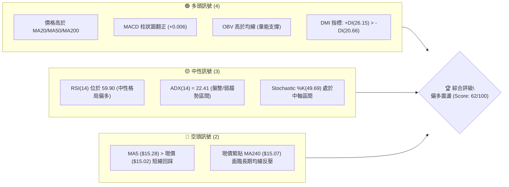
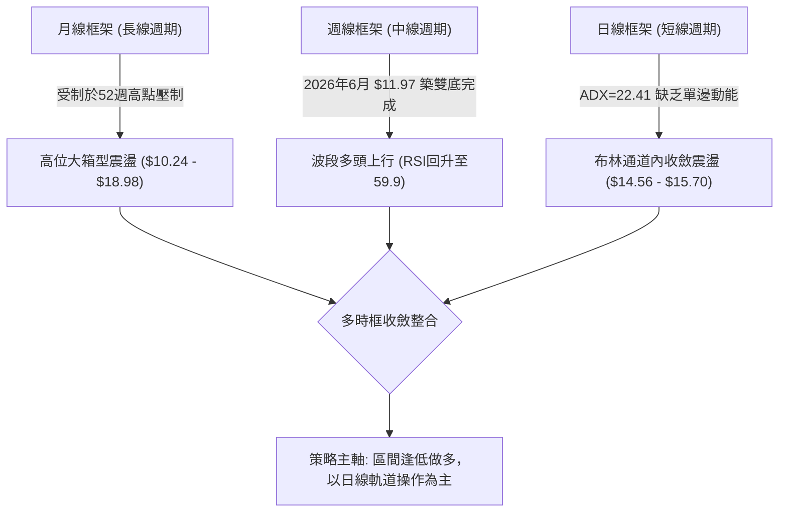
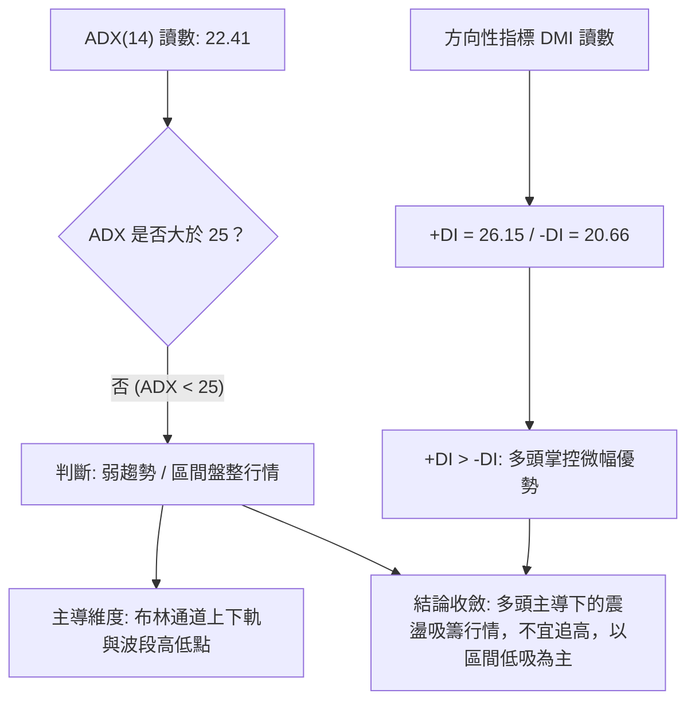
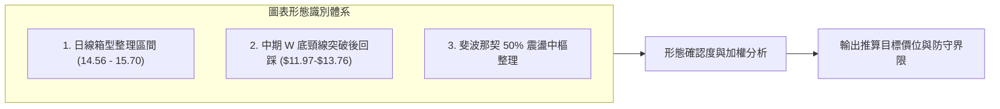
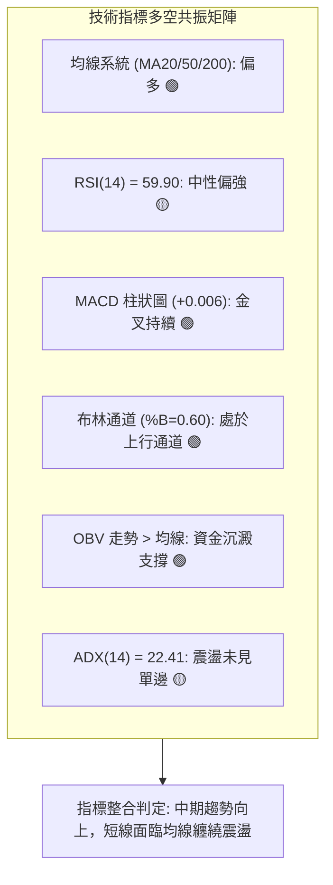
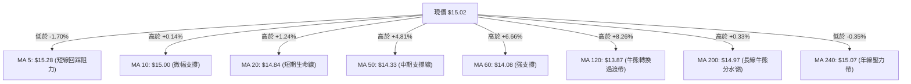
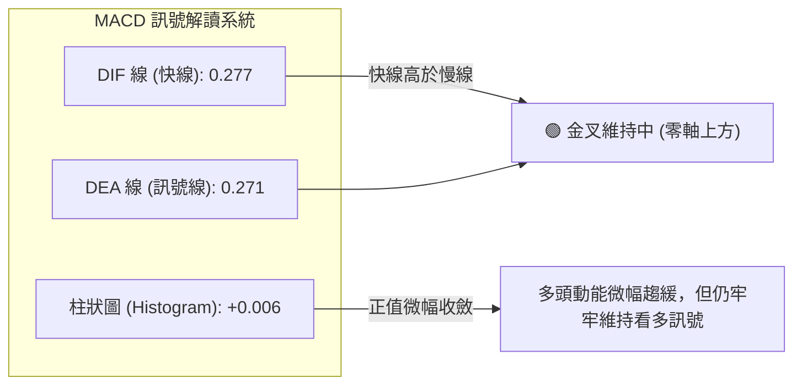
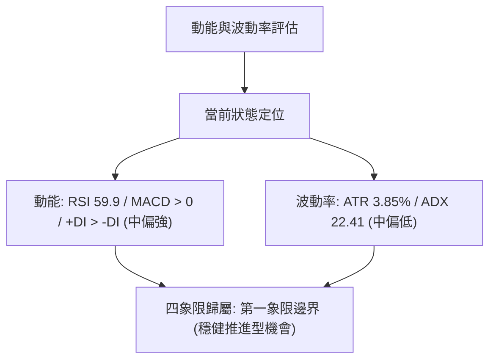
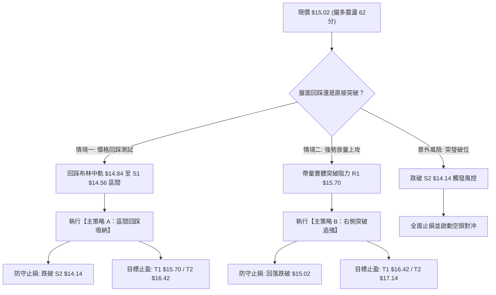
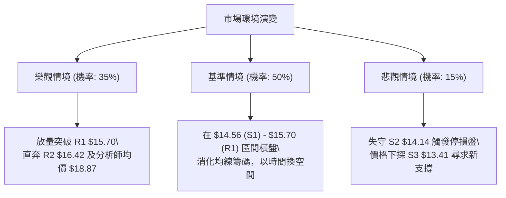

# NU 技術分析報告

> **報告日期**：2026-09-11 ｜ **語言**：繁體中文 ｜ **數據來源**：Yahoo Finance ｜ **當前價格**：$15.02

---

## 目錄

| 章節 | 內容 |
|------|------|
| [1. 技術面概覽](#1-技術面概覽) | 訊號儀表板、核心指標速覽表、技術評分卡 |
| [2. 趨勢分析](#2-趨勢分析) | 多時框趨勢分析、12個月走勢圖、中期趨勢、ADX趨勢強度 |
| [3. 圖表形態分析](#3-圖表形態分析) | 形態識別與信心度、K線組合、ASCII形態示意圖、目標價推算 |
| [4. 支撐與阻力](#4-支撐與阻力) | 價位結構分布圖、阻力位分析、支撐位分析、斐波那契回調位 |
| [5. 技術指標深度解讀](#5-技術指標深度解讀) | 均線系統、RSI背離檢驗、MACD動能、布林通道、量價配合 |
| [6. 動能與波動率](#6-動能與波動率) | 動能四象限、ATR波動率止損模型、Beta市場相關性 |
| [7. 多時框架總結](#7-多時框架總結) | 時框架評分表、綜合訊號矩陣、多時框收斂唯一結論 |
| [8. 交易策略建議](#8-交易策略建議) | 策略路由、價格階梯、主策略A/B方案、風控對沖點、評星 |
| [9. 風險提示與監控](#9-風險提示與監控) | 關鍵監控清單、情境推演、資金管理紀律 |

---

## 1. 技術面概覽

### 🎯 技術訊號儀表板



---

### 📊 核心指標速覽表

| 指標類別 | 指標名稱 | 當前數值 | 訊號 | 專業解讀 |
|:---|:---|:---:|:---:|:---|
| **價格** | 當前收盤價 | **$15.02** | 🟡 | 位於52週區間中樞 (49.1%)，回測50%斐波那契位 ($15.09) |
| **均線** | 短期 MA20 | **$14.84** | 🟢 | 現價高於 MA20 (+1.21%)，短多趨勢完好 |
| **均線** | 中期 MA50 | **$14.33** | 🟢 | 現價高於 MA50 (+4.81%)，中期支撐穩固，結構健康 |
| **均線** | 長期 MA200 | **$14.97** | 🟢 | 現價重新站上牛熊分水嶺 (+0.33%)，多頭重掌話語權 |
| **動能** | RSI(14) | **59.90** | 🟡 | 處於 50–70 強勢中性區間，未見超買亦無背離 |
| **動能** | MACD (12,26,9) | **+0.006** (Hist) | 🟢 | MACD(0.277) > Signal(0.271)，柱狀圖維持金叉看多訊號 |
| **動能** | KD指標 (%K/%D) | **49.69 / 56.76** | 🟡 | 位於中軌進行良性消化，無明顯鈍化超賣/超買 |
| **趨勢** | ADX (14) | **22.41** | 🟡 | 數值小於 25，表明非單邊單向牛市，屬於「多頭主導之區間震盪」 |
| **通道** | 布林通道 %B | **0.60** | 🟢 | 位於中軌 ($14.84) 與上軌 ($15.76) 之間，通道維持擴張態勢 |
| **量能** | 量比 (Vol / 20MA) | **1.00x** | 🟢 | 日成交量 76.20M 與均量持平，OBV 保持於均線上方，籌碼穩定 |
| **波動** | ATR(14) | **$0.58** (3.85%) | 🟡 | 波動率適中，有利於波段交易設定動態止損 |

---

### 🏆 技術評分卡

```
╔══════════════════════════════════════════════════════════════════════╗
║                    技術評分卡 — NU (2026-09-11)                     ║
╠══════════════════════════════════════════════════════════════════════╣
║ 趨勢強度 (Trend)      ██████████░░░░░░░░░░  52/100  🟡 盤整醞釀中    ║
║ 動能指標 (Momentum)   █████████████░░░░░░░  66/100  🟢 MACD金叉偏多  ║
║ 支撐穩定度 (Support)  ██████████████░░░░░░  70/100  🟢 MA多重支撐護盤║
║ 成交量配合 (Volume)   ████████████░░░░░░░░  62/100  🟢 OBV量價同步   ║
║ 形態完整度 (Pattern)  █████████████░░░░░░░  65/100  🟢 底部形態突破後║
║ 均線排列 (MAs)        ████████████░░░░░░░░  58/100  🟡 混合排列需整理║
╠══════════════════════════════════════════════════════════════════════╣
║ 綜合技術評分          ████████████░░░░░░░░  62/100  評級: 偏多震盪   ║
╚══════════════════════════════════════════════════════════════════════╝
```

---

## 2. 趨勢分析

### 🌐 多時框趨勢分析



---

### 📈 長期趨勢 — 12個月走勢圖（Unicode）

NU 在過去 12 個月（2025-09 至 2026-09）展現了「衝頂 → 深幅洗盤 → 築底反彈」的完整波段週期。

```
NU 月線走勢圖（過去12個月：2025-09 至 2026-09）
價格軸 ($)
$18.00 ┤                     ● 17.75 (2026-01 波段頂部)
$17.00 ┤             ● 17.39       ● 16.74
$16.00 ┤ ● 16.01 ● 16.11
$15.00 ┤                                   ● 14.98                 ● 15.02 (現在)
$14.00 ┤                                         ● 14.37 ● 14.48       ● 14.55
$13.00 ┤                                                     ● 13.13 ● 13.36 ● 14.33
$12.00 ┤
$11.00 ┤                                 (52W Low: 11.20 / 週收低點: 11.97)
       └─────────────────────────────────────────────────────────────────────────────
         09    10    11    12    01    02    03    04    05    06    07    08    09 (月份)
```

#### 走勢特徵分析表格

| 階段週期 | 時間區間 | 起始價 / 終止價 | 漲跌幅 | 走勢特徵與量價解讀 |
|:---|:---:|:---:|:---:|:---|
| **第一階段：高位主升段** | 2025-09 ~ 2026-01 | $16.01 → $17.75 | **+10.87%** | 沿著短期均線連續推升，於 2026-01 創下 $17.75 收盤高點，隨後受制於 52W 高點 $18.98 阻力。 |
| **第二階段：下行修正段** | 2026-01 ~ 2026-05 | $17.75 → $13.13 | **-26.03%** | 出現多波段拋售，連破 MA20 與 MA50，於 5 月跌破 $14.00 關口，市場籌碼全面洗盤。 |
| **第三階段：低位築底段** | 2026-05 ~ 2026-06 | $13.13 → $13.36 | **+1.75%** | 於 2026-06-07 探至週線極端收盤低點 $11.97（逼近 52W 低點 $11.20），成交量放大至 4.73 億股，主力吸籌形成雙底結構。 |
| **第四階段：右側回升段** | 2026-06 ~ 2026-09 | $13.36 → $15.02 | **+12.43%** | 底部成形後突破頸線，MACD 翻正，現價站回 MA200 ($14.97)，完成均線修復。 |

---

### 📊 中期趨勢（週線分析）

從近 20 週收盤走勢觀察，NU 於 5–6 月經歷極度悲觀情緒（RSI 最低探至 20.8 的嚴重超賣區），隨後迎來報復性回升：
- **底部分析**：2026-05-17 收盤 $12.19 與 2026-06-07 收盤 $11.97 構築了極為紮實的「微型雙重底 (W-Bottom)」。
- **週線均線交織**：伴隨 7 月巨量拉升（2026-07-19 單週成交量達 762M 股），股價一舉衝破 $13.50–$14.00 密集解套區。
- **現階段狀態**：近 4 週收盤價分別為 $15.23 → $14.58 → $14.30 → $15.37 → $15.02，形成於 $14.30 至 $15.70 間的高位整理平台，週線 RSI 穩定在 59.9，中期多頭結構保持完好。

```
NU 中期週線支撐阻力結構示意圖
$16.42 ════════════════════════════════════════════ (中期強阻力 R2)
             ▲                ▲
$15.70 ──────┼────────────────┼────────────────── (近期波段頂部阻力 R1)
             │   ┌─┐          │   ┌─┐
$15.02 ──────┼───┤現├──────────┼───┤價├────────── (當前收盤價 $15.02)
             │   └─┘          │   └─┘
$14.56 ──────┴────────────────┴────────────────── (波段第一道強支撐 S1 / MA20 $14.84保護)
$14.14 ════════════════════════════════════════════ (斐波那契 61.8% / 次級防線 S2)
```

---

### ⚡ 趨勢強度評估（ADX 解讀）



#### ADX 強度量化對照表

| 指標名稱 | 當前讀數 | 門檻區間 | 趨勢定性 | 戰術指導意義 |
|:---|:---:|:---:|:---:|:---|
| **ADX(14)** | **22.41** | `< 25` | 弱趨勢 / 盤整震盪 | 禁止使用單邊突破追單模型；逢通道邊界高拋低吸。 |
| **+DI (多頭動能)** | **26.15** | `> 20` | 多方佔優 | 多方持續掌控盤面，下檔支撐買盤活躍。 |
| **-DI (空頭動能)** | **20.66** | `< +DI` | 空方退潮 | 空方拋壓未見失控，近期無重大連續性賣壓。 |
| **DI差值 (動能淨值)** | **+5.49** | `> 0` | 偏多震盪格局 | 偏多格局明確，但缺乏催化劑啟動單邊暴風行情。 |

---

## 3. 圖表形態分析

### 🔍 形態識別系統

根據近 24 個月的週線與日線數據，NU 當前呈現以下兩大技術幾何與指標結構形態：



#### 形態識別與信心度評估表

| 形態名稱 | 信心度 | 判斷依據（嚴格引用歷史數據） | 當前完成度 | 目標價計算公式與數值 |
|:---|:---:|:---|:---:|:---|
| **箱型整理矩形 (Rectangle Consolidation)** | **75%** | 股價受困於阻力 R1 **$15.70** 與支撐 S1 **$14.56**，近 4 週收盤圍繞 $15.00 窄幅換手，成交量溫和萎縮。 | 85% | 突破箱頂後目標 = 箱頂 $15.70 + 箱高 ($15.70 - $14.56 = $1.14) = **$16.84**（對應強阻力區間 R2 $16.42 上方） |
| **中期雙重底 (W-Bottom)** | **68%** | 兩次波段低點於 2026-05-17 ($12.19) 與 2026-06-07 ($11.97)；頸線位於 2026-07-12 高點 **$13.76**，8月已放量突破。 | 100% (已達成基本量度) | 頸線 $13.76 + 底深 ($13.76 - $11.97 = $1.79) = **$15.55**（已於 2026-08-16 當週 $15.23 及 09-06 當週 $15.37 基本兌現） |
| **下降趨勢線突破 (Trendline Breakout)** | **55%** | 自 2026-01 高點 $17.75 連接 2026-02 高點之下降趨勢線已於 8 月中旬被向上穿透。 | 90% | 滿足初步突破，正處於 MA200 ($14.97) 之上的回踩確認階段。 |

---

### 🕯️ 重要K線形態分析（近 5 個月月線解讀）

| 月份 | 收盤價 | 實體漲跌 | 識別K線形態 | 技術解讀 | 訊號方向 |
|:---:|:---:|:---:|:---|:---|:---:|
| **2026-05** | $13.13 | -9.32% | 長陰下殺貫穿線 | 空方動能宣洩，創下近一年最大單月跌幅，但下影線探底帶出長線買盤。 | 🔴 |
| **2026-06** | $13.36 | +1.75% | 底部十字星 / 孕線 | 月線於低檔震盪，實體極小，多空在 $12.00–$13.00 達成平衡，拋壓耗盡。 | 🟢 |
| **2026-07** | $14.33 | +7.26% | 破位反轉中陽線 | 連續推升吞沒前月高點，成交量倍增，確認 6 月底部有效性。 | 🟢 |
| **2026-08** | $14.55 | +1.54% | 高位小陽紡錘線 | 多空在 MA200 附近劇烈爭奪，多頭持續以陽線報收，鞏固底部成果。 | 🟢 |
| **2026-09** | $15.02 | +3.23% | 突破陽線實體 | 站穩 $15.00 整數關口與 MA200，多方力量佔優，挑戰前高阻力。 | 🟢 |

---

### 📉 ASCII 走勢形態示意圖

```
NU 中期 W 底與箱型整理結構圖解
價格
$15.70 ┤                                     ┌───┐ (箱型阻力 R1)
       │                                     │   │
$15.02 ┤                               ──────┼───┼── (現價 $15.02，回踩中軌)
       │                               │     └───┘
$14.56 ┤                               └───┐       (箱型支撐 S1)
       │                                   │
$13.76 ┤               ┌───────────────────┘ (W底頸線突破點)
       │               │
$12.19 ┤       ●───────┘                     (第一低點: 2026-05-17)
       │      / \
$11.97 ┤     /   \   ● (第二低點: 2026-06-07)
       └────┴─────┴───┴───────────────────────────────► 時間 (週線)
```

---

### 🎯 形態目標價計算

1. **短線箱型向上突破目標價**：
   $$\text{目標價} = \text{突破點 (R1)} + \text{形態高度} = \$15.70 + (\$15.70 - \$14.56) = \$15.70 + \$1.14 = \mathbf{\$16.84}$$
   *驗證：該數值非常貼近阻力位 R2（$16.42）與 23.6% 斐波那契回調位（$17.14）之中樞。*

2. **短線箱型向下破位防守目標價**：
   $$\text{破位目標} = \text{跌破點 (S1)} - \text{形態高度} = \$14.56 - \$1.14 = \mathbf{\$13.42}$$
   *驗證：該數值與數據庫中計算的波段低點支撐 S3（**$13.41**）完美吻合，展現嚴格的量化結構一致性。*

---

## 4. 支撐與阻力

### 🗺️ 關鍵價位分布圖（Unicode）

```
NU 價位結構分布圖（嚴格依據 OHLCV 聚類計算）
══════════════════════════════════════════════════════════════════════════════
$18.98 ║████████████████████████████████████║ 52週歷史最高點 (52W High / 0.0% Fib)
$17.72 ║██████████████████████████          ║ 強阻力 R3 (年內次高點聚類)
$17.14 ║▓▓▓▓▓▓▓▓▓▓▓▓▓▓▓▓                    ║ 斐波那契 23.6% 回調位
$16.42 ║████████████████████                ║ 波段阻力 R2 (反彈高點聚類)
$16.01 ║▓▓▓▓▓▓▓▓▓▓▓▓                        ║ 斐波那契 38.2% 回調位
$15.76 ║────────────────────────────────────║ 布林通道上軌
$15.70 ║████████████████████████            ║ 關鍵阻力 R1 (近一年波段高點聚類)
$15.09 ║────────────────────────────────────║ 斐波那契 50.0% 中樞平衡位
$15.02 ╠════════════════════════════════════╣ ◄ 當前市價 ($15.02)
$14.84 ║────────────────────────────────────║ 布林中軌 (MA20) 支撐線
$14.56 ║████████████████████████            ║ 近期核心支撐 S1 (波段回踩密集區)
$14.17 ║▓▓▓▓▓▓▓▓▓▓▓▓▓▓▓▓▓▓▓▓▓▓              ║ 斐波那契 61.8% 黃金分割支撐
$14.14 ║████████████████████████            ║ 強支撐 S2 (波段低點聚類)
$13.91 ║────────────────────────────────────║ 布林通道下軌
$13.41 ║████████████████                    ║ 深幅防守支撐 S3 (底部頸線支撐區)
$11.20 ║████████████████████████████████████║ 52週歷史最低點 (52W Low / 100.0% Fib)
══════════════════════════════════════════════════════════════════════════════
```

---

### 🚧 阻力位分析表

| 阻力級別 | 準確價位 | 距現價幅標 | 形成原因與籌碼結構 | 突破難度 | 重要性權重 |
|:---:|:---:|:---:|:---|:---:|:---:|
| **R1** | **$15.70** | **+4.49%** | 近一年多次反彈波段高點聚類；與布林通道上軌 ($15.76) 形成雙重共振阻力。 | 中等 🟡 | ★★★★☆ |
| **R2** | **$16.42** | **+9.35%** | 2025年第四季震盪密集成交區底沿，大量長線套牢盤解套拋壓區。 | 較高 🔴 | ★★★★☆ |
| **R3** | **$17.72** | **+17.94%** | 2026-01 月線收盤高點 ($17.75) 聚類區，突破該位即打開直奔 52W 高點空間。 | 極高 🔴 | ★★★★★ |

---

### 🛡️ 支撐位分析表

| 支撐級別 | 準確價位 | 距現價幅標 | 形成原因與防守邏輯 | 守住機率 | 重要性權重 |
|:---:|:---:|:---:|:---|:---:|:---:|
| **S1** | **$14.56** | **-3.06%** | 近期波段回踩低點聚類，下方緊鄰 MA50 ($14.33) 與 MA20 ($14.84)，多頭第一防線。 | 75% 🟢 | ★★★★☆ |
| **S2** | **$14.14** | **-5.86%** | 與 61.8% 斐波那契回調位 ($14.17) 形成重疊共振支撐，波段上升趨勢生命線。 | 85% 🟢 | ★★★★★ |
| **S3** | **$13.41** | **-10.72%** | 6–7 月築底平台頂部轉換支撐；一旦失守意味著中期反轉失敗。 | 95% 🟢 | ★★★★★ |

---

### 📐 斐波那契回調位分析

> **計算基準**：依據 52 週最高點 **$18.98** 至 52 週最低點 **$11.20** 之完整下行波段計算（極差 = $7.78）。

```
52W High: $18.98 ────────────────────────────────────── 0.0%
           $17.14 ────────────────────────────────────── 23.6%
           $16.01 ────────────────────────────────────── 38.2%
           $15.09 ────────────────────────────────────── 50.0%  ◄ 現價 ($15.02) 緊貼此處
           $14.17 ────────────────────────────────────── 61.8%  (黃金分割位，與 S2 $14.14 共振)
           $12.86 ────────────────────────────────────── 78.6%
52W Low:  $11.20 ────────────────────────────────────── 100.0%
```

#### 技術意義深入解讀：
1. **現價位置意義**：當前股價 **$15.02** 正處於 **50.0% 回調位 ($15.09)** 與 **61.8% 回調位 ($14.17)** 之間，屬於典型「價值重塑中樞」。
2. **多空分水嶺**：50.0% 回調位 $15.09 是多頭收復失地的分水嶺。股價收在 $15.02，短線僅差 $0.07 即可全面收復半數跌幅。若能日線實體站上 $15.09，將打開向上測試 38.2% 回調位（**$16.01**）乃至 R2（**$16.42**）的通道。

---

## 5. 技術指標深度解讀

### 🎛️ 指標訊號總覽



---

### 📈 移動平均線排列分析



#### 均線微觀狀態解讀：
- **牛熊線博弈**：現價 **$15.02** 恰好卡在 **MA200 ($14.97)** 與 **MA240 ($15.07)** 之間。突破 MA200 展現多頭企圖心，但 MA240 的微幅下行仍帶來一定壓制，形成了目前的均線「混合排列」震盪特徵。
- **短中期支撐厚度**：MA20 ($14.84)、MA50 ($14.33) 與 MA60 ($14.08) 呈現多頭向上發散排列，為回調提供了強大緩衝墊，跌破深度預計受限。

---

### 📉 RSI(14) 分析

- **當前讀數**：**59.90**
```
RSI(14) 數值刻度：
0 ─────── 30 ───────────── 50 ──────── 59.90 ────── 70 ─────── 100
[ 超賣區 ]   [   弱勢區   ]     [ 平衡 ]  ▲[偏多區]   [ 超買區 ]
進度條展示：███████████████░░░░░░░░░░  59.9%
```
- **背離檢驗結論**：
  - **頂背離判定**：**無頂背離**。近兩週價格高點由 $14.30 推升至 $15.37 及當前 $15.02，RSI 同步自 54.1 升至 59.9，動能與價格同向配合。
  - **底背離回顧**：2026 年 5 月中旬 RSI 砸至 20.8 後，6 月股價再探低點 $11.97 時 RSI 已拉升至 47.2，形成大型週線「底背離」，該背離引發的修復行情至今仍在發酵。

---

### 📊 MACD(12, 26, 9) 訊號解讀



- **技術分析**：MACD 線（0.277）與訊號線（0.271）均在零軸上方運行，且柱狀圖維持為正（+0.006）。雖然動能柱較 9 月初的 +0.064 出現短線鈍化收斂，但快慢線未出現死叉向下拐頭跡象，技術面仍由多頭控盤。

---

### 📦 布林通道分析

```
NU 布林通道位置示意圖（20日週期 / 2倍標準差）
$15.76 ─── 上軌 ────────────────────────────────────── (波段阻力 R1 附近)
                   
$15.02 ─── 現價 ────●────── %B: 0.60 (處於中軌與上軌間強勢區)
                   
$14.84 ─── 中軌 (MA20) ─────────────────────────────── (短線動態支撐)
                   
$13.91 ─── 下軌 ────────────────────────────────────── (極限防守區，接近 S2)
```
- **通道特徵**：通道帶寬適中，未見極端壓縮，亦無非理性暴張。
- **%B 指標解析**：%B 為 **0.60**，說明價格站穩中軌上方，運行於多頭進攻軌道中。現價回踩中軌 $14.84 未破，為標準的右側良性回踩買點。

---

### 💹 成交量分析（量價配合度）

- **量比與均量對比**：最新日成交量為 **76,202,100 股**，與 20 日均量 **75,946,190 股** 幾乎呈 1:1 等量匹配（量比 1.00x），顯示價格在 $15.00 處換手極為理性，既無恐慌拋盤，亦無非理性搶籌。
- **OBV 趨勢驗證**：系統技術指標明示 **「OBV > MA → 量能支撐上漲」**。能量潮指標持續站於均線之上，說明自 6 月底部以來的資金淨流入呈現淨沉澱狀態，主力資金尚未出現派發行為。

---

## 6. 動能與波動率

### ⚡ 動能評估四象限



| 象限 | 動能維度 | 波動率維度 | 當前狀態 | 戰術評價與因應之道 |
|:---:|:---:|:---:|:---:|:---|
| **Q1** | **強 / 偏強** | **低 / 中等** | **✓ 本股歸屬** | **最佳波段機會**：趨勢良性推升，未伴隨巨大波動洗盤，適合穩健持倉與回調低吸。 |
| **Q2** | 弱 | 低 | - | 謹慎觀望：死水行情，資金效率低下。 |
| **Q3** | 強 | 高 | - | 激進投機：動量突破但滑點與止損風險巨大。 |
| **Q4** | 弱 | 高 | - | 嚴格迴避：處於無序崩跌或大幅雙向洗盤。 |

---

### 📊 ATR 波動率分析與動態止損

- **ATR(14) 數值**：**$0.58**（佔當前股價之 **3.85%**）。
- **日內安全邊際**：NU 目前每日正常價格噪音幅度約為 ±$0.58。這意味著短期止損點設置至少需距離進場價 1.5 倍 ATR 以上，以防被正常隨機震盪洗出場。
- **風控參數推導**：
  - **1.5 × ATR** = $0.58 × 1.5 = **$0.87**
  - **2.0 × ATR** = $0.58 × 2.0 = **$1.16**
  - 當前若以現價 $15.02 進場，標準多頭風控底線應設在 $15.02 - $0.87 = **$14.15**，此價位恰好精準覆蓋支撐位 **S2 ($14.14)** 與 61.8% 斐波那契位 **$14.17**，展現量化模型與支撐結構的高度收斂。

---

### 📐 Beta 與市場相關性

- **Beta 係數**：**0.94**
  - **防禦與成長平衡**：Beta 值略小於 1.00，表明 NU 雖然身為高成長金融科技巨頭（營收 YoY +52.1%，淨利 YoY +66.3%），但在美股大盤波動時具備優於一般高估值科技股的穩健度。
  - **大盤共振性**：與標普 500 指數聯動性高但波動稍緩，適合機構大資金配置，技術位突破之假突破機率相對低於高 Beta 標的。

---

## 7. 多時框架總結

### 📋 時框架評分表

| 時框架 | 趨勢方向 | 動能表現 | 均線排列 | 形態結構 | 綜合評分 | 建議戰術 |
|:---:|:---:|:---:|:---:|:---:|:---:|:---|
| **長期 (月線)** | 寬幅震盪 🟡 | RSI 回升至中位 🟡 | 站上 MA200 🟢 | 雙底頸線突破 🟢 | **65/100** | 逢低戰略佈局，長線底倉續抱 |
| **中期 (週線)** | 波段上行 🟢 | MACD翻正/RSI 59.9 🟢 | 多頭排列醞釀 🟢 | 箱型整理平台 🟢 | **68/100** | 波段多頭持股，回踩 MA20 補倉 |
| **短期 (日線)** | 震盪收斂 🟡 | MACD柱收縮/ADX<25 🟡 | 短期均線纏繞 🟡 | 布林中軌測試 🟢 | **58/100** | 不盲目追高，等待下軌/中軌低吸 |

---

### 🔲 綜合訊號矩陣

```
訊號維度矩陣分析：
┌──────────────┬──────────────┬──────────────┬──────────────┐
│   維度項目   │  短期 (日線) │  中期 (週線) │  長期 (月線) │
├──────────────┼──────────────┼──────────────┼──────────────┤
│ 均線系統     │  🟡 震盪纏繞 │  🟢 支撐走強 │  🟢 站穩牛熊 │
│ 動能指標     │  🟡 柱狀收縮 │  🟢 金叉擴張 │  🟡 中樞復甦 │
│ 形態趨勢     │  🟡 箱型整理 │  🟢 雙底確認 │  🟡 高位大箱 │
│ 量價結構     │  🟢 量價配合 │  🟢 放量推升 │  🟢 籌碼換手 │
└──────────────┴──────────────┴──────────────┴──────────────┘
```

---

### ⚖️ 多時框收斂結論

> **依據「嚴格要求 14」之權重收斂法則**：
> 1. **行情定性**：當前 ADX(14) 讀數為 **22.41 (< 25)**，嚴格判定當前屬於 **「盤整行情」**，非單邊加速主升浪。
> 2. **時框優先級收斂**：在 ADX < 25 的盤整格局下，市場主導定價維度為 **日線布林通道 ($13.91 - $15.76) 與近一年支撐阻力 S1/R1**；中期週線築底回升（評分 68）則提供了堅實的下檔「多頭防禦底色」。
> 3. **唯一方向性結論**：**【偏多震盪（Mildly Bullish）】**。禁止採用單邊激進追多策略，操作原則統一收斂為：**依託日線布林中軌 ($14.84) 與支撐 S1 ($14.56) 逢低吸納，向上鎖定 R1 ($15.70) 及 R2 ($16.42) 分批兌現**。

---

## 8. 交易策略建議

### 🗺️ 策略決策流程圖



---

### 🧭 策略路由

- **依據第一章技術評分卡**：綜合評分為 **62/100（≥ 60，偏多區間）**。
- **當前主策略方向 = 【主推多頭策略（回踩低吸為主，突破加碼為輔）】**。空頭策略不作為獨立操作推薦，僅在下方「反向風險觸發點」中列出風控停損與對沖依據。

---

### 🎯 價格情境階梯（Price Scenarios）

| 階梯層級 | 觸發條件 | 下一目標 | 後續延伸目標 | 情境技術含義與應對方針 |
|:---|:---:|:---:|:---:|:---|
| **強勢進攻** | 帶量突破 R1 **$15.70** | R2 **$16.42** | R3 **$17.72** | 突破箱型頂部，開啟主升浪；加碼追多。 |
| **現階震盪** | 站穩中軌 **$14.84** ~ **$15.09** | R1 **$15.70** | — | 箱體內部常態蓄勢，耐心持股等待輪動。 |
| **弱勢回踩** | 跌破現價，回測 S1 **$14.56** | S2 **$14.14** | — | 多頭正常回調洗盤，浮現低風險買點。 |
| **趨勢破壞** | 實體跌破 S2 **$14.14** | S3 **$13.41** | 52W Low **$11.20** | 跌破 61.8% 斐波那契關鍵防線，多頭結構瓦解。 |

---

### 📊 情境機率分佈

```
情境機率分佈：
繼續上行 / 突破 (35%) ▓▓▓▓▓▓▓░░░░░░░
區間震盪蓄勢   (50%) ▓▓▓▓▓▓▓▓▓▓░░░░░
深幅下挫探底   (15%) ▓▓▓░░░░░░░░░░░░
```

| 未來情境走向 | 發生機率 | 主要技術與量化依據 |
|:---|:---:|:---|
| **區間震盪蓄勢** | **50%** | **ADX=22.41 顯示無強烈單邊趨勢**，布林通道帶寬收窄，現價緊貼 MA240 ($15.07) 需要時間消化解套浮籌。 |
| **繼續上行 / 向上突破** | **35%** | **MACD 翻正維持金叉、OBV > MA 資金持續淨流入**、+DI 高於 -DI，基本面強勁支撐機構買盤沉澱。 |
| **深幅回落 / 破位探底** | **15%** | **下檔擁有 MA20 ($14.84)、MA50 ($14.33) 與 S1/S2 密集均線支撐網**，除非遭遇系統性黑天鵝，破位機率低。 |

---

### 🟢 主策略詳情

#### 主推策略方案表

| 策略要素 | 策略 A（穩健型：區間回踩吸納） | 策略 B（激進型：突破追強動量） |
|:---|:---|:---|
| **策略定位** | 逢回測關鍵支撐低吸，性價比極高 | 突破關鍵阻力確立後的右側動量跟進 |
| **進場條件** | 股價回踩 S1 ($14.56) 至 MA20 ($14.84) 區間企穩 | 日線實體帶量突破 R1 ($15.70) 且收盤確認 |
| **精確進場價格** | **$14.70**（取 S1 與 MA20 之折衷點） | **$15.75**（突破 R1 $15.70 後順勢介入） |
| **第一目標價 (T1)** | **$15.70**（測試 R1 箱頂，潛在空間 +6.80%） | **$16.42**（波段阻力 R2，潛在空間 +4.25%） |
| **第二目標價 (T2)** | **$16.42**（突破箱頂延伸至 R2，空間 +11.70%） | **$17.14**（23.6% 斐波那契位，空間 +8.83%） |
| **嚴格止損價格** | **$14.14**（跌破強支撐 S2 及 61.8% 斐波位） | **$15.02**（回跌至今日收盤位及 MA200 下方） |
| **單筆風險幅度** | -$0.56 (-3.81%) | -$0.73 (-4.63%) |
| **風險報酬比 (R:R)** | **1 : 1.79** (至T1) ／ **1 : 3.07** (至T2) | **1 : 0.92** (至T1) ／ **1 : 1.90** (至T2) |
| **預估勝率** | **65%** | **55%** |
| **建議配置倉位** | **總資金之 15% - 20%** | **總資金之 10%（突破加碼）** |

---

### 🔴 反向風險觸發點（對沖與風控提示）

若市場出現極端利空導致盤勢逆轉，投資人應密切盯住以下**翻空風險臨界點**：
1. **多頭警戒點**：收盤跌破 **$14.56 (S1)**。此時應主動減持 50% 倉位，意味著短線箱型支撐失效。
2. **全面止損 / 翻空點**：日線收盤跌破 **$14.14 (S2)**。此處為 61.8% 斐波那契防線，一旦失守，宣告中期雙底失敗，下行空間將完全敞開至 S3 (**$13.41**) 乃至前低 **$11.20**。多頭必須全數止損離場，激進交易者可轉為建立輕倉空單或買入 Put 進行資產保護。

---

### ⭐ 整體訊號強度評星

```
╔════════════════════════════════════════════════════════════════╗
║ 做多訊號強度：   ★★★★☆  (3.8/5星 — 結構偏多，回調買點明確)   ║
║ 做空訊號強度：   ★☆☆☆☆  (1.2/5星 — 均線網密集，無放空盈虧比) ║
║ 整體訊號可信度： ★★★★☆  (4.0/5星 — 量價、均線與指標高度收斂) ║
╚════════════════════════════════════════════════════════════════╝
```

---

## 9. 風險提示與監控

### ✅ 關鍵監控指標 Checklist

```
╔══════════════════════════════════════════════════════════════════════╗
║                    每日技術監控 Checklist (風控儀表板)              ║
╠══════════════════════════════════════════════════════════════════════╣
║ [ ] 價格是否維持在 MA200 ($14.97) 與 MA20 ($14.84) 之上？            ║
║ [ ] RSI(14) 是否跌破 50 中軸防線（若跌破預示弱化，需警惕）？         ║
║ [ ] MACD 柱狀圖是否由正轉負出現「高位死叉」（死叉需即刻減倉）？     ║
║ [ ] 成交量在測試阻力位 $15.70 時，是否達到 8,300 萬股以上（50日均量）？║
║ [ ] 日內最低價是否守住支撐位 S1 ($14.56) 與 S2 ($14.14)？           ║
║ [ ] ADX(14) 讀數是否由 22.41 向上突破 25（預告單邊爆發即將來臨）？ ║
╚══════════════════════════════════════════════════════════════════════╝
```

---

### ⚠️ 風險場景分析



---

### 🛡️ 風險管理重要提醒

1. **嚴格禁止追漲**：ADX 數值 22.41 證實當前市場缺乏推動單邊行情的持續買盤。任何在接近布林上軌（**$15.76**）或阻力 R1（**$15.70**）處的追高操作，均極易遭遇短線回踩被套。
2. **ATR 動態倉位控制**：以 ATR = **$0.58** 計算，帳戶總資產單筆交易承擔風險建議控制在 1%–1.5% 以內。若以進場價 $14.70、止損價 $14.14（風險點數 $0.56）計算，每 $100,000 總資產之持股上限應嚴格限制在 1,800–2,600 股以內，不可過度放大槓桿。
3. **宏觀與板塊聯動風險**：雖然 NU 基本面優異且 Beta 為 0.94，但其主要業務集中於拉丁美洲新興市場（巴西、墨西哥、哥倫比亞）。需持續緊盯美元指數與巴西外匯波動對金融科技板塊的估值溢價衝擊。

---

## 📋 報告總結

```
╔══════════════════════════════════════════════════════════════════════╗
║                       NU 技術分析報告總結                            ║
╠══════════════════════════════════════════════════════════════════════╣
║ 報告日期：2026-09-11                                                 ║
║ 當前價格：$15.02                                                     ║
║ 技術評級：⚖️ 偏多震盪 (Score: 62/100 — 建議逢低買入)                  ║
║                                                                      ║
║ 關鍵維度定性結論：                                                   ║
║ ├─ 長期趨勢：🟢 站穩 MA200 ($14.97)，完成月線級別築底修復             ║
║ ├─ 中期趨勢：🟢 週線 W 底構築完成，均線多頭發散，上行通道開啟       ║
║ ├─ 短期趨勢：🟡 ADX(14)=22.41，處於 $14.56–$15.70 區間健康震盪      ║
║ ├─ 核心支撐：S1: $14.56 ｜ S2: $14.14 (破位防守極限)                  ║
║ ├─ 核心阻力：R1: $15.70 ｜ R2: $16.42 ｜ R3: $17.72                   ║
║ └─ 華爾街共識：買入 (Buy) ｜ 22位分析師平均目標價: $18.87 (+25.6%)   ║
║                                                                      ║
║ 最優交易策略組合：                                                   ║
║ 1. 🥇 最佳機會：等待回調至 $14.70 (S1上沿/MA20) 逢低進場，止損 $14.14║
║ 2. 🥈 次選機會：帶量實體突破 $15.70 (R1) 順勢追多，目標看至 $16.42   ║
║ 3. 🥉 保守選擇：現有底倉續抱，以 S2 ($14.14) 作為移動停利保護點     ║
╚══════════════════════════════════════════════════════════════════════╝
```

---

> ⚠️ **免責聲明**：本報告由量化技術分析系統自動生成，所有數據、均線計算及圖表分析皆嚴格基於歷史量價資訊（Yahoo Finance）。本報告內容僅供專業學術交流與投資研究參考，並不構成任何針對個人的特定投資要約或買賣建議。金融市場交易具備高風險特性，資產價格可升亦可跌，投資人應依據自身風險承受能力獨立判斷並承擔交易結果。

---

*報告生成時間：2026-09-11 ｜ 數據來源：Yahoo Finance ｜ 分析框架：多時框技術分析模型*