# NU 技術分析報告

> **報告日期**：2026-09-12 ｜ **語言**：繁體中文 ｜ **數據來源**：Yahoo Finance ｜ **當前價格**：$14.62

---

## 目錄

| 章節 | 內容 |
|------|------|
| [1. 技術面概覽](#1-技術面概覽) | 訊號儀表板、核心指標、評分卡 |
| [2. 趨勢分析](#2-趨勢分析) | 多時框趨勢、長中短期走勢 |
| [3. 圖表形態分析](#3-圖表形態分析) | 形態識別、K線組合、目標價 |
| [4. 支撐與阻力](#4-支撐與阻力) | 關鍵價位、斐波那契回調 |
| [5. 技術指標深度解讀](#5-技術指標深度解讀) | MA/RSI/MACD/布林/成交量 |
| [6. 動能與波動率](#6-動能與波動率) | 動能評估、ATR、Beta |
| [7. 多時框架總結](#7-多時框架總結) | 時框架評分矩陣 |
| [8. 交易策略建議](#8-交易策略建議) | 多空策略、風險報酬比 |
| [9. 風險提示與監控](#9-風險提示與監控) | 監控指標、風險場景 |
| [10. 報告總結](#10-報告總結) | 技術面總評與決策指引 |

---

## 1. 技術面概覽

### 🎯 技術訊號儀表板

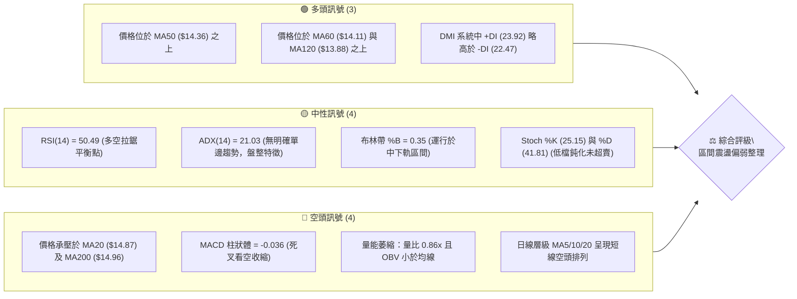

### 📊 核心指標速覽表

| 指標類別 | 指標名稱 | 當前數值 | 訊號 | 解讀 |
|----------|----------|----------|------|------|
| **價格** | 當前價格 | $14.62 | 🟡 | 位於52週高低區間之 44.0% 位置，處於中軸下方震盪 |
| **均線** | MA20 | $14.87 | 🔴 | 價格低於MA20達 -1.68%，短期均線構成動態反壓 |
| **均線** | MA50 | $14.36 | 🟢 | 價格高於MA50達 +1.81%，中期生命線提供關鍵支撐 |
| **均線** | MA200 | $14.96 | 🔴 | 價格低於長期年線達 -2.27%，尚未收復長期多空分水嶺 |
| **動能** | RSI(14) | 50.49 | 🟡 | 位於50中軸臨界點，既無超買亦無超賣，方向不明確 |
| **動能** | MACD(12,26,9) | Hist -0.036 | 🔴 | 快線 0.226 低於慢線 0.262，柱狀圖翻負，短線動能減弱 |
| **波動** | ATR(14) | $0.59 | 🟡 | 佔股價 4.01%，波動處於中等收斂狀態，缺乏單邊推力 |
| **趨勢** | ADX(14) | 21.03 | 🟡 | ADX < 25，明確指示當前為非趨勢型無序盤整格局 |
| **成交量** | 量比 (Volume Ratio) | 0.86x | 🔴 | 最新量 65.63M 低於20日均量 75.96M，量能退潮 |

### 🏆 技術評分卡

```
╔══════════════════════════════════════════════════════════════╗
║                  技術評分卡 — NU (2026-09-12)                ║
╠══════════════════════════════════════════════════════════════╣
║ 趨勢強度      ████████░░░░░░░░░░░░  42/100  🟡 弱趨勢/盤整   ║
║ 動能指標      █████████░░░░░░░░░░░  46/100  🟡 中性偏弱      ║
║ 支撐穩定度    ████████████░░░░░░░░  60/100  🟢 MA50/S1 有效  ║
║ 成交量配合    ███████░░░░░░░░░░░░░  36/100  🔴 量能持續退潮  ║
║ 形態完整度    ███████████░░░░░░░░░  54/100  🟡 收斂三角未破  ║
║ 均線排列      ████████░░░░░░░░░░░░  40/100  🔴 夾心混合排列  ║
╠══════════════════════════════════════════════════════════════╣
║ 綜合評分      █████████░░░░░░░░░░░  46/100  🟡 中性觀望      ║
╚══════════════════════════════════════════════════════════════╝
```

---

## 2. 趨勢分析

### 🌐 多時框趨勢分析

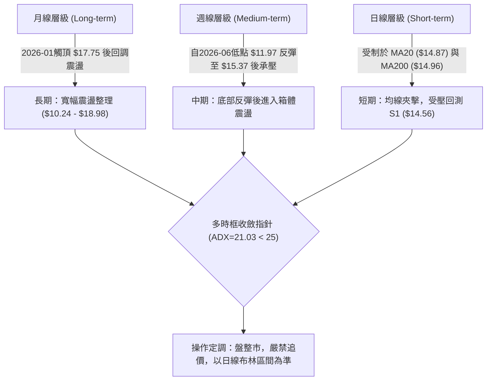

### 📈 長期趨勢 — 12個月走勢圖（Unicode）

```
NU 月線走勢圖（過去12個月：2025-10 至 2026-09）
價格軸 ($)
$18.00 ┤                     ● ($17.75 01月頂點)
$17.00 ┤              ●      │
$16.00 ┤●      ●      │      │
$15.00 ┤│      │      │      │      ●
$14.00 ┤│      │      │      │      │      ●      ●      ●(現價$14.62)
$13.00 ┤│      │      │      │      │      │      │      │      ●      ●      │
$12.00 ┤│      │      │      │      │      │      │      │      │      │      │      │
$11.00 ┤│      │      │      │      │      │      │      │      │      │      │      │
       └─────────────────────────────────────────────────────────────────────────────
        10月   11月   12月   01月   02月   03月   04月   05月   06月   07月   08月   09月
        16.11  17.39  16.74  17.75  14.98  14.37  14.48  13.13  13.36  14.33  14.55  14.62
```

#### 走勢特徵分析表格

| 階段區間 | 時間跨度 | 起訖收盤價 | 區間漲跌幅 | 走勢結構與量價特徵 |
|----------|----------|------------|------------|--------------------|
| **主升攻擊波** | 2025-08 ~ 2026-01 | $14.80 → $17.75 | +19.93% | 突破性上漲，於2026年1月創下 $17.75 之波段高點 |
| **急跌修正波** | 2026-01 ~ 2026-05 | $17.75 → $13.13 | -26.03% | 連續4個月收黑，跌破中期均線支撐，市場情緒急劇降溫 |
| **止跌築底波** | 2026-05 ~ 2026-06 | $13.13 → $13.36 | +1.75% | 週線低點下探至 $11.97（接近52W低點 $11.20）並引發買盤 |
| **箱體修復波** | 2026-06 ~ 2026-09 | $13.36 → $14.62 | +9.43% | 反彈遇年線壓力放緩，進入 $14.04 - $15.70 布林箱體平衡 |

### 📊 中期趨勢（週線分析）

中期走勢圖展示了自 2026 年 6 月創下週線低點 $11.97 以來的波段反彈路徑。反彈過程中，成交量於 2026-07-19 達到單週 762M 之巨量後逐步萎縮，價格隨後在 2026-09-06 觸碰 $15.37 波段高位，但隨即遭遇阻力回落至當前 $14.62。

```
NU 週線阻力與支撐格局示意圖
$16.42 ────────────────────────────────────────── 阻力 R3 (波段高點聚類)
               ▲
$15.74 ────────┼───────────────────────────────── 阻力 R2 / BB上軌 ($15.70)
               │     ┌──┐ (09-06 高點 $15.37)
$14.88 ────────┼─────┤  ├──────────────────────── 阻力 R1 / MA20 ($14.87) / MA200 ($14.96)
               │     │  │  ◄── 現價 $14.62 (受到MA20反壓)
$14.56 ────────┼─────┴──┴──────────────────────── 支撐 S1 (近期波段低點聚類)
               │
$14.14 ────────┴───────────────────────────────── 支撐 S2 / BB下軌 ($14.04) / MA60 ($14.11)
$13.41 ────────────────────────────────────────── 支撐 S3 (中期底部支撐)
```

### ⚡ 趨勢強度評估（ADX 解讀）

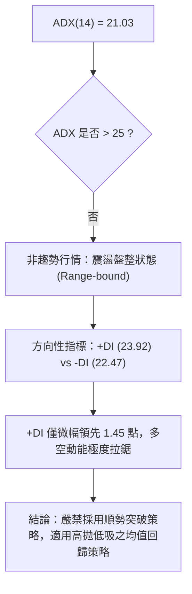

| 指標參數 | 實際數值 | 臨界閾值 | 當前狀態判定 | 交易策略指示 |
|----------|----------|----------|--------------|--------------|
| **ADX (14)** | 21.03 | 25.00 | 無趨勢 / 弱趨勢 | 順勢指標失效，震盪指標權重提升 |
| **+DI (14)** | 23.92 | -DI: 22.47 | 多方極微弱佔優 | 無法發動單邊單向突破 |
| **-DI (14)** | 22.47 | - | 空方回踩施壓中 | 空頭有組織壓制但未形成崩潰式殺跌 |

---

## 3. 圖表形態分析

### 🔍 形態識別系統

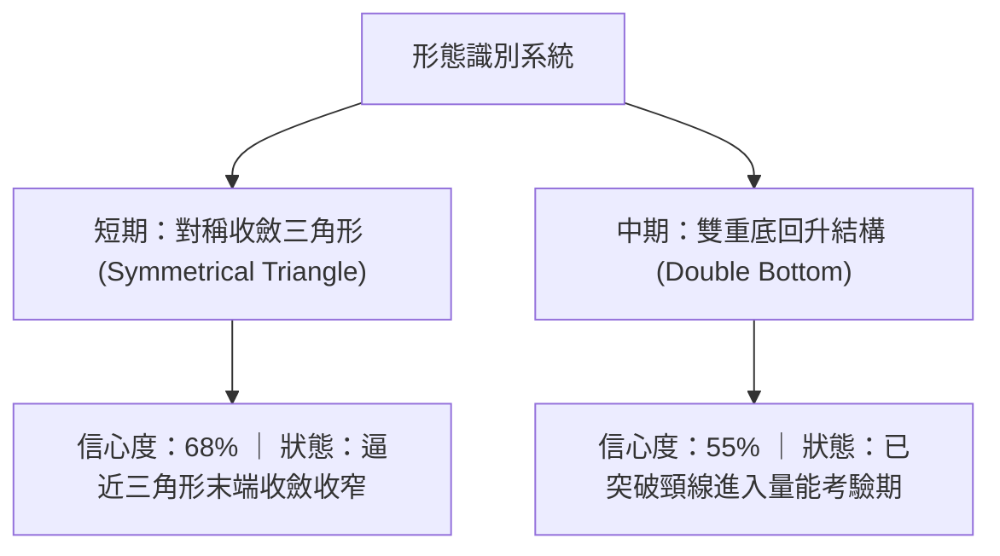

#### 圖表形態信心度與目標價計算表

| 形態類別 | 信心度 | 判斷依據（引用技術數據） | 完成度 | 目標價（附嚴謹計算式） |
|----------|--------|--------------------------|--------|------------------------|
| **短期收斂三角形** | 68% | 8月高點 $15.23、9月高點 $15.37 下壓；低點由 $13.84 墊高至 $14.30，收斂至現價 $14.62 | 85% | 向上突破頸線 R1 ($14.88) 觸發：目標價 = $14.88 + ($15.37 - $14.30) = $15.95（直逼阻力位 R2 $15.74） |
| **中期雙底結構 (W底)** | 55% | 兩次下探低點分別為 2026-05 ($12.19) 與 2026-06 ($11.97)；頸線位於 2026-08-02 波段高點 $14.33 | 100% (已達標) | 頸線 $14.33 + 形態高度 ($14.33 - $11.97 = $2.36) = 理論目標 $16.69（已於 $15.37 遇阻收縮） |
| **頭肩底結構** | 25% | 左肩 $12.19、頭部 $11.97、右肩模糊且量能未遞增 | 20% | **數據不足**，右肩架構未獲成交量確認，僅做指標解讀 |

### 🕯️ 重要K線形態分析

| 週線週期 | 收盤價 | 實體與影線特徵 | K線形態解讀 | 訊號強度 |
|----------|--------|----------------|------------|----------|
| **2026-08-16** | $15.23 | 長陽實體突破 MA50，成交量 381M 放大 | **中陽放量上攻**：確立中期築底反彈走勢 | 🟢 強烈看多 |
| **2026-08-23** | $14.58 | 上下影線均等，收盤跌破 MA20 | **長十字孕線**：反映高檔承接力道減弱，買盤退縮 | 🟡 中性轉弱 |
| **2026-08-30** | $14.30 | 下影線回測 MA50 ($14.36)，低點止跌 | **下影探底錘頭**：多頭在 MA50 處展現有效護盤抵抗 | 🟢 支撐確認 |
| **2026-09-06** | $15.37 | 實體向上測試 R2 ($15.74) 失敗收上影 | **流星回落線**：衝高未果，高檔波段聚類賣壓沉重 | 🔴 頂部阻力 |
| **2026-09-13** | $14.62 | 陰線實體回落，收盤跌破週開盤價 | **陰包小陽收斂**：價格重新回測短期支撐 S1 ($14.56) | 🔴 短線偏空 |

### 📉 ASCII 走勢形態示意圖

```
NU 短期收斂三角形與關鍵均線夾擊示意圖
$15.50 ┤
$15.37 ┤            ▲ (2026-09-06 高點)
$15.20 ┤      ▲     ╲
$15.00 ┤─────╱───────╲───── MA20 ($14.87) / MA200 ($14.96) 阻力帶
$14.80 ┤    ╱         ╲
$14.62 ┤───┼───────────● ◄ 現價 $14.62 (三角形末端收斂)
$14.40 ┤  ╱             ▲
$14.30 ┤ ╱ (08-30低點)  │
$14.20 ┤────────────────┴── MA50 ($14.36) / S2 ($14.14) 支撐底線
       └─────────────────────────────────────────────────────────────
         08-16    08-23    08-30    09-06    09-13
```

---

## 4. 支撐與阻力

### 🗺️ 關鍵價位分布圖（Unicode）

```
NU 價位結構分布圖（引用精確計算聚類點位）
═══════════════════════════════════════════════════════════════
$16.42 ║████████████████████████║ 強阻力 R3 (+12.34%) — 區間密集成交頂部
$16.01 ║░░░░░░░░░░░░░░░░░░░░░░░░║ 斐波那契 38.2% 回調位
$15.74 ║████████████████████    ║ 阻力 R2 (+7.68%) — BB上軌 ($15.70) 重合帶
$15.09 ║░░░░░░░░░░░░░░░░░░░░░░░░║ 斐波那契 50.0% 中軸關鍵反壓
$14.88 ║████████████████████████║ 關鍵阻力 R1 (+1.80%) — MA20/MA200 匯聚
$14.62 ╠════════════════════════╣ ◄ 當前市價 ($14.62)
$14.56 ║▓▓▓▓▓▓▓▓▓▓▓▓▓▓▓▓        ║ 近期支撐 S1 (-0.41%) — 波段低點聚類
$14.17 ║░░░░░░░░░░░░░░░░░░░░░░░░║ 斐波那契 61.8% 黃金分割回調位
$14.14 ║████████████████████████║ 強支撐 S2 (-3.28%) — MA60/BB下軌 ($14.04)
$13.41 ║████████████████████████║ 護盤底線 S3 (-8.28%) — 前期整理平臺底
═══════════════════════════════════════════════════════════════
```

### 🚧 阻力位分析表

| 阻力級別 | 精確價位 | 距現價幅標 | 形成原因與技術匯合依據 | 突破難度 | 戰略重要性 |
|----------|----------|------------|------------------------|----------|------------|
| **R1** | $14.88 | +1.80% | 波段高點聚類；與 MA20 ($14.87)、MA200 ($14.96) 形成多重動態反壓帶 | 🟡 中等 | 短線轉強樞紐點，唯有帶量收復方能打開反彈空間 |
| **R2** | $15.74 | +7.68% | 近一年密集套牢區波段高點；精準對應布林通道上軌 ($15.70) | 🔴 極高 | 中期箱體震盪頂部，需 20 日均量放大至 1.5x 以上始可攻克 |
| **R3** | $16.42 | +12.34% | 2025年Q4大底頸線向下破位點，為強烈結構性籌碼套牢峰 | 🔴 極高 | 多頭波段反轉至多頭市場之終極考驗位 |

### 🛡️ 支撐位分析表

| 支撐級別 | 精確價位 | 距現價幅標 | 形成原因與技術匯合依據 | 守住機率 | 戰略重要性 |
|----------|----------|------------|------------------------|----------|------------|
| **S1** | $14.56 | -0.41% | 近期波段低點聚類，與日線收盤密集區重合，提供即時緩衝 | 🟡 60% | 極短線防線，失守將考驗下方 $14.36 (MA50) 與 S2 |
| **S2** | $14.14 | -3.28% | 波段低點聚類；匯合 MA60 ($14.11) 及布林下軌 ($14.04) 與斐波那契 61.8% ($14.17) | 🟢 80% | 多頭核心生命線，此處具備多重指標強支撐共振效應 |
| **S3** | $13.41 | -8.28% | 2026年5-6月築底平臺上緣波段低點聚類 | 🟢 90% | 中期波段多空最後防線，跌破則預示趨勢向 52W 低點探底 |

### 📐 斐波那契回調位分析

依據 52 週極值區間（低點 $11.20 至 高點 $18.98，全波段落差 $7.78）計算之標準回調位：

```
0.0%  (52W High)   $18.98 ──────────────────────────────────── 頂部高點
23.6%              $17.14 ──────────────────────────────────── 強勢回調位
38.2%              $16.01 ──────────────────────────────────── 弱勢阻力位
50.0%              $15.09 ──────────────────────────────────── 多空中軸水準反壓線
═══════════════════════════════════════════════════════════════
現價落點區間        $14.62 (位於 50.0% 與 61.8% 之間，偏向 61.8% 回調位)
═══════════════════════════════════════════════════════════════
61.8%              $14.17 ──────────────────────────────────── 黃金分割強支撐帶
78.6%              $12.86 ──────────────────────────────────── 深幅回調警戒線
100.0% (52W Low)   $11.20 ──────────────────────────────────── 52週底部基準點
```

- **位置解讀**：現價 $14.62 運行於 **50.0% ($15.09)** 與 **61.8% ($14.17)** 之間。在技術分析中，此區間屬於「黃金分割防守防線」。
- **趨勢隱含**：上方受壓於 50% 中位線 $15.09（亦緊鄰阻力位 R1 $14.88 及 MA200 $14.96），表明多方反撲在此遭遇平衡點對等壓制；下方 61.8% 水準位 $14.17 與支撐位 S2 ($14.14) 幾乎完美重疊，構成中期極強之底部承托。

---

## 5. 技術指標深度解讀

### 🎛️ 指標訊號總覽

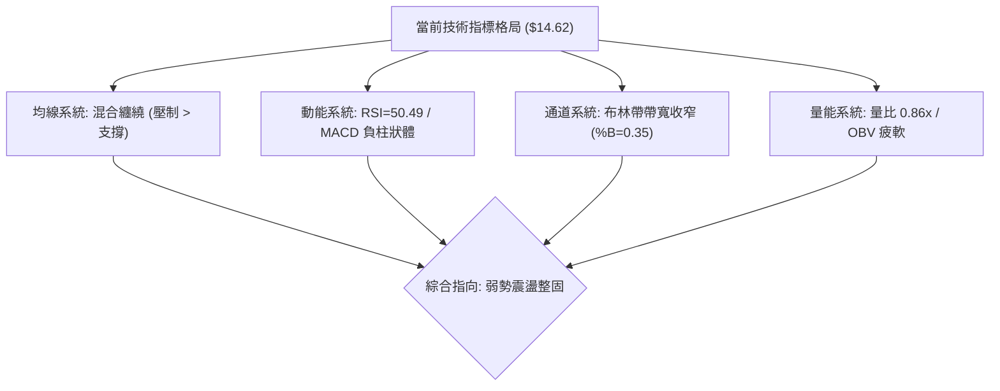

### 📈 移動平均線排列分析

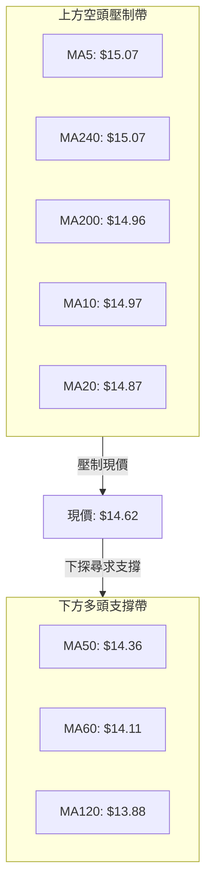

#### 移動平均線全週期狀態表

| 均線名稱 | 數值 | 偏離率 (Bias) | 斜率與走勢特徵 | 訊號指示 |
|----------|------|---------------|----------------|----------|
| **MA5** | $15.07 | -2.97% | 連續急降，呈現 ▇███▇ 短期下彎 | 🔴 空頭壓制 |
| **MA10** | $14.97 | -2.36% | 高檔轉折下彎，呈現 ▇█████ 拐點 | 🔴 短線阻力 |
| **MA20** | $14.87 | -1.68% | 走平略微下傾，呈現 ▅▆▇▇██ 走平 | 🔴 月線反壓 |
| **MA50** | $14.36 | +1.81% | 穩健向上運行，為中短期重要依託 | 🟢 中期支撐 |
| **MA60** | $14.11 | +3.59% | 底部穩步墊高，呈現 ▅▅▆▆▇▇ 上揚 | 🟢 趨勢回暖 |
| **MA120** | $13.88 | +5.33% | 築底平臺回升，呈現 ▂▂▂▂ 緩慢抬頭 | 🟢 長期承托 |
| **MA200** | $14.96 | -2.27% | 長期年線微幅走平，現價未能有效站上 | 🔴 牛熊分界未過 |
| **MA240** | $15.07 | -2.97% | 下行週期尾聲，呈現 ▅▄▃▃▃▂ 下滑 | 🔴 長期反壓 |

**解讀**：均線系統呈現「夾心階層混合排列」。現價被死死夾在上方短期均線群（MA5/10/20 及 MA200 聚於 $14.87-$15.07）與下方中長期均線群（MA50/60/120 聚於 $13.88-$14.36）之間。短線動能偏空，但中長期下跌空間受到強力收斂限制。

### 📉 RSI(14) 分析

```
RSI(14) 強度進度條：
0 ────────── 30 ────────────────── 50 ────────────────── 70 ────────── 100
[ 超賣區間 ]  │    弱勢盤整區     │50.49│    強勢推進區     │ [ 超買區間 ]
              └───────────────────┴──●──┴───────────────────┘
當前讀數：50.49 [中性]
```

- **超買超賣狀態**：數值精準落在 50.49，完美切齊 50 多空中軸線，顯示市場買方與賣方力量達到短暫的熱力學平衡，未觸及 30 超賣或 70 超買邊界。
- **背離分析判斷**：
  - 檢視近期週線：價格自 2026-08-16 的 $15.23 上推至 2026-09-06 的 $15.37（創反彈新高），然而週線 RSI 由 58.0 降至 56.6；
  - **日線背離結論**：目前日線層級上，價格與 RSI 均在均值處同步回落，**無明顯底背離或頂背離**形態；但週線層級存在**潛在輕微頂背離疑慮**，限制了向上暴衝的續航力。

### 📊 MACD(12/26/9) 訊號解讀

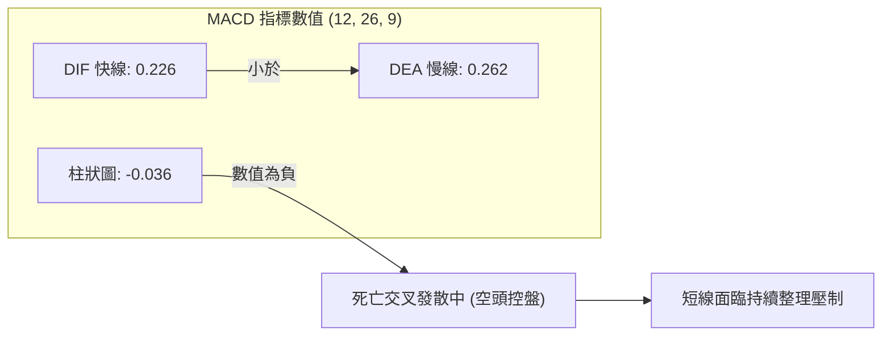

- **MACD 解讀**：快線 DIF (0.226) 運行於慢線 DEA (0.262) 下方，MACD 柱狀體收在 -0.036。儘管兩條均線皆處於零軸之上（代表中長期格局仍處於反彈修復架構），但短線死叉形成之空頭擴散，明確警告近幾個交易日將以防守消化賣壓為主。

### 📦 布林通道分析

```
布林通道 (20, 2) 結構示意圖
$15.70 ┬──────────────────────────────────────── 上軌 (BB Upper)
       │
$15.30 ┼
       │
$14.87 ┼──────────────────────────────────────── 中軌 / MA20 (BB Middle)
       │                 ● 現價 $14.62 (%B = 0.35)
$14.40 ┼
       │
$14.04 ┴──────────────────────────────────────── 下軌 (BB Lower)
```

- **布林參數狀態**：上軌 $15.70、中軌 $14.87、下軌 $14.04，通道帶寬為 $1.66（佔股價約 11.3%），正處於通道開口收縮後的收斂橫盤期。
- **%B 指標判讀**：當前 %B 為 **0.35**（0 代表下軌，0.5 代表中軌，1 代表上軌）。數值低於 0.5 表明價格已自中軌滑落至弱勢半區運行，短線價格有沿著下軌方向進行均值尋底之傾向，初步支撐看下軌 $14.04 與 S2 ($14.14)。

### 💹 成交量分析（量價配合度）

- **量比與均量比較**：最新單日成交量為 65.63M，相較於 20 日均量 75.96M，量比僅為 **0.86x**；對比 50 日均量 83.48M 更是顯著萎縮。
- **量價關係判斷**：價跌量縮（由 09-06 之 373M 週量回落至 09-13 之 285M 週量），顯示雖然短線走弱，但並未引爆恐慌性拋盤，屬於良性籌碼回踩。
- **OBV 趨勢**：技術快照標註「OBV < MA → 量能疲弱」。OBV 位於其均線下方，說明近期資金進出呈現淨流出狀態，量能無法支撐大級別突破行情，印證了當前縮量盤整之特徵。

---

## 6. 動能與波動率

### ⚡ 動能評估分析

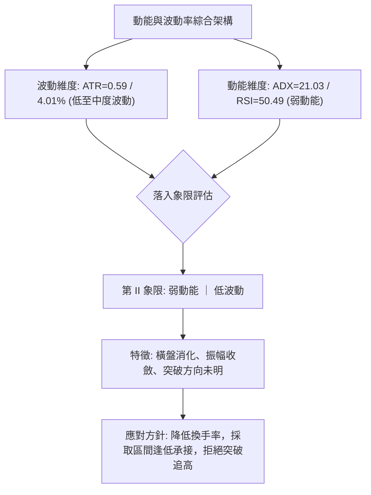

#### 動能與波動四象限對照定位表

| 象限 | 動能強度 | 波動率水準 | 當前匹配 | 市場狀態與交易含義 |
|------|----------|------------|----------|--------------------|
| **Q1** | 強動能 | 低波動 | — | 趨勢穩健推進（牛皮上漲），為最佳單邊波段持倉機會 |
| **Q2** | **弱動能** | **低/中波動** | **✓ (當前)** | **箱體收斂整理，動能匱乏，市場參與者觀望濃厚** |
| **Q3** | 強動能 | 高波動 | — | 突破噴出或情緒崩殺，高風險高收益爆發階段 |
| **Q4** | 弱動能 | 高波動 | — | 巨幅洗盤震盪，極易出現連續假突破侵蝕本金 |

### 📊 ATR 波動率分析

- **ATR(14) 數值**：**$0.59**（佔當前股價之 **4.01%**）。
- **日內安全邊界**：每日預期波動極限值約為現價上下各 $0.59（波動區間 $14.03 至 $15.21）。
- **止損距離建議**：
  - *短期保守交易（1.5 倍 ATR）*：設定止損距離為 $0.59 × 1.5 = **$0.885**。
  - *波段防守交易（2.0 倍 ATR）*：設定止損距離為 $0.59 × 2.0 = **$1.18**。
  - 此數值為後續第 8 章交易策略提供量化止損錨定依據。

### 📐 Beta 與市場相關性

- **Beta 數值**：**0.94**。
- **市場特徵解讀**：Beta 極度接近 1.0（0.94），顯示 NU 與標普500及大盤金融科技板塊具有高度系統性連動。其波動幅度略小於大盤整體，無顯著特異性爆發行情；在缺乏個股重大利好刺激時，股價趨勢主要跟隨大盤系統性流動性方向起伏。

---

## 7. 多時框架總結

### 📋 時框架評分表

| 時框架 | 趨勢方向 | 動能狀態 | 均線排列 | 關鍵主導指標 | 綜合評分 | 操作指引 |
|--------|----------|----------|----------|--------------|----------|----------|
| **短期 (日線)** | 偏空整理 | 轉弱中 | 空頭反壓 | MA20 反壓 / MACD 死叉 | 38/100 🔴 | 逢高減碼，尋求下軌支撐 |
| **中期 (週線)** | 區間震盪 | 中性平衡 | 均線纏繞 | MA50 支撐 / 三角收斂 | 52/100 🟡 | 區間操作，守護 $14.14 |
| **長期 (月線)** | 大箱體格局 | 動能休眠 | 年線附近 | 52W區間 44% 處築底 | 48/100 🟡 | 價值持有，等待月線放量 |

### 🔲 綜合訊號矩陣

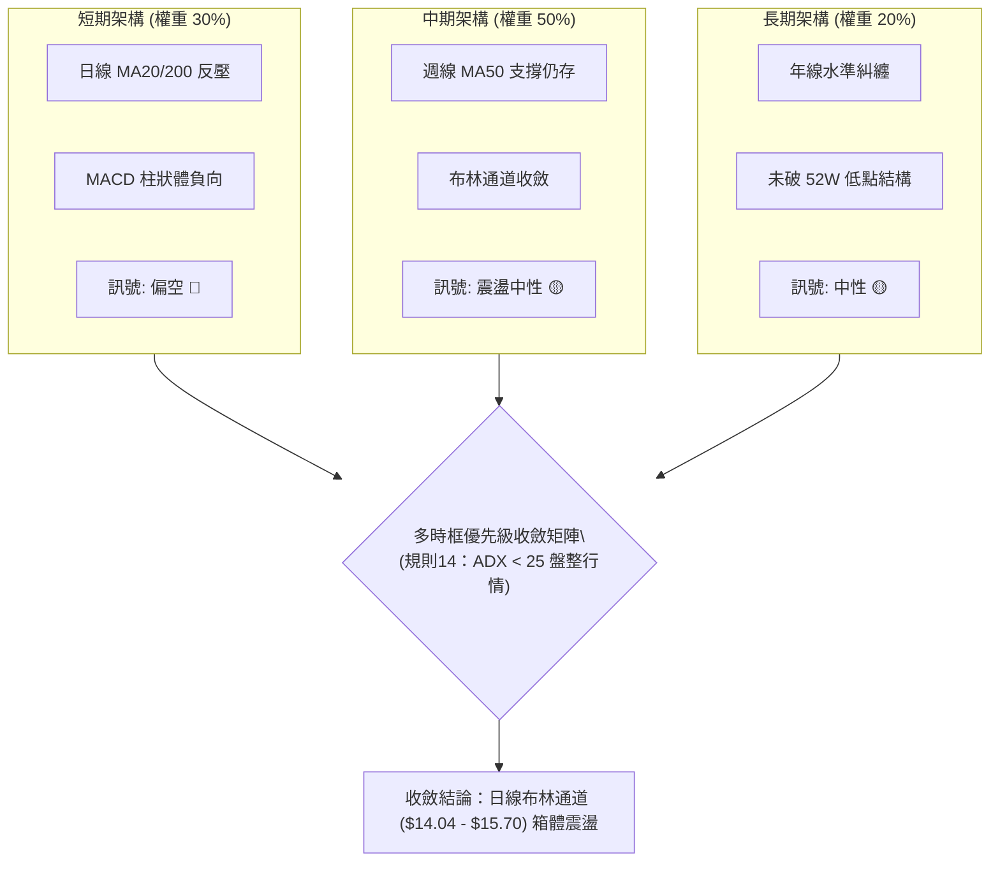

### ⚖️ 多時框收斂結論

> **依據「嚴格要求 14」多時框收斂規則執行決策**：
> 1. 當前系統檢測 ADX(14) 為 **21.03 (< 25)**，嚴格界定為**「無趨勢盤整行情」**。
> 2. 由於行情非強勢單邊趨勢，中長期均線（MA50、MA200）方向不構成單向追價引領，行情優先權**自動收斂至日線布林通道上下軌（$14.04 至 $15.70）**作為主要交易區間。
> 3. 日線短期訊號雖因 MACD 翻負呈現偏空，但中期 MA50 ($14.36) 與支撐位 S2 ($14.14) 距離現價極近，空頭向下空間受到緊密壓制。
>
> **最終單一方向性結論**：**【中性觀望，區間震盪操作】**（偏向布林下軌尋找低吸買點，不參與中途追空）。

---

## 8. 交易策略建議

### 🗺️ 策略決策流程圖

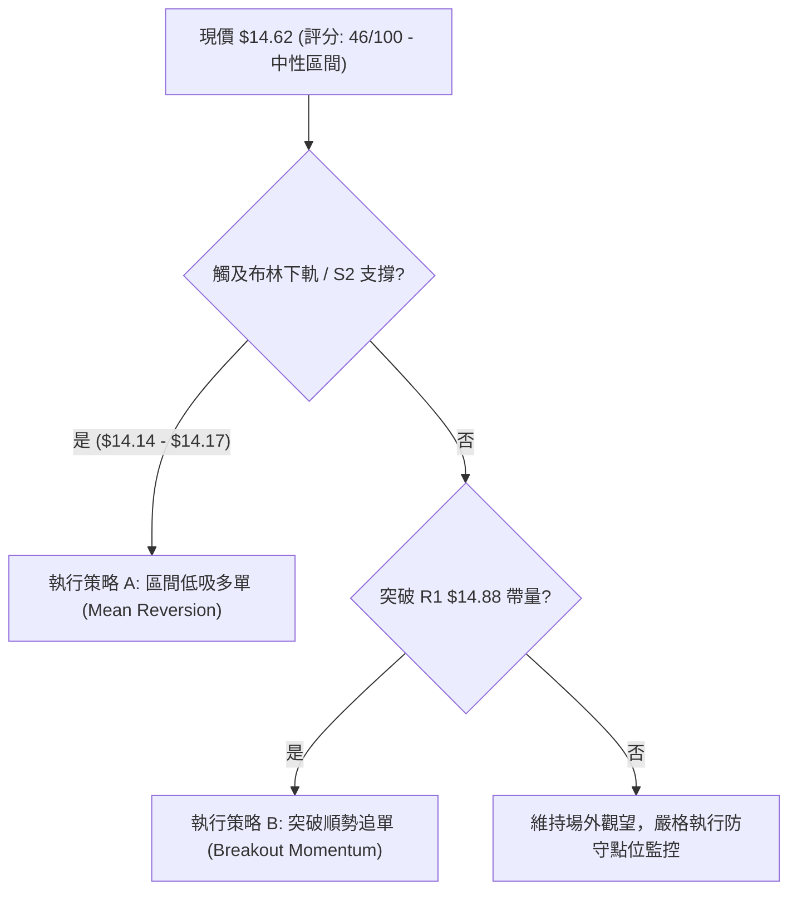

### 🧭 策略路由

**當前主策略方向 = 【中性區間震盪操作，以布林通道下軌逢低佈局為主】（依技術評分卡：46/100）**

- 依評分規則，評分處於 40–60 之中性區間，禁止盲目單邊單向激進做多或做空。
- 策略核心為：利用盤整特性，在價格靠近 S2 ($14.14) 及布林下軌 ($14.04) 時低吸，並於 R1 ($14.88) 及 R2 ($15.74) 分步止盈。

### 🎯 價格情境階梯（Price Scenarios）

| 觸發條件 | 下一目標 | 後續延伸 | 情境技術含義與應對方針 |
|----------|----------|----------|------------------------|
| **帶量突破 R1 $14.88** | 阻力 R2 $15.74 | 阻力 R3 $16.42 | 短線全面轉強，收復 MA20/MA200，空頭結構瓦解 |
| **現價區間維持整理** | 支撐 S1 $14.56 | 阻力 R1 $14.88 | 處於三角收斂核心區，多空維持平衡觀望 |
| **跌破 S1 $14.56** | 支撐 S2 $14.14 | 支撐 S3 $13.41 | 短線向下尋找高信度防禦帶，進入黃金買點區間 |

### 📊 情境機率分佈

| 預期情境 | 發生機率 | 主要技術指標依據 |
|----------|----------|------------------|
| **情境一：區間震盪整理** | **55%** | **ADX=21.03** 處於無趨勢低位，布林帶帶寬顯著收緊，多空量能均不足以撕裂現有箱體 |
| **情境二：回測支撐後反彈** | **30%** | **MACD 柱狀體 -0.036** 短期偏弱引導價格回踩 S2 ($14.14)，隨後由 MA60 及斐波那契 61.8% ($14.17) 承托啟動技術反彈 |
| **情境三：直接放量突破上行** | **15%** | 最新量比僅 0.86x 且 OBV 疲軟，在缺乏額外外部催化劑前，直接越過 MA200 反壓難度極高 |

### 🟢 主策略詳情

本策略僅引用第 4 章「關鍵價位」區塊與斐波那契之客觀數值：

| 策略要素 | 策略 A（區間低吸策略 — 首選） | 策略 B（突破追多策略 — 次選） |
|----------|-------------------------------|-------------------------------|
| **策略類型** | 均值回歸低吸 (Buy the Dips) | 關鍵位確認突破 (Momentum Breakout) |
| **進場條件** | 價格回調至 S2 且日線收長下影或出現止跌K線 | 日線帶量（成交量 > 1.2x 均量）突破收在 R1 之上 |
| **進場價格** | **$14.14** (精確錨定支撐位 S2) | **$14.88** (精確錨定阻力位 R1) |
| **目標價 T1** | **$14.88** (阻力位 R1，獲利空間 +5.23%) | **$15.74** (阻力位 R2，獲利空間 +5.78%) |
| **目標價 T2** | **$15.74** (阻力位 R2，獲利空間 +11.32%) | **$16.42** (阻力位 R3，獲利空間 +10.35%) |
| **止損價格** | **$13.41** (跌破支撐位 S3 全面認賠出局) | **$14.56** (跌回支撐位 S1 假突破停損) |
| **風險空間** | $14.14 - $13.41 = **$0.73** (-5.16%) | $14.88 - $14.56 = **$0.32** (-2.15%) |
| **報酬空間 (T2)**| $15.74 - $14.14 = **$1.60** (+11.32%) | $16.42 - $14.88 = **$1.54** (+10.35%) |
| **風險報酬比** | **1 : 2.19** (滿足專業風控大於 1:2 標準) | **1 : 4.81** (高勝率盈虧比結構) |
| **預估勝率** | 60% | 45% |
| **建議倉位** | **15% - 20%** 總資產 | **10%** 總資產（追突破倉位從緊） |

### 🔴 反向風險觸發點（對沖提示）

若發生下列情境，代表主策略假設徹底失效，應立即平倉或建立反向對沖：
- **致命空頭信號**：日線收盤價**實體跌破 $13.41 (S3)**，代表 2026 年中大底結構全面崩塌，下方直指 52W 低點 $11.20，任何多頭部位必須無條件全數止損離場。
- **假突破確認**：股價盤中衝過 $14.88 (R1) 但收盤留長上影線跌回 $14.56 (S1) 之下，且當日成交量暴增，需立刻對沖或減持現貨。

### ⭐ 整體訊號強度評星

```
做多訊號強度：★★☆☆☆  (2.5/5星 — 受制於日線均線壓制與負MACD)
做空訊號強度：★★☆☆☆  (2.0/5星 — 下方多條均線與黃金分割密集防守)
整體可信度：  ★★★☆☆  (3.5/5星 — 盤整箱體明確，支撐阻力結構極度清晰)
```

---

## 9. 風險提示與監控

### ✅ 關鍵監控指標 Checklist

```
╔══════════════════════════════════════════════════════════════╗
║                   每日交易風控監控清單 (Checklist)           ║
╠══════════════════════════════════════════════════════════════╣
║ [ ] 價格是否跌破極短線防線 S1 ($14.56)？                      ║
║     └─ 若跌破，日內觀察是否加速向 S2 ($14.14) 靠攏。        ║
║ [ ] 日成交量是否萎縮至 6,000 萬股以下？                      ║
║     └─ 成交量極度枯竭為變盤前兆，停止區間震盪交易。          ║
║ [ ] MACD 柱狀體是否在負值區收窄翻正？                        ║
║     └─ 柱狀體收斂大於 -0.010 視為短線止跌訊號。              ║
║ [ ] RSI(14) 是否跌破 45 臨界支撐？                          ║
║     └─ 低於 45 表明空方動能強化，暫緩所有進場買單。          ║
║ [ ] 布林通道下軌 ($14.04) 是否出現通道張口向下？             ║
║     └─ 下軌開口為破位特徵，禁止在 $14.14 處盲目掛單接刀。    ║
╚══════════════════════════════════════════════════════════════╝
```

### ⚠️ 風險場景分析

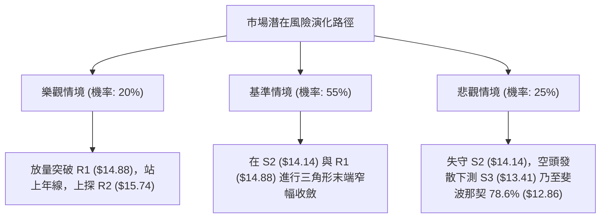

### 🛡️ 風險管理重要提醒

1. **宏觀與板塊聯動風險**：
   - NU 之 Beta 為 0.94，高槓桿新興市場金融科技板塊對美聯儲利率政策與巴西總體經濟波動極其敏感。若大盤指數下挫，個股單靠技術支撐位容易出現盤中擊穿現象。
2. **倉位管控鐵律**：
   - 在 ADX 重新站上 25 且發動明確單邊趨勢之前，**總曝險倉位嚴格限制在 20% 以內**。
   - 單筆交易最大虧損額度必須嚴格控制在總投資帳戶資產的 **1.0%** 以內（以策略 A 為例，風險距離 $0.73，若帳戶總額 10 萬美元，單筆最大止損 $1,000，則進場股數上限為 1,370 股）。
3. **假突破與防禦誘多**：
   - 鑒於目前成交量萎縮（量比 0.86x），盤中對 $14.88 (R1) 的任何無量上衝皆不可在盤中追價，必須等待**日線收盤確認站穩**後方可進場。

---

## 10. 報告總結

```
╔══════════════════════════════════════════════════════════════╗
║                   NU 技術分析報告總結儀表板                  ║
╠══════════════════════════════════════════════════════════════╣
║ 報告日期：2026-09-12                                         ║
║ 當前價格：$14.62 (52週區間 44.0%)                             ║
║ 分析評級：🟡 評級：中性觀望 (Neutral / Range-Bound)          ║
╠══════════════════════════════════════════════════════════════╣
║ 關鍵結論：                                                   ║
║ ├─ 長期趨勢：🟡 中性整理（運行於 52W 高低點箱體中軸）        ║
║ ├─ 中期趨勢：🟡 三角收斂（底部受 MA50 支撐，頂部受年線壓制） ║
║ ├─ 短期趨勢：🔴 弱勢整理（受制於 MA20 $14.87，MACD 負柱狀體） ║
║ ├─ 核心支撐：S1: $14.56 ｜ S2: $14.14 ｜ S3: $13.41          ║
║ ├─ 核心阻力：R1: $14.88 ｜ R2: $15.74 ｜ R3: $16.42          ║
║ └─ 華爾街目標：均價 $18.87 (隱含 +29.07% 上行空間)           ║
╠══════════════════════════════════════════════════════════════╣
║ 最優決策指引：                                               ║
║ 1. 🥇 最佳機會：耐受回調，於 S2 ($14.14) 附近佈局低吸，      ║
║                  止損設於 S3 ($13.41)，盈虧比 1:2.19。       ║
║ 2. 🥈 次選機會：靜待帶量突破 R1 ($14.88) 追買，目標 R2       ║
║                  ($15.74)，止損 $14.56，盈虧比 1:4.81。       ║
║ 3. 🥉 保守選擇：空倉觀望，等待 ADX > 25 且通道破位後順勢介入。║
╚══════════════════════════════════════════════════════════════╝
```

---

> ⚠️ **免責聲明**：本報告為技術分析研究，所有數據及估算均基於歷史量價與技術指標客觀推演。本報告**僅供研究與學術參考**，**不構成任何形式的投資建議**。金融市場瞬息萬變，入市前請充分評估個人風險承受能力。

---

*報告生成時間：2026-09-12 ｜ 數據來源：Yahoo Finance ｜ 分析框架：多時框技術量化體系*