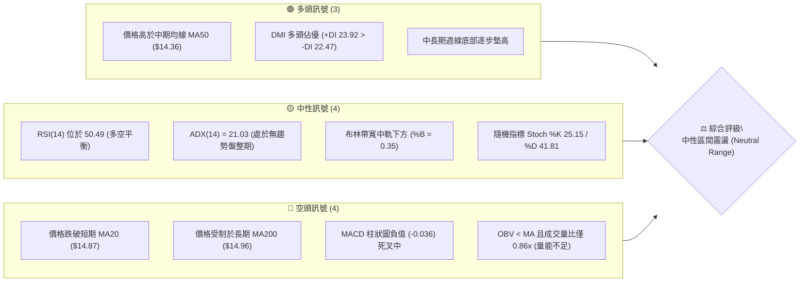
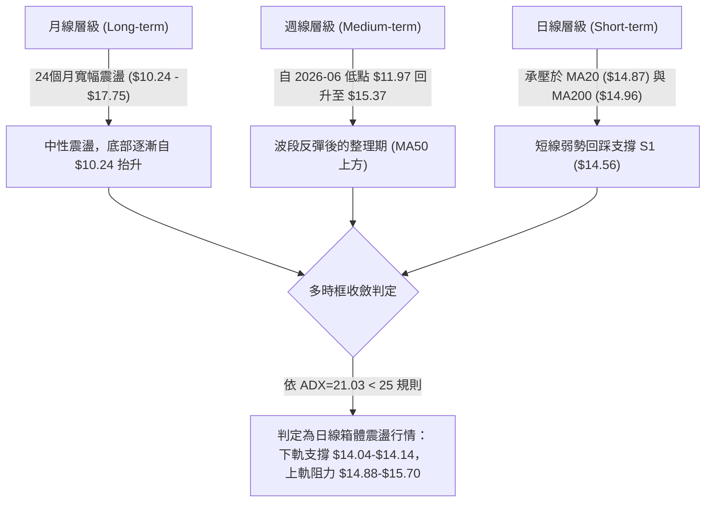
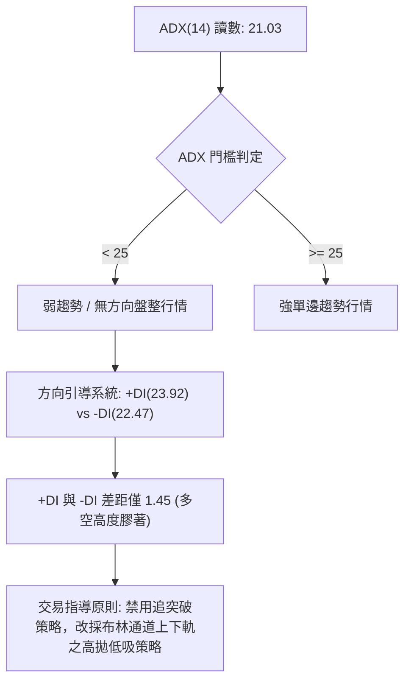
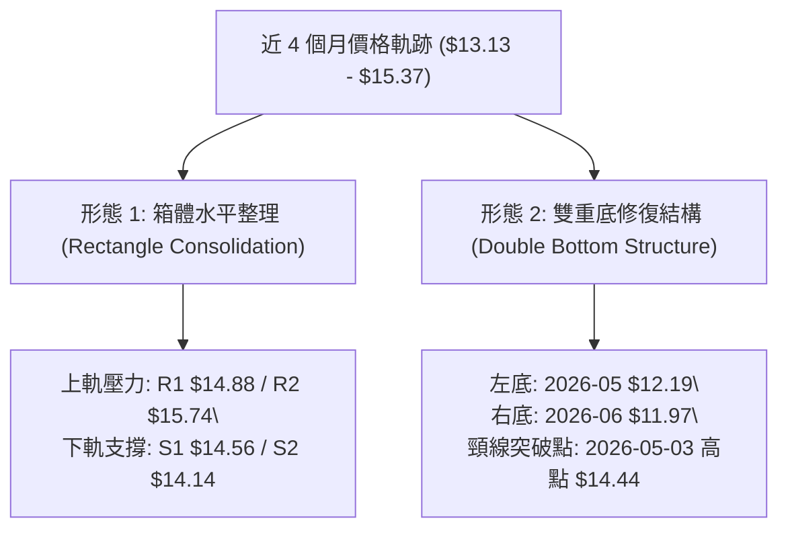
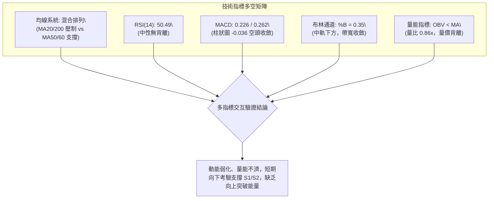
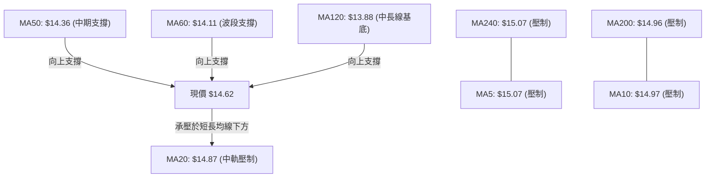
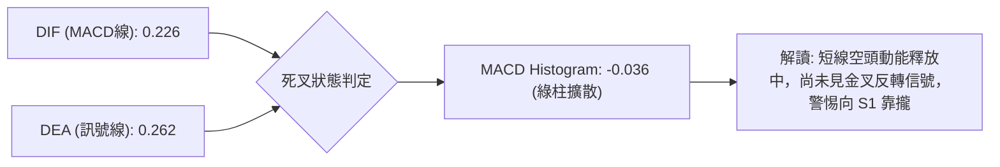
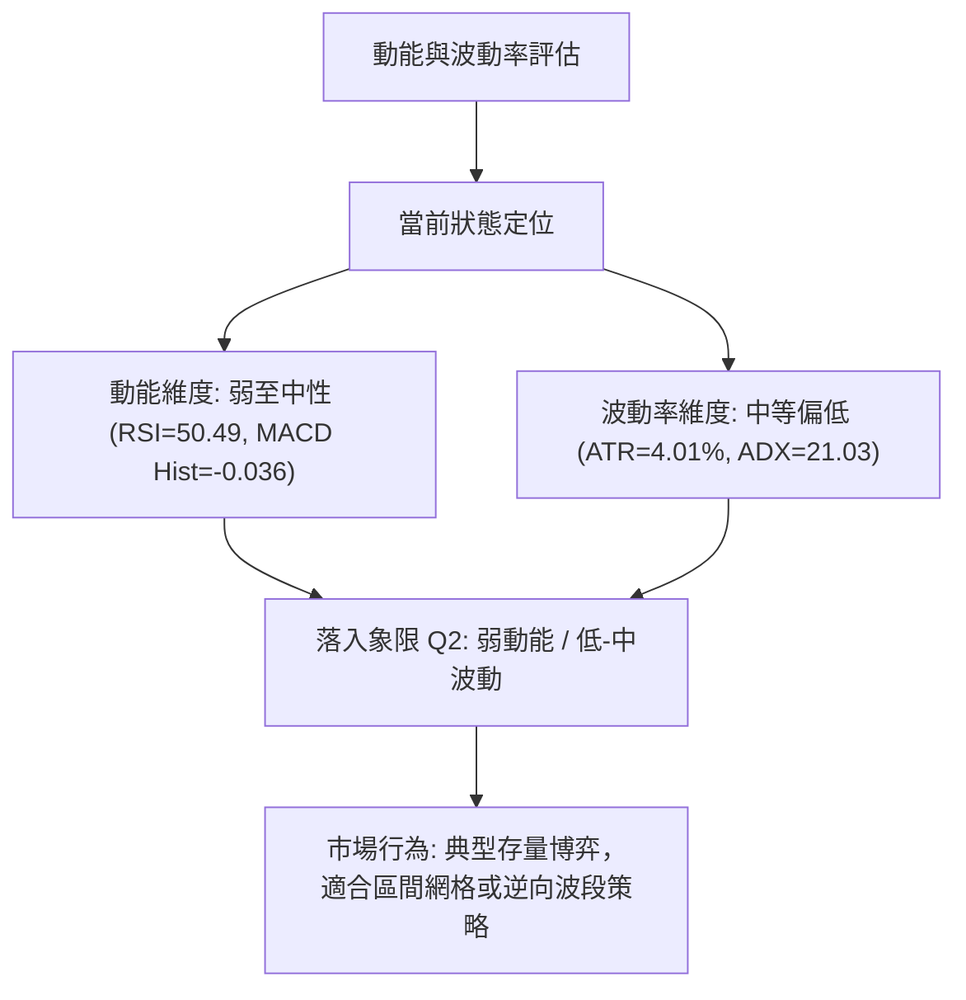
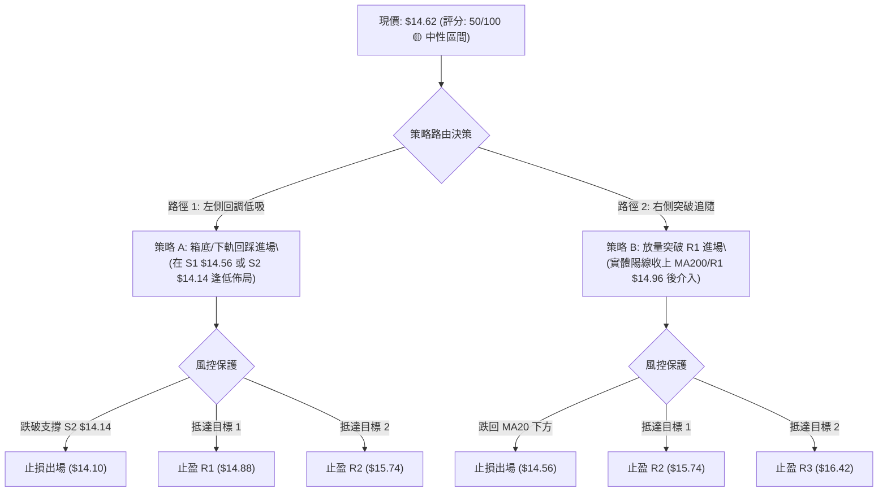
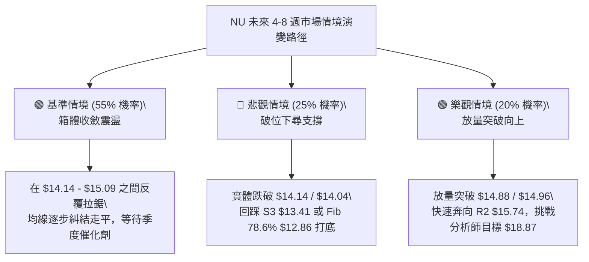

# NU 技術分析報告

> **報告日期**：2026-09-14 ｜ **語言**：繁體中文 ｜ **數據來源**：Yahoo Finance ｜ **當前價格**：$14.62

---

## 目錄

| 章節 | 內容 |
|------|------|
| [1. 技術面概覽](#1-技術面概覽) | 訊號儀表板、核心指標、評分卡 |
| [2. 趨勢分析](#2-趨勢分析) | 多時框趨勢、長中短期走勢 |
| [3. 圖表形態分析](#3-圖表形態分析) | 形態識別、K線組合、目標價 |
| [4. 支撐與阻力](#4-支撐與阻力) | 關鍵價位、斐波那契回調 |
| [5. 技術指標深度解讀](#5-技術指標深度解讀) | MA/RSI/MACD/布林/成交量 |
| [6. 動能與波動率](#6-動能與波動率) | 動能評估、ATR、Beta |
| [7. 多時框架總結](#7-多時框架總結) | 時框架評分矩陣、收斂結論 |
| [8. 交易策略建議](#8-交易策略建議) | 價格情境、主策略詳情、風報比 |
| [9. 風險提示與監控](#9-風險提示與監控) | 監控指標、情境風險、倉位管理 |
| [📋 報告總結](#-報告總結) | 核心結論與策略決策歸納 |

---

## 1. 技術面概覽

### 🎯 技術訊號儀表板



---

### 📊 核心指標速覽表

| 指標類別 | 指標名稱 | 當前數值 | 訊號 | 專業解讀 |
|:---|:---|:---:|:---:|:---|
| **價格** | 當前收盤價 | $14.62 | 🟡 | 位於52週區間44.0%分位，處於中軸震盪整理區 |
| **均線** | MA20 (短中軌) | $14.87 | 🔴 | 價格低於MA20 (-1.68%)，短期多頭動能受阻 |
| **均線** | MA50 (中期支撐) | $14.36 | 🟢 | 價格高於MA50 (+1.81%)，中期多頭結構尚未破壞 |
| **均線** | MA200 (長期牛熊) | $14.96 | 🔴 | 價格低於MA200 (-2.27%)，長期多頭反轉尚未確立 |
| **動能** | RSI(14) | 50.49 | 🟡 | 處於50多空中軸，無超買超賣，短線動能中性 |
| **動能** | MACD (12,26,9) | 0.226 / 0.262 | 🔴 | MACD線位於訊號線下方，柱狀圖 -0.036，短線偏弱 |
| **趨勢** | ADX(14) | 21.03 | 🟡 | ADX < 25 表明市場處於典型橫盤震盪，無強單邊趨勢 |
| **趨勢** | +DI / -DI | 23.92 / 22.47 | 🟢 | 多頭力量微幅領先，但兩者收斂，顯示拉鋸激烈 |
| **通道** | 布林帶 %B | 0.35 | 🟡 | 價格位於中軌($14.87)與下軌($14.04)間，偏向弱勢區間 |
| **成交量** | 20日量比 | 0.86x | 🔴 | 日成交量6,562萬股，低於20日均量7,595萬股，量縮整理 |
| **波動** | ATR(14) | $0.59 | 🟡 | 佔價格4.01%，波動處於中等水平，利於區間波段交易 |

---

### 🏆 技術評分卡

```
╔════════════════════════════════════════════════════════════════╗
║                   技術評分卡 — NU (2026-09-14)                 ║
╠════════════════════════════════════════════════════════════════╣
║ 趨勢強度 (ADX=21.03)    ████████░░░░░░░░░░░░  42/100   🔴 弱勢 ║
║ 動能指標 (RSI/MACD)     ██████████░░░░░░░░░░  50/100   🟡 中性 ║
║ 支撐穩定度 (S1/S2防守)  ██████████████░░░░░░  68/100   🟢 偏強 ║
║ 成交量配合 (OBV/量比)   ████████░░░░░░░░░░░░  38/100   🔴 疲弱 ║
║ 形態完整度 (箱體整理)   ████████████░░░░░░░░  60/100   🟡 中性 ║
║ 均線排列 (混合纏繞)     ████████░░░░░░░░░░░░  44/100   🔴 糾結 ║
╠════════════════════════════════════════════════════════════════╣
║ 綜合技術評分            ██████████░░░░░░░░░░  50/100   🟡 中性 ║
║ 評級結論：中性觀望 / 區間震盪操作（高拋低吸，嚴守支撐）        ║
╚════════════════════════════════════════════════════════════════╝
```

---

## 2. 趨勢分析

### 🌐 多時框趨勢分析



---

### 📈 長期趨勢 — 12個月走勢圖（Unicode）

以下為 NU 過去 12 個月（2025-10 至 2026-09）之月線收盤走勢與形態演變：

```
NU 月線收盤走勢圖（2025-10 至 2026-09）
價格 ($)
$18.00 ┤                               ● $17.75 (波段高點 2026-01)
$17.00 ┤        ● $16.11  ● $17.39  ● $16.74
$16.00 ┤   ● $16.01(2025-09)
$15.00 ┤                                         ● $14.98
$14.00 ┤                                              ● $14.37  ● $14.48            ● $14.62 (現價)
$13.00 ┤                                                           ● $13.13  ● $13.36  ● $14.33  ● $14.55
$12.00 ┤                                                               
$11.00 ┤
       └─────────────────────────────────────────────────────────────────────────────────────────────
         25-10   25-11   25-12   26-01   26-02   26-03   26-04   26-05   26-06   26-07   26-08   26-09
```

#### 走勢特徵分析表格

| 階段 | 時間區間 | 起止價格 | 累計漲跌 | 趨勢特徵與結構解讀 |
|:---|:---:|:---:|:---:|:---|
| **主升攻擊段** | 2025-09 ～ 2026-01 | $16.01 → $17.75 | +10.87% | 沿中長期上升通道推進，並於 2026-01 創下月線高點 $17.75（逼近52W高點 $18.98） |
| **大幅回撤段** | 2026-01 ～ 2026-05 | $17.75 → $13.13 | -26.03% | 獲利了結盤湧出，跌破中短期均線，週線一度於 2026-06-07 下探 $11.97 低位 |
| **築底修復段** | 2026-06 ～ 2026-09 | $13.13 → $14.62 | +11.35% | 在 $12.00 附近獲得強大機構買盤支撐，低點墊高，重回 $14.00-$15.00 密集籌碼區 |

---

### 📊 中期趨勢（週線分析）

從近 20 週收盤走勢觀察，NU 在 2026 年 5 月中旬至 6 月上旬經歷極端拋售，5 月 17 日週 RSI 觸及超賣極值 20.8、收盤 $12.19，6 月 7 日週創下收盤低點 $11.97。

隨後週線展開對稱型修復：
1. **量價齊揚**：7 月 19 日週成交量爆出 7.62 億股天量，推動價格自 $13.17 拔升突破 $14.00。
2. **遇阻回吐**：8 月 16 日週觸及 $15.23，隨後於 9 月 6 日週衝高至 $15.37，均在斐波那契 50.0% 回調位 ($15.09) 及阻力位 R1 ($14.88) 上方遭遇明顯獲利回吐賣壓。
3. **最新一週**：截至 2026-09-13 週收盤為 $14.62，週 MACD 柱狀圖收窄至 -0.036，週 RSI 降至 50.5，確立中期反彈步入「箱體震盪消化期」。

```
近期週線壓力與支撐架構示意：
  壓力區：$15.09 (Fib 50.0%) ── $15.37 (近期波段高點) ── $15.74 (阻力 R2)
              ▲
              │   (多頭受阻回落，目前於 $14.62 震盪)
              ▼
  支撐區：$14.56 (支撐 S1) ── $14.36 (MA50) ── $14.14 (支撐 S2 / Fib 61.8% $14.17)
```

---

### ⚡ 趨勢強度評估（ADX 解讀）



#### ADX 趨勢強度對照

| 數值區間 | 趨勢狀態 | 當前數值 | 當前適用之交易哲學與執行規則 |
|:---:|:---:|:---:|:---|
| 0 ～ 20 | 極弱 / 無趨勢 | — | 隨機漫步，避免進場 |
| **20 ～ 25** | **盤整 / 趨勢萌芽或消退** | **21.03 (NU)** | **區間震盪市。以布林通道、支撐阻力水平位操作，拒絕追高，跌破停損需果斷** |
| 25 ～ 40 | 強趨勢形成 | — | 順勢交易，回調均線加碼 |
| 40 以上 | 極強單邊 / 尾聲 | — | 趨勢擴張，隨時防範耗竭反轉 |

---

## 3. 圖表形態分析

### 🔍 形態識別系統

依據嚴格技術分析規則，本報告只確認數據明確支撐的幾何形態，避免主觀過度解讀。



#### 形態識別與信心度評估表

| 識別形態 | 信心度 (%) | 判定依據（引用數據） | 完成度 (%) | 理論目標價（計算式） |
|:---|:---:|:---|:---:|:---|
| **箱體橫盤整理**<br>(Rectangle) | **75%** | 價格於 $14.04 (BB下軌/S2) 至 $15.37 (近期高點) 之間進行收斂，ADX=21.03 相互驗證 | 85% | 向上突破：頸線 $15.37 + 箱高($15.37 - $14.14 = $1.23) = **$16.60**<br>(接近阻力位 R3: $16.42) |
| **中期雙底修復**<br>(Double Bottom) | **60%** | 2026-05-17 低點 $12.19 與 2026-06-07 低點 $11.97 構成雙底，頸線為 5月初高點 $14.44 已被實體陽線站上 | 100%<br>(已達標) | 頸線 $14.44 + 形態深度($14.44 - $11.97 = $2.47) = **$16.91**<br>(8-9月波段已完成第一階段反彈至 $15.37) |
| **頭肩底形態** | 35% | 數據中左肩與右肩不對稱，量能分佈不規則 | < 40% | *訊號不足，信心度低於50%，僅做指標型解讀，不納入計算* |

---

### 🕯️ 重要K線與週線組合分析

| 時間週期 | 收盤價 | K線 / 週線結構特徵 | 技術解讀 | 多空訊號 |
|:---:|:---:|:---|:---|:---:|
| 2026-07-19 週 | $13.59 | 爆出 7.62 億股長下影十字整理線 | 主力機構在 $13.00-$13.50 大量換手吸收籌碼，構成波段強支撐 | 🟢 強烈看多 |
| 2026-08-16 週 | $15.23 | 長實體陽線收於 $15.23，突破 MA50 | 突破阻力帶，短線多頭確立波段攻擊主導權 | 🟢 看多 |
| 2026-09-06 週 | $15.37 | 上影線長紅星線，成交量萎縮至 3.73 億股 | 價格挑戰 $15.50-$15.70 阻力區未果，量價背離顯現 | 🟡 滯漲訊號 |
| 2026-09-13 週 | $14.62 | 中陰線跌破 5 日與 10 日均線 | 短期多頭獲利回吐，價格跌回 MA20 ($14.87) 之下，進入防守 | 🔴 短線看空 |

---

### 📉 ASCII 走勢形態示意圖

```
NU 近期箱體震盪與形態關鍵點位示意：
$15.74 ┤                                                       [阻力 R2]
$15.37 ┤                   ╭───● (09-06 高點，箱頂假突破)
$14.88 ┤      ╭───────────╯      ╰─────╮                       [阻力 R1 / MA20 $14.87]
$14.62 ┤======│=======================● (當前現價 $14.62) ==== [箱體中軸]
$14.56 ┤      │                        ╰──●                   [支撐 S1]
$14.14 ┤  ╭──╯                                                [支撐 S2 / BB下軌 $14.04]
$13.13 ┤──╯ (2026-05/06 雙底打底區間)
       └─────────────────────────────────────────────────────────────
         2026-06            2026-07            2026-08       2026-09
```

---

### 🎯 形態目標價計算

1. **箱體突破向上計算（多頭情境）**：
   * 箱頂阻力取聚類高點 R1/近期波段高點：$15.37
   * 箱底支撐取聚類低點 S2：$14.14
   * 箱體垂直高度 $H = 15.37 - 14.14 = \$1.23$
   * 向上突破量度目標價：$T_{\text{UP}} = 15.37 + 1.23 = \mathbf{\$16.60}$（此價位與阻力位 R3 **$16.42** 高度聚類確認）。
2. **箱體跌破向下計算（空頭情境）**：
   * 若跌破 S2 ($14.14) 頸線支撐：
   * 向下跌破量度目標價：$T_{\text{DOWN}} = 14.14 - 1.23 = \mathbf{\$12.91}$（直接指向支撐 S3 **$13.41** 與 斐波那契 78.6% **$12.86** 的交集區間）。

---

## 4. 支撐與阻力

### 🗺️ 關鍵價位分布圖（Unicode）

```
NU 價位結構分布圖（OHLCV 聚類與斐波那契疊加）
═════════════════════════════════════════════════════════════════
$18.98 ║██████████████████████████████████║ 52W 最高點 / Fib 0.0%
$17.14 ║████████████████████████          ║ Fib 23.6% 回調位
$16.42 ║████████████████████████████      ║ 強阻力 R3 (形態量度目標 $16.60 聚類)
$16.01 ║████████████████████              ║ Fib 38.2% 回調位
$15.74 ║████████████████████████          ║ 阻力 R2 (布林上軌 $15.70 覆蓋)
$15.09 ║██████████████████                ║ Fib 50.0% 多空分水嶺
$14.88 ║████████████████████████████      ║ 關鍵阻力 R1 (MA20 $14.87 / MA200 $14.96)
╠══════╬══════════════════════════════════╣ ◄ 現價 $14.62 (位於 S1 與 R1 夾層)
$14.56 ║▓▓▓▓▓▓▓▓▓▓▓▓▓▓▓▓▓▓▓▓▓▓▓▓          ║ 即時支撐 S1 (距現價 -0.41%)
$14.14 ║██████████████████████████████    ║ 關鍵強支撐 S2 (Fib 61.8% $14.17 / BB下軌 $14.04)
$13.41 ║████████████████████              ║ 深度防守支撐 S3
$12.86 ║██████████████                    ║ Fib 78.6% 極限回調位
$11.20 ║██████████████████████████████████║ 52W 最低點 / Fib 100.0%
═════════════════════════════════════════════════════════════════
```

---

### 🚧 阻力位分析表

所有價位均來自近一年波段高點聚類計算，嚴禁估算：

| 阻力級別 | 準確價位 | 距離現價 | 技術形成原因與技術重疊性 | 突破難度 | 重要性權重 |
|:---:|:---:|:---:|:---|:---:|:---:|
| **R1** | **$14.88** | +1.80% | 短期均線 MA20 ($14.87) 與長期均線 MA200 ($14.96) 雙重死叉壓制位 | 🟡 中等 | ★★★★☆ |
| **R2** | **$15.74** | +7.68% | 日線布林通道上軌 ($15.70) 與 8 月衝高回落高點密集區 | 🔴 較高 | ★★★★☆ |
| **R3** | **$16.42** | +12.34% | 近一年密集套牢峰位、箱體向上量度等長目標 ($16.60) 前哨 | 🔴 極高 | ★★★★★ |

---

### 🛡️ 支撐位分析表

所有價位均來自近一年波段低點聚類計算：

| 支撐級別 | 準確價位 | 距離現價 | 技術形成原因與技術重疊性 | 守住機率 | 重要性權重 |
|:---:|:---:|:---:|:---|:---:|:---:|
| **S1** | **$14.56** | -0.41% | 近期日線微型波段防守點，跌破則宣告短線進入日線下軌回測 | 60% | ★★★☆☆ |
| **S2** | **$14.14** | -3.28% | 斐波那契黃金分割 61.8% ($14.17) 與日布林下軌 ($14.04) 形成之強共振帶 | 80% | ★★★★★ |
| **S3** | **$13.41** | -8.28% | 2026年6-7月波段放量起漲點，中長期多頭最後防禦壁壘 | 92% | ★★★★☆ |

---

### 📐 斐波那契回調位分析

依據 52 週絕對極值（高點 **$18.98** → 低點 **$11.20**，垂直落差 $7.78）計算之黃金分割系統：

| 斐波那契回調層級 | 官方精確價位 | 相對於當前價格 ($14.62) 之狀態與市場行為含義 |
|:---:|:---:|:---|
| **0.0% (52W High)** | **$18.98** | 歷史峰值，若重返此處需基本面與總體流動性強烈配合 |
| **23.6%** | **$17.14** | 2026-01 月線收盤壓力群 ($17.39-$17.75) 所在區域 |
| **38.2%** | **$16.01** | 多頭強勢回檔位，也是 2025 年 9-10 月盤整中軸 |
| **50.0%** | **$15.09** | **多空中線分水嶺**。目前價格在其下方，表明市場整體仍處偏弱半區 |
| **當前現價區間** | **$14.62** | **現價落於 50.0% ($15.09) 與 61.8% ($14.17) 之間，屬於典型防守震盪區** |
| **61.8%** | **$14.17** | **黃金分割關鍵防線**，與支撐 S2 ($14.14) 完美重疊，為多頭底線 |
| **78.6%** | **$12.86** | 深度探底防守位，跌破將引發向 52W 低點靠攏的恐慌拋售 |
| **100.0% (52W Low)**| **$11.20** | 年度極限低點，強勁價值投資買盤錨定點 |

---

## 5. 技術指標深度解讀

### 🎛️ 指標訊號總覽



---

### 📈 移動平均線排列分析



#### 均線數據與走勢狀態解析

*   **短期均線（MA5: $15.07 / MA10: $14.97 / MA20: $14.87）**：呈現微幅空頭排列，價格均處其下（-1.68% 至 -2.97%）。斜率向下彎頭，構成當前 $14.87-$15.07 的短線天花板。
*   **中長期均線（MA50: $14.36 / MA60: $14.11 / MA120: $13.88）**：呈現多頭排列且持續向上發散（MA60 上漲 +3.59%，MA120 上漲 +5.33%），顯示自 6 月以來的波段多頭趨勢在 $14.11-$14.36 具備實質承接力。
*   **長期均線（MA200: $14.96 / MA240: $15.07）**：價格在 MA200 下方 2.27%，且 MA200 走平，代表長線牛熊交界點尚未形成實質突破。
*   **排列總結**：標準的「**三明治夾層結構**」——上方受制於 MA20/MA200，下方受託於 MA50/MA60，宣告震盪整理為唯一解。

---

### 📉 RSI(14) 分析

*   **數值展示**：`50.49`
```
RSI(14) 刻度儀錶：
0 ──────────── 30 ──────────────── 50.49 ─────────────── 70 ──────────── 100
[   超賣區   ]    [    弱勢區    ]      ●     [    強勢區    ]    [   超買區   ]
進度條：██████████░░░░░░░░░░ 50.49%
```
*   **超買/超賣評估**：位於中軸 50 附近，無任何極端超買或超賣跡象。
*   **背離分析**：
    *   **頂背離檢驗**：8 月 16 日價格 $15.23（週 RSI 58.0）與 9 月 6 日價格 $15.37（週 RSI 56.6），週線 RSI 出現輕微的「價格創微幅新高而 RSI 未創新高」之**潛在頂背離雛形**，促成隨後的短線回踩。
    *   **日線檢驗**：日線 RSI 目前平穩運行，數據中顯示無明顯底背離或結構性頂背離，市場處於動能再平衡階段。

---

### 📊 MACD(12,26,9) 訊號解讀



*   **核心參數**：MACD = 0.226，Signal = 0.262，Histogram = -0.036。
*   **技術解讀**：MACD 線跌破 Signal 線，雖然兩者數值均在零軸上方（顯示中期多頭元氣未傷），但柱狀圖負值進一步拉開，表明自 $15.37 的回檔修正仍在進行中。在柱狀圖縮腳向上前，不宜盲目左側重倉做多。

---

### 📦 布林通道分析（Bollinger Bands）

```
NU 日線布林通道 (20, 2) 結構圖：
$15.70 ┼─────────────────────────────────────── 上軌 (BB Upper)
       │                        ╭─╮
$14.87 ┼───────────────────────╭╯─╰─── 中軌 (MA20)
       │                      ╭╯
$14.62 ┼══════════════════════●════════ 當前價格 ($14.62, %B = 0.35)
       │                     ╰╮
$14.04 ┼───────────────────────╰─────── 下軌 (BB Lower)
```

*   **通道參數**：上軌 $15.70 ｜ 中軌 $14.87 ｜ 下軌 $14.04。
*   **%B 指標分析**：當前 `%B = 0.35`，處於 0.0 至 0.5 之間的空頭優勢區間，表明價格正朝布林下軌方向運動。
*   **帶寬狀態**：布林通道上下軌帶寬為 $\$15.70 - \$14.04 = \$1.66$（約 11.3% 帶寬），通道未顯著擴張，呈現典型收斂走平形態，支持布林下軌 $14.04 具有高勝率支撐效應。

---

### 💹 成交量分析（量價配合度）

1.  **量比與均量對比**：最新日成交量為 **65,629,100 股**，相對於 20 日均量 **75,958,795 股**，量比僅為 **0.86x**；相較於 50 日均量 83,482,920 股更是萎縮 21.4%。
2.  **OBV 能量潮判斷**：數據明確提示「**OBV < MA → 量能疲弱**」。OBV 指標運行在均線下方，說明在近期的震盪過程中，資金流出略大於流入，無增量機構資金追價意願。
3.  **量價關係結論**：價格回跌伴隨成交量縮小，屬於「縮量回調」性質，並非恐慌性崩跌；然而缺乏成交量支撐也意味著無法發動對 MA200 ($14.96) 及 R1 ($14.88) 的有效突圍。

---

## 6. 動能與波動率

### ⚡ 動能評估四象限



#### 四象限特徵定位表

| 象限 | 動能強度 | 波動率水平 | 當前標的狀態 | 專業操作指引 |
|:---:|:---:|:---:|:---:|:---|
| **Q1** | 強 | 低 | — | 最佳趨勢加碼點，穩定爬升 |
| **Q2** | **弱 / 中性** | **中等 / 偏低** | **✓ NU ($14.62)** | **謹慎觀望，採用水平支撐阻力高拋低吸，嚴格控制部位** |
| **Q3** | 強 | 高 | — | 突破單邊擴張期，需緊盯移動停利 |
| **Q4** | 弱 | 高 | — | 恐慌崩跌或劇烈洗盤，嚴禁操作 |

---

### 📊 ATR 波動率分析

*   **ATR(14) 數值**：**$0.59**（佔現價百分比為 **4.01%**）。
*   **日內平均波幅意義**：意味著在 68% 的概率分佈下，NU 每日正常隨機波動區間約為 $\pm \$0.59$。
*   **止損與倉位量化指導**：
    *   **短期波段防守點距**：建議設定為 $1.0 \times \text{ATR} = \$0.59$。若進場點在 S1 ($14.56)，常規雜訊過濾停損應設於 $14.56 - 0.59 = \$13.97$（剛好保護在日線布林下軌 $14.04 之外）。
    *   **緊湊防守點距**：以 $0.7 \times \text{ATR} \approx \$0.42$，正好對應支撐 S2 ($14.14)，具有極高的幾何與波動率共振保護效果。

---

### 📐 Beta 與市場相關性

*   **Beta 係數**：**0.94**。
*   **市場風險特徵**：Beta 略低於大盤基準 1.00，表明 NU 與標普 500 / 納斯達克大盤指數具備高度同步性，但波動彈性微幅鈍化。在當前無自身重大催化劑（近期新聞為無）的情況下，股價易受美股整體金融科技與拉美新興市場 ETF 資金流動牽引。
*   **做空比率與籌碼結構**：空頭佔浮流通股比率（Short % Float）為 **4.1%**，空頭回補天數（Short Ratio）為 **2.28 天**。空頭籌碼處於健康低位，既無逼空（Short Squeeze）潛力，亦無過度集中做空的崩盤壓力；機構持股比例高達 **82.0%**，籌碼鎖定度高，大幅限制了斷崖式下墜風險。

---

## 7. 多時框架總結

### 📋 時框架評分表

| 時框架 | 趨勢方向 | 動能狀態 | 均線排列狀況 | 主要圖表形態 | 維度評分 | 戰術建議 |
|:---:|:---:|:---:|:---:|:---:|:---:|:---|
| **日線 (Daily)** | 🔴 偏空回調 | 弱勢 (MACD負柱) | 承壓於 MA20/MA200 | 向布林下軌靠攏尋求支撐 | 44 / 100 | 短線切勿追高，等待回踩 S1/S2 確認點 |
| **週線 (Weekly)** | 🟢 震盪築底 | 中性 (RSI=50.5) | 站穩 MA50，低點墊高 | 自 6 月低點 $11.97 展開之雙底反彈 | 58 / 100 | 中期結構穩定，持股者可繼續沿 MA50 續抱 |
| **月線 (Monthly)**| 🟡 寬幅箱體 | 均衡 (處2年區間中段)| 糾結於 $14.00-$15.00 | $10.24 - $17.75 宏觀平衡箱體 | 50 / 100 | 適合中長線價值投資者逢低定投配置 |

---

### 🔲 綜合訊號矩陣

| 技術面向 | 短期（日線）訊號 | 中期（週線）訊號 | 長期（月線）訊號 | 多時框一致性判定 |
|:---|:---:|:---:|:---:|:---|
| **價格與形態** | 🔴 跌破 MA20，測試 S1 | 🟢 站穩 MA50，形態完好 | 🟡 位於 24 個月區間中樞 | 分化（短空長多） |
| **動能指標** | 🔴 MACD 死叉，綠柱擴大 | 🟡 週 MACD 接近零軸歸位 | 🟡 RSI 位於中性 50 | 偏弱收斂 |
| **成交量配合** | 🔴 量縮 (量比 0.86x) | 🟢 7-8 月放量奠定底部 | 🟡 月成交量逐步萎縮 | 缺乏突破動能 |
| **波動帶位置** | 🔴 %B = 0.35，向軌底滑落 | 🟢 運行於週線中軌上方 | 🟡 位於通道中帶 | 短期面臨下軌考驗 |

---

### ⚖️ 多時框收斂結論

依據嚴格技術規則 14 執行多時框收斂判定：
1.  **趨勢強度判斷**：ADX(14) 讀數為 **21.03**，明確小於 25 臨界線，技術架構定義為**典型盤整行情（Ranging Market）**。
2.  **交易主導法則**：在 ADX < 25 之盤整行情下，單邊均線趨勢系統失效，**以日線布林通道上下軌（$14.04 - $15.70）與波段支撐阻力為核心交易依歸**。
3.  **時框衝突收斂**：日線短期的 MACD 空頭回調訊號，正被週線 MA50 ($14.36) 與強支撐 S2 ($14.14) 所承接。因此，日線回調不構成反轉暴跌，而是提供了回踩布林通道下軌的**低吸博弈機會**。
4.  **唯一定向結論**：**中性偏多防守震盪（Neutral to Range-Bound Buy on Dips）**。

---

## 8. 交易策略建議

### 🗺️ 策略決策流程圖



---

### 🧭 策略路由（依評分卡分流）

> **當前主策略方向 = 區間操作（綜合評分 50/100）**
> 
> 由於綜合評分恰好位於 40–60 中性區間，且 ADX = 21.03 表明單邊趨勢缺位，**主策略嚴禁兩頭盲目押注，嚴格鎖定「布林通道上下軌震盪區間交易」**。核心方針為：**靠近布林下軌與關鍵支撐分批承接，靠近阻力位果斷獲利了結**。

---

### 🎯 價格情境階梯（Price Scenarios）

所有價位均嚴格引用第 4 章聚類計算數值：

| 觸發條件與關鍵價位 | 下一目標價位 | 後續延伸目標 | 技術情境結構含義 |
|:---|:---:|:---:|:---|
| **強勢突破 R1 ($14.88)** | **R2 ($15.74)** | **R3 ($16.42)** | 克服短期 MA20 與長期 MA200 壓制，箱體向上擴張，轉為強單邊 |
| **站穩現價區間 ($14.56-$14.88)** | — | — | 於 MA50 與 MA20 之間收斂蓄勢，消化浮額籌碼，維持區間震盪 |
| **跌破 S1 ($14.56)** | **S2 ($14.14)** | **S3 ($13.41)** | 短期多頭防線失守，向下回測黃金分割 61.8% 及日布林下軌 ($14.04) |

---

### 📊 情境機率分佈

```
情境機率分佈視覺化：
[ 繼續上行突破 (20%) ] ████░░░░░░░░░░░░░░░░
[ 區間震盪整理 (55%) ] ███████████░░░░░░░░░
[ 回落考驗強支撐 (25%) ] █████░░░░░░░░░░░░░░░
```

| 演變情境 | 機率估計 | 技術指標與量能支持依據 |
|:---|:---:|:---|
| **區間震盪整理** | **55%** | ADX 僅 21.03，日成交量縮小至均量 0.86x，多空雙方皆缺乏推動大波段的動能 |
| **回落測試 S2 支撐** | **25%** | MACD 柱狀圖處於 -0.036 負向擴散，且價格低於 MA20，短期仍具下行慣性 |
| **強勢放量向上突破** | **20%** | OBV 依然在均線下方，突破 R1/MA200 必須要求日成交量放大至 8,000 萬股以上 |

---

### 🟢 主策略詳情（區間高拋低吸與右側突破）

| 策略要素 | 策略 A：左側支撐低吸（首選） | 策略 B：右側突破追隨（次選） |
|:---|:---:|:---:|
| **策略類型** | 箱體下軌逆向波段操作 | 阻力放量突破順勢操作 |
| **進場條件** | 價格回踩 S1-S2 區間企穩，且日線不破布林下軌 | 日線實體陽線收盤站上 R1 ($14.88) 及 MA200 ($14.96) |
| **進場價格** | **$14.56**（S1 附近掛單或回踩確認） | **$14.98**（突破 MA200 後確認） |
| **止損價格** | **$14.10**（跌破 S2 $14.14 與布林下軌 $14.04） | **$14.56**（跌回 S1 支撐位下方） |
| **目標價 T1** | **$14.88**（阻力位 R1 / 短期均線壓制） | **$15.74**（阻力位 R2 / 布林上軌） |
| **目標價 T2** | **$15.74**（阻力位 R2 / 斐波那契 50% 突破延伸）| **$16.42**（阻力位 R3 / 箱體等長量度目標）|
| **風險空間** | $\$14.56 - \$14.10 = \$0.46$ | $\$14.98 - \$14.56 = \$0.42$ |
| **獲利空間 (T2)** | $\$15.74 - \$14.56 = \$1.18$ | $\$16.42 - \$14.98 = \$1.44$ |
| **風險報酬比 (R:R)**| **1 : 2.57**（達到優秀標準） | **1 : 3.43**（達到卓越標準） |
| **預期勝率** | 65% | 45% |
| **建議配置倉位** | **總倉位 10% - 15%** | **總倉位 5% - 10%（確認後再加碼）** |

---

### 🔴 反向風險觸發點（對沖提示）

以下關鍵訊號若觸發，將徹底推翻上述震盪偏多策略，投資者應立即啟動防守對沖：
1.  **實體跌破 $14.14 (S2 / Fib 61.8%)**：若日線收盤價跌破 $14.14 且成交量放大，意味著中期雙底形態被破壞，價格將打開通往 S3 ($13.41) 甚至 52W 低點區間的下行空間，**主策略多單必須無條件止損出局**。
2.  **MACD 綠柱極端放大且 ADX 上穿 25**：若在下跌過程中 ADX 自 21 向上突破 25，表明單邊空頭趨勢確立，嚴禁任何左側摸底補倉行為。

---

### ⭐ 整體訊號強度評星

```
╔════════════════════════════════════════════════╗
║ 做多訊號強度：  ★★☆☆☆  (2.5/5星 — 缺乏量能確認)║
║ 做空訊號強度：  ★★☆☆☆  (2.5/5星 — 中期底座強韌)║
║ 區間操作適宜度：★★★★☆  (4.0/5星 — 完美契合盤整)║
║ 整體技術可信度：★★★★☆  (4.0/5星 — 價位聚類完整)║
╚════════════════════════════════════════════════╝
```

---

## 9. 風險提示與監控

### ✅ 關鍵監控指標 Checklist

```
╔════════════════════════════════════════════════════════════════╗
║                 每日/每週 關鍵技術指標監控清單                 ║
╠════════════════════════════════════════════════════════════════╣
║ [ ] 價格是否跌破即時防守位 S1 ($14.56)？                      ║
║ [ ] 日線布林下軌 $14.04 與 S2 ($14.14) 共振帶是否有效獲撐？   ║
║ [ ] 日成交量是否恢復至 20 日均量 (7,595 萬股) 之上？           ║
║ [ ] MACD Histogram 柱狀圖是否由負轉正 (向上收斂縮腳)？        ║
║ [ ] ADX(14) 讀數是否突破 25 臨界點 (宣告單邊行情啟動)？       ║
║ [ ] 價格是否帶量收復關鍵阻力 R1 ($14.88) 及 MA200 ($14.96)？   ║
╚════════════════════════════════════════════════════════════════╝
```

---

### ⚠️ 風險場景分析



---

### 🛡️ 風險管理重要提醒

1.  **嚴格執行資金管理規則**：
    *   在 ADX < 25 的盤整市中，單筆交易的最大資金回撤風險不得超過投資組合總權益的 **1.0%**。
    *   以策略 A 為例（進場 $14.56，止損 $14.10，每股風險 $0.46），若帳戶總資產為 $100,000 美元，單筆最大允許虧損為 $1,000 美元，則最大開倉股數應嚴格限制為：
      $$\text{倉位股數} = \frac{\$1,000}{\$0.46} \approx 2,170 \text{ 股（約佔名義市值 } \$31,600 \text{ 美元）}$$
2.  **拒絕浮虧加碼**：若價格擊穿 S1 之後沒有在 S2 ($14.14) 出現明顯縮量陽線反抽，嚴禁進行金字塔式向下攤平。
3.  **機構籌碼環境解讀**：機構持股高達 82.0%，且華爾街 22 位分析師綜合共識為「買入（Buy）」、平均目標價高達 **$18.87**（上行空間 +29.07%）。這說明長期基本面極具支撐，近期的技術性下沉主要由技術性量能疲弱與短線籌碼回吐驅動，不必過度恐慌，以震盪思路應對即可。

---

## 📋 報告總結

```
╔══════════════════════════════════════════════════════════════════════╗
║                       NU 技術分析報告總結                            ║
╠══════════════════════════════════════════════════════════════════════╣
║ 報告日期：2026-09-14                                                 ║
║ 當前價格：$14.62                                                     ║
║ 分析評級：⚖️ 中性觀望 / 區間震盪操作 (Neutral Range-Bound)          ║
║                                                                      ║
║ 關鍵維度結論：                                                       ║
║ ├─ 長期趨勢：🟡 月線寬幅震盪 ($10.24 - $17.75)，低點逐步上移         ║
║ ├─ 中期趨勢：🟢 週線站穩 MA50 ($14.36)，自 6 月低點走出修復雙底     ║
║ ├─ 短期趨勢：🔴 日線承壓於 MA20 ($14.87)，MACD 死叉考驗 S1 ($14.56)  ║
║ ├─ 關鍵支撐：S1: $14.56 ｜ S2: $14.14 (極強防線) ｜ S3: $13.41       ║
║ ├─ 關鍵阻力：R1: $14.88 ｜ R2: $15.74 ｜ R3: $16.42                  ║
║ └─ 分析師目標：均價 $18.87 (高點 $23.00 / 低點 $12.00)               ║
║                                                                      ║
║ 最優策略組合建議：                                                   ║
║ 1. 🥇 最佳機會（首選）：策略 A — 回踩 S1 ($14.56) 至 S2 ($14.14) 區間 ║
║    逢低做多，止損設於 $14.10，目標價看至 $14.88 與 $15.74 (R:R 1:2.57)║
║ 2. 🥈 次選機會：策略 B — 靜待日線實體陽線收盤突破 R1 ($14.88) 後， ║
║    右側追隨做多，止損設於 $14.56，目標看至 $15.74 與 $16.42          ║
║ 3. 🥉 保守選擇：維持 70% 現金觀望，等待 ADX 回升至 25 以上、量能突破  ║
║    8,000 萬股確立新單邊方向後，再行順勢跟進。                        ║
╚══════════════════════════════════════════════════════════════════════╝
```

---

> ⚠️ **免責聲明**：本報告為依據客觀量化技術指標與歷史走勢數據生成之專業技術分析研究，文中所引用之所有支撐阻力點位、波動幅度、斐波那契回調位及策略回測數據均基於歷史價格推算。本報告**僅供學術研究與投資決策參考**，**不構成任何要約、推薦或投資操作建議**。金融市場瞬息萬變，技術指標存在滯後性與失效風險，投資人應自行承擔交易風險並做好倉位風控。

---

*報告生成時間：2026-09-14 ｜ 數據來源：Yahoo Finance ｜ 分析框架：多時框技術分析體系（MTFA）*