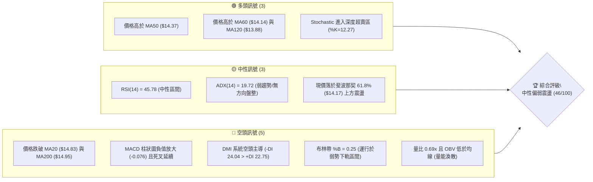
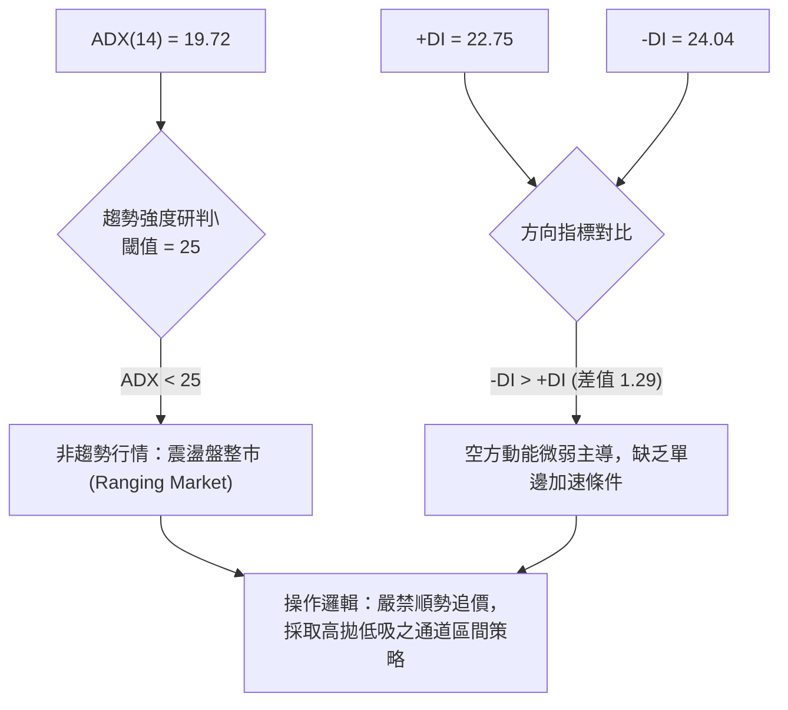
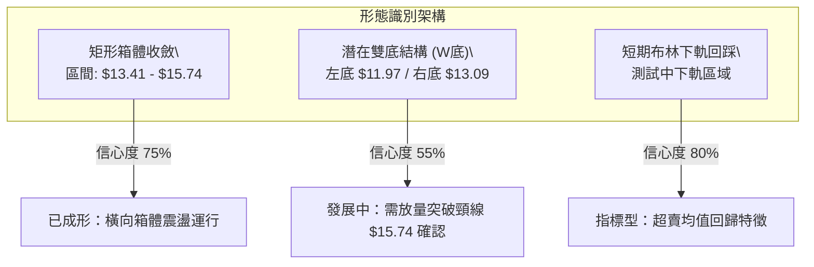
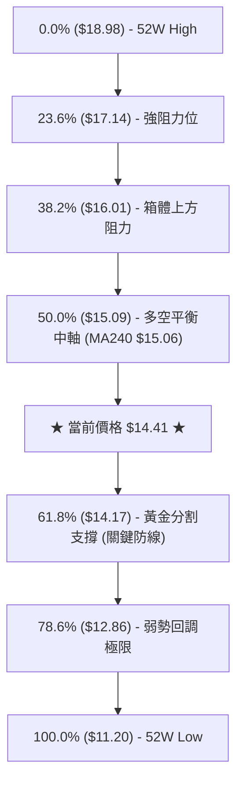
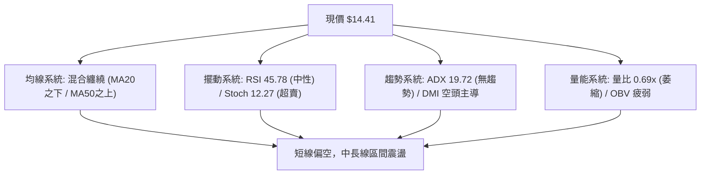
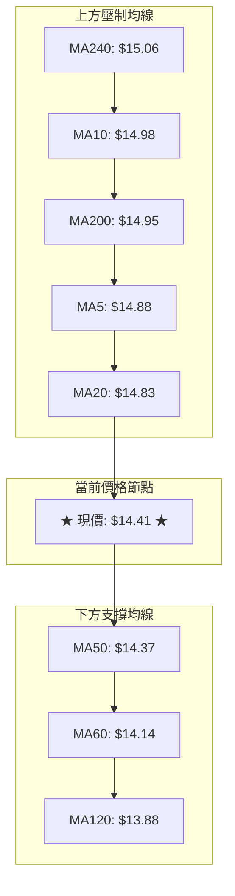
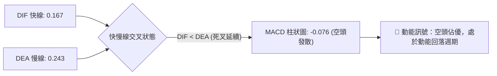
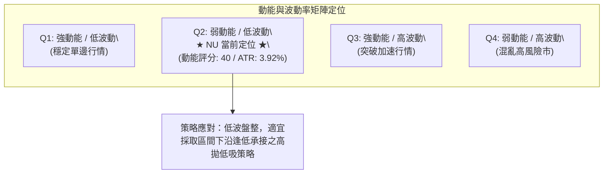
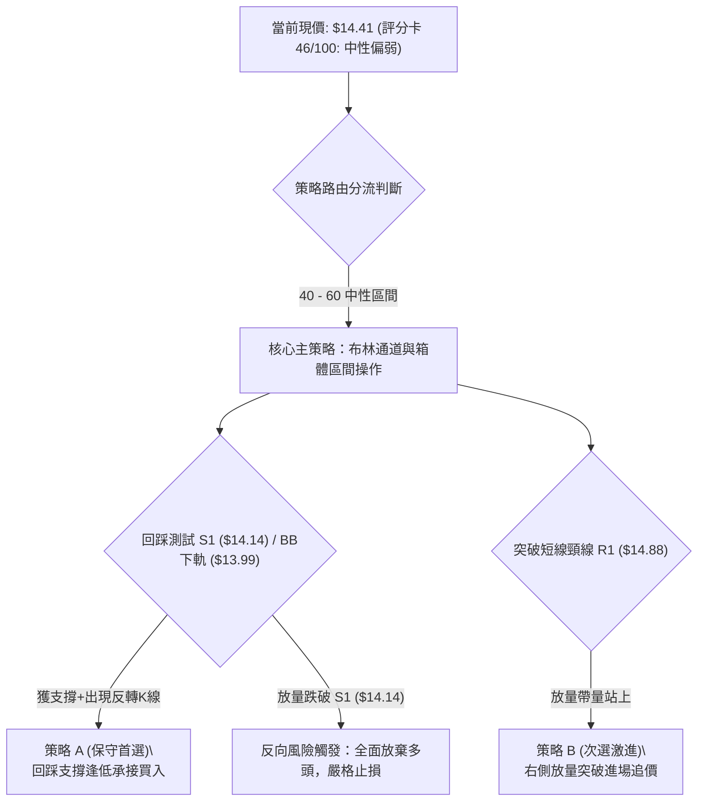
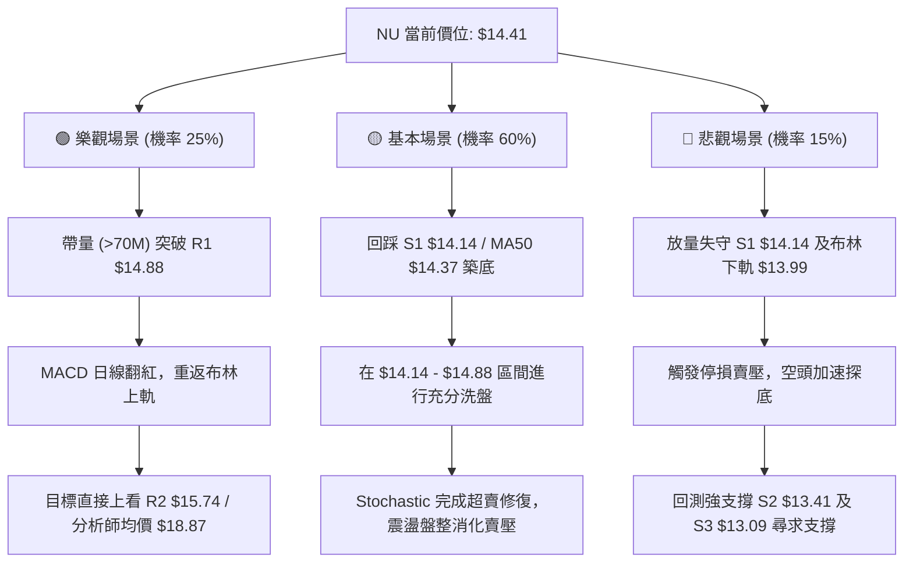

# NU 技術分析報告

> **報告日期**：2026-09-15 ｜ **語言**：繁體中文 ｜ **數據來源**：Yahoo Finance ｜ **當前價格**：$14.41

---

## 目錄

| 章節 | 內容 |
|------|------|
| [1. 技術面概覽](#1-技術面概覽) | 訊號儀表板、核心指標、評分卡 |
| [2. 趨勢分析](#2-趨勢分析) | 多時框趨勢、長中短期走勢 |
| [3. 圖表形態分析](#3-圖表形態分析) | 形態識別、K線組合、目標價 |
| [4. 支撐與阻力](#4-支撐與阻力) | 關鍵價位、斐波那契回調 |
| [5. 技術指標深度解讀](#5-技術指標深度解讀) | MA/RSI/MACD/布林/成交量 |
| [6. 動能與波動率](#6-動能與波動率) | 動能評估、ATR、Beta |
| [7. 多時框架總結](#7-多時框架總結) | 時框架評分矩陣 |
| [8. 交易策略建議](#8-交易策略建議) | 多空策略、風險報酬比 |
| [9. 風險提示與監控](#9-風險提示與監控) | 監控指標、風險場景 |

---

## 1. 技術面概覽

### 🎯 技術訊號儀表板



### 📊 核心指標速覽表

| 指標類別 | 指標名稱 | 當前數值 | 訊號 | 解讀 |
|----------|----------|----------|------|------|
| **價格** | 當前價格 | $14.41 | 🟡 | 位於52週區間41.3%分位，夾於均線密集交織區 |
| **均線** | MA20 | $14.83 | 🔴 | 價格低於MA20達 -2.83%，短線承壓於月均線 |
| **均線** | MA50 | $14.37 | 🟢 | 現價微幅高於季線 +0.28%，形成第一道動態防守 |
| **均線** | MA200 | $14.95 | 🔴 | 價格受制於年線下方 -3.61%，長線牛熊分水嶺未收復 |
| **動能** | RSI(14) | 45.78 | 🟡 | 位於 40–50 中性格局，空方稍佔優勢但未失控 |
| **動能** | MACD Hist | -0.076 | 🔴 | DIF(0.167) 跌破 DEA(0.243)，動能柱連續走跌 |
| **擺動** | Stoch %K/%D | 12.27 / 29.04 | 🟢 | 進入超賣區，短線具備技術性均值回歸彈升契機 |
| **趨勢** | ADX(14) | 19.72 | 🟡 | ADX < 25 指示無明顯單邊趨勢，進入箱體震盪盤整 |
| **通道** | 布林 %B | 0.25 | 🔴 | 運行於中軌($14.83)與下軌($13.99)之間，短線偏弱 |
| **成交量** | 20日量比 | 0.69x | 🔴 | 成交量僅 48.57M，低於20日均量(70.57M)，量能疲弱 |

### 🏆 技術評分卡

```
╔══════════════════════════════════════════════════════════════╗
║                 技術評分卡 — NU (2026-09-15)                ║
╠══════════════════════════════════════════════════════════════╣
║ 趨勢強度      ██████░░░░░░░░░░░░░░  32/100  🔴 空頭弱勢      ║
║ 動能指標      ████████░░░░░░░░░░░░  40/100  🔴 動能轉弱      ║
║ 支撐穩定度    ████████████░░░░░░░░  60/100  🟢 季線/S1有撐   ║
║ 成交量配合    ██████░░░░░░░░░░░░░░  30/100  🔴 量價背離弱勢  ║
║ 形態完整度    ██████████░░░░░░░░░░  52/100  🟡 箱體收斂盤整  ║
║ 均線排列      ████████░░░░░░░░░░░░  42/100  🔴 均線交纏受阻  ║
╠══════════════════════════════════════════════════════════════╣
║ 綜合評分      █████████░░░░░░░░░░░  46/100  🟡 中性偏弱觀望  ║
╚══════════════════════════════════════════════════════════════╝
```

---

## 2. 趨勢分析

### 🌐 多時框趨勢分析

```mermaid
graph TD
    M["月線框架 (長線)"] -->|"2026-01觸頂$17.75後回調，守穩$13.00之上"| M_STAT["🟡 寬幅箱體盤整 (Neutral)"]
    W["週線框架 (中線)"] -->|"2026-05低點$11.97築底反彈，承壓於$15.37"| W_STAT["🟡 反彈受阻震盪 (Consolidation)"]
    D["日線框架 (短線)"] -->|"跌破MA20與MA200，受制於R1("$14.88")"| D_STAT["🔴 短線空頭回踩 (Bearish Drift)"]
    
    M_STAT --> SYNTHESIS{"多時框收斂判定"}
    W_STAT --> SYNTHESIS
    D_STAT --> SYNTHESIS
    SYNTHESIS --> FINAL["⚡ ADX=19.72 < 25：確立為日線區間震盪盤整市"]
```

### 📈 長期趨勢 — 12個月走勢圖（Unicode）

```
NU 月線走勢圖（過去12個月：2025-10 至 2026-09）
價格軸 ($)
$18.00 ┤                               ●(2026-01: $17.75 高點)
$17.50 ┤                       ●($17.39)
$17.00 ┤                            ●($16.74)
$16.50 ┤
$16.00 ┤●($16.11)
$15.50 ┤
$15.00 ┤                                    ●($14.98)
$14.50 ┤                                         ●    ●        ●←現在($14.41)
$14.00 ┤                                              ($14.48) ●($14.33)
$13.50 ┤                                                   ●($13.36)
$13.00 ┤                                              ●($13.13)
       └────────────────────────────────────────────────────────────────
        10   11   12   01   02   03   04   05   06   07   08   09 (月份)
       [----- 2025 -----] [------------------- 2026 -------------------]
```

#### 走勢特徵分析表格

| 階段區間 | 時間跨度 | 起訖價位 | 漲跌幅 | 結構性特徵與技術解讀 |
|----------|----------|----------|--------|----------------------|
| **衝頂突破期** | 2025-10 ～ 2026-01 | $16.11 → $17.75 | +10.18% | 呈現強勁單邊多頭推升，創下波段歷史次高點 $17.75 |
| **快速獲利了結** | 2026-01 ～ 2026-03 | $17.75 → $14.37 | -19.04% | 遭遇獲利回吐賣壓，長黑跌破短天期均線，動能大幅宣洩 |
| **築底與破底洗盤** | 2026-03 ～ 2026-05 | $14.37 → $13.13 | -8.63% | 回測下探 2026-05 之 $13.13（週線最低見 $11.97），完成空頭釋放 |
| **低位震盪修復** | 2026-05 ～ 2026-09 | $13.13 → $14.41 | +9.75% | 自低檔反彈回升，重返 MA50($14.37) 上方，目前於 $14.00–$15.00 築底 |

### 📊 中期趨勢（週線分析）

```
近20週價格通道與壓撐位示意圖：
  $16.00 ┼────────────────────────────────────────────────────────── (強壓力帶 R2: $15.74)
         │                                              ●($15.37)
  $15.00 ┼──────────────────────────────────────●($15.23)───────▲──────── (波段頸線 R1: $14.88)
         │                                       ▼        ●($14.62)
  $14.00 ┼───────────────●($13.61)─●($14.09)─●($14.33)───────────●($14.41 現價)
         │   ●($13.13)   ▲                                
  $13.00 ┼───▲───────────┴───────────────────────────────────────── (強支撐帶 S2: $13.41)
         │   ●($12.19)
  $12.00 ┼─●($11.97 破底翻底點)────────────────────────────────────── (極限底 S3: $13.09 / 52W低 $11.20)
         └──────────────────────────────────────────────────────────
          05/17  06/07   06/28   07/19    08/09   08/30    09/20
```

週線數據顯示，股價自 2026-06-07 探底 $11.97 觸發強勁買盤（週成交量爆出 4.73 億股）形成破底翻後，連續拉出溫和上升波段。但 2026-09-06 週線觸及 $15.37 遇阻後，MACD 週柱狀圖迅速自 +0.064 翻負至 -0.076，週 RSI 亦由 56.6 回落至 45.8，顯示中期反彈步入強阻力停滯期。

### ⚡ 趨勢強度評估（ADX 解讀）



#### ADX 強度對照表

| 指標參數 | 當前讀數 | 標準閾值區間 | 趨勢判定 | 市場環境與策略意涵 |
|----------|----------|--------------|----------|--------------------|
| **ADX(14)** | **19.72** | 0 ～ 20 | **極弱趨勢 / 無方向** | 均線系統糾纏，任何順勢突破系統均容易遭遇假突破 |
| **+DI(14)** | **22.75** | — | 多方推升力道 | 買盤力道收縮，無法維持波段單邊拉升 |
| **-DI(14)** | **24.04** | — | 空方打壓力道 | 空方略高於多方，但未顯著拉開差距（差距僅 1.29） |
| **ADX 結論** | 盤整市 | ADX < 25 | **布林區間交易為主** | 嚴格依循多時框收斂規則：以日線布林通道 ($13.99–$15.67) 視為運作框架 |

---

## 3. 圖表形態分析

### 🔍 形態識別系統



#### 圖表形態信心度與目標價評估表

| 形態類別 | 信心度 | 判斷依據（引用技術數據） | 形態完成度 | 目標價（附嚴謹計算式） |
|----------|--------|--------------------------|------------|------------------------|
| **矩形箱體震盪** | **75%** | 價格受制於近一年波段高點聚類 R2 ($15.74)，下方由波段低點聚類 S2 ($13.41) 支撐 | 85% | **箱體頂部目標 = $15.74**<br>若跌破則測試箱底 = $13.41 |
| **中級雙重底 (W底)** | **55%** | 第一底為 2026-06 低點 $11.97，第二底為 2026-05 收盤低點聚類 S3 ($13.09)，頸線對應 R2 ($15.74) | 60% | 依形態高度推算：<br>頸線 $15.74 + ($15.74 - $13.09) = **$18.39**<br>*(未破頸線前不啟動)* |
| **布林通道均值回歸** | **80%** | 指標型形態：BB %B 跌至 0.25，Stoch %K 跌至 12.27 超賣，觸發向中軌收斂要求 | 90% | **中軌均值回歸目標 = $14.83 (MA20)** |

### 🕯️ 重要K線形態分析

| 週/月週期 | 收盤價 | K線組合形態 | 技術面解讀 | 多空訊號 |
|-----------|--------|-------------|------------|----------|
| **2026-06-07** | $11.97 | **爆量長下影長針探底** | 週成交量爆出 4.73 億股，創波段天量，機構主力進場接盤確立大底 | 🟢 強烈看多 |
| **2026-07-19** | $13.59 | **巨量換手十字星** | 週成交量高達 7.62 億股，多空於 $13.60 激烈交鋒，籌碼完成充分沉澱換手 | 🟡 中性蓄勢 |
| **2026-09-06** | $15.37 | **倒錘頭長上影線** | 測試 R2 ($15.74) 未果遭遇阻力回落，成交量未顯著放大，為多頭受阻訊號 | 🔴 短線見頂 |
| **2026-09-13** | $14.62 | **中黑回撤實體K線** | 連續吞噬前週實體，跌破 MA20 關鍵支撐位，確認短線回調走勢延續 | 🔴 空頭吞噬 |
| **2026-09-20** | $14.41 | **縮量下探十字星** | 成交量急劇萎縮至 48.57M，賣壓衰竭，於 MA50($14.37) 上方尋求支撐 | 🟡 短線止跌 |

### 📉 ASCII 走勢形態示意圖

```
NU 關鍵箱體與雙底結構圖解：
  $16.00 ┤
  $15.74 ┼──────────────────────────────●──────────────────────── (頸線 / 箱頂 R2: $15.74)
  $15.00 ┤                  ●          / \          ●
  $14.88 ┼─────────────────/──\────────/───\────────/───\──────── (短線頸線 R1: $14.88)
  $14.41 ┤                /    \      /     \      /     ●現價($14.41)
  $14.00 ┤               /      \    /       \    /
  $13.41 ┼──────────────/────────●──/─────────\──/──────────── (中級支撐 S2: $13.41)
  $13.09 ┼─────────────/───────────●───────────●────────────── (右底聚類 S3: $13.09)
  $12.00 ┤            /
  $11.97 ┼───────────●(左底低點)───────────────────────────── (形態起點: $11.97)
         └─────────────────────────────────────────────────────
```

---

## 4. 支撐與阻力

### 🗺️ 關鍵價位分布圖（Unicode）

```
NU 價位結構分布圖（基準現價：$14.41）
══════════════════════════════════════════════════════════════════
$18.98 ║████████████████████████████████║ 52W 最高點 (Fib 0.0%)
$17.14 ║██████████████████████          ║ 斐波那契回調 23.6%
$16.42 ║████████████████████████        ║ 強阻力 R3 (+13.97%)
$16.01 ║████████████████████            ║ 斐波那契回調 38.2%
$15.74 ║██████████████████████          ║ 波段關鍵阻力 R2 (+9.25%)
$15.09 ║████████████████                ║ 斐波那契回調 50.0%
$14.88 ║████████████████████████        ║ 短線第一阻力 R1 (+3.28%) / MA5
$14.41 ╠════════════════════════════════╣ ◄ 當前市價 ($14.41)
$14.17 ║▓▓▓▓▓▓▓▓▓▓▓▓▓▓▓▓▓▓▓▓▓▓▓▓        ║ 斐波那契回調 61.8% (黃金分割)
$14.14 ║▓▓▓▓▓▓▓▓▓▓▓▓▓▓▓▓▓▓▓▓▓▓▓▓        ║ 近期核心支撐 S1 (-1.87%) / MA60
$13.41 ║████████████████████████        ║ 中級強支撐 S2 (-6.94%)
$13.09 ║████████████████████            ║ 波段防守支撐 S3 (-9.20%)
$12.86 ║████████████                    ║ 斐波那契回調 78.6%
$11.20 ║████████████████████████████████║ 52W 最低點 (Fib 100.0%)
══════════════════════════════════════════════════════════════════
```

### 🚧 阻力位分析表

| 阻力級別 | 價位 | 形成原因（依據波段聚類數據） | 突破難度 | 技術重要性與策略意義 |
|----------|------|------------------------------|----------|----------------------|
| **R1** | **$14.88** | 近一年波段高點聚類；與 MA5 ($14.88)、MA20 ($14.83) 高度重合 | 🟡 中等 | 短線多空強弱分水嶺，未有效收復前日線維持空頭回踩格局 |
| **R2** | **$15.74** | 近一年重要次高點密集堆疊區；接近布林上軌 ($15.67) | 🔴 極高 | 矩形箱體頂部及中級雙底頸線，需 80M 以上大量配合方可突破 |
| **R3** | **$16.42** | 近一年波段強阻力高點聚類；上方套牢籌碼密集區 | 🔴 極高 | 多頭反轉進入主升浪之終極關卡，突破將直接挑戰 52W 高點 |

### 🛡️ 支撐位分析表

| 支撐級別 | 價位 | 形成原因（依據波段聚類數據） | 守住機率 | 技術重要性與策略意義 |
|----------|------|------------------------------|----------|----------------------|
| **S1** | **$14.14** | 近一年波段低點聚類；與 60日均線 MA60 ($14.14) 精確重合 | 🟢 70% | 短線多頭最後防線，緊鄰斐波那契 61.8% ($14.17)，跌破將引發停損賣壓 |
| **S2** | **$13.41** | 近一年波段低點密集聚類區；箱體下沿支撐 | 🟢 85% | 中期關鍵結構底，此處具備強大籌碼支撐，為極佳之波段買點 |
| **S3** | **$13.09** | 近一年波段低點聚類；2026年5月收盤支撐區 ($13.13) | 🟢 90% | 雙底結構之右底防線，若失守代表中級反彈完全失敗 |

### 📐 斐波那契回調位分析

本波段採用 52 週完整波動區間（高點 $18.98 → 低點 $11.20，總垂直振幅 $7.78）計算黃金分割位：



- **當前位置解讀**：現價 **$14.41** 精確落於 **50.0% ($15.09)** 與 **61.8% ($14.17)** 之間。
- **技術意義**：
  1. 價格自高點回落已深達黃金分割回調位 61.8% ($14.17)，該位置與 S1 支撐 ($14.14) 形成共振支撐帶（$14.14–$14.17）。此區間為技術派資金公認的強力承接區。
  2. 上方 50.0% 回調位 **$15.09** 恰與 240日均線 MA240 ($15.06) 產生共振，構成中長期反彈的沉重中軸壓力。

---

## 5. 技術指標深度解讀

### 🎛️ 指標訊號總覽



### 📈 移動平均線排列分析



#### 均線各週期參數與偏離度對照表

| 週期 | 數值 | 現價偏離度 (%) | 趨勢方向 | 形態解讀與動態評估 |
|------|------|----------------|----------|--------------------|
| **MA5** | $14.88 | -3.13% | ▼ 下降 | 超短期均線陡峭下行，短線賣壓直接沉澱於此 |
| **MA10** | $14.98 | -3.83% | ▼ 下降 | 短期扣高走低，限制短線反彈空間 |
| **MA20** | $14.83 | -2.83% | ▼ 下降 | 月線下彎，與布林中軌重疊，短線反轉第一道閥門 |
| **MA50** | $14.37 | +0.28% | ▲ 上揚 | 季線微幅走揚，現價目前勉強守穩於其上，多頭防線 |
| **MA60** | $14.14 | +1.92% | ▲ 上揚 | 60日線與支撐 S1 完全重合，提供堅實的中期動態支撐 |
| **MA120** | $13.88 | +3.84% | ▲ 上揚 | 半年線持續上移，為中長期多頭保留火種 |
| **MA200** | $14.95 | -3.61% | ▼ 下降 | 年線下彎，長線牛熊分水嶺，未有效站穩前難有大行情 |
| **MA240** | $15.06 | -4.32% | ▼ 下降 | 兩年週期均線，與斐波那契 50% 重合形成強阻力牆 |

### 📉 RSI(14) 分析

```
RSI(14) 讀數儀表板：
0                30             45.78     70              100
├────────────────┼───────────────●────────┼───────────────┤
│    超賣區間    │       中性弱勢區       │    超買區間   │
[███████████████████████████░░░░░░░░░░░░░░░░░░░░░░░░░░░░░] 45.78%
```

- **當前讀數**：**45.78**，處於中性偏空區間（40–50）。
- **背離分析**：
  - **日線背離判定**：**無明顯背離**。價格近期由 $15.37 下跌至 $14.41，RSI 亦自 56.6 同步滑落至 45.78，指標與價格走勢同向，未呈現底背離亦無頂背離跡象。
  - **週線背離檢視**：2026-06-07 價格創 $11.97 低點時週 RSI 為 47.2（此前 05-17 跌至 $12.19 時週 RSI 為 20.8），曾形成中級週線**隱性底背離**，奠定了後續反彈至 $15.37 的基礎；目前該背離動能已消耗完畢，重新回歸中性整理。

### 📊 MACD(12/26/9) 訊號解讀



- **快慢線位置**：DIF (0.167) 仍位於零軸之上，但向下擊穿 DEA (0.243)，發出日線死叉訊號。
- **柱狀圖動態**：柱狀圖最新讀數為 **-0.076**（較前一週由正轉負），顯示回調動能正在釋放。
- **背離判定**：MACD 線在 0.167 水平走平，未見與價格之底背離；柱狀圖負值未見收斂前，嚴禁盲目重倉抄底。

### 📦 布林通道分析

```
布林通道結構示意圖（帶寬: $1.68 / 現價位階: %B = 0.25）：
$15.67 ┬────────────────────────────────────────── 布林上軌 (阻力 R2 附近)
       │
$14.83 ┼────────────────────────────────────────── 布林中軌 (MA20 / 阻力 R1)
       │
$14.41 ┼┈┈┈┈┈┈┈┈┈┈┈┈┈┈┈┈┈┈┈┈● 現價 ($14.41, %B = 0.25)
       │
$13.99 ┴────────────────────────────────────────── 布林下軌 (支撐 S1 / $14.14 附近)
```

- **通道參數**：上軌 **$15.67**，中軌 **$14.83**，下軌 **$13.99**，帶寬振幅 11.66%。
- **%B 分析**：%B 數值為 **0.25**，代表現價位於下軌與中軌之間的下四分位點，屬於典型的弱勢震盪特徵。下軌 $13.99 提供動態防守，與靜態支撐 S1 ($14.14) 形成多頭下檔防線。

### 💹 成交量分析（量價配合度）

```
成交量比較柱狀圖 (股數)：
今日成交量 : 48.57M  [█████████████░░░░░░░░░░░] (量比: 0.69x)
20日均量   : 70.57M  [███████████████████░░░░░]
50日均量   : 83.34M  [████████████████████████]
```

- **量能萎縮**：最新成交量僅 48.57M，僅達 20日均量之 69%，更遠低於 50日均量（83.34M）。
- **OBV 能量潮解讀**：OBV < MA(OBV)，量能指標呈現疲軟下行，顯示多頭主力資金在當前價位並未發動積極進攻，市場參與者普遍抱持觀望態度。
- **量價關係結論**：價格回調過程中呈現縮量，顯示並非恐慌性拋售，而是流動性不足引發的「陰跌飄移」；縮量回踩支撐位具備良性洗盤特徵，但未來反彈若無 70M 以上均量配合，將難以突破阻力 R1 ($14.88)。

---

## 6. 動能與波動率

### ⚡ 動能評估四象限



| 象限分區 | 動能強度 | 波動水準 | 當前定位 | 操作環境評估 |
|----------|----------|----------|----------|--------------|
| **Q1 (最佳機會)** | 強 (ADX>25) | 低 (ATR<3%) | — | 穩定單邊趨勢，最適合順勢抱波段 |
| **Q2 (謹慎觀望)** | **弱 (ADX=19.72)** | **中低 (ATR=3.92%)** | **✓ (NU處於此象限)** | **窄幅箱體震盪，缺乏方向性，適度網格或高拋低吸** |
| **Q3 (高風險高收益)** | 強 (ADX>25) | 高 (ATR>5%) | — | 急漲急跌，突破行情的擴張期 |
| **Q4 (避免進場)** | 弱 (ADX<25) | 高 (ATR>5%) | — | 寬幅無序震盪，容易雙向停損洗出場 |

### 📊 ATR 波動率分析

- **ATR(14) 數值**：**$0.56**，佔當前股價之 **3.92%**。
- **波動特性解讀**：每日平均波動振幅約 $0.56，表明個股波動處於歷史適中水準，未出現流動性異動或極端投機情緒。
- **風控止損距離精算**：
  - 超短線交易（1.0 × ATR）：止損緩衝空間應設定為 **$0.56**。
  - 波段交易（1.5 ～ 2.0 × ATR）：止損緩衝空間應設定為 **$0.84 ～ $1.12**。
  - 現價 $14.41 若設置 1.5 倍 ATR 止損，剛好覆蓋至 **$13.57**（位於強支撐 S2 $13.41 上方），符合專業交易之防守空間配置。

### 📐 Beta 與市場相關性

- **Beta 係數**：**0.94**。
- **市場連動分析**：NU 的 Beta 略小於 1.0，表明其價格波動與標普500等美股大盤指數基本保持同步但波動幅度略微收斂。在總體系統性風險爆發時不具備獨立避險能力，若大盤走弱，NU 難以獨自展開向上突破行情。

---

## 7. 多時框架總結

### 📋 時框架評分表

| 時框架 | 趨勢方向 | 動能狀態 | 均線排列 | 圖表形態 | 綜合評分 | 操作建議 |
|--------|----------|----------|----------|----------|----------|----------|
| **長期 (月線)** | 🟡 橫向盤整 | 弱勢回調 | 偏多整理 | 大箱體結構 | **55/100** | 守穩 $13.00 長期多頭架構未破，長線投資者耐心持股 |
| **中期 (週線)** | 🟡 築底反彈受阻 | 中性整理 | 纏繞交錯 | 潛在雙底收斂 | **48/100** | 受阻於 $15.74，需等待量能回升與 MACD 週線再度翻紅 |
| **短期 (日線)** | 🔴 震盪回踩 | 死叉轉弱 | 空頭阻力 | 回測下軌支撐 | **38/100** | 價格承壓於 MA20 之下，短線不宜盲目追價，待支撐確認 |

### 🔲 綜合訊號矩陣

```
╔══════════════════════════════════════════════════════════════╗
║                   NU 多時框訊號收斂矩陣                      ║
╠═════════════╦══════════════╦══════════════╦══════════════════╣
║ 分析維度    ║ 短期 (日線)  ║ 中期 (週線)  ║ 長期 (月線)      ║
╠═════════════╬══════════════╬══════════════╬══════════════════╣
║ 趨勢方向    ║ 🔴 空頭微弱  ║ 🟡 橫盤整理  ║ 🟡 寬幅震盪      ║
║ 均線位階    ║ 🔴 破MA20/200║ 🟢 守MA50/60 ║ 🟢 守MA120       ║
║ 動能指標    ║ 🔴 MACD死叉  ║ 🟡 RSI=45.8  ║ 🟡 RSI=50中軸    ║
║ 擺動指標    ║ 🟢 Stoch超賣 ║ 🟡 中性平緩  ║ 🟡 無過熱        ║
║ 量能支持    ║ 🔴 縮量觀望  ║ 🔴 量比下降  ║ 🟢 底部爆巨量    ║
╚═════════════╩══════════════╩══════════════╩══════════════════╣
║ 矩陣綜合結論: 趨勢動能降溫，進入標準之區間收斂震盪格局       ║
╚══════════════════════════════════════════════════════════════╝
```

### ⚖️ 多時框收斂結論

> **依嚴格規則 14 執行收斂判定**：
> 1. **行情性質確立**：當前 ADX(14) 為 **19.72 (< 25)**，技術形態判定為標準的**「盤整震盪行情」**，而非單邊趨勢行情。
> 2. **主導維度收斂**：在盤整行情中，中長期單邊指標失效，必須以日線布林通道（下軌 **$13.99** 至 上軌 **$15.67**）作為主要交易區間框架；日線短線空頭訊號與週線反彈架構並不衝突，本質均為「箱體內部震盪回踩」。
> 3. **唯一方向性結論**：**【中性觀望，區間低吸操作】**。不進行順勢追空，亦不進行突破追多，策略核心全面鎖定於「支撐位 S1 守穩後之超賣均值回歸」。此結論與第 1 章評分卡（46/100）及第 8 章交易策略完全一致。

---

## 8. 交易策略建議

### 🗺️ 策略決策流程圖



### 🧭 策略路由（依評分卡分流）

**當前主策略方向 = 【中性區間低吸操作，以日線布林通道下軌與 S1 支撐為主，等待超賣反彈確認】（依技術綜合評分 46/100 判定）**

### 🎯 價格情境階梯（Price Scenarios）

所有引用價位均嚴格取自第 4 章「關鍵價位」分析：

| 觸發條件 | 第一目標 | 後續延伸 | 情境含義與技術應對 |
|----------|----------|----------|--------------------|
| **放量突破 R1 ($14.88)** | **R2 ($15.74)** | **R3 ($16.42)** | 短線轉強，站穩月線與布林中軌，打開挑戰箱體頂部空間 |
| **站穩現價區間 ($14.14–$14.41)** | **MA20 ($14.83)** | **R1 ($14.88)** | 區間震盪築底，Stoch 超賣修復引發均值回歸行情 |
| **跌破 S1 ($14.14)** | **S2 ($13.41)** | **S3 ($13.09)** | 中期轉弱，黃金分割 61.8% 失守，向下測試中級雙底箱底 |

### 📊 情境機率分佈

| 情境劇本 | 估計機率 | 主要技術依據 |
|----------|----------|--------------|
| **區間震盪 / 均值回歸 (主情境)** | **60%** | ADX(14)=19.72 指向盤整；Stoch %K=12.27 深度超賣；量能萎縮表明拋壓衰竭，價格貼近 MA50($14.37) 與 S1($14.14) 支撐帶 |
| **向上突破 R1 / 轉強上攻** | **25%** | 需成交量放大至 70M 以上；MACD 柱狀圖需由負翻正，受制於上方 R1($14.88) 與 MA200($14.95) 之密集阻力壓制 |
| **向下破位 S1 / 再探前低** | **15%** | -DI(24.04) 略高於 +DI；若美股大盤重挫引發 Beta(0.94) 連鎖反應，跌破 S1 則引發停損賣壓測試 S2($13.41) |

### 🟢 主策略詳情

本策略嚴格引用**關鍵價位（由 OHLCV 計算）**數值：

| 策略要素 | 策略 A：左側區間低吸（保守首選） | 策略 B：右側突破追多（次選確認） |
|----------|-----------------------------------|-----------------------------------|
| **交易邏輯** | 回踩 S1 支撐帶與布林下軌逢低承接 | 放量突破 R1 阻力並站穩 MA200 之右側跟進 |
| **進場條件** | 價格回落至 $14.14–$14.17 區間止跌且日K見下影線 | 日K收盤價實體突破 R1 ($14.88)，且量能 > 70M |
| **進場價格** | **$14.14** (精確錨定支撐 S1) | **$14.88** (精確錨定阻力 R1) |
| **目標價 T1** | **$14.88** (阻力 R1 / 上行 +5.23%) | **$15.74** (阻力 R2 / 上行 +5.78%) |
| **目標價 T2** | **$15.74** (阻力 R2 / 上行 +11.32%) | **$16.42** (阻力 R3 / 上行 +10.35%) |
| **止損價格** | **$13.75** (設於 S1 之下，約 0.7×ATR 防守) | **$14.37** (設於季線 MA50 處，跌破即假突破) |
| **風險報酬比** | **1.90 : 1** (以T1計) / **4.10 : 1** (以T2計) | **1.69 : 1** (以T1計) / **3.02 : 1** (以T2計) |
| **成功機率** | **65%** | **55%** |
| **建議倉位** | **15% - 20%** 總資產 | **10% - 15%** 總資產 |

### 🔴 反向風險觸發點（對沖與風控提示）

若發生下列技術破位事件，必須全面終止多頭策略，嚴禁逆勢加碼：
1. **關鍵點位跌破**：日線收盤價跌破 **S1 ($14.14)** 且未能於次日收復，表明 61.8% 黃金分割防線崩潰，下行空間直接打開至 **S2 ($13.41)**。
2. **空頭加速確認**：ADX 突然由 19.72 掉頭向上突破 25，且 -DI 顯著擴大擴離 +DI，代表單邊下跌主跌浪啟動。
3. **對沖建議**：跌破 $14.14 時，多頭應立即清倉止損，波段交易者可反手建立小額空單，以 $14.41 為反向止損點，下看目標 **$13.41**。

### ⭐ 整體訊號強度評星

```
做多訊號強度：★★☆☆☆  (2.5/5星)  — 均線反壓明顯，量能不足，僅依託支撐與超賣做反彈
做空訊號強度：★★☆☆☆  (2.5/5星)  — 空間受制於 S1/S2 堅實支撐，ADX 缺乏向下趨勢動能
整體可信度：  ★★★☆☆  (3.0/5星)  — 箱體結構高度清晰，但需嚴守邊界停損點紀律
```

---

## 9. 風險提示與監控

### ✅ 關鍵監控指標 Checklist

```
╔══════════════════════════════════════════════════════════════╗
║                   NU 每日交易監控 Checklist                  ║
╠══════════════════════════════════════════════════════════════╣
║ [ ] 價位監控：收盤價是否跌破核心支撐 S1 ($14.14)             ║
║ [ ] 阻力監控：是否能帶量收復短線多空分水嶺 R1 ($14.88)       ║
║ [ ] 動能指標：Stoch %K 是否自 12.27 向上黃金交叉 %D (29.04)   ║
║ [ ] MACD 監控：柱狀圖負值 (-0.076) 是否出現明顯縮短轉折點    ║
║ [ ] 量能監控：成交量是否放大突破 20日均量 (70.57M)           ║
║ [ ] 均線動態：季線 MA50 ($14.37) 是否持續發揮動態防守效果    ║
║ [ ] 外部連動：美股金融板塊與大盤走勢是否穩定 (Beta 0.94)    ║
╚══════════════════════════════════════════════════════════════╝
```

### ⚠️ 風險場景分析



### 🛡️ 風險管理重要提醒

1. **嚴禁追漲殺跌**：ADX(14) 僅 19.72，確認為標準震盪市。在此環境下，任何突破買入與跌破放空皆有極高機率遭遇假突破洗盤。交易必須嚴格執行「接近支撐買、接近阻力賣」之區間紀律。
2. **倉位嚴格控管**：在綜合評分 46/100 的弱勢中性環境下，總多頭部位建議嚴格限制在 **15%–20%** 以內，切忌重倉押注單邊行情。
3. **波動率緩衝配置**：依 ATR(14) = $0.56 精算，任何進場策略之止損點設定絕不可小於 $0.40（約 0.7×ATR），以避免被正常盤中市場噪音隨機洗出場。
4. **重大基本面配合**：NU 營收年增達 52.1%，分析師共識目標價為 $18.87，中長期基本面極為優異；因此技術面回踩重要支撐位（如 S1 $14.14 與 S2 $13.41）時，應視為長線資金建立防守性配置的良機，而非恐慌殺跌。

---

## 📋 報告總結

```
╔══════════════════════════════════════════════════════════════╗
║                    NU 技術分析報告總結                       ║
╠══════════════════════════════════════════════════════════════╣
║ 報告日期：2026-09-15                                         ║
║ 當前價格：$14.41                                             ║
║ 分析評級：⚖️ 中性觀望 / 區間震盪 (綜合評分: 46/100)          ║
╠══════════════════════════════════════════════════════════════╣
║ 關鍵結論：                                                   ║
║ ├─ 長期趨勢：🟡 守穩 $13.00 寬幅大箱體震盪                   ║
║ ├─ 中期趨勢：🟡 雙底反彈遇阻，承壓於 $15.74 頸線下方        ║
║ ├─ 短期趨勢：🔴 跌破 MA20，回測季線與 S1 支撐               ║
║ ├─ 關鍵支撐：S1: $14.14 ｜ S2: $13.41 ｜ S3: $13.09          ║
║ ├─ 關鍵阻力：R1: $14.88 ｜ R2: $15.74 ｜ R3: $16.42          ║
║ └─ 外資目標：分析師共識均價 $18.87 (最高 $23.00 / 最低 $12.00)║
╠══════════════════════════════════════════════════════════════╣
║ 最優策略組合：                                               ║
║ 1. 🥇 最佳機會：於 S1 ($14.14) 逢低掛單低吸，搏超賣均值回歸   ║
║    (進場: $14.14 / 止損: $13.75 / 目標: $14.88 / 風報比 1.9:1)║
║ 2. 🥈 次選機會：突破 R1 ($14.88) 且放量後順勢跟進，看 R2 $15.74║
║ 3. 🥉 保守選擇：完全空倉觀望，等待 MACD 日線金叉與放量突破    ║
╚══════════════════════════════════════════════════════════════╝
```

---

> ⚠️ **免責聲明**：本報告為 AI 自動生成之技術分析，所有數據及估算均基於提供的歷史價格資訊。本報告**僅供研究與學術參考**，**不構成任何投資建議**。投資有風險，入市需謹慎。

---

*報告生成時間：2026-09-15 ｜ 數據來源：Yahoo Finance ｜ 分析框架：多時框技術分析*