# NU 技術分析報告

> **報告日期**：2026-09-16 ｜ **語言**：繁體中文 ｜ **數據來源**：Yahoo Finance ｜ **當前價格**：$14.19

---

## 目錄

| 章節 | 內容 |
|------|------|
| [1. 技術面概覽](#1-技術面概覽) | 訊號儀表板、核心指標、評分卡 |
| [2. 趨勢分析](#2-趨勢分析) | 多時框趨勢、長中短期走勢 |
| [3. 圖表形態分析](#3-圖表形態分析) | 形態識別、K線組合、目標價 |
| [4. 支撐與阻力](#4-支撐與阻力) | 關鍵價位、斐波那契回調 |
| [5. 技術指標深度解讀](#5-技術指標深度解讀) | MA/RSI/MACD/布林/成交量 |
| [6. 動能與波動率](#6-動能與波動率) | 動能評估、ATR、Beta |
| [7. 多時框架總結](#7-多時框架總結) | 時框架評分矩陣 |
| [8. 交易策略建議](#8-交易策略建議) | 多空策略、風險報酬比 |
| [9. 風險提示與監控](#9-風險提示與監控) | 監控指標、風險場景 |

---

## 1. 技術面概覽

### 🎯 技術訊號儀表板

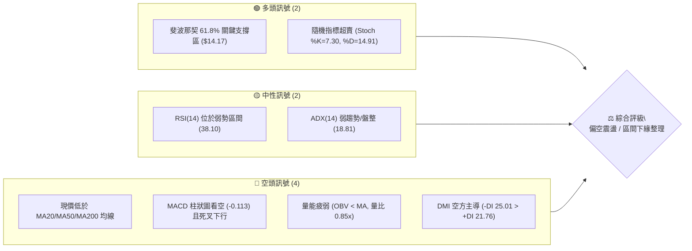

### 📊 核心指標速覽表

| 指標類別 | 指標名稱 | 當前數值 | 訊號 | 解讀 |
|----------|----------|----------|------|------|
| **價格** | 當前價格 | $14.19 | 🟡 | 位於52週區間 38.4%，守於斐波那契61.8% ($14.17) 上方 |
| **均線** | MA20 | $14.80 | 🔴 | 價格低於中短期生命線，乖離率 -4.13%，形成直接阻力 |
| **均線** | MA50 | $14.38 | 🔴 | 價格低於中期均線，空方壓制顯著 |
| **均線** | MA200 | $14.94 | 🔴 | 現價跌破長期牛熊分界線 ($14.94)，長期結構承壓 |
| **動能** | RSI(14) | 38.10 | 🟡 | 處於空方防守區間 (30-40)，未達極端超賣，動能偏弱 |
| **動能** | MACD | 0.101 / 0.214 | 🔴 | DIF 下穿 MACD 訊號線，柱狀圖為 -0.113，空頭動能擴張 |
| **動能** | Stoch %K/%D | 7.30 / 14.91 | 🟢 | 極度超賣，具備短線技術性超跌反彈動能 |
| **趨勢** | ADX(14) | 18.81 | 🟡 | ADX < 25，單邊趨勢不成立，市場處於低波震盪/盤整格局 |
| **波動** | ATR(14) | $0.54 | 🟡 | 波動率佔股價 3.79%，屬於中低波動水平，洗盤風險收斂 |

### 🏆 技術評分卡

```
╔══════════════════════════════════════════════════════════════════╗
║                   技術評分卡 — NU (2026-09-16)                   ║
╠══════════════════════════════════════════════════════════════════╣
║ 趨勢強度 (Trend)     ███████░░░░░░░░░░░░░  35/100  🔴 空頭控盤   ║
║ 動能指標 (Momentum)  ████████░░░░░░░░░░░░  38/100  🔴 動能疲軟   ║
║ 支撐穩定度 (Support) ████████████░░░░░░░░  60/100  🟡 關鍵共振   ║
║ 成交量配合 (Volume)  ███████░░░░░░░░░░░░░  35/100  🔴 縮量陰跌   ║
║ 形態完整度 (Pattern) ██████████░░░░░░░░░░  50/100  🟡 箱體拉鋸   ║
║ 均線排列 (Moving Av) ██████░░░░░░░░░░░░░░  30/100  🔴 空頭壓制   ║
╠══════════════════════════════════════════════════════════════════╣
║ 綜合評分             ████████░░░░░░░░░░░░  41/100  🟡 偏空中性   ║
╚══════════════════════════════════════════════════════════════════╝
```

---

## 2. 趨勢分析

### 🌐 多時框趨勢分析

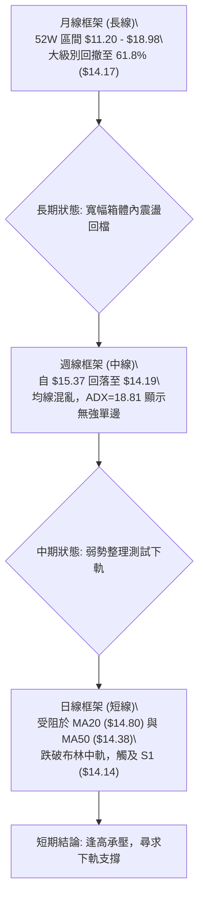

### 📈 長期趨勢 — 12個月走勢圖（ASCII）

過去 12 個月（2025-10 至 2026-09）價格走出自高位見頂後回調、下探回升再轉入盤整的完整循環。

```
NU 月線走勢圖（過去12個月：2025-10 至 2026-09）
價格軸 ($)
$18.00 ┤                     ● (2026-01 高點 $17.75)
$17.00 ┤              ●      │   ●
$16.00 ┤  ●     ●      │      │   │
$15.00 ┤  │     │      │      │   │   ●
$14.00 ┤  │     │      │      │   │   │   ●   ●   ●   ●   ●(現價 $14.19)
$13.00 ┤  │     │      │      │   │   │   │   │   │   ●   │   │
$12.00 ┤  │     │      │      │   │   │   │   │   │   │   │   │
       └─────────────────────────────────────────────────────────────
         10    11     12     01  02  03  04  05  06  07  08  09 (月份)
        (25)  (25)   (25)   (26)(26)(26)(26)(26)(26)(26)(26)(26)
```

#### 走勢特徵分析表格

| 階段區間 | 起止月份 | 收盤價變化 | 漲跌幅 | 結構特徵與成交量解讀 |
|----------|----------|------------|--------|----------------------|
| **頂部構築期** | 2025-10 ~ 2026-01 | $16.11 → $17.75 | +10.18% | 形成 52 週次高點群，量能無法支持突破 52W 高點 $18.98 |
| **快速回撤期** | 2026-01 ~ 2026-05 | $17.75 → $13.13 | -26.03% | 跌破多條中短期均線，空方動能釋放，探測波段低點 |
| **築底修復期** | 2026-05 ~ 2026-07 | $13.13 → $14.33 | +9.14% | 在 S2 ($13.41) 與 S3 ($13.09) 獲得多頭承接，重返 $14.00 |
| **窄幅盤整期** | 2026-07 ~ 2026-09 | $14.33 → $14.19 | -0.98% | 波動率收縮，受制於 MA20 ($14.80)，在斐波那契 61.8% 纏繞 |

### 📊 中期趨勢（週線分析）

```
NU 中期週線阻力與支撐結構示意圖
───────────────────────────────────────────────────────────────────
阻力 3 : $15.74 ═════════════════════════════ [2026-09高點阻力 / BB上軌]
阻力 2 : $14.88 ───────────────────────────── [MA20 / 前期波段平台]
阻力 1 : $14.38 ┄┄┄┄┄┄┄┄┄┄┄┄┄┄┄┄┄┄┄┄┄┄┄┄┄┄┄ [MA50 / 短期均線密集區]
現價位 : $14.19  ◄── 現價（斐波那契 61.8% 回調位 $14.17 附近）
支撐 1 : $14.14 ┄┄┄┄┄┄┄┄┄┄┄┄┄┄┄┄┄┄┄┄┄┄┄┄┄┄┄ [近期波段低點聚類]
支撐 2 : $13.41 ───────────────────────────── [布林下軌下方 / 2026-06低位整理區]
支撐 3 : $13.09 ═════════════════════════════ [2026-05大底支撐區]
───────────────────────────────────────────────────────────────────
```

### ⚡ 趨勢強度評估（ADX 解讀）

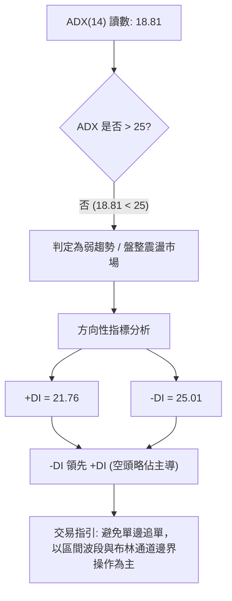

#### ADX 強度級別對照表

| ADX 區間 | 趨勢強度解讀 | 當前 NU 狀態 | 交易策略導向 |
|----------|--------------|--------------|--------------|
| **0 ~ 20** | **極弱趨勢 / 盤整震盪** | **✓ 18.81 (當前值)** | **區間震盪操作，反轉交易為主** |
| 20 ~ 25 | 趨勢初生或過渡期 | — | 觀望形態突破與方向確立 |
| 25 ~ 40 | 強勁單邊趨勢 | — | 順勢交易，回調均線加碼 |
| 40 ~ 100 | 極強單邊或過熱暴衝 | — | 趨勢跟隨，防範耗竭性背離 |

---

## 3. 圖表形態分析

### 🔍 形態識別系統

依據形態信心度嚴格規則，對當前盤面幾何架構進行識別：

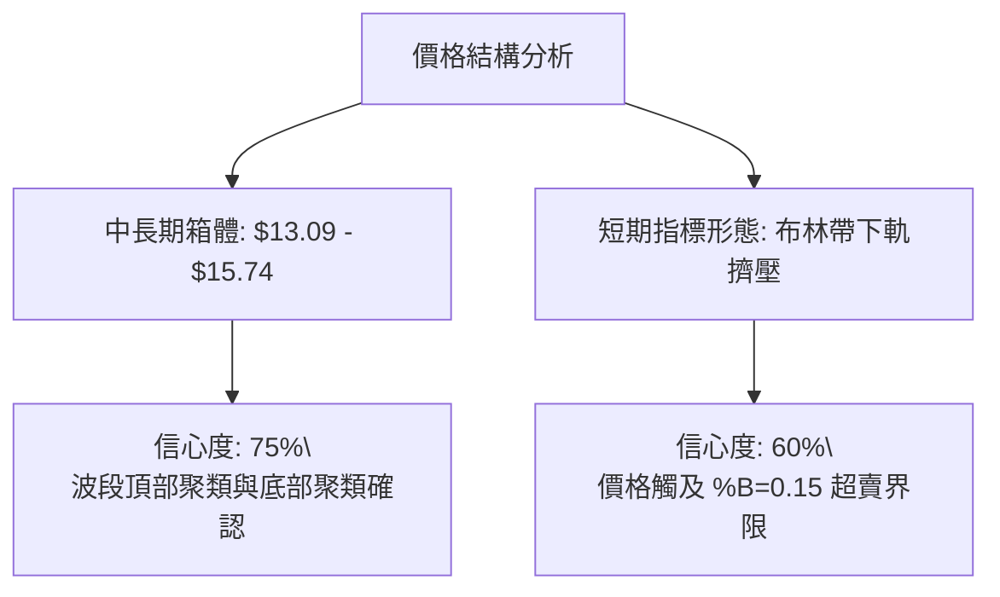

#### 圖表形態信心度評估表

| 形態類別 | 信心度 | 判斷依據（引用技術數據） | 完成度 | 目標價（附精確計算式） |
|----------|--------|--------------------------|--------|------------------------|
| **矩形箱體震盪** | 75% | 箱體上軌受阻於 R3 ($15.74)，下軌獲 S3 ($13.09) 支撐；近期高點多次承壓於 $15.37 / $15.23 | 85% | 向上突破：$15.74 + ($15.74 - $13.09) = **$18.39**<br>向下跌破：$13.09 - ($15.74 - $13.09) = **$10.44** |
| **短期反彈旗形整理** | 45% | 8月中旬衝高至 $15.37 後連續下探至 $14.19，但走勢過於零亂，均線呈現糾纏 | 40% | 信心度 < 50%，依規則不予推算延伸目標價，視為指標型布林下軌回踩 |

### 🕯️ 重要K線形態分析

| 統計週期 | 收盤價 | K線形態特徵 | 盤面多空解讀 | 訊號 |
|----------|--------|-------------|--------------|------|
| **2026-09-06** | $15.37 | 衝高長陽回落帶上影線 | 嘗試挑戰 R3 ($15.74) 失敗，多頭能量在 $15.37 處遭遇強拋壓 | 🔴 |
| **2026-09-13** | $14.62 | 中陰線跌破 MA20 ($14.80) | 跌破短期均線防線，短多資金止損離場，空方主控盤面 | 🔴 |
| **2026-09-20** | $14.19 | 下影線小實體星線 | 逼近斐波那契 61.8% ($14.17) 與 S1 ($14.14)，賣壓減緩，出現抵抗 | 🟡 |

### 📉 ASCII 走勢形態示意圖

```
NU 日/週線級別箱體震盪與均線壓制示意圖
價格 ($)
$15.74 ┼───────────────────────●─────────────────── 箱體上軌阻力 (R3)
       │                      ╱ ╲
$15.20 ┼─────────●───────────╱───╲──────────────── 波段次高點
       │        ╱ ╲         ╱     ╲
$14.80 ┼───────╱───╲───────╱───────╲───────●────── MA20 / 阻力 (R2)
$14.38 ┼──────╱─────╲─────╱─────────╲─────╱─────── MA50 / 阻力 (R1)
$14.19 ┼─────╱───────╲───╱───────────╲───●──────── 現價 ($14.19)
$14.14 ┼────╱─────────╲─╱─────────────╲─●──────── 關鍵支撐 (S1)
       │   ╱           ●                ╲
$13.41 ┼──╱──────────────────────────────╲──────── 中期強支撐 (S2)
       │ ╱                                ╲
$13.09 ┼●──────────────────────────────────●────── 箱體底邊支撐 (S3)
       └──────────────────────────────────────────
```

### 🎯 形態目標價計算

以確認度最高之「箱體震盪形態 (信心度 75%)」進行度量測算：
1. **箱體上限 (Resistance)**: $15.74 (近一年波段高點聚類 R3)
2. **箱體下限 (Support)**: $13.09 (近一年波段低點聚類 S3)
3. **形態高度 (H)**: $15.74 - $13.09 = **$2.65**
4. **極端向上突破目標價**: $15.74 + $2.65 = **$18.39** (接近 52W 高點 $18.98)
5. **極端向下跌破目標價**: $13.09 - $2.65 = **$10.44** (跌破 52W 低點 $11.20)
*注：當前 ADX 為 18.81，屬典型盤整行情，短期內發生單邊 $2.65 突破的機率較低，操作上應以箱體內部反彈與回踩為主。*

---

## 4. 支撐與阻力

### 🗺️ 關鍵價位分布圖（ASCII）

```
NU 價位結構分布圖
══════════════════════════════════════════════════════════════════
$15.74 ║████████████████████████║ 強阻力 R3 (近一年波段高點聚類)
$15.09 ║░░░░░░░░░░░░░░░░░░░░░░░░║ 斐波那契 50.0% 回調位
$14.88 ║████████████████████    ║ 阻力 R2 (MA20 密集區)
$14.38 ║████████████████████████║ 關鍵阻力 R1 (MA50 匯合點)
$14.19 ╠════════════════════════╣ ◄ 現價 ($14.19)
$14.17 ║▒▒▒▒▒▒▒▒▒▒▒▒▒▒▒▒▒▒▒▒▒▒▒▒║ 斐波那契 61.8% 黃金分割支撐
$14.14 ║▓▓▓▓▓▓▓▓▓▓▓▓▓▓▓▓        ║ 近期第一支撐 S1 (近期低點聚類)
$13.41 ║████████████████        ║ 強支撐 S2 (中期波段防線)
$13.09 ║████████████████████████║ 極限強支撐 S3 (年內築底核心)
══════════════════════════════════════════════════════════════════
```

### 🚧 阻力位分析表

| 阻力級別 | 價位 | 形成原因 | 突破難度 | 重要性 |
|----------|------|----------|----------|--------|
| **R1** | **$14.38** | 近一年波段高點聚類，且與 50 日均線 MA50 ($14.38) 完全重合 | 中等 | ★★★☆☆ |
| **R2** | **$14.88** | 鄰近 20 日均線 MA20 ($14.80) 及斐波那契 50% ($15.09) 緩衝區 | 高 | ★★★★☆ |
| **R3** | **$15.74** | 近一年高點聚類區，布林上軌 ($15.69) 與前期多頭衰竭點密集區 | 極高 | ★★★★★ |

### 🛡️ 支撐位分析表

| 支撐級別 | 價位 | 形成原因 | 守住機率 | 重要性 |
|----------|------|----------|----------|--------|
| **S1** | **$14.14** | 近一年波段低點聚類，與斐波那契 61.8% ($14.17) 構成多頭共振平台 | 65% | ★★★★☆ |
| **S2** | **$13.41** | 2026 年 6 月底部平台中軸，近期波段強支撐 | 80% | ★★★★☆ |
| **S3** | **$13.09** | 2026 年 5 月深調極值點，全年中期多頭生死線 | 90% | ★★★★★ |

### 📐 斐波那契回調位分析

依據 52 週區間 **$11.20 (52W Low) → $18.98 (52W High)** 精確計算回調點位：

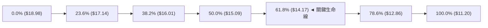

#### 斐波那契結構深度評估：
- **現價位置**：目前價格 **$14.19**，位於 **50.0% ($15.09)** 與 **61.8% ($14.17)** 之間，且距離 **61.8% 關鍵黃金分割線僅 +0.14%**。
- **技術意義**：斐波那契 61.8% ($14.17) 為經典多空分水嶺。若能在此處獲 S1 ($14.14) 支撐守穩，則表明 52 週上升浪潮仍維持有效修正；一旦日線實體有效跌破 $14.14，下行空間將迅速朝向 78.6% ($12.86) 與 S2 ($13.41) 滑落。

---

## 5. 技術指標深度解讀

### 🎛️ 指標訊號總覽

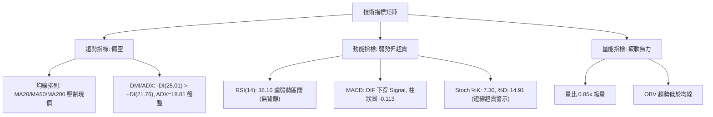

### 📈 移動平均線排列分析

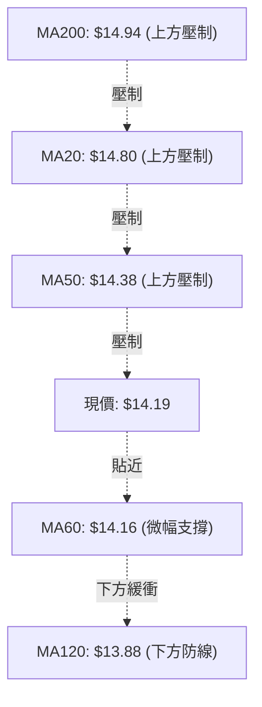

- **短週期均線（MA5: $14.65, MA10: $14.95, MA20: $14.80）**：全數拐頭向下，呈現向下發散狀態，現價低於 MA20 達 -4.13%，短期賣壓沉重。
- **長週期均線（MA60: $14.16, MA120: $13.88, MA200: $14.94, MA240: $15.05）**：MA200 位於 $14.94，價格跌破 200 日線宣告中期格局由牛轉入震盪修正；MA60 位於 $14.16，與現價形成直接黏合，提供即時微弱支撐。

### 📉 RSI(14) 分析

```
RSI(14) 讀數: 38.10
[0] ────────── [30] ──────●─────── [50] ─────────────────── [70] ────────── [100]
    極度超賣          38.10 (弱勢區)        多空平衡            極度超買
進度條: ███████░░░░░░░░░░░░░ 38.1%
```
- **狀態解讀**：RSI 落在 30–50 之弱勢區間（38.10），未破 30，顯示空方動能占優但未達極度恐慌拋售。
- **背離分析**：
  - 週線 RSI 自 2026-09-06 之 56.6 降至 2026-09-20 之 38.1，價格同步自 $15.37 下跌至 $14.19。
  - **結論：指標走勢與價格走勢同步下行，無頂背離亦無底背離**，動能與價格相符，屬常態性弱勢修正。

### 📊 MACD(12/26/9) 訊號解讀

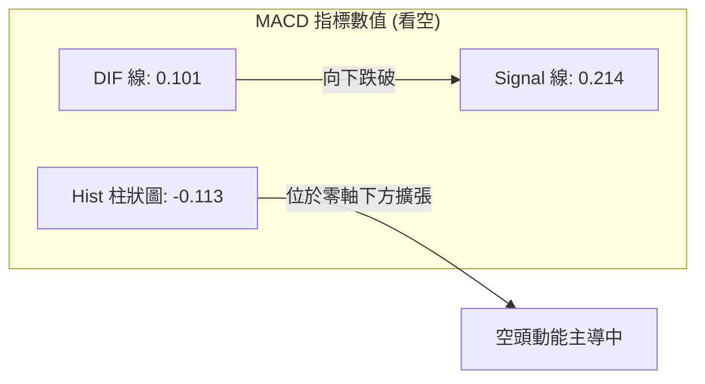
- **死叉確認**：MACD 線 (0.101) 低於訊號線 (0.214)，柱狀圖呈現負值 (-0.113) 並逐步向下擴展，短期空方動能仍處於宣洩期，未見紅柱翻正跡象。

### 📦 布林通道分析

```
布林通道結構 (帶寬 BB Width: 12.0%)
$15.69 ┬────────────────────────────────────────── BB 上軌 (阻力區間)
       │
$14.80 ┼────────────────────────────────────────── BB 中軌 (MA20 關鍵阻力)
       │
$14.19 ┼──────────●─────────────────────────────── 現價位置 (%B = 0.15)
$13.92 ┴────────────────────────────────────────── BB 下軌 (短線動態支撐)
```
- **通道位置**：%B 值為 **0.15**，極度貼近下軌 ($13.92)，顯示短線處於下軌擠壓超賣狀態。
- **通道形態**：帶寬收縮後未見大幅開口，符合 ADX=18.81 之震盪盤整特徵。下軌 $13.92 與 S1 ($14.14) 形成下方支撐帶。

### 💹 成交量分析（量價配合度）

- **量能萎縮**：最新成交量為 **59,523,400**，對比 20 日均量 **69,760,490**，量比僅為 **0.85x**；對比 50 日均量 **83,423,646** 明顯萎縮。
- **OBV 趨勢解讀**：OBV 低於其均線（OBV < MA），量能持續流出。股價陰跌伴隨量能遞減，呈現「無量陰跌」，顯示目前多頭並未在此價位進行激進回補，缺乏主力資金進場確認信號。

---

## 6. 動能與波動率

### ⚡ 動能評估四象限

| 象限 | 動能維度 | 波動維度 | 當前狀態 | 策略意涵 |
|------|----------|----------|----------|----------|
| 第一象限 (Q1) | 強動能 | 低波動 | — | 最佳趨勢加速區（突破順勢） |
| **第二象限 (Q2)** | **弱動能** | **低波動** | **✓ NU 當前所處位置** | **謹慎觀望，布林通道邊界低吸高拋** |
| 第三象限 (Q3) | 強動能 | 高波動 | — | 主升浪或主跌浪，高風險高收益 |
| 第四象限 (Q4) | 弱動能 | 高波動 | — | 劇烈洗盤震盪，避免進場受傷 |

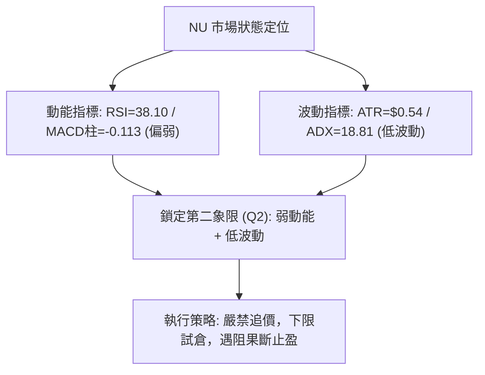

### 📊 ATR 波動率分析

- **ATR(14) 讀數**：**$0.54**，佔現價之 **3.79%**。
- **日間波動區間預估**：
  - 單日預期波動區間上限：$14.19 + $0.54 = **$14.73**
  - 單日預期波動區間下限：$14.19 - $0.54 = **$13.65**
- **風控止損應用**：在震盪走勢中，建議使用 **1.5 倍 ATR** 作為安全防護過濾器，即 $0.54 \times 1.5 = \mathbf{\$0.81}$。若跌破關鍵支撐超此幅度，代表結構破壞。

### 📐 Beta 與市場相關性

- **Beta 係數**：**0.94**。
- **特徵解讀**：Beta 接近 1.0，表明 NU 與大盤（標普 500 指數）具有高度同步性，並無顯著獨立抗跌或超額 Beta 屬性。在整體市場未轉暖之前，個股難以走出獨立單邊爆發行情。

---

## 7. 多時框架總結

### 📋 時框架評分表

| 時框架 | 趨勢方向 | 動能表現 | 均線排列 | 關鍵形態與指標位置 | 綜合評分 | 操作建議 |
|--------|----------|----------|----------|--------------------|----------|----------|
| **月線 (長期)** | 震盪中性 | 中平 (無背離) | 混合震盪 | 回撤至斐波那契 61.8% ($14.17) | 50/100 | 長期分批定投觀察 |
| **週線 (中期)** | 偏空修正 | 負柱擴大 | 壓制明顯 | 跌破 MA20，測試 S1 ($14.14) | 38/100 | 逢反彈減碼防守 |
| **日線 (短期)** | 空頭佔優 | 短線超賣 | 空頭排列 | %B=0.15 觸及布林下軌，短線抵抗 | 35/100 | 區間下緣超短線搏反彈 |

### 🔲 綜合訊號矩陣

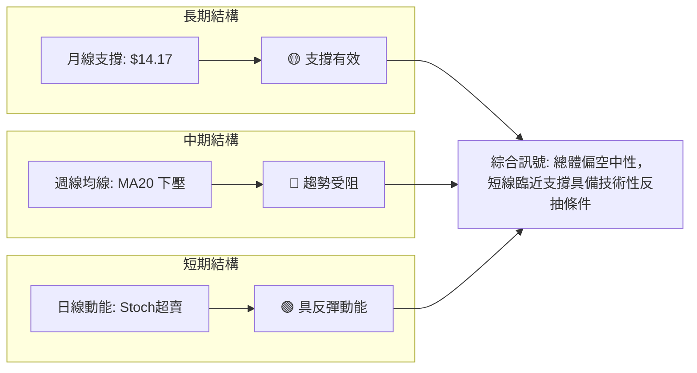

### ⚖️ 多時框收斂結論

依據多時框收斂規則（嚴格要求 14）：
1. **行情模式判斷**：ADX(14) 數值為 **18.81 (< 25)**，嚴格判定當前市場為**「盤整行情」**，而非單邊趨勢行情。
2. **時框優先級收斂**：在盤整行情下，不宜過度追隨週線的空頭動量，而應**以日線布林通道上下軌 ($13.92 ~ $15.69) 與波段聚類價位 ($14.14 ~ $14.88) 作為主要交易區間**。
3. **唯一方向性結論**：**【中性偏空觀望，區間下緣博弈反彈】**。整體綜合評分為 **41/100 (偏空震盪)**，策略導向聚焦於：在 S1 ($14.14) 支撐附近以嚴格止損進行「超賣反抽操作」，或等待價格反彈至 R1/R2 遇阻時佈局空單。

---

## 8. 交易策略建議

### 🗺️ 策略決策流程圖

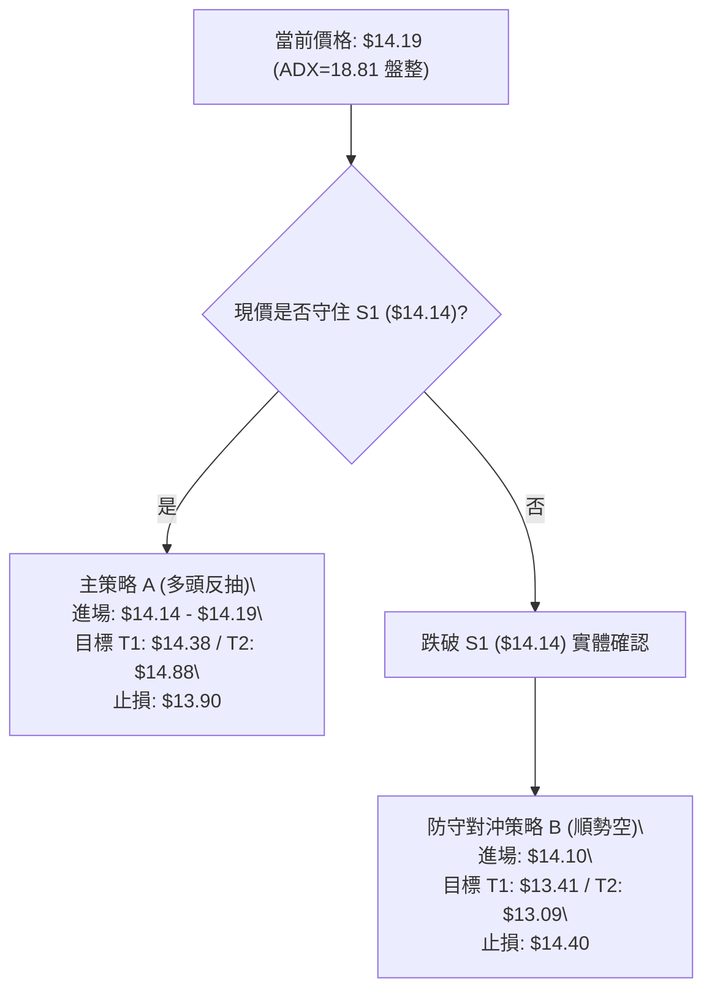

### 🧭 策略路由（依評分卡分流）

> **當前主策略方向 = 【中性偏空震盪，布林下軌逆勢波段多單 + 高位受阻做空對沖】（依評分 41/100）**
> 
> 由於綜合評分處於 40–60 區間（41/100 偏弱），且 ADX=18.81 處於弱趨勢，市場無法走出單邊破位行情。因此策略主推**「區間下緣技術性低吸反抽」**，並嚴格以 S1 破位設立止損；同時將**「破位做空」**作為反轉風控與對沖提示。

### 🎯 價格情境階梯（Price Scenarios）

| 觸發條件 | 下一目標 | 後續延伸 | 情境含義 | 操作導向 |
|----------|----------|----------|----------|----------|
| **突破 R1 $14.38** | R2 **$14.88** | R3 **$15.74** | 站上 MA50，短線轉強，朝 MA20 與布林上軌發起挑戰 | 波段多單加碼或逢高減碼 |
| **守穩現價 $14.19** | R1 **$14.38** | — | 於斐波那契 61.8% ($14.17) 構築雙底，維持窄幅震盪 | 區間操作，低吸高拋 |
| **跌破 S1 $14.14** | S2 **$13.41** | S3 **$13.09** | 跌破 61.8% 與近期低點聚類，中期向 2026-06 底部沉降 | 多單嚴格止損，空單進場追空 |

### 📊 情境機率分佈

| 情境劃分 | 機率估計 | 主要技術依據 |
|----------|----------|--------------|
| **情境一：守住支撐，反彈至 R1/R2** | **50%** | Stoch 超賣 (%K=7.30)、現價貼近布林下軌 (%B=0.15)、斐波那契 61.8% ($14.17) 共振支撐 |
| **情境二：在 S1 與 R1 間窄幅橫盤** | **30%** | ADX=18.81 顯示無強動量、成交量比僅 0.85x 縮量、市場觀望情緒濃郁 |
| **情境三：下破 S1，下探 S2 $13.41** | **20%** | MACD 負柱擴大 (-0.113)、均線空頭排列壓制、OBV 持續低於均線資金流出 |

### 🟢 主策略詳情（區間波段策略）

嚴格引用數據中計算之關鍵價位：

| 策略要素 | 策略 A（下軌反抽多單） | 策略 B（跌破 S1 順勢空單） |
|----------|------------------------|----------------------------|
| **策略類型** | 區間下緣超賣左側反彈 | 關鍵價位跌破右側順勢空 |
| **進場條件** | 現價或回踩 S1 ($14.14) 出現下影線 | 日線實體跌破 $14.14 (取 $14.10) |
| **進場價格** | **$14.19** | **$14.10** |
| **目標價 T1** | **$14.38** (R1 / MA50 阻力) | **$13.41** (S2 中期強支撐) |
| **目標價 T2** | **$14.88** (R2 / MA20 平台) | **$13.09** (S3 箱體底部極限) |
| **止損價格** | **$13.90** (略低於布林下軌 $13.92) | **$14.38** (R1 / MA50 上方阻力) |
| **風險空間** | $14.19 - $13.90 = $0.29 | $14.38 - $14.10 = $0.28 |
| **報酬空間 (T2)**| $14.88 - $14.19 = $0.69 | $14.10 - $13.09 = $1.01 |
| **風險報酬比** | **1 : 2.38** | **1 : 3.61** |
| **成功機率** | 55% | 45% |
| **建議倉位** | **10% ~ 15%** (輕倉試探) | **10% ~ 15%** (破位對沖) |

### 🔴 反向風險觸發點（對沖提示）

- **多單失效風控點**：日線收盤價跌破 **$14.14 (S1)**。一旦收於該價位下方，表明斐波那契 61.8% 宣告失守，必須無條件止損出局，不得盲目硬抗。
- **空單翻多風控點**：價格強勢放量突破 **$14.88 (R2)** 並站上 MA20。若日成交量突破 20 日均量 (69,760,490)，空頭必須即刻平倉認賠，行情轉為箱體向上突破。

### ⭐ 整體訊號強度評星

```
做多訊號強度：★★☆☆☆  (2/5星 - 僅仰賴超賣與支撐共振，趨勢未明)
做空訊號強度：★★★☆☆  (3/5星 - 均線空頭壓制，MACD 負向)
整體可信度：  ★★★☆☆  (3/5星 - 處於低波震盪盤整，需防假突破)
```

---

## 9. 風險提示與監控

### ✅ 關鍵監控指標 Checklist

```
╔══════════════════════════════════════════════════════════════════╗
║                   NU 技術面核心監控 Checklist                    ║
╠══════════════════════════════════════════════════════════════════╣
║ [ ] 支撐防守：日線收盤價是否守穩 $14.14 (S1) 與 $14.17 (61.8%)   ║
║ [ ] 均線挑戰：能否放量突破 MA50 ($14.38) 與 MA20 ($14.80)        ║
║ [ ] 量能驗證：單日成交量是否回升突破 69.76M (20日均量線)         ║
║ [ ] 動能翻轉：MACD 柱狀圖由 -0.113 收斂翻紅，RSI 站回 50 以上    ║
║ [ ] 趨勢確立：ADX 是否自 18.81 向上突破 25，開啟單邊方向         ║
╚══════════════════════════════════════════════════════════════════╝
```

### ⚠️ 風險場景分析

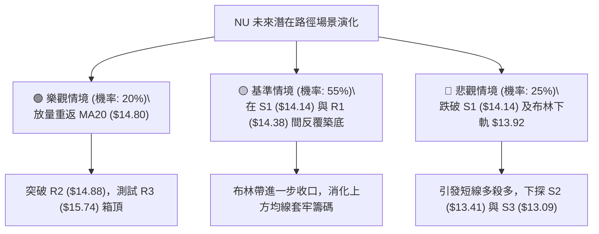

### 🛡️ 風險管理重要提醒

1. **嚴防「無量陰跌」陷阱**：目前最新成交量為 59.52M（量比 0.85x），量能持續萎縮。縮量陰跌往往容易產生「鈍化」，即 RSI 與 Stoch 超賣後繼續沿著布林下軌貼地爬行，切忌在未見明確陽線反包確認前孤注一擲重倉抄底。
2. **倉位管理紀律**：當前綜合評分僅 41 分，技術環境缺乏單邊多頭支持。任何試倉操作總部位**嚴格控制在 10% 至 15% 以內**。
3. **ATR 動態追蹤**：目前日線 ATR 為 $0.54，日內波動高達 3.79%。止損點設定必須保留足夠防守緩衝，建議止損幅度不大於 1.0 ~ 1.5 倍 ATR，以防日內正常波動洗盤。

---

## 📋 報告總結

```
╔══════════════════════════════════════════════════════════════════╗
║                   NU 技術分析報告總結                            ║
╠══════════════════════════════════════════════════════════════════╣
║ 報告日期：2026-09-16                                            ║
║ 當前價格：$14.19                                                ║
║ 分析評級：⚖️ 偏空震盪 / 區間下緣超跌反抽 (綜合評分: 41/100)      ║
╠══════════════════════════════════════════════════════════════════╣
║ 關鍵結論：                                                       ║
║ ├─ 長期趨勢：🟡 寬幅震盪，受制於 52W 高點 $18.98，下有 $11.20    ║
║ ├─ 中期趨勢：🔴 偏弱修正，現價位於 MA200 ($14.94) 與 MA20 下方 ║
║ ├─ 短期趨勢：🟡 弱勢整理，觸及布林下軌 (%B=0.15) 及超賣區        ║
║ ├─ 關鍵支撐：S1: $14.14 ｜ S2: $13.41 ｜ S3: $13.09              ║
║ ├─ 關鍵阻力：R1: $14.38 ｜ R2: $14.88 ｜ R3: $15.74              ║
║ └─ 斐波分水：61.8% 回調位 $14.17（多頭當前最後防線）            ║
╠══════════════════════════════════════════════════════════════════╣
║ 最優策略組合：                                                   ║
║ 1. 🥇 最佳機會：現價 $14.19 或回踩 S1 ($14.14) 輕倉搏超賣反抽，  ║
║    止損設 $13.90，第一目標 $14.38 (R1)，第二目標 $14.88 (R2)。   ║
║ 2. 🥈 次選機會：耐心等待價格反彈至 R1 ($14.38) 或 R2 ($14.88) 遇 ║
║    阻無力時順勢佈局空單，博弈均線壓制有效性。                    ║
║ 3. 🥉 保守選擇：完全空倉觀望，等待日線實體突破 MA20 ($14.80) 或 ║
║    ADX 突破 25 確認單邊趨勢後再行右側跟進。                     ║
╚══════════════════════════════════════════════════════════════════╝
```

---

> ⚠️ **免責聲明**：本報告為技術分析研究，所有技術指標、形態解讀及關鍵價位均嚴格基於歷史量價數據計算推演。報告內容**僅供專業研究與學術參考**，**不構成任何買賣要約或投資決策建議**。金融市場瞬息萬變，交易請務必恪守獨立風控原則，審慎評估風險。

---

*報告生成時間：2026-09-16 ｜ 數據來源：Yahoo Finance ｜ 分析框架：多時框量化與形態技術分析*