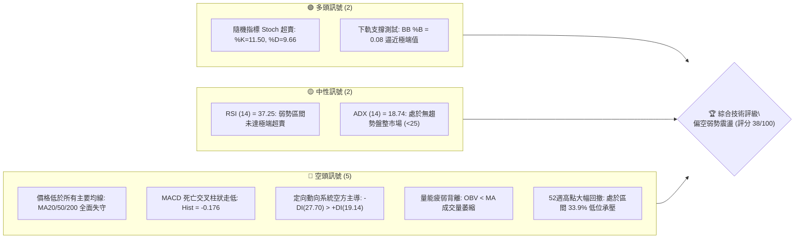
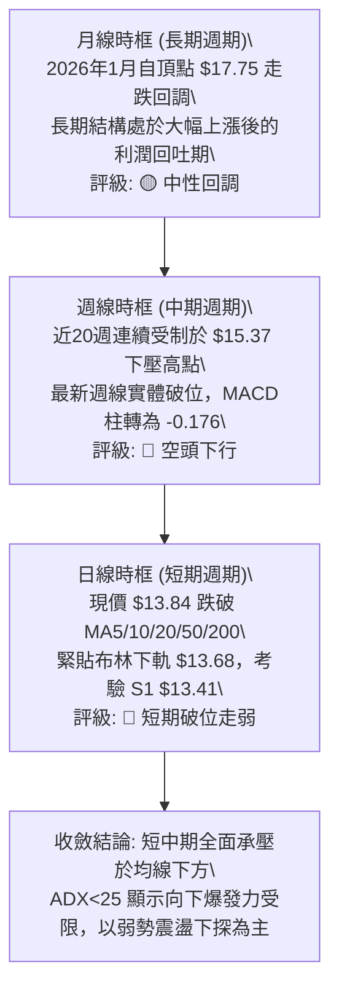
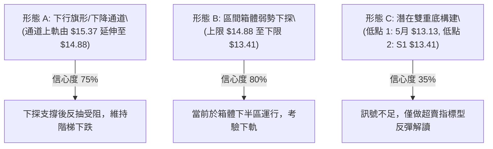
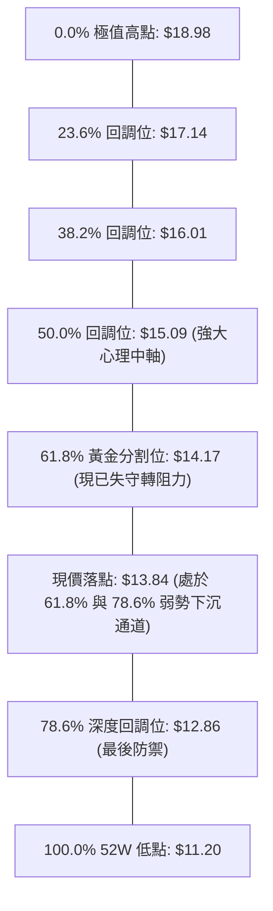
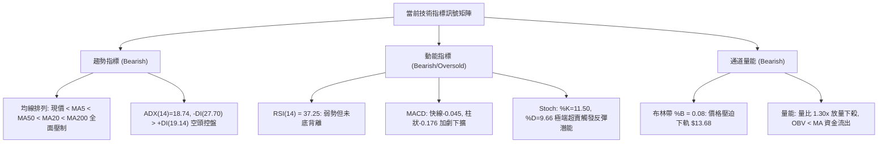
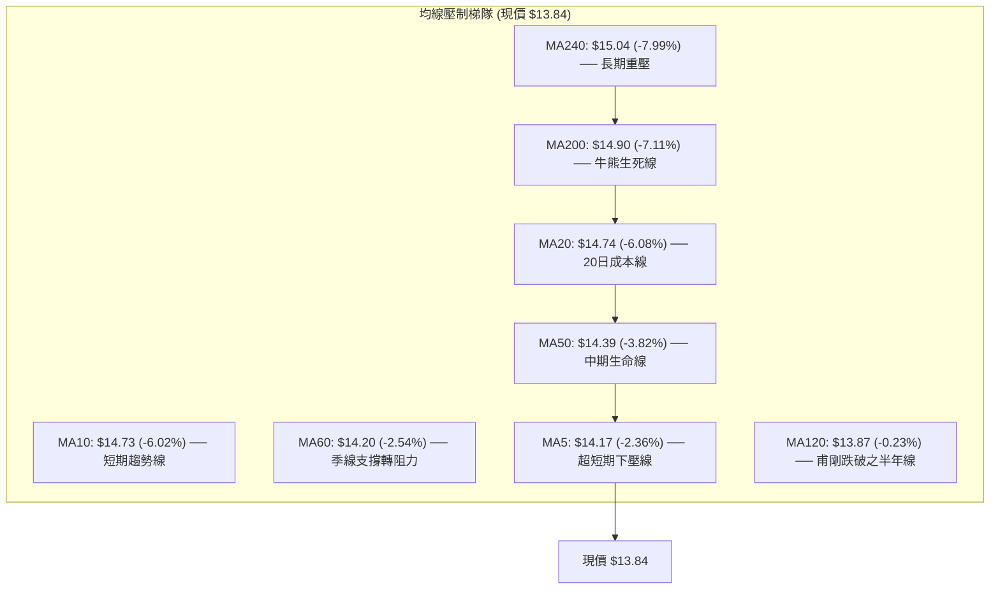
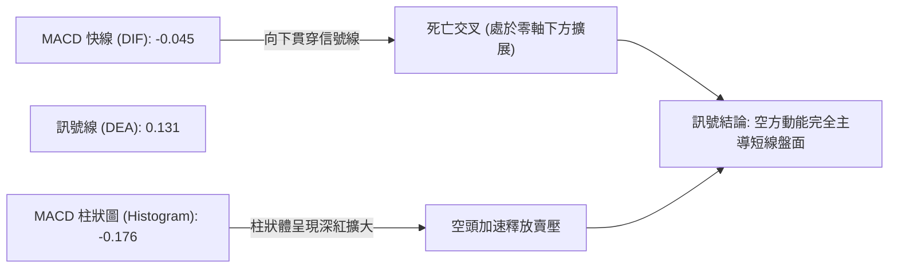
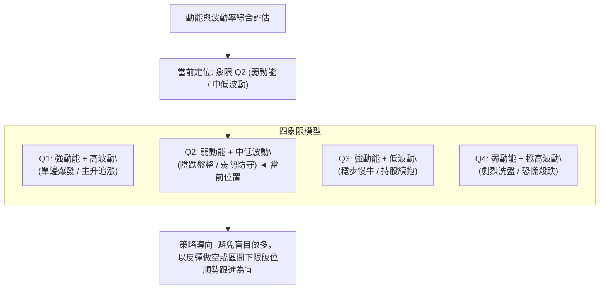
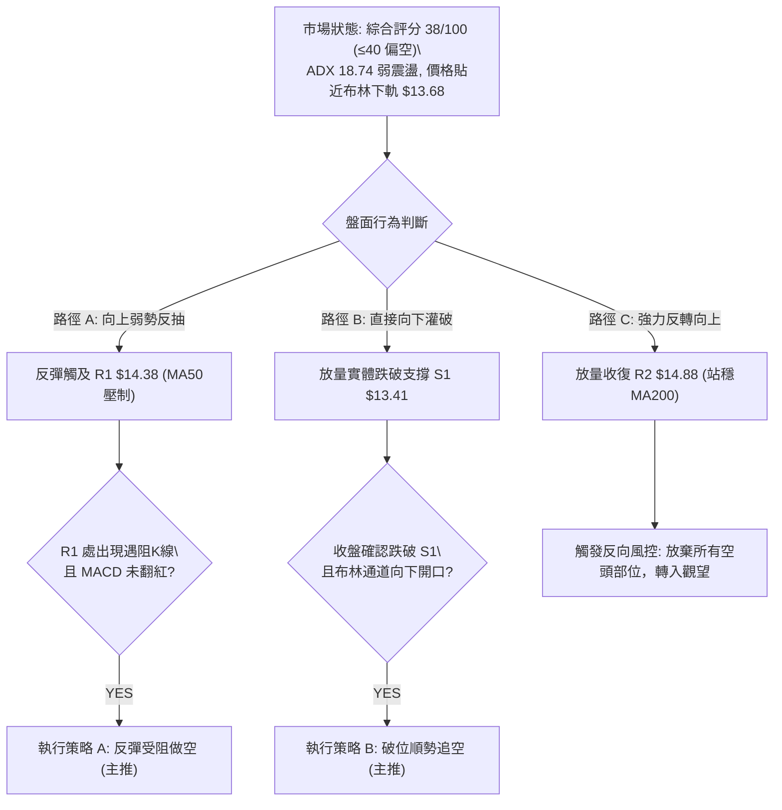
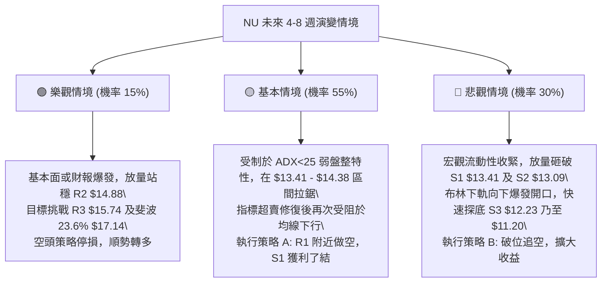

# NU 技術分析報告

> **報告日期**：2026-09-18 ｜ **語言**：繁體中文 ｜ **數據來源**：Yahoo Finance ｜ **當前價格**：$13.84

---

## 目錄

| 章節 | 內容 |
|------|------|
| [1. 技術面概覽](#1-技術面概覽) | 訊號儀表板、核心指標、評分卡 |
| [2. 趨勢分析](#2-趨勢分析) | 多時框趨勢、長中短期走勢、ADX強度 |
| [3. 圖表形態分析](#3-圖表形態分析) | 形態識別、信心度評估、K線組合 |
| [4. 支撐與阻力](#4-支撐與阻力) | 關鍵價位階梯、斐波那契回調 |
| [5. 技術指標深度解讀](#5-技術指標深度解讀) | MA均線/RSI/MACD/布林/量價配合 |
| [6. 動能與波動率](#6-動能與波動率) | 動能四象限、ATR波幅、Beta相關性 |
| [7. 多時框架總結](#7-多時框架總結) | 時框架評分矩陣、收斂結論 |
| [8. 交易策略建議](#8-交易策略建議) | 策略路由、價格情境、主推策略 |
| [9. 風險提示與監控](#9-風險提示與監控) | 監控清單、情境推演、風控紀律 |
| [📋 報告總結](#-報告總結) | 核心總結儀表板 |

---

## 1. 技術面概覽

### 🎯 技術訊號儀表板



### 📊 核心指標速覽表

| 指標類別 | 指標名稱 | 當前數值 | 訊號 | 解讀與狀態評估 |
|----------|----------|----------|------|----------------|
| **價格** | 當前價格 | $13.84 | 🔴 | 位於 52 週區間 ($11.20 - $18.98) 之 33.9% 位置，承壓於各均線之下 |
| **均線** | MA20 | $14.74 | 🔴 | 現價低於 MA20 達 -6.08%，短線下行趨勢顯著 |
| **均線** | MA50 | $14.39 | 🔴 | 現價低於 MA50 達 -3.82%，中期生命線受阻 |
| **均線** | MA200 | $14.90 | 🔴 | 現價低於 MA200 達 -7.11%，跌破長期多空分水嶺 |
| **動能** | RSI(14) | 37.25 | 🟡 | 位於弱勢區間 (30–70)，未觸及 <30 極端超賣，無底背離確認 |
| **動能** | MACD | -0.045 | 🔴 | MACD 線低於信號線 (0.131)，柱狀圖為 -0.176，空頭動能擴散 |
| **超買超賣** | Stoch %K/%D | 11.50 / 9.66 | 🟢 | 進入極度超賣區間 (<20)，存在短線技術性死貓反彈需求 |
| **趨勢** | ADX(14) | 18.74 | 🟡 | 數值 <25，屬非趨勢型弱盤整結構；-DI(27.70) 顯著高於 +DI(19.14) |
| **波動** | ATR(14) | $0.55 | 🟡 | 日波動率為價格之 3.97%，波幅中等，適合短線區間防守操作 |
| **通道** | 布林帶 %B | 0.08 | 🟡 | 現價緊貼布林下軌 ($13.68)，面臨超賣反彈或沿下軌向下開口抉擇 |
| **量能** | OBV 與成交量 | 90.71M | 🔴 | 量比 1.30x 但 OBV < MA，放量下挫顯示機構籌碼持續逢高流出 |

### 🏆 技術評分卡

```
╔══════════════════════════════════════════════════════════════════╗
║              NU 技術面綜合量化評分卡 (2026-09-18)                ║
╠══════════════════════════════════════════════════════════════════╣
║ 評估維度      評分進度條              得分    訊號  權重說明      ║
╟──────────────────────────────────────────────────────────────────╢
║ 趨勢強度      ███████░░░░░░░░░░░░░    35/100   🔴   ADX弱+空頭排列║
║ 動能指標      ██████░░░░░░░░░░░░░░    32/100   🔴   MACD負柱加劇  ║
║ 支撐穩定度    ██████████░░░░░░░░░░    52/100   🟡   S1 $13.41 承壓║
║ 成交量配合    ███████░░░░░░░░░░░░░    38/100   🔴   量增價跌量價背║
║ 形態完整度    ████████░░░░░░░░░░░░    42/100   🟡   下行通道弱整理║
║ 均線排列      █████░░░░░░░░░░░░░░░    28/100   🔴   全面受制長短期║
╠══════════════════════════════════════════════════════════════════╣
║ 綜合評分      ███████░░░░░░░░░░░░░    38/100   🔴   空方主導弱震盪║
╚══════════════════════════════════════════════════════════════════╝
```

---

## 2. 趨勢分析

### 🌐 多時框趨勢分析

依據多時框收斂原則，在 ADX(14) = 18.74 (<25) 之無趨勢/弱盤整市場中，趨勢運行受制於中長期均線壓力，短線則在日線布林通道內尋求平衡。



### 📈 長期趨勢 — 12個月走勢圖（Unicode）

NU 過去一年歷經自 2025 年秋季突破、2026 年初見頂、隨後轉入震盪走弱的下行週期：

```
NU 月線走勢圖（過去12個月：2025-10 至 2026-09）
價格軸 ($)
$18.00 ┤                               ● $17.75 (2026-01 頂點)
$17.00 ┤                       ● $16.74 
$16.00 ┤ ● $16.11      ● $17.39
$15.00 ┤                                        ● $14.98
$14.00 ┤                                              ● $14.37  ● $14.48                 ● $14.33  ● $14.55
$13.00 ┤                                                                ● $13.13  ● $13.36                 ● $13.84 (現價)
$12.00 ┤
       └─────────────────────────────────────────────────────────────────────────────────────────────
         25-10   25-11   25-12   26-01   26-02   26-03   26-04   26-05   26-06   26-07   26-08   26-09
```

#### 走勢特徵分析表格

| 階段 | 時間區間 | 起止價格 | 區間漲跌幅 | 結構特徵與成交量解讀 |
|------|----------|----------|------------|----------------------|
| **高位衝頂** | 2025-10 ~ 2026-01 | $16.11 → $17.75 | +10.18% | 連續月線收陽，觸及歷史次高點 $17.75，動能於 1 月耗盡 |
| **首輪崩跌** | 2026-01 ~ 2026-02 | $17.75 → $14.98 | -15.61% | 長黑實體吞沒，主力獲利了結，宣告中長線單邊上漲告終 |
| **反覆探底** | 2026-02 ~ 2026-05 | $14.98 → $13.13 | -12.35% | 連續 4 個月重心下移，最低跌至 5 月低點 $11.97 (週線紀錄) |
| **弱勢反彈** | 2026-05 ~ 2026-08 | $13.13 → $14.55 | +10.81% | 縮量向上修復，受制於 50% 斐波那契回調位 $15.09 未能站穩 |
| **當前受阻** | 2026-08 ~ 2026-09 | $14.55 → $13.84 | -4.88% | 9月初衝高至 $15.37 後迅速回吐，再次破位失守各短中期均線 |

### 📊 中期趨勢（週線分析）

中期走勢顯示典型的「高點降低 (Lower Highs)」特徵。從 2026-08-16 的高點 $15.23，至 2026-09-06 的次高點 $15.37，反彈無力突破強阻力 R3 ($15.74) 與斐波那契 50% 回調位 ($15.09)。隨後兩週（09-13 的 $14.62 與 09-20 的 $13.84）實體收黑，MACD 柱狀圖自 +0.064 快速翻負至 -0.176，確認中期反彈夭折，重啟回調測試。

```
週線阻力壓制與支撐下探示意圖：
  $15.74 ─────── R3 (強大波段阻力 / 布林上軌 $15.79)
          \
  $14.88 ──\──── R2 (MA200 $14.90 / 50% 斐波位 $15.09 重合區)
            \   
  $14.38 ────\── R1 (MA50 $14.39 / 61.8% 斐波位 $14.17 下移壓制)
              \  
  $13.84 ──────▼ 現價 (測試布林下軌 $13.68)
                |
  $13.41 ───────┴ S1 近期關鍵波段支撐 (2026年6月震盪平台)
  $13.09 ──────── S2 強支撐 (5月平台收盤防線)
```

### ⚡ 趨勢強度評估（ADX 解讀）

```mermaid
graph TD
    A["ADX(14) 讀數: 18.74"] --> B{"ADX 門檻檢驗\\n標準臨界值: 25.0"}
    B -->|"< 25| C["市場處於弱趨勢 / 盤整震盪期"]
    B -->|">= 25"| D["市場處於強勁單邊趨勢"]
    
    C --> E["方向性指標檢驗\\n-DI: 27.70 vs +DI: 19.14"]
    E --> F["-DI > +DI 空方佔據主動權"]
    F --> G["終局研判: 空頭主導的弱震盪下修\\n不具備單邊暴跌動力，但反彈動能極為匱乏"]
```

#### ADX 趨勢強度對照

| 指標變數 | 實際數值 | 參考臨界線 | 狀態解讀 |
|----------|----------|------------|----------|
| **ADX(14)** | **18.74** | 25.00 | 處於弱趨勢區間。無單邊爆發性趨勢，行情以區間震盪與階梯式磨底為主 |
| **+DI(14)** | **19.14** | 20.00 | 多頭進攻意願低下，處於受壓抑狀態 |
| **-DI(14)** | **27.70** | 25.00 | 空頭主導盤面，高於多方 8.56 個點位，市場賣壓明顯占優 |
| **綜合結論** | **弱勢空頭** | 盤整市優先 | **遵循規則 14**：以日線布林通道 ($13.68 - $15.79) 與 S1/R1 為主要波段運作邊界 |

---

## 3. 圖表形態分析

### 🔍 形態識別系統



#### 圖表形態信心度與目標價評估

| 形態名稱 | 信心度 | 判斷依據（引用技術數據） | 完成度 | 形態目標價（附精確計算式） |
|----------|--------|--------------------------|--------|----------------------------|
| **矩形箱體震盪 (下探測試)** | **80%** | 上軌聚類於 R2 ($14.88) / 50% 回調位 ($15.09)，下軌聚類於 S1 ($13.41)。現價 $13.84 逼近下軌 | **85%** | 箱體高度 = $14.88 - $13.41 = $1.47<br>若向下破位目標 = S1 ($13.41) - $1.47 = **$11.94**（逼近 52W 低點 $11.20） |
| **下行通道 (下降旗形)** | **70%** | 自 9/6 高點 $15.37 下跌，連續跌破 MA20 ($14.74) 與 MA50 ($14.39)，通道斜率為負 | **65%** | 通道上軌阻力 = R1 ($14.38)<br>通道下軌測算支撐 = S1 ($13.41) 至 S2 ($13.09) |
| **雙底反轉形態 (潛在構建)** | **35%** | 5月月線低點 $13.13 與當前支撐 S1 ($13.41) 呈雙腳結構。但因 MACD 柱綠、均線蓋頭，**信心度 < 50%，依規則 15 註明：訊號不足，不予採用幾何反轉目標，僅做指標型超賣解讀** | **20%** | **不成立**（未突破頸線 R2 $14.88 前無有效量化目標） |

### 🕯️ 重要K線形態分析

| 週/月份週期 | 收盤價 | 核心 K 線形態 | 專業解讀 | 訊號 |
|-------------|--------|---------------|----------|------|
| **2026-08-16 (週)** | $15.23 | 放量長陽突破 | 多頭嘗試挑戰 MA200 ($14.90) 與 R2 ($14.88)，週量增至 381M | 🟢 |
| **2026-09-06 (週)** | $15.37 | 高位長上影倒錘頭 | 衝高觸及 50% 斐波位上方後遭遇密集解套拋壓，留出長上影線 | 🔴 |
| **2026-09-13 (週)** | $14.62 | 中黑覆蓋線 | 跌破 MA20 ($14.74)，確認 $15.37 為假突破誘多高點 | 🔴 |
| **2026-09-20 (最新)** | $13.84 | 光腳大陰線向下破位 | 一舉跌破 MA50 ($14.39) 與 MA120 ($13.87)，逼近布林下軌 $13.68 | 🔴 |

### 📉 ASCII 走勢形態示意圖

```
NU 下降通道與箱體邊界幾何示意圖
$15.74 ┼───────────────────────────────────────────── 阻力 R3 (強阻力頂部)
       │         ▲ 9/6 高點 $15.37
$14.88 ┼─────────┼─────▲───────────────────────────── 箱體上邊界 / 阻力 R2 (MA200 $14.90)
       │        / \   / \ 
$14.38 ┼───────/───\─/───\────────────────────────── 通道上軌 / 阻力 R1 (MA50 $14.39)
       │      /     ▼     \
$13.84 ┼─────/─────────────▼現價 $13.84 (緊逼布林下軌 $13.68)
       │    /               \
$13.41 ┼───▲─────────────────▼測試點──────────────── 箱體下邊界 / 支撐 S1 (頸線關鍵位)
       │  5月回踩低點
$13.09 ┼───────────────────────────────────────────── 延伸支撐 S2 (破位防線)
```

### 🎯 形態目標價計算

以市場完成度最高、信心度達 80% 之「箱體震盪下探/破位」模型進行幾何推導：
1. **箱體頂部（頸線壓力）**：$14.88（近一年波段高點聚類 R2，與 MA200 $14.90 契合）。
2. **箱體底部（關鍵支撐）**：$13.41（近一年波段低點聚類 S1）。
3. **垂直形態高度 ($H$)**：
   $$H = \text{箱體頂部} - \text{箱體底部} = \$14.88 - \$13.41 = \$1.47$$
4. **悲觀破位目標價 (Downside Target)**：
   $$\text{Target}_{\text{Down}} = \text{S1} - H = \$13.41 - \$1.47 = \$11.94$$
   *(該數值高度共振 52 週低點聚類 S3 之 $12.23 及週線最低點 $11.97)*。
5. **中性反彈目標價 (Pullback Target)**：
   若於 S1 ($13.41) 獲得支撐，向上反抽之理論目標為箱體中軸：
   $$\text{Target}_{\text{Mid}} = \frac{\$14.88 + \$13.41}{2} = \$14.145 \approx \$14.15 \quad (\text{受阻於 61.8\% 斐波位 } \$14.17 \text{ 及 R1 } \$14.38)$$

---

## 4. 支撐與阻力

### 🗺️ 關鍵價位分布圖（Unicode）

```
╔══════════════════════════════════════════════════════════════════════════════╗
║                          NU 核心關鍵價位結構分布圖                           ║
╠══════════════════════════════════════════════════════════════════════════════╣
║ 價位 ($)   價位級別      視覺強度條                  技術共振與屬性解讀      ║
╟──────────────────────────────────────────────────────────────────────────────╢
║ $15.74     阻力 R3       ████████████████████████    波段高點聚類 / BB上軌   ║
║ $15.09     Fib 50.0%     ████████████████████░░░░    斐波那契強壓分水嶺      ║
║ $14.88     阻力 R2       ████████████████████░░░░    MA200 ($14.90) 重合位   ║
║ $14.38     阻力 R1       ████████████████░░░░░░░░    MA50 ($14.39) 壓制頸線  ║
║ $14.17     Fib 61.8%     ████████████░░░░░░░░░░░░    MA5 ($14.17) 密集成交   ║
║ $13.84 ◄── 當前市價 ════════════════════════════════ 測試布林下軌 $13.68     ║
║ $13.41     支撐 S1       ▓▓▓▓▓▓▓▓▓▓▓▓▓▓▓▓░░░░░░░░    近一年低點聚類支撐線    ║
║ $13.09     支撐 S2       ████████████████████░░░░    5月月線收盤重要防線     ║
║ $12.86     Fib 78.6%     ████████████████░░░░░░░░    黃金分割終極多頭防禦    ║
║ $12.23     支撐 S3       ████████████████████████    52週低點前最後波段屏障  ║
╚══════════════════════════════════════════════════════════════════════════════╝
```

### 🚧 阻力位分析表

所有阻力價位嚴格引用 OHLCV 聚類數據，不憑空捏造：

| 阻力級別 | 價位 | 與現價距離 | 形成原因與技術共振 | 突破難度 | 戰略重要性 |
|----------|------|------------|--------------------|----------|------------|
| **R1** | **$14.38** | +3.90% | 近一年波段高點聚類，與 MA50 ($14.39) 及 MA60 ($14.20) 形成密集空頭均線夾角 | 🟡 中等 | **短線生命線**：站穩該點位方能緩解日線持續下殺壓力 |
| **R2** | **$14.88** | +7.53% | 近一年核心波段高點聚類，精確共振 MA200 ($14.90) 與 MA20 ($14.74) | 🔴 極高 | **牛熊分水嶺**：中長期轉向多頭必須收復的決定性頸線 |
| **R3** | **$15.74** | +13.75% | 波段頂部聚類強阻力，緊密貼合布林帶上軌 ($15.79) | 🔴 極高 | **極限阻力牆**：若非基本面特大利多，難以一蹴而就 |

### 🛡️ 支撐位分析表

所有支撐價位嚴格引用 OHLCV 聚類數據：

| 支撐級別 | 價位 | 與現價距離 | 形成原因與技術共振 | 守住機率 | 戰略重要性 |
|----------|------|------------|--------------------|----------|------------|
| **S1** | **$13.41** | -3.11% | 近一年波段低點聚類，為 2026 年 6-7 月打底平台上緣 | 🟡 55% | **首道防禦護城河**：失守將直接引發日線級別止損盤 |
| **S2** | **$13.09** | -5.46% | 近一年低點聚類強支撐，共振 2026-05 月線收盤價 ($13.13) | 🟢 70% | **多頭主防線**：箱體運行的下限極限支撐區域 |
| **S3** | **$12.23** | -11.63% | 2025-07 收盤低點 ($12.22) 與 2026-05 週線插針區 ($12.19) 雙重重合 | 🟢 85% | **深淵底線**：跌破此處將重新下探 52 週絕對低點 $11.20 |

### 📐 斐波那契回調位分析

依據 52 週絕對波動區間（高點 **$18.98** → 低點 **$11.20**，總振幅 $7.78）計算之關鍵回調點：



#### 斐波那契結構解讀
- **現價區間位階**：現價 **$13.84** 處於 **61.8% ($14.17)** 與 **78.6% ($12.86)** 之間。
- **技術破位意涵**：在道氏理論與斐波那契回撤體系中，回調跌破 61.8% ($14.17) 代表先前的反彈波段失去多頭結構保護，技術性質由「強勢回調」退化為「深幅弱勢築底」。
- **反壓測試**：61.8% 的 $14.17 恰好與 MA5 ($14.17) 形成精確重合，構成當前短線向上的第一道強硬天花板。

---

## 5. 技術指標深度解讀

### 🎛️ 指標訊號總覽



### 📈 移動平均線排列分析



#### 均線數據深度剖析表

| 均線名稱 | 當前價位 | 距現價差距 (%) | 形態走勢（Sparkline 解讀） | 狀態評估 |
|----------|----------|----------------|----------------------------|----------|
| **MA 5** | $14.17 | -2.36% | `▃▃▂▂▁▁▂▃▃▅▅▄▄▅▆▆▆▆▅▅▆▇███▇▆▅▄▃` 快速掉頭向下 | 🔴 空頭陡峭下壓 |
| **MA 10** | $14.73 | -6.02% | `▃▃▂▁▁▁▁▁▂▂▂▂▃▄▆▆▆▅▆▆▇███████▇▆` 高位拐頭死叉 | 🔴 空頭下穿 |
| **MA 20** | $14.74 | -6.08% | `▁▁▁▁▁▁▁▂▂▂▂▂▂▃▃▃▃▃▄▄▅▆▇▇████▇▇` 構築圓弧頂壓 | 🔴 中期轉弱 |
| **MA 50** | $14.39 | -3.82% | 跌破並引發技術性賣壓 | 🔴 生命線失守 |
| **MA 120** | $13.87 | -0.23% | `█▇▆▅▄▃▂▂▁▁▁▁▁▁▁▁▁▁▁▁▂▂▂▃▃▃▃▃▃▃` 剛破位 | 🔴 支撐失效 |
| **MA 200** | $14.90 | -7.11% | 長期走平略向下傾斜，價格無力突破 | 🔴 長期走熊 |
| **MA 240** | $15.04 | -7.99% | `█████▇██▇▇▇▇▇▇▆▆▆▅▅▄▄▄▄▃▃▃▂▁▁▁` 持續下移 | 🔴 總體天花板 |

**排列結論**：所有 8 條主要均線全數運行於現價 $13.84 之上。短線 MA5 與 MA10 加速下穿中長期均線，形成密集「死亡交叉」空頭排列架構，上方層層套牢籌碼沉重。

### 📉 RSI(14) 分析

- **當前讀數**：**37.25**
- **進度條指示**：
  ```
  超賣 (0) ─────── 弱勢 (30) ──────── 中性 (50) ──────── 強勢 (70) ─────── 超買 (100)
  [███████████████░░░░░░░░░░░░░░░░░░░░░░░░░] 37.25%
  ```
- **區間評估**：RSI 處於 30 至 50 之弱勢空頭控制區，但並未進入低於 30 的極端超賣盲區，顯示空頭下殺動能尚未耗盡，仍具慣性下探空間。
- **背離分析（規則 7）**：
  - **頂背離**：無（近期高點無頂背離）。
  - **底背離**：**無底背離**。比對 2026-05-17 週線收盤 $12.19 時 RSI 為 20.8；當前日線價格 $13.84 伴隨 RSI 37.25，指標與價格變動呈正常同步回調態勢，**未出現指標創新高而價格不升、或指標不破底而價格破底之背離訊號**。

### 📊 MACD(12/26/9) 訊號解讀



- **絕對值分析**：MACD 線 (-0.045) 翻負並處於 Signal 線 (0.131) 下方。
- **動能演變**：柱狀圖 Histogram 讀數為 **-0.176**，比對近三週數據（-0.002 → -0.036 → -0.176），負值擴散斜率極度陡峭，證明當前正經歷一輪機構主導的賣壓加速期。

### 📦 布林通道分析

```
NU 日線布林通道 ($13.68 - $15.79) 運行圖示
$15.79 ┬─────────────────────────────────────────── 布林上軌 (帶寬收口阻力)
       │
$14.74 ┼─────────────────────────────────────────── 布林中軌 (MA20 強度壓制線)
       │
$13.84 ┼───────────● 現價 $13.84 (緊貼下軌運轉)
$13.68 ┴─────────────────────────────────────────── 布林下軌 (極端波動界限)
```

- **布林帶上軌**：$15.79
- **布林帶中軌 (MA20)**：$14.74
- **布林帶下軌**：$13.68
- **%B 指標**：**0.08**（0 代表下軌，$13.68；0.5 代表中軌，$14.74；1 代表上軌，$15.79）。
- **結構意義**：%B 降至 0.08 顯示股價已極度貼近下軌邊緣。在 ADX < 25 的盤整結構中，此區域往往容易觸發技術性均值回歸；但若放量跌穿下軌 $13.68，則將引發布林通道「向下喇叭開口」，轉化為單邊暴跌。

### 💹 成交量分析（量價配合度）

- **最新成交量**：**90,710,900 股**
- **20日均量**：**69,701,290 股**（量比達到顯著的 **1.30x**）
- **50日均量**：**84,479,652 股**
- **量價配合判定**：
  1. **放量下挫**：最新交易日以 9,071 萬股之巨量收黑下殺，量能高於 20 日均量 30%，說明下行過程中主力賣盤傾瀉，絕非縮量洗盤。
  2. **OBV 能量潮驗證**：數據明確提示「**OBV < MA → 量能疲弱**」。OBV 曲線受制於其均線下方，說明過去數週的反彈過程中籌碼並未沉澱，資金淨流出特徵顯著，量能未能確認此前的反彈走勢，量價呈負向背離。

---

## 6. 動能與波動率

### ⚡ 動能評估四象限



#### 四象限特徵定位表

| 象限標籤 | 動能強度 (RSI/MACD) | 波動率水準 (ATR/ADX) | 當前判定 | 戰術應對邏輯 |
|----------|---------------------|----------------------|----------|--------------|
| **Q1** | 強勢 (RSI>60, MACD>0) | 高波動 (ATR>5%, ADX>30) | — | 趨勢突破追買策略 |
| **Q2** | **弱勢 (RSI: 37, MACD:-0.176)** | **中低波動 (ATR: 3.97%, ADX: 18.74)** | **✓ (NU 現狀)** | **逢高沽空 / 區間弱勢震盪防禦** |
| **Q3** | 強勢穩健 | 低波動收斂 | — | 買入並持有波段策略 |
| **Q4** | 崩盤極弱 | 極端異常高波動 | — | 停損離場，嚴格空倉觀望 |

### 📊 ATR 波動率分析

- **ATR(14) 數值**：**$0.55**
- **價格波動百分比**：**3.97%** of price ($13.84)
- **ATR 交易止損運用指南**：
  - **標準風控止損距 (1.5x ATR)**：
    $$\text{SL}_{\text{Dist}} = 1.5 \times \$0.55 = \$0.825 \approx \$0.83$$
  - **寬鬆趨勢止損距 (2.0x ATR)**：
    $$\text{SL}_{\text{Dist}} = 2.0 \times \$0.55 = \$1.100 = \$1.10$$
  - **日內波動極限預期**：今日基準運行區間預計落於：
    $$\text{Price} \pm 1.0 \times \text{ATR} = \$13.84 \pm \$0.55 \Longrightarrow [\$13.29, \$14.39]$$
    *此區間下限極度逼近 S1 ($13.41)，上限則精確壓制於 R1 ($14.38)*。

### 📐 Beta 與市場相關性

- **Beta 係數**：**0.94**
- **解讀**：NU 與標普 500 指數及整體市場具備極高的同步關聯度（接近 1:1 聯動）。當前 NU 的走弱並非孤立的黑天鵝個券暴跌，而是反映整體高估值成長型金融科技板塊在宏觀流動性收縮下的被動估值回撤。0.94 的 Beta 意味著大盤系統性企穩前，NU 難以走出完全獨立的多頭反轉。

---

## 7. 多時框架總結

### 📋 時框架評分表

| 時框架 | 趨勢方向 | 動能狀態 | 均線排列 | 關鍵圖表形態 | 綜合評分 | 戰術建議 |
|--------|----------|----------|----------|--------------|----------|----------|
| **月線 (長期)** | 🟡 震盪回調 | 轉弱但未死叉 | 依託 MA240 ($15.04) 震盪 | $17.75 構築多重頭部回撤 | 48/100 | 嚴格控制長期部位曝險 |
| **週線 (中期)** | 🔴 明顯偏空 | MACD柱擴大(-0.176) | 破位失守 MA20 ($14.74) | 下降通道下軌延伸尋底 | 35/100 | 逢反彈減碼或建立避險空單 |
| **日線 (短期)** | 🔴 空頭下殺 | Stoch超賣但RSI疲弱 | 全面空頭排列壓制 | 貼布林下軌 $13.68 測試 S1 | 32/100 | 嚴禁抄底，等待突破方向確認 |

### 🔲 綜合訊號矩陣

```
╔══════════════════════════════════════════════════════════════════╗
║              NU 多時框與多維技術訊號矩陣一致性檢視              ║
╠══════════════════════════════════════════════════════════════════╣
║ 維度         短期 (日線)       中期 (週線)       長期 (月線)     ║
╟──────────────────────────────────────────────────────────────────╢
║ 趨勢方向     🔴 空頭破位       🔴 高點遞減       🟡 寬幅震盪     ║
║ 動能強弱     🔴 MACD加速下擴   🔴 DIF死亡交叉    🟡 接近中軸線   ║
║ 均線系統     🔴 全空頭壓制     🔴 跌破MA20/50    🔴 跌破MA200    ║
║ 支撐防守     🟡 逼近S1 $13.41  🔴 S1即將受考驗   🟢 依託S2/S3    ║
║ 量價配合     🔴 放量殺跌       🔴 連續兩週放量陰 🔴 衝高縮量     ║
╠══════════════════════════════════════════════════════════════════╣
║ 矩陣一致性   80% 偏空共振 (僅超賣指標提供潛在技術性死貓反彈)   ║
╚══════════════════════════════════════════════════════════════════╝
```

### ⚖️ 多時框收斂結論

> **核心收斂裁決（依嚴格要求 14 執行）**：
> 1. **行情性質定位**：**ADX(14) = 18.74 (< 25)**，定性為**無單邊暴跌趨勢的弱勢盤整/區間震盪行情**。
> 2. **主導維度依歸**：依規則，盤整行情中「以日線布林通道上下軌 ($13.68 - $15.79) 為主要交易區間」；同時中長期均線（MA20/MA50/MA200）方向全面向下，意味著區間運行嚴重偏向「下半軌弱勢承壓」。
> 3. **唯一方向性結論**：**偏空弱勢震盪（Bearish Consolidation）**。
>    - 多空力量衝突取捨：雖然 Stoch (%K 11.50) 出現短線超賣，可能在下軌 $13.68 或 S1 $13.41 觸發短線脈衝式抽腳，但在 ADX 弱勢與日週線 MACD 強大空頭賣壓下，任何反彈均定義為均線反壓的「解套賣點」，而非多頭主升浪進場點。
>    - 戰略重心完全導向**逢高做空或跌破順勢放空**，嚴格禁止追多。

---

## 8. 交易策略建議

### 🗺️ 策略決策流程圖



### 🧭 策略路由

- **綜合評分**：**38 / 100**（偏空區間 ≤40）
- **當前主策略方向**：**偏空防守，主推空頭交易策略（逢反彈至阻力位放空，或跌破關鍵支撐順勢加空）**。多頭僅列為極端超賣下的反轉風險監控與對沖防護。

### 🎯 價格情境階梯（Price Scenarios）

價位完全採用第 4 章確證之聚類數據：

| 觸發條件 | 第一目標 | 後續延伸目標 | 情境技術含義 |
|----------|----------|--------------|--------------|
| **強勢升破 R2 $14.88** | R3 $15.74 | $17.14 (23.6% Fib) | 多頭全面逆轉，空頭策略徹底失效 |
| **弱勢反抽 R1 $14.38** | R2 $14.88 | — | 均線死叉反抽確認，優質空頭建倉區間 |
| **現價區間 ($13.68 - $13.84)** | R1 $14.38 | S1 $13.41 | 緊貼布林下軌之超賣鈍化震盪 |
| **跌破支撐 S1 $13.41** | S2 $13.09 | S3 $12.23 | 箱體結構破位，空頭下行空間徹底打開 |
| **灌破防線 S2 $13.09** | S3 $12.23 | $11.20 (52W Low) | 恐慌拋盤湧現，測試年度絕對底部 |

### 📊 情境機率分佈

| 情境劇本 | 機率預估 | 主要指標依據 |
|----------|----------|--------------|
| **弱勢反彈後受阻回落** | **45%** | Stoch 超賣引發反抽，但受制於 MA5 ($14.17) 與 R1 ($14.38) 重重套牢阻力 |
| **直接下破 S1 延續跌勢** | **40%** | MACD 負柱擴散至 -0.176，OBV < MA 資金持續淨流出，量能配合下殺 |
| **強勢反轉突破 R2 均線群** | **15%** | ADX 僅 18.74 缺乏多頭動能，且無基本面特大利多，機率極低 |

### 🔴 主策略詳情（空頭策略 A & B）

```
╔══════════════════════════════════════════════════════════════════════════════╗
║                          NU 主推空頭交易執行方案                             ║
╠══════════════════════════════════════════════════════════════════════════════╣
║ 策略要素          策略 A：反彈受阻逢高做空        策略 B：跌破關鍵支撐順勢追空║
╟──────────────────────────────────────────────────────────────────────────────╢
║ 策略邏輯          均線死叉後反抽驗證壓力          箱體下緣破位引發多殺多踩踏  ║
║ 進場條件          反彈至 R1 遇阻收上影線          實體長陰跌破 S1 ($13.41)    ║
║ 精確進場價格      $14.38 (R1 聚類阻力位)          $13.41 (S1 破位追空點)      ║
║ 目標價 T1         $13.41 (S1 支撐位，收益 +6.75%)  $13.09 (S2 支撐位，收益 +2.39%) ║
║ 目標價 T2         $13.09 (S2 支撐位，收益 +8.97%)  $12.23 (S3 強支撐，收益 +8.80%) ║
║ 嚴格止損價格      $14.88 (R2 阻力 / MA200 上方)   $13.84 (現價 / 破位回抽止損線)║
║ 止損距離          -$0.50 (-3.48%)                 -$0.43 (-3.21%)             ║
║ 風險報酬比 (T1)   1.94 : 1                        0.74 : 1 (短打減碼)         ║
║ 風險報酬比 (T2)   2.58 : 1                        2.74 : 1 (主推盈虧比)       ║
║ 策略勝率評估      62%                             58%                         ║
║ 建議配置倉位      總資金之 8% - 10%               總資金之 5% - 7%            ║
╚══════════════════════════════════════════════════════════════════════════════╝
```

*註：風險報酬比計算嚴格依據真實數據價位差：*
- *策略 A 至 T2：潛在獲利為 $\$14.38 - \$13.09 = \$1.29$，止損風險為 $\$14.88 - \$14.38 = \$0.50$，風酬比 $= 1.29 / 0.50 = \mathbf{2.58:1}$。*
- *策略 B 至 T2：潛在獲利為 $\$13.41 - \$12.23 = \$1.18$，止損風險為 $\$13.84 - \$13.41 = \$0.43$，風酬比 $= 1.18 / 0.43 = \mathbf{2.74:1}$。*

### 🟡 反向風險觸發點（對沖提示）

若出現以下訊號，證明空頭結構被破壞，主推策略即刻失效，空單必須全數撤離：
1. **收盤突破 R2 ($14.88)**：日線實體收盤強勢站穩 $14.88 與 MA200 ($14.90) 之上。
2. **MACD 零下金叉**：Histogram 柱狀圖翻正且快線 DIF 上穿信號線 DEA。
3. **布林軌道強行收口**：%B 回到 0.5 以上，成交量突破 50 日均量 (84.48M) 且收大陽線。

### ⭐ 整體訊號強度評星

```
╔═══════════════════════════════════════════════════╗
║ 做多訊號強度：★☆☆☆☆  (1.5 / 5 星 — 僅指標超賣)   ║
║ 做空訊號強度：★★★★☆  (4.0 / 5 星 — 均線與量能壓制)║
║ 整體可信度：  ★★★★☆  (4.0 / 5 星 — 多時框收斂共振)║
╚═══════════════════════════════════════════════════╝
```

---

## 9. 風險提示與監控

### ✅ 關鍵監控指標 Checklist

```
╔══════════════════════════════════════════════════════════════════╗
║                NU 盤中日常交易監控指標清單                       ║
╠══════════════════════════════════════════════════════════════════╣
║ [ ] 監控項 1：布林下軌 $13.68 能否獲得支撐？                   ║
║     - 若下破且帶寬擴張，提防單邊加速暴跌。                      ║
║ [ ] 監控項 2：每日成交量是否持續超過 20MA (69.70M)？            ║
║     - 放量下跌為真實拋壓；縮量反抽不可視為反轉。                ║
║ [ ] 監控項 3：MACD 柱狀圖是否收斂（數值由 -0.176 轉向 -0.050）？ ║
║     - 柱狀體縮短為空頭衰竭首要徵兆。                            ║
║ [ ] 監控項 4：R1 $14.38 處之多空爭奪表現                        ║
║     - 觸及該點位是否出現放量滯漲或長上影線。                    ║
║ [ ] 監控項 5：S1 $13.41 關鍵波段低點得失                        ║
║     - 跌破該點位即刻啟動策略 B，下看 S2 $13.09。                ║
╚══════════════════════════════════════════════════════════════════╝
```

### ⚠️ 風險場景分析



### 🛡️ 風險管理重要提醒

1. **ATR 動態倉位計算**：
   - 帳戶單筆交易最大虧損額應嚴格限制於總資產的 1.0% 以內。
   - 假設總資產為 \$100,000，單筆容許風險為 \$1,000。若執行策略 A（止損距離 \$0.50），最大開倉股數為：
     $$\text{股數} = \frac{\$1,000}{\$0.50} = 2,000 \text{ 股} \quad (\text{占用資金 } 2,000 \times \$14.38 = \$28,760)$$
   - 若執行策略 B（止損距離 \$0.43），最大開倉股數為：
     $$\text{股數} = \frac{\$1,000}{\$0.43} \approx 2,325 \text{ 股}$$
2. **流動性與機構持股風險**：
   - 機構持股比例高達 **82.2%**，短期空頭比率為 4.1%（空頭回補天數 2.28 天）。高機構控盤意味著一旦市場共識轉向悲觀，將引發機構大規模的調倉與砍倉行為，可能在盤前盤後出現跳空跌破支撐，因此務必杜絕無止損裸奔持倉。
3. **分析師評級分歧風險**：
   - 雖然 22 位分析師綜合評級仍為 Buy（平均目標價 $18.78），但 2026-09-16 最新評級顯示 **Itau BBA 已率先調降評級至 Market Perform**。賣方分析師的下調潮往往滯後於技術盤面，技術分析已先行反應下行趨勢，切勿因基本面評級滯後而盲目抄底。

---

## 📋 報告總結

```
╔══════════════════════════════════════════════════════════════════╗
║                     NU 技術分析報告終局總結                      ║
╠══════════════════════════════════════════════════════════════════╣
║ 報告日期：2026-09-18                                            ║
║ 當前價格：$13.84                                                 ║
║ 技術評級：🔴 偏空弱勢震盪 (量化評分: 38/100)                     ║
║                                                                  ║
║ 核心結構結論：                                                   ║
║ ├─ 長期趨勢：🟡 中性偏弱，自 $17.75 見頂後處於深幅回吐週期       ║
║ ├─ 中期趨勢：🔴 空頭下壓，受制於下降通道與 MA200 ($14.90) 頸線  ║
║ ├─ 短期趨勢：🔴 弱勢破位，價格跌破所有均線並緊貼布林下軌 $13.68 ║
║ ├─ 關鍵支撐：S1: $13.41  ｜  S2: $13.09  ｜  S3: $12.23        ║
║ ├─ 關鍵阻力：R1: $14.38  ｜  R2: $14.88  ｜  R3: $15.74        ║
║ └─ 分析師目標：平均 $18.78 (最低 $12.00 / 最高 $23.00)          ║
║                                                                  ║
║ 最優交易策略矩陣：                                               ║
║ 1. 🥇 最佳勝率：策略 A — 耐心等待反抽 R1 ($14.38) 受阻放空，     ║
║                  止損 $14.88，下看 S1 ($13.41)，盈虧比 2.58:1。  ║
║ 2. 🥈 突破跟進：策略 B — 跌破 S1 ($13.41) 實體確認後追空，       ║
║                  止損 $13.84，下看 S3 ($12.23)，盈虧比 2.74:1。  ║
║ 3. 🥉 保守選擇：空倉觀望，靜待日線於 S2 ($13.09) 出現放量底背離   ║
║                  或突破 R2 ($14.88) 構築右側結構後再行定奪。     ║
╚══════════════════════════════════════════════════════════════════╝
```

---

> ⚠️ **免責聲明**：本報告為依據量化技術模型自動生成之技術分析，所有數據及支撐阻力價位均嚴格基於所提供之歷史價格與成交量數據推算。本報告**僅供學術研究與投資參考**，**不構成任何要約、推薦或實質投資建議**。金融市場瞬息萬變，交易具有高槓桿與本金虧損風險，投資人應獨立評估並自負盈虧。

---

*報告生成時間：2026-09-18 ｜ 數據來源：Yahoo Finance ｜ 分析框架：資深多時框量化技術分析系統*