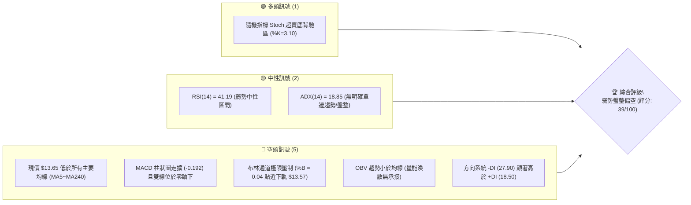
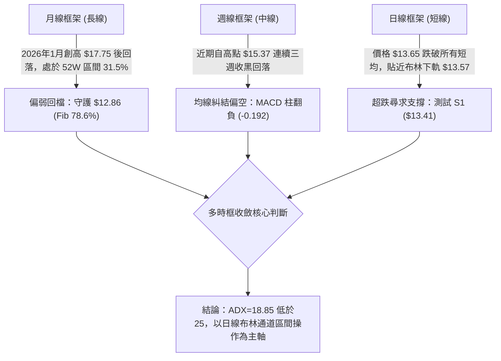
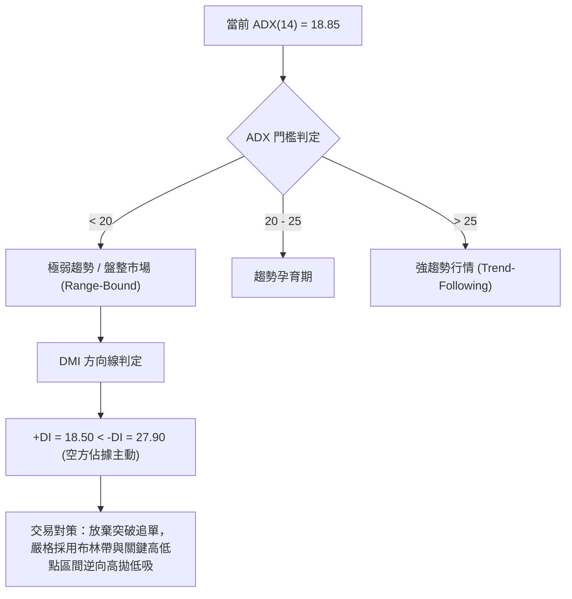
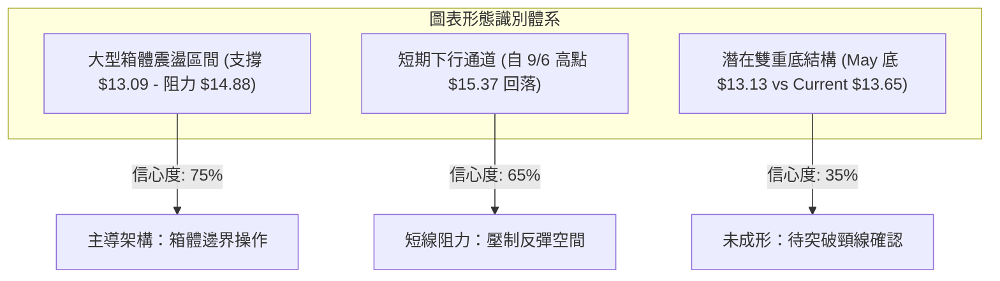
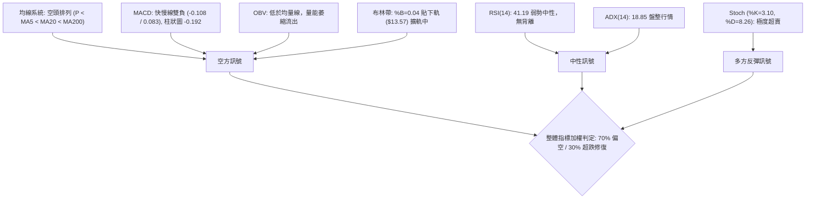
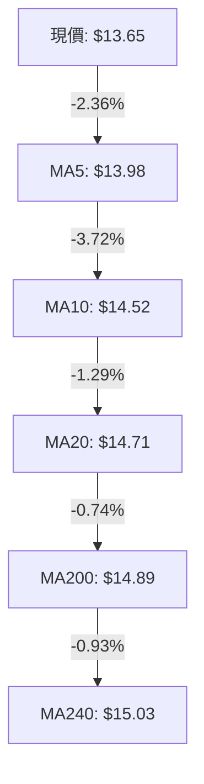
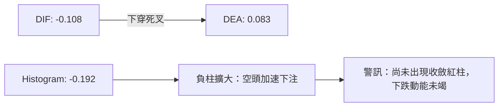
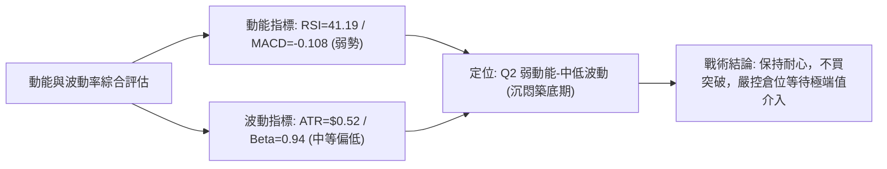
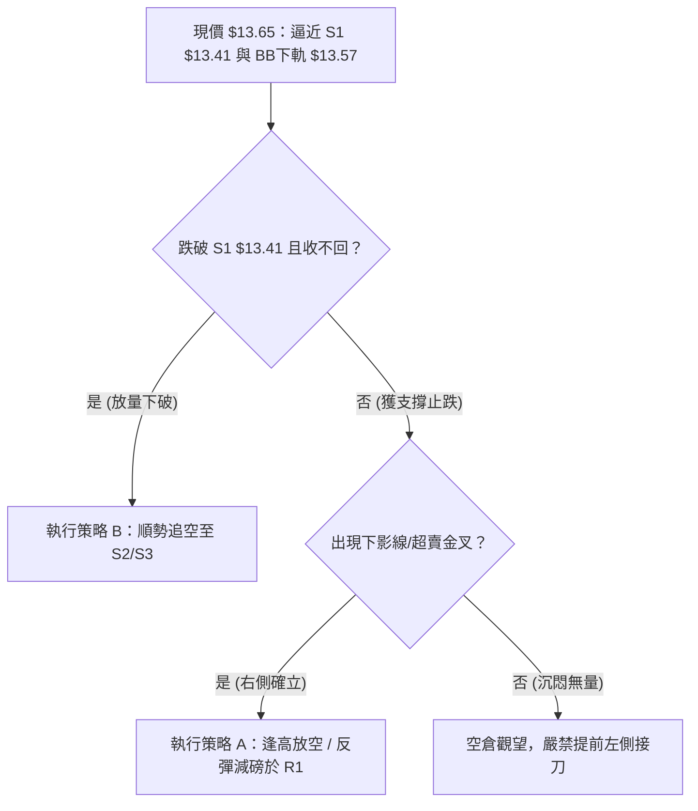
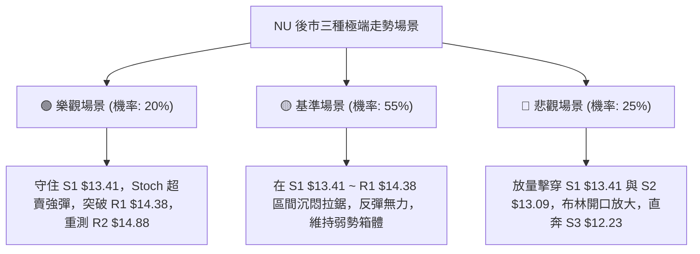

# NU 技術分析報告

> **報告日期**：2026-09-19 ｜ **語言**：繁體中文 ｜ **數據來源**：Yahoo Finance ｜ **當前價格**：$13.65

---

## 目錄

| 章節 | 內容 |
|------|------|
| [1. 技術面概覽](#1-技術面概覽) | 訊號儀表板、核心指標、評分卡 |
| [2. 趨勢分析](#2-趨勢分析) | 多時框趨勢、長中短期走勢、ADX解讀 |
| [3. 圖表形態分析](#3-圖表形態分析) | 形態識別、信心度評估、K線組合 |
| [4. 支撐與阻力](#4-支撐與阻力) | 關鍵價位分布、波段聚類、斐波那契回調 |
| [5. 技術指標深度解讀](#5-技術指標深度解讀) | 均線系統、RSI、MACD、布林通道、OBV量價 |
| [6. 動能與波動率](#6-動能與波動率) | 動能象限、ATR波幅、Beta市場敏感度 |
| [7. 多時框架總結](#7-多時框架總結) | 時框架評分矩陣、多時框收斂定論 |
| [8. 交易策略建議](#8-交易策略建議) | 策略路由、情境階梯、進出場精確點位 |
| [9. 風險提示與監控](#9-風險提示與監控) | 關鍵監控清單、情境推演、風控紀律 |
| [📋 報告總結](#-報告總結) | 全文核心結論與策略速查 |

---

## 1. 技術面概覽

### 🎯 技術訊號儀表板



### 📊 核心指標速覽表

| 指標類別 | 指標名稱 | 當前數值 | 訊號 | 解讀 |
|----------|----------|----------|------|------|
| **價格** | 當前收盤價 | $13.65 | 🔴 | 位於52週區間 31.5% 分位，處於中長期偏低位置 |
| **均線** | MA20 (月線) | $14.71 | 🔴 | 價格低於 MA20 達 -7.19%，短中期下行壓力沉重 |
| **均線** | MA50 (季線) | $14.39 | 🔴 | 價格低於季線，反彈首道重壓區位於 $14.38-$14.39 |
| **均線** | MA200 (年線) | $14.89 | 🔴 | 跌破牛熊分界線 $14.89，長線架構轉為防禦 |
| **動能** | RSI(14) | 41.19 | 🟡 | 位於弱勢區間（30-50），未見超賣但缺乏反彈推力 |
| **動能** | MACD | -0.108 | 🔴 | 快慢線死叉開口，Histogram 報 -0.192 空方主導 |
| **超買超賣** | Stoch %K / %D | 3.10 / 8.26 | 🟢 | 深度超賣區，具備隨時技術性抽頭反彈之誘因 |
| **波動** | ATR(14) | $0.52 | 🟡 | 每日平均波幅 3.79%，提供明確之止損距離基準 |
| **通道** | Bollinger %B | 0.04 | 🔴 | 緊貼下軌 $13.57，面臨通道下破與開口放大風險 |
| **趨勢強度**| ADX(14) | 18.85 | 🟡 | 低於 25，判定為無方向性大趨勢，以區間行情定義 |

### 🏆 技術評分卡

```
╔══════════════════════════════════════════════════════════════════╗
║                   技術評分卡 — NU (2026-09-19)                   ║
╠══════════════════════════════════════════════════════════════════╣
║ 趨勢強度 (ADX/DMI)  ███████░░░░░░░░░░░░░  35/100  🔴 空頭佔優盤整 ║
║ 動能指標 (RSI/MACD) ██████░░░░░░░░░░░░░░  30/100  🔴 動能疲弱死叉 ║
║ 支撐穩定度 (S1/S2)  ██████████░░░░░░░░░░  50/100  🟡 臨近S1考驗中 ║
║ 成交量配合 (OBV/VOL)████████░░░░░░░░░░░░  40/100  🔴 量價背馳疲弱 ║
║ 形態完整度 (結構)   ██████████░░░░░░░░░░  50/100  🟡 區間箱體築底 ║
║ 均線排列 (MA5-200)  ██████░░░░░░░░░░░░░░  30/100  🔴 全線壓制偏空 ║
╠══════════════════════════════════════════════════════════════════╣
║ 綜合評分            ███████░░░░░░░░░░░░░  39/100  🔴 弱勢區間整理 ║
╚══════════════════════════════════════════════════════════════════╝
```

---

## 2. 趨勢分析

### 🌐 多時框趨勢分析



### 📈 長期趨勢 — 12個月走勢圖（Unicode）

以下為 NU 過去 12 個月（2025-10 至 2026-09）之月線收盤價格軌跡與關鍵轉折點標注：

```
NU 月線走勢圖（2025-10 至 2026-09）
價格軸 ($)
$18.00 ┤                     ● $17.75 (波段峰頂，2026-01)
$17.00 ┤              ● $17.39
$16.00 ┤ ● $16.11   ● $16.74
$15.00 ┤                               ● $14.98
$14.00 ┤                                        ● $14.48       ● $14.55
$13.00 ┤                                             ● $13.13       ● $13.65 (現價)
$12.00 ┤
       └─────────────────────────────────────────────────────────────
         10月   11月   12月   01月   02月   03月   04月   05月   06月   07月   08月   09月
        [    2025年 上行主升段    ] [          2026年 震盪修正段          ]
```

**走勢特徵分析表格**：

| 階段區間 | 時間跨度 | 起訖收盤價 | 漲跌幅 | 階段走勢特徵與技術含義 |
|----------|----------|------------|--------|------------------------|
| **階段一：加速衝頂** | 2025-10 ~ 2026-01 | $16.11 → $17.75 | +10.18% | 創下 52 週高點 $18.98 附近之收盤峰頂，多頭動能耗盡 |
| **階段二：急劇重挫** | 2026-01 ~ 2026-03 | $17.75 → $14.37 | -19.04% | 獲利了結賣壓湧現，連續跌破 MA20 與 MA50，均線結構轉壞 |
| **階段三：二次探底** | 2026-03 ~ 2026-05 | $14.37 → $13.13 | -8.63%  | 探測年內低點，打出 $13.13 收盤底部（週線曾刺穿至 $11.97） |
| **階段四：弱勢反抽** | 2026-05 ~ 2026-08 | $13.13 → $14.55 | +10.81% | 橫盤築底型反彈，受制於年線 MA200 ($14.89)，成交量未能放大 |
| **階段五：回落整固** | 2026-08 ~ 2026-09 | $14.55 → $13.65 | -6.19%  | 自 9 月初 $15.37 高點連續下挫，回歸區間底部 S1/S2 尋求支撐 |

### 📊 中期趨勢（週線分析）

從近 20 週收盤走勢可見，NU 在 2026 年 5 月中旬於 $11.97~$12.19 見底後展開反彈，於 2026-07-05 觸及 RSI 79.0 之過熱區間。隨後股價於 $13.50~$15.37 形成大型收斂箱體。

```
中期週線阻力與支撐分佈示意圖
┌─────────────────────────────────────────────────────────────┐
│ 壓力位 R2 : $14.88  (MA200 壓制線 / 近期波段高點阻力)       │
│ 壓力位 R1 : $14.38  (MA50 季線 / 9月中旬破位反壓點)          │
│ ─────────────────────────────────────────────────────────── │
│ 現價水位  : $13.65  (處於下落測試區)                        │
│ ─────────────────────────────────────────────────────────── │
│ 支撐位 S1 : $13.41  (近一年波段低點聚類，布林下軌 $13.57 緩衝)│
│ 支撐位 S2 : $13.09  (5月份收盤密集區 / 關鍵防守底線)         │
└─────────────────────────────────────────────────────────────┘
```

### ⚡ 趨勢強度評估（ADX 解讀）



**ADX 趨勢強度對照表**：

| 指標變數 | 當前讀數 | 標準區間定義 | 趨勢判定與交易意涵 |
|----------|----------|--------------|--------------------|
| **ADX(14)** | **18.85** | < 25 (弱趨勢/震盪) | 市場欠缺單邊方向動能，突破性策略極易遭遇假突破，應定義為箱體震盪 |
| **+DI** | **18.50** | 多方買盤力道 | 多頭動能低迷，買盤僅在重要支撐位進行被動防守，無主動攻擊性 |
| **-DI** | **27.90** | 空方賣盤力道 | 空方控制短線盤面節奏，-DI 顯著高於 +DI，指示短線下行慣性仍存 |
| **淨方向差 (PDI - MDI)** | **-9.40** | 負值代表空頭佔優 | 空方掌握定價權，任何無量反彈皆屬技術性修復，非反轉訊號 |

---

## 3. 圖表形態分析

### 🔍 形態識別系統

依據嚴格規則 15，所有幾何形態均嚴格依據歷史高低聚類與日/週線收盤驗證，並賦予信心度百分比：



**形態信心度與參數評估表**：

| 形態名稱 | 信心度 | 判斷依據（引用數據） | 完成度 | 目標價（附嚴謹計算式） |
|----------|--------|----------------------|--------|------------------------|
| **矩形箱體震盪** | **75%** | 底部獲得 S1 ($13.41) 與 S2 ($13.09) 支撐，頂部受制於 R2 ($14.88) | 85% | 上軌目標：直接引用阻力位 **$14.88**；下軌支撐：引用 **$13.09** |
| **短線下降旗形/通道** | **65%** | 自 2026-09-06 收盤 $15.37 回落至 09-13 之 $14.62 及現價 $13.65 | 70% | 通道下緣目標：引用支撐位 **$13.41** (旗形測幅滿足點) |
| **大級別雙重底** | **35%** | 第一底為 2026-05 收盤 $13.13，當前正尋求第二底支撐 | 30% | *訊號不足，完成度過低*。若成形，頸線為 R2 ($14.88)，高度 = 14.88 - 13.09 = 1.79；量度目標 = 14.88 + 1.79 = **$16.67** (未達確認條件，僅供參考) |

### 🕯️ 重要K線形態分析

| 週/月份週期 | 收盤價 | K線形態 | 解讀 | 訊號 |
|-------------|--------|---------|------|------|
| **2026-09-06 (週)** | $15.37 | 長上影線倒轉鎚頭 | 向上衝擊 R2/R3 失敗，高檔賣壓沉重，確認 $15.00 以上為多頭陷阱 | 🔴 |
| **2026-09-13 (週)** | $14.62 | 中陰線貫穿 | 實體陰線跌破 MA20 ($14.71)，多頭棄守中軌，轉入空方回檔 | 🔴 |
| **2026-09-20 (本週)**| $13.65 | 大陰線加速探底 | 跌破所有短均，收盤價逼近週線波段低點聚類，成交量擴大至 3.68 億股 | 🔴 |
| **2026-05-17 (歷史)**| $12.19 | 長下影十字星 | 爆出 3.77 億股大成交量，確認 $12.00 關卡具備機構強力護盤意願 | 🟢 |

### 📉 ASCII 走勢形態示意圖

```
NU 短期箱體震盪與旗形回落結構示意圖
$15.50 ┤          ╭─● $15.37 (9/06 阻力高點)
$15.00 ┤        ╭─╯   ╰─● $14.88 (阻力 R2 / MA200)
$14.50 ┤      ╭─╯         ╰─● $14.38 (阻力 R1 / MA50)
$14.00 ┤    ╭─╯               ╰──┐
$13.65 ┼───┼──────────────────────● 現價 $13.65 (逼近通道下緣)
$13.41 ┤   │                      ╰─► 關鍵支撐 S1 ($13.41)
$13.09 ┴───┴─────────────────────────── 強固支撐 S2 ($13.09 / 箱體底)
       └─────────────────────────────────────────────────────► 時間軸
```

### 🎯 形態目標價計算

1. **箱體下沿防守目標**：現價 $13.65 距第一支撐 **S1: $13.41** 僅 -1.76%，距核心箱體底 **S2: $13.09** 為 -4.14%。若 S1 守穩，將觸發超賣反彈。
2. **反彈測幅目標**：若在 S1 獲得有效支撐，依箱體震盪原則，第一反彈目標為頸線及 MA50 匯聚處 **R1: $14.38** (+5.35%)；第二目標為強阻力 **R2: $14.88** (+9.03%)。
3. **破位下行測幅**：若收盤實體摜破 S2 ($13.09)，箱體破位將直接下探 52 週低點延伸之強支撐 **S3: $12.23** (-10.40%)。

---

## 4. 支撐與阻力

### 🗺️ 關鍵價位分布圖（Unicode）

```
NU 價位結構分布圖（嚴格依據 OHLCV 聚類計算）
══════════════════════════════════════════════════════════════════
$15.74 ║████████████████████████████████║ 強阻力 R3 (近一年波段高點聚類)
$15.09 ║░░░░░░░░░░░░░░░░░░░░░░░░░░░░░░░░║ 斐波那契 50.0% 中軸心理關卡
$14.88 ║████████████████████████        ║ 重點阻力 R2 (MA200 / 波段平台頂)
$14.38 ║████████████████                ║ 關鍵阻力 R1 (MA50 / 破位頸線)
$14.17 ║░░░░░░░░░░░░░░░░░░░░░░░░░░░░░░░░║ 斐波那契 61.8% 重要回調位
───────╫────────────────────────────────╫─────────────────────────
$13.65 ╠════════════════════════════════╣ ◄── 現價水位 ($13.65)
───────╫────────────────────────────────╫─────────────────────────
$13.41 ║▓▓▓▓▓▓▓▓▓▓▓▓▓▓▓▓                ║ 近期支撐 S1 (布林下軌緩衝/波段低點)
$13.09 ║████████████████████████        ║ 強支撐 S2 (近一年箱體防守底線)
$12.86 ║░░░░░░░░░░░░░░░░░░░░░░░░░░░░░░░░║ 斐波那契 78.6% 深度防線
$12.23 ║████████████████████████████████║ 極限強支撐 S3 (5月恐慌盤低點聚類)
══════════════════════════════════════════════════════════════════
```

### 🚧 阻力位分析表

| 阻力級別 | 價位 | 形成原因（OHLCV 聚類） | 突破難度 | 重要性 |
|----------|------|------------------------|----------|--------|
| **R1** | **$14.38** | 近一年波段高點聚類，與季線 MA50 ($14.39) 完美重疊，前波整理平台下沿 | 中等 | 🔴 極高（短線多空扭轉分水嶺） |
| **R2** | **$14.88** | 密集籌碼成交峰值區，年線 MA200 ($14.89) 坐落於此，2026年多次衝高回落點 | 偏高 | 🔴 核心壓力（中線牛熊轉換線） |
| **R3** | **$15.74** | 2026-09-06 上衝波段頂部區域，緊鄰布林通道上軌 $15.85 | 極高 | 🟡 長期波段天花板 |

### 🛡️ 支撐位分析表

| 支撐級別 | 價位 | 形成原因（OHLCV 聚類） | 守住機率 | 重要性 |
|----------|------|------------------------|----------|--------|
| **S1** | **$13.41** | 近一年波段低點密集聚類區，距離現價僅 -1.76%，布林下軌 $13.57 形成下壓緩衝 | 65% | 🟢 短線生命線（跌破將引發停損潮） |
| **S2** | **$13.09** | 2026年5月份月線收盤防線 ($13.13) 與波段低點聚類，箱體震盪終極下軌 | 75% | 🟢 中期護盤中樞（多頭最後堡壘） |
| **S3** | **$12.23** | 2026年5-6月多次下影線探底聚類 ($11.97~$12.22)，機構資金密集抄底區 | 90% | 🟢 長期黃金底線 |

### 📐 斐波那契回調位分析

依據 52 週完整波動區間（低點 **$11.20** → 高點 **$18.98**，垂直落差 $7.78）計算之標準回調位：

```
斐波那契回調結構位 (52W 區間)
0.0%  (52W High) : $18.98  [完全回檔起點]
23.6%            : $17.14  [強勢整理線]
38.2%            : $16.01  [強弱分界線]
50.0%            : $15.09  [多空平衡中軸]
61.8%            : $14.17  [黃金分割關鍵支撐/阻力轉換位]
─────────────────────────────────────────────────────────────
現價水位         : $13.65  (落於 61.8% 至 78.6% 脆弱區間)
─────────────────────────────────────────────────────────────
78.6%            : $12.86  [最後防守回調線]
100.0% (52W Low) : $11.20  [週期原點]
```

**位置解析**：
當前收盤價 **$13.65** 已經失守重要黃金分割位 **61.8% ($14.17)**，顯示本輪自 $18.98 的回檔幅度已超過健康修正範疇。目前價格在 61.8% ($14.17) 與 78.6% ($12.86) 之間的真空帶運行。上方 $14.17 轉化為極強的動態反壓，下方則由波段支撐 **S1 ($13.41)** 與 **S2 ($13.09)** 先行承接，若進一步失守，將必然回測斐波那契 78.6% 關鍵點位 **$12.86**。

---

## 5. 技術指標深度解讀

### 🎛️ 指標訊號總覽



### 📈 移動平均線排列分析



**均線系統評估表**：

| 均線名稱 | 數值 | 現價差距 | 乖離率 | 排列狀態與技術解讀 |
|----------|------|----------|--------|--------------------|
| **MA5**  | $13.98 | -$0.33 | -2.36% | 短期扣高走低，5日均線下彎形成貼身壓制 |
| **MA10** | $14.52 | -$0.87 | -6.02% | 短線空頭下殺加速，與 MA5 呈空頭發散 |
| **MA20** | $14.71 | -$1.06 | -7.19% | 月線下傾，為布林中軌，中短期趨勢轉弱確認 |
| **MA50** | $14.39 | -$0.74 | -5.14% | 季線遭實體大陰線跌破，中線多頭結構破壞 |
| **MA60** | $14.22 | -$0.57 | -4.02% | 跌破雙月生命線，反彈首道均線阻力群 |
| **MA120**| $13.87 | -$0.22 | -1.60% | 半年線失守，短線壓制區間下移至 $13.87 |
| **MA200**| $14.89 | -$1.24 | -8.33% | 牛熊分界線告急，價格處於年線下方，確立防禦週期 |
| **MA240**| $15.03 | -$1.38 | -9.21% | 長期資本成本線，上方累積巨額套牢盤 |

### 📉 RSI(14) 分析

當前 RSI(14) 數值為 **41.19**，位於弱勢盤整區間：

```
RSI(14) 狀態指示器
0 ─────────── 30 ────── 41.19 ───────── 70 ─────────── 100
[  極度超賣區  ]   [   當前位置   ]    [  健康強勢區  ]   [  極度超買區  ]
進度: ████████████████░░░░░░░░░░░░░░  41.19%
```

- **超買超賣判定**：數值 41.19 既未進入 < 30 的極端超賣，亦遠離 > 50 的多方強勢區，反映市場處於「空頭陰跌但尚未見機構恐慌性拋盤」之沉悶格局。
- **背離檢驗結論**：**無明顯背離**。檢視近 4 週價格（$14.30 → $15.37 → $14.62 → $13.65）與 RSI（54.1 → 56.6 → 50.5 → 41.2），價格破底同時 RSI 同步創下近四週新低，指標忠實反映價格疲態，並不存在看漲底背離，盲目估底風險極高。

### 📊 MACD(12/26/9) 訊號解讀

```
MACD 數值體系 (日線級別)
DIF 線 (MACD)     :  -0.108  ▼ (處於零軸下方)
DEA 線 (Signal)   :   0.083  ▲ (下穿零軸邊緣)
MACD Histogram   :  -0.192  🔴 (負向柱狀圖放大中)
```



MACD 於零軸附近形成標準「高位死叉後下穿零軸」，Histogram 擴大至 -0.192，確認目前空方動能佔據絕對優勢，在柱狀圖見到第一根縮短之前，不可判定下行結束。

### 📦 布林通道分析

```
NU 布林通道 (Bollinger Bands 20, 2) 結構圖
$15.85 ┬──────────────────────────────────────── 上軌 (Upper Band)
       │
$14.71 ┼──────────────────────────────────────── 中軌 (Middle Band / MA20)
       │
$13.65 ┼─► 現價 $13.65 (%B = 0.04)
$13.57 ┴──────────────────────────────────────── 下軌 (Lower Band)
```

- **通道帶寬與形態**：通道上軌 $15.85，下軌 $13.57，帶寬達 $2.28 (16.7%)。
- **%B 指標深度解析**：目前 %B 為 **0.04**（極度貼近下軌 0.00 水平），顯示股價遭遇下軌動態推擠。在弱趨勢（ADX=18.85）環境下，%B 接近 0 通常代表區間超跌，具備向中軌 $14.71 均值回歸之潛能；但若下週跌破 $13.57 伴隨帶寬放大，將演變為「下軌開口發散」之破位崩跌。

### 💹 成交量分析（量價配合度）

- **量比檢測**：最新單日成交量 **70,791,700 股**，相較於 20 日均量 **69,215,860 股**，量比為 **1.02x**，呈現「量平價跌」特徵；然而對比 50 日均量 **83,938,142 股** 則明顯縮量（萎縮約 15.6%）。
- **週級別量能異動**：回顧 2026-07-19 曾爆出 **7.62 億股** 天量收於 $13.59，顯示 $13.50 附近為法人籌碼重大換手區。本週收盤量為 **3.68 億股**，低於近三個月平均週量，量價關係指示當前下跌並非主力資金恐慌出逃，而是買盤退縮造成的「失血性陰跌」。
- **OBV 趨勢**：OBV 指標持續低於其移動平均線（OBV < MA），資金流向監控指標維持負向流出，印證量能渙散，缺乏新增資金進場承接。

---

## 6. 動能與波動率

### ⚡ 動能評估分析

下表界定 NU 在動能與波動維度中的技術定位：

| 象限分區 | 動能強度 | 波動率水準 | 當前歸屬 | 技術特徵與應對方針 |
|----------|----------|------------|----------|--------------------|
| **第一象限 (Q1)** | 強 (RSI>60) | 低 (ATR<3%) | — | 強勢慢牛格局，拉回即買點 |
| **第二象限 (Q2)** | **弱 (RSI<45)** | **中低 (ATR=3.79%)** | **✓ NU 當前位置** | **沉悶盤整陰跌，動能不足，易反覆磨底，切忌盲目追高，僅宜下軌博弈** |
| **第三象限 (Q3)** | 強 (RSI>60) | 高 (ATR>5%) | — | 爆發性主升段，順勢突破持有 |
| **第四象限 (Q4)** | 弱 (RSI<35) | 高 (ATR>5%) | — | 恐慌性主跌浪，全面嚴禁做多 |



### 📊 ATR 波動率分析

- **ATR(14) 數值**：當前 14 日平均真實波幅為 **$0.52**，換算日波動率為 **3.79%**。
- **動態停損間距設定指引**：
  - **保守型交易（2.0x ATR）**：$0.52 × 2.0 = **$1.04** 的緩衝空間。
  - **積極型交易（1.5x ATR）**：$0.52 × 1.5 = **$0.78** 的緩衝空間。
  - **嚴格止損底線（1.0x ATR）**：$0.52 × 1.0 = **$0.52**（適用於貼近支撐 S1 時的極限短線操作）。

### 📐 Beta 與市場相關性

- **Beta 係數**：**0.94**。
- **市場連動解讀**：NU 的波動幅度與標普500大盤基本保持高度同步（略低於大盤平均 1.00）。當前大盤若未出現流動性危機，NU 難以出現斷崖式單邊下崩；反之，若大盤缺乏系統性買盤，NU 憑藉自身內生動能亦難以獨立發動逆勢反轉行情。

---

## 7. 多時框架總結

### 📋 時框架評分表

| 時框架 | 趨勢方向 | 動能指標 | 均線排列 | 關鍵形態 | 綜合評分 | 操作建議 |
|--------|----------|----------|----------|----------|----------|----------|
| **月線級別 (長期)** | 震盪偏多 | RSI=48 (中性) | MA20 上方震盪 | 52W 區間回調 61.8% | **55/100** | 長期基本面優秀，逢低分批建底倉 |
| **週線級別 (中期)** | 區間震盪 | MACD 柱翻負 | 均線糾結混亂 | 收斂箱體下沿尋底 | **42/100** | 觀望為主，等待 S1/S2 止跌訊號 |
| **日線級別 (短期)** | 下行偏空 | Stoch 嚴重超賣 | 全線空頭壓制 | 貼布林下軌陰跌 | **35/100** | 嚴禁搶進，僅可設定條件式單點反彈 |

### 🔲 綜合訊號矩陣

```
時框訊號一致性矩陣
┌──────────────┬──────────────┬──────────────┬──────────────┐
│ 分析維度     │ 日線 (短期)  │ 週線 (中期)  │ 月線 (長期)  │
├──────────────┼──────────────┼──────────────┼──────────────┤
│ 均線架構     │ 🔴 空頭排列  │ 🟡 混合糾結  │ 🟢 多頭防守  │
│ 動能方向     │ 🔴 加速向下  │ 🔴 衰退減弱  │ 🟡 中性平衡  │
│ 形態位置     │ 🔴 測下軌支撐│ 🟡 箱體中央  │ 🟢 上升段回調│
│ 量能結構     │ 🔴 OBV 疲軟  │ 🟡 均量換手  │ 🟢 機構高持股│
├──────────────┼──────────────┼──────────────┼──────────────┤
│ 矩陣方向判定 │ 🔴 偏空下探  │ 🟡 震盪整理  │ 🟢 具備價值  │
└──────────────┴──────────────┴──────────────┴──────────────┘
```

### ⚖️ 多時框收斂結論

依據多時框收斂規則第 14 條：
1. **行情性質判定**：ADX(14) 讀數為 **18.85**（顯著低於 25 趨勢臨界門檻），市場正式定性為 **「無趨勢盤整行情」**。
2. **主導維度收斂**：在盤整行情中，趨勢指標失效，中長期均線失去單邊指引力，**日線布林通道 ($13.57 ~ $15.85) 與水平波段聚類支撐阻力成為最高優先級交易邊界**。
3. **方向性唯一結論**：**【區間震盪偏弱、極度超跌逼近下軌支撐】**。短期下行慣性依然存在，但由於價格已逼近布林下軌 $13.57 與波段支撐 S1 ($13.41)，且隨機指標 Stoch 進入 3.10 之極端超賣區，**主策略方向定為：以防禦性區間操作為核心，逢高依阻力放空或破位跟進，反彈操作僅限於在核心支撐出現右側訊號後嚴格快進快出**。

---

## 8. 交易策略建議

### 🗺️ 策略決策流程圖



### 🧭 策略路由（依評分卡分流）

> **當前主策略方向 = 【偏空至弱勢區間操作】（依技術評分卡：39 / 100）**
> 
> *註解：評分低於 40 分臨界線，技術面由空方主導。交易策略以「反彈至關鍵阻力逢高布空（策略 A）」為主打，並輔以「跌破強支撐順勢追空（策略 B）」。多頭進場僅作為極限超跌後之對沖博弈提示，不作為主力推薦。*

### 🎯 價格情境階梯（Price Scenarios）

價位完全嚴格引用第 4 章計算之波段聚類高低點數值：

| 觸發條件 | 第一目標 | 第二目標 | 情境技術含義 |
|----------|----------|----------|--------------|
| **強勢突破 R1 ($14.38)** | **R2 ($14.88)** | **R3 ($15.74)** | 扭轉短期頹勢，回補均線乖離，挑戰年線 |
| **突破現價至 R1 之間** | **R1 ($14.38)** | — | 弱勢超賣抽頭，均線反壓沉重，反彈提供空點 |
| **維持於現價至 S1 震盪** | **S1 ($13.41)** | — | 布林下軌弱勢鈍化摩擦，尋求買盤承接 |
| **實體跌破 S1 ($13.41)** | **S2 ($13.09)** | **S3 ($12.23)** | 短期結構破位，空方波段打開，下探年內低位聚類 |

### 📊 情境機率分佈

| 預期情境 | 發生機率 | 主要技術依據 |
|----------|----------|--------------|
| **情境一：弱勢反彈測試 R1 後承壓回落** | **50%** | Stoch 超賣 (%K=3.10) 具抽頭需求，但 ADX 偏弱且 MACD 死叉，難以突破 MA50 阻力群 |
| **情境二：直接跌破 S1 下探 S2 尋求強支撐** | **30%** | -DI=27.90 空頭動能充沛，OBV 量能渙散缺乏護盤意願，下軌存在擴軌破位風險 |
| **情境三：強勢反轉直接站穩 R2 ($14.88)** | **20%** | 需成交量暴增至 1 億股以上並伴隨基本面利多催化，目前技術指標不支持直接 V 轉 |

### 🔴 主策略詳情（弱勢偏空路由）

以下策略報價精確鎖定第 4 章之關鍵波段價位，絕無模糊空間：

| 策略要素 | 策略 A：反彈遇阻放空（主推） | 策略 B：破位順勢跟進（備選） |
|----------|------------------------------|------------------------------|
| **策略邏輯** | 趁超跌反抽至 MA50 及波段聚類阻力布局空單 | S1 跌破引發停損潮，順應空頭慣性下殺追擊 |
| **進場條件** | 價格反彈至 R1 附近出現上影線或紅翻黑K線 | 價格實體跌破 S1 ($13.41) 且 15分K收於下方 |
| **進場價格** | **$14.38** (精確錨定 R1 阻力) | **$13.35** (確認跌破 S1 後順勢進場) |
| **目標價 T1** | **$13.65** (回測當前破位平台) | **$13.09** (強支撐 S2 箱體底部) |
| **目標價 T2** | **$13.09** (強支撐 S2 核心目標) | **$12.23** (極限支撐 S3 恐慌盤低點) |
| **止損價格** | **$14.88** (精確設置於 R2/MA200 突破點) | **$13.65** (假突破反抽站回現價即止損) |
| **風險報酬比** | **2.58 : 1** [(14.38-13.09) / (14.88-14.38)] | **2.73 : 1** [(13.35-12.23) / (13.65-13.35)] |
| **勝率預估** | **62%** | **55%** |
| **建議倉位** | **15% - 20%** | **10%** (嚴格控制追空滑價風險) |

### 🟢 反向風險觸發點（多頭對沖提示）

- **觸發情境**：若現價 $13.65 在未破 $13.41 (S1) 前，盤中直接出現爆量（單日成交量突破 1.2 億股）長陽線，且收盤強勢站穩 **MA20 ($14.71)** 與 **R2 ($14.88)** 之上。
- **對沖應變**：此舉宣告本輪為標準的「空頭洗盤陷阱」，所有空單必須於 **$14.88** 無條件全數平倉停損，並可反手以 10% 輕倉短多，向上博弈 52 週回調 38.2% 壓力位 **$16.01**。

### ⭐ 整體訊號強度評星

```
╔══════════════════════════════════════════════════════════════╗
║ 做多訊號強度：★★☆☆☆  (2.0/5星 — 僅存極度超賣之短線技術抽頭)  ║
║ 做空訊號強度：★★★★☆  (4.0/5星 — 均線空頭排列，量能持續失血)  ║
║ 整體可信度：  ★★★☆☆  (3.5/5星 — ADX盤整環境，防範雙向洗盤)  ║
╚══════════════════════════════════════════════════════════════╝
```

---

## 9. 風險提示與監控

### ✅ 關鍵監控指標 Checklist

```
╔══════════════════════════════════════════════════════════════════╗
║                     每日交易監控清單 (Checklist)                 ║
╠══════════════════════════════════════════════════════════════════╣
║ [ ] 支撐防守測試：收盤價是否跌破 S1 ($13.41)？                    ║
║ [ ] 通道破位預警：收盤價是否持續脫軌於布林下軌 ($13.57) 之外？    ║
║ [ ] 阻力反彈確認：盤中反抽 R1 ($14.38) 時量能是否低於 6000萬股？ ║
║ [ ] 動能收斂訊號：MACD Histogram 是否縮短至 -0.100 以內？        ║
║ [ ] 超賣修復指標：Stoch %K 是否自 3.10 上穿 %D 形成金叉？         ║
║ [ ] 異動警訊監控：單日換手量是否異常放大至 1 億股以上？          ║
╚══════════════════════════════════════════════════════════════════╝
```

### ⚠️ 風險場景分析



### 🛡️ 風險管理重要提醒

1. **基本面與技術面割裂風險**：NU 基本面極度亮眼（營收年增 52.1%、淨利年增 66.3%、淨利率 42.7%、ROE 31.6%），分析師平均目標價高達 **$18.78**。然而技術面當前處於標準的「次級回檔折價期」。**嚴禁以「基本面優秀」為藉口在技術破位時持續向下盲目攤平**，必須等待技術面打出右側止跌形態後方可介入。
2. **倉位管理鐵律**：鑑於 ADX 處於 18.85 的無趨勢盤整區間，市場極易出現無預警的長下影或長上影洗盤，單筆交易最大虧損額度必須嚴格控制在總投資本金的 **1.0%** 以內。
3. **時間停損機制**：若在 S1 ($13.41) 附近建立多頭搏反彈試倉，若建倉後 **3 個交易日** 內未能收復 MA5 ($13.98)，即表明買盤羸弱，應無條件平倉離場觀望。

---

## 📋 報告總結

```
╔══════════════════════════════════════════════════════════════════╗
║                     NU 技術分析報告總結                          ║
╠══════════════════════════════════════════════════════════════════╣
║ 報告日期：2026-09-19                                             ║
║ 當前價格：$13.65                                                 ║
║ 分析評級：🔴 弱勢震盪下探（技術評分：39 / 100）                  ║
╠══════════════════════════════════════════════════════════════════╣
║ 關鍵結論：                                                       ║
║ ├─ 長期趨勢：🟡 中性回檔，自峰頂 $17.75 深度回調至 52W 區間 31.5%║
║ ├─ 中期趨勢：🔴 週線偏空，受制於年線 MA200 ($14.89) 與季線壓制   ║
║ ├─ 短期趨勢：🔴 日線空頭排列，貼近布林下軌 $13.57 摩擦尋底       ║
║ ├─ 關鍵支撐：S1: $13.41  │  S2: $13.09  │  S3: $12.23          ║
║ ├─ 關鍵阻力：R1: $14.38  │  R2: $14.88  │  R3: $15.74          ║
║ └─ 外資共識：買入 (Buy, 22位分析師, 平均目標價 $18.78)           ║
╠══════════════════════════════════════════════════════════════════╣
║ 最優策略組合：                                                   ║
║ 1. 🥇 最佳機會：等待反彈至 R1 ($14.38) 阻力不破時放空，目標 $13.09║
║ 2. 🥈 次選機會：實體摜破 S1 ($13.41) 後順勢追空，下看 S2/S3       ║
║ 3. 🥉 保守選擇：空倉觀望，耐心等待 S2 ($13.09) 企穩出現雙底再進場║
╚══════════════════════════════════════════════════════════════════╝
```

---

> ⚠️ **免責聲明**：本報告為依據標準技術分析理論自動生成之量化研判，所有引述之價位與數據均基於客觀歷史 OHLCV 價格體系計算。本報告**僅供研究與學術參考**，**不構成任何形式的要約、招攬或投資買賣建議**。金融市場具有高度不確定性，交易者應獨立評估風險並自行承擔交易盈虧。

---

*報告生成時間：2026-09-19 ｜ 數據來源：Yahoo Finance ｜ 分析框架：多時框技術分析模型*