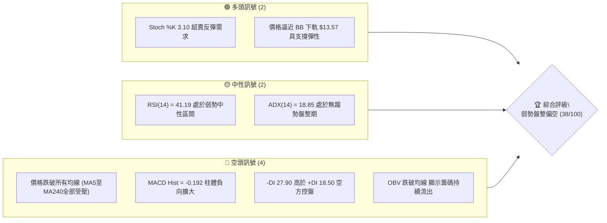
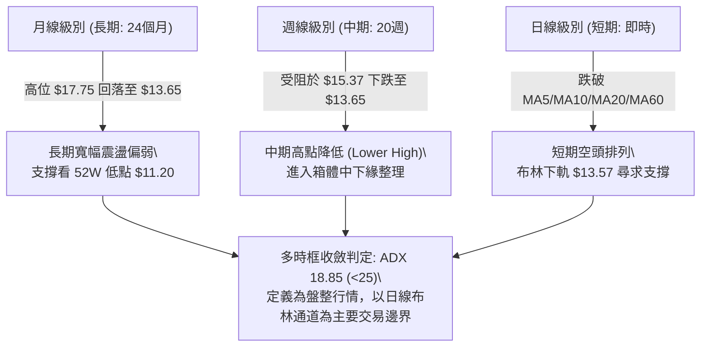
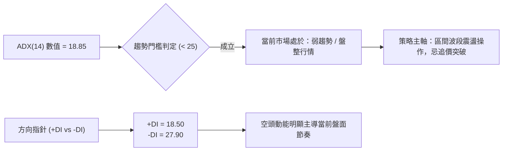
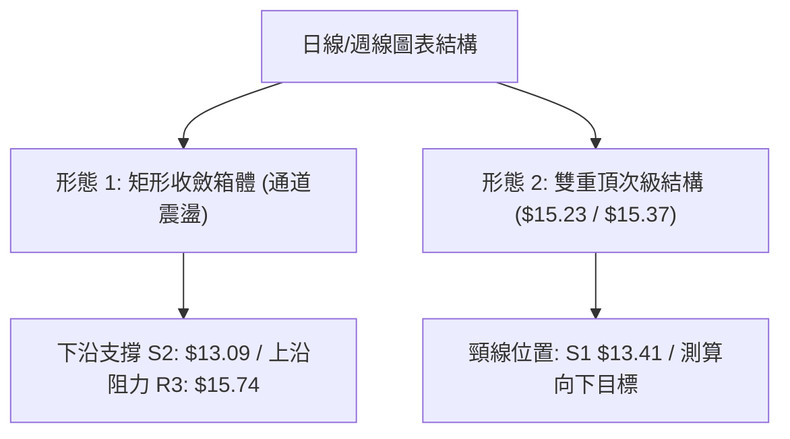
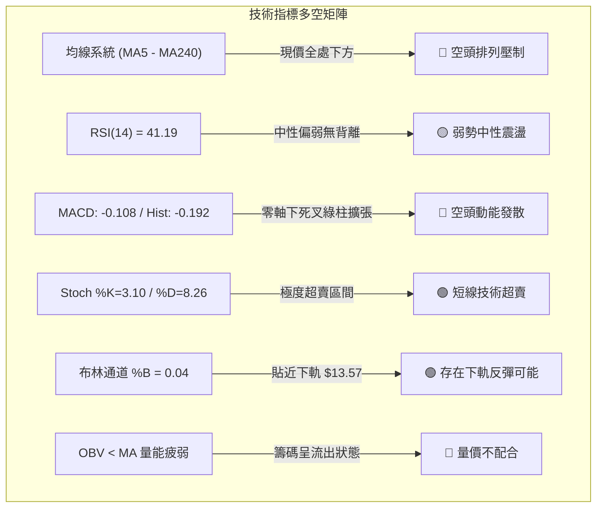
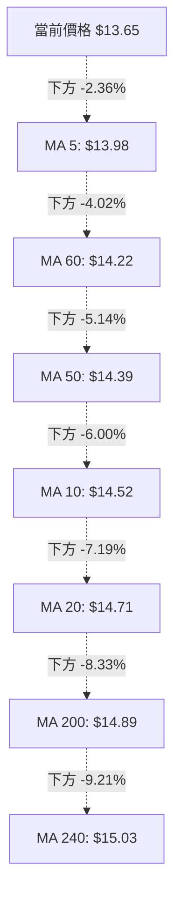
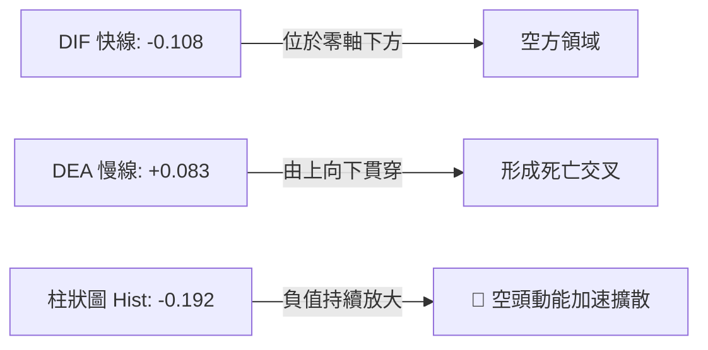
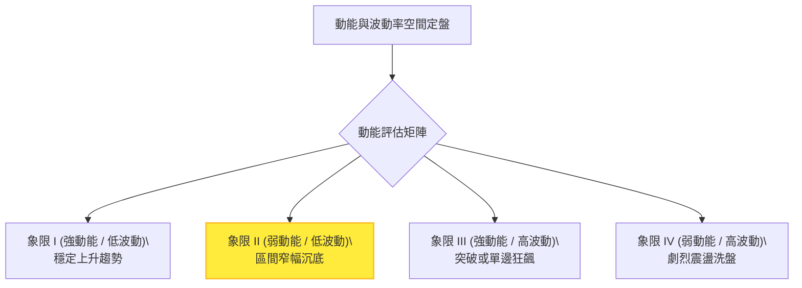
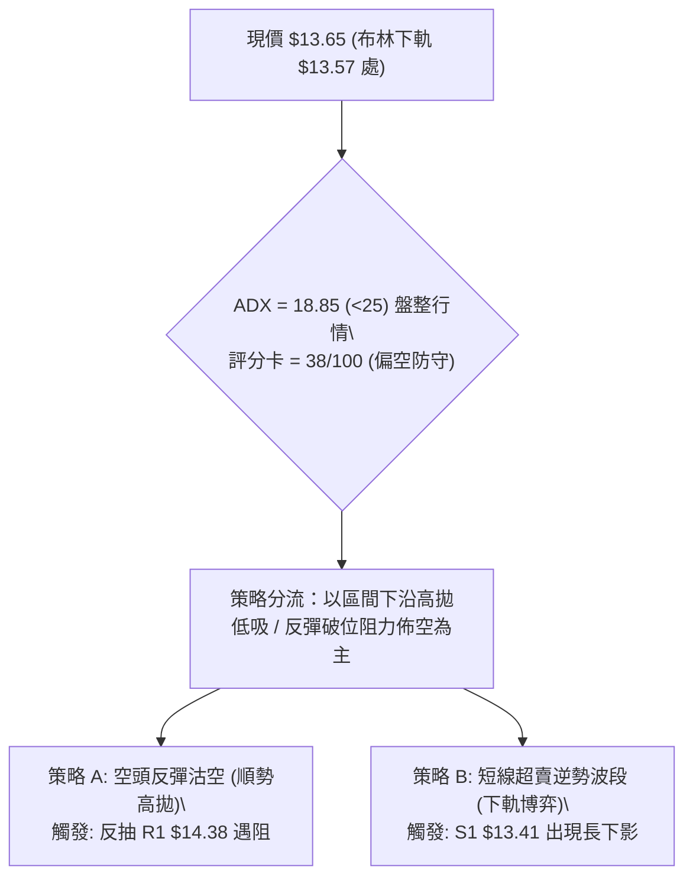
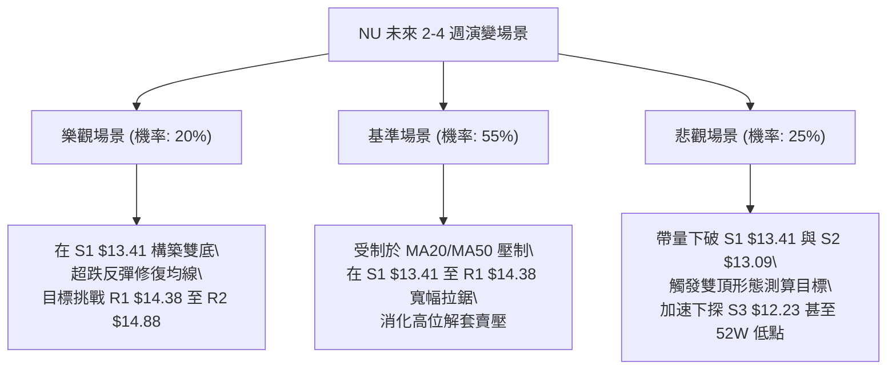

# NU 技術分析報告

> **報告日期**：2026-09-20 ｜ **語言**：繁體中文 ｜ **數據來源**：Yahoo Finance ｜ **當前價格**：$13.65

---

## 目錄

| 章節 | 內容 |
|------|------|
| [1. 技術面概覽](#1-技術面概覽) | 訊號儀表板、核心指標、評分卡 |
| [2. 趨勢分析](#2-趨勢分析) | 多時框趨勢、長中短期走勢 |
| [3. 圖表形態分析](#3-圖表形態分析) | 形態識別、K線組合、目標價 |
| [4. 支撐與阻力](#4-支撐與阻力) | 關鍵價位、斐波那契回調 |
| [5. 技術指標深度解讀](#5-技術指標深度解讀) | MA/RSI/MACD/布林/成交量 |
| [6. 動能與波動率](#6-動能與波動率) | 動能評估、ATR、Beta |
| [7. 多時框架總結](#7-多時框架總結) | 時框架評分矩陣 |
| [8. 交易策略建議](#8-交易策略建議) | 多空策略、風險報酬比 |
| [9. 風險提示與監控](#9-風險提示與監控) | 監控指標、風險場景 |

---

## 1. 技術面概覽

### 🎯 技術訊號儀表板



### 📊 核心指標速覽表

| 指標類別 | 指標名稱 | 當前數值 | 訊號 | 解讀 |
|----------|----------|----------|------|------|
| **價格** | 當前價格 | $13.65 | 🔴 | 位於 52 週區間 31.5% 位置，短期波段連續拉回 |
| **均線** | MA20 | $14.71 | 🔴 | 價格低於 MA20 達 -7.19%，短中期承壓偏空 |
| **均線** | MA50 | $14.39 | 🔴 | 跌破中期生命線，中期動能走弱 |
| **均線** | MA200 | $14.89 | 🔴 | 價格位於長期牛熊分界線下方 -8.33%，結構轉弱 |
| **動能** | RSI(14) | 41.19 | 🟡 | 弱勢中性區，未見極端超賣，無背離訊號 |
| **動能** | MACD | -0.108 / 0.083 | 🔴 | 快線跌破慢線呈死叉，Hist 為 -0.192 呈綠柱擴張 |
| **擺盪** | Stoch %K/%D | 3.10 / 8.26 | 🟢 | 進入極度超賣區（<20），醞釀技術性反彈 |
| **趨勢** | ADX(14) | 18.85 | 🟡 | 數值低於 25，無明顯單邊趨勢，屬於盤整震盪 |
| **方向** | DMI (+/-DI)| 18.50 / 27.90| 🔴 | -DI 大幅壓制 +DI，空方力量占據主導 |
| **波動** | ATR(14) | $0.52 | 🟡 | 佔股價 3.79%，日內波幅維持中等偏平穩狀態 |
| **通道** | 布林 %B | 0.04 | 🟢 | 緊貼布林下軌 $13.57，短期乖離偏大具有下軌支撐 |

### 🏆 技術評分卡

```
╔══════════════════════════════════════════════════════════════╗
║                 技術評分卡 — NU (2026-09-20)                 ║
╠══════════════════════════════════════════════════════════════╣
║ 趨勢強度 (ADX/DMI)  ██████░░░░░░░░░░░░░░  30/100  🔴 空頭控盤弱趨勢  ║
║ 動能指標 (RSI/MACD) ██████░░░░░░░░░░░░░░  32/100  🔴 動能向下擴散    ║
║ 支撐穩定度 (S1/下軌) ██████████░░░░░░░░░░  52/100  🟡 考驗S1與BB下軌  ║
║ 成交量配合 (量比/OBV)████████░░░░░░░░░░░░  40/100  🔴 OBV走弱籌碼發散 ║
║ 形態結構 (區間震盪)  ████████░░░░░░░░░░░░  42/100  🟡 寬幅箱體下沿防守║
║ 均線系統 (MA全排列) ████░░░░░░░░░░░░░░░░  22/100  🔴 現價全面受壓MA  ║
╠══════════════════════════════════════════════════════════════╣
║ 綜合評分            ███████░░░░░░░░░░░░░  38/100  🔴 偏空盤整(防守)  ║
╚══════════════════════════════════════════════════════════════╝
```

---

## 2. 趨勢分析

### 🌐 多時框趨勢分析



### 📈 長期趨勢 — 12個月走勢圖（Unicode）

```
NU 月線走勢圖（過去12個月：2025-10 至 2026-09）
價格軸 ($)
$18.00 ┤                               ● $17.75 (2026-01 波段峰頂)
$17.00 ┤                     ● $17.39       ● $16.74
$16.00 ┤ ● $16.11                                
$15.00 ┤                                          ● $14.98
$14.00 ┤                                                    ● $14.37  ● $14.48            ● $14.33  ● $14.55
$13.00 ┤                                                                        ● $13.13  ● $13.36            ● $13.65 (現價)
$12.00 ┤
       └────┬────────┬────────┬────────┬────────┬────────┬────────┬────────┬────────┬────────┬────────┬────────┬────
          2025-10  2025-11  2025-12  2026-01  2026-02  2026-03  2026-04  2026-05  2026-06  2026-07  2026-08  2026-09
```

**走勢特徵分析表格**：

| 階段區間 | 時間跨度 | 起訖價格 | 區間漲跌幅 | 走勢結構與技術特徵 |
|----------|----------|----------|------------|--------------------|
| 第一階段：衝頂浪 | 2025-10 ~ 2026-01 | $16.11 → $17.75 | +10.18% | 延續強勢多頭動能，於 2026-01 創下 $17.75 階段高點，逼近 52W 高點 $18.98 |
| 第二階段：回吐浪 | 2026-01 ~ 2026-05 | $17.75 → $13.13 | -26.03% | 獲利了結賣壓湧現，連續跌破多條短中天期均線，於 5 月探至 $13.13 低點 |
| 第三階段：中繼修復 | 2026-05 ~ 2026-08 | $13.13 → $14.55 | +10.81% | 觸底後展開弱勢反彈，嘗試挑戰 $15.00 整數關卡，量能溫和但上方壓力沉重 |
| 第四階段：二次下探 | 2026-08 ~ 2026-09 | $14.55 → $13.65 | -6.19% | 衝高失敗後再次拐頭向下，日線均線全數失守，目前逼近關鍵支撐區 S1 ($13.41) |

### 📊 中期趨勢（週線分析）

中期走勢呈現「反彈遇阻回落」的鋸齒狀形態。近 20 週數據顯示，股價曾於 2026-06-07 探底至 $11.97，隨後展開一波反彈，於 2026-09-06 達到次高點 $15.37，但隨即在最近兩週連續收陰（$14.62 → $13.65），週 MACD 柱體由正轉負擴大至 -0.192，週 RSI 回落至 41.2。

```
中期壓力與支撐階梯（週線視角）：
$15.74 ────────────────────────────────────────── R3 (近一年波段強阻力區)
$15.37 ─────────────● (2026-09-06 週線波段反彈高點)
$14.88 ────────────────────────────────────────── R2 / MA200 ($14.89)
$14.38 ────────────────────────────────────────── R1 / MA50 ($14.39)
$13.65 ═════════════◄ 當前價格 (測試通道下軌)
$13.41 ────────────────────────────────────────── S1 (近期波段低點支撐)
$13.09 ────────────────────────────────────────── S2 (箱體下邊緣強防線)
$12.23 ────────────────────────────────────────── S3 (中期波段深層回撤位)
```

### ⚡ 趨勢強度評估（ADX 解讀）



**ADX 強度對照與市場狀態判定**：

| 指標變數 | 當前讀數 | 狀態門檻 | 專業市場解讀 |
|----------|----------|----------|--------------|
| **ADX(14)** | **18.85** | < 20 (極弱趨勢 / 無趨勢) | 市場缺乏單向爆發動能，任何單邊突破形態失敗率較高，價格受限於箱體內。 |
| **+DI(14)** | **18.50** | 多方攻擊指標 | 多方動能低迷，買盤推升意願不足。 |
| **-DI(14)** | **27.90** | 空方壓制指標 | 空方力量明顯高於多方（差值達 9.40），主導近期價格下拉。 |
| **綜合判定** | **空方佔優的無趨勢震盪** | 盤整行情收斂規則適用 | **依規則 14：盤整行情以日線布林通道 ($13.57 - $15.85) 為主要交易區間。** |

---

## 3. 圖表形態分析

### 🔍 形態識別系統



**形態信心度與參數評估表**：

| 形態類別 | 信心度 | 判斷依據（嚴格引用數據） | 完成度 | 目標價（附嚴格計算式） |
|----------|--------|--------------------------|--------|------------------------|
| **矩形箱體震盪** | **85%** | 價格在近 4 個月反覆穿梭於 S2 ($13.09) 與 R3 ($15.74) 之間，ADX=18.85 Confirm 盤整 | 80% | 箱體底部 $13.09 至頂部 $15.74 循環；中軌錨定 MA20 ($14.71) |
| **次級雙重頂形態** | **65%** | 第一頂為 2026-08-16 高點 $15.23，第二頂為 2026-09-06 高點 $15.37，中間低點為 $13.84 | 75% | 頸線為 $13.84。形態高度 = 頂部均值 $15.30 - 頸線 $13.84 = $1.46。<br>測算跌幅目標 = $13.84 - $1.46 = **$12.38** (逼近 S3 $12.23) |
| **頭肩頂/底形態** | **20%** | 數據中左肩與右肩未見幾何對稱結構，成交量亦未見典型分佈特徵 | 0% | **數據不足以支撐幾何頭肩形態，依規則 15 僅作指標型解讀** |

### 🕯️ 重要K線形態分析

| 週期/月份 | 收盤價 | K線與量能形態 | 技術解讀 | 訊號方向 |
|-----------|--------|---------------|----------|----------|
| 2026-08-16 (週) | $15.23 | 長陽拉升 (放量 3.81 億股) | 突破 MA60 阻力，展現多頭反撲動能 | 🟢 強多 |
| 2026-09-06 (週) | $15.37 | 衝高回落十字星帶長上影線 | 於 R3 ($15.74) 前遇強大拋壓，多頭動能竭盡 | 🔴 頂部力竭 |
| 2026-09-13 (週) | $14.62 | 中陰線下破短期均線 | 確認前週長上影線為假突破，空方重新控盤 | 🔴 轉折看空 |
| 2026-09-20 (週) | $13.65 | 大陰線破位 (3.68 億股) | 帶量長陰連續跌穿 MA20、MA50，直逼布林下軌 | 🔴 空頭宣洩 |

### 📉 ASCII 走勢形態示意圖

```
雙重頂次級反轉與矩形箱體示意圖：
$15.74 ────────────────────────────────────────── 箱體天花板 (R3)
            頂一 ($15.23)      頂二 ($15.37)
                ▲                  ▲
               ╱ ╲                ╱ ╲
              ╱   ╲              ╱   ╲
$14.71 ──────╱─────╲────────────╱─────╲────────── 箱體中軸 (MA20 / BB中軌)
            ╱       ╲   反彈   ╱       ╲
           ╱         ╲  $13.84╱         ╲
$13.84 ───╱───────────●──────╱───────────╲─────── 雙頂頸線位
         ╱                                ╲
$13.65 ─╱──────────────────────────────────●───── 現價 ($13.65，考驗下軌)
$13.41 ────────────────────────────────────────── 關鍵支撐 S1
$13.09 ────────────────────────────────────────── 箱體地板 (S2)
```

### 🎯 形態目標價計算

1. **雙重頂回撤目標計算**：
   - 形態頂部均值：$(15.23 + 15.37) / 2 = \$15.30$
   - 頸線關鍵位：2026-08-09 週低點收盤價 $\$13.84$
   - 形態高度 ($H$)：$\$15.30 - \$13.84 = \$1.46$
   - 破位等幅測量目標價：$\$13.84 - \$1.46 =$ **$\$12.38$**
   - **驗證**：該目標價 $\$12.38$ 緊密落在關鍵支撐位 **S3 ($12.23)** 之上方附近，驗證 S3 具備極強結構支撐價值。

---

## 4. 支撐與阻力

### 🗺️ 關鍵價位分布圖（Unicode）

```
NU 價位結構分布圖 (由歷史波段高低點與斐波那契計算)
═════════════════════════════════════════════════════════════════
$18.98 ║████████████████████████████████║ 52W 最高點 (Fib 0.0%)
$17.14 ║██████████████████████          ║ Fib 23.6% 回調位
$16.01 ║██████████████████              ║ Fib 38.2% 回調位
$15.74 ║████████████████████████        ║ 強阻力 R3 (近一年波段高點聚類)
$15.09 ║████████████████                ║ Fib 50.0% 中樞分界線
$14.88 ║██████████████████              ║ 阻力 R2 (MA200 重合區 $14.89)
$14.38 ║██████████████                  ║ 關鍵阻力 R1 (MA50 重合區 $14.39)
$14.17 ║████████████                    ║ Fib 61.8% 黃金分割分界
───────╫────────────────────────────────╫────────────────────────
$13.65 ╠════════════════════════════════╣ ◄ 當前價格 $13.65 (BB下軌 $13.57)
───────╫────────────────────────────────╫────────────────────────
$13.41 ║▓▓▓▓▓▓▓▓▓▓▓▓▓▓▓▓                ║ 近期核心支撐 S1 (波段密集低點)
$13.09 ║████████████████████████        ║ 強支撐 S2 (近一年箱體強底)
$12.86 ║████████████                    ║ Fib 78.6% 深層回撤位
$12.23 ║████████████████████████████    ║ 極強支撐 S3 (波段崩跌防守線)
$11.20 ║████████████████████████████████║ 52W 最低點 (Fib 100.0%)
═════════════════════════════════════════════════════════════════
```

### 🚧 阻力位分析表

所有阻力價位嚴格引用自「關鍵價位」區塊，禁止推演造假：

| 阻力級別 | 準確價位 | 距現價幅標 | 技術形成原因與重合指標 | 突破難度 | 重要性權重 |
|----------|----------|------------|------------------------|----------|------------|
| **R1** | **$14.38** | +5.35% | 近一年波段高點聚類；與日線 **MA50 ($14.39)**、斐波那契 **61.8% ($14.17)** 高度共振 | 🟡 中等 | ★★★★☆ |
| **R2** | **$14.88** | +9.03% | 歷史成交密集套牢區；與長期牛熊線 **MA200 ($14.89)**、布林中軌 **MA20 ($14.71)** 構成死叉壓制帶 | 🔴 較高 | ★★★★☆ |
| **R3** | **$15.74** | +15.34% | 近一年多次波段反彈極限高點聚類；與布林上軌 **$15.85** 形成強天花板效應 | 🔴 極高 | ★★★★★ |

### 🛡️ 支撐位分析表

所有支撐價位嚴格引用自「關鍵價位」區塊：

| 支撐級別 | 準確價位 | 距現價幅標 | 技術形成原因與重合指標 | 守住機率 | 重要性權重 |
|----------|----------|------------|------------------------|----------|------------|
| **S1** | **$13.41** | -1.76% | 近一年波段低點聚類；緊鄰日線布林通道下軌 **$13.57**，為短線多頭第一防線 | 🟡 55% | ★★★★☆ |
| **S2** | **$13.09** | -4.14% | 近一年多次下探回升結構底（2026-05月低點 $13.13 聚類）；箱體交易價值區 | 🟢 70% | ★★★★★ |
| **S3** | **$12.23** | -10.40% | 近一年深度洗盤低點（2026-05-17 週低點 $12.19 聚類）；雙頂測算目標位 ($12.38) 支撐帶 | 🟢 85% | ★★★★★ |

### 📐 斐波那契回調位分析

依據 52 週完整波段（最高點 **$18.98** → 最低點 **$11.20**，波幅 **$7.78**）精確回調層級分析：

```
斐波那契黃金分割分佈：
0.0%  (52W High) ── $18.98  [極限多頭終點]
23.6%            ── $17.14  [高位弱勢回調支撐]
38.2%            ── $16.01  [強勢多頭防守位]
50.0%            ── $15.09  [多空中樞平衡嶺]
61.8%            ── $14.17  [黃金分割分水嶺]
                     ▲
[現價落點區間]       │ $13.65 位於 61.8% ($14.17) 與 78.6% ($12.86) 之間
                     ▼
78.6%            ── $12.86  [深層回撤防禦位]
100.0%(52W Low)  ── $11.20  [週期絕對底部]
```

**回調狀態專業解讀**：
當前價格 **$13.65** 已經有效跌破 61.8% 關鍵黃金分割位 **$14.17**。在技術分析典範中，跌破 61.8% 代表自 $11.20 起算的中期多頭反彈波段結構已遭到嚴重破壞，行情不再屬於強勢多頭回調，而是轉入弱勢尋底格局。現價正處於 61.8% ($14.17) 至 78.6% ($12.86) 的過渡區間，若無法在 S1 ($13.41) 企穩，價格將不可避免地下探 78.6% 回調位 **$12.86** 以及 S2 **$13.09**。

---

## 5. 技術指標深度解讀

### 🎛️ 指標訊號總覽



### 📈 移動平均線排列分析



**均線狀態深入剖析**：
1. **全面受制**：現價 $13.65 全面跌破所有短、中、長天期移動平均線（MA5 至 MA240）。
2. **排列結構**：短期均線（MA5 $13.98、MA10 $14.52、MA20 $14.71）形成向下發散的空頭排列；中期 MA50 ($14.39) 亦處於下行趨勢中。長期 MA200 ($14.89) 與 MA240 ($15.03) 壓在頂部，確立了中長期上方沉重的解套賣壓帶。
3. **乖離率觀察**：價格與 MA20 乖離率達 **-7.19%**，與 MA200 乖離率達 **-8.33%**。雖然短線負乖離偏大存在技術反彈修復均線的需求，但在均線系統未走平成雙底前，任何反彈均應視為均線壓制下的回抽確認。

### 📉 RSI(14) 分析

```
RSI(14) 動能強度表：
0 ────────── 20 ────── 30 ──────────────── 50 ──────────────── 70 ────── 80 ────────── 100
             [超賣]    │      ▲            │                  │    [超買]
                       │      │ 41.19      │                  │
                       └──────┴────────────┴──────────────────┘
                              弱勢震盪區間
進度條展示：
RSI 強度：████████░░░░░░░░░░░░  41.19% (弱勢空方主導)
```

- **超買超賣判定**：當前 RSI 讀數為 **41.19**，位於 30-50 的弱勢中性格局，尚未進入 < 30 的極端技術超賣區，顯示空頭下殺動能尚未宣洩完畢。
- **背離分析判斷**：
  - 價格於 2026-09-06 觸及波段高點 $15.37 時，週線 RSI 為 56.6（前高 2026-07-05 高點 $13.61 時週線 RSI 達 79.0），在週線級別呈現明顯的**動能衰竭**。
  - 日線級別上，當前價格自 $15.37 下滑至 $13.65，RSI 同步自 56.6 回落至 41.19，價格低點下移伴隨 RSI 數值下移，**明確結論：RSI 無任何底背離跡象**，不具備左側抄底的背離依據。

### 📊 MACD(12/26/9) 訊號解讀



- **數值剖析**：DIF (-0.108) 位於零軸下方，DEA (+0.083) 位於零軸上方，兩者形成死叉。
- **柱狀圖動態**：MACD Histogram 當前為 **-0.192**，相較於前一週的 -0.036 與前兩週的 +0.064，呈現極為迅猛的「由正轉負並持續向下拉長」狀態。這代表短期空頭拋盤處於加速釋放期，下行動能尚未看到收斂拐點。

### 📦 布林通道分析

```
日線布林通道結構圖 (帶寬: $15.85 - $13.57 = $2.28)
$15.85 ────────────────────────────────────────── BB 上軌 (阻力帶)
           │
           │
$14.71 ────┼───────────────────────────────────── BB 中軌 (MA20 基準線)
           │
$13.65 ────●───────────────────────────────────── 現價 $13.65 (%B = 0.04)
$13.57 ────────────────────────────────────────── BB 下軌 (即時支撐)
```

- **通道指標數值**：上軌 **$15.85**，中軌(MA20) **$14.71**，下軌 **$13.57**。
- **%B 與帶寬解讀**：當前 **%B = 0.04**，極度逼近 0（下軌位置）。在統計學常態分佈下，價格觸及 -2 個標準差下軌意味著短期波動率已被推向極端。
- **通道開口狀態**：由於 ADX 僅為 18.85，布林通道並未呈現單邊張口暴跌的「開口喇叭」形態，而是呈現「走平收斂」後的下軌測試。依據震盪市場規則，下軌 **$13.57** 連同波段支撐 **S1 ($13.41)** 將對空頭形成強大吸附與反彈阻力。

### 💹 成交量分析（量價配合度）

1. **量比與均量對比**：
   - 最新成交量：**70,791,700 股**
   - 20日均量：**69,215,860 股**（量比：**1.02x**，溫和放量）
   - 50日均量：**83,938,142 股**（最新成交量低於 50 日均量）
2. **OBV (能量潮) 趨勢解讀**：
   - 當前系統標記：`OBV < MA → 量能疲弱`。
   - 價格在回落過程中，OBV 跌破其移動平均線，這表明近期下跌伴隨著實質性資金的淨流出，並非無量空跌。
   - 機構籌碼動態：儘管機構持股比例高達 82.2%，但近期大行評級出現分歧（2026-09-16 Itau BBA 下調至 Market Perform，花旗與 Susquehanna 亦下調至 Neutral），高位換手後買盤承接力道顯著減弱，量價結構處於「價跌量增、量能走疲」的空方防守期。

---

## 6. 動能與波動率

### ⚡ 動能評估四象限



**象限分佈詳細評估表**：

| 象限標籤 | 動能強度 (RSI/MACD) | 波動率狀態 (ATR/BBW) | 當前判定 | 戰略應對方針 |
|----------|----------------------|----------------------|----------|--------------|
| **象限 I** | 強 (RSI > 60) | 低 (ATR% < 3%) | ❌ 否 | 順勢多頭加碼 |
| **象限 II (當前狀態)** | **弱 (RSI=41.19, MACD<0)** | **低至中 (ATR% = 3.79%)** | **✓ 符合** | **謹慎觀望，避免追空，考驗區間邊界** |
| **象限 III** | 強 (ADX > 30) | 高 (ATR% > 5%) | ❌ 否 | 突破追單策略 |
| **象限 IV** | 混亂 | 極高 (事件驅動) | ❌ 否 | 嚴格停損離場 |

- **定性結論**：NU 目前處於 **第二象限（弱動能 / 溫和偏低波動）**。市場既無強烈單邊殺跌的恐慌拋售（ATR 僅 3.79%），亦無買盤發力的拉升動能，整體表現為多頭衰竭後的陰跌滑向箱體下邊界。

### 📊 ATR 波動率分析

- **ATR(14) 絕對值**：**$0.52**
- **ATR 相對百分比**：**3.79%**（以 $13.65 基準）
- **止損與交易區間量化建議**：
  - **超短線/日內雜訊過濾閥**：$1 \times \text{ATR} = \mathbf{\$0.52}$
  - **波段防守安全緩衝距離**：$1.5 \times \text{ATR} = \mathbf{\$0.78}$
  - **寬鬆趨勢防守距離**：$2 \times \text{ATR} = \mathbf{\$1.04}$
  - **ATR 應用結論**：若在支撐位 S1 ($13.41) 附近嘗試左側博取超跌反彈，停損距離不可小於 $0.52，否則極易被日內正常市場雜訊掃出場。

### 📐 Beta 與市場相關性

- **Beta 數值**：**0.94**
- **市場屬性解讀**：
  - Beta 為 0.94，高度貼近大盤整體系統性風險（基準為 1.00）。這表明 NU 在過去一段時期內與美股大盤指數（S&P 500）維持高度正相關聯動。
  - 公司並非具備超高彈性的高 Beta 激進投機標的，但也不具備防禦型公用事業的低 Beta 屬性。當前價格的下跌主要受到新興市場金融科技板塊估值回吐及分析師評級調降之驅動，Beta 接近 1 意味著外圍美股市場的走勢將直接牽引 NU 的下探幅度。

---

## 7. 多時框架總結

### 📋 時框架評分表

| 時框架 | 趨勢方向 | 動能狀態 | 均線排列 | 關鍵圖表形態 | 綜合評分 | 操作建議 |
|--------|----------|----------|----------|--------------|----------|----------|
| **月線級別 (長期)** | 🟡 中性橫盤 | 🟡 動能轉平 | 混合排列 (MA200下方) | 歷史寬幅箱體 ($10.24 - $17.75) | 50/100 | 長期投資者靜待深層價值區 |
| **週線級別 (中期)** | 🔴 偏空回調 | 🔴 MACD死叉擴大 | 跌破多條週均線 | 雙重頂頸線下破，次級下探 | 35/100 | 中期波段不可盲目抄底 |
| **日線級別 (短期)** | 🔴 弱勢觸底 | 🟢 Stoch極度超賣 | 典型空頭排列 | 測試布林下軌 $13.57 與 S1 | 32/100 | 短線等待止跌K棒出現 |

### 🔲 綜合訊號矩陣

```
時框架訊號收斂權重圖：
┌─────────────────┬─────────────────┬─────────────────┐
│ 短期 (日線視角) │ 中期 (週線視角) │ 長期 (月線視角) │
├─────────────────┼─────────────────┼─────────────────┤
│ 均線：🔴 看空   │ 均線：🔴 看空   │ 均線：🟡 中性   │
│ 動能：🔴 看空   │ 動能：🔴 看空   │ 動能：🟡 中性   │
│ 擺盪：🟢 超賣   │ 形態：🔴 雙頂   │ 形態：🟡 箱體   │
│ 通道：🟢 軌道底 │ 趨勢：🔴 下行   │ 空間：🟢 31.5%  │
└─────────────────┴─────────────────┴─────────────────┘
 一致性綜合判斷：中期空方動能向下傳導，短期超賣孕育抵抗，整體呈現空方防守震盪
```

### ⚖️ 多時框收斂結論

> **依嚴格要求 14 多時框收斂規則執行**：
> 1. **趨勢強度定性**：當前 ADX(14) 讀數為 **18.85**（明確低於 25 的趨勢門檻），因此**定性為「盤整行情」**。
> 2. **主導維度收斂**：在盤整行情中，中長期趨勢不具備單向貫穿能力，**依規則必須以日線布林通道 ($13.57 - $15.85) 作為主要交易區間框架**。
> 3. **唯一方向性結論**：**【弱勢中性偏空，嚴禁追空，等待支撐區低吸或反彈遇阻做空】**。
>    雖然日線 Stoch %K (3.10) 極度超賣且價格緊貼 BB 下軌 ($13.57)，但由於週線 MACD 柱體加速發散 (-0.192) 且均線呈全面空頭壓制，多方反攻僅限於「超賣反抽」，不可視為趨勢反轉。本報告第 8 章之策略嚴格依據評分卡 **38/100 (偏空盤整)** 制定。

---

## 8. 交易策略建議

### 🗺️ 策略決策流程圖



### 🧭 策略路由（依評分卡分流）

- **當前技術綜合評分**：**38 / 100（判定為偏空盤整，主推防禦性空頭與破位空頭策略）**
- **主策略方向**：**【主推空頭策略（逢高阻力佈空 / 跌破追空）；多頭僅列為反彈風險提示與嚴格受限的超賣逆勢輕倉博弈】**。

---

### 🎯 價格情境階梯（Price Scenarios）

價位嚴格引用自「關鍵價位」與「斐波那契」數據，嚴禁憑空編造：

| 觸發條件與價位 | 下一目標價位 | 後續延伸目標 | 情境技術含義與市場行為 |
|----------------|--------------|--------------|------------------------|
| **強勢突破 R1 ($14.38)** | **R2 ($14.88)** | **R3 ($15.74)** | 突破 MA50 壓制，短線轉強，展開回補跳空缺口行情 |
| **突破 MA20 ($14.71)** | **R2 ($14.88)** | **Fib 50% ($15.09)** | 站上布林中軌，空頭格局暫緩，轉為寬幅震盪 |
| **受阻於現價至 R1 區間** | **S1 ($13.41)** | **S2 ($13.09)** | **當前基準情境**：均線反壓沉重，在下軌至中軌間震盪築底 |
| **有效跌破 S1 ($13.41)** | **S2 ($13.09)** | **Fib 78.6% ($12.86)** | 跌破近期低點聚類，空頭加速向箱體底部尋求支撐 |
| **深度擊穿 S2 ($13.09)** | **S3 ($12.23)** | **52W Low ($11.20)** | 觸發雙重頂測算目標 ($12.38)，展開中期破位殺跌 |

---

### 📊 情境機率分佈

| 運行情境 | 發生機率 | 技術面主要依據（嚴格引用指標數據） |
|----------|----------|------------------------------------|
| **情境一：弱勢震盪或下探 S1/S2** | **55%** | ADX=18.85 (盤整)，MACD Hist=-0.192 負向放大，均線全面反壓；下軌 $13.57 具備弱抵抗 |
| **情境二：直接破位擊穿 S2 下探 S3** | **25%** | -DI=27.90 主導，OBV 持續低於均線，機構下調評級後賣壓未除 |
| **情境三：V型超跌強反彈挑戰 R1/R2** | **20%** | Stoch %K=3.10 極度超賣，BB %B=0.04 乖離偏大，但受制於 MA20 沉重反壓 |

---

### 🔴 主策略詳情（空頭防禦與順勢策略）

依據評分 38/100，主推空方主導之策略；所有價位嚴格錨定第 4 章：

| 策略要素 | 策略 A（反彈遇阻做空 — 最佳順勢） | 策略 B（跌破 S1 追空 — 破位放量） |
|----------|-----------------------------------|-----------------------------------|
| **進場條件** | 價格反抽 R1 遇阻回落，日線收出長上影線 | 帶量有效跌破 S1 ($13.41)，確認收盤失守 |
| **進場價格** | **$14.38** (精確錨定 R1 阻力位) | **$13.35** (跌破 S1 $13.41 後之確認點) |
| **目標價 T1** | **$13.65** (當前波段低點區) | **$13.09** (精確錨定 S2 強支撐) |
| **目標價 T2** | **$13.09** (精確錨定 S2 強支撐位) | **$12.23** (精確錨定 S3 極強支撐) |
| **止損價格** | **$14.88** (精確錨定 R2 阻力位上方) | **$13.84** (雙頂頸線阻力 / MA5 $13.98 下) |
| **風險報酬比** | **1 : 2.58**（風控 $0.50，目標 $1.29） | **1 : 2.29**（風控 $0.49，目標 $1.12） |
| **成功機率** | **65%** | **58%** |
| **建議倉位** | **15%** | **10%** |

---

### 🟢 反向風險觸發點（多頭對沖提示）

若市場出現以下極端反轉訊號，主推之空頭策略必須立即無條件撤銷，轉為防守或對沖：
1. **反轉價位觸發**：價格若強勢帶量收復 **$14.38 (R1)** 且日線站穩該位置，代表跌破無效，反轉挑戰 MA200 **$14.88 (R2)**。
2. **指標轉折確認**：日線 MACD 柱狀圖（當前 -0.192）出現連續 2 日縮短翻紅，且 RSI(14) 突破 50 中性水準。
3. **對沖建議**：持有空單者在價格突破 **$14.38** 時必須立刻停損離場；激進多頭僅可在 **S1 ($13.41)** 獲得支撐且 Stoch 金叉時輕倉 5% 博弈反彈，止損嚴格設於 **$13.09 (S2)**。

---

### ⭐ 整體訊號強度評星

```
做多訊號強度：★☆☆☆☆  (1/5星 — 僅有短線擺盪指標超賣支撐)
做空訊號強度：★★★★☆  (4/5星 — 均線空頭排列，MACD強烈發散)
整體可信度：  ★★★★☆  (4/5星 — 價量指標高度共振，盤整指針明確)
```

---

## 9. 風險提示與監控

### ✅ 關鍵監控指標 Checklist

```
╔══════════════════════════════════════════════════════════════╗
║                   關鍵技術監控指標清單                        ║
╠══════════════════════════════════════════════════════════════╣
║ [ ] 監控支撐位 S1 $13.41 是否在收盤前跌破（收盤跌破則空頭加速）║
║ [ ] 觀察布林通道下軌 $13.57 處是否出現長下影線止跌K棒        ║
║ [ ] 追蹤 Stoch %K (3.10) 是否自極度超賣區與 %D (8.26) 形成金叉║
║ [ ] 檢視 MACD Hist (-0.192) 能否停止擴散並開始收斂          ║
║ [ ] 警惕成交量是否突破 8,400 萬股 (50日均量) 呈現異常異動   ║
║ [ ] 追蹤 ADX (18.85) 是否突破 25，若升破 25 意味單邊破位開啟  ║
║ [ ] 密切留意華爾街分析師後續降級潮對市場心理的衝擊          ║
╚══════════════════════════════════════════════════════════════╝
```

### ⚠️ 風險場景分析



### 🛡️ 風險管理重要提醒

1. **嚴禁在空頭均線下盲目抄底**：
   目前價格位於所有均線下方，雖然 Stoch 顯示超賣，但在空頭主導格局下，「超賣往往更加超賣」。在未看見明確的日線止跌形態（如早晨之星、破腳抽頭或 MACD 底背離）之前，左側接刀風險極高。
2. **嚴格執行 ATR 止損機制**：
   當前 ATR 為 $0.52，日內波動率接近 4%。任何交易的止損空間不得小於 1 倍 ATR ($0.52)，以防在震盪整理區間內被日內假突破來回雙巴。
3. **倉位管理紀律**：
   在 ADX < 25 的盤整偏弱市況下，整體股票倉位應壓縮在 **20% 以下**。單筆交易承擔之最大風險資金應嚴格限制在總資產的 **1.0% 以內**。

---

## 📋 報告總結

```
╔══════════════════════════════════════════════════════════════════╗
║                   NU 技術分析報告核心總結                        ║
╠══════════════════════════════════════════════════════════════════╣
║ 報告日期：2026-09-20              當前價格：$13.65               ║
║ 分析評級：🔴 弱勢盤整偏空 (38/100) — 以布林下軌防守與阻力沽空為主║
╠══════════════════════════════════════════════════════════════════╣
║ 關鍵趨勢結論：                                                   ║
║ ├─ 長期趨勢：🟡 中性震盪 (位於52週區間 31.5% 位置，高位回落)     ║
║ ├─ 中期趨勢：🔴 弱勢看空 (跌破週均線，次級雙頂結構向頸線施壓)   ║
║ ├─ 短期趨勢：🔴 均線空頭排列 (現價全面受制於 MA5 至 MA240)       ║
║ ├─ 核心支撐：S1: $13.41  /  S2: $13.09  /  S3: $12.23           ║
║ ├─ 核心阻力：R1: $14.38  /  R2: $14.88  /  R3: $15.74           ║
║ └─ 外部分析師共識：目標均價 $18.65 (當前技術面與基本面共識脫節) ║
╠══════════════════════════════════════════════════════════════════╣
║ 最優策略組合建議：                                               ║
║ 1. 🥇 最佳機會：等待反抽 R1 ($14.38) 遇阻開空，博弈再次回探 S1/S2║
║ 2. 🥈 次選機會：帶量跌破 S1 ($13.41) 順勢輕倉追空，目標看 S2/S3   ║
║ 3. 🥉 保守選擇：場外完全空倉觀望，等待價格落入 S2/S3 築底確認   ║
╚══════════════════════════════════════════════════════════════════╝
```

---

> ⚠️ **免責聲明**：本報告為 AI 自動生成之技術分析，所有數據及估算均基於提供的歷史價格資訊。本報告**僅供研究與學術參考**，**不構成任何投資建議**。投資有風險，入市需謹慎。

---

*報告生成時間：2026-09-20 ｜ 數據來源：Yahoo Finance ｜ 分析框架：多時框技術分析*