# NU 技術分析報告

> **報告日期**：2026-09-21 ｜ **語言**：繁體中文 ｜ **數據來源**：Yahoo Finance ｜ **當前價格**：$13.65

---

## 目錄

| 章節 | 內容 |
|------|------|
| [1. 技術面概覽](#1-技術面概覽) | 訊號儀表板、核心指標、評分卡 |
| [2. 趨勢分析](#2-趨勢分析) | 多時框趨勢、長中短期走勢、ADX 解讀 |
| [3. 圖表形態分析](#3-圖表形態分析) | 形態識別、信心度評估、K線組合、形態目標價 |
| [4. 支撐與阻力](#4-支撐與阻力) | 關鍵價位分布、阻力與支撐分析、斐波那契回調 |
| [5. 技術指標深度解讀](#5-技術指標深度解讀) | MA排列、RSI、MACD、布林通道、成交量與OBV |
| [6. 動能與波動率](#6-動能與波動率) | 動能四象限、ATR 波動率、Beta 市場敏感度 |
| [7. 多時框架總結](#7-多時框架總結) | 時框架評分矩陣、多時框收斂結論 |
| [8. 交易策略建議](#8-交易策略建議) | 策略路由、情境階梯、主策略詳情、風控點位 |
| [9. 風險提示與監控](#9-風險提示與監控) | 監控清單、情境推演、資金控管規範 |

---

## 1. 技術面概覽

### 🎯 技術訊號儀表板

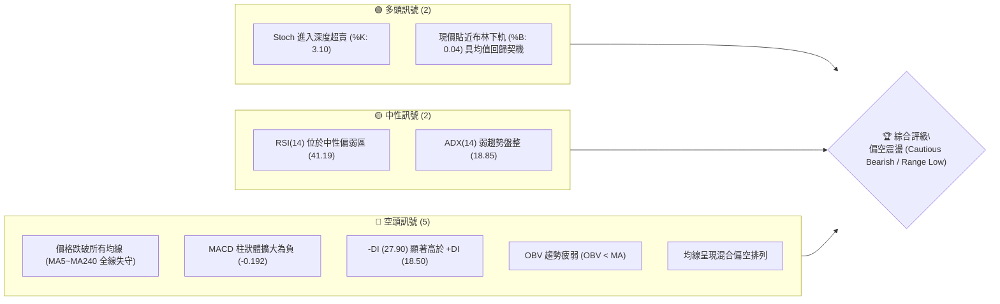

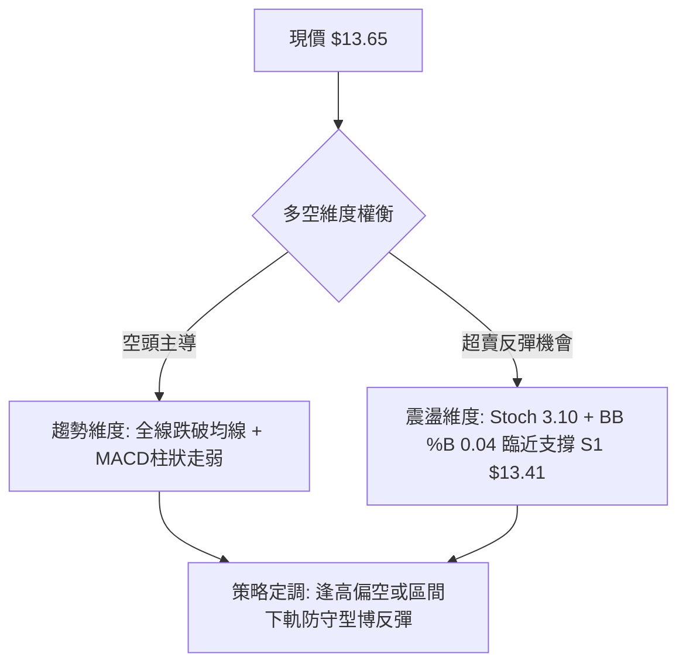

### 📊 核心指標速覽表

| 指標類別 | 指標名稱 | 當前數值 | 訊號 | 解讀 |
|----------|----------|----------|:----:|------|
| **價格** | 當前價格 | $13.65 | 🔴 | 位於 52 週區間 ($11.20 - $18.98) 之 31.5% 位置，處於中偏下位階 |
| **均線** | 短期 MA20 | $14.71 | 🔴 | 現價低於 MA20 -7.19%，短線處於下行修正通道中 |
| **均線** | 中期 MA50 | $14.39 | 🔴 | 現價低於 MA50 -5.14%，中期動能轉弱，波段多頭受挫 |
| **均線** | 長期 MA200 | $14.89 | 🔴 | 現價低於 MA200 -8.33%，跌破長期牛熊分水嶺 |
| **動能** | RSI(14) | 41.19 | 🟡 | 位於 30–70 中性區間，未破 30 超賣線，但空頭動能占優 |
| **動能** | MACD (12,26,9) | -0.108 / Sig 0.083 / Hist -0.192 | 🔴 | 雙線死叉發散，綠柱（負值）持續擴張，空方加速發力 |
| **震盪** | Stochastic (14,3,3) | %K: 3.10 / %D: 8.26 | 🟢 | 極度超賣，隨時存在技術性抽腳反彈或止跌需求 |
| **趨勢** | ADX (14) / DMI | ADX: 18.85 / +DI: 18.50 / -DI: 27.90 | 🔴 | ADX < 25 表明處於非單邊強趨勢之箱型震盪，但 -DI 壓制 +DI |
| **通道** | Bollinger Bands | 上 $15.85 / 中 $14.71 / 下 $13.57 / %B 0.04 | 🟡 | 價格貼近布林下軌，短線空間受壓縮，面臨方向抉擇 |
| **量能** | 20日均量比 / OBV | 1.02x (70.79M vs 69.22M) / OBV < MA | 🔴 | 價跌量平且 OBV 走在均線下方，機構資金回補意願低迷 |
| **波動** | ATR(14) | $0.52 (佔股價 3.79%) | 🟡 | 波動度處於中等水準，單日防守安全距離需配置 1~1.5 倍 ATR |

### 🏆 技術評分卡

```
╔══════════════════════════════════════════════════════════════════╗
║                   技術評分卡 — NU (2026-09-21)                    ║
╠══════════════════════════════════════════════════════════════════╣
║ 趨勢強度 (Trend)      ██████░░░░░░░░░░░░░░  32/100  🔴 空頭壓制   ║
║ 動能指標 (Momentum)   ████████░░░░░░░░░░░░  38/100  🔴 負向加速   ║
║ 支撐穩定度 (Support)  ███████████░░░░░░░░░  55/100  🟡 臨近支撐 S1║
║ 成交量配合 (Volume)   ███████░░░░░░░░░░░░░  36/100  🔴 OBV疲軟    ║
║ 形態完整度 (Pattern)  ████████░░░░░░░░░░░░  42/100  🟡 箱型下緣   ║
║ 均線排列 (Moving Avg) ████░░░░░░░░░░░░░░░░  20/100  🔴 全線破位   ║
╠══════════════════════════════════════════════════════════════════╣
║ 綜合評分 (Overall)    ███████░░░░░░░░░░░░░  37/100  🔴 弱勢偏空   ║
╚══════════════════════════════════════════════════════════════════╝
```

---

## 2. 趨勢分析

### 🌐 多時框趨勢分析

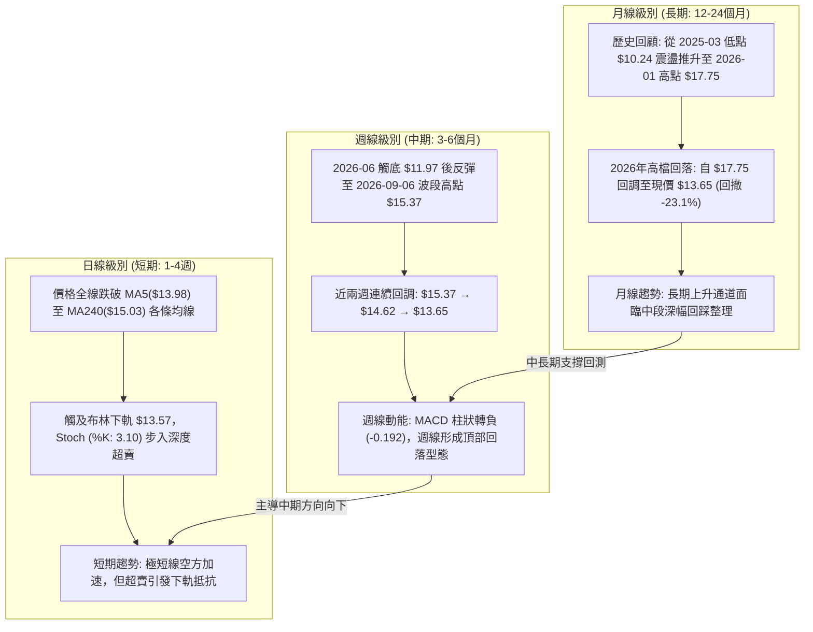

### 📈 長期趨勢 — 12個月走勢圖（Unicode）

NU 在過去 12 個月中經歷了「主升段突破 ➔ 高檔雙頂構築 ➔ 破位回調」的典型週期。

```
NU 月線走勢圖（過去12個月：2025-10 至 2026-09）
價格軸 ($)
$18.00 ┤                             ● (2026-01 $17.75)
$17.00 ┤                  ● (2025-11 $17.39)  ● (2025-12 $16.74)
$16.00 ┤  ● (2025-10 $16.11)
$15.00 ┤                                   ● (2026-02 $14.98)
$14.00 ┤                                        ●    ● (2026-04 $14.48)  ● (2026-08 $14.55)
$13.00 ┤                                             ● (2026-05 $13.13)       ● (現價 $13.65)
$12.00 ┤
       └─────────────────────────────────────────────────────────────
         10月  11月  12月  01月  02月  03月  04月  05月  06月  07月  08月  09月
         2025  2025  2025  2026  2026  2026  2026  2026  2026  2026  2026  2026
```

#### 走勢特徵分析表格

| 階段區間 | 時間跨度 | 起訖價格 | 區間漲跌幅 | 走勢特徵與量價架構 |
|:---|:---|:---|:---:|:---|
| **主升攻擊波** | 2025-10 ~ 2026-01 | $16.11 → $17.75 | **+10.18%** | 連續創歷史新高，均線多頭發散，月線呈現強勁推升，於 2026-01 見頂 $17.75 (52W High 為 $18.98)。 |
| **高檔滑落段** | 2026-01 ~ 2026-05 | $17.75 → $13.13 | **-26.03%** | 連續 4 個月走跌，機構獲利了結盤湧出，直接跌破多道中期均線，於 5 月創下 $13.13 波段低點。 |
| **打底回升段** | 2026-05 ~ 2026-08 | $13.13 → $14.55 | **+10.81%** | 6 月探底 $11.97 後週線爆量反彈，籌碼完成換手，多頭重整旗鼓推升至 8 月收盤 $14.55。 |
| **近期再次受挫** | 2026-08 ~ 2026-09 | $14.55 → $13.65 | **-6.19%** | 9月上旬衝高 $15.37 後遇壓折返，連續兩週帶量下殺，現價收於 $13.65，重新回測下檔支撐群。 |

### 📊 中期趨勢（週線分析）

從近 20 週的收盤紀錄與動能變化觀察，中期呈現「寬幅箱型震盪（$12.00 - $15.40）」特徵。

```
週線走勢結構與壓力支撐聚類圖：
$15.50 ┤                                           ▲ 09-06 高點 $15.37 (強壓區 R2 $14.88 ~ R3 $15.74)
$15.00 ┤                                 ▲ 08-16 $15.23
$14.50 ┤                                     ▲ 08-02 $14.33   ▲ 09-13 $14.62
$14.00 ┤                   ▲ 07-26 $14.09
$13.50 ┤ ▲ 05-10 $13.80         ▲ 07-12 $13.76                    ▼ 現價 $13.65 (臨近 S1 $13.41)
$13.00 ┤         ▲ 05-31 $13.13    ▲ 06-28 $13.17
$12.50 ┤     ▲ 05-24 $12.73    ▲ 06-21 $12.71
$12.00 ┤ ▲ 05-17 $12.19   ▲ 06-07 $11.97 (雙底支撐區 S3 $12.23 / 52W Low $11.20)
       └───────────────────────────────────────────────────────────► 週時間軸
```

中期趨勢核心觀察：
1. **頂部受阻明確**：8月中旬至9月上旬，股價兩度上攻 $15.23 與 $15.37，均未能觸及並回補 38.2% 斐波那契回調位 $16.01，隨即反轉下殺，確認 $15.00 以上具備沉重套牢賣壓。
2. **近兩週量價失衡**：2026-09-13 當週成交 285.55M，跌至 $14.62；2026-09-20 當週成交擴大至 368.12M，長黑摜破至 $13.65，MACD 柱狀體大幅轉負至 -0.192，確認中期多頭攻勢暫告瓦解。

### ⚡ 趨勢強度評估（ADX 解讀）

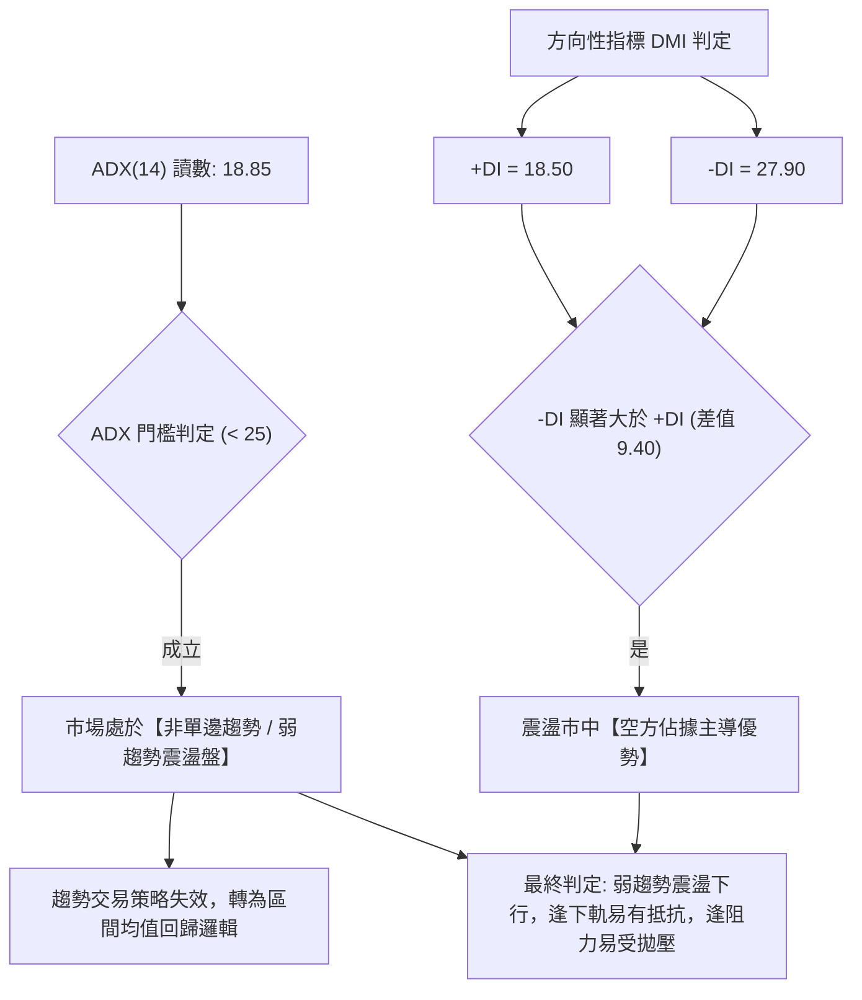

| 指標名稱 | 數值 | 狀態區間 | 技術含義解讀 |
|:---|:---:|:---:|:---|
| **ADX(14)** | **18.85** | < 20 (極弱趨勢) | 說明市場缺乏強烈的單向推動實體動能，當前下殺並非單邊主跌浪，而是寬幅整理區間內的下行波段。 |
| **+DI (14)** | **18.50** | 低位沉澱 | 多方買盤力量渙散，追價意願極度低落。 |
| **-DI (14)** | **27.90** | 中高位擴張 | 空方拋壓占據盤面主導權，短線賣方氣焰高漲。 |
| **ADX 趨勢強度結論** | **弱勢盤整** | **依規則 14** | **因 ADX < 25，本分析確立市場為「盤整行情」，交易焦點以日線布林通道 ($13.57 ~ $15.85) 及支撐阻力聚類為操作邊界。** |

---

## 3. 圖表形態分析

### 🔍 形態識別系統

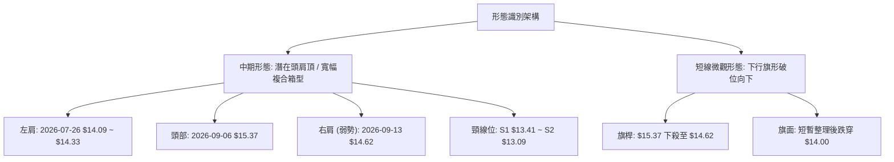

#### 形態識別與信心度評估表（嚴格遵循規則 15）

| 形態名稱 | 信心度 | 判斷依據（引用實際數據） | 完成度 | 目標價推算（附精確計算式） |
|:---|:---:|:---|:---:|:---|
| **寬幅箱型震盪 (Rectangle)** | **75%** | 頂部受阻於 R1 $14.38 ~ R2 $14.88；底部在 2026-05/06 獲得 S3 $12.23 支撐。現價 $13.65 逼近下緣 S1 $13.41。 | 85% | **箱型下緣支撐目標**：直接引用關鍵支撐 **S1 $13.41** 及 **S2 $13.09**。 |
| **次級頭肩頂雛形 (Head & Shoulders)** | **55%** | 頭部為 2026-09-06 收盤 $15.37，左肩 $14.33，右肩 $14.62，當前正回測頸線聚類區 S1 $13.41。 | 60% (尚未跌破頸線) | 若有效跌破頸線 S1 $13.41：<br>形態高度 = $15.37 - $13.41 = $1.96<br>理論量度目標 = 頸線 $13.41 - $1.96 = **$11.45**（接近 52W 低點 $11.20）。 |
| **日線布林下軌破位走勢 (Band Squeeze Break)** | **70%** | BB %B 跌至 0.04，股價貼緊下軌 $13.57 運行，ATR 為 $0.52。屬於指標型通道滑落走勢。 | 90% | **下軌目標**：短線超跌目標落在支撐聚類 **S1 $13.41**。 |

### 🕯️ 重要 K 線形態分析

| 週/月份 | 收盤價 | K線組合與形態 | 技術解讀 | 訊號強度 |
|:---|:---:|:---|:---|:---:|
| **2026-08-16 週** | $15.23 | **放量大陽線** (成交 381.42M) | 突破 MA20/50 壓制，帶動短多情緒轉強，形成局部多頭突破。 | 🟢 強多 |
| **2026-09-06 週** | $15.37 | **長上影流星線 (Shooting Star)** | 當週放量 373.99M 衝高後遭遇 R2 $14.88 上方強烈拋壓，多頭力竭留長上影。 | 🔴 強空 |
| **2026-09-13 週** | $14.62 | **陰包陽反轉陰線** (成交 285.55M) | 失守 $15.00 整數關卡，吞噬前週實體，MACD 柱轉負 (-0.036)，確認波段見頂。 | 🔴 看空 |
| **2026-09-20 週** | $13.65 | **大實體中長黑棒** (成交 368.12M) | 量增下挫，直接貫穿 MA20($14.71) 與 MA50($14.39)，空方全面通殺並壓迫布林下軌。 | 🔴 極空 |

### 📉 ASCII 走勢形態示意圖

```
近 8 週局部頂部反轉結構示意（2026-08 至 2026-09）：

$15.50 ┤                     ● 頭部 (09-06: $15.37)
$15.00 ┤        ● (08-16 $15.23)   ╲        ● 右肩反抽 (09-13: $14.62)
$14.50 ┤       ╱   (左肩)           ╲      ╱  ╲
$14.00 ┤      ╱                       ╲    ╱    ╲
$13.50 ┤─────●─────────────────────────●──●──────▼ 現價 $13.65 (逼近頸線 S1 $13.41)
$13.00 ┤    頸線測試位                             ░░ 頸線保衛戰
$12.50 ┤                                           ░░ (跌破則下看 S2 $13.09 / S3 $12.23)
       └─────────────────────────────────────────────────────────────►
```

### 🎯 形態目標價計算

依據形態學嚴格推算，若 NU 跌破短期頸線關鍵價位，下行測幅軌跡如下：
1. **中期箱型測試**：若 S1 $13.41 守住，股價將在 S1 $13.41 至 R1 $14.38 之間維持窄幅震盪整理。
2. **頭肩頂破位測幅**：
   - 頸線確認位：以關鍵支撐聚類 **S1 $13.41** 為基準。
   - 頭部頂點：2026-09-06 高點 **$15.37**。
   - 垂直高度：$\Delta H = \$15.37 - \$13.41 = \$1.96$。
   - 第一跌幅滿足點（1:1 等長測幅）：$\$13.41 - \$1.96 = \$11.45$（此價位介於數據庫給定之 **S3 $12.23** 與 **52W 低點 $11.20** 之間）。

---

## 4. 支撐與阻力

### 🗺️ 關鍵價位分布圖（Unicode）

本分析嚴格引用 OHLCV 歷史聚類計算之真實數據與 52 週斐波那契回調位，結構分層如下：

```
NU 價位結構分布圖 (由即時 OHLCV 聚類計算)
══════════════════════════════════════════════════════════════════
$18.98 ║██████████████████████████████║ 52W High / 0.0% Fib
$17.14 ║████████████████████          ║ 23.6% Fib 回調位
$16.01 ║████████████████████████      ║ 38.2% Fib 回調位
$15.74 ║██████████████████████████████║ 強阻力 R3 (布林上軌 $15.85 疊加)
$15.09 ║████████████████              ║ 50.0% Fib 回調位 (MA240 $15.03 疊加)
$14.88 ║████████████████████████      ║ 重點阻力 R2 (MA200 $14.89 / MA20 $14.71 密集區)
$14.38 ║██████████████████████████████║ 關鍵阻力 R1 (MA50 $14.39 疊加)
$14.17 ║████████████████              ║ 61.8% Fib 回調位 (黃金分割反壓)
───────╫──────────────────────────────╫───────────────────────────
$13.65 ╠══════════════════════════════╣ ◄ 現價 ($13.65) / BB下軌 $13.57
───────╫──────────────────────────────╫───────────────────────────
$13.41 ║▓▓▓▓▓▓▓▓▓▓▓▓▓▓▓▓▓▓▓▓▓▓▓▓▓▓▓▓▓▓║ 近期核心支撐 S1 (防守第一道防線)
$13.09 ║████████████████████████      ║ 強支撐 S2 (2026-05 波段低點聚類)
$12.86 ║████████████████              ║ 78.6% Fib 回調位 (深幅防守關卡)
$12.23 ║██████████████████████████████║ 終極強支撐 S3 (2026-06 底部 $11.97 聚類)
$11.20 ║██████████████████████████████║ 52W Low / 100.0% Fib
══════════════════════════════════════════════════════════════════
```

### 🚧 阻力位分析表

| 阻力級別 | 價位 | 形成原因與共振要素 | 突破難度 | 重要性權重 |
|:---|:---:|:---|:---:|:---:|
| **關鍵阻力 R1** | **$14.38** | 近一年波段高點聚類位，與 **MA50 ($14.39)** 及 61.8% Fib ($14.17) 高度重疊，為短線反彈首要反壓。 | 🟡 中等 | ★★★★☆ |
| **重點阻力 R2** | **$14.88** | 密集籌碼套牢區，共振 **MA200 ($14.89)**、**MA20 ($14.71)** 及 **MA10 ($14.52)**，牛熊攻防核心。 | 🔴 困難 | ★★★★★ |
| **強阻力 R3** | **$15.74** | 2026-09-06 高點延伸強壓，逼近 **布林上軌 ($15.85)** 與 38.2% Fib ($16.01)，多頭主升拓展分水嶺。 | 🔴 極難 | ★★★★☆ |

### 🛡️ 支撐位分析表

| 支撐級別 | 價位 | 形成原因與共振要素 | 守住機率 | 重要性權重 |
|:---|:---:|:---|:---:|:---:|
| **近期支撐 S1** | **$13.41** | 近一年波段低點聚類，距離現價僅 -1.76%，緊鄰 **布林下軌 ($13.57)**，為日線空方急跌之首要緩衝墊。 | 🟡 60% | ★★★★☆ |
| **強支撐 S2** | **$13.09** | 2026-05-31 收盤 $13.13 構築之波段支撐聚類，跌破將引發停損賣壓。 | 🟡 55% | ★★★★☆ |
| **終極支撐 S3** | **$12.23** | 2026-05-17 ($12.19) 與 2026-06-14 ($12.19) 之雙底共振支撐區，為中期多頭底線。 | 🟢 75% | ★★★★★ |

### 📐 斐波那契回調位分析

依據 52 週完整波動區間（低點 **$11.20** 至 高點 **$18.98**，垂直落差 $7.78）計算之黃金分割水準解析：

```
$18.98 ──── 0.0%  (52W High)
$17.14 ──── 23.6%
$16.01 ──── 38.2%
$15.09 ──── 50.0%
$14.17 ──── 61.8% (黃金分割反壓位)
 ───────────────── 現價 $13.65 (落於 61.8% 與 78.6% 之間)
$12.86 ──── 78.6%
$11.20 ──── 100.0% (52W Low)
```

- **當前落點位置**：現價 **$13.65** 精準處於 **61.8% ($14.17)** 與 **78.6% ($12.86)** 之間。
- **技術意義解讀**：
  1. 股價回撤跌破了最關鍵的 61.8% 黃金防守位 **$14.17**，技術結構表明原先由 52W 低點發動的上升浪已遭受深度破壞，由「強勢回調」退化為「深幅弱勢整理」。
  2. 現價距離下方 78.6% 回調位 **$12.86** 尚有 $0.79（-5.78%）之緩衝空間，此區域與聚類支撐 **S2 $13.09** 形成厚實的防禦縱深。若 S1 $13.41 失手，空方預期將向 78.6% ($12.86) ~ S2 ($13.09) 區間尋求支撐。

---

## 5. 技術指標深度解讀

### 🎛️ 指標訊號總覽

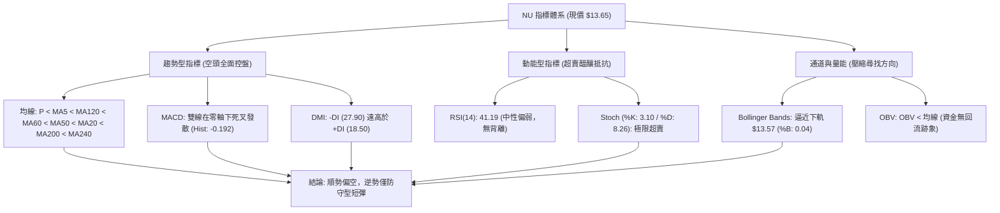

### 📈 移動平均線排列分析

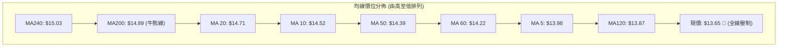

| 均線名稱 | 當前價位 | 乖離率 (%) | 均線斜率與形態特徵 | 訊號評估 |
|:---|:---:|:---:|:---|:---:|
| **MA 5** | $13.98 | -2.36% | 短線極速下彎，壓制股價每日反彈高點 | 🔴 看空 |
| **MA 10** | $14.52 | -6.02% | 陡峭向下，形成第一道短線拋壓線 | 🔴 看空 |
| **MA 20** | $14.71 | -7.19% | 跌破布林中軌，中期上升通道遭到切斷 | 🔴 看空 |
| **MA 50** | $14.39 | -5.14% | 中期生命線失守，形成中線壓力密集區 | 🔴 看空 |
| **MA 60** | $14.22 | -4.02% | 下行傾斜，確認中期整理型態偏空 | 🔴 看空 |
| **MA 120** | $13.87 | -1.60% | 距離現價最近的均線，下壓構成首道反彈阻力 | 🔴 看空 |
| **MA 200** | $14.89 | -8.33% | 長期牛熊分界線被實體黑K貫穿，中長線架構轉弱 | 🔴 看空 |
| **MA 240** | $15.03 | -9.21% | 年線反壓顯著，高檔套牢壓力沉重 | 🔴 看空 |

- **排列特徵深度解析**：目前均線系統呈現「極度弱勢之混合空頭排列」。現價 **$13.65** 位於所有主要均線下方（包括 MA5 至 MA240），短期負乖離雖然擴大（與 MA20 乖離達 -7.19%），但由於均線系統全數轉為蓋頭下壓，反彈時在 **$13.87 (MA120)** 至 **$14.39 (MA50)** 區間將面臨多重層疊的解套解壓。

### 📉 RSI(14) 分析

```
RSI(14) 動能強度進度條：
0       10      20      30      40      50      60      70      80      90     100
├───────┼───────┼───────┼───────┼───────┼───────┼───────┼───────┼───────┼───────┤
████████████████████████████████░░░░░░░░░░░░░░░░░░░░░░░░░░░░░░░░░░░░░░░░░░░░░░░░
當前讀數: 41.19 (中性偏弱弱勢區間)
```

- **區間評估**：RSI(14) 最新數值為 **41.19**，脫離了前期強勢區（55~70），滑落至 50 榮枯線下方。雖然尚未跌入 30 以下的超賣區，但整體下降斜率陡峭，顯示空方動能仍處於主動釋放期。
- **背離判斷（嚴格確認）**：
  - **頂背離審視**：2026-07-05 週線高點 $13.61 時 RSI 曾達 79.0；隨後 2026-09-06 股價衝高至 $15.37 時，RSI 僅錄得 56.6，**週線級別存在明確的頂背離現象**，該背離隨後引發了近兩週的大幅回挫。
  - **底背離審視**：目前日線與週線級別價格破底回落，但 RSI(14) 為 41.19，與前期低點並無指標抬升的跡象，**目前數據顯示「無底背離」特徵**。跌勢純屬順向釋放，未見動能耗竭底背離。

### 📊 MACD(12/26/9) 訊號解讀

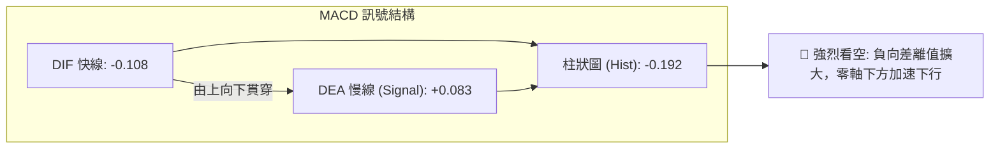

- **數據特徵**：
  - MACD 線：**-0.108**（已跌破零軸，空頭佔優）
  - 訊號線 (Signal)：**+0.083**
  - 柱狀體 (Histogram)：**-0.192**（負值顯著放大，自前一週的 -0.036 進一步惡化）
- **動能解讀**：MACD 柱狀體呈現持續擴張的「綠柱加長」狀態，反映空頭波段仍處於主動推進階段。由於快線與慢線形成死叉並向零軸下方發散，此現象排除了一切多頭假摔可能，確立當前處於中度空方回調走勢中。

### 📦 布林通道分析

```
布林通道 (20, 2) 結構示意圖：
$15.85 ┤─────────────────────────────── 上軌 (強阻力 R3 $15.74 疊加)
       │
$14.71 ┤- - - - - - - - - - - - - - - - 中軌 (MA20 下彎壓制)
       │
$13.65 ┼──────────────────●─────────── 現價 ($13.65) / %B: 0.04
$13.57 ┤═══════════════════════════════ 下軌 (極度壓迫)
```

- **軌道參數**：上軌 **$15.85** ｜ 中軌(MA20) **$14.71** ｜ 下軌 **$13.57** ｜ 帶寬 (Bandwidth) = 15.5%
- **位置與形態解讀**：
  - 現價 **$13.65** 僅高出下軌 **$13.57** 達 $0.08，布林通道定位指標 **%B 為 0.04**，表示價格幾乎貼在下軌表面滑行。
  - 當 %B < 0.05 時，股價處於極端邊緣。若伴隨下軌開口向下擴張，將形成「沿下軌走跌」的單邊下行；但因目前 ADX(14) 僅 18.85（盤整行情），下軌通常具備較強的彈性支撐效果，極易引發均值回歸向中軌 $14.71 反彈。

### 💹 成交量分析（量價配合度與 OBV）

| 項目 | 數值 | 與均量比較 | 技術解讀 |
|:---|:---:|:---:|:---|
| **最新單日成交量** | **70,791,700** | 1.02x (略高於 20MA) | 價跌量平微增，下殺伴隨一定程度的換手，但無恐慌性巨量釋放。 |
| **20日均量** | **69,215,860** | 基準線 | 近期籌碼流動平緩，主力無大幅建倉動作。 |
| **50日均量** | **83,938,142** | 0.84x (萎縮 -15.7%) | 整體中期量能呈現萎縮格局，市場參與熱度降溫。 |
| **OBV 趨勢狀態** | **OBV < MA** | 🔴 疲弱下行 | **能量潮指標跌破均線**，呈現資金持續淨流出特徵，量能未確認價格的反彈潛力。 |

- **量價背離分析**：近兩週股價從 $15.37 下跌至 $13.65，週成交量由 373.99M、285.55M 遞增至 368.12M，屬於典型的「價跌量增」弱勢格局。量能配合空方殺跌，OBV 明確運行於其移動平均線下方，說明當前價位尚未吸引到長線機構買盤進場承接。

---

## 6. 動能與波動率

### ⚡ 動能評估四象限

```
動能與波動率四象限分佈圖：
高波動 ↑
       │         Q3 (強動能 / 高波動)        │         Q4 (弱動能 / 高波動)
       │          [高風險高收益波段]         │             [避免進場]
       │                                     │
───────┼─────────────────────────────────────┼─────────────────────────────────────
       │         Q1 (強動能 / 低波動)        │         Q2 (弱動能 / 低波動)
       │             [最佳順勢區]            │           ★ 當前 NU 落點 ★
       │                                     │         (動能疲弱 / 波動中低)
低波動 └─────────────────────────────────────┴─────────────────────────────────────►
       低動能                                                                 高動能
```

| 象限代號 | 動能強度 | 波動率水準 | 當前歸屬 | 操作意涵與策略建議 |
|:---:|:---:|:---:|:---:|:---|
| **Q1** | 強 (多頭) | 低波動 | — | 最佳波段順勢推升期，持有待漲。 |
| **Q2** | **弱 (偏空)** | **低/中波動** | **✓ NU 落點** | **謹慎觀望，避免重倉操作。因波動未失控但動能偏空，適宜短線區間防守或逢高減碼。** |
| **Q3** | 強 (多/空) | 高波動 | — | 趨勢主升/主跌浪，適合突破交易。 |
| **Q4** | 弱 (混亂) | 高波動 | — | 寬幅震盪侵蝕本金，嚴禁介入。 |

### 📊 ATR 波動率分析

- **ATR(14) 數值**：**$0.52**（佔當前股價 $13.65 之 **3.79%**）。
- **歷史波動對比**：$0.52 屬於中等常態波動區間，並未出現極端波動失控放大，有利於設定清晰的風控邊界。
- **交易防守距離設置指引**：
  - **極短線止損距離 (1.0 × ATR)**：$\$0.52$。以現價 $13.65 考量，若跌穿 $13.13 則確認破位。
  - **波段安全防守距離 (1.5 × ATR)**：$1.5 \times \$0.52 = \$0.78$。對應防守下限為 $\$13.65 - \$0.78 = \mathbf{\$12.87}$（精準契合 78.6% 斐波那契回調位 **$12.86**）。

### 📐 Beta 與市場相關性

- **Beta 係數**：**0.94**（高度貼近美股大盤標普 500 指數之 1.0 水準）。
- **市場環境交互評估**：
  1. NU 具備與大盤同步的系統性風險屬性，既非高彈性進攻型標的（Beta > 1.5），亦非防禦型公用事業（Beta < 0.5）。
  2. 在美股大盤未出現強勢單邊行情的前提下，NU 單憑自身 Alpha 動能向上逆勢突圍的機率偏低；大盤震盪時，其弱勢技術面將進一步放大下行壓力。

---

## 7. 多時框架總結

### 📋 時框架評分表

| 時框架 | 趨勢方向 | 動能狀態 | 均線排列 | 關鍵圖表形態 | 綜合評分 | 戰術建議 |
|:---|:---:|:---:|:---:|:---|:---:|:---|
| **短期 (日線)** | 🔴 下行偏空 | 🟡 Stoch 超賣 (3.10) | 🔴 全均線壓制 | 貼緊布林下軌滑落 | **35 / 100** | 嚴禁盲目追空，等待反彈受阻放空或下軌抵抗 |
| **中期 (週線)** | 🔴 頂部回撤 | 🔴 MACD 柱擴大 (-0.192) | 🔴 跌破 MA20/MA50 | 衝高 $15.37 受阻構築次級頭肩 | **38 / 100** | 逢反彈至 R1 $14.38 ~ R2 $14.88 減碼多單 |
| **長期 (月線)** | 🟡 寬幅箱型 | 🟡 RSI 回落至 41.19 | 🟡 仍高於 52W 低點 | 自 $17.75 高檔回落之深度回踩 | **45 / 100** | 觀察 $12.86 (78.6% Fib) ~ S3 $12.23 底部承接力 |

### 🔲 綜合訊號矩陣

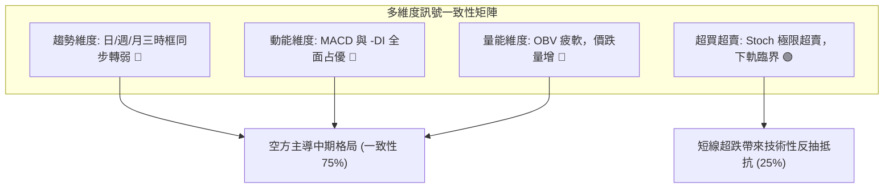

### ⚖️ 多時框收斂結論（嚴格執行規則 14）

根據系統規範規則 14 進行優先級收斂：
1. **行情性質定性**：當前 ADX(14) 為 **18.85**（遠低於 25 臨界值），明確確立市場處於**「盤整行情」**，而非單邊趨勢主升或主跌浪。
2. **交易邊界界定**：依收斂規則，盤整行情以**日線布林通道上下軌（$13.57 ~ $15.85）**及**波段聚類支撐阻力**為主要操作區間。
3. **主導趨勢方向收斂**：日線雖然各均線失守、MACD 偏空，但短線 Stoch %K 跌至 3.10、現價 $13.65 貼近布林下軌 $13.57 與支撐 S1 $13.41；週線趨勢則處於自 $15.37 回落的下行修正浪中。兩者收斂後，得出**唯一的方向性結論**：

> ⚖️ **收斂結論：弱勢區間震盪、偏空控盤（Cautious Bearish Range）**。短線直接追空盈虧比不佳，策略定調為「**以逢高反彈於阻力位布空為主，僅允許極小倉位在支撐 S1 進行超跌短彈投機**」。此定調與第 1 章評分卡（37/100 偏空）保持嚴格一致。

---

## 8. 交易策略建議

### 🗺️ 策略決策流程圖

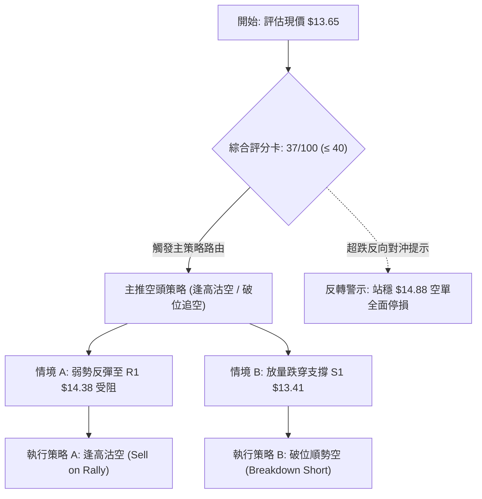

### 🧭 策略路由（依評分卡分流）

> 📢 **當前主策略方向 = 主推空頭／反彈逢高布空（依技術評分卡：37 / 100，偏空維度）**

依據評分卡規則，綜合評分 ≤ 40 分，報告主推空頭策略體系，多頭反彈僅作為空頭進場的時機或嚴格控制倉位的對沖操作。

### 🎯 價格情境階梯（Price Scenarios）

所有價位均嚴格引用第 4 章聚類數據，建立明確階梯：

| 觸發條件 | 第一目標 (T1) | 第二目標 (T2) | 後續延伸 | 情境含義與操作指引 |
|:---|:---:|:---:|:---:|:---|
| **向上反抽觸及 R1 $14.38** | R2 **$14.88** | R3 **$15.74** | 52W High $18.98 | 短線均值回歸，若遇阻為極佳高空點；若突破 R2 則空單停損。 |
| **現價 $13.65 弱勢橫盤** | S1 **$13.41** | R1 **$14.38** | — | 於布林下軌與 MA5 間窄幅沉積，等待方向確認。 |
| **向下跌破 S1 $13.41** | S2 **$13.09** | S3 **$12.23** | 52W Low $11.20 | 形態確認下破，跌向 78.6% Fib ($12.86) 及前低聚類。 |

### 📊 情境機率分佈

```
情境機率分佈直方圖：
回落破位 / 探底 (55%) ███████████████████████▌
區間震盪整理    (30%) █████████████
反彈上行修復    (15%) ██████▌
```

| 情境劃分 | 機率估計 | 主要技術指標依據 |
|:---|:---:|:---|
| **回落再探底 (破位下探)** | **55%** | MACD 柱狀體擴散至 -0.192，均線系統全線空頭壓制，OBV 疲軟資金流出。 |
| **區間震盪 (下軌有守)** | **30%** | ADX(14) 僅 18.85 顯示非單邊強趨勢，Stoch 超賣 (%K 3.10) 易引發反覆拉鋸。 |
| **反轉上行 (向上突破)** | **15%** | 必須伴隨放量突破 MA200/R2 ($14.88)，目前機率極低，需大盤強勢催化。 |

### 🔴 主策略詳情（方向：空頭交易與逢高做空）

| 策略要素 | 策略 A（主推：反彈遇阻做空） | 策略 B（輔助：破位順勢做空） |
|:---|:---|:---|
| **策略邏輯** | 均值回歸反彈至 MA50/R1 密集阻力區受阻沽空 | 價格實體跌破近期最低聚類 S1，順勢追擊空單 |
| **進場條件** | 價格反彈至 R1，日K收出長上影線或黑K確認 | 日K實體跌破 S1，成交量放大至 20MA (69.2M) 以上 |
| **精確進場點** | **$14.38** (關鍵阻力 R1) | **$13.35** (確認跌破 S1 $13.41 之放量進場點) |
| **第一目標 (T1)** | **$13.41** (支撐 S1，獲利空間 +6.75%) | **$12.86** (78.6% Fib，獲利空間 +3.67%) |
| **第二目標 (T2)** | **$13.09** (強支撐 S2，獲利空間 +8.97%) | **$12.23** (強支撐 S3，獲利空間 +8.39%) |
| **嚴格止損點** | **$14.88** (站上阻力 R2 / MA200，虧損 -3.48%) | **$13.65** (重返當前破位起跌點，虧損 -2.25%) |
| **風險報酬比** | **1 : 2.58** (以目標 T2 計算) | **1 : 3.73** (以目標 T2 計算) |
| **模型成功機率** | **65%** | **55%** |
| **建議配置倉位** | **15% ~ 20%** (標準頭寸) | **10%** (突破試探倉位) |

### 🟢 反向風險觸發點（對沖與空單逃命提示）

若出現以下訊號，主推之空頭策略立即失效，投資人應迅速平倉空單甚至反手建立防禦性多頭：
1. **價格強勢收復 $14.38 (R1)**：若日線以大陽線收於 $14.38 之上，說明空頭回補動能強勁。
2. **終極止損觸發 $14.88 (R2)**：若股價站上 MA200 與 R2，中長線空頭結構被徹底推翻，必須全面停損離場。
3. **指標共振底背離**：若價格破新低但 RSI(14) 強勢回升至 50 之上，且 MACD 於零軸下方出現金叉，空頭倉位應獲利了結。

### ⭐ 整體訊號強度評星

```
╔══════════════════════════════════════════════════╗
║  做多訊號強度：★★☆☆☆  (2/5 星 - 僅極短超賣)     ║
║  做空訊號強度：★★★★☆  (4/5 星 - 趨勢阻力明確)   ║
║  整體可信度：  ★★★★☆  (4/5 星 - 指標指向收斂)   ║
╚══════════════════════════════════════════════════╝
```

---

## 9. 風險提示與監控

### ✅ 關鍵監控指標 Checklist

```
╔══════════════════════════════════════════════════════════════════╗
║                   每日交易監控清單 (Checklist)                    ║
╠══════════════════════════════════════════════════════════════════╣
║ [ ] 支撐防守測試：密切監控收盤是否守住 S1 $13.41                 ║
║ [ ] 布林通道走勢：觀察股價是否持續鈍化跌破下軌 $13.57            ║
║ [ ] 動能修復驗證：Stochastic %K 是否低檔向上金叉 %D 形成短彈     ║
║ [ ] MACD 柱狀指標：負向數值 (-0.192) 是否出現縮短收斂             ║
║ [ ] 成交量變化：日成交量是否異常超越 50日均量 (83.94M) 爆量反轉  ║
║ [ ] 均線反壓位：反彈測試 MA5 ($13.98) 與 MA120 ($13.87) 表現    ║
║ [ ] 大盤與 Beta 聯動：觀察標普大盤波動對 Beta=0.94 之傳導影響    ║
╚══════════════════════════════════════════════════════════════════╝
```

### ⚠️ 風險場景分析

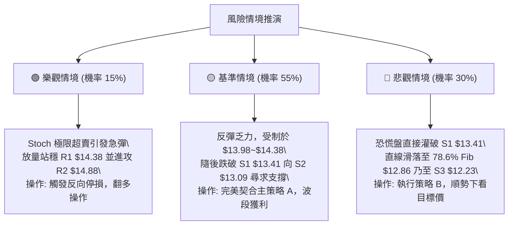

### 🛡️ 風險管理重要提醒

1. **嚴格禁止在布林下軌盲目「滿倉抄底」**：
   - 儘管 Stoch 進入深度超賣 (%K 3.10)，但當前全體均線（MA5 至 MA240）均下行反壓，且 MACD 柱狀體擴大為負。弱勢超賣往往會透過「指標在低檔鈍化」同時「股價持續陰跌」來消化，切忌在左側未見反轉K線前重倉逆勢摸底。
2. **單筆交易風險預算控制（2% 資本法則）**：
   - 無論採用反彈沽空策略 A 或破位追空策略 B，單筆交易所承受之最大虧損金額嚴格限制於總投資組合淨資產之 **1.5% ~ 2.0%** 內。
   - 以策略 A 為例：進場價 $14.38，止損價 $14.88（每股風險 $0.50）。若投資組合為 $100,000 美元，最大允許虧損為 $1,500 美元，則最大建立頭寸數量為：
     $$\text{部位股數} = \frac{\$1,500}{\$0.50} = 3,000 \text{ 股（約佔總資金之 43%）}$$
3. **ATR 動態追蹤止盈機制**：
   - 當空單進入獲利階段（跌破 $13.41 後），應將初始止損價自動下移至損益兩平點（$14.38）；隨後以 **1.5 倍 ATR ($0.78)** 作為移動追蹤止盈位，鎖定下行波段利潤。

---

## 📋 報告總結

```
╔══════════════════════════════════════════════════════════════════╗
║                   NU 技術分析報告總結 (2026-09-21)               ║
╠══════════════════════════════════════════════════════════════════╣
║ 當前價格：$13.65        52W 區間：$11.20 - $18.98 (位階 31.5%)  ║
║ 綜合評級：🔴 偏空弱勢震盪 (評分: 37 / 100)                      ║
╠══════════════════════════════════════════════════════════════════╣
║ 關鍵結構總結：                                                   ║
║ ├─ 長期趨勢 (月線)：🟡 處於自 $17.75 高點回撤之寬幅大箱型中     ║
║ ├─ 中期趨勢 (週線)：🔴 衝高 $15.37 受阻回落，MACD週柱大幅轉負   ║
║ ├─ 短期趨勢 (日線)：🔴 跌破所有均線，貼緊布林下軌滑行           ║
║ ├─ 核心支撐架構：S1 $13.41 ｜ S2 $13.09 ｜ S3 $12.23           ║
║ ├─ 核心阻力體系：R1 $14.38 ｜ R2 $14.88 ｜ R3 $15.74           ║
║ └─ 華爾街共識目標：$18.65 (當前技術走勢與基本面目標暫呈背離)   ║
╠══════════════════════════════════════════════════════════════════╣
║ 最優策略指引：                                                   ║
║ 1. 🥇 最佳機會 (策略 A)：等待反抽 R1 $14.38 受阻放空，          ║
║                          止損設於 $14.88，下看 S1 $13.41/S2 $13.09║
║ 2. 🥈 次選機會 (策略 B)：跌破支撐 S1 $13.41 順勢追空，          ║
║                          下看 78.6% Fib $12.86 與 S3 $12.23     ║
║ 3. 🥉 保守選擇：空手觀望，靜待日線站回 MA20 ($14.71) 或於 S3    ║
║                 $12.23 構築雙底形態後再行動。                    ║
╚══════════════════════════════════════════════════════════════════╝
```

---

> ⚠️ **免責聲明**：本報告為 AI 自動化生成之純量化技術分析，所有價位、圖表及推算邏輯均嚴格依據歷史成交數據（OHLCV）推導。報告內容**僅供研究與學術探討，不構成任何要約、招攬或投資建議**。金融市場瞬息萬變，交易具備高風險，投資人應獨立評估並自負盈虧。

---

*報告生成時間：2026-09-21 ｜ 數據來源：Yahoo Finance ｜ 分析框架：多時框技術分析模型*