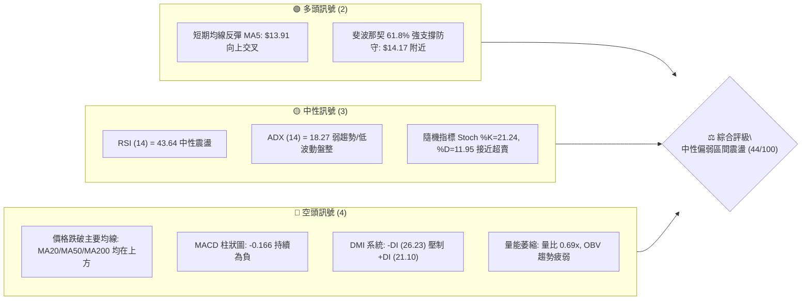
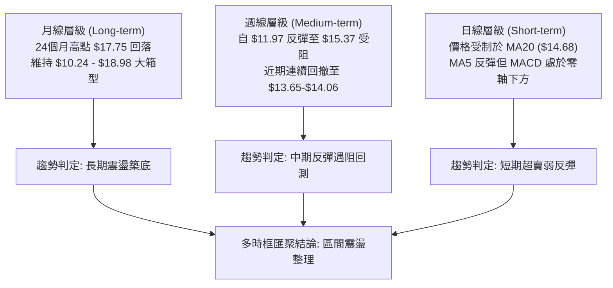
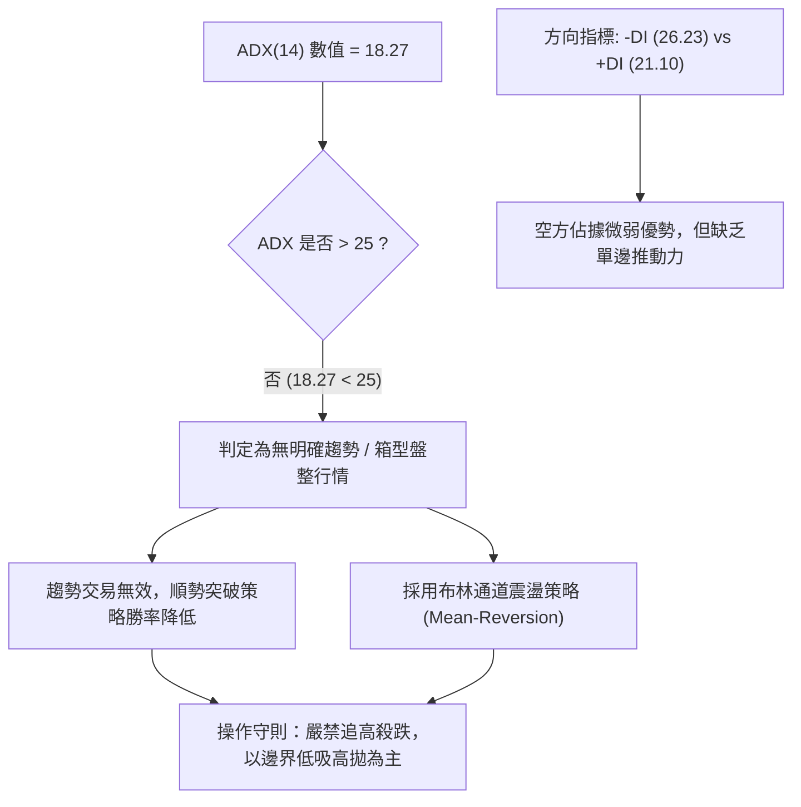
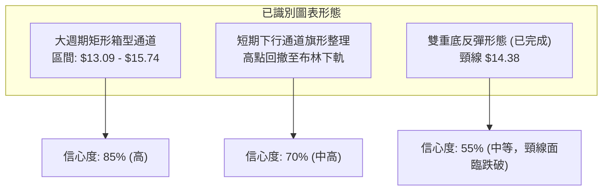
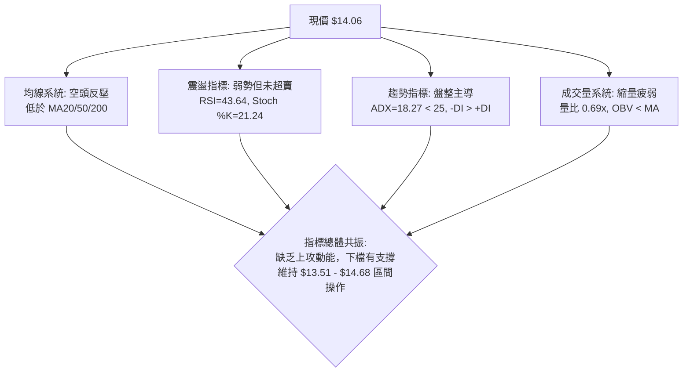
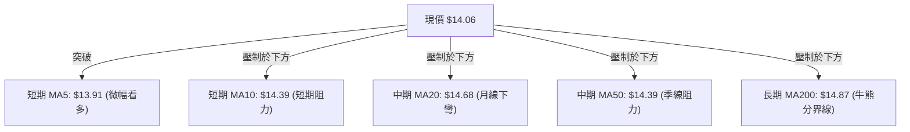
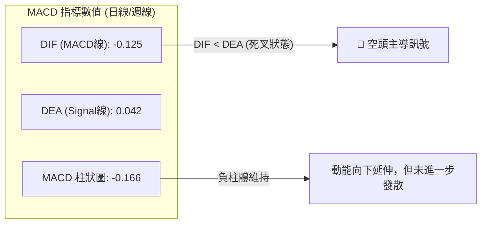
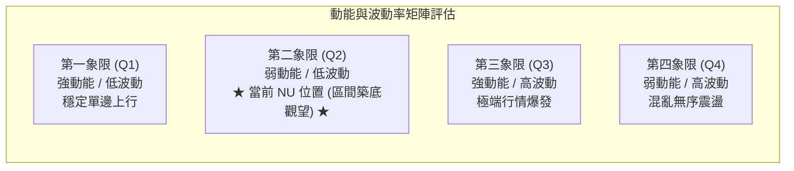
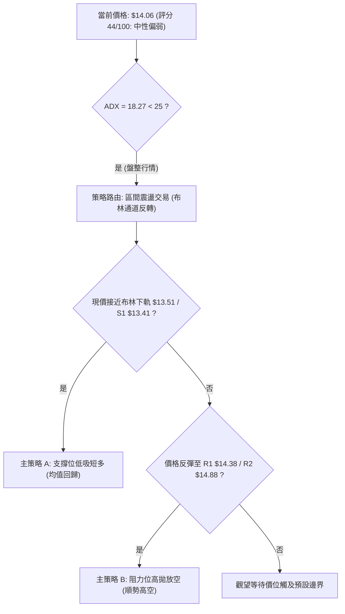
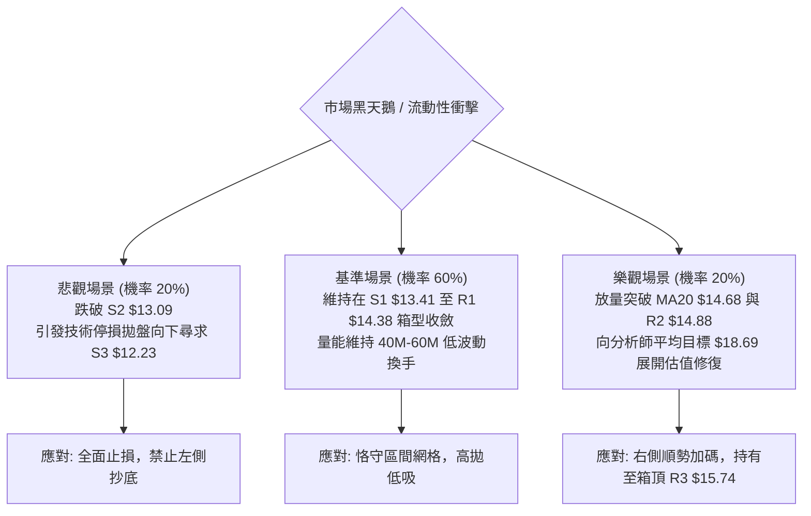

# NU 技術分析報告

> **報告日期**：2026-09-22 ｜ **語言**：繁體中文 ｜ **數據來源**：Yahoo Finance ｜ **當前價格**：$14.06

---

## 目錄

| 章節 | 內容 |
|------|------|
| [1. 技術面概覽](#1-技術面概覽) | 訊號儀表板、核心指標、評分卡 |
| [2. 趨勢分析](#2-趨勢分析) | 多時框趨勢、長中短期走勢 |
| [3. 圖表形態分析](#3-圖表形態分析) | 形態識別、K線組合、目標價 |
| [4. 支撐與阻力](#4-支撐與阻力) | 關鍵價位、斐波那契回調 |
| [5. 技術指標深度解讀](#5-技術指標深度解讀) | MA/RSI/MACD/布林/成交量 |
| [6. 動能與波動率](#6-動能與波動率) | 動能評估、ATR、Beta |
| [7. 多時框架總結](#7-多時框架總結) | 時框架評分矩陣 |
| [8. 交易策略建議](#8-交易策略建議) | 多空策略、風險報酬比 |
| [9. 風險提示與監控](#9-風險提示與監控) | 監控指標、風險場景 |
| [10. 報告總結](#10-報告總結) | 核心結論與最佳策略配置 |

---

## 1. 技術面概覽

### 🎯 技術訊號儀表板



### 📊 核心指標速覽表

| 指標類別 | 指標名稱 | 當前數值 | 訊號 | 解讀 |
|----------|----------|----------|------|------|
| **價格** | 當前收盤價 | $14.06 | 🟡 | 位於52週區間 36.8% 分位，處於中低檔震盪區間 |
| **均線** | MA20 | $14.68 | 🔴 | 現價低於 MA20 (-4.24%)，月線反壓沉重 |
| **均線** | MA50 | $14.39 | 🔴 | 現價低於 MA50 (-2.31%)，中期趨勢受到壓制 |
| **均線** | MA200 | $14.87 | 🔴 | 現價低於 MA200 (-5.45%)，跌破長期多空分水嶺 |
| **動能** | RSI(14) | 43.64 | 🟡 | 介於 30–70 之間，動能偏弱但尚未進入極端超賣區 |
| **動能** | MACD(12,26,9) | -0.125 / -0.166 | 🔴 | MACD 線低於信號線 (0.042)，柱狀圖為負，動能偏空 |
| **波動** | ATR(14) | $0.52 (3.69%) | 🟡 | 波動度適中，日均波動幅度在可控範圍內 |
| **趨勢** | ADX(14) | 18.27 | 🟡 | 數值低於 25，明確定義為無主導趨勢的箱型盤整行情 |
| **量能** | 20日成交量比 | 0.69x | 🔴 | 量能大幅萎縮（4,725 萬 vs 6,827 萬均量），OBV < MA |

### 🏆 技術評分卡

```
╔══════════════════════════════════════════════════════════════╗
║                 技術評分卡 — NU (2026-09-22)                 ║
╠══════════════════════════════════════════════════════════════╣
║ 趨勢強度 (ADX=18.27)    ██████░░░░░░░░░░░░░░  32/100  🔴 弱勢║
║ 動能指標 (RSI/MACD)     ████████░░░░░░░░░░░░  40/100  🟡 偏弱║
║ 支撐穩定度 (Fib 61.8%)  ████████████░░░░░░░░  60/100  🟡 中等║
║ 成交量配合 (量比 0.69)  ██████░░░░░░░░░░░░░░  30/100  🔴 萎縮║
║ 形態完整度 (箱型構築)   ██████████░░░░░░░░░░  52/100  🟡 尚可║
║ 均線排列 (空頭排列)     ██████░░░░░░░░░░░░░░  30/100  🔴 承壓║
╠══════════════════════════════════════════════════════════════╣
║ 綜合評分                ████████░░░░░░░░░░░░  44/100  🟡 中性║
║ 評級結論：中性偏弱（ADX<25 盤整行情，以日線布林區間操作為主）║
╚══════════════════════════════════════════════════════════════╝
```

---

## 2. 趨勢分析

### 🌐 多時框趨勢分析



### 📈 長期趨勢 — 12個月走勢圖（Unicode）

依據月線收盤數據繪製過去 12 個月走勢圖，標注高低點與現價位置：

```
NU 月線走勢圖（2025-10 至 2026-09）
價格軸 ($)
$18.00 ┤                             ● (2026-01: $17.75 高點)
$17.00 ┤                 ●           │
$16.00 ┤● (2025-10: 16.11)│           │
$15.00 ┤                  │           │     ●
$14.00 ┤                  │           │     │        ●     ●←現在 $14.06
$13.00 ┤                  │           │     │  ●     │     │
$12.00 ┤                  │           │     │  │     │     │
$11.00 ┤                  │     ●     │     │  │     │     │
       └──────────────────┴─────┴─────┴─────┴──┴─────┴─────┴─────
         25-10 25-11 25-12 26-01 26-02 26-03 26-05 26-07 26-09
```

**12個月走勢階段分析表**：

| 階段區間 | 起訖價格 | 區間漲跌幅 | 走勢特徵分析 |
|----------|----------|------------|--------------|
| **強勢衝頂** (2025-10 ~ 2026-01) | $16.11 → $17.75 | +10.18% | 連續4個月維持高檔，創下近一年月收盤高點 $17.75，但未突破 52W 高點 $18.98 |
| **大幅回撤** (2026-01 ~ 2026-05) | $17.75 → $13.13 | -26.03% | 連續4個月下挫，跌破 MA200，形成明顯的去槓桿波段，回測至斐波那契 78.6% 上方 |
| **底部盤整** (2026-05 ~ 2026-07) | $13.13 → $14.33 | +9.14%  | 於 $13.09–$13.41 區間獲得強大買盤承接，構築中期雙重底部結構 |
| **反彈受阻** (2026-07 ~ 2026-09) | $14.33 → $14.06 | -1.88%  | 9月初週線一度衝高至 $15.37，隨後受阻於 R2/MA200，再度回落至 $14.06 |

### 📊 中期趨勢（週線分析）

```
NU 中期週線支撐阻力結構圖
價格 ($)
$16.00 ┤                                
$15.50 ┤                ▲ (09/06 高點 $15.37 - 遇 R2 承壓)
$15.00 ┤             ╭──┴──╮            
$14.50 ┤          ╭──╯     ╰──╮         
$14.00 ┤─────────●────────────●───────► 現價 $14.06 (守在 61.8% $14.17 邊緣)
$13.50 ┤   ╭─────╯            ╰─────● (09/20 低點 $13.65)
$13.00 ┤───● (06/07 低點 $11.97 反彈起點)
       └────────────────────────────────
         06-07  07-12  08-16  09-06  09-27
```

從近 20 週數據觀察，NU 在 2026 年 6 月觸底 $11.97 後啟動反彈，最高至 9 月初的 $15.37。隨後兩週自高點快速回吐，RSI 從 56.6 回落至 43.6，MACD 柱狀圖由正轉負（-0.166），顯示中期反彈的多頭動能已被阻力帶化解，轉入防守格局。

### ⚡ 趨勢強度評估（ADX 解讀）



**ADX 趨勢強度對照表**：

| ADX 數值區間 | 趨勢強度定義 | 當前狀態 (NU) | 策略指導方針 |
|--------------|--------------|---------------|--------------|
| **0 – 20**   | 極弱 / 無趨勢 | **18.27 (目前狀態)** | **嚴禁突破追單，僅執行支撐位高低點區間網格** |
| **20 – 25**  | 盤整過渡期   | -             | 觀察震盪區間收斂，等待動能積累 |
| **25 – 40**  | 強勢單邊趨勢 | -             | 順勢加碼，均線追蹤止損 |
| **40 – 60**  | 極強單邊爆發 | -             | 注意超買/超賣反轉風險 |

---

## 3. 圖表形態分析

### 🔍 形態識別系統

依據嚴格規則 15，僅依據客觀數據聚類進行形態識別，標注信心度與判斷依據：



**形態信心度與目標價評估表**：

| 形態名稱 | 信心度 | 判斷依據（引用數據） | 完成度 | 目標價（附計算式） |
|----------|--------|----------------------|--------|--------------------|
| **橫盤震盪箱型** | **85%** | 底部在 S1 ($13.41)/S2 ($13.09) 獲得多次確認，頂部受制於 R2 ($14.88)/R3 ($15.74) | 90% | 箱頂目標：**$15.74**；若下破箱底則指向 S3: **$12.23** |
| **短期反彈回踩通道** | **70%** | 自 09-06 高點 $15.37 下跌至 09-20 低點 $13.65，於布林下軌 $13.51 獲得支撐 | 75% | 由旗形高度推算：$15.37 - $13.65 = $1.72；若向上突破則為 $14.06 + $1.72 = **$15.78** (接近 R3 $15.74) |
| **中期雙底頸線測試** | **55%** | 兩次低點為 2026-05 ($13.13) 與 2026-06 ($11.97)，頸線位於 R1 $14.38 | 60% | 頸線 $14.38 + 形態高度 ($14.38 - $13.09 = $1.29) = **$15.67** (接近 R3 $15.74) |

*註：由於目前 ADX=18.27，市場缺乏強大單邊推動力，任何複合幾何形態（如複雜頭肩底）訊號均不足，故嚴格遵循規則不予強行標注。*

### 🕯️ 重要K線形態分析

| 週/月份 | 收盤價 | K線形態 | 解讀 | 訊號 |
|---------|--------|---------|------|------|
| **2026-08-16 週** | $15.23 | 長陽突破大紅K | 放量突破 MA50，一度展現挑戰 52W 高點企圖 | 🟢 看多 |
| **2026-09-06 週** | $15.37 | 倒錘長上影線 | 觸及 52W 區間中軸壓力，多頭上攻無力回吐 | 🔴 看空 |
| **2026-09-20 週** | $13.65 | 實體大陰線 | 快速擊穿 MA20 與 MA50，最低探至 $13.65 | 🔴 空頭釋放 |
| **2026-09-27 當週**| $14.06 | 下影十字星線 | 探底布林下軌後獲低接買盤，嘗試在斐波那契 61.8% 處企穩 | 🟡 止跌訊號 |

### 📉 ASCII 走勢形態示意圖

```
NU 關鍵箱型與形態走勢示意圖
$15.74 ┼──────────────────────────────┬──────── R3 (箱頂阻力)
       │                              │
$14.88 ┼──────────────────▲───────────┴──────── R2 / MA200 壓力
       │                ╭─┴─╮
$14.38 ┼──────▲─────────╯   ╰──────────▲────── R1 (頸線位置 / MA50)
       │    ╭─┴─╮                      │
$14.06 ┼────┼───┼──────────────────────●────── 現價 ($14.06)
       │    │   │                  ╭───╯
$13.51 ┼────┼───┼──────────▲───────╯────────── 布林下軌支撐
       │  ╭─╯   ╰─╮      ╭─┴─╮
$13.09 ┼──┴───────┴──────┴───┴─────────────── S2 (箱體下邊界)
       └───────────────────────────────────────
```

### 🎯 形態目標價計算

1. **區間震盪常規目標**：
   - 當前價格自布林下軌反彈，第一步回歸通道中軌：**$14.68** (MA20)。
   - 若突破中軌，常規目標指向箱型頂部 R2/R3：**$14.88 ~ $15.74**。
2. **形態破位下行測算**：
   - 若失守箱體強支撐 S2 ($13.09)，跌破幅度通常等同於箱體震盪幅度：
   - 形態箱體高度 = R1 ($14.38) - S2 ($13.09) = $1.29
   - 破位下跌目標 = S2 ($13.09) - $1.29 = **$11.80**（接近歷史低點區間及 S3 $12.23）。

---

## 4. 支撐與阻力

### 🗺️ 關鍵價位分布圖（Unicode）

依據數據包中提供的「關鍵價位（由 OHLCV 計算）」與「斐波那契回調」嚴格繪製：

```
NU 價位結構分布圖
═════════════════════════════════════════════════════════════════
$18.98 ║████████████████████████████████║ 52W 最高點 (Fib 0.0%)
$17.14 ║████████████████████            ║ 斐波那契 23.6% 回調位
$16.01 ║████████████████████████        ║ 斐波那契 38.2% 回調位
$15.74 ║██████████████████████████████  ║ 強阻力 R3 (近一年波段高點聚類)
$15.09 ║████████████████                ║ 斐波那契 50.0% / MA240 ($15.03)
$14.88 ║████████████████████████        ║ 重大阻力 R2 (MA200 $14.87 重合)
$14.38 ║████████████████████████████████║ 關鍵阻力 R1 (MA50 $14.39 重合)
$14.17 ║▓▓▓▓▓▓▓▓▓▓▓▓▓▓▓▓▓▓▓▓▓▓▓▓▓▓▓▓▓▓  ║ 斐波那契 61.8% 重要樞軸
$14.06 ╠════════════════════════════════╣ ◄ 現價 ($14.06)
$13.51 ║▓▓▓▓▓▓▓▓▓▓▓▓▓▓▓▓▓▓▓▓            ║ 日線布林下軌動態支撐
$13.41 ║████████████████████████        ║ 近期支撐 S1 (近一年波段低點聚類)
$13.09 ║████████████████████████████████║ 強支撐 S2 (箱體防守底線)
$12.86 ║▓▓▓▓▓▓▓▓▓▓▓▓                    ║ 斐波那契 78.6% 回調位
$12.23 ║████████████████                ║ 極限支撐 S3 (中長線多頭防線)
$11.20 ║████████████████████████████████║ 52W 最低點 (Fib 100.0%)
═════════════════════════════════════════════════════════════════
```

### 🚧 阻力位分析表

全部價位嚴格引用數據包中之計算數值，嚴禁捏造：

| 阻力級別 | 價位 | 距現價幅動 | 形成原因與共振要素 | 突破難度 | 重要性 |
|----------|------|------------|--------------------|----------|--------|
| **R1** | **$14.38** | +2.28% | 近一年波段高點聚類，與 **MA50 ($14.39)** 及 **MA10 ($14.39)** 產生三重共振 | 🟡 中等 | ★★★★☆ |
| **R2** | **$14.88** | +5.85% | 波段反彈承壓聚類點，與 **MA200 ($14.87)** 緊密重合，長期多空分水嶺 | 🔴 困難 | ★★★★★ |
| **R3** | **$15.74** | +11.97%| 過去一年多次上攻未果之箱頂極限，上方有 Fib 38.2% ($16.01) 與布林上軌 ($15.86) | 🔴 極難 | ★★★★☆ |

### 🛡️ 支撐位分析表

全部價位嚴格引用數據包中之計算數值：

| 支撐級別 | 價位 | 距現價幅動 | 形成原因與共振要素 | 守住機率 | 重要性 |
|----------|------|------------|--------------------|----------|--------|
| **S1** | **$13.41** | -4.62% | 近一年波段低點聚類，接近日線布林下軌 **$13.51**，提供動態防守緩衝 | 🟢 75% | ★★★★☆ |
| **S2** | **$13.09** | -6.93% | 2026年5月月收盤 ($13.13) 與波段聚類低點，為中期箱體結構實體底部 | 🟢 85% | ★★★★★ |
| **S3** | **$12.23** | -13.02%| 過去24個月歷史強支撐密集區（2025-07收盤 $12.22 / 2026-05低點 $12.19） | 🟢 95% | ★★★★☆ |

### 📐 斐波那契回調位分析

依據 52 週波動區間（高點 $18.98，低點 $11.20）計算：

- **0.0% (52W High)**: $18.98
- **23.6% 回調位**: $17.14
- **38.2% 回調位**: $16.01
- **50.0% 關鍵中軸**: $15.09（與 MA240 $15.03 形成共振區間）
- **61.8% 黃金分割位**: **$14.17** ◄ **目前現價 ($14.06) 正處於此位置下方微幅糾纏**
- **78.6% 回調位**: $12.86
- **100.0% (52W Low)**: $11.20

**斐波那契位置解讀**：
當前收盤價 $14.06 剛好落在 61.8% ($14.17) 與 78.6% ($12.86) 之間，距離黃金分割位 61.8% 僅差 $0.11 (-0.78%)。在技術分析經典理論中，61.8% 是強勢多頭回檔的最後防線。若 NU 日線收盤能重新站上 $14.17，則多頭反彈結構未被破壞；反之，若持續受制於 $14.17 下方，價格將向下尋求 S1 ($13.41) 與 Fib 78.6% ($12.86) 的支撐。

---

## 5. 技術指標深度解讀

### 🎛️ 指標訊號總覽



### 📈 移動平均線排列分析



**移動平均線數值與狀態總覽**：

| 均線名稱 | 數值 | 現價相對距離 | 斜率/走勢 | 技術含義 |
|----------|------|--------------|-----------|----------|
| **MA 5** | $13.91 | +1.08% | ▲ 上行 | 極短線出現微幅止跌反彈跡象 |
| **MA 10** | $14.39 | -2.31% | ▼ 下行 | 與 MA50 點位重疊，構成第一道密集空頭防線 |
| **MA 20** | $14.68 | -4.24% | ▼ 下行 | 處於日線布林中軌，下行趨勢壓制反彈空間 |
| **MA 50** | $14.39 | -2.31% | ▼ 下行 | 中期成本均線下彎，顯示近兩月持倉者多數處於套牢 |
| **MA 60** | $14.25 | -1.32% | ▼ 下行 | 介於 MA50 與現價之間，構成層層阻力 |
| **MA 120** | $13.88 | +1.32% | ▲ 上行 | 半年線呈現上揚，於現價下方提供微弱動態支撐 |
| **MA 200** | $14.87 | -5.45% | ▼ 下行 | 長期均線走平偏下，跌破後轉為重要阻力牆 |
| **MA 240** | $15.03 | -6.45% | ▼ 下行 | 年線阻力位於整數關卡 $15.00 之上 |

**排列總結**：目前均線系統呈現「混合偏空排列」（MA20 < MA200，現價低於大多數關鍵均線），僅 MA5 與 MA120 位於現價下方，均線未形成發散多頭，反彈需步步為營。

### 📉 RSI(14) 分析

- **當前 RSI(14) 數值**：**43.64**
```
RSI (14) 指標狀態: 43.64
[0] ─────────── [30] ──────●────── [70] ─────────── [100]
    極度超賣       弱勢中性區間        強勢超買
進度條: █████████░░░░░░░░░░░ 43.64%
```

- **背離檢驗**：
  - **頂背離**：無。在 2026-07-05 RSI 達到 79.0 高點後，價格隨之回調，並無價格創新高而 RSI 走低的頂背離現象。
  - **底背離**：無。近兩週價格自 $15.37 回落至 $13.65，RSI 自 56.6 降至 41.2 後微升至 43.64，與價格回撤同步，目前並無底背離形成。
- **指標解讀**：RSI 位於 40–50 之弱勢中性格局，空方掌控力道微幅優於多方，但未觸及 30 以下之超賣區，顯示空頭拋壓並未引起恐慌性宣洩，行情以緩跌整理為主。

### 📊 MACD(12/26/9) 訊號解讀



- **MACD 線**：-0.125（位於零軸下方）
- **訊號線 (Signal)**：0.042
- **MACD 柱狀圖**：-0.166（負值）
- **交叉狀態與背離分析**：MACD 線在零軸下方運行，且低於訊號線，顯示動能處於空方修正波。近三週週線 MACD 柱狀圖由 +0.064 急劇轉為 -0.036、-0.192、-0.166，顯示短期動能雖在負值區間企圖收斂（-0.192 改善至 -0.166），但多頭金叉尚未成形，不可貿然重倉押注單邊大漲。

### 📦 布林通道分析

```
NU 布林通道 (Bollinger Bands 20, 2) 示意圖
$15.86 ┬──────────────────────────────────────── 上軌 (BB Upper)
       │
$15.27 ┼────────────────────────────────────────
       │
$14.68 ┼──────────────────────────────────────── 中軌 (MA20)
       │
$14.06 ┼──────────────────●───────────────────── 現價 (%B = 0.24)
       │
$13.51 ┴──────────────────────────────────────── 下軌 (BB Lower)
```

- **上軌**：$15.86
- **中軌 (MA20)**：$14.68
- **下軌**：$13.51
- **帶寬與 %B 解讀**：
  - 通道寬度：$15.86 - $13.51 = $2.35，帶寬適中，未出現極端擠壓（Squeeze）或極端發散。
  - **%B 數值為 0.24**：價格位於下軌與中軌之間的下四分之一分位，反映價格處於通道相對低位，具備向中軌 **$14.68** 進行均值回歸（Mean Reversion）的技術性反彈空間，下軌 **$13.51** 則提供剛性支撐。

### 💹 成交量分析（量價配合度）

```
成交量對比儀表板
最新日量: 47,258,100  ███████░░░░░░░░░░░░░ (47.25M)
20日均量: 68,278,360  ██████████░░░░░░░░░░ (68.28M) [量比: 0.69x]
50日均量: 82,398,842  ████████████░░░░░░░░ (82.40M)
```

- **量比分析**：當前成交量僅為 20 日均量的 0.69 倍，量能明顯萎縮，說明在 $14.00 關卡附近，市場殺跌動能竭盡，同時多頭追價意願亦極度保守。
- **OBV 能量潮解讀**：OBV 線目前低於其均線系統（OBV < MA），證實資金處於淨流出後的觀望停滯期，未見機構資金積極建倉跡象。
- **量價背離結論**：價格回跌過程中成交量急劇萎縮（週成交量自 7 月底高峰的 7.62 億股降至本週的 4,725 萬股），呈現「縮量陰跌」特徵。這意味著並非機構主力恐慌出逃，而是缺乏買盤流動性推動的自然回落，極易在觸及關鍵支撐 S1 ($13.41) 時引發空頭回補。

---

## 6. 動能與波動率

### ⚡ 動能評估四象限



**象限特徵與策略指引**：

| 象限 | 動能狀態 | 波動狀態 | NU 狀態標記 | 技術評估與操作指導 |
|------|----------|----------|-------------|--------------------|
| **Q1** | 強 (ADX>25) | 低 (ATR%<3%) | — | 最優趨勢跟隨環境，適合加碼持股 |
| **Q2** | **弱 (ADX<25)** | **低 (ATR% 3.69%)** | **✓ 當前狀態** | **無序小幅震盪，動能衰退，適合觀望或布林通道低吸高拋** |
| **Q3** | 強 (ADX>25) | 高 (ATR%>5%) | — | 趨勢突破加速期，需嚴格保護利潤 |
| **Q4** | 弱 (ADX<25) | 高 (ATR%>5%) | — | 洗盤與假突破頻繁，極易產生雙向虧損 |

### 📊 ATR 波動率分析

- **ATR(14) 數值**：**$0.52**
- **價格百分比 (ATR / Price)**：**3.69%**
- **歷史波動對比**：相較於 2026 年初單週波動超過 $1.50，當前日均波動 $0.52 屬於中等偏低水準。
- **止損與部位管理建議**：
  - **極短線交易保護距離**：$1.0 \times \text{ATR} = \$0.52$
  - **波段交易安全止損距離**：$1.5 \times \text{ATR} = \$0.78$
  - **中期防守寬容度**：$2.0 \times \text{ATR} = \$1.04$
  - 在現價 $14.06 布局多單時，合理的結構性止損位應設於 $14.06 - \$0.78 = \$13.28$（剛好保護在 S1 $13.41 下方）。

### 📐 Beta 與市場相關性

- **Beta 係數**：**0.94**
- **解讀**：NU 的 Beta 值非常接近大盤 (1.00)，表明該股具備與美股大盤指數高度同步的系統性風險特徵，未出現極端獨立行情。
- **市場環境交互**：在缺乏個股利多催化劑的背景下，NU 短期走勢將高度依賴標普 500 與納斯達克指數的系統性流動性方向。

---

## 7. 多時框架總結

### 📋 時框架評分表

| 時框架 | 趨勢方向 | 動能狀態 | 均線排列狀態 | 圖表形態特徵 | 綜合評分 | 操作建議 |
|--------|----------|----------|--------------|--------------|----------|----------|
| **月線 (長期)** | 震盪偏多 | 中性 (橫盤) | MA120/240 上方 | 歷史大型底層箱型 ($10.24 - $18.98) | **60/100** 🟢 | 長線投資者可於箱體下半區逢低分批配置 |
| **週線 (中期)** | 震盪承壓 | 轉弱 (MACD轉負) | 受制於 MA200 反壓 | $11.97 反彈回吐，測試 61.8% | **45/100** 🟡 | 暫不追高，等待測試 S1/S2 企穩信號 |
| **日線 (短期)** | 箱型盤整 | 偏弱 (RSI 43.6) | 混合空頭反壓 | 跌破中軌，布林下軌處微幅反彈 | **42/100** 🟡 | 僅適合依據布林通道執行短線區間網格操作 |

### 🔲 綜合訊號矩陣

```
訊號維度一致性檢驗矩陣
────────────────────────────────────────────────────────────────
維度               短期 (日線)      中期 (週線)      長期 (月線)
────────────────────────────────────────────────────────────────
趨勢方向           🟡 盤整          🔴 偏弱          🟢 偏多
均線信號           🔴 偏空          🔴 承壓          🟡 中性
動能指標           🟡 中性偏弱      🔴 柱狀負值      🟡 橫盤震盪
支撐力度           🟢 布林下軌支撐  🟡 Fib 61.8% 邊緣 🟢 箱底強支撐
成交量配合         🔴 縮量不足      🔴 量能萎縮      🟡 常態流動性
────────────────────────────────────────────────────────────────
一致性結論：多時框未形成單邊共振，方向互相抵消，確認當前為標準「盤整市」
```

### ⚖️ 多時框收斂結論

依據多時框收斂規則（規則 14）：
1. **當前趨勢強度檢驗**：ADX(14) 數值為 **18.27**，明確小於臨界點 25，確認市場處於**盤整行情**而非趨勢行情。
2. **主導維度取捨**：依規則，盤整行情中中長期趨勢指標鈍化，**必須以日線布林通道上下軌（$13.51 ~ $15.86）及近期支撐阻力為核心交易區間**。
3. **收斂方向判定**：綜合評分為 **44/100（中性偏弱）**。日線雖在布林下軌 $13.51 上方獲得支撐，但上方受制於 MA50 ($14.39) 與 MA20 ($14.68) 的層層死叉反壓，向上空間受限。
4. **唯一結論**：**當前定調為「中性觀望、區間防守」**，主策略以逢支撐微幅低吸、遇阻力獲利了結為主，絕不可採取趨勢突破追單策略。

---

## 8. 交易策略建議

### 🗺️ 策略決策流程圖



### 🧭 策略路由（依評分卡分流）

> **當前主策略方向 = 中性震盪區間操作（綜合評分 44/100，界於 40–60 之間）**
> 
> 因評分處於中性區間且 ADX<25，不宜採用極端單邊策略。交易主軸為：**在支撐位 S1 附近尋求均值回歸短多，在阻力位 R1/R2 附近減碼或建立防守性空單，嚴格在區間內高拋低吸。**

### 🎯 價格情境階梯（Price Scenarios）

價位嚴格引用第 4 章由數據包計算之精確點位：

| 觸發條件 | 下一目標 | 後續延伸 | 情境含義與操作指引 |
|----------|----------|----------|--------------------|
| **強勢突破 R1 ($14.38)** | **R2 ($14.88)** | **R3 ($15.74)** | 短線轉強，站上 MA50，空單全面止損，多單加碼看至 MA200 |
| **突破中軌 ($14.68)** | **R2 ($14.88)** | **布林上軌 ($15.86)** | 完成均值回歸，觸及長期反壓區，多單應全數止盈 |
| **維持現價區間 ($13.65 - $14.17)** | **中軌 ($14.68)** | **S1 ($13.41)** | 標準箱型震盪，維持網格高拋低吸，降低持倉週期 |
| **跌破 S1 ($13.41)** | **S2 ($13.09)** | **S3 ($12.23)** | 跌破布林下軌防線，箱體向下破位，多單嚴格止損轉為防守 |

### 📊 情境機率分佈

```
情境機率分佈柱狀圖
區間震盪 (布林帶內整理)  ██████████████████████████ 55%
向下探底 (測試 S1/S2)    █████████████░░░░░░░░░░░░ 25%
向上反彈 (回測 R1/R2)    ██████████░░░░░░░░░░░░░░░ 20%
```

| 情境劇本 | 機率 | 主要判斷依據 |
|----------|------|--------------|
| **情境一：區間震盪（布林帶內運行）** | **55%** | **ADX=18.27** 顯示趨勢極弱，成交量萎縮至 0.69x，缺乏促成單邊突破之催化劑 |
| **情境二：向下探底（測試 S1/S2）** | **25%** | 均線空頭排列（MA20/50/200 壓頂），MACD 柱狀圖仍為負值 (-0.166)，-DI 壓制 +DI |
| **情境三：繼續上行（挑戰 R1/R2）** | **20%** | Fib 61.8% ($14.17) 具備技術共振，Stoch %K (21.24) 接近超賣引發技術修復 |

### 🟢 主策略詳情（區間高拋低吸）

以下提供基於精確數據計算的兩個操作策略：

| 策略要素 | 策略 A（下軌支撐逢低吸納 - 多頭） | 策略 B（均線反壓高拋做空 - 空頭） |
|----------|-----------------------------------|-----------------------------------|
| **交易邏輯** | 測試布林下軌與 S1 支撐不破，博取均值回歸 | 反彈至 MA50/R1 阻力位受阻，順應空頭均線做空 |
| **進場條件** | 價格回踩 S1 企穩或現價微幅放量站上 MA5 | 價格反彈至 R1 且日線留長上影線 |
| **進場價格** | **$13.65**（上週低點）~ **$13.80** | **$14.38**（精確 R1 阻力位） |
| **目標價 T1** | **$14.38**（R1 / MA50 阻力位） | **$13.65**（近期波段低點） |
| **目標價 T2** | **$14.68**（布林中軌 / MA20） | **$13.41**（精確 S1 支撐位） |
| **止損價格** | **$13.35**（跌破 S1 $13.41 與布林下軌） | **$14.75**（有效突破 MA20 $14.68 反壓） |
| **風險報酬比** | **1 : 2.07**（以進場 $13.70、止損 $13.35、目標 $14.38 計算） | **1 : 2.02**（以進場 $14.38、止損 $14.75、目標 $13.65 計算） |
| **預估勝率** | **55%**（符合盤整低吸勝率） | **50%**（受制於短期超賣反彈限制） |
| **建議倉位** | **10% - 15%**（輕倉試單） | **10% - 15%**（輕倉試單） |

### 🔴 反向風險觸發點（對沖提示）

- **多頭部位之終極警報**：若日線實體陰線**跌破 S2 ($13.09)**，意味著歷時數月的中期雙底形態宣告徹底破位，價格將無支撐滑落向 S3 ($12.23)。此時必須無條件清空所有多頭持倉或建立同等口數空頭對沖。
- **空頭部位之終極警報**：若日線放量收盤**突破 R2 ($14.88)**，表示價格重新站上 MA200 長期牛熊線，空頭排列遭到徹底扭轉，所有空單必須全數止損離場。

### ⭐ 整體訊號強度評星

```
做多訊號強度：★★☆☆☆  (2.0/5星 - 均線壓頂，僅靠支撐位反彈)
做空訊號強度：★★★☆☆  (3.0/5星 - 均線排列偏空，但處於布林低位不宜追空)
整體可信度：  ★★★☆☆  (3.5/5星 - ADX<25 盤整行情，指標雜訊較多)
```

---

## 9. 風險提示與監控

### ✅ 關鍵監控指標 Checklist

```
╔══════════════════════════════════════════════════════════════╗
║                 每日收盤關鍵監控清單 (Checklist)              ║
╠══════════════════════════════════════════════════════════════╣
║ [ ] 價格能否有效收復斐波那契 61.8% 樞軸位: $14.17            ║
║ [ ] 成交量是否放大至 20日均量 (68.28M) 以上 (突破確認信號)   ║
║ [ ] RSI(14) 能否重返 50 強弱分水嶺之上                       ║
║ [ ] MACD 柱狀圖負值是否持續收斂至 -0.050 以內 (即將金叉)     ║
║ [ ] 日線布林下軌 $13.51 防線是否持續有效守住                ║
║ [ ] ADX(14) 是否攀升突破 25 (警惕單邊破位行情啟動)          ║
╚══════════════════════════════════════════════════════════════╝
```

### ⚠️ 風險場景分析



### 🛡️ 風險管理重要提醒

1. **嚴禁追漲殺跌**：ADX=18.27 清楚指出當前屬於「震盪市」。在震盪市中，價格突破往往多為「假突破」。在 R1 ($14.38) 或 R2 ($14.88) 附近追高極易被套，在下軌附近殺跌極易砍在波段低點。
2. **波動率與部位控制**：當前 ATR 為 $0.52，單日波動佔比約 3.69%。在整體部位管理上，個股單次虧損金額應嚴格限制於總資金的 1.0%–1.5% 以內。以每股止損 $0.70 計算，10 萬美元帳戶之單次持倉量不得超過 1,500 ~ 2,000 股。
3. **財報與外生宏觀事件防範**：NU 身為巴西與拉丁美洲金融科技龍頭，匯率波動（巴西里爾 BRL/USD）與新興市場系統性利差為外生風險，需密切關注聯準會與巴西央行之利率決策。

---

## 10. 報告總結

```
╔══════════════════════════════════════════════════════════════════╗
║                     NU 技術分析報告總結                          ║
╠══════════════════════════════════════════════════════════════════╣
║ 報告日期：2026-09-22                                             ║
║ 當前價格：$14.06 (位於 52W 區間 36.8% 之偏低位置)               ║
║ 分析評級：⚖️ 中性偏弱觀望 (技術評分: 44/100)                     ║
║                                                                  ║
║ 核心趨勢判定：                                                   ║
║ ├─ 長期趨勢：🟢 震盪築底 (月線級別維持 $10.24 - $18.98 大箱體)    ║
║ ├─ 中期趨勢：🔴 反彈遇阻 (週線自 $15.37 回吐，受制於 MA200)      ║
║ ├─ 短期趨勢：🟡 箱型整理 (受壓於 MA20/MA50，但守住布林下軌)      ║
║ ├─ 關鍵支撐：S1: $13.41  /  S2: $13.09  /  S3: $12.23            ║
║ ├─ 關鍵阻力：R1: $14.38  /  R2: $14.88  /  R3: $15.74            ║
║ └─ 華爾街共識目標價：$18.69 (22位分析師，給予 Buy 評級)          ║
║                                                                  ║
║ 最優交易策略配置：                                               ║
║ 1. 🥇 最佳機會：在 S1 ($13.41) ~ $13.65 區間執行「低吸短多」，   ║
║                停損設於 $13.35，目標看至 MA50 ($14.38)。         ║
║ 2. 🥈 次選機會：反彈至 R1 ($14.38) ~ R2 ($14.88) 遇阻執行「高空」，║
║                停損設於 $14.75，目標回看 $13.65。                ║
║ 3. 🥉 保守選擇：空倉觀望，等待日線有效突破 MA20 ($14.68) 或跌破  ║
║                S2 ($13.09) 明確分出勝負後，再行右側順勢跟進。     ║
╚══════════════════════════════════════════════════════════════════╝
```

---

> ⚠️ **免責聲明**：本報告為 AI 自動生成之量化技術分析，所有數據及估算均嚴格基於所提供的歷史交易資訊與技術指標公式推導。本報告**僅供研究與學術參考**，**不構成任何形式的投資建議與要約**。金融市場具有高度風險，投資人應獨立評估自身風險承受能力並自行承擔交易盈虧。

---

*報告生成時間：2026-09-22 ｜ 數據來源：Yahoo Finance ｜ 分析框架：多時框架量化技術分析系統*