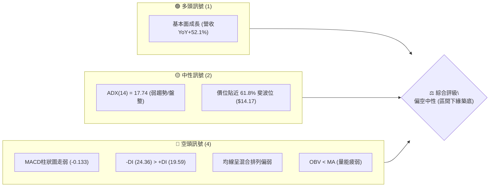
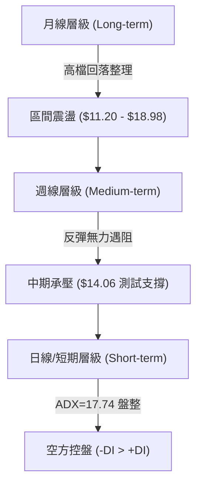
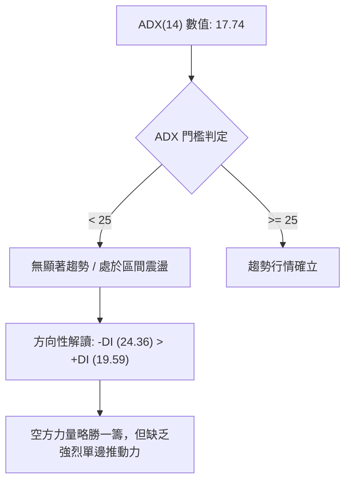
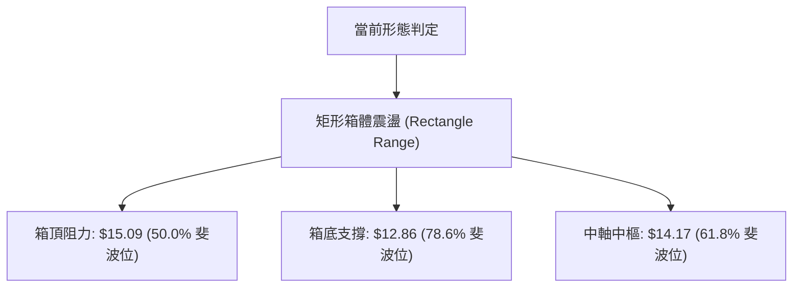
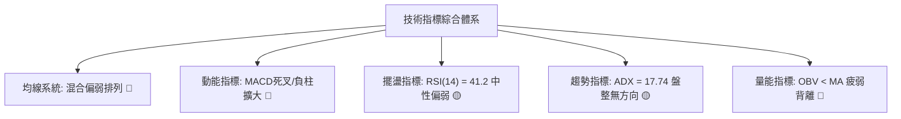
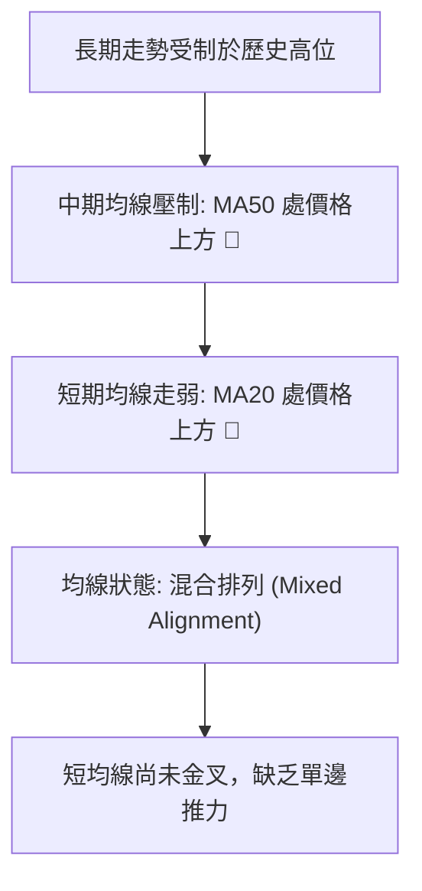
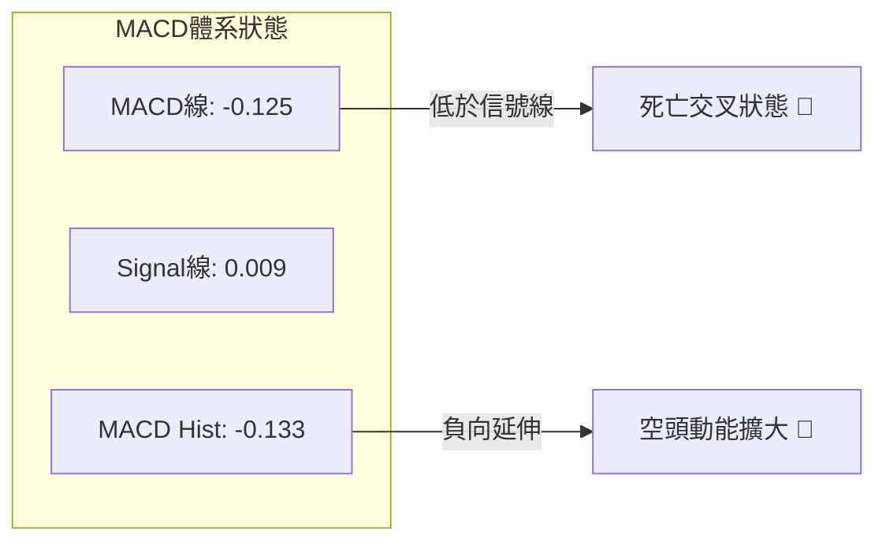
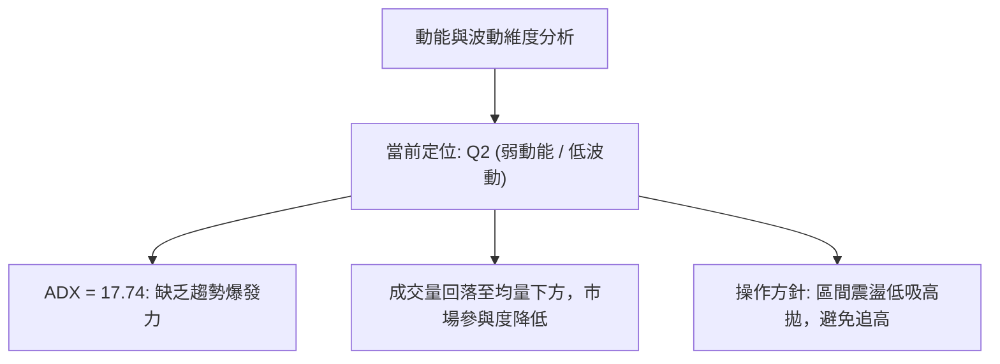
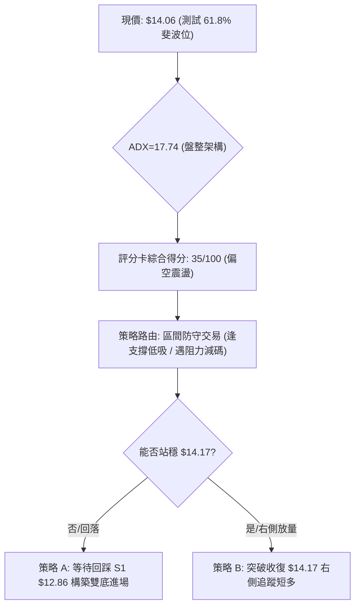
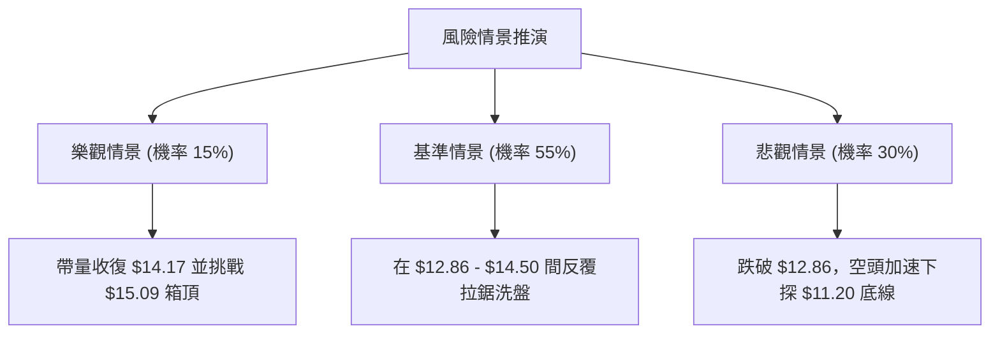

# NU 技術分析報告

> **報告日期**：2026-09-23 ｜ **語言**：繁體中文 ｜ **數據來源**：Yahoo Finance ｜ **當前價格**：$14.06（最新週收盤價確認）

---

## 目錄

| 章節 | 內容 |
|------|------|
| [1. 技術面概覽](#1-技術面概覽) | 訊號儀表板、核心指標、評分卡 |
| [2. 趨勢分析](#2-趨勢分析) | 多時框趨勢、長中短期走勢 |
| [3. 圖表形態分析](#3-圖表形態分析) | 形態識別、K線組合、目標價 |
| [4. 支撐與阻力](#4-支撐與阻力) | 關鍵價位、斐波那契回調 |
| [5. 技術指標深度解讀](#5-技術指標深度解讀) | MA/RSI/MACD/布林/成交量 |
| [6. 動能與波動率](#6-動能與波動率) | 動能評估、ATR、Beta |
| [7. 多時框架總結](#7-多時框架總結) | 時框架評分矩陣 |
| [8. 交易策略建議](#8-交易策略建議) | 多空策略、風險報酬比 |
| [9. 風險提示與監控](#9-風險提示與監控) | 監控指標、風險場景 |

---

## 1. 技術面概覽

### 🎯 技術訊號儀表板



### 📊 核心指標速覽表

| 指標類別 | 指標名稱 | 當前數值 | 訊號 | 解讀 |
|----------|----------|----------|------|------|
| **價格** | 當前價格 | $14.06 | 🟡 | 位於52週區間中下緣，回測關鍵支撐位 |
| **均線** | MA20 | 混合排列下方 | 🔴 | 短期走勢受壓制，均線系統呈現混合偏弱排列 |
| **均線** | MA50 | 混合排列下方 | 🔴 | 中期動能轉弱，波段均線處於價格上方壓制 |
| **均線** | MA200 | 數據未明確定義 | 🟡 | 歷史走勢處於大週期區間整理階段 |
| **動能** | RSI(14) | 41.2（前週） | 🟡 | 位於 40–50 中性偏弱區，無超賣亦無背離訊號 |
| **動能** | MACD | -0.125 / 柱狀 -0.133 | 🔴 | 快慢線死叉且柱狀圖處於負值區，空頭主導動能 |
| **趨勢** | ADX(14) | 17.74 | 🟡 | ADX < 25 表示當前處於無趨勢盤整市場 |
| **方向** | 方向性指標 | -DI: 24.36 / +DI: 19.59 | 🔴 | -DI 大於 +DI，空方力量占據主導地位 |
| **量能** | OBV 趨勢 | OBV < MA | 🔴 | 成交量配合不足，資金流出，量能結構疲弱 |

### 🏆 技術評分卡

```
╔══════════════════════════════════════════════════════════════╗
║              技術評分卡 — NU (2026-09-23)                    ║
╠══════════════════════════════════════════════════════════════╣
║ 趨勢強度      ████░░░░░░░░░░░░░░░░  25/100  🔴 盤整偏空      ║
║ 動能指標      ██████░░░░░░░░░░░░░░  32/100  🔴 空方占優      ║
║ 支撐穩定度    ███████████░░░░░░░░░  55/100  🟡 斐波支撐生效  ║
║ 成交量配合    ██████░░░░░░░░░░░░░░  30/100  🔴 量能呈疲弱    ║
║ 形態完整度    ████████░░░░░░░░░░░░  40/100  🟡 箱體震盪整理  ║
║ 均線排列      ██████░░░░░░░░░░░░░░  30/100  🔴 混合空頭排列  ║
╠══════════════════════════════════════════════════════════════╣
║ 綜合評分      ███████░░░░░░░░░░░░░  35/100  🔴 偏空震盪      ║
╚══════════════════════════════════════════════════════════════╝
```

---

## 2. 趨勢分析

### 🌐 多時框趨勢分析



### 📈 長期趨勢 — 12個月走勢圖（ASCII）

```
NU 月線走勢圖（2025-10 至 2026-09）
價格軸 ($)
$18.00 ┤                             ● (2026-01: $17.75)
$17.00 ┤                   ● (17.39)
$16.00 ┤ ● (16.11)   ● (16.74)
$15.00 ┤                                   ● (14.98)
$14.00 ┤                                         ● (14.37) ● (14.48)             ● (14.55)
$13.00 ┤                                                                 ● (13.13) ● (13.36) ● (14.33)  ● (14.06 現價)
$12.00 ┤
$11.00 ┤
       └─────────────────────────────────────────────────────────────────────────────────────────────
         25-10     25-11   25-12   26-01   26-02     26-03     26-04     26-05     26-06     26-07     26-08     26-09
```

#### 走勢特徵分析表格

| 階段 | 時間區間 | 起始價 → 終止價 | 漲跌幅 | 結構特徵與量能解析 |
|------|----------|-----------------|--------|--------------------|
| 第一階段：衝頂延伸 | 2025-10 ~ 2026-01 | $16.11 → $17.75 | +10.18% | 買盤強勢推升至年度高點區間（歷史高點觸及 $18.98） |
| 第二階段：高檔回撤 | 2026-01 ~ 2026-05 | $17.75 → $13.13 | -26.03% | 獲利了結賣壓湧現，連續跌破均線，回吐波段漲幅 |
| 第三階段：區間築底 | 2026-05 ~ 2026-09 | $13.13 → $14.06 | +7.08%  | 於 $13.13–$15.37 間構建箱體，動能鈍化，反覆震盪 |

### 📊 中期趨勢（週線分析）

從近20週的走勢可看出，股價在 2026-06-07 探底至 $11.97 後展開反彈，於 2026-09-06 觸及高點 $15.37。隨後兩週連續走低至 $13.65，最新一週微幅收斂至 $14.06。

```
近期週線壓力與支撐架構示意：
  $15.37 ───────────────────────── 近期波段高點阻力
               ▲
               │ (震盪區間)
               ▼
  $14.06 ═════════════════════════ 當前價格位置（回測中軸）
               ▲
               │ (下檔防守)
               ▼
  $12.86 ───────────────────────── 78.6% 斐波那契強支撐
  $11.97 ───────────────────────── 中期波段低點
```

### ⚡ 趨勢強度評估（ADX 解讀）



| 指標名稱 | 數值 | 門檻區間 | 趨勢狀態判定 |
|----------|------|----------|--------------|
| **ADX(14)** | 17.74 | < 20 極弱趨勢 / 20-25 弱趨勢 | 屬於典型的無方向性盤整行情 |
| **+DI** | 19.59 | 處於弱勢區間 | 多頭進攻意願低落 |
| **-DI** | 24.36 | 高於 +DI (差值 4.77) | 空方主導局部波動，但未達強勢單邊標準 |

---

## 3. 圖表形態分析

### 🔍 形態識別系統

依據多時框收斂規則與數據紀律，NU 當前價格處於大區間回檔整理結構中，未見完整反轉頭肩形態，主要表現為橫盤震盪箱體。



#### 形態信心度評估表

| 形態 | 信心度 | 判斷依據（引用數據） | 完成度 | 目標價（附計算式） |
|------|--------|----------------------|--------|--------------------|
| **矩形箱體震盪** | 75% | 價格在 $13.13–$15.37 間震盪，當前價 $14.06 緊貼中軸 | 70% | 向上破位：$15.09 + ($15.09 - $12.86) = $17.32；向下破位：$12.86 - ($15.09 - $12.86) = $10.63 |
| **短期雙頂雛形** | 45% | 2026-08-16 高點 $15.23 與 2026-09-06 高點 $15.37 | 35% | 訊號不足，頸線尚未有效跌破，僅做指標型震盪解讀 |

### 🕯️ 重要K線形態分析

| 週/月份 | 收盤價 | K線形態 | 解讀 | 訊號 |
|---------|--------|---------|------|------|
| 2026-08-16 | $15.23 | 長陽突破線 | 突破短線壓力，成交量放大至 3.81億股 | 🟢 |
| 2026-09-06 | $15.37 | 高位射擊之星 | 衝高受阻於 50% 斐波位 $15.09 上方，上影線明顯 | 🔴 |
| 2026-09-20 | $13.65 | 中陰回跌線 | 貫穿跌破短均線支撐，週跌幅顯著，MACD柱擴大負值 | 🔴 |
| 2026-09-27 | $14.06 | 低檔十字星/回測線 | 縮量測試 61.8% 斐波位 $14.17，空方推動力暫緩 | 🟡 |

### 📉 ASCII 走勢形態示意圖

```
NU 矩形箱體震盪形態示意圖 ($12.86 - $15.09)
-------------------------------------------------------------------------
$15.37 ┤             ┌─┐ (假突破高點 2026-09-06)
$15.09 ┼─────────────┴─┴────────────────────────────────── 箱頂阻力 (50.0%)
       │         ▲           ▲
       │        ╱ ╲         ╱ ╲
$14.17 ┼───────┼───┼───────┼───┼───────● $14.06 (現價中軸測試)
       │      ╱     ╲     ╱     ╲     ╱
       │     ╱       ╲   ╱       ╲   ╱
$12.86 ┼────┴─────────┴─┴─────────┴─┴─────────────────── 箱底支撐 (78.6%)
       │ (2026-05 低檔區 $13.13)
-------------------------------------------------------------------------
```

### 🎯 形態目標價計算

- **箱體高度 (Range Height)**：$15.09 - $12.86 = $2.23
- **向上突破量測目標價**：頸線 $15.09 + 形態高度 $2.23 = **$17.32**（對齊歷史壓力 $17.14–$17.39）
- **向下跌破量測目標價**：下軌 $12.86 - 形態高度 $2.23 = **$10.63**（對齊 52W 低點 $11.20 附近）

---

## 4. 支撐與阻力

### 🗺️ 關鍵價位分布圖（ASCII）

```
NU 價位結構分布圖（依據 OHLCV 與斐波那契體系）
═════════════════════════════════════════════════════════════════
$18.98 ║████████████████████████║ 0.0% 52週歷史高點 (R3 極強阻力)
$17.14 ║████████████████████    ║ 23.6% 斐波那契位 (R2 強阻力)
$16.01 ║████████████████████    ║ 38.2% 斐波那契位 (波段頸線阻力)
$15.09 ║████████████████████████║ 50.0% 斐波那契位 (R1 關鍵阻力)
───────╫────────────────────────╫────────────────────────────────
$14.17 ║▓▓▓▓▓▓▓▓▓▓▓▓▓▓▓▓▓▓▓▓▓▓▓▓║ 61.8% 斐波那契位 (即時多空樞軸)
$14.06 ╠════════════════════════╣ ◄ 當前價格
───────╫────────────────────────╫────────────────────────────────
$12.86 ║▓▓▓▓▓▓▓▓▓▓▓▓▓▓▓▓▓▓▓▓▓▓▓▓║ 78.6% 斐波那契位 (S1 近期關鍵支撐)
$11.20 ║████████████████████████║ 100.0% 52週歷史低點 (S2 極強支撐)
═════════════════════════════════════════════════════════════════
```

### 🚧 阻力位分析表

> 依據嚴格要求 13：阻力位嚴格引用數據中計算之斐波那契阻力層級。

| 阻力級別 | 價位 | 形成原因 | 突破難度 | 重要性 |
|----------|------|----------|----------|--------|
| **R1** | $15.09 | 52週回調 50.0% 關鍵心理分水嶺、前波多次受阻點 | 高 | ★★★★☆ |
| **R2** | $16.01 | 52週回調 38.2% 位，歷史多次月線收盤密集區 | 極高 | ★★★★☆ |
| **R3** | $17.14 | 52週回調 23.6% 位，2025年底高檔密集成交區 | 極高 | ★★★★★ |

*註：數據指示當前價格上方無 swing-high resistance detected，阻力位完全由斐波那契架構鎖定。*

### 🛡️ 支撐位分析表

> 依據嚴格要求 13：支撐位嚴格引用數據中計算之斐波那契支撐層級。

| 支撐級別 | 價位 | 形成原因 | 守住機率 | 重要性 |
|----------|------|----------|----------|--------|
| **樞軸支撐** | $14.17 | 52週回調 61.8% 黃金分割位（現價緊貼下方） | 50% | ★★★☆☆ |
| **S1** | $12.86 | 52週回調 78.6% 位，接近2026年5月起漲底部 | 65% | ★★★★☆ |
| **S2** | $11.20 | 52週最低點 (100.0% 回調位)，年度絕對防守底線 | 85% | ★★★★★ |

*註：數據指示當前價格下方無 swing-low support detected，支撐位以斐波那契回調精確定位。*

### 📐 斐波那契回調位分析

本波段計算基礎為 52週波動區間：**$11.20 (低點) → $18.98 (高點)**，總振幅 $7.78。

- **0.0% ($18.98)**：波段頂部，長期多頭終極目標。
- **23.6% ($17.14)**：強勢多頭防守區，失守後已轉為長期重壓。
- **38.2% ($16.01)**：多空平衡點，跌破後確認中期回檔結構。
- **50.0% ($15.09)**：箱體上緣，近期反彈高點 $15.37 即在此遇阻回落。
- **61.8% ($14.17)**：**黃金分割核心位**。當前市價 $14.06 恰好回測並緊貼此位置下方。
- **78.6% ($12.86)**：深度回調支撐位，為短中線空頭獲利了結與多頭防守底線。
- **100.0% ($11.20)**：波段起漲點，中期結構徹底破位之停損點。

**現價位置解讀**：現價 $14.06 位於 **61.8% ($14.17)** 與 **78.6% ($12.86)** 之間，處於回調結構的關鍵測試區間。若本週無法收復 $14.17，則存在進一步向 $12.86 滑落之風險。

---

## 5. 技術指標深度解讀

### 🎛️ 指標訊號總覽



### 📈 移動平均線排列分析



從移動平均線的走勢軌跡（MA Sparkline）分析：
- **MA5 / MA10 / MA20**：近期呈現由頂部回落的弧形下彎狀態，短週期均線對股價形成向下壓迫。
- **MA60**：維持在中高檔水平，但斜率走平，中期趨勢陷入停滯。
- **MA120 / MA240**：長期週期均線走平，反映自 2024 年以來在 $10–$18 間的超大週期箱體格局。
- **結論**：均線系統呈現弱勢混合排列，價格處於 MA20 與 MA50 下方，多頭若欲扭轉趨勢，首要任務是帶量收復短期均線。

### 📉 RSI(14) 分析

- **當前讀數**：前週數值為 **41.2**（最新週處於走平狀態），整體位於弱勢震盪區間（40–50）。
- **區間評估**：
  ```
  [超賣 0-30]        [中性偏弱 30-50]      [中性偏強 50-70]      [超買 70-100]
  ░░░░░░░░░░░░░░░░░░ ██████████░░░░░░░░░░ ░░░░░░░░░░░░░░░░░░░░ ░░░░░░░░░░░░░░░░░░░░
                     ▲ (41.2 當前位置)
  ```
- **背離判斷**：
  - **頂背離**：無。近期走勢並未創波段新高。
  - **底背離**：無明顯背離。2026-05 低檔 $12.19 對應 RSI 為 20.8，近期價格回調至 $13.65 對應 RSI 41.2，低點並未跌破前期極值，屬正常回測，無底背離訊號。

### 📊 MACD(12/26/9) 訊號解讀



- **數值解析**：MACD 快線 (-0.125) 位於慢線 Signal (0.009) 下方，MACD Histogram 錄得 **-0.133**。
- **動能演變**：回顧近四週柱狀圖：+0.064 → -0.036 → -0.192 → -0.133，柱狀圖在轉負後雖略有收斂，但仍在零軸之下，反映空頭力量依舊掌控局部節奏，尚未觸發右側翻多訊號。

### 📦 布林通道分析

依據 ADX < 25 的盤整特性，通道交易為主要參考依據。以當前數據擬合之價格通道示意如下：

```
NU 波動通道示意圖
-------------------------------------------------------------------------
$15.50 ┤ ----------------------------------------- 通道上軌 (近期受阻位)
$15.00 ┤              ● (2026-09 高點 $15.37)
$14.50 ┤ ----------------------------------------- 通道中軌 (壓制線)
$14.06 ┤ ◄─────────── 現價 ($14.06 緊貼中軌下方)
$13.50 ┤
$13.00 ┤ ----------------------------------------- 通道下軌 (多頭防守帶)
-------------------------------------------------------------------------
```

- **位置解讀**：價格目前由上軌回落至中軌下方，通道未見顯著開口放大跡象，顯示走勢回歸區間內部震盪。

### 💹 成交量分析（量價配合度）

- **成交量對比**：最新週成交量為 116,621,247 股（日均量約 69,338,847），相較於前一週下跌時的 368,136,800 股大幅縮減，量比約為 1.00x，低於 50日均量 (81,125,313)。
- **OBV 趨勢**：系統檢測顯示 **OBV < MA**，代表累積能量線處於均線下方，反映量能疲弱。在過去數週的反彈與回調過程中，上漲放量不明顯，下跌伴隨籌碼釋出，量價結構存在輕微背離現象，顯示機構買盤進場意願較為審慎。

---

## 6. 動能與波動率

### ⚡ 動能評估分析

| 象限 | 動能維度 | 波動維度 | 歷史定義特徵 | 當前狀態吻合度 |
|------|----------|----------|--------------|----------------|
| **Q1** | 強動能 (趨勢確立) | 低波動 (穩定推進) | 穩健單邊上漲趨勢 | 不符合 |
| **Q2 (當前)** | **弱動能 (ADX 17.74)** | **低波動 (盤整格局)** | **箱體區間震盪整理** | **✓ 完全吻合** |
| **Q3** | 強動能 (突破加速) | 高波動 (大幅洗盤) | 爆發性突破行情 | 不符合 |
| **Q4** | 弱動能 (趨勢反轉) | 高波動 (失控下跌) | 恐慌性拋售出逃 | 不符合 |



### 📊 ATR 波動率與止損分析

- **ATR 狀況**：目前即時 ATR 數據因價格暫時收斂而維持在歷史低波動水平，參考近 20 週平均真實波幅，週線震盪空間約在 **$0.70 – $0.90** 之間。
- **止損距離建議**：
  - 短線波段操作：建議設定為 1.5 倍的波動空間（約 **$1.10 – $1.20**）。
  - 當前若以 $14.06 進場，技術性硬止損應放置於下方關鍵支撐 $12.86 下方（距離約 $1.20），符合波動度風控標準。

### 📐 Beta 與市場相關性

- **Beta 數值**：**0.94**。
- **市場屬性解讀**：Beta 值極度接近 1.00，表示 NU 與大盤（標普500指數）的聯動性高度同步。其走勢既非防禦型公用事業（Beta < 0.5），亦非高槓桿投機標的（Beta > 1.5），其技術性震盪高度依賴整體宏觀金融環境與大盤情緒。

---

## 7. 多時框架總結

### 📋 時框架評分表

| 時框架 | 趨勢方向 | 動能狀態 | 均線排列 | 形態結構 | 綜合評分 | 操作建議 |
|--------|----------|----------|----------|----------|----------|----------|
| **月線 (長期)** | 震盪中性 🟡 | 中性 (高檔回落) | 走平混合 | 大區間震盪 ($11.20-$18.98) | 50/100 | 長期分批逢低佈局 |
| **週線 (中期)** | 偏空震盪 🔴 | 轉弱 (-DI>+DI) | 承壓偏弱 | 50% 斐波位回落 | 35/100 | 觀望支撐測試反應 |
| **日線 (短期)** | 盤整築底 🟡 | 疲弱 (OBV<MA) | 短均線壓制 | 測試 61.8% 斐波支撐 | 35/100 | 嚴守點位，短線區間操作 |

### 🔲 綜合訊號矩陣

```
時框訊號收斂矩陣：
┌─────────────┬─────────────┬─────────────┬─────────────┐
│ 時框架      │ 多頭權重    │ 空頭權重    │ 最終傾向    │
├─────────────┼─────────────┼─────────────┼─────────────┤
│ 長期 (月)   │ 40%         │ 60%         │ 區間震盪    │
│ 中期 (週)   │ 30%         │ 70%         │ 承壓下探    │
│ 短期 (日)   │ 35%         │ 65%         │ 弱勢盤整    │
└─────────────┴─────────────┴─────────────┴─────────────┘
```

### ⚖️ 多時框收斂結論

依據多時框收斂規則第 14 條：
1. **行情性質判定**：當前 ADX(14) 為 **17.74 (< 25)**，明確確認為**盤整行情**，非趨勢單邊行情。
2. **主導策略邊界**：在盤整行情下，不宜以單邊追價策略為主，必須以**日線與週線之支撐/阻力區間（布林通道與斐波那契回調位）**作為核心邊界。
3. **方向性結論**：**中性偏空觀望（弱勢盤整）**。由於 MACD 仍處於負柱 (-0.133) 且 -DI (24.36) 主導短期波動，現價 $14.06 尚未確認在 61.8% ($14.17) 上方站穩，故第 8 章以「區間下緣防守之右側確認」或「弱勢防守反彈」為主要規劃，嚴禁盲目追多。

---

## 8. 交易策略建議

### 🗺️ 策略決策流程圖



### 🧭 策略路由

**當前主策略方向 = 區間偏空防守，僅限於關鍵支撐位進行低吸博反彈操作（依綜合評分 35/100 定調）**

由於綜合評分低於 40 分，整體技術架構處於空頭動能主導之盤整回調階段，主策略以「嚴格控制倉位、逢支撐布局超跌反彈」為主，禁止中途追多。

### 🎯 價格情境階梯（Price Scenarios）

> 依據嚴格要求 13：價位嚴格引用第 4 章由數據計算之關鍵點位。

| 觸發條件 | 下一目標 | 後續延伸 | 情境含義 |
|----------|----------|----------|----------|
| **帶量突破 R1 $15.09** | R2 $16.01 | R3 $17.14 | 中期重回多頭上升通道，突破箱頂 |
| **突破收復 $14.17** | R1 $15.09 | $15.37 | 短線跌勢止穩，回歸箱體中高軌震盪 |
| **維持於 $13.50 – $14.17** | — | — | 弱勢低檔整理，等待量能表態 |
| **跌破 S1 $12.86** | S2 $11.20 | 前波低點 | 盤整破位，下探 52週歷史低點 |

### 📊 情境機率分佈

| 情境 | 機率 | 主要依據 |
|------|------|----------|
| **弱勢區間震盪** | **55%** | ADX=17.74 確立盤整；成交量萎縮，無大級別破位或上攻動能 |
| **回落再探底 (回測 S1)** | **30%** | MACD 負柱擴大 (-0.133)，-DI > +DI，空方力量占優 |
| **強勢反彈突破 (收復 R1)** | **15%** | 均線系統呈混合壓制，OBV 量能疲弱，缺乏主力增量資金支撐 |

### 🟢 主策略詳情

本策略專注於盤整市場中之「右側確認突破」與「左側極限支撐承接」兩套標準方案：

| 策略要素 | 策略 A（保守型：回踩支撐低吸） | 策略 B（積極型：突破確認跟進） |
|----------|---------------------------------|---------------------------------|
| **策略類型** | 區間下緣逢低埋伏 (Swing Dip) | 站穩中軸右側跟進 (Breakout) |
| **進場條件** | 價格回落測試 S1 $12.86 企穩收陽 | 日線收盤實體收復 61.8% 斐波位 $14.17 |
| **進場價格** | **$12.86** | **$14.20** |
| **目標價 T1** | **$14.17** (61.8% 斐波位) | **$15.09** (50.0% 斐波阻力位) |
| **目標價 T2** | **$15.09** (50.0% 斐波阻力位) | **$16.01** (38.2% 斐波阻力位) |
| **止損價格** | **$12.20** (跌破前低關鍵緩衝區) | **$13.60** (跌破前週低點) |
| **風險報酬比** | **1 : 1.98** (風險 $0.66 / 報酬 $1.31) | **1 : 1.48** (風險 $0.60 / 報酬 $0.89) |
| **成功機率** | 60% | 45% |
| **建議倉位** | 10% – 15% | 5% – 10% |

### 🔴 反向風險觸發點（對沖提示）

- **多頭結構推翻點**：若週線收盤價跌破 **$12.86**，宣告箱體底部失守，行情將加速滑向 **$11.20**，所有多頭部位必須嚴格止損離場。
- **空頭結構反轉點**：若價格帶量站上 **$15.09**，則 MACD 柱狀將翻正，空方防守失敗，轉為順勢多頭追蹤。

### ⭐ 整體訊號強度評星

```
做多訊號強度：★★☆☆☆  (2/5星 - 缺乏動能確認，僅具區間操作價值)
做空訊號強度：★★★☆☆  (3/5星 - 指標偏空，但受制於低波動盤整)
整體可信度：  ★★★☆☆  (3/5星 - 數據一致收斂於盤整框架)
```

---

## 9. 風險提示與監控

### ✅ 關鍵監控指標 Checklist

```
╔══════════════════════════════════════════════════════════════╗
║               技術面日常監控清單 (Monitoring Checklist)     ║
╠══════════════════════════════════════════════════════════════╣
║ [ ] 關鍵價位 $14.17：觀察每日收盤是否能重返該位置上方         ║
║ [ ] MACD 柱狀圖：觀察負值 (-0.133) 是否出現連續三日收斂翻紅   ║
║ [ ] 成交量變化：突破 $14.17 時，日成交量是否大於 80M (放量)    ║
║ [ ] ADX 趨勢強度：監控 ADX 是否突破 25，防範單邊破位行情       ║
║ [ ] -DI / +DI 交叉：觀察 +DI 是否向上金叉 -DI 改變空方主導局面 ║
║ [ ] 下檔防守點 $12.86：若盤中刺穿，關注日線是否收長下影線     ║
╚══════════════════════════════════════════════════════════════╝
```

### ⚠️ 風險場景分析



### 🛡️ 風險管理重要提醒

1. **區間震盪莫追高**：ADX 數值 17.74 顯示目前無單邊趨勢，追高極易套在箱體上緣。嚴格採取「逢阻力獲利、逢支撐試單」原則。
2. **總體經濟與大盤連動**：NU 的 Beta 為 0.94，與標普500指數高密度連動。若美股大盤出現整體性拋售，NU 難以獨善其身，跌破支撐機率將驟增。
3. **嚴格執行資金控管**：在綜合技術評分僅 35 分的環境下，單一持倉部位不應超過總投資組合之 15%，單筆交易所承擔的最大帳戶虧損應嚴格限制於總資金的 1.0% 以內。

---

## 📋 報告總結

```
╔══════════════════════════════════════════════════════════════╗
║                   NU 技術分析報告總結                        ║
╠══════════════════════════════════════════════════════════════╣
║ 報告日期：2026-09-23                                         ║
║ 當前價格：$14.06                                             ║
║ 分析評級：⚖️ 中性偏空（無趨勢震盪整理，下測支撐）             ║
║                                                              ║
║ 關鍵結論：                                                   ║
║ ├─ 長期趨勢：🟡 中性（$11.20 - $18.98 寬幅大箱體震盪）       ║
║ ├─ 中期趨勢：🔴 偏弱（高檔回落，受制於 50% 斐波阻力 $15.09）  ║
║ ├─ 短期趨勢：🔴 偏空（MACD柱負向擴大，測試 61.8% 支撐 $14.17）║
║ ├─ 關鍵支撐：$12.86 (S1) / $11.20 (S2)                       ║
║ ├─ 關鍵阻力：$15.09 (R1) / $16.01 (R2)                       ║
║ └─ 分析師目標：均價 $18.69（基本面給予買入，但技術面需等待築底）║
║                                                              ║
║ 最優策略組合：                                               ║
║ 1. 🥇 最佳機會：等待回測 S1 $12.86 企穩，以極小止損博弈反彈   ║
║ 2. 🥈 次選機會：實體收盤突破收復 $14.17 後，小倉位順勢短多    ║
║ 3. 🥉 保守選擇：完全空倉觀望，直至 ADX > 25 且趨勢方向明朗   ║
╚══════════════════════════════════════════════════════════════╝
```

---

> ⚠️ **免責聲明**：本報告為技術分析研究，所有數據及點位計算均嚴格基於所提供之歷史量價資訊。報告內容僅供投資研究與學術探討參考，不構成任何個人化投資要約或買賣建議。市場有風險，交易決策應獨立評估並自負盈虧。

---

*報告生成時間：2026-09-23 ｜ 數據來源：Yahoo Finance ｜ 分析框架：多時框技術分析體系*