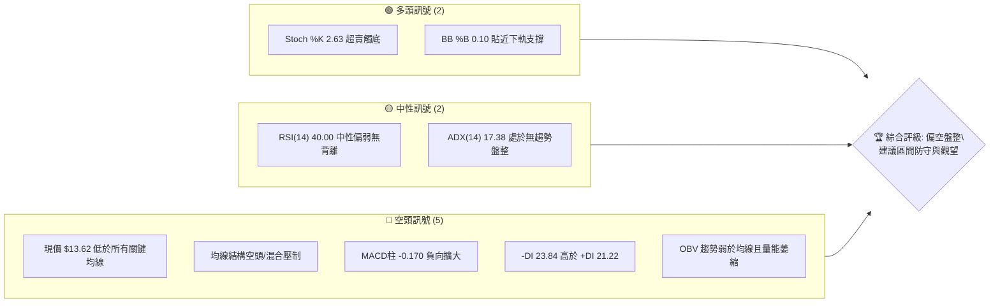
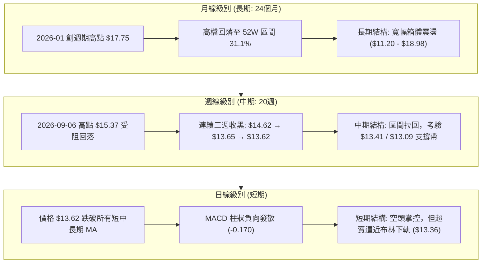
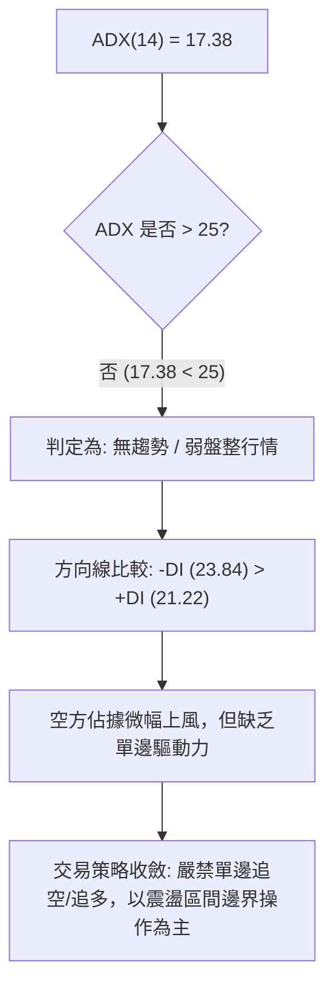
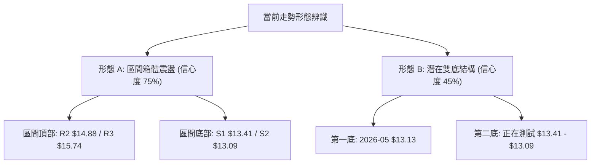
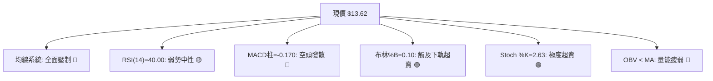
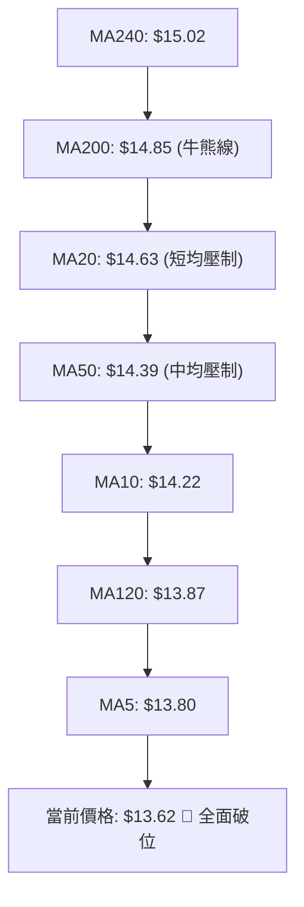
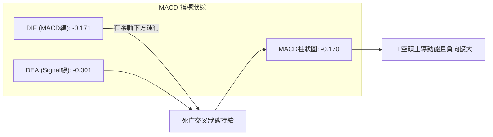
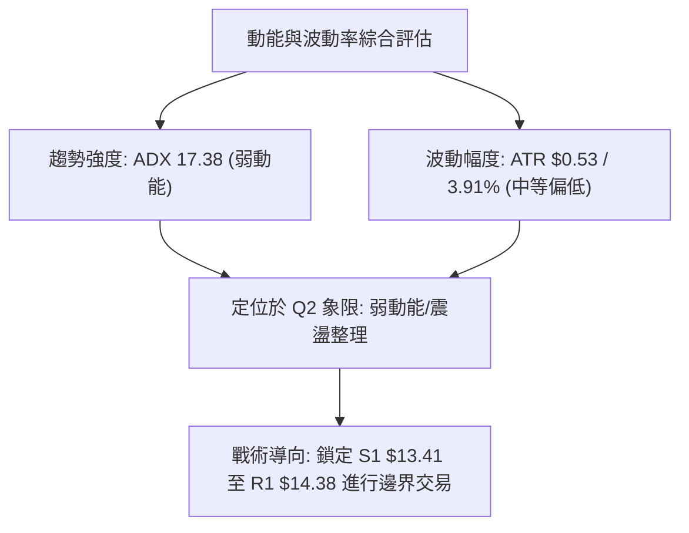
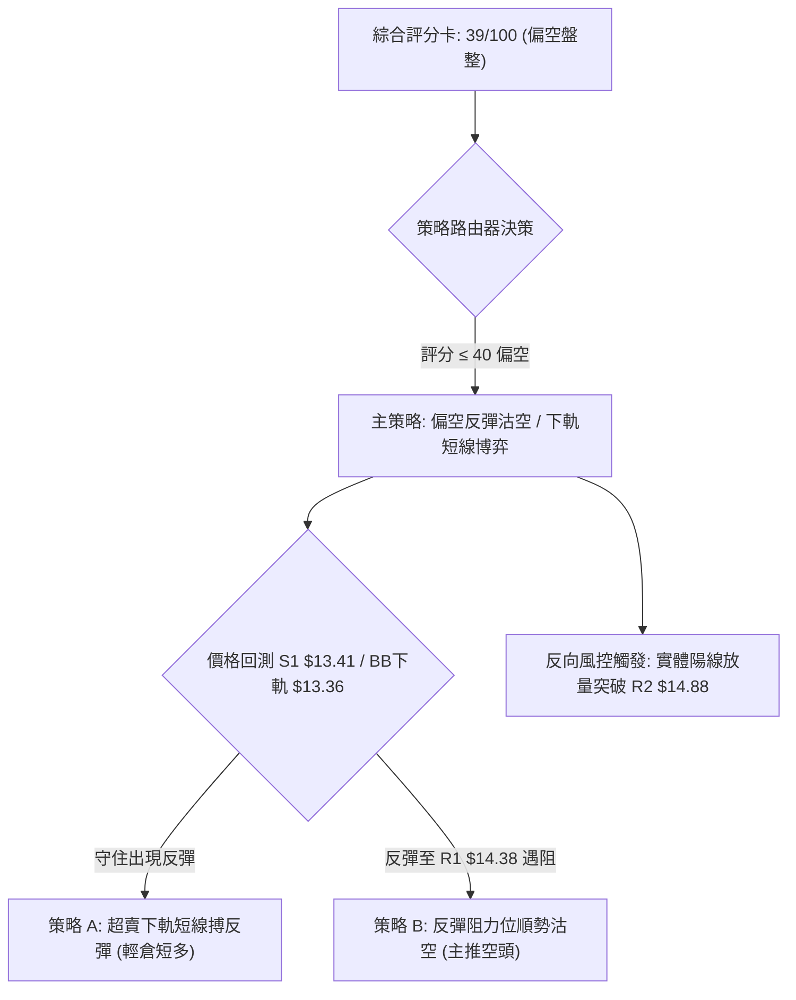
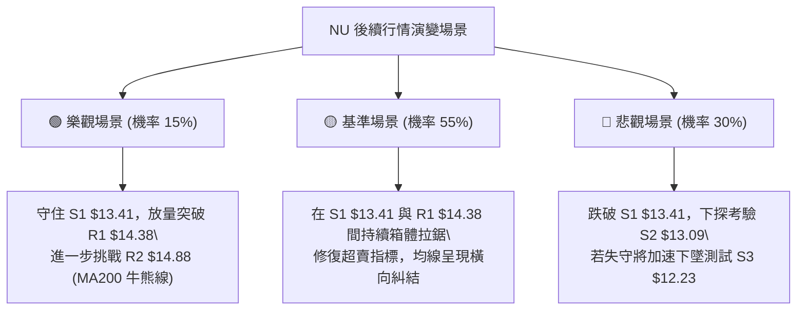

# NU 技術分析報告

> **報告日期**：2026-09-24 ｜ **語言**：繁體中文 ｜ **數據來源**：Yahoo Finance ｜ **當前價格**：$13.62

---

## 目錄

| 章節 | 內容 |
|------|------|
| [1. 技術面概覽](#1-技術面概覽) | 訊號儀表板、核心指標、評分卡 |
| [2. 趨勢分析](#2-趨勢分析) | 多時框趨勢、長中短期走勢 |
| [3. 圖表形態分析](#3-圖表形態分析) | 形態識別、K線組合、目標價 |
| [4. 支撐與阻力](#4-支撐與阻力) | 關鍵價位、斐波那契回調 |
| [5. 技術指標深度解讀](#5-技術指標深度解讀) | MA/RSI/MACD/布林/成交量 |
| [6. 動能與波動率](#6-動能與波動率) | 動能評估、ATR、Beta |
| [7. 多時框架總結](#7-多時框架總結) | 時框架評分矩陣 |
| [8. 交易策略建議](#8-交易策略建議) | 多空策略、風險報酬比 |
| [9. 風險提示與監控](#9-風險提示與監控) | 監控指標、風險場景 |
| [📋 報告總結](#-報告總結) | 全文核心結論與策略總表 |

---

## 1. 技術面概覽

### 🎯 技術訊號儀表板



### 📊 核心指標速覽表

| 指標類別 | 指標名稱 | 當前數值 | 訊號 | 解讀 |
|----------|----------|----------|------|------|
| **價格** | 當前價格 | $13.62 | 🔴 | 位於52W區間31.1%位置，短線弱勢下探 |
| **均線** | MA20 | $14.63 | 🔴 | 價格低於MA20（-6.87%），短期空頭主導 |
| **均線** | MA50 | $14.39 | 🔴 | 價格低於MA50（-5.35%），中期空頭壓制 |
| **均線** | MA200 | $14.85 | 🔴 | 價格低於MA200（-8.28%），跌破牛熊分界線 |
| **動能** | RSI(14) | 40.00 | 🟡 | 位於中性偏弱區間，尚未進入極端超賣，無背離 |
| **動能** | MACD柱 | -0.170 | 🔴 | MACD線(-0.171)低於訊號線(-0.001)，柱狀圖持續擴大 |
| **動能** | 隨機指標 | %K 2.63 / %D 8.99 | 🟢 | 極度超賣區，存在潛在短線技術性反彈動能 |
| **趨勢** | ADX(14) | 17.38 | 🟡 | ADX < 25，市場處於無明確單邊趨勢之盤整箱體 |
| **趨勢** | 方向線 | -DI 23.84 / +DI 21.22 | 🔴 | 空方動能微幅佔優，但優勢並未轉化為強趨勢 |
| **通道** | 布林通道 | 下軌 $13.36 / %B 0.10 | 🟢 | 價格逼近下軌支撐區，短線下行空間受限 |
| **量能** | 成交量比 | 0.91x (62.83M vs 69.30M) | 🟡 | 量能低於20日均量，空方下殺未爆出恐慌量 |
| **波動** | ATR(14) | $0.53 (3.91%) | 🟡 | 波動率處於中等水準，單日平均波幅約 $0.53 |

### 🏆 技術評分卡

```
╔══════════════════════════════════════════════════════════════╗
║                 技術評分卡 — NU (2026-09-24)                 ║
╠══════════════════════════════════════════════════════════════╣
║ 趨勢強度 (ADX)     ███████░░░░░░░░░░░░░  35/100  🟡 弱勢盤整 ║
║ 動能指標 (MACD/RSI) ██████░░░░░░░░░░░░░░  30/100  🔴 空方發散 ║
║ 支撐穩定度 (S1/BB) ████████████░░░░░░░░  60/100  🟡 下軌支撐 ║
║ 成交量配合 (OBV)   ████████░░░░░░░░░░░░  40/100  🔴 量能萎縮 ║
║ 形態完整度 (箱體)   ██████████░░░░░░░░░░  50/100  🟡 震盪整理 ║
║ 均線排列 (全面跌破) ████░░░░░░░░░░░░░░░░  20/100  🔴 空頭壓制 ║
╠══════════════════════════════════════════════════════════════╣
║ 綜合評分           ███████░░░░░░░░░░░░░  39/100  🔴 偏空盤整 ║
╚══════════════════════════════════════════════════════════════╝
```

---

## 2. 趨勢分析

### 🌐 多時框趨勢分析



### 📈 長期趨勢 — 12個月走勢圖（Unicode）

```
NU 月線走勢圖（過去12個月：2025-10 至 2026-09）
價格軸 ($)
$18.00 ┤                     ●(2026-01: 17.75 高點)
$17.00 ┤             ●       │   ●
$16.00 ┤     ●       │       │   │
$15.00 ┤     │       │       │   │   ●
$14.00 ┤     │       │       │   │   │   ●   ●       ●   ●
$13.00 ┤     │       │       │   │   │   │   │   ●   │   │   ●←現在($13.62)
$12.00 ┤     │       │       │   │   │   │   │   │   │   │   │
       └─────┴───────┴───────┴───┴───┴───┴───┴───┴───┴───┴───┴─
            10M     11M     12M 01M 02M 03M 04M 05M 06M 07M 08M 09M
            '25     '25     '25 '26 '26 '26 '26 '26 '26 '26 '26 '26
```

#### 走勢特徵分析表格

| 階段 | 期間 | 價格區間 | 漲跌幅 | 走勢特徵與技術解讀 |
|------|------|----------|--------|-------------------|
| 階段一：牛市主升段 | 2025-08 ~ 2026-01 | $14.80 → $17.75 | +19.93% | 放量突破，均線多頭排列，創出歷史高點區域 |
| 階段二：衝高回落段 | 2026-01 ~ 2026-05 | $17.75 → $13.13 | -26.03% | 獲利了結盤湧現，跌破短期均線，空頭動能釋放 |
| 階段三：築底反彈段 | 2026-05 ~ 2026-09-06 | $13.13 → $15.37 | +17.06% | 測試底部支撐成功後展開波段反彈，挑戰 MA200 |
| 階段四：二次探底段 | 2026-09-06 ~ 當前 | $15.37 → $13.62 | -11.39% | 遇阻 R3 ($15.74) 前哨後急速滑落，測試下檔 S1 ($13.41) |

### 📊 中期趨勢（週線分析）

```
NU 中期週線支撐壓力架構
═════════════════════════════════════════════════════════════════
[阻力 R3]  $15.74  ══════════════════════════════════ (波段強阻力)
                     ↑ (09-06 波段高點 $15.37 遇阻)
[阻力 R2]  $14.88  ─────────── [MA200: $14.85 黏合] ──────────
                     ↑
[阻力 R1]  $14.38  ─────────── [MA50: $14.39 黏合] ───────────
                     ↑
[現價水平] $13.62  ◄────── 當前位置（弱勢盤整）
                     ↓
[支撐 S1]  $13.41  ─────────── [BB下軌: $13.36 緩衝] ─────────
                     ↓
[支撐 S2]  $13.09  ══════════════════════════════════ (五月低點防線)
[支撐 S3]  $12.23  ══════════════════════════════════ (中期極限防線)
═════════════════════════════════════════════════════════════════
```

### ⚡ 趨勢強度評估（ADX 解讀）



#### ADX 數值強度對照表

| ADX 區間 | 趨勢強度定義 | 當前 NU 狀態 (17.38) | 操作指導意義 |
|----------|--------------|----------------------|--------------|
| 00.00 – 19.99 | 弱趨勢 / 無趨勢盤整 | ✓ 處於此區間 | 趨勢指標鈍化，擺動與通道指標（布林、Stoch）權重提升 |
| 20.00 – 24.99 | 趨勢萌芽 / 方向未明 | - | 等待突破確認 |
| 25.00 – 49.99 | 強趨勢行進中 | - | 順勢操作，均線追隨 |
| 50.00 – 100.0 | 極強 / 過度延伸 | - | 提防趨勢衰竭反轉 |

---

## 3. 圖表形態分析

### 🔍 形態識別系統



#### 形態識別信心度與依據評估表（依規則 15）

| 形態名稱 | 信心度 | 判斷依據（引用數據） | 完成度 | 目標價（附計算式） |
|----------|--------|----------------------|--------|--------------------|
| 寬幅箱體整理 | 75% | 價格在 S2 ($13.09) 至 R2 ($14.88) 間多次往返，ADX=17.38 證實無單邊趨勢 | 85% | 箱頂目標：$14.88（箱體上邊界阻力） |
| 潛在雙重底 (W底) | 45% | 2026-05月低點收盤 $13.13，現價 $13.62 逼近 S1 ($13.41)；未破前低但尚未見放量右底轉折 | 35% | 頸線 R1 ($14.38) + 形態高度 ($14.38 - $13.09 = $1.29) = $15.67（數據不足未成型，僅供參考） |
| 下降旗形/通道 | 40% | 09-06 高點 $15.37 下跌以來呈短線通道向下，但因波段跌幅僅三週，樣本過短 | 50% | 訊號不足，僅做指標型解讀（布林下軌支撐驗證） |

*註：除箱體整理外，雙底形態信心度低於 50%，依分析規範不做主觀預測，純粹作為指標型支撐觀察。*

### 🕯️ 重要K線形態分析

| 週/月份 | 收盤價 | K線形態 | 解讀 | 訊號 |
|---------|--------|---------|------|------|
| 2026-01 | $17.75 | 長上影線高檔十字星 | 買盤衰竭，多頭於歷史高檔區域遭遇巨量拋壓 | 🔴 強烈空頭反轉 |
| 2026-05 | $13.13 | 長下影錘頭線（打底） | 空方下殺至波段低點後見強勁承接盤，確認底線 | 🟢 支撐確立 |
| 2026-09-06 (週) | $15.37 | 倒轉鎚頭/射擊之星 | 反彈挑戰 $15.74 阻力區未果，多頭衝高受阻 | 🔴 局部波段見頂 |
| 2026-09-20 (週) | $13.65 | 中長黑實體K線 | 跌破 MA20 ($14.63) 與 MA50 ($14.39)，空方力量宣洩 | 🔴 空方加速 |
| 2026-09-27 (週) | $13.62 | 窄幅縮量紡錘線 | 價格跌勢趨緩，貼近下軌尋求支撐，空方動能減弱 | 🟡 止跌醞釀 |

### 📉 ASCII 走勢形態示意圖

```
NU 箱體震盪形態示意圖 (2026-05 至 2026-09)
═════════════════════════════════════════════════════════════════════
$15.74 ─── 頂部阻力 R3 ───────────────────────────┬─ 09-06 遇阻 $15.37
                                                  │
$14.88 ─── 箱體上界 R2 ───────● 08-16 達 $15.23 ──┼─────────────────
                              │                   │
$14.38 ─── 中軸頸線 R1 ───────┼───────────────────┼─────────────────
                              │                   │
$13.62 ─── 當前現價 ──────────┼───────────────────┴── ◄ 現價下探中
                              │
$13.41 ─── 箱體下界 S1 ───────┼────────────────────── 潛在反彈點
                              │
$13.09 ─── 底部支撐 S2 ───────┴─ 05-31 觸底 $13.13 ─────────────────
═════════════════════════════════════════════════════════════════════
```

### 🎯 形態目標價計算

根據寬幅箱體整理結構：
- **箱體下界（支撐）**：S1 = $13.41 / S2 = $13.09（均值區約 $13.25）
- **箱體中軸（頸線）**：R1 = $14.38（與 MA50 $14.39 高度重合）
- **箱體上界（阻力）**：R2 = $14.88（與 MA200 $14.85 高度重合）
- **極限目標（若向上突破箱體）**：
  $$\text{突破目標} = \text{箱體上界 R2 } (\$14.88) + \text{形態高度 } (\$14.88 - \$13.09 = \$1.79) = \$16.67$$
  *(備註：需放量站穩 R2 始能觸發，當前僅為理論極限值。)*

---

## 4. 支撐與阻力

### 🗺️ 關鍵價位分布圖（Unicode）

```
NU 價位結構分布圖
══════════════════════════════════════════════════════════════
$18.98 ║████████████████████████║ 52W 歷史極值高點
$17.14 ║████████████████        ║ 斐波那契 23.6% 回調位
$16.01 ║██████████████████      ║ 斐波那契 38.2% 回調位
$15.74 ║████████████████████████║ 強阻力 R3 (布林上軌 $15.89 附近)
$15.09 ║████████████████████    ║ 斐波那契 50.0% 回調位
$14.88 ║████████████████████████║ 強阻力 R2 (MA200 $14.85 重合)
$14.38 ║████████████████████    ║ 關鍵阻力 R1 (MA50 $14.39 重合)
$14.17 ║████████████████        ║ 斐波那契 61.8% 回調位 (黃金分割)
$13.62 ╠════════════════════════╣ ◄ 當前價格 ($13.62)
$13.41 ║▓▓▓▓▓▓▓▓▓▓▓▓▓▓▓▓        ║ 近期支撐 S1 (布林下軌 $13.36 緩衝)
$13.09 ║████████████████████    ║ 強支撐 S2 (波段前低密集區)
$12.86 ║████████████            ║ 斐波那契 78.6% 回調位
$12.23 ║████████████████████████║ 極限強支撐 S3 (五月中旬波段低點)
$11.20 ║████████████████████████║ 52W 歷史極值低點 (100.0%)
══════════════════════════════════════════════════════════════
```

### 🚧 阻力位分析表

| 阻力級別 | 價位 | 形成原因 | 突破難度 | 重要性 |
|----------|------|----------|----------|--------|
| **R1** | $14.38 | 近一年波段高點聚類；與 MA50 ($14.39) 形成緊密共振 | 🟡 中等 | 短線多空轉換分水嶺，站上始能化解短線破位風險 |
| **R2** | $14.88 | 近一年波段高點聚類；與 MA200 ($14.85) 重疊，牛熊生命線 | 🔴 極高 | 中期牛熊分水嶺，此處積壓大量長線套牢籌碼 |
| **R3** | $15.74 | 波段高點密集區；接近布林通道上軌 ($15.89) 與 9月初高點 | 🔴 極高 | 中期波段強阻力，突破需大盤全面配合與成交量放大 |

### 🛡️ 支撐位分析表

| 支撐級別 | 價位 | 形成原因 | 守住機率 | 重要性 |
|----------|------|----------|----------|--------|
| **S1** | $13.41 | 近一年波段低點聚類；距布林下軌 ($13.36) 僅 5 美分 | 🟡 65% | 短線第一道防線，超賣指標預期在此產生鈍化或反彈 |
| **S2** | $13.09 | 近一年波段低點聚類；為 2026-05 月收盤 $13.13 所在的實體防守底 | 🟢 80% | 中期箱體底部下界，一旦失守宣告中期走勢進一步走弱 |
| **S3** | $12.23 | 近一年波段低點聚類；對應 2026-05-17 週低收盤價 $12.19 區域 | 🟢 90% | 中長期強烈防線，具備極強結構性價值買盤 |

### 📐 斐波那契回調位分析

*基準區間：52週區間 $11.20 (0.0%基準反轉) → $18.98 (高點)*

```
斐波那契回調層級分析
┌──────────────────┬──────────┬───────────────────────────────────────┐
│ 回調比例         │ 對應價位 │ 當前技術含義解讀                      │
├──────────────────┼──────────┼───────────────────────────────────────┤
│ 0.0% (52W High)  │  $18.98  │ 週期歷史高點                          │
│ 23.6%            │  $17.14  │ 第一回調目標 (已跌破)                 │
│ 38.2%            │  $16.01  │ 中期回調分水嶺 (已跌破)               │
│ 50.0%            │  $15.09  │ 多空中樞均衡位 (已跌破)               │
│ 61.8% (黃金分割) │  $14.17  │ 關鍵黃金回調位 (當前於此位下方承壓)   │
│ 當前價格現值     │  $13.62  │ 介於 61.8% ($14.17) 與 78.6% ($12.86) │
│ 78.6% (深幅回調) │  $12.86  │ 深度防守支撐線 (S2 $13.09 之下屏障)   │
│ 100.0% (52W Low) │  $11.20  │ 52週波段歷史最低底線                  │
└──────────────────┴──────────┴───────────────────────────────────────┘
```

**解讀**：現價 $13.62 已跌破極具標誌性的 61.8% 黃金分割位 ($14.17)。在技術分析理論中，跌破 61.8% 意味著原有的上行結構遭到破壞，市場進入深幅回調或二次築底週期。目前價格正往 78.6% ($12.86) 方向靠攏，下方 S1 ($13.41) 與 S2 ($13.09) 將成為多頭在此回調浪中力圖止跌構建防線的核心戰場。

---

## 5. 技術指標深度解讀

### 🎛️ 指標訊號總覽



### 📈 移動平均線排列分析



#### 均線偏離度與排列狀態表

| 均線名稱 | 數值 | 價格相對於均線乖離率 | 排列型態 | 趨勢意涵 |
|----------|------|----------------------|----------|----------|
| MA 5 | $13.80 | -1.28% | 價格在其下方 | 極短期空頭壓制，短線第一阻力 |
| MA 10 | $14.22 | -4.23% | 價格在其下方 | 短期空方加速下墜 |
| MA 20 | $14.63 | -6.87% | 價格在其下方 | 月線級別反壓，短期反彈強阻力 |
| MA 50 | $14.39 | -5.35% | 價格在其下方 | 季線跌破，中期結構走壞 |
| MA 60 | $14.26 | -4.46% | 價格在其下方 | 中期均線由平轉下彎 |
| MA 120 | $13.87 | -1.81% | 價格在其下方 | 半年線失守，短線多頭抵抗失敗 |
| MA 200 | $14.85 | -8.28% | 價格在其下方 | 跌破長期牛熊分水嶺，確立弱勢防守格局 |
| MA 240 | $15.02 | -9.34% | 價格在其下方 | 長期均線位於最頂部，形成厚重天花板 |

**結論**：均線呈現「混合排列偏空」。現價 $13.62 低於所有短期、中期與長期移動平均線，且 MA20、MA50、MA200 形成層層反壓，空頭排列特徵顯著，多頭任何反彈都將面臨解套籌碼考驗。

### 📉 RSI(14) 分析

```
RSI(14) 強度儀表: 40.00
[超賣 0] ────────── [30] ─────●───── [50 中軸] ────────── [70] ────────── [100 超買]
                            40.00 (偏弱區間)
進度條: ████████░░░░░░░░░░░░  40%
```

- **區間解讀**：當前 RSI(14) 讀數為 40.00，位於 30–50 的偏弱震盪區間。尚未觸及 30 以下的傳統極端超賣區，表示空頭拋壓雖強，但未出現非理性恐慌盤。
- **背離判斷**：
  - 價格自 09-06 高點回落，RSI 從 56.6 降至 40.00。
  - 近三週週線：價格從 $15.37 下跌至 $13.62，RSI 週線從 56.6 → 50.5 → 41.2 → 40.0，指標與價格同步走低。
  - **結論**：目前**無明顯頂背離或底背離**現象，走勢屬於常態性下探修正。

### 📊 MACD(12/26/9) 訊號解讀



- **數值分析**：MACD 線 (-0.171) 處於零軸下方，且持續低於訊號線 (-0.001)。MACD 柱狀圖讀數為 -0.170，負值持續擴展，顯示空方動能目前仍處於釋放階段，尚未出現綠柱縮短（收斂）的止跌訊號。

### 📦 布林通道分析

```
NU 布林通道 (20, 2) 結構圖
════════════════════════════════════════════════════════════════
$15.89 ───────────── 上軌 (Upper Band)
                     │
$14.63 ───────────── 中軌 (Middle Band / MA20)
                     │
$13.62 ─────●─────── 現價位置 (%B = 0.10)
$13.36 ───────────── 下軌 (Lower Band)
════════════════════════════════════════════════════════════════
```

- **帶寬與位置**：BB 上軌為 $15.89，中軌為 $14.63，下軌為 $13.36。
- **%B 指標分析**：%B 值僅為 **0.10**，顯示價格已經極度接近布林通道下軌（距下軌僅 $0.26）。依據布林通道統計學特性，在 ADX < 25 的盤整市中，價格觸及或逼近下軌 0.10 以下時，常引發向均線中軌收斂的均值回歸反彈。

### 💹 成交量分析（量價配合度）

```
成交量配合度儀表
最新日成交量:  62,831,500   [████████░░] (相對於20日均量 91%)
20日均成交量:  69,296,765   [█████████░]
50日均成交量:  80,995,166   [██████████]
```

- **量比與換手**：最新成交量為 62.83M，量比為 0.91x，明顯低於 50 日均量 (81.00M)。顯示價格在下跌過程中並未伴隨量能的急劇放大，說明機構法人尚未出現大規模踩踏恐慌性拋售，而是呈現買盤承接不足引致的「縮量陰跌」。
- **OBV 趨勢解讀**：數據顯示「OBV < MA → 量能疲弱」。能量潮指標低於其移動平均線，確認市場資金呈現淨流出狀態，量能結構暫不支援向上發動反轉行情。

---

## 6. 動能與波動率

### ⚡ 動能評估

#### 動能與波動率象限分析表

| 象限 | 動能狀態 | 波動率狀態 | 當前標的狀態 | 評估與操作意涵 |
|------|----------|------------|--------------|----------------|
| Q1 (攻勢) | 強動能 (Trend) | 低波動 (Low Vol) | - | 穩定趨勢波段，最優順勢持倉環境 |
| Q2 (蓄勢) | 弱動能 (Weak) | 低/中波動 (Mid Vol) | ✓ **NU 當前所處 (Q2)** | **ADX=17.38 低動能，ATR=3.91% 中等波動；箱體盤整，以區間防守為主** |
| Q3 (突破) | 強動能 (Trend) | 高波動 (High Vol) | - | 爆發性單邊行情，高風險高收益 |
| Q4 (混亂) | 弱動能 (Weak) | 高波動 (High Vol) | - | 劇烈雙向洗盤，避免盲目進場 |



### 📊 ATR 波動率分析

- **當前 ATR(14)**：$0.53，佔現價百分比為 **3.91%**。
- **日間真實波幅含義**：在常態交易日中，NU 價格每日正常上下波動極限約在 ±$0.53 區間。
- **止損距離建議**：
  - **極短線交易（1.0 × ATR）**：建議安全止損緩衝距離為 $0.53。
  - **波段交易（1.5 × ATR）**：建議安全止損緩衝距離為 $0.53 × 1.5 = **$0.795 ≈ $0.80**。
  - **防洗盤邊界**：若在 S1 ($13.41) 附近介入，止損價位應設定在低於 S1 至少 0.6~0.8 個 ATR，即守在 S2 ($13.09) 之下方。

### 📐 Beta 與市場相關性

- **Beta 係數**：**0.94**。
- **解讀**：NU 與美股大盤（S&P 500）走勢具備高度同步性（Beta 接近 1.0），波動幅度微幅低於大盤整體水準。這意味著在缺乏個股獨立催化劑的情況下，NU 容易受到宏觀金融板塊與美股大盤情緒的同向牽引。空頭拋壓若要完全扭轉，需要整體市場風險偏好回暖的配合。

---

## 7. 多時框架總結

### 📋 時框架評分表

| 時框架 | 趨勢方向 | 動能狀態 | 均線排列 | 圖表形態 | 綜合評分 | 建議戰術 |
|--------|----------|----------|----------|----------|----------|----------|
| **長期 (月線)** | 🟡 寬幅箱體 | 🟡 趨緩中性 | 🟡 混合整理 | 大箱體 ($11.20-$18.98) | 50/100 | 長線分批定投，下邊界佈局 |
| **中期 (週線)** | 🔴 拉回修正 | 🔴 負向延伸 | 🔴 跌破 MA200 | 測試箱體下軌支撐 | 35/100 | 嚴控多頭倉位，等待企穩 |
| **短期 (日線)** | 🔴 空方主導 | 🟢 極度超賣 | 🔴 全面空頭壓制 | 貼近布林下軌震盪 | 32/100 | 嚴禁盲目追空，博短線反彈 |

### 🔲 綜合訊號矩陣

```
訊號維度一致性檢驗矩陣
┌──────────────┬──────────┬──────────┬──────────┬────────────────────────┐
│ 分析維度     │ 日線級別 │ 週線級別 │ 月線級別 │ 跨時框共振狀態         │
├──────────────┼──────────┼──────────┼──────────┼────────────────────────┤
│ 均線趨勢     │ 🔴 空頭  │ 🔴 空頭  │ 🟡 中性  │ 短中期空頭共振壓制     │
│ 擺動動能     │ 🟢 超賣  │ 🔴 偏空  │ 🟡 中性  │ 短線醞釀反彈 vs 中期承壓│
│ 量能結構     │ 🔴 疲弱  │ 🔴 縮量  │ 🟡 平衡  │ 量能退潮，無強勢買盤   │
│ 支撐防守     │ 🟢 逼近S1│ 🟡 考驗S1│ 🟢 守在S2│ $13.41-$13.09 為共振支撐│
└──────────────┴──────────┴──────────┴──────────┴────────────────────────┘
```

### ⚖️ 多時框收斂結論（依規則 14）

1. **行情性質判定**：當前 ADX(14) 讀數為 **17.38**，遠低於趨勢臨界線 25。依多時框收斂規則，當前行情定性為**典型「盤整行情」**。
2. **主導維度收斂**：在無趨勢的盤整架構下，中長期均線失去單邊指引作用，**以日線布林通道上下軌（下軌 $13.36 / 上軌 $15.89）及波段聚類支撐阻力為核心交易區間**。
3. **唯一方向性結論**：**中性偏空觀望（弱勢盤整防守）**。
   - 儘管短期日線 Stoch (%K 2.63) 與布林通道 (%B 0.10) 出現極度超賣，具備技術性反抽動能；但日線與週線均線呈現全面壓制，MACD 負向發散未見收斂。因此，此處**不可視為反轉信號**，不可盲目重倉追多。主基調為：**空方佔優下的箱體下緣防守震盪，以防禦與輕倉區間操作為唯一準則**。

---

## 8. 交易策略建議

### 🗺️ 策略決策流程圖



### 🧭 策略路由

> **當前主策略方向 = 偏空盤整（依評分 39/100 路由分流）**  
> 綜合評分低於 40 分，均線系統全面破位且 MACD 處於負向發散階段。然而考量到 ADX 僅 17.38（無強趨勢）且當前價格逼近布林下軌 $13.36 與 S1 支撐 $13.41，在超賣狀態下**嚴禁直接追空**。主推策略為：**等待價格反抽至關鍵均線阻力 R1 ($14.38) 附近展開「逢高沽空」，次選為在下軌 S1 ($13.41) 附近的「極輕倉短線搏超賣反彈」**。

### 🎯 價格情境階梯（Price Scenarios）

*(所有價位精確引用自「關鍵價位」區塊數據)*

| 觸發條件 | 下一目標 | 後續延伸 | 情境含義與技術解讀 |
|----------|----------|----------|-------------------|
| 向上突破 R1 $14.38 | R2 $14.88 | R3 $15.74 | 短線空頭衰竭，測試 MA200 牛熊分水嶺 |
| 站穩現價 $13.62 區間 | R1 $14.38 | — | 布林下軌超賣修復，區間箱體弱勢震盪 |
| 有效跌破 S1 $13.41 | S2 $13.09 | S3 $12.23 | 下軌防線崩潰，開啟二次探底與深幅回調 |

### 📊 情境機率分佈

| 情境劇本 | 機率 | 主要依據（指標狀態） |
|----------|------|----------------------|
| **情境一：弱勢區間震盪（反彈修復）** | **55%** | ADX=17.38 盤整特徵顯著；Stoch %K=2.63 極度超賣；%B=0.10 貼近布林下軌支撐 |
| **情境二：震盪後回落再探底（破位）** | **35%** | 現價跌破所有 MA 均線；MACD 柱狀 -0.170 負向擴展；OBV 能量疲弱確認資金撤出 |
| **情境三：強勢單邊反轉上行** | **10%** | 上方遭遇 R1 ($14.38)、MA20 ($14.63) 與 R2 ($14.88) 重重套牢壓制，量能顯著不足 |

### 🟢 主策略詳情

#### 策略 A（主推順勢策略）：反彈至 R1 遇阻沽空（空頭主策略）

- **進場條件**：價格自超賣區展開技術性反抽，上探測試 R1 ($14.38) 或 MA50 ($14.39) 區域，日K線出現長上影線、縮量滯漲或轉折黑K。
- **進場價格**：**$14.35**（精確設定於 R1 $14.38 阻力位下方）。
- **目標價 T1**：**$13.62**（當前現價水平，鎖定首波利潤，降成本）。
- **目標價 T2**：**$13.41**（回測波段支撐位 S1）。
- **止損價格**：**$14.65**（設定於 MA20 $14.63 阻力之上，止損空間 $0.30）。
- **風險報酬比**：
  $$\text{風報比 (至 T2)} = \frac{\$14.35 - \$13.41}{\$14.65 - \$14.35} = \frac{\$0.94}{\$0.30} = 3.13:1$$
- **成功機率**：65%（順應均線空頭排列與 MACD 負向動能）。
- **建議倉位**：10% - 15% 總資金。

#### 策略 B（次選短線博弈）：S1 / 布林下軌超賣搏反彈（逆勢短多策略）

- **進場條件**：盤中向下測試支撐位 S1 ($13.41) 或布林下軌 ($13.36)，隨機指標 %K 向上金叉 %D，出現短線止跌十字星或長下影線。
- **進場價格**：**$13.45**（S1 $13.41 上方緩衝區）。
- **目標價 T1**：**$13.87**（MA120 半年線阻力）。
- **目標價 T2**：**$14.38**（關鍵阻力位 R1）。
- **止損價格**：**$13.05**（嚴格設定於強支撐 S2 $13.09 之下，止損空間 $0.40）。
- **風險報酬比**：
  $$\text{風報比 (至 T2)} = \frac{\$14.38 - \$13.45}{\$13.45 - \$13.05} = \frac{\$0.93}{\$0.40} = 2.33:1$$
- **成功機率**：50%（逆勢搏超賣，需快進快出）。
- **建議倉位**：5% 總資金（極輕倉短線測試）。

### 🔴 反向風險觸發點（對沖與風控提示）

- **空頭主策略翻轉點**：若日線級別以大陽線收盤**放量站穩 R2 ($14.88)** 且收復 MA200 ($14.85)，證明牛熊線由壓力成功轉化為支撐，原有空頭排列結構失效。此時所有空單必須無條件離場觀望。
- **多頭防守底線**：若日線收盤價跌破 **S2 ($13.09)**，意味著箱體底部徹底失守，走勢將直奔 S3 ($12.23) 與斐波那契 78.6% ($12.86) 回調位，所有抄底博反彈多單嚴格停損。

### ⭐ 整體訊號強度評星

```
做多訊號強度：★★☆☆☆  (2/5星 - 僅存超賣指標鈍化與下軌支撐)
做空訊號強度：★★★☆☆  (3.5/5星 - 均線空頭壓制，但受制於低ADX震盪未現單邊暴跌)
整體可信度：  ★★★★☆  (4/5星 - 數據多指標互相印證盤整特徵)
```

---

## 9. 風險提示與監控

### ✅ 關鍵監控指標 Checklist

```
╔══════════════════════════════════════════════════════════════╗
║               NU 關鍵技術面日常監控清單 (Checklist)           ║
╠══════════════════════════════════════════════════════════════╣
║ [ ] 價格是否觸及 S1 $13.41 與 BB 下軌 $13.36 支撐帶           ║
║ [ ] Stoch %K 是否向上穿越 %D 形成黃金交叉 (超賣修復啟動)      ║
║ [ ] 成交量是否低於 60M (持續縮量) 或突增至 80M 以上 (方向選擇) ║
║ [ ] 日線 MACD 柱狀圖是否開始收斂 (負值自 -0.170 縮窄)         ║
║ [ ] 價格反彈時在 R1 $14.38 / MA50 的 K 線反應 (突破 vs 遇阻)   ║
║ [ ] ADX(14) 數值是否升破 20-25 門檻 (研判單邊趨勢是否成型)    ║
║ [ ] 跌破 S2 $13.09 時是否引發機構停損放量 (風控警戒線)        ║
╚══════════════════════════════════════════════════════════════╝
```

### ⚠️ 風險場景分析



### 🛡️ 風險管理重要提醒

1. **嚴禁順勢追殺低位**：當前 Stoch %K 處於 2.63 極度超賣狀態，布林 %B 為 0.10，此時在 $13.62 直接追空，極易遭遇技術性空頭回補引發的均值回歸反抽（Bear Trap）。
2. **倉位管控法則**：在 ADX < 25 的無趨勢震盪市中，單一策略倉位不得超過總資金的 15%，總暴險部位不得超過 25%。震盪行情容易出現假突破與上下洗盤。
3. **ATR 止損原則**：盤中必須設定條件單止損，多單止損不可寬於 S2 ($13.09) 下方 $0.05（即 $13.04），空單止損不可寬於 MA20 ($14.63) 之上。

---

## 📋 報告總結

```
NU 技術分析報告總結
════════════════════════════════════════════════════════
報告日期：2026-09-24
當前價格：$13.62
分析評級：⚖️ 偏空盤整 / 區間防守（技術評分 39/100）

關鍵結論：
├─ 長期趨勢：🟡 中性（處於 $11.20 - $18.98 寬幅震盪結構）
├─ 中期趨勢：🔴 偏空（自高點回落，連續數週走低跌破 MA200）
├─ 短期趨勢：🔴 弱勢（低於所有均線，但指標步入極度超賣區）
├─ 關鍵支撐：S1 $13.41 ｜ S2 $13.09 ｜ S3 $12.23
├─ 關鍵阻力：R1 $14.38 ｜ R2 $14.88 ｜ R3 $15.74
└─ 分析師目標：華爾街平均共識目標價為 $18.69 (評級 Buy)

最優策略組合：
1. 🥇 最佳機會（主推空頭）：反彈至 R1 $14.38 附近逢高沽空
   進場 $14.35 ｜ 止損 $14.65 ｜ 目標 $13.41 ｜ 風報比 3.13:1
2. 🥈 次選機會（短線搏反彈）：S1 $13.41 及布林下軌超賣輕倉博弈
   進場 $13.45 ｜ 止損 $13.05 ｜ 目標 $14.38 ｜ 風報比 2.33:1
3. 🥉 保守選擇（觀望防守）：暫時空倉，等待放量突破 R2 $14.88
   或跌破 S2 $13.09 趨勢明朗化後再行順勢跟進
════════════════════════════════════════════════════════
```

---

> ⚠️ **免責聲明**：本報告為 AI 自動生成之技術分析，所有數據及估算均基於提供的歷史價格資訊。本報告**僅供研究與學術參考**，**不構成任何投資建議**。投資有風險，入市需謹慎。

---

*報告生成時間：2026-09-24 ｜ 數據來源：Yahoo Finance ｜ 分析框架：多時框技術分析*