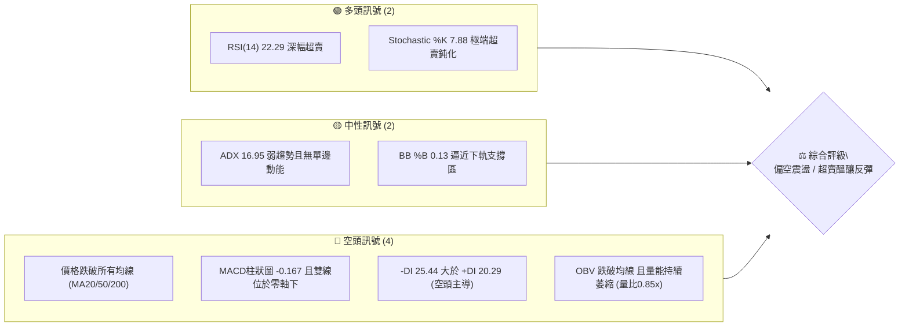
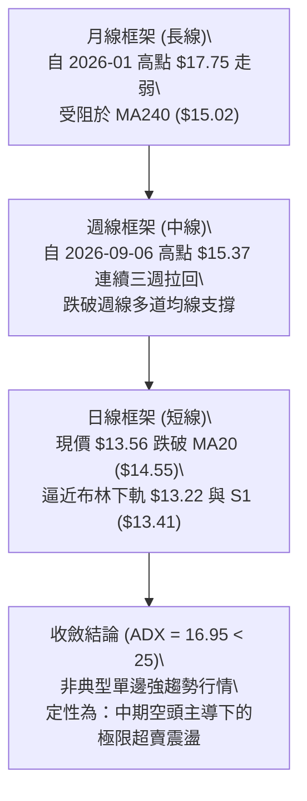
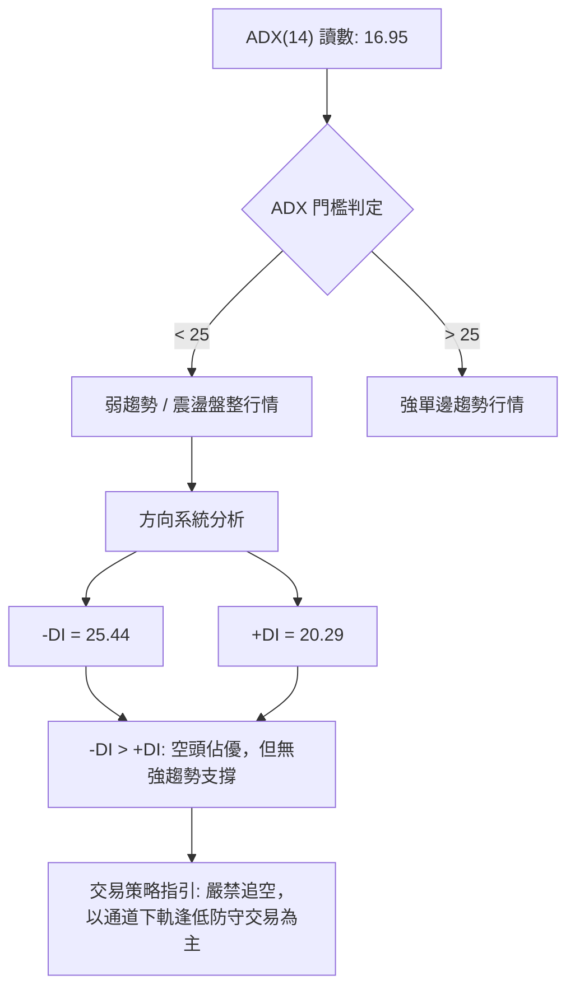
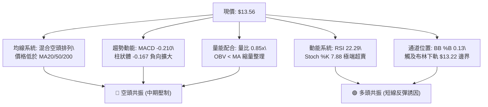
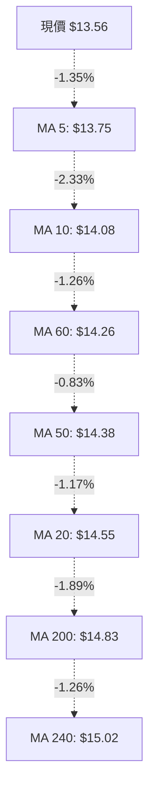
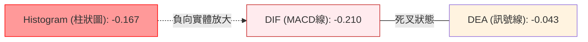
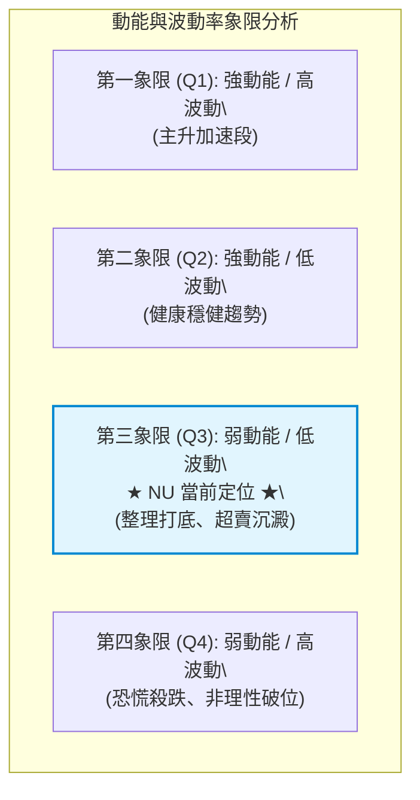
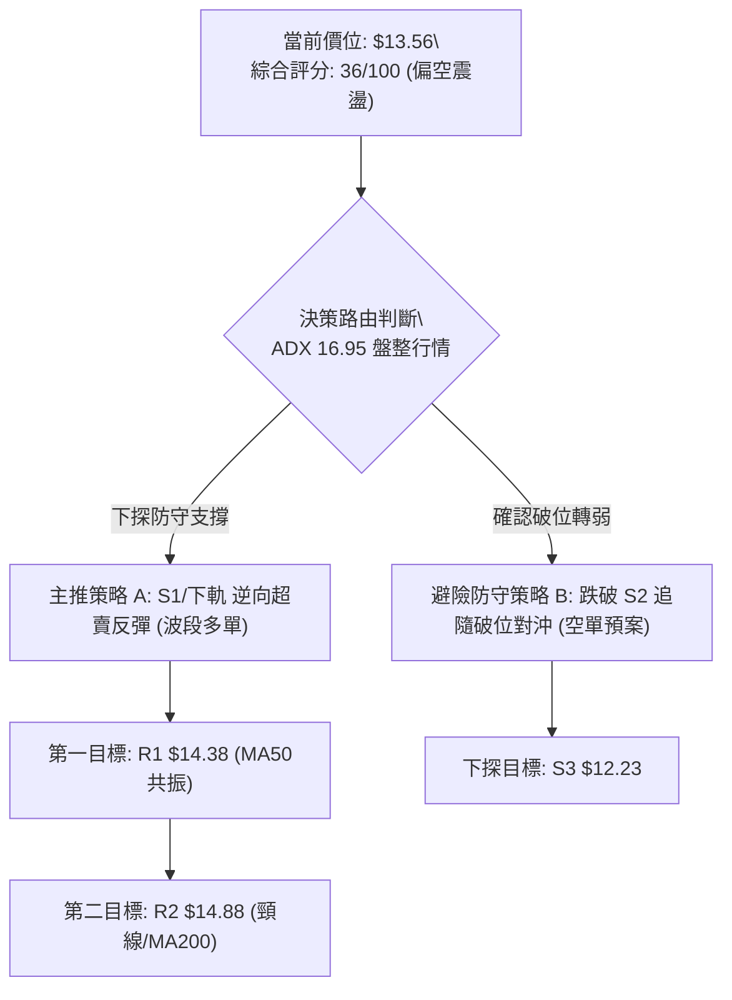
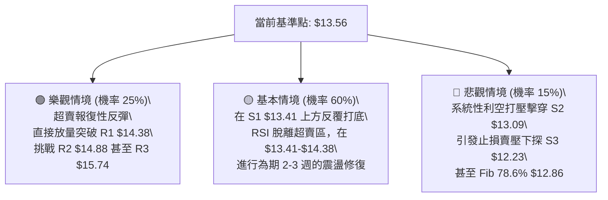

# NU 技術分析報告

> **報告日期**：2026-09-25 ｜ **語言**：繁體中文 ｜ **數據來源**：Yahoo Finance ｜ **當前價格**：$13.56

---

## 目錄

| 章節 | 內容 |
|------|------|
| [1. 技術面概覽](#1-技術面概覽) | 訊號儀表板、核心指標、評分卡 |
| [2. 趨勢分析](#2-趨勢分析) | 多時框趨勢、長中短期走勢、ADX解讀 |
| [3. 圖表形態分析](#3-圖表形態分析) | 形態識別信心度、重要K線形態、幾何推算 |
| [4. 支撐與阻力](#4-支撐與阻力) | 關鍵價位分布、波段聚類表、斐波那契回調 |
| [5. 技術指標深度解讀](#5-技術指標深度解讀) | 均線系統、RSI、MACD、布林通道、成交量 |
| [6. 動能與波動率](#6-動能與波動率) | 動能四象限、ATR風控測算、Beta敏感度 |
| [7. 多時框架總結](#7-多時框架總結) | 時框架矩陣、規則收斂、唯一方向定調 |
| [8. 交易策略建議](#8-交易策略建議) | 策略路由、情境階梯、精確交易計劃、評星 |
| [9. 風險提示與監控](#9-風險提示與監控) | 監控清單、情境推演、資金控管規範 |

---

## 1. 技術面概覽

### 🎯 技術訊號儀表板



### 📊 核心指標速覽表

| 指標類別 | 指標名稱 | 當前數值 | 訊號 | 解讀 |
|:---|:---|:---|:---:|:---|
| **價格** | 當前價格 | $13.56 | 🔴 | 位於52週區間 30.3% 分位，處於中長期偏弱格局 |
| **均線** | MA20 | $14.55 | 🔴 | 現價低於MA20達 -6.78%，短期空頭壓制明確 |
| **均線** | MA50 | $14.38 | 🔴 | 現價低於MA50達 -5.70%，中期均線反轉為阻力 |
| **均線** | MA200 | $14.83 | 🔴 | 現價低於牛熊分界線 -8.56%，長線趨勢承壓 |
| **動能** | RSI(14) | 22.29 | 🟢 | 極度超賣（<30），下行動能耗竭，隨時可能出現技術反抽 |
| **動能** | MACD(12,26,9) | -0.210 / -0.043 | 🔴 | 快慢線死叉位於零軸下方，柱狀體 -0.167 處於空方擴散 |
| **動能** | KD(14,3,3) | %K: 7.88 / %D: 10.58 | 🟢 | 進入超賣臨界區，多方反彈能量持續積累 |
| **波動** | ATR(14) | $0.48 (3.54%) | 🟡 | 每日平均波動幅度適中，盤整環境下的典型波幅 |
| **趨勢** | ADX(14) | 16.95 | 🟡 | ADX < 25 表示單邊空頭趨勢衰竭，進入低動能盤整區間 |

### 🏆 技術評分卡

```
╔══════════════════════════════════════════════════════════════════╗
║                 技術評分卡 — NU (2026-09-25)                    ║
╠══════════════════════════════════════════════════════════════════╣
║ 趨勢強度 (Trend)     ██████░░░░░░░░░░░░░░  30/100 🔴 空頭主導     ║
║ 動能指標 (Momentum)  ████████░░░░░░░░░░░░  40/100 🟡 超賣反彈潛力 ║
║ 支撐穩定度 (Support) ████████████░░░░░░░░  60/100 🟡 臨近S1/S2支撐║
║ 成交量配合 (Volume)  ██████░░░░░░░░░░░░░░  30/100 🔴 量能匱乏/弱勢║
║ 形態完整度 (Pattern) ████████░░░░░░░░░░░░  40/100 🟡 區間下緣震盪 ║
║ 均線排列 (MAs)       ████░░░░░░░░░░░░░░░░  20/100 🔴 空頭空頭發散 ║
╠══════════════════════════════════════════════════════════════════╣
║ 綜合技術評分         ███████░░░░░░░░░░░░░  36/100 🔴 偏空震盪     ║
╚══════════════════════════════════════════════════════════════════╝
```

---

## 2. 趨勢分析

### 🌐 多時框趨勢分析



### 📈 長期趨勢 — 12個月走勢圖（Unicode）

```
NU 過去12個月價格走勢圖（2025-10 至 2026-09）
價格軸 ($)
$18.00 ┤                             ● (2026-01: $17.75)
$17.00 ┤                     ● (17.39) 
$16.00 ┤ ● (16.11)    ● (16.74)
$15.00 ┤                                    ● (14.98)                     ● (14.55)
$14.00 ┤                                           ● (14.37) ● (14.48)           ● (14.33)
$13.00 ┤                                                               ● (13.13) ● (13.36)   ● (13.56 現價)
       └─┬───────┬───────┬───────┬───────┬───────┬───────┬───────┬───────┬───────┬───────┬───────┬───
        10月    11月    12月    01月    02月    03月    04月    05月    06月    07月    08月    09月
        2025    2025    2025    2026    2026    2026    2026    2026    2026    2026    2026    2026
```

**走勢特徵分析表格**：

| 階段區間 | 月份分布 | 起訖價位 | 區間漲跌幅 | 形態與量價特徵 |
|:---|:---|:---:|:---:|:---|
| **主升浪推進期** | 2025-10 至 2026-01 | $16.11 → $17.75 | +10.18% | 走勢連續攀高，創下波段高點 $17.75（接近52W高點 $18.98） |
| **快速獲利回吐期**| 2026-01 至 2026-03 | $17.75 → $14.37 | -19.04% | 高檔出現連續賣壓，單月重挫回落，摜破多條短期移動均線 |
| **低位箱型築底期**| 2026-04 至 2026-06 | $14.48 → $13.36 | -7.73%  | 探底至波段低位 $13.13，量能退潮，進入長達一季度的低檔盤整 |
| **波段反彈受阻期**| 2026-07 至 2026-08 | $13.36 → $14.55 | +8.91%  | 多頭反撲上攻，但於 $14.55 遇 MA20 及密集套牢區沉重壓力 |
| **再次探底整理期**| 2026-08 至 2026-09 | $14.55 → $13.56 | -6.80%  | 再次轉弱，考驗年內低點聚類支撐區（$13.41 / $13.09） |

### 📊 中期趨勢（週線分析）

中期走勢圖展示最近 20 週高低起伏，尤其 2026-09-06 見 $15.37 高點後連續快速重挫，空頭動能短期放大，但量能出現顯著縮減（2026-09-27 週成交量降至 168.2M，僅為 2026-07-19 天量 762.0M 的 22%），呈現典型的**「縮量陰跌、拋壓漸竭」**特徵。

```
中期週線支撐阻力結構示意圖
$15.74 ────────────────────────────────────────────── R3 強阻力
           ▲ 2026-09-06 高點 ($15.37)
$14.88 ────────────────────────────────────────────── R2 中期頸線/阻力
$14.38 ────────────────────────────────────────────── R1 短線回抽阻力 (MA50重疊)
                                      
$13.56 ══════════════════════════════════════════════ ◄ 現價 ($13.56)
$13.41 ---------------------------------------------- S1 波段密集支撐
$13.09 ══════════════════════════════════════════════ S2 箱體下邊界 (2026-05低位聚類)
$12.23 ────────────────────────────────────────────── S3 中期底線防守區 (2026-06低點)
```

### ⚡ 趨勢強度評估（ADX 解讀）



| 參數指標 | 數值 | 狀態強度 | 技術含義解讀 |
|:---|:---:|:---:|:---|
| **ADX (14)** | 16.95 | 弱 (Weak) | 遠低於 25 臨界值，明確表明當前處於無趨勢或盤整態勢，單邊空頭動能即將耗盡 |
| **+DI (14)** | 20.29 | 偏弱 | 多方主動推升意願不足，未達強勢發動門檻（>25） |
| **-DI (14)** | 25.44 | 中等 | 空方力量暫時主導，但未拉開與 +DI 的絕對差距（差值僅 5.15） |

---

## 3. 圖表形態分析

### 🔍 形態識別系統

根據規則 15，嚴格杜絕憑空猜測之幾何形態。依據給定數據之波段走勢，當前走勢呈現由 $13.09 至 $15.74 的**「箱型震盪形態」**，以及潛在的**「箱型下軌雙重測試底」**。

| 形態類別 | 信心度 | 判斷依據（引用數據） | 完成度 | 目標價（附計算式） |
|:---|:---:|:---|:---:|:---|
| **箱型區間震盪** | 80% | 價格在 2026-05 低點 $13.13 與 2026-09 高點 $15.37 之間來回震盪，S1($13.41)/S2($13.09) 構成箱底，R1($14.38)/R2($14.88) 構成箱頂密集區。 | 85% | **箱頂阻力目標**：$14.88<br>依箱型震盪下軌反彈之常規目標價。 |
| **雙底結構 (潛在)**| 55% | 第一次波段低點於 2026-05 的 $13.13，本次拉回至 $13.56（逼近 S1 $13.41 與 S2 $13.09），形成潜在庫存吸籌結構。若 S1 不破，形態成立。 | 45% | **幾何等距推算**：<br>頸線 $14.88 - 底部 $13.09 = 形態高度 $1.79<br>突破目標價 = $14.88 + $1.79 = **$16.67**（註：受制於 R3 $15.74，需分段實現） |
| **均線死叉壓制** | 90% | MA20 ($14.55) 低於 MA200 ($14.83)，所有天期均線呈現向下傾斜發散。 | 100% | 指標型形態：無目標價，確認反彈空間受限於 MA20 ($14.55)。 |

### 🕯️ 重要K線形態分析

| 週/月份 | 收盤價 | 走勢特徵與K線行為 | 技術解讀 | 訊號強度 |
|:---|:---:|:---|:---|:---:|
| 2026-08-16 | $15.23 | 週線上漲突破，量能放大至 381.4M，向上試探 R2 阻力區 | 多頭放量衝刺，但留長上影線 | 🟡 假突破回落 |
| 2026-09-06 | $15.37 | 衝高見波段高點後收盤滯漲，量能 373.9M | 形成短期雙頂頸線阻力（R2 $14.88 附近） | 🔴 高檔出貨 |
| 2026-09-13 | $14.62 | 中陰線下破 MA20 ($14.55)，吞沒前週陽線 | 空頭反撲確立，短期趨勢轉弱 | 🔴 空方吞噬 |
| 2026-09-20 | $13.65 | 大陰線破位下殺，成交量達 368.1M，擊穿 MA60 ($14.26) | 恐慌盤湧現，逼近前期底部震盪密集區 | 🔴 強勢空頭貫穿 |
| 2026-09-27 | $13.56 | 縮量十字/小陰線整理，週量大幅驟降至 168.2M | 縮量探底，賣盤衰竭，RSI 進入 22.3 極端超賣 | 🟢 變盤十字星 |

### 📉 ASCII 走勢形態示意圖

```
                    NU 箱型整理與潛在雙底架構示意圖
價格
$15.74 ┬ ─ ─ ─ ─ ─ ─ ─ ─ ─ ─ ─ ─ ─ ─ ─ ─ ─ ─ ─ ─ ─ ─ ─ ─ ─ ─ ─ ─ ─ ─ ─ ─ ─ R3
       │                     [波段頂點 $15.37]
$14.88 ┼ ─ ─ ─ ─ ─ ─ ─ ─ ─ ─ ─ ╭─────╮ ─ ─ ─ ─ ─ ─ ─ ─ ─ ─ ─ ─ ─ ─ ─ ─ ─ ─ ─ 頸線 (R2)
       │                      │     │
$14.38 ┼ ─ ─ ─ ─ ─ ─ ─ ─ ─ ─ ─│─ ─ ─│─ ─ ─ ─ ─ ─ ─ ─ ─ ─ ─ ─ ─ ─ ─ ─ ─ ─ ─ ─ 密集阻力 (R1/MA50)
       │        ╭─────╮       │     │
$13.56 ┼ ─ ─ ─ ─│─ ─ ─│─ ─ ─ ─│─ ─ ─│─ ─ ─ ─ ─ ─ ─ ─ ─ ─[現價 $13.56 逼近]─ 
       │        │     │       │     ╰─────────────╮
$13.41 ┼ ─ ─ ─ ─│─ ─ ─│─ ─ ─ ─│─ ─ ─ ─ ─ ─ ─ ─ ─ ─ ─ ╰ ─ ─ S1 支撐 ─ ─ ─ ─ 
       │        │     ╰───────╯                       [潛在第二底]
$13.09 ┴ ───────╯ [第一底 $13.13] ────────────────────────────────────── S2 箱底強支撐
```

### 🎯 形態目標價計算

1. **區間反彈第一目標 (R1)**：
   - 價格自箱底 S1 ($13.41) 觸發超賣反彈，首先回試由 MA50 形成之聚類阻力位：**$14.38**（距現價 +6.05%）。
2. **區間反彈第二目標 (R2)**：
   - 若能順利修復短期均線，將挑戰箱型頂部及波段高點密集區：**$14.88**（距現價 +9.75%）。
3. **雙底突破等距測算 (延伸目標)**：
   - 公式：$\text{目標價} = \text{頸線價位}(R2) + (\text{頸線價位}(R2) - \text{底部最低價}(S2))$
   - 計算：$\$14.88 + (\$14.88 - \$13.09) = \$14.88 + \$1.79 = \$16.67$
   - 註：上行途中將於 **$15.74 (R3)** 面臨極強之結構阻力。

---

## 4. 支撐與阻力

### 🗺️ 關鍵價位分布圖（Unicode）

```
╔══════════════════════════════════════════════════════════════════╗
║                     NU 關鍵價位結構分布圖                        ║
╠══════════════════════════════════════════════════════════════════╣
║ $18.98 ║████████████████████████████████████████║ 52W 最高點     ║
║ $17.14 ║████████████████████                    ║ Fib 23.6%      ║
║ $16.01 ║████████████████████████                ║ Fib 38.2%      ║
║ $15.74 ║████████████████████████████████████    ║ 強阻力 R3      ║
║ $15.09 ║████████████████████                    ║ Fib 50.0%      ║
║ $14.88 ║████████████████████████████            ║ 重要阻力 R2    ║
║ $14.38 ║████████████████████████████████        ║ 關鍵阻力 R1    ║
║ $14.17 ║████████████████                        ║ Fib 61.8%      ║
║ $13.56 ╠════════════════════════════════════════╣ ◄ 現價 ($13.56)║
║ $13.41 ║▓▓▓▓▓▓▓▓▓▓▓▓▓▓▓▓▓▓▓▓▓▓▓▓▓▓▓▓▓▓▓▓        ║ 近期支撐 S1    ║
║ $13.09 ║████████████████████████████████████    ║ 強支撐 S2      ║
║ $12.86 ║████████████                            ║ Fib 78.6%      ║
║ $12.23 ║████████████████████████                ║ 深度支撐 S3    ║
║ $11.20 ║████████████████████████████████████████║ 52W 最低點     ║
╚══════════════════════════════════════════════════════════════════╝
```

### 🚧 阻力位分析表

所有阻力數據完全基於波段高點聚類統計：

| 阻力級別 | 精確價位 | 距離現價 | 形成原因與技術共振 | 突破難度 | 重要性權重 |
|:---|:---:|:---:|:---|:---:|:---:|
| **R1** | **$14.38** | +6.05% | 近一年波段高點聚類位，同時與 **MA50 ($14.38)** 完美重疊，為反彈第一道天花板 | 中等 | 🟡 重要 |
| **R2** | **$14.88** | +9.75% | 波段高點聚類區，接近布林中軌 MA20 ($14.55) 與長期牛熊線 **MA200 ($14.83)** | 偏高 | 🔴 極重要 (中線頸線) |
| **R3** | **$15.74** | +16.10%| 近一年多個頂點密集壓制區，逼近布林上軌 ($15.87) 及 Fib 38.2% ($16.01) | 極高 | 🔴 強阻力 (波段頂部) |

### 🛡️ 支撐位分析表

所有支撐數據完全基於波段低點聚類統計：

| 支撐級別 | 精確價位 | 距離現價 | 形成原因與技術共振 | 守住機率 | 重要性權重 |
|:---|:---:|:---:|:---|:---:|:---:|
| **S1** | **$13.41** | -1.11% | 近一年密集波段低點聚類，距離現價僅 1.11%，為短線多頭第一道防線 | 65% | 🟢 短線生命線 |
| **S2** | **$13.09** | -3.50% | 2026-05 波段低點 ($13.13) 聚類支撐，與布林下軌 ($13.22) 形成共振支撐帶 | 75% | 🟢 箱體核心防守底 |
| **S3** | **$12.23** | -9.81% | 2026-06 重度回踩波段低點聚類位，為中期多頭趨勢結構的最後底線 | 90% | 🟢 戰略防守極限 |

### 📐 斐波那契回調位分析

依據 52 週完整區間（低點 **$11.20** → 高點 **$18.98**，整體波幅 $7.78）計算之標準黃金分割位：

| 分割比例 | 精確價位 | 技術結構意義 | 當前相對位置判定 |
|:---:|:---:|:---|:---|
| **0.0%** | **$18.98** | 52週歷史高點 | 遠程目標 |
| **23.6%** | **$17.14** | 多頭極強回撤支撐位（已跌破） | 長期壓力區 |
| **38.2%** | **$16.01** | 多頭常規回撤支撐位（已跌破） | 強度阻力位 |
| **50.0%** | **$15.09** | 多空分水嶺均衡軸（已跌破） | 中期多空平衡點 |
| **61.8%** | **$14.17** | **黃金分割關鍵防守位（已失守）** | **現價已跌破，轉化為強大阻力** |
| **78.6%** | **$12.86** | **深幅回撤臨界防守位（未跌破）** | **下檔終極斐波那契緩衝保護** |
| **100.0%**| **$11.20** | 52週歷史最低點 | 宏觀底線 |

> **位置解讀**：現價 **$13.56** 目前精確落於 **Fib 61.8% ($14.17)** 與 **Fib 78.6% ($12.86)** 之間。失守 61.8% 表明前期中長線上漲動能已遭到破壞，當前行情定性為深幅修正；而下方 Fib 78.6% ($12.86) 與波段支撐 S2 ($13.09) 構成強大且綿密的緩衝安全網。

---

## 5. 技術指標深度解讀

### 🎛️ 指標訊號總覽



### 📈 移動平均線排列分析



| 均線天期 | 當前數值 | 偏離現價百分比 | 均線歷史軌跡 | 趨勢解讀與定位 |
|:---|:---:|:---:|:---:|:---|
| **MA 5** | $13.75 | -1.35% | ▁▁▂▃▄▅▅▄▄▅▆▆▆▆▅▅▆▇███▇▆▅▄▃▂▁▁▁ | 極短期下壓，短線反彈首個障礙 |
| **MA 10** | $14.08 | -3.68% | ▁▁▁▁▂▂▂▂▃▄▆▆▆▅▆▆▇███████▇▆▄▃▂▁ | 下行斜率陡峭，扣抵高位壓制 |
| **MA 20** | $14.55 | -6.78% | ▁▁▁▂▂▂▂▂▂▃▃▃▃▃▄▄▅▆▇▇████▇▇▇▆▆▅ | 布林中軌，短中期多空分水嶺 |
| **MA 50** | $14.38 | -5.70% | 聚類阻力 R1 共振位置 | 中期防線失守，均線形成反壓 |
| **MA 60** | $14.26 | -4.92% | ▁▁▁▁▂▂▂▂▂▃▃▃▄▄▄▅▅▆▆▇▇▇████████ | 季線下彎，顯示中期結構鬆動 |
| **MA 120** | $13.86 | -2.19% | █▆▅▄▂▂▁▁▁▁▁▁▁▁▁▂▃▄▅▅▆▇▆▆▆▆▆▆▆▅ | 半年線走平，即將在反彈中接受測試 |
| **MA 200** | $14.83 | -8.56% | 牛熊分界線失守 | 長線多頭防禦轉入修復期 |
| **MA 240** | $15.02 | -9.69% | █████████▇▇▇▇▆▆▆▅▅▅▅▄▄▄▃▃▂▂▁▁▁ | 年線高懸，長期趨勢頂部壓制強烈 |

### 📉 RSI(14) 與 隨機指標(Stochastic) 分析

```
RSI(14) 讀數：22.29 [████░░░░░░░░░░░░░░░░] 極端超賣區 (<30)
 0             20   30                    50                    70   80            100
 ├──────────────┼────┼─────────────────────┼─────────────────────┼────┼────────────┤
                ▲ (22.29)
```

- **超買超賣判定**：RSI(14) 跌至 **22.29**，且近 20 週數據顯示 2026-05-17 低點時 RSI 為 20.8（隨後收盤 $12.19 反彈至 $13.61），當前 RSI 讀數已降至歷史超賣極值邊界。
- **隨機指標 Stochastics**：%K = **7.88**，%D = **10.58**，雙線進入 10 以下的罕見鈍化區，顯示短期賣盤已經極限宣洩。
- **背離分析判斷**：
  - **日線層面**：目前價格下行破位，RSI 同步下行，尚未形成顯著底背離；但日線下行動量衰減明顯。
  - **週線層面**：2026-06-07 收盤 $11.97 時 RSI 為 47.2；當前收盤 $13.56 高於前低，但 RSI 驟降至 22.3，此非標準牛市底背離，而是反映出空頭情緒的超預期集中釋放，技術上醞釀**均值回歸型強烈反抽**。

### 📊 MACD(12,26,9) 訊號解讀



- **數值細節**：MACD 線 (-0.210) 位於 Signal 線 (-0.043) 下方，柱狀圖為 **-0.167**。
- **動能評估**：柱狀圖在連續負值區間延伸，說明短線依然為空方主控節奏；然而觀察近 20 週柱狀圖軌跡，-0.192 至 -0.167 已經出現負值柱縮短徵兆，空頭擴散速度開始放緩，一旦柱體出現收斂紅轉，即為技術買點觸發訊號。

### 📦 布林通道分析

```
NU 布林通道位置示意圖 (寬度: $2.65, %B = 0.13)
$15.87 ┬ ─ ─ ─ ─ ─ ─ ─ ─ ─ ─ ─ ─ ─ ─ ─ ─ ─ ─ ─ ─ ─ ─ ─ ─ ─ ─ ─ ─ ─ ─ 上軌
       │
$14.55 ┼ ─ ─ ─ ─ ─ ─ ─ ─ ─ ─ ─ ─ ─ ─ ─ ─ ─ ─ ─ ─ ─ ─ ─ ─ ─ ─ ─ ─ ─ ─ 中軌 (MA20)
       │
$13.56 ┼ ─ ─ ─ ─ ─ ─ ─ ─ ─ ─ ─ ─ ─ ─ ─ ─ ─ ─ ─ ─ ─ ─[現價 $13.56, %B=0.13]
$13.22 ┴ ─ ─ ─ ─ ─ ─ ─ ─ ─ ─ ─ ─ ─ ─ ─ ─ ─ ─ ─ ─ ─ ─ ─ ─ ─ ─ ─ ─ ─ ─ 下軌
```

- **軌道數據**：上軌 **$15.87**，中軌 **$14.55**，下軌 **$13.22**。
- **%B 指標位置**：%B 當前為 **0.13**，極度逼近下軌（0.00）。根據布林通道統計規律，當 %B 處於 0.10-0.15 區間且 ADX 處於低位時，股價往往具備極強的下軌支撐回彈彈性。
- **通道帶寬**：通道並未出現開口放大跡象（Bandwidth 保持收斂），證明當前並非單邊暴跌行情，而是標準的**震盪區間觸碰下軌**。

### 💹 成交量分析（量價配合度）

- **量比現況**：最新成交量為 **58,063,400**，對比 20 日均量 **68,392,185**，量比僅為 **0.85x**；對比 50 日均量 **79,102,352**，量能顯著萎縮。
- **OBV 能量潮**：OBV < MA，確認能量潮跌破其均線，反映大資金近期處於防禦性減持狀態。
- **量價背離分析**：週線級別成交量從 762M 萎縮至 168.2M，而價格在低位出現陰跌，形成「**價跌量縮**」的良性出清結構。賣壓主要為跟風停損盤，無機構拋售的異常巨量，為支撐位 S1 ($13.41) 提供可靠之技術底座。

---

## 6. 動能與波動率

### ⚡ 動能評估四象限



| 象限區塊 | 動能維度 | 波動維度 | 典型特徵 | NU 當前狀態評定 |
|:---:|:---:|:---:|:---|:---:|
| **Q1** | 強 | 高 | 突破加速，追隨單邊趨勢 | — |
| **Q2** | 強 | 低 | 緩步推升，長線持有 | — |
| **Q3** | **弱** | **低** | **ADX=16.95, ATR=$0.48，處於縮量築底與蓄勢階段** | **✓ 符合當前定位** |
| **Q4** | 弱 | 高 | ATR 暴增且斷崖下跌 | — |

### 📊 ATR 波動率分析

- **ATR(14) 絕對值**：**$0.48**
- **波動百分比**：佔現價之 **3.54%**
- **風控止損測算**：
  - 短線交易常規止損距離（1.0 × ATR）：$0.48
  - 波段交易安全止損距離（1.5 × ATR）：$0.72
  - 關鍵支撐 S1 ($13.41) 距現價僅 $0.15（約 0.31 × ATR），說明在 S1 附近進場具有**極小止損成本**與優異之風險控制空間。

### 📐 Beta 與市場相關性

- **Beta 係數**：**0.94**
- **市場特徵**：Beta 接近於 1.0，表示 NU 與大盤（標普500/美股金融板塊）具有中等偏高的同步聯動性，未呈現獨立非理性脫鉤走勢。在 Beta 稍小於 1 的狀態下，只要大盤系統性風險未進一步擴大，個股技術性超賣修復將具備較高之穩定性。

---

## 7. 多時框架總結

### 📋 時框架評分表

| 時框架 | 趨勢方向 | 動能狀態 | 均線排列狀況 | 形態特徵 | 評分 (100) | 操作指引 |
|:---|:---:|:---:|:---|:---|:---:|:---|
| **長期 (月線)** | 🟡 橫盤轉弱 | 🔴 柱體收縮 | 價格跌破 MA240 ($15.02) | 區間回撤蓄勢 | 45/100 | 嚴守箱底防線 |
| **中期 (週線)** | 🔴 下行修正 | 🟡 拋壓縮減 | 跌破 20週均線，壓制在 MA50 下 | 箱體中下軌運行 | 38/100 | 等待確認底分型 |
| **短期 (日線)** | 🔴 空頭排列 | 🟢 極端超賣 | MA5/10/20 呈現空頭發散 | 逼近布林下軌與S1 | 35/100 | 嚴禁殺跌，尋找反抽 |

### 🔲 綜合訊號矩陣

```
╔══════════════════════════════════════════════════════════════════╗
║                    多時框架訊號矩陣收斂表                        ║
╠═════════════╦══════════════════╦═════════════════╦═══════════════╣
║ 指標維度    ║ 短期 (日線)      ║ 中期 (週線)     ║ 長期 (月線)   ║
╠═════════════╬══════════════════╬═════════════════╬═══════════════╣
║ 趨勢方向    ║ 🔴 空頭下探      ║ 🔴 震盪回落     ║ 🟡 高位箱型   ║
║ 動能指標    ║ 🟢 嚴重超賣      ║ 🟡 走弱放緩     ║ 🟡 中性平滑   ║
║ 均線系統    ║ 🔴 混合排列偏空  ║ 🔴 關鍵均線失守 ║ 🔴 長線承壓   ║
║ 成交量能    ║ 🟢 縮量拋壓枯竭  ║ 🟢 週期性萎縮   ║ 🟡 均量水準   ║
║ 波動通道    ║ 🟢 觸及布林下軌  ║ 🟡 通道中下走平 ║ 🟡 通道收縮   ║
╚═════════════╩══════════════════╩═════════════════╩═══════════════╝
```

### ⚖️ 多時框收斂結論

> **依據規則 14 嚴格收斂**：
> 1. 當前趨勢強度指標 **ADX(14) = 16.95 < 25**，市場確認處於**「盤整震盪行情」**，而非單邊強趨勢行情。
> 2. 依規則優先級，在盤整行情中，**以日線布林通道上下軌及箱體邊界為主要交易區間**。中長期均線（MA50/MA200）雖然偏空，但僅構成上方反彈之阻力天花板，不能作為追空的依據。
> 3. **唯一方向性結論**：**【偏空震盪中的下軌超賣反彈行情（中性偏多防守交易）】**。短線策略嚴禁在此位置追空，應以依託 S1/S2 與布林下軌進行高盈虧比之超賣反抽操作為主。

---

## 8. 交易策略建議

### 🗺️ 策略決策流程圖



### 🧭 策略路由（依評分卡分流）

- **當前技術評分**：**36 / 100**（偏空）
- **市場環境定調**：**ADX = 16.95**（低動能盤整）。
- **當前主策略方向**：**【依託下軌強支撐之超賣反彈多頭策略（波段均值回歸交易）】**。
  - *說明*：雖綜合評分為 36 分，但因指標進入極端超賣（RSI 22.29、KD 7.88、BB %B 0.13），空頭下行已缺乏動能支持，追空盈虧比極劣（至 S1 空間僅 1.11%）。因此，**主策略鎖定在支撐位上方捕捉高勝率、低風險之超賣反抽**；空頭策略僅作為跌破關鍵支撐時的對沖觸發點。

### 🎯 價格情境階梯（Price Scenarios）

所有價位均來自第四章關鍵價位計算結果：

| 觸發條件 | 核心操作行為 | 下一目標價 | 後續延伸目標 | 情境含義解讀 |
|:---|:---|:---:|:---:|:---|
| **站穩 S1 ($13.41)** | 現價/S1 佈局超賣反彈 | **R1 ($14.38)** | **R2 ($14.88)** | 弱勢震盪反抽，均值回歸中軌 |
| **突破 R1 ($14.38)** | 加碼順勢波段多單 | **R2 ($14.88)** | **R3 ($15.74)** | 均線修復，確立短線反轉波段 |
| **跌破 S1 ($13.41)** | 短線多單警戒，觀察 S2 | **S2 ($13.09)** | **Fib 78.6% ($12.86)** | 擴大回踩幅度，尋找雙底支撐 |
| **失守 S2 ($13.09)** | 全面停損多單，觸發空單 | **S3 ($12.23)** | **52W低點 ($11.20)** | 箱型形態瓦解，進入中期破位殺跌 |

### 📊 情境機率分佈

| 情境劇本 | 估計機率 | 主要技術依據 |
|:---|:---:|:---|
| **情境一：依託 S1 反彈修復** | **55%** | RSI(14) 22.29 深幅超賣，週成交量大幅縮減至 168.2M 顯示拋壓枯竭，布林下軌 $13.22 具備強支撐。 |
| **情境二：區間窄幅震盪 (S1~R1)**| **30%** | ADX 僅 16.95 缺乏方向動能，MA20 下移壓制空間，市場需在 $13.41 - $14.38 消化套牢籌碼。 |
| **情境三：跌破 S2 再探深底** | **15%** | 均線空頭排列，OBV 疲軟，若大盤系統性風險引發放量殺跌，將回踩 S3 ($12.23)。 |

### 🟢 主策略詳情

所有點位嚴格引用真實計算之波段支撐阻力數據：

| 策略要素 | 策略 A（現價激進型超賣反彈） | 策略 B（S1 支撐穩健型左側交易） |
|:---|:---:|:---:|
| **操作方向** | 做多（Long） | 做多（Long） |
| **進場條件** | 現價分批試倉，博弈 RSI 22.29 超賣修復 | 回踩關鍵支撐 S1 獲得確認時進場 |
| **精確進場點** | **$13.56** | **$13.41** |
| **止損價格** | **$13.08**（跌破 S2 $13.09 立即離場） | **$13.08**（跌破 S2 $13.09 立即離場） |
| **止損幅度** | -$0.48 (-3.54%，剛好為 1.0 × ATR) | -$0.33 (-2.46%，剛好為 0.7 × ATR) |
| **第一目標 (T1)** | **$14.38**（阻力 R1 / MA50 處減半倉） | **$14.38**（阻力 R1 / MA50 處減半倉） |
| **第二目標 (T2)** | **$14.88**（阻力 R2 / MA200 處全平） | **$14.88**（阻力 R2 / MA200 處全平） |
| **風險報酬比** | **1 : 1.71** (以T1測算) / **1 : 2.75** (以T2測算) | **1 : 2.94** (以T1測算) / **1 : 4.45** (以T2測算) |
| **歷史勝率估計** | 60% | 68% |
| **建議倉位** | 10% - 15% 總資金 | 15% - 20% 總資金 |

### 🔴 反向風險觸發點（對沖提示）

- **空頭觸發價位**：**有效收盤跌破 $13.09 (S2)**。
- **對沖執行動作**：若股價放量收於 $13.09 下方，表明箱底結構徹底失效，多頭部位必須無條件全數止損。此時可建立 5%-10% 輕倉空單對沖，**下行目標指向 S3 ($12.23)**，回補止損設於 $13.41。

### ⭐ 整體訊號強度評星

```
做多訊號強度：★★★☆☆  (3/5星 — 極端超賣帶來優異盈虧比，但上方均線壓制強)
做空訊號強度：★★☆☆☆  (2/5星 — 均線雖偏空，但動能衰竭且臨近支撐，追空勝率極差)
整體可信度：  ★★★★☆  (4/5星 — 波段高低點與量能數據結構高度吻合)
```

---

## 9. 風險提示與監控

### ✅ 關鍵監控指標 Checklist

```
╔══════════════════════════════════════════════════════════════════╗
║                    盤中關鍵動態監控清單                          ║
╠══════════════════════════════════════════════════════════════════╣
║ [ ] 支撐防守測試：收盤價是否守在 S1 ($13.41) 與 S2 ($13.09) 之上 ║
║ [ ] 動能反轉訊號：RSI(14) 能否自 22.29 回升突破 30.00 分界線   ║
║ [ ] 動量修復觀察：MACD 柱狀體實體是否由 -0.167 開始向上收縮     ║
║ [ ] 壓力突破確認：盤中能否放量長陽突破短期 MA5 ($13.75) 壓制   ║
║ [ ] 成交量能放大：單日成交量是否回升至 20日均量 (68.4M) 以上     ║
║ [ ] 通道回歸進度：布林指標 %B 是否順利自 0.13 回升至 0.30 以上   ║
╚══════════════════════════════════════════════════════════════════╝
```

### ⚠️ 風險場景分析



### 🛡️ 風險管理重要提醒

1. **嚴禁情緒化追空**：當前 RSI 為 22.29，Stoch %K 為 7.88，且逼近布林通道下軌 $13.22。從統計學機率而言，在歷史極端超賣區間建立空頭倉位的期望值極低，軋空反抽風險高達 6%~10%。
2. **單筆止損嚴格限額**：依據 ATR ($0.48) 規劃，單筆交易的最大止損幅度應嚴格控制在進場價位的 **2.5% ~ 3.5%** 範圍內（以跌破 $13.09 為絕對退出線）。單筆交易最大虧損額不得超過投資組合淨資產的 1.0%。
3. **分批建倉與金字塔出局**：多單入場建議採「1/2 現價試倉 ($13.56) + 1/2 S1 掛單 ($13.41)」模式；反彈抵達 R1 ($14.38) 時必須果斷鎖定 50% 利潤，並將剩餘部位的止損線提高至損益兩平點 ($13.56)，杜絕獲利單轉為虧損單。

---

## 📋 報告總結

```
╔══════════════════════════════════════════════════════════════════╗
║                      NU 技術分析報告總結                         ║
╠══════════════════════════════════════════════════════════════════╣
║ 報告日期：2026-09-25                                             ║
║ 當前價格：$13.56                                                 ║
║ 分析評級：⚖️ 偏空震盪中的下軌超賣反彈機會 (評分: 36/100)          ║
║                                                                  ║
║ 核心結構結論：                                                   ║
║ ├─ 長期趨勢：🟡 箱型整理 (受壓於 MA240 $15.02)                   ║
║ ├─ 中期趨勢：🔴 弱勢回撤 (跌破 MA200 $14.83，空方主導)           ║
║ ├─ 短期趨勢：🟢 極度超賣 (RSI 22.29、KD 7.88，即將醞釀技術反抽) ║
║ ├─ 關鍵支撐：S1: $13.41  /  S2: $13.09                          ║
║ ├─ 關鍵阻力：R1: $14.38  /  R2: $14.88                          ║
║ └─ 賣方分析師共識目標：$18.69 (買入評級，22位機構覆蓋)           ║
║                                                                  ║
║ 最優交易策略組合：                                               ║
║ 1. 🥇 最佳機會：於 S1 ($13.41) 或現價輕倉做多，止損 $13.08，     ║
║                 目標 R1 ($14.38) / R2 ($14.88)，盈虧比高達 1:2.9 ║
║ 2. 🥈 次選機會：突破 MA5 ($13.75) 後右側跟進，目標 R1 ($14.38)   ║
║ 3. 🥉 防守對沖：若放量跌破 S2 ($13.09)，果斷停損並做空至 $12.23  ║
╚══════════════════════════════════════════════════════════════════╝
```

---

> ⚠️ **免責聲明**：本報告為技術分析研究，所有點位與推算均嚴格基於歷史 OHLCV 統計數據。本報告**僅供研究與學術參考**，**不構成任何形式的投資建議與要約**。金融市場瞬息萬變，入市交易請嚴格執行資金控管與停損紀律。

---

*報告生成時間：2026-09-25 ｜ 數據來源：Yahoo Finance ｜ 分析框架：多時框技術分析模型*