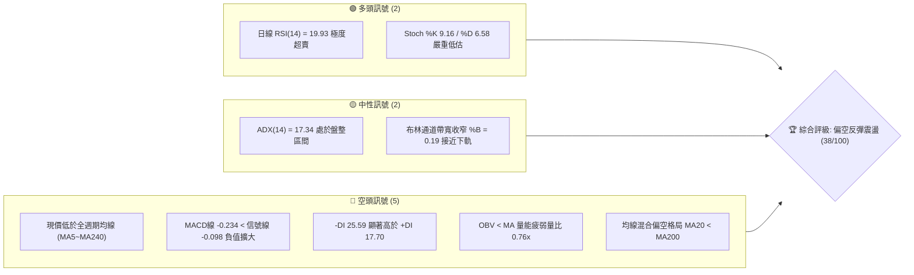
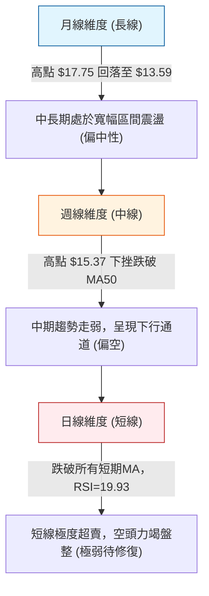
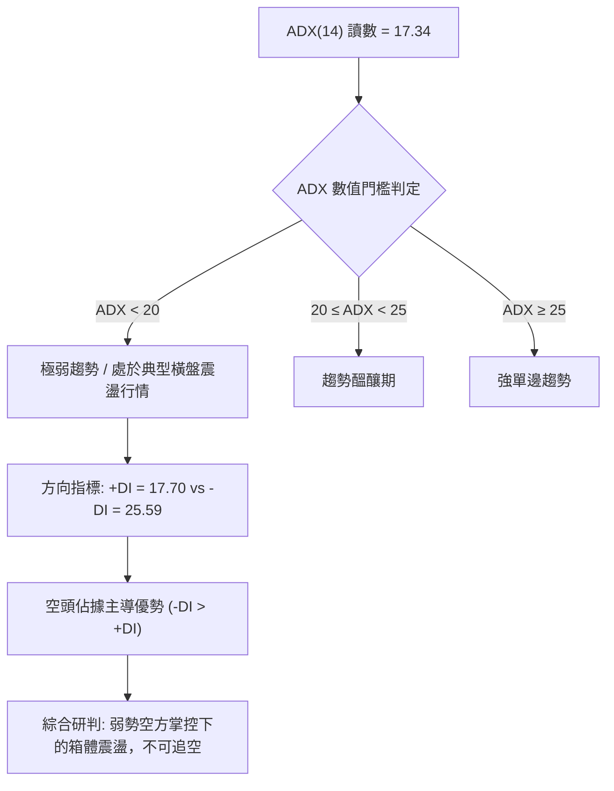
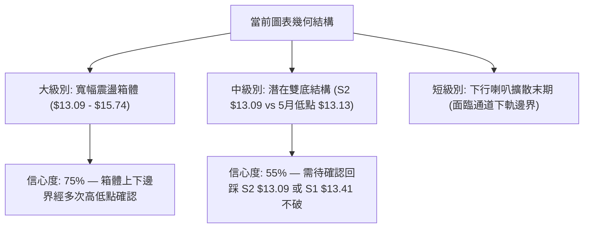
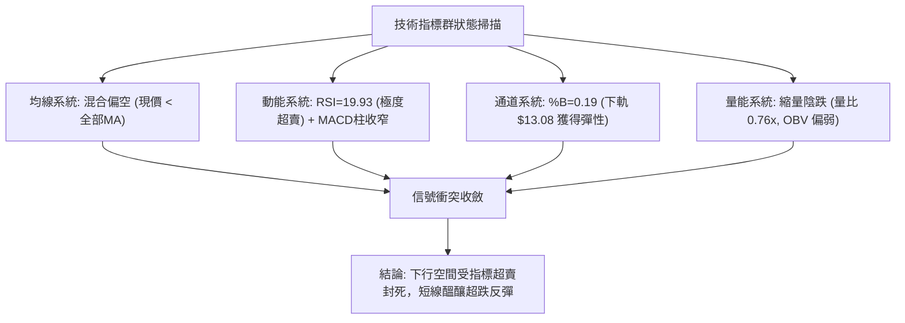
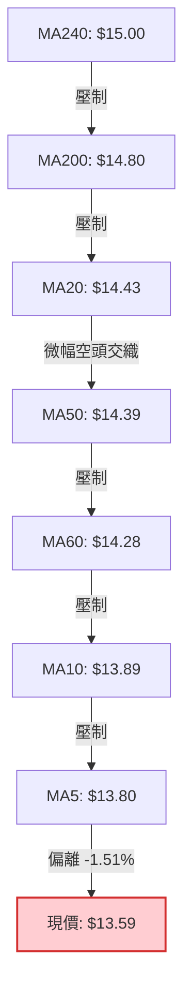
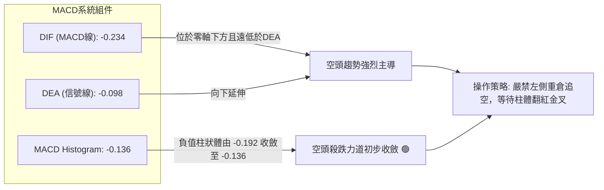
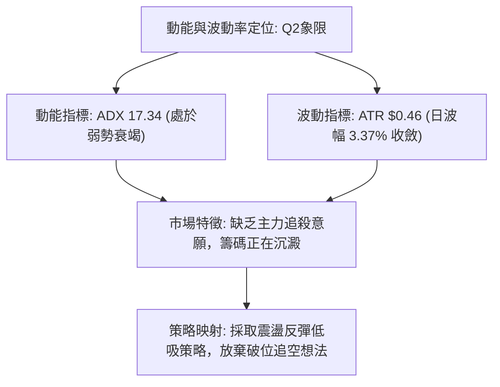
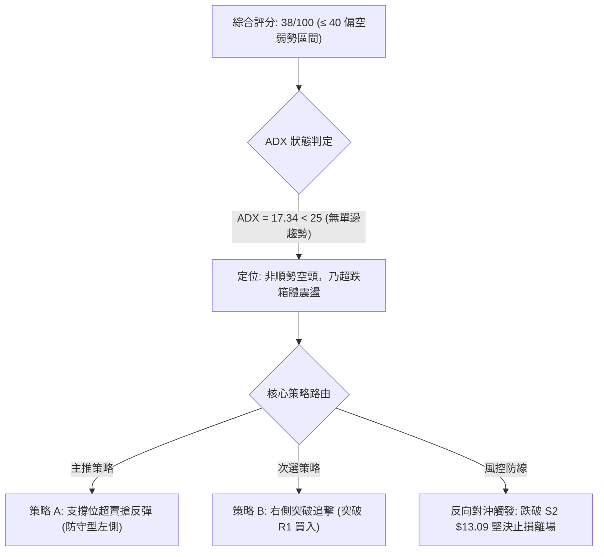
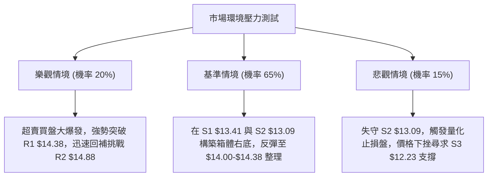

# NU 技術分析報告

> **報告日期**：2026-09-26 ｜ **語言**：繁體中文 ｜ **數據來源**：Yahoo Finance ｜ **當前價格**：$13.59

---

## 目錄

| 章節 | 內容 |
|------|------|
| [1. 技術面概覽](#1-技術面概覽) | 訊號儀表板、核心指標、評分卡 |
| [2. 趨勢分析](#2-趨勢分析) | 多時框趨勢、長中短期走勢、ADX強弱 |
| [3. 圖表形態分析](#3-圖表形態分析) | 形態識別、信心度評估、K線組合 |
| [4. 支撐與阻力](#4-支撐與阻力) | 關鍵價位結構、斐波那契回調位分析 |
| [5. 技術指標深度解讀](#5-技術指標深度解讀) | MA/RSI/MACD/布林/量價配合度 |
| [6. 動能與波動率](#6-動能與波動率) | 動能四象限、ATR風險測算、Beta |
| [7. 多時框架總結](#7-多時框架總結) | 時框矩陣、收斂規則與唯一方向結論 |
| [8. 交易策略建議](#8-交易策略建議) | 策略路由、價格階梯、主策略與對沖點 |
| [9. 風險提示與監控](#9-風險提示與監控) | 監控Checklist、三情境壓力測試 |
| [📋 報告總結](#-報告總結) | 儀表總結與最佳操作指引 |

---

## 1. 技術面概覽

### 🎯 技術訊號儀表板



### 📊 核心指標速覽表

| 指標類別 | 指標名稱 | 當前數值 | 訊號 | 解讀 |
|----------|----------|----------|------|------|
| **價格** | 當前收盤價 | $13.59 | 🔴 | 位於 52W 區間 ($11.20 - $18.98) 之 30.7% 低分位 |
| **均線** | 短期 MA20 | $14.43 | 🔴 | 現價低於 MA20 達 -5.83%，短線下行受壓 |
| **均線** | 中期 MA50 | $14.39 | 🔴 | 現價低於 MA50，中期結構跌破 |
| **均線** | 長期 MA200 | $14.80 | 🔴 | 現價低於 MA200 達 -8.18%，長期均線形成上方沉重壓制 |
| **動能** | RSI(14) | 19.93 | 🟢 | 深度超賣 (<20)，技術面具備極高短線均值回歸修復需求 |
| **動能** | MACD (12,26,9) | -0.234 | 🔴 | MACD線位於信號線(-0.098)下方，柱狀體為-0.136，空頭動能主導 |
| **動能** | 隨機指標 Stoch | %K 9.16 / %D 6.58 | 🟢 | 極度鈍化超賣區，短線殺跌動能接近衰竭邊界 |
| **趨勢** | ADX (14) | 17.34 | 🟡 | 數值低於 25，顯示當前非單邊趨勢，屬於空方主導的無序盤整 |
| **通道** | 布林帶 %B | 0.19 | 🟡 | 逼近下軌 $13.08，短線空間受限於通道下壁 |
| **量能** | 當日成交量 | 52.83M (均量 69.86M) | 🔴 | 量比僅 0.76x，OBV 疲軟，缺乏主動買盤承接 |
| **波動** | ATR (14) | $0.46 | 🟡 | 每日波幅為股價的 3.37%，處於中等收斂波動區間 |

### 🏆 技術評分卡

```
╔══════════════════════════════════════════════════════════════════╗
║                   技術評分卡 — NU (2026-09-26)                   ║
╠══════════════════════════════════════════════════════════════════╣
║ 趨勢強度 (Trend)     ██████░░░░░░░░░░░░░░  30/100 🔴 空方主導弱趨勢║
║ 動能指標 (Momentum)  ████████░░░░░░░░░░░░  42/100 🟡 極超賣醞釀反抽║
║ 支撐穩定度 (Support) ██████████░░░░░░░░░░  50/100 🟡 S1 $13.41考驗中║
║ 成交量配合 (Volume)  ██████░░░░░░░░░░░░░░  32/100 🔴 縮量陰跌無大單║
║ 形態完整度 (Pattern) ████████░░░░░░░░░░░░  40/100 🟡 箱體下緣測試中║
║ 均線系統 (MA System) █████░░░░░░░░░░░░░░░  28/100 🔴 混合空頭排列  ║
╠══════════════════════════════════════════════════════════════════╣
║ 綜合評分             ████████░░░░░░░░░░░░  38/100 🔴 弱勢觀望/防守 ║
╚══════════════════════════════════════════════════════════════════╝
```

---

## 2. 趨勢分析

### 🌐 多時框趨勢分析



### 📈 長期趨勢 — 12個月走勢圖（Unicode）

NU 過去 12 個月（2025-10 至 2026-09）呈現先衝高後回落的寬幅對稱震盪走勢：

```
NU 月線走勢圖（過去12個月：2025-10 至 2026-09）
價格軸 ($)
$18.00 ┤                             ● $17.75 (2026-01)
$17.00 ┤                     ● $17.39        ● $16.74
$16.00 ┤ ● $16.11(2025-10)
$15.00 ┤                                             ● $14.98
$14.00 ┤                                                     ● $14.37  ● $14.48      ● $14.33  ● $14.55
$13.00 ┤                                                                         ● $13.13  ● $13.36        ● $13.59 (現價)
$12.00 ┤
       └─────────────────────────────────────────────────────────────────────────────────────────────
         10月    11月    12月    01月    02月    03月    04月    05月    06月    07月    08月    09月
        [2025]                          [2026]
```

#### 走勢特徵分析表格

| 階段區間 | 時間段 | 價格區間 | 漲跌幅 | 走勢結構與量能特徵 |
|----------|--------|----------|--------|--------------------|
| **波段衝頂期** | 2025-10 至 2026-01 | $16.11 → $17.75 | +10.18% | 資金強勢推升，創下階段新高，逼近 52W 高點 $18.98 |
| **首輪回撤期** | 2026-01 至 2026-03 | $17.75 → $14.37 | -19.04% | 獲利盤快速了結，跌破 $15.00 整數心理關口 |
| **次級破底下探** | 2026-03 至 2026-05 | $14.37 → $13.13 | -8.63% | 下探測試年內次低點，於 $13.09 上方獲得階段性買盤支撐 |
| **夏季箱體反彈** | 2026-05 至 2026-08 | $13.13 → $14.55 | +10.81% | 橫盤區間低位反彈，最高於 2026-09-06 週摸高至 $15.37 |
| **最新回調探底** | 2026-08 至 2026-09 | $14.55 → $13.59 | -6.60% | 連續三週陰跌回落，目前正測試支撐位 S1 $13.41 |

### 📊 中期趨勢（週線分析）

```
NU 近期週線結構分析示意圖
阻力區 R2: $14.88 ─────────────────────────────────────── (波段反彈強阻力)
                     ▲ (09/06 摸高 $15.37 後快速承壓回落)
阻力區 R1: $14.38 ───┼─────────── (週線頸線與 MA20/MA50 匯合壓制)
                     │   ▼
現價水位:  $13.59 ───┼───● (當前正處於回測下軌測試中)
支撐區 S1: $13.41 ───┴─────────── (近一年波段密集低點聚集支撐)
支撐區 S2: $13.09 ─────────────────────────────────────── (布林下軌 $13.08 共同防線)
```

從週線級別來看，2026-07 至 2026-09 初形成了頂點為 $15.37 的局部圓弧頂回落。近三週成交量由 373.98M 收縮至 290.41M，週線 MACD 柱狀體由正轉負（-0.036 → -0.192 → -0.136），說明中期修正尚未結束，但殺跌動能在本週（收盤 $13.59，跌幅收斂）已見鈍化。

### ⚡ 趨勢強度評估（ADX 解讀）



#### ADX 強度對照與量化解讀

| 指標變量 | 具體讀數 | 基準區間 | 狀態評定 | 技術意義 |
|----------|----------|----------|----------|----------|
| **ADX (14)** | **17.34** | < 25.00 | 🟡 弱趨勢/震盪 | 價格缺乏單邊推動力，此時追高或殺跌均面臨極高洗盤風險 |
| **+DI** | **17.70** | 0.0 - 100.0 | 🔴 多頭動能匱乏 | 買盤發動意願低迷，無法維持連續拉升 |
| **-DI** | **25.59** | 0.0 - 100.0 | 🔴 空方力量佔優 | 賣方掌控局部盤面節奏，但 -DI 尚未突破 30，並非強崩跌波 |

---

## 3. 圖表形態分析

### 🔍 形態識別系統

依據當前日線與週線結構，NU 在 $13.09 至 $15.74 之間形成了清晰的矩形震盪箱體，局部則走出自 $15.37 以來的下行通道。



#### 形態信心度與目標價評估表

| 識別形態 | 信心度 | 判斷依據（引用數據） | 完成度 | 頸線位置 | 形態高度與目標價推算 |
|----------|--------|----------------------|--------|----------|----------------------|
| **寬幅矩形箱體** | **75%** | 箱底在 S2 $13.09 與 2026-05 收盤 $13.13 兩次驗證；箱頂在 R3 $15.74 | 85% | R1: $14.38 (中軸) | 形態高度 = $15.74 - $13.09 = $2.65<br>向上破位目標 = $15.74 + $2.65 = **$18.39**<br>向下破位目標 = $13.09 - $2.65 = **$10.44** |
| **潛在雙重底 (W底)** | **52%** | 第一底為 2026-05-31 收盤 $13.13，第二底正測試 S1 $13.41 / S2 $13.09 | 45% | R1: $14.38 | 形態高度 = $14.38 - $13.09 = $1.29<br>突破目標價 = $14.38 + $1.29 = **$15.67** (逼近 R3 $15.74) |
| **均線死叉發散 (指標形態)** | **80%** | MA5 ($13.80) 下穿 MA20 ($14.43)，MA20 下穿 MA50 ($14.39) | 90% | N/A | 短線壓制持續，目標價指向布林下軌 **$13.08** |

*註：由於目前行情處於箱體內部測試，雙底形態尚未突破頸線 $14.38，故信心度設為 52%，僅視為左側潛在底部假說。*

### 🕯️ 重要K線形態分析

| 週別 / 月份 | 收盤價 | K線形態名稱 | 形態細節與量能解讀 | 訊號性質 |
|-------------|--------|-------------|--------------------|----------|
| **2026-08-16 週** | $15.23 | **放量長陽突破** | 當週大漲並放量 381.42M，突破中軌，為夏季反彈主升段 | 🟢 強烈看多 |
| **2026-09-06 週** | $15.37 | **倒錘頭 / 流星線** | 盤中衝高回落，留長上影線，成交量 373.98M，多頭動能遭遇逢高伏擊 | 🔴 頂部受阻 |
| **2026-09-13 週** | $14.62 | **陰線包覆** | 實體下穿前週陽線低點，MACD 柱轉負 (-0.036)，確認波段見頂 | 🔴 確認轉弱 |
| **2026-09-20 週** | $13.65 | **大陰線貫穿** | 跌破 MA20 與 MA50 均線聚集區，空頭集中釋放，成交量放大至 368.14M | 🔴 破位下殺 |
| **2026-09-27 週** | $13.59 | **縮量十字小陰線** | 跌勢顯著收窄，成交量降至 290.42M，RSI 破 20 進超賣，呈現空頭力竭 | 🟡 止跌孕育 |

### 📉 ASCII 走勢形態示意圖

```
                    NU 矩形箱體與波段頂底結構 ($)
$15.74 ─────────────────────────────────────────────── 箱頂強阻力 R3
                  ╭───● $15.37 (09/06 流星頂)
                  │     ╲
$14.88 ───────────┼──────╲──────────────────────────── 波段阻力 R2
                  │       ╲
$14.38 ───────────┼────────●─────── 箱體中軸/頸線阻力 R1 (MA20/50 聚集)
                  │          ╲
$13.59 ───────────┼───────────● 現價 (逼近下軌測試)
$13.41 ───────────┼─────────────┄ 波段支撐 S1
$13.09 ───● $13.13┴───────────────┄ 箱體底界強支撐 S2 (05/31 低點對稱)
         (左底 W1)                (潛在右底 W2 構築區)
```

### 🎯 形態目標價計算

若右底於支撐位 S2 **$13.09** 獲得支撐並展開修復：
1. **反彈第一頸線阻力**：R1 = **$14.38**
   - 漲幅空間 = ($14.38 - $13.59) / $13.59 = **+5.81%**
2. **等高突破目標價**：
   - 形態垂直高度 $H$ = 頸線 ($14.38) - 底部 ($13.09) = **$1.29**
   - 破位量度目標 = 頸線 ($14.38) + $H ($1.29) = **$15.67**（精確對齊阻力位 R3 **$15.74** 區域）

---

## 4. 支撐與阻力

### 🗺️ 關鍵價位分布圖（Unicode）

```
NU 關鍵價位結構分布圖
═══════════════════════════════════════════════════════════════════════════
$18.98 ║████████████████████████████████████████║ 52W 歷史極值高點
$17.14 ║▓▓▓▓▓▓▓▓▓▓▓▓▓▓▓▓▓▓▓▓▓▓▓▓                ║ 斐波那契 23.6% 回調位
$16.01 ║▓▓▓▓▓▓▓▓▓▓▓▓▓▓▓▓▓▓▓▓                    ║ 斐波那契 38.2% 回調位
$15.74 ║████████████████████████████████        ║ 強阻力 R3 (近一年波段高點聚類)
$15.09 ║▓▓▓▓▓▓▓▓▓▓▓▓▓▓▓▓▓▓                      ║ 斐波那契 50.0% / 整數大關
$14.88 ║████████████████████                    ║ 阻力 R2 (MA200 $14.80 聚類區)
$14.38 ║████████████████████████████            ║ 關鍵阻力 R1 (MA20 $14.43 / MA50 $14.39)
═══════╬════════════════════════════════════════╬══════════════════════════
$13.59 ╠════════════════════════════════════════╣ ◄ 當前市價 (市價基準)
═══════╬════════════════════════════════════════╬══════════════════════════
$13.41 ║▓▓▓▓▓▓▓▓▓▓▓▓▓▓▓▓                        ║ 近期支撐 S1 (-1.32%)
$13.09 ║████████████████████████████            ║ 強支撐 S2 (布林下軌 $13.08)
$12.86 ║▓▓▓▓▓▓▓▓▓▓▓▓                            ║ 斐波那契 78.6% 回調位
$12.23 ║████████████████████████████████████    ║ 極限波段強支撐 S3 (-10.01%)
$11.20 ║████████████████████████████████████████║ 52W 歷史極值低點 (100.0%)
═══════════════════════════════════════════════════════════════════════════
```

### 🚧 阻力位分析表

所有阻力數值完全取自關鍵價位與技術指標聚類：

| 阻力級別 | 精確價位 | 距現價空間 | 形成技術依據 | 突破難度評估 | 重要性等級 |
|----------|----------|------------|--------------|--------------|------------|
| **R1 (短期阻力)** | **$14.38** | +5.81% | 近一年波段高點密集區、MA20 ($14.43) 與 MA50 ($14.39) 重合點 | 🟡 中等 (需日線成交量放大至 70M 以上) | ★★★★☆ |
| **R2 (中期阻力)** | **$14.88** | +9.51% | 前期週線多次換手中樞、MA200 ($14.80) 牛熊分界線 | 🔴 較高 (套牢盤集中區，需基本面催化) | ★★★★☆ |
| **R3 (強阻力)** | **$15.74** | +15.84% | 近一年箱體頂部最高阻力聚類、接近布林上軌 ($15.78) | 🔴 極高 (需整體拉美金融板塊形成大共振) | ★★★★★ |

### 🛡️ 支撐位分析表

所有支撐數值完全取自關鍵價位聚類：

| 支撐級別 | 精確價位 | 距現價空間 | 形成技術依據 | 守住機率評估 | 重要性等級 |
|----------|----------|------------|--------------|--------------|------------|
| **S1 (即時支撐)** | **$13.41** | -1.32% | 近一年波段低點聚類第一防線，日線短線止跌測試點 | 🟡 65% (面臨考驗，但 RSI 極度超賣提供護墊) | ★★★☆☆ |
| **S2 (核心支撐)** | **$13.09** | -3.72% | 2026-05 低點聚類、布林下軌 ($13.08) 共振支撐 | 🟢 85% (年內重要結構低點，大資金防守底線) | ★★★★★ |
| **S3 (極端支撐)** | **$12.23** | -10.01% | 2026年6月中旬盤中深幅回踩低點聚類，極強防線 | 🟢 95% (若跌破意味著基本面邏輯遭破壞) | ★★★★★ |

### 📐 斐波那契回調位分析

依據 52 週極值區間（低點 **$11.20** → 高點 **$18.98**，垂直落差 $7.78）計算之標準黃金分割序列：

```
斐波那契結構分佈 ($11.20 至 $18.98)
  0.0% (52W High) ─────────────────────── $18.98
 23.6% ────────────────────────────────── $17.14
 38.2% ────────────────────────────────── $16.01
 50.0% (中位分水嶺) ────────────────────── $15.09
 61.8% (黃金分割位) ────────────────────── $14.17
──────────────── 現價 $13.59 落在此區間 ────────────────
 78.6% (深度回撤位) ────────────────────── $12.86
100.0% (52W Low)  ─────────────────────── $11.20
```

#### 黃金分割位置解讀：
- **當前位置**：現價 **$13.59** 處於 **61.8% ($14.17)** 與 **78.6% ($12.86)** 之間，屬於典型的大週期「深度回撤吸收區」。
- **61.8% 回調位 ($14.17)** 已被跌破，轉化為上方壓制區，與短期阻力位 R1 ($14.38) 形成密集壓制帶。
- 現價距離下方 **78.6% ($12.86)** 尚有 $0.73（-5.37%）之緩衝距離，而支撐位 S2 ($13.09) 正卡在 $13.59 與 $12.86 之間，形成極佳的技術性防禦夾層。

---

## 5. 技術指標深度解讀

### 🎛️ 指標訊號總覽



### 📈 移動平均線排列分析



#### 均線量化狀態表

| 均線名稱 | 當前價格 | 距現價差值 | 乖離率 (%) | 均線斜率與走勢狀態 |
|----------|----------|------------|------------|--------------------|
| **MA 5** | $13.80 | -$0.21 | -1.51% | ▼ 下行加速中，短線空頭先鋒 |
| **MA 10** | $13.89 | -$0.30 | -2.15% | ▼ 穩步下行，對價格構成直接斜向壓制 |
| **MA 20** | $14.43 | -$0.84 | -5.83% | ▼ 由橫盤轉為下彎，為 20 日強弱分水嶺 |
| **MA 50** | $14.39 | -$0.80 | -5.56% | ▼ 與 MA20 形成死叉，中期架構受損 |
| **MA 60** | $14.28 | -$0.69 | -4.83% | ▼ 位於 $14.30 關卡附近，構成中繼壓力 |
| **MA 120** | $13.86 | -$0.27 | -1.93% | ▼ 緩步下移，現價剛好落其下方 |
| **MA 200** | $14.80 | -$1.21 | -8.18% | ▼ 走平微下彎，為中長期牛熊界線 |
| **MA 240** | $15.00 | -$1.41 | -9.43% | ▼ 長期壓制頂部 |

**均線綜合研判**：當前所有均線數值均高於現價（$13.59），呈現典型的短期空頭發散。然而，MA5 與現價產生了 -1.51% 負乖離，MA20 負乖離高達 -5.83%，顯示短線下跌速率過快，技術上存在向 MA10/MA20 回抽靠攏的修復動能。

### 📉 RSI(14) 分析

```
RSI(14) 動能刻度讀數：19.93 (極度超賣)
0            20   30                       70         100
├────────────┼────┼────────────────────────┼──────────┤
│████████    │    │                        │          │
└────────────┴────┴────────────────────────┴──────────┘
 ▲ 當前 19.93 (超賣警戒區)
```

- **數值解析**：當前日線 RSI(14) 讀數為 **19.93**，正式跌穿 20 極端警戒線（通常低於 30 為超賣，低於 20 為罕見的極度鈍化超賣）。
- **背離分析**：
  - 比對近期價格，NU 價格從 09-20 週的 $13.65 跌至當前 $13.59（創波段收盤新低），而週線 RSI 由 41.2 大幅驟降至 19.9。
  - **結論**：指標伴隨價格同步下滑，**目前並無標準的底背離**現象；但日線級別連續兩日於 20 以下鈍化，屬於「超賣型動能衰竭」，通常意味著空頭已進入無量拋售階段，容易觸發報復性反彈。

### 📊 MACD(12,26,9) 訊號解讀



- **數值細節**：MACD線 為 **-0.234**，信號線 為 **-0.098**，兩者均在零軸下方運行，為空頭市場。
- **柱狀體動態**：當前柱狀體讀數為 **-0.136**。值得注意的是，前一週柱狀體為 **-0.192**，柱狀體負值已開始縮短（收窄幅度達 +0.056），這反映出儘管趨勢為空，但下行加速度已顯著減弱，空方動能正在被下方買盤悄然吸收。

### 📦 布林通道分析

```
NU 布林通道位置示意圖 (寬度收窄中)
$15.78 ─────────────────────────────── 上軌 (Upper Band)
                     │
$14.43 ──────────────┼──────────────── 中軌 (MA20)
                     │
$13.59 ──────────────●──────────────── 現價 (%B = 0.19)
$13.08 ─────────────────────────────── 下軌 (Lower Band)
```

- **參數結構**：上軌 **$15.78**，中軌 **$14.43**，下軌 **$13.08**，通道帶寬 (Bandwidth) = ($15.78 - $13.08) / $14.43 = **18.71%**。
- **%B 指標解析**：當前 %B 讀數為 **0.19**（0 代表接觸下軌，0.5 為中軌，1.0 為上軌）。
- **技術含義**：現價落於下軌上方約 $0.51 處，%B 處於 0.20 以下的「極限壓縮區」。布林下軌 $13.08 與技術支撐位 S2 **$13.09** 形成雙重鋼底共振，封死了無序下跌的空間。

### 💹 成交量分析（量價配合度）

```
量價配合矩陣
最新成交量: 52.83M ░░░░░░░░░░░░░░ (量比 0.76x)
20日均量:   69.86M ▓▓▓▓▓▓▓▓▓▓▓▓▓▓▓▓▓▓
50日均量:   74.27M ▓▓▓▓▓▓▓▓▓▓▓▓▓▓▓▓▓▓▓▓
```

- **量比萎縮**：最新單日成交量為 **52,828,400**，僅為 20 日均量（69.86M）的 **76%**（量比 0.76x），顯示在價格下行測試 $13.50 關卡時，市場並未出現恐慌性拋盤割肉潮。
- **OBV 趨勢**：OBV 低於其移動平均線，量能處於弱勢整理期。
- **量價背離判定**：量縮陰跌而非放量崩潰，表示當前下行主要由「買盤退縮」而非「主力堅決出逃」所致；此種量態在遇到強支撐位（S1 $13.41 / S2 $13.09）時，只要少量多頭買盤進場即可觸發大幅度空頭回補反彈。

---

## 6. 動能與波動率

### ⚡ 動能評估四象限

| 象限標記 | 動能維度 | 波動維度 | 技術定義 | NU 當前狀態評定 |
|----------|----------|----------|----------|-----------------|
| **Q1 (機會象限)** | 強動能 (Trend) | 低波動 (Low Vol) | 穩健單邊上揚，最佳跟隨機會 | 否 |
| **Q2 (防守象限)** | 弱動能 (Weak Mom) | 低波動 (Low Vol) | **箱體沉寂期，醞釀變盤突破** | **✓ 正確定位於此象限 (ADX 17.34, ATR 3.37%)** |
| **Q3 (投機象限)** | 強動能 (High Mom) | 高波動 (High Vol) | 暴漲暴跌，高風險追逐 | 否 |
| **Q4 (危險象限)** | 弱動能 (Negative) | 高波動 (High Vol) | 恐慌崩跌發散，嚴禁進場 | 否 |



### 📊 ATR 波動率分析

- **當前數值**：ATR(14) 為 **$0.46**，佔現價之 **3.37%**。
- **波動位階**：NU 在過去歷史波段中，高波動期 ATR 常超過 $0.80（>5%），目前 $0.46 的波動率顯示價格已被擠壓至相對狹窄的日級別空間內。
- **止損與部位管理測算**：
  - **保守止損距離（2.0 × ATR）**：2.0 × $0.46 = **$0.92**
  - **激進止損距離（1.0 × ATR）**：1.0 × $0.46 = **$0.46**
  - **右側進場緩衝安全墊**：建議在任何買入操作中，以關鍵支撐位下方至少 1.0 ATR 作為硬性風控錨點。

### 📐 Beta 與市場相關性

- **Beta 係數**：**0.94**
- **解讀**：NU 的 Beta 極度接近 1.00（系統性基準），顯示其走勢與標普500指數及拉美金融板塊高度同步。目前美股大盤處於高位震盪環境，Beta 0.94 意味著 NU 不具備獨立極端下挫的特異性風險，其股價在回調至低估值與低技術位後，具備跟隨大盤指數回暖而彈升的天然聯動性。

---

## 7. 多時框架總結

### 📋 時框架評分表

| 時框架 | 趨勢方向 | 動能指標狀態 | 均線系統狀態 | 圖表形態特徵 | 綜合評分 | 操作建議 |
|--------|----------|--------------|--------------|--------------|----------|----------|
| **月線級別 (長期)** | 🟡 寬幅箱體 | 中性 (橫盤整理) | MA240 壓制但高於年內低點 | $13.00 - $17.70 大箱體 | 55/100 | 長線價值分批關注 |
| **週線級別 (中期)** | 🔴 震盪回落 | 負值收窄 (柱狀體轉暖) | 跌破 MA20/MA50 區間 | 自 $15.37 下跌三波回調 | 38/100 | 等待回踩確認止跌 |
| **日線級別 (短期)** | 🔴 超跌偏空 | 極度超賣 (RSI=19.93) | 短期空頭排列 (負乖離擴大) | 下行通道逼近下軌支撐 | 35/100 | 嚴禁追空，防守性低吸 |

### 🔲 綜合訊號矩陣

```
┌─────────────────────────────────────────────────────────────┐
│ 多時框訊號一致性矩陣                                       │
├──────────────┬──────────────┬──────────────┬────────────────┤
│ 維度         │ 短期 (日線)  │ 中期 (週線)  │ 長期 (月線)    │
├──────────────┼──────────────┼──────────────┼────────────────┤
│ 趨勢方向     │ 🔴 空頭主導  │ 🔴 震盪回調  │ 🟡 中性整理    │
│ RSI 位階     │ 🟢 極度超賣  │ 🟡 中性偏弱  │ 🟡 中性平穩    │
│ MACD 態勢    │ 🔴 零下收斂  │ 🔴 綠柱縮短  │ 🟢 多頭餘威    │
│ 布林軌道位置 │ 🟢 逼近下軌  │ 🟡 中下軌間  │ 🟡 中軌徘徊    │
│ 資金成交量   │ 🔴 縮量陰跌  │ 🔴 週量遞減  │ 🟢 歷史換手充沛│
└──────────────┴──────────────┴──────────────┴────────────────┘
```

### ⚖️ 多時框收斂結論

依據多時框收斂原則（嚴格要求 14）：
1. **趨勢/盤整判定**：當前日線 ADX(14) 讀數為 **17.34**（遠低於 25 臨界線），確認全盤行情屬於**「典型弱勢無方向盤整行情」**，而非順勢單邊崩跌。
2. **時框優先級映射**：在盤整行情中，**以日線布林通道上下軌（$13.08 至 $15.78）為核心波動區間**；不可套用單邊趨勢突破策略。
3. **最終唯一收斂方向**：**【弱勢震盪探底、嚴禁殺跌追空、逢低博弈超跌反彈】（偏空評分 38/100 下之防守反彈策略）**。

---

## 8. 交易策略建議

### 🗺️ 策略決策流程圖



### 🧭 策略路由（依評分卡分流）

> **當前主策略方向 = 防守型超跌反彈（依評分 38/100，定位於空方衰竭、布林下軌支撐區間操作）**

由於綜合評分低於 40（38/100），大結構屬於空方壓制；但因 ADX 僅 17.34 且 RSI 達到極端超賣（19.93），盲目放空盈虧比極差。故主策略定義為：**在核心支撐區建立防守型反彈多頭，並將空頭轉化為「反轉風險停損線」**。

### 🎯 價格情境階梯（Price Scenarios）

所有引用數據嚴格錨定第 4 章計算之波段聚類價位：

| 觸發條件 | 下一階段目標 | 後續延伸目標 | 情境技術含義 |
|----------|--------------|--------------|--------------|
| **強勢突破 R1 ($14.38)** | 阻力位 R2 ($14.88) | 阻力位 R3 ($15.74) | 突破 MA20/50 壓制，短線全面轉強，雙底構造成立 |
| **站穩現價區間 ($13.50-$13.60)** | 短期均線 MA10 ($13.89) | 阻力位 R1 ($14.38) | 空頭動能衰竭，展開常規技術性均值回歸修復 |
| **有效跌破 S1 ($13.41)** | 強支撐位 S2 ($13.09) | 斐波 78.6% ($12.86) | 弱勢下探加劇，直接考驗布林下軌與箱體底線 |
| **全面失守 S2 ($13.09)** | 極端支撐 S3 ($12.23) | 52W 低點 ($11.20) | 箱體破位崩潰，中長期多頭結構徹底瓦解 |

### 📊 情境機率分佈

```
情境機率分佈圖
繼續下探後觸底反彈 55% ▓▓▓▓▓▓▓▓▓▓▓▓▓▓▓▓▓▓▓▓▓▓▓▓▓▓▓
橫盤無序震盪       30% ▓▓▓▓▓▓▓▓▓▓▓▓▓▓█
向下破位崩跌       15% ▓▓▓▓▓▓█
```

| 情境劃分 | 機率預估 | 主要技術依據 |
|----------|----------|--------------|
| **下探考驗後強勁反彈** | **55%** | RSI 達 19.93 罕見極值，MACD 負柱狀體縮小，S1 $13.41 與 S2 $13.09 提供堅固鋼底保護 |
| **在 $13.40 - $14.20 間震盪**| **30%** | ADX 17.34 弱趨勢主導，成交量縮小至 52.8M，市場追價與砸盤意願均顯著不足 |
| **放量破位下跌 (跌穿 S2)** | **15%** | 除非機構大股東（持股 82.2%）爆發突發流動性踩踏，否則當前量能難以直接砸穿 S2 $13.09 |

### 🟢 主策略詳情

#### 策略 A（主推：S1/S2 區間左側超跌博弈） vs 策略 B（次選：右側放量突破進場）

| 策略要素 | 策略 A (左側低吸超跌反彈) | 策略 B (右側確認突破跟進) |
|----------|---------------------------|---------------------------|
| **進場條件** | 價格回踩 S1 $13.41 不破，或在現價至 S1 間企穩進場 | 日線收盤價帶量突破阻力位 R1 $14.38 (成交量>70M) |
| **精確進場價格** | **$13.45** (現價與 S1 緩衝區) | **$14.40** (突破 R1 後回踩確認) |
| **目標價 T1** | **$14.38** (阻力位 R1，空間 +6.91%) | **$14.88** (阻力位 R2，空間 +3.33%) |
| **目標價 T2** | **$14.88** (阻力位 R2，空間 +10.63%) | **$15.74** (阻力位 R3，空間 +9.31%) |
| **精確止損價格** | **$13.05** (跌破 S2 $13.09 與布林下軌 $13.08) | **$14.15** (跌回 MA20/MA50 匯合點下方) |
| **風控止損幅度** | -$0.40 (-2.97%) | -$0.25 (-1.74%) |
| **風險報酬比 (R:R)**| **2.33 : 1** (以 T1 算) / **3.58 : 1** (以 T2 算) | **1.92 : 1** (以 T1 算) / **5.36 : 1** (以 T2 算) |
| **預估勝率** | 62% | 55% |
| **建議配置倉位** | **10% - 15%** (防守型輕倉) | **15% - 20%** (趨勢確認加倉) |

### 🔴 反向風險觸發點（對沖與止損提示）

若出現以下狀況，宣告主策略徹底失敗，多頭必須無條件平倉止損，或建立空頭對沖：
1. **日線收盤價跌破 $13.08（布林下軌）且擊穿支撐位 S2 $13.09**，伴隨單日成交量放大至 75M 以上。
2. **-DI 突破 35 同時 ADX 上穿 25**，意味著空頭由「盤整陰跌」進化為「單邊順勢暴跌」，下方直指極端支撐 S3 **$12.23**。

### ⭐ 整體訊號強度評星

```
做多訊號強度：★★☆☆☆  (2.5/5星 — 超跌技術反彈，非大級別主升)
做空訊號強度：★★☆☆☆  (2.0/5星 — 空間受下軌與S2封死，盈虧比極差)
整體可信度：  ★★★★☆  (4.0/5星 — 價位結構與斐波那契高強度重合)
```

---

## 9. 風險提示與監控

### ✅ 關鍵監控指標 Checklist

```
╔══════════════════════════════════════════════════════════════════╗
║                   每日交易前關鍵技術指標監控 Checklist          ║
╠══════════════════════════════════════════════════════════════════╣
║ [ ] 1. RSI(14) 是否脫離超賣區回升至 30 以上？ (確認反彈啟動)    ║
║ [ ] 2. 價格是否守穩支撐位 S1 $13.41 與核心防線 S2 $13.09？       ║
║ [ ] 3. 日線成交量是否超過 20 日均量 69.86M？ (確認主動買盤回歸)  ║
║ [ ] 4. MACD 柱狀體負值是否持續收斂至 -0.05 以內？               ║
║ [ ] 5. ADX 讀數是否維持在 25 以下？ (確認市場未形成順勢暴跌)     ║
║ [ ] 6. 盤中高點是否能觸及並挑戰短期壓制 MA5 $13.80？            ║
╚══════════════════════════════════════════════════════════════════╝
```

### ⚠️ 風險場景分析



### 🛡️ 風險管理重要提醒

1. **嚴格禁止逆勢重倉**：儘管 RSI 處於 19.93 的極度超賣區，但在全週期均線空頭排列未完全修復前，絕不可採用大部位左側「賭底」；單筆反彈策略風險敞口應限制在總資金的 1.5% 以內。
2. **提防「陰跌鈍化」陷阱**：弱勢行情中，RSI 可能在 20 以下維持數個交易日，切忌在價格出現明確的日線級別「止跌K線（如長下影或吞噬線）」前貿然市價衝入。
3. **執行硬性停損**：任何進場訂單均須預設條件止損單，將停損價鎖定在 **$13.05**（S2 $13.09 破位點）。

---

## 📋 報告總結

```
NU 技術分析報告總結
══════════════════════════════════════════════════════════════════
報告日期：2026-09-26
當前價格：$13.59
分析評級：⚖️ 偏空中性反彈（評分：38/100）

關鍵結論：
├─ 長期趨勢：🟡 寬幅箱體震盪 ($13.09 - $17.75)
├─ 中期趨勢：🔴 自 $15.37 下行通道回踩，正測試箱底
├─ 短期趨勢：🟢 日線 RSI=19.93 極度超賣，跌勢鈍化醞釀反抽
├─ 關鍵支撐：S1: $13.41 │ S2: $13.09 (核心防線) │ S3: $12.23
├─ 關鍵阻力：R1: $14.38 (頸線/MA20) │ R2: $14.88 │ R3: $15.74
└─ 華爾街共識：買入 (Buy, 22位分析師, 平均目標價 $18.69)

最優策略組合：
1. 🥇 最佳機會：在現價 $13.59 至 $13.45 區間分批建立防守多頭，
               止損嚴設 $13.05，第一目標直指 R1 $14.38。
2. 🥈 次選機會：耐心等待價格放量突破 R1 $14.38 後，順勢跟進博弈 R2 $14.88。
3. 🥉 保守選擇：場外空倉觀望，等待日線 MACD 零下金叉或站穩 MA20 再行決策。
══════════════════════════════════════════════════════════════════
```

---

> ⚠️ **免責聲明**：本報告為技術分析研究，所有價位依據純量化 OHLCV 計算模型得出。本報告**僅供研究與學術參考**，**不構成任何形式的要約或投資建議**。市場具有高度不確定性，交易者應獨立評估風險並自負盈虧。

---

*報告生成時間：2026-09-26 ｜ 數據來源：Yahoo Finance ｜ 分析框架：多時框技術量化體系*