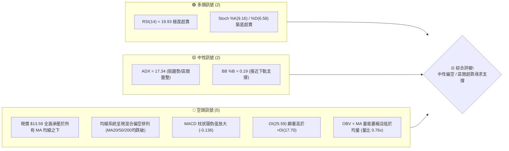
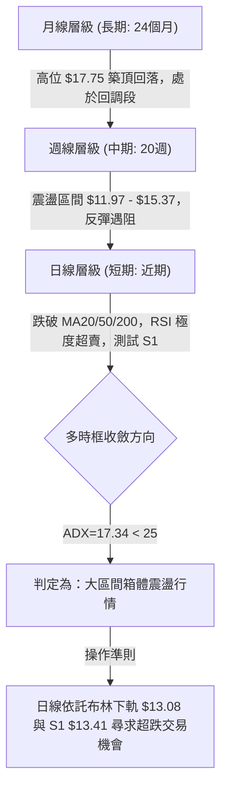
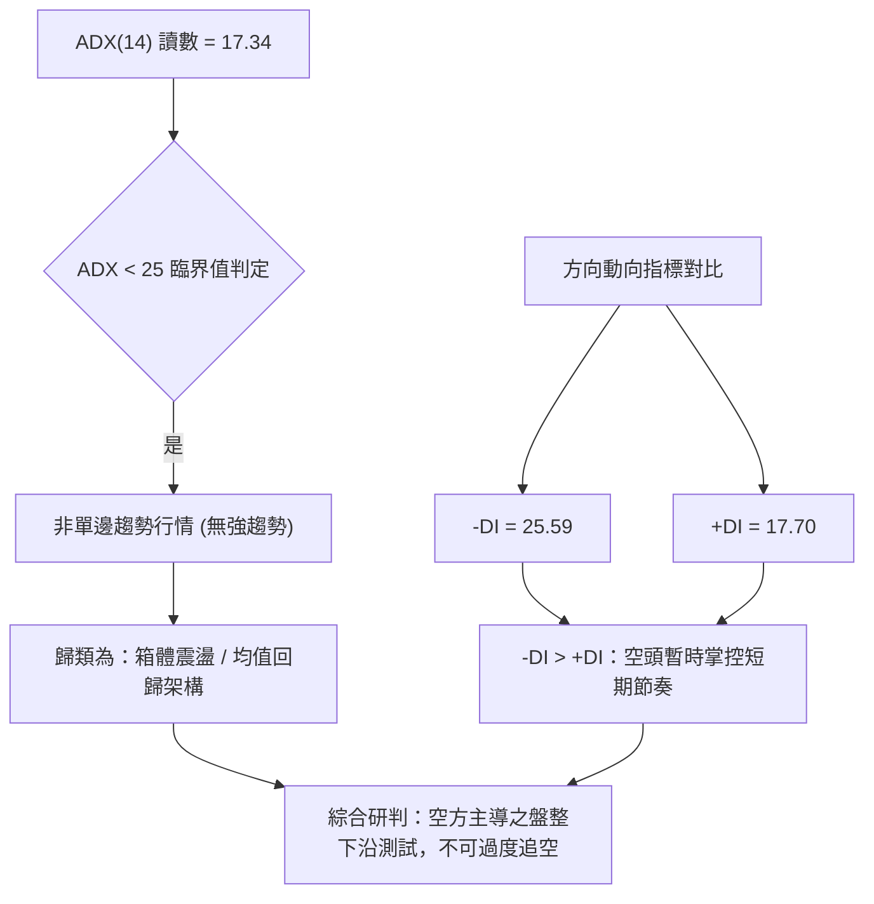
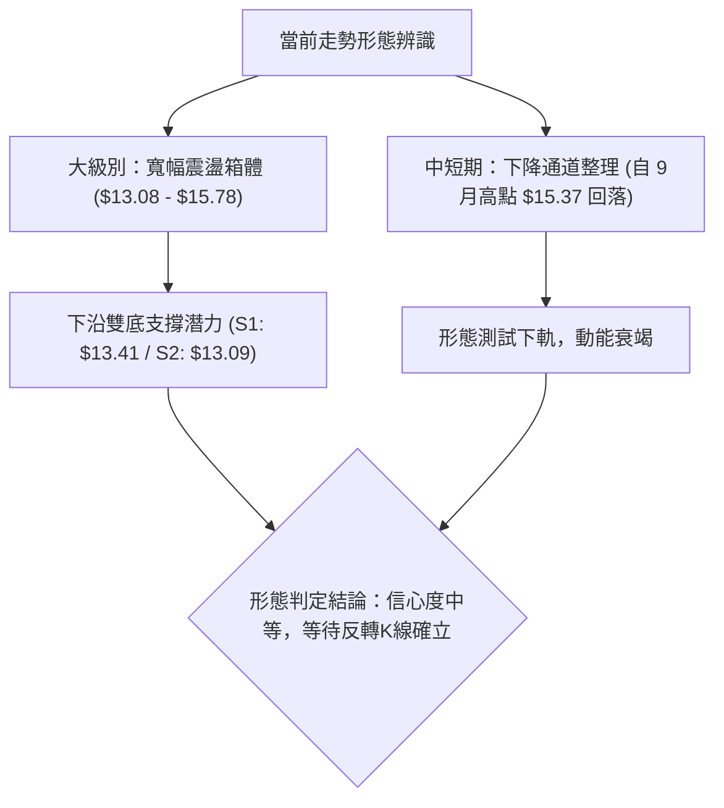
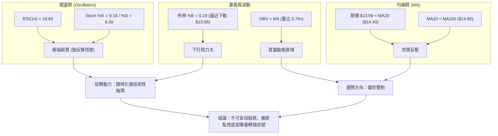
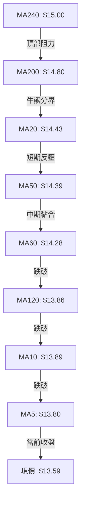
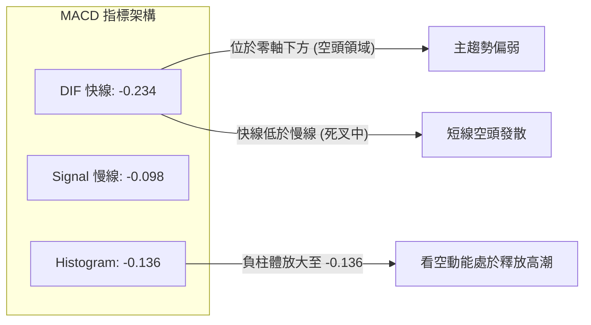
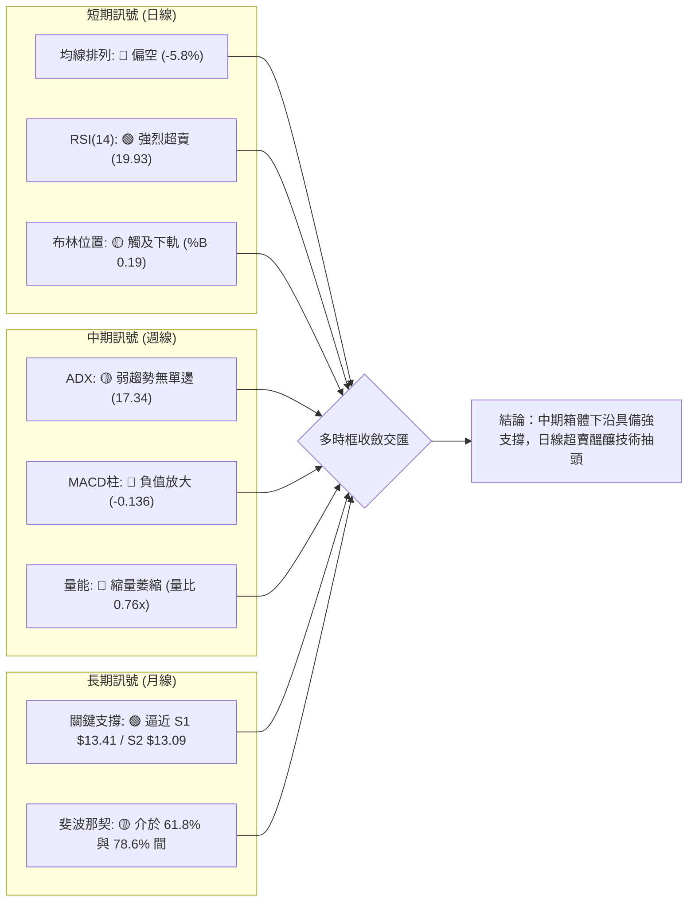
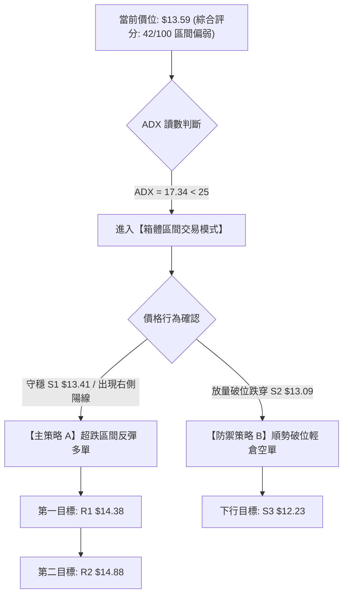
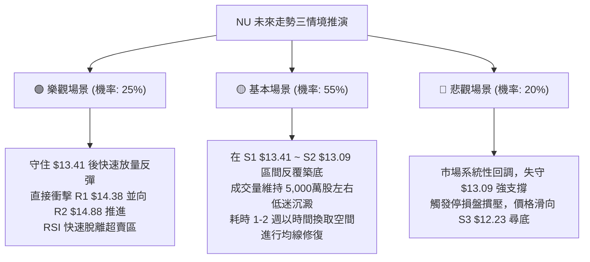

# NU 技術分析報告

> **報告日期**：2026-09-28 ｜ **語言**：繁體中文 ｜ **數據來源**：Yahoo Finance ｜ **當前價格**：$13.59

---

## 目錄

| 章節 | 內容 |
|------|------|
| [1. 技術面概覽](#1-技術面概覽) | 訊號儀表板、核心指標、評分卡 |
| [2. 趨勢分析](#2-趨勢分析) | 多時框趨勢、長中短期走勢 |
| [3. 圖表形態分析](#3-圖表形態分析) | 形態識別、K線組合、目標價 |
| [4. 支撐與阻力](#4-支撐與阻力) | 關鍵價位、斐波那契回調 |
| [5. 技術指標深度解讀](#5-技術指標深度解讀) | MA/RSI/MACD/布林/成交量 |
| [6. 動能與波動率](#6-動能與波動率) | 動能評估、ATR、Beta |
| [7. 多時框架總結](#7-多時框架總結) | 時框架評分矩陣、收斂結論 |
| [8. 交易策略建議](#8-交易策略建議) | 多空策略、風險報酬比 |
| [9. 風險提示與監控](#9-風險提示與監控) | 監控指標、風險場景 |

---

## 1. 技術面概覽

### 🎯 技術訊號儀表板



---

### 📊 核心指標速覽表

| 指標類別 | 指標名稱 | 當前數值 | 訊號 | 解讀 |
|----------|----------|----------|------|------|
| **價格** | 當前價格 | $13.59 | 🔴 | 位於 52 週區間 30.7%，短線持續回調 |
| **均線** | MA20 | $14.43 | 🔴 | 價格在 MA20 下方 -5.83%，短線空頭掌控 |
| **均線** | MA50 | $14.39 | 🔴 | 價格在 MA50 下方，中期承壓明顯 |
| **均線** | MA200 | $14.80 | 🔴 | 跌破牛熊分界線 MA200，長期趨勢轉弱 |
| **動能** | RSI(14) | 19.93 | 🟢 | 極度超賣（<20），存在強烈技術性反彈修復需求 |
| **動能** | MACD (12,26,9) | -0.234 | 🔴 | 雙線位於零軸下，柱狀體 -0.136 延續看空動能 |
| **動能** | Stoch %K / %D | 9.16 / 6.58 | 🟢 | 深度超賣區鈍化，等待黃金交叉形成 |
| **趨勢強度**| ADX (14) | 17.34 | 🟡 | 數值低於 25，屬於弱趨勢/箱體盤整結構 |
| **通道** | 布林通道下軌 | $13.08 | 🟡 | 現價 $13.59 接近下軌，%B=0.19 顯示下行空間受限 |
| **成交量**| 最新量 / 20日均量 | 52.83M / 69.86M | 🔴 | 量比 0.76x，OBV < MA 反映買盤承接力道薄弱 |
| **波動** | ATR(14) | $0.46 | 🟡 | 每日平均波幅 3.37%，處於正常波動水平 |

---

### 🏆 技術評分卡

```
╔══════════════════════════════════════════════════════════════╗
║              技術評分卡 — NU (2026-09-28)                    ║
╠══════════════════════════════════════════════════════════════╣
║ 趨勢強度 (ADX)     ███████░░░░░░░░░░░░░  35/100 🔴 空頭主導  ║
║ 動能指標 (RSI/MACD)████████░░░░░░░░░░░░  40/100 🟡 超賣反彈  ║
║ 支撐穩定度 (S1/S2) ████████████░░░░░░░░  60/100 🟢 支撐接近  ║
║ 成交量配合 (OBV)   ███████░░░░░░░░░░░░░  35/100 🔴 量能疲弱  ║
║ 形態完整度         ██████████░░░░░░░░░░  50/100 🟡 區間下緣  ║
║ 均線系統排列       ██████░░░░░░░░░░░░░░  30/100 🔴 全線失守  ║
╠══════════════════════════════════════════════════════════════╣
║ 綜合技術評分       ████████░░░░░░░░░░░░  42/100 ⚖️ 中性偏空  ║
║ 策略導向           盤整區間下軌尋求支撐，等待超跌背離確認    ║
╚══════════════════════════════════════════════════════════════╝
```

---

## 2. 趨勢分析

### 🌐 多時框趨勢分析



---

### 📈 長期趨勢 — 12個月走勢圖（Unicode）

NU 過去 12 個月收盤走勢（2025-10 至 2026-09）：

```
NU 月線收盤走勢圖（過去12個月：2025-10 至 2026-09）
價格軸 ($)
$17.75 ┤                               ● (2026-01 高點)
$17.39 ┤                     ●
$16.74 ┤                         ●
$16.11 ┤ ● (2025-10)
$14.98 ┤                             ●
$14.55 ┤                                                 ●
$14.37 ┤                                 ●   ●               ●
$13.59 ┤─────────────────────────────────────────────────┼─● (現價)
$13.13 ┤                                         ●   ●
       └─┬───────┬───────┬───────┬───────┬───────┬───────┬───────┬─
       25-10   25-11   25-12   26-01   26-02   26-04   26-06   26-08 26-09
```

#### 走勢特徵分析表格

| 階段 | 時間區間 | 起始價 → 結束價 | 漲跌幅 | 結構特徵與量價解讀 |
|------|----------|-----------------|--------|--------------------|
| 1. 主升浪推進 | 2025-10 ~ 2026-01 | $16.11 → $17.75 | +10.18% | 創下波段歷史高點，均線多頭發散，動能達到頂峰 |
| 2. 獲利回吐修正 | 2026-01 ~ 2026-03 | $17.75 → $14.37 | -19.04% | 連續長陰回落，跌破短期均線，確立波段頂部 |
| 3. 低位區間築底 | 2026-04 ~ 2026-06 | $14.48 → $13.36 | -7.73% | 於 $11.97 - $13.13 間反覆尋底，形成築底平台 |
| 4. 弱勢反彈受挫 | 2026-07 ~ 2026-08 | $14.33 → $14.55 | +1.54% | 觸及 50% 斐波那契回調位 $15.09 失敗，高點停滯於 $15.37 |
| 5. 二次探底走勢 | 2026-08 ~ 2026-09 | $14.55 → $13.59 | -6.60% | 跌破多條短期均線，再度向箱體下邊緣尋求支撐 |

---

### 📊 中期趨勢（週線分析）

從近 20 週的收盤軌跡分析，NU 正處於寬幅箱體整理中的下行折返階段：
- **波段高點壓制**：2026-09-06 週線衝高至 $15.37，受阻於阻力區 R3（$15.74）與布林上軌（$15.78），隨後出現週線三連陰。
- **週線動能背離與轉弱**：MACD 柱狀體由 2026-09-06 的 `+0.064` 急劇翻負至 2026-09-27 的 `-0.136`；週 RSI 從 56.6 直線墜入 19.93，表明空頭下砸速度極快，但也已進入極端超賣區域。
- **量價萎縮驗證**：週成交量從 2026-07-19 的高達 7.62 億股逐步萎縮至最新一週的 2.90 億股，說明下跌並非恐慌性主動出逃，而是缺乏買盤支撐的失血陰跌。

```
近期週線支撐阻力結構示意圖
$15.74 ───────┬─────────────────────────────── [強阻力 R3 / 前期波段高點聚類]
              │     ▲ (2026-09-06 遇阻高點 $15.37)
$14.88 ───────┼─────┼───────────────────────── [阻力 R2 / MA200 牛熊線 $14.80]
              │     │
$14.38 ───────┼─────┴───────▲───────────────── [關鍵阻力 R1 / MA20: $14.43]
              │             │
$13.59 ───────┼─────────────┼─────────● 現價
              │             ▼
$13.41 ───────┼─────────────────────────────── [近期波段支撐 S1]
$13.09 ───────┴─────────────────────────────── [強支撐 S2 / 布林下軌 $13.08]
```

---

### ⚡ 趨勢強度評估（ADX 解讀）



#### ADX 趨勢強度分級對照表

| ADX 區間 | 市場狀態 | 當前狀態確認 | 策略適應性指導 |
|----------|----------|:------------:|----------------|
| **0 ~ 20** | **極弱趨勢 / 無方向盤整** | **✓ (當前 17.34)** | **切忌採用趨勢追突破策略，以區間高拋低吸、超賣反彈為主** |
| 20 ~ 25 | 趨勢孕育 / 弱勢整理 | - | 等待突破方向確立 |
| 25 ~ 40 | 強趨勢運作中 | - | 順勢交易，均線跟蹤 |
| 40 以上 | 極強單邊 / 動能過熱 | - | 留意趨勢衰竭反轉 |

---

## 3. 圖表形態分析

### 🔍 形態識別系統



#### 形態識別與信心度評估表

| 形態類別 | 信心度 | 判斷依據（引用技術數據） | 完成度 | 目標價（附計算式） |
|----------|:------:|--------------------------|:------:|--------------------|
| **大箱體震盪** | **75%** | 上沿聚類於 R3 $15.74 / 布林上軌 $15.78，下沿聚類於 S2 $13.09 / 布林下軌 $13.08。ADX 17.34 強化箱體成立度。 | **85%** | 箱體上軌目標：**$15.74**（取自阻力位 R3） |
| **雙重底潛力 (W底)** | **55%** | 第一隻腳為 2026-05-17 的 $12.19~$13.09 區間，當前於 S1 $13.41 / S2 $13.09 構築第二隻腳。 | **45%** | 頸線 R1 $14.38 突破後，形態高度 = $14.38 - $13.09 = $1.29；推算目標價 = $14.38 + $1.29 = **$15.67**（接近 R3 $15.74） |
| **頭肩底形態** | **<30%** | **數據不足，左肩與頭部結構不對稱，僅做指標型箱體解讀，不強行套用。** | 0% | 無法計算 |

---

### 🕯️ 重要K線形態分析（近期月線與週線）

| 時間週期 | 收盤價 | K線形態 | 量價關係與解讀 | 訊號 |
|----------|--------|---------|----------------|:----:|
| **2026-07 月線** | $14.33 | 中陽線突破底部 | 陽線實體向上穿越多條短期均線，構築反彈基底 | 🟢 |
| **2026-08 月線** | $14.55 | 長上影紡錘線 | 盤中一度上探高位但遭空頭打壓，顯示上方阻力沉重 | 🟡 |
| **2026-09-06 週線**| $15.37 | 流星線 (Shooting Star) | 週成交量放大至 3.73 億股，衝高遇阻於 R2/R3，波段見頂 | 🔴 |
| **2026-09-20 週線**| $13.65 | 大陰線破位 | 週成交量 3.68 億股，跌破 MA20 ($14.43)，空方宣洩 | 🔴 |
| **2026-09-27 週線**| $13.59 | 縮量十字星 / 探底小陰 | 成交量急劇萎縮至 2.90 億股，下跌動能衰竭，測試 S1 支撐 | 🟡 |

---

### 📉 ASCII 走勢形態示意圖

```
NU 下降收斂與箱體底部測試形態
$15.74 ┤            ╭───● (2026-09-06 波段高點 $15.37)
       │           ╭╯     ╲
$14.88 ┤          ╭╯        ╲   (阻力 R2 / MA200: $14.80)
       │         ╭╯           ╲
$14.38 ┤  ╭─────╭╯              ╲─── (阻力 R1 / MA20: $14.43 頸線位)
       │  │     │                   ╲
$13.59 ┤──┼─────┼────────────────────● (現價 $13.59：測試 S1 支撐)
       │  │     │                     ╲  [潛在雙底支撐區間]
$13.09 ┴──●─────┴──────────────────────▼───────────────────── (強支撐 S2 / 布林下軌)
       2026-06                      2026-09
```

---

### 🎯 形態目標價計算

若以當前箱體下軌 $13.09（S2）至短期頸線 $14.38（R1）之反彈形態推算：
1. **箱體高度 (H)** = 阻力位 R1 ($14.38) - 支撐位 S2 ($13.09) = **$1.29**
2. **第一階段目標價 (T1)**：反彈測試頸線阻力位 **R1: $14.38**（距離現價 +5.81%）
3. **第二階段突破目標價 (T2)**：由頸線向上等幅推算 = $14.38 + $1.29 = **$15.67**（精確對接關鍵阻力位 R3: $15.74）

---

## 4. 支撐與阻力

### 🗺️ 關鍵價位分布圖（Unicode）

```
NU 價位結構分布圖（嚴格依據 OHLCV 聚類計算數據）
══════════════════════════════════════════════════════════════════
$15.74 ║██████████████████████████████║ 強阻力 R3 (+15.84% / 箱體上沿)
$15.09 ║░░░░░░░░░░░░░░░░░░░░░░░░░░░░░░║ 斐波那契 50.0% 回調位
$14.88 ║████████████████████          ║ 關鍵阻力 R2 (+9.51% / MA200共振)
$14.38 ║██████████████████████████    ║ 近期阻力 R1 (+5.81% / MA20共振)
$14.17 ║░░░░░░░░░░░░░░░░░░░░░░░░░░░░░░║ 斐波那契 61.8% 回調位
$13.59 ╠══════════════════════════════╣ ◄ 現價 $13.59 (距 S1 僅 1.32%)
$13.41 ║▓▓▓▓▓▓▓▓▓▓▓▓▓▓▓▓▓▓            ║ 近期支撐 S1 (-1.32% / 波段低點)
$13.09 ║██████████████████████████████║ 強支撐 S2 (-3.72% / 布林下軌)
$12.86 ║░░░░░░░░░░░░░░░░░░░░░░░░░░░░░░║ 斐波那契 78.6% 回調位
$12.23 ║████████████████████████      ║ 深層支撐 S3 (-10.01% / 52W次低點)
══════════════════════════════════════════════════════════════════
```

---

### 🚧 阻力位分析表

所有阻力位嚴格引用技術數據聚類算得數值：

| 阻力級別 | 精確價位 | 距離現價 | 技術面形成原因與共振特徵 | 突破難度 | 重要性 |
|:--------:|:--------:|:--------:|--------------------------|:--------:|:------:|
| **R1** | **$14.38** | +5.81% | 近一年波段高點聚類；與 MA20 ($14.43)、MA50 ($14.39) 形成緊密均線密集反壓帶 | 中等 | 🟢 短線生命線 |
| **R2** | **$14.88** | +9.51% | 前期週線多次換手密集成交區；與 MA200 牛熊分界線 ($14.80) 產生重度共振 | 高 | 🟡 中期趨勢線 |
| **R3** | **$15.74** | +15.84% | 近一年頂部波段高點聚類；與布林通道上軌 ($15.78) 完全重合，為大箱體頂部 | 極高 | 🔴 強阻力天花板 |

---

### 🛡️ 支撐位分析表

所有支撐位嚴格引用技術數據聚類算得數值：

| 支撐級別 | 精確價位 | 距離現價 | 技術面形成原因與防守依據 | 守住機率 | 重要性 |
|:--------:|:--------:|:--------:|--------------------------|:--------:|:------:|
| **S1** | **$13.41** | -1.32% | 近一年波段低點聚類；當前下行首道緩衝墊，週線收盤關鍵防線 | 65% | 🟢 短線多頭底線 |
| **S2** | **$13.09** | -3.72% | 強支撐聚類點；與布林通道下軌 ($13.08) 及 2026-05 月線低點密集區重疊 | 80% | 🟡 箱體黃金防線 |
| **S3** | **$12.23** | -10.01% | 極端極限支撐；近一年多頭最後防守底倉（對應 2026-06-14 週線回踩低點） | 95% | 🔴 長期趨勢底線 |

---

### 📐 斐波那契回調位分析

依據 52 週波段區間：低點 **$11.20** → 高點 **$18.98**（波幅 $7.78），黃金分割計算如下：

```
斐波那契回調位與現價位置
0.0%  (52W High)  ─── $18.98
23.6%             ─── $17.14
38.2%             ─── $16.01
50.0%             ─── $15.09
61.8% (黃金分割)  ─── $14.17 ──┐
                               ├── 現價 $13.59 落於此區間（深層折價）
78.6%             ─── $12.86 ──┘
100.0%(52W Low)   ─── $11.20
```

- **回調區間解讀**：現價 **$13.59** 目前處於 **61.8%（$14.17）** 與 **78.6%（$12.86）** 之間。
- **技術意義**：跌破 61.8%（$14.17）顯示前期漲勢已被大幅削弱，進入深層回調；但尚未跌破 78.6%（$12.86），表明 52 週整體上升波段結構尚未徹底瓦解。$12.86 ~ $13.09 區域構成了多頭防守的最關鍵防禦縱深。

---

## 5. 技術指標深度解讀

### 🎛️ 指標訊號總覽



---

### 📈 移動平均線排列分析



#### 均線數據深度解讀表

| 均線名稱 | 當前價格 | 距現價幅差 | 走勢特徵 (Sparkline 解讀) | 空頭壓制級別 |
|:--------:|:--------:|:----------:|---------------------------|:------------:|
| **MA 5** | $13.80 | -1.51% | 短線加速下墜，斜率陡峭向下 | 🔴 第一道反壓 |
| **MA 10** | $13.89 | -2.15% | 下彎壓制，空頭排列初現 | 🔴 第二道反壓 |
| **MA 20** | $14.43 | -5.83% | 與布林中軌完全重疊，為反彈核心目標 R1 | 🔴 強反壓位 |
| **MA 50** | $14.39 | -4.83% | 與 MA20 形成死叉糾結，中期阻力集中 | 🔴 密集阻力區 |
| **MA 60** | $14.28 | -4.83% | 位於高位平緩下行 | 🔴 中期反壓 |
| **MA 120** | $13.86 | -1.93% | 長期均線走平，現價跌破引發均線引力 | 🟡 引力吸引位 |
| **MA 200** | $14.80 | -9.43% | 年線牛熊分水嶺，跌破確認進入防守週期 | 🔴 牛熊警戒線 |
| **MA 240** | $15.00 | -9.43% | 長期持倉成本中樞 | 🔴 終極強壓 |

- **結論**：NU 均線呈現空頭混合排列，現價 $13.59 低於所有長短期均線。但注意 MA5、MA10、MA120 差距極小（$13.80 ~ $13.89），一旦價格突破 $13.90，短線均線將快速形成向上金叉聚攏修復。

---

### 📉 RSI(14) 分析

```
RSI(14) 當前水平進度條：
0 ────── 超賣(30) ────────────── 中軸(50) ────────────── 超買(70) ────── 100
[█████████░░░░░░░░░░░░░░░░░░░░░░░░░░░░░░░░░░░░░░░░░░░░░░░░░░░░░░░░░░░░] 19.93
```

- **超賣狀態評估**：當前 RSI(14) 數值為 **19.93**，已經跌破 20 的極度超賣警戒線。從歷史週線來看，2026-05-17 當 RSI 達到 20.8 時，隨後三週股價自 $12.19 展開強烈反彈至 $13.13（+7.7%）。
- **背離檢查**：
  - 日線 RSI：目前伴隨價格破位而同步走低，**「無明顯背離」**。
  - 週線 RSI：價格自 2026-09-06 高點回落，RSI 從 56.6 直線砸至 19.9，屬於指標快速釋放負面動能，尚未形成底部頂背離或底背離。
  - **結論**：指標單純呈現超跌鈍化，超賣不代表立即V型反轉，但在 ADX 低於 25 的盤整市中，RSI 低於 20 往往意味著下跌動能已達尾聲，隨時具備 1~2 週的修復性反抽機會。

---

### 📊 MACD(12/26/9) 訊號解讀



- **數值分析**：MACD 線為 **-0.234**，訊號線為 **-0.098**，柱狀體為 **-0.136**。
- **動能解讀**：雙線在零軸下方運行，柱狀體負值進一步放大，印證過去 3 週的空方壓制有效。然而，柱狀體已來到 -0.136 的相對低位，若未來數日成交量回溫帶動柱狀體收斂（縮短），將形成短線第一買點提示。

---

### 📦 布林通道分析 (Bollinger Bands)

```
NU 布林通道位置示意圖 (現價 $13.59)
$15.78 ┬────────────────────────────────────────── BB 上軌 (阻力 R3 區)
       │
$14.43 ┼────────────────────────────────────────── BB 中軌 (MA20 / 阻力 R1)
       │                 
$13.59 ┼─────────────────────● 現價 $13.59 (%B = 0.19)
       │
$13.08 ┴────────────────────────────────────────── BB 下軌 (強支撐 S2 區)
```

- **通道帶寬與參數**：上軌 **$15.78**，中軌 **$14.43**，下軌 **$13.08**。
- **%B 指標解讀**：%B = (13.59 - 13.08) / (15.78 - 13.08) = 0.51 / 2.70 = **0.19**。
- **位置含義**：%B 處於 0.20 以下，表明當前價格已嚴重貼近下軌，技術上進入「通道下軌支撐帶」。在 ADX 為 17.34 的弱趨勢市態下，布林通道下軌具備極高的回彈概率，下行邊界在 $13.08 附近將受到強烈多頭防禦。

---

### 💹 成交量分析（量價配合度）

```
成交量指標進度條（最新成交量 vs 20日均量）：
0 ──────────────── 50M ─────────────── 69.86M (均量) ───────────── 100M
[██████████████████████████░░░░░░░░░░░░░░░░░░░░░░░░░░░░░░░░░░░░░░] 52.83M (量比 0.76x)
```

- **成交量對比**：最新單日成交量為 **52,828,400** 股，相較於 20 日均量 **69,861,290** 股，量比僅為 **0.76x**；相較於 50 日均量 **74,266,630** 股更顯低迷。
- **OBV 能量潮解讀**：數據顯示「OBV < MA → 量能疲弱」，表明在股價跌破均線過程中，資金並未大舉抄底介入，整體屬於存量資金博弈下的縮量陰跌。
- **量價背離分析**：目前量縮價跌符合弱勢回調特徵，並未出現恐慌性放量拋售（Capitulation Volume），這意味著市場拋壓正在逐步減輕，但多頭反攻需要至少突破 20 日均量（70M 股以上）的陽線來確認反轉。

---

## 6. 動能與波動率

### ⚡ 動能評估四象限

```
動能與波動率定位矩陣：
┌───────────────────────────┬───────────────────────────┐
│ Q3: 強動能 × 高波動       │ Q1: 強動能 × 低波動       │
│ (強勢單邊突破，高風險溢價) │ (多頭最佳進場機會)        │
├───────────────────────────┼───────────────────────────┤
│ Q4: 弱動能 × 高波動       │ Q2: 弱動能 × 低波動       │
│ (震盪洗盤，避免追高)      │ ★ NU 當前位置 (謹慎觀望/超跌布局)
└───────────────────────────┴───────────────────────────┘
```

#### 四象限評估細部對照表

| 象限 | 動能狀態 | 波動率狀態 | 當前符合度 | 特徵解讀與交易指引 |
|:----:|:--------:|:----------:|:----------:|-------------------|
| Q1 | 強 (RSI>60) | 低 (ATR<2.5%) | ❌ | 穩定主升段，本標的目前不符合 |
| **Q2** | **弱 (RSI<30)** | **中低 (ATR 3.37%)** | **✓ (高度吻合)** | **空頭釋放末端，市場交投平淡，適合在關鍵支撐位進行低吸定投或區間套利** |
| Q3 | 強 (RSI>70) | 高 (ATR>4.5%) | ❌ | 頂部過熱，非當前型態 |
| Q4 | 弱 (RSI<40) | 高 (ATR>5.0%) | ❌ | 恐慌崩跌段，當前量能萎縮不屬此類 |

---

### 📊 ATR 波動率分析

- **ATR(14) 數值**：**$0.46**，佔當前股價比例為 **3.37%**。
- **波動意義**：NU 每日正常隨機波動區間約為 ±$0.46。這意味著：
  - 正常的日內價格雜訊為 $13.59 ± $0.46（即 $13.13 ~ $14.05）。
  - **風控止損空間設定**：
    - 激進型保護性止損（1.0 × ATR）：$13.59 - $0.46 = **$13.13**。
    - 穩健型波段止損（1.5 × ATR）：$13.59 - (1.5 × $0.46 = $0.69) = **$12.90**（剛好包覆強支撐 S2: $13.09）。

---

### 📐 Beta 與市場相關性

- **Beta 係數**：**0.94**。
- **解讀**：NU 的波動率與美股大盤（S&P 500）幾乎保持 1:1 的同步敏感度（Beta 略低於 1.00，為 0.94）。
- **機構持股特徵**：機構持股佔比高達 **82.2%**，內部人持股 2.0%，空頭回補天數（Short Ratio）僅 **1.88 天**，空頭借券比例（Short % Float）僅 **3.5%**。這表明 NU 不存在高度被放空的擠壓風險（Short Squeeze），當前下跌主要受大盤宏觀環境及機構板塊輪動調節影響，走勢高度尊重技術指標與支撐位。

---

## 7. 多時框架總結

### 📋 時框架評分表

| 時框架 | 趨勢方向 | 動能狀態 | 均線系統 | 圖表形態 | 綜合評分 | 操作建議 |
|:------:|:--------:|:--------:|:--------:|:--------:|:--------:|:--------:|
| **月線 (長期)** | 震盪偏多 | 中性回調 | 位於 MA240 之上 | 24個月大箱體 ($10.24-$17.75) | 55/100 🟡 | 逢低布局優質資產 |
| **週線 (中期)** | 區間震盪 | 走弱尋底 | 跌破 20 週均線 | 箱體回調段，測試下沿支撐 | 45/100 🟡 | 觀望支撐 S1/S2 反應 |
| **日線 (短期)** | 下行偏空 | 極端超賣 | 全線空頭排列 | 下降收斂楔形末端 | 38/100 🔴 | 禁止追空，尋找超跌反彈 |

---

### 🔲 綜合訊號矩陣



---

### ⚖️ 多時框收斂結論（嚴格收斂規則）

根據嚴格的多時框收斂原則（Rule 14）：
1. **趨勢/盤整優先級判定**：當前 ADX(14) 讀數為 **17.34**（遠低於 25 臨界值），技術面確立當前**非單邊趨勢行情，而是典型的中長期大箱體震盪盤整市**。
2. **主導時框與交易區間**：在盤整行情中，依規以**日線布林通道上下軌（$13.08 ~ $15.78）為核心交易區間**。
3. **最終收斂方向**：**【中性觀望，偏向超跌區間反彈】**。
   - 儘管短期日線均線全線潰破（評分偏弱），但在 ADX 弱趨勢且 RSI 出現 19.93 的極端超賣背景下，價格已無限逼近布林下軌 $13.08 及波段強支撐 S2 $13.09。
   - 因此，日線的空頭訊號不可作為追空依據，反而確認了股價進入風險收益比極佳的區間底部搏反彈窗口。

---

## 8. 交易策略建議

### 🗺️ 策略決策流程圖



---

### 🧭 策略路由（依評分卡分流）

> **當前主策略方向 = 【中性區間操作 / 超跌反彈右側進場】（依綜合評分 42/100）**
> 
> 因評分處於 40–60 分的中性震盪區間，且 ADX 僅為 17.34，嚴禁採取單邊追漲殺跌策略。主推依託布林通道下軌 $13.08 與波段支撐 S1 $13.41 的「區間超賣回歸策略」，空頭僅作為下破防守的對沖應變手段。

---

### 🎯 價格情境階梯（Price Scenarios）

價位嚴格引用第四章計算出的關鍵價位：

| 觸發條件 | 下一目標 | 後續延伸 | 情境含義與技術心理 |
|----------|:--------:|:--------:|--------------------|
| **強勢突破 R1 ($14.38)** | **R2 ($14.88)** | **R3 ($15.74)** | 突破 MA20 與短期頸線，空頭排列瓦解，確認波段反轉展開 |
| **站穩現價區間 ($13.41~$13.59)**| **R1 ($14.38)** | — | 在 S1 之上縮量築底，完成 RSI 超賣修復與均線收斂 |
| **放量跌破 S1 ($13.41)** | **S2 ($13.09)** | **S3 ($12.23)** | 跌破近期支撐，尋求布林下軌及 52 週更深層支撐位考驗 |

---

### 📊 情境機率分佈

| 情境 | 機率 | 主要依據（引用指標精確狀態） |
|------|:----:|------------------------------|
| **情境一：超跌反彈 / 均值回歸** | **50%** | RSI(14) 達 19.93 極端超賣；Stoch %K 僅 9.16；現價逼近布林下軌 $13.08 (%B=0.19) |
| **情境二：箱體底部橫盤震盪** | **35%** | ADX 17.34 處於極弱趨勢；成交量僅 52.83M (量比 0.76x)，市場缺乏單邊資金驅動 |
| **情境三：跌破強支撐下探尋底** | **15%** | MACD 柱狀體維持 -0.136 負向放大；OBV < MA 顯示主力買盤尚未顯著進場承接 |

---

### 🟢 主策略詳情

所有進場點、止損點、目標價**嚴格依據第四章之關鍵阻力位（R1/R2/R3）與支撐位（S1/S2/S3）制定**：

| 策略要素 | 策略 A：左側超跌博弈（激進反彈） | 策略 B：右側突破確認（穩健波段） |
|----------|----------------------------------|----------------------------------|
| **策略定位** | 依託 S1 支撐與極端 RSI 超賣低吸 | 等待突破首道阻力 R1 頸線後加碼 |
| **進場條件** | 盤中回踩 S1 不破，收出 1 小時圖底分型 | 日線收盤價有效站上阻力位 R1 |
| **進場價格** | **$13.45**（S1 $13.41 上方保護位） | **$14.40**（確認突破 R1 $14.38） |
| **目標價 T1** | **$14.38**（阻力位 R1 / MA20 位置） | **$14.88**（阻力位 R2 / MA200 牛熊線） |
| **目標價 T2** | **$14.88**（阻力位 R2 / 近一年聚類高點）| **$15.74**（阻力位 R3 / 布林通道上軌） |
| **止損價格** | **$13.05**（精確設於強支撐 S2 $13.09 下方）| **$14.15**（跌回斐波那契 61.8% $14.17 下方）|
| **潛在利潤** | T1: +$0.93 (+6.91%) / T2: +$1.43 (+10.63%) | T1: +$0.48 (+3.33%) / T2: +$1.34 (+9.31%) |
| **潛在風險** | -$0.40 (-2.97%) | -$0.25 (-1.74%) |
| **風險報酬比** | **2.33 : 1 (至 T1) / 3.58 : 1 (至 T2)** | **1.92 : 1 (至 T1) / 5.36 : 1 (至 T2)** |
| **建議倉位** | **10% ~ 15%**（輕倉試單） | **15% ~ 20%**（右側確認倉位） |

---

### 🔴 反向風險觸發點（對沖提示）

- **關鍵破位風控線**：若日線收盤價**實體跌破強支撐 S2 ($13.09)**，且成交量放大突破 7,000 萬股，則證明箱體底部支撐失效。
- **對沖應變機制**：多頭反彈策略必須立即嚴格止損離場；激進交易者可反手建立微量空頭對沖，下行目標直接看向深層支撐 **S3: $12.23**，空頭止損位則設於 $13.41。

---

### ⭐ 整體訊號強度評星

```
做多訊號強度：★★★☆☆  (3/5星 — 超賣極致，具備絕佳盈虧比，但缺乏量能催化)
做空訊號強度：★★☆☆☆  (2/5星 — 均線偏空，但極度逼近下軌與支撐，追空風險極高)
整體可信度：  ★★★★☆  (4/5星 — ADX 弱趨勢與布林下軌共振，箱體邊界明確)
```

---

## 9. 風險提示與監控

### ✅ 關鍵監控指標 Checklist

```
╔══════════════════════════════════════════════════════════════╗
║               日常盤面關鍵指標監控清單 (Checklist)           ║
╠══════════════════════════════════════════════════════════════╣
║ [ ] 價格防守線：每日收盤是否守穩支撐位 S1 ($13.41)？         ║
║ [ ] 極限防守線：盤中最低價是否跌破強支撐 S2 ($13.09)？       ║
║ [ ] 動能修復驗證：RSI(14) 是否成功由 19.93 重新站上 30 超賣線？║
║ [ ] 量能放大驗證：日成交量是否突破 20日均量 (69.86M 股)？    ║
║ [ ] 阻力突破信號：日線實體能否收復 MA20 兼阻力位 R1 ($14.38)？║
║ [ ] MACD 柱狀體：柱狀體負值是否開始由 -0.136 明顯收窄？      ║
╚══════════════════════════════════════════════════════════════╝
```

---

### ⚠️ 風險場景分析



---

### 🛡️ 風險管理重要提醒

1. **嚴禁在超賣區盲目加空**：當前 RSI 位於 19.93，歷史經驗顯示此類位置往往隨時可能出現 5%~8% 的暴力技術性抽頭，追空極易被軋在波段最低點。
2. **左側交易嚴守分批原則**：若於現價 $13.59 至 S1 $13.41 區間試單多頭，單次進場倉位切勿超過總資金 5%，總持倉上限控制在 15% 以內，待右側突破 R1（$14.38）後再行加碼。
3. **無條件止損紀律**：S2 **$13.09** 為 2026 年以來箱體運行的生命線，跌破必須立即執行停損，絕不可將短線交易演變為被動套牢的長期持股。

---

## 📋 報告總結

```
╔══════════════════════════════════════════════════════════════════╗
║                    NU 技術分析報告總結                          ║
╠══════════════════════════════════════════════════════════════════╣
║ 報告日期：2026-09-28                                            ║
║ 當前價格：$13.59                                                ║
║ 分析評級：⚖️ 中性觀望 / 區間超跌反彈 (技術評分: 42/100)          ║
║                                                                  ║
║ 核心結構結論：                                                   ║
║ ├─ 長期趨勢 (月線)：🟡 處於 24 個月寬幅大箱體震盪 ($10.24-$17.75)║
║ ├─ 中期趨勢 (週線)：🟡 自高點 $15.37 回落，測試箱體下沿支撐      ║
║ ├─ 短期趨勢 (日線)：🔴 均線空頭排列，但 RSI(19.93) 極端超賣     ║
║ ├─ 趨勢強度 (ADX) ：17.34 (<25 弱趨勢，確立箱體操作架構)         ║
║ ├─ 關鍵支撐陣列   ：S1 $13.41 ｜ S2 $13.09 ｜ S3 $12.23          ║
║ ├─ 關鍵阻力陣列   ：R1 $14.38 ｜ R2 $14.88 ｜ R3 $15.74          ║
║ └─ 華爾街目標均價 ：$18.69 (當前折價率約 37.5%，買入共識)        ║
║                                                                  ║
║ 最優策略組合建議：                                               ║
║ 1. 🥇 最佳機會：在 S1 $13.41 ~ 現價 $13.59 間輕倉博弈超跌反彈，  ║
║                 停損設於 S2 $13.05，首要目標鎖定 R1 $14.38。     ║
║ 2. 🥈 次選機會：耐心等待日線實體長陽放量突破 R1 $14.38 頸線後，  ║
║                 順勢右側跟進，目標直指 MA200 阻力位 R2 $14.88。  ║
║ 3. 🥉 保守選擇：完全空倉觀望，等待日線 MACD 柱狀體翻正且成交量   ║
║                 突破 7,000 萬股後，再行研判進場信號。            ║
╚══════════════════════════════════════════════════════════════════╝
```

---

> ⚠️ **免責聲明**：本報告為依據客觀技術指標與量化數據生成之專業技術分析報告，所有支撐阻力點位及交易策略均基於歷史價格行為演繹。本報告**僅供研究與學術參考**，**不構成任何要約、招攬或具體投資建議**。金融市場具有高度風險，交易者應獨立判斷並自負盈虧。

---
*報告生成時間：2026-09-28 ｜ 數據來源：Yahoo Finance ｜ 分析框架：多時框架量化技術分析*