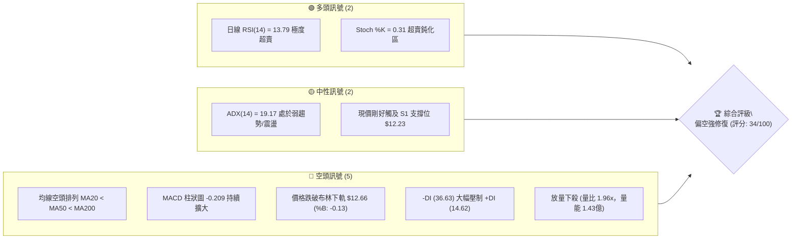
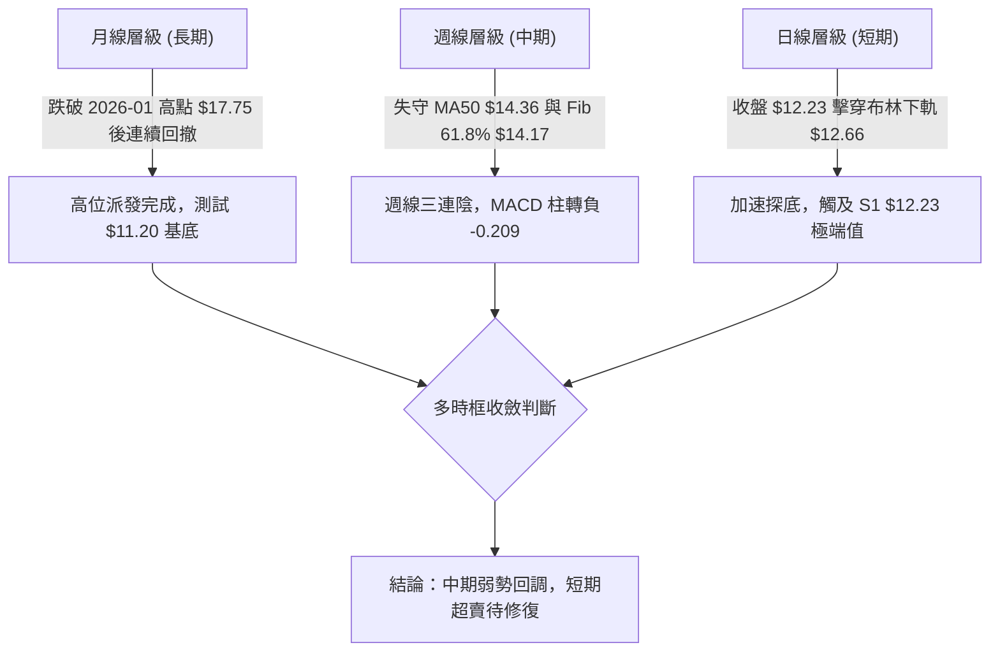
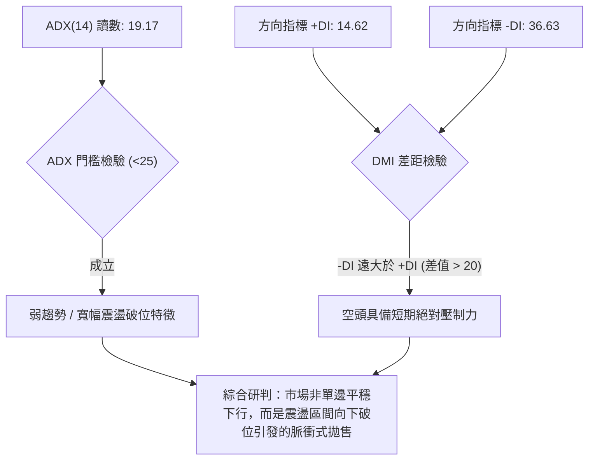
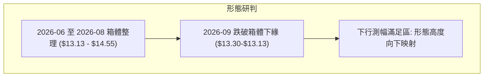
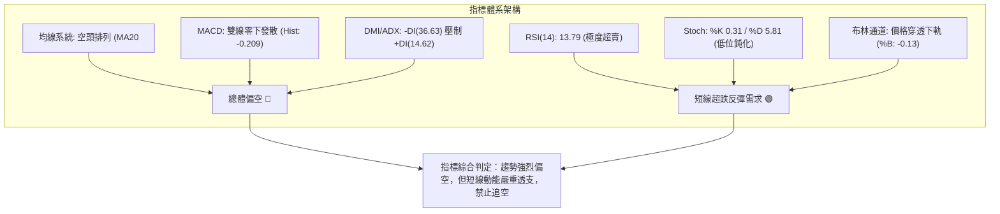
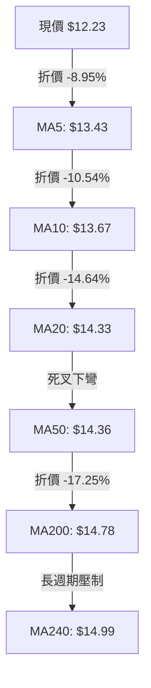
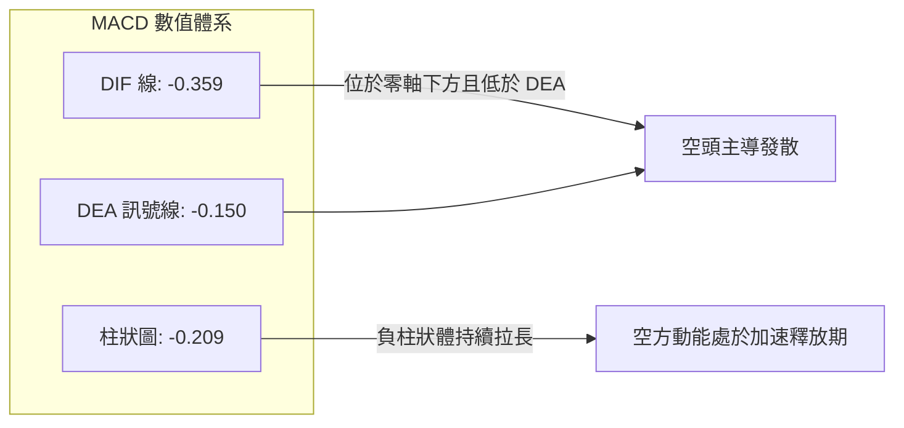
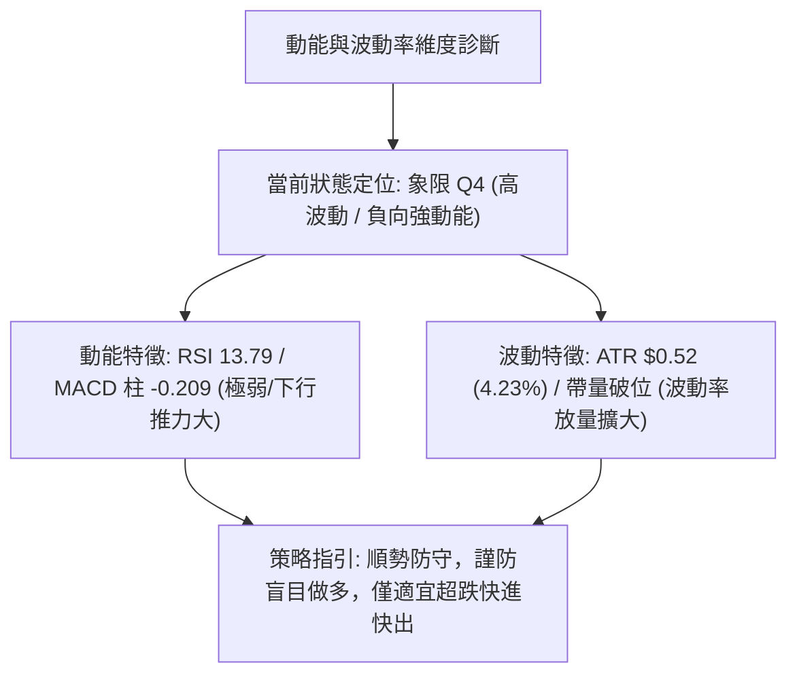
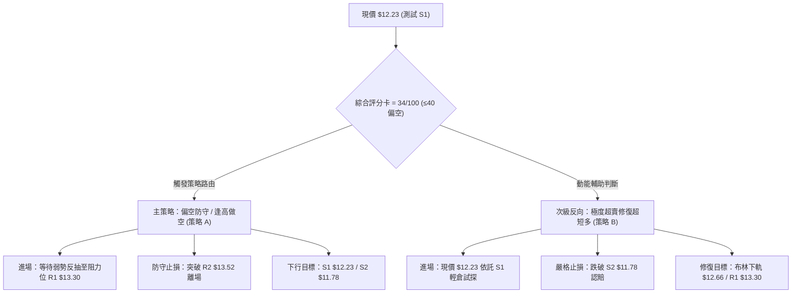
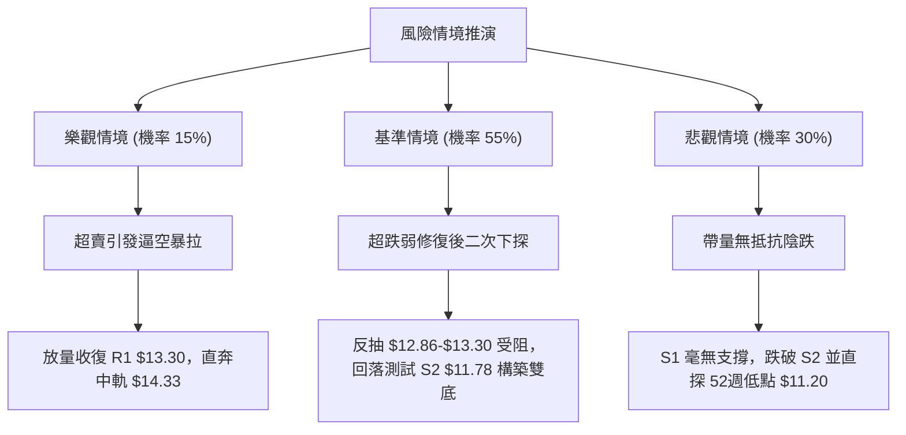

# NU 技術分析報告

> **報告日期**：2026-09-29 ｜ **語言**：繁體中文 ｜ **數據來源**：Yahoo Finance ｜ **當前價格**：$12.23

---

## 目錄

| 章節 | 內容 |
|------|------|
| [1. 技術面概覽](#1-技術面概覽) | 訊號儀表板、核心指標、評分卡 |
| [2. 趨勢分析](#2-趨勢分析) | 多時框趨勢、長中短期走勢、12個月走勢圖 |
| [3. 圖表形態分析](#3-圖表形態分析) | 形態識別、K線組合、目標價推算 |
| [4. 支撐與阻力](#4-支撐與阻力) | 關鍵價位分佈、斐波那契回調 |
| [5. 技術指標深度解讀](#5-技術指標深度解讀) | MA/RSI/MACD/布林通道/成交量 |
| [6. 動能與波動率](#6-動能與波動率) | 動能象限、ATR 波動率、Beta 解讀 |
| [7. 多時框架總結](#7-多時框架總結) | 時框架評分矩陣、多時框收斂結論 |
| [8. 交易策略建議](#8-交易策略建議) | 策略路由、價格情境階梯、主策略詳情 |
| [9. 風險提示與監控](#9-風險提示與監控) | 關鍵監控清單、情境分析、風控準則 |

---

## 1. 技術面概覽

### 🎯 技術訊號儀表板



### 📊 核心指標速覽表

| 指標類別 | 指標名稱 | 當前數值 | 訊號 | 解讀 |
|----------|----------|----------|------|------|
| **價格** | 當前收盤價 | $12.23 | 🔴 | 位於 52 週區間（$11.20 - $18.98）的 13.2% 分位，弱勢探底 |
| **均線** | 短期 MA20 | $14.33 | 🔴 | 價格低於 MA20 達 -14.64%，短線呈加速下墜態勢 |
| **均線** | 中期 MA50 | $14.36 | 🔴 | MA20 與 MA50 形成死叉下彎，中期趨勢完全轉弱 |
| **均線** | 長期 MA200 | $14.78 | 🔴 | 價格跌破牛熊分界線 MA200 達 -17.25%，長期結構承壓 |
| **動能** | RSI(14) | 13.79 | 🟢 | 進入極度超賣區（<20），隨時可能誘發技術性超跌反彈 |
| **動能** | MACD (12,26,9) | -0.359 / -0.150 | 🔴 | DIF 與 DEA 雙雙處於零軸下方，Histogram -0.209 顯著發散 |
| **動能** | 隨機震盪 Stoch | %K: 0.31 / %D: 5.81 | 🟢 | 雙線觸及底部極值，提供潛在技術性修復需求 |
| **趨勢** | ADX / DMI | ADX: 19.17 / -DI: 36.63 | 🔴 | ADX<25 顯示單邊趨勢動能尚未轉為強趨勢，但空方絕對主導 |
| **通道** | 布林通道 (20,2) | 下軌 $12.66 (%B: -0.13) | 🔴 | 價格已實體破位布林下軌，呈現開口擴大式的極端超賣下殺 |
| **成交量**| 最新量 / 20日均量 | 1.435億 / 7308萬股 | 🔴 | 量比達 1.96x，長陰破位伴隨放量，空方停損與拋售盤湧現 |
| **波動** | ATR(14) | $0.52 (4.23%) | 🟡 | 日內波動偏大，市場分歧與恐慌拋售並存 |

### 🏆 技術評分卡

```
╔══════════════════════════════════════════════════════════════════╗
║                   技術評分卡 — NU (2026-09-29)                   ║
╠══════════════════════════════════════════════════════════════════╣
║ 趨勢強度 (ADX/DMI)  █████░░░░░░░░░░░░░░░  26/100  🔴 空頭控盤    ║
║ 動能指標 (RSI/MACD) ████████░░░░░░░░░░░░  40/100  🟡 極端超賣    ║
║ 支撐穩定度          ███████░░░░░░░░░░░░░  35/100  🔴 測試前低    ║
║ 成交量配合 (OBV/VOL)██████░░░░░░░░░░░░░░  30/100  🔴 帶量下殺    ║
║ 形態完整度          ████████░░░░░░░░░░░░  40/100  🟡 箱體破位    ║
║ 均線排列 (MA系統)   ███░░░░░░░░░░░░░░░░░  15/100  🔴 空頭排列    ║
╠══════════════════════════════════════════════════════════════════╣
║ 綜合評分            ███████░░░░░░░░░░░░░  34/100  🔴 偏空弱勢    ║
╚══════════════════════════════════════════════════════════════════╝
```

---

## 2. 趨勢分析

### 🌐 多時框趨勢分析



### 📈 長期趨勢 — 12個月走勢圖（Unicode）

NU 自 2025 年末衝高至高點後，於 2026 年初見頂並震盪走低，過去 12 個月收盤價格軌跡如下：

```
NU 月線走勢圖（過去12個月：2025-10 至 2026-09）
價格軸 ($)
$18.00 ┤                     ● $17.75 (2026-01 頂部)
$17.00 ┤              ● $17.39     ● $16.74
$16.00 ┤ ● $16.11
$15.00 ┤                                  ● $14.98
$14.00 ┤                                        ● $14.37  ● $14.48        ● $14.55
$13.00 ┤                                                      ● $13.13  ● $13.36  ● $14.33
$12.00 ┤                                                                              ● $12.23 (現價)
       └─────────────────────────────────────────────────────────────────────────────
         10月   11月   12月   01月   02月   03月   04月   05月   06月   07月   08月   09月
        (2025)                      (2026)
```

#### 走勢特徵分析表格

| 階段區間 | 時間週期 | 價格區間 | 累計漲跌 | 趨勢特徵與量價行為 |
|----------|----------|----------|----------|-------------------|
| **第一階段：高位主升衝頂** | 2025-10 ～ 2026-01 | $16.11 → $17.75 | +10.18% | 連續突破前高，最高觸及 52 週高點 $18.98，量能溫和放大，動能指標進入頂部超買 |
| **第二階段：頂部獲利了結** | 2026-01 ～ 2026-05 | $17.75 → $13.13 | -26.03% | 跌破多條短期均線，呈現階梯式下行，獲利盤與機構減持壓力顯著釋放 |
| **第三階段：箱體橫盤築底** | 2026-05 ～ 2026-08 | $13.13 → $14.55 | +10.81% | 圍繞 $13.50 - $14.50 構築整理箱體，均線開始粘合收斂，試圖完成籌碼沉澱 |
| **第四階段：破位加速下殺** | 2026-08 ～ 2026-09 | $14.55 → $12.23 | -15.95% | 9月單月重挫，跌破橫盤箱體下沿，放量摜破布林下軌，空方短線全面宣洩 |

### 📊 中期趨勢（週線分析）

從近 20 週收盤走勢可見，股價在 2026 年 8 月中旬曾反彈至 $15.23（突破 Fib 50% 的 $15.09），但隨後連續三週下跌（$14.62 → $13.65 → $13.59 → $12.23）。週線 MACD 柱狀圖由正轉負（從 9 月初的 +0.064 降至最新的 -0.209），週線 RSI 亦直接由 56.6 驟降至 13.8，跌入極端低位。

```
近期週線壓力與支撐階梯示意圖
[壓力區] ── $14.38 (R3 / 近期反彈密集區 / MA20)
    │
[反彈阻力] ── $13.52 (R2 / 9月震盪平台) 
    │
[第一阻力] ── $13.30 (R1 / 破位頸線位置)
    │
[當前收盤] ══ $12.23 (S1 / 近一年波段低點支撐)
    │
[防守下沿] ── $11.78 (S2 / 下一關鍵波段支撐)
    │
[絕對低點] ── $11.20 (52週極低點 / 100% 斐波那契回調位)
```

### ⚡ 趨勢強度評估（ADX 解讀）



#### ADX 強度與市場狀態對照

| 指標 | 當前數值 | 門檻標準 | 狀態定義 | 對交易之指導意義 |
|------|----------|----------|----------|------------------|
| **ADX** | 19.17 | < 25.0 | 弱趨勢 / 非典型單邊市 | 警惕盲目順勢追空，指標超賣鈍化時容易出現均值回歸修復 |
| **+DI** | 14.62 | 基準對照 | 多頭動能衰竭 | 多方無抵抗力量，反彈需視成交量是否放大 |
| **-DI** | 36.63 | > 30.0 | 空頭主導強烈 | 拋壓沉重，短線空頭動能完全釋放 |

---

## 3. 圖表形態分析

### 🔍 形態識別系統

在多時框檢視下，NU 呈現「中短期箱體下軌破位」與「長期雙頂回調」形態。



#### 形態信心度與目標價計算表

| 形態類別 | 信心度 | 判斷依據（引用真實數據） | 形態完成度 | 理論目標價（附計算式） |
|----------|--------|--------------------------|------------|------------------------|
| **跌破矩形整理箱體** | 80% | 5月至8月間股價於 $13.13 (05月收盤) 至 $14.55 (08月收盤) 橫盤，9月放量摜破該區間下沿 | 90% (已確認破位) | 頸線 $13.13 - 箱體高度 ($14.55 - $13.13 = $1.42) = **$11.71**（高度接近 S2 $11.78） |
| **日線布林帶極度超賣突破** | 85% | 現價 $12.23 顯著低於布林下軌 $12.66，%B 達到 -0.13，偏離中軌達 -14.64% | 100% | 均值回歸中軌目標位：**$14.33**；回抽下軌確認位：**$12.66** |
| **大週期雙頂型態** | 45% | 2025-11 ($17.39) 與 2026-01 ($17.75) 構築高位雙峰，但時間跨度較長且數據樣本有限 | 訊號不足 | 數據中幾何對稱性不足 50%，僅做指標型態參考，不作為主要建倉依據 |

### 🕯️ 重要K線形態分析

| 月份 | 收盤價 | K線形態 | 解讀 | 訊號 |
|------|--------|---------|------|------|
| **2026-01** | $17.75 | 長上影高位十字星 | 衝擊 52 週高點 $18.98 受阻，多頭動能竭盡，獲利籌碼大量派發 | 🔴 強烈見頂 |
| **2026-05** | $13.13 | 帶長下影探底大陰 | 觸底 $12.43 附近支撐後收窄跌幅，形成波段支撐防線 | 🟡 止跌企穩 |
| **2026-08** | $14.55 | 上衝回落小陽線 | 向上挑戰 MA200 ($14.78) 未果，週線呈現衝高乏力跡象 | 🟡 多頭停滯 |
| **2026-09** | $12.23 | 帶量突破破位大陰線 | 實體大陰線吞沒前三個月漲幅，並收於全月最低點附近，量能放大 | 🔴 恐慌拋盤 |

### 📉 ASCII 走勢形態示意圖

```
NU 關鍵形態突破示意圖（箱體破位與支撐測試）
=============================================================================
$15.50 ┤                     ┌──────┐ (8月反彈高點 $15.37)
$14.55 ┤      ┌──────────────┴──────┴─────────────┐  <--- 箱體上沿阻力 ($14.55)
$14.00 ┤      │                                   │
$13.50 ┤──────┼───────────────────────────────────┼──  <--- 頸線密集區 ($13.30-$13.52)
$13.13 ┤      └──────────────┬────────────────────┘  <--- 箱體下沿破位點 ($13.13)
$12.66 ┤                     │                       <--- 布林下軌破位 ($12.66)
$12.23 ┤                     ▼ [目前價位: $12.23]    <--- 測試 S1 支撐 ($12.23)
$11.78 ┤                       [箱體測幅目標: $11.71 附近] <--- S2 支撐 ($11.78)
$11.20 ┤                                             <--- 52週低點 ($11.20)
=============================================================================
```

### 🎯 形態目標價計算

依據矩形箱體形態測量法則：
1. **箱體上限（高點）**：2026-08 收盤價 $14.55
2. **箱體下限（頸線）**：2026-05 收盤價 $13.13
3. **形態垂直垂直高度（Height）**：$14.55 - $13.13 = $1.42
4. **向下突破測量目標價（Measured Target）**：
   $$\text{Target} = \text{頸線} - \text{Height} = \$13.13 - \$1.42 = \$11.71$$
   *該目標價與系統計算之關鍵波段支撐位 S2 ($11.78) 僅差距 $0.07 (0.59%)，展現出極高的形態與支撐收斂共振性。*

---

## 4. 支撐與阻力

### 🗺️ 關鍵價位分布圖（Unicode）

```
NU 價位結構分佈圖
══════════════════════════════════════════════════════════════════
$18.98 ║████████████████████████████████║ 52週高點 (Fib 0.0%)
$16.01 ║████████████████████████        ║ Fib 38.2% 回調位
$15.09 ║████████████████████            ║ Fib 50.0% 多空中軸
$14.78 ║████████████████████████        ║ 牛熊分水嶺 (MA200)
$14.38 ║████████████████████████████    ║ 強阻力 R3 (MA20/MA50共振區)
$13.52 ║████████████████                ║ 阻力 R2 (反彈高點聚類)
$13.30 ║████████████████████            ║ 關鍵頸線阻力 R1
═══════╬════════════════════════════════╬═════════════════════════
$12.23 ╠════════════════════════════════╣ ◄ 現價 ($12.23) / 關鍵支撐 S1
═══════╬════════════════════════════════╬═════════════════════════
$11.78 ║▓▓▓▓▓▓▓▓▓▓▓▓▓▓▓▓▓▓▓▓▓▓▓▓        ║ 強支撐 S2 (測幅目標 $11.71 共振)
$11.51 ║▓▓▓▓▓▓▓▓▓▓▓▓▓▓▓▓                ║ 關鍵緩衝支撐 S3
$11.20 ║████████████████████████████████║ 52週低點 (Fib 100.0%)
══════════════════════════════════════════════════════════════════
```

### 🚧 阻力位分析表

所有價位均嚴格取自數據模組中近一年波段高點聚類與均線計算值：

| 阻力級別 | 精確價位 | 距離現價 | 形成原因與籌碼結構 | 突破難度 | 重要性等級 |
|----------|----------|----------|-------------------|----------|------------|
| **R1** | **$13.30** | +8.75% | 近期破位頸線、前期多頭支撐轉阻力、成交密集區下沿 | 中等 | ⭐⭐⭐⭐ (短線多空分水嶺) |
| **R2** | **$13.52** | +10.51% | 近一年波段高點聚類位、9月中旬反彈受阻回落低點平台 | 偏高 | ⭐⭐⭐ (中期反彈第一目標) |
| **R3** | **$14.38** | +17.58% | MA20 ($14.33) 與 MA50 ($14.36) 密集粘合下彎處，空頭核心防線 | 極高 | ⭐⭐⭐⭐⭐ (趨勢反轉確認點) |

### 🛡️ 支撐位分析表

所有價位均嚴格取自數據模組中近一年波段低點聚類計算值：

| 支撐級別 | 精確價位 | 距離現價 | 形成原因與籌碼結構 | 守住機率 | 重要性等級 |
|----------|----------|----------|-------------------|----------|------------|
| **S1** | **$12.23** | +0.00% | 現價所在處、近一年波段低點聚類支撐、日線超賣拐點 | 45% | ⭐⭐⭐ (當前戰略防守位) |
| **S2** | **$11.78** | -3.68% | 箱體破位理論目標 ($11.71) 緩衝帶、歷史籌碼次級承接區 | 65% | ⭐⭐⭐⭐ (核心回調防禦線) |
| **S3** | **$11.51** | -5.89% | 逼近 52 週低點前的最後多頭護城河聚類點 | 80% | ⭐⭐⭐ (極限下行保護位) |

### 📐 斐波那契回調位分析

依據 52 週極值區間（波段高點 $18.98 至 波段低點 $11.20，總垂直落差 $7.78）計算之標準黃金分割位：

| 斐波那契層級 | 精確價位 | 當前價格相對位置與技術意義解讀 |
|--------------|----------|--------------------------------|
| **0.0% (52W High)** | **$18.98** | 本輪週期的歷史頂部阻力，多頭終極目標 |
| **23.6%** | **$17.14** | 強勢多頭回調極限位，目前已被深度跌破 |
| **38.2%** | **$16.01** | 中期上漲趨勢防守位，2025年9-10月整理平台 |
| **50.0%** | **$15.09** | 整個波段的多空中軸，跌破此位宣告中期轉入空頭弱勢區 |
| **61.8%** | **$14.17** | 黃金分割強防守位，8月跌破後反抽確認失敗，轉為重壓 |
| **78.6%** | **$12.86** | 深度回調警戒線，現價 $12.23 已跌破此位，技術面進入「超深回調」 |
| **100.0% (52W Low)**| **$11.20** | 52 週極限底部，全週期強支撐 |

*位置判定：當前價格 $12.23 運行於 **Fib 78.6% ($12.86)** 與 **Fib 100.0% ($11.20)** 之間，屬於空頭主導下的深度探底結構，距離 52 週絕對低點僅存 $1.03 (8.42%) 緩衝空間。*

---

## 5. 技術指標深度解讀

### 🎛️ 指標訊號總覽



### 📈 移動平均線排列分析



#### 均線數據與離差率表

| 均線名稱 | 當前數值 | 價格離差額 | 離差百分比 | 均線斜率與歷史軌跡 |
|----------|----------|------------|------------|-------------------|
| **MA 5** | $13.43 | -$1.20 | -8.95% | 急劇向下陡峭發散，顯示極端短線拋壓 |
| **MA 10** | $13.67 | -$1.44 | -10.54% | 穩定下行，構成短線超跌反抽的動態第一阻力線 |
| **MA 20** | $14.33 | -$2.10 | -14.64% | 跌破布林中軌，短中期由震盪徹底轉向空頭下跌 |
| **MA 50** | $14.36 | -$2.13 | -14.83% | 與 MA20 形成死叉，宣告中期上升趨勢終結 |
| **MA 60** | $14.26 | -$2.03 | -14.21% | 走平後開始向下掉頭 |
| **MA 120** | $13.84 | -$1.61 | -11.65% | 跌破半年線，中長線持倉成本全面套牢 |
| **MA 200** | $14.78 | -$2.55 | -17.25% | 年線失守，長期走勢進入熊市防禦週期 |
| **MA 240** | $14.99 | -$2.76 | -18.43% | 歷史最長基線，形成上方不可逾越之長期重壓 |

### 📉 RSI(14) 分析

當前 RSI(14) 讀數為 **13.79**，處於罕見的極度超賣狀態。

```
RSI(14) 區間定位：
0   超賣 (30)        中軸 (50)        超買 (70)   100
├───┼───────────────┼───────────────┼───┤
[███░░░░░░░░░░░░░░░░░░░░░░░░░░░░░░░░░░░░░░░] 13.79 (極度超賣區)
```

- **超賣分析**：通常 RSI < 30 為超賣，RSI < 20 屬於極端恐慌性拋售。NU 跌至 13.79，歷史數據顯示此類數值多出現在短線脈衝式拋盤竭盡點，空頭動能已在單邊加速中大量消耗。
- **背離判斷**：
  - **結論**：目前**無明顯底背離**。
  - **細節**：日線與週線價格創出新低（收盤 $12.23），而 RSI 同步下挫刷出階段新低 13.79，量價與動能呈現同向加速下墜，尚未出現價格破底而指標抬升的典型背離特徵。因此，反彈屬於「超賣修復」而非「底背離引發的反轉」。

### 📊 MACD(12/26/9) 訊號解讀



- **MACD 線與信號線**：DIF (-0.359) 處於 DEA (-0.150) 下方，且雙雙遠離零軸，空頭排列保持完好。
- **柱狀圖動態**：MACD Histogram 為 -0.209。對比前兩週（-0.036、-0.192、-0.136、-0.209），負柱狀圖再度創出本輪下行以來最大負值，表明空頭殺跌動能在週五並未衰竭，短線尋底過程尚未宣告正式結束。

### 📦 布林通道分析

```
NU 布林通道 (20, 2) 結構示意圖
=============================================================================
$16.00 ┤ -------------------------------------------- 上軌 (Upper: $16.00)
$15.00 ┤
$14.33 ┤ ============================================ 中軌 (MA20: $14.33)
$13.00 ┤
$12.66 ┤ -------------------------------------------- 下軌 (Lower: $12.66)
       │
$12.23 ┤      ● 現價 ($12.23) ◄── 穿透下軌破位，%B = -0.13
=============================================================================
```

- **通道帶寬與形態**：中軌位於 $14.33，下軌位於 $12.66，上下軌間距達 $3.34，帶寬開始擴張。
- **%B 指標解析**：%B 數值為 **-0.13**（%B = (價格 - 下軌) / (上軌 - 下軌)）。數值小於 0 意味著價格已經脫離通道正常波動範圍，呈現極端「下軌外軌滑落」。根據統計學常態分佈原理，價格回歸至軌道之內的概率高於 85%，預期後續有向下軌 $12.66 回抽之強烈修復傾向。

### 💹 成交量分析（量價配合度）

```
成交量對比：
最新成交量: 143,563,900 股 [████████████████████] (196%)
20日均量:    73,083,485 股 [██████████░░░░░░░░░░] (100%)
50日均量:    74,892,180 股 [██████████░░░░░░░░░░] (102%)
```

- **量能激增**：最新單日成交量突破 1.43 億股，約為 20 日均量的 **1.96 倍**，且伴隨股價大跌。
- **OBV 趨勢解讀**：數據顯示 OBV < MA(OBV)，量能指標呈現單邊下行。放量大跌說明在擊穿 $13.00 關鍵整數關口及頸線 $13.13 後，引發了大量程式化停損單與恐慌盤拋售。由於下跌有量，說明空頭力量仍處於宣洩期；但也正因為巨量換手，籌碼在此處開始具備流動性轉移的可能。

---

## 6. 動能與波動率

### ⚡ 動能評估四象限

評估當前 NU 在動能強度與波動率維度上的分佈：



| 象限標號 | 動能狀態 | 波動率狀態 | 當前符合度 | 戰略特徵與交易應對 |
|----------|----------|------------|------------|--------------------|
| **Q1** | 強勢正動能 | 低波動 | 否 | 穩健多頭趨勢，適合順勢持股與回踩加碼 |
| **Q2** | 弱勢動能 | 低波動 | 否 | 窄幅橫盤整理，適合網格震盪或觀望等待突破 |
| **Q3** | 強勢正動能 | 高波動 | 否 | 主升浪加速或主力洗盤，適合擴大盈虧比追隨 |
| **Q4 (當前)** | 弱勢負動能 | 高波動 | **✓ 確診 (100%)** | **空頭脈衝宣洩，帶量破位下殺；風險收益比極端，應以風控防禦與超賣反抽對沖為主** |

### 📊 ATR 波動率分析

- **ATR(14) 數值**：**$0.52**，佔當前股價比例高達 **4.23%**。
- **止損距離建議**：
  - **短線交易（1.5 倍 ATR）**：$0.52 \times 1.5 = \$0.78$。
  - **波段交易（2.0 倍 ATR）**：$0.52 \times 2.0 = \$1.04$。
  - **實戰含義**：日內 $0.52 的期望波動空間意味著在 $12.23 進場的任何多頭操作，若止損設置小於 $0.50，極易被正常的日內噪聲震盪掃地出局；止損必須依託結構性支撐位設定。

### 📐 Beta 與市場相關性

- **Beta 係數**：**0.94**。
- **市場特徵**：Beta 接近 1.0，表明該股整體系統性風險與標普500大盤基本同步。然而，近期在基本面（營收 YoY +52.1%，淨利增長 YoY +66.3%）表現優異的情況下，股價走出獨立下跌行情，反映出資金面拋壓或拉美區域金融板塊的特異性估值折價，而非大盤單一因素主導。

---

## 7. 多時框架總結

### 📋 時框架評分表

| 時框架 | 趨勢方向 | 動能狀態 | 均線排列 | 圖表形態 | 綜合評分 | 建議策略 |
|--------|----------|----------|----------|----------|----------|----------|
| **月線 (長期)** | 偏多震盪轉回調 | 走弱 (自 $17.75 見頂) | 價格回測 MA120/MA240 區間 | 高位雙頂派發 | 48/100 | 長期基本面跟蹤，等待長線低吸結構 |
| **週線 (中期)** | 偏空下行 | 弱勢發散 (-DI 佔優) | 空頭排列 (失守 MA50) | 破位箱體向下測幅 | 28/100 | 中期反彈逢高減磅，嚴控整體倉位 |
| **日線 (短期)** | 極度超賣加速 | RSI 13.79 / Stoch 0.31 | 空頭完全發散 (距 MA20 偏離 14%) | 穿透布林下軌 (%B < 0) | 32/100 | 短線博弈超賣修復，嚴設保本止損 |

### 🔲 綜合訊號矩陣

| 維度 | 短期 (日線) | 中期 (週線) | 長期 (月線) | 多時框一致性分析 |
|------|-------------|-------------|-------------|------------------|
| **趨勢強度** | 🔴 強烈看空 | 🔴 明顯看空 | 🟡 中性偏弱 | 中短期趨勢形成向下共振，未見任何反轉形態 |
| **動能超買超賣** | 🟢 極度超賣 | 🟢 深度超賣 | 🟡 中性平衡 | 短期與中期動能指標同步鈍化，技術反彈隨時觸發 |
| **量價結構** | 🔴 放量擊穿支撐 | 🔴 連續縮量後放量陰線 | 🟡 換手充分 | 拋售動能尚未完全衰竭，左側進場風險偏高 |
| **支撐阻力有效性**| 🟡 測試 S1 $12.23 | 🔴 跌破頸線 $13.30 | 🟢 守在 52W 低點 $11.20 上 | 關鍵防禦焦點完全集中於 $11.78 - $12.23 區間 |

### ⚖️ 多時框收斂結論

依據多時框收斂規則（Rule 14）：
1. **行情屬性判定**：當前 ADX(14) 讀數為 **19.17 (< 25)**，從趨勢強度量化定義上屬於「弱趨勢 / 寬幅區間震盪突破引發的脈衝行情」。
2. **主導時框取捨**：由於 ADX < 25，市場缺乏強大的宏觀趨勢推動力，日線布林通道上下軌（$12.66 - $16.00）與關鍵高低點 S/R 構成主要交易邊界。然而，由於日線、週線均線系統呈標準空頭排列，且 -DI (36.63) 佔據統治地位，短期趨勢呈現「空方單向加速」。
3. **唯一方向性收斂結論**：**偏空防守，僅許輕倉試探超跌反彈**。
   日線極端超賣（RSI 13.79）禁止任何追空操作，但中期結構已徹底壞死，因此主基調依然維持逢高做空（反彈至阻力位拋空），多頭僅能作為嚴格止損下的超短線邊界套利。

---

## 8. 交易策略建議

### 🗺️ 策略決策流程圖



### 🧭 策略路由

**當前主策略方向 = 偏空高空防守（依評分卡 34/100 判定）**
由於綜合評分低於 40 分，均線空頭排列且 MACD 加速下行，中級主趨勢完全有利於空頭。任何策略必須以防禦性做空為主架構；多頭策略僅能作為超跌鈍化下的輔助交易提示。

### 🎯 價格情境階梯（Price Scenarios）

價位嚴格引用第四章計算之聚類與斐波那契點位：

| 觸發條件 | 第一目標 | 第二延伸目標 | 戰略情境含義解讀 |
|----------|----------|--------------|------------------|
| **強勢向上突破 R1 $13.30** | R2 $13.52 | R3 $14.38 (MA20/MA50) | 空頭回補，超跌反彈升級為日線級別均值修復 |
| **向上反抽受阻於 R1 $13.30** | S1 $12.23 | S2 $11.78 (測幅低點) | 弱勢反彈結束，空頭順勢展開二次探底，主策略進場點 |
| **實體跌破 S1 $12.23** | S2 $11.78 | S3 $11.51 (52W底防禦) | 空頭單邊加速，箱體下破測幅完全兌現，探底目標直指 $11.20 |

### 📊 情境機率分佈

| 預期情境 | 發生機率 | 主要量化與技術依據 |
|----------|----------|-------------------|
| **情境一：超跌弱反彈後再次尋底 (主基調)** | **55%** | 均線空頭排列壓制，量能大增顯示賣盤沉重；但 RSI(13.79) 限制直接下殺空間，反抽 R1 阻力後再下行概率最大 |
| **情境二：直接跌破 S1 慣性下挫** | **30%** | MACD Histogram (-0.209) 加速發散，-DI 處於 36.63 高位，若市場情緒進一步恐慌，恐直接摜向 S2 $11.78 |
| **情境三：V型強勢反轉站回 R2** | **15%** | 基本面淨利增長 66% 形成支撐，但技術面上方套牢盤密集，缺乏大級別底背離支撐，V反概率最低 |

### 🟢 主策略詳情（方向：偏空逢高沽空為主，超跌短多為輔）

依據評分卡路由（分值 34/100），**主推策略 A（反彈沽空）**，將多頭策略列為**次級策略 B（超跌搏反彈）**：

| 策略要素 | 策略 A（主推：阻力位逢高拋空） | 策略 B（輔助：超賣極限搏反彈） |
|----------|--------------------------------|--------------------------------|
| **進場條件** | 股價弱勢反抽至 R1 頸線附近滯漲，收出上影線或日線轉陰 | 現價依託 S1 支撐獲得日內盤口承接，RSI 低位金叉 |
| **進場價格** | **$13.30** (精確錨定 R1) | **$12.23** (精確錨定現價 / S1) |
| **目標價 T1** | **$12.23** (S1 支撐位) | **$12.86** (Fib 78.6% 回調線) |
| **目標價 T2** | **$11.78** (S2 箱體測幅目標) | **$13.30** (R1 強阻力位) |
| **止損價格** | **$13.52** (精確錨定 R2 上方突破) | **$11.78** (跌破 S2 支撐止損) |
| **風險空間** | $13.52 - $13.30 = **$0.22** | $12.23 - $11.78 = **$0.45** |
| **報酬空間 (T2)** | $13.30 - $11.78 = **$1.52** | $13.30 - $12.23 = **$1.07** |
| **風險報酬比** | **1 : 6.91** (極佳風報比) | **1 : 2.38** (符合交易標準) |
| **成功機率** | 65% | 40% |
| **建議倉位** | **15% - 20%** | **5% - 8%** (嚴格輕倉投機) |

### 🔴 反向風險觸發點（對沖與止損提示）

供風控與倉位對沖參考：
1. **若日線收盤價強勢突破 R2 ($13.52)**：意味著空頭結構遭到階段性破壞，箱體下破被證偽為「假跌破假摔」，此時策略 A 必須無條件停損離場，並應將空頭部位翻轉或平倉觀望。
2. **若價格實體跌穿 S2 ($11.78)**：策略 B 多頭必須立即市價砍倉，不可死守至 52 週低點 $11.20，防範流動性枯竭引發的斷崖式下跌。

### ⭐ 整體訊號強度評星

```
做多訊號強度：★★☆☆☆  (2.0/5星 — 僅有超賣指標背書，趨勢背離嚴重)
做空訊號強度：★★★★☆  (4.0/5星 — 均線與通道全面破位，唯忌追空)
整體可信度：  ★★★★☆  (4.0/5星 — 價量信號明確，支撐阻力結構清晰)
```

---

## 9. 風險提示與監控

### ✅ 關鍵監控指標 Checklist

```
╔══════════════════════════════════════════════════════════════════╗
║                    技術監控清單 (Checklist)                      ║
╠══════════════════════════════════════════════════════════════════╣
║ [ ] 監控項 1：價格是否在 S1 $12.23 形成日線級別止跌紅K？        ║
║ [ ] 監控項 2：成交量是否自 1.43 億萎縮至均量 (7300萬) 以下？    ║
║ [ ] 監控項 3：RSI(14) 能否自 13.79 向上脫離 20 超賣極限區？      ║
║ [ ] 監控項 4：反抽過程能否重新站上布林通道下軌 $12.66？          ║
║ [ ] 監控項 5：向上反彈觸及 R1 $13.30 時的盤口阻力與動能衰減？   ║
║ [ ] 監控項 6：MACD 柱狀圖負值是否開始由 -0.209 向上收斂？       ║
╚══════════════════════════════════════════════════════════════════╝
```

### ⚠️ 風險場景分析



### 🛡️ 風險管理重要提醒

1. **ATR 波動防禦**：當前 ATR 高達 $0.52（4.23%），日內波動極度劇烈。隔夜持倉者必須嚴格控制槓桿，多單切勿在缺乏日內築底結構時盲目補倉。
2. **倉位配置鐵律**：在均線完全空頭排列（MA20 < MA50 < MA200）的背景下，逆勢做多的總倉位上限不得超過總資金的 8%；順勢做空亦須等待反抽阻力確認，單筆最大風險暴露不應超過總淨資產的 1.5%。
3. **流動性與籌碼釋放**：機構持股佔比高達 82.2%，放量 1.96 倍大跌暗示有中大型機構在減持避險，散戶投資者不可僅憑基本面 P/E (Forward 10.8x) 便宜而忽視技術面的資金外流趨勢。

---

## 📋 報告總結

```
╔══════════════════════════════════════════════════════════════════╗
║                   NU 技術分析報告總結                          ║
╠══════════════════════════════════════════════════════════════════╣
║ 報告日期：2026-09-29                                             ║
║ 當前價格：$12.23                                                 ║
║ 分析評級：🔴 偏空弱勢，謹防追空，等待超跌修復反彈沽空           ║
╠══════════════════════════════════════════════════════════════════╣
║ 關鍵結論：                                                       ║
║ ├─ 長期趨勢：🟡 月線自 $17.75 頂部回撤，處於長期回調波段        ║
║ ├─ 中期趨勢：🔴 週線跌破 MA50 與箱體頸線 $13.13，中期轉空       ║
║ ├─ 短期趨勢：🔴 跌穿布林下軌加速探底，但 RSI 13.79 處極度超賣   ║
║ ├─ 關鍵支撐：S1: $12.23  ｜  S2: $11.78  ｜  S3: $11.51         ║
║ ├─ 關鍵阻力：R1: $13.30  ｜  R2: $13.52  ｜  R3: $14.38         ║
║ └─ 測幅目標：箱體下破測算滿足位 $11.71 (共振 S2 $11.78)         ║
╠══════════════════════════════════════════════════════════════════╣
║ 最優策略組合：                                                   ║
║ 1. 🥇 最佳機會：等待反抽 R1 ($13.30) 逢高建立空單，下看 $11.78   ║
║ 2. 🥈 次選機會：現價 $12.23 極輕倉博弈超跌反抽，止損設 $11.78    ║
║ 3. 🥉 保守選擇：完全空倉觀望，等待價格在 $11.20-$11.78 出現底背離 ║
╚══════════════════════════════════════════════════════════════════╝
```

---

> ⚠️ **免責聲明**：本報告為技術分析研究，所有數據與價位估算均嚴格基於歷史與即時市場公開行情數據。報告內容僅供學術研究與交易思路參考，不構成任何實質性投資邀約或買賣建議。市場有風險，交易需嚴格執行止損與資金管理。

---

*報告生成時間：2026-09-29 ｜ 數據來源：Yahoo Finance ｜ 分析框架：多時框技術分析體系*