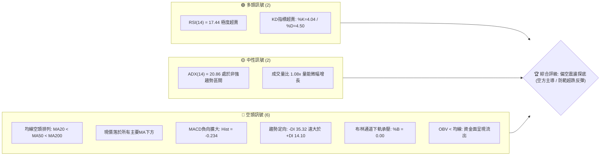
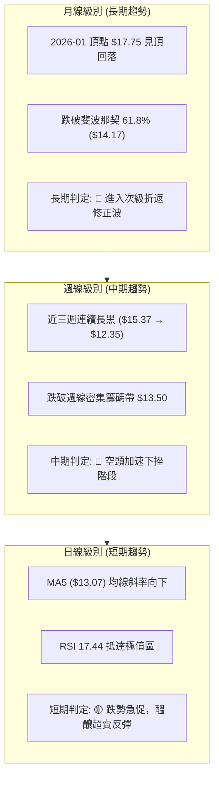
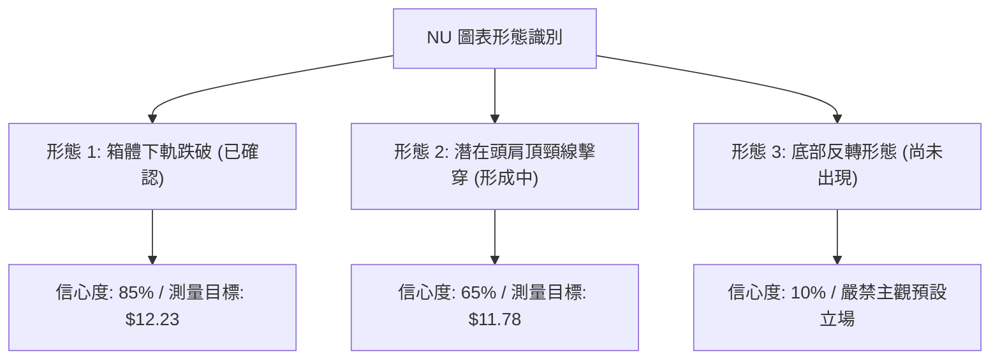
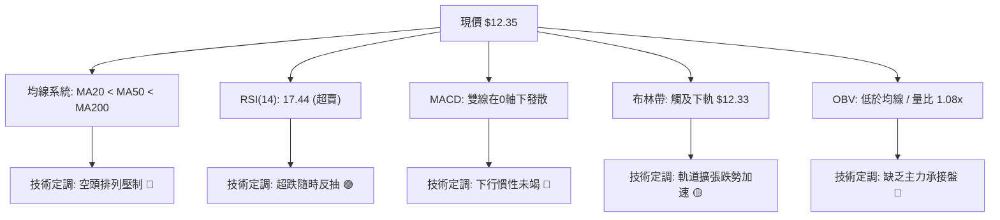
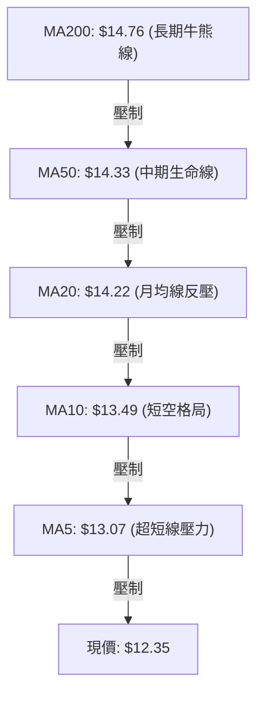
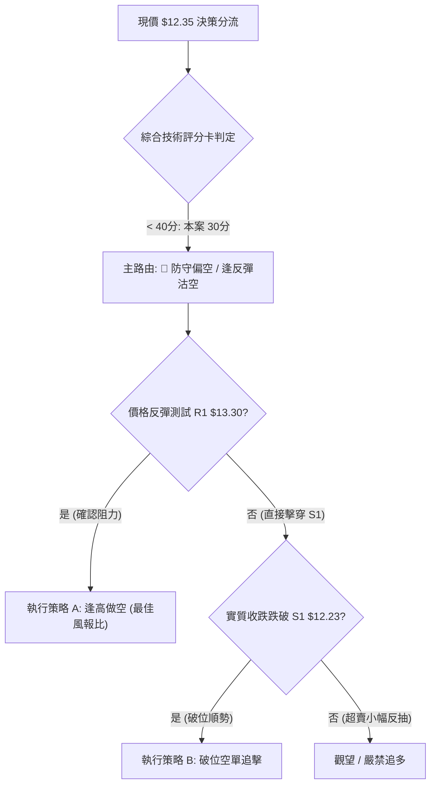
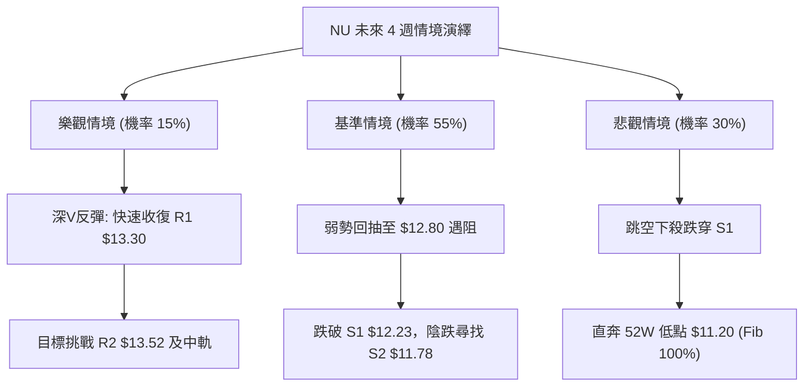

# NU 技術分析報告

> **報告日期**：2026-09-30 ｜ **語言**：繁體中文 ｜ **數據來源**：Yahoo Finance ｜ **當前價格**：$12.35

---

## 目錄

| 章節 | 內容 |
|------|------|
| [1. 技術面概覽](#1-技術面概覽) | 訊號儀表板、核心指標、評分卡 |
| [2. 趨勢分析](#2-趨勢分析) | 多時框趨勢、長中短期走勢、ADX 解讀 |
| [3. 圖表形態分析](#3-圖表形態分析) | 形態識別、信心度評估、K線組合、目標價推算 |
| [4. 支撐與阻力](#4-支撐與阻力) | 關鍵價位分布、波段聚類、斐波那契回調 |
| [5. 技術指標深度解讀](#5-技術指標深度解讀) | 均線系統、RSI、MACD、布林通道、OBV量價 |
| [6. 動能與波動率](#6-動能與波動率) | 動能四象限、ATR 止損距離、Beta 相關性 |
| [7. 多時框架總結](#7-多時框架總結) | 時框架評分矩陣、收斂規則與單一方向定調 |
| [8. 交易策略建議](#8-交易策略建議) | 策略路由、價格情境階梯、主策略詳情與對沖 |
| [9. 風險提示與監控](#9-風險提示與監控) | 關鍵監控清單、情境模擬、風控原則 |
| [10. 報告總結](#10-報告總結) | 核心結論與執行路徑匯總 |

---

## 1. 技術面概覽

### 🎯 技術訊號儀表板



---

### 📊 核心指標速覽表

| 指標類別 | 指標名稱 | 當前數值 | 訊號 | 解讀 |
|:---|:---|:---:|:---:|:---|
| **價格** | 當前收盤價 | $12.35 | 🔴 | 位於 52 週區間下緣 14.8%，短線下行慣性強烈 |
| **均線** | 短期 MA20 | $14.22 | 🔴 | 現價低於 MA20 達 -13.14%，短線嚴重承壓 |
| **均線** | 中期 MA50 | $14.33 | 🔴 | 現價低於 MA50，中期均線轉折向下形成蓋頂壓力 |
| **均線** | 長期 MA200 | $14.76 | 🔴 | 跌破牛熊分界線，長期趨勢由多轉空 |
| **動能** | RSI(14) | 17.44 | 🟢 | 深度超賣（<20），短線存在均值回歸修復需求 |
| **動能** | MACD (12,26,9) | -0.443 | 🔴 | 快慢線死叉且柱狀圖（-0.234）向下發散，空頭動能主導 |
| **動能** | 隨機指標 (KD) | 4.04 / 4.50 | 🟢 | 極度鈍化超賣，隨時可能觸發技術性抽頭反彈 |
| **通道** | 布林通道 (%B) | 0.00 | 🟡 | 價格觸及下軌 $12.33，通道開口放大，面臨變盤 |
| **趨勢** | ADX (14) | 20.86 | 🟡 | 數值 <25，屬震盪整理轉弱架構，但 -DI(35.32) 具壓倒性 |
| **量能** | OBV 趨勢 | OBV < MA | 🔴 | 量能指標跌破均線，主力資金未見抄底建倉跡象 |
| **波動** | ATR(14) | $0.51 | 🟡 | 佔現價 4.15%，日均波動適中，利於設定精準止損 |

---

### 🏆 技術評分卡

```
╔══════════════════════════════════════════════════════════════════╗
║              技術評分卡 — NU (Nu Holdings Ltd.) 2026-09-30       ║
╠══════════════════════════════════════════════════════════════════╣
║ 趨勢強度 (Trend)     ████░░░░░░░░░░░░░░░░  20/100  🔴 極弱勢     ║
║ 動能指標 (Momentum)  ██████░░░░░░░░░░░░░░  30/100  🔴 空方主導   ║
║ 支撐穩定度 (Support) ████████░░░░░░░░░░░░  40/100  🟡 臨近考驗   ║
║ 成交量配合 (Volume)  ███████░░░░░░░░░░░░░  35/100  🔴 量價背離   ║
║ 形態完整度 (Pattern) ████████░░░░░░░░░░░░  40/100  🟡 箱體破位   ║
║ 均線排列 (MA System) ███░░░░░░░░░░░░░░░░░  15/100  🔴 空頭排列   ║
╠══════════════════════════════════════════════════════════════════╣
║ 綜合評分             ██████░░░░░░░░░░░░░░  30/100  評級: 🔴 強烈偏空║
╚══════════════════════════════════════════════════════════════════╝
```

---

## 2. 趨勢分析

### 🌐 多時框趨勢分析



---

### 📈 長期趨勢 — 12個月走勢圖（Unicode）

NU 股價自 2025 年末自 $17.75 衝高見頂後，整體呈現高點遞減（Lower Highs）與破位加速態勢。以下為過去 12 個月（2025-10 至 2026-09）收盤價走勢映射圖：

```
NU 月線收盤走勢圖（2025-10 至 2026-09）
價格軸 ($)
$18.00 ┤                             ● (2026-01: $17.75 最高點)
$17.50 ┤                     ● (17.39)
$17.00 ┤                         ● (16.74)
$16.50 ┤             ● (16.11)
$16.00 ┤
$15.50 ┤
$15.00 ┤                                 ● (14.98)
$14.50 ┤                                     ● (14.37)  ● (14.48)             ● (14.55)
$14.00 ┤                                                                   ● (14.33)
$13.50 ┤                                                           ● (13.36)
$13.00 ┤                                                       ● (13.13)
$12.50 ┤                                                                               ● ($12.35 破位現價)
$12.00 ┤
       └─┬───────┬───────┬───────┬───────┬───────┬───────┬───────┬───────┬───────┬───────┬───────┬───────
       10/25   11/25   12/25   01/26   02/26   03/26   04/26   05/26   06/26   07/26   08/26   09/26
```

#### 長期走勢特徵分析表

| 階段區間 | 時間跨度 | 價格起迄 | 漲跌幅 | 結構特徵與技術含義 |
|:---|:---:|:---:|:---:|:---|
| **牛市末段衝頂** | 2025/10 - 2026/01 | $16.11 → $17.75 | +10.18% | 買盤動能衰竭，月線高檔震盪構築雙頂型態 |
| **首波重挫調整** | 2026/01 - 2026/03 | $17.75 → $14.37 | -19.04% | 獲利了結賣壓湧現，連續跌破短期各路均線 |
| **弱勢橫盤箱體** | 2026/03 - 2026/08 | $14.37 → $14.55 | +1.25%  | 長達半年的弱勢反彈，受阻於 MA200 ($14.76) |
| **破位主跌啟動** | 2026/08 - 2026/09 | $14.55 → $12.35 | -15.12% | 跌破 $13.50 橫盤下軌，空方形態展開帶量下殺 |

---

### 📊 中期趨勢（週線分析）

從近 20 週的週線數據觀察，NU 在 2026 年 8 月中旬一度摸高至 $15.23 及 9 月初的 $15.37，但成交量未能放大配合，隨後在 9 月下旬出現斷崖式下跌，近三週週線連續收長陰線：
- **2026-09-13**：收盤 $14.62，MACD 柱狀由正轉負（-0.036）
- **2026-09-20**：收盤 $13.65，週跌幅擴大，MACD 柱狀負值加劇（-0.192）
- **2026-09-27**：收盤 $13.59，RSI 驟降至 19.9
- **2026-10-04 (當前週)**：收盤 $12.35，RSI 跌至 17.4，週線 MACD 柱為 -0.234

```
週線級別支撐與壓力拓撲結構示意圖
═══════════════════════════════════════════════════════════════
  [中期阻力頂部帶]  $15.37 (2026-09-06 週線波段高點)
         ▲
         │  (高位獲利回吐，出現頂背離訊號)
  [破位頸線阻力]    $13.52 - $13.59 (前箱體底部，轉換為重大反壓 R2)
         ▲
         │  (近兩週急速失守)
  [當前價格水準]    $12.35 (正測試布林帶下軌 $12.33)
         ▼
  [下檔第一防線]    $12.23 (近一年波段低點支撐 S1)
         ▼
  [極限弱勢防線]    $11.20 (52W 最低點 / 斐波那契 100.0% 回調位)
═══════════════════════════════════════════════════════════════
```

---

### ⚡ 趨勢強度評估（ADX 解讀）

```mermaid
graph TD
    A["當前 ADX(14) = 20.86"] --> B{"ADX 數值門檻判斷"}
    B -->|"< 25| C["非趨勢行情 / 弱趨勢架構"]
    B -->|"> 25| D["強勢單邊趨勢行情"]
    A --> E["定向指標分析"]
    E --> F["+DI = 14.10 (多方動能弱)"]
    E --> G["-DI = 35.32 (空方強烈壓制)"]
    C --> H["收斂結論: 屬於『弱趨勢/寬幅箱體向下跌破』初期階段"]
    G --> H
```

#### ADX 與趨勢強度評估對照

| 項目 | 數值 | 狀態區間 | 技術分析解讀 |
|:---|:---:|:---:|:---|
| **ADX 指標值** | **20.86** | 弱趨勢 / 盤整 (<25) | 雖然跌幅劇烈，但因先前半年維持在 $13.13–$14.55 窄幅整理，ADX 尚未完全揚升，意味著單邊趨勢仍處爆發初段。 |
| **正向定向 (+DI)** | **14.10** | 極弱 | 買盤主動性極低，多頭毫無反擊力道。 |
| **負向定向 (-DI)** | **35.32** | 極強 | 空方掌控市場主導權，負向擴散顯著。 |
| **整體強度評判** | **空頭擴散初期** | 🔴 空方完勝 | 空頭力量全面壓制，在 ADX 升破 25 之前，多空雙方將圍繞關鍵技術支撐位進行激烈拉鋸。 |

---

## 3. 圖表形態分析

### 🔍 形態識別系統

依據形態學原則，結合近 24 個月價量輪廓，僅對確鑿存在的幾何形態進行嚴格定義與信心度評估：



#### 幾何圖表形態信心度清單

| 形態名稱 | 信心度 | 判斷依據（引用真實數據） | 形態完成度 | 目標價（附嚴謹計算式） |
|:---|:---:|:---|:---:|:---|
| **箱體整理破位** | **85%** | 2026/03 至 2026/08 長期運行於 $13.36–$14.55 箱體內，9 月跌穿下軌 $13.36 | **100% (已觸發)** | 箱底下軌 $13.36 - (箱頂 $14.55 - 箱底 $13.36) = **$12.17**（直接指向支撐 S1 $12.23） |
| **大型複合頭肩頂** | **65%** | 左肩 $17.39 (25/11)、頭部 $17.75 (26/01)、右肩 $15.37 (26/09)，頸線約落於 $13.52 (R2) | **90% (剛跌破頸線)** | 頸線 $13.52 - (右肩高點 $15.37 - 頸線 $13.52) = **$11.67**（指向支撐 S2 $11.78） |
| **W底 / 雙底形態** | **15%** | 目前僅見單邊下殺，未在支撐位形成任何第二支腳與長下影線 | **0% (未成形)** | 數據不足，判定為「訊號不存在，不予預測」。 |

---

### 🕯️ 重要 K 線形態分析

| 週期 | 時間節點 | 收盤價 | 實體特徵 | 解讀與隱含訊號 | 訊號 |
|:---:|:---:|:---:|:---|:---|:---:|
| **週線** | 2026-09-06 | $15.37 | 上影長實體陰線 | 衝高觸碰布林上軌受阻，呈現「假突破真出貨」誘多特徵 | 🔴 |
| **週線** | 2026-09-20 | $13.65 | 大陰線破位穿均線 | 一舉摜破 MA20 ($14.22) 及 MA50 ($14.33)，空方宣示主權 | 🔴 |
| **週線** | 2026-10-04 | $12.35 | 光腳中陰線 | 收於全週低點附近，空方壓迫下殺，尚未出現止跌十字星 | 🔴 |

---

### 📉 ASCII 走勢形態示意圖

```
複合頭肩頂頸線破位形態示意圖
════════════════════════════════════════════════════════════════════════════
                  [頭部] $17.75 (2026-01)
                    /\
      [左肩]       /  \
     $17.39       /    \
      /\         /      \              [右肩]
     /  \       /        \             $15.37 (2026-09)
    /    \     /          \             /\
   /      \___/            \___________/  \
  /                                        \
════════════════════════════════════════════\════ 頸線 R2 ($13.52)
                                             \   (跌破確立)
                                              ▼
                                       現價 $12.35 ──┐
                                                     ▼
                                      [理論目標 1]: S1 $12.23 (箱體映射)
                                      [理論目標 2]: S2 $11.78 (右肩映射)
════════════════════════════════════════════════════════════════════════════
```

---

## 4. 支撐與阻力

### 🗺️ 關鍵價位分布圖（Unicode）

```
NU 關鍵價位與籌碼密集分布圖
═══════════════════════════════════════════════════════════════════
$14.38 ║██████████████████████████████████████║ 強阻力 R3 (MA50/前波高點聚類)
$14.22 ║▓▓▓▓▓▓▓▓▓▓▓▓▓▓▓▓▓▓▓▓▓▓▓▓▓▓▓▓          ║ 動態阻力 (MA20 / 布林中軌)
$13.52 ║██████████████████████████            ║ 重要阻力 R2 (頸線轉換位)
$13.30 ║██████████████████                    ║ 近期反彈阻力 R1 (短期均線反壓)
$12.86 ║--------------------------------------║ 斐波那契 78.6% 回調位
$12.35 ╠══════════════════════════════════════╣ ◄ 當前市價 ($12.35)
$12.23 ║▓▓▓▓▓▓▓▓▓▓▓▓▓▓▓▓▓▓▓▓                  ║ 近期關鍵支撐 S1 (近期波段低點聚類)
$11.78 ║██████████████████████                ║ 中期強支撐 S2 (波段深度回調支撐)
$11.51 ║██████████████                        ║ 防守支撐 S3 (波段極限低點聚類)
$11.20 ║██████████████████████████████████████║ 極限鐵底 (52W 最低點 / Fib 100%)
═══════════════════════════════════════════════════════════════════
```

---

### 🚧 阻力位分析表

所有阻力價位均由提供之 OHLCV 波段高點聚類得出，不得擅自調整：

| 阻力級別 | 價位 | 距離現價 | 形成原因與籌碼結構 | 突破難度 | 技術重要性 |
|:---|:---:|:---:|:---|:---:|:---:|
| **阻力 1 (R1)** | **$13.30** | +7.69% | 近一年波段高點聚類下緣，與 MA5 ($13.07) 及近期破位跳空口重合 | 中等 | 短線多頭反彈的第一目標與強考驗區 |
| **阻力 2 (R2)** | **$13.52** | +9.43% | 頭肩頂頸線轉折位、前波箱體下軌，套牢籌碼沉重 | 極高 | 多空分水嶺，未放量收復前中空格局不變 |
| **阻力 3 (R3)** | **$14.38** | +16.44% | 波段高點聚類頂部，貼合 MA50 ($14.33) 與 MA20 ($14.22) | 極高 | 中期趨勢扭轉的絕對防線 |

---

### 🛡️ 支撐位分析表

所有支撐價位均由提供之 OHLCV 波段低點聚類得出：

| 支撐級別 | 價位 | 距離現價 | 形成原因與籌碼結構 | 守住機率 | 技術重要性 |
|:---|:---:|:---:|:---|:---:|:---:|
| **支撐 1 (S1)** | **$12.23** | -0.97% | 近一年波段低點聚類，與布林下軌 $12.33 形成防守共振 | 55% | 跌破將引發最後的多頭止損潮 |
| **支撐 2 (S2)** | **$11.78** | -4.62% | 中期波段低點聚類，對應頭肩頂形態等距測量目標點 | 65% | 機構買盤潛在介入的關鍵價值區間 |
| **支撐 3 (S3)** | **$11.51** | -6.80% | 歷史低位籌碼防護密集帶，空頭回補誘因強烈 | 80% | 空方延伸下殺的最後屏障 |

---

### 📐 斐波那契回調位分析

依據 52 週完整波動區間（高點 $18.98 → 低點 $11.20，總垂直落差 $7.78）回調位：

```
斐波那契回調刻度尺 ($11.20 → $18.98)
  0.0%  (52W High) ─────────────────────────────── $18.98
 23.6%             ─────────────────────────────── $17.14
 38.2%             ─────────────────────────────── $16.01
 50.0%             ─────────────────────────────── $15.09
 61.8% (黃金分割)  ─────────────────────────────── $14.17
 78.6% (深度回調)  ─────────────────────────────── $12.86
                   ─────────────────────────────── ★ 現價 $12.35 (落於 78.6% ~ 100% 區間)
100.0%  (52W Low)  ─────────────────────────────── $11.20
```

#### 技術意義解讀：
1. **失守 61.8% ($14.17)**：股價跌破此重要黃金分割位，宣告自 2025 年初以來的上升循環徹底結束，市場性質轉為深度回撤。
2. **摜穿 78.6% ($12.86)**：目前現價 $12.35 運行於 78.6% 回調位下方，意味著「假摔回調」的機率微乎其微，市場正在對 52 週最低點 **$11.20** 進行引力測試。
3. **當前緩衝帶**：現價落於 $12.86 (Fib 78.6%) 至 $11.20 (Fib 100.0%) 之間，該區間屬於「價值折價與技術性超賣重疊區」，通常具備高波動反覆洗盤特徵。

---

## 5. 技術指標深度解讀

### 🎛️ 指標訊號總覽



---

### 📈 移動平均線排列分析



#### 均線階梯走勢特徵表

| 均線名稱 | 當前價格 | 與現價乖離 | 排列狀態 | 走勢特徵與微觀解讀 |
|:---|:---:|:---:|:---:|:---|
| **MA 5** | $13.07 | -5.51% | 空頭發散 | 下行斜率極陡，短線第一波反彈的動態阻力位 |
| **MA 10** | $13.49 | -8.43% | 空頭發散 | 與阻力位 R2 ($13.52) 形成共振反壓區 |
| **MA 20** | $14.22 | -13.14% | 空頭下行 | 過去一個月中軌阻力，多頭短線難以企及的高地 |
| **MA 60** | $14.23 | -13.20% | 走平轉下 | 中期籌碼全面由浮盈轉為套牢狀態 |
| **MA120** | $13.82 | -10.66% | 扣高走低 | 長期支撐轉化為上方重壓阻力 |
| **MA200** | $14.76 | -16.33% | 下行 | 形成典型的「死亡交叉」空頭排列：MA20 < MA50 < MA200 |

---

### 📉 RSI(14) 分析

當前 RSI(14) 讀數為 **17.44**，進入技術分析中罕見的「極度超賣區（Extreme Oversold Area）」。

```
RSI (14) 數值刻度展示:
0 ──────[17.44]──── 30 ───────────────────── 50 ───────────────────── 70 ─────────── 100
[  極度超賣區   ]   [       偏弱區間        ]   [      中性       ]   [   超買區間   ]
███████░░░░░░░░░░░░░░░░░░░░░░░░░░░░░░░░░░░░░░░░  17.44%
```

#### 背離狀態判定：
- **底背離檢測**：比對近兩週價格與指標，價格自 $13.59 下跌至 $12.35（創波段新低），RSI 則由 19.9 下降至 17.44（同步創出新低）。
- **結論**：**目前無底背離（No Bullish Divergence）**。屬於標準的「指標隨價格慣性下殺」，並未出現籌碼暗中吸籌的背離現象。此時超賣僅代表短線賣壓宣洩極致，不可單純依賴超賣信號重倉摸底。

---

### 📊 MACD(12, 26, 9) 訊號解讀

```
MACD 參數: 快線 12, 慢線 26, 平滑線 9
DIF  (MACD線):    -0.443   ───────────────────────┐ (均在0軸下方深度運行)
DEA  (Signal線):  -0.209   ───────────────────┐   │
Histogram (柱狀): -0.234   ═════════════════  ▼   ▼
```

- **柱狀圖動態**：從 2026-09-13 的 -0.036 擴大至 -0.192，本週進一步放大至 **-0.234**。
- **訊號詮釋**：柱狀體加速向下發散，顯示空頭主動推動的加速度仍未見頂，尚未出現柱狀體收斂縮腳的拐點信號。

---

### 📦 布林通道分析

```
布林通道 (參數: 20, 2) 結構圖
═══════════════════════════════════════════════════════════════
$16.10 ────────────────────────────────────────── 布林上軌 (Upper Band)
               
$14.22 ────────────────────────────────────────── 布林中軌 (MA20 / Middle Band)
               
$12.35 ───────────► ★ 當前價格 ($12.35)
$12.33 ────────────────────────────────────────── 布林下軌 (Lower Band)
═══════════════════════════════════════════════════════════════
```

- **軌道狀態**：%B 數值為 **0.00**，現價直接踩在下軌 $12.33 之上。
- **通道特徵**：上下軌帶寬快速張開，屬於「向下單邊開口型態（Band Walking）」。通常在此情境下，價格常沿下軌呈鈍化式下跌，任何微幅收回帶內的行情均僅視為弱勢修正。

---

### 💹 成交量分析（量價配合度）

- **最新成交量**：78,256,800 股
- **20 日均量**：72,238,060 股（量比 1.08x，輕度帶量下殺）
- **OBV 趨勢**：OBV 指標現處於其移動平均線下方，形成負向發散。
- **量價關聯解讀**：
  近四週下跌過程中，週成交量始終保持在 2.2 億至 3.7 億股之間，量能未見顯著萎縮。量比 1.08x 證實當前破位並非無量空跌，而是具有實質性的拋盤壓制，且缺乏大型買盤承接，量價配合結構呈現典型「放量陰跌破位」格局。

---

## 6. 動能與波動率

### ⚡ 動能評估四象限

```
動能與波動率定位矩陣 (Momentum vs Volatility)
───────────────────────────────────────────────────────────────
      高動能 (Bullish) │
             Q1        │        Q3
         強動能 / 低波動│    強動能 / 高波動
                       │
  ─────────────────────┼─────────────────────
             Q2        │        Q4  ◄─── [NU 當前定位]
         弱動能 / 低波動│    弱動能 / 高波動 (空頭擴散)
                       │    (動能疲軟、下行波動擴大)
                       │ 負動能 (Bearish)
───────────────────────────────────────────────────────────────
                       │ 高波動 (ATR 4.15%)
```

| 象限標籤 | 象限屬性 | 當前定位 | 狀態解讀與操作應對指引 |
|:---:|:---:|:---:|:---|
| **Q1** | 強動能 / 低波動 | — | 最佳多頭趨勢，順勢抱牢。 |
| **Q2** | 弱動能 / 低波動 | — | 狹幅無聊盤整，多看少動。 |
| **Q3** | 強動能 / 高波動 | — | 多頭主升浪加速，適合追價。 |
| **Q4** | **弱動能 / 高波動** | **✓ (NU現狀)** | **下行賣壓主導且伴隨波動率釋放，空方主宰，嚴防飛刀。** |

---

### 📊 ATR 波動率分析

當前 **ATR(14) = $0.51**，佔目前股價的 **4.15%**。

#### 交易止損與緩衝設置距離：
- **1.0 倍 ATR**：$0.51（適用於日內超短線追蹤）
- **1.5 倍 ATR**：$0.77（標準波段防守安全墊）
- **2.0 倍 ATR**：$1.02（防範假突破之寬幅止損閾值）
- **應用含義**：目前價格若要在 $12.35 構建任何多頭防守，向下必須預留至少 1.0x ATR ($0.51) 的波動空間（即 $12.35 - $0.51 = $11.84），該價位恰好貼近支撐位 S2 ($11.78)，說明任何收在 S1 ($12.23) 附近的緊密止損極易被正常市場噪音掃出場。

---

### 📐 Beta 與市場相關性

- **Beta 係數**：**0.94**
- **市場敏感性評估**：NU 與標普 500 / 大盤走勢保持高度同向相關性（接近 1.0）。當前大盤若出現系統性回調，NU 將依據其 0.94 的彈性同步跟隨。然而近期 NU 走出獨立破位下殺走勢，顯示其內部公司面或拉美區域性銀行板塊賣壓已壓過宏觀大盤溢價。

---

## 7. 多時框架總結

### 📋 時框架評分表

| 時框架 | 趨勢方向 | 動能狀態 | 均線排列 | 圖表形態 | 綜合評分 | 操作建議 |
|:---:|:---:|:---:|:---:|:---:|:---:|:---|
| **月線 (長期)** | 🔴 下行修正 | 弱勢 (高點滑落) | 跌破重要均線 | 雙頂見頂回調 | **35/100** | 長期投資者減碼觀望 |
| **週線 (中期)** | 🔴 單邊跌勢 | 負向擴散 (-0.234) | 空頭向下發散 | 頭肩頂破位下探 | **25/100** | 中期嚴禁盲目建多單 |
| **日線 (短期)** | 🟡 深度超賣 | 鈍化 (RSI 17.44) | 嚴重負乖離發散 | 觸及下軌尋求支撐 | **40/100** | 僅供高風險超跌投機 |

---

### 🔲 綜合訊號矩陣

```
時框訊號一致性評估矩陣
╔═════════════╦══════════════╦══════════════╦══════════════╦══════════════╗
║ 週期維度    ║ 均線系統     ║ 動能指標     ║ 形態軌跡     ║ 訊號共振方向 ║
╠═════════════╬══════════════╬══════════════╬══════════════╬══════════════╣
║ 長期 (月線) ║ 🔴 空方控盤  ║ 🔴 逐月轉弱  ║ 🔴 頂部確立  ║ 🔴 一致偏空  ║
║ 中期 (週線) ║ 🔴 空頭排列  ║ 🔴 綠柱擴大  ║ 🔴 頸線失守  ║ 🔴 一致偏空  ║
║ 短期 (日線) ║ 🔴 均線反壓  ║ 🟢 極度超賣  ║ 🟡 測試S1支撐║ 🟡 短多長空  ║
╚═════════════╩══════════════╩══════════════╩══════════════╩══════════════╝
```

---

### ⚖️ 多時框收斂結論

> **依據嚴格要求第 14 條多時框收斂規則進行定調**：
> 1. **趨勢/盤整判定**：當前 ADX(14) 數值為 **20.86**（< 25），在量化模型上被歸類為「弱趨勢／非典型單邊強趨勢」。
> 2. **主導維度依歸**：在 ADX < 25 的環境中，價格運動以**布林通道軌道邊界**及**關鍵支撐阻力水準**為核心。然而，週線與月線均線（MA20/MA50/MA200）呈標準空頭堆疊，且 -DI(35.32) 遠超 +DI(14.10)，表明大週期的空頭牽引力不可忽視。
> 3. **衝突裁決與單一結論**：日線 RSI 深度超賣（17.44）僅能視為「下行過程中的微觀彈性阻力」，不可對抗週月線級別的實質破位。
>
> 📌 **最終方向性結論：強烈偏空（逢高做空為主，拒絕盲目左側抄底）**。

---

## 8. 交易策略建議

### 🗺️ 策略決策流程圖



---

### 🧭 策略路由說明

- **當前技術評分卡總分**：**30 / 100**（屬於 ≤40 偏空範疇）
- **核心戰略方針**：**主推空頭策略（防守偏空）**。多頭操作僅列為超跌反彈對沖或風險提示，絕不建議投資者在當前均線空頭排列未改善前建立多頭長倉。

---

### 🎯 價格情境階梯（Price Scenarios）

嚴格引用關鍵價位區塊已計算之真實數據：

| 觸發條件 | 下一階段目標 | 後續延伸邊界 | 行情情境含義與操作對策 |
|:---|:---:|:---:|:---|
| **放量突破 R1 $13.30** | R2 **$13.52** | R3 **$14.38** | 超跌反彈演化為均線回抽修正；空單應即刻減碼平倉。 |
| **運行於 $12.23 - $13.30** | — | — | 於 S1 與 R1 之間拉鋸，屬於消化超賣指標的弱勢築底過程。 |
| **實體跌破 S1 $12.23** | S2 **$11.78** | S3 **$11.51** | 空頭加速主跌浪延伸，開啟往 52W 低點 $11.20 尋底之路。 |

---

### 📊 情境機率分佈

```
行情路徑機率分佈權重:
[ 繼續回落 / 跌破探底 ]  ████████████████████░░░░░░░░  50%
[ 區間低位弱勢震盪   ]  ██████████████░░░░░░░░░░░░░░  35%
[ 強勢反彈修復均線   ]  ██████░░░░░░░░░░░░░░░░░░░░░░  15%
```

| 情境 | 機率 | 主要依據（引用技術指標） |
|:---|:---:|:---|
| **下行探底 (跌破S1)** | **50%** | 均線系統標準空頭排列、MACD 柱狀體（-0.234）持續發散、OBV 資金持續流出。 |
| **區間弱勢震盪 (S1~R1)** | **35%** | RSI(14)=17.44 與 KD(%K=4.04) 處於歷史極值區，短線殺跌動能暫時鈍化。 |
| **超跌反彈修復 (衝擊R1)** | **15%** | 布林通道下軌 %B=0.00 產生均值回歸拉力，但受阻於 MA5 ($13.07)。 |

---

### 🔴 主策略詳情（空頭交易策略）

以逢反彈沽空為首選，破位追空為次選：

| 策略要素 | 策略 A（反彈高空 — 首選） | 策略 B（破位追空 — 次選） |
|:---|:---:|:---:|
| **操作方向** | 🔴 做空（Sell Short） | 🔴 做空（Sell Short） |
| **進場條件** | 價格反彈至 R1 遇阻回落，日線收長上影線 | 日線實體收盤明確跌穿 S1 支撐 |
| **進場價格** | **$13.30**（阻力 R1） | **$12.20**（跌破 S1 $12.23 後觸發） |
| **目標價 T1** | **$12.23**（支撐 S1） | **$11.78**（支撐 S2） |
| **目標價 T2** | **$11.78**（支撐 S2） | **$11.51**（支撐 S3） |
| **止損價格** | **$13.82**（MA120 動態反壓處，距進場 +$0.52） | **$12.56**（收回 S1 上方 +0.7x ATR，距進場 +$0.36） |
| **風險報酬比** | **1 : 2.06**（風險 $0.52 / 目標一利潤 $1.07） | **1 : 1.92**（風險 $0.36 / 目標二利潤 $0.69） |
| **成功機率** | **65%** | **55%** |
| **建議倉位** | **15% 總資金** | **10% 總資金** |

---

### 🟡 反向風險觸發點（對沖提示）

若持有多頭倉位或欲進行超跌博弈的投資者，必須以以下價位作為風控底線：
- **反轉多頭觸發信號**：日線收盤價**實體站上 $13.52 (R2)**，且 RSI(14) 回升至 45 以上，方能確認底背離與洗盤結束。
- **無條件止損點**：任何多頭博弈倉位，若跌破 **$12.23 (S1)** 必須立即離場，切勿向下攤平。

---

### ⭐ 整體訊號強度評星

```
做多訊號強度：★☆☆☆☆  (1.5 / 5 星 — 僅具備超賣反彈價值，風險極高)
做空訊號強度：★★★★☆  (4.0 / 5 星 — 均線與形態共振向下，順勢主流)
整體可信度：  ★★★★☆  (4.0 / 5 星 — 量價配合與指標指向具備高度一致性)
```

---

## 9. 風險提示與監控

### ✅ 關鍵監控指標 Checklist

```
╔══════════════════════════════════════════════════════════════════╗
║               技術面每日盤後監控清單 (Checklist)                 ║
╠══════════════════════════════════════════════════════════════════╣
║ [ ] 1. S1 支撐防守: 收盤價是否跌破 $12.23 且帶量？               ║
║ [ ] 2. RSI 鈍化解除: RSI(14) 是否脫離 <20 極端值並重返 30 之上？  ║
║ [ ] 3. MACD 綠柱收縮: Histogram 是否自 -0.234 開始向上縮短？     ║
║ [ ] 4. 布林帶寬開口: 帶寬是否持續擴散或出現下軌縮口走平？       ║
║ [ ] 5. 反彈阻力壓制: 上攻 $13.30 (R1) 時成交量是否萎縮（量價背離）？║
╚══════════════════════════════════════════════════════════════════╝
```

---

### ⚠️ 風險場景分析



---

### 🛡️ 風險管理重要提醒

1. **左側摸底風險**：當前 RSI 雖處於極低值 17.44，但在強烈的下行慣性中，超賣往往會透過「橫盤陰跌」進行鈍化修復，絕非盲目抄底的買入保證。
2. **波動防禦（ATR 基準）**：當前日 ATR 達 $0.51（4.15%），盤中震盪劇烈，槓桿交易者必須將倉位部位壓縮至平時的 50% 以下，以防被日內波動洗出場。
3. **重大基本面干擾**：NU 屬新興市場（巴西、墨西哥等）數位金融股，需密切防範拉美外匯波動與區域信貸壞帳率攀升對技術面造成的破位衝擊。

---

## 📋 報告總結

```
╔══════════════════════════════════════════════════════════════════╗
║                    NU 技術分析報告總結                           ║
╠══════════════════════════════════════════════════════════════════╣
║ 報告日期：2026-09-30                                             ║
║ 當前價格：$12.35                                                 ║
║ 技術評級：🔴 強烈偏空 (綜合評分: 30 / 100)                       ║
╠══════════════════════════════════════════════════════════════════╣
║ 關鍵結論：                                                       ║
║ ├─ 長期趨勢：🔴 跌破斐波那契 61.8% ($14.17)，牛市架構破壞        ║
║ ├─ 中期趨勢：🔴 箱體與頭肩頂雙重破位，均線形成死亡交叉          ║
║ ├─ 短期趨勢：🟡 RSI(17.44) 深度超賣，短線存在弱勢脈衝反抽預期   ║
║ ├─ 關鍵阻力：R1 $13.30  /  R2 $13.52  /  R3 $14.38               ║
║ ├─ 關鍵支撐：S1 $12.23  /  S2 $11.78  /  S3 $11.51               ║
║ └─ 極限鐵底：$11.20 (52W 最低點 / Fib 100.0%)                    ║
╠══════════════════════════════════════════════════════════════════╣
║ 最優策略路徑：                                                   ║
║ 1. 🥇 最佳機會：等待超跌反彈至 R1 $13.30 遇阻，建立空單 (策略 A) ║
║ 2. 🥈 次選機會：實體破位 S1 $12.23 後順勢追空，下看 S2 $11.78     ║
║ 3. 🥉 嚴格風控：多頭暫時離場觀望，未站穩 R2 $13.52 嚴禁進場抄底 ║
╚══════════════════════════════════════════════════════════════════╝
```

---

> ⚠️ **免責聲明**：本報告為 AI 自動生成之技術分析研究，所有數據、指標及推算價位均基於市場歷史行情進行量化推演。本報告**僅供學術研究與投資參考**，**不構成任何要約、招攬或具體投資建議**。市場具有高度不確定性，金融資產價格瞬息萬變，投資者進行交易決策時應審慎評估個人風險承受能力，並自負盈虧。

---

*報告生成時間：2026-09-30 ｜ 數據來源：Yahoo Finance ｜ 分析框架：多時框技術分析體系*