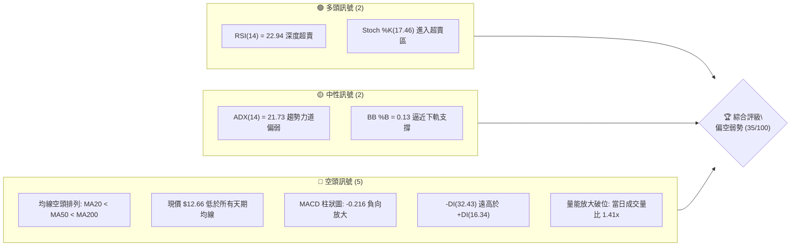
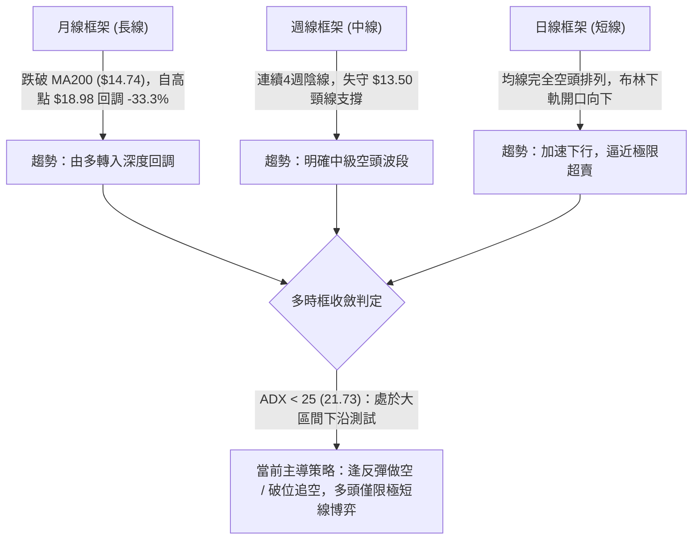
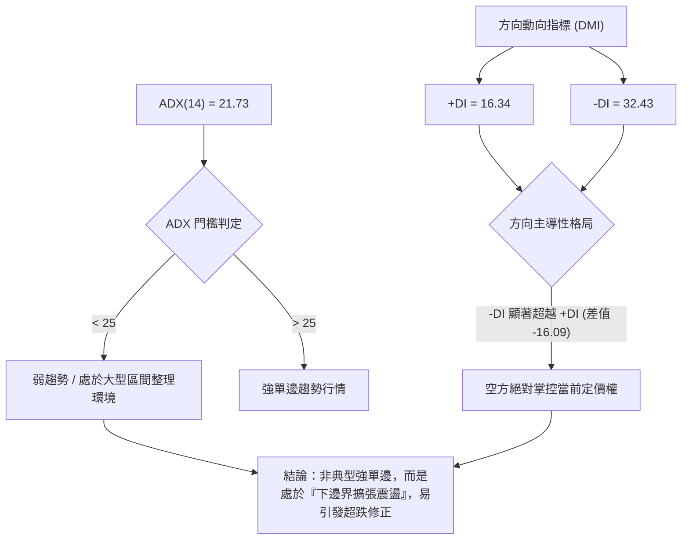
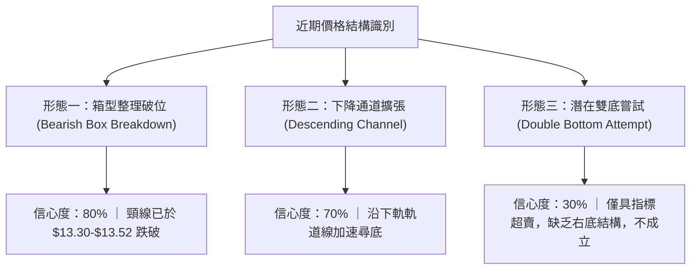
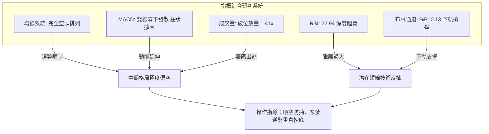
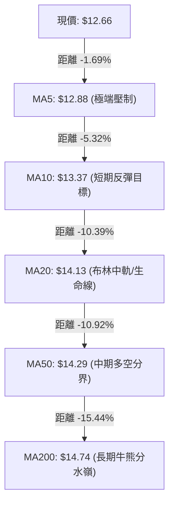
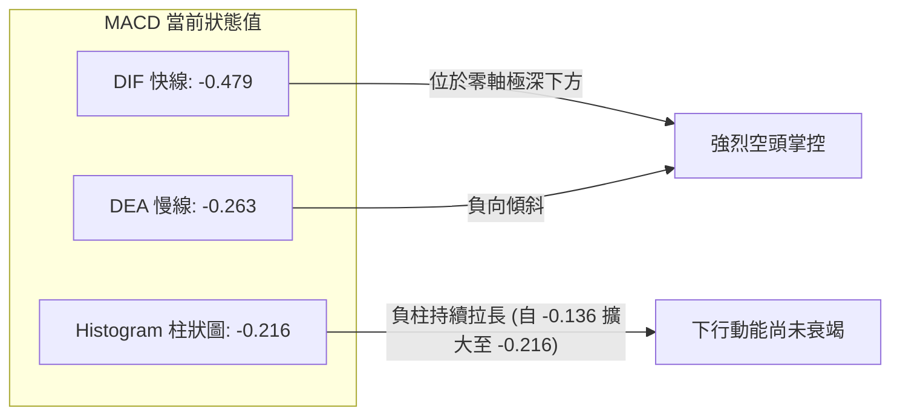
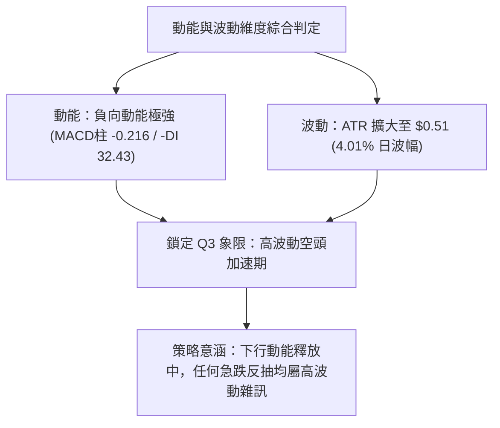
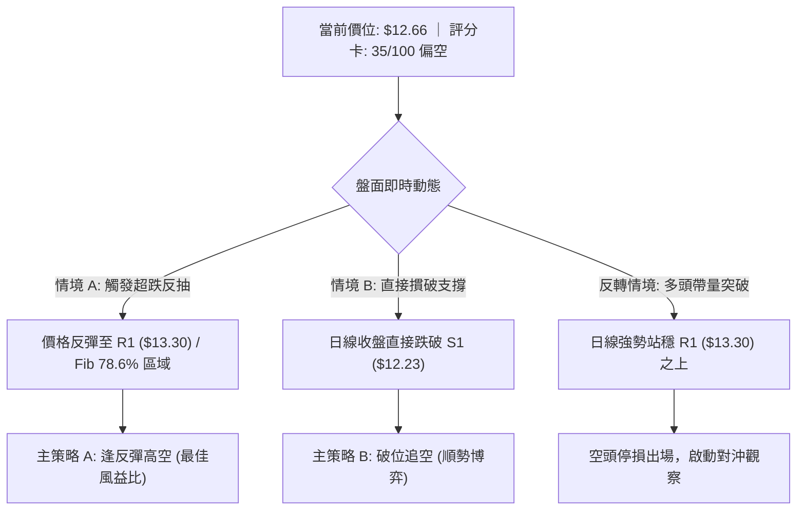
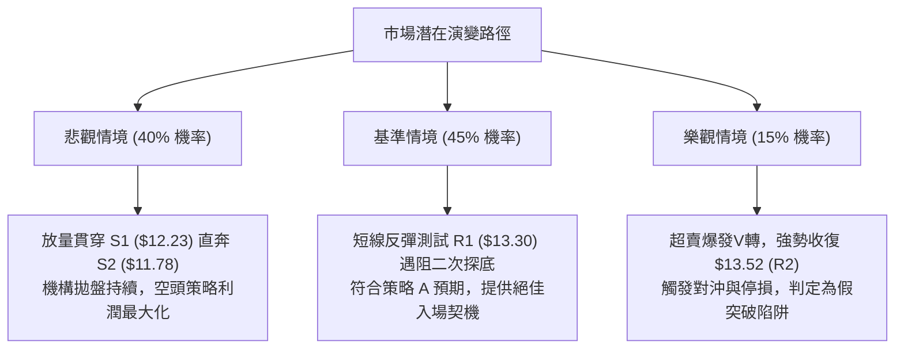

# NU 技術分析報告

> **報告日期**：2026-10-01 ｜ **語言**：繁體中文 ｜ **數據來源**：Yahoo Finance ｜ **當前價格**：$12.66

---

## 目錄

| 章節 | 內容 |
|------|------|
| [1. 技術面概覽](#1-技術面概覽) | 訊號儀表板、核心指標、評分卡 |
| [2. 趨勢分析](#2-趨勢分析) | 多時框趨勢、長中短期走勢 |
| [3. 圖表形態分析](#3-圖表形態分析) | 形態識別、K線組合、目標價 |
| [4. 支撐與阻力](#4-支撐與阻力) | 關鍵價位、斐波那契回調 |
| [5. 技術指標深度解讀](#5-技術指標深度解讀) | MA/RSI/MACD/布林/成交量 |
| [6. 動能與波動率](#6-動能與波動率) | 動能評估、ATR、Beta |
| [7. 多時框架總結](#7-多時框架總結) | 時框架評分矩陣 |
| [8. 交易策略建議](#8-交易策略建議) | 多空策略、風險報酬比 |
| [9. 風險提示與監控](#9-風險提示與監控) | 監控指標、風險場景 |
| [10. 報告總結](#10-報告總結) | 全文精要與決策看板 |

---

## 1. 技術面概覽

### 🎯 技術訊號儀表板



### 📊 核心指標速覽表

| 指標類別 | 指標名稱 | 當前數值 | 訊號 | 解讀 |
|----------|----------|----------|------|------|
| **價格** | 當前收盤價 | $12.66 | 🔴 | 跌破年線與斐波那契 78.6% ($12.86)，處於弱勢尋底階段 |
| **均線** | MA20 | $14.13 | 🔴 | 現價低於短期生命線 -10.39%，均線下彎形成動態壓制 |
| **均線** | MA50 | $14.29 | 🔴 | 季線下行，中線空頭格局明確 |
| **均線** | MA200 | $14.74 | 🔴 | 價格已實質跌破長期牛熊分水嶺，長線結構轉空 |
| **動能** | RSI(14) | 22.94 | 🟢 | 進入極端超賣區 (<30)，具技術性反彈動能，但尚未出現底背離 |
| **動能** | MACD | -0.479 / -0.263 | 🔴 | DIF 線於零軸下方持續下行，MACD 柱狀圖 -0.216 擴大看跌 |
| **動能** | 隨機指標 | %K 17.46 / %D 7.27 | 🟢 | 極度超賣，隨時可能出現低位黃金交叉帶動反彈 |
| **趨勢** | ADX / DMI | ADX: 21.73 | 🟡 | 弱趨勢/區間震盪 (<25)，但 -DI(32.43) 主導盤面 |
| **波動** | ATR(14) | $0.51 (4.01%) | 🟡 | 日內波幅溫和擴大，設定停損需維持 1.5-2 倍 ATR 緩衝空間 |
| **量能** | 當日量 / OBV | 104.2M / 1.41x | 🔴 | 帶量下跌，OBV 低於均線，資金外流現象顯著 |

### 🏆 技術評分卡

```
╔════════════════════════════════════════════════════════════════╗
║                   技術評分卡 — NU (2026-10-01)                 ║
╠════════════════════════════════════════════════════════════════╣
║ 趨勢強度 (Trend)     █████░░░░░░░░░░░░░░░  25/100   🔴 空頭主導  ║
║ 動能指標 (Momentum)  ██████░░░░░░░░░░░░░░  30/100   🔴 慣性向下  ║
║ 支撐穩定度 (Support) █████████░░░░░░░░░░░  45/100   🟡 考驗S1    ║
║ 成交量配合 (Volume)  ████████░░░░░░░░░░░░  40/100   🔴 帶量下殺  ║
║ 形態完整度 (Pattern) ████████░░░░░░░░░░░░  40/100   🟡 下降楔形  ║
║ 均線系統 (MA System) ████░░░░░░░░░░░░░░░░  20/100   🔴 空頭排列  ║
╠════════════════════════════════════════════════════════════════╣
║ 綜合評分             ███████░░░░░░░░░░░░░  35/100   🔴 偏空弱勢  ║
╚════════════════════════════════════════════════════════════════╝
```

---

## 2. 趨勢分析

### 🌐 多時框趨勢分析



### 📈 長期趨勢 — 12個月走勢圖（Unicode）

```
NU 月線走勢圖（過去12個月：2025-10 至 2026-09）
價格軸 ($)
$18.00 ┤                   ● $17.75 (2026-01 頂部形成)
$17.00 ┤             ● $17.39    ● $16.74
$16.00 ┤ ● $16.11                      
$15.00 ┤                               ● $14.98
$14.00 ┤                                     ● $14.37  ● $14.48       ● $14.33  ● $14.55
$13.00 ┤                                                        ● $13.13  ● $13.36
$12.00 ┤                                                                              ● $12.66 (現價)
       └───────────────────────────────────────────────────────────────────────────────────
         10    11    12    01    02    03    04    05    06    07    08    09 (月份)
```

#### 走勢特徵分析表格

| 階段 | 時間區間 | 起止價位 | 區間漲跌幅 | 走勢結構與技術特徵 |
|------|----------|----------|------------|--------------------|
| **衝頂期** | 2025-10 ~ 2026-01 | $16.11 → $17.75 | +10.18% | 創下波段高點 $17.75（逼近52週高點 $18.98），量能溫和萎縮，出現頂部滯漲跡象。 |
| **崩解期** | 2026-01 ~ 2026-03 | $17.75 → $14.37 | -19.04% | 跌破短期支撐，長陰下殺跌破 MA20 與 MA50，宣告中期上升趨勢告終。 |
| **平台弱整** | 2026-04 ~ 2026-08 | $14.48 → $14.55 | +0.48% | 在 $13.13 至 $15.37 間構築箱型震盪平台，反覆回踩確認季線壓力。 |
| **二次破位** | 2026-09 ~ 至今 | $14.55 → $12.66 | -12.99% | 帶量跌破平台下邊界，跌穿斐波那契 78.6% ($12.86)，開啟新一輪下行波段。 |

### 📊 中期趨勢（週線分析）

```
NU 近期週線壓力與支撐結構示意圖
$15.37 ──────────────────────────────────────── 關鍵波段高點 (2026-09-06)
                 ▼
$14.32 ──────────────────────────────────────── 強阻力 R3 (密集籌碼套牢區 / 斐波 61.8% $14.17)
                 ▼
$13.52 ──────────────────────────────────────── 阻力 R2 (反彈第一目標 / 平台頸線)
                 ▼
$13.30 ──────────────────────────────────────── 阻力 R1 (短期阻力位 / MA10 $13.37)
                 ▼
$12.66 ════════════════════════════════════════ 【現價位置】(收盤 $12.66)
                 ▼
$12.23 ---------------------------------------- 近期支撐 S1 (近一年波段低點聚類)
                 ▼
$11.78 ---------------------------------------- 強支撐 S2 (波段前低)
                 ▼
$11.20 ════════════════════════════════════════ 52週極限低點 (斐波那契 100.0%)
```

### ⚡ 趨勢強度評估（ADX 解讀）



| 指標變數 | 當前讀數 | 歷史門檻參考 | 當前狀態判定 | 交易策略意涵 |
|----------|----------|--------------|--------------|--------------|
| **ADX(14)** | 21.73 | 25.00 | 弱勢/非單邊 | 不宜在極限低位直接追空，需提防指標修正反抽 |
| **+DI(14)** | 16.34 | 20.00 | 多頭衰竭 | 多方買盤極度匱乏，反彈缺乏持續性資金推動 |
| **-DI(14)** | 32.43 | 25.00 | 空頭亢奮 | 空方完全控盤，任何未放量的反抽均為賣點 |

---

## 3. 圖表形態分析

### 🔍 形態識別系統



#### 圖表形態信心度與目標價評估表

| 形態類別 | 信心度 | 判斷依據（引用數據） | 完成度 | 目標價（附計算式） |
|----------|--------|----------------------|--------|--------------------|
| **箱型整理下破** | 80% | 跌破 2026-05 至 2026-08 形成的下邊界密集區 $13.30（阻力位 R1） | 85% | 箱頂 $14.55 - 箱底 $13.30 = 高度 $1.25。<br>破位目標 = $13.30 - $1.25 = **$12.05**（接近 S1 $12.23 與 S2 $11.78） |
| **下降通道加速** | 70% | 價格脫離 MA20 ($14.13) 下行，貼近布林下軌 $12.12 滑落 | 75% | 通道下軌支撐延伸對應近一年低點聚類 **S1: $12.23** |
| **雙重底型築底** | 25% | 數據中未偵測到二次探底並突破頸線之事實，RSI 雖超賣但無右肩/右底形態 | 10% | 訊號不足，依規則 15 不予採納，僅做指標型超賣解讀 |

### 🕯️ 重要K線形態分析

| 日期 / 週別 | 收盤價 | K線形態 | 解讀 | 訊號 |
|-------------|--------|---------|------|------|
| **2026-09-06** | $15.37 | 倒轉錘頭線 / 長上影陰線 | 上攻波段高點受阻於 MA200 ($14.74上方) 誘多失敗，主力出貨意圖明顯 | 🔴 空頭反轉 |
| **2026-09-13** | $14.62 | 中長黑實體陰線 | 跌破 MA20 ($14.13前身)，MACD 柱狀圖由正轉負 (-0.036) | 🔴 確認下行 |
| **2026-09-20** | $13.65 | 加速下挫大陰線 | 跌破盤整中樞 $14.00，成交量擴大至 3.68億股，空方主導突破 | 🔴 空頭延伸 |
| **2026-09-27** | $13.59 | 低位弱勢整理星線 | RSI 驟降至 19.9 極度超賣，但反彈乏力，留下破隱患 | 🟡 暫時停頓 |
| **2026-10-04** | $12.66 | 光腳大陰線（當前週） | 放量擊穿支撐位 $13.30，創下近5個月收盤新低，恐慌拋盤湧現 | 🔴 加速趕底 |

### 📉 ASCII 走勢形態示意圖

```
NU 下降通道破位與箱型頸線下破圖解
$15.37 ──┐ (2026-09-06 高點)
         │  反彈遇阻回落
$14.32 ──┼───────────┐ (R3 / MA50 / MA200 聚集阻力帶)
         │           │
$13.52 ──┼───────────┼───────────┐ (R2 / 箱體中軸)
         │           │           │
$13.30 ──┴───────────┴───────────┼── 箱體頸線破位點 (R1)
                                  │
$12.66 ───────────────────────────● 現價：跳空加速下尋支撐
                                  │
$12.23 ---------------------------┴-- 下降目標區 S1 (近一年波段低點聚類)
$11.78 ------------------------------ 下降目標區 S2
```

---

## 4. 支撐與阻力

### 🗺️ 關鍵價位分布圖（Unicode）

```
NU 價位結構分布圖（引用 OHLCV 計算聚類價位）
══════════════════════════════════════════════════════════════════
$14.32 ║████████████████████████████████║ 強阻力 R3 (+13.07%) / 近一年波段高點
$13.52 ║██████████████████████          ║ 關鍵阻力 R2 (+6.75%) / 籌碼密集區
$13.30 ║████████████████                ║ 近期阻力 R1 (+5.06%) / 原箱底支撐轉阻力
$12.86 ╟────────────────────────────────╢ 斐波那契 78.6% 回調位
$12.66 ╠════════════════════════════════╣ ◄ 當前市價 ($12.66)
$12.23 ║▓▓▓▓▓▓▓▓▓▓▓▓▓▓▓▓                ║ 近期第一支撐 S1 (-3.40%) / 近一年波段低點
$12.12 ╟────────────────────────────────╢ 布林通道下軌動態支撐
$11.78 ║████████████████████            ║ 強支撐 S2 (-6.95%) / 前期波段底部
$11.51 ║████████████████████████        ║ 極限支撐 S3 (-9.08%)
$11.20 ║████████████████████████████████║ 52週絕對低點 (斐波 100.0%)
══════════════════════════════════════════════════════════════════
```

### 🚧 阻力位分析表

| 阻力級別 | 價位 | 形成原因 | 突破難度 | 重要性 |
|----------|------|----------|----------|--------|
| **R1** | **$13.30** | 近一年波段高點聚類、前密集整理平台下沿，轉化為極強反壓 | 中等 | 🔴 極高（短線多空分水嶺，收復此處方有止跌可能） |
| **R2** | **$13.52** | 波段高點聚類阻力、週線多條K線實體密集處 | 高 | 🟡 次要（中級反彈目標與空頭加碼回補點） |
| **R3** | **$14.32** | 波段高點聚類、貼近 MA20 ($14.13) 與 MA50 ($14.29) 均線共振區 | 極高 | 🔴 核心（中期牛熊轉換臨界點，未突破前中期皆為空頭） |

### 🛡️ 支撐位分析表

| 支撐級別 | 價位 | 形成原因 | 守住機率 | 重要性 |
|----------|------|----------|----------|--------|
| **S1** | **$12.23** | 近一年波段低點聚類，與布林下軌 ($12.12) 形成共振支撐帶 | 60% | 🟡 高（短線超跌反彈第一觸發線） |
| **S2** | **$11.78** | 近一年重要波段低點聚類，歷史多頭強力防守區間 | 75% | 🔴 極高（中期強支撐，跌破將引發流動性踩踏） |
| **S3** | **$11.51** | 波段底部最後聚類點，距離 52W 低點僅一步之遙 | 85% | 🔴 戰略級（長線多頭底線） |

### 📐 斐波那契回調位分析

依據 52 週區間波段（低點 **$11.20** → 高點 **$18.98**，落差 $7.78）精確計算回調階梯：

```
斐波那契位階分布與現價關係
0.0%  (52W High)  $18.98 ───────────────────────────────────────
23.6%             $17.14 ───────────────────────────────────────
38.2%             $16.01 ───────────────────────────────────────
50.0%             $15.09 ───────────────────────────────────────
61.8% (黃金分割)  $14.17 ─────────────────── (跌破：宣告多頭主趨勢逆轉)
78.6%             $12.86 ─────────┬───────── (跌破：進入深度回調極限區)
現價位置          $12.66 ◄────────┴───────── (落於 78.6% 至 100.0% 之間)
100.0%(52W Low)   $11.20 ───────────────────────────────────────
```

- **位置解讀**：現價 **$12.66** 已實質跌穿斐波那契 78.6%（**$12.86**）。在經典波浪與斐波理論中，回調跌破 78.6% 意味著先前的上漲浪結構遭到徹底破壞，價格大概率將朝向 100% 斐波那契回調位（**$11.20** 即 52 週低點）尋求終極支撐。
- **動態反壓**：原 78.6% 回調位 **$12.86** 現在已轉化為短線第一道動態回抽阻力，其上方即為密集阻力 R1（**$13.30**）。

---

## 5. 技術指標深度解讀

### 🎛️ 指標訊號總覽



### 📈 移動平均線排列分析



#### 均線系統詳細參數表

| 天期 | 數值 | 乖離率 (Bias) | 走勢微型圖 | 狀態與意涵 |
|------|------|---------------|------------|------------|
| **MA5** | $12.88 | -1.69% | ▆▆▆▆▆▇▇██▇▆▅▄▃▂▁▁ | 極短線動態阻力，貼著價格下壓，壓制力強 |
| **MA10** | $13.37 | -5.32% | ▄▅▆▇▇████▇▆▅▄▃▂▁▁ | 與阻力位 R1 ($13.30) 形成重疊壓力帶 |
| **MA20** | $14.13 | -10.39% | ▂▃▄▅▆▇██▇▆▅▄▃▁▁ | 20日下彎加速，中期空頭防守線 |
| **MA50** | $14.29 | -10.92% | ▁▂▃▄▅▆▇█████████ | 季線下行，死叉 MA200 形成空頭死亡交叉 |
| **MA120** | $13.81 | -8.30% | ▃▂▁▃▄▆▇████▇▆▄▂▁ | 半年線失守，長期多頭籌碼全面套牢 |
| **MA200** | $14.74 | -14.11% | 空頭排列核心 | 年線在上方形成巨大蓋頂壓力 |

- **結論**：呈現完美的典型**空頭排列**（$12.66 < MA5 < MA10 < MA20 < MA50 < MA200），下行慣性強烈。

### 📉 RSI(14) 分析

```
RSI(14) 當前水平評估：22.94 
0 ───────[極度超賣 <30]─────── 50 ───────[超買區 >70]─────── 100
████████░░░░░░░░░░░░░░░░░░░░░░░░░░░░░░░░ 22.94%
```

- **超買超賣判定**：RSI(14) 來到 **22.94**，已經進入顯著的超賣區間 (<30)。歷史經驗顯示，當 NU 之 RSI 跌破 25 時，往往伴隨短線技術性回抽或減速築底。
- **背離分析**：
  - **日線層面**：價格創近幾個月新低，RSI 亦同步刷新低點，**未出現底背離**。
  - **週線層面**：週線 RSI(14) 自前期高位 79.0 (2026-07-05) 滑落至當前 22.9，與週線價格下行步伐一致，**無背離現象**。
  - **結論**：指標超賣是下行動能過於猛烈的結果，非反轉訊號，不可將超賣單純等同於買入訊號。

### 📊 MACD(12/26/9) 訊號解讀



- **訊號解析**：DIF 與 DEA 雙雙在零軸下方運行，且負向差距擴大至 **-0.216**。這代表空方攻擊動能處於主動釋放階段，空頭排列未見收斂收窄跡象，盲目摸底極易遭受動量反噬。

### 📦 布林通道分析

```
NU 布林通道 (20, 2) 價位架構
$16.13 ┬────────────────────────────────────────── BB 上軌 (Upper Band)
       │
       │
$14.13 ┼────────────────────────────────────────── BB 中軌 (MA20 / Mid Band)
       │
$12.66 ┼──● 現價位置 (%B = 0.13)
$12.12 ┴────────────────────────────────────────── BB 下軌 (Lower Band)
```

- **通道特徵**：目前布林通道開口顯著擴大，上軌位於 **$16.13**，中軌位於 **$14.13**，下軌位於 **$12.12**。
- **%B 指標分析**：%B 數值為 **0.13**（低於 0.20 門檻），說明價格正緊貼著布林下軌滑落，屬於典型的「沿下軌行進」強空走勢。雖然下軌 **$12.12** 提供靜態支撐效應，但只要通道開口不收斂，下軌支撐將持續向下動態後退。

### 💹 成交量分析（量價配合度）

- **量能擴大**：最新成交量達 **104,204,400 股**，相較於 20 日均量（74,075,580 股）放大至 **1.41 倍**。週線成交量亦高達 3.26 億股。
- **量價關係**：跌破前密集整理區時放量，呈現典型的「放量破位」空頭形態，顯示機構投資者（機構持股高達 82.3%）在跌穿重要防線後出現停損砍倉或主動避險賣盤。
- **能量潮 OBV**：目前 OBV 顯著低於其移動平均線（OBV < MA），資金呈現單向淨流出，量能完全未能確認多頭防守，空方量能佔據絕對壓倒性優勢。

---

## 6. 動能與波動率

### ⚡ 動能評估四象限

| 象限 | 動能維度 | 波動維度 | 代表特徵 | NU 當前定位 | 交易指導 |
|------|----------|----------|----------|-------------|----------|
| **Q1** | 強多頭動能 | 低波動率 | 穩健上升趨勢 | — | 順勢持股 |
| **Q2** | 弱動能/負動能 | 低波動率 | 沉悶窄幅盤整 | — | 區間高拋低吸 |
| **Q3** | 強空頭動能 | 高波動率 | 恐慌破位拋售 | **✓ (當前狀態)** | **順勢高空或觀望，嚴控抄底風險** |
| **Q4** | 強多頭動能 | 高波動率 | 突破暴漲行情 | — | 追漲突破 |



### 📊 ATR 波動率分析

- **ATR(14) 數值**：**$0.51**（佔現價百分比為 **4.01%**）。
- **日內波幅解讀**：每日平均波動超過半個美元，相對於 $12 附近的股價而言，具備中高波動度特性。
- **交易風控距離建議**：
  - **極短線（日內/隔夜）停損距**：$0.51 × 1.0 = **$0.51**。
  - **波段交易標準停損距**：$0.51 × 1.5 = **$0.77**。
  - **保守型寬鬆停損距**：$0.51 × 2.0 = **$1.02**。

### 📐 Beta 與市場相關性

- **Beta 係數**：**0.94**。
- **市場特徵分析**：NU 的波動節奏與大盤（S&P 500 / 納斯達克）維持高度同步（接近 1.0），這意味著當前股價的下挫除了自身破位因素外，亦受到整體新興市場金融科技板塊估值回調的系統性壓制。在 Beta 為 0.94 的背景下，若無大盤回暖支撐，個股走出獨立多頭反轉的難度極高。

---

## 7. 多時框架總結

### 📋 時框架評分表

| 時框架 | 趨勢方向 | 動能狀態 | 均線排列 | 形態結構 | 綜合評分 | 操作建議 |
|--------|----------|----------|----------|----------|----------|----------|
| **月線** | 🟡 中性偏弱 | MACD零上收斂 | 考驗MA20 | 52W高點回落33% | 45/100 | 長期部位減碼或賣出買權對沖 |
| **週線** | 🔴 明確空頭 | 負柱擴大/RSI 22.9 | MA20向下死叉 | 下破箱型整理中軸 | 30/100 | 波段反彈至 R1/R2 皆為空點 |
| **日線** | 🔴 加速尋底 | 極端超賣/無背離 | 完全空頭排列 | 沿布林下軌加速下墜 | 35/100 | 短線等待反彈賣壓衰竭，不盲目追單 |

### 🔲 綜合訊號矩陣

```
訊號維度對照表
┌───────────┬───────────┬───────────┬───────────┬───────────┐
│  分析維度 │  日線訊號 │  週線訊號 │  月線訊號 │  收斂權重 │
├───────────┼───────────┼───────────┼───────────┼───────────┤
│  趨勢排列 │  🔴 強烈看空 │  🔴 明確看空 │  🟡 中性偏空 │    40%    │
│  動能強度 │  🟢 超賣反抽 │  🔴 空頭放量 │  🔴 動能衰竭 │    25%    │
│  量價結構 │  🔴 帶量破位 │  🔴 放量下行 │  🟡 量能退潮 │    20%    │
│  支撐位態 │  🟡 逼近 S1  │  🟡 測試箱底 │  🟢 接近長線支│    15%    │
└───────────┴───────────┴───────────┴───────────┴───────────┘
```

### ⚖️ 多時框收斂結論

依據多時框收斂優先級規則：
1. **行情屬性判定**：當前 ADX 為 **21.73 (< 25)**，技術上屬於「大區間整理結構下的破位測試行情」，而非無邊界的超強單邊行情。
2. **主導時框裁決**：在 ADX < 25 且日線指標極度超賣（RSI 22.94）的環境下，**日線布林通道上下軌 ($12.12 - $16.13) 與關鍵支撐/阻力聚類位構成當前核心交投範圍**。然而，由於週線與日線均線呈現無可爭議的空頭排列，趨勢壓制佔據絕對主導地位。
3. **唯一方向性結論**：**【偏空弱勢 🔴】**。
   - 所有短線超賣引發的反彈，在未有效帶量突破 R1 ($13.30) 之前，均判定為「技術性修正」而非反轉。
   - 主策略全面定調為**空頭逢高佈局與順勢防守策略**。

---

## 8. 交易策略建議

### 🗺️ 策略決策流程圖



### 🧭 策略路由（依評分卡分流）

> **當前主策略方向 = 【偏空主導，順勢高空／破位空】（綜合評分：35/100 ≤ 40）**
> 
> 鑑於綜合評分低於 40 且日/週線共振向下，本報告主推**空頭策略**。多頭操作僅限於反向風險提示與嚴格風控下的極短線博弈，不可作為核心持倉策略。

### 🎯 價格情境階梯（Price Scenarios）

以現價 **$12.66** 為基準，嚴格引用系統計算之關鍵價位構建情境階梯：

| 觸發條件 | 下一目標 | 後續延伸 | 情境含義與操作指引 |
|----------|----------|----------|--------------------|
| **向上突破 R1 $13.30** | R2 $13.52 | R3 $14.32 | **短線超跌反抽成立**：空頭部位需在此停損或減碼，市場或將上探季線密集套牢區。 |
| **受阻於 R1 $13.30 回落** | 現價 $12.66 | S1 $12.23 | **反彈遇阻再跌（最佳空點）**：確認下行趨勢中繼，順勢做空獲取主跌段利潤。 |
| **跌破 S1 $12.23** | S2 $11.78 | S3 $11.51 | **空頭二次加速破位**：布林下軌開口被動撕裂，目標直指年內極限防線。 |
| **失守 S3 $11.51** | 52W低點 $11.20 | — | **終極全面尋底**：斐波那契 100% 歸位，多頭防線全面瓦解。 |

### 📊 情境機率分佈

| 情境 | 機率 | 主要依據（指標狀態支撐） |
|------|------|--------------------------|
| **弱勢反抽後回落** | **45%** | RSI(14)=22.94 嚴重超賣具反彈修復需求，但均線與 MACD 柱狀圖（-0.216）全面壓制，反彈至 R1 即為反壓。 |
| **直接破位再探底** | **35%** | 當日成交量放量至 1.41x，OBV 疲軟下行，-DI(32.43) 絕對主導，存在慣性摜穿 S1 ($12.23) 可能。 |
| **低位區間震盪整理** | **20%** | ADX=21.73 (<25) 顯示非單邊超級趨勢，布林下軌 ($12.12) 與 S1 存在局部被動買盤抵抗。 |

### 🟢 主策略詳情（空頭主推方案）

依據嚴格數據紀律，入場、停損、目標價嚴格錨定 OHLCV 聚類價位：

| 策略要素 | 策略 A：反彈遇阻做空（主推推薦） | 策略 B：破位順勢跟進（次選備案） |
|----------|----------------------------------|----------------------------------|
| **進場條件** | 價格反彈至 R1 遇阻收上影線或黑K確認 | 日線實體跌破支撐位 S1 並伴隨成交量放大 |
| **進場價格** | **$13.30**（阻力位 R1） | **$12.20**（跌破 S1 $12.23 後微幅順勢跟進） |
| **目標價 T1** | **$12.23**（支撐位 S1，潛在獲利 +8.05%） | **$11.78**（支撐位 S2，潛在獲利 +3.44%） |
| **目標價 T2** | **$11.78**（支撐位 S2，潛在獲利 +11.43%） | **$11.51**（支撐位 S3，潛在獲利 +5.66%） |
| **停損價格** | **$13.81**（MA120 半年線阻力位） | **$12.86**（斐波那契 78.6% 壓力位） |
| **風險空間** | $0.51 (相當於 1.0x ATR) | $0.66 (相當於 1.3x ATR) |
| **風險報酬比** | **1 : 2.10**（按 T1 計算）/ **1 : 2.98**（按 T2） | **1 : 1.03**（按 T1）/ **1 : 1.70**（按 T2） |
| **勝率預估** | 65% | 55% |
| **建議倉位** | 10% - 15% 總部位 | 5% - 8% 總部位 |

### 🔴 反向風險觸發點（多頭對沖提示）

若出現以下訊號，空頭結構即刻推翻，投資人應即刻執行空單平倉，並切換至觀望或對沖操作：
1. **價位突破**：日線收盤價強勢突破 **$13.30 (R1)** 且次日回踩不破。
2. **動能修復**：RSI(14) 站回 35 以上，且日線 MACD 出現零下金叉（柱狀圖由負轉正）。
3. **量能異動**：在 $12.23 附近出現單日超過 1.5 億股的爆量長下影K線（十字星或錘頭線）。

### ⭐ 整體訊號強度評星

```
╔════════════════════════════════════════════════════════════════╗
║ 做多訊號強度：  ★☆☆☆☆  (1/5星) ── 僅剩指標超賣，無左側依託  ║
║ 做空訊號強度：  ★★★★☆  (4/5星) ── 均線動能共振，破位態勢確立  ║
║ 整體可信度：    ★★★★☆  (4/5星) ── 價量配合理想，空頭邏輯清晰  ║
╚════════════════════════════════════════════════════════════════╝
```

---

## 9. 風險提示與監控

### ✅ 關鍵監控指標 Checklist

```
╔════════════════════════════════════════════════════════════════╗
║                     即時風控監控清單 (Checklist)               ║
╠════════════════════════════════════════════════════════════════╣
║ [ ] 監控 $12.23 (S1) 支撐是否有效：跌破是否引發放量踩踏       ║
║ [ ] 監控 $12.86 (Fib 78.6%) 回抽表現：是否形成明確反壓頂       ║
║ [ ] 監控 $13.30 (R1) 關鍵空頭防線：空單最終防守基準點          ║
║ [ ] 監控 RSI(14) 是否在 20 附近鈍化：鈍化加深意味著不可追單    ║
║ [ ] 監控 MACD 柱狀圖是否收斂至 -0.100 以內：警惕反抽波段開啟    ║
║ [ ] 監控當日成交量：若縮量跌破則需防範假突破誘空陷阱           ║
╚════════════════════════════════════════════════════════════════╝
```

### ⚠️ 風險場景分析



### 🛡️ 風險管理重要提醒

1. **嚴防超跌逆襲（Short Squeeze）**：由於當前 RSI(14) 處於 **22.94** 極端低位，且空頭浮動比率（Short % Float）為 3.5%，一旦大盤出現強烈反彈或公司基本面有利多釋出，極易引發快速的空頭回補脈衝。**絕不可在現價 $12.66 盲目追空**，耐心等待回抽阻力位方為上策。
2. **波動率與部位控管**：考量到 ATR 為 **$0.51**（4.01%），單日波動幅度較大，單筆交易虧損應嚴格限制於總資金的 **1.0%** 範圍內。以策略 A 停損距 $0.51 計算，建議持倉槓桿不宜超過 1 倍。
3. **機構籌碼動向監控**：NU 的機構持股佔比高達 **82.3%**，目前的放量下行（104M 成交量）具有強烈的機構減碼特徵。在未見到機構買盤明顯護盤（日K出現長下影巨量紅K）之前，切忌主觀認定「已經見底」。

---

## 📋 報告總結

```
╔════════════════════════════════════════════════════════════════╗
║                     NU 技術分析報告總結                        ║
╠════════════════════════════════════════════════════════════════╣
║ 報告日期：2026-10-01                                           ║
║ 當前價格：$12.66                                               ║
║ 分析評級：🔴 偏空弱勢 (評分: 35/100)                           ║
╠════════════════════════════════════════════════════════════════╣
║ 關鍵結論：                                                     ║
║ ├─ 長期趨勢：🔴 跌破 MA200 ($14.74) 與斐波 78.6%，長期轉弱     ║
║ ├─ 中期趨勢：🔴 箱型中樞破位，週線四連陰下挫                  ║
║ ├─ 短期趨勢：🟡 極端超賣 (RSI 22.94)，存在技術性反抽需求       ║
║ ├─ 關鍵阻力：R1: $13.30 ｜ R2: $13.52 ｜ R3: $14.32            ║
║ ├─ 關鍵支撐：S1: $12.23 ｜ S2: $11.78 ｜ S3: $11.51            ║
║ └─ 分析師目標價：均價 $18.64 (最低標 $12.00 / 最高標 $23.00)    ║
╠════════════════════════════════════════════════════════════════╣
║ 最優策略組合：                                                 ║
║ 1. 🥇 最佳機會：反彈至阻力 R1 ($13.30) 逢高做空，停損設於      ║
║                 MA120 ($13.81)，下看支撐 S1 ($12.23) 與 S2     ║
║ 2. 🥈 次選機會：靜待實質跌破 S1 ($12.23) 後順勢跟空，下看      ║
║                 S2 ($11.78) 與 S3 ($11.51)                     ║
║ 3. 🥉 保守選擇：空手觀望，靜待指標由超賣區鈍化修復，出現明確   ║
║                 右側築底結構再行評估介入                       ║
╚════════════════════════════════════════════════════════════════╝
```

---

> ⚠️ **免責聲明**：本報告為 AI 自動生成之技術分析，所有數據及估算均基於提供的歷史價格資訊。本報告**僅供研究與學術參考**，**不構成任何投資建議**。投資有風險，入市需謹慎。

---

*報告生成時間：2026-10-01 ｜ 數據來源：Yahoo Finance ｜ 分析框架：多時框技術分析*