# NU 技術分析報告

> **報告日期**：2026-10-02 ｜ **語言**：繁體中文 ｜ **數據來源**：Yahoo Finance ｜ **當前價格**：$13.29

---

## 目錄

| 章節 | 內容 |
|------|------|
| [1. 技術面概覽](#1-技術面概覽) | 訊號儀表板、核心指標、評分卡 |
| [2. 趨勢分析](#2-趨勢分析) | 多時框趨勢、長中短期走勢 |
| [3. 圖表形態分析](#3-圖表形態分析) | 形態識別、K線組合、目標價 |
| [4. 支撐與阻力](#4-支撐與阻力) | 關鍵價位、斐波那契回調 |
| [5. 技術指標深度解讀](#5-技術指標深度解讀) | MA/RSI/MACD/布林/成交量 |
| [6. 動能與波動率](#6-動能與波動率) | 動能評估、ATR、Beta |
| [7. 多時框架總結](#7-多時框架總結) | 時框架評分矩陣、收斂結論 |
| [8. 交易策略建議](#8-交易策略建議) | 多空策略、風險報酬比 |
| [9. 風險提示與監控](#9-風險提示與監控) | 監控指標、風險場景 |
| [10. 報告總結](#-報告總結) | 核心摘要、最優策略組合 |

---

## 1. 技術面概覽

### 🎯 技術訊號儀表板

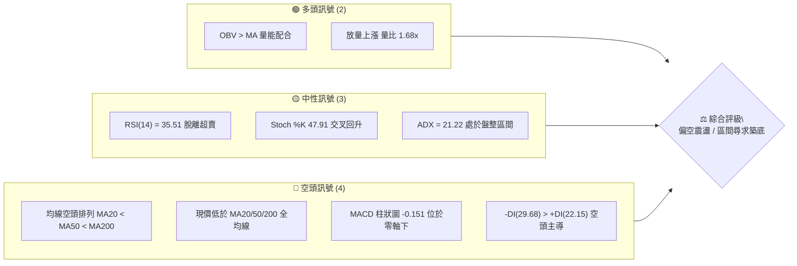

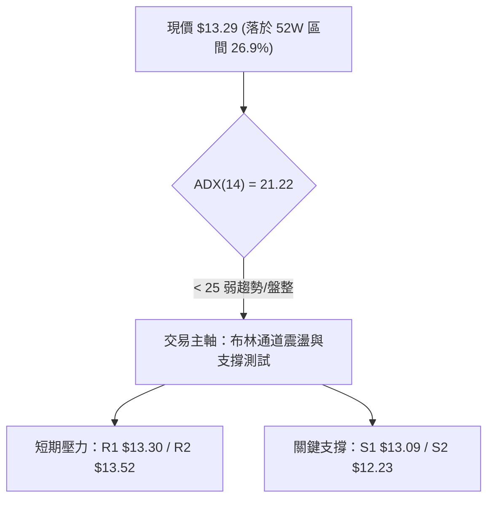

### 📊 核心指標速覽表

| 指標類別 | 指標名稱 | 當前數值 | 訊號 | 解讀 |
|----------|----------|----------|------|------|
| **價格** | 當前價格 | $13.29 | 🔴 | 位於 52 週低檔區（26.9% 分位），受壓於各期均線 |
| **均線** | MA20 | $14.02 | 🔴 | 價格在 MA20 下方 -5.22%，中短期下行壓制顯著 |
| **均線** | MA50 | $14.27 | 🔴 | 價格在 MA50 下方 -6.87%，中期趨勢轉向走弱 |
| **均線** | MA200 | $14.72 | 🔴 | 價格在 MA200 下方 -9.71%，長期牛熊分界線失守 |
| **動能** | RSI(14) | 35.51 | 🟡 | 脫離前週 19.9 極度超賣區，微弱回升但仍處弱勢中性 |
| **動能** | MACD (12,26,9) | -0.452 / 柱 -0.151 | 🔴 | 雙線位於零軸下，柱狀圖負向擴散，動能偏空 |
| **波動** | ATR(14) | $0.50 (3.79%) | 🟡 | 波動率處於中等水準，具備日內震盪與波段操作空間 |
| **趨勢強度** | ADX(14) | 21.22 | 🟡 | 數值低於 25，單邊動能不足，當前定性為區間盤整行情 |
| **成交量** | 最新成交量 / 量比 | 128.37M / 1.68x | 🟢 | 放量收陽反彈，量能有效放大（高於20日均量 76.46M） |

### 🏆 技術評分卡

```
╔══════════════════════════════════════════════════════════════╗
║              技術評分卡 — NU (2026-10-02)                    ║
╠══════════════════════════════════════════════════════════════╣
║ 趨勢強度 (ADX=21.22)   ████████░░░░░░░░░░░░  38/100   🔴 弱勢 ║
║ 動能指標 (RSI/MACD)    ███████░░░░░░░░░░░░░  35/100   🔴 偏空 ║
║ 支撐穩定度 (S1/S2防守) ████████████░░░░░░░░  58/100   🟡 中立 ║
║ 成交量配合 (OBV>MA)    ██████████████░░░░░░  70/100   🟢 偏多 ║
║ 形態完整度 (區間築底)  ██████████░░░░░░░░░░  48/100   🟡 中立 ║
║ 均線排列 (空頭發散)    ████░░░░░░░░░░░░░░░░  20/100   🔴 極弱 ║
╠══════════════════════════════════════════════════════════════╣
║ 綜合評分               ████████░░░░░░░░░░░░  44/100   🟡 偏空中性 ║
╚══════════════════════════════════════════════════════════════╝
```

---

## 2. 趨勢分析

### 🌐 多時框趨勢分析

依據多時框收斂原則，當前 ADX(14) = 21.22 < 25，市場缺乏強大單邊趨勢，屬於**震盪盤整行情**。在此架構下，日線布林通道與波段高低點為核心交易區間。

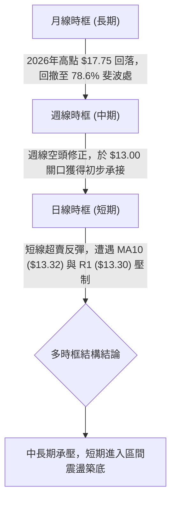

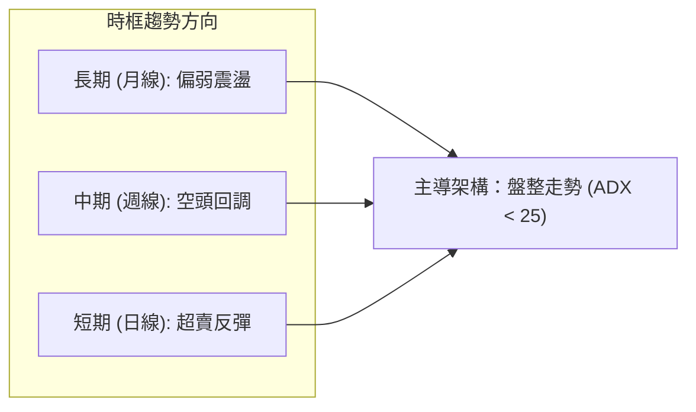

### 📈 長期趨勢 — 12個月走勢圖（Unicode）

```
NU 月線走勢圖（過去12個月：2025-10 至 2026-10）
價格軸 ($)
$18.00 ┤                             ● (2026-01: $17.75)
$17.00 ┤                     ●
$16.00 ┤       ●
$15.00 ┤                                   ●
$14.00 ┤                                         ●     ●     ●
$13.00 ┤                                                     ●   ●←現價 $13.29
$12.00 ┤                                                               
       └─────────────────────────────────────────────────────────────
        10    11    12    01    02    03    04    05    06    07    08    09   10
      (25)  (25)  (25)  (26)  (26)  (26)  (26)  (26)  (26)  (26)  (26)  (26) (26)
```

**走勢特徵分析表格**：

| 階段 | 時間區間 | 起止價位 | 漲跌幅 | 走勢特徵分析 |
|------|----------|----------|--------|--------------|
| 衝頂階段 | 2025-10 ~ 2026-01 | $16.11 → $17.75 | +10.18% | 創下 52 週次高點，月線動能見頂，高檔換手加劇 |
| 第一波回撤 | 2026-01 ~ 2026-03 | $17.75 → $14.37 | -19.04% | 獲利了結盤湧出，接連跌破 MA20 與 MA50 短期均線 |
| 弱勢橫盤 | 2026-03 ~ 2026-08 | $14.37 → $14.55 | +1.25% | 圍繞 $14.00 關卡窄幅震盪，高點未過 $15.37 |
| 二度破位探底 | 2026-08 ~ 2026-10 | $14.55 → $13.29 | -8.66% | 跌破 $14.00 關鍵整數關口，觸及斐波 78.6% 回調位 ($12.86) |

### 📊 中期趨勢（週線分析）

從近 20 週收盤走勢可見，股價在 2026-07-05 達到波段高點 $13.61，隨後於 2026-08-16 衝高至 $15.23，2026-09-06 達 $15.37。但隨後三週遭遇強烈拋壓，2026-09-27 收於 $13.59（RSI 驟降至 19.9 極度超賣），本週（2026-10-04 當週）最新報價 $13.29，週成交量放大至 454.68M，顯示在低檔有逢低買盤積極接籌。

```
週線壓力支撐示意圖：
$15.37 ────────────────────────────────── 近期波段頂部阻力
$14.32 ────────────────────────────────── R3 關鍵結構轉換位 (前波平台)
$13.52 ────────────────────────────────── R2 波段密集回跌高點
$13.30 ────────────────────────────────── R1 當前第一阻力
$13.29 ◄─── 現價位置
$13.09 ────────────────────────────────── S1 近期波段低點支撐
$12.23 ────────────────────────────────── S2 6月份波段低點平台
$11.20 ────────────────────────────────── 52週最低價 (絕對底線)
```

### ⚡ 趨勢強度評估（ADX 解讀）

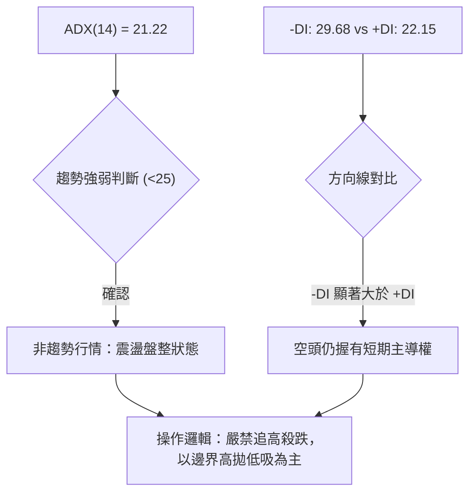

**ADX 趨勢強度對照表**：

| 指標變數 | 當前讀數 | 標準門檻 | 狀態解讀 |
|----------|----------|----------|----------|
| **ADX(14)** | 21.22 | 25.00 | **弱趨勢 / 盤整市場**：不宜使用強趨勢追突破策略 |
| **+DI** | 22.15 | - | 多頭向上驅動力薄弱，仍處修復階段 |
| **-DI** | 29.68 | - | 空頭向下動能雖然佔優，但隨 ADX 低迷未形成單邊崩跌 |
| **差值 (-DI - +DI)** | +7.53 | - | 空方相對優勢存在，反彈仍將受到壓制 |

---

## 3. 圖表形態分析

### 🔍 形態識別系統

在多時框與日線架構下，NU 當前並未出現經典的大型幾何轉折形態（如完整頭肩底或大型旗形）。目前走勢呈現**布林下軌超賣反彈**與**區間築底試探**特徵。

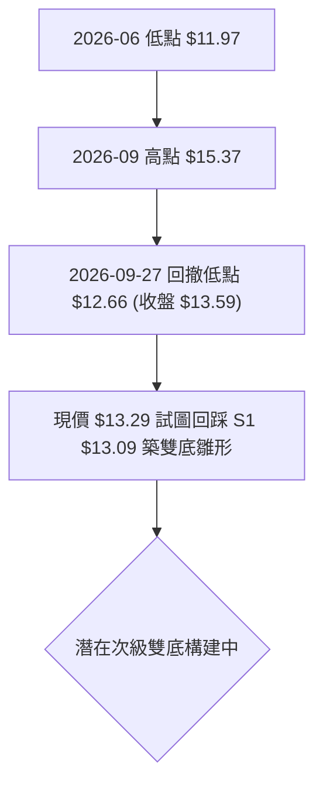

**形態信心度與判斷依據表（依規則 15）**：

| 形態 | 信心度 | 判斷依據（引用數據） | 完成度 | 目標價（附計算式） |
|------|--------|----------------------|--------|--------------------|
| **潛在次級雙底 (Double Bottom)** | 48% | 前低為 9月低點 $12.66 與支撐 S1 $13.09，現價 $13.29 試圖守穩 | 40% | 頸線為 R3 $14.32；形態高度 = $14.32 - $12.66 = $1.66；理論目標價 = $14.32 + $1.66 = $15.98（約對應 BB 上軌 $15.97） |
| **布林通道下軌極限反彈** | 75% | BB %B 達 0.31，自下軌 $12.08 上方展開技術性修正回抽 | 65% | 目標價即為 BB 中軌（MA20）= **$14.02** |
| **頭肩頂形態** | 25% | 數據不足以確認頸線有效跌破，無對稱右肩 | 0% | 訊號不足，僅做指標型解讀，不預設跌幅目標 |

### 🕯️ 重要K線形態分析

| 月份 / 週別 | 收盤價 | K線形態 | 解讀 | 訊號 |
|-------------|--------|---------|------|------|
| 2026-08-16 週 | $15.23 | 長陽突破 | 放量挑戰 $15.00 大關，多頭展現強大上攻企圖 | 🟢 |
| 2026-09-06 週 | $15.37 | 高檔十字星/長上影 | 觸及區間頂部後遭遇強大阻力，買盤動能衰竭 | 🔴 |
| 2026-09-20 週 | $13.65 | 大陰線破位 | 跌破短期均線聚合區，MACD 柱狀圖轉為負向 (-0.192) | 🔴 |
| 2026-09-27 週 | $13.59 | 探底長下影錘頭 | 週低觸及超賣區（週 RSI 達 19.9），下方逢低承接買盤顯現 | 🟡 |
| 2026-10-04 當週 | $13.29 | 放量震盪整理線 | 最新日成交量暴增至 128.37M（量比 1.68x），籌碼大規模換手 | 🟡 |

### 📉 ASCII 走勢形態示意圖

```
潛在雙底雛形與布林下軌回抽示意圖：
$14.32 ───────┬───────────────────────────┬──────── 頸線阻力 (R3)
              │                           │
$13.52 ───────┼───────────●───────────────┼──────── 反彈第一壓力 (R2)
              │          / \              │
$13.30 ───────┼─────────●   \   ● (現價) ──┼──────── 即時壓力 (R1)
$13.09 ───────┼────────/     \ /          │──────── 短線支撐 (S1)
              ●       ●       ●           │
$12.66 ──────/ \     /                    │──────── 9月破位低點
            /   \   /                     │
$12.08 ────●─────●────────────────────────┴──────── 布林下軌支撐
        (06月底)  (09月底低點)
```

### 🎯 形態目標價計算

根據上述「潛在次級雙底」之量化模型推算（僅在有效突破頸線後成立）：
- **形態低點**：取 2026-09 月度極值低點 $12.66
- **確認頸線**：採用關鍵高點阻力聚類 R3 = **$14.32**
- **垂直形態高度 ($H$)**：$14.32 - $12.66 = \$1.66$
- **多頭突破理論目標 (T2)**：$\text{頸線} + H = 14.32 + 1.66 = \mathbf{\$15.98}$（精準契合當前日線布林通道上軌 **$15.97**）
- **中途第一目標 (T1)**：取波段密集高點阻力 R2 = **$13.52** 或布林中軌 **$14.02**

---

## 4. 支撐與阻力

### 🗺️ 關鍵價位分布圖（Unicode）

```
╔══════════════════════════════════════════════════════════════════╗
║                    NU 價位結構分布圖                             ║
╠══════════════════════════════════════════════════════════════════╣
║ $18.98 ║████████████████████████║ 52W 最高點 / 斐波 0.0%         ║
║ $17.14 ║████████████████        ║ 斐波 23.6% 回調位              ║
║ $16.01 ║████████████████████    ║ 斐波 38.2% 回調位              ║
║ $15.09 ║████████████████████████║ 斐波 50.0% / 中期強阻力        ║
║ $14.32 ║████████████████████    ║ 強阻力 R3 / 密集換手平台       ║
║ $14.17 ║████████████████        ║ 斐波 61.8% 黃金分割位          ║
║ $13.52 ║████████████            ║ 阻力 R2 / 近期波段反彈高點     ║
║ $13.30 ║████████████████████████║ 關鍵阻力 R1 / 今日即時阻力     ║
║ ───────╫────────────────────────╫─────────────────────────────── ║
║ $13.29 ╠════════════════════════╣ ◄── 現價 ($13.29)              ║
║ ───────╫────────────────────────╫─────────────────────────────── ║
║ $13.09 ║▓▓▓▓▓▓▓▓▓▓▓▓▓▓▓▓        ║ 近期波段支撐 S1                ║
║ $12.86 ║▓▓▓▓▓▓▓▓▓▓▓▓▓▓▓▓▓▓▓▓    ║ 斐波 78.6% 回調支撐位          ║
║ $12.23 ║████████████████████████║ 強支撐 S2 / 6月份底部區間     ║
║ $11.78 ║████████████████        ║ 深層支撐 S3                    ║
║ $11.20 ║████████████████████████║ 52W 最低點 / 斐波 100.0%       ║
╚══════════════════════════════════════════════════════════════════╝
```

### 🚧 阻力位分析表

所有價位均嚴格引用自「關鍵價位」OHLCV 計算成果：

| 阻力級別 | 價位 | 距現價幅動 | 形成原因 | 突破難度 | 重要性 |
|----------|------|------------|----------|----------|--------|
| **R1** | **$13.30** | +0.08% | 近一年波段高點聚類、MA10 ($13.32) 糾結處 | 🟡 中等 | 短線轉強第一道門檻，日內需實質站穩 |
| **R2** | **$13.52** | +1.69% | 近期反彈波段高點聚類、前週下跌缺口下緣 | 🟡 中等 | 短線多空強弱分水嶺 |
| **R3** | **$14.32** | +7.71% | 近一年強密集高點、MA60 ($14.21) 與 MA50 ($14.27) 聚合處 | 🔴 極高 | 中期趨勢逆轉之關鍵頸線位置 |

### 🛡️ 支撐位分析表

所有價位均嚴格引用自「關鍵價位」OHLCV 計算成果：

| 支撐級別 | 價位 | 距現價幅動 | 形成原因 | 守住機率 | 重要性 |
|----------|------|------------|----------|----------|--------|
| **S1** | **$13.09** | -1.54% | 近一年波段低點聚類、整數關卡前哨 | 65% | 極短線多頭防禦基石，失守將測試下軌 |
| **S2** | **$12.23** | -7.98% | 2026年6月份震盪低點密集區、貼近布林下軌 $12.08 | 80% | 中期強力支撐帶，多頭防線重鎮 |
| **S3** | **$11.78** | -11.36% | 波段極限回撤低點聚類，逼近 52 週最低價 | 90% | 結構崩潰前的終極緩衝區 |

### 📐 斐波那契回調位分析

依據 52 週極值區間（最低 $11.20 → 最高 $18.98）計算之黃金分割架構如下：

```
0.0%  (52W High) ── $18.98
23.6% ───────────── $17.14
38.2% ───────────── $16.01
50.0% ───────────── $15.09
61.8% ───────────── $14.17
─────────────────── 現價 $13.29 (處於 61.8% 與 78.6% 之間)
78.6% ───────────── $12.86
100.0%(52W Low)  ── $11.20
```

- **位置解讀**：現價 $13.29 跌破了重要黃金分割 61.8%（$14.17），目前運行於 **61.8% ($14.17)** 與 **78.6% ($12.86)** 的深度回調區間內。
- **技術意義**：78.6%（$12.86）為多頭最後的技術性深層防禦位。若能在 $12.86 ~ $13.09（S1）區間築底，則代表自 $18.98 的下行回調屬於深度洗盤；反之，若實體陰線有效跌破 $12.86，股價將大概率滑向 100% 斐波低點 **$11.20**。

---

## 5. 技術指標深度解讀

### 🎛️ 指標訊號總覽

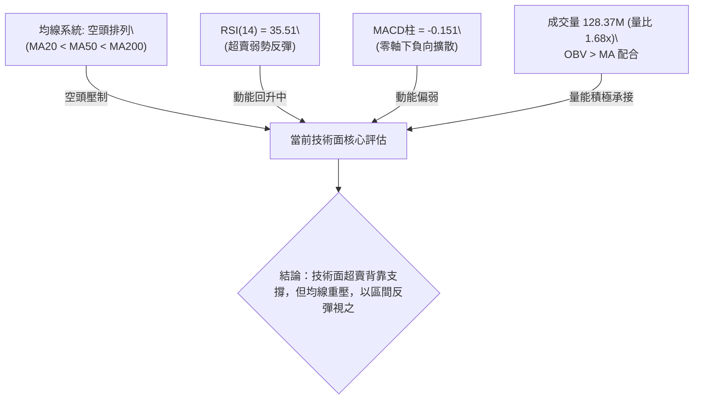

### 📈 移動平均線排列分析

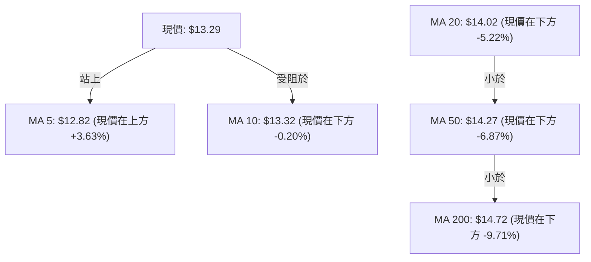

**均線狀態解讀**：
- **短週期**：MA5 ($12.82) 拐頭向上，價格站上 MA5，顯示短期殺跌告一段落；但 MA10 ($13.32) 剛好壓在現價頭頂（差距僅 $0.03），構成日內第一反彈阻力。
- **中長週期**：MA20 ($14.02) < MA50 ($14.27) < MA200 ($14.72)，呈現典型的**空頭排列**，且所有中長期均線皆處於現價上方。這表明中期趨勢已被空頭牢牢掌控，任何反彈若無法放量突破 MA20，均屬於技術性抽腳。

### 📉 RSI(14) 分析

- **RSI 當前數值**：**35.51** 
  ```
  0       20        40   35.51   60        80      100
  ├────────┼────────┼───●───────┼────────┼────────┤
  [ 超 賣 區 ]        [   中 性 弱 勢 區   ]       [ 超 買 區 ]
  進度條：███████░░░░░░░░░░░░░ (35.51%)
  ```
- **區間評估**：RSI 從前週的極度超賣值 **19.9** 大幅修復至 **35.51**，脫離極度鈍化恐慌區，進入弱勢中性震盪區。
- **背離判斷**：
  - 價格在 2026-09 月自 $14.62 下跌至 $13.29，而 RSI 在 2026-09-27 觸及 19.9 低點後，本週回升至 35.51。
  - **結論**：日線與週線層面出現微幅的**超賣底背離雛形**（價格創新低而 RSI 未創新低），這解釋了為何在 $13.00 關卡附近出現強勁的成交量支撐。

### 📊 MACD(12/26/9) 訊號解讀

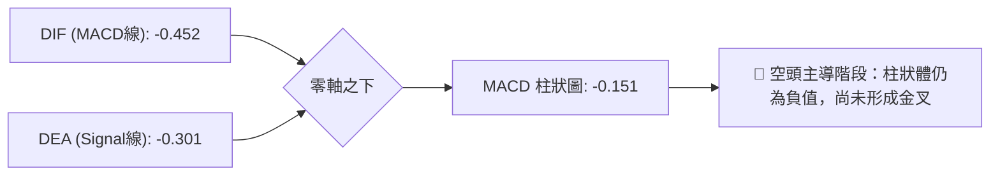

- **MACD 線**：-0.452，位於零軸之下，反映中期波段仍由空方控盤。
- **Signal 訊號線**：-0.301，同樣深處零軸下方。
- **柱狀圖 (Histogram)**：-0.151，雖然負值較前兩週有所收斂，但尚未形成黃金交叉。多頭必須等待 MACD 柱狀圖收斂至零軸並金叉，方能確認波段級別買點。

### 📦 布林通道分析

```
布林通道結構圖 (參數: 20, 2)：
$15.97 ──────────────────────────────────────── 上軌 (通道頂部阻力)
       │
$14.02 ──────────────────────────────────────── 中軌 (MA20 生命線)
       │
$13.29 ◄─── 現價位置 (%B = 0.31)
       │
$12.08 ──────────────────────────────────────── 下軌 (通道底部強支撐)
```

- **帶寬與位置**：通道上軌 $15.97，下軌 $12.08，帶寬達 $3.89（寬幅震盪狀態）。
- **BB %B 解讀**：當前 %B 為 **0.31**（0 為下軌，0.5 為中軌，1.0 為上軌）。現價自下軌（$12.08）反彈，正處於下軌往中軌（$14.02）回抽的上升過程中，通道未見喇叭口極端收窄，仍以寬幅箱體看待。

### 💹 成交量分析（量價配合度）

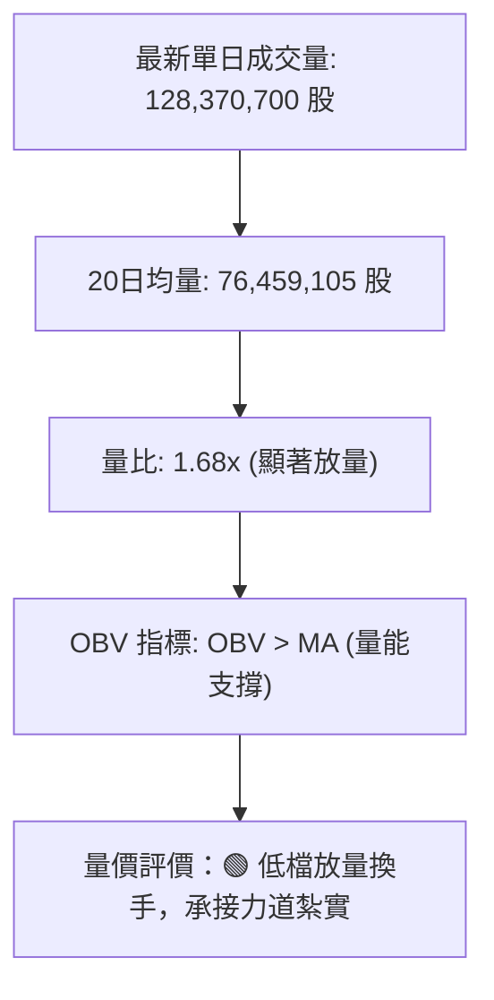

- **量能異動**：最新單日成交量高達 1.28 億股，相對 20 日均量放大 1.68 倍；本週週成交量亦放大至 4.54 億股。
- **OBV 趨勢**：系統明確給出 `OBV > MA → 量能支撐上漲`。在股價連續下挫跌破 $13.50 之際，量能逆勢激增，顯示主力機構正在 S1 ($13.09) ~ 斐波 78.6% ($12.86) 帶進行戰略性吸籌，並非恐慌殺跌潰逃。

---

## 6. 動能與波動率

### ⚡ 動能評估

根據 NU 當前的動能指標與波動率參數進行定錨分析：
- **動能強度**：弱（RSI = 35.51，MACD 柱 = -0.151，均處於弱勢反彈段）
- **波動率水準**：中低（ADX = 21.22，ATR 佔比 3.79%，未進入極端失控擴散）

| 象限 | 動能維度 | 波動維度 | 歷史定義 | 當前 NU 狀態吻合度 | 操作戰略評估 |
|------|----------|----------|----------|-------------------|--------------|
| **Q1** | 強動能 | 低波動 | 穩定上升趨勢 | ❌ 不符 | 適合順勢長線抱波段 |
| **Q2** | 弱動能 | 低/中波動 | 區間震盪築底 | **✓ 吻合 (當前位置)** | **謹慎觀望，底部分批低吸，高拋低吸** |
| **Q3** | 強動能 | 高波動 | 快速單邊主升/主跌 | ❌ 不符 | 追突破或突破止損 |
| **Q4** | 弱動能 | 高波動 | 恐慌崩跌/籌碼潰散 | ❌ 不符 | 嚴格空倉離場 |

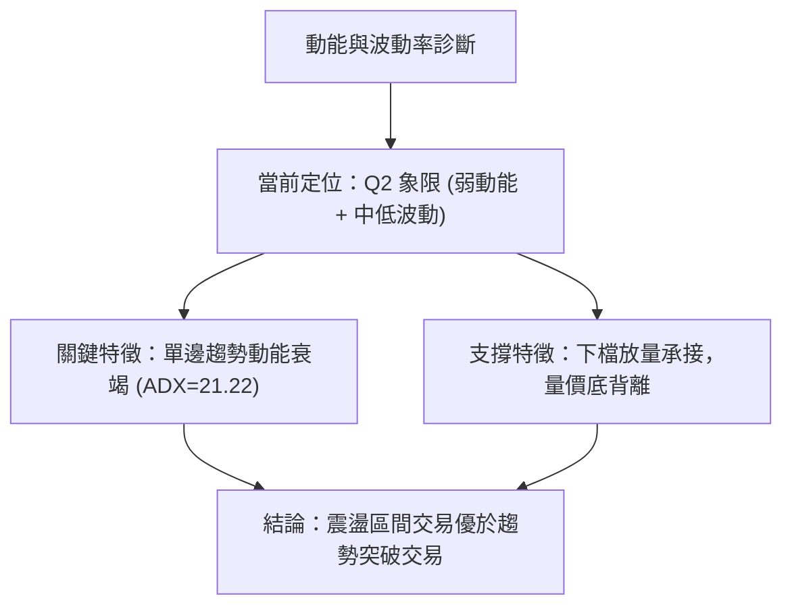

### 📊 ATR 波動率分析

- **ATR(14) 數值**：**$0.50**
- **價格百分比**：佔當前股價 $13.29 之 **3.79%**。
- **風控應用與止損距離推算**：
  - 日內常態波動區間：約 $\pm \$0.50$（即今日合理波動預期在 $\$12.79 \sim \$13.79$ 之間）。
  - 擺動交易（Swing Trade）安全防守緩衝距離：建議設定為 **1.0 ~ 1.5 倍 ATR**（即 $\$0.50 \sim \$0.75$）。若以進場點位下方計算，可確保不被日常雜訊洗出場外。

### 📐 Beta 與市場相關性

- **Beta 係數**：**0.94**
- **解讀**：
  - NU 的系統性市場風險與標普500大盤基本同步（略低於 1.0），未出現高 Beta 成長股的極端狂暴特性。
  - 機構持股比例高達 **82.2%**，Float 比率高，空頭部位僅佔 Float 的 **3.5%**（Short Ratio 1.88）。這意味著當前價格的弱勢並非由於大規模惡意做空，而是大盤系統性風格調整與機構常規調倉所致，軋空機率極低，行情走勢將回歸基本面與技術位支撐。

---

## 7. 多時框架總結

### 📋 時框架評分表

| 時框架 | 趨勢方向 | 動能狀態 | 均線排列 | 形態特徵 | 綜合評分 | 戰略建議 |
|--------|----------|----------|----------|----------|----------|----------|
| **長期 (月線)** | 偏弱震盪 | 減弱回落 | 跌破月均線 | 斐波 78.6% 回踩 | 45/100 🟡 | 價值型長線投資人可逢低定投 |
| **中期 (週線)** | 空頭回調 | 超賣修復 | 空頭排列 | 放量下影探底 | 42/100 🟡 | 波段操作者等待週線底分型確認 |
| **短期 (日線)** | 弱勢反彈 | 底背離向上 | 站上 MA5/受壓 MA10 | 布林下軌反抽 | 46/100 🟡 | 嚴格依賴關鍵位進行區間高拋低吸 |

### 🔲 綜合訊號矩陣

```
時框架訊號交叉驗證矩陣：
┌───────────┬──────────────┬──────────────┬──────────────┐
│ 指標系統  │ 短期 (日線)  │ 中期 (週線)  │ 長期 (月線)  │
├───────────┼──────────────┼──────────────┼──────────────┤
│ 均線架構  │ 🔴 壓制(MA10)│ 🔴 空頭排列  │ 🟡 考驗基期  │
│ 動能系統  │ 🟡 脫離超賣  │ 🔴 負向未金叉│ 🔴 衰退期    │
│ 量能配合  │ 🟢 放量 1.68x│ 🟢 週量暴增  │ 🟡 常態放量  │
│ 形態位置  │ 🟡 次級雙底  │ 🔴 下行通道  │ 🟡 斐波支撐  │
└───────────┴──────────────┴──────────────┴──────────────┘
```

### ⚖️ 多時框收斂結論

依據多時框收斂規則第 14 條：
1. **趨勢判定**：當前 ADX(14) 讀數為 **21.22**，明確小於 25 臨界值，定性為**盤整行情（非趨勢行情）**。
2. **主導規則**：在盤整行情下，**以日線布林通道上下軌 ($12.08 ~ $15.97) 及波段高低點作為主要交易邊界**，不宜以趨勢行情的均線單邊順勢思維盲目殺跌。
3. **唯一方向性結論**：**中性偏空震盪，聚焦下軌支撐回抽**。日線雖見放量超賣反彈，但受阻於 R1 ($13.30) 與 MA10 ($13.32)，上方中長期均線重重壓制。第 8 章之主交易策略必須依據評分卡結論（44/100，處於 40–60 區間），定義為**「區間震盪操作策略」**，以布林下軌及 S1/S2 作為防守基點進行高拋低吸。

---

## 8. 交易策略建議

### 🗺️ 策略決策流程圖

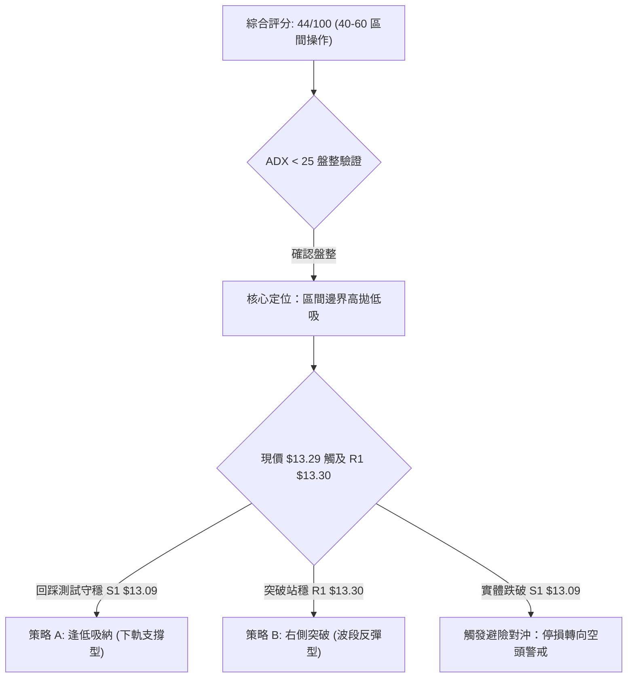

### 🧭 策略路由

> **當前主策略方向 = 區間震盪低吸策略（依技術評分卡綜合評分：44 / 100）**
> 
> *依據路由規則：綜合評分處於 40–60 區間，市場處於 ADX<25 弱趨勢盤整中，策略定調為「依託關鍵支撐區間低吸、受阻於強阻力位高拋」，不盲目單邊押注。*

### 🎯 價格情境階梯（Price Scenarios）

價位嚴格引用自第 4 章「關鍵價位」OHLCV 實際計算數值：

| 觸發條件 | 下一目標 | 後續延伸 | 情境含義 |
|----------|----------|----------|----------|
| **有效突破 R1 $13.30** | R2 **$13.52** | R3 **$14.32** | 短線轉強，脫離底部泥淖，展開向中軌修復 |
| **站穩現價區間 ($13.09 ~ $13.30)** | — | — | 區間沉澱震盪，籌碼換手築底，等待均線靠攏 |
| **實體跌破 S1 $13.09** | S2 **$12.23** | S3 **$11.78** | 中期結構破位，短底失敗，下探測試布林下軌 |

### 📊 情境機率分佈

| 情境 | 機率 | 主要依據 |
|------|------|----------|
| **區間震盪築底** | **55%** | ADX = 21.22 顯示無單邊動能；布林通道帶寬充足；量價配合放量承接 |
| **超賣反彈向上** | **30%** | RSI 自 19.9 底背離修復至 35.51；OBV 處於 MA 上方支撐反彈 |
| **破位再探深底** | **15%** | 均線系統呈標準空頭排列；-DI 仍大於 +DI（29.68 vs 22.15） |

### 🟢 主策略詳情（區間操作架構）

所有目標與止損價位均直接取自關鍵價位與均線數值：

| 策略要素 | 策略 A：左側逢低吸納（支撐回踩型） | 策略 B：右側突破買入（動能確認型） |
|----------|-----------------------------------|-----------------------------------|
| **進場條件** | 股價日內回踩 S1 不破，出現 15 分 K 止跌陽線 | 股價放量實體突破 R1 並回踩確認站穩 |
| **進場價格** | **$13.15**（S1 $13.09 上方 1 檔） | **$13.35**（突破 R1 $13.30 後進場） |
| **目標價 T1** | **$13.52**（阻力位 R2） | **$14.02**（布林中軌 MA20） |
| **目標價 T2** | **$14.02**（布林中軌 MA20） | **$14.32**（強阻力位 R3 / 形態頸線） |
| **止損價格** | **$12.80**（跌破斐波 78.6% $12.86 處） | **$13.05**（跌破支撐位 S1 $13.09 處） |
| **風險報酬比** | **1 : 2.48**（風險 $0.35，第一目標利潤 $0.37，第二目標利潤 $0.87） | **1 : 2.23**（風險 $0.30，第一目標利潤 $0.67） |
| **成功機率** | **60%** | **52%** |
| **建議倉位** | **10% ~ 15%**（輕倉試單） | **15% ~ 20%**（確認轉強後追加） |

### 🔴 反向風險觸發點（對沖提示）

若出現以下情境，宣告區間低吸策略失效，必須立刻執行保護性止損或對沖操作：
1. **關鍵點位破位**：收盤價實體跌破 **S1 ($13.09)**，特別是跌破斐波 78.6% **$12.86**，宣告雙底築底失敗。
2. **量能惡化**：跌破 $13.00 時伴隨成交量超過 1.5 億股的爆量長陰，且 OBV 跌破其移動平均線。
3. **空頭對沖防禦位置**：跌破 $12.86 後，空頭下一目標直指 **S2 ($12.23)** 與 52 週最低點 **$11.20**。

### ⭐ 整體訊號強度評星

```
做多訊號強度：★★☆☆☆  (2.5/5星 — 僅限超賣反彈，中長期均線逆風)
做空訊號強度：★★☆☆☆  (2.0/5星 — ADX 低迷且低檔放量，追空盈虧比差)
整體可信度：  ★★★☆☆  (3.5/5星 — 價位精確聚類，區間邊界分明)
```

---

## 9. 風險提示與監控

### ✅ 關鍵監控指標 Checklist

```
╔══════════════════════════════════════════════════════════════════╗
║                   NU 技術面核心監控清單 (Checklist)              ║
╠══════════════════════════════════════════════════════════════════╣
║ [ ] 價格突破監控：收盤價是否能站上 R1 ($13.30) 與 MA10 ($13.32)   ║
║ [ ] 均線動態監控：MA20 ($14.02) 是否持續向下拖曳形成強壓        ║
║ [ ] 支撐防守監控：低點是否嚴格守穩 S1 ($13.09) 與斐波 $12.86      ║
║ [ ] 動能交叉監控：日線 MACD 柱狀圖（-0.151）是否翻正收斂金叉    ║
║ [ ] RSI 安全閥：RSI(14) 能否維持在 30 枯榮線上方運行             ║
║ [ ] 趨勢甦醒監控：ADX(14) 是否由 21.22 向上突破 25（預告單邊趨勢）║
║ [ ] 成交量能健康度：回調時成交量是否迅速萎縮至 76M 均量以下     ║
╚══════════════════════════════════════════════════════════════════╝
```

### ⚠️ 風險場景分析

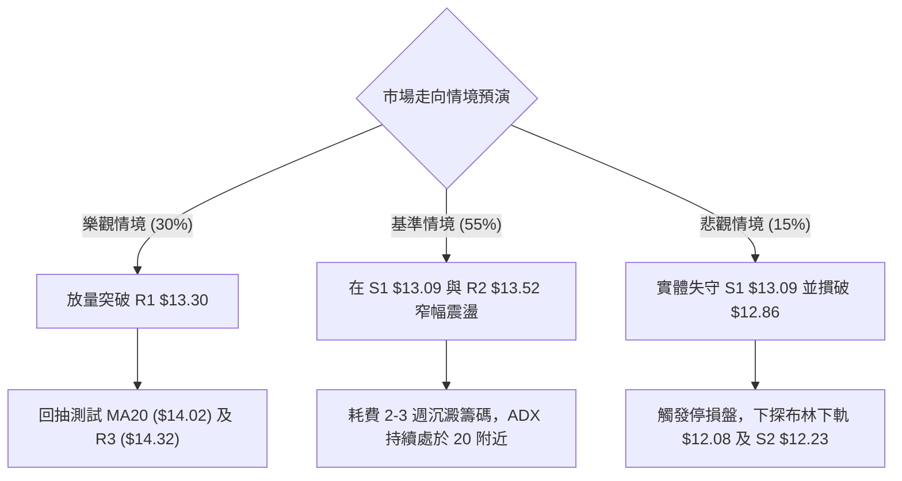

### 🛡️ 風險管理重要提醒

1. **嚴格禁止逆勢滿倉**：當前均線系統呈空頭排列，股價處於 MA200 下方，整體大格局為逆風運行。任何多頭策略皆屬於「超賣回抽」，部位總曝險不得超過投資組合的 **15%**。
2. **止損紀律絕不妥協**：由於下方即為近一年波段低點密集區，若 S1 ($13.09) 乃至斐波 78.6% ($12.86) 失守，下方將出現空間斷層，必須無條件執行停損。
3. **ATR 動態調倉原則**：NU 當前 ATR 為 $0.50，日內震盪幅度可達 3.8%。避免將止損設定在 $0.20 以內的過窄區間，否則極易在市場常態雜訊中被無效震盪洗出場。

---

## 📋 報告總結

```
╔══════════════════════════════════════════════════════════════════╗
║                    NU 技術分析報告總結                           ║
╠══════════════════════════════════════════════════════════════════╣
║ 報告日期：2026-10-02                                             ║
║ 當前價格：$13.29                                                 ║
║ 技術評級：⚖️ 偏空中性 / 區間尋求築底 (綜合評分: 44/100)          ║
╠══════════════════════════════════════════════════════════════════╣
║ 關鍵結論：                                                       ║
║ ├─ 長期趨勢：🟡 偏弱震盪，考驗斐波那契 78.6% ($12.86) 長線防線  ║
║ ├─ 中期趨勢：🔴 均線空頭排列，MA20 ($14.02) 構成下行首要阻力    ║
║ ├─ 短期趨勢：🟢 短線放量超賣反彈，OBV>MA 支撐，正測試 R1 ($13.30)║
║ ├─ 關鍵支撐：S1: $13.09 ｜ S2: $12.23 ｜ S3: $11.78              ║
║ ├─ 關鍵阻力：R1: $13.30 ｜ R2: $13.52 ｜ R3: $14.32              ║
║ └─ 分析師目標價共識：均價 $18.64 (區間 $12.00 ~ $23.00)          ║
╠══════════════════════════════════════════════════════════════════╣
║ 最優策略組合：                                                   ║
║ 1. 🥇 最佳機會：策略 A (回踩 S1 $13.09 守穩，於 $13.15 輕倉低吸) ║
║ 2. 🥈 次選機會：策略 B (實體突破 R1 $13.30，於 $13.35 追買至MA20) ║
║ 3. 🥉 保守選擇：完全空倉觀望，靜待股價站上 MA20 ($14.02) 再行進場║
╚══════════════════════════════════════════════════════════════════╝
```

---

> ⚠️ **免責聲明**：本報告為 AI 自動生成之技術分析，所有數據及估算均嚴格基於提供之歷史價格與技術指標資訊。本報告**僅供研究與學術參考**，**不構成任何要約、招攬或投資建議**。金融市場瞬息萬變，投資人應獨立思考，審慎評估風險並自負盈虧。

---

*報告生成時間：2026-10-02 ｜ 數據來源：Yahoo Finance ｜ 分析框架：多時框技術分析模型*