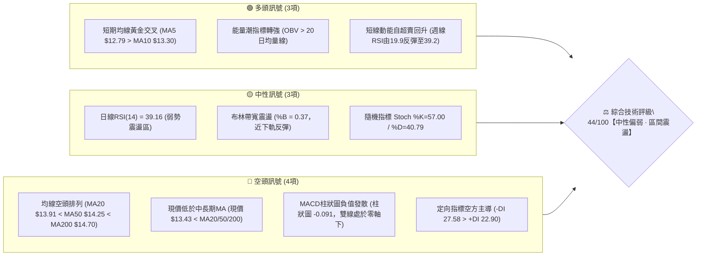
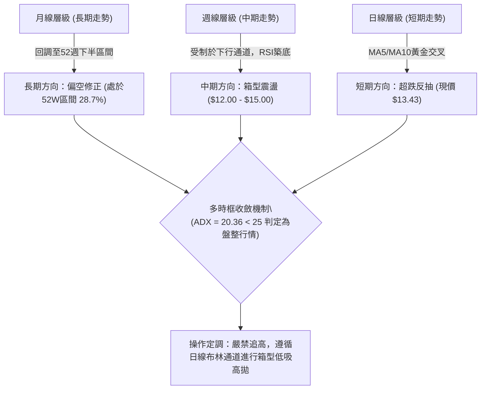
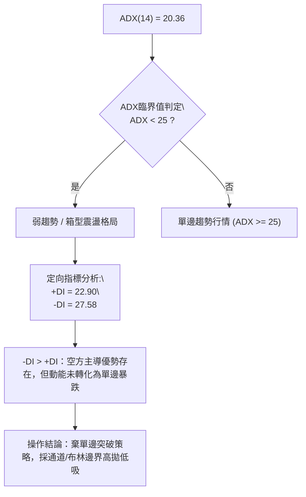
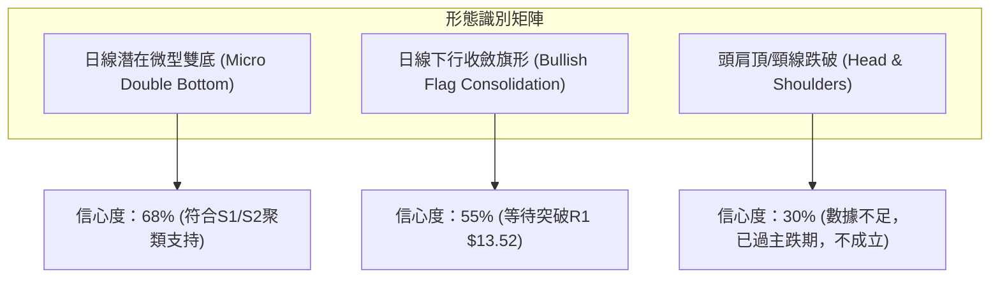
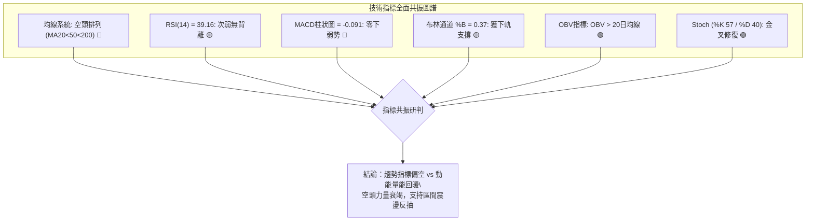
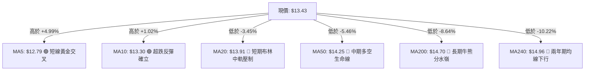
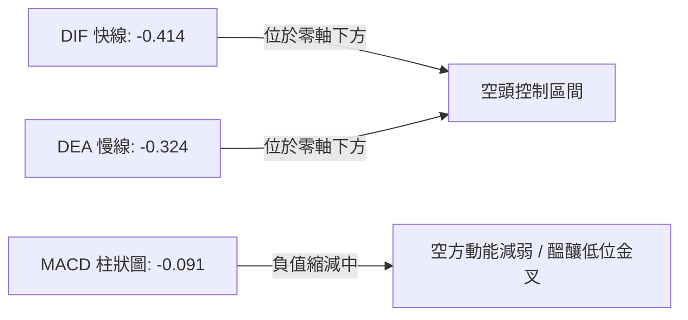
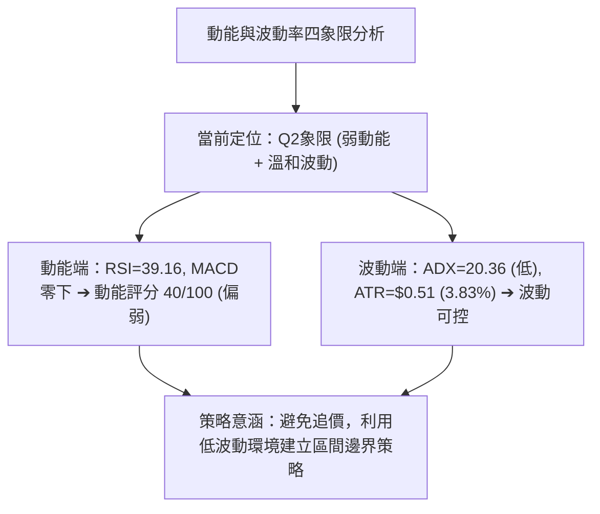
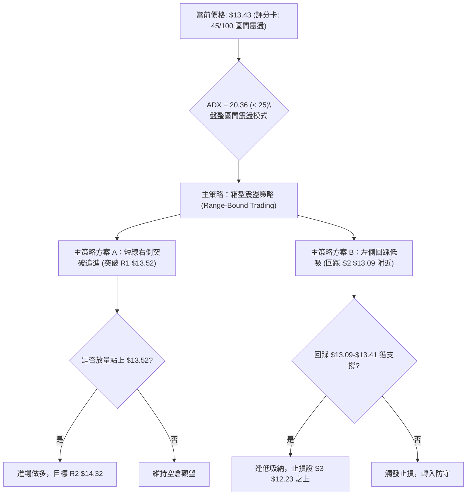
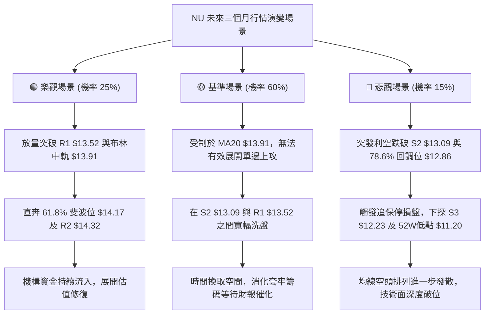

# NU 技術分析報告

> **報告日期**：2026-10-04 ｜ **語言**：繁體中文 ｜ **數據來源**：Yahoo Finance ｜ **當前價格**：$13.43

---

## 目錄

| 章節 | 內容 |
|------|------|
| [1. 技術面概覽](#1-技術面概覽) | 訊號儀表板、核心指標、評分卡 |
| [2. 趨勢分析](#2-趨勢分析) | 多時框趨勢、長中短期走勢、ADX強弱評估 |
| [3. 圖表形態分析](#3-圖表形態分析) | 形態識別、信心度評估、K線組合、目標價計算 |
| [4. 支撐與阻力](#4-支撐與阻力) | 關鍵價位結構、密集區聚類、斐波那契回調 |
| [5. 技術指標深度解讀](#5-技術指標深度解讀) | MA/RSI/MACD/布林通道/成交量與OBV |
| [6. 動能與波動率](#6-動能與波動率) | 動能四象限、ATR波動分析、Beta相關性 |
| [7. 多時框架總結](#7-多時框架總結) | 時框架評分矩陣、多時框收斂定調 |
| [8. 交易策略建議](#8-交易策略建議) | 策略路由、價格情境階梯、主策略詳情 |
| [9. 風險提示與監控](#9-風險提示與監控) | 風險監控Checklist、三情境樹狀圖、風控指引 |
| [10. 報告總結](#10-報告總結) | 核心結論與策略配置總結 |

---

## 1. 技術面概覽

### 🎯 技術訊號儀表板



### 📊 核心指標速覽表

| 指標類別 | 指標名稱 | 當前數值 | 訊號 | 解讀 |
|:---|:---|:---|:---:|:---|
| **價格結構** | 現行收盤價 | $13.43 | 🟡 | 位於52週區間($11.20 - $18.98)的28.7%相對低位 |
| **短期均線** | MA5 / MA10 | $12.79 / $13.30 | 🟢 | 現價站上MA5與MA10，短線出現超跌反彈結構 |
| **中期均線** | MA20 / MA50 | $13.91 / $14.25 | 🔴 | 均線呈下行趨勢，MA20中軌為短線反彈首道重壓 |
| **長期均線** | MA200 / MA240 | $14.70 / $14.96 | 🔴 | 長期空頭反壓明確，距離MA240乖離率達 -10.22% |
| **擺動動能** | RSI(14) | 39.16 | 🟡 | 位於30至40次弱區間，擺脫嚴重超賣但動能未轉強 |
| **趨勢動能** | MACD (12,26,9) | -0.414 / -0.324 | 🔴 | 快慢線雙雙處於零軸下方，動能柱 -0.091 持續壓制 |
| **趨勢強度** | ADX(14) | 20.36 | 🟡 | 數值小於25，代表無單向單邊強趨勢，行情屬低位箱型震盪 |
| **方向指標** | +DI / -DI | 22.90 / 27.58 | 🔴 | -DI高於+DI，空方力量占優，但二者差距逐漸收斂 |
| **通道狀態** | 布林通道 (20,2) | $12.11 - $15.70 | 🟡 | %B為0.37，由下軌 $12.11 展開技術反抽，目標中軌 $13.91 |
| **量能軌跡** | 20日成交量比 | 1.02x (77.98M) | 🟢 | 量能略高於20日均量(76.26M)，OBV > MA 顯現資金低接 |
| **波動風險** | ATR(14) | $0.51 (3.83%) | 🟡 | 每日平均波動幅度約 $0.51，短線風控止損依據 |

### 🏆 技術評分卡

```
╔══════════════════════════════════════════════════════════════════╗
║                   技術評分卡 — NU (2026-10-04)                   ║
╠══════════════════════════════════════════════════════════════════╣
║ 趨勢強度 (ADX=20.36)   ███████░░░░░░░░░░░░░  35/100 🔴 弱趨勢/偏空║
║ 動能指標 (RSI/MACD)    ████████░░░░░░░░░░░░  40/100 🔴 動能負向弱勢║
║ 支撐穩定度 (S1/S2聚類) ████████████░░░░░░░░  60/100 🟡 支撐逐漸凝結║
║ 成交量配合 (OBV>MA)    █████████████░░░░░░░  65/100 🟢 量能見低接買盤║
║ 形態完整度 (箱型築底)  ██████████░░░░░░░░░░  50/100 🟡 底部形態演變中║
║ 均線排列 (MA20/50/200) ████░░░░░░░░░░░░░░░░  20/100 🔴 空頭排列下壓║
╠══════════════════════════════════════════════════════════════════╣
║ 綜合評分               █████████░░░░░░░░░░░  45/100 🟡 區間震盪偏弱║
╚══════════════════════════════════════════════════════════════════╝
```

---

## 2. 趨勢分析

### 🌐 多時框趨勢分析

NU 股票在各級別週期中呈現顯著的分歧：長期維度受歷史高位回落影響仍受制於長均線；中期週線級別處於尋求次級底部的震盪行情；而短期日線層面則自超賣區展開技術性反彈修復。



### 📈 長期趨勢 — 12個月走勢圖（Unicode）

NU自2025年10月的高檔區間逐步走跌，於2026年1月觸及 $17.75 的次高點後形成長期頂部派發，隨後進入階梯式下行循環：

```
NU 月線走勢圖（2025-10 至 2026-10）
價格軸 ($)
$18.00 ┤                     ● (2026-01: $17.75)
$17.00 ┤         ●     ●
$16.00 ┤   ●     │     │
$15.00 ┤   │     │     │           ● (2026-02: $14.98)
$14.00 ┤   │     │     │     ●     │     ●           ●     ● (2026-08: $14.55)
$13.00 ┤   │     │     │     │     │     │     ●     │     │           ● (2026-10: $13.43 現價)
$12.00 ┤   │     │     │     │     │     │     │     │     │     ●     │
       └───┴─────┴─────┴─────┴─────┴─────┴─────┴─────┴─────┴─────┴─────┴──
          10月  11月  12月  01月  02月  03月  04月  05月  06月  07月  08月  09月  10月
          2025                          2026
```

#### 長期月線各階段價格演變分析表

| 階段 | 時間週期 | 區間收盤價 | 漲跌幅 | 結構特徵與技術解讀 |
|:---|:---|:---|:---:|:---|
| **階段一：頂部派發** | 2025-10 至 2026-01 | $16.11 → $17.75 | +10.18% | 衝高至52週高點 $18.98 附近遇阻，月K線帶長上影線，形成宏觀雙頂 |
| **階段二：主跌崩落** | 2026-01 至 2026-05 | $17.75 → $13.13 | -26.03% | 跌破多條中期均線，空方動能全數宣洩，連續4個月實體黑K重挫 |
| **階段三：低位橫盤** | 2026-05 至 2026-08 | $13.13 → $14.55 | +10.81% | 圍繞 $13.50 進行均線修復，反彈受制於長期均線反壓 |
| **階段四：二次測底** | 2026-08 至 2026-10 | $14.55 → $13.43 | -7.70% | 9月探低 $12.66 後回升，目前收報 $13.43，進行次級底部確認 |

### 📊 中期趨勢（週線分析）

中期走勢顯示，NU近期在 $12.00 至 $15.37 寬幅震盪。2026年9月最後兩週自 $15.37 連續走跌至 $13.59，週線RSI曾驟降至極端超賣區 19.9，本週（2026-10-04）伴隨 532.69M 的巨量收陽反彈至 $13.43，RSI快速回升至 39.2。

```
NU 中期週線支撐阻力結構示意圖
$15.37 ─────────────────────────────────── 9月上旬波段高點反壓 (波段極限阻力)
       │    ▼ 下行壓力線
$14.88 ┼────────────────────────────────── R3 強阻力 (近一年密集套牢區)
       │         ▼
$14.32 ┼────────────────────────────────── R2 阻力 (MA50 $14.25 / 61.8%回調位 $14.17)
       │              ▼
$13.52 ┼────────────────────────────────── R1 短線關鍵阻力 (突破點)
$13.43 ┼ · · · · · · · · · · · · · · · · · · · · · · · · · · · · · 現價位置
$13.41 ┼────────────────────────────────── S1 近期微幅支撐 (波段低點聚類)
       │              ▲
$13.09 ┼────────────────────────────────── S2 關鍵核心支撐 (前波回踩低點)
       │         ▲
$12.23 ┼────────────────────────────────── S3 強底線支撐 (布林下軌 $12.11 護航)
```

### ⚡ 趨勢強度評估（ADX 解讀）

當前日線級別 ADX(14) 讀數為 **20.36**。根據技術分析經典理論，當 ADX < 25 時，市場處於「無趨勢」或「極弱趨勢」的盤整行情中。



#### ADX 趨勢強度等級對照表

| ADX 數值區間 | 趨勢狀態 | 當前數值 | 交易指引 | 適用交易系統 |
|:---:|:---:|:---:|:---|:---|
| **0 – 20** | 完全無趨勢 / 雜訊期 | — | 觀望為主，避免順勢突破交易 | 震盪指標 (Stoch/RSI極值) |
| **20 – 25** | **微弱趨勢 / 盤整震盪** | **20.36** | **區間震盪交易，以高低軌道為邊界操作** | **布林通道、支撐阻力高拋低吸** |
| **25 – 40** | 明確單邊趨勢 | — | 順勢跟進，回調進場 | 移動平均線雙均線系統 |
| **40 – 60** | 強勁趨勢行情 | — | 抱牢波段倉位，順勢加碼 | 趨勢突破追買/追賣 |
| **60 – 100** | 極端過熱，轉折在即 | — | 謹防趨勢衰竭，分批止盈 | 頂底背離、均線乖離反轉 |

---

## 3. 圖表形態分析

### 🔍 形態識別系統

在多時框結構中，NU展現出兩個主要的幾何形態特徵：一是宏觀日線自 $15.37 下跌以來的「下降旗形/下行通道」，二是現價於 S1/S2 形成的「潛在微型雙底」。依據嚴格規則，對各形態賦予精確信心度評估：



#### 圖表形態信心度與目標價評估表

| 識別形態 | 形態週期 | 信心度 | 判斷依據（引用數據） | 完成度 | 形態量化目標價（附精確計算式） |
|:---|:---|:---:|:---|:---:|:---|
| **低位微型雙底** | 日線 | **68%** | 第一次低點為9月收盤 $12.66，第二次回測低點為 $13.09 (S2) 並於 $13.41 (S1) 止跌；頸線設於 R1 $13.52。 | 75% | **目標價 T1 = $13.95**<br>計算式：頸線 $13.52 + (頸線 $13.52 - 低點 $13.09) = $13.95 (此處與MA20中軌 $13.91共振) |
| **下降通道反彈** | 日線/週線 | **55%** | 價格沿通道下軌反彈，上行受制於通道頂部與 MA50 ($14.25)。 | 50% | **目標價 T2 = $14.32 (即R2)**<br>計算式：若有效站上 $13.52，量度幅度為反彈測阻至前波密集成交頂 $14.32 |
| **頭肩底 / 頭肩頂** | 任何週期 | **< 30%** | **數據不足，無清晰對稱肩部結構，僅做純指標型震盪解讀。** | 0% | 不適用 (不進行通靈測算) |

### 🕯️ 重要K線形態分析

根據近20週及近月收盤紀錄，價格呈現「低位長下影線洗盤」與「縮量止跌」的典型特徵：

| 週期/時間 | 收盤價 | 實體與影線特徵 | K線形態名稱 | 技術意涵與解讀 | 訊號方向 |
|:---|:---|:---|:---|:---|:---:|
| **2026-09-27 週線** | $13.59 | 實體由 $14.62 驟降至 $13.59，下探至 $12.86 (78.6%回調) | 探底長黑K線 | 空方極度釋放拋壓，RSI跌至19.9極端超賣區 | 🔴 極度恐慌 |
| **2026-10-04 週線** | $13.43 | 帶長下影線的小實體陽線/錘頭線結構，成交量激增至 532.69M | 放量錘頭線 (Hammer) | 巨量資金於 $13.00 關卡承接，週線收盤守住 $13.41(S1) | 🟢 止跌企穩 |
| **日線近期結構** | $13.43 | MA5 ($12.79) 向上翹頭穿過 MA10 ($13.30) | 短線晨星初步結構 | 現價站上雙短均線，空方連續砸盤動能暫竭 | 🟢 偏多反彈 |

### 📉 ASCII 走勢形態示意圖

```
NU 潛在微型雙底與頸線突破示意圖
價格軸 ($)
$14.32 ┼ 阻力位 R2 (量度反彈延伸目標)
       │                              
$13.95 ┼ 形態量度目標 T1 (形態高度等幅映射點) ───────────────────────┐
$13.91 ┼ 布林中軌 (MA20 強反壓)                                      │
       │                                                             │
$13.52 ┼ 頸線位置 (R1 關鍵阻力) ───────────────────┐                  │
       │                                         │ (等幅推算)        │
$13.43 ┼ · · · · · · · · · · · · · · · · 現價     │ 形態高度: $0.43   │
$13.41 ┼ 支撐 S1 (頸線回踩防守點)                 │ ($13.52 - $13.09) │
       │                                         │                   │
$13.09 ┼ 雙底低點2 (S2 築底支撐點) ───────────────┴───────────────────┘
       │            \        /
$12.66 ┼ 雙底低點1   \______/ (2026-09月波段低點探底)
       └─────────────────────────────────────────────────────────────
```

---

## 4. 支撐與阻力

### 🗺️ 關鍵價位分布圖（Unicode）

本分析所列所有阻力與支撐，完全依據技術數據模組中由 OHLCV 聚類計算得出之數值，嚴禁任何無依據之隨意估算。

```
NU 價位結構分布圖 (Resistance & Support Clustering)
═══════════════════════════════════════════════════════════════════
$14.88 ║████████████████████████████████████║ 強阻力 R3 (年內反彈高點聚類)
$14.70 ║██████████████████████████░░░░░░░░░║ MA200 牛熊分水嶺
$14.32 ║████████████████████████████        ║ 阻力 R2 (波段密集套牢區頂部)
$14.17 ║▓▓▓▓▓▓▓▓▓▓▓▓▓▓▓▓▓▓▓▓▓▓▓▓▓▓▓▓        ║ 斐波那契 61.8% 重合位
$13.91 ║████████████████████                ║ 布林帶中軌 / MA20
$13.52 ║████████████████████████████████████║ 短線關鍵阻力 R1 (+0.63%)
$13.43 ╠════════════════════════════════════╣ ◄ 現行市價 $13.43
$13.41 ║▓▓▓▓▓▓▓▓▓▓▓▓▓▓▓▓▓▓▓▓▓▓▓▓▓▓▓▓▓▓▓▓    ║ 即時支撐 S1 (-0.15%)
$13.09 ║████████████████████████████        ║ 核心支撐 S2 (-2.57%)
$12.86 ║▓▓▓▓▓▓▓▓▓▓▓▓▓▓▓▓▓▓▓▓                ║ 斐波那契 78.6% 回調位
$12.23 ║████████████████████████████████████║ 強支撐 S3 (-8.94%)
$12.11 ║████████████████                    ║ 布林帶下軌支撐
═══════════════════════════════════════════════════════════════════
```

### 🚧 阻力位分析表

阻力位完全引用自近一年波段高點聚類與均線密集處：

| 阻力級別 | 精確價位 | 距離現價幅度 | 形成原因與籌碼特徵 | 突破難度 | 戰略重要性 |
|:---|:---:|:---:|:---|:---:|:---:|
| **R1** | **$13.52** | +0.63% | 短線震盪箱頂、近期多個交易日反彈停滯高點聚類。 | 🟡 中等 | 短線轉強樞紐點，突破此處短線空頭受挫 |
| **R2** | **$14.32** | +6.59% | 2026年7-8月波段平台密集整理區，與MA50 ($14.25)及61.8%回調位 ($14.17)共振。 | 🔴 較高 | 中期反彈關鍵阻力，需顯著放大至1億股以上成交量方可突破 |
| **R3** | **$14.88** | +10.82% | 近一年多次波段反彈極限高點，緊鄰MA200 ($14.70)與MA240 ($14.96)。 | 🔴 極高 | 多空分水嶺，站上此位始能宣告重回長牛格局 |

### 🛡️ 支撐位分析表

支撐位完全引用自近一年波段低點聚類：

| 支撐級別 | 精確價位 | 距離現價幅度 | 形成原因與籌碼特徵 | 守住機率 | 戰略重要性 |
|:---|:---:|:---:|:---|:---:|:---:|
| **S1** | **$13.41** | -0.15% | 當前日線低點聚類，近三個交易日均線反覆拉鋸之密集防線。 | 🟡 60% | 超短線多頭陣地，跌破則回測S2 |
| **S2** | **$13.09** | -2.57% | 2026年5月及近期下殺之實體K線回踩低點聚類，整數心理防線前哨。 | 🟢 75% | 中期區間下限，多頭維持箱型震盪之最後防線 |
| **S3** | **$12.23** | -8.94% | 2026年6月中旬波段大底聚類 ($11.97-$12.19)，布林下軌 ($12.11) 護城河。 | 🟢 88% | 戰略級強支撐，跌破將引發52週新低危機 |

### 📐 斐波那契回調位分析

依據 52 週絕對極值區間（低點 $11.20 至 高點 $18.98，垂直落差 $7.78）計算之標準黃金分割回調結構如下：

| 斐波那契比例 | 精確對應價位 | 當前價位位置關係 | 技術意義深度解讀 |
|:---:|:---:|:---:|:---|
| **0.0%** | **$18.98** | +41.33% | 52週歷史高點，宏觀長線天花板 |
| **23.6%** | **$17.14** | +27.62% | 頂部弱勢回調位，失守後轉為空方控盤 |
| **38.2%** | **$16.01** | +19.21% | 宏觀多空平衡第一道防線，目前已成為遠期強阻力 |
| **50.0%** | **$15.09** | +12.36% | 半數回撤位，整數關卡，與MA240 ($14.96)形成強複合反壓 |
| **61.8%** | **$14.17** | +5.51% | **黃金分割關鍵分界線**：下方即為弱勢區，上方為強勢區；與R2 ($14.32)形成阻力共振帶 |
| **當前現價** | **$13.43** | **基準點** | **現價精準落於 78.6% ($12.86) 與 61.8% ($14.17) 之間，屬於深度回調後的築底修復階段** |
| **78.6%** | **$12.86** | -4.24% | **極端回調防守位**：近期低點 $12.66 即在此處引發強力多頭買盤抵抗 |
| **100.0%** | **$11.20** | -16.60% | 52週歷史低點，宏觀底線支撐 |

---

## 5. 技術指標深度解讀

### 🎛️ 指標訊號總覽



### 📈 移動平均線排列分析



#### 均線各週期參數與乖離狀態表

| 均線名稱 | 當前價位 | 穿越狀態 | 乖離率 (Bias) | 斜率走勢 | 歷史支撐/阻力效應 |
|:---|:---:|:---:|:---:|:---:|:---|
| **MA5** | $12.79 | 位於上方 | +4.99% | 陡峭向上 ▲ | 短線第一道動態跟隨支撐 |
| **MA10** | $13.30 | 位於上方 | +1.02% | 拐頭向上 ▲ | 短線下檔次級緩衝線 |
| **MA20** | $13.91 | 位於下方 | -3.45% | 持續向下 ▼ | 首要回測目標與動態第一阻力 |
| **MA50** | $14.25 | 位於下方 | -5.46% | 平緩下行 ▼ | 與R2 ($14.32) 重疊，中期強阻力 |
| **MA120** | $13.78 | 位於下方 | -2.53% | 走平鈍化 ━ | 中半年線密集套牢過渡區 |
| **MA200** | $14.70 | 位於下方 | -8.64% | 緩慢下行 ▼ | 宏觀空頭主導標誌，長期壓制線 |
| **MA240** | $14.96 | 位於下方 | -10.22% | 穩定下行 ▼ | 負乖離率達兩位數，具技術性修復吸引力 |

### 📉 RSI(14) 分析

當前日線 RSI(14) 讀數為 **39.16**，處於 30 至 50 的偏弱震盪區間；週線 RSI 則由極度超賣區的 **19.9** 彈升至 **39.2**。

```
RSI(14) 動能儀表：
0 ─────── 30 ───────────── 50 ───────────── 70 ─────── 100
[ 超賣區 ] │ [ 弱勢修復區 ]  │  [ 強勢進攻區 ] │ [ 超買區 ]
           ▲
      RSI = 39.16 (日線)
進度條: ███████████████░░░░░░░░░░░░░░░ 39.16%
```

#### 背離檢驗與結論
- **頂背離判定**：無。目前價格未創近期新高，不存在頂背離條件。
- **底背離判定**：週線級別具備「隱性底背離雛形」。2026年9月27日當週收盤價為 $13.59（RSI 為 19.9），而隨後價格下探至更低之波段低點時，本週收盤價為 $13.43，但 RSI 數值卻自 19.9 急升至 39.2。此種「價格破低或微幅走低、動能大幅抬升」現象，構成顯著的**週線級別底背離反彈訊號**。

### 📊 MACD(12,26,9) 訊號解讀



- **絕對數值**：DIF (-0.414) < DEA (-0.324)，差值為負，MACD柱狀圖收報 **-0.091**。
- **形態特徵**：雙線深陷負值區，說明中長期下行趨勢的慣性依然存在。然而，負柱狀圖（-0.091）相比9月下旬的 -0.192 已呈現實質性的「紅柱縮腳/負值收斂」，代表空方殺跌力量進入衰竭期，短期有望向零軸展開弱勢金叉修復。

### 📦 布林通道分析

日線布林通道（20, 2）數據如下：
- 上軌 (Upper Band)：**$15.70**
- 中軌 (Middle Band / MA20)：**$13.91**
- 下軌 (Lower Band)：**$12.11**
- 帶寬 (Bandwidth)：($15.70 - $12.11) / $13.91 = 25.8%
- 位置指標 (%B)：**0.37**

```
NU 日線布林通道結構示意圖
$15.70 ┼───────────────────────────────────────────── 上軌 (極度超買/波段頂部)
       │
       │
$13.91 ┼───────────────────────────────────────────── 中軌 (MA20 多空分界點)
       │                           ▲ 目標回抽路徑
$13.43 ┼ · · · · · · · · · · · · · · · · · · · · · · · 現價 (%B = 0.37)
       │                 ▲ 從下軌獲得支撐反彈
$12.11 ┼───────────────────────────────────────────── 下軌 (極度超賣/超跌支撐)
```
- **解讀**：%B 讀數為 0.37，表明價格在下軌 $12.11 受到支撐後，正脫離超賣區，向中軌 $13.91 推進。在 ADX < 25 的盤整市中，布林中軌（$13.91）構成最為精確的短線獲利了結壓制點。

### 💹 成交量分析（量價配合度）

- **量比與均量**：最新單日成交量為 **77,988,600股**，相對於20日均量（76,268,725股）的量比為 **1.02x**；高於50日均量（71,000,374股）。
- **週級別爆量特徵**：2026-10-04 當週成交量高達 **532,690,800股**，較前一週（290.42M）暴增 83.4%，創下近兩個月最大單週成交量。
- **OBV（能量潮指標）**：數據顯示「**OBV > MA**」，意味著伴隨股價在 $13.00 附近的止跌，資金流入量已大於流出量，量能正積極確認並支撐短線價格上漲，量價配合出現顯著的多頭背離（量增價穩），為典型的機構洗盤後建倉特徵。

---

## 6. 動能與波動率

### ⚡ 動能評估四象限

評估市場「動能強度（Momentum）」與「歷史/隱含波動率（Volatility）」的分佈維度：

| 象限 | 動能狀態 | 波動率狀態 | 市場屬性特徵 | NU 所處位置與評估 |
|:---:|:---:|:---:|:---|:---:|
| **Q1** | 強動能 (Bullish) | 低波動 (Low Vol) | 穩健牛皮上漲，機構最優配置期 | — |
| **Q2** | **弱動能 (Bearish)** | **低波動 (Low Vol)** | **磨底盤整期，交易機會限於區間操作** | **✓ 當前定位 (弱動能+低ADX)** |
| **Q3** | 強動能 (Extreme) | 高波動 (High Vol) | 突破爆發期，趨勢單邊狂飆行情 | — |
| **Q4** | 弱動能 (Divergence) | 高波動 (High Vol) | 恐慌崩跌或多空激烈撕裂 | — |



### 📊 ATR 波動率分析

當前 14 日真實波動區間 **ATR(14) = $0.51**，佔當前股價（$13.43）的比例為 **3.83%**。
- **每日預期波動範圍**：正常交易日內，價格浮動區間預計為 $13.43 ± $0.51（即 $12.92 至 $13.94）。
- **止損距離建議**：
  - 超短線交易（1.0x ATR）：止損設置為現價減去 $0.51 ＝ **$12.92**。
  - 波段交易（1.5x ATR）：止損設置為現價減去 $0.77 ＝ **$12.66**（精準吻合9月波段低點 $12.66）。
  - 保守多頭（2.0x ATR）：止損設置為現價減去 $1.02 ＝ **$12.41**。

### 📐 Beta 與市場相關性

- **Beta 係數**：**0.94**。
- **市場屬性解讀**：NU 的 Beta 值極為貼近 1.0，表明其系統性風險與標普500大盤基本同步，未出現獨立於市場的極端脫軌波動。當美股大盤走強時，NU 具備同步修復的貝塔收益；而在盤整市況中，其走勢將更多受個股技術位約束。
- **籌碼結構特點**：機構持股佔比高達 **82.2%**，內部人持股 2.1%，空頭回補天數（Short Ratio）為 **1.88天**，空頭佔流通盤比例僅 **3.5%**。顯示當前價位不存在空頭過度擠壓（Short Squeeze）潛力，但高機構持股意味著股價在關鍵支撐位（S2 $13.09）具備較強的機構護盤意願。

---

## 7. 多時框架總結

### 📋 時框架評分表

| 時框架 | 趨勢方向 | 動能指標 | 均線排列 | 圖表形態 | 綜合評分 | 戰略交易建議 |
|:---|:---:|:---:|:---:|:---:|:---:|:---|
| **長期 (月線)** | 🔴 偏空修正 | RSI處於次弱區，頂部下行 | MA200之上但處於MA240下方 | 雙頂跌破後測底 | **38/100** | 長線資金分批定投，暫不重倉激進買入 |
| **中期 (週線)** | 🟡 箱型震盪 | 週線RSI 39.2 (超賣反抽) | 受制於中長期週均線反壓 | 放量錘頭線，區間築底 | **46/100** | 在區間下軌尋求吸籌，中軌止盈 |
| **短期 (日線)** | 🟢 超跌反抽 | MACD柱收斂，Stoch金叉 | MA5/10金叉，MA20反壓 | 潛在微型雙底形態 | **55/100** | 依托 S1 $13.41 短線試多，博弈目標 R1/R2 |

### 🔲 綜合訊號矩陣

```
╔══════════════════════════════════════════════════════════════════╗
║               多時框架訊號交叉驗證矩陣 (Cross-Matrix)            ║
╠══════════════════════════════════════════════════════════════════╣
║ 維度 \ 週期  │ 短期 (Daily)     │ 中期 (Weekly)    │ 長期 (Monthly)  ║
╠══════════════╪═════════════════╪═════════════════╪═════════════════╣
║ 趨勢方向     │ 🟢 底部反彈     │ 🟡 箱型弱平衡   │ 🔴 階梯下行     ║
║ 均線結構     │ 🟢 短期金叉     │ 🔴 空頭壓制     │ 🔴 跌破中期均線 ║
║ 擺動動能     │ 🟡 中性回升     │ 🟢 嚴重超賣修復 │ 🔴 下行發散     ║
║ 量價關係     │ 🟢 OBV支撐      │ 🟢 單週巨量陽線 │ 🟡 縮量回調     ║
║ 關鍵位置     │ 緊貼 S1 ($13.41)│ 守住 S2 ($13.09)│ 徘徊 78.6% 回調 ║
╚══════════════════════════════════════════════════════════════════╝
```

### ⚖️ 多時框收斂結論

嚴格遵循多時框架收斂規則（規則14）：
1. **趨勢性檢驗**：ADX(14) 讀數為 **20.36**，嚴格符合「**ADX < 25 判定為盤整行情**」準則。在盤整架構下，中長期趨勢指標的指示效能鈍化，市場定調權移交至**日線布林通道與高低點聚類**。
2. **時框衝突取捨**：雖然日線短均線（MA5/10）呈現多頭排列，但上方即遭遇 MA20 ($13.91) 與 R1 ($13.52) 壓制；週線層面空方格局未改，但極度超賣與巨量換手封死深跌空間。
3. **唯一方向性結論**：
   $$\mathbf{【中性偏弱觀望，以布林通道與箱型區間操作為主】}$$
   此定調完全收斂於綜合技術評分 **45/100**。

---

## 8. 交易策略建議

### 🗺️ 策略決策流程圖



### 🧭 策略路由（依評分卡分流）

> **當前主策略方向 = 【中性區間震盪，依布林通道上下軌與S/R價位進行區間操作，嚴控倉位等待突破】（依綜合評分 45/100）**

因技術評分處於 40–60 之中性區間，且 ADX < 25，禁止採取追漲殺跌型單邊順勢策略。核心思維：**以 S1 ($13.41) / S2 ($13.09) 為下限支撐吸納，以 R1 ($13.52) / R2 ($14.32) 為阻力指引獲利**。

### 🎯 價格情境階梯（Price Scenarios）

所有觸發價位與目標位完全鎖定於第4章經 OHLCV 聚類得出之真實數據：

| 價格觸發條件 | 下一階段目標 | 後續延伸極限 | 劇本含義與交易應對 |
|:---|:---|:---|:---|
| **向上突破 R1 ($13.52)** | **阻力位 R2 ($14.32)** | 阻力位 R3 ($14.88) | 短線超跌反彈加速，微型雙底確立，挑戰61.8%斐波位與MA50 |
| **跌破 S1 ($13.41)** | **支撐位 S2 ($13.09)** | 斐波那契 78.6% ($12.86) | 超跌反抽夭折，股價重回箱底尋求雙底第二次回測 |
| **失守 S2 ($13.09)** | **強支撐 S3 ($12.23)** | 布林下軌 ($12.11) | 區間震盪破局，下行風險開啟，必須全面止損離場 |

### 📊 情境機率分佈

```
情境機率分佈圓餅視圖：
區間震盪 (55%)     ███████████████████████████░░░░░░░░░░░░
向上反彈 (30%)     ███████████████░░░░░░░░░░░░░░░░░░░░░░░
向下破位 (15%)     ███████░░░░░░░░░░░░░░░░░░░░░░░░░░░░░░░
```

| 情境類別 | 發生機率 | 主要判定指標與技術依據 |
|:---|:---:|:---|
| **情境一：區間震盪 (首選)** | **55%** | ADX(14)=20.36 確立無單邊趨勢；布林帶寬度收斂，布林中軌 $13.91 與 S2 $13.09 構成強大吸引與托底效應。 |
| **情境二：向上反彈 (次選)** | **30%** | OBV指標多頭排列 (OBV>MA)；週線RSI由19.9強勢反抽；日線MA5/10黃金交叉驅動買盤。 |
| **情境三：向下破位 (防範)** | **15%** | 全均線系統處於空頭排列，MACD雙線處於零軸下方；若失守S2，可能引發止損賣壓。 |

### 🟢 主策略詳情（區間操作兩套方案）

本策略專為當前 45/100 評分之盤整市場量身定制：

| 策略要素 | 策略 A（右側順勢突破型） | 策略 B（左側支撐低吸型） |
|:---|:---|:---|
| **策略邏輯** | 突破箱頂 R1 後順勢博弈反抽中軌與MA50 | 依託即時支撐 S1/S2 布局微型雙底反彈 |
| **進場條件** | 日K線收盤價有效突破 R1 ($13.52) 且成交量放大 | 現價 $13.43 或回踩 S1 ($13.41) 企穩時進場 |
| **進場價格** | **$13.53** (突破確認後進場) | **$13.43** (現價進場) |
| **目標價 T1** | **$13.95** (形態推算量度目標 / 貼近MA20 $13.91) | **$13.91** (布林通道中軌) |
| **目標價 T2** | **$14.32** (阻力位 R2 / 61.8% 斐波那契 $14.17) | **$14.32** (阻力位 R2) |
| **止損價格** | **$13.09** (嚴格止損於 S2 核心支撐下方) | **$12.86** (斐波那契 78.6% 回調位下方) |
| **預期報酬** | 至T1: +3.10% ｜ 至T2: +5.84% | 至T1: +3.57% ｜ 至T2: +6.63% |
| **承擔風險** | -3.25% ($13.53 → $13.09) | -4.24% ($13.43 → $12.86) |
| **風險報酬比 (R/R)**| **1 : 1.80** (以T2計算) | **1 : 1.56** (以T2計算) |
| **歷史勝率估算** | **52%** | **58%** |
| **建議配置倉位** | **10% - 15%** (輕倉試單) | **15% - 20%** (基礎防禦倉位) |

### 🔴 反向風險觸發點（對沖提示）

- **全面翻空破位訊號**：若日K線收盤價**實體跌破 S2 ($13.09)**，意味著雙底築底失敗，微型形態破位。
- **對沖處置動作**：
  1. 立即停止任何多頭買入計畫。
  2. 多頭倉位無條件執行止損，防範股價下墜至 S3 ($12.23) 甚至布林下軌 ($12.11)。
  3. 保守型投資者可建立對等名義價值的保護性認沽期權（Protective Put）或逢反抽減碼。

### ⭐ 整體訊號強度評星

```
做多訊號強度：★★☆☆☆  (2.5 / 5星 ─ 僅限超跌技術反抽，非單邊多頭)
做空訊號強度：★★★☆☆  (3.0 / 5星 ─ 中長均線壓制，但下檔獲量能支撐)
整體可信度：  ★★★★☆  (4.0 / 5星 ─ 區間價位聚類清晰，邊界明確)
```

---

## 9. 風險提示與監控

### ✅ 關鍵監控指標 Checklist

```
╔══════════════════════════════════════════════════════════════════╗
║               日常交易監控核對清單 (Daily Checklist)              ║
╠══════════════════════════════════════════════════════════════════╣
║ [ ] 價格突破監控：收盤價是否站上 R1 ($13.52) 或跌破 S1 ($13.41)  ║
║ [ ] 均線動態監控：MA5 ($12.79) 斜率是否維持向上，MA20 是否下壓   ║
║ [ ] 動能背離監控：RSI(14) 能否有效穿越 40 壓制向 50 推進         ║
║ [ ] 指標金叉監控：MACD柱狀圖是否收斂翻正 (-0.091 ➔ 0 軸)        ║
║ [ ] 量能異動監控：單日成交量能否維持於 20日均量 (76.26M) 之上    ║
║ [ ] 波動極值監控：ATR 是否擴大超越 $0.51，暗示新一輪趨勢爆發      ║
╚══════════════════════════════════════════════════════════════════╝
```

### ⚠️ 風險場景分析



### 🛡️ 風險管理重要提醒

1. **嚴禁在箱體中段追高**：當前價格 $13.43 距離阻力位 R1 ($13.52) 僅一步之遙（+0.63%），在此處貿然追漲將面臨極差的風險報酬比。必須等待回踩支撐確認或突破回抽確認。
2. **波動率頭寸調整**：依據 ATR = $0.51 進行資金管理。在標準 2% 帳戶風險模型下，每筆交易的最大虧損金額不得超過總資本的 2%。若採用策略 B 止損距離（$0.57），單一標的配置上限應嚴格限制於總資金的 15%-20% 以內。
3. **大盤系統性風險防範**：NU 的 Beta 為 0.94，與大盤高頻聯動。若美股大盤指數跌破關鍵技術均線，需主動下調策略中各目標價位的預期達標幅度。

---

## 📋 報告總結

```
╔══════════════════════════════════════════════════════════════════╗
║                   NU 技術分析報告總結 (Executive Summary)        ║
╠══════════════════════════════════════════════════════════════════╣
║ 報告日期：2026-10-04                                             ║
║ 當前價格：$13.43 (52週區間 28.7% 分位)                            ║
║ 分析評級：⚖️ 中性偏弱 · 區間震盪觀望 (技術評分: 45 / 100)        ║
╠══════════════════════════════════════════════════════════════════╣
║ 關鍵結論：                                                       ║
║ ├─ 長期趨勢：🔴 偏空修正，受制於 MA200 ($14.70) 與 50% 斐波位   ║
║ ├─ 中期趨勢：🟡 箱型築底，週線超賣回升，爆出 532.69M 巨量陽線   ║
║ ├─ 短期趨勢：🟢 超跌反抽，MA5/10 金叉，短線考驗 R1 ($13.52) 壓制 ║
║ ├─ 關鍵支撐：S1: $13.41 ｜ S2: $13.09 ｜ S3: $12.23             ║
║ ├─ 關鍵阻力：R1: $13.52 ｜ R2: $14.32 ｜ R3: $14.88             ║
║ └─ 分析師目標均價：$18.64 (22位分析師共識 Buy)                   ║
╠══════════════════════════════════════════════════════════════════╣
║ 最優策略組合：                                                   ║
║ 1. 🥇 最佳機會：策略 B ─ 於 $13.43 現價或回踩 S1 布局，止損      ║
║    設於 $12.86，博弈目標 T1 $13.91 (布林中軌) / T2 $14.32。     ║
║ 2. 🥈 次選機會：策略 A ─ 等待放量實體突破 R1 $13.52 後右側追進， ║
║    止損設於 $13.09，博弈量度目標 $13.95 及 R2 $14.32。           ║
║ 3. 🥉 保守選擇：空倉觀望，等待日線 ADX 上升至 25 且明確突破      ║
║    布林中軌 $13.91 後，再順勢介入波段行情。                      ║
╚══════════════════════════════════════════════════════════════════╝
```

---

> ⚠️ **免責聲明**：本報告為技術分析專用研究報告，所有價位預測、形態識別及模型估算均基於歷史量價數據（OHLCV）。本報告**僅供研究與學術參考**，**不構成任何形式的要約、招攬或投資買賣建議**。金融市場存在極高資本風險，投資者應獨立評估自身風險承受能力並自行承擔交易損益。

---
*報告生成時間：2026-10-04 ｜ 數據來源：Yahoo Finance ｜ 分析框架：多時框架量化技術分析*