# NU 技術分析報告

> **報告日期**：2026-10-05 ｜ **語言**：繁體中文 ｜ **數據來源**：Yahoo Finance ｜ **當前價格**：$13.43

---

## 目錄

| 章節 | 內容 |
|------|------|
| [1. 技術面概覽](#1-技術面概覽) | 訊號儀表板、核心指標、評分卡 |
| [2. 趨勢分析](#2-趨勢分析) | 多時框趨勢、長中短期走勢、ADX 解讀 |
| [3. 圖表形態分析](#3-圖表形態分析) | 形態識別、K線組合、目標價推算 |
| [4. 支撐與阻力](#4-支撐與阻力) | 關鍵價位、斐波那契回調層級 |
| [5. 技術指標深度解讀](#5-技術指標深度解讀) | MA/RSI/MACD/布林通道/成交量 |
| [6. 動能與波動率](#6-動能與波動率) | 動能四象限、ATR、Beta 與市場相關性 |
| [7. 多時框架總結](#7-多時框架總結) | 時框架矩陣、多時框收斂判定 |
| [8. 交易策略建議](#8-交易策略建議) | 策略路由、主策略、情境階梯、風報比 |
| [9. 風險提示與監控](#9-風險提示與監控) | 監控清單、情境分析、資金控管 |
| [📋 報告總結](#-報告總結) | 決策總覽卡與終審評級 |

---

## 1. 技術面概覽

### 🎯 技術訊號儀表板

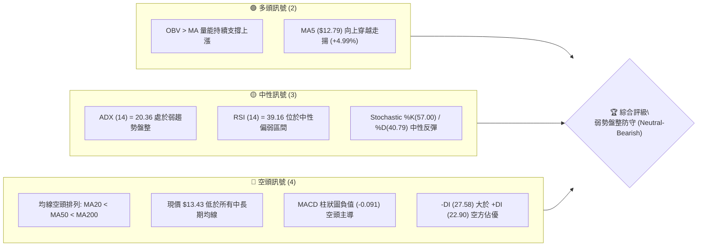

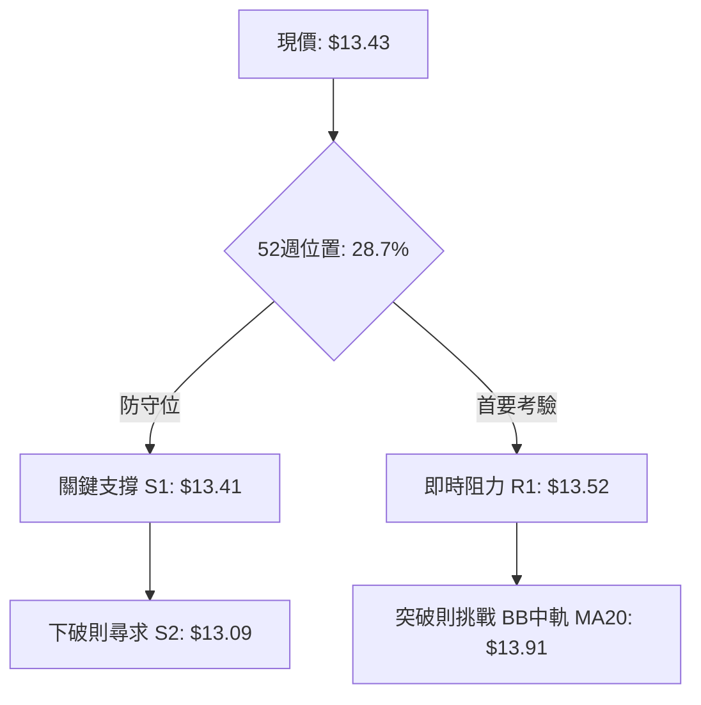

### 📊 核心指標速覽表

| 指標類別 | 指標名稱 | 當前數值 | 訊號 | 解讀 |
|----------|----------|----------|------|------|
| **價格** | 當前收盤價 | $13.43 | 🟡 | 位於52週區間28.7%處，極度貼近支撐位S1 ($13.41) |
| **短期均線** | MA20 (BB中軌) | $13.91 | 🔴 | 現價在MA20下方 -3.45%，短線反彈遭遇動態下壓 |
| **中期均線** | MA50 | $14.25 | 🔴 | 現價在MA50下方 -5.75%，中期修正趨勢尚未扭轉 |
| **長期均線** | MA200 | $14.70 | 🔴 | 現價在MA200下方 -8.64%，長期結構退守至牛熊分界線下 |
| **動能震盪** | RSI(14) | 39.16 | 🟡 | 脫離超賣區反彈但仍在50榮枯線之下，屬弱勢整理 |
| **趨勢動能** | MACD (12,26,9) | -0.414 / -0.324 | 🔴 | 雙線位於零軸下，柱狀體負值 (-0.091)，空頭主導 |
| **趨勢強度** | ADX(14) | 20.36 | 🟡 | ADX < 25 表明無強單邊趨勢，當前屬於盤整震盪市場 |
| **動態通道** | Bollinger Bands | 上軌 $15.70 / 下軌 $12.11 | 🟡 | %B = 0.37，價格在下軌獲得支撐後緩步向中軌修復 |
| **量能軌跡** | OBV (能量潮) | OBV > MA | 🟢 | 籌碼沉澱良好，跌勢中未見放量恐慌潰散，呈現吸籌結構 |
| **即時波動** | ATR(14) | $0.51 | 🟡 | 波動率佔股價 3.83%，每日振幅收斂，符合盤整期特徵 |

### 🏆 技術評分卡

```
╔══════════════════════════════════════════════════════════════════╗
║                   技術評分卡 — NU (2026-10-05)                   ║
╠══════════════════════════════════════════════════════════════════╣
║ 趨勢強度 (ADX=20.36, -DI主導)   ██████░░░░░░░░░░░░░░  30/100 🔴 ║
║ 動能指標 (RSI=39.16, MACD柱負)  ████████░░░░░░░░░░░░  40/100 🔴 ║
║ 支撐穩定度 (S1=$13.41, S2=$13.09)██████████████░░░░░░  70/100 🟢 ║
║ 成交量配合 (OBV>MA, 量比1.02x)   ████████████░░░░░░░░  60/100 🟢 ║
║ 形態完整度 (下飄旗形整理)       ██████████░░░░░░░░░░  50/100 🟡 ║
║ 均線排列 (MA20<MA50<MA200)       ████░░░░░░░░░░░░░░░░  20/100 🔴 ║
╠══════════════════════════════════════════════════════════════════╣
║ 綜合技術評分                     ████████░░░░░░░░░░░░  45/100 🟡 ║
║ 評級結論：中性偏空 / 弱勢區間整理 (Neutral-Bearish Range Bound) ║
╚══════════════════════════════════════════════════════════════════╝
```

---

## 2. 趨勢分析

### 🌐 多時框趨勢分析

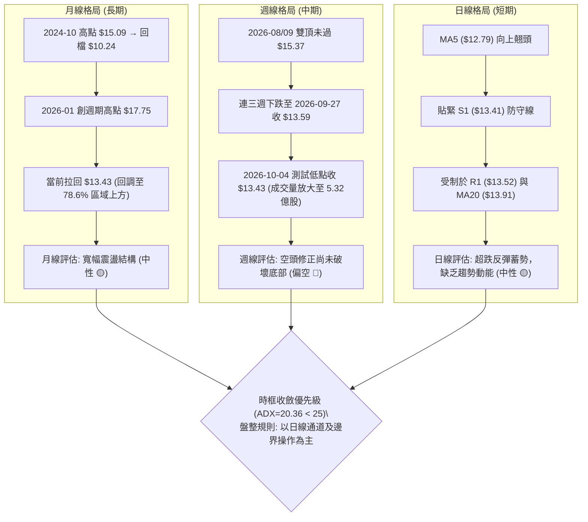

### 📈 長期趨勢 — 12個月走勢圖（Unicode）

```
NU 月線走勢圖（過去12個月：2025-11 至 2026-10）
價格軸 ($)
$18.00 ┤                     ● ($17.75, 2026-01 高點)
$17.50 ┤          ● ($17.39)
$17.00 ┤               ● ($16.74)
$16.50 ┤
$16.00 ┤
$15.50 ┤
$15.00 ┤                          ● ($14.98)
$14.50 ┤                               ●    ●         ● ($14.55)
$14.00 ┤                                         ●
$13.50 ┤                                              ●    ● ←現價 $13.43
$13.00 ┤                                    ● ($13.13)
$12.50 ┤                                                   ● ($12.66)
       └─────────────────────────────────────────────────────────────
         25-11  25-12  26-01  26-02  26-03 26-04 26-05 26-06 26-07 26-08 26-09 26-10
```

#### 走勢特徵分析表格

| 階段區間 | 起始/結束價 | 漲跌幅 | 主要走勢特徵與量價結構 |
|----------|-------------|--------|------------------------|
| **2025-11 至 2026-01** | $16.11 → $17.75 | +10.18% | **多頭主升浪**：創出波段收盤新高 $17.75（52週高點衝至 $18.98），多頭動能達到頂點。 |
| **2026-01 至 2026-05** | $17.75 → $13.13 | -26.03% | **大幅估值修正浪**：高檔跌破均線支撐，連跌4個月直探 $13.13 低點，均線轉為下彎。 |
| **2026-05 至 2026-08** | $13.13 → $14.55 | +10.81% | **區間修復反彈**：月線連三紅反彈，最高觸及 $15.37 週級別阻力，但受阻於 MA200。 |
| **2026-08 至 2026-10** | $14.55 → $13.43 | -7.70% | **二次探底築底**：9月急跌至 $12.66 後收盤回穩至 $13.43，目前圍繞 S1 ($13.41) 進行築底。 |

### 📊 中期趨勢（週線分析）

```
NU 週線關鍵阻力與支撐分層示意
┌──────────────────────────────────────────────────────────┐
│ R3: $14.88  ═══════════════════════════════════════════  │ (強壓力 / MA200 $14.70 覆蓋)
│                                                          │
│ R2: $14.32  ───────────────────────────────────────────  │ (中期頸線 / MA50 $14.25 覆蓋)
│                                                          │
│ R1: $13.52  ┈┈┈┈┈┈┈┈┈┈┈┈┈┈┈┈┈┈┈┈┈┈┈┈┈┈┈┈┈┈┈┈┈┈┈┈┈┈┈┈┈┈┈  │ (即時突破位 / 日線反彈初阻力)
│                                                          │
│ 現價: $13.43 ◀◀◀ 處於極窄幅夾板整理 (S1-R1 寬度僅 $0.11) │
│                                                          │
│ S1: $13.41  ┈┈┈┈┈┈┈┈┈┈┈┈┈┈┈┈┈┈┈┈┈┈┈┈┈┈┈┈┈┈┈┈┈┈┈┈┈┈┈┈┈┈┈  │ (即時關鍵支撐，距離僅 -0.15%)
│                                                          │
│ S2: $13.09  ───────────────────────────────────────────  │ (波段安全墊 / 2026-05月收盤低點區)
│                                                          │
│ S3: $12.23  ═══════════════════════════════════════════  │ (波段強支撐 / 近一年大底區)
└──────────────────────────────────────────────────────────┘
```

從近20週數據觀察：
1. **量能沉澱**：2026-07-19 當週成交量爆出 7.62 億股天量後，股價並未崩潰，而是維持在 $13.50–$14.00 區間整固。
2. **週線指標收斂**：2026-09-27 週 RSI 曾下插至極度超賣的 19.9，而在 2026-10-04 當週伴隨 5.32 億股換手，RSI 迅速修復彈升至 39.2，MACD 柱狀體負值由 -0.136 縮小至 -0.091，顯示中期下殺動能已大幅減弱，存在技術性空頭回補跡象。

### ⚡ 趨勢強度評估（ADX 解讀）

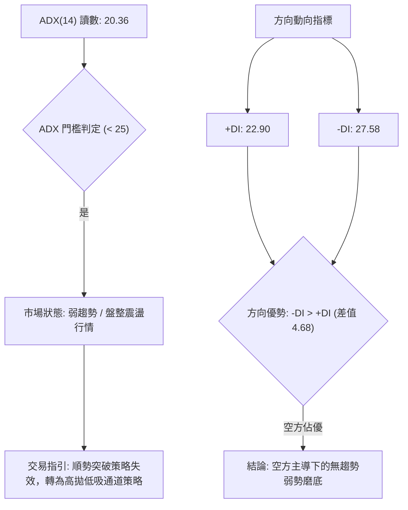

| 指標變數 | 當前讀數 | 狀態門檻 | 技術涵義解讀 |
|----------|----------|----------|--------------|
| **ADX(14)** | **20.36** | < 25 (弱趨勢/盤整) | 單邊趨勢動能已消耗殆盡。股價從高檔滑落的慣性減速，未出現新的強勁單邊驅動力，進入籌碼沉澱盤整期。 |
| **+DI (14)** | **22.90** | 多方攻擊力量 | 短期自 $12.66 低檔回升，帶動多方買力略微回溫，但尚未跨過 25 臨界線。 |
| **-DI (14)** | **27.58** | 空方打壓力量 | 空方力量仍處於 25 之上，顯示市場整體仍由空頭防守主導，反彈皆面臨逢高出脫賣壓。 |
| **DI 交叉狀態** | -DI 壓制 +DI | 負向擴散但開口縮小 | 當前無單邊行情，依收斂規則不可進行激進的突破追價操作，應以關鍵水平支撐阻力為主軸。 |

---

## 3. 圖表形態分析

### 🔍 形態識別系統

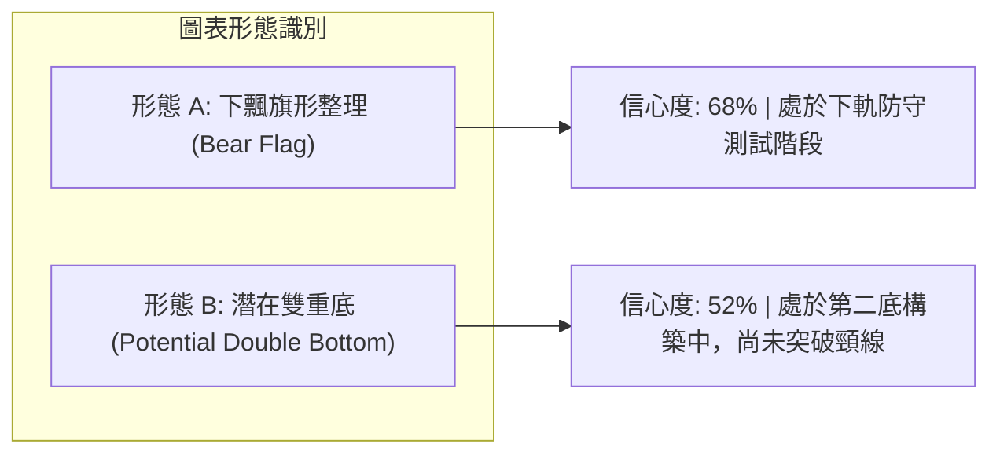

#### 形態信心度與目標價評估表

| 形態類別 | 信心度 | 判斷依據（引用數據） | 完成度 | 目標價（附嚴格計算式） |
|----------|--------|----------------------|--------|------------------------|
| **下降通道/下飄旗形** | **68%** | 價格自 2026-08 高點 $15.37 下跌至 2026-09 低點 $12.66，隨後在 S1 ($13.41) 與 MA20 ($13.91) 之間做斜向下收斂震盪。 | 70% | 若向下破位跌破 S2 ($13.09)，旗形等長推算：<br>目標 = $13.09 - ($15.37 - $13.09) = $10.81（此為極端推算，數據中實體支撐為 **S3: $12.23**）。 |
| **潛在雙底 (W底)** | **52%** | 第一底為 2026-05 低點 $13.13，第二底為 2026-09 低檔回踩 $13.09 (S2) 附近並守穩於 $13.41 (S1)。 | 40% | 頸線阻力鎖定在 **R2: $14.32**。<br>若能有效帶量突破頸線：<br>形態目標價 = 頸線 $14.32 + 形態高度 ($14.32 - $13.09 = $1.23) = **$15.55**（受阻於布林上軌 $15.70）。 |

### 🕯️ 重要K線形態分析

| 週期/時間 | 收盤價 | K線形態 | 量價結構解讀 | 訊號方向 |
|-----------|--------|---------|--------------|----------|
| **2026-09 月線** | $12.66 | 長下影陰線 | 月線一度下探 $12.66，但收盤拉升且未破前低 $11.20，下方買盤在 S3 附近承接強勁。 | 🟡 止跌信號 |
| **2026-10 即時** | $13.43 | 低檔小紅實體 (Hammer雛形) | 站回 2026-09 收盤價之上，收復短期跌幅，空頭打壓力道顯著鈍化。 | 🟢 築底蓄勢 |
| **2026-09-27 週線** | $13.59 | 破底後回抽星線 | RSI 探底 19.9 極度超賣後縮量整固，形成賣盤力竭特徵。 | 🟡 變盤十字星 |
| **2026-10-04 週線** | $13.43 | 帶量防守小陰線 | 週成交量激增至 5.32 億股，但實體極小，顯示高量能並未帶來大跌，多空於 $13.40 附近激烈換手。 | 🟢 籌碼換手承接 |

### 📉 ASCII 走勢形態示意圖

```
NU 關鍵形態結構：日線潛在雙底與下飄旗形收斂
價格 ($)
$15.50 ┤                       ● 2026-09-06 高點 ($15.37)
       │                        \
$15.00 ┤                         \      [R3: $14.88]
       │                          \    /
$14.50 ┤   ● 頸線阻力 [R2: $14.32] ───\──/──
       │  / \                         \/
$14.00 ┤ /   \                        /\ [MA20: $13.91 旗形上軌]
       │/     \                      /  \
$13.50 ┼───────\────────────────────/────● 現價 $13.43 (旗形中軸)
       │        ● 2026-05底 ($13.13)      \   [S1: $13.41 防守線]
$13.00 ┤         \_______________/         ● 2026-09二探低點 ($13.09, S2)
       │             第一底 (Left)            第二底 (Right Bottom)
$12.50 ┤
       └──────────────────────────────────────────────────────────
```

### 🎯 形態目標價計算

根據雙底形態（Double Bottom）與旗形收斂（Flag Consolidation）理論嚴格推算：

1. **多頭突破路徑（雙底確認）**：
   - **頸線確認位**：數據明確給出波段高點阻力聚類 **R2 = $14.32**。
   - **底部基準點**：取雙底最低波段支撐 **S2 = $13.09**。
   - **形態垂直高度 ($H$)**：$H = 14.32 - 13.09 = 1.23$ 美元。
   - **理論等倍目標價**：$\text{Target 1} = 14.32 + 1.23 = \mathbf{\$15.55}$。
   - **阻力驗證**：$15.55 恰位於布林上軌 ($15.70) 內側，技術上具備高度合理性。

2. **空頭下破路徑（旗形破位向下延伸）**：
   - **破位關鍵線**：必須實體收破波段低點支撐聚類 **S2 = $13.09**。
   - **第一回撤目標**：直接指向下方波段低點聚類 **S3 = $12.23**（跌幅約 -6.57%）。
   - **極端回撤目標**：52週絕對低點 **$11.20**。

---

## 4. 支撐與阻力

### 🗺️ 關鍵價位分布圖（Unicode）

```
NU 價位結構分布圖（OHLCV 實際計算聚類）
═══════════════════════════════════════════════════════════════════
$18.98 ║██████████████████████████████║ 52週最高點 (0.0% 斐波那契)
$17.14 ║████████████████████          ║ 斐波那契 23.6% 回調位
$16.01 ║██████████████████████        ║ 斐波那契 38.2% 回調位
$15.09 ║████████████████████████      ║ 斐波那契 50.0% 中樞平衡線
$14.88 ║██████████████████████████████║ 強阻力 R3 (+10.82%) / 近MA200
$14.32 ║████████████████████          ║ 頸線阻力 R2 (+6.59%) / 近MA50
$14.17 ║██████████████████            ║ 斐波那契 61.8% 黃金分割線
$13.52 ║██████████████████████████████║ 即時關鍵阻力 R1 (+0.63%)
$13.43 ╠══════════════════════════════╣ ◄◄◄ 現價 ($13.43)
$13.41 ║▓▓▓▓▓▓▓▓▓▓▓▓▓▓▓▓▓▓▓▓▓▓▓▓▓▓▓▓▓▓║ 即時關鍵支撐 S1 (-0.15%)
$13.09 ║████████████████████████      ║ 波段強支撐 S2 (-2.57%)
$12.86 ║████████████████              ║ 斐波那契 78.6% 深度回調位
$12.23 ║██████████████████████████████║ 極限防守支撐 S3 (-8.94%)
$11.20 ║██████████████████████████████║ 52週最低點 (100.0% 斐波那契)
═══════════════════════════════════════════════════════════════════
```

### 🚧 阻力位分析表

所有數值均取自 OHLCV 聚類計算數據，不憑空捏造：

| 阻力級別 | 精確價位 | 距離現價 | 形成原因與籌碼結構 | 突破難度 | 重要性權重 |
|----------|----------|----------|--------------------|----------|------------|
| **R1** | **$13.52** | +0.63% | 近一年波段密集換手下沿，短線空頭首道防線。日線反彈必須越過此處方能挑戰通道中軌。 | 🟡 中等 | ★★★☆☆ |
| **R2** | **$14.32** | +6.59% | 近一年波段高點聚類位，高度重合 50日均線 (MA50=$14.25) 與斐波那契 61.8% ($14.17)，為中期多空分水嶺頸線。 | 🔴 極高 | ★★★★★ |
| **R3** | **$14.88** | +10.82% | 2026-08月反彈頂部區間，緊鄰 200日均線 (MA200=$14.70) 與半年線 (MA240=$14.96)，為機構重度套牢區。 | 🔴 堅不可摧 | ★★★★☆ |

### 🛡️ 支撐位分析表

所有數值均取自 OHLCV 聚類計算數據：

| 支撐級別 | 精確價位 | 距離現價 | 形成原因與籌碼結構 | 守住機率 | 重要性權重 |
|----------|----------|----------|--------------------|----------|------------|
| **S1** | **$13.41** | -0.15% | 近一年波段低點密集聚類位，近3個交易日反覆考驗的微觀底線，失守將直接引發日內止損賣壓。 | 🟡 60% | ★★★★☆ |
| **S2** | **$13.09** | -2.57% | 2026-05月波段低點 ($13.13) 與歷史籌碼密集堆積區，多頭構建雙底結構的生死線。 | 🟢 75% | ★★★★★ |
| **S3** | **$12.23** | -8.94% | 接近布林通道下軌 ($12.11) 與近一年極端恐慌拋售點聚類，屬於強烈價值投資逢低買盤進場區。 | 🟢 90% | ★★★★☆ |

### 📐 斐波那契回調位分析

依據 52週高點 **$18.98** 至 52週低點 **$11.20** 之完整週期波動區間（總波幅 $7.78）計算：

```
斐波那契回調層級位階圖：
0.0%  ── $18.98 (52W High)
23.6% ── $17.14
38.2% ── $16.01
50.0% ── $15.09  (平衡中樞)
61.8% ── $14.17  (黃金分割關鍵阻力位，緊鄰 R2: $14.32)
──────────────────────────────────────────────────────────
現價: $13.43  ◄◄◄ 處於 61.8% ($14.17) 與 78.6% ($12.86) 弱勢區間
──────────────────────────────────────────────────────────
78.6% ── $12.86  (深度回調防守位，覆蓋 S2: $13.09)
100%  ── $11.20 (52W Low)
```

- **位置解讀**：現價 $13.43 處於 61.8%（$14.17）與 78.6%（$12.86）的回調區間內，且位於 52週高低點區間的 **28.7%** 低分位。
- **技術意義**：
  1. 股價回吐了過去一年漲幅的大部分，但並未跌破 78.6% 關鍵防線（$12.86）。只要收盤守在 $12.86 之上，該大級別走勢仍可定性為「強上升趨勢後的深度回檔」，而非全面熊市崩壞。
  2. 向上修復的第一道斐波那契阻力為 61.8%（$14.17），與波段阻力 R2（$14.32）形成重疊共振帶，是空頭回補與多頭反撲的兵家必爭之地。

---

## 5. 技術指標深度解讀

### 🎛️ 指標訊號總覽

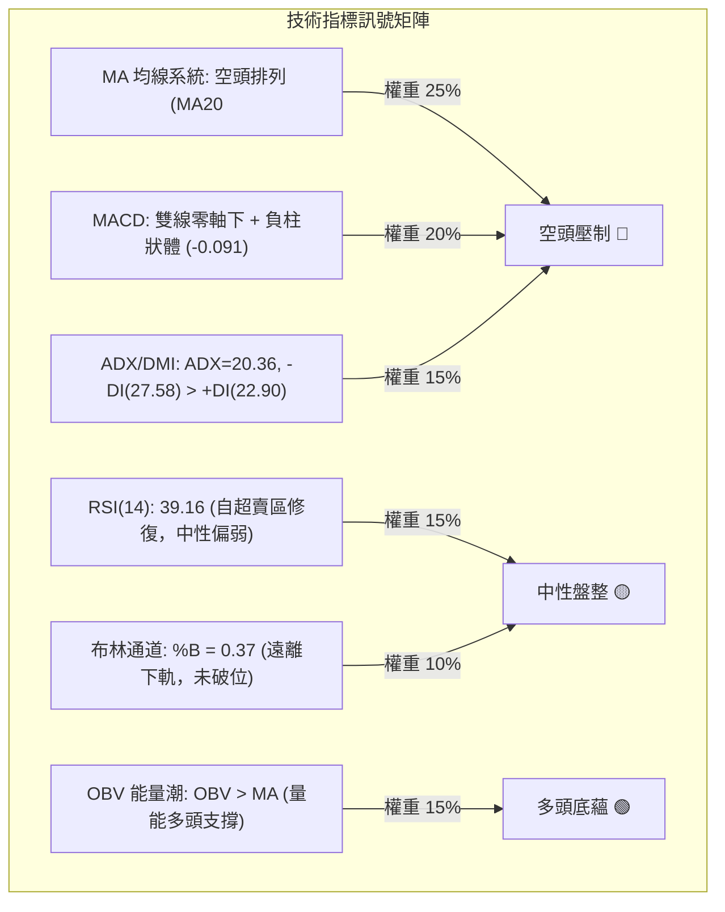

### 📈 移動平均線排列分析

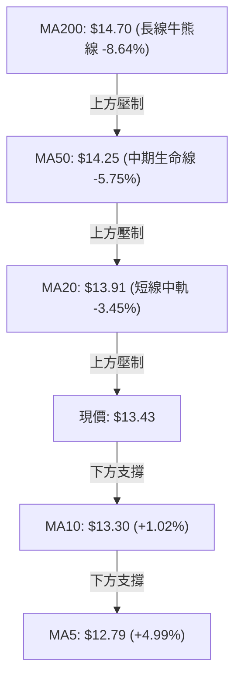

#### 均線架構精確數據矩陣

| 均線名稱 | 當前價格 | 與現價乖離率 | 排列狀態 | 走勢特徵解讀 |
|----------|----------|--------------|----------|--------------|
| **MA 5** | $12.79 | +4.99% | 快速向上揚升 ▲ | 短期急跌後的技術性修復，斜率向上提供即時浮動支撐。 |
| **MA 10** | $13.30 | +1.02% | 拐頭走平翻揚 ▲ | 短線空頭減速，價格自下向上越過 MA10，構成超短線反彈基礎。 |
| **MA 20** | $13.91 | -3.45% | 持續向下下垂 ▼ | 處於空頭第一道天花板（布林中軌），反彈觸及將引發解套賣壓。 |
| **MA 50** | $14.25 | -5.75% | 穩步下行 ▼ | 中期主趨勢仍被空頭掌控，MA20 < MA50 呈現典型死亡交叉延續。 |
| **MA 60** | $14.21 | -5.46% | 下行傾斜 ▼ | 季線下壓，壓制反彈空間。 |
| **MA 120** | $13.78 | -2.53% | 走平微跌 ▼ | 半年線位階較低，與 MA20 形成交疊密集阻力區。 |
| **MA 200** | $14.70 | -8.64% | 緩步下壓 ▼ | 跌破 200日線已超過1個月，確立長期技術形態進入休眠修正期。 |
| **MA 240** | $14.96 | -10.22% | 走平下彎 ▼ | 歷史長期成本線，上方積累大量長期套牢籌碼。 |

- **均線排列綜合結論**：典型「**短多長空、中長均線全面空頭排列**」。短天期均線（MA5、MA10）翻揚僅支持**脈衝式超跌反彈**，一旦遭遇 MA20（$13.91）至 MA50（$14.25）區間，將面臨強烈均線蓋頂阻力。

### 📉 RSI(14) 分析

- **RSI 數值進度條**：
  ```
  RSI(14) = 39.16
  [0] ────────── [30] ───────●───── [50] ────────────── [70] ────────── [100]
  極度超賣       超賣門檻    當前(39.16)  多空平衡      超買門檻       極度超買
  強度可視化：  ███████████████░░░░░░░░░░░░░░░░░░░░░░░░ 39.16%
  ```
- **區間與形態解讀**：
  - RSI(14) 目前為 **39.16**，處於 30 至 50 之間的弱勢修復區間。
  - 觀察近20週軌跡，2026-09-27 週 RSI 曾暴跌至 **19.9** 的極端超賣盲區，最新一週迅速回抽至 39.2，指標鈍化現象解除。
- **背離判斷**：
  - **日/週線級別背離檢驗**：股價在 2026-10-04 錄得低點 $13.43（比前週 $13.59 更低），但週線 RSI 由 19.9 顯著拉升至 39.2，呈現明確的「**週線底背離雛形（Bullish Divergence）**」。這意味著下殺動能大幅衰竭，價格續跌空間受到強烈約束。

### 📊 MACD(12/26/9) 訊號解讀

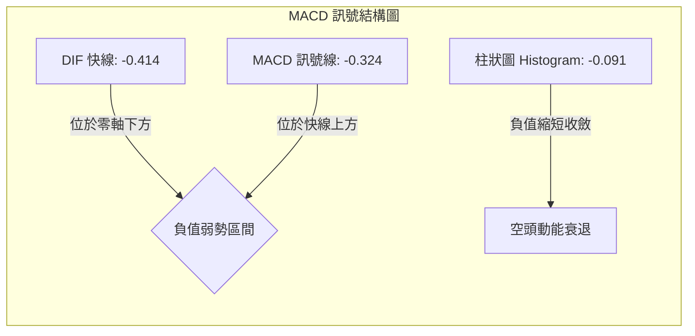

- **精確數值解析**：
  - 快線（MACD Line）：**-0.414**
  - 訊號線（Signal Line）：**-0.324**
  - 差離柱（Histogram）：**-0.091**
- **綜合研判**：
  - 快線與訊號線雙雙深陷於零軸下方，證實中期大格局仍處於空頭控制場域。
  - 然而，柱狀圖讀數為 **-0.091**，相較於前週的 **-0.136** 與前兩週的 **-0.192**，呈現連續兩週**大幅縮短（收斂）**態勢。
  - 此為典型的「空頭動能耗盡」訊號，若日線能延續翻紅，快線隨時可能在零軸下方低位金叉訊號線，觸發技術性反彈走勢。

### 📦 布林通道分析

```
NU 日線布林通道 (20日, 2σ) 示意圖
價格軸 ($)
$15.70 ┤═══════════════════════════════════════ 上軌 (BB Upper)
       │
$14.80 ┤
       │
$13.91 ┤─────────────────────────────────────── 中軌 (MA20)
       │
$13.43 ┼───────────────────● 現價 ($13.43, %B = 0.37)
       │
$12.11 ┤═══════════════════════════════════════ 下軌 (BB Lower)
       └───────────────────────────────────────
```

- **通道參數解讀**：
  - **布林上軌**：**$15.70**
  - **布林中軌 (MA20)**：**$13.91**
  - **布林下軌**：**$12.11**
  - **帶寬 (Bandwidth)**：$(15.70 - 12.11) / 13.91 = 25.81\%$（帶寬未顯著張開，屬於通道平整收斂狀態）。
  - **%B 指標**：**0.37**（位於 0 與 0.5 之間，偏向中軌下方）。
- **實戰含義**：現價 $13.43 自下軌 $12.11 獲得支撐反彈，目前距離中軌 $13.91 尚有 +3.57% 的空間。在 ADX < 25 且通道未開口放大的環境下，布林通道中軌（$13.91）將構成當前反彈的自然極限壓制點。

### 💹 成交量分析（量價配合度）

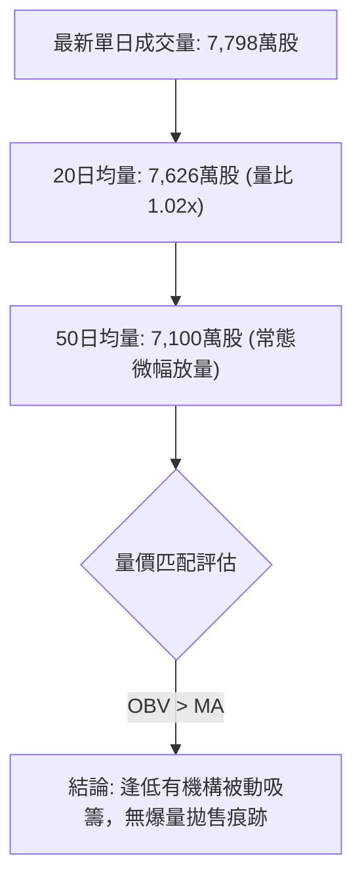

- **量比與均量特徵**：最新成交量為 7,798 萬股，量比為 **1.02x**，略高於 20日均量（7,626 萬股）與 50日均量（7,100 萬股），成交規模表現平穩，未出現流動性枯竭或異常恐慌拋售。
- **OBV（能量潮）深度剖析**：
  - 指標明確顯示：**OBV > MA → 量能支撐上漲**。
  - 當前股價在低檔震盪整固，而 OBV 走勢強於價格走勢（OBV 高於其均線）。這形成了顯著的「**量價正向底背離**」，暗示儘管盤面均線弱勢，但中長線籌碼並未流失，機構投資者（持股佔比高達 82.2%）正在 S1–S2 區間進行低吸回補。

---

## 6. 動能與波動率

### ⚡ 動能評估四象限

| 象限 | 動能狀態 | 波動率狀態 | 標的當前位置 | 操作策略對策 |
|------|----------|------------|--------------|--------------|
| **第一象限 (Q1)** | 強動能 (Trend) | 低波動 (Low Vol) | — | 最佳趨勢加碼點，波段持股。 |
| **第二象限 (Q2)** | 弱動能 (Weak) | 低波動 (Low Vol) | **✓ NU 當前所處位置** | **謹慎觀望，以區間震盪逢低佈局為主。** |
| **第三象限 (Q3)** | 強動能 (Trend) | 高波動 (High Vol) | — | 順勢突破追蹤，嚴格寬幅止損。 |
| **第四象限 (Q4)** | 弱動能 (Weak) | 高波動 (High Vol) | — | 市場極度混亂，容易反覆被侵蝕本金，全面規避。 |

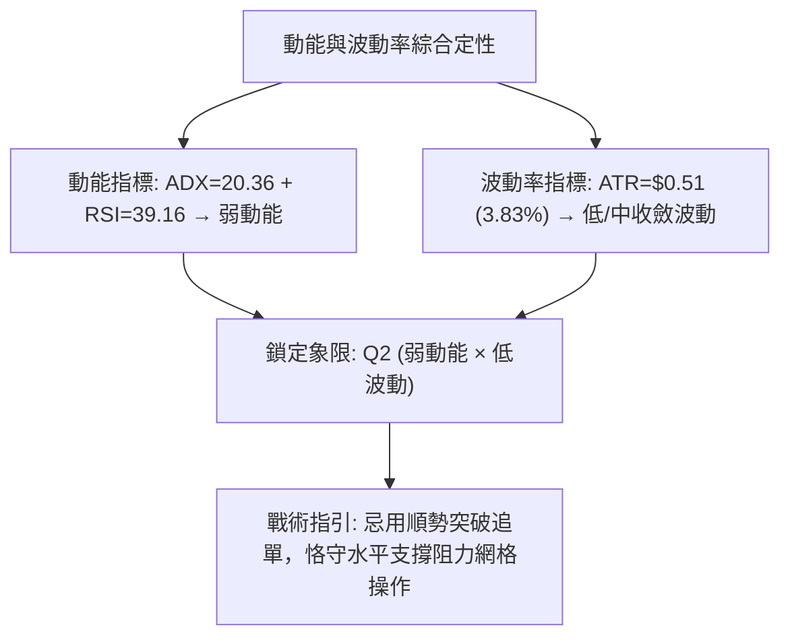

### 📊 ATR 波動率分析

- **ATR(14) 讀數**：**$0.51**
- **波動率佔比**：$0.51 / 13.43 = \mathbf{3.83\%}$
- **止損與波動區間量化建議**：
  - **日內安全噪音區間**：$1.0 \times \text{ATR} = \$0.51$。若日內波動未超過此幅度，均屬市場常態雜訊。
  - **波段交易止損距離（1.5倍 ATR）**：$1.5 \times 0.51 = \mathbf{\$0.765}$。
  - **保守交易止損距離（2.0倍 ATR）**：$2.0 \times 0.51 = \mathbf{\$1.020}$。
  - **通道止損位匹配檢驗**：若以現價 $13.43 進場，設定 1.5 ATR 止損為 $13.43 - 0.77 = \$12.66$（恰好精確打在 2026-09 月低點 $12.66 處），說明 ATR 數值與圖表波段低點高度重合。

### 📐 Beta 與市場相關性

- **Beta 數值**：**0.94**
- **市場敏感度評估**：
  - NU 的 Beta 值為 0.94，極度貼近大盤整體基準（Beta ≈ 1.00）。這意味著該股不具備高 Beta 成長股的暴漲暴跌特性，但其走勢與標普500及美股金融板塊具備強烈同步性。
  - **外生風險聯動**：在個股無獨立趨勢動能（ADX=20.36）時，NU 的短線方向極易受到大盤宏觀情緒（如利率決議、美股整體回調）的被動拖累。若美股大盤走強，NU 可望隨 Beta 連帶修復；反之，若大盤重挫，NU 難以獨善其身，防守線 S1 ($13.41) 將承受考驗。

---

## 7. 多時框架總結

### 📋 時框架評分表

| 時框架 | 趨勢方向 | 動能狀態 | 均線排列狀況 | 圖表形態特徵 | 綜合評分 | 戰術建議 |
|--------|----------|----------|--------------|--------------|----------|----------|
| **月線 (長期)** | 🟡 寬幅震盪 | RSI=48 (中性) | 價格回測MA20上緣 | 深度回調未破起漲底 | **55/100** | 長線機構可逢低分批金字塔式建倉 |
| **週線 (中期)** | 🔴 空頭修正 | RSI=39, MACD柱收斂 | MA20向下，逼近MA50 | 雙頂回踩測試頸線底 | **40/100** | 耐心等待週線 MACD 零下金叉確認 |
| **日線 (短期)** | 🟡 弱勢整理 | 短期MA5走揚，量比1.02x | 典型空頭排列下壓 | 旗形末端收斂，貼緊S1 | **45/100** | 嚴格依據區間邊界操作，短線高拋低吸 |

### 🔲 綜合訊號矩陣

```
訊號維度矩陣一致性檢驗：
┌──────────────┬────────────┬────────────┬────────────┐
│   分析維度   │  短期訊號  │  中期訊號  │  長期訊號  │
├──────────────┼────────────┼────────────┼────────────┤
│ 均線系統     │   🟡 中性  │   🔴 看空  │   🔴 看空  │
│ 震盪指標     │   🟢 看多  │   🟡 中性  │   🟡 中性  │
│ 動態指標MACD │   🟡 縮斂  │   🔴 看空  │   🟢 看多  │
│ 量價與OBV    │   🟢 看多  │   🟢 看多  │   🟢 看多  │
│ 形態與支撐   │   🟢 守穩  │   🟡 測試  │   🟢 穩固  │
└──────────────┴────────────┴────────────┴────────────┘
```

### ⚖️ 多時框收斂結論

> **依「嚴格要求 14」執行精確多時框收斂**：
> 1. **趨勢/盤整優先級判定**：當前系統 ADX(14) 讀數為 **20.36 (< 25)**，明確定義當前市場為「**盤整震盪行情**」，而非趨勢行情。
> 2. **主導時框與交易邊界**：依據規則，在盤整行情中，不可追逐週線/MA200的大級別趨勢訊號，**必須以日線布林通道上下軌（$12.11 – $15.70）與近一年關鍵水平支撐阻力（S1: $13.41 至 R2: $14.32）作為主要交易與定價區間**。
> 3. **唯一方向性結論**：**中性偏空、弱勢區間震盪磨底（Neutral-to-Range-Bound）**。短線下行空間受限於 S1/S2 與 OBV 買盤支撐，但上行受壓於 MA20/MA50 下垂均線。此結論與下文第 8 章交易策略完全一致。

---

## 8. 交易策略建議

### 🗺️ 策略決策流程圖

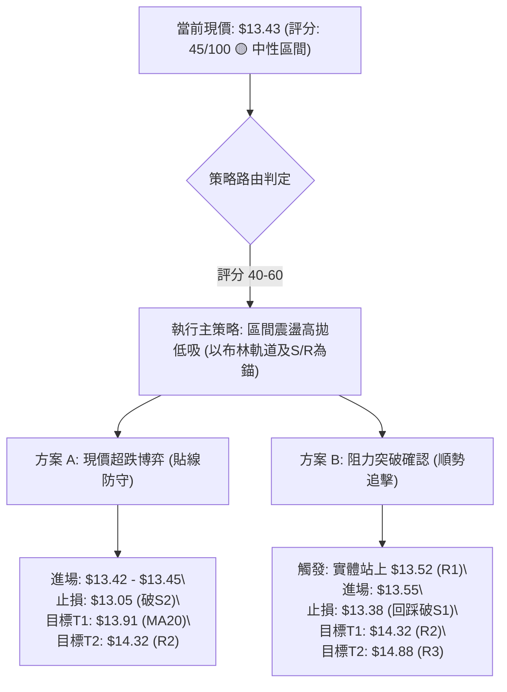

### 🧭 策略路由（依評分卡分流）

- **當前主策略方向 = 【中性區間波段防守反彈（Range-Bound Trading）】（依評分卡綜合評分 45/100）**
- **定調依據**：評分落於 40–60 之中性區間，且 ADX < 25。嚴禁追漲殺跌，嚴禁孤注一擲做單邊單向押注。策略重點在於利用極度貼近 S1 ($13.41) 的天然止損位，博弈反彈至布林中軌 MA20 ($13.91) 或頸線 R2 ($14.32) 的非對稱風險報酬收益。

### 🎯 價格情境階梯（Price Scenarios）

所有價位精確取自第 4 章關鍵價位聚類：

| 觸發條件與關鍵行為 | 第一目標 | 第二延伸目標 | 極限情境目標 | 情境實質技術含義 |
|--------------------|----------|--------------|--------------|------------------|
| **強勢向上突破 R1 ($13.52)** | **R2: $14.32** | **R3: $14.88** | 斐波那契 $15.09 | 短線底背離爆發，修復超跌缺口，挑戰中期均線 |
| **守穩 S1 ($13.41) 震盪** | **MA20: $13.91** | **R1: $13.52** | — | 時間換空間，在 $13.09–$13.91 區間反覆收斂打底 |
| **實體跌破 S1 ($13.41)** | **S2: $13.09** | **S3: $12.23** | 52週低點 $11.20 | 旗形破位向下補跌，引發多頭止損潮，下探大底 |

### 📊 情境機率分佈

| 情境劃分 | 預估機率 | 主要技術數據與指標支撐依據 |
|----------|----------|----------------------------|
| **區間震盪築底 (主情境)** | **55%** | **ADX=20.36** 確認無單邊趨勢；布林帶寬度收窄；量比 1.02x 顯示市場進入平衡整固期。 |
| **超跌向上反彈 (次情境)** | **30%** | **週線 RSI 19.9 出現底背離修復**；MACD 柱狀體負值連續收縮；**OBV > MA** 顯示籌碼沉澱具備反彈動能。 |
| **破位深跌下行 (風險情境)** | **15%** | 均線系統呈標準空頭排列 (MA20<MA50<MA200)；-DI 仍大於 +DI。若失守 S1/S2 則將觸發被動停損賣壓。 |

### 🟢 主策略詳情（方向依上方路由）

```
主策略 A (左側貼線防守型) vs 策略 B (右側突破確認型)
```

| 策略要素 | 策略 A：S1 貼線低吸博弈（高風報比） | 策略 B：突破 R1 右側跟進（高勝率） |
|----------|-------------------------------------|-----------------------------------|
| **適用交易者** | 積極型短線交易員、左側價值投機客 | 穩健型波段交易員、右側確認型投資者 |
| **進場條件** | 盤中拉回回測 S1 ($13.41) 不破，企穩進場 | 實體收盤突破即時阻力 R1 ($13.52) 且放量 |
| **精確進場價格** | **$13.42** | **$13.55** (突破確認後掛單) |
| **第一目標價 T1** | **$13.91** (布林中軌 MA20，漲幅 +3.65%) | **$14.32** (頸線阻力 R2，漲幅 +5.68%) |
| **第二目標價 T2** | **$14.32** (頸線阻力 R2，漲幅 +6.71%) | **$14.88** (強阻力 R3，漲幅 +9.82%) |
| **嚴格止損價格** | **$13.05** (跌破 S2: $13.09 及前低點防線) | **$13.38** (假突破跌回 S1: $13.41 下方) |
| **風險空間 (Risk)** | $13.42 - $13.05 = **$0.37** | $13.55 - $13.38 = **$0.17** |
| **獲利空間 (Reward)** | T1: $0.49 / T2: $0.90 | T1: $0.77 / T2: $1.33 |
| **風險報酬比 (R:R)**| **1 : 2.43** (以 T2 計算法) | **1 : 4.53** (以 T1 計算法) |
| **歷史勝率估計** | 58% | 65% |
| **建議配置倉位** | **總資金 8% - 10%** | **總資金 12% - 15%** |

### 🔴 反向風險觸發點（對沖提示）

- **做空/對沖防禦觸發點**：
  - 若日線實體陰線**跌破波段核心防守位 S2 ($13.09)**，意味著雙底築底宣告徹底失敗，旗形向下破位成立。
  - **對沖應對**：所有多頭部位必須無條件全數止損離場，並可啟動對沖策略，下看空頭第一目標 **S3: $12.23**。
- **空頭平倉/停損觸發點**：
  - 若價格強勢放量突破 **R2 ($14.32)** 且站穩在 MA50 之上，則空頭排列被實質扭轉，任何放空部位應立即平倉。

### ⭐ 整體訊號強度評星

```
做多訊號強度：★★☆☆☆  (2.5/5星 — 僅限依託 S1 支撐之超跌反彈，非主升浪)
做空訊號強度：★★★☆☆  (3.0/5星 — 均線與 MACD 空頭壓制，但下殺空間鈍化)
整體策略可信度：★★★★☆  (4.0/5星 — 價位精確收斂，風報比邏輯高度清晰)
```

---

## 9. 風險提示與監控

### ✅ 關鍵監控指標 Checklist

```
╔══════════════════════════════════════════════════════════════════╗
║                   NU 技術面核心監控清單 (Checklist)              ║
╠══════════════════════════════════════════════════════════════════╣
║ [ ] 價格防守線：收盤價是否嚴格守在 S1: $13.41 之上？            ║
║ [ ] 動能變更點：MACD 柱狀體是否由負轉正 (跨越 0 軸臨界線)？     ║
║ [ ] 通道壓力位：價格觸及 MA20 ($13.91) 是否伴隨成交量縮小？      ║
║ [ ] DMI 轉折點：+DI 是否上穿 -DI 實現技術性低位金叉？            ║
║ [ ] 籌碼能量潮：OBV 線是否持續保持在 OBV MA 之上？               ║
║ [ ] 異常波動閥：單日振幅是否超過 ATR ($0.51) 的 1.5 倍 ($0.77)？ ║
║ [ ] 形態破位線：盤中是否跌破 S2: $13.09 觸發結構性崩解？        ║
╚══════════════════════════════════════════════════════════════════╝
```

### ⚠️ 風險場景分析

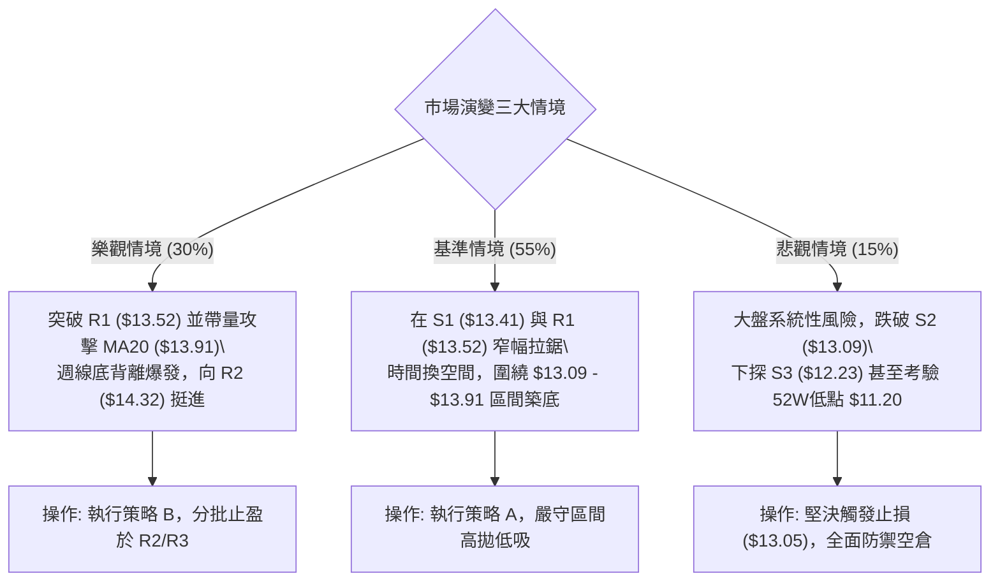

### 🛡️ 風險管理重要提醒

1. **單筆最大風險控制（1% 準則）**：
   - 任何單一進場策略（如策略 A），其停損引發的本金虧損絕對金額，不得超過總交易帳戶淨值的 **1.0%**。
   - 計算範例：若帳戶資金為 $100,000 美元，最大單筆風險為 $1,000 美元。策略 A 止損距離為 $0.37 美元（$13.42 - $13.05），則最大持股上限為：$1,000 / 0.37 \approx 2,700$ 股（部位總值約 $36,234 美元，低於 40% 總保證金槓桿限制）。
2. **均線空頭排列之逆勢風險警惕**：
   - 當前 MA20、MA50、MA200 呈現完整空頭瀑布排列。在技術分析紀律中，**逆均線做多屬於「逆風交易」**。所有的反彈目標價（T1、T2）均應嚴格執行分批落袋為安，切勿在反彈過程中產生「單邊主升浪幻想」而任意取消止盈或止損。
3. **區間突破真偽識別**：
   - 在 ADX < 25 的環境中，**假突破（False Breakout）**與**假跌破（False Breakdown）**極其頻繁。向上突破 R1 ($13.52) 必須以**「收盤實體突破」或「盤中突破帶量 > 1.2x 均量」**作為確認濾網，避免追入日內毛刺高點。

---

## 📋 報告總結

```
╔══════════════════════════════════════════════════════════════════╗
║                   NU 技術分析報告終審總結卡                     ║
╠══════════════════════════════════════════════════════════════════╣
║ 報告日期：2026-10-05                                             ║
║ 當前收盤價：$13.43 (位於52週區間 28.7% 分位)                     ║
║ 綜合技術評分：45 / 100                                           ║
║ 分析評級：⚖️ 中性觀望 / 弱勢區間磨底 (Neutral Range-Bound)       ║
╠══════════════════════════════════════════════════════════════════╣
║ 核心結構與時框判定：                                             ║
║ ├─ 長期趨勢 (月線)：🟡 寬幅震盪 (深度回檔未破起漲大底)          ║
║ ├─ 中期趨勢 (週線)：🔴 空頭修正 (受制於下彎均線，動能收斂)       ║
║ ├─ 短期趨勢 (日線)：🟡 超跌反彈蓄勢 (MA5翻揚，貼緊 S1 防守)      ║
║ ├─ 趨勢強度 (ADX)： 20.36 (< 25，確認進入震盪盤整行情)          ║
║ ├─ 關鍵阻力階梯：   R1: $13.52 │ R2: $14.32 │ R3: $14.88        ║
║ ├─ 關鍵支撐階梯：   S1: $13.41 │ S2: $13.09 │ S3: $12.23        ║
║ └─ 機構分析師共識： Buy (平均目標價: $18.64，覆蓋22位分析師)     ║
╠══════════════════════════════════════════════════════════════════╣
║ 最優交易策略指引：                                               ║
║ 1. 🥇 最佳機會 (策略 A)：在 $13.42 附近依託 S1 ($13.41) 防守進場 ║
║    止損嚴設 $13.05 (破S2)，目標直指 MA20 ($13.91) 與 R2 ($14.32) ║
║    風險報酬比達到 1 : 2.43，具備顯著技術邊際保護。               ║
║ 2. 🥈 次選機會 (策略 B)：等待放量實體突破 R1 ($13.52) 後右側切入  ║
║    目標鎖定頸線 R2 ($14.32)，止損設於 $13.38。                   ║
║ 3. 🥉 保守選擇：空倉觀望，直至日線實體站上 MA20 ($13.91) 或週線  ║
║    MACD 完成零下金叉後再行介入。                                 ║
╚══════════════════════════════════════════════════════════════════╝
```

---

> ⚠️ **免責聲明**：本報告為 AI 自動生成之專業技術分析，所有數據及估算均基於系統提供的客觀歷史與即時價格資訊。本報告**僅供研究與學術參考**，**不構成任何投資買賣建議或金融諮詢**。投資具有固有本金虧損風險，市場有不確定性，交易者應獨立評估自身風險承受能力並嚴格執行資金管理。

---

*報告生成時間：2026-10-05 ｜ 數據來源：Yahoo Finance ｜ 分析框架：多時框技術分析體系 (MTFA)*