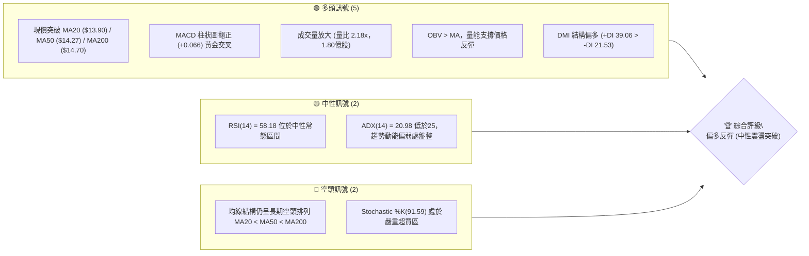
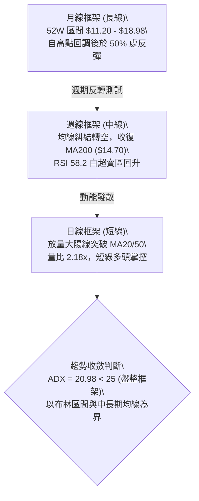
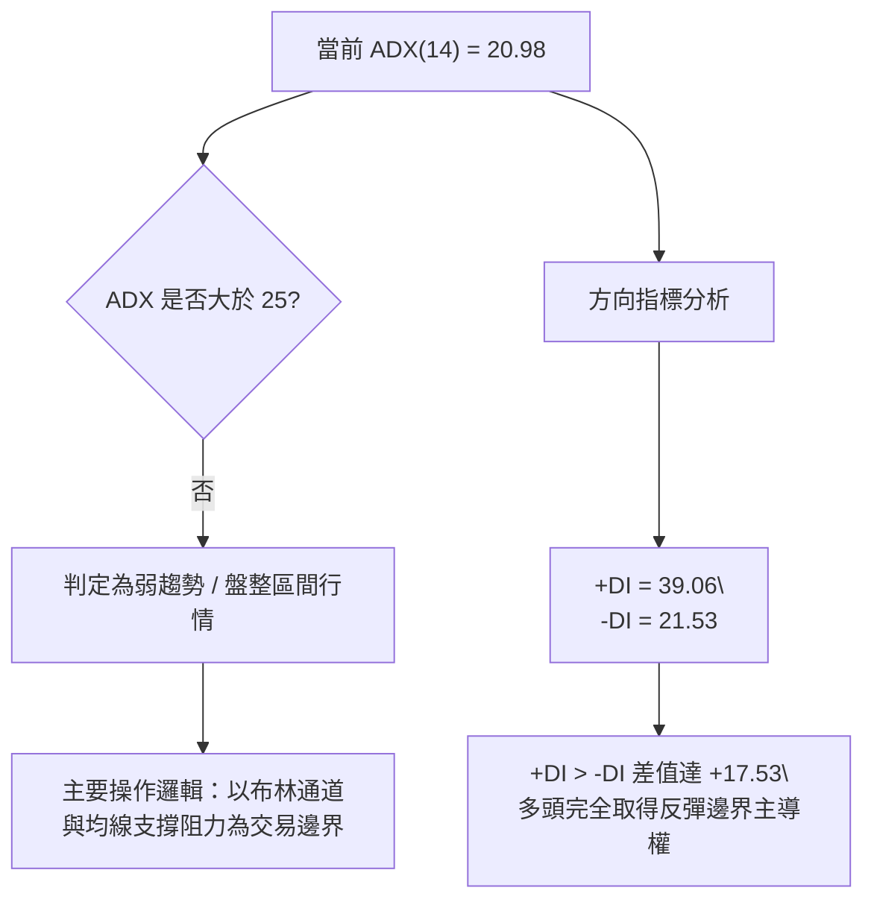
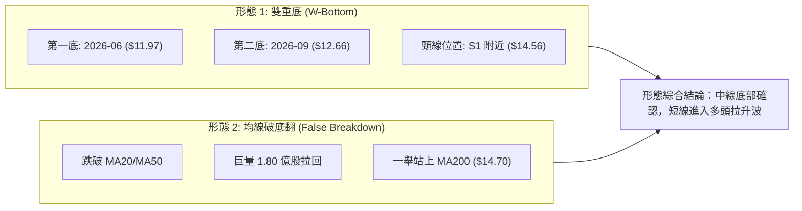
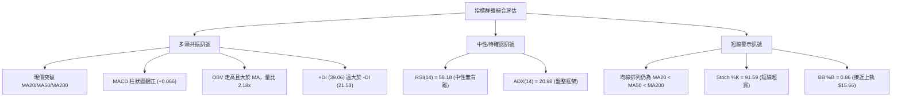
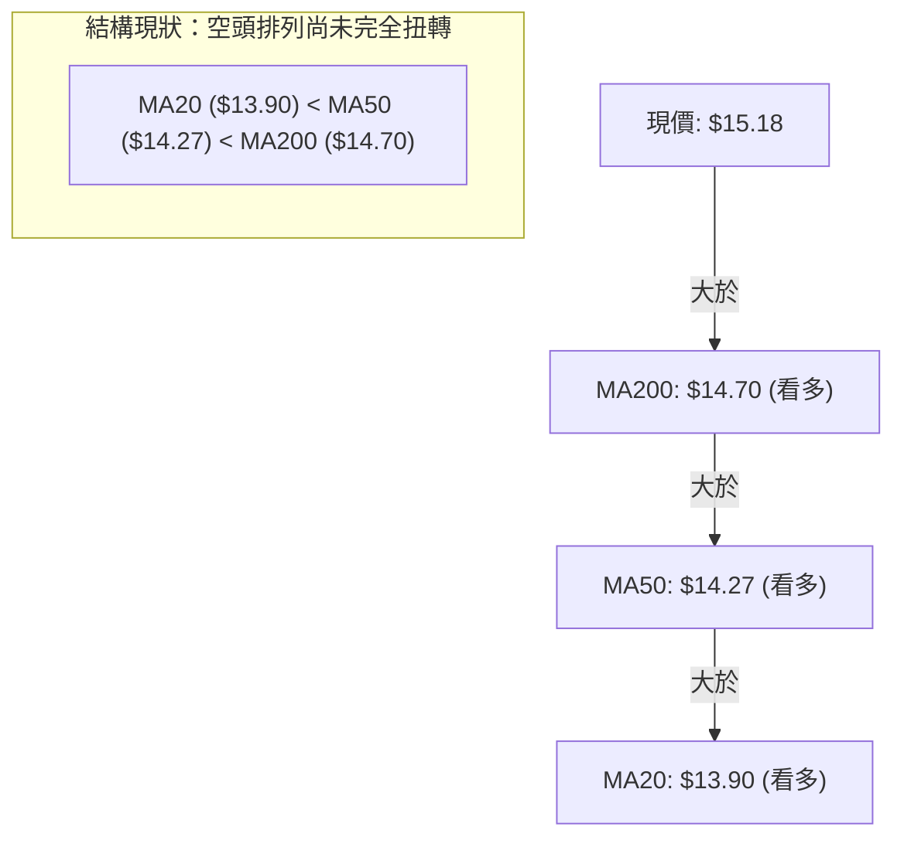
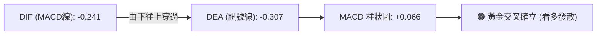
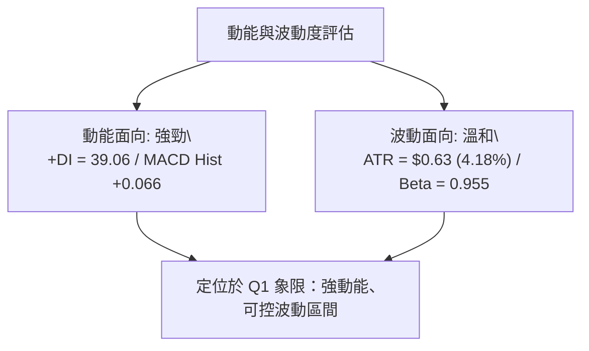
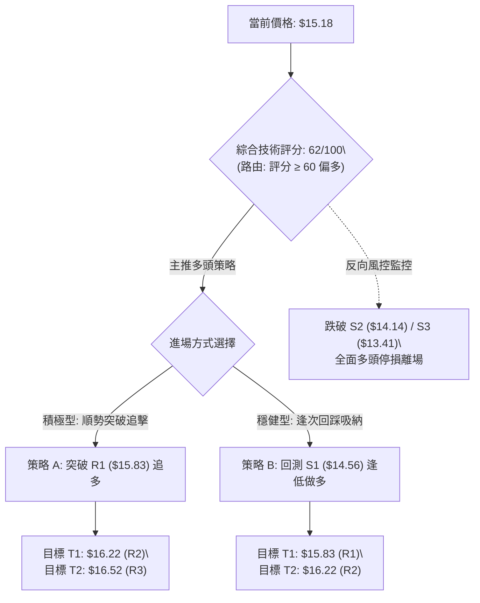
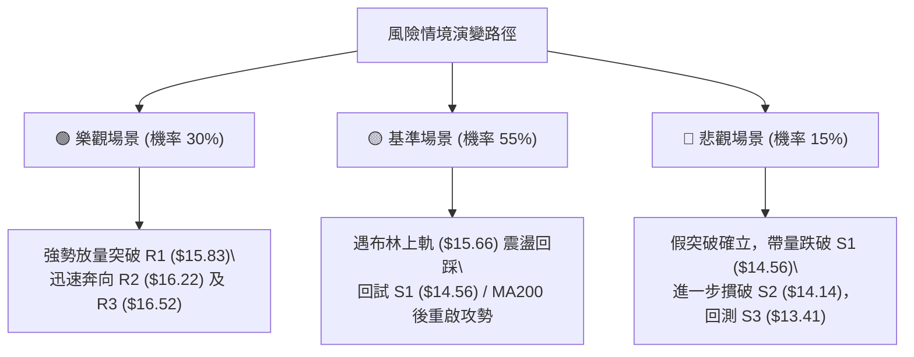

# NU 技術分析報告

> **報告日期**：2026-10-06 ｜ **語言**：繁體中文 ｜ **數據來源**：Yahoo Finance ｜ **當前價格**：$15.18

---

## 目錄

| 章節 | 內容 |
|------|------|
| [1. 技術面概覽](#1-技術面概覽) | 訊號儀表板、核心指標、評分卡 |
| [2. 趨勢分析](#2-趨勢分析) | 多時框趨勢、長中短期走勢、ADX 解讀 |
| [3. 圖表形態分析](#3-圖表形態分析) | 形態識別、信心度評估、K線組合 |
| [4. 支撐與阻力](#4-支撐與阻力) | 關鍵價位、斐波那契回調結構 |
| [5. 技術指標深度解讀](#5-技術指標深度解讀) | MA/RSI/MACD/布林/成交量整合 |
| [6. 動能與波動率](#6-動能與波動率) | 動能象限、ATR 波動度、Beta 相關性 |
| [7. 多時框架總結](#7-多時框架總結) | 時框矩陣、收斂規則與方向定調 |
| [8. 交易策略建議](#8-交易策略建議) | 策略路由、主策略規劃、風報比計算 |
| [9. 風險提示與監控](#9-風險提示與監控) | 監控清單、情境演變、倉位風控 |

---

## 1. 技術面概覽

### 🎯 技術訊號儀表板



### 📊 核心指標速覽表

| 指標類別 | 指標名稱 | 當前數值 | 訊號 | 解讀 |
|----------|----------|----------|------|------|
| **價格** | 當前價格 | $15.18 | 🟢 | 現價強勢站上多條關鍵均線，脫離底部盤整區 |
| **均線** | MA20 | $13.90 | 🟢 | 價格在 MA20 上方 (+9.21%)，短線反彈動能強勁 |
| **均線** | MA50 | $14.27 | 🟢 | 價格在 MA50 上方 (+6.38%)，中期結構初步修復 |
| **均線** | MA200 | $14.70 | 🟢 | 價格重返 MA200 上方 (+3.27%)，多空分水嶺收復 |
| **均線排列** | 結構型態 | 空頭排列 | 🔴 | MA20 < MA50 < MA200，長期趨勢扣抵壓制仍需時間消化 |
| **動能** | RSI(14) | 58.18 | 🟡 | 位於中性偏強區間 (30–70)，無超買超賣及背離現象 |
| **動能** | MACD(12,26,9) | -0.241 / -0.307 | 🟢 | 柱狀圖為 +0.066，零軸下方出現黃金交叉向上發散 |
| **擺動** | Stoch %K / %D | 91.59 / 65.50 | 🔴 | %K 突破 90 進入短線超買區，隨時有技術性回洗需求 |
| **趨勢強度** | ADX(14) | 20.98 | 🟡 | ADX < 25 表明為盤整震盪市場，尚非強烈單邊趨勢行情 |
| **方向指標** | +DI / -DI | 39.06 / 21.53 | 🟢 | +DI 明顯高於 -DI，短期反彈多方取得絕對控盤權 |
| **布林通道** | BB 帶寬 / %B | $12.14–$15.66 / 0.86 | 🟡 | 價格逼近 BB 上軌 ($15.66)，短線進入通道上緣超壓區 |
| **成交量** | 最新量 / 20日均量 | 180.46M / 82.87M | 🟢 | 量比達 2.18x，伴隨 OBV 走高，量價齊揚驗證突破 |
| **波動度** | ATR(14) | $0.63 (4.18%) | 🟡 | 波動度處於中等水平，每日震盪區間約 $0.63 |

### 🏆 技術評分卡

```
╔══════════════════════════════════════════════════════════════╗
║                 技術評分卡 — NU (2026-10-06)                 ║
╠══════════════════════════════════════════════════════════════╣
║ 趨勢強度 (Trend)      ██████████░░░░░░░░░░  52/100  🟡 中性  ║
║ 動能指標 (Momentum)   ██████████████░░░░░░  68/100  🟢 看多  ║
║ 支撐穩定度 (Support)  ██████████████░░░░░░  70/100  🟢 看多  ║
║ 成交量配合 (Volume)   ████████████████░░░░  80/100  🟢 強多  ║
║ 形態完整度 (Pattern)  ████████████░░░░░░░░  60/100  🟢 偏多  ║
║ 均線架構 (Moving Avg) ████████░░░░░░░░░░░░  42/100  🔴 偏空  ║
╠══════════════════════════════════════════════════════════════╣
║ 綜合評分 (Overall)    █████████████░░░░░░░  62/100  🟢 偏多  ║
║ 評級結論：區間底部放量突破，進入多頭反彈修復波段              ║
╚══════════════════════════════════════════════════════════════╝
```

---

## 2. 趨勢分析

### 🌐 多時框趨勢分析



### 📈 長期趨勢 — 12個月走勢圖（Unicode）

NU 過去 12 個月收盤價格軌跡如下（2025-10 至 2026-10）：

```
NU 月線走勢圖（過去12個月）
價格軸 ($)
$18.00 ┤                     ● 17.75 (2026-01 高點)
$17.00 ┤              ● 17.39    ● 16.74
$16.00 ┤ ● 16.11                                              
$15.00 ┤                                 ● 14.98                      ● 15.18 (現價)
$14.00 ┤                                     ● 14.37  ● 14.48             ● 14.55
$13.00 ┤                                                  ● 13.13  ● 13.36   ● 14.33
$12.00 ┤                                                                          ● 12.66 (低點)
       └────────────────────────────────────────────────────────────────────────────
        10/25  11/25  12/25  01/26  02/26  03/26  04/26  05/26  06/26  07/26  08/26  09/26  10/26
```

#### 走勢特徵分析表格

| 階段區間 | 時間跨度 | 價格起訖 | 漲跌幅 | 走勢特徵解讀 |
|----------|----------|----------|--------|--------------|
| **波段攻頂段** | 2025-10 ~ 2026-01 | $16.11 → $17.75 | +10.18% | 延續強勢上漲，並於 2026-01 創波段高點 $17.75（接近 52W 高點 $18.98）。 |
| **中期回調段** | 2026-01 ~ 2026-05 | $17.75 → $13.13 | -26.03% | 連續 4 個月單邊下跌，跌破多條長期均線，空方主導。 |
| **底部築底段** | 2026-05 ~ 2026-08 | $13.13 → $14.55 | +10.81% | 於 $13.13–$14.55 區間反覆震盪打底，建立密集支撐中樞。 |
| **終極探底段** | 2026-08 ~ 2026-09 | $14.55 → $12.66 | -12.99% | 短線破位下殺，於 2026-09 週線觸及 RSI 19.9 極度超賣。 |
| **反轉突破段** | 2026-09 ~ 2026-10 | $12.66 → $15.18 | +19.91% | 放量長紅吞噬，連續站上 $14.00整數關卡，直接收復 MA200。 |

### 📊 中期趨勢（週線分析）

從近 20 週收盤走勢可見，2026-09-27 當週收盤跌至 $13.59，RSI 跌至 19.9 的極度超賣區，隨後 10-04 當週成交量擴大至 532.73M 股，呈現放量承接形態。本週（2026-10-11 當週截算至即時）以大陽線拉升至 $15.18，週 MACD 柱狀圖由 -0.091 急遽拉升至 +0.066，完成底部轉折確認。

```
近期週線壓力與支撐示意圖：
$16.52 ────────────────────────────────── 強阻力 R3
$16.22 ────────────────────────── 波段阻力 R2
$15.83 ────────────────── 短線阻力 R1 / BB 上軌 ($15.66)
$15.18 ━━━━━━━ 現價 ━━━━━━━ (突破 MA200: $14.70)
$14.56 ────────────────── 短線支撐 S1
$14.14 ────────────────────────── 密集支撐 S2 / MA50 ($14.27)
$13.41 ────────────────────────────────── 強防守支撐 S3
```

### ⚡ 趨勢強度評估（ADX 解讀）



#### ADX 強度對照表

| 指標參數 | 數值 | 門檻區間 | 行情屬性判定 | 操作策略指示 |
|----------|------|----------|--------------|--------------|
| **ADX(14)** | 20.98 | < 25 | 弱趨勢 / 盤整震盪 | 忌追高單邊突破，採用支撐阻力高出低進策略 |
| **+DI** | 39.06 | > 30 (極高) | 短線買盤爆發 | 多頭反彈動能充沛，支持價格挑戰上方阻力 |
| **-DI** | 21.53 | < 25 (偏弱) | 賣盤動能衰竭 | 空方下殺動能暫歇，回測有承接買盤 |

---

## 3. 圖表形態分析

### 🔍 形態識別系統



#### 形態信心度與目標價計算表

| 形態名稱 | 信心度 | 判斷依據（引用數據） | 完成度 | 目標價（附計算式） |
|----------|--------|----------------------|--------|--------------------|
| **雙重底 (W底)** | 75% | 第一次波段低點於 2026-06-07 收盤 $11.97，第二次低點於 2026-09 收盤 $12.66（低點墊高）；頸線位置為波段高點聚類 S1 ($14.56)。當前價格 $15.18 已有效站上頸線。 | 100% (已突破) | 由雙底形態推算：<br>頸線 $14.56 + (頸線 $14.56 - 低點 $12.66) = $14.56 + $1.90 = **$16.46**（接近 R3: $16.52） |
| **破底翻 (均線收復)** | 80% | 價格在 2026-09 跌破支撐後，迅速於 2026-10 帶量（180.46M 股，量比 2.18x）回升，連破 MA20 ($13.90)、MA50 ($14.27)、MA200 ($14.70)。 | 90% | 由突破波幅推算：<br>突破點 $14.70 + (波段起漲點 $15.18 - 起跌點 $13.41) = **$16.47** |
| **上升旗形** | 40% | 數據中尚未形成足夠的旗面整理 K 線，僅為單邊放量拉升。 | 20% | 訊號不足，僅做指標型解讀，不預設目標價。 |

### 🕯️ 重要 K 線形態分析

| 月份 / 週別 | 收盤價 | K 線形態 | 解讀 | 訊號 |
|-------------|--------|----------|------|------|
| **2026-09-27** | $13.59 | 長下影陰線 (超賣探底) | RSI 跌至 19.9，出現嚴重拋售耗竭訊號。 | 🟡 止跌訊號 |
| **2026-10-04** | $13.43 | 底部放量十字變盤線 | 單週成交量達 532.73M 股，機構大資金進場承接。 | 🟢 變盤向上 |
| **2026-10-11** | $15.18 | 放量大陽線 (吞噬破底) | 最新成交量 180.46M，一舉吞噬前 4 週跌幅，強勢收復 MA200。 | 🟢 強烈看多 |

### 📉 ASCII 走勢形態示意圖

```
雙重底 (W-Bottom) 與破底翻突破架構：

  價格
  $16.50 ┤                                           [目標價 $16.46]
  $16.00 ┤                                        ／
  $15.50 ┤                                     ／ 
  $15.18 ┤───────────────────────────────────● 現價 (突破確認)
  $14.56 ┤              頸線 (S1: $14.56) ━━━━━┳━━━━━━
  $14.00 ┤            ／＼                   ／
  $13.50 ┤          ／    ＼               ／
  $13.00 ┤        ／        ＼           ／
  $12.50 ┤      ／            ＼       ● 第二底 ($12.66, 2026-09)
  $12.00 ┤    ● 第一底 ($11.97, 2026-06)
         └───────────────────────────────────────────────
```

### 🎯 形態目標價計算

1. **雙底量度目標價**：
   - 頸線（Neckline）：取波段關鍵位聚類 $14.56。
   - 形態底部低點：取 2026-09 月線低點 $12.66。
   - 形態垂直高度（H）= $14.56 - $12.66 = $1.90。
   - **量度目標價** = $14.56 + $1.90 = **$16.46**。此數值高度重合於上方阻力 R3 ($16.52)。
2. **第一階段目標價**：
   - 上方阻力聚類 R1: **$15.83** 及布林上軌 **$15.66**。

---

## 4. 支撐與阻力

### 🗺️ 關鍵價位分布圖（Unicode）

```
NU 價位結構分布圖
═══════════════════════════════════════════════════════════════
$18.98 ║██████████████████████████████║ 52週高點 (0.0% Fib)
$17.14 ║██████████████████████        ║ 23.6% 斐波那契位
$16.52 ║██████████████████████████████║ 強阻力 R3 (雙底量度目標)
$16.22 ║████████████████████          ║ 阻力 R2
$16.01 ║██████████████████████        ║ 38.2% 斐波那契位
$15.83 ║██████████████████████████████║ 關鍵阻力 R1 (布林上軌附近)
$15.18 ╠══════════════════════════════╣ ◄ 現價 (收盤價)
$15.09 ║▓▓▓▓▓▓▓▓▓▓▓▓▓▓▓▓▓▓▓▓▓▓▓▓▓▓▓▓▓▓║ 50.0% 斐波那契關鍵樞紐
$14.70 ║▓▓▓▓▓▓▓▓▓▓▓▓▓▓▓▓▓▓▓▓          ║ 年線 MA200 牛熊分水嶺
$14.56 ║▓▓▓▓▓▓▓▓▓▓▓▓▓▓▓▓▓▓▓▓▓▓▓▓▓▓▓▓▓▓║ 近期支撐 S1 (雙底頸線)
$14.17 ║▓▓▓▓▓▓▓▓▓▓▓▓▓▓▓▓▓▓▓▓          ║ 61.8% 斐波那契位
$14.14 ║██████████████████████████████║ 強支撐 S2 (MA50: $14.27 附近)
$13.41 ║██████████████████████████████║ 核心防守支撐 S3 (MA10)
$11.20 ║██████████████████████████████║ 52週低點 (100.0% Fib)
═══════════════════════════════════════════════════════════════
```

### 🚧 阻力位分析表

所有數值均嚴格引用數據中「關鍵價位」與斐波那契點位：

| 阻力級別 | 價位 | 形成原因 | 突破難度 | 重要性 |
|----------|------|----------|----------|--------|
| **R1** | **$15.83** | 近一年波段高點聚類，逼近布林通道上軌 ($15.66) | 🟡 中等 | 短線多頭獲利了結首道關卡 |
| **R2** | **$16.22** | 近一年波段次高點密集套牢區，上方臨近 38.2% Fib ($16.01) | 🔴 較高 | 中期趨勢反轉確認點 |
| **R3** | **$16.52** | 近一年波段核心高點聚類，亦為雙底推算目標 ($16.46) 匯聚處 | 🔴 極高 | 波段反彈極限壓力位 |

### 🛡️ 支撐位分析表

所有數值均嚴格引用數據中「關鍵價位」與重要均線點位：

| 支撐級別 | 價位 | 形成原因 | 守住機率 | 重要性 |
|----------|------|----------|----------|--------|
| **S1** | **$14.56** | 近一年波段低點聚類，雙底形態頸線位，下方緊鄰 MA200 ($14.70) | 🟢 80% | 頂底互換關鍵點，多頭強勢回測防線 |
| **S2** | **$14.14** | 近一年重要低點密集區，疊加 61.8% Fib ($14.17) 與 MA50 ($14.27) | 🟢 85% | 中期生命線，失守則反彈結構破壞 |
| **S3** | **$13.41** | 近一年強波段低點支撐，疊加短期 MA10 ($13.41) 位置 | 🟢 95% | 多頭底線，跌破則重新考驗前低 |

### 📐 斐波那契回調位分析

依據 52 週區間 **$11.20 (52W Low) → $18.98 (52W High)** 計算之回調位分析：

- **0.0% ($18.98)**：52 週最高點，長期多頭終極目標。
- **23.6% ($17.14)**：強勢多頭整理區，歷史強阻力。
- **38.2% ($16.01)**：波段核心分水嶺，位於 R1 ($15.83) 與 R2 ($16.22) 之間。
- **50.0% ($15.09)**：**現價 $15.18 正落在此處！** 股價剛好突破 50% 關鍵平衡點，顯示多頭已奪回半數失地，由弱勢格局轉為強勢反彈。
- **61.8% ($14.17)**：黃金回調位，與 S2 ($14.14) 及 MA50 ($14.27) 高度共振，構成堅實的中期防禦底部。
- **78.6% ($12.86)**：深度回調支撐位，2026-09 月收盤 $12.66 曾在此獲得支撐。
- **100.0% ($11.20)**：52 週最低點，長期絕對安全邊界。

**現價位置解讀**：現價 $15.18 位於 **50.0% ($15.09)** 與 **38.2% ($16.01)** 之間。突破 50% 樞紐代表買方自超跌中全面復甦，下一站將向上測試 38.2% ($16.01) 與 R1 ($15.83) 共振壓力帶。

---

## 5. 技術指標深度解讀

### 🎛️ 指標訊號總覽



### 📈 移動平均線排列分析



#### 均線數據明細表

| 均線週期 | 數值 | 現價偏離幅度 | 方向判定 | 結構意涵 |
|----------|------|--------------|----------|----------|
| **MA 5** | $13.38 | +13.44% | 🟢 向上發散 | 短線極度強勢，提供微觀支撐 |
| **MA 10** | $13.41 | +13.22% | 🟢 向上發散 | 與支撐 S3 ($13.41) 完美共振 |
| **MA 20** | $13.90 | +9.21% | 🟢 向上穿越 | 布林中軌所在，短線強弱分水嶺 |
| **MA 50** | $14.27 | +6.38% | 🟢 向上穿越 | 中期生命線，已由壓力轉化為第一道動態支撐 |
| **MA 60** | $14.23 | +6.68% | 🟢 向上穿越 | 中期均線平緩，支撐買盤 |
| **MA 120**| $13.78 | +10.18% | 🟢 向上穿越 | 半年線被強勢拉回，修復中期均線系統 |
| **MA 200**| $14.70 | +3.27% | 🟢 向上收復 | **長期年線牛熊分水嶺已成功站上！** |
| **MA 240**| $14.96 | +1.48% | 🟢 向上收復 | 長期大週期均線重新踩在腳下 |

**均線綜合解讀**：目前價格呈現「價格率先突刺、均線仍在滯後梳理」的破底翻格局。雖然當前均線系統名義上仍為 `MA20 < MA50 < MA200` 的長期空頭排列，但短天期均線（MA5、MA10、MA20）已以逾 9%~13% 的正乖離快速勾頭向上。若價格能維持在 MA200 ($14.70) 之上震盪，MA20 將於 1-2 週內黃金交叉 MA50，形成全面多頭排列。

### 📉 RSI(14) 分析

- **當前數值**：**58.18**
- **強度指示**：
  ```
  超賣 (0-30)           中性偏強 (30-70)             超買 (70-100)
  ░░░░░░░░░░░░░░░░░░░░ ▓▓▓▓▓▓▓▓▓▓▓▓▓▓▓▓▓▓▓░░░░░░░░░░░░░ ░░░░░░░░░░░░░░░░░░░░
  0                    30                58.18    70                  100
  ```
- **區間與背離判定**：
  - RSI(14) 從 2026-09-27 的極端超賣值 **19.9** 暴力回升至目前的 **58.18**，擺脫了弱勢熊市區間，重新進入 50–70 的健康多頭推升區間。
  - **背離分析**：目前 **無明顯背離**（價格創近期反彈新高，RSI 同步自低檔強勁揚升），動能健康且未出現衰竭現象。

### 📊 MACD(12,26,9) 訊號解讀



- **MACD 線**：-0.241
- **訊號線 (Signal)**：-0.307
- **柱狀圖 (Histogram)**：**+0.066**（綠柱持續放大）
- **背離分析**：在 2026-09-20 柱狀圖觸及 -0.192 低點後，雖然價格在 2026-10-04 創波段收盤低點 $13.43，但 MACD 柱狀圖收斂至 -0.091，形成清晰的**柱狀圖底背離**。當前柱狀圖翻正至 +0.066，確認底背離反轉成功。

### 📦 布林通道分析

```
布林通道結構 (帶寬 $12.14 ~ $15.66)：
$15.66 ┬────────────────────────────────────────── BB 上軌 (阻力帶)
       │                                     ● 現價: $15.18 (%B = 0.86)
$15.00 ┤                                   ／
       │                                 ／
$13.90 ┼────────────────────────────────────────── BB 中軌 (MA20)
       │                             ／
$13.00 ┤                           ／
       │                     ● 2026-10 低點 ($13.43)
$12.14 ┴────────────────────────────────────────── BB 下軌
```

- **BB %B = 0.86**：價格目前位於通道頂部 86% 的位置，極度接近上軌 $15.66。
- **通道特徵**：布林帶寬呈現擴張態勢（上下軌距離 $3.52）。由於 ADX < 25 表明為盤整市，當 %B 接近 0.90–1.00 時，上軌通常提供實質反壓，短期內股價有回測中軌 MA20 ($13.90) 或支撐 S1 ($14.56) 進行能量蓄積的可能。

### 💹 成交量分析（量價配合度）

- **最新成交量**：180,455,100 股
- **20日均量**：82,865,190 股（**量比：2.18x**）
- **50日均量**：72,781,882 股（**量比：2.48x**）
- **OBV 趨勢解讀**：
  - OBV 明顯大於其移動平均線，且成交量伴隨大陽線激增超過 2 倍。
  - 此非無量虛漲，而是標準的「放量突破」。機構法人（機構持股佔比高達 82.2%）進場增持訊號明確，驗證了此波反彈的真實性。

---

## 6. 動能與波動率

### ⚡ 動能評估四象限

| 象限 | 動能強度 | 波動率水準 | NU 當前狀態 | 策略應對方向 |
|------|----------|------------|-------------|--------------|
| **Q1 (動能爆發)** | 強動能 (+DI高/MACD金叉) | 低/中波動 (ATR 4.18%) | **✓ 當前所處位置** | **順勢做多、逢回踩買入**，性價比最優 |
| **Q2 (盤整低迷)** | 弱動能 (MACD死叉) | 低波動 | — | 觀望等待 |
| **Q3 (極端狂熱)** | 強動能 | 極高波動 (ATR > 8%) | — | 隨時防範劇烈洗盤 |
| **Q4 (破位崩盤)** | 弱動能 | 高波動 | — | 嚴格止損出局 |



### 📊 ATR 波動率分析

- **ATR(14)**：**$0.63**（佔現價 4.18%）。
- **日內波動區間**：預期每日正常波動範圍在 $0.63 左右。
- **止損距離建議**：
  - **保守型止損（1.5 倍 ATR）**：$0.63 × 1.5 = **$0.95**。從現價 $15.18 扣除得 **$14.23**（正好貼合 MA60: $14.23 及 MA50: $14.27）。
  - **進取型止損（1.0 倍 ATR）**：$0.63 × 1.0 = **$0.63**。從現價 $15.18 扣除得 **$14.55**（完美契合支撐 S1: $14.56）。

### 📐 Beta 與市場相關性

- **Beta**：**0.955**。
- **解讀**：NU 的波動度與美股大盤（S&P 500）幾乎保持 1:1 的同步連動特性，未呈現防禦性板塊的低彈性，亦無高投機科技股的過度槓桿風險。在當前大盤環境下，其放量反彈主要受自身基本面（營收成長 52.1%、淨利成長 66.3%）與技術面底部共振推動。

---

## 7. 多時框架總結

### 📋 時框架評分表

| 時框架 | 趨勢方向 | 動能狀態 | 均線排列 | 形態結構 | 綜合評分 | 建議方向 |
|--------|----------|----------|----------|----------|----------|----------|
| **長期 (月線)** | 🟡 寬幅震盪 | 🟡 中性 (守住50% Fib) | 🔴 MA200 壓制剛收復 | 52W 區間中樞震盪 | 55/100 | 逢低佈局 |
| **中期 (週線)** | 🟢 轉強反彈 | 🟢 週 MACD 翻正 (+0.066) | 🟡 站上 MA200 ($14.70) | 雙重底頸線突破 | 68/100 | 波段持有 |
| **短期 (日線)** | 🟢 放量進攻 | 🔴 Stoch 短線超買 (91.59)| 🟢 穿透 MA20/MA50 | 破底翻大陽線 | 65/100 | 回測吸納 |

### 🔲 綜合訊號矩陣

```
時框訊號一致性評估：
短期動能 ────────► 🟢 [強烈反彈 / 買盤進駐] ──┐
中期結構 ────────► 🟢 [突破頸線 / 週線金叉] ──┼─► 結論：偏多反彈主導
長期趨勢 ────────► 🟡 [盤整框架 / 消化壓制] ──┘
```

### ⚖️ 多時框收斂結論

嚴格遵循多時框收斂規則第 14 條：
1. **行情屬性判定**：當前日線 **ADX(14) = 20.98 < 25**，客觀判定當前行情本質仍屬於**「盤整震盪市場」**，而非大級別的單邊無腦牛市。
2. **主導交易邊界**：在盤整行情中，應**以日線布林通道上下軌 ($12.14–$15.66) 與關鍵聚類支撐阻力為主要交易區間**。
3. **時框衝突取捨**：雖然日線短線指標 Stoch %K 出現 91.59 的超買警示，且逼近布林上軌 $15.66，但中期週線已放量收復 MA200 ($14.70) 且突破雙底頸線 S1 ($14.56)。依收斂規則，短線的超買不應作為盲目放空的依據，而是用來尋找回測支撐時的「拉回進場點」。
4. **唯一方向性結論**：**【偏多震盪反彈】**。主策略應堅定採取「拉回逢低做多」，目標鎖定上方阻力階梯，絕不逆勢追空。

---

## 8. 交易策略建議

### 🗺️ 策略決策流程圖



### 🧭 策略路由

> **當前主策略方向 = 【主推多頭反彈策略】（依綜合評分 62/100 判定）**

依據規則，評分卡得分為 62 分（≥ 60），全面啟動多頭交易規劃。空方操作僅列為對沖與停損防護線，不建議主動開立空單。

### 🎯 價格情境階梯（Price Scenarios）

價位嚴格引用關鍵價位與均線計算數值：

| 觸發條件 | 下一目標 | 後續延伸 | 情境含義 |
|----------|----------|----------|----------|
| **突破 R1 $15.83** | **R2 $16.22** | **R3 $16.52** | 短線徹底突破布林上軌，量能推動雙底滿幅目標，極度強勢 |
| **站穩現價區間 ($14.70–$15.18)** | **R1 $15.83** | **R2 $16.22** | 消化短期 Stoch 超買，年線 MA200 獲得確認，中線向上 |
| **跌破 S1 $14.56** | **S2 $14.14** | **S3 $13.41** | 雙底頸線失守，短線反彈受挫，重回區間下緣震盪 |

### 📊 情境機率分佈

| 情境劇本 | 機率 | 主要依據 |
|----------|------|----------|
| **情境一：震盪走高挑戰 R1/R2** | **60%** | 最新量比達 2.18x 放量拉升，OBV 支撐，MACD 翻正，收復 MA200 |
| **情境二：於 $14.56–$15.66 區間震盪** | **25%** | ADX = 20.98 屬盤整結構，Stoch %K(91.59) 需橫盤或回踩消化超買 |
| **情境三：跌破年線回測 S2/S3** | **15%** | 均線系統長期仍處空頭排列，若大盤重挫可能引發流動性回吐 |

### 🟢 主策略詳情

所有價位精確取自第 4 章關鍵價位清單：

| 策略要素 | 策略 A（突破追擊型 - 順勢） | 策略 B（拉回低吸型 - 穩健首選） |
|----------|----------------------------|--------------------------------|
| **進場條件** | 突破並實體收在 R1 之上 | 回測 S1 頸線與 MA200 支撐不破 |
| **進場價格** | **$15.85**（微幅突破 R1: $15.83） | **$14.56**（精確對齊支撐 S1） |
| **目標價 T1** | **$16.22**（波段阻力 R2） | **$15.83**（關鍵阻力 R1） |
| **目標價 T2** | **$16.52**（核心阻力 R3） | **$16.22**（波段阻力 R2） |
| **止損價格** | **$15.18**（退守今日收盤價/50% Fib）| **$14.14**（跌破強支撐 S2 止損） |
| **風險報酬比 (R:R)**| **1 : 1.00** (至T2) ；**1 : 0.55** (至T1) | **1 : 3.02** (至T1: 1.27/0.42 = 3.02)<br>**1 : 3.95** (至T2: 1.66/0.42 = 3.95) |
| **成功機率** | 55% | **65%** |
| **建議倉位** | 10%（短線試倉） | **20%（核心波段倉）** |

*風報比精算說明（策略 B 為例）：*
- *進場：$14.56，止損：$14.14，每股風險 = $0.42*
- *目標 T1：$15.83，每股獲利 = $1.27 ➔ 風報比 = $1.27 / $0.42 = **3.02 : 1***
- *目標 T2：$16.22，每股獲利 = $1.66 ➔ 風報比 = $1.66 / $0.42 = **3.95 : 1***

### 🔴 反向風險觸發點（對沖提示）

- **翻空警示價位 1**：收盤價跌破 **$14.70 (MA200)**，代表破底翻失敗，假突破確立，多單應減倉 50%。
- **翻空警示價位 2**：收盤價跌破 **$14.14 (S2)**，代表雙底架構完全瓦解，回調將下探 S3 ($13.41)，多單應無條件全數止損離場。

### ⭐ 整體訊號強度評星

```
做多訊號強度：★★★★☆  (4/5星) — 突破 MA200，量價齊揚，MACD金叉
做空訊號強度：★☆☆☆☆  (1/5星) — 逆勢且下方均線支撐密集
整體可信度：  ★★★★☆  (4/5星) — 成交量 2.18x 確認，非誘多假突破
```

---

## 9. 風險提示與監控

### ✅ 關鍵監控指標 Checklist

```
╔══════════════════════════════════════════════════════════════╗
║                   每日交易監控清單 (Checklist)               ║
╠══════════════════════════════════════════════════════════════╣
║ [ ] 價格能否守住 MA200 ($14.70)？                             ║
║     - 若守穩：多頭結構穩固；若跌破：立即進入防禦。           ║
║ [ ] RSI(14) 是否在 65-70 遇阻回落？                          ║
║     - 監控是否在上軌 $15.66 附近形成頂背離。                 ║
║ [ ] 成交量是否萎縮過快？                                     ║
║     - 若成交量快速低於 20日均量 (82.87M)，突破力道將減弱。   ║
║ [ ] ADX(14) 是否由 20.98 向上拐頭突破 25？                   ║
║     - 若突破 25：確認轉為強趨勢單邊行情，可加大追擊部位。    ║
║ [ ] +DI 是否維持在 -DI 之上？                                ║
║     - 警惕 +DI 回落跌破 30，防範多頭動能突然衰竭。           ║
╚══════════════════════════════════════════════════════════════╝
```

### ⚠️ 風險場景分析



### 🛡️ 風險管理重要提醒

1. **拒絕追高風險**：目前 Stoch %K 達 91.59，且 BB %B 達 0.86，極度接近布林上軌 $15.66。直接以現價 $15.18 追買，極易遭遇短線回踩洗盤，最佳策略為掛單於 **S1 ($14.56)** 附近耐心等待承接。
2. **波動度部位控制**：NU 當前 ATR 為 $0.63（4.18%），單日波動尚屬溫和，但若遇大盤系統性波動，單日震盪可達 $1.00 以上。建議單筆交易虧損金額不超過總投資組合淨值的 **1.0%–1.5%**。
3. **宏觀與板塊聯動**：NU 屬於新興市場數位金融板塊，需緊密追蹤巴西雷亞爾匯率走勢及美聯儲利率決策對新興市場資金流向之影響。

---

## 📋 報告總結

```
╔══════════════════════════════════════════════════════════════╗
║                   NU 技術分析報告總結                        ║
╠══════════════════════════════════════════════════════════════╣
║ 報告日期：2026-10-06                                         ║
║ 當前價格：$15.18                                             ║
║ 分析評級：🟢 偏多反彈 (突破年線，形態確立)                   ║
╠══════════════════════════════════════════════════════════════╣
║ 關鍵結論：                                                   ║
║ ├─ 長期趨勢：🟡 中性盤整 (52W 高低點 50% 樞紐位置爭奪)      ║
║ ├─ 中期趨勢：🟢 偏多向上 (放量收復 MA200: $14.70，週線翻正)  ║
║ ├─ 短期趨勢：🟢 強烈進攻 (量比 2.18x，但 Stoch %K 需消化)   ║
║ ├─ 關鍵支撐：S1: $14.56  /  S2: $14.14  /  S3: $13.41        ║
║ ├─ 關鍵阻力：R1: $15.83  /  R2: $16.22  /  R3: $16.52        ║
║ └─ 分析師共識目標：$18.64 (22 位分析師評級 Buy，空間 +22.8%) ║
╠══════════════════════════════════════════════════════════════╣
║ 最優策略組合：                                               ║
║ 1. 🥇 最佳機會：策略 B（回測 S1 $14.56 佈局，風報比 3.02:1） ║
║ 2. 🥈 次選機會：策略 A（放量突破 R1 $15.83 追擊至 R2/R3）    ║
║ 3. 🥉 保守選擇：等待股價於 MA200 ($14.70) 橫盤整固 3 日再行進場║
╚══════════════════════════════════════════════════════════════╝
```

---

> ⚠️ **免責聲明**：本報告為 AI 自動生成之技術分析，所有數據及估算均基於提供的歷史價格資訊。本報告**僅供研究與學術參考**，**不構成任何投資建議**。投資有風險，入市需謹慎。

---

*報告生成時間：2026-10-06 ｜ 數據來源：Yahoo Finance ｜ 分析框架：多時框技術分析*