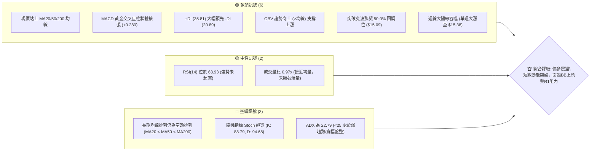
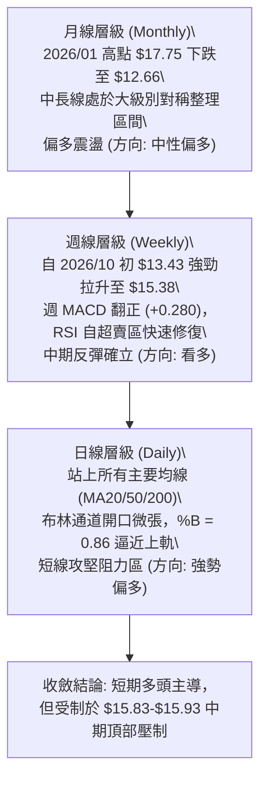
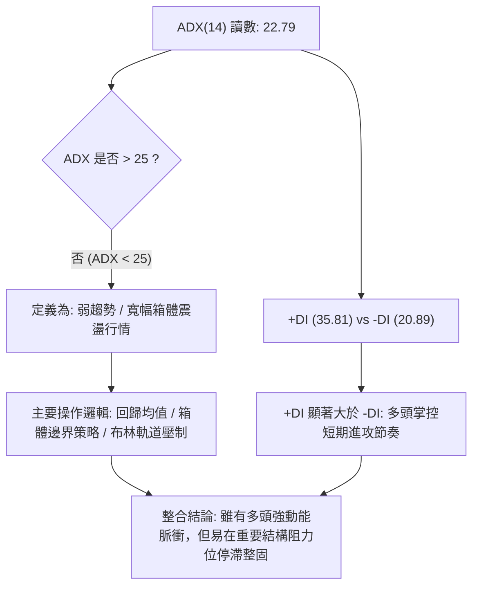
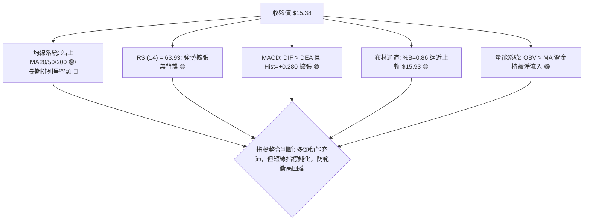
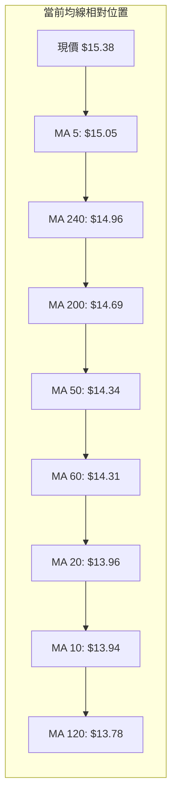
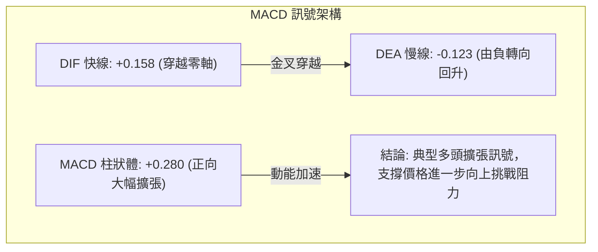
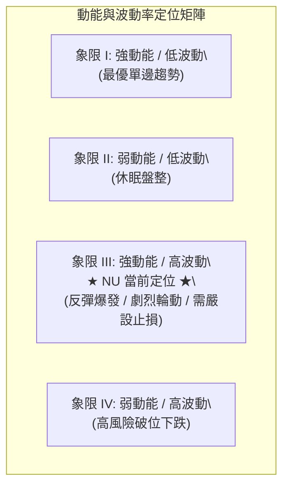
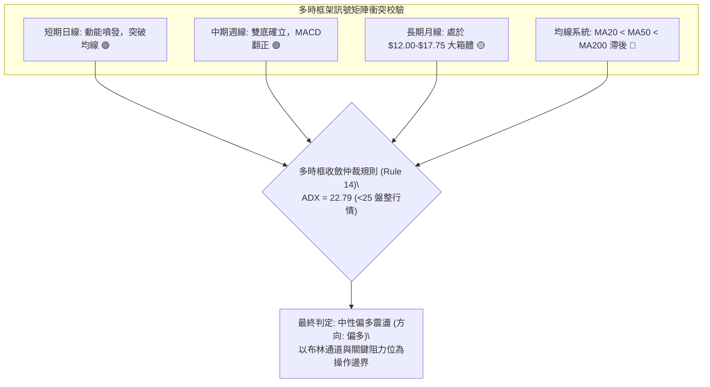
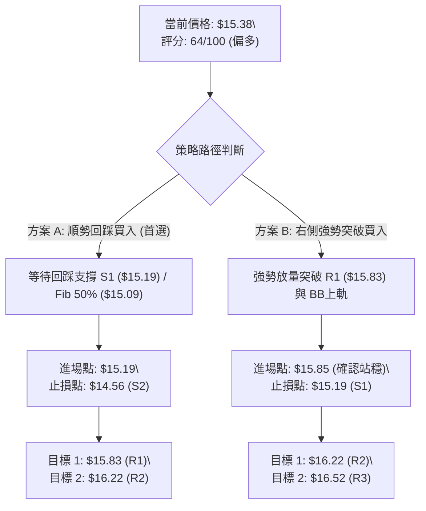
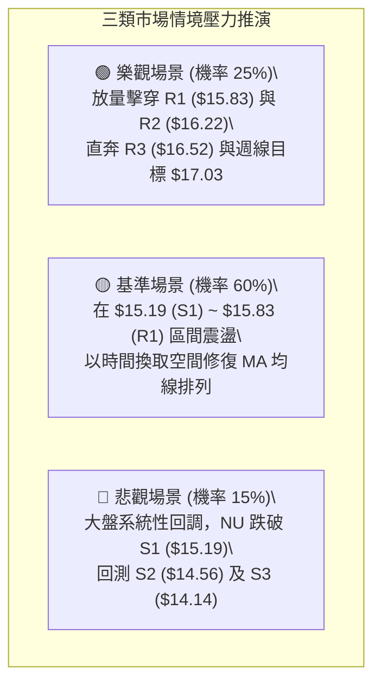

# NU 技術分析報告

> **報告日期**：2026-10-09 ｜ **語言**：繁體中文 ｜ **數據來源**：Yahoo Finance ｜ **當前價格**：$15.38

---

## 目錄

| 章節 | 內容 |
|------|------|
| [1. 技術面概覽](#1-技術面概覽) | 訊號儀表板、核心指標、評分卡 |
| [2. 趨勢分析](#2-趨勢分析) | 多時框趨勢、長中短期走勢、ADX強度 |
| [3. 圖表形態分析](#3-圖表形態分析) | 形態識別、信心度評估、K線組合、目標價計算 |
| [4. 支撐與阻力](#4-支撐與阻力) | 關鍵價位結構、阻力/支撐矩陣、斐波那契回調 |
| [5. 技術指標深度解讀](#5-技術指標深度解讀) | MA系統、RSI、MACD、布林通道、OBV量價關係 |
| [6. 動能與波動率](#6-動能與波動率) | 動能四象限、ATR波動分析、Beta市場敏感度 |
| [7. 多時框架總結](#7-多時框架總結) | 時框架矩陣、信號衝突收斂、主導方向收斂 |
| [8. 交易策略建議](#8-交易策略建議) | 策略路由、多頭主策略、風險對沖與情境階梯 |
| [9. 風險提示與監控](#9-風險提示與監控) | 關鍵監控Checklist、三情境壓力測試、風控規則 |
| [10. 報告總結](#10-報告總結) | 決策總覽、核心數據卡、最優策略組合 |

---

## 1. 技術面概覽

### 🎯 技術訊號儀表板

Nu Holdings Ltd.（NYSE: NU）當前報價為 **$15.38**。價格在經歷 2026 年 9 月底的波段修正（月收 $12.66、週低曾觸及 $13.43）後強勢反彈，目前價格已全面收復 MA20（$13.96）、MA50（$14.34）與 MA200（$14.69）。短線技術指標呈現動能爆發與指標超買並存格局。



---

### 📊 核心指標速覽表

| 指標類別 | 指標名稱 | 當前數值 | 訊號 | 專業解讀 |
|:---|:---|:---:|:---:|:---|
| **價格結構** | 當前收盤價 | $15.38 | 🟢 | 突破 50% 斐波那契位 ($15.09)，位於 52 週區間 53.7% |
| **短期均線** | MA 20 | $13.96 | 🟢 | 現價高於 MA20 達 +10.14%，短期多頭完全掌控 |
| **中期均線** | MA 50 | $14.34 | 🟢 | 現價高於 MA50 達 +7.25%，由下向上貫穿中期防線 |
| **長期均線** | MA 200 | $14.69 | 🟢 | 現價高於 MA200 達 +4.70%，收復牛熊分水嶺 |
| **均線排列** | 20/50/200 結構 | MA20<MA50<MA200 | 🔴 | 均線長線仍呈空頭排列，金叉修復需要時間收斂 |
| **強弱指標** | RSI (14) | 63.93 | 🟡 | 位於強勢擴張區間，尚未進入嚴重超買 (>70) |
| **趨向動能** | MACD (12,26,9)| 0.158 / -0.123 | 🟢 | DIF 線由負翻正並穿過 Signal，柱狀體 +0.280 強勢擴張 |
| **擺動指標** | Stoch %K / %D | 88.79 / 94.68 | 🔴 | 進入深度超買鈍化區間，警惕隨時出現微幅技術性回踩 |
| **趨勢強度** | ADX (14) | 22.79 | 🟡 | ADX < 25 表示處於無連續單邊趨勢之寬幅盤整震盪市場 |
| **方向指標** | +DI / -DI | 35.81 / 20.89 | 🟢 | 多頭進攻意願顯著高於空頭壓制 |
| **通道位置** | Bollinger Bands | Upper: $15.93 | 🟡 | %B 為 0.86，價格逼近布林上軌 ($15.93)，壓制漸顯 |
| **量能軌跡** | OBV 走勢 | OBV > MA | 🟢 | 能量潮指標高於自身均線，資金呈現持續淨流入 |
| **波動風險** | ATR (14) | $0.65 (4.20%) | 🟡 | 每日平均波幅 0.65 美元，適合波段震盪操作與設定止損 |

---

### 🏆 技術評分卡

```
╔══════════════════════════════════════════════════════════════════════════════════════╗
║                          技術評分卡 — NU (2026-10-09)                               ║
╠══════════════════════════════════════════════════════════════════════════════════════╣
║ 趨勢強度 (Trend Strength)       ██████████░░░░░░░░░░   50/100  🟡 中性 (ADX=22.79)   ║
║ 動能指標 (Momentum Indicators)  ████████████████░░░░   80/100  🟢 看多 (MACD/RSI偏強)║
║ 支撐穩定度 (Support Robustness) ██████████████░░░░░░   70/100  🟢 看多 (S1/Fib50%穩固║
║ 成交量配合 (Volume Profile)     ████████████░░░░░░░░   62/100  🟢 偏多 (OBV向上/量比0.97)║
║ 形態完整度 (Pattern Maturity)   ████████████░░░░░░░░   60/100  🟡 中性 (W底右肩成型中)║
║ 均線排列 (MA Alignment)         ████████░░░░░░░░░░░░   42/100  🔴 看空 (MA20<50<200滯後)║
╠══════════════════════════════════════════════════════════════════════════════════════╣
║ 綜合技術評分 (Composite Score)  █████████████░░░░░░░   64/100  🟢 偏多 (中性偏多震盪) ║
╚══════════════════════════════════════════════════════════════════════════════════════╝
```

---

## 2. 趨勢分析

### 🌐 多時框趨勢分析

NU 目前展現了典型的**多時框架分歧但短線動能急遽拉升**之走勢特徵。依照技術分析收斂原則，在 ADX < 25 的市場環境下，價格主要依循箱體與布林通道進行寬幅震盪。



---

### 📈 長期趨勢 — 12個月走勢圖（Unicode）

NU 過去 12 個月（2025 年 11 月至 2026 年 10 月）由歷史波段高點 $17.75 回落至低點 $12.66，隨後本月拉出一根決定性的月線大陽線：

```
NU 月線收盤走勢圖（過去12個月：2025-11 至 2026-10）
價格 ($)
$18.00 ┤                   ● $17.75 (高點 2026-01)
$17.00 ┤         ● $17.39        ● $16.74
$16.00 ┤                                                     ● $15.38 (現價)
$15.00 ┤                               ● $14.98       ● $14.55
$14.00 ┤                                      ● $14.37  ● $14.48       ● $14.33
$13.00 ┤                                                    ● $13.13  ● $13.36  ● $12.66 (低點 2026-09)
$12.00 ┼─────────────────────────────────────────────────────────────────────────────
        11    12    01    02    03    04    05    06    07    08    09    10 (月份)
        2025        2026
```

#### 走勢特徵分析表格

| 階段區間 | 起止價格 | 漲跌幅 | 結構型態特徵 | 技術面解讀 |
|:---|:---:|:---:|:---|:---|
| **高位築頂期**<br>(2025-11 ~ 2026-01) | $17.39 → $17.75 | +2.07% | 高檔雙重頂滯漲 ($17.75) | 動能衰竭，機構資金獲利了結 |
| **主跌浪回調**<br>(2026-01 ~ 2026-05) | $17.75 → $13.13 | -26.03% | 單邊空頭順勢下挫 | 跌破 MA50/200，形成均線空頭排列 |
| **底部反覆築底**<br>(2026-05 ~ 2026-09) | $13.13 → $12.66 | -3.58% | $12.66~$14.55 寬幅箱體箱底震盪 | 於 52W 低點 $11.20 上方形成強支撐帶 |
| **右側動能爆發**<br>(2026-09 ~ 2026-10) | $12.66 → $15.38 | +21.48% | 月線長陽線吞噬 | 一舉收復多條均線，重回斐波那契 50% 之上 |

---

### 📊 中期趨勢（週線分析）

從近 20 週收盤走勢可見，NU 經歷了 2026 年 6 月初的低點 $11.97 考驗後，於 8 月中旬反彈至 $15.23，隨後在 9 月下旬深度回踩至 $13.43（當時週 RSI 跌入 19.9 嚴重超賣），隨後爆出 4.41 億股的大成交量拉升至 $15.38。

```
中期週線支撐阻力結構示意圖
$16.52 ────────────────────────────────────────── 阻力 R3 (前波反彈密集成交壓制)
$16.22 ────────────────────────────────────────── 阻力 R2 (斐波那契 38.2% 延伸區)
$15.83 ────────────────────────────────────────── 阻力 R1 / 布林上軌 ($15.93)
$15.38 ══════════════════════════════════════════ ◄ 當前價格 ($15.38)
$15.09 ┄┄┄┄┄┄┄┄┄┄┄┄┄┄┄┄┄┄┄┄┄┄┄┄┄┄┄┄┄┄┄┄┄┄┄┄┄ 斐波那契 50.0% 回調分水嶺
$14.56 ────────────────────────────────────────── 支撐 S2 (MA200 重合區)
$14.14 ────────────────────────────────────────── 支撐 S3 (MA60 / 斐波那契 61.8% $14.17)
```

---

### ⚡ 趨勢強度評估（ADX 解讀）

當前技術數據顯示：**ADX(14) = 22.79**，**+DI = 35.81**，**-DI = 20.89**。



#### ADX 趨勢強度標準對照表

| ADX 區間 | 趨勢性質 | NU 當前狀態 | 交易指導方針 |
|:---|:---|:---:|:---|
| 0 ~ 20 | 缺乏趨勢 / 窄幅死水盤整 | 否 | 觀望或超短線高拋低吸 |
| **20 ~ 25** | **趨勢萌芽 / 寬幅箱體震盪** | **22.79 (當前)** | **不可盲目追高，注重支撐阻力位與邊界交易** |
| 25 ~ 40 | 明確單邊強趨勢 | 否 | 順勢持有，回調加碼 |
| 40 ~ 60 | 極強單邊爆發趨勢 | 否 | 移動停利，提防力竭 |

---

## 3. 圖表形態分析

### 🔍 形態識別系統

在日線與週線結構上，NU 自 2026 年 6 月創出 $11.97 低點後，於 9 月底再次回測 $13.43，形成一個顯著的**中期不對稱雙底（W底 / 抬高底部）**雛形；同時在 8 月初高點 $15.23 與目前價格 $15.38 之間，正在對頸線阻力區域發起測試。


#### 形態識別與信心度評估表

| 識別形態名稱 | 信心度 | 判斷依據（數據比對） | 完成度 | 理論目標價（附計算公式） |
|:---|:---:|:---|:---:|:---|
| **不對稱雙重底 (W-Bottom)** | **70%** | 左底 $11.97（2026-06），右底 $13.43（2026-10，抬高 +12.2%），現價 $15.38 剛越過 8 月峰值頸線 $15.23。 | 75% | **理論量度目標 = $18.49**<br>計算式：頸線 $15.23 + (頸線 $15.23 - 右底 $13.43) = $17.03；若取全幅高度：$15.23 + ($15.23 - $11.97 = $3.26) = **$18.49** |
| **布林通道上軌突破** | **65%** | 現價 $15.38 突破布林中軌 $13.96，逼近上軌 $15.93，%B 達到 0.86。 | 85% | **目標阻力 R1: $15.83 / BB上軌 $15.93** |
| **下降趨勢線向上突破** | **60%** | 2026-01 高點 $17.75 與 2026-08 高點 $15.23 連線，現價 $15.38 已實體跳空突破該降軌。 | 90% | **第一測試目標 R1: $15.83**；<br>**第二測試目標 R2: $16.22** |

---

### 🕯️ 重要K線形態分析

| 觀測週期 / 週別 | 關鍵收盤價 | K線形態名稱 | 技術面實質解讀 | 多空訊號 |
|:---|:---:|:---|:---|:---:|
| **2026-09-27** | $13.59 | 築底長下影小陰線 | RSI 驟降至 19.9 形成極度超賣，空頭力竭信號 | 🟡 變盤警訊 |
| **2026-10-04** | $13.43 | 帶量探底十字星 | 成交量放大至 5.32 億股，主力資金暗中承接 | 🟢 底部吞噬前兆 |
| **2026-10-11** | $15.38 | 大陽線實體反轉吞噬 | 週漲幅 +14.5%，成交量維持 4.41 億股高位，一舉吞噬前 4 週跌幅 | 🟢 強烈看多 |

---

### 📉 ASCII 走勢形態示意圖

```
NU 中期雙重底（W底突破）形態結構 ASCII 示意圖
──────────────────────────────────────────────────────────────────────────
$16.50 ┤                                                       [阻力 R3: $16.52]
$16.00 ┤                                              ▲ 目標區 [阻力 R2: $16.22]
$15.50 ┤                     頸線高點 $15.23           │
$15.00 ┤                        ╭─────╮               ● 現價 $15.38 (突破頸線)
$14.50 ┤                       │     │              ╱  [支撐 S1: $15.19]
$14.00 ┤         ╭────────────╯      ╰──────╮      ╱
$13.50 ┤         │                          ╰─────● 右底 $13.43 (2026-10-04)
$13.00 ┤        ╱
$12.50 ┤       ╱
$12.00 ┤      ● 左底 $11.97 (2026-06-07)
$11.50 ┴──────────────────────────────────────────────────────────────────
       時間軸: 2026年6月 ────────────── 8月 ─────────── 10月
──────────────────────────────────────────────────────────────────────────
```

---

## 4. 支撐與阻力

### 🗺️ 關鍵價位分布圖（Unicode）

NU 價格目前已攀升至 $15.38，下方受到多層均線與斐波那契回調位支撐，上方則直接面對密集波段高點聚類帶（$15.83 - $16.52）。

```
NU 價位結構分布圖
══════════════════════════════════════════════════════════════════════
$18.98 ║████████████████████████████████████████║ 52週高點 (0.0% Fib)
$17.14 ║████████████████████████                ║ 斐波那契 23.6% 回調位
$16.52 ║████████████████████████████            ║ 強阻力 R3 (波段密集高點)
$16.22 ║████████████████████                    ║ 阻力 R2 (上行次級阻力)
$16.01 ║██████████████████████████              ║ 斐波那契 38.2% 回調位
$15.83 ║████████████████████████████████        ║ 關鍵阻力 R1 (BB上軌 $15.93 聚類)
$15.38 ╠════════════════════════════════════════╣ ◄ 當前收盤價 ($15.38)
$15.19 ║▓▓▓▓▓▓▓▓▓▓▓▓▓▓▓▓▓▓▓▓▓▓▓▓▓▓▓▓▓▓▓▓        ║ 近期支撐 S1 (頸線突破轉換位)
$15.09 ║▓▓▓▓▓▓▓▓▓▓▓▓▓▓▓▓▓▓▓▓▓▓▓▓                ║ 斐波那契 50.0% 回調位
$14.56 ║████████████████████████████████        ║ 強支撐 S2 (MA200 $14.69 共振)
$14.14 ║████████████████████████████            ║ 關鍵支撐 S3 (Fib 61.8% $14.17 / MA60)
$11.20 ║████████████████████████████████████████║ 52週低點 (100.0% Fib)
══════════════════════════════════════════════════════════════════════
```

---

### 🚧 阻力位分析表

所引用阻力位數據皆來自近一年波段高點聚類與技術指標計算：

| 阻力級別 | 精確價位 | 距現價空間 | 形成技術原因 | 突破難度評估 | 策略重要性 |
|:---:|:---:|:---:|:---|:---:|:---:|
| **R1** | **$15.83** | +2.89% | 近一年波段高點聚類第 1 阻力層，疊加日線布林通道上軌（$15.93）與斐波那契 38.2%（$16.01）壓制帶 | 🟡 中等偏高 | ★★★★☆<br>(短線首要止盈位) |
| **R2** | **$16.22** | +5.46% | 2025 年 10 月平台成交密集成交區（該月收盤 $16.11），波段籌碼套牢峰值區間 | 🔴 較高 | ★★★☆☆<br>(波段加碼止盈位) |
| **R3** | **$16.52** | +7.44% | 2025 年底次高點震盪平台下緣（2025-12 收盤 $16.74 之先遣防線），波段多頭極限挑戰位 | 🔴 極高 | ★★★★☆<br>(波段終極多頭目標) |

---

### 🛡️ 支撐位分析表

所引用支撐位數據皆來自近一年波段低點聚類與重要均線交匯：

| 支撐級別 | 精確價位 | 距現價空間 | 形成技術原因 | 守住機率評估 | 策略重要性 |
|:---:|:---:|:---:|:---|:---:|:---:|
| **S1** | **$15.19** | -1.24% | 近期波段回踩低點聚類，前波頸線頂底轉換位，緊貼斐波那契 50.0%（$15.09） | 🟢 80% | ★★★★★<br>(短線防守與回踩買點) |
| **S2** | **$14.56** | -5.33% | 波段低點聚類重鎮，緊鄰 200 日長期均線 MA200（$14.69）與 MA50（$14.34）防禦帶 | 🟢 75% | ★★★★☆<br>(多頭趨勢生命線) |
| **S3** | **$14.14** | -8.06% | 波段低點聚類底線，重合斐波那契黃金分割 61.8%（$14.17）與 MA60（$14.31）支撐區 | 🟢 85% | ★★★★★<br>(中期多空強弱分水嶺) |

---

### 📐 斐波那契回調位分析

依據 52 週極值區間（最低點 **$11.20** 至 最高點 **$18.98**，波幅總空間 $7.78）計算之標準斐波那契回調位：

```
斐波那契回調位結構（基於 52W 低點 $11.20 → 高點 $18.98）
0.0%   ────────────────────────────────────── $18.98 (52週最高價)
23.6%  ────────────────────────────────────── $17.14
38.2%  ────────────────────────────────────── $16.01 ───┐ [當前壓制阻力區間]
現價   ══════════════════════════════════════ $15.38    │
50.0%  ────────────────────────────────────── $15.09 ───┘ [當前支撐防守區間]
61.8%  ────────────────────────────────────── $14.17
78.6%  ────────────────────────────────────── $12.86
100.0% ────────────────────────────────────── $11.20 (52週最低價)
```

**深層解讀**：
當前收盤價 **$15.38** 正好處於 **50.0%（$15.09）** 與 **38.2%（$16.01）** 之間：
1. **中軸收復**：價格有效越過 50.0% 多空分水嶺（$15.09），確立了此波自 $11.97/$13.43 起漲的反彈並非單純超跌抽腳，而是結構性修復。
2. **上方強阻力疊加**：38.2% 位（$16.01）與波段阻力 R1（$15.83）及布林上軌（$15.93）形成寬度僅約 $0.18 的**極密集阻力共振帶**，此處將是短線獲利盤與解套盤的集中釋放區。

---

## 5. 技術指標深度解讀

### 🎛️ 指標訊號總覽



---

### 📈 移動平均線排列分析

NU 當前各均線具體位置與排列狀態：
- **MA 5**：$15.05（+2.22%）▲ 現價高於 MA5
- **MA 10**：$13.94（+10.37%）▲ 現價高於 MA10
- **MA 20**：$13.96（+10.14%）▲ 現價高於 MA20
- **MA 50**：$14.34（+7.25%）▲ 現價高於 MA50
- **MA 60**：$14.31（+7.44%）▲ 現價高於 MA60
- **MA 120**：$13.78（+11.60%）▲ 現價高於 MA120
- **MA 200**：$14.69（+4.70%）▲ 現價高於 MA200
- **MA 240**：$14.96（+2.81%）▲ 現價高於 MA240



**深入診斷**：
雖然整體宏觀排列上仍標記為 `MA20 < MA50 < MA200`（這是由於過去數月深度修正導致的長期均線滯後性），但**短中期均線已出現全面向上拐頭並形成實體穿透**。價格在短時間內連續跨越 MA20、MA50、MA200，屬於典型的**均線修復型突破**。未來數個交易日若價格維持在 $15.00 之上，MA20 將快速上穿 MA50 形成「黃金交叉」。

---

### 📉 RSI(14) 分析與背離檢驗

- **當前 RSI(14) 讀數**：`63.93`
- **超買超賣判定**：處於 `60 - 70` 之多頭強勢推升區間，並未越過 70 警戒線。

```
RSI (14) 指標強度儀
0                    30                   50        63.93      70                 100
├────────────────────┼────────────────────┼───────────█────────┼──────────────────┤
│      超賣區間      │      弱勢區間      │   中性    │   強勢區間   │     超買區間     │
進度條: [█████████████████████████████████████████████░░░░░░░░░░] 63.93%
```

**背離現象排查結論**：
- **頂背離審查**：價格本波自 $13.43 拉升至 $15.38，RSI 自 39.2 躍升至 63.93，指標隨同價格同步創新高，**確認無頂背離現象**。
- **底背離審查**：前波 2026-09-27 週收盤 $13.59 時 RSI 觸及 19.9 極值，隨後 2026-10-04 週收盤微跌至 $13.43 但週 RSI 反彈至 39.2，**曾形成顯著的週線級別普通底背離**，該底背離已在當前這根大陽線中獲得充分驗證與兌現。

---

### 📊 MACD (12, 26, 9) 訊號解讀

- **MACD 線 (DIF)**：`0.158`
- **信號線 (DEA)**：`-0.123`
- **柱狀圖 (Histogram)**：`+0.280`



柱狀體從前期的 `-0.091` 急遽翻正至 `+0.280`，表明市場做多能量正在加速釋放，短期內空頭動能完全被壓制。

---

### 📦 布林通道分析 (Bollinger Bands 20, 2)

- **布林上軌 (Upper Band)**：`$15.93`
- **布林中軌 (Middle Band, MA20)**：`$13.96`
- **布林下軌 (Lower Band)**：`$12.00`
- **當前價格**：`$15.38`
- **通道指標 %B**：`0.86`（定義：0 = 下軌，$12.00；0.5 = 中軌，$13.96；1.0 = 上軌，$15.93）
- **帶寬 (Bandwidth)**：`($15.93 - $12.00) / $13.96 = 28.15%`

```
布林通道現狀 ASCII 示意圖
$16.00 ┤──────────────────────────────────────── 布林上軌 $15.93  ───┐
$15.50 ┤                               ● 現價 $15.38 (%B = 0.86)   │ 潛在受阻回踩區
$15.00 ┤                                                         │
$14.50 ┤                                                         │
$14.00 ┤──────────────────────────────────────── 布林中軌 $13.96 (MA20) ┘
$13.50 ┤
$13.00 ┤
$12.50 ┤
$12.00 ┤──────────────────────────────────────── 布林下軌 $12.00
```

**運行特徵解讀**：
%B 讀數高達 0.86，表明價格已進入通道超買邊界。在 ADX 僅為 22.79（非強單邊行情）的背景下，依據多時框收斂規則，**布林上軌 $15.93 將發揮強大的磁吸與反彈壓制效應**，價格直接無回踩突破上軌的機率較低。

---

### 💹 成交量分析（量價配合度）

- **最新成交量**：`82,411,500 股`
- **20 日均量**：`84,929,520 股`（量比：`0.97x`）
- **50 日均量**：`74,506,970 股`
- **週級別成交量**：`441,623,600 股`（前一週築底量為 `532,732,100 股`）
- **OBV 能量潮狀態**：`OBV > MA`（量能明確支撐價格上行）

**量價關係評估**：
1. **量價配合良性**：最新日量達 82.4M，緊貼 20 日均量（量比 0.97x），高於 50 日均量（1.11x），顯示並非無量空漲，而是有持續性機構承接。
2. **OBV 發出確認訊號**：OBV 處於其移動平均線上方，說明在 9 月底以來的回升過程中，多頭進攻日累積的成交量顯著超越下跌日，**量能對當前價格突破形成了有效確認**。

---

## 6. 動能與波動率

### ⚡ 動能評估四象限

評估 NU 在「趨勢動能（由 MACD、RSI、+DI 綜合評價）」與「波動率（由 ATR、布林帶寬評價）」兩大維度的精確定位：



| 象限分佈 | 動能維度 | 波動維度 | 標的匹配狀態 | 策略應對方針 |
|:---:|:---:|:---:|:---:|:---|
| **Q1** | 強 | 低 | — | 順勢加碼持有 |
| **Q2** | 弱 | 低 | — | 觀望等待變盤 |
| **Q3** | **強 (MACD=+0.280, +DI=35.8)** | **高 (ATR=4.20%, BB寬度28%)** | **✓ NU (當前)** | **享受動能溢價，但嚴防高波動引發的大幅回撤，嚴格執行防守止損** |
| **Q4** | 弱 | 高 | — | 嚴禁抄底入場 |

---

### 📊 ATR 波動率分析

- **ATR (14)**：`$0.65`
- **佔現價比率 (ATR %)**：`4.20%`

**交易參數指導**：
ATR 達 $0.65 說明 NU 每日正常日內波動區間約為 $0.65 美元。
- **波段短線止損距離**：建議設定為 `1.0 ~ 1.5 倍 ATR`，即 `$0.65 ~ $0.98`。
- **支撐保護驗證**：現價 $15.38 下方最近關鍵支撐 S1 為 $15.19（距離 $0.19，僅 0.29x ATR），極易在日內雜訊中被擊破；因此更為穩健的結構性止損位必須放在 S2（$14.56，距離 $0.82，約 1.26x ATR），方能有效規避洗盤風險。

---

### 📐 Beta 與市場相關性

- **Beta 係數**：`0.955`
- **市場屬性解讀**：Beta 極度接近 1.0（0.955），說明 NU 與標普 500（S&P 500）大盤保持高度系統性同步，但其個股波動（ATR 4.2%）主要源於拉美區域金融科技板塊的特定溢價。當美股大盤處於風險偏好（Risk-on）週期時，NU 能提供近乎 1:1 但帶有基本面高增長（營收 YoY +52.1%）的槓桿彈性。

---

## 7. 多時框架總結

### 📋 時框架評分表

| 時框架 | 趨勢方向 | 動能狀態 | 均線排列 | 圖表形態 | 綜合評分 | 戰術建議 |
|:---|:---:|:---:|:---:|:---:|:---:|:---|
| **日線 (Daily)** | 🟢 看多 | 🟢 極強 (MACD柱+0.28) | 🟡 站上均線但排列滯後 | 🟢 突破短線頸線 | **72/100** | 逢低佈局，留意上軌阻力 |
| **週線 (Weekly)** | 🟢 偏多 | 🟢 轉強 (RSI由超賣回升) | 🔴 空頭排列修復中 | 🟢 不對稱雙底右肩拉升 | **65/100** | 中期波段持有，目標看 R1/R2 |
| **月線 (Monthly)** | 🟡 中性 | 🟡 中性 (震盪修復) | 🔴 均線壓制依然存在 | 🟡 大級別收斂三角/箱體 | **55/100** | 長期大底尚未徹底脫離箱體 |

---

### 🔲 綜合訊號矩陣



---

### ⚖️ 多時框收斂結論

> **唯一方向性結論：中性偏多（波段看多，但定性為箱體內部脈衝，非單邊大牛市）**

**仲裁取捨依據（嚴格遵循多時框收斂規則 14）**：
1. **行情定性**：當前系統 ADX(14) 讀數為 **22.79 (<25)**，明確定義當前市場處於**寬幅盤整震盪市場**，而非連續單邊趨勢行情。
2. **規則適用**：在盤整行情下，交易邏輯**以日線布林通道上下軌（$12.00 ~ $15.93）與關鍵支撐阻力為核心邊界**。日線的短線動能爆發雖然強烈，但週線與月線均指示上方 $15.83 - $16.52 存在密集套牢籌碼帶。
3. **最終收斂**：日線的多頭訊號確認了「反彈仍在進行中」，但受限於 ADX 的盤整屬性，價格將在 **R1 ($15.83)** 至 **布林上軌 ($15.93)** 面臨強烈阻力。因此，**戰略上全面偏多操作，但戰術上絕不追高，採取回調支撐位進場策略**。

---

## 8. 交易策略建議

### 🗺️ 策略決策流程圖



---

### 🧭 策略路由（依評分卡分流）

**當前主策略方向 = 多頭策略（主推回踩逢低做多）（依第 1 章技術評分卡 64/100 判定）**

依據評分規則，綜合評分 64 分處於偏多區間（≥60），因此本報告**主推多頭策略**；空頭方向僅列為風控止損與防禦警示，絕不兩頭搖擺下注。

---

### 🎯 價格情境階梯（Price Scenarios）

所有引用數據皆取自第 4 章計算之波段聚類點位與斐波那契點位：

| 觸發條件 | 下一目標價 | 後續延伸目標 | 情境實質技術含義 |
|:---|:---:|:---:|:---|
| **強勢突破 R1 ($15.83)** | **R2 ($16.22)** | **R3 ($16.52)** | 突破布林上軌與近一年高點壓制，多頭打開邁向 $16.50 之空間 |
| **站穩現價區間 ($15.19 - $15.38)** | **R1 ($15.83)** | **BB上軌 ($15.93)** | 於斐波那契 50.0% 之上良性蓄勢，消化短線超買指標 |
| **跌破 S1 ($15.19) / Fib 50%** | **S2 ($14.56)** | **S3 ($14.14)** | 頸線假突破，回測 200 日線（$14.69）與 MA50（$14.34）尋求支撐 |

---

### 📊 情境機率分佈

| 運行情境劇本 | 機率估計 | 主要技術依據（引用指標狀態） |
|:---|:---:|:---|
| **情境一：震盪上行測試阻力** | **60%** | MACD 柱狀體大幅擴張（+0.280），OBV > MA 資金持續流入，+DI（35.81）主導盤面。 |
| **情境二：高位盤整蓄勢消化** | **25%** | ADX = 22.79 處於震盪市，Stoch %K (88.79) 深度超買，布林上軌 ($15.93) 壓制顯著。 |
| **情境三：假突破衝高回落探底** | **15%** | 長期均線仍呈空頭排列（MA20<50<200），若大盤回調易誘發獲利了結盤擊破 S1。 |

---

### 🟢 主策略詳情

本報告依據回踩買入（穩健）與突破追進（激進）設計兩大多頭子策略：

| 策略要素 | 策略 A（穩健型：回踩 S1 頸線支撐買入） | 策略 B（動能型：強勢突破 R1 追買） |
|:---|:---:|:---:|
| **進場條件** | 價格盤中回踩 S1 且 1小時線收陽止跌 | 日K線實體放量收於 R1 阻力位之上 |
| **精確進場價格** | **$15.19** | **$15.85** |
| **目標價 T1** | **$15.83** (R1 阻力位，獲利空間 +4.21%) | **$16.22** (R2 阻力位，獲利空間 +2.33%) |
| **目標價 T2** | **$16.22** (R2 阻力位，獲利空間 +6.78%) | **$16.52** (R3 阻力位，獲利空間 +4.23%) |
| **止損價格** | **$14.56** (S2 / MA200 防守位) | **$15.19** (S1 頂底轉換位) |
| **止損空間** | -$0.63 (-4.15%) | -$0.66 (-4.16%) |
| **風險報酬比 (R:R)** | **1 : 1.63** (以 T2 計算) | **1 : 1.02** (以 T2 計算) |
| **策略成功機率** | **65%** | **55%** |
| **建議總倉位** | **15% ~ 20%** | **8% ~ 10%** |

---

### 🔴 反向風險觸發點（對沖提示）

若出現以下訊號，多頭主策略即刻失效，投資人應考慮減倉或進行反向對沖：
1. **有效跌破 S1 ($15.19)**：若日K線收盤價跌破 $15.19（且跌破斐波那契 50% $15.09），宣告此波為「誘多假突破」，應將倉位降至 5% 以下。
2. **崩跌擊穿 S2 ($14.56)**：跌破 MA200 關鍵防線，意味著中期下跌趨勢重啟，必須無條件全數止損離場。

---

### ⭐ 整體訊號強度評星

```
╔══════════════════════════════════════════════════════════╗
║ 做多訊號強度：★★★★☆  (4/5星) — 動能強勁，結構性突破支撐 ║
║ 做空訊號強度：★★☆☆☆  (2/5星) — 逆勢做空風險極高         ║
║ 整體可信度：  ★★★★☆  (4/5星) — 量價指標形成共振確認     ║
╚══════════════════════════════════════════════════════════╝
```

---

## 9. 風險提示與監控

### ✅ 關鍵監控指標 Checklist

```
╔══════════════════════════════════════════════════════════════════════════════════════╗
║                           每日盤後技術監控清單 (Checklist)                           ║
╠══════════════════════════════════════════════════════════════════════════════════════╣
║ [ ] 價格是否收於 S1 ($15.19) 之上？ (多頭趨勢防線)                                    ║
║ [ ] RSI(14) 是否跌破 50 中軸？ (動能轉弱警訊)                                         ║
║ [ ] 布林通道 %B 是否從 >0.85 驟降回落至 0.50 以下？ (通道上軌受阻確認)               ║
║ [ ] 成交量是否萎縮至 50 日均量 ($74.5M) 之下？ (量能不濟警訊)                         ║
║ [ ] MACD 柱狀體是否出現縮頭 (柱體高度低於 +0.280)？ (短線動能衰竭)                   ║
║ [ ] +DI 是否下穿 -DI？ (多空主導權易手)                                               ║
╚══════════════════════════════════════════════════════════════════════════════════════╝
```

---

### ⚠️ 風險場景分析



---

### 🛡️ 風險管理重要提醒

1. **嚴禁在阻力位 R1（$15.83）下方孤注一擲追高**：當前 Stoch 已高達 88.79 / 94.68，短線隨時有技術性洗盤需求，勝率最高點位落在回踩 S1（$15.19）之際。
2. **單筆交易風險敞口控制**：嚴格控制單筆交易虧損不超過總投資組合資產的 `1.0%`。以策略 A 為例（止損幅度 4.15%），總倉位配置上限不得超過 `24.1%`。
3. **波動率自適應防守**：由於 ATR 高達 $0.65（4.20%），日內出現 $0.50 左右的震盪屬於正常雜訊，切勿將止損設定在 $15.38 緊貼處，務必以結構位 $14.56 作為硬止損基準。

---

## 10. 報告總結

```
╔══════════════════════════════════════════════════════════════════════════════════════╗
║                             NU 技術分析報告總結                                      ║
╠══════════════════════════════════════════════════════════════════════════════════════╣
║ 報告日期：2026-10-09                                                                 ║
║ 當前收盤價：$15.38                                                                   ║
║ 綜合技術評級：🟢 64/100 (中性偏多震盪 — 首選逢低做多)                               ║
╠══════════════════════════════════════════════════════════════════════════════════════╣
║ 關鍵架構結論：                                                                       ║
║ ├─ 長期趨勢 (月線)：🟡 中性整理，受制於 $17.75 頂部，大箱體築底進程中                 ║
║ ├─ 中期趨勢 (週線)：🟢 偏多反彈，不對稱雙底右肩拉升，突破下降壓制線                 ║
║ ├─ 短期趨勢 (日線)：🟢 強勢突破，全數站上 MA20/50/200，MACD柱狀體擴張 (+0.280)       ║
║ ├─ 關鍵核心支撐：S1: $15.19 ｜ S2: $14.56 (MA200生命線) ｜ S3: $14.14               ║
║ ├─ 關鍵核心阻力：R1: $15.83 (布林上軌帶) ｜ R2: $16.22 ｜ R3: $16.52                 ║
║ └─ 華爾街共識目標價：$18.77 (22位分析師評級為 Buy，最高 $23.00)                     ║
╠══════════════════════════════════════════════════════════════════════════════════════╣
║ 最優策略執行組合：                                                                   ║
║ 1. 🥇 最佳機會 (策略 A)：回踩 S1 ($15.19) 企穩買入，止損 $14.56，目標 R1/R2 (盈虧比1.63)║
║ 2. 🥈 次選機會 (策略 B)：放量突破 R1 ($15.85) 右側跟進，止損 $15.19，目標 R2/R3     ║
║ 3. 🥉 保守選擇：維持現有倉位，於布林上軌 $15.93 / R1 附近分批落袋 30% 籌碼鎖定利潤  ║
╚══════════════════════════════════════════════════════════════════════════════════════╝
```

---

> ⚠️ **免責聲明**：本報告為量化與技術分析研討成果，所有數據、圖表及價位推算均基於歷史市場交易數據客觀生成。本報告**僅供研究、學術交流與交易邏輯參考**，**絕對不構成任何實質性之投資買賣建議**。金融市場瞬息萬變，技術指標存在滯後性與失效風險，投資人應獨立評估風險並自負盈虧。

---

*報告生成時間：2026-10-09 ｜ 數據來源：Yahoo Finance ｜ 分析框架：資深多時框量化技術分析系統*