<details>
<summary>📊 靜態圖表 (點擊展開)</summary>
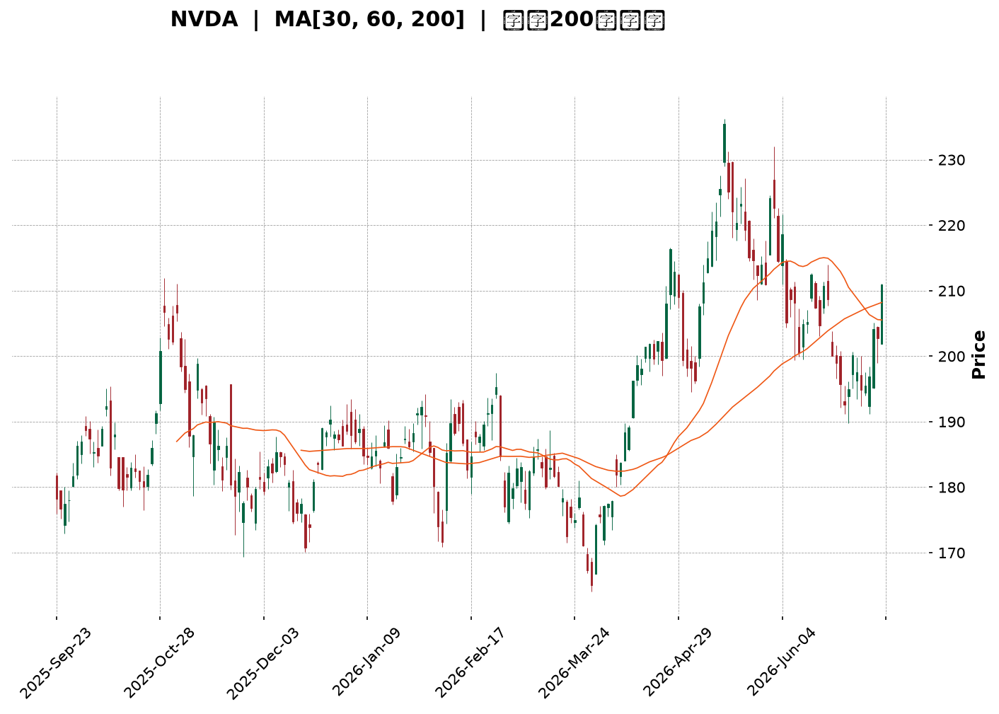
</details>

<html>
<head><meta charset="utf-8" /></head>
<body>
    <div style="height:500px; width:100%;">                        <script>window.PlotlyConfig = {MathJaxConfig: 'local'};</script>
        <script charset="utf-8" src="https://cdn.plot.ly/plotly-3.7.0.min.js" integrity="sha256-jvTGqxNp8AGWEcvNLVuKr+8j5dGe9Yw51LQkmDH+IYA=" crossorigin="anonymous"></script>                <div id="candlestick-chart" class="plotly-graph-div" style="height:100%; width:100%;"></div>            <script>                window.PLOTLYENV=window.PLOTLYENV || {};                                if (document.getElementById("candlestick-chart")) {                    Plotly.newPlot(                        "candlestick-chart",                        [{"close":{"dtype":"f8","bdata":"AAAAoHxGZkAAAACA0xdmQAAAAGDWLmZAAAAAINE+ZkAAAADAybNmQAAAAGD0SmdAAAAAQAxgZ0AAAADgx5RnQAAAAEAxbGdAAAAAgLcpZ0AAAADAvBlnQAAAAMDPm2dAAAAAAGQKaEAAAACAp91mQAAAAGCQgmdAAAAAAJ95ZkAAAADgOnNmQAAAAGCCsmZAAAAAYJLfZkAAAAAACc1mQAAAAEC8nWZAAAAAgJyBZkAAAADgsb1mQAAAACC6QGdAAAAA4N\u002fnZ0AAAAAgxBhpQAAAAEDX2GlAAAAAwDVUaUAAAAAgbUdpQAAAACC602lAAAAAIPvNaEAAAABgw15oQAAAAMDkemdAAAAAgCF9Z0AAAACgfNloQAAAACA\u002fHWhAAAAAYLMxaEAAAAAg51NnQAAAACCwvWdAAAAAAJhLZ0AAAACgIKRmQAAAAIAJSWdAAAAA4B2NZkAAAABg3lRmQAAAAMAoymZAAAAA4P0yZkAAAADg+IBmQAAAAADJGGZAAAAAQBt2ZkAAAADAUqdmQAAAAECPa2ZAAAAAAAPlZkAAAABgAsZmQAAAAABeKmdAAAAAYNQXZ0AAAADAy\u002fFmQAAAAOC0lmZAAAAAQNHZZUAAAABgaAJmQAAAAMAcMGZAAAAAoGpXZUAAAAAAsb1lQAAAAOCfmGZAAAAAYOvuZkAAAAAgWJ9nQAAAAOAqjGdAAAAAYIjJZ0AAAADgs39nQAAAACD4aWdAAAAA4LpIZ0AAAACg1pNnQAAAAMCBfGdAAAAAoGFgZ0AAAADgJZxnQAAAACARGmdAAAAAQFAUZ0AAAADg3hZnQAAAAECtMmdAAAAAIFfdZkAAAAAAT1pnQAAAAKAZQGdAAAAAYEw7ZkAAAAAgGONmQAAAAKCsE2dAAAAAwB9uZ0AAAABgxUdnQAAAAIBKiWdAAAAAoCzpZ0AAAADA0AhoQAAAAKC13GdAAAAA4EgsZ0AAAACA2YNmQAAAACBKv2VAAAAAoHV1ZUAAAABg5CVnQAAAACDfuWdAAAAAIO6JZ0AAAAAAMbpnQAAAAADLVmdAAAAAQMvSZkAAAABg1BdnQAAAACAIeGdAAAAAoHl1Z0AAAABA17JnQAAAACAi6mdAAAAAwK4TaEAAAADgS2poQAAAAMBFFWdAAAAAQCwfZkAAAAAgP8hmQAAAAMCUemZAAAAAACXaZkAAAACgu+NmQAAAAOBOM2ZAAAAAAK7NZkAAAAAAcBFnQAAAAKAHOmdAAAAAYKjdZkAAAAAASYFmQAAAAAA34GZAAAAAgPu2ZkAAAABgFIZmQAAAAKBES2ZAAAAAYPePZUAAAADg7+1lQAAAAIDf32VAAAAAgBpPZkAAAAAgTWFlQAAAAEBm6mRAAAAAgEmfZEAAAACgTcZlQAAAAAB08WVAAAAAIN8lZkAAAADA3C1mQAAAAMCQPGZAAAAAAMe7ZkAAAADgRPZmQAAAACAijWdAAAAAIN6iZ0AAAADg\u002f4hoQAAAAIBu1GhAAAAAoM\u002fDaEAAAAAgPy5pQAAAAIBkOmlAAAAA4Lb0aEAAAADgdEhpQAAAAAAL7WhAAAAAoOEAakAAAABgcwtrQAAAAMB\u002fnWpAAAAAgDQgakAAAABAzupoQAAAAOABx2hAAAAAQPfHaEAAAAAArohoQAAAAGDR8mlAAAAAAB9oakAAAAAgYt5qQAAAAMDnZWtAAAAAQLyQa0AAAADAJTJsQAAAAADmbm1AAAAAwNghbEAAAABg9cFrQAAAAEBNi2tAAAAAILfma0AAAACAJGhrQAAAAOCJ4mpAAAAAIITTakAAAADAR4tqQAAAAMAEwGpAAAAAYJ1cakAAAACAKQNsQAAAAIDw0WtAAAAAAADQakAAAADAHlVrQAAAAEAzo2lAAAAA4HoUakAAAACAFAZqQAAAAKBwDWlAAAAAANebaUAAAACAFKZpQAAAAGBmjmpAAAAAwB7taUAAAADAzJRpQAAAAIAUVmpAAAAAwMwUakAAAACgRwFpQAAAAAAA4GhAAAAAIK53aEAAAADA9RBoQAAAAEAKX2hAAAAAQOECaUAAAABgj7JoQAAAAGCPWmhAAAAAoJlxaEAAAACAwp1oQAAAAADXg2lAAAAAwPVYaUAAAABguF5qQA=="},"high":{"dtype":"f8","bdata":"F8x\u002fHQHGZkAMVzWtoXFmQLDF4u74gGZAyfJUA1BxZkCh1+gQgPhmQFlnADeQY2dAq8jCm898Z0C8lgwW0NlnQCFcs8jCw2dAnBVcXbpfZ0C4vzetNppnQGvIAsN4q2dAlSMVo6NhaED7aU673WtoQAgFRVLFu2dAdSGsGBESZ0B68ozoTRRnQKX+OUl94WZACcY4MbL7ZkBTvTrJ2R5nQI3DfR3U0WZAd7NdRprmZkDH+OLLf9lmQD3ibN9lZ2dAfPSVbSz4Z0Ck3w8BhVxpQPITB2NufWpAkyXGgLe8aUAXn9cQkPZpQC\u002fJTdVDYmpAsuLqxrl2aUDr1AAsK1VpQHeAHNPIq2hA6N3aeZCCZ0A2L5c27vVoQAZwvWp5ZWhA4IcD0X50aED5aXC0RuZnQMw6+5uI2GdA4g1+tEuYZ0AUbXk6ERJnQE3sUMTcc2dA1T1wtwJ4aEAElJiaZQpnQOIGQzaF6GZAlSe2k9s9ZkBSrusYqtVmQPpDlrr4YWZAGT7rSECCZkAGjsNLjS1nQFsz\u002f4f2xmZAWS6mf3IJZ0CeO8Pr6w1nQI0zG+2reGdAO2v448wvZ0BVoAEpIShnQEUol\u002fsro2ZA+KDHCB3TZkDnIXoefEZmQCmb5PC4SGZApAD+VEv9ZUARddTQ7v1lQJT1y4hTp2ZAhwNF7\u002fD9ZkCABHDtLaNnQKRUj4HBlWdAjCXIkZEOaEAgLW0c9pBnQHsgsCdQmGdAhGMA3H3KZ0Caj6ooPRZoQKIX\u002fsOcLGhAbr2B7fL9Z0BkUzEyYeRnQGRwtR42qmdADHPYmp1DZ0B8Ppyei1xnQH8uMewvfGdAZRyEc4cHZ0DR1xFOAa9nQO3IX\u002fynxmdAgOOO3AzFZkDd7mgR7yRnQGMeJrouPmdAwPE\u002fHc+rZ0Dycu6td5xnQDb55dqXuGdAbuGTt7MDaEDLl+xR0SdoQB4NEDgZSGhAeXt\u002fki7CZ0CrmOfxYEFnQPFghjWPa2ZAnVHL0lgTZkCVgMnBtVhnQDeTyh+SLWhAkhd1TtsHaECCWC03ySBoQGJ+bRD5K2hAsxTh8rBoZ0CEYcIegV1nQD8\u002f+CVrxGdA70sAFmqGZ0CzhCEJJMNnQMOD2OzWNmhAO5awMRYxaEDxcI23dKxoQLH2JbG0QWhAkQl+HMPLZkCocGWYkedmQOKIZ2S\u002flWZAk6InLzMPZ0DSjpewvvpmQOTvDvMx0WZAANi9Z\u002f3VZkD9sKf1z0ZnQLuqKbbZbGdANi+c1TAXZ0CC8i2O8jtnQPaqM8YflWdAGcFpqOQlZ0Dq8840VOVmQKAvOLWneGZATBDA2a1BZkD42xr3MUVmQC35sqV5AGZAlCLmBkqgZkBu\u002fGGevglmQAXD\u002f7irWGVAVrQsbxYoZUA8GOrGVc1lQLb0II07JWZAxi7XaxEpZkBH0swRqDJmQOEypGK4QGZACqquLGshZ0D7zvjgs\u002ftmQB2GXA\u002fsuGdAf1CBCQ6uZ0AAAADg\u002f4hoQEgZy6hVBWlAthXeUcHzaECSTCnP4i5pQEpqcZPoPWlAN6V3gXJQaUAAAADgdEhpQLIKuIr3cmlAEzTxkIpWakDef+OGexJrQMZOjF9cz2pAdEGWqB2PakAdSLELxEFqQDU+\u002fBtwWGlAdh1WQdgvaUCNL\u002ft0OABpQLFvya3hAGpAYaBHoGu+akCFZYGUfDFrQE2XjZlRwWtAcsIYLarva0DiGut0ZHJsQDGB9t53iG1AEq2cUGDnbEBFUcKibrdsQF7Y4lf\u002fBmxALYABgrw7bED03KEhVGRsQK2xJTUWmGtAUGvO1qE9a0C2Mt930rxqQDlAZoOc6GpAVK12imcza0DdMuuCdhNsQO\u002fZEYhOAG1A5dP7ifDRa0AAAABAM7NrQAAAAADX22pAAAAAQApPakAAAADAzGxqQAAAAEAK52lAAAAAwB61aUAAAACAPeJpQAAAAGC4lmpAAAAAIK5vakAAAABguCZqQAAAAOB6bGpAAAAAIK6\u002fakAAAADgo3hpQAAAAKBwNWlAAAAAoJkZaUAAAACgmXFoQAAAAIDChWhAAAAAACkUaUAAAABAM\u002ftoQAAAAIDrAWlAAAAAoJmxaEAAAADAHs1oQAAAAMAepWlAAAAAQOGSaUAAAAAAAGBqQA=="},"hovertemplate":"\u003cb\u003e%{x|%Y-%m-%d}\u003c\u002fb\u003e\u003cbr\u003e\u958b: $%{open:.2f}\u003cbr\u003e\u9ad8: $%{high:.2f}\u003cbr\u003e\u4f4e: $%{low:.2f}\u003cbr\u003e\u6536: $%{close:.2f}\u003cextra\u003e\u003c\u002fextra\u003e","low":{"dtype":"f8","bdata":"jH0\u002fqon\u002fZUDXkzVipuVlQO8d73QanWVAHrV7JKHWZUAtqPP244JmQFtKN1j2p2ZABnJ9uk31ZkBSfSgpQXpnQJ5qn5+aJGdAw6G6TxbjZkBo6Sv6f\u002fhmQNz+dBGtSWdA6wfYwSHaZ0AfSiz1LbpmQMj5beAjN2dAxjKeERNvZkC71i6hDSJmQACgYAlQcWZAi29\u002fVaxwZkDGN\u002fu+869mQDcIPFFFcmZANfJWWx0RZkBjyUR783FmQJKnaw2F6GZAY5ObLhSGZ0BzeVxJTPVnQLvPA\u002fWckGlAqJaKEekkaUBdqPnhADppQMFUWWaKqWlAerdNDrG1aEAQ2fuX3UxoQNXQUx2QRGdAbsQk6tNVZkCw6MqCYTFoQF5su2jN4WdAU9pWnF7cZ0AxwEGptPNmQLaMUPMyi2ZAdMfxCroCZ0DmVBAYem1mQGpthYEb02ZAlHJhft5zZkA5Yrr2tZZlQOEI4pYqCGZADckHTbAqZUBulxQ0akBmQHIBrzfOCGZAtRmAPK6uZUDOeGOcqXhmQG0COiI4XGZA9XQNgbR3ZkDsgihYEZZmQCO5Lo+wxWZAAuM\u002fFxjjZkC3KDT9LrpmQGrdLmP0DGZAEoXuXQjNZUAGW+gSI9plQExWMGT71WVARpV86UdDZUDYTCjHinNlQMEyBGgBBGZAOD9XfxfEZkDyYcN4q9VmQJi6pyibS2dA7VV036t4Z0AgfZNt3zVnQIerWhZ5VmdACGSIGWlIZ0ABlVQj+4BnQBEqnSiLPWdATK30MPVSZ0BVvbeypUpnQKf1liWP72ZAYIJEoEfuZkAFjylpgdlmQLxy04ym5WZAsKRzOo2SZkAMeGLvS0NnQB1sM19OO2dAw75Al5gsZkApJ\u002fR42EVmQFUF2vSW9mZAH6eKG\u002fVSZ0ABu0QKbjhnQC8xkiQpL2dAKTPzw3qzZ0Df8uW9qjpnQAfj4XCnp2dAFKnpCPQUZ0DEeE5kfQBmQIMy\u002fCBrdmVApvKt20paZUDKyf7BZMxlQGqGZaY692ZA2aX4sIF8Z0CQmh0GSJFnQFsThqoMSWdAiSugLM2rZkAXPMVnxl5mQDTB4wwKUWdAr6OM+uEtZ0C3iiT41DZnQMzzq4grq2dA2JkXo35lZ0DOMACquTFoQMdNMxAOA2dAF39S1UgFZkDAmpgcrM1lQAAQrvyKFmZAxUgOneZ6ZkBpYMzcOTVmQONl2tpYE2ZAo2QggRPrZUCcfP+KOblmQPS\u002fb1GHB2dACzRwwTqxZkBgtNR0YHdmQI7MwcJcpmZAzztY4v2uZkDSrt+q14NmQKq8riq78mVAXf+SmKRwZUD0B2hEz9FlQCnvleLguGVAvrGss5wUZkCSDyXUGl5lQMcJKh0Z2mRAcSsrVYWCZEAwFCAzgNhkQOMxSYl90WVAvQWDqXRlZUBugOetxfFlQJFN45emrmVA1wyDOeKCZkCCIh+AHI1mQNKZDQu8AmdA1h+ty8IwZ0DezSidiNFnQF4uSXljcGhAZFs7GaByaECAcMZ7N+FoQGKQxH6Cs2hA\u002fy1cRJbYaEA60aFAlthoQPzCEnSxn2hA7pum7nnyaEDeUSBGb+RpQI7zW+Wk\u002fmlAoqMDzdPqaUCGFQ1s\u002f85oQKPe9S5\u002fnGhA6GHx6mxQaEDndXs7qHloQEOxhg0fzGhA0C\u002fnrk7IaUBITnynjJRqQKWa2w2DtGpAw9x9Am\u002fVakDcMxmA\u002fKlrQDjHMeoOoWxADnWjrFP\u002fa0CeCjSLtENrQHlOtZ8ANWtAG1bOMsmHa0BKbVwxpDVrQAmr6S2Z0WpAs\u002f0zRhp4akB32iKuLhFqQJzPd+UrX2pAQEtmmEtcakBGYzRWXe5qQO6g6ET0omtAgUryKVTIakAAAABACl9qQAAAAGCPimlAAAAAAADAaUAAAABA4epoQAAAAKBw\u002fWhAAAAAoEfxaEAAAACAFG5pQAAAAEDhCmpAAAAAoEfpaUAAAABgj2JpQAAAAAAA0GlAAAAAQAr3aUAAAAAAAABpQAAAAGCPkmhAAAAAACkEaEAAAABACudnQAAAAKCZuWdAAAAAIIVjaEAAAABgZi5oQAAAAEAzC2hAAAAAIK4\u002faEAAAADgeuRnQAAAAIDrYWhAAAAAYLjeaEAAAACgcD1pQA=="},"name":"\u50f9\u683c","open":{"dtype":"f8","bdata":"4HGTb5+3ZkBQhOjnT3FmQIFNwn4\u002fyGVAAAJwdS0+ZkDZVCjRZ4ZmQHdHWlUju2ZATjPKHiEgZ0AcjmHXeKtnQBdvFV5enmdAbFnWSnAoZ0AjhhrVxD9nQGc5R6GiSmdABs5OLIb\u002fZ0A7DM6fbihoQCe6\u002fsZgd2dAHdbQqBsRZ0CRoIVDERJnQIIPEp7uv2ZAKBfZWGp+ZkC5KgADstxmQI3DfR3U0WZAFCWYphidZkDcfUToFYZmQP\u002fLG8Fi82ZAF9Qkh++3Z0BF6jBEuxloQKU+BPHh9mlAGC7VCnCcaUBZaFoN\u002fMVpQCcRQfoT+mlATC0yprlXaUAJpQq6idBoQLx2wPhuhWhAFsR\u002faUMVZ0ALpbk8kVtoQDxvR0EqXWhALtEg9w9vaEBbblTmz9lnQMI1YugQ1GZA7r4Jk3U3Z0CiRNFrr+RmQOT8kk2\u002fEWdA5CAEnWl2aEB3OIzfSqBmQF89NS5daGZAqGH5ff3VZUB5BTy0waxmQK4IkeYFWWZAOraQVzLRZUDiKpYe6bBmQKBvtNMtm2ZArM9JkMKsZkBjt\u002fK6T\u002fVmQD41DUpczWZA8JO7vK8qZ0Bsi+Rf1BdnQEjHmpzugWZAkH50uXWcZkCf17jIJDdmQI\u002fx1fFyAWZA93Wh4VX8ZUB3X5\u002f7J8plQH9a6nyNDmZAIsRrNEX2ZkBhvehF6NdmQN20se\u002fAdmdAi3ViVgm2Z0Dfxu4WZ29nQDoAsqNXgGdAiVgcvdmqZ0AEStO+erNnQI3ZKk3Y8GdA3WWxpDbJZ0D5h5Gj44pnQNSvvQImnGdAWYfuTVgbZ0DPGTfK5d9mQAcaTNXJGGdAo0Az+Q0DZ0CiRRfdukhnQJwj324wm2dALFDrZrW1ZkAwAWfcnlpmQMGL60XMEGdAOe5O0rBoZ0Akljf90l1nQDH3JYZhYGdAvBWuHi\u002fhZ0AZxgLNa+NnQJurnTNE32dAnmcNQhpfZ0BJzot+a0BnQNA8F2i5Z2ZAcxWXr\u002fDWZUBHoFomMQ9mQFhxbg4jAWdABfCbKLPkZ0Dj\u002fIrM5QZoQNR9InpvGWhAonj7RQ1oZ0BfLChC6rBmQAkYxlCkkGdAYr30waBaZ0A9uq+u90pnQG20OL9W5WdASU1hMjfoZ0BmYNPT0UZoQHo3NyQRQWhA7wfRO++gZkBFi2Frf9llQJGijdG4SGZAl+Q\u002f0guHZkAC18GnYJ5mQKaKOXfec2ZA1y+XtKoTZkCdmaqGsMVmQGcl9cQxNmdA\u002f\u002fdicr76ZkA1rJ8WjRZnQJyNU2I52GZAMBB5pgYbZ0BpNgfqj8hmQLC6xj6wOWZAqhKBdF45ZkD2VgNttyFmQOYnVAcM1GVAQAFVUZocZkD524VwrvtlQOPPNbmqOWVAPurZMqwSZUDZ0rn60dhkQIezrZ1x+WVAiG3yb1h\u002fZUAlguAzhR5mQDG0LTrQ8GVALagOjCAJZ0B9UKYdG7RmQBgtp9INA2dAw+mxpwc6Z0DjSUlSxdNnQDPPQ1j1iWhANwUkpmemaEDl9bVZWvVoQE\u002f9JPbo92hAu3oQa6E8aUD2j2JmMRhpQDrSXJstR2lA1VppYEX3aEDc5Ctg\u002fSxqQHlfCVjgJ2pAMIds+XmOakB\u002fBQpz8DVqQJslD0N2IWlAYNW5ZZHoaEBcG\u002fLrLOJoQJESkJgI9WhAA43FYh4DakAnH7MxBplqQEgaqV9OuWpA5KtEZHVJa0AapTp1YRVsQAkZdEujsmxANyuJyMKvbEBIKCTgRrNsQMXP+ZCoa2tApAADJHLda0BgLQK9\u002f8BrQC2BsiGSlGtAs7OVmjYJa0DOUxwB3btqQDBJ\u002fdIWYWpAw2DsEZHKakBofffMUu9qQNfkY+tLXWxAT2iGx8eua0AAAADAHr1qQAAAAMD10GpAAAAAgMJFakAAAAAA11NqQAAAAIDCjWlAAAAAIK4vaUAAAAAghZtpQAAAAKBwHWpAAAAAgMJlakAAAADA9RBqQAAAAGCP6mlAAAAAgBRuakAAAACgcEVpQAAAAADXA2lAAAAAYI8CaUAAAAAA1yNoQAAAAEAzO2hAAAAAIK6naEAAAABgZoZoQAAAAOB6pGhAAAAAoHBNaEAAAAAA1wtoQAAAAIDCZWhAAAAAYLiOaUAAAACgcD1pQA=="},"x":["2025-09-23T00:00:00-04:00","2025-09-24T00:00:00-04:00","2025-09-25T00:00:00-04:00","2025-09-26T00:00:00-04:00","2025-09-29T00:00:00-04:00","2025-09-30T00:00:00-04:00","2025-10-01T00:00:00-04:00","2025-10-02T00:00:00-04:00","2025-10-03T00:00:00-04:00","2025-10-06T00:00:00-04:00","2025-10-07T00:00:00-04:00","2025-10-08T00:00:00-04:00","2025-10-09T00:00:00-04:00","2025-10-10T00:00:00-04:00","2025-10-13T00:00:00-04:00","2025-10-14T00:00:00-04:00","2025-10-15T00:00:00-04:00","2025-10-16T00:00:00-04:00","2025-10-17T00:00:00-04:00","2025-10-20T00:00:00-04:00","2025-10-21T00:00:00-04:00","2025-10-22T00:00:00-04:00","2025-10-23T00:00:00-04:00","2025-10-24T00:00:00-04:00","2025-10-27T00:00:00-04:00","2025-10-28T00:00:00-04:00","2025-10-29T00:00:00-04:00","2025-10-30T00:00:00-04:00","2025-10-31T00:00:00-04:00","2025-11-03T00:00:00-05:00","2025-11-04T00:00:00-05:00","2025-11-05T00:00:00-05:00","2025-11-06T00:00:00-05:00","2025-11-07T00:00:00-05:00","2025-11-10T00:00:00-05:00","2025-11-11T00:00:00-05:00","2025-11-12T00:00:00-05:00","2025-11-13T00:00:00-05:00","2025-11-14T00:00:00-05:00","2025-11-17T00:00:00-05:00","2025-11-18T00:00:00-05:00","2025-11-19T00:00:00-05:00","2025-11-20T00:00:00-05:00","2025-11-21T00:00:00-05:00","2025-11-24T00:00:00-05:00","2025-11-25T00:00:00-05:00","2025-11-26T00:00:00-05:00","2025-11-28T00:00:00-05:00","2025-12-01T00:00:00-05:00","2025-12-02T00:00:00-05:00","2025-12-03T00:00:00-05:00","2025-12-04T00:00:00-05:00","2025-12-05T00:00:00-05:00","2025-12-08T00:00:00-05:00","2025-12-09T00:00:00-05:00","2025-12-10T00:00:00-05:00","2025-12-11T00:00:00-05:00","2025-12-12T00:00:00-05:00","2025-12-15T00:00:00-05:00","2025-12-16T00:00:00-05:00","2025-12-17T00:00:00-05:00","2025-12-18T00:00:00-05:00","2025-12-19T00:00:00-05:00","2025-12-22T00:00:00-05:00","2025-12-23T00:00:00-05:00","2025-12-24T00:00:00-05:00","2025-12-26T00:00:00-05:00","2025-12-29T00:00:00-05:00","2025-12-30T00:00:00-05:00","2025-12-31T00:00:00-05:00","2026-01-02T00:00:00-05:00","2026-01-05T00:00:00-05:00","2026-01-06T00:00:00-05:00","2026-01-07T00:00:00-05:00","2026-01-08T00:00:00-05:00","2026-01-09T00:00:00-05:00","2026-01-12T00:00:00-05:00","2026-01-13T00:00:00-05:00","2026-01-14T00:00:00-05:00","2026-01-15T00:00:00-05:00","2026-01-16T00:00:00-05:00","2026-01-20T00:00:00-05:00","2026-01-21T00:00:00-05:00","2026-01-22T00:00:00-05:00","2026-01-23T00:00:00-05:00","2026-01-26T00:00:00-05:00","2026-01-27T00:00:00-05:00","2026-01-28T00:00:00-05:00","2026-01-29T00:00:00-05:00","2026-01-30T00:00:00-05:00","2026-02-02T00:00:00-05:00","2026-02-03T00:00:00-05:00","2026-02-04T00:00:00-05:00","2026-02-05T00:00:00-05:00","2026-02-06T00:00:00-05:00","2026-02-09T00:00:00-05:00","2026-02-10T00:00:00-05:00","2026-02-11T00:00:00-05:00","2026-02-12T00:00:00-05:00","2026-02-13T00:00:00-05:00","2026-02-17T00:00:00-05:00","2026-02-18T00:00:00-05:00","2026-02-19T00:00:00-05:00","2026-02-20T00:00:00-05:00","2026-02-23T00:00:00-05:00","2026-02-24T00:00:00-05:00","2026-02-25T00:00:00-05:00","2026-02-26T00:00:00-05:00","2026-02-27T00:00:00-05:00","2026-03-02T00:00:00-05:00","2026-03-03T00:00:00-05:00","2026-03-04T00:00:00-05:00","2026-03-05T00:00:00-05:00","2026-03-06T00:00:00-05:00","2026-03-09T00:00:00-04:00","2026-03-10T00:00:00-04:00","2026-03-11T00:00:00-04:00","2026-03-12T00:00:00-04:00","2026-03-13T00:00:00-04:00","2026-03-16T00:00:00-04:00","2026-03-17T00:00:00-04:00","2026-03-18T00:00:00-04:00","2026-03-19T00:00:00-04:00","2026-03-20T00:00:00-04:00","2026-03-23T00:00:00-04:00","2026-03-24T00:00:00-04:00","2026-03-25T00:00:00-04:00","2026-03-26T00:00:00-04:00","2026-03-27T00:00:00-04:00","2026-03-30T00:00:00-04:00","2026-03-31T00:00:00-04:00","2026-04-01T00:00:00-04:00","2026-04-02T00:00:00-04:00","2026-04-06T00:00:00-04:00","2026-04-07T00:00:00-04:00","2026-04-08T00:00:00-04:00","2026-04-09T00:00:00-04:00","2026-04-10T00:00:00-04:00","2026-04-13T00:00:00-04:00","2026-04-14T00:00:00-04:00","2026-04-15T00:00:00-04:00","2026-04-16T00:00:00-04:00","2026-04-17T00:00:00-04:00","2026-04-20T00:00:00-04:00","2026-04-21T00:00:00-04:00","2026-04-22T00:00:00-04:00","2026-04-23T00:00:00-04:00","2026-04-24T00:00:00-04:00","2026-04-27T00:00:00-04:00","2026-04-28T00:00:00-04:00","2026-04-29T00:00:00-04:00","2026-04-30T00:00:00-04:00","2026-05-01T00:00:00-04:00","2026-05-04T00:00:00-04:00","2026-05-05T00:00:00-04:00","2026-05-06T00:00:00-04:00","2026-05-07T00:00:00-04:00","2026-05-08T00:00:00-04:00","2026-05-11T00:00:00-04:00","2026-05-12T00:00:00-04:00","2026-05-13T00:00:00-04:00","2026-05-14T00:00:00-04:00","2026-05-15T00:00:00-04:00","2026-05-18T00:00:00-04:00","2026-05-19T00:00:00-04:00","2026-05-20T00:00:00-04:00","2026-05-21T00:00:00-04:00","2026-05-22T00:00:00-04:00","2026-05-26T00:00:00-04:00","2026-05-27T00:00:00-04:00","2026-05-28T00:00:00-04:00","2026-05-29T00:00:00-04:00","2026-06-01T00:00:00-04:00","2026-06-02T00:00:00-04:00","2026-06-03T00:00:00-04:00","2026-06-04T00:00:00-04:00","2026-06-05T00:00:00-04:00","2026-06-08T00:00:00-04:00","2026-06-09T00:00:00-04:00","2026-06-10T00:00:00-04:00","2026-06-11T00:00:00-04:00","2026-06-12T00:00:00-04:00","2026-06-15T00:00:00-04:00","2026-06-16T00:00:00-04:00","2026-06-17T00:00:00-04:00","2026-06-18T00:00:00-04:00","2026-06-22T00:00:00-04:00","2026-06-23T00:00:00-04:00","2026-06-24T00:00:00-04:00","2026-06-25T00:00:00-04:00","2026-06-26T00:00:00-04:00","2026-06-29T00:00:00-04:00","2026-06-30T00:00:00-04:00","2026-07-01T00:00:00-04:00","2026-07-02T00:00:00-04:00","2026-07-06T00:00:00-04:00","2026-07-07T00:00:00-04:00","2026-07-08T00:00:00-04:00","2026-07-09T00:00:00-04:00","2026-07-10T00:00:00-04:00"],"type":"candlestick"},{"hovertemplate":"MA30: $%{y:.2f}\u003cextra\u003e\u003c\u002fextra\u003e","line":{"color":"#2196F3","dash":"dash","width":2},"mode":"lines","name":"MA30","x":["2025-09-23T00:00:00-04:00","2025-09-24T00:00:00-04:00","2025-09-25T00:00:00-04:00","2025-09-26T00:00:00-04:00","2025-09-29T00:00:00-04:00","2025-09-30T00:00:00-04:00","2025-10-01T00:00:00-04:00","2025-10-02T00:00:00-04:00","2025-10-03T00:00:00-04:00","2025-10-06T00:00:00-04:00","2025-10-07T00:00:00-04:00","2025-10-08T00:00:00-04:00","2025-10-09T00:00:00-04:00","2025-10-10T00:00:00-04:00","2025-10-13T00:00:00-04:00","2025-10-14T00:00:00-04:00","2025-10-15T00:00:00-04:00","2025-10-16T00:00:00-04:00","2025-10-17T00:00:00-04:00","2025-10-20T00:00:00-04:00","2025-10-21T00:00:00-04:00","2025-10-22T00:00:00-04:00","2025-10-23T00:00:00-04:00","2025-10-24T00:00:00-04:00","2025-10-27T00:00:00-04:00","2025-10-28T00:00:00-04:00","2025-10-29T00:00:00-04:00","2025-10-30T00:00:00-04:00","2025-10-31T00:00:00-04:00","2025-11-03T00:00:00-05:00","2025-11-04T00:00:00-05:00","2025-11-05T00:00:00-05:00","2025-11-06T00:00:00-05:00","2025-11-07T00:00:00-05:00","2025-11-10T00:00:00-05:00","2025-11-11T00:00:00-05:00","2025-11-12T00:00:00-05:00","2025-11-13T00:00:00-05:00","2025-11-14T00:00:00-05:00","2025-11-17T00:00:00-05:00","2025-11-18T00:00:00-05:00","2025-11-19T00:00:00-05:00","2025-11-20T00:00:00-05:00","2025-11-21T00:00:00-05:00","2025-11-24T00:00:00-05:00","2025-11-25T00:00:00-05:00","2025-11-26T00:00:00-05:00","2025-11-28T00:00:00-05:00","2025-12-01T00:00:00-05:00","2025-12-02T00:00:00-05:00","2025-12-03T00:00:00-05:00","2025-12-04T00:00:00-05:00","2025-12-05T00:00:00-05:00","2025-12-08T00:00:00-05:00","2025-12-09T00:00:00-05:00","2025-12-10T00:00:00-05:00","2025-12-11T00:00:00-05:00","2025-12-12T00:00:00-05:00","2025-12-15T00:00:00-05:00","2025-12-16T00:00:00-05:00","2025-12-17T00:00:00-05:00","2025-12-18T00:00:00-05:00","2025-12-19T00:00:00-05:00","2025-12-22T00:00:00-05:00","2025-12-23T00:00:00-05:00","2025-12-24T00:00:00-05:00","2025-12-26T00:00:00-05:00","2025-12-29T00:00:00-05:00","2025-12-30T00:00:00-05:00","2025-12-31T00:00:00-05:00","2026-01-02T00:00:00-05:00","2026-01-05T00:00:00-05:00","2026-01-06T00:00:00-05:00","2026-01-07T00:00:00-05:00","2026-01-08T00:00:00-05:00","2026-01-09T00:00:00-05:00","2026-01-12T00:00:00-05:00","2026-01-13T00:00:00-05:00","2026-01-14T00:00:00-05:00","2026-01-15T00:00:00-05:00","2026-01-16T00:00:00-05:00","2026-01-20T00:00:00-05:00","2026-01-21T00:00:00-05:00","2026-01-22T00:00:00-05:00","2026-01-23T00:00:00-05:00","2026-01-26T00:00:00-05:00","2026-01-27T00:00:00-05:00","2026-01-28T00:00:00-05:00","2026-01-29T00:00:00-05:00","2026-01-30T00:00:00-05:00","2026-02-02T00:00:00-05:00","2026-02-03T00:00:00-05:00","2026-02-04T00:00:00-05:00","2026-02-05T00:00:00-05:00","2026-02-06T00:00:00-05:00","2026-02-09T00:00:00-05:00","2026-02-10T00:00:00-05:00","2026-02-11T00:00:00-05:00","2026-02-12T00:00:00-05:00","2026-02-13T00:00:00-05:00","2026-02-17T00:00:00-05:00","2026-02-18T00:00:00-05:00","2026-02-19T00:00:00-05:00","2026-02-20T00:00:00-05:00","2026-02-23T00:00:00-05:00","2026-02-24T00:00:00-05:00","2026-02-25T00:00:00-05:00","2026-02-26T00:00:00-05:00","2026-02-27T00:00:00-05:00","2026-03-02T00:00:00-05:00","2026-03-03T00:00:00-05:00","2026-03-04T00:00:00-05:00","2026-03-05T00:00:00-05:00","2026-03-06T00:00:00-05:00","2026-03-09T00:00:00-04:00","2026-03-10T00:00:00-04:00","2026-03-11T00:00:00-04:00","2026-03-12T00:00:00-04:00","2026-03-13T00:00:00-04:00","2026-03-16T00:00:00-04:00","2026-03-17T00:00:00-04:00","2026-03-18T00:00:00-04:00","2026-03-19T00:00:00-04:00","2026-03-20T00:00:00-04:00","2026-03-23T00:00:00-04:00","2026-03-24T00:00:00-04:00","2026-03-25T00:00:00-04:00","2026-03-26T00:00:00-04:00","2026-03-27T00:00:00-04:00","2026-03-30T00:00:00-04:00","2026-03-31T00:00:00-04:00","2026-04-01T00:00:00-04:00","2026-04-02T00:00:00-04:00","2026-04-06T00:00:00-04:00","2026-04-07T00:00:00-04:00","2026-04-08T00:00:00-04:00","2026-04-09T00:00:00-04:00","2026-04-10T00:00:00-04:00","2026-04-13T00:00:00-04:00","2026-04-14T00:00:00-04:00","2026-04-15T00:00:00-04:00","2026-04-16T00:00:00-04:00","2026-04-17T00:00:00-04:00","2026-04-20T00:00:00-04:00","2026-04-21T00:00:00-04:00","2026-04-22T00:00:00-04:00","2026-04-23T00:00:00-04:00","2026-04-24T00:00:00-04:00","2026-04-27T00:00:00-04:00","2026-04-28T00:00:00-04:00","2026-04-29T00:00:00-04:00","2026-04-30T00:00:00-04:00","2026-05-01T00:00:00-04:00","2026-05-04T00:00:00-04:00","2026-05-05T00:00:00-04:00","2026-05-06T00:00:00-04:00","2026-05-07T00:00:00-04:00","2026-05-08T00:00:00-04:00","2026-05-11T00:00:00-04:00","2026-05-12T00:00:00-04:00","2026-05-13T00:00:00-04:00","2026-05-14T00:00:00-04:00","2026-05-15T00:00:00-04:00","2026-05-18T00:00:00-04:00","2026-05-19T00:00:00-04:00","2026-05-20T00:00:00-04:00","2026-05-21T00:00:00-04:00","2026-05-22T00:00:00-04:00","2026-05-26T00:00:00-04:00","2026-05-27T00:00:00-04:00","2026-05-28T00:00:00-04:00","2026-05-29T00:00:00-04:00","2026-06-01T00:00:00-04:00","2026-06-02T00:00:00-04:00","2026-06-03T00:00:00-04:00","2026-06-04T00:00:00-04:00","2026-06-05T00:00:00-04:00","2026-06-08T00:00:00-04:00","2026-06-09T00:00:00-04:00","2026-06-10T00:00:00-04:00","2026-06-11T00:00:00-04:00","2026-06-12T00:00:00-04:00","2026-06-15T00:00:00-04:00","2026-06-16T00:00:00-04:00","2026-06-17T00:00:00-04:00","2026-06-18T00:00:00-04:00","2026-06-22T00:00:00-04:00","2026-06-23T00:00:00-04:00","2026-06-24T00:00:00-04:00","2026-06-25T00:00:00-04:00","2026-06-26T00:00:00-04:00","2026-06-29T00:00:00-04:00","2026-06-30T00:00:00-04:00","2026-07-01T00:00:00-04:00","2026-07-02T00:00:00-04:00","2026-07-06T00:00:00-04:00","2026-07-07T00:00:00-04:00","2026-07-08T00:00:00-04:00","2026-07-09T00:00:00-04:00","2026-07-10T00:00:00-04:00"],"y":{"dtype":"f8","bdata":"AAAAAAAA+H8AAAAAAAD4fwAAAAAAAPh\u002fAAAAAAAA+H8AAAAAAAD4fwAAAAAAAPh\u002fAAAAAAAA+H8AAAAAAAD4fwAAAAAAAPh\u002fAAAAAAAA+H8AAAAAAAD4fwAAAAAAAPh\u002fAAAAAAAA+H8AAAAAAAD4fwAAAAAAAPh\u002fAAAAAAAA+H8AAAAAAAD4fwAAAAAAAPh\u002fAAAAAAAA+H8AAAAAAAD4fwAAAAAAAPh\u002fAAAAAAAA+H8AAAAAAAD4fwAAAAAAAPh\u002fAAAAAAAA+H8AAAAAAAD4fwAAAAAAAPh\u002fAAAAAAAA+H8AAAAAAAD4f5qZmck0X2dAIiIiEsp0Z0B3d3d3OIhnQDMzMwNKk2dAq6qqSuadZ0De3d0NObBnQLy7u4s7t2dAVVVVlTi+Z0BVVVX1DrxnQDMzM2PGvmdAiYiIeOe\u002fZ0De3d3d+7tnQGZmZoY5uWdAzczM\u002fIOsZ0AAAADA9KdnQJqZmSnPoWdAVVVVdXSfZ0CamZm56Z9nQCIiIvLJmmdAmpmZ+UWXZ0CrqqoqBJZnQAAAAABYlGdAd3d3N6iXZ0Crqqoq75dnQM3MzFwwl2dAvLu7C0GQZ0Dv7u5u431nQM3MzHwVYmdAiYiIeGdEZ0CamZnpgChnQCIiIiJzCWdAiYiIyOXrZkDNzMw8dtVmQImIiGjrzWZA7+7u3i3JZkAAAAAwtb5mQN7d3S3fuWZAd3d3R2a2ZkCamZkJ3LdmQDMzM6MRtWZAMzMzM\u002fm0ZkC8u7u79rxmQBEREfGtvmZAvLu7u7jFZkBERESEodBmQFVVVWVL02ZAREREJM7aZkBmZmZGzd9mQAAAAMAy6WZA3t3draPsZkBVVVUFm\u002fJmQDMzM7Ow+WZAq6qqegj0ZkC8u7urAPVmQGZmZgY\u002f9GZAd3d3Zx\u002f3ZkDv7u4O\u002fflmQM3MzBwTAmdAmpmZOacTZ0CJiIj47iRnQFVVVVU4M2dAd3d3V9lCZ0CrqqpKdElnQDMzM7M1QmdAVVVVtaA1Z0ARERFRlDFnQDMzM1MaM2dAVVVVlfswZ0AAAACw7jJnQM3MzAxLMmdAmpmZqVwuZ0BERER0OipnQEREREQUKmdARERERMgqZ0CamZnpiStnQJqZmWl5MmdAAAAAkPw6Z0Dv7u7+TEZnQERERBRSRWdAERERUfs+Z0C8u7vrHDpnQM3MzGyHM2dAmpmZ6dI4Z0DNzMxc2DhnQFVVVcVdMWdAVVVVpQQsZ0AAAAAANSpnQDMzM6OQJ2dARERE1KUeZ0BVVVXFmBFnQGZmZiYuCWdAvLu7K0UFZ0AzMzMzWAVnQO\u002fu7q4CCmdAAAAA4OQKZ0C8u7vbfgBnQCIiIhKy8GZAzczMjDPmZkBERET0K9JmQN7d3e19vWZAZmZmVrWqZkDNzMwcdZ9mQM3MzCxwkmZAvLu7W0CHZkAzMzMTSXpmQN7d3W33a2ZAVVVVxYBgZkAzMzMjGlRmQDMzM\u002fMYWGZAd3d3RwVlZkAzMzOj+nNmQN7d3W0KiGZAq6qq6lyYZkBVVVXV6atmQDMzM+O\u002fxWZAzczMDB7YZkDNzMycBOtmQJqZmbmE+WZAZmZm5koUZ0C8u7sLCDtnQO\u002fu7t7wWmdA7+7uXgx4Z0B3d3f3eIxnQBEREfGpoWdAd3d3ZyG9Z0ARERHxWtNnQM3MzLwe9mdAq6qqWhYZaEAzMzNj7EdoQBEREYE9f2hAAAAAEH26aECJiIiISPFoQLy7u7syMWlAZmZmlkNkaUAiIiIC3pNpQO\u002fu7o4owWlAERERoUHtaUC8u7t7LxNqQAAAAOChL2pAvLu7m9pKakAzMzMj\u002f1tqQDMzMwNibGpAiYiIeAJ6akCrqqpqLJJqQO\u002fu7q5KqGpAREREdCK4akBVVVWVn8lqQN7d3f2xz2pAvLu7O1nQakDv7u7eosdqQImIiAhNumpAREREhOO1akB3d3eXIbxqQLy7u5tPy2pAERERMRXVakBmZmYmBd5qQAAAADBU4WpA3t3dLY3eakBVVVXlpc5qQLy7uyseuWpARERExK6eakDv7u5ucXtqQBEREXE\u002fUGpAd3d3l501akB3d3eXgBtqQAAAABBHAGpAREREFMbiaUAzMzMD9sppQCIiImJFv2lAmpmZCaeyaUCrqqrKKrFpQA=="},"type":"scatter"},{"hovertemplate":"MA60: $%{y:.2f}\u003cextra\u003e\u003c\u002fextra\u003e","line":{"color":"#9C27B0","dash":"dash","width":2},"mode":"lines","name":"MA60","x":["2025-09-23T00:00:00-04:00","2025-09-24T00:00:00-04:00","2025-09-25T00:00:00-04:00","2025-09-26T00:00:00-04:00","2025-09-29T00:00:00-04:00","2025-09-30T00:00:00-04:00","2025-10-01T00:00:00-04:00","2025-10-02T00:00:00-04:00","2025-10-03T00:00:00-04:00","2025-10-06T00:00:00-04:00","2025-10-07T00:00:00-04:00","2025-10-08T00:00:00-04:00","2025-10-09T00:00:00-04:00","2025-10-10T00:00:00-04:00","2025-10-13T00:00:00-04:00","2025-10-14T00:00:00-04:00","2025-10-15T00:00:00-04:00","2025-10-16T00:00:00-04:00","2025-10-17T00:00:00-04:00","2025-10-20T00:00:00-04:00","2025-10-21T00:00:00-04:00","2025-10-22T00:00:00-04:00","2025-10-23T00:00:00-04:00","2025-10-24T00:00:00-04:00","2025-10-27T00:00:00-04:00","2025-10-28T00:00:00-04:00","2025-10-29T00:00:00-04:00","2025-10-30T00:00:00-04:00","2025-10-31T00:00:00-04:00","2025-11-03T00:00:00-05:00","2025-11-04T00:00:00-05:00","2025-11-05T00:00:00-05:00","2025-11-06T00:00:00-05:00","2025-11-07T00:00:00-05:00","2025-11-10T00:00:00-05:00","2025-11-11T00:00:00-05:00","2025-11-12T00:00:00-05:00","2025-11-13T00:00:00-05:00","2025-11-14T00:00:00-05:00","2025-11-17T00:00:00-05:00","2025-11-18T00:00:00-05:00","2025-11-19T00:00:00-05:00","2025-11-20T00:00:00-05:00","2025-11-21T00:00:00-05:00","2025-11-24T00:00:00-05:00","2025-11-25T00:00:00-05:00","2025-11-26T00:00:00-05:00","2025-11-28T00:00:00-05:00","2025-12-01T00:00:00-05:00","2025-12-02T00:00:00-05:00","2025-12-03T00:00:00-05:00","2025-12-04T00:00:00-05:00","2025-12-05T00:00:00-05:00","2025-12-08T00:00:00-05:00","2025-12-09T00:00:00-05:00","2025-12-10T00:00:00-05:00","2025-12-11T00:00:00-05:00","2025-12-12T00:00:00-05:00","2025-12-15T00:00:00-05:00","2025-12-16T00:00:00-05:00","2025-12-17T00:00:00-05:00","2025-12-18T00:00:00-05:00","2025-12-19T00:00:00-05:00","2025-12-22T00:00:00-05:00","2025-12-23T00:00:00-05:00","2025-12-24T00:00:00-05:00","2025-12-26T00:00:00-05:00","2025-12-29T00:00:00-05:00","2025-12-30T00:00:00-05:00","2025-12-31T00:00:00-05:00","2026-01-02T00:00:00-05:00","2026-01-05T00:00:00-05:00","2026-01-06T00:00:00-05:00","2026-01-07T00:00:00-05:00","2026-01-08T00:00:00-05:00","2026-01-09T00:00:00-05:00","2026-01-12T00:00:00-05:00","2026-01-13T00:00:00-05:00","2026-01-14T00:00:00-05:00","2026-01-15T00:00:00-05:00","2026-01-16T00:00:00-05:00","2026-01-20T00:00:00-05:00","2026-01-21T00:00:00-05:00","2026-01-22T00:00:00-05:00","2026-01-23T00:00:00-05:00","2026-01-26T00:00:00-05:00","2026-01-27T00:00:00-05:00","2026-01-28T00:00:00-05:00","2026-01-29T00:00:00-05:00","2026-01-30T00:00:00-05:00","2026-02-02T00:00:00-05:00","2026-02-03T00:00:00-05:00","2026-02-04T00:00:00-05:00","2026-02-05T00:00:00-05:00","2026-02-06T00:00:00-05:00","2026-02-09T00:00:00-05:00","2026-02-10T00:00:00-05:00","2026-02-11T00:00:00-05:00","2026-02-12T00:00:00-05:00","2026-02-13T00:00:00-05:00","2026-02-17T00:00:00-05:00","2026-02-18T00:00:00-05:00","2026-02-19T00:00:00-05:00","2026-02-20T00:00:00-05:00","2026-02-23T00:00:00-05:00","2026-02-24T00:00:00-05:00","2026-02-25T00:00:00-05:00","2026-02-26T00:00:00-05:00","2026-02-27T00:00:00-05:00","2026-03-02T00:00:00-05:00","2026-03-03T00:00:00-05:00","2026-03-04T00:00:00-05:00","2026-03-05T00:00:00-05:00","2026-03-06T00:00:00-05:00","2026-03-09T00:00:00-04:00","2026-03-10T00:00:00-04:00","2026-03-11T00:00:00-04:00","2026-03-12T00:00:00-04:00","2026-03-13T00:00:00-04:00","2026-03-16T00:00:00-04:00","2026-03-17T00:00:00-04:00","2026-03-18T00:00:00-04:00","2026-03-19T00:00:00-04:00","2026-03-20T00:00:00-04:00","2026-03-23T00:00:00-04:00","2026-03-24T00:00:00-04:00","2026-03-25T00:00:00-04:00","2026-03-26T00:00:00-04:00","2026-03-27T00:00:00-04:00","2026-03-30T00:00:00-04:00","2026-03-31T00:00:00-04:00","2026-04-01T00:00:00-04:00","2026-04-02T00:00:00-04:00","2026-04-06T00:00:00-04:00","2026-04-07T00:00:00-04:00","2026-04-08T00:00:00-04:00","2026-04-09T00:00:00-04:00","2026-04-10T00:00:00-04:00","2026-04-13T00:00:00-04:00","2026-04-14T00:00:00-04:00","2026-04-15T00:00:00-04:00","2026-04-16T00:00:00-04:00","2026-04-17T00:00:00-04:00","2026-04-20T00:00:00-04:00","2026-04-21T00:00:00-04:00","2026-04-22T00:00:00-04:00","2026-04-23T00:00:00-04:00","2026-04-24T00:00:00-04:00","2026-04-27T00:00:00-04:00","2026-04-28T00:00:00-04:00","2026-04-29T00:00:00-04:00","2026-04-30T00:00:00-04:00","2026-05-01T00:00:00-04:00","2026-05-04T00:00:00-04:00","2026-05-05T00:00:00-04:00","2026-05-06T00:00:00-04:00","2026-05-07T00:00:00-04:00","2026-05-08T00:00:00-04:00","2026-05-11T00:00:00-04:00","2026-05-12T00:00:00-04:00","2026-05-13T00:00:00-04:00","2026-05-14T00:00:00-04:00","2026-05-15T00:00:00-04:00","2026-05-18T00:00:00-04:00","2026-05-19T00:00:00-04:00","2026-05-20T00:00:00-04:00","2026-05-21T00:00:00-04:00","2026-05-22T00:00:00-04:00","2026-05-26T00:00:00-04:00","2026-05-27T00:00:00-04:00","2026-05-28T00:00:00-04:00","2026-05-29T00:00:00-04:00","2026-06-01T00:00:00-04:00","2026-06-02T00:00:00-04:00","2026-06-03T00:00:00-04:00","2026-06-04T00:00:00-04:00","2026-06-05T00:00:00-04:00","2026-06-08T00:00:00-04:00","2026-06-09T00:00:00-04:00","2026-06-10T00:00:00-04:00","2026-06-11T00:00:00-04:00","2026-06-12T00:00:00-04:00","2026-06-15T00:00:00-04:00","2026-06-16T00:00:00-04:00","2026-06-17T00:00:00-04:00","2026-06-18T00:00:00-04:00","2026-06-22T00:00:00-04:00","2026-06-23T00:00:00-04:00","2026-06-24T00:00:00-04:00","2026-06-25T00:00:00-04:00","2026-06-26T00:00:00-04:00","2026-06-29T00:00:00-04:00","2026-06-30T00:00:00-04:00","2026-07-01T00:00:00-04:00","2026-07-02T00:00:00-04:00","2026-07-06T00:00:00-04:00","2026-07-07T00:00:00-04:00","2026-07-08T00:00:00-04:00","2026-07-09T00:00:00-04:00","2026-07-10T00:00:00-04:00"],"y":{"dtype":"f8","bdata":"AAAAAAAA+H8AAAAAAAD4fwAAAAAAAPh\u002fAAAAAAAA+H8AAAAAAAD4fwAAAAAAAPh\u002fAAAAAAAA+H8AAAAAAAD4fwAAAAAAAPh\u002fAAAAAAAA+H8AAAAAAAD4fwAAAAAAAPh\u002fAAAAAAAA+H8AAAAAAAD4fwAAAAAAAPh\u002fAAAAAAAA+H8AAAAAAAD4fwAAAAAAAPh\u002fAAAAAAAA+H8AAAAAAAD4fwAAAAAAAPh\u002fAAAAAAAA+H8AAAAAAAD4fwAAAAAAAPh\u002fAAAAAAAA+H8AAAAAAAD4fwAAAAAAAPh\u002fAAAAAAAA+H8AAAAAAAD4fwAAAAAAAPh\u002fAAAAAAAA+H8AAAAAAAD4fwAAAAAAAPh\u002fAAAAAAAA+H8AAAAAAAD4fwAAAAAAAPh\u002fAAAAAAAA+H8AAAAAAAD4fwAAAAAAAPh\u002fAAAAAAAA+H8AAAAAAAD4fwAAAAAAAPh\u002fAAAAAAAA+H8AAAAAAAD4fwAAAAAAAPh\u002fAAAAAAAA+H8AAAAAAAD4fwAAAAAAAPh\u002fAAAAAAAA+H8AAAAAAAD4fwAAAAAAAPh\u002fAAAAAAAA+H8AAAAAAAD4fwAAAAAAAPh\u002fAAAAAAAA+H8AAAAAAAD4fwAAAAAAAPh\u002fAAAAAAAA+H8AAAAAAAD4f97d3fVTNGdAVVVV7VcwZ0AiIiJa1y5nQN7d3bWaMGdAzczMFIozZ0Dv7u4edzdnQM3MzFyNOGdAZmZmbk86Z0B3d3d\u002f9TlnQDMzMwPsOWdA3t3dVXA6Z0DNzMxMeTxnQLy7u7vzO2dAREREXB45Z0AiIiIiSzxnQHd3d0eNOmdAzczMTCE9Z0AAAACA2z9nQBEREVn+QWdAvLu70\u002fRBZ0AAAACYT0RnQJqZmVkER2dAERERWdhFZ0AzMzPrd0ZnQJqZmbG3RWdAmpmZObBDZ0Dv7u4+8DtnQM3MzEwUMmdAERERWQcsZ0ARERHxtyZnQLy7u7tVHmdAAAAAkF8XZ0C8u7tDdQ9nQN7d3Y0QCGdAIiIiSmf\u002fZkCJiIjAJPhmQImIiMB89mZAZmZm7rDzZkDNzMxcZfVmQAAAAFiu82ZAZmZm7qrxZkAAAACYmPNmQKuqqhph9GZAAAAAgED4ZkDv7u62Ff5mQHd3d2fiAmdAIiIiWuUKZ0CrqqoiDRNnQCIiImpCF2dAd3d3f88VZ0CJiIj4WxZnQAAAABCcFmdAIiIism0WZ0BERESE7BZnQN7d3WXOEmdAZmZmBpIRZ0B3d3cHGRJnQAAAAODRFGdA7+7uhiYZZ0Dv7u7eQxtnQN7d3T0zHmdAmpmZQQ8kZ0Dv7u4+ZidnQBERETEcJmdAq6qqykIgZ0BmZmaWCRlnQKuqqjLmEWdAERERkZcLZ0AiIiJSjQJnQFVVVX3k92ZAAAAAAInsZkCJiIjI1+RmQImIiDhC3mZAAAAAUATZZkBmZmZ+6dJmQLy7u2s4z2ZAq6qqqr7NZkARERGRM81mQLy7u4O1zmZARERETADSZkB3d3fHC9dmQFVVVe3I3WZAIiIi6pfoZkAREREZYfJmQERERNSO+2ZAERERWRECZ0BmZmbOnApnQGZmZq6KEGdAVVVVXXgZZ0CJiIhoUCZnQKuqqoIPMmdAVVVVxag+Z0BVVVWV6EhnQAAAAFDWVWdAvLu7IwNkZ0BmZmbm7GlnQHd3d2doc2dAvLu786R\u002fZ0C8u7srDI1nQHd3d7ddnmdAMzMzM5myZ0CrqqrSXshnQERERHTR4WdAERER+cH1Z0CrqqqKEwdoQGZmZv6PFmhAMzMzM+EmaEB3d3fPpDNoQJqZmWndQ2hAmpmZ8e9XaEAzMzPj\u002fGdoQImIiDg2emhAmpmZsS+JaEAAAAAgC59oQBEREUkFt2hAiYiIQCDIaEAREREZUtpoQLy7u1ub5GhAEREREVLyaEBVVVV1VQFpQLy7u\u002fOeCmlAmpmZ8fcWaUB3d3dHTSRpQGZmZsZ8NmlARERETBtJaUC8u7sLsFhpQGZmZna5a2lARERExNF7aUBEREQkSYtpQGZmZtYtnGlAIiIi6pWsaUC8u7v7XLZpQGZmZha5wGlA7+7ulvDMaUDNzMxMr9dpQHd3d8+34GlAq6qq2gPoaUB3d3e\u002fEu9pQBEREaFz92lAq6qq0sD+aUDv7u72lAZqQA=="},"type":"scatter"},{"hovertemplate":"MA200: $%{y:.2f}\u003cextra\u003e\u003c\u002fextra\u003e","line":{"color":"#FF6F00","dash":"solid","width":2},"mode":"lines","name":"MA200","x":["2025-09-23T00:00:00-04:00","2025-09-24T00:00:00-04:00","2025-09-25T00:00:00-04:00","2025-09-26T00:00:00-04:00","2025-09-29T00:00:00-04:00","2025-09-30T00:00:00-04:00","2025-10-01T00:00:00-04:00","2025-10-02T00:00:00-04:00","2025-10-03T00:00:00-04:00","2025-10-06T00:00:00-04:00","2025-10-07T00:00:00-04:00","2025-10-08T00:00:00-04:00","2025-10-09T00:00:00-04:00","2025-10-10T00:00:00-04:00","2025-10-13T00:00:00-04:00","2025-10-14T00:00:00-04:00","2025-10-15T00:00:00-04:00","2025-10-16T00:00:00-04:00","2025-10-17T00:00:00-04:00","2025-10-20T00:00:00-04:00","2025-10-21T00:00:00-04:00","2025-10-22T00:00:00-04:00","2025-10-23T00:00:00-04:00","2025-10-24T00:00:00-04:00","2025-10-27T00:00:00-04:00","2025-10-28T00:00:00-04:00","2025-10-29T00:00:00-04:00","2025-10-30T00:00:00-04:00","2025-10-31T00:00:00-04:00","2025-11-03T00:00:00-05:00","2025-11-04T00:00:00-05:00","2025-11-05T00:00:00-05:00","2025-11-06T00:00:00-05:00","2025-11-07T00:00:00-05:00","2025-11-10T00:00:00-05:00","2025-11-11T00:00:00-05:00","2025-11-12T00:00:00-05:00","2025-11-13T00:00:00-05:00","2025-11-14T00:00:00-05:00","2025-11-17T00:00:00-05:00","2025-11-18T00:00:00-05:00","2025-11-19T00:00:00-05:00","2025-11-20T00:00:00-05:00","2025-11-21T00:00:00-05:00","2025-11-24T00:00:00-05:00","2025-11-25T00:00:00-05:00","2025-11-26T00:00:00-05:00","2025-11-28T00:00:00-05:00","2025-12-01T00:00:00-05:00","2025-12-02T00:00:00-05:00","2025-12-03T00:00:00-05:00","2025-12-04T00:00:00-05:00","2025-12-05T00:00:00-05:00","2025-12-08T00:00:00-05:00","2025-12-09T00:00:00-05:00","2025-12-10T00:00:00-05:00","2025-12-11T00:00:00-05:00","2025-12-12T00:00:00-05:00","2025-12-15T00:00:00-05:00","2025-12-16T00:00:00-05:00","2025-12-17T00:00:00-05:00","2025-12-18T00:00:00-05:00","2025-12-19T00:00:00-05:00","2025-12-22T00:00:00-05:00","2025-12-23T00:00:00-05:00","2025-12-24T00:00:00-05:00","2025-12-26T00:00:00-05:00","2025-12-29T00:00:00-05:00","2025-12-30T00:00:00-05:00","2025-12-31T00:00:00-05:00","2026-01-02T00:00:00-05:00","2026-01-05T00:00:00-05:00","2026-01-06T00:00:00-05:00","2026-01-07T00:00:00-05:00","2026-01-08T00:00:00-05:00","2026-01-09T00:00:00-05:00","2026-01-12T00:00:00-05:00","2026-01-13T00:00:00-05:00","2026-01-14T00:00:00-05:00","2026-01-15T00:00:00-05:00","2026-01-16T00:00:00-05:00","2026-01-20T00:00:00-05:00","2026-01-21T00:00:00-05:00","2026-01-22T00:00:00-05:00","2026-01-23T00:00:00-05:00","2026-01-26T00:00:00-05:00","2026-01-27T00:00:00-05:00","2026-01-28T00:00:00-05:00","2026-01-29T00:00:00-05:00","2026-01-30T00:00:00-05:00","2026-02-02T00:00:00-05:00","2026-02-03T00:00:00-05:00","2026-02-04T00:00:00-05:00","2026-02-05T00:00:00-05:00","2026-02-06T00:00:00-05:00","2026-02-09T00:00:00-05:00","2026-02-10T00:00:00-05:00","2026-02-11T00:00:00-05:00","2026-02-12T00:00:00-05:00","2026-02-13T00:00:00-05:00","2026-02-17T00:00:00-05:00","2026-02-18T00:00:00-05:00","2026-02-19T00:00:00-05:00","2026-02-20T00:00:00-05:00","2026-02-23T00:00:00-05:00","2026-02-24T00:00:00-05:00","2026-02-25T00:00:00-05:00","2026-02-26T00:00:00-05:00","2026-02-27T00:00:00-05:00","2026-03-02T00:00:00-05:00","2026-03-03T00:00:00-05:00","2026-03-04T00:00:00-05:00","2026-03-05T00:00:00-05:00","2026-03-06T00:00:00-05:00","2026-03-09T00:00:00-04:00","2026-03-10T00:00:00-04:00","2026-03-11T00:00:00-04:00","2026-03-12T00:00:00-04:00","2026-03-13T00:00:00-04:00","2026-03-16T00:00:00-04:00","2026-03-17T00:00:00-04:00","2026-03-18T00:00:00-04:00","2026-03-19T00:00:00-04:00","2026-03-20T00:00:00-04:00","2026-03-23T00:00:00-04:00","2026-03-24T00:00:00-04:00","2026-03-25T00:00:00-04:00","2026-03-26T00:00:00-04:00","2026-03-27T00:00:00-04:00","2026-03-30T00:00:00-04:00","2026-03-31T00:00:00-04:00","2026-04-01T00:00:00-04:00","2026-04-02T00:00:00-04:00","2026-04-06T00:00:00-04:00","2026-04-07T00:00:00-04:00","2026-04-08T00:00:00-04:00","2026-04-09T00:00:00-04:00","2026-04-10T00:00:00-04:00","2026-04-13T00:00:00-04:00","2026-04-14T00:00:00-04:00","2026-04-15T00:00:00-04:00","2026-04-16T00:00:00-04:00","2026-04-17T00:00:00-04:00","2026-04-20T00:00:00-04:00","2026-04-21T00:00:00-04:00","2026-04-22T00:00:00-04:00","2026-04-23T00:00:00-04:00","2026-04-24T00:00:00-04:00","2026-04-27T00:00:00-04:00","2026-04-28T00:00:00-04:00","2026-04-29T00:00:00-04:00","2026-04-30T00:00:00-04:00","2026-05-01T00:00:00-04:00","2026-05-04T00:00:00-04:00","2026-05-05T00:00:00-04:00","2026-05-06T00:00:00-04:00","2026-05-07T00:00:00-04:00","2026-05-08T00:00:00-04:00","2026-05-11T00:00:00-04:00","2026-05-12T00:00:00-04:00","2026-05-13T00:00:00-04:00","2026-05-14T00:00:00-04:00","2026-05-15T00:00:00-04:00","2026-05-18T00:00:00-04:00","2026-05-19T00:00:00-04:00","2026-05-20T00:00:00-04:00","2026-05-21T00:00:00-04:00","2026-05-22T00:00:00-04:00","2026-05-26T00:00:00-04:00","2026-05-27T00:00:00-04:00","2026-05-28T00:00:00-04:00","2026-05-29T00:00:00-04:00","2026-06-01T00:00:00-04:00","2026-06-02T00:00:00-04:00","2026-06-03T00:00:00-04:00","2026-06-04T00:00:00-04:00","2026-06-05T00:00:00-04:00","2026-06-08T00:00:00-04:00","2026-06-09T00:00:00-04:00","2026-06-10T00:00:00-04:00","2026-06-11T00:00:00-04:00","2026-06-12T00:00:00-04:00","2026-06-15T00:00:00-04:00","2026-06-16T00:00:00-04:00","2026-06-17T00:00:00-04:00","2026-06-18T00:00:00-04:00","2026-06-22T00:00:00-04:00","2026-06-23T00:00:00-04:00","2026-06-24T00:00:00-04:00","2026-06-25T00:00:00-04:00","2026-06-26T00:00:00-04:00","2026-06-29T00:00:00-04:00","2026-06-30T00:00:00-04:00","2026-07-01T00:00:00-04:00","2026-07-02T00:00:00-04:00","2026-07-06T00:00:00-04:00","2026-07-07T00:00:00-04:00","2026-07-08T00:00:00-04:00","2026-07-09T00:00:00-04:00","2026-07-10T00:00:00-04:00"],"y":{"dtype":"f8","bdata":"AAAAAAAA+H8AAAAAAAD4fwAAAAAAAPh\u002fAAAAAAAA+H8AAAAAAAD4fwAAAAAAAPh\u002fAAAAAAAA+H8AAAAAAAD4fwAAAAAAAPh\u002fAAAAAAAA+H8AAAAAAAD4fwAAAAAAAPh\u002fAAAAAAAA+H8AAAAAAAD4fwAAAAAAAPh\u002fAAAAAAAA+H8AAAAAAAD4fwAAAAAAAPh\u002fAAAAAAAA+H8AAAAAAAD4fwAAAAAAAPh\u002fAAAAAAAA+H8AAAAAAAD4fwAAAAAAAPh\u002fAAAAAAAA+H8AAAAAAAD4fwAAAAAAAPh\u002fAAAAAAAA+H8AAAAAAAD4fwAAAAAAAPh\u002fAAAAAAAA+H8AAAAAAAD4fwAAAAAAAPh\u002fAAAAAAAA+H8AAAAAAAD4fwAAAAAAAPh\u002fAAAAAAAA+H8AAAAAAAD4fwAAAAAAAPh\u002fAAAAAAAA+H8AAAAAAAD4fwAAAAAAAPh\u002fAAAAAAAA+H8AAAAAAAD4fwAAAAAAAPh\u002fAAAAAAAA+H8AAAAAAAD4fwAAAAAAAPh\u002fAAAAAAAA+H8AAAAAAAD4fwAAAAAAAPh\u002fAAAAAAAA+H8AAAAAAAD4fwAAAAAAAPh\u002fAAAAAAAA+H8AAAAAAAD4fwAAAAAAAPh\u002fAAAAAAAA+H8AAAAAAAD4fwAAAAAAAPh\u002fAAAAAAAA+H8AAAAAAAD4fwAAAAAAAPh\u002fAAAAAAAA+H8AAAAAAAD4fwAAAAAAAPh\u002fAAAAAAAA+H8AAAAAAAD4fwAAAAAAAPh\u002fAAAAAAAA+H8AAAAAAAD4fwAAAAAAAPh\u002fAAAAAAAA+H8AAAAAAAD4fwAAAAAAAPh\u002fAAAAAAAA+H8AAAAAAAD4fwAAAAAAAPh\u002fAAAAAAAA+H8AAAAAAAD4fwAAAAAAAPh\u002fAAAAAAAA+H8AAAAAAAD4fwAAAAAAAPh\u002fAAAAAAAA+H8AAAAAAAD4fwAAAAAAAPh\u002fAAAAAAAA+H8AAAAAAAD4fwAAAAAAAPh\u002fAAAAAAAA+H8AAAAAAAD4fwAAAAAAAPh\u002fAAAAAAAA+H8AAAAAAAD4fwAAAAAAAPh\u002fAAAAAAAA+H8AAAAAAAD4fwAAAAAAAPh\u002fAAAAAAAA+H8AAAAAAAD4fwAAAAAAAPh\u002fAAAAAAAA+H8AAAAAAAD4fwAAAAAAAPh\u002fAAAAAAAA+H8AAAAAAAD4fwAAAAAAAPh\u002fAAAAAAAA+H8AAAAAAAD4fwAAAAAAAPh\u002fAAAAAAAA+H8AAAAAAAD4fwAAAAAAAPh\u002fAAAAAAAA+H8AAAAAAAD4fwAAAAAAAPh\u002fAAAAAAAA+H8AAAAAAAD4fwAAAAAAAPh\u002fAAAAAAAA+H8AAAAAAAD4fwAAAAAAAPh\u002fAAAAAAAA+H8AAAAAAAD4fwAAAAAAAPh\u002fAAAAAAAA+H8AAAAAAAD4fwAAAAAAAPh\u002fAAAAAAAA+H8AAAAAAAD4fwAAAAAAAPh\u002fAAAAAAAA+H8AAAAAAAD4fwAAAAAAAPh\u002fAAAAAAAA+H8AAAAAAAD4fwAAAAAAAPh\u002fAAAAAAAA+H8AAAAAAAD4fwAAAAAAAPh\u002fAAAAAAAA+H8AAAAAAAD4fwAAAAAAAPh\u002fAAAAAAAA+H8AAAAAAAD4fwAAAAAAAPh\u002fAAAAAAAA+H8AAAAAAAD4fwAAAAAAAPh\u002fAAAAAAAA+H8AAAAAAAD4fwAAAAAAAPh\u002fAAAAAAAA+H8AAAAAAAD4fwAAAAAAAPh\u002fAAAAAAAA+H8AAAAAAAD4fwAAAAAAAPh\u002fAAAAAAAA+H8AAAAAAAD4fwAAAAAAAPh\u002fAAAAAAAA+H8AAAAAAAD4fwAAAAAAAPh\u002fAAAAAAAA+H8AAAAAAAD4fwAAAAAAAPh\u002fAAAAAAAA+H8AAAAAAAD4fwAAAAAAAPh\u002fAAAAAAAA+H8AAAAAAAD4fwAAAAAAAPh\u002fAAAAAAAA+H8AAAAAAAD4fwAAAAAAAPh\u002fAAAAAAAA+H8AAAAAAAD4fwAAAAAAAPh\u002fAAAAAAAA+H8AAAAAAAD4fwAAAAAAAPh\u002fAAAAAAAA+H8AAAAAAAD4fwAAAAAAAPh\u002fAAAAAAAA+H8AAAAAAAD4fwAAAAAAAPh\u002fAAAAAAAA+H8AAAAAAAD4fwAAAAAAAPh\u002fAAAAAAAA+H8AAAAAAAD4fwAAAAAAAPh\u002fAAAAAAAA+H8AAAAAAAD4fwAAAAAAAPh\u002fAAAAAAAA+H9I4XpQ\u002fe5nQA=="},"type":"scatter"}],                        {"template":{"data":{"barpolar":[{"marker":{"line":{"color":"rgb(17,17,17)","width":0.5},"pattern":{"fillmode":"overlay","size":10,"solidity":0.2}},"type":"barpolar"}],"bar":[{"error_x":{"color":"#f2f5fa"},"error_y":{"color":"#f2f5fa"},"marker":{"line":{"color":"rgb(17,17,17)","width":0.5},"pattern":{"fillmode":"overlay","size":10,"solidity":0.2}},"type":"bar"}],"carpet":[{"aaxis":{"endlinecolor":"#A2B1C6","gridcolor":"#506784","linecolor":"#506784","minorgridcolor":"#506784","startlinecolor":"#A2B1C6"},"baxis":{"endlinecolor":"#A2B1C6","gridcolor":"#506784","linecolor":"#506784","minorgridcolor":"#506784","startlinecolor":"#A2B1C6"},"type":"carpet"}],"choropleth":[{"colorbar":{"outlinewidth":0,"ticks":""},"type":"choropleth"}],"contourcarpet":[{"colorbar":{"outlinewidth":0,"ticks":""},"type":"contourcarpet"}],"contour":[{"colorbar":{"outlinewidth":0,"ticks":""},"colorscale":[[0.0,"#0d0887"],[0.1111111111111111,"#46039f"],[0.2222222222222222,"#7201a8"],[0.3333333333333333,"#9c179e"],[0.4444444444444444,"#bd3786"],[0.5555555555555556,"#d8576b"],[0.6666666666666666,"#ed7953"],[0.7777777777777778,"#fb9f3a"],[0.8888888888888888,"#fdca26"],[1.0,"#f0f921"]],"type":"contour"}],"heatmap":[{"colorbar":{"outlinewidth":0,"ticks":""},"colorscale":[[0.0,"#0d0887"],[0.1111111111111111,"#46039f"],[0.2222222222222222,"#7201a8"],[0.3333333333333333,"#9c179e"],[0.4444444444444444,"#bd3786"],[0.5555555555555556,"#d8576b"],[0.6666666666666666,"#ed7953"],[0.7777777777777778,"#fb9f3a"],[0.8888888888888888,"#fdca26"],[1.0,"#f0f921"]],"type":"heatmap"}],"histogram2dcontour":[{"colorbar":{"outlinewidth":0,"ticks":""},"colorscale":[[0.0,"#0d0887"],[0.1111111111111111,"#46039f"],[0.2222222222222222,"#7201a8"],[0.3333333333333333,"#9c179e"],[0.4444444444444444,"#bd3786"],[0.5555555555555556,"#d8576b"],[0.6666666666666666,"#ed7953"],[0.7777777777777778,"#fb9f3a"],[0.8888888888888888,"#fdca26"],[1.0,"#f0f921"]],"type":"histogram2dcontour"}],"histogram2d":[{"colorbar":{"outlinewidth":0,"ticks":""},"colorscale":[[0.0,"#0d0887"],[0.1111111111111111,"#46039f"],[0.2222222222222222,"#7201a8"],[0.3333333333333333,"#9c179e"],[0.4444444444444444,"#bd3786"],[0.5555555555555556,"#d8576b"],[0.6666666666666666,"#ed7953"],[0.7777777777777778,"#fb9f3a"],[0.8888888888888888,"#fdca26"],[1.0,"#f0f921"]],"type":"histogram2d"}],"histogram":[{"marker":{"pattern":{"fillmode":"overlay","size":10,"solidity":0.2}},"type":"histogram"}],"mesh3d":[{"colorbar":{"outlinewidth":0,"ticks":""},"type":"mesh3d"}],"parcoords":[{"line":{"colorbar":{"outlinewidth":0,"ticks":""}},"type":"parcoords"}],"pie":[{"automargin":true,"type":"pie"}],"scatter3d":[{"line":{"colorbar":{"outlinewidth":0,"ticks":""}},"marker":{"colorbar":{"outlinewidth":0,"ticks":""}},"type":"scatter3d"}],"scattercarpet":[{"marker":{"colorbar":{"outlinewidth":0,"ticks":""}},"type":"scattercarpet"}],"scattergeo":[{"marker":{"colorbar":{"outlinewidth":0,"ticks":""}},"type":"scattergeo"}],"scattergl":[{"marker":{"line":{"color":"#283442"}},"type":"scattergl"}],"scattermapbox":[{"marker":{"colorbar":{"outlinewidth":0,"ticks":""}},"type":"scattermapbox"}],"scattermap":[{"marker":{"colorbar":{"outlinewidth":0,"ticks":""}},"type":"scattermap"}],"scatterpolargl":[{"marker":{"colorbar":{"outlinewidth":0,"ticks":""}},"type":"scatterpolargl"}],"scatterpolar":[{"marker":{"colorbar":{"outlinewidth":0,"ticks":""}},"type":"scatterpolar"}],"scatter":[{"marker":{"line":{"color":"#283442"}},"type":"scatter"}],"scatterternary":[{"marker":{"colorbar":{"outlinewidth":0,"ticks":""}},"type":"scatterternary"}],"surface":[{"colorbar":{"outlinewidth":0,"ticks":""},"colorscale":[[0.0,"#0d0887"],[0.1111111111111111,"#46039f"],[0.2222222222222222,"#7201a8"],[0.3333333333333333,"#9c179e"],[0.4444444444444444,"#bd3786"],[0.5555555555555556,"#d8576b"],[0.6666666666666666,"#ed7953"],[0.7777777777777778,"#fb9f3a"],[0.8888888888888888,"#fdca26"],[1.0,"#f0f921"]],"type":"surface"}],"table":[{"cells":{"fill":{"color":"#506784"},"line":{"color":"rgb(17,17,17)"}},"header":{"fill":{"color":"#2a3f5f"},"line":{"color":"rgb(17,17,17)"}},"type":"table"}]},"layout":{"annotationdefaults":{"arrowcolor":"#f2f5fa","arrowhead":0,"arrowwidth":1},"autotypenumbers":"strict","coloraxis":{"colorbar":{"outlinewidth":0,"ticks":""}},"colorscale":{"diverging":[[0,"#8e0152"],[0.1,"#c51b7d"],[0.2,"#de77ae"],[0.3,"#f1b6da"],[0.4,"#fde0ef"],[0.5,"#f7f7f7"],[0.6,"#e6f5d0"],[0.7,"#b8e186"],[0.8,"#7fbc41"],[0.9,"#4d9221"],[1,"#276419"]],"sequential":[[0.0,"#0d0887"],[0.1111111111111111,"#46039f"],[0.2222222222222222,"#7201a8"],[0.3333333333333333,"#9c179e"],[0.4444444444444444,"#bd3786"],[0.5555555555555556,"#d8576b"],[0.6666666666666666,"#ed7953"],[0.7777777777777778,"#fb9f3a"],[0.8888888888888888,"#fdca26"],[1.0,"#f0f921"]],"sequentialminus":[[0.0,"#0d0887"],[0.1111111111111111,"#46039f"],[0.2222222222222222,"#7201a8"],[0.3333333333333333,"#9c179e"],[0.4444444444444444,"#bd3786"],[0.5555555555555556,"#d8576b"],[0.6666666666666666,"#ed7953"],[0.7777777777777778,"#fb9f3a"],[0.8888888888888888,"#fdca26"],[1.0,"#f0f921"]]},"colorway":["#636efa","#EF553B","#00cc96","#ab63fa","#FFA15A","#19d3f3","#FF6692","#B6E880","#FF97FF","#FECB52"],"font":{"color":"#f2f5fa"},"geo":{"bgcolor":"rgb(17,17,17)","lakecolor":"rgb(17,17,17)","landcolor":"rgb(17,17,17)","showlakes":true,"showland":true,"subunitcolor":"#506784"},"hoverlabel":{"align":"left"},"hovermode":"closest","mapbox":{"style":"dark"},"paper_bgcolor":"rgb(17,17,17)","plot_bgcolor":"rgb(17,17,17)","polar":{"angularaxis":{"gridcolor":"#506784","linecolor":"#506784","ticks":""},"bgcolor":"rgb(17,17,17)","radialaxis":{"gridcolor":"#506784","linecolor":"#506784","ticks":""}},"scene":{"xaxis":{"backgroundcolor":"rgb(17,17,17)","gridcolor":"#506784","gridwidth":2,"linecolor":"#506784","showbackground":true,"ticks":"","zerolinecolor":"#C8D4E3"},"yaxis":{"backgroundcolor":"rgb(17,17,17)","gridcolor":"#506784","gridwidth":2,"linecolor":"#506784","showbackground":true,"ticks":"","zerolinecolor":"#C8D4E3"},"zaxis":{"backgroundcolor":"rgb(17,17,17)","gridcolor":"#506784","gridwidth":2,"linecolor":"#506784","showbackground":true,"ticks":"","zerolinecolor":"#C8D4E3"}},"shapedefaults":{"line":{"color":"#f2f5fa"}},"sliderdefaults":{"bgcolor":"#C8D4E3","bordercolor":"rgb(17,17,17)","borderwidth":1,"tickwidth":0},"ternary":{"aaxis":{"gridcolor":"#506784","linecolor":"#506784","ticks":""},"baxis":{"gridcolor":"#506784","linecolor":"#506784","ticks":""},"bgcolor":"rgb(17,17,17)","caxis":{"gridcolor":"#506784","linecolor":"#506784","ticks":""}},"title":{"x":0.05},"updatemenudefaults":{"bgcolor":"#506784","borderwidth":0},"xaxis":{"automargin":true,"gridcolor":"#283442","linecolor":"#506784","ticks":"","title":{"standoff":15},"zerolinecolor":"#283442","zerolinewidth":2},"yaxis":{"automargin":true,"gridcolor":"#283442","linecolor":"#506784","ticks":"","title":{"standoff":15},"zerolinecolor":"#283442","zerolinewidth":2}}},"xaxis":{"rangeslider":{"visible":false},"title":{"text":"\u65e5\u671f"}},"font":{"size":11},"title":{"text":"NVDA  |  MA(30\u002f60\u002f200)  |  \u6700\u8fd1200\u4ea4\u6613\u65e5"},"yaxis":{"title":{"text":"\u80a1\u50f9 (USD)"}},"hovermode":"x unified","height":500},                        {"responsive": true}                    )                };            </script>        </div>
</body>
</html>

# NVDA 技術分析報告

> **報告日期**：2026-07-11 ｜ **語言**：繁體中文 ｜ **數據來源**：Yahoo Finance ｜ **當前價格**：$210.96

---

## 目錄

| 章節 | 內容 |
|------|------|
| [1. 技術面概覽](#1-技術面概覽) | 訊號儀表板、核心指標、評分卡 |
| [2. 趨勢分析](#2-趨勢分析) | 多時框趨勢、長中短期走勢 |
| [3. 圖表形態分析](#3-圖表形態分析) | 形態識別、K線組合、目標價 |
| [4. 支撐與阻力](#4-支撐與阻力) | 關鍵價位、斐波那契回調 |
| [5. 技術指標深度解讀](#5-技術指標深度解讀) | MA/RSI/MACD/布林/成交量 |
| [6. 動能與波動率](#6-動能與波動率) | 動能評估、ATR、Beta |
| [7. 多時框架總結](#7-多時框架總結) | 時框架評分矩陣 |
| [8. 交易策略建議](#8-交易策略建議) | 多空策略、風險報酬比 |
| [9. 風險提示與監控](#9-風險提示與監控) | 監控指標、風險場景 |

---

## 1. 技術面概覽

本章將透過整合性的儀表板、核心指標速覽及專業評分卡，對 NVDA 當前的技術面狀態進行快速而全面的評估。

### 🎯 技術訊號儀表板

NVDA 的技術訊號呈現出多空交織的局面，但整體而言，多頭訊號略佔優勢，尤其體現在長短期均線支撐與 MACD 的買入訊號上。然而，ADX 顯示趨勢強度不足，且隨機指標處於超買區，提示短期可能面臨盤整或回調壓力。

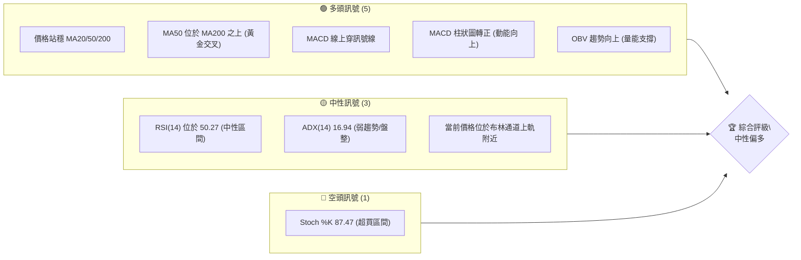

### 📊 核心指標速覽表

下表彙整了 NVDA 當前關鍵技術指標的數值與初步解讀，提供快速概覽。

| 指標類別 | 指標名稱 | 當前數值 | 訊號 | 解讀 |
|----------|----------|----------|------|------|
| **價格** | 當前價格 | $210.96 | 🟢 | 位於 MA20/50/200 之上，顯示短期多頭優勢 |
| **均線** | MA20 | $201.95 | 🟢 | 價格位於 MA20 上方，短期趨勢偏多 |
| **均線** | MA50 | $209.07 | 🟢 | 價格位於 MA50 上方，中期趨勢偏多 |
| **均線** | MA200 | $191.47 | 🟢 | 價格位於 MA200 上方，長期趨勢強勁 |
| **動能** | RSI(14) | 50.27 | 🟡 | 處於中性區間，無明顯超買超賣 |
| **動能** | MACD | 線: -1.703, 訊號: -2.937, 柱狀圖: +1.234 | 🟢 | MACD 線上穿訊號線，柱狀圖轉正，顯示多頭動能增強 |
| **波動** | ATR(14) | $6.80 | 🟡 | 日均波動約為 3.22%，屬中等波動水平 |

### 🏆 技術評分卡

本評分卡綜合考量了 NVDA 在各個技術維度上的表現，以 1-100 分制進行量化評估，並給出整體評級。

╔══════════════════════════════════════════════════════════════╗
║                    技術評分卡 — NVDA (2026-07-11)              ║
╠══════════════════════════════════════════════════════════════╣
║ 趨勢強度      ██████░░░░░░░░░░░░░░  30/100  🟡 (ADX 顯示趨勢較弱，處於盤整)   ║
║ 動能指標      ████████████░░░░░░░░  60/100  🟡 (MACD 看多但 Stoch 過熱，RSI 中性) ║
║ 支撐穩定度    ███████████████░░░░░  75/100  🟢 (價格穩居多個關鍵支撐之上)     ║
║ 成交量配合    ██████████████░░░░░░  70/100  🟢 (OBV 上升，量能配合價格上漲)   ║
║ 形態完整度    ████████░░░░░░░░░░░░  45/100  🟡 (缺乏高信心度圖表形態，短期有W形潛力) ║
║ 均線排列      ████████████░░░░░░░░  65/100  🟢 (長期均線多頭排列，短期混亂但價格在上方)║
╠══════════════════════════════════════════════════════════════╣
║ 綜合評分      ████████████░░░░░░░░  58/100  ⚖️ 中性偏多                    ║
╚══════════════════════════════════════════════════════════════╝

**評級說明**：NVDA 目前技術評分顯示為「中性偏多」。雖然長期趨勢與部分動能指標偏向多頭，但 ADX 顯示當前缺乏強勁趨勢，且短期動能指標有超買現象，提示股價可能進入盤整或面臨回調壓力。操作上需保持謹慎，關注關鍵支撐與阻力位的突破情況。

---

## 2. 趨勢分析

本章將深入分析 NVDA 在不同時間框架下的價格趨勢，從長期宏觀視角到短期微觀動向，並結合 ADX 指標評估趨勢強度。

### 🌐 多時框趨勢分析

NVDA 在月線圖上呈現強勁的長期上升趨勢，週線圖顯示中期築底反彈，而日線圖則處於弱趨勢的盤整格局中。這種多空交織的局面需要投資者仔細權衡。

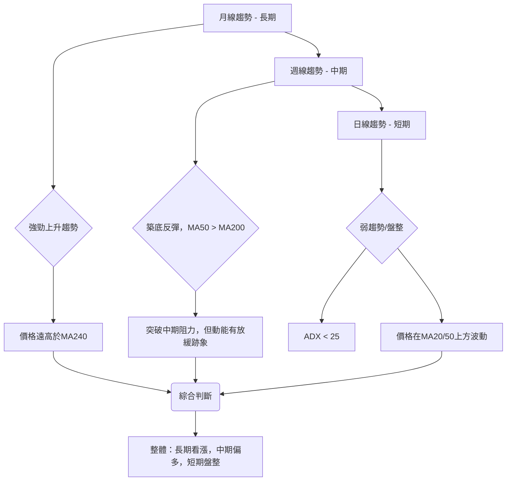

### 📈 長期趨勢 — 12個月走勢圖（Unicode）

NVDA 在過去 12 個月經歷了顯著的波動，但整體呈現強勁的上升趨勢。從 2025 年 7 月的低點 $177.63 上漲至 2026 年 5 月的高點 $210.89，儘管近期有所回調，但仍保持在相對高位。

```
NVDA 月線走勢圖（過去12個月）
價格軸 ($)
$210.96 ┤                                              ● (現在)
$210.89 ┤                                        ● (5月高點)
$202.23 ┤                           ●
$199.34 ┤                                    ●
$190.90 ┤                         ●
$186.34 ┤                  ●    ●
$177.63 ┤●
$173.95 ┤  ●
     └─────────────────────────────────────────────────────
      25/07 25/08 25/09 25/10 25/11 25/12 26/01 26/02 26/03 26/04 26/05 26/06 26/07
```

**走勢特徵分析表格**：

| 階段 | 時間區間 | 主要特徵 | 漲跌幅 (起始點) | 關鍵價位 |
|------|----------|----------|-----------------|----------|
| 1 | 2025/07 - 2025/10 | 強勁上升趨勢 | +13.84% ($177.63 → $202.23) | $177.63 (低點), $202.23 (階段高點) |
| 2 | 2025/10 - 2026/03 | 高位盤整與回調 | -14.06% ($202.23 → $174.20) | $202.23 (阻力), $174.20 (階段低點) |
| 3 | 2026/03 - 2026/05 | 恢復上升趨勢 | +21.06% ($174.20 → $210.89) | $174.20 (支撐), $210.89 (階段高點) |
| 4 | 2026/05 - 2026/07 | 短期回調後反彈 | -0.04% ($210.89 → $210.96) | $210.89 (阻力), $192.53 (近期低點) |

### 📊 中期趨勢（週線分析）

NVDA 的中期趨勢在經歷 2025 年底至 2026 年初的回調後，於 2026 年 3 月見底並開始強勁反彈，突破了多個中期阻力位。目前股價位於中期上升通道中，但面臨短期阻力。

```
NVDA 週線壓力與支撐示意圖
價格軸 ($)
$236.26 ┤                 R3 (52W High)
$232.01 ┤                 R2
$214.16 ┤                 R1
$210.96 ╠─────────────────◄ 現價
$208.54 ┤       S1
$199.34 ┤       S2
$194.51 ┤       S3
$161.40 ┤                 52W Low
     └───────────────────────────────────
        中期上升通道 (藍色箭頭表示方向)
```
從週線數據來看，2026年4月至5月期間，股價從 $177.18 迅速拉升至 $225.06，隨後在 $210-$225 區間進行高位震盪整理。儘管近期有所回落，但 $205.10 (2026-06-07) 和 $192.53 (2026-06-28) 的低點呈現出逐步抬高的趨勢，顯示中期築底反彈的動能仍在。MA50 ($209.07) 位於 MA200 ($191.47) 之上，形成「黃金交叉」，這是中期趨勢看漲的明確訊號。

### ⚡ 趨勢強度評估（ADX 解讀）

ADX 指標用於衡量趨勢的強度，而非方向。當前 NVDA 的 ADX 數值為 16.94，遠低於 25 的閾值，表明市場處於弱趨勢或盤整狀態。

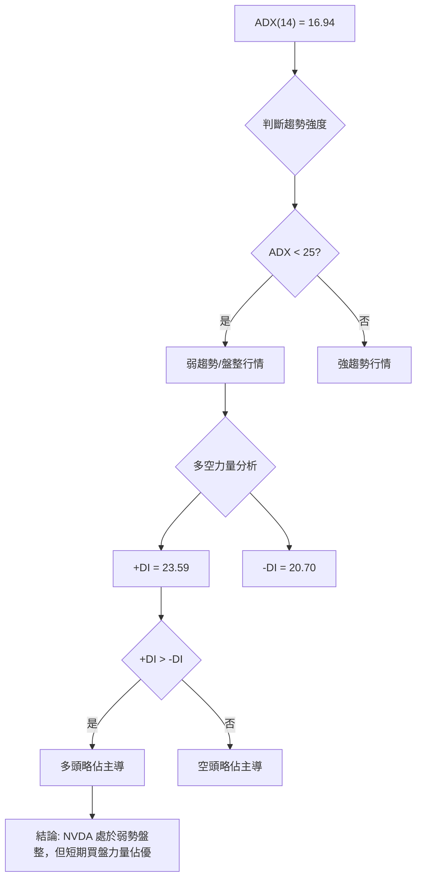

**ADX 強度對照表**：

| ADX 數值範圍 | 趨勢強度 | 市場狀態 | 交易策略建議 |
|--------------|----------|----------|--------------|
| 0-25 | 弱趨勢/盤整 | 市場缺乏明確方向，價格在區間內波動 | 區間交易，等待突破 |
| 25-50 | 中等趨勢 | 趨勢正在形成或已確立，動能增強 | 順勢交易，關注回調買入/反彈賣出機會 |
| 50-75 | 強趨勢 | 趨勢非常明確且強勁，動能持續 | 順勢交易，嚴格止損，享受趨勢利潤 |
| 75-100 | 極強趨勢 | 市場極度單邊，可能接近頂部/底部 | 順勢交易，但需警惕反轉風險 |

**解讀**: 儘管 +DI (23.59) 略高於 -DI (20.70)，顯示短期多頭力量略佔優勢，但 ADX 總體數值低，表明這種優勢並未轉化為強勁的趨勢。因此，NVDA 目前最有可能的走勢是在一個較寬的區間內震盪，直到 ADX 數值上升並確認新的趨勢方向。

---

## 3. 圖表形態分析

本章將嘗試識別 NVDA 價格走勢中可能形成的圖表形態，並結合 K 線組合進行分析，以預測潛在的價格目標。由於缺乏詳細的日線 OHLCV 數據，複雜形態的識別將以較低信心度呈現，主要側重於指標型解讀。

### 🔍 形態識別系統

根據近期的價格數據，NVDA 在 2026 年 6 月底至 7 月初經歷了一次回調，隨後出現明顯反彈。這可能構成一個短期的 W 形反轉（雙重底）形態。

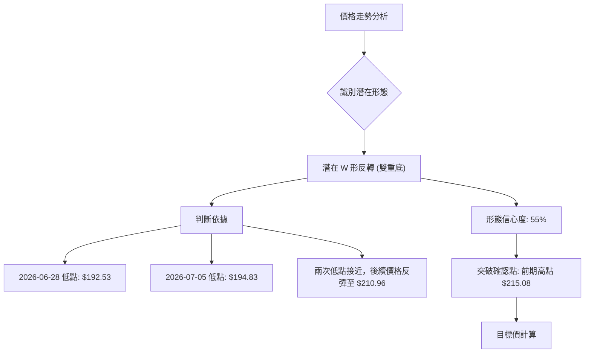

**形態信心度表格**：

| 形態 | 信心度 | 判斷依據（引用數據） | 完成度 | 目標價（附計算式） |
|------|--------|----------------------|--------|--------------------|
| 潛在 W 形反轉 | 55% | 兩次低點分別為 $192.53 (2026-06-28) 和 $194.83 (2026-07-05)，且後續價格強勁反彈。此形態尚待頸線突破確認。 | 80% | 頸線 $215.08 + (頸線 $215.08 - 最低點 $192.53) = $237.63 |
| 其他複雜形態 | 不足 | 數據中未偵測到明確的頭肩頂/底、三角形整理等高信心度形態。 | N/A | N/A |

**判斷依據詳述**：
*   **W 形反轉 (雙重底) 潛力**：NVDA 在 2026 年 6 月 28 日觸及 $192.53 的低點後，於 7 月 5 日再次回探至 $194.83，形成了兩個相對接近的底部。隨後價格從 $194.83 強勁反彈至 $210.96。若價格能有效突破前一個高點（可視為頸線），即 2026 年 5 月 24 日的 $215.08，則此 W 形反轉形態將得到確認。目前形態已完成大部分底部構建，但尚未突破頸線。

### 🕯️ 重要K線形態分析

根據近 20 週的收盤數據，我們可以觀察到以下重要的 K 線形態：

| 月份 | 收盤價 | K線形態 | 解讀 | 訊號 |
|------|--------|---------|------|------|
| 2026-04-05 | $177.18 | 潛在錘子線/啟明星底部 | 從低位反彈，顯示買盤介入，可能預示短期見底。 | 🟢 |
| 2026-04-12 | $188.41 | 大陽線 | 伴隨成交量放大，確認趨勢反轉，多頭力量強勁。 | 🟢 |
| 2026-05-31 | $210.89 | 潛在烏雲罩頂/看跌吞噬 (高位) | 從 $225.06 回落至 $210.89，可能預示短期上漲動能減弱或回調。 | 🔴 |
| 2026-06-28 | $192.53 | 潛在錘子線/十字星 (低位) | 價格快速下跌後在低位止跌，顯示下方支撐較強，買盤開始介入。 | 🟢 |
| 2026-07-12 | $210.96 | 大陽線 (確認反彈) | 從 $194.83 強勁反彈，確認了前期的築底嘗試，多頭動能恢復。 | 🟢 |

### 📉 ASCII 走勢形態示意圖

以下示意圖描繪了 NVDA 近期的價格走勢，特別是潛在的 W 形反轉形態。

```
NVDA 近期走勢形態示意圖 (潛在 W 形反轉)
價格軸 ($)
$225.06 ┤                     (前期高點)
$215.08 ┤                  ┌───┐ (頸線 R1)
$210.96 ╠───────────────────┘▲◄ 現價
$208.54 ┤       S1
$194.83 ┤     ┌─┘
$192.53 ┤ ───┘ (W 形底部 1)
     └───────────────────────────────────
      2026-05   2026-06   2026-07
```
**形態解讀**：股價在 5 月下旬達到一個高點 $225.06 後回落，於 6 月底和 7 月初形成了兩個低點 $192.53 和 $194.83，隨後迅速反彈。這兩個低點構成了潛在 W 形反轉的底部。當前價格 $210.96 正在向形態的頸線 $215.08 靠攏。若能有效突破並站穩頸線，將確認此反轉形態，並預示進一步上漲。

### 🎯 形態目標價計算

基於上述潛在的 W 形反轉形態，我們可以計算出其理論目標價。
*   **形態最低點 (Trough)**：$192.53 (2026-06-28)
*   **形態頸線 (Neckline)**：取近期高點 $215.08 (2026-05-24) 作為潛在頸線。
*   **形態高度 (Pattern Height)**：頸線 $215.08 - 最低點 $192.53 = $22.55
*   **理論目標價**：頸線 $215.08 + 形態高度 $22.55 = $237.63

此目標價 $237.63 高於 52 週高點 $236.26，顯示若形態成功突破，則有望挑戰新高。然而，此形態的信心度為 55%，仍需密切關注突破頸線時的成交量配合及動能。

---

## 4. 支撐與阻力

支撐與阻力是技術分析的基石，它們代表了市場心理的重要價位，是買賣雙方力量轉換的關鍵點。本章將詳細分析 NVDA 的關鍵支撐與阻力位，並結合斐波那契回調位，構建完整的價格結構圖。

### 🗺️ 關鍵價位分布圖（Unicode）

以下圖表直觀展示了 NVDA 當前價格與其關鍵支撐、阻力位的相對位置。

```
NVDA 價位結構分布圖
═══════════════════════════════════════════════════
$236.26 ║████████████████████████║ 強阻力 R3 (52W High)
$232.01 ║████████████████████    ║ 阻力 R2
$218.60 ║████████████████████████║ 斐波那契 23.6%
$214.16 ║████████████████████████║ 關鍵阻力 R1 (布林上軌附近)
$210.96 ╠════════════════════════╣ ◄ 現價
$208.54 ║▓▓▓▓▓▓▓▓▓▓▓▓▓▓▓▓        ║ 近期支撐 S1 (斐波那契 38.2% 附近)
$207.66 ║████████████████████████║ 斐波那契 38.2%
$199.34 ║████████████████████████║ 強支撐 S2 (斐波那契 50% 附近)
$198.83 ║████████████████████████║ 斐波那契 50%
$194.51 ║████████████████████████║ 支撐 S3
$190.00 ║████████████████████████║ 斐波那契 61.8%
$161.40 ║████████████████████████║ 52W Low (斐波那契 100%)
═══════════════════════════════════════════════════
```

### 🚧 阻力位分析表

以下表格列出了 NVDA 當前的關鍵阻力位及其重要性。這些價位代表了市場上方可能存在的賣壓。

| 阻力級別 | 價位 | 形成原因 | 突破難度 | 重要性 |
|----------|------|----------|----------|--------|
| R1 (近期) | $214.16 | 近期波段高點聚類，與布林通道上軌 ($214.11) 接近。 | 中等 | 🟢 短期趨勢能否延續的關鍵。 |
| R2 (中期) | $232.01 | 前期壓力區，突破後有望挑戰 52 週新高。 | 較高 | 🟡 突破此位將確認中期強勁動能。 |
| R3 (強勁) | $236.26 | 52 週高點，歷史最高點附近，心理阻力強。 | 極高 | 🔴 突破此位意味著股價進入全新的上漲空間。 |

**分析**：當前價格 $210.96 位於 R1 阻力位 $214.16 之下，顯示短期上漲面臨初步壓力。若能放量突破 R1，則有望挑戰更高的阻力位 R2 和 R3。R1 價位與布林通道上軌極為接近，形成較強的短期壓力區。

### 🛡️ 支撐位分析表

以下表格列出了 NVDA 當前的關鍵支撐位及其重要性。這些價位代表了市場下方可能存在的買盤支撐。

| 支撐級別 | 價位 | 形成原因 | 守住機率 | 重要性 |
|----------|------|----------|----------|--------|
| S1 (近期) | $208.54 | 近期波段低點聚類，與斐波那契 38.2% ($207.66) 接近。 | 較高 | 🟢 短期回調止跌的關鍵，跌破則可能測試更深支撐。 |
| S2 (中期) | $199.34 | 前期重要整理平台，與斐波那契 50% ($198.83) 接近。 | 高 | 🟢 中期趨勢的關鍵防線，跌破則中期趨勢可能轉弱。 |
| S3 (強勁) | $194.51 | 近期低點，與布林通道下軌 ($189.79) 及斐波那契 61.8% ($190.00) 接近。 | 極高 | 🟡 強勁支撐，跌破則可能引發更大幅度的回調。 |

**分析**：當前價格 $210.96 位於多個關鍵支撐位之上，特別是 S1 $208.54 提供了即時的緩衝。S2 $199.34 和 S3 $194.51 則構成了更深層次的防線，這些價位與斐波那契回調位高度重合，增強了其支撐效力。只要價格能維持在 S1 之上，短期多頭結構就相對穩固。

### 📐 斐波那契回調位分析

我們以 NVDA 過去 52 週的最高點 ($236.26) 和最低點 ($161.40) 作為參考，計算出以下斐波那契回調位：

| 斐波那契比率 | 價位 |
|--------------|------|
| 0.0% (52W High) | $236.26 |
| 23.6% | $218.60 |
| 38.2% | $207.66 |
| 50.0% | $198.83 |
| 61.8% | $190.00 |
| 78.6% | $177.42 |
| 100.0% (52W Low) | $161.40 |

**分析**：
當前價格 $210.96 位於斐波那契 23.6% 回調位 ($218.60) 和 38.2% 回調位 ($207.66) 之間。
*   這表明股價在從 52 週高點回調後，在 38.2% 回調位附近獲得了支撐並開始反彈。
*   23.6% 回調位 ($218.60) 成為股價上漲的初步阻力，若能突破此位，將有機會挑戰 52 週高點。
*   38.2% 回調位 ($207.66) 則提供了堅實的支撐，與近期支撐 S1 ($208.54) 高度重疊，進一步強化了該區域的買盤力量。
*   若價格跌破 38.2% 回調位，則可能進一步測試 50% 回調位 ($198.83) 和 61.8% 回調位 ($190.00)。這些回調位在歷史上常作為重要的反彈或止跌點。

---

## 5. 技術指標深度解讀

本章將對 NVDA 的各項技術指標進行詳盡分析，包括移動平均線、RSI、MACD、布林通道及成交量，並探討它們之間的相互關係與確認訊號。

### 🎛️ 指標訊號總覽

以下 Mermaid 圖表展示了各技術指標之間的訊號關係，以及它們如何共同指向 NVDA 當前的市場狀態。

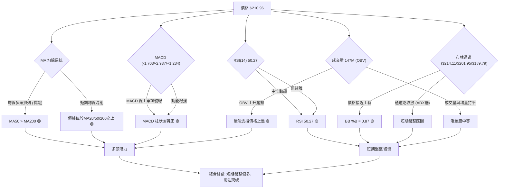

### 📈 移動平均線排列分析

NVDA 的移動平均線系統呈現出長期多頭、中期偏多、短期混亂的格局。
*   **長期趨勢**：MA200 ($191.47) 位於所有短期和中期均線之下，且 MA50 ($209.07) 遠高於 MA200，形成「黃金交叉」，這是強烈的長期看漲訊號。
*   **中期趨勢**：MA50 ($209.07) 位於 MA60 ($208.21) 之上，顯示中期趨勢依然偏強。
*   **短期趨勢**：當前價格 $210.96 位於 MA20 ($201.95) 之上。然而，MA5 ($202.07)、MA10 ($199.03) 和 MA20 ($201.95) 的排列呈現出交織狀態，表明短期內市場缺乏明確的單邊趨勢，處於整理或盤整階段。

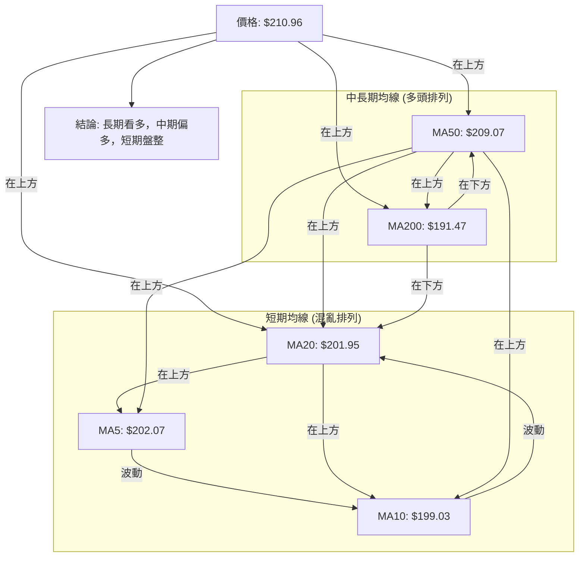

**結論**：儘管短期均線排列混亂，但價格能維持在所有主要均線上方，且長期均線呈現多頭排列，這為 NVDA 提供了堅實的底部支撐。短期內的震盪被視為健康的整理，為後續上漲積蓄動能。

### 📉 RSI(14) 分析

*   **RSI 數值**：當前 RSI(14) 為 50.27。這表示 NVDA 的股價動能處於中性區間 (30-70)。既沒有進入超買區 (通常 > 70)，也沒有進入超賣區 (通常 < 30)。
*   **RSI 進度條**：RSI 動能: ██████████░░░░░░░░░░ 50.27% 🟡
*   **超買超賣區間分析**：由於 RSI 處於中性區，它不提供直接的買入或賣出訊號。這與 ADX 顯示的弱趨勢相符，表明市場缺乏強勁的單邊動能。
*   **背離判斷**：根據提供的數據，**無明顯 RSI 背離訊號**。這意味著價格走勢與動能指標之間沒有出現矛盾，當前價格的震盪反映了真實的市場力量變化。

**綜合解讀**：RSI 的中性讀數支持了 ADX 關於盤整行情的判斷。在缺乏明確方向的情況下，RSI 更多地扮演了確認而非領先的角色。投資者應關注 RSI 未來是否能突破 70 或跌破 30，以尋找新的趨勢訊號。

### 📊 MACD(12/26/9) 訊號解讀

MACD (Moving Average Convergence Divergence) 指標用於判斷趨勢強度和方向。
*   **MACD 線**：-1.703
*   **MACD Signal 線**：-2.937
*   **MACD 柱狀圖 (Histogram)**：+1.234

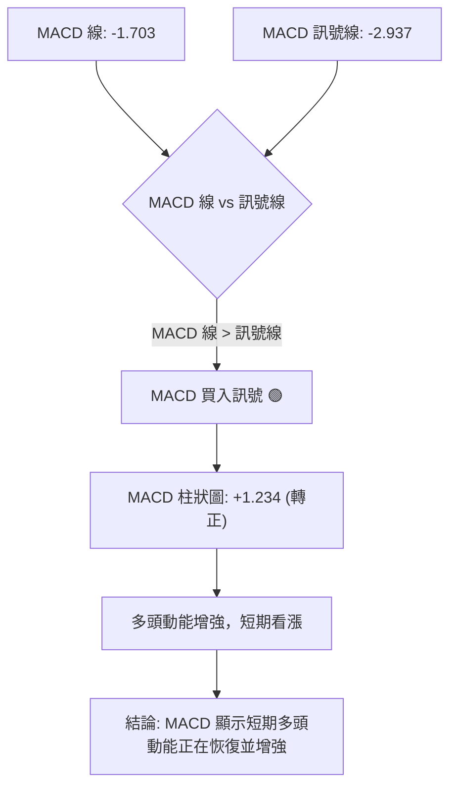
**分析**：
1.  **MACD 線上穿訊號線**：MACD 線 (-1.703) 高於 MACD 訊號線 (-2.937)，這是一個經典的**多頭交叉 (Bullish Crossover)** 訊號，通常預示著股價可能開啟一波上漲。
2.  **MACD 柱狀圖轉正**：柱狀圖從負值轉為正值 (+1.234)，且正在增長。這進一步確認了多頭動能的增強，表明買方力量正在積聚。

**背離判斷**：根據提供的數據，**無明顯 MACD 背離訊號**。這表示 MACD 指標與價格走勢保持一致，沒有出現預示反轉的背離現象。

**綜合解讀**：MACD 指標提供了明確的短期看漲訊號，與價格站穩均線、OBV 上升等訊號相互印證，增強了短期偏多的判斷。儘管 ADX 顯示趨勢強度不足，但 MACD 的變化表明市場內部已開始積蓄上漲動能。

### 📦 布林通道分析

布林通道由三條線組成：上軌、中軌 (MA20) 和下軌，用於衡量價格波動範圍。

```
NVDA 布林通道示意圖
價格軸 ($)
$214.11 ┤═════════════════════════════ 上軌 (BB Upper)
$210.96 ╠───────────────────────────◄ 現價
$201.95 ┤─────────────────────────── 中軌 (MA20)
$189.79 ┤═════════════════════════════ 下軌 (BB Lower)
     └───────────────────────────────────
```
*   **布林上軌**：$214.11
*   **布林中軌 (MA20)**：$201.95
*   **布林下軌**：$189.79
*   **BB %B**：0.87 (0=下軌, 0.5=中軌, 1=上軌)

**分析**：
1.  **價格位置**：當前價格 $210.96 位於布林通道中軌 $201.95 之上，且非常接近上軌 $214.11。BB %B 為 0.87，表示價格處於通道的相對高位。
2.  **通道寬度**：從數據無法直接判斷通道寬度，但 ADX 顯示弱趨勢，暗示布林通道可能處於收斂狀態，預示價格波動性降低，市場可能在積蓄能量等待方向性突破。
3.  **訊號解讀**：價格接近上軌通常意味著短期動能強勁，但同時也可能面臨上軌的阻力。若能放量突破上軌，則可能開啟一波新的上漲趨勢；若未能突破並回落，則可能在中軌附近尋求支撐，或在通道內震盪。

**綜合解讀**：布林通道的分析表明，NVDA 短期內面臨上行阻力，但其價格位於中軌之上，顯示多頭力量仍佔據主導。結合 ADX 的弱趨勢判斷，目前更傾向於在通道內進行區間震盪，直至出現明確的突破訊號。

### 💹 成交量分析（量價配合度）

成交量是價格走勢的重要佐證，量價配合度能揭示趨勢的可靠性。
*   **最新成交量**：147,203,662
*   **20日均量**：146,772,808 (量比: 1.00x)
*   **50日均量**：160,922,561
*   **OBV 趨勢**：OBV > MA → 量能支撐上漲

**分析**：
1.  **當前成交量與均量比較**：最新成交量 (147.2M) 與 20 日均量 (146.7M) 幾乎持平 (量比 1.00x)，表明市場活躍度處於平均水平。這在價格反彈時，若能伴隨顯著放量，將更具說服力。目前量能配合尚可，但未見特別突出的放量行為。
2.  **OBV (On-Balance Volume) 趨勢**：OBV 指標的趨勢高於其移動平均線 (OBV > MA)，這是一個明確的**量能支撐上漲**訊號。OBV 的上升表明在價格上漲時，買入的成交量大於賣出的成交量，確認了多頭力量的積累，使得當前價格的反彈更具可信度。

**量價配合度**：
*   **近期反彈**：從 2026-07-05 的 $194.83 反彈至 $210.96，同期週成交量從 603M 略增至 659M。雖然不是巨量，但 OBV 的多頭趨勢表明量能是健康地配合價格上漲的。
*   **潛在風險**：若價格在接近阻力位時出現縮量上漲，或放量下跌，則需警惕趨勢反轉風險。目前看來，量價配合度相對健康，支撐了價格的短期反彈。

**綜合解讀**：成交量分析顯示，儘管近期未出現爆炸性放量，但 OBV 的多頭趨勢確認了當前價格反彈的可靠性。這與 MACD 的買入訊號形成良好共振，為短期偏多判斷提供了量能上的支持。

---

## 6. 動能與波動率

本章將從動能和波動率兩個維度深入評估 NVDA 的市場表現。動能反映了價格變化的速度和強度，而波動率則衡量價格變動的幅度。

### ⚡ 動能評估四象限

動能評估四象限分析將 NVDA 當前的狀態置於動能強度和波動率的框架中。由於 ADX 顯示為弱趨勢，且 ATR 波動率中等，NVDA 目前處於「中等動能，中等波動」的狀態。

| 象限 | 動能 | 波動 | 當前狀態 | 評估 |
|------|------|------|----------|------|
| Q1 | 強 | 低 | - | 最佳機會 (強趨勢，風險可控) |
| Q2 | 弱 | 低 | - | 謹慎觀望 (盤整，等待方向) |
| Q3 | 強 | 高 | - | 高風險高收益 (趨勢強但震盪大) |
| Q4 | 弱 | 高 | - | 避免進場 (方向不明，風險高) |
| **NVDA** | **中** | **中** | **✓** | **中性偏多，區間操作，等待突破** |

**分析**：
*   **動能**：MACD 顯示多頭動能正在增強 (MACD 線上穿訊號線，柱狀圖轉正)，這是積極訊號。然而，RSI 處於中性區間 (50.27)，且 Stoch 處於超買區 (87.47)。這表明短線動能雖然偏強，但並非極度強勁，且存在超買回調風險。因此，動能評估為「中等」。
*   **波動率**：ATR(14) 為 $6.80，佔當前價格 $210.96 的 3.22%。這是一個中等水平的日波動率，高於低波動股票，但低於極端波動的個股。

**結論**：NVDA 目前處於「中等動能，中等波動」的狀態。這意味著市場雖然有向上動力，但趨勢尚未完全確立，波動性適中。在這種情況下，區間操作或等待明確的突破訊號是較為穩妥的策略。

### 📊 ATR 波動率分析

ATR (Average True Range) 是衡量一段時間內價格波動性平均值的指標。
*   **ATR(14)**：$6.80
*   **佔股價比例**：3.22% (每日波動參考)

**分析**：
1.  **波動水平**：NVDA 的 ATR 為 $6.80，佔股價的 3.22%。這表明該股票的每日平均波動幅度約為 $6.80。相較於其高股價，3.22% 的波動率屬於中等偏高水平，顯示 NVDA 仍具有較高的活躍度。
2.  **止損距離建議**：ATR 可用於設定動態止損位。一般建議將止損距離設定為 1.5 倍至 3 倍的 ATR。
    *   保守止損 (1.5 x ATR)：$6.80 x 1.5 = $10.20。若從現價 $210.96 計算，止損位約為 $200.76。
    *   激進止損 (2 x ATR)：$6.80 x 2 = $13.60。若從現價 $210.96 計算，止損位約為 $197.36。
    這些止損位與 NVDA 的關鍵支撐位 S2 ($199.34) 和 S3 ($194.51) 接近，提供了合理的風險管理區間。

**綜合解讀**：中等波動率意味著 NVDA 既提供了足夠的交易機會，又不會過於劇烈而難以控制風險。利用 ATR 設定止損有助於在保持彈性的同時，限制潛在損失。

### 📐 Beta 與市場相關性

Beta 值衡量單一股票相對於整個市場 (通常是大盤指數如 S&P 500) 的波動性。
*   **Beta**：2.211

**分析**：
1.  **市場敏感度**：NVDA 的 Beta 值為 2.211，遠高於 1。這表明 NVDA 是一隻高 Beta 股票，其價格波動性是大盤的約 2.211 倍。當市場上漲 1% 時，NVDA 理論上可能上漲 2.211%；反之，當市場下跌 1% 時，NVDA 可能下跌 2.211%。
2.  **投資組合影響**：高 Beta 股票在牛市中能提供更高的潛在收益，但在熊市中也面臨更大的潛在損失。NVDA 的高 Beta 值使其成為一個放大市場趨勢的工具。
3.  **風險考量**：投資 NVDA 需要承受比市場更高的系統性風險。在當前市場環境下，若大盤趨勢不明朗或面臨回調，NVDA 的股價可能會遭受更大的衝擊。

**綜合解讀**：NVDA 的高 Beta 值使其成為一個高風險高報酬的投資標的。投資者應密切關注大盤走勢，並將 NVDA 納入其整體投資組合的風險管理框架中。在判斷 NVDA 的獨立技術訊號時，也應考慮其與大盤的共振效應。

---

## 7. 多時框架總結

本章將整合前述所有時框架的分析結果，給出 NVDA 在不同時間維度上的綜合評分，並依據多時框收斂規則，得出最終的、唯一的方向性結論。

### 📋 時框架評分表

| 時框架 | 趨勢方向 | 動能 | 均線排列 | 形態 | 綜合評分 | 建議 |
|--------|----------|------|----------|------|----------|------|
| **長期** (月線) | 🟢 上升 | 🟢 強勁 | 🟢 多頭 | 🟡 無明確 | 8/10 | 長線持有 |
| **中期** (週線) | 🟢 偏多 | 🟡 中性 | 🟢 黃金交叉 | 🟡 無明確 | 7/10 | 逢低買入 |
| **短期** (日線) | 🟡 盤整 | 🟢 增強 | 🟡 混亂 | 🟡 潛在W形 | 6/10 | 區間操作/等待突破 |

### 🔲 綜合訊號矩陣

以下矩陣分析了短期、中期、長期各維度訊號的一致性，以判斷整體市場偏向。

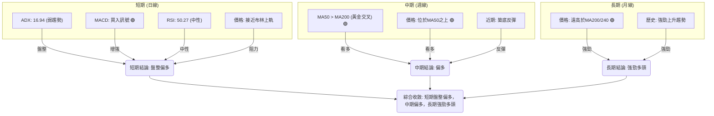

**分析**：
*   **短期**：日線 ADX 顯示弱趨勢，意味著當前市場處於盤整。然而，MACD 提供了多頭交叉訊號，且價格在布林通道上軌附近，顯示內部動能偏強。RSI 中性，Stoch 超買。綜合來看，短期為**盤整偏多**。
*   **中期**：週線 MA50 位於 MA200 之上，形成黃金交叉，這是強勁的中期多頭訊號。價格也位於 MA50 之上，確認中期偏多。
*   **長期**：月線價格遠高於所有長期移動平均線，歷史走勢呈現強勁的上升趨勢。長期來看，NVDA 仍處於**強勁的多頭趨勢**中。

### ⚖️ 多時框收斂結論

根據「嚴格要求 14」的多時框收斂規則：
1.  **判斷趨勢行情或盤整行情**：當前 ADX(14) 為 16.94，小於 25，明確指示 NVDA 處於**盤整行情**。
2.  **主導時框與交易區間**：在盤整行情下，應以日線布林通道上下軌為主要交易區間。
3.  **優先級收斂**：雖然短期 ADX 顯示盤整，但中期 (MA50 > MA200) 和長期趨勢均為明確的多頭。因此，目前的盤整應被視為在長期上升趨勢中的健康調整，而非趨勢反轉。短期指標（如 MACD 買入訊號、OBV 上升）也支持盤整後偏向上行的可能性。

**最終結論**：NVDA 目前處於一個**長期多頭趨勢中的短期盤整階段**。雖然日線級別動能有所積聚 (MACD 買入訊號)，但 ADX 顯示趨勢強度不足，且價格已接近短期阻力位 R1 ($214.16) 和布林上軌 ($214.11)，伴隨 Stoch 超買。因此，市場存在向上突破的潛力，但也需警惕短期回調風險。

**方向性結論**：**中性偏多，等待明確突破訊號**。主要策略應關注在支撐位買入或突破阻力位追多，但需嚴格控制風險，並警惕盤整區間內的來回震盪。

---

## 8. 交易策略建議

基於多時框架的綜合分析，NVDA 目前處於長期多頭趨勢中的短期盤整階段，評分卡顯示為「中性偏多」。因此，主策略將側重於多頭機會，但會強調等待突破確認或在關鍵支撐位介入。

### 🗺️ 策略決策流程圖

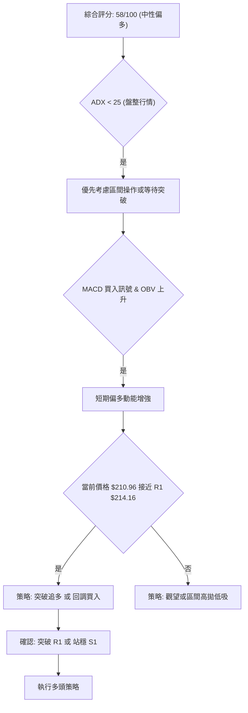

### 🧭 策略路由（依評分卡分流）

**當前主策略方向 = 中性偏多 (依評分 58/100)**。
由於綜合評分處於中性偏多區間 (40-60)，且 ADX < 25 指示盤整行情，因此主要策略將聚焦於區間操作，並密切關注突破方向。在多頭動能積聚的背景下，我們將優先考慮在關鍵支撐位建立多頭倉位，或等待向上突破阻力後的追多機會。

### 🎯 價格情境階梯（Price Scenarios）

以當前價格 $210.96 為基準，建立向上與向下的情境劇本：

| 觸發條件 | 下一目標 | 後續延伸 | 情境含義 |
|----------|----------|----------|----------|
| 突破 R1 $214.16 | R2 $232.01 | R3 $236.26 (52W 高點) | **短線轉強**：確認突破盤整區間，多頭動能爆發，有望挑戰新高。 |
| 站穩現價區間 ($208.54-$214.16) | — | S1 $208.54 / R1 $214.16 | **區間震盪**：價格在 S1 和 R1 之間震盪，等待明確方向。 |
| 跌破 S1 $208.54 | S2 $199.34 | S3 $194.51 | **中期轉弱**：跌破關鍵支撐，可能引發更深層次的回調，考驗中期趨勢支撐。 |

### 📊 情境機率分佈

| 情境 | 機率 | 主要依據 |
|------|------|----------|
| 繼續上行 / 突破 | 45% | MACD 多頭交叉，OBV 上升，價格站穩 MA20/50/200，且在近期低點形成潛在 W 形反轉。 |
| 區間震盪 | 40% | ADX 弱趨勢，RSI 中性，Stoch 超買，價格接近布林上軌和 R1 阻力。 |
| 回落 / 再探底 | 15% | Stoch 指標超買，短期動能可能面臨回調壓力，若 R1 阻力未能突破。 |

### 🟢 主策略詳情

基於當前中性偏多且 ADX 顯示盤整的市場環境，我們建議採取以下兩種多頭策略，以應對不同的市場發展。

| 策略要素 | 策略 A：突破追多 (Breakout Long) | 策略 B：回調買入 (Buy the Dip) |
|----------|----------------------------------|--------------------------------|
| 進場條件 | 價格放量突破 R1 $214.16 並站穩 | 價格回調至 S1 $208.54 或斐波那契 38.2% $207.66 附近，出現止跌訊號。 |
| 進場價格 | $215.00 - $215.50 (確認突破後) | $207.50 - $208.50 |
| 目標價 T1 | $232.01 (R2) | $214.16 (R1) |
| 目標價 T2 | $236.26 (R3 / 52W High) | $218.60 (斐波那契 23.6%) |
| 止損價格 | $208.54 (跌破 R1 附近支撐 S1) | $199.34 (跌破 S2) |
| 風險報酬比 | T1: 約 2.5:1 (($232.01-$215.00)/($215.00-$208.54)) | T1: 約 2.3:1 (($214.16-$208.00)/($208.00-$199.34)) |
| 成功機率 | 45% | 55% |
| 建議倉位 | 10-15% | 15-20% |

**策略 A 詳細說明**：此策略適用於價格成功突破盤整區間上沿，確認多頭趨勢延續的情況。進場點應等待價格確認站穩 R1 阻力之上，避免假突破。止損位設置在 R1 下方的關鍵支撐 S1，以控制風險。目標價設置在下一個阻力位 R2 和歷史高點 R3。

**策略 B 詳細說明**：此策略適用於價格在短期內因超買或阻力而回調的情況。在關鍵支撐位 S1 ($208.54) 或斐波那契 38.2% ($207.66) 附近尋找止跌訊號（如 K 線反轉形態、縮量止跌），然後逢低買入。止損位設置在更下方的重要支撐 S2，以確保有足夠的緩衝。目標價則設定為回歸近期阻力位 R1 或斐波那契 23.6%。

### 🔴 反向風險觸發點（對沖提示）

以下是可能推翻上述多頭主策略的關鍵訊號，供投資者進行風險管理或對沖參考：
*   **跌破 S1 $208.54 並伴隨放量**：若價格未能守住近期支撐 S1，則可能預示短期趨勢轉弱。
*   **MACD 出現死叉或柱狀圖轉負**：MACD 多頭動能衰竭，轉為空頭訊號。
*   **布林通道下軌被跌破**：若價格跌破布林下軌 $189.79，則可能開啟一波下跌趨勢。
*   **ADX 快速上升且 -DI 顯著高於 +DI**：表示空頭趨勢正在形成並增強。

### ⭐ 整體訊號強度評星

```
做多訊號強度：★★★☆☆  (3/5星) (長期趨勢看好，短期動能積聚，但有盤整阻力)
做空訊號強度：★★☆☆☆  (2/5星) (短期有回調風險，但缺乏強勁空頭訊勢)
整體可信度：  ★★★☆☆  (3/5星) (多空因素交織，等待明確訊號)
```

---

## 9. 風險提示與監控

投資 NVDA 雖然具有巨大的潛力，但任何投資都伴隨著風險。本章旨在提醒投資者關注潛在風險，並提供相應的監控指標和管理建議。

### ✅ 關鍵監控指標 Checklist

以下列表是投資者應密切關注的 NVDA 關鍵技術指標和價位，以應對市場變化。

╔══════════════════════════════════════════════════════════════╗
║                    NVDA 關鍵監控指標清單                       ║
╠══════════════════════════════════════════════════════════════╣
║ ├─ **價格行為**：                                             ║
║ ║    [ ] 密切關注 R1 ($214.16) 和 S1 ($208.54) 的突破或跌破。║
║ ║    [ ] 觀察價格在布林通道上/下軌附近的反應。               ║
║ ├─ **動能指標**：                                             ║
║ ║    [ ] 監控 MACD 線是否再次死叉，柱狀圖是否轉負。          ║
║ ║    [ ] 關注 RSI 是否跌破 50 中軸線，或進入超賣區。         ║
║ ║    [ ] 留意 Stoch 指標是否從超買區快速回落。               ║
║ ├─ **趨勢強度**：                                             ║
║ ║    [ ] 追蹤 ADX(14) 數值變化，若 ADX 突破 25，確認趨勢形成。║
║ ║    [ ] 判斷 +DI 和 -DI 的相對強弱。                       ║
║ ├─ **成交量**：                                               ║
║ ║    [ ] 觀察價格突破或跌破關鍵價位時的成交量是否配合。      ║
║ ║    [ ] 監控 OBV 趨勢是否轉向，跌破其移動平均線。           ║
║ ├─ **宏觀環境**：                                             ║
║ ║    [ ] 關注半導體行業整體表現及相關新聞。                  ║
║ ║    [ ] 留意大盤指數 (如 S&P 500) 的趨勢，因 NVDA Beta 值高。║
╚══════════════════════════════════════════════════════════════╝

### ⚠️ 風險場景分析

以下情境分析將幫助投資者預想 NVDA 可能的走勢，並提前做好應對準備。

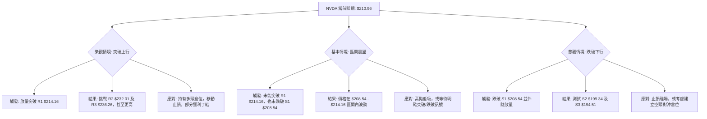

### 🛡️ 風險管理重要提醒

1.  **倉位管理**：鑑於 NVDA 的高 Beta 值和中等波動率，建議投資者謹慎控制倉位，避免單一股票佔用過高比例的投資組合。在趨勢不明朗的盤整區間，更應降低倉位。
2.  **嚴格止損**：無論採取何種策略，都必須設定並嚴格執行止損位。ATR 提供的止損建議是一個良好的參考，但具體數值應根據個人風險承受能力和交易計畫進行調整。
3.  **多樣化投資**：NVDA 屬於半導體行業，具有較高的行業集中風險。建議通過多樣化投資來分散風險，不要將所有資金集中在單一股票或單一行業。
4.  **關注基本面**：雖然本報告側重技術分析，但 NVDA 的基本面變化（如財報、新產品發布、市場份額變化）仍是影響股價長期走勢的關鍵因素。技術分析應與基本面分析結合使用。
5.  **市場情緒**：NVDA 是一隻受市場情緒影響較大的股票。關注社交媒體情緒、新聞報導和分析師評級的變化，可能對短期價格產生影響。

---

## 📋 報告總結

```
NVDA 技術分析報告總結
════════════════════════════════════════════════════════
報告日期：2026-07-11
當前價格：$210.96
分析評級：⚖️ 中性偏多 (長期趨勢看好，短期盤整積蓄動能)

關鍵結論：
├─ 長期趨勢：🟢 強勁上升趨勢，MA50 位於 MA200 之上。
├─ 中期趨勢：🟢 偏多，從底部反彈，但動能有放緩跡象。
├─ 短期趨勢：🟡 盤整行情 (ADX < 25)，MACD 顯示多頭動能增強，但 Stoch 超買。
├─ 關鍵支撐：$208.54 (S1), $199.34 (S2)。
├─ 關鍵阻力：$214.16 (R1), $232.01 (R2), $236.26 (R3)。
└─ 分析師目標：均價 $301.62 (顯示長期看好，遠高於當前技術目標)。

最優策略組合：
1. 🥇 **最佳機會 (突破追多)**：若價格能放量突破 R1 ($214.16) 並站穩，則追多至目標 $232.01 / $236.26。止損 $208.54。
2. 🥈 **次選機會 (回調買入)**：若價格回調至 S1 ($208.54) 或斐波那契 38.2% ($207.66) 附近出現止跌訊號，則考慮逢低買入，目標 $214.16 / $218.60。止損 $199.34。
3. 🥉 **保守選擇 (區間操作/觀望)**：在價格未能明確突破 R1 或跌破 S1 之前，可在 $208.54 - $214.16 區間內進行高拋低吸，或保持觀望，等待明確方向。
════════════════════════════════════════════════════════
```

---

> ⚠️ **免責聲明**：本報告為 AI 自動生成之技術分析，所有數據及估算均基於提供的歷史價格資訊。本報告**僅供研究與學術參考**，**不構成任何投資建議**。投資有風險，入市需謹慎。

---

*報告生成時間：2026-07-11 ｜ 數據來源：Yahoo Finance ｜ 分析框架：多時框技術分析*