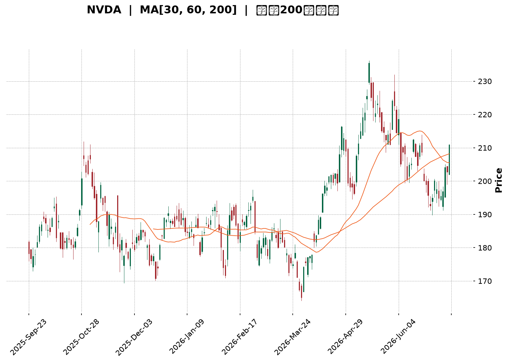
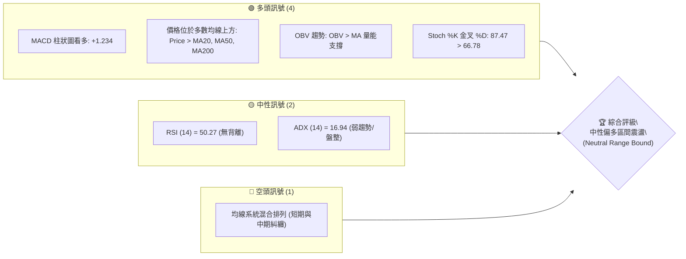
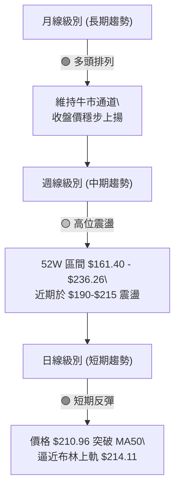
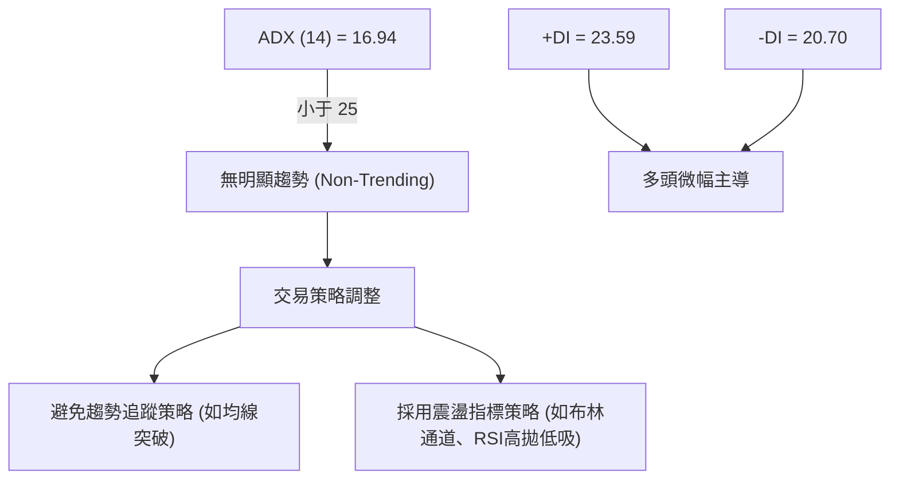
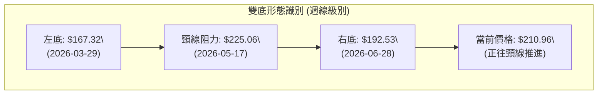
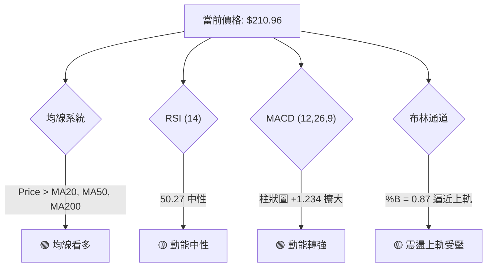
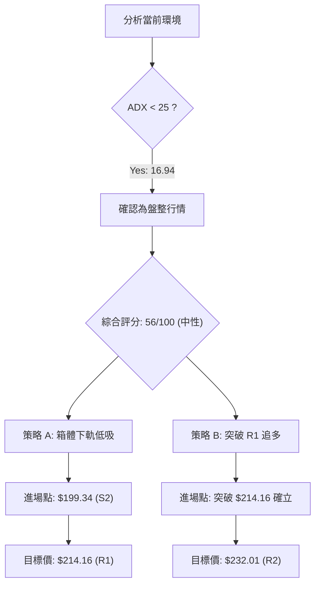
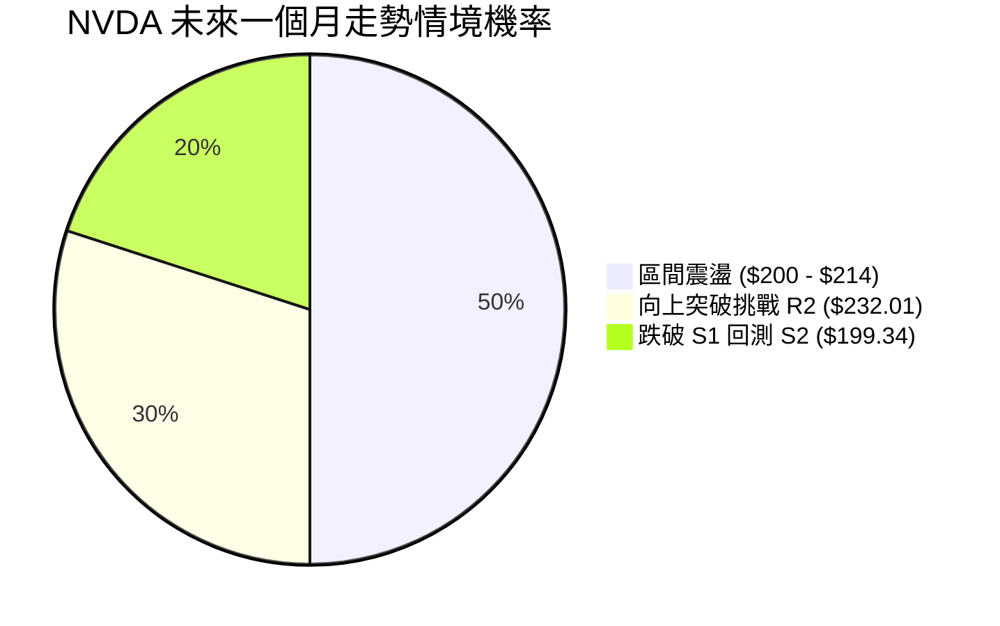
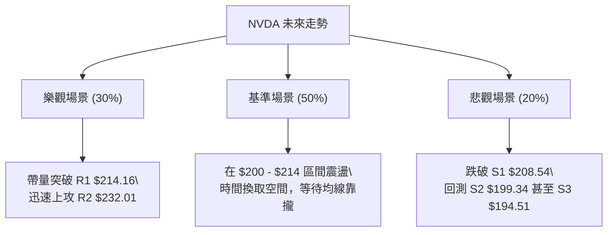

<details>
<summary>📊 靜態圖表 (點擊展開)</summary>

</details>

<html>
<head><meta charset="utf-8" /></head>
<body>
    <div style="height:500px; width:100%;">                        <script>window.PlotlyConfig = {MathJaxConfig: 'local'};</script>
        <script charset="utf-8" src="https://cdn.plot.ly/plotly-3.7.0.min.js" integrity="sha256-jvTGqxNp8AGWEcvNLVuKr+8j5dGe9Yw51LQkmDH+IYA=" crossorigin="anonymous"></script>                <div id="candlestick-chart" class="plotly-graph-div" style="height:100%; width:100%;"></div>            <script>                window.PLOTLYENV=window.PLOTLYENV || {};                                if (document.getElementById("candlestick-chart")) {                    Plotly.newPlot(                        "candlestick-chart",                        [{"close":{"dtype":"f8","bdata":"AAAAoHxGZkAAAACA0xdmQAAAAGDWLmZAAAAAINE+ZkAAAADAybNmQAAAAGD0SmdAAAAAQAxgZ0AAAADgx5RnQAAAAEAxbGdAAAAAgLcpZ0AAAADAvBlnQAAAAMDPm2dAAAAAAGQKaEAAAACAp91mQAAAAGCQgmdAAAAAAJ95ZkAAAADgOnNmQAAAAGCCsmZAAAAAYJLfZkAAAAAACc1mQAAAAEC8nWZAAAAAgJyBZkAAAADgsb1mQAAAACC6QGdAAAAA4N\u002fnZ0AAAAAgxBhpQAAAAEDX2GlAAAAAwDVUaUAAAAAgbUdpQAAAACC602lAAAAAIPvNaEAAAABgw15oQAAAAMDkemdAAAAAgCF9Z0AAAACgfNloQAAAACA\u002fHWhAAAAAYLMxaEAAAAAg51NnQAAAACCwvWdAAAAAAJhLZ0AAAACgIKRmQAAAAIAJSWdAAAAA4B2NZkAAAABg3lRmQAAAAMAoymZAAAAA4P0yZkAAAADg+IBmQAAAAADJGGZAAAAAQBt2ZkAAAADAUqdmQAAAAECPa2ZAAAAAAAPlZkAAAABgAsZmQAAAAABeKmdAAAAAYNQXZ0AAAADAy\u002fFmQAAAAOC0lmZAAAAAQNHZZUAAAABgaAJmQAAAAMAcMGZAAAAAoGpXZUAAAAAAsb1lQAAAAOCfmGZAAAAAYOvuZkAAAAAgWJ9nQAAAAOAqjGdAAAAAYIjJZ0AAAADgs39nQAAAACD4aWdAAAAA4LpIZ0AAAACg1pNnQAAAAMCBfGdAAAAAoGFgZ0AAAADgJZxnQAAAACARGmdAAAAAQFAUZ0AAAADg3hZnQAAAAECtMmdAAAAAIFfdZkAAAAAAT1pnQAAAAKAZQGdAAAAAYEw7ZkAAAAAgGONmQAAAAKCsE2dAAAAAwB9uZ0AAAABgxUdnQAAAAIBKiWdAAAAAoCzpZ0AAAADA0AhoQAAAAKC13GdAAAAA4EgsZ0AAAACA2YNmQAAAACBKv2VAAAAAoHV1ZUAAAABg5CVnQAAAACDfuWdAAAAAIO6JZ0AAAAAAMbpnQAAAAADLVmdAAAAAQMvSZkAAAABg1BdnQAAAACAIeGdAAAAAoHl1Z0AAAABA17JnQAAAACAi6mdAAAAAwK4TaEAAAADgS2poQAAAAMBFFWdAAAAAQCwfZkAAAAAgP8hmQAAAAMCUemZAAAAAACXaZkAAAACgu+NmQAAAAOBOM2ZAAAAAAK7NZkAAAAAAcBFnQAAAAKAHOmdAAAAAYKjdZkAAAAAASYFmQAAAAAA34GZAAAAAgPu2ZkAAAABgFIZmQAAAAKBES2ZAAAAAYPePZUAAAADg7+1lQAAAAIDf32VAAAAAgBpPZkAAAAAgTWFlQAAAAEBm6mRAAAAAgEmfZEAAAACgTcZlQAAAAAB08WVAAAAAIN8lZkAAAADA3C1mQAAAAMCQPGZAAAAAAMe7ZkAAAADgRPZmQAAAACAijWdAAAAAIN6iZ0AAAADg\u002f4hoQAAAAIBu1GhAAAAAoM\u002fDaEAAAAAgPy5pQAAAAIBkOmlAAAAA4Lb0aEAAAADgdEhpQAAAAAAL7WhAAAAAoOEAakAAAABgcwtrQAAAAMB\u002fnWpAAAAAgDQgakAAAABAzupoQAAAAOABx2hAAAAAQPfHaEAAAAAArohoQAAAAGDR8mlAAAAAAB9oakAAAAAgYt5qQAAAAMDnZWtAAAAAQLyQa0AAAADAJTJsQAAAAADmbm1AAAAAwNghbEAAAABg9cFrQAAAAEBNi2tAAAAAILfma0AAAACAJGhrQAAAAOCJ4mpAAAAAIITTakAAAADAR4tqQAAAAMAEwGpAAAAAYJ1cakAAAACAKQNsQAAAAIDw0WtAAAAAAADQakAAAADAHlVrQAAAAEAzo2lAAAAA4HoUakAAAACAFAZqQAAAAKBwDWlAAAAAANebaUAAAACAFKZpQAAAAGBmjmpAAAAAwB7taUAAAADAzJRpQAAAAIAUVmpAAAAAwMwUakAAAACgRwFpQAAAAAAA4GhAAAAAIK53aEAAAADA9RBoQAAAAEAKX2hAAAAAQOECaUAAAABgj7JoQAAAAGCPWmhAAAAAoJlxaEAAAACAwp1oQAAAAADXg2lAAAAAwPVYaUAAAABguF5qQA=="},"high":{"dtype":"f8","bdata":"F8x\u002fHQHGZkAMVzWtoXFmQLDF4u74gGZAyfJUA1BxZkCh1+gQgPhmQFlnADeQY2dAq8jCm898Z0C8lgwW0NlnQCFcs8jCw2dAnBVcXbpfZ0C4vzetNppnQGvIAsN4q2dAlSMVo6NhaED7aU673WtoQAgFRVLFu2dAdSGsGBESZ0B68ozoTRRnQKX+OUl94WZACcY4MbL7ZkBTvTrJ2R5nQI3DfR3U0WZAd7NdRprmZkDH+OLLf9lmQD3ibN9lZ2dAfPSVbSz4Z0Ck3w8BhVxpQPITB2NufWpAkyXGgLe8aUAXn9cQkPZpQC\u002fJTdVDYmpAsuLqxrl2aUDr1AAsK1VpQHeAHNPIq2hA6N3aeZCCZ0A2L5c27vVoQAZwvWp5ZWhA4IcD0X50aED5aXC0RuZnQMw6+5uI2GdA4g1+tEuYZ0AUbXk6ERJnQE3sUMTcc2dA1T1wtwJ4aEAElJiaZQpnQOIGQzaF6GZAlSe2k9s9ZkBSrusYqtVmQPpDlrr4YWZAGT7rSECCZkAGjsNLjS1nQFsz\u002f4f2xmZAWS6mf3IJZ0CeO8Pr6w1nQI0zG+2reGdAO2v448wvZ0BVoAEpIShnQEUol\u002fsro2ZA+KDHCB3TZkDnIXoefEZmQCmb5PC4SGZApAD+VEv9ZUARddTQ7v1lQJT1y4hTp2ZAhwNF7\u002fD9ZkCABHDtLaNnQKRUj4HBlWdAjCXIkZEOaEAgLW0c9pBnQHsgsCdQmGdAhGMA3H3KZ0Caj6ooPRZoQKIX\u002fsOcLGhAbr2B7fL9Z0BkUzEyYeRnQGRwtR42qmdADHPYmp1DZ0B8Ppyei1xnQH8uMewvfGdAZRyEc4cHZ0DR1xFOAa9nQO3IX\u002fynxmdAgOOO3AzFZkDd7mgR7yRnQGMeJrouPmdAwPE\u002fHc+rZ0Dycu6td5xnQDb55dqXuGdAbuGTt7MDaEDLl+xR0SdoQB4NEDgZSGhAeXt\u002fki7CZ0CrmOfxYEFnQPFghjWPa2ZAnVHL0lgTZkCVgMnBtVhnQDeTyh+SLWhAkhd1TtsHaECCWC03ySBoQGJ+bRD5K2hAsxTh8rBoZ0CEYcIegV1nQD8\u002f+CVrxGdA70sAFmqGZ0CzhCEJJMNnQMOD2OzWNmhAO5awMRYxaEDxcI23dKxoQLH2JbG0QWhAkQl+HMPLZkCocGWYkedmQOKIZ2S\u002flWZAk6InLzMPZ0DSjpewvvpmQOTvDvMx0WZAANi9Z\u002f3VZkD9sKf1z0ZnQLuqKbbZbGdANi+c1TAXZ0CC8i2O8jtnQPaqM8YflWdAGcFpqOQlZ0Dq8840VOVmQKAvOLWneGZATBDA2a1BZkD42xr3MUVmQC35sqV5AGZAlCLmBkqgZkBu\u002fGGevglmQAXD\u002f7irWGVAVrQsbxYoZUA8GOrGVc1lQLb0II07JWZAxi7XaxEpZkBH0swRqDJmQOEypGK4QGZACqquLGshZ0D7zvjgs\u002ftmQB2GXA\u002fsuGdAf1CBCQ6uZ0AAAADg\u002f4hoQEgZy6hVBWlAthXeUcHzaECSTCnP4i5pQEpqcZPoPWlAN6V3gXJQaUAAAADgdEhpQLIKuIr3cmlAEzTxkIpWakDef+OGexJrQMZOjF9cz2pAdEGWqB2PakAdSLELxEFqQDU+\u002fBtwWGlAdh1WQdgvaUCNL\u002ft0OABpQLFvya3hAGpAYaBHoGu+akCFZYGUfDFrQE2XjZlRwWtAcsIYLarva0DiGut0ZHJsQDGB9t53iG1AEq2cUGDnbEBFUcKibrdsQF7Y4lf\u002fBmxALYABgrw7bED03KEhVGRsQK2xJTUWmGtAUGvO1qE9a0C2Mt930rxqQDlAZoOc6GpAVK12imcza0DdMuuCdhNsQO\u002fZEYhOAG1A5dP7ifDRa0AAAABAM7NrQAAAAADX22pAAAAAQApPakAAAADAzGxqQAAAAEAK52lAAAAAwB61aUAAAACAPeJpQAAAAGC4lmpAAAAAIK5vakAAAABguCZqQAAAAOB6bGpAAAAAIK6\u002fakAAAADgo3hpQAAAAKBwNWlAAAAAoJkZaUAAAACgmXFoQAAAAIDChWhAAAAAACkUaUAAAABAM\u002ftoQAAAAIDrAWlAAAAAoJmxaEAAAADAHs1oQAAAAMAepWlAAAAAQOGSaUAAAAAAAGBqQA=="},"hovertemplate":"\u003cb\u003e%{x|%Y-%m-%d}\u003c\u002fb\u003e\u003cbr\u003e\u958b: $%{open:.2f}\u003cbr\u003e\u9ad8: $%{high:.2f}\u003cbr\u003e\u4f4e: $%{low:.2f}\u003cbr\u003e\u6536: $%{close:.2f}\u003cextra\u003e\u003c\u002fextra\u003e","low":{"dtype":"f8","bdata":"jH0\u002fqon\u002fZUDXkzVipuVlQO8d73QanWVAHrV7JKHWZUAtqPP244JmQFtKN1j2p2ZABnJ9uk31ZkBSfSgpQXpnQJ5qn5+aJGdAw6G6TxbjZkBo6Sv6f\u002fhmQNz+dBGtSWdA6wfYwSHaZ0AfSiz1LbpmQMj5beAjN2dAxjKeERNvZkC71i6hDSJmQACgYAlQcWZAi29\u002fVaxwZkDGN\u002fu+869mQDcIPFFFcmZANfJWWx0RZkBjyUR783FmQJKnaw2F6GZAY5ObLhSGZ0BzeVxJTPVnQLvPA\u002fWckGlAqJaKEekkaUBdqPnhADppQMFUWWaKqWlAerdNDrG1aEAQ2fuX3UxoQNXQUx2QRGdAbsQk6tNVZkCw6MqCYTFoQF5su2jN4WdAU9pWnF7cZ0AxwEGptPNmQLaMUPMyi2ZAdMfxCroCZ0DmVBAYem1mQGpthYEb02ZAlHJhft5zZkA5Yrr2tZZlQOEI4pYqCGZADckHTbAqZUBulxQ0akBmQHIBrzfOCGZAtRmAPK6uZUDOeGOcqXhmQG0COiI4XGZA9XQNgbR3ZkDsgihYEZZmQCO5Lo+wxWZAAuM\u002fFxjjZkC3KDT9LrpmQGrdLmP0DGZAEoXuXQjNZUAGW+gSI9plQExWMGT71WVARpV86UdDZUDYTCjHinNlQMEyBGgBBGZAOD9XfxfEZkDyYcN4q9VmQJi6pyibS2dA7VV036t4Z0AgfZNt3zVnQIerWhZ5VmdACGSIGWlIZ0ABlVQj+4BnQBEqnSiLPWdATK30MPVSZ0BVvbeypUpnQKf1liWP72ZAYIJEoEfuZkAFjylpgdlmQLxy04ym5WZAsKRzOo2SZkAMeGLvS0NnQB1sM19OO2dAw75Al5gsZkApJ\u002fR42EVmQFUF2vSW9mZAH6eKG\u002fVSZ0ABu0QKbjhnQC8xkiQpL2dAKTPzw3qzZ0Df8uW9qjpnQAfj4XCnp2dAFKnpCPQUZ0DEeE5kfQBmQIMy\u002fCBrdmVApvKt20paZUDKyf7BZMxlQGqGZaY692ZA2aX4sIF8Z0CQmh0GSJFnQFsThqoMSWdAiSugLM2rZkAXPMVnxl5mQDTB4wwKUWdAr6OM+uEtZ0C3iiT41DZnQMzzq4grq2dA2JkXo35lZ0DOMACquTFoQMdNMxAOA2dAF39S1UgFZkDAmpgcrM1lQAAQrvyKFmZAxUgOneZ6ZkBpYMzcOTVmQONl2tpYE2ZAo2QggRPrZUCcfP+KOblmQPS\u002fb1GHB2dACzRwwTqxZkBgtNR0YHdmQI7MwcJcpmZAzztY4v2uZkDSrt+q14NmQKq8riq78mVAXf+SmKRwZUD0B2hEz9FlQCnvleLguGVAvrGss5wUZkCSDyXUGl5lQMcJKh0Z2mRAcSsrVYWCZEAwFCAzgNhkQOMxSYl90WVAvQWDqXRlZUBugOetxfFlQJFN45emrmVA1wyDOeKCZkCCIh+AHI1mQNKZDQu8AmdA1h+ty8IwZ0DezSidiNFnQF4uSXljcGhAZFs7GaByaECAcMZ7N+FoQGKQxH6Cs2hA\u002fy1cRJbYaEA60aFAlthoQPzCEnSxn2hA7pum7nnyaEDeUSBGb+RpQI7zW+Wk\u002fmlAoqMDzdPqaUCGFQ1s\u002f85oQKPe9S5\u002fnGhA6GHx6mxQaEDndXs7qHloQEOxhg0fzGhA0C\u002fnrk7IaUBITnynjJRqQKWa2w2DtGpAw9x9Am\u002fVakDcMxmA\u002fKlrQDjHMeoOoWxADnWjrFP\u002fa0CeCjSLtENrQHlOtZ8ANWtAG1bOMsmHa0BKbVwxpDVrQAmr6S2Z0WpAs\u002f0zRhp4akB32iKuLhFqQJzPd+UrX2pAQEtmmEtcakBGYzRWXe5qQO6g6ET0omtAgUryKVTIakAAAABACl9qQAAAAGCPimlAAAAAAADAaUAAAABA4epoQAAAAKBw\u002fWhAAAAAoEfxaEAAAACAFG5pQAAAAEDhCmpAAAAAoEfpaUAAAABgj2JpQAAAAAAA0GlAAAAAQAr3aUAAAAAAAABpQAAAAGCPkmhAAAAAACkEaEAAAABACudnQAAAAKCZuWdAAAAAIIVjaEAAAABgZi5oQAAAAEAzC2hAAAAAIK4\u002faEAAAADgeuRnQAAAAIDrYWhAAAAAYLjeaEAAAACgcD1pQA=="},"name":"\u50f9\u683c","open":{"dtype":"f8","bdata":"4HGTb5+3ZkBQhOjnT3FmQIFNwn4\u002fyGVAAAJwdS0+ZkDZVCjRZ4ZmQHdHWlUju2ZATjPKHiEgZ0AcjmHXeKtnQBdvFV5enmdAbFnWSnAoZ0AjhhrVxD9nQGc5R6GiSmdABs5OLIb\u002fZ0A7DM6fbihoQCe6\u002fsZgd2dAHdbQqBsRZ0CRoIVDERJnQIIPEp7uv2ZAKBfZWGp+ZkC5KgADstxmQI3DfR3U0WZAFCWYphidZkDcfUToFYZmQP\u002fLG8Fi82ZAF9Qkh++3Z0BF6jBEuxloQKU+BPHh9mlAGC7VCnCcaUBZaFoN\u002fMVpQCcRQfoT+mlATC0yprlXaUAJpQq6idBoQLx2wPhuhWhAFsR\u002faUMVZ0ALpbk8kVtoQDxvR0EqXWhALtEg9w9vaEBbblTmz9lnQMI1YugQ1GZA7r4Jk3U3Z0CiRNFrr+RmQOT8kk2\u002fEWdA5CAEnWl2aEB3OIzfSqBmQF89NS5daGZAqGH5ff3VZUB5BTy0waxmQK4IkeYFWWZAOraQVzLRZUDiKpYe6bBmQKBvtNMtm2ZArM9JkMKsZkBjt\u002fK6T\u002fVmQD41DUpczWZA8JO7vK8qZ0Bsi+Rf1BdnQEjHmpzugWZAkH50uXWcZkCf17jIJDdmQI\u002fx1fFyAWZA93Wh4VX8ZUB3X5\u002f7J8plQH9a6nyNDmZAIsRrNEX2ZkBhvehF6NdmQN20se\u002fAdmdAi3ViVgm2Z0Dfxu4WZ29nQDoAsqNXgGdAiVgcvdmqZ0AEStO+erNnQI3ZKk3Y8GdA3WWxpDbJZ0D5h5Gj44pnQNSvvQImnGdAWYfuTVgbZ0DPGTfK5d9mQAcaTNXJGGdAo0Az+Q0DZ0CiRRfdukhnQJwj324wm2dALFDrZrW1ZkAwAWfcnlpmQMGL60XMEGdAOe5O0rBoZ0Akljf90l1nQDH3JYZhYGdAvBWuHi\u002fhZ0AZxgLNa+NnQJurnTNE32dAnmcNQhpfZ0BJzot+a0BnQNA8F2i5Z2ZAcxWXr\u002fDWZUBHoFomMQ9mQFhxbg4jAWdABfCbKLPkZ0Dj\u002fIrM5QZoQNR9InpvGWhAonj7RQ1oZ0BfLChC6rBmQAkYxlCkkGdAYr30waBaZ0A9uq+u90pnQG20OL9W5WdASU1hMjfoZ0BmYNPT0UZoQHo3NyQRQWhA7wfRO++gZkBFi2Frf9llQJGijdG4SGZAl+Q\u002f0guHZkAC18GnYJ5mQKaKOXfec2ZA1y+XtKoTZkCdmaqGsMVmQGcl9cQxNmdA\u002f\u002fdicr76ZkA1rJ8WjRZnQJyNU2I52GZAMBB5pgYbZ0BpNgfqj8hmQLC6xj6wOWZAqhKBdF45ZkD2VgNttyFmQOYnVAcM1GVAQAFVUZocZkD524VwrvtlQOPPNbmqOWVAPurZMqwSZUDZ0rn60dhkQIezrZ1x+WVAiG3yb1h\u002fZUAlguAzhR5mQDG0LTrQ8GVALagOjCAJZ0B9UKYdG7RmQBgtp9INA2dAw+mxpwc6Z0DjSUlSxdNnQDPPQ1j1iWhANwUkpmemaEDl9bVZWvVoQE\u002f9JPbo92hAu3oQa6E8aUD2j2JmMRhpQDrSXJstR2lA1VppYEX3aEDc5Ctg\u002fSxqQHlfCVjgJ2pAMIds+XmOakB\u002fBQpz8DVqQJslD0N2IWlAYNW5ZZHoaEBcG\u002fLrLOJoQJESkJgI9WhAA43FYh4DakAnH7MxBplqQEgaqV9OuWpA5KtEZHVJa0AapTp1YRVsQAkZdEujsmxANyuJyMKvbEBIKCTgRrNsQMXP+ZCoa2tApAADJHLda0BgLQK9\u002f8BrQC2BsiGSlGtAs7OVmjYJa0DOUxwB3btqQDBJ\u002fdIWYWpAw2DsEZHKakBofffMUu9qQNfkY+tLXWxAT2iGx8eua0AAAADAHr1qQAAAAMD10GpAAAAAgMJFakAAAAAA11NqQAAAAIDCjWlAAAAAIK4vaUAAAAAghZtpQAAAAKBwHWpAAAAAgMJlakAAAADA9RBqQAAAAGCP6mlAAAAAgBRuakAAAACgcEVpQAAAAADXA2lAAAAAYI8CaUAAAAAA1yNoQAAAAEAzO2hAAAAAIK6naEAAAABgZoZoQAAAAOB6pGhAAAAAoHBNaEAAAAAA1wtoQAAAAIDCZWhAAAAAYLiOaUAAAAAAAEBpQA=="},"x":["2025-09-23T00:00:00-04:00","2025-09-24T00:00:00-04:00","2025-09-25T00:00:00-04:00","2025-09-26T00:00:00-04:00","2025-09-29T00:00:00-04:00","2025-09-30T00:00:00-04:00","2025-10-01T00:00:00-04:00","2025-10-02T00:00:00-04:00","2025-10-03T00:00:00-04:00","2025-10-06T00:00:00-04:00","2025-10-07T00:00:00-04:00","2025-10-08T00:00:00-04:00","2025-10-09T00:00:00-04:00","2025-10-10T00:00:00-04:00","2025-10-13T00:00:00-04:00","2025-10-14T00:00:00-04:00","2025-10-15T00:00:00-04:00","2025-10-16T00:00:00-04:00","2025-10-17T00:00:00-04:00","2025-10-20T00:00:00-04:00","2025-10-21T00:00:00-04:00","2025-10-22T00:00:00-04:00","2025-10-23T00:00:00-04:00","2025-10-24T00:00:00-04:00","2025-10-27T00:00:00-04:00","2025-10-28T00:00:00-04:00","2025-10-29T00:00:00-04:00","2025-10-30T00:00:00-04:00","2025-10-31T00:00:00-04:00","2025-11-03T00:00:00-05:00","2025-11-04T00:00:00-05:00","2025-11-05T00:00:00-05:00","2025-11-06T00:00:00-05:00","2025-11-07T00:00:00-05:00","2025-11-10T00:00:00-05:00","2025-11-11T00:00:00-05:00","2025-11-12T00:00:00-05:00","2025-11-13T00:00:00-05:00","2025-11-14T00:00:00-05:00","2025-11-17T00:00:00-05:00","2025-11-18T00:00:00-05:00","2025-11-19T00:00:00-05:00","2025-11-20T00:00:00-05:00","2025-11-21T00:00:00-05:00","2025-11-24T00:00:00-05:00","2025-11-25T00:00:00-05:00","2025-11-26T00:00:00-05:00","2025-11-28T00:00:00-05:00","2025-12-01T00:00:00-05:00","2025-12-02T00:00:00-05:00","2025-12-03T00:00:00-05:00","2025-12-04T00:00:00-05:00","2025-12-05T00:00:00-05:00","2025-12-08T00:00:00-05:00","2025-12-09T00:00:00-05:00","2025-12-10T00:00:00-05:00","2025-12-11T00:00:00-05:00","2025-12-12T00:00:00-05:00","2025-12-15T00:00:00-05:00","2025-12-16T00:00:00-05:00","2025-12-17T00:00:00-05:00","2025-12-18T00:00:00-05:00","2025-12-19T00:00:00-05:00","2025-12-22T00:00:00-05:00","2025-12-23T00:00:00-05:00","2025-12-24T00:00:00-05:00","2025-12-26T00:00:00-05:00","2025-12-29T00:00:00-05:00","2025-12-30T00:00:00-05:00","2025-12-31T00:00:00-05:00","2026-01-02T00:00:00-05:00","2026-01-05T00:00:00-05:00","2026-01-06T00:00:00-05:00","2026-01-07T00:00:00-05:00","2026-01-08T00:00:00-05:00","2026-01-09T00:00:00-05:00","2026-01-12T00:00:00-05:00","2026-01-13T00:00:00-05:00","2026-01-14T00:00:00-05:00","2026-01-15T00:00:00-05:00","2026-01-16T00:00:00-05:00","2026-01-20T00:00:00-05:00","2026-01-21T00:00:00-05:00","2026-01-22T00:00:00-05:00","2026-01-23T00:00:00-05:00","2026-01-26T00:00:00-05:00","2026-01-27T00:00:00-05:00","2026-01-28T00:00:00-05:00","2026-01-29T00:00:00-05:00","2026-01-30T00:00:00-05:00","2026-02-02T00:00:00-05:00","2026-02-03T00:00:00-05:00","2026-02-04T00:00:00-05:00","2026-02-05T00:00:00-05:00","2026-02-06T00:00:00-05:00","2026-02-09T00:00:00-05:00","2026-02-10T00:00:00-05:00","2026-02-11T00:00:00-05:00","2026-02-12T00:00:00-05:00","2026-02-13T00:00:00-05:00","2026-02-17T00:00:00-05:00","2026-02-18T00:00:00-05:00","2026-02-19T00:00:00-05:00","2026-02-20T00:00:00-05:00","2026-02-23T00:00:00-05:00","2026-02-24T00:00:00-05:00","2026-02-25T00:00:00-05:00","2026-02-26T00:00:00-05:00","2026-02-27T00:00:00-05:00","2026-03-02T00:00:00-05:00","2026-03-03T00:00:00-05:00","2026-03-04T00:00:00-05:00","2026-03-05T00:00:00-05:00","2026-03-06T00:00:00-05:00","2026-03-09T00:00:00-04:00","2026-03-10T00:00:00-04:00","2026-03-11T00:00:00-04:00","2026-03-12T00:00:00-04:00","2026-03-13T00:00:00-04:00","2026-03-16T00:00:00-04:00","2026-03-17T00:00:00-04:00","2026-03-18T00:00:00-04:00","2026-03-19T00:00:00-04:00","2026-03-20T00:00:00-04:00","2026-03-23T00:00:00-04:00","2026-03-24T00:00:00-04:00","2026-03-25T00:00:00-04:00","2026-03-26T00:00:00-04:00","2026-03-27T00:00:00-04:00","2026-03-30T00:00:00-04:00","2026-03-31T00:00:00-04:00","2026-04-01T00:00:00-04:00","2026-04-02T00:00:00-04:00","2026-04-06T00:00:00-04:00","2026-04-07T00:00:00-04:00","2026-04-08T00:00:00-04:00","2026-04-09T00:00:00-04:00","2026-04-10T00:00:00-04:00","2026-04-13T00:00:00-04:00","2026-04-14T00:00:00-04:00","2026-04-15T00:00:00-04:00","2026-04-16T00:00:00-04:00","2026-04-17T00:00:00-04:00","2026-04-20T00:00:00-04:00","2026-04-21T00:00:00-04:00","2026-04-22T00:00:00-04:00","2026-04-23T00:00:00-04:00","2026-04-24T00:00:00-04:00","2026-04-27T00:00:00-04:00","2026-04-28T00:00:00-04:00","2026-04-29T00:00:00-04:00","2026-04-30T00:00:00-04:00","2026-05-01T00:00:00-04:00","2026-05-04T00:00:00-04:00","2026-05-05T00:00:00-04:00","2026-05-06T00:00:00-04:00","2026-05-07T00:00:00-04:00","2026-05-08T00:00:00-04:00","2026-05-11T00:00:00-04:00","2026-05-12T00:00:00-04:00","2026-05-13T00:00:00-04:00","2026-05-14T00:00:00-04:00","2026-05-15T00:00:00-04:00","2026-05-18T00:00:00-04:00","2026-05-19T00:00:00-04:00","2026-05-20T00:00:00-04:00","2026-05-21T00:00:00-04:00","2026-05-22T00:00:00-04:00","2026-05-26T00:00:00-04:00","2026-05-27T00:00:00-04:00","2026-05-28T00:00:00-04:00","2026-05-29T00:00:00-04:00","2026-06-01T00:00:00-04:00","2026-06-02T00:00:00-04:00","2026-06-03T00:00:00-04:00","2026-06-04T00:00:00-04:00","2026-06-05T00:00:00-04:00","2026-06-08T00:00:00-04:00","2026-06-09T00:00:00-04:00","2026-06-10T00:00:00-04:00","2026-06-11T00:00:00-04:00","2026-06-12T00:00:00-04:00","2026-06-15T00:00:00-04:00","2026-06-16T00:00:00-04:00","2026-06-17T00:00:00-04:00","2026-06-18T00:00:00-04:00","2026-06-22T00:00:00-04:00","2026-06-23T00:00:00-04:00","2026-06-24T00:00:00-04:00","2026-06-25T00:00:00-04:00","2026-06-26T00:00:00-04:00","2026-06-29T00:00:00-04:00","2026-06-30T00:00:00-04:00","2026-07-01T00:00:00-04:00","2026-07-02T00:00:00-04:00","2026-07-06T00:00:00-04:00","2026-07-07T00:00:00-04:00","2026-07-08T00:00:00-04:00","2026-07-09T00:00:00-04:00","2026-07-10T00:00:00-04:00"],"type":"candlestick"},{"hovertemplate":"MA30: $%{y:.2f}\u003cextra\u003e\u003c\u002fextra\u003e","line":{"color":"#2196F3","dash":"dash","width":2},"mode":"lines","name":"MA30","x":["2025-09-23T00:00:00-04:00","2025-09-24T00:00:00-04:00","2025-09-25T00:00:00-04:00","2025-09-26T00:00:00-04:00","2025-09-29T00:00:00-04:00","2025-09-30T00:00:00-04:00","2025-10-01T00:00:00-04:00","2025-10-02T00:00:00-04:00","2025-10-03T00:00:00-04:00","2025-10-06T00:00:00-04:00","2025-10-07T00:00:00-04:00","2025-10-08T00:00:00-04:00","2025-10-09T00:00:00-04:00","2025-10-10T00:00:00-04:00","2025-10-13T00:00:00-04:00","2025-10-14T00:00:00-04:00","2025-10-15T00:00:00-04:00","2025-10-16T00:00:00-04:00","2025-10-17T00:00:00-04:00","2025-10-20T00:00:00-04:00","2025-10-21T00:00:00-04:00","2025-10-22T00:00:00-04:00","2025-10-23T00:00:00-04:00","2025-10-24T00:00:00-04:00","2025-10-27T00:00:00-04:00","2025-10-28T00:00:00-04:00","2025-10-29T00:00:00-04:00","2025-10-30T00:00:00-04:00","2025-10-31T00:00:00-04:00","2025-11-03T00:00:00-05:00","2025-11-04T00:00:00-05:00","2025-11-05T00:00:00-05:00","2025-11-06T00:00:00-05:00","2025-11-07T00:00:00-05:00","2025-11-10T00:00:00-05:00","2025-11-11T00:00:00-05:00","2025-11-12T00:00:00-05:00","2025-11-13T00:00:00-05:00","2025-11-14T00:00:00-05:00","2025-11-17T00:00:00-05:00","2025-11-18T00:00:00-05:00","2025-11-19T00:00:00-05:00","2025-11-20T00:00:00-05:00","2025-11-21T00:00:00-05:00","2025-11-24T00:00:00-05:00","2025-11-25T00:00:00-05:00","2025-11-26T00:00:00-05:00","2025-11-28T00:00:00-05:00","2025-12-01T00:00:00-05:00","2025-12-02T00:00:00-05:00","2025-12-03T00:00:00-05:00","2025-12-04T00:00:00-05:00","2025-12-05T00:00:00-05:00","2025-12-08T00:00:00-05:00","2025-12-09T00:00:00-05:00","2025-12-10T00:00:00-05:00","2025-12-11T00:00:00-05:00","2025-12-12T00:00:00-05:00","2025-12-15T00:00:00-05:00","2025-12-16T00:00:00-05:00","2025-12-17T00:00:00-05:00","2025-12-18T00:00:00-05:00","2025-12-19T00:00:00-05:00","2025-12-22T00:00:00-05:00","2025-12-23T00:00:00-05:00","2025-12-24T00:00:00-05:00","2025-12-26T00:00:00-05:00","2025-12-29T00:00:00-05:00","2025-12-30T00:00:00-05:00","2025-12-31T00:00:00-05:00","2026-01-02T00:00:00-05:00","2026-01-05T00:00:00-05:00","2026-01-06T00:00:00-05:00","2026-01-07T00:00:00-05:00","2026-01-08T00:00:00-05:00","2026-01-09T00:00:00-05:00","2026-01-12T00:00:00-05:00","2026-01-13T00:00:00-05:00","2026-01-14T00:00:00-05:00","2026-01-15T00:00:00-05:00","2026-01-16T00:00:00-05:00","2026-01-20T00:00:00-05:00","2026-01-21T00:00:00-05:00","2026-01-22T00:00:00-05:00","2026-01-23T00:00:00-05:00","2026-01-26T00:00:00-05:00","2026-01-27T00:00:00-05:00","2026-01-28T00:00:00-05:00","2026-01-29T00:00:00-05:00","2026-01-30T00:00:00-05:00","2026-02-02T00:00:00-05:00","2026-02-03T00:00:00-05:00","2026-02-04T00:00:00-05:00","2026-02-05T00:00:00-05:00","2026-02-06T00:00:00-05:00","2026-02-09T00:00:00-05:00","2026-02-10T00:00:00-05:00","2026-02-11T00:00:00-05:00","2026-02-12T00:00:00-05:00","2026-02-13T00:00:00-05:00","2026-02-17T00:00:00-05:00","2026-02-18T00:00:00-05:00","2026-02-19T00:00:00-05:00","2026-02-20T00:00:00-05:00","2026-02-23T00:00:00-05:00","2026-02-24T00:00:00-05:00","2026-02-25T00:00:00-05:00","2026-02-26T00:00:00-05:00","2026-02-27T00:00:00-05:00","2026-03-02T00:00:00-05:00","2026-03-03T00:00:00-05:00","2026-03-04T00:00:00-05:00","2026-03-05T00:00:00-05:00","2026-03-06T00:00:00-05:00","2026-03-09T00:00:00-04:00","2026-03-10T00:00:00-04:00","2026-03-11T00:00:00-04:00","2026-03-12T00:00:00-04:00","2026-03-13T00:00:00-04:00","2026-03-16T00:00:00-04:00","2026-03-17T00:00:00-04:00","2026-03-18T00:00:00-04:00","2026-03-19T00:00:00-04:00","2026-03-20T00:00:00-04:00","2026-03-23T00:00:00-04:00","2026-03-24T00:00:00-04:00","2026-03-25T00:00:00-04:00","2026-03-26T00:00:00-04:00","2026-03-27T00:00:00-04:00","2026-03-30T00:00:00-04:00","2026-03-31T00:00:00-04:00","2026-04-01T00:00:00-04:00","2026-04-02T00:00:00-04:00","2026-04-06T00:00:00-04:00","2026-04-07T00:00:00-04:00","2026-04-08T00:00:00-04:00","2026-04-09T00:00:00-04:00","2026-04-10T00:00:00-04:00","2026-04-13T00:00:00-04:00","2026-04-14T00:00:00-04:00","2026-04-15T00:00:00-04:00","2026-04-16T00:00:00-04:00","2026-04-17T00:00:00-04:00","2026-04-20T00:00:00-04:00","2026-04-21T00:00:00-04:00","2026-04-22T00:00:00-04:00","2026-04-23T00:00:00-04:00","2026-04-24T00:00:00-04:00","2026-04-27T00:00:00-04:00","2026-04-28T00:00:00-04:00","2026-04-29T00:00:00-04:00","2026-04-30T00:00:00-04:00","2026-05-01T00:00:00-04:00","2026-05-04T00:00:00-04:00","2026-05-05T00:00:00-04:00","2026-05-06T00:00:00-04:00","2026-05-07T00:00:00-04:00","2026-05-08T00:00:00-04:00","2026-05-11T00:00:00-04:00","2026-05-12T00:00:00-04:00","2026-05-13T00:00:00-04:00","2026-05-14T00:00:00-04:00","2026-05-15T00:00:00-04:00","2026-05-18T00:00:00-04:00","2026-05-19T00:00:00-04:00","2026-05-20T00:00:00-04:00","2026-05-21T00:00:00-04:00","2026-05-22T00:00:00-04:00","2026-05-26T00:00:00-04:00","2026-05-27T00:00:00-04:00","2026-05-28T00:00:00-04:00","2026-05-29T00:00:00-04:00","2026-06-01T00:00:00-04:00","2026-06-02T00:00:00-04:00","2026-06-03T00:00:00-04:00","2026-06-04T00:00:00-04:00","2026-06-05T00:00:00-04:00","2026-06-08T00:00:00-04:00","2026-06-09T00:00:00-04:00","2026-06-10T00:00:00-04:00","2026-06-11T00:00:00-04:00","2026-06-12T00:00:00-04:00","2026-06-15T00:00:00-04:00","2026-06-16T00:00:00-04:00","2026-06-17T00:00:00-04:00","2026-06-18T00:00:00-04:00","2026-06-22T00:00:00-04:00","2026-06-23T00:00:00-04:00","2026-06-24T00:00:00-04:00","2026-06-25T00:00:00-04:00","2026-06-26T00:00:00-04:00","2026-06-29T00:00:00-04:00","2026-06-30T00:00:00-04:00","2026-07-01T00:00:00-04:00","2026-07-02T00:00:00-04:00","2026-07-06T00:00:00-04:00","2026-07-07T00:00:00-04:00","2026-07-08T00:00:00-04:00","2026-07-09T00:00:00-04:00","2026-07-10T00:00:00-04:00"],"y":{"dtype":"f8","bdata":"AAAAAAAA+H8AAAAAAAD4fwAAAAAAAPh\u002fAAAAAAAA+H8AAAAAAAD4fwAAAAAAAPh\u002fAAAAAAAA+H8AAAAAAAD4fwAAAAAAAPh\u002fAAAAAAAA+H8AAAAAAAD4fwAAAAAAAPh\u002fAAAAAAAA+H8AAAAAAAD4fwAAAAAAAPh\u002fAAAAAAAA+H8AAAAAAAD4fwAAAAAAAPh\u002fAAAAAAAA+H8AAAAAAAD4fwAAAAAAAPh\u002fAAAAAAAA+H8AAAAAAAD4fwAAAAAAAPh\u002fAAAAAAAA+H8AAAAAAAD4fwAAAAAAAPh\u002fAAAAAAAA+H8AAAAAAAD4f5qZmck0X2dAIiIiEsp0Z0B3d3d3OIhnQDMzMwNKk2dAq6qqSuadZ0De3d0NObBnQLy7u4s7t2dAVVVVlTi+Z0BVVVX1DrxnQDMzM2PGvmdAiYiIeOe\u002fZ0De3d3d+7tnQGZmZoY5uWdAzczM\u002fIOsZ0AAAADA9KdnQJqZmSnPoWdAVVVVdXSfZ0CamZm56Z9nQCIiIvLJmmdAmpmZ+UWXZ0CrqqoqBJZnQAAAAABYlGdAd3d3N6iXZ0Crqqoq75dnQM3MzFwwl2dAvLu7C0GQZ0Dv7u5u431nQM3MzHwVYmdAiYiIeGdEZ0CamZnpgChnQCIiIiJzCWdAiYiIyOXrZkDNzMw8dtVmQImIiGjrzWZA7+7u3i3JZkAAAAAwtb5mQN7d3S3fuWZAd3d3R2a2ZkCamZkJ3LdmQDMzM6MRtWZAMzMzM\u002fm0ZkC8u7u79rxmQBEREfGtvmZAvLu7u7jFZkBERESEodBmQFVVVWVL02ZAREREJM7aZkBmZmZGzd9mQAAAAMAy6WZA3t3draPsZkBVVVUFm\u002fJmQDMzM7Ow+WZAq6qqegj0ZkC8u7urAPVmQGZmZgY\u002f9GZAd3d3Zx\u002f3ZkDv7u4O\u002fflmQM3MzBwTAmdAmpmZOacTZ0CJiIj47iRnQFVVVVU4M2dAd3d3V9lCZ0CrqqpKdElnQDMzM7M1QmdAVVVVtaA1Z0ARERFRlDFnQDMzM1MaM2dAVVVVlfswZ0AAAACw7jJnQM3MzAxLMmdAmpmZqVwuZ0BERER0OipnQEREREQUKmdARERERMgqZ0CamZnpiStnQJqZmWl5MmdAAAAAkPw6Z0Dv7u7+TEZnQERERBRSRWdAERERUfs+Z0C8u7vrHDpnQM3MzGyHM2dAmpmZ6dI4Z0DNzMxc2DhnQFVVVcVdMWdAVVVVpQQsZ0AAAAAANSpnQDMzM6OQJ2dARERE1KUeZ0BVVVXFmBFnQGZmZiYuCWdAvLu7K0UFZ0AzMzMzWAVnQO\u002fu7q4CCmdAAAAA4OQKZ0C8u7vbfgBnQCIiIhKy8GZAzczMjDPmZkBERET0K9JmQN7d3e19vWZAZmZmVrWqZkDNzMwcdZ9mQM3MzCxwkmZAvLu7W0CHZkAzMzMTSXpmQN7d3W33a2ZAVVVVxYBgZkAzMzMjGlRmQDMzM\u002fMYWGZAd3d3RwVlZkAzMzOj+nNmQN7d3W0KiGZAq6qq6lyYZkBVVVXV6atmQDMzM+O\u002fxWZAzczMDB7YZkDNzMycBOtmQJqZmbmE+WZAZmZm5koUZ0C8u7sLCDtnQO\u002fu7t7wWmdA7+7uXgx4Z0B3d3f3eIxnQBEREfGpoWdAd3d3ZyG9Z0ARERHxWtNnQM3MzLwe9mdAq6qqWhYZaEAzMzNj7EdoQBEREYE9f2hAAAAAEH26aECJiIiISPFoQLy7u7syMWlAZmZmlkNkaUAiIiIC3pNpQO\u002fu7o4owWlAERERoUHtaUC8u7t7LxNqQAAAAOChL2pAvLu7m9pKakAzMzMj\u002f1tqQDMzMwNibGpAiYiIeAJ6akCrqqpqLJJqQO\u002fu7q5KqGpAREREdCK4akBVVVWVn8lqQN7d3f2xz2pAvLu7O1nQakDv7u7eosdqQImIiAhNumpAREREhOO1akB3d3eXIbxqQLy7u5tPy2pAERERMRXVakBmZmYmBd5qQAAAADBU4WpA3t3dLY3eakBVVVXlpc5qQLy7uyseuWpARERExK6eakDv7u5ucXtqQBEREXE\u002fUGpAd3d3l501akB3d3eXgBtqQAAAABBHAGpAREREFMbiaUAzMzMD9sppQCIiImJFv2lAmpmZCaeyaUCrqqrKKrFpQA=="},"type":"scatter"},{"hovertemplate":"MA60: $%{y:.2f}\u003cextra\u003e\u003c\u002fextra\u003e","line":{"color":"#9C27B0","dash":"dash","width":2},"mode":"lines","name":"MA60","x":["2025-09-23T00:00:00-04:00","2025-09-24T00:00:00-04:00","2025-09-25T00:00:00-04:00","2025-09-26T00:00:00-04:00","2025-09-29T00:00:00-04:00","2025-09-30T00:00:00-04:00","2025-10-01T00:00:00-04:00","2025-10-02T00:00:00-04:00","2025-10-03T00:00:00-04:00","2025-10-06T00:00:00-04:00","2025-10-07T00:00:00-04:00","2025-10-08T00:00:00-04:00","2025-10-09T00:00:00-04:00","2025-10-10T00:00:00-04:00","2025-10-13T00:00:00-04:00","2025-10-14T00:00:00-04:00","2025-10-15T00:00:00-04:00","2025-10-16T00:00:00-04:00","2025-10-17T00:00:00-04:00","2025-10-20T00:00:00-04:00","2025-10-21T00:00:00-04:00","2025-10-22T00:00:00-04:00","2025-10-23T00:00:00-04:00","2025-10-24T00:00:00-04:00","2025-10-27T00:00:00-04:00","2025-10-28T00:00:00-04:00","2025-10-29T00:00:00-04:00","2025-10-30T00:00:00-04:00","2025-10-31T00:00:00-04:00","2025-11-03T00:00:00-05:00","2025-11-04T00:00:00-05:00","2025-11-05T00:00:00-05:00","2025-11-06T00:00:00-05:00","2025-11-07T00:00:00-05:00","2025-11-10T00:00:00-05:00","2025-11-11T00:00:00-05:00","2025-11-12T00:00:00-05:00","2025-11-13T00:00:00-05:00","2025-11-14T00:00:00-05:00","2025-11-17T00:00:00-05:00","2025-11-18T00:00:00-05:00","2025-11-19T00:00:00-05:00","2025-11-20T00:00:00-05:00","2025-11-21T00:00:00-05:00","2025-11-24T00:00:00-05:00","2025-11-25T00:00:00-05:00","2025-11-26T00:00:00-05:00","2025-11-28T00:00:00-05:00","2025-12-01T00:00:00-05:00","2025-12-02T00:00:00-05:00","2025-12-03T00:00:00-05:00","2025-12-04T00:00:00-05:00","2025-12-05T00:00:00-05:00","2025-12-08T00:00:00-05:00","2025-12-09T00:00:00-05:00","2025-12-10T00:00:00-05:00","2025-12-11T00:00:00-05:00","2025-12-12T00:00:00-05:00","2025-12-15T00:00:00-05:00","2025-12-16T00:00:00-05:00","2025-12-17T00:00:00-05:00","2025-12-18T00:00:00-05:00","2025-12-19T00:00:00-05:00","2025-12-22T00:00:00-05:00","2025-12-23T00:00:00-05:00","2025-12-24T00:00:00-05:00","2025-12-26T00:00:00-05:00","2025-12-29T00:00:00-05:00","2025-12-30T00:00:00-05:00","2025-12-31T00:00:00-05:00","2026-01-02T00:00:00-05:00","2026-01-05T00:00:00-05:00","2026-01-06T00:00:00-05:00","2026-01-07T00:00:00-05:00","2026-01-08T00:00:00-05:00","2026-01-09T00:00:00-05:00","2026-01-12T00:00:00-05:00","2026-01-13T00:00:00-05:00","2026-01-14T00:00:00-05:00","2026-01-15T00:00:00-05:00","2026-01-16T00:00:00-05:00","2026-01-20T00:00:00-05:00","2026-01-21T00:00:00-05:00","2026-01-22T00:00:00-05:00","2026-01-23T00:00:00-05:00","2026-01-26T00:00:00-05:00","2026-01-27T00:00:00-05:00","2026-01-28T00:00:00-05:00","2026-01-29T00:00:00-05:00","2026-01-30T00:00:00-05:00","2026-02-02T00:00:00-05:00","2026-02-03T00:00:00-05:00","2026-02-04T00:00:00-05:00","2026-02-05T00:00:00-05:00","2026-02-06T00:00:00-05:00","2026-02-09T00:00:00-05:00","2026-02-10T00:00:00-05:00","2026-02-11T00:00:00-05:00","2026-02-12T00:00:00-05:00","2026-02-13T00:00:00-05:00","2026-02-17T00:00:00-05:00","2026-02-18T00:00:00-05:00","2026-02-19T00:00:00-05:00","2026-02-20T00:00:00-05:00","2026-02-23T00:00:00-05:00","2026-02-24T00:00:00-05:00","2026-02-25T00:00:00-05:00","2026-02-26T00:00:00-05:00","2026-02-27T00:00:00-05:00","2026-03-02T00:00:00-05:00","2026-03-03T00:00:00-05:00","2026-03-04T00:00:00-05:00","2026-03-05T00:00:00-05:00","2026-03-06T00:00:00-05:00","2026-03-09T00:00:00-04:00","2026-03-10T00:00:00-04:00","2026-03-11T00:00:00-04:00","2026-03-12T00:00:00-04:00","2026-03-13T00:00:00-04:00","2026-03-16T00:00:00-04:00","2026-03-17T00:00:00-04:00","2026-03-18T00:00:00-04:00","2026-03-19T00:00:00-04:00","2026-03-20T00:00:00-04:00","2026-03-23T00:00:00-04:00","2026-03-24T00:00:00-04:00","2026-03-25T00:00:00-04:00","2026-03-26T00:00:00-04:00","2026-03-27T00:00:00-04:00","2026-03-30T00:00:00-04:00","2026-03-31T00:00:00-04:00","2026-04-01T00:00:00-04:00","2026-04-02T00:00:00-04:00","2026-04-06T00:00:00-04:00","2026-04-07T00:00:00-04:00","2026-04-08T00:00:00-04:00","2026-04-09T00:00:00-04:00","2026-04-10T00:00:00-04:00","2026-04-13T00:00:00-04:00","2026-04-14T00:00:00-04:00","2026-04-15T00:00:00-04:00","2026-04-16T00:00:00-04:00","2026-04-17T00:00:00-04:00","2026-04-20T00:00:00-04:00","2026-04-21T00:00:00-04:00","2026-04-22T00:00:00-04:00","2026-04-23T00:00:00-04:00","2026-04-24T00:00:00-04:00","2026-04-27T00:00:00-04:00","2026-04-28T00:00:00-04:00","2026-04-29T00:00:00-04:00","2026-04-30T00:00:00-04:00","2026-05-01T00:00:00-04:00","2026-05-04T00:00:00-04:00","2026-05-05T00:00:00-04:00","2026-05-06T00:00:00-04:00","2026-05-07T00:00:00-04:00","2026-05-08T00:00:00-04:00","2026-05-11T00:00:00-04:00","2026-05-12T00:00:00-04:00","2026-05-13T00:00:00-04:00","2026-05-14T00:00:00-04:00","2026-05-15T00:00:00-04:00","2026-05-18T00:00:00-04:00","2026-05-19T00:00:00-04:00","2026-05-20T00:00:00-04:00","2026-05-21T00:00:00-04:00","2026-05-22T00:00:00-04:00","2026-05-26T00:00:00-04:00","2026-05-27T00:00:00-04:00","2026-05-28T00:00:00-04:00","2026-05-29T00:00:00-04:00","2026-06-01T00:00:00-04:00","2026-06-02T00:00:00-04:00","2026-06-03T00:00:00-04:00","2026-06-04T00:00:00-04:00","2026-06-05T00:00:00-04:00","2026-06-08T00:00:00-04:00","2026-06-09T00:00:00-04:00","2026-06-10T00:00:00-04:00","2026-06-11T00:00:00-04:00","2026-06-12T00:00:00-04:00","2026-06-15T00:00:00-04:00","2026-06-16T00:00:00-04:00","2026-06-17T00:00:00-04:00","2026-06-18T00:00:00-04:00","2026-06-22T00:00:00-04:00","2026-06-23T00:00:00-04:00","2026-06-24T00:00:00-04:00","2026-06-25T00:00:00-04:00","2026-06-26T00:00:00-04:00","2026-06-29T00:00:00-04:00","2026-06-30T00:00:00-04:00","2026-07-01T00:00:00-04:00","2026-07-02T00:00:00-04:00","2026-07-06T00:00:00-04:00","2026-07-07T00:00:00-04:00","2026-07-08T00:00:00-04:00","2026-07-09T00:00:00-04:00","2026-07-10T00:00:00-04:00"],"y":{"dtype":"f8","bdata":"AAAAAAAA+H8AAAAAAAD4fwAAAAAAAPh\u002fAAAAAAAA+H8AAAAAAAD4fwAAAAAAAPh\u002fAAAAAAAA+H8AAAAAAAD4fwAAAAAAAPh\u002fAAAAAAAA+H8AAAAAAAD4fwAAAAAAAPh\u002fAAAAAAAA+H8AAAAAAAD4fwAAAAAAAPh\u002fAAAAAAAA+H8AAAAAAAD4fwAAAAAAAPh\u002fAAAAAAAA+H8AAAAAAAD4fwAAAAAAAPh\u002fAAAAAAAA+H8AAAAAAAD4fwAAAAAAAPh\u002fAAAAAAAA+H8AAAAAAAD4fwAAAAAAAPh\u002fAAAAAAAA+H8AAAAAAAD4fwAAAAAAAPh\u002fAAAAAAAA+H8AAAAAAAD4fwAAAAAAAPh\u002fAAAAAAAA+H8AAAAAAAD4fwAAAAAAAPh\u002fAAAAAAAA+H8AAAAAAAD4fwAAAAAAAPh\u002fAAAAAAAA+H8AAAAAAAD4fwAAAAAAAPh\u002fAAAAAAAA+H8AAAAAAAD4fwAAAAAAAPh\u002fAAAAAAAA+H8AAAAAAAD4fwAAAAAAAPh\u002fAAAAAAAA+H8AAAAAAAD4fwAAAAAAAPh\u002fAAAAAAAA+H8AAAAAAAD4fwAAAAAAAPh\u002fAAAAAAAA+H8AAAAAAAD4fwAAAAAAAPh\u002fAAAAAAAA+H8AAAAAAAD4f97d3fVTNGdAVVVV7VcwZ0AiIiJa1y5nQN7d3bWaMGdAzczMFIozZ0Dv7u4edzdnQM3MzFyNOGdAZmZmbk86Z0B3d3d\u002f9TlnQDMzMwPsOWdA3t3dVXA6Z0DNzMxMeTxnQLy7u7vzO2dAREREXB45Z0AiIiIiSzxnQHd3d0eNOmdAzczMTCE9Z0AAAACA2z9nQBEREVn+QWdAvLu70\u002fRBZ0AAAACYT0RnQJqZmVkER2dAERERWdhFZ0AzMzPrd0ZnQJqZmbG3RWdAmpmZObBDZ0Dv7u4+8DtnQM3MzEwUMmdAERERWQcsZ0ARERHxtyZnQLy7u7tVHmdAAAAAkF8XZ0C8u7tDdQ9nQN7d3Y0QCGdAIiIiSmf\u002fZkCJiIjAJPhmQImIiMB89mZAZmZm7rDzZkDNzMxcZfVmQAAAAFiu82ZAZmZm7qrxZkAAAACYmPNmQKuqqhph9GZAAAAAgED4ZkDv7u62Ff5mQHd3d2fiAmdAIiIiWuUKZ0CrqqoiDRNnQCIiImpCF2dAd3d3f88VZ0CJiIj4WxZnQAAAABCcFmdAIiIism0WZ0BERESE7BZnQN7d3WXOEmdAZmZmBpIRZ0B3d3cHGRJnQAAAAODRFGdA7+7uhiYZZ0Dv7u7eQxtnQN7d3T0zHmdAmpmZQQ8kZ0Dv7u4+ZidnQBERETEcJmdAq6qqykIgZ0BmZmaWCRlnQKuqqjLmEWdAERERkZcLZ0AiIiJSjQJnQFVVVX3k92ZAAAAAAInsZkCJiIjI1+RmQImIiDhC3mZAAAAAUATZZkBmZmZ+6dJmQLy7u2s4z2ZAq6qqqr7NZkARERGRM81mQLy7u4O1zmZARERETADSZkB3d3fHC9dmQFVVVe3I3WZAIiIi6pfoZkAREREZYfJmQERERNSO+2ZAERERWRECZ0BmZmbOnApnQGZmZq6KEGdAVVVVXXgZZ0CJiIhoUCZnQKuqqoIPMmdAVVVVxag+Z0BVVVWV6EhnQAAAAFDWVWdAvLu7IwNkZ0BmZmbm7GlnQHd3d2doc2dAvLu786R\u002fZ0C8u7srDI1nQHd3d7ddnmdAMzMzM5myZ0CrqqrSXshnQERERHTR4WdAERER+cH1Z0CrqqqKEwdoQGZmZv6PFmhAMzMzM+EmaEB3d3fPpDNoQJqZmWndQ2hAmpmZ8e9XaEAzMzPj\u002fGdoQImIiDg2emhAmpmZsS+JaEAAAAAgC59oQBEREUkFt2hAiYiIQCDIaEAREREZUtpoQLy7u1ub5GhAEREREVLyaEBVVVV1VQFpQLy7u\u002fOeCmlAmpmZ8fcWaUB3d3dHTSRpQGZmZsZ8NmlARERETBtJaUC8u7sLsFhpQGZmZna5a2lARERExNF7aUBEREQkSYtpQGZmZtYtnGlAIiIi6pWsaUC8u7v7XLZpQGZmZha5wGlA7+7ulvDMaUDNzMxMr9dpQHd3d8+34GlAq6qq2gPoaUB3d3e\u002fEu9pQBEREaFz92lAq6qq0sD+aUDv7u72lAZqQA=="},"type":"scatter"},{"hovertemplate":"MA200: $%{y:.2f}\u003cextra\u003e\u003c\u002fextra\u003e","line":{"color":"#FF6F00","dash":"solid","width":2},"mode":"lines","name":"MA200","x":["2025-09-23T00:00:00-04:00","2025-09-24T00:00:00-04:00","2025-09-25T00:00:00-04:00","2025-09-26T00:00:00-04:00","2025-09-29T00:00:00-04:00","2025-09-30T00:00:00-04:00","2025-10-01T00:00:00-04:00","2025-10-02T00:00:00-04:00","2025-10-03T00:00:00-04:00","2025-10-06T00:00:00-04:00","2025-10-07T00:00:00-04:00","2025-10-08T00:00:00-04:00","2025-10-09T00:00:00-04:00","2025-10-10T00:00:00-04:00","2025-10-13T00:00:00-04:00","2025-10-14T00:00:00-04:00","2025-10-15T00:00:00-04:00","2025-10-16T00:00:00-04:00","2025-10-17T00:00:00-04:00","2025-10-20T00:00:00-04:00","2025-10-21T00:00:00-04:00","2025-10-22T00:00:00-04:00","2025-10-23T00:00:00-04:00","2025-10-24T00:00:00-04:00","2025-10-27T00:00:00-04:00","2025-10-28T00:00:00-04:00","2025-10-29T00:00:00-04:00","2025-10-30T00:00:00-04:00","2025-10-31T00:00:00-04:00","2025-11-03T00:00:00-05:00","2025-11-04T00:00:00-05:00","2025-11-05T00:00:00-05:00","2025-11-06T00:00:00-05:00","2025-11-07T00:00:00-05:00","2025-11-10T00:00:00-05:00","2025-11-11T00:00:00-05:00","2025-11-12T00:00:00-05:00","2025-11-13T00:00:00-05:00","2025-11-14T00:00:00-05:00","2025-11-17T00:00:00-05:00","2025-11-18T00:00:00-05:00","2025-11-19T00:00:00-05:00","2025-11-20T00:00:00-05:00","2025-11-21T00:00:00-05:00","2025-11-24T00:00:00-05:00","2025-11-25T00:00:00-05:00","2025-11-26T00:00:00-05:00","2025-11-28T00:00:00-05:00","2025-12-01T00:00:00-05:00","2025-12-02T00:00:00-05:00","2025-12-03T00:00:00-05:00","2025-12-04T00:00:00-05:00","2025-12-05T00:00:00-05:00","2025-12-08T00:00:00-05:00","2025-12-09T00:00:00-05:00","2025-12-10T00:00:00-05:00","2025-12-11T00:00:00-05:00","2025-12-12T00:00:00-05:00","2025-12-15T00:00:00-05:00","2025-12-16T00:00:00-05:00","2025-12-17T00:00:00-05:00","2025-12-18T00:00:00-05:00","2025-12-19T00:00:00-05:00","2025-12-22T00:00:00-05:00","2025-12-23T00:00:00-05:00","2025-12-24T00:00:00-05:00","2025-12-26T00:00:00-05:00","2025-12-29T00:00:00-05:00","2025-12-30T00:00:00-05:00","2025-12-31T00:00:00-05:00","2026-01-02T00:00:00-05:00","2026-01-05T00:00:00-05:00","2026-01-06T00:00:00-05:00","2026-01-07T00:00:00-05:00","2026-01-08T00:00:00-05:00","2026-01-09T00:00:00-05:00","2026-01-12T00:00:00-05:00","2026-01-13T00:00:00-05:00","2026-01-14T00:00:00-05:00","2026-01-15T00:00:00-05:00","2026-01-16T00:00:00-05:00","2026-01-20T00:00:00-05:00","2026-01-21T00:00:00-05:00","2026-01-22T00:00:00-05:00","2026-01-23T00:00:00-05:00","2026-01-26T00:00:00-05:00","2026-01-27T00:00:00-05:00","2026-01-28T00:00:00-05:00","2026-01-29T00:00:00-05:00","2026-01-30T00:00:00-05:00","2026-02-02T00:00:00-05:00","2026-02-03T00:00:00-05:00","2026-02-04T00:00:00-05:00","2026-02-05T00:00:00-05:00","2026-02-06T00:00:00-05:00","2026-02-09T00:00:00-05:00","2026-02-10T00:00:00-05:00","2026-02-11T00:00:00-05:00","2026-02-12T00:00:00-05:00","2026-02-13T00:00:00-05:00","2026-02-17T00:00:00-05:00","2026-02-18T00:00:00-05:00","2026-02-19T00:00:00-05:00","2026-02-20T00:00:00-05:00","2026-02-23T00:00:00-05:00","2026-02-24T00:00:00-05:00","2026-02-25T00:00:00-05:00","2026-02-26T00:00:00-05:00","2026-02-27T00:00:00-05:00","2026-03-02T00:00:00-05:00","2026-03-03T00:00:00-05:00","2026-03-04T00:00:00-05:00","2026-03-05T00:00:00-05:00","2026-03-06T00:00:00-05:00","2026-03-09T00:00:00-04:00","2026-03-10T00:00:00-04:00","2026-03-11T00:00:00-04:00","2026-03-12T00:00:00-04:00","2026-03-13T00:00:00-04:00","2026-03-16T00:00:00-04:00","2026-03-17T00:00:00-04:00","2026-03-18T00:00:00-04:00","2026-03-19T00:00:00-04:00","2026-03-20T00:00:00-04:00","2026-03-23T00:00:00-04:00","2026-03-24T00:00:00-04:00","2026-03-25T00:00:00-04:00","2026-03-26T00:00:00-04:00","2026-03-27T00:00:00-04:00","2026-03-30T00:00:00-04:00","2026-03-31T00:00:00-04:00","2026-04-01T00:00:00-04:00","2026-04-02T00:00:00-04:00","2026-04-06T00:00:00-04:00","2026-04-07T00:00:00-04:00","2026-04-08T00:00:00-04:00","2026-04-09T00:00:00-04:00","2026-04-10T00:00:00-04:00","2026-04-13T00:00:00-04:00","2026-04-14T00:00:00-04:00","2026-04-15T00:00:00-04:00","2026-04-16T00:00:00-04:00","2026-04-17T00:00:00-04:00","2026-04-20T00:00:00-04:00","2026-04-21T00:00:00-04:00","2026-04-22T00:00:00-04:00","2026-04-23T00:00:00-04:00","2026-04-24T00:00:00-04:00","2026-04-27T00:00:00-04:00","2026-04-28T00:00:00-04:00","2026-04-29T00:00:00-04:00","2026-04-30T00:00:00-04:00","2026-05-01T00:00:00-04:00","2026-05-04T00:00:00-04:00","2026-05-05T00:00:00-04:00","2026-05-06T00:00:00-04:00","2026-05-07T00:00:00-04:00","2026-05-08T00:00:00-04:00","2026-05-11T00:00:00-04:00","2026-05-12T00:00:00-04:00","2026-05-13T00:00:00-04:00","2026-05-14T00:00:00-04:00","2026-05-15T00:00:00-04:00","2026-05-18T00:00:00-04:00","2026-05-19T00:00:00-04:00","2026-05-20T00:00:00-04:00","2026-05-21T00:00:00-04:00","2026-05-22T00:00:00-04:00","2026-05-26T00:00:00-04:00","2026-05-27T00:00:00-04:00","2026-05-28T00:00:00-04:00","2026-05-29T00:00:00-04:00","2026-06-01T00:00:00-04:00","2026-06-02T00:00:00-04:00","2026-06-03T00:00:00-04:00","2026-06-04T00:00:00-04:00","2026-06-05T00:00:00-04:00","2026-06-08T00:00:00-04:00","2026-06-09T00:00:00-04:00","2026-06-10T00:00:00-04:00","2026-06-11T00:00:00-04:00","2026-06-12T00:00:00-04:00","2026-06-15T00:00:00-04:00","2026-06-16T00:00:00-04:00","2026-06-17T00:00:00-04:00","2026-06-18T00:00:00-04:00","2026-06-22T00:00:00-04:00","2026-06-23T00:00:00-04:00","2026-06-24T00:00:00-04:00","2026-06-25T00:00:00-04:00","2026-06-26T00:00:00-04:00","2026-06-29T00:00:00-04:00","2026-06-30T00:00:00-04:00","2026-07-01T00:00:00-04:00","2026-07-02T00:00:00-04:00","2026-07-06T00:00:00-04:00","2026-07-07T00:00:00-04:00","2026-07-08T00:00:00-04:00","2026-07-09T00:00:00-04:00","2026-07-10T00:00:00-04:00"],"y":{"dtype":"f8","bdata":"AAAAAAAA+H8AAAAAAAD4fwAAAAAAAPh\u002fAAAAAAAA+H8AAAAAAAD4fwAAAAAAAPh\u002fAAAAAAAA+H8AAAAAAAD4fwAAAAAAAPh\u002fAAAAAAAA+H8AAAAAAAD4fwAAAAAAAPh\u002fAAAAAAAA+H8AAAAAAAD4fwAAAAAAAPh\u002fAAAAAAAA+H8AAAAAAAD4fwAAAAAAAPh\u002fAAAAAAAA+H8AAAAAAAD4fwAAAAAAAPh\u002fAAAAAAAA+H8AAAAAAAD4fwAAAAAAAPh\u002fAAAAAAAA+H8AAAAAAAD4fwAAAAAAAPh\u002fAAAAAAAA+H8AAAAAAAD4fwAAAAAAAPh\u002fAAAAAAAA+H8AAAAAAAD4fwAAAAAAAPh\u002fAAAAAAAA+H8AAAAAAAD4fwAAAAAAAPh\u002fAAAAAAAA+H8AAAAAAAD4fwAAAAAAAPh\u002fAAAAAAAA+H8AAAAAAAD4fwAAAAAAAPh\u002fAAAAAAAA+H8AAAAAAAD4fwAAAAAAAPh\u002fAAAAAAAA+H8AAAAAAAD4fwAAAAAAAPh\u002fAAAAAAAA+H8AAAAAAAD4fwAAAAAAAPh\u002fAAAAAAAA+H8AAAAAAAD4fwAAAAAAAPh\u002fAAAAAAAA+H8AAAAAAAD4fwAAAAAAAPh\u002fAAAAAAAA+H8AAAAAAAD4fwAAAAAAAPh\u002fAAAAAAAA+H8AAAAAAAD4fwAAAAAAAPh\u002fAAAAAAAA+H8AAAAAAAD4fwAAAAAAAPh\u002fAAAAAAAA+H8AAAAAAAD4fwAAAAAAAPh\u002fAAAAAAAA+H8AAAAAAAD4fwAAAAAAAPh\u002fAAAAAAAA+H8AAAAAAAD4fwAAAAAAAPh\u002fAAAAAAAA+H8AAAAAAAD4fwAAAAAAAPh\u002fAAAAAAAA+H8AAAAAAAD4fwAAAAAAAPh\u002fAAAAAAAA+H8AAAAAAAD4fwAAAAAAAPh\u002fAAAAAAAA+H8AAAAAAAD4fwAAAAAAAPh\u002fAAAAAAAA+H8AAAAAAAD4fwAAAAAAAPh\u002fAAAAAAAA+H8AAAAAAAD4fwAAAAAAAPh\u002fAAAAAAAA+H8AAAAAAAD4fwAAAAAAAPh\u002fAAAAAAAA+H8AAAAAAAD4fwAAAAAAAPh\u002fAAAAAAAA+H8AAAAAAAD4fwAAAAAAAPh\u002fAAAAAAAA+H8AAAAAAAD4fwAAAAAAAPh\u002fAAAAAAAA+H8AAAAAAAD4fwAAAAAAAPh\u002fAAAAAAAA+H8AAAAAAAD4fwAAAAAAAPh\u002fAAAAAAAA+H8AAAAAAAD4fwAAAAAAAPh\u002fAAAAAAAA+H8AAAAAAAD4fwAAAAAAAPh\u002fAAAAAAAA+H8AAAAAAAD4fwAAAAAAAPh\u002fAAAAAAAA+H8AAAAAAAD4fwAAAAAAAPh\u002fAAAAAAAA+H8AAAAAAAD4fwAAAAAAAPh\u002fAAAAAAAA+H8AAAAAAAD4fwAAAAAAAPh\u002fAAAAAAAA+H8AAAAAAAD4fwAAAAAAAPh\u002fAAAAAAAA+H8AAAAAAAD4fwAAAAAAAPh\u002fAAAAAAAA+H8AAAAAAAD4fwAAAAAAAPh\u002fAAAAAAAA+H8AAAAAAAD4fwAAAAAAAPh\u002fAAAAAAAA+H8AAAAAAAD4fwAAAAAAAPh\u002fAAAAAAAA+H8AAAAAAAD4fwAAAAAAAPh\u002fAAAAAAAA+H8AAAAAAAD4fwAAAAAAAPh\u002fAAAAAAAA+H8AAAAAAAD4fwAAAAAAAPh\u002fAAAAAAAA+H8AAAAAAAD4fwAAAAAAAPh\u002fAAAAAAAA+H8AAAAAAAD4fwAAAAAAAPh\u002fAAAAAAAA+H8AAAAAAAD4fwAAAAAAAPh\u002fAAAAAAAA+H8AAAAAAAD4fwAAAAAAAPh\u002fAAAAAAAA+H8AAAAAAAD4fwAAAAAAAPh\u002fAAAAAAAA+H8AAAAAAAD4fwAAAAAAAPh\u002fAAAAAAAA+H8AAAAAAAD4fwAAAAAAAPh\u002fAAAAAAAA+H8AAAAAAAD4fwAAAAAAAPh\u002fAAAAAAAA+H8AAAAAAAD4fwAAAAAAAPh\u002fAAAAAAAA+H8AAAAAAAD4fwAAAAAAAPh\u002fAAAAAAAA+H8AAAAAAAD4fwAAAAAAAPh\u002fAAAAAAAA+H8AAAAAAAD4fwAAAAAAAPh\u002fAAAAAAAA+H8AAAAAAAD4fwAAAAAAAPh\u002fAAAAAAAA+H8AAAAAAAD4fwAAAAAAAPh\u002fAAAAAAAA+H8AAAAAAAD4fwAAAAAAAPh\u002fAAAAAAAA+H9I4XpQ\u002fe5nQA=="},"type":"scatter"}],                        {"template":{"data":{"barpolar":[{"marker":{"line":{"color":"rgb(17,17,17)","width":0.5},"pattern":{"fillmode":"overlay","size":10,"solidity":0.2}},"type":"barpolar"}],"bar":[{"error_x":{"color":"#f2f5fa"},"error_y":{"color":"#f2f5fa"},"marker":{"line":{"color":"rgb(17,17,17)","width":0.5},"pattern":{"fillmode":"overlay","size":10,"solidity":0.2}},"type":"bar"}],"carpet":[{"aaxis":{"endlinecolor":"#A2B1C6","gridcolor":"#506784","linecolor":"#506784","minorgridcolor":"#506784","startlinecolor":"#A2B1C6"},"baxis":{"endlinecolor":"#A2B1C6","gridcolor":"#506784","linecolor":"#506784","minorgridcolor":"#506784","startlinecolor":"#A2B1C6"},"type":"carpet"}],"choropleth":[{"colorbar":{"outlinewidth":0,"ticks":""},"type":"choropleth"}],"contourcarpet":[{"colorbar":{"outlinewidth":0,"ticks":""},"type":"contourcarpet"}],"contour":[{"colorbar":{"outlinewidth":0,"ticks":""},"colorscale":[[0.0,"#0d0887"],[0.1111111111111111,"#46039f"],[0.2222222222222222,"#7201a8"],[0.3333333333333333,"#9c179e"],[0.4444444444444444,"#bd3786"],[0.5555555555555556,"#d8576b"],[0.6666666666666666,"#ed7953"],[0.7777777777777778,"#fb9f3a"],[0.8888888888888888,"#fdca26"],[1.0,"#f0f921"]],"type":"contour"}],"heatmap":[{"colorbar":{"outlinewidth":0,"ticks":""},"colorscale":[[0.0,"#0d0887"],[0.1111111111111111,"#46039f"],[0.2222222222222222,"#7201a8"],[0.3333333333333333,"#9c179e"],[0.4444444444444444,"#bd3786"],[0.5555555555555556,"#d8576b"],[0.6666666666666666,"#ed7953"],[0.7777777777777778,"#fb9f3a"],[0.8888888888888888,"#fdca26"],[1.0,"#f0f921"]],"type":"heatmap"}],"histogram2dcontour":[{"colorbar":{"outlinewidth":0,"ticks":""},"colorscale":[[0.0,"#0d0887"],[0.1111111111111111,"#46039f"],[0.2222222222222222,"#7201a8"],[0.3333333333333333,"#9c179e"],[0.4444444444444444,"#bd3786"],[0.5555555555555556,"#d8576b"],[0.6666666666666666,"#ed7953"],[0.7777777777777778,"#fb9f3a"],[0.8888888888888888,"#fdca26"],[1.0,"#f0f921"]],"type":"histogram2dcontour"}],"histogram2d":[{"colorbar":{"outlinewidth":0,"ticks":""},"colorscale":[[0.0,"#0d0887"],[0.1111111111111111,"#46039f"],[0.2222222222222222,"#7201a8"],[0.3333333333333333,"#9c179e"],[0.4444444444444444,"#bd3786"],[0.5555555555555556,"#d8576b"],[0.6666666666666666,"#ed7953"],[0.7777777777777778,"#fb9f3a"],[0.8888888888888888,"#fdca26"],[1.0,"#f0f921"]],"type":"histogram2d"}],"histogram":[{"marker":{"pattern":{"fillmode":"overlay","size":10,"solidity":0.2}},"type":"histogram"}],"mesh3d":[{"colorbar":{"outlinewidth":0,"ticks":""},"type":"mesh3d"}],"parcoords":[{"line":{"colorbar":{"outlinewidth":0,"ticks":""}},"type":"parcoords"}],"pie":[{"automargin":true,"type":"pie"}],"scatter3d":[{"line":{"colorbar":{"outlinewidth":0,"ticks":""}},"marker":{"colorbar":{"outlinewidth":0,"ticks":""}},"type":"scatter3d"}],"scattercarpet":[{"marker":{"colorbar":{"outlinewidth":0,"ticks":""}},"type":"scattercarpet"}],"scattergeo":[{"marker":{"colorbar":{"outlinewidth":0,"ticks":""}},"type":"scattergeo"}],"scattergl":[{"marker":{"line":{"color":"#283442"}},"type":"scattergl"}],"scattermapbox":[{"marker":{"colorbar":{"outlinewidth":0,"ticks":""}},"type":"scattermapbox"}],"scattermap":[{"marker":{"colorbar":{"outlinewidth":0,"ticks":""}},"type":"scattermap"}],"scatterpolargl":[{"marker":{"colorbar":{"outlinewidth":0,"ticks":""}},"type":"scatterpolargl"}],"scatterpolar":[{"marker":{"colorbar":{"outlinewidth":0,"ticks":""}},"type":"scatterpolar"}],"scatter":[{"marker":{"line":{"color":"#283442"}},"type":"scatter"}],"scatterternary":[{"marker":{"colorbar":{"outlinewidth":0,"ticks":""}},"type":"scatterternary"}],"surface":[{"colorbar":{"outlinewidth":0,"ticks":""},"colorscale":[[0.0,"#0d0887"],[0.1111111111111111,"#46039f"],[0.2222222222222222,"#7201a8"],[0.3333333333333333,"#9c179e"],[0.4444444444444444,"#bd3786"],[0.5555555555555556,"#d8576b"],[0.6666666666666666,"#ed7953"],[0.7777777777777778,"#fb9f3a"],[0.8888888888888888,"#fdca26"],[1.0,"#f0f921"]],"type":"surface"}],"table":[{"cells":{"fill":{"color":"#506784"},"line":{"color":"rgb(17,17,17)"}},"header":{"fill":{"color":"#2a3f5f"},"line":{"color":"rgb(17,17,17)"}},"type":"table"}]},"layout":{"annotationdefaults":{"arrowcolor":"#f2f5fa","arrowhead":0,"arrowwidth":1},"autotypenumbers":"strict","coloraxis":{"colorbar":{"outlinewidth":0,"ticks":""}},"colorscale":{"diverging":[[0,"#8e0152"],[0.1,"#c51b7d"],[0.2,"#de77ae"],[0.3,"#f1b6da"],[0.4,"#fde0ef"],[0.5,"#f7f7f7"],[0.6,"#e6f5d0"],[0.7,"#b8e186"],[0.8,"#7fbc41"],[0.9,"#4d9221"],[1,"#276419"]],"sequential":[[0.0,"#0d0887"],[0.1111111111111111,"#46039f"],[0.2222222222222222,"#7201a8"],[0.3333333333333333,"#9c179e"],[0.4444444444444444,"#bd3786"],[0.5555555555555556,"#d8576b"],[0.6666666666666666,"#ed7953"],[0.7777777777777778,"#fb9f3a"],[0.8888888888888888,"#fdca26"],[1.0,"#f0f921"]],"sequentialminus":[[0.0,"#0d0887"],[0.1111111111111111,"#46039f"],[0.2222222222222222,"#7201a8"],[0.3333333333333333,"#9c179e"],[0.4444444444444444,"#bd3786"],[0.5555555555555556,"#d8576b"],[0.6666666666666666,"#ed7953"],[0.7777777777777778,"#fb9f3a"],[0.8888888888888888,"#fdca26"],[1.0,"#f0f921"]]},"colorway":["#636efa","#EF553B","#00cc96","#ab63fa","#FFA15A","#19d3f3","#FF6692","#B6E880","#FF97FF","#FECB52"],"font":{"color":"#f2f5fa"},"geo":{"bgcolor":"rgb(17,17,17)","lakecolor":"rgb(17,17,17)","landcolor":"rgb(17,17,17)","showlakes":true,"showland":true,"subunitcolor":"#506784"},"hoverlabel":{"align":"left"},"hovermode":"closest","mapbox":{"style":"dark"},"paper_bgcolor":"rgb(17,17,17)","plot_bgcolor":"rgb(17,17,17)","polar":{"angularaxis":{"gridcolor":"#506784","linecolor":"#506784","ticks":""},"bgcolor":"rgb(17,17,17)","radialaxis":{"gridcolor":"#506784","linecolor":"#506784","ticks":""}},"scene":{"xaxis":{"backgroundcolor":"rgb(17,17,17)","gridcolor":"#506784","gridwidth":2,"linecolor":"#506784","showbackground":true,"ticks":"","zerolinecolor":"#C8D4E3"},"yaxis":{"backgroundcolor":"rgb(17,17,17)","gridcolor":"#506784","gridwidth":2,"linecolor":"#506784","showbackground":true,"ticks":"","zerolinecolor":"#C8D4E3"},"zaxis":{"backgroundcolor":"rgb(17,17,17)","gridcolor":"#506784","gridwidth":2,"linecolor":"#506784","showbackground":true,"ticks":"","zerolinecolor":"#C8D4E3"}},"shapedefaults":{"line":{"color":"#f2f5fa"}},"sliderdefaults":{"bgcolor":"#C8D4E3","bordercolor":"rgb(17,17,17)","borderwidth":1,"tickwidth":0},"ternary":{"aaxis":{"gridcolor":"#506784","linecolor":"#506784","ticks":""},"baxis":{"gridcolor":"#506784","linecolor":"#506784","ticks":""},"bgcolor":"rgb(17,17,17)","caxis":{"gridcolor":"#506784","linecolor":"#506784","ticks":""}},"title":{"x":0.05},"updatemenudefaults":{"bgcolor":"#506784","borderwidth":0},"xaxis":{"automargin":true,"gridcolor":"#283442","linecolor":"#506784","ticks":"","title":{"standoff":15},"zerolinecolor":"#283442","zerolinewidth":2},"yaxis":{"automargin":true,"gridcolor":"#283442","linecolor":"#506784","ticks":"","title":{"standoff":15},"zerolinecolor":"#283442","zerolinewidth":2}}},"xaxis":{"rangeslider":{"visible":false},"title":{"text":"\u65e5\u671f"}},"font":{"size":11},"title":{"text":"NVDA  |  MA(30\u002f60\u002f200)  |  \u6700\u8fd1200\u4ea4\u6613\u65e5"},"yaxis":{"title":{"text":"\u80a1\u50f9 (USD)"}},"hovermode":"x unified","height":500},                        {"responsive": true}                    )                };            </script>        </div>
</body>
</html>

# NVDA 技術分析報告

> **報告日期**：2026-07-12 ｜ **語言**：繁體中文 ｜ **數據來源**：Yahoo Finance ｜ **當前價格**：$210.96

---

## 目錄

| 章節 | 內容 |
|------|------|
| [1. 技術面概覽](#1-技術面概覽) | 訊號儀表板、核心指標、評分卡 |
| [2. 趨勢分析](#2-趨勢分析) | 多時框趨勢、長中短期走勢 |
| [3. 圖表形態分析](#3-圖表形態分析) | 形態識別、K線組合、目標價 |
| [4. 支撐與阻力](#4-支撐與阻力) | 關鍵價位、斐波那契回調 |
| [5. 技術指標深度解讀](#5-技術指標深度解讀) | MA/RSI/MACD/布林/成交量 |
| [6. 動能與波動率](#6-動能與波動率) | 動能評估、ATR、Beta |
| [7. 多時框架總結](#7-多時框架總結) | 時框架評分矩陣 |
| [8. 交易策略建議](#8-交易策略建議) | 多空策略、風險報酬比 |
| [9. 風險提示與監控](#9-風險提示與監控) | 監控指標、風險場景 |

---

## 1. 技術面概覽

### 🎯 技術訊號儀表板

根據當前 NVDA 的技術指標數據，多空力量在經歷了前期的調整後，目前正處於一個關鍵的**中性偏多盤整**階段。以下為多空訊號的分佈與綜合評級：



### 📊 核心指標速覽表

| 指標類別 | 指標名稱 | 當前數值 | 訊號 | 解讀 |
|----------|----------|----------|------|------|
| **價格** | 當前價格 | $210.96 | 🟡 中性 | 處於52W高低區間的 66.2% 位置，面臨 R1 阻力 |
| **均線** | MA20 | $201.95 | 🟢 看多 | 價格在 MA20 上方，MA20 呈現上行趨勢 |
| **均線** | MA50 | $209.07 | 🟢 看多 | 價格成功收復 MA50，短期多頭佔優 |
| **均線** | MA200 | $191.47 | 🟢 看多 | 價格遠高於長期生命線 MA200，長期牛市格局未變 |
| **動能** | RSI(14) | 50.27 | 🟡 中性 | 數值處於 50 均衡線附近，無超買或超賣跡象 |
| **動能** | MACD | -1.703 | 🟢 看多 | 雙線在零軸下方，但柱狀圖 (+1.234) 持續放大，偏多 |
| **波動** | ATR(14) | $6.80 | 🟡 中性 | 每日波動幅度約 3.22%，波動率適中，適合區間操作 |

### 🏆 技術評分卡

╔══════════════════════════════════════════════════════════════╗
║             技術評分卡 — NVDA (2026-07-12)                   ║
╠══════════════════════════════════════════════════════════════╣
║ 趨勢強度      ▓▓▓▓▓░░░░░░░░░░░░░░░  33/100  🔴 弱趨勢/無方向     ║
║ 動能指標      ▓▓▓▓▓▓▓▓▓▓▓░░░░░░░░░  55/100  🟡 中性偏多          ║
║ 支撐穩定度    ▓▓▓▓▓▓▓▓▓▓▓▓▓▓▓░░░░  75/100  🟢 支撐力道強勁      ║
║ 成交量配合    ▓▓▓▓▓▓▓▓▓▓▓▓░░░░░░░░  60/100  🟡 量價配合中規中矩  ║
║ 形態完整度    ▓▓▓▓▓▓▓▓▓▓░░░░░░░░░░  50/100  🟡 處於區間震盪形態  ║
║ 均線排列      ▓▓▓▓▓▓▓▓▓▓▓▓▓░░░░░░░  65/100  🟡 混合排列偏多      ║
╠══════════════════════════════════════════════════════════════╣
║ 綜合評分      ▓▓▓▓▓▓▓▓▓▓▓▓░░░░░░░░  56/100  🟡 中性偏多盤整      ║
╚══════════════════════════════════════════════════════════════╝

---

## 2. 趨勢分析

### 🌐 多時框趨勢分析

技術分析的精髓在於多時框架的收斂。以下為 NVDA 從月線到日線的趨勢演變路徑：



### 📈 長期趨勢 — 12個月走勢圖（Unicode）

以下展示 NVDA 過去 12 個月的月線收盤價走勢，呈現出清晰的長期上升通道，在經歷 2025 年底至 2026 年初的調整後，目前正處於二次探底回升的階段。

```
NVDA 月線走勢圖（過去12個月）
價格軸 ($)
$215 ┤                                                 ● (210.96 現在)
$210 ┤                                             ●
$205 ┤                                         ●
$200 ┤                             ●
$195 ┤                                                 
$190 ┤                         ●       ●               
$185 ┤                 ●                   ●           
$180 ┤             ●                           ●       
$175 ┤         ●                                   ●   
$170 ┤                                                 
$165 ┤                                                 
$160 ┤    ● (低點 161.40)
     └────────────────────────────────────────────────────────────
        08/25 09/25 10/25 11/25 12/25 01/26 02/26 03/26 04/26 05/26 06/26 07/26 (月份)
```

**走勢特徵分析表格**：

| 階段 | 期間 | 價格區間 | 走勢特徵 | 技術性解讀 |
|------|------|----------|----------|------------|
| 1. 長期主升段 | 2024-07 至 2025-10 | $116.83 → $202.23 | 穩步上行，高點不斷墊高 | 典型的牛市多頭推進，量價配合良好。 |
| 2. 中期回檔期 | 2025-11 至 2026-03 | $202.23 → $174.20 | 高位遇阻，向下尋找支撐 | 價格回踩 MA200 支撐，最低探至 $161.40 (52W低點)。 |
| 3. 區間築底期 | 2026-04 至 2026-07 | $199.34 → $210.96 | 區間反覆震盪，重心緩慢上移 | 形成以 $190.00 為底、 $215.00 為頂的箱體震盪。 |

### 📊 中期趨勢（週線分析）

從週線數據來看，NVDA 在 2026 年 3 月底收盤達到中期低點 $167.32 後，展開了強勁的 V 型反彈，於 5 月中旬創下 $225.06 的中期高點。隨後在 6 月份再度拉回至 $192.53 進行二次探底（Higher Low），並於 7 月 12 日當週強勢收在 $210.96。

```
週線級別壓力與支撐示意圖
══════════════════════════════════════════════════════════════
[阻力位]  $236.26 ───────────────────────────── (52W 最高點)
          $218.60 ───────────────────────────── (斐波那契 23.6% 阻力)
          $214.16 ───────────────────────────── (近期波段高點 R1)
[現價]    $210.96 ◄─── 目前挑戰此區域
[支撐位]  $208.54 ───────────────────────────── (短線支撐 S1)
          $199.34 ───────────────────────────── (中期關鍵支撐 S2)
          $194.51 ───────────────────────────── (波段低點聚類 S3)
══════════════════════════════════════════════════════════════
```

### ⚡ 趨勢強度評估（ADX 解讀）

當前 NVDA 的 ADX(14) 數值為 **16.94**。根據技術分析標準，ADX 低於 25 意味著市場處於**極弱趨勢或盤整行情**。



| ADX 數值區間 | 趨勢強度 | 適用指標 | NVDA 當前狀態 |
|--------------|----------|----------|---------------|
| 0 - 25 | 🔴 弱趨勢 / 盤整 | KD, RSI, 布林通道 | **✓ 當前值 16.94** |
| 25 - 50 | 🟡 中等趨勢 | 均線系統, MACD | - |
| 50 - 100 | 🟢 強烈趨勢 | 趨勢線, 拋物線SAR | - |

---

## 3. 圖表形態分析

### 🔍 形態識別系統

在盤整行情中，幾何形態的確認度通常較低。然而，在週線與日線圖上，我們可以隱約觀察到一個**不對稱的雙底形態（W-Bottom）**正在構建。



**形態信心度評估表**：

| 識別形態 | 信心度 | 判斷依據（引用數據） | 完成度 | 目標價（附計算式） |
|----------|--------|----------------------|--------|--------------------|
| **不對稱雙底** | 55% | 左底 $167.32，右底 $192.53 抬高，頸線位於 $225.06。 | 75% | 待突破頸線後推算：<br>頸線 $225.06 + 形態高度 ($225.06 - $192.53) = **$257.59** *(註：此為形態推算值)* |
| **箱體震盪** | 85% | 價格在 S2 ($199.34) 與 R1 ($214.16) 之間反覆拉鋸。 | 90% | 上軌突破目標：**$214.16**<br>下軌回踩目標：**$199.34** |

*分析師備註：由於 ADX 僅 16.94，雙底形態尚未正式突破頸線 $225.06，此時不應盲目以雙底目標價進行滿倉交易，應以「箱體震盪」作為第一優先級的判斷。*

### 🕯️ 重要K線形態分析

觀察最近幾週的 K 線表現，顯示出多頭在低位有強烈的護盤意願：

| 日期/月份 | 收盤價 | K線形態 | 解讀 | 訊號 |
|-----------|--------|---------|------|------|
| 2026-06-28 | $192.53 | 錘頭線 (Hammer) | 股價探底至 $192.53 後長下影線收復，顯示下方買盤強勁。 | 🟢 看多 |
| 2026-07-05 | $194.83 | 孕線 (Harami) | 波動率收窄，成交量萎縮，屬於典型的築底止跌信號。 | 🟡 中性 |
| 2026-07-12 | $210.96 | 大陽線 (Bullish Marubozu) | 幾乎以全週最高點收盤，一舉吞沒前兩週的整理區間，動能強勁。 | 🟢 看多 |

### 📉 ASCII 走勢形態示意圖

```
NVDA 日線級別箱體震盪與雙底示意圖
                     (頸線 R2: $232.01 / 週線頸線 $225.06)
                      ┌───┐
                      │   │             
                      │   │             ┌───┐
  (R1: $214.16) ──────┼───┼─────────────┼───┼─────── 阻力帶
                      │   │             │   │        ▲ 挑戰中
                ┌───┐ │   │             │   │  ● (現價 $210.96)
                │   │ │   │   ┌───┐     │   │
  (S2: $199.34) ┼───┼─┼───┼───┼───┼─────┼───┼─────── 箱體中軌/支撐帶
                │   │ │   │   │   │     │   │
                │   │ │   │   │   │┌───┐│   │
  (S3: $194.51) ┼───┼─┼───┼───┼───┼┼───┼┼───┼─────── 二次探底支撐
                │   │         │   ││   │
                └───┘         └───┘└───┘
               左底 (167.32)       右底 (192.53)
```

---

## 4. 支撐與阻力

### 🗺️ 關鍵價位分布圖（Unicode）

NVDA 當前的價格結構非常清晰，上方受制於近一年的高點聚類阻力，下方則有強大的週線級別買盤支撐。

```
NVDA 價位結構分布圖
═══════════════════════════════════════════════════
$236.26 ║████████████████████████║ 強阻力 R3 (52W 高點)
$232.01 ║████████████████████    ║ 阻力 R2 (中期波段高點)
$214.16 ║████████████████████████║ 關鍵短期阻力 R1 (布林上軌 $214.11 附近)
$210.96 ╠════════════════════════╣ ◄ 當前價格 $210.96
$208.54 ║▓▓▓▓▓▓▓▓▓▓▓▓▓▓▓▓        ║ 近期支撐 S1 (MA50 $209.07 附近)
$199.34 ║████████████████████████║ 關鍵中期支撐 S2 (MA20 $201.95 附近)
$194.51 ║████████████████████████║ 強支撐 S3 (週線級別波段低點)
═══════════════════════════════════════════════════
```

### 🚧 阻力位分析表

| 阻力級別 | 價位 | 形成原因 | 突破難度 | 重要性 |
|----------|------|----------|----------|--------|
| **R1** | **$214.16** | 近期日線波段高點，與布林上軌 ($214.11) 產生共振。 | 🟡 中等 | 短期多空分水嶺，突破此位將打開通往 $225-$230 的空間。 |
| **R2** | **$232.01** | 近一年波段高點聚類，密集成交區。 | 🔴 極高 | 中期強大阻力，需要極大的成交量配合才能有效突破。 |
| **R3** | **$236.26** | 52週歷史最高點。 | 🔴🔴 極難 | 長期心理壓力關卡。 |

### 🛡️ 支撐位分析表

| 支撐級別 | 價位 | 形成原因 | 守住機率 | 重要性 |
|----------|------|----------|----------|--------|
| **S1** | **$208.54** | 近一年波段低點聚類，與日線 MA50 ($209.07) 重疊。 | 🟢 良好 | 短期強弱支撐，守住此位代表反彈動能仍在。 |
| **S2** | **$199.34** | 4月與6月多次回踩的關鍵箱體下軌，接近 MA20 ($201.95)。 | 🟢🟢 極高 | 中期防守生命線，若跌破意味著中期趨勢轉空。 |
| **S3** | **$194.51** | 近一年波段低點聚類，歷史密集買盤區。 | 🟢🟢🟢 極強 | 長期戰略級支撐，跌破機率極低。 |

### 📐 斐波那契回調位分析

採用 52 週區間 **$161.40 (100% 低點) → $236.26 (0% 高點)** 進行黃金分割回調計算：

*   **0.0% (52W High)**: $236.26
*   **23.6%**: $218.60 (上方中期阻力)
*   **38.2%**: $207.66 (當前已被突破，轉為支撐)
*   **50.0%**: $198.83 (與 S2 $199.34 形成共振支撐)
*   **61.8%**: $190.00 (黃金分割關鍵支撐)
*   **78.6%**: $177.42
*   **100.0% (52W Low)**: $161.40

**解讀**：當前價格 **$210.96** 正好處於 23.6% ($218.60) 與 38.2% ($207.66) 之間。價格成功收復 38.2% ($207.66) 的黃金分割位，代表多頭已重新奪回市場主導權，下一步將挑戰 23.6% ($218.60) 的關鍵阻力。

---

## 5. 技術指標深度解讀

### 🎛️ 指標訊號總覽



### 📈 移動平均線排列分析

當前 NVDA 的均線系統呈現**混合排列偏多**的狀態。

*   **短期均線**：MA5 ($202.07) > MA10 ($199.03)，且 MA5 呈現上揚趨勢 (+4.40%)，顯示短期買盤動能正在加速。
*   **中期均線**：價格 ($210.96) 已站上 MA50 ($209.07) 與 MA60 ($208.21)，但 MA20 ($201.95) 仍低於 MA50，說明中期趨勢尚未完全進入多頭無腦排列，仍有震盪可能。
*   **長期均線**：MA200 ($191.47) 與 MA240 ($189.05) 穩定向上，股價在其上方運行，長期牛市基調不變。

### 📉 RSI(14) 分析

當前 RSI(14) 為 **50.27**，處於 30-70 的絕對中性區間。

*   **背離分析**：對比 2026 年 5 月高點 $225.06（當時 RSI 約 56.2）與 7 月 12 日當前價格 $210.96（RSI 50.3），RSI 與價格走勢基本同步，**無明顯頂背離或底背離**。
*   **強度指示**：RSI 成功由 40 附近的弱勢區回升至 50 以上，顯示市場悲觀情緒已經消退，多空雙方力量達到均衡，隨時可能尋求突破。

### 📊 MACD(12/26/9) 訊號解讀

*   **MACD 線**：-1.703
*   **訊號線 (Signal Line)**：-2.937
*   **柱狀圖 (Histogram)**：**+1.234** (🟢 看多)

**解讀**：儘管 MACD 雙線仍處於零軸下方（代表中期修正尚未完全結束），但柱狀圖已連續數週呈現正值且持續擴大。更重要的是，MACD 線已在低位金叉訊號線，這在技術上被稱為**「零軸下黃金交叉」**，通常是中期反彈或築底成功的強烈訊號。

### 📦 布林通道分析

*   **BB 上軌**：$214.11
*   **BB 中軌**：$201.95
*   **BB 下軌**：$189.79
*   **BB %B**：**0.87** (極度接近上軌)

```
布林通道與現價相對位置示意圖
──────────────────────────────────────────────────────────
[BB 上軌]  $214.11 ───────────────────────────────────────
[現價]     $210.96  (▓▓▓▓▓▓▓▓▓▓▓▓▓▓▓▓▓▓▓▓▓▓▓▓▓░░░░ %B = 0.87)
[BB 中軌]  $201.95 ───────────────────────────────────────
[BB 下軌]  $189.79 ───────────────────────────────────────
──────────────────────────────────────────────────────────
```

**分析**：當前價格 $210.96 已經非常接近布林通道上軌 $214.11。在 ADX 較低 (16.94) 的盤整市況下，布林上軌通常會提供強大的阻力。除非伴隨著成交量的爆發性放大，否則股價在短期內直接突破上軌的難度較高，預期會在 $214.11 附近遭遇短線獲利回吐壓力。

### 💹 成交量分析（量價配合度）

*   **最新成交量**：148,124,000
*   **20日均量**：146,818,825 (量比: **1.01x**)
*   **OBV 趨勢**：OBV > MA，量能支撐上漲。

**解讀**：當前量比為 1.01x，顯示在股價反彈挑戰阻力的過程中，成交量並未出現異常萎縮，但也未見顯著的恐慌性搶購。OBV 仍維持在均線上方，說明資金整體呈現淨流入狀態，量價配合屬於健康的「價漲量增」中性狀態，支撐股價繼續緩慢上行。

---

## 6. 動能與波動率

### ⚡ 動能評估

根據當前的波動率與動能指標，NVDA 目前處於以下象限：

| 象限 | 動能強度 | 波動率 | 當前狀態 | 評估與交易指南 |
|------|----------|--------|----------|----------------|
| **Q1 (強動能/低波動)** | 強 | 低 | - | 最佳趨勢建立期，適合加碼。 |
| **Q2 (弱動能/低波動)** | 弱 | 低 | **✓ 當前狀態** | **典型盤整期。適合高拋低吸，嚴控倉位。** |
| **Q3 (強動能/高波動)** | 強 | 高 | - | 暴風雨期，適合突破追逐。 |
| **Q4 (弱動能/高波動)** | 弱 | 高 | - | 避開，市場無方向且容易被雙向掃單。 |

### 📊 ATR 波動率分析

當前 **ATR(14) 為 $6.80**，佔當前股價的 **3.22%**。

*   **止損與波動區間建議**：
    *   **短線日內波動區間**：$210.96 ± $6.80 → **$204.16 至 $217.76**。
    *   **技術止損距離 (1.5x ATR)**：1.5 × $6.80 = **$10.20**。
    *   **波段止損距離 (2.0x ATR)**：2.0 × $6.80 = **$13.60**。

### 📐 Beta 與市場相關性

*   **Beta 係數**：**2.211**

**解讀**：NVDA 的 Beta 值高達 2.211，屬於高彈性、高貝塔的科技龍頭股。這意味著當標普 500 指數 (S&P 500) 上漲或下跌 1% 時，NVDA 理論上會產生 2.21% 的同向波動。在當前大盤震盪的背景下，操作 NVDA 必須預留足夠的波動容忍空間。

---

## 7. 多時框架總結

### 📋 時框架評分表

| 時框架 | 趨勢方向 | 動能 | 均線排列 | 形態 | 綜合評分 | 建議 |
|--------|----------|------|----------|------|----------|------|
| **日線 (短期)** | 🟢 偏多 | 🟢 轉強 | 🟡 混合 | 🟡 震盪 | **65/100** | 逢低買進，挑戰阻力 |
| **週線 (中期)** | 🟡 中性 | 🟡 中性 | 🟡 糾纏 | 🟢 雙底築底 | **55/100** | 區間震盪操作 |
| **月線 (長期)** | 🟢 多頭 | 🟡 中性 | 🟢 多頭 | 🟢 上升通道 | **80/100** | 長期投資者持續持有 |

### ⚖️ 多時框收斂結論

根據**「多時框收斂規則 14」**：
1.  **判定市場性質**：當前 ADX(14) = 16.94 < 25，明確定義為**「盤整行情」**。
2.  **交易區間鎖定**：以日線布林通道上下軌 **$189.79 - $214.11** 為主要交易箱體。
3.  **收斂方向結論**：由於長期（月線）趨勢依然向上，且日線/週線動能指標（MACD 柱狀圖轉正、RSI 回升至 50 以上）正在好轉，我們得出唯一方向性結論——**「中性偏多，區間震盪偏買方操作」**。
4.  **操作心態**：在未突破 R1 ($214.16) 之前，切忌在布林上軌附近盲目追高；反之，若股價回踩 S2 ($199.34) 附近，是極佳的防守型買點。

---

## 8. 交易策略建議

### 🗺️ 策略決策流程圖



### 🧭 策略路由

> **當前主策略方向 = 區間震盪操作（高拋低吸，等待突破確認）** ｜ 評分：**56/100**

由於當前技術評分處於中性偏多區間 (56/100)，且 ADX 顯示無趨勢，我們不建議進行大倉位的趨勢追逐，而應採取**「雙軌分流策略」**：在箱體下軌佈局多單，或在帶量突破箱體上軌時進行右側追多。

### 🎯 價格情境階梯（Price Scenarios）

以當前價格 **$210.96** 為基準，向上與向下建立情境劇本（價位嚴格引用自第四章數據）：

| 觸發條件 | 下一目標 | 後續延伸 | 情境含義 |
|----------|----------|----------|----------|
| **突破 R1 $214.16** | **R2 $232.01** | **R3 $236.26** | 短線轉強，雙底形態確立，進入右側多頭軌道。 |
| **站穩現價區間** | — | — | 區間震盪，在 $200 - $214 之間反覆拉鋸洗盤。 |
| **跌破 S1 $208.54** | **S2 $199.34** | **S3 $194.51** | 短線轉弱，回踩箱體下軌尋求支撐。 |

### 📊 情境機率分佈



*   **區間震盪 (50%)**：ADX(14) 僅 16.94，且布林上軌 $214.11 壓制力道強，市場缺乏催化劑時，大概率維持震盪。
*   **向上突破 (30%)**：基於 MACD 零軸下金叉及 Stoch 強勢，若大盤配合，有 30% 機率直接突破 R1。
*   **回落探底 (20%)**：Stoch %K (87.47) 進入超買，短線若無法突破 $214.16，可能引發技術性回檔。

---

### 🟢 主策略詳情

#### 策略 A：箱體下軌低吸多單（左側交易 — 推薦度：⭐⭐⭐⭐）

*   **進場條件**：股價回踩箱體下軌 S2 ($199.34) 附近企穩，出現日線級別下影線或陽包陰 K 線。
*   **進場價格**：**$199.34**
*   **目標價 T1**：**$214.16** (獲利空間：+7.43%)
*   **目標價 T2**：**$218.60** (獲利空間：+9.66%)
*   **止損價格**：**$194.51** (跌破 S3 止損，風險空間：-2.42%)
*   **風險報酬比 (R:R)**：**1 : 3.07** (風險 $4.83，預期回報 $14.82)
*   **成功機率**：**65%**
*   **建議倉位**：**15%**

#### 策略 B：突破 R1 追多（右側交易 — 推薦度：⭐⭐⭐）

*   **進場條件**：日 K 線收盤價強勢突破 R1 ($214.16)，且當日成交量大於 20日均量 (146.8M)。
*   **進場價格**：**$214.16**
*   **目標價 T1**：**$232.01** (獲利空間：+8.33%)
*   **目標價 T2**：**$236.26** (獲利空間：+10.32%)
*   **止損價格**：**$208.54** (跌破 S1 止損，風險空間：-2.62%)
*   **風險報酬比 (R:R)**：**1 : 3.17** (風險 $5.62，預期回報 $17.85)
*   **成功機率**：**55%**
*   **建議倉位**：**10%**

---

### 🔴 反向風險觸發點（對沖提示）

若 NVDA 股價不幸**跌破 S2 ($199.34)**，代表中期雙底形態宣告失敗，短期將面臨加速下跌風險。此時應：
1.  多頭倉位無條件減半或全部離場。
2.  可考慮利用反向 ETF 或買入 Put 期權進行對沖，首要下行目標指向 **$194.51 (S3)** 甚至 **$177.42 (斐波那契 78.6%)**。

### ⭐ 整體訊號強度評星

```
做多訊號強度：★★★☆☆  (3.5/5星 - 均線與MACD支持反彈)
做空訊號強度：★★☆☆☆  (2.0/5星 - 長期牛市格局下空頭空間有限)
整體可信度：  ★★★☆☆  (3.0/5星 - 盤整市況下指標易反覆，需嚴守紀律)
```

---

## 9. 風險提示與監控

### ✅ 關鍵監控指標 Checklist

╔══════════════════════════════════════════════════════════════╗
║              NVDA 風險監控清單 (Checklist)                   ║
╠══════════════════════════════════════════════════════════════╣
║ [ ] 價格是否突破 R1 $214.16？ (是 = 轉為極度看多)             ║
║ [ ] 價格是否跌破 S1 $208.54？ (是 = 短線轉弱，減倉)           ║
║ [ ] RSI(14) 是否突破 60 或跌破 40？ (方向確認訊號)            ║
║ [ ] 成交量是否萎縮至 120M 以下？ (代表市場動能徹底枯竭)       ║
║ [ ] MACD 柱狀圖是否由正轉負？ (反彈結束訊號)                 ║
╚══════════════════════════════════════════════════════════════╝

### ⚠️ 風險場景分析



### 🛡️ 風險管理重要提醒

1.  **防範假突破**：在 ADX 低於 25 的環境中，市場極易出現「假突破」或「假跌破」。在實施策略 B（突破追多）時，**必須等待日 K 線收盤確立**，切忌在盤中急忙追入。
2.  **資金分批原則**：鑑於 Beta 值高達 2.211，市場波動劇烈，建議底倉控制在 10%-15% 即可，待趨勢明朗（ADX > 25 且方向確立）後再行加碼。
3.  **嚴格執行止損**：不論是策略 A 還是策略 B，止損點（$194.51 / $208.54）均為經過歷史籌碼密集區計算得出的關鍵位置，一旦收盤跌破必須果斷執行，切勿抗單。

---

## 📋 報告總結

```
NVDA 技術分析報告總結
════════════════════════════════════════════════════════
報告日期：2026-07-12
當前價格：$210.96
分析評級：⚖️ 中性偏多盤整 (Range Bound - Positive Bias)

關鍵結論：
├─ 長期趨勢：🟢 多頭 (股價遠高於 MA200 $191.47，長期牛市未變)
├─ 中期趨勢：🟡 盤整 (ADX=16.94 顯示無趨勢，於 $190-$215 箱體運行)
├─ 短期趨勢：🟢 偏多 (MACD柱狀圖 +1.234 連續放大，短期動能強勁)
├─ 關鍵支撐：$208.54 (S1) / $199.34 (S2)
├─ 關鍵阻力：$214.16 (R1) / $232.01 (R2)
└─ 分析師目標：$214.16 (短期) / $232.01 (中期)

最優策略組合：
1. 🥇 最佳機會：等待股價回踩 $199.34 (S2) 附近逢低佈局多單 (策略 A)。
2. 🥈 次選機會：若股價強勢帶量突破 $214.16 (R1)，順勢輕倉追多 (策略 B)。
3. 🥉 保守選擇：在 ADX < 25 期間，離場觀望，直至日線布林通道發生「擠壓後突破」。
════════════════════════════════════════════════════════
```

---

> ⚠️ **免責聲明**：本報告為 AI 自動生成之技術分析，所有數據及估算均基於提供的歷史價格資訊。本報告**僅供研究與學術參考**，**不構成任何投資建議**。投資有風險，入市需謹慎。

---
*報告生成時間：2026-07-12 ｜ 數據來源：Yahoo Finance ｜ 分析框架：多時框技術分析*