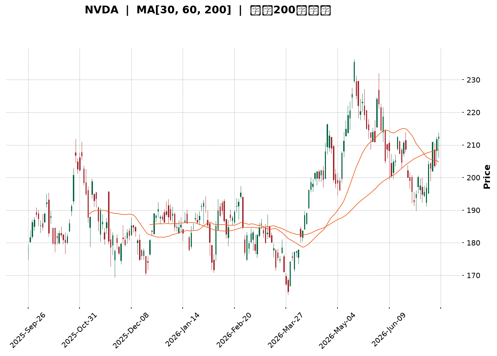
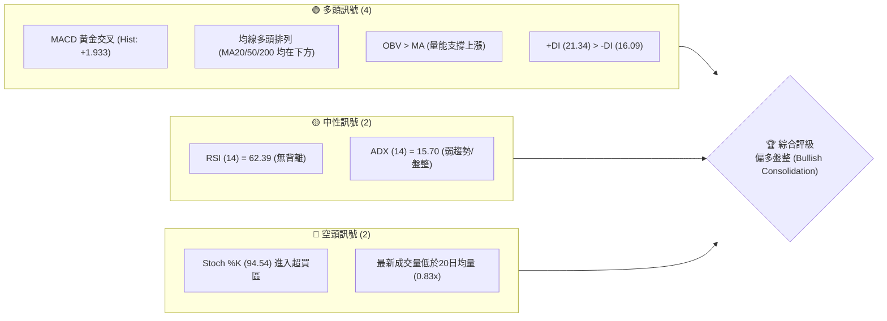
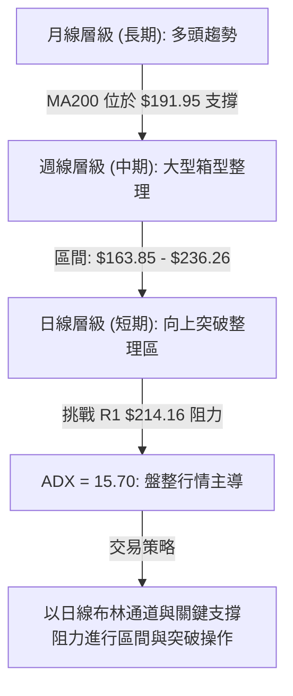
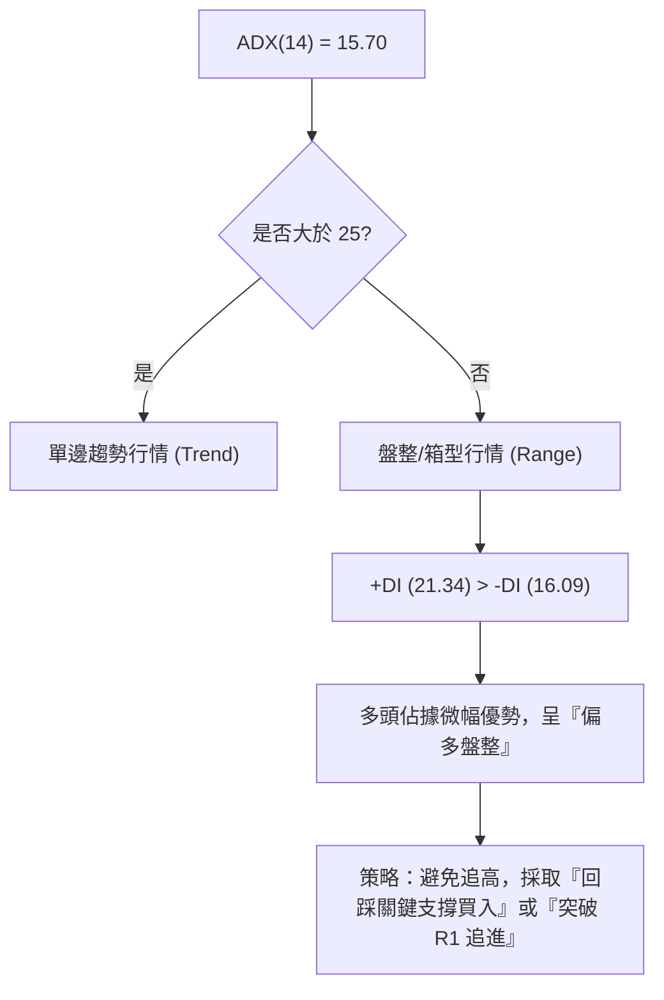
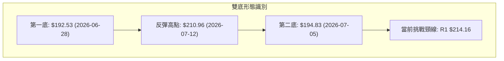
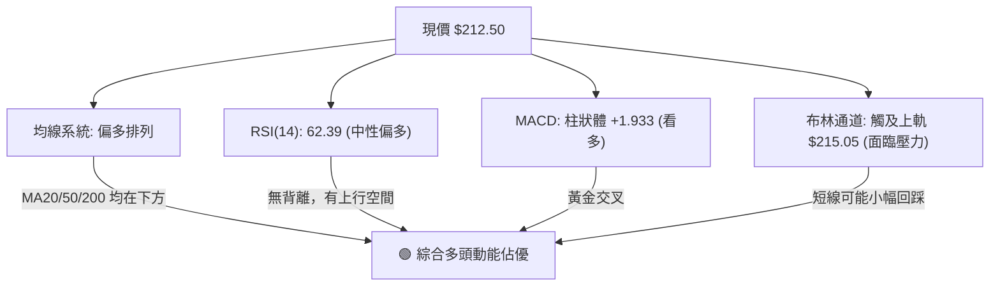
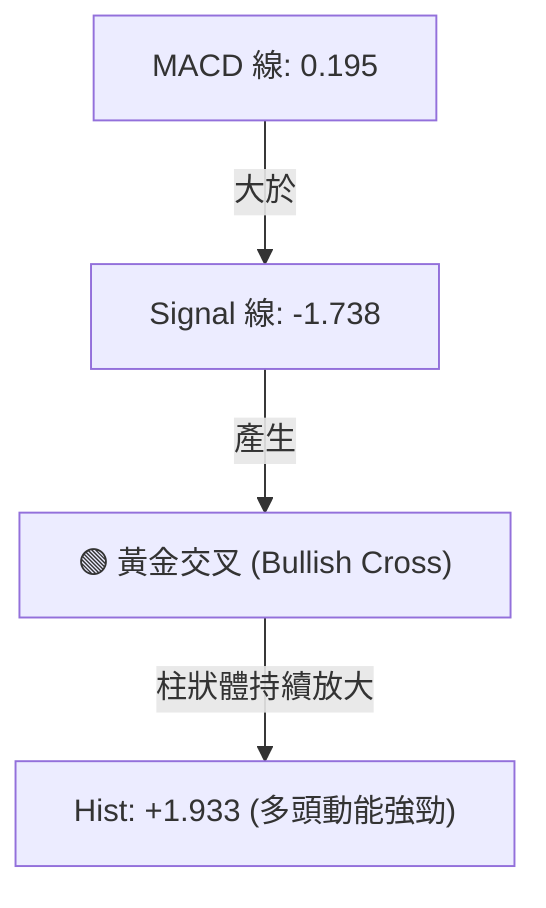
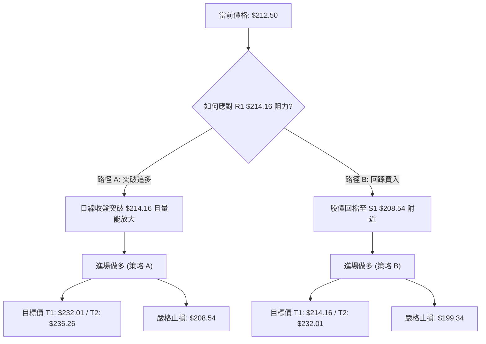
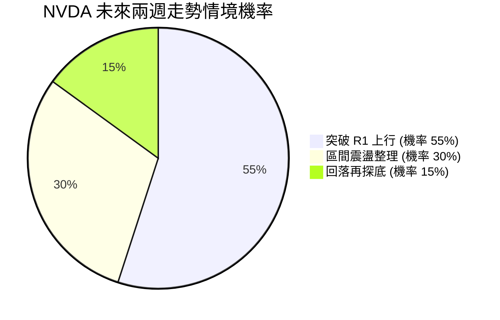
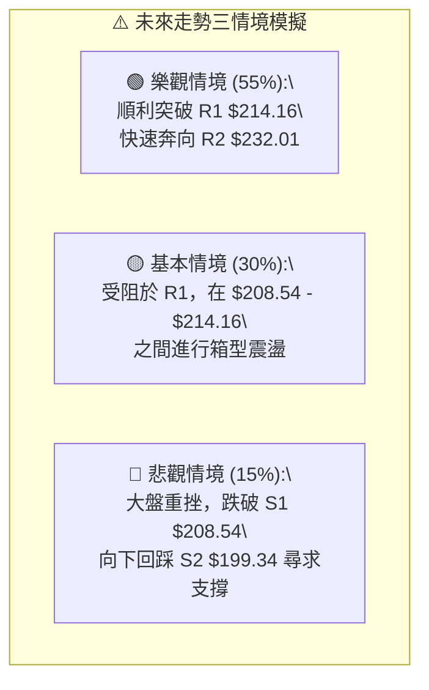

<details>
<summary>📊 靜態圖表 (點擊展開)</summary>

</details>

<html>
<head><meta charset="utf-8" /></head>
<body>
    <div style="height:500px; width:100%;">                        <script>window.PlotlyConfig = {MathJaxConfig: 'local'};</script>
        <script charset="utf-8" src="https://cdn.plot.ly/plotly-3.7.0.min.js" integrity="sha256-jvTGqxNp8AGWEcvNLVuKr+8j5dGe9Yw51LQkmDH+IYA=" crossorigin="anonymous"></script>                <div id="candlestick-chart" class="plotly-graph-div" style="height:100%; width:100%;"></div>            <script>                window.PLOTLYENV=window.PLOTLYENV || {};                                if (document.getElementById("candlestick-chart")) {                    Plotly.newPlot(                        "candlestick-chart",                        [{"close":{"dtype":"f8","bdata":"AAAAINE+ZkAAAADAybNmQAAAAGD0SmdAAAAAQAxgZ0AAAADgx5RnQAAAACAxbGdAAAAAgLcpZ0AAAADAvBlnQAAAAMDPm2dAAAAAAGQKaEAAAACAp91mQAAAAGCQgmdAAAAAAJ95ZkAAAADgOnNmQAAAAGCCsmZAAAAAYJLfZkAAAAAACc1mQAAAAEC8nWZAAAAAgJyBZkAAAADgsb1mQAAAACC6QGdAAAAA4N\u002fnZ0AAAAAgxBhpQAAAAEDX2GlAAAAAwDVUaUAAAAAgbUdpQAAAACC602lAAAAAIPvNaEAAAABgw15oQAAAAMDkemdAAAAAgCF9Z0AAAACgfNloQAAAACA\u002fHWhAAAAAYLMxaEAAAAAg51NnQAAAAECwvWdAAAAAAJhLZ0AAAACgIKRmQAAAAGAJSWdAAAAA4B2NZkAAAABg3lRmQAAAAMAoymZAAAAA4P0yZkAAAADg+IBmQAAAAADJGGZAAAAAQBt2ZkAAAADAUqdmQAAAAECPa2ZAAAAAAAPlZkAAAABgAsZmQAAAAABeKmdAAAAAYNQXZ0AAAADAy\u002fFmQAAAAOC0lmZAAAAAQNHZZUAAAABgaAJmQAAAAMAcMGZAAAAAoGpXZUAAAAAAsb1lQAAAAOCfmGZAAAAAYOvuZkAAAAAgWJ9nQAAAAOAqjGdAAAAAYIjJZ0AAAADgs39nQAAAACD4aWdAAAAA4LpIZ0AAAACg1pNnQAAAAMCBfGdAAAAAoGFgZ0AAAADgJZxnQAAAACARGmdAAAAAQFAUZ0AAAADg3hZnQAAAAECtMmdAAAAAIFfdZkAAAAAAT1pnQAAAAKAZQGdAAAAAYEw7ZkAAAAAgGONmQAAAAKCsE2dAAAAAwB9uZ0AAAABgxUdnQAAAAIBKiWdAAAAAoCzpZ0AAAADA0AhoQAAAAKC13GdAAAAA4EgsZ0AAAACA2YNmQAAAACBKv2VAAAAAoHV1ZUAAAABg5CVnQAAAACDfuWdAAAAAIO6JZ0AAAAAAMbpnQAAAAADLVmdAAAAAQMvSZkAAAABg1BdnQAAAACAIeGdAAAAAoHl1Z0AAAABA17JnQAAAACAi6mdAAAAAwK4TaEAAAADgS2poQAAAAMBFFWdAAAAAQCwfZkAAAAAgP8hmQAAAAMCUemZAAAAAACXaZkAAAACgu+NmQAAAAOBOM2ZAAAAAAK7NZkAAAAAAcBFnQAAAAKAHOmdAAAAAYKjdZkAAAAAASYFmQAAAAAA34GZAAAAAgPu2ZkAAAABgFIZmQAAAAKBES2ZAAAAAYPePZUAAAADg7+1lQAAAAIDf32VAAAAAgBpPZkAAAAAgTWFlQAAAAEBm6mRAAAAAgEmfZEAAAACgTcZlQAAAAAB08WVAAAAAIN8lZkAAAADA3C1mQAAAAMCQPGZAAAAAAMe7ZkAAAADgRPZmQAAAACAijWdAAAAAIN6iZ0AAAADg\u002f4hoQAAAAIBu1GhAAAAAoM\u002fDaEAAAAAgPy5pQAAAAIBkOmlAAAAA4Lb0aEAAAADgdEhpQAAAAAAL7WhAAAAAoOEAakAAAABgcwtrQAAAAMB\u002fnWpAAAAAgDQgakAAAABAzupoQAAAAOABx2hAAAAAQPfHaEAAAAAArohoQAAAAGDR8mlAAAAAAB9oakAAAAAgYt5qQAAAAMDnZWtAAAAAQLyQa0AAAADAJTJsQAAAAADmbm1AAAAAwNghbEAAAABg9cFrQAAAAEBNi2tAAAAAILfma0AAAACAJGhrQAAAAOCJ4mpAAAAAIITTakAAAADAR4tqQAAAAMAEwGpAAAAAYJ1cakAAAACAKQNsQAAAAIDw0WtAAAAAAADQakAAAADAHlVrQAAAAEAzo2lAAAAA4HoUakAAAACAFAZqQAAAAKBwDWlAAAAAANebaUAAAACAFKZpQAAAAGBmjmpAAAAAwB7taUAAAADAzJRpQAAAAIAUVmpAAAAAwMwUakAAAACgRwFpQAAAAAAA4GhAAAAAIK53aEAAAADA9RBoQAAAAEAKX2hAAAAAQOECaUAAAABgj7JoQAAAAGCPWmhAAAAAoJlxaEAAAACAwp1oQAAAAADXg2lAAAAAwPVYaUAAAABguF5qQAAAAMD1cGlAAAAAoJl5akAAAAAAAJBqQA=="},"high":{"dtype":"f8","bdata":"yfJUA1BxZkCh1+gQgPhmQFlnADeQY2dAq8jCm898Z0C8lgwW0NlnQEm5O6jCw2dAnBVcXbpfZ0C4vzetNppnQGvIAsN4q2dAlSMVo6NhaED7aU673WtoQAgFRVLFu2dAdSGsGBESZ0B68ozoTRRnQKX+OUl94WZACcY4MbL7ZkBTvTrJ2R5nQI3DfR3U0WZAd7NdRprmZkDH+OLLf9lmQD3ibN9lZ2dAfPSVbSz4Z0Ck3w8BhVxpQPITB2NufWpAkyXGgLe8aUAXn9cQkPZpQC\u002fJTdVDYmpAsuLqxrl2aUDr1AAsK1VpQHeAHNPIq2hA6N3aeZCCZ0A2L5c27vVoQAZwvWp5ZWhA4IcD0X50aED5aXC0RuZnQBZqH7yI2GdA4g1+tEuYZ0AUbXk6ERJnQPIRFqTcc2dA1T1wtwJ4aEAElJiaZQpnQOIGQzaF6GZAlSe2k9s9ZkBSrusYqtVmQPpDlrr4YWZAGT7rSECCZkAGjsNLjS1nQFsz\u002f4f2xmZAWS6mf3IJZ0CeO8Pr6w1nQI0zG+2reGdAO2v448wvZ0BVoAEpIShnQEUol\u002fsro2ZA+KDHCB3TZkDnIXoefEZmQCmb5PC4SGZApAD+VEv9ZUARddTQ7v1lQJT1y4hTp2ZAhwNF7\u002fD9ZkCABHDtLaNnQKRUj4HBlWdAjCXIkZEOaEAgLW0c9pBnQHsgsCdQmGdAhGMA3H3KZ0Caj6ooPRZoQKIX\u002fsOcLGhAbr2B7fL9Z0BkUzEyYeRnQGRwtR42qmdADHPYmp1DZ0B8Ppyei1xnQH8uMewvfGdAZRyEc4cHZ0DR1xFOAa9nQO3IX\u002fynxmdAgOOO3AzFZkDd7mgR7yRnQGMeJrouPmdAwPE\u002fHc+rZ0Dycu6td5xnQDb55dqXuGdAbuGTt7MDaEDLl+xR0SdoQB4NEDgZSGhAeXt\u002fki7CZ0CrmOfxYEFnQPFghjWPa2ZAnVHL0lgTZkCVgMnBtVhnQDeTyh+SLWhAkhd1TtsHaECCWC03ySBoQGJ+bRD5K2hAsxTh8rBoZ0CEYcIegV1nQD8\u002f+CVrxGdA70sAFmqGZ0CzhCEJJMNnQMOD2OzWNmhAO5awMRYxaEDxcI23dKxoQLH2JbG0QWhAkQl+HMPLZkCocGWYkedmQOKIZ2S\u002flWZAk6InLzMPZ0DSjpewvvpmQOTvDvMx0WZAANi9Z\u002f3VZkD9sKf1z0ZnQLuqKbbZbGdANi+c1TAXZ0CC8i2O8jtnQPaqM8YflWdAGcFpqOQlZ0Dq8840VOVmQKAvOLWneGZATBDA2a1BZkD42xr3MUVmQC35sqV5AGZAlCLmBkqgZkBu\u002fGGevglmQAXD\u002f7irWGVAVrQsbxYoZUA8GOrGVc1lQLb0II07JWZAxi7XaxEpZkBH0swRqDJmQOEypGK4QGZACqquLGshZ0D7zvjgs\u002ftmQB2GXA\u002fsuGdAf1CBCQ6uZ0AAAADg\u002f4hoQEgZy6hVBWlAthXeUcHzaECSTCnP4i5pQEpqcZPoPWlAN6V3gXJQaUAAAADgdEhpQLIKuIr3cmlAEzTxkIpWakDef+OGexJrQMZOjF9cz2pAdEGWqB2PakAdSLELxEFqQDU+\u002fBtwWGlAdh1WQdgvaUCNL\u002ft0OABpQLFvya3hAGpAYaBHoGu+akCFZYGUfDFrQE2XjZlRwWtAcsIYLarva0DiGut0ZHJsQDGB9t53iG1AEq2cUGDnbEBFUcKibrdsQF7Y4lf\u002fBmxALYABgrw7bED03KEhVGRsQK2xJTUWmGtAUGvO1qE9a0C2Mt930rxqQDlAZoOc6GpAVK12imcza0DdMuuCdhNsQO\u002fZEYhOAG1A5dP7ifDRa0AAAABAM7NrQAAAAADX22pAAAAAQApPakAAAADAzGxqQAAAAEAK52lAAAAAwB61aUAAAACAPeJpQAAAAGC4lmpAAAAAIK5vakAAAABguCZqQAAAAOB6bGpAAAAAIK6\u002fakAAAADgo3hpQAAAAKBwNWlAAAAAoJkZaUAAAACgmXFoQAAAAIDChWhAAAAAACkUaUAAAABAM\u002ftoQAAAAIDrAWlAAAAAoJmxaEAAAADAHs1oQAAAAMAepWlAAAAAQOGSaUAAAAAAAGBqQAAAAIA9UmpAAAAAoJmRakAAAACA67lqQA=="},"hovertemplate":"\u003cb\u003e%{x|%Y-%m-%d}\u003c\u002fb\u003e\u003cbr\u003e\u958b: $%{open:.2f}\u003cbr\u003e\u9ad8: $%{high:.2f}\u003cbr\u003e\u4f4e: $%{low:.2f}\u003cbr\u003e\u6536: $%{close:.2f}\u003cextra\u003e\u003c\u002fextra\u003e","low":{"dtype":"f8","bdata":"HrV7JKHWZUAtqPP244JmQFtKN1j2p2ZABnJ9uk31ZkBSfSgpQXpnQHY4AYCaJGdAw6G6TxbjZkBo6Sv6f\u002fhmQNz+dBGtSWdA6wfYwSHaZ0AfSiz1LbpmQMj5beAjN2dAxjKeERNvZkC71i6hDSJmQACgYAlQcWZAi29\u002fVaxwZkDGN\u002fu+869mQDcIPFFFcmZANfJWWx0RZkBjyUR783FmQJKnaw2F6GZAY5ObLhSGZ0BzeVxJTPVnQLvPA\u002fWckGlAqJaKEekkaUBdqPnhADppQMFUWWaKqWlAerdNDrG1aEAQ2fuX3UxoQNXQUx2QRGdAbsQk6tNVZkCw6MqCYTFoQF5su2jN4WdAU9pWnF7cZ0AxwEGptPNmQGNwsxEzi2ZAdMfxCroCZ0DmVBAYem1mQD1+J2Ib02ZAlHJhft5zZkA5Yrr2tZZlQOEI4pYqCGZADckHTbAqZUBulxQ0akBmQHIBrzfOCGZAtRmAPK6uZUDOeGOcqXhmQG0COiI4XGZA9XQNgbR3ZkDsgihYEZZmQCO5Lo+wxWZAAuM\u002fFxjjZkC3KDT9LrpmQGrdLmP0DGZAEoXuXQjNZUAGW+gSI9plQExWMGT71WVARpV86UdDZUDYTCjHinNlQMEyBGgBBGZAOD9XfxfEZkDyYcN4q9VmQJi6pyibS2dA7VV036t4Z0AgfZNt3zVnQIerWhZ5VmdACGSIGWlIZ0ABlVQj+4BnQBEqnSiLPWdATK30MPVSZ0BVvbeypUpnQKf1liWP72ZAYIJEoEfuZkAFjylpgdlmQLxy04ym5WZAsKRzOo2SZkAMeGLvS0NnQB1sM19OO2dAw75Al5gsZkApJ\u002fR42EVmQFUF2vSW9mZAH6eKG\u002fVSZ0ABu0QKbjhnQC8xkiQpL2dAKTPzw3qzZ0Df8uW9qjpnQAfj4XCnp2dAFKnpCPQUZ0DEeE5kfQBmQIMy\u002fCBrdmVApvKt20paZUDKyf7BZMxlQGqGZaY692ZA2aX4sIF8Z0CQmh0GSJFnQFsThqoMSWdAiSugLM2rZkAXPMVnxl5mQDTB4wwKUWdAr6OM+uEtZ0C3iiT41DZnQMzzq4grq2dA2JkXo35lZ0DOMACquTFoQMdNMxAOA2dAF39S1UgFZkDAmpgcrM1lQAAQrvyKFmZAxUgOneZ6ZkBpYMzcOTVmQONl2tpYE2ZAo2QggRPrZUCcfP+KOblmQPS\u002fb1GHB2dACzRwwTqxZkBgtNR0YHdmQI7MwcJcpmZAzztY4v2uZkDSrt+q14NmQKq8riq78mVAXf+SmKRwZUD0B2hEz9FlQCnvleLguGVAvrGss5wUZkCSDyXUGl5lQMcJKh0Z2mRAcSsrVYWCZEAwFCAzgNhkQOMxSYl90WVAvQWDqXRlZUBugOetxfFlQJFN45emrmVA1wyDOeKCZkCCIh+AHI1mQNKZDQu8AmdA1h+ty8IwZ0DezSidiNFnQF4uSXljcGhAZFs7GaByaECAcMZ7N+FoQGKQxH6Cs2hA\u002fy1cRJbYaEA60aFAlthoQPzCEnSxn2hA7pum7nnyaEDeUSBGb+RpQI7zW+Wk\u002fmlAoqMDzdPqaUCGFQ1s\u002f85oQKPe9S5\u002fnGhA6GHx6mxQaEDndXs7qHloQEOxhg0fzGhA0C\u002fnrk7IaUBITnynjJRqQKWa2w2DtGpAw9x9Am\u002fVakDcMxmA\u002fKlrQDjHMeoOoWxADnWjrFP\u002fa0CeCjSLtENrQHlOtZ8ANWtAG1bOMsmHa0BKbVwxpDVrQAmr6S2Z0WpAs\u002f0zRhp4akB32iKuLhFqQJzPd+UrX2pAQEtmmEtcakBGYzRWXe5qQO6g6ET0omtAgUryKVTIakAAAABACl9qQAAAAGCPimlAAAAAAADAaUAAAABA4epoQAAAAKBw\u002fWhAAAAAoEfxaEAAAACAFG5pQAAAAEDhCmpAAAAAoEfpaUAAAABgj2JpQAAAAAAA0GlAAAAAQAr3aUAAAAAAAABpQAAAAGCPkmhAAAAAACkEaEAAAABACudnQAAAAKCZuWdAAAAAIIVjaEAAAABgZi5oQAAAAEAzC2hAAAAAIK4\u002faEAAAADgeuRnQAAAAIDrYWhAAAAAYLjeaEAAAACgcD1pQAAAAAAAYGlAAAAAoJl5aUAAAACgR8FpQA=="},"name":"\u50f9\u683c","open":{"dtype":"f8","bdata":"AAJwdS0+ZkDZVCjRZ4ZmQHdHWlUju2ZATjPKHiEgZ0AcjmHXeKtnQBbi0D1enmdAbFnWSnAoZ0AjhhrVxD9nQGc5R6GiSmdABs5OLIb\u002fZ0A7DM6fbihoQCe6\u002fsZgd2dAHdbQqBsRZ0CRoIVDERJnQIIPEp7uv2ZAKBfZWGp+ZkC5KgADstxmQI3DfR3U0WZAFCWYphidZkDcfUToFYZmQP\u002fLG8Fi82ZAF9Qkh++3Z0BF6jBEuxloQKU+BPHh9mlAGC7VCnCcaUBZaFoN\u002fMVpQCcRQfoT+mlATC0yprlXaUAJpQq6idBoQLx2wPhuhWhAFsR\u002faUMVZ0ALpbk8kVtoQDxvR0EqXWhALtEg9w9vaEBbblTmz9lnQL9QJwcR1GZA7r4Jk3U3Z0CiRNFrr+RmQGf43i2\u002fEWdA5CAEnWl2aEB3OIzfSqBmQF89NS5daGZAqGH5ff3VZUB5BTy0waxmQK4IkeYFWWZAOraQVzLRZUDiKpYe6bBmQKBvtNMtm2ZArM9JkMKsZkBjt\u002fK6T\u002fVmQD41DUpczWZA8JO7vK8qZ0Bsi+Rf1BdnQEjHmpzugWZAkH50uXWcZkCf17jIJDdmQI\u002fx1fFyAWZA93Wh4VX8ZUB3X5\u002f7J8plQH9a6nyNDmZAIsRrNEX2ZkBhvehF6NdmQN20se\u002fAdmdAi3ViVgm2Z0Dfxu4WZ29nQDoAsqNXgGdAiVgcvdmqZ0AEStO+erNnQI3ZKk3Y8GdA3WWxpDbJZ0D5h5Gj44pnQNSvvQImnGdAWYfuTVgbZ0DPGTfK5d9mQAcaTNXJGGdAo0Az+Q0DZ0CiRRfdukhnQJwj324wm2dALFDrZrW1ZkAwAWfcnlpmQMGL60XMEGdAOe5O0rBoZ0Akljf90l1nQDH3JYZhYGdAvBWuHi\u002fhZ0AZxgLNa+NnQJurnTNE32dAnmcNQhpfZ0BJzot+a0BnQNA8F2i5Z2ZAcxWXr\u002fDWZUBHoFomMQ9mQFhxbg4jAWdABfCbKLPkZ0Dj\u002fIrM5QZoQNR9InpvGWhAonj7RQ1oZ0BfLChC6rBmQAkYxlCkkGdAYr30waBaZ0A9uq+u90pnQG20OL9W5WdASU1hMjfoZ0BmYNPT0UZoQHo3NyQRQWhA7wfRO++gZkBFi2Frf9llQJGijdG4SGZAl+Q\u002f0guHZkAC18GnYJ5mQKaKOXfec2ZA1y+XtKoTZkCdmaqGsMVmQGcl9cQxNmdA\u002f\u002fdicr76ZkA1rJ8WjRZnQJyNU2I52GZAMBB5pgYbZ0BpNgfqj8hmQLC6xj6wOWZAqhKBdF45ZkD2VgNttyFmQOYnVAcM1GVAQAFVUZocZkD524VwrvtlQOPPNbmqOWVAPurZMqwSZUDZ0rn60dhkQIezrZ1x+WVAiG3yb1h\u002fZUAlguAzhR5mQDG0LTrQ8GVALagOjCAJZ0B9UKYdG7RmQBgtp9INA2dAw+mxpwc6Z0DjSUlSxdNnQDPPQ1j1iWhANwUkpmemaEDl9bVZWvVoQE\u002f9JPbo92hAu3oQa6E8aUD2j2JmMRhpQDrSXJstR2lA1VppYEX3aEDc5Ctg\u002fSxqQHlfCVjgJ2pAMIds+XmOakB\u002fBQpz8DVqQJslD0N2IWlAYNW5ZZHoaEBcG\u002fLrLOJoQJESkJgI9WhAA43FYh4DakAnH7MxBplqQEgaqV9OuWpA5KtEZHVJa0AapTp1YRVsQAkZdEujsmxANyuJyMKvbEBIKCTgRrNsQMXP+ZCoa2tApAADJHLda0BgLQK9\u002f8BrQC2BsiGSlGtAs7OVmjYJa0DOUxwB3btqQDBJ\u002fdIWYWpAw2DsEZHKakBofffMUu9qQNfkY+tLXWxAT2iGx8eua0AAAADAHr1qQAAAAMD10GpAAAAAgMJFakAAAAAA11NqQAAAAIDCjWlAAAAAIK4vaUAAAAAghZtpQAAAAKBwHWpAAAAAgMJlakAAAADA9RBqQAAAAGCP6mlAAAAAgBRuakAAAACgcEVpQAAAAADXA2lAAAAAYI8CaUAAAAAA1yNoQAAAAEAzO2hAAAAAIK6naEAAAABgZoZoQAAAAOB6pGhAAAAAoHBNaEAAAAAA1wtoQAAAAIDCZWhAAAAAYLiOaUAAAAAAAEBpQAAAAKBHEWpAAAAAYGYGakAAAADgUYBqQA=="},"x":["2025-09-26T00:00:00-04:00","2025-09-29T00:00:00-04:00","2025-09-30T00:00:00-04:00","2025-10-01T00:00:00-04:00","2025-10-02T00:00:00-04:00","2025-10-03T00:00:00-04:00","2025-10-06T00:00:00-04:00","2025-10-07T00:00:00-04:00","2025-10-08T00:00:00-04:00","2025-10-09T00:00:00-04:00","2025-10-10T00:00:00-04:00","2025-10-13T00:00:00-04:00","2025-10-14T00:00:00-04:00","2025-10-15T00:00:00-04:00","2025-10-16T00:00:00-04:00","2025-10-17T00:00:00-04:00","2025-10-20T00:00:00-04:00","2025-10-21T00:00:00-04:00","2025-10-22T00:00:00-04:00","2025-10-23T00:00:00-04:00","2025-10-24T00:00:00-04:00","2025-10-27T00:00:00-04:00","2025-10-28T00:00:00-04:00","2025-10-29T00:00:00-04:00","2025-10-30T00:00:00-04:00","2025-10-31T00:00:00-04:00","2025-11-03T00:00:00-05:00","2025-11-04T00:00:00-05:00","2025-11-05T00:00:00-05:00","2025-11-06T00:00:00-05:00","2025-11-07T00:00:00-05:00","2025-11-10T00:00:00-05:00","2025-11-11T00:00:00-05:00","2025-11-12T00:00:00-05:00","2025-11-13T00:00:00-05:00","2025-11-14T00:00:00-05:00","2025-11-17T00:00:00-05:00","2025-11-18T00:00:00-05:00","2025-11-19T00:00:00-05:00","2025-11-20T00:00:00-05:00","2025-11-21T00:00:00-05:00","2025-11-24T00:00:00-05:00","2025-11-25T00:00:00-05:00","2025-11-26T00:00:00-05:00","2025-11-28T00:00:00-05:00","2025-12-01T00:00:00-05:00","2025-12-02T00:00:00-05:00","2025-12-03T00:00:00-05:00","2025-12-04T00:00:00-05:00","2025-12-05T00:00:00-05:00","2025-12-08T00:00:00-05:00","2025-12-09T00:00:00-05:00","2025-12-10T00:00:00-05:00","2025-12-11T00:00:00-05:00","2025-12-12T00:00:00-05:00","2025-12-15T00:00:00-05:00","2025-12-16T00:00:00-05:00","2025-12-17T00:00:00-05:00","2025-12-18T00:00:00-05:00","2025-12-19T00:00:00-05:00","2025-12-22T00:00:00-05:00","2025-12-23T00:00:00-05:00","2025-12-24T00:00:00-05:00","2025-12-26T00:00:00-05:00","2025-12-29T00:00:00-05:00","2025-12-30T00:00:00-05:00","2025-12-31T00:00:00-05:00","2026-01-02T00:00:00-05:00","2026-01-05T00:00:00-05:00","2026-01-06T00:00:00-05:00","2026-01-07T00:00:00-05:00","2026-01-08T00:00:00-05:00","2026-01-09T00:00:00-05:00","2026-01-12T00:00:00-05:00","2026-01-13T00:00:00-05:00","2026-01-14T00:00:00-05:00","2026-01-15T00:00:00-05:00","2026-01-16T00:00:00-05:00","2026-01-20T00:00:00-05:00","2026-01-21T00:00:00-05:00","2026-01-22T00:00:00-05:00","2026-01-23T00:00:00-05:00","2026-01-26T00:00:00-05:00","2026-01-27T00:00:00-05:00","2026-01-28T00:00:00-05:00","2026-01-29T00:00:00-05:00","2026-01-30T00:00:00-05:00","2026-02-02T00:00:00-05:00","2026-02-03T00:00:00-05:00","2026-02-04T00:00:00-05:00","2026-02-05T00:00:00-05:00","2026-02-06T00:00:00-05:00","2026-02-09T00:00:00-05:00","2026-02-10T00:00:00-05:00","2026-02-11T00:00:00-05:00","2026-02-12T00:00:00-05:00","2026-02-13T00:00:00-05:00","2026-02-17T00:00:00-05:00","2026-02-18T00:00:00-05:00","2026-02-19T00:00:00-05:00","2026-02-20T00:00:00-05:00","2026-02-23T00:00:00-05:00","2026-02-24T00:00:00-05:00","2026-02-25T00:00:00-05:00","2026-02-26T00:00:00-05:00","2026-02-27T00:00:00-05:00","2026-03-02T00:00:00-05:00","2026-03-03T00:00:00-05:00","2026-03-04T00:00:00-05:00","2026-03-05T00:00:00-05:00","2026-03-06T00:00:00-05:00","2026-03-09T00:00:00-04:00","2026-03-10T00:00:00-04:00","2026-03-11T00:00:00-04:00","2026-03-12T00:00:00-04:00","2026-03-13T00:00:00-04:00","2026-03-16T00:00:00-04:00","2026-03-17T00:00:00-04:00","2026-03-18T00:00:00-04:00","2026-03-19T00:00:00-04:00","2026-03-20T00:00:00-04:00","2026-03-23T00:00:00-04:00","2026-03-24T00:00:00-04:00","2026-03-25T00:00:00-04:00","2026-03-26T00:00:00-04:00","2026-03-27T00:00:00-04:00","2026-03-30T00:00:00-04:00","2026-03-31T00:00:00-04:00","2026-04-01T00:00:00-04:00","2026-04-02T00:00:00-04:00","2026-04-06T00:00:00-04:00","2026-04-07T00:00:00-04:00","2026-04-08T00:00:00-04:00","2026-04-09T00:00:00-04:00","2026-04-10T00:00:00-04:00","2026-04-13T00:00:00-04:00","2026-04-14T00:00:00-04:00","2026-04-15T00:00:00-04:00","2026-04-16T00:00:00-04:00","2026-04-17T00:00:00-04:00","2026-04-20T00:00:00-04:00","2026-04-21T00:00:00-04:00","2026-04-22T00:00:00-04:00","2026-04-23T00:00:00-04:00","2026-04-24T00:00:00-04:00","2026-04-27T00:00:00-04:00","2026-04-28T00:00:00-04:00","2026-04-29T00:00:00-04:00","2026-04-30T00:00:00-04:00","2026-05-01T00:00:00-04:00","2026-05-04T00:00:00-04:00","2026-05-05T00:00:00-04:00","2026-05-06T00:00:00-04:00","2026-05-07T00:00:00-04:00","2026-05-08T00:00:00-04:00","2026-05-11T00:00:00-04:00","2026-05-12T00:00:00-04:00","2026-05-13T00:00:00-04:00","2026-05-14T00:00:00-04:00","2026-05-15T00:00:00-04:00","2026-05-18T00:00:00-04:00","2026-05-19T00:00:00-04:00","2026-05-20T00:00:00-04:00","2026-05-21T00:00:00-04:00","2026-05-22T00:00:00-04:00","2026-05-26T00:00:00-04:00","2026-05-27T00:00:00-04:00","2026-05-28T00:00:00-04:00","2026-05-29T00:00:00-04:00","2026-06-01T00:00:00-04:00","2026-06-02T00:00:00-04:00","2026-06-03T00:00:00-04:00","2026-06-04T00:00:00-04:00","2026-06-05T00:00:00-04:00","2026-06-08T00:00:00-04:00","2026-06-09T00:00:00-04:00","2026-06-10T00:00:00-04:00","2026-06-11T00:00:00-04:00","2026-06-12T00:00:00-04:00","2026-06-15T00:00:00-04:00","2026-06-16T00:00:00-04:00","2026-06-17T00:00:00-04:00","2026-06-18T00:00:00-04:00","2026-06-22T00:00:00-04:00","2026-06-23T00:00:00-04:00","2026-06-24T00:00:00-04:00","2026-06-25T00:00:00-04:00","2026-06-26T00:00:00-04:00","2026-06-29T00:00:00-04:00","2026-06-30T00:00:00-04:00","2026-07-01T00:00:00-04:00","2026-07-02T00:00:00-04:00","2026-07-06T00:00:00-04:00","2026-07-07T00:00:00-04:00","2026-07-08T00:00:00-04:00","2026-07-09T00:00:00-04:00","2026-07-10T00:00:00-04:00","2026-07-13T00:00:00-04:00","2026-07-14T00:00:00-04:00","2026-07-15T00:00:00-04:00"],"type":"candlestick"},{"hovertemplate":"MA30: $%{y:.2f}\u003cextra\u003e\u003c\u002fextra\u003e","line":{"color":"#2196F3","dash":"dash","width":2},"mode":"lines","name":"MA30","x":["2025-09-26T00:00:00-04:00","2025-09-29T00:00:00-04:00","2025-09-30T00:00:00-04:00","2025-10-01T00:00:00-04:00","2025-10-02T00:00:00-04:00","2025-10-03T00:00:00-04:00","2025-10-06T00:00:00-04:00","2025-10-07T00:00:00-04:00","2025-10-08T00:00:00-04:00","2025-10-09T00:00:00-04:00","2025-10-10T00:00:00-04:00","2025-10-13T00:00:00-04:00","2025-10-14T00:00:00-04:00","2025-10-15T00:00:00-04:00","2025-10-16T00:00:00-04:00","2025-10-17T00:00:00-04:00","2025-10-20T00:00:00-04:00","2025-10-21T00:00:00-04:00","2025-10-22T00:00:00-04:00","2025-10-23T00:00:00-04:00","2025-10-24T00:00:00-04:00","2025-10-27T00:00:00-04:00","2025-10-28T00:00:00-04:00","2025-10-29T00:00:00-04:00","2025-10-30T00:00:00-04:00","2025-10-31T00:00:00-04:00","2025-11-03T00:00:00-05:00","2025-11-04T00:00:00-05:00","2025-11-05T00:00:00-05:00","2025-11-06T00:00:00-05:00","2025-11-07T00:00:00-05:00","2025-11-10T00:00:00-05:00","2025-11-11T00:00:00-05:00","2025-11-12T00:00:00-05:00","2025-11-13T00:00:00-05:00","2025-11-14T00:00:00-05:00","2025-11-17T00:00:00-05:00","2025-11-18T00:00:00-05:00","2025-11-19T00:00:00-05:00","2025-11-20T00:00:00-05:00","2025-11-21T00:00:00-05:00","2025-11-24T00:00:00-05:00","2025-11-25T00:00:00-05:00","2025-11-26T00:00:00-05:00","2025-11-28T00:00:00-05:00","2025-12-01T00:00:00-05:00","2025-12-02T00:00:00-05:00","2025-12-03T00:00:00-05:00","2025-12-04T00:00:00-05:00","2025-12-05T00:00:00-05:00","2025-12-08T00:00:00-05:00","2025-12-09T00:00:00-05:00","2025-12-10T00:00:00-05:00","2025-12-11T00:00:00-05:00","2025-12-12T00:00:00-05:00","2025-12-15T00:00:00-05:00","2025-12-16T00:00:00-05:00","2025-12-17T00:00:00-05:00","2025-12-18T00:00:00-05:00","2025-12-19T00:00:00-05:00","2025-12-22T00:00:00-05:00","2025-12-23T00:00:00-05:00","2025-12-24T00:00:00-05:00","2025-12-26T00:00:00-05:00","2025-12-29T00:00:00-05:00","2025-12-30T00:00:00-05:00","2025-12-31T00:00:00-05:00","2026-01-02T00:00:00-05:00","2026-01-05T00:00:00-05:00","2026-01-06T00:00:00-05:00","2026-01-07T00:00:00-05:00","2026-01-08T00:00:00-05:00","2026-01-09T00:00:00-05:00","2026-01-12T00:00:00-05:00","2026-01-13T00:00:00-05:00","2026-01-14T00:00:00-05:00","2026-01-15T00:00:00-05:00","2026-01-16T00:00:00-05:00","2026-01-20T00:00:00-05:00","2026-01-21T00:00:00-05:00","2026-01-22T00:00:00-05:00","2026-01-23T00:00:00-05:00","2026-01-26T00:00:00-05:00","2026-01-27T00:00:00-05:00","2026-01-28T00:00:00-05:00","2026-01-29T00:00:00-05:00","2026-01-30T00:00:00-05:00","2026-02-02T00:00:00-05:00","2026-02-03T00:00:00-05:00","2026-02-04T00:00:00-05:00","2026-02-05T00:00:00-05:00","2026-02-06T00:00:00-05:00","2026-02-09T00:00:00-05:00","2026-02-10T00:00:00-05:00","2026-02-11T00:00:00-05:00","2026-02-12T00:00:00-05:00","2026-02-13T00:00:00-05:00","2026-02-17T00:00:00-05:00","2026-02-18T00:00:00-05:00","2026-02-19T00:00:00-05:00","2026-02-20T00:00:00-05:00","2026-02-23T00:00:00-05:00","2026-02-24T00:00:00-05:00","2026-02-25T00:00:00-05:00","2026-02-26T00:00:00-05:00","2026-02-27T00:00:00-05:00","2026-03-02T00:00:00-05:00","2026-03-03T00:00:00-05:00","2026-03-04T00:00:00-05:00","2026-03-05T00:00:00-05:00","2026-03-06T00:00:00-05:00","2026-03-09T00:00:00-04:00","2026-03-10T00:00:00-04:00","2026-03-11T00:00:00-04:00","2026-03-12T00:00:00-04:00","2026-03-13T00:00:00-04:00","2026-03-16T00:00:00-04:00","2026-03-17T00:00:00-04:00","2026-03-18T00:00:00-04:00","2026-03-19T00:00:00-04:00","2026-03-20T00:00:00-04:00","2026-03-23T00:00:00-04:00","2026-03-24T00:00:00-04:00","2026-03-25T00:00:00-04:00","2026-03-26T00:00:00-04:00","2026-03-27T00:00:00-04:00","2026-03-30T00:00:00-04:00","2026-03-31T00:00:00-04:00","2026-04-01T00:00:00-04:00","2026-04-02T00:00:00-04:00","2026-04-06T00:00:00-04:00","2026-04-07T00:00:00-04:00","2026-04-08T00:00:00-04:00","2026-04-09T00:00:00-04:00","2026-04-10T00:00:00-04:00","2026-04-13T00:00:00-04:00","2026-04-14T00:00:00-04:00","2026-04-15T00:00:00-04:00","2026-04-16T00:00:00-04:00","2026-04-17T00:00:00-04:00","2026-04-20T00:00:00-04:00","2026-04-21T00:00:00-04:00","2026-04-22T00:00:00-04:00","2026-04-23T00:00:00-04:00","2026-04-24T00:00:00-04:00","2026-04-27T00:00:00-04:00","2026-04-28T00:00:00-04:00","2026-04-29T00:00:00-04:00","2026-04-30T00:00:00-04:00","2026-05-01T00:00:00-04:00","2026-05-04T00:00:00-04:00","2026-05-05T00:00:00-04:00","2026-05-06T00:00:00-04:00","2026-05-07T00:00:00-04:00","2026-05-08T00:00:00-04:00","2026-05-11T00:00:00-04:00","2026-05-12T00:00:00-04:00","2026-05-13T00:00:00-04:00","2026-05-14T00:00:00-04:00","2026-05-15T00:00:00-04:00","2026-05-18T00:00:00-04:00","2026-05-19T00:00:00-04:00","2026-05-20T00:00:00-04:00","2026-05-21T00:00:00-04:00","2026-05-22T00:00:00-04:00","2026-05-26T00:00:00-04:00","2026-05-27T00:00:00-04:00","2026-05-28T00:00:00-04:00","2026-05-29T00:00:00-04:00","2026-06-01T00:00:00-04:00","2026-06-02T00:00:00-04:00","2026-06-03T00:00:00-04:00","2026-06-04T00:00:00-04:00","2026-06-05T00:00:00-04:00","2026-06-08T00:00:00-04:00","2026-06-09T00:00:00-04:00","2026-06-10T00:00:00-04:00","2026-06-11T00:00:00-04:00","2026-06-12T00:00:00-04:00","2026-06-15T00:00:00-04:00","2026-06-16T00:00:00-04:00","2026-06-17T00:00:00-04:00","2026-06-18T00:00:00-04:00","2026-06-22T00:00:00-04:00","2026-06-23T00:00:00-04:00","2026-06-24T00:00:00-04:00","2026-06-25T00:00:00-04:00","2026-06-26T00:00:00-04:00","2026-06-29T00:00:00-04:00","2026-06-30T00:00:00-04:00","2026-07-01T00:00:00-04:00","2026-07-02T00:00:00-04:00","2026-07-06T00:00:00-04:00","2026-07-07T00:00:00-04:00","2026-07-08T00:00:00-04:00","2026-07-09T00:00:00-04:00","2026-07-10T00:00:00-04:00","2026-07-13T00:00:00-04:00","2026-07-14T00:00:00-04:00","2026-07-15T00:00:00-04:00"],"y":{"dtype":"f8","bdata":"AAAAAAAA+H8AAAAAAAD4fwAAAAAAAPh\u002fAAAAAAAA+H8AAAAAAAD4fwAAAAAAAPh\u002fAAAAAAAA+H8AAAAAAAD4fwAAAAAAAPh\u002fAAAAAAAA+H8AAAAAAAD4fwAAAAAAAPh\u002fAAAAAAAA+H8AAAAAAAD4fwAAAAAAAPh\u002fAAAAAAAA+H8AAAAAAAD4fwAAAAAAAPh\u002fAAAAAAAA+H8AAAAAAAD4fwAAAAAAAPh\u002fAAAAAAAA+H8AAAAAAAD4fwAAAAAAAPh\u002fAAAAAAAA+H8AAAAAAAD4fwAAAAAAAPh\u002fAAAAAAAA+H8AAAAAAAD4fyIiIgJKk2dAmpmZSeadZ0DNzMwMObBnQKuqqoo7t2dARERElDi+Z0BERET0DrxnQERERGTGvmdAmpmZeee\u002fZ0Dv7u7e+7tnQGZmZoY5uWdAzczM\u002fIOsZ0AAAADA9KdnQJqZmSnPoWdAVVVVdXSfZ0CamZm56Z9nQCIiIvLJmmdAmpmZ+UWXZ0CrqqoqBJZnQAAAAABYlGdAd3d3N6iXZ0Crqqoq75dnQM3MzFwwl2dAvLu7C0GQZ0Dv7u5u431nQM3MzHwVYmdAiYiIeGdEZ0CamZnpgChnQCIiIiJzCWdAiYiIyOXrZkDNzMw8dtVmQImIiGjrzWZA7+7u3i3JZkAAAAAwtb5mQN7d3S3fuWZAd3d3R2a2ZkCamZkJ3LdmQCIiIqIRtWZAIiIiMvm0ZkCrqqq69rxmQBEREfGtvmZAvLu7u7jFZkBERESEodBmQFVVVWVL02ZAREREJM7aZkBmZmZGzd9mQAAAAMAy6WZA3t3draPsZkBVVVUFm\u002fJmQDMzM7Ow+WZAq6qqegj0ZkC8u7urAPVmQGZmZgY\u002f9GZAd3d3Zx\u002f3ZkDv7u4O\u002fflmQM3MzBwTAmdAmpmZOacTZ0CJiIj47iRnQFVVVVU4M2dAd3d3V9lCZ0CrqqpKdElnQDMzM7M1QmdAVVVVtaA1Z0ARERFRlDFnQDMzM1MaM2dAVVVVlfswZ0AAAACw7jJnQM3MzAxLMmdAmpmZqVwuZ0BERER0OipnQEREREQUKmdARERERMgqZ0CamZnpiStnQJqZmWl5MmdAAAAAkPw6Z0Dv7u7+TEZnQERERBRSRWdAERERUfs+Z0C8u7vrHDpnQM3MzGyHM2dAmpmZ6dI4Z0DNzMxc2DhnQFVVVcVdMWdAVVVVpQQsZ0AAAAAANSpnQDMzM6OQJ2dARERE1KUeZ0BVVVXFmBFnQGZmZiYuCWdAvLu7K0UFZ0AzMzMzWAVnQO\u002fu7q4CCmdAAAAA4OQKZ0C8u7vbfgBnQCIiIhKy8GZAzczMjDPmZkBERET0K9JmQN7d3e19vWZAZmZmVrWqZkDNzMwcdZ9mQM3MzCxwkmZAvLu7W0CHZkAzMzMTSXpmQN7d3W33a2ZAVVVVxYBgZkAzMzMjGlRmQDMzM\u002fMYWGZAd3d3RwVlZkAzMzOj+nNmQN7d3W0KiGZAq6qq6lyYZkBVVVXV6atmQDMzM+O\u002fxWZAzczMDB7YZkDNzMycBOtmQJqZmbmE+WZAZmZm5koUZ0C8u7sLCDtnQO\u002fu7t7wWmdA7+7uXgx4Z0B3d3f3eIxnQBEREfGpoWdAd3d3ZyG9Z0ARERHxWtNnQM3MzLwe9mdAq6qqWhYZaEAzMzNj7EdoQBEREYE9f2hAAAAAEH26aECJiIiISPFoQLy7u7syMWlAZmZmlkNkaUAiIiIC3pNpQO\u002fu7o4owWlAERERoUHtaUC8u7t7LxNqQAAAAOChL2pAvLu7m9pKakAzMzMj\u002f1tqQDMzMwNibGpAiYiIeAJ6akCrqqpqLJJqQO\u002fu7q5KqGpAREREdCK4akBVVVWVn8lqQN7d3f2xz2pAvLu7O1nQakDv7u7eosdqQImIiAhNumpAREREhOO1akB3d3eXIbxqQLy7u5tPy2pAERERMRXVakBmZmYmBd5qQAAAADBU4WpA3t3dLY3eakBVVVXlpc5qQLy7uyseuWpARERExK6eakDv7u5ucXtqQBEREXE\u002fUGpAd3d3l501akB3d3eXgBtqQAAAABBHAGpAREREFMbiaUAzMzMD9sppQCIiImJFv2lAmpmZCaeyaUCrqqrKKrFpQAAAAKD\u002fpWlAd3d39\u002famaUB3d3e3l5ppQA=="},"type":"scatter"},{"hovertemplate":"MA60: $%{y:.2f}\u003cextra\u003e\u003c\u002fextra\u003e","line":{"color":"#9C27B0","dash":"dash","width":2},"mode":"lines","name":"MA60","x":["2025-09-26T00:00:00-04:00","2025-09-29T00:00:00-04:00","2025-09-30T00:00:00-04:00","2025-10-01T00:00:00-04:00","2025-10-02T00:00:00-04:00","2025-10-03T00:00:00-04:00","2025-10-06T00:00:00-04:00","2025-10-07T00:00:00-04:00","2025-10-08T00:00:00-04:00","2025-10-09T00:00:00-04:00","2025-10-10T00:00:00-04:00","2025-10-13T00:00:00-04:00","2025-10-14T00:00:00-04:00","2025-10-15T00:00:00-04:00","2025-10-16T00:00:00-04:00","2025-10-17T00:00:00-04:00","2025-10-20T00:00:00-04:00","2025-10-21T00:00:00-04:00","2025-10-22T00:00:00-04:00","2025-10-23T00:00:00-04:00","2025-10-24T00:00:00-04:00","2025-10-27T00:00:00-04:00","2025-10-28T00:00:00-04:00","2025-10-29T00:00:00-04:00","2025-10-30T00:00:00-04:00","2025-10-31T00:00:00-04:00","2025-11-03T00:00:00-05:00","2025-11-04T00:00:00-05:00","2025-11-05T00:00:00-05:00","2025-11-06T00:00:00-05:00","2025-11-07T00:00:00-05:00","2025-11-10T00:00:00-05:00","2025-11-11T00:00:00-05:00","2025-11-12T00:00:00-05:00","2025-11-13T00:00:00-05:00","2025-11-14T00:00:00-05:00","2025-11-17T00:00:00-05:00","2025-11-18T00:00:00-05:00","2025-11-19T00:00:00-05:00","2025-11-20T00:00:00-05:00","2025-11-21T00:00:00-05:00","2025-11-24T00:00:00-05:00","2025-11-25T00:00:00-05:00","2025-11-26T00:00:00-05:00","2025-11-28T00:00:00-05:00","2025-12-01T00:00:00-05:00","2025-12-02T00:00:00-05:00","2025-12-03T00:00:00-05:00","2025-12-04T00:00:00-05:00","2025-12-05T00:00:00-05:00","2025-12-08T00:00:00-05:00","2025-12-09T00:00:00-05:00","2025-12-10T00:00:00-05:00","2025-12-11T00:00:00-05:00","2025-12-12T00:00:00-05:00","2025-12-15T00:00:00-05:00","2025-12-16T00:00:00-05:00","2025-12-17T00:00:00-05:00","2025-12-18T00:00:00-05:00","2025-12-19T00:00:00-05:00","2025-12-22T00:00:00-05:00","2025-12-23T00:00:00-05:00","2025-12-24T00:00:00-05:00","2025-12-26T00:00:00-05:00","2025-12-29T00:00:00-05:00","2025-12-30T00:00:00-05:00","2025-12-31T00:00:00-05:00","2026-01-02T00:00:00-05:00","2026-01-05T00:00:00-05:00","2026-01-06T00:00:00-05:00","2026-01-07T00:00:00-05:00","2026-01-08T00:00:00-05:00","2026-01-09T00:00:00-05:00","2026-01-12T00:00:00-05:00","2026-01-13T00:00:00-05:00","2026-01-14T00:00:00-05:00","2026-01-15T00:00:00-05:00","2026-01-16T00:00:00-05:00","2026-01-20T00:00:00-05:00","2026-01-21T00:00:00-05:00","2026-01-22T00:00:00-05:00","2026-01-23T00:00:00-05:00","2026-01-26T00:00:00-05:00","2026-01-27T00:00:00-05:00","2026-01-28T00:00:00-05:00","2026-01-29T00:00:00-05:00","2026-01-30T00:00:00-05:00","2026-02-02T00:00:00-05:00","2026-02-03T00:00:00-05:00","2026-02-04T00:00:00-05:00","2026-02-05T00:00:00-05:00","2026-02-06T00:00:00-05:00","2026-02-09T00:00:00-05:00","2026-02-10T00:00:00-05:00","2026-02-11T00:00:00-05:00","2026-02-12T00:00:00-05:00","2026-02-13T00:00:00-05:00","2026-02-17T00:00:00-05:00","2026-02-18T00:00:00-05:00","2026-02-19T00:00:00-05:00","2026-02-20T00:00:00-05:00","2026-02-23T00:00:00-05:00","2026-02-24T00:00:00-05:00","2026-02-25T00:00:00-05:00","2026-02-26T00:00:00-05:00","2026-02-27T00:00:00-05:00","2026-03-02T00:00:00-05:00","2026-03-03T00:00:00-05:00","2026-03-04T00:00:00-05:00","2026-03-05T00:00:00-05:00","2026-03-06T00:00:00-05:00","2026-03-09T00:00:00-04:00","2026-03-10T00:00:00-04:00","2026-03-11T00:00:00-04:00","2026-03-12T00:00:00-04:00","2026-03-13T00:00:00-04:00","2026-03-16T00:00:00-04:00","2026-03-17T00:00:00-04:00","2026-03-18T00:00:00-04:00","2026-03-19T00:00:00-04:00","2026-03-20T00:00:00-04:00","2026-03-23T00:00:00-04:00","2026-03-24T00:00:00-04:00","2026-03-25T00:00:00-04:00","2026-03-26T00:00:00-04:00","2026-03-27T00:00:00-04:00","2026-03-30T00:00:00-04:00","2026-03-31T00:00:00-04:00","2026-04-01T00:00:00-04:00","2026-04-02T00:00:00-04:00","2026-04-06T00:00:00-04:00","2026-04-07T00:00:00-04:00","2026-04-08T00:00:00-04:00","2026-04-09T00:00:00-04:00","2026-04-10T00:00:00-04:00","2026-04-13T00:00:00-04:00","2026-04-14T00:00:00-04:00","2026-04-15T00:00:00-04:00","2026-04-16T00:00:00-04:00","2026-04-17T00:00:00-04:00","2026-04-20T00:00:00-04:00","2026-04-21T00:00:00-04:00","2026-04-22T00:00:00-04:00","2026-04-23T00:00:00-04:00","2026-04-24T00:00:00-04:00","2026-04-27T00:00:00-04:00","2026-04-28T00:00:00-04:00","2026-04-29T00:00:00-04:00","2026-04-30T00:00:00-04:00","2026-05-01T00:00:00-04:00","2026-05-04T00:00:00-04:00","2026-05-05T00:00:00-04:00","2026-05-06T00:00:00-04:00","2026-05-07T00:00:00-04:00","2026-05-08T00:00:00-04:00","2026-05-11T00:00:00-04:00","2026-05-12T00:00:00-04:00","2026-05-13T00:00:00-04:00","2026-05-14T00:00:00-04:00","2026-05-15T00:00:00-04:00","2026-05-18T00:00:00-04:00","2026-05-19T00:00:00-04:00","2026-05-20T00:00:00-04:00","2026-05-21T00:00:00-04:00","2026-05-22T00:00:00-04:00","2026-05-26T00:00:00-04:00","2026-05-27T00:00:00-04:00","2026-05-28T00:00:00-04:00","2026-05-29T00:00:00-04:00","2026-06-01T00:00:00-04:00","2026-06-02T00:00:00-04:00","2026-06-03T00:00:00-04:00","2026-06-04T00:00:00-04:00","2026-06-05T00:00:00-04:00","2026-06-08T00:00:00-04:00","2026-06-09T00:00:00-04:00","2026-06-10T00:00:00-04:00","2026-06-11T00:00:00-04:00","2026-06-12T00:00:00-04:00","2026-06-15T00:00:00-04:00","2026-06-16T00:00:00-04:00","2026-06-17T00:00:00-04:00","2026-06-18T00:00:00-04:00","2026-06-22T00:00:00-04:00","2026-06-23T00:00:00-04:00","2026-06-24T00:00:00-04:00","2026-06-25T00:00:00-04:00","2026-06-26T00:00:00-04:00","2026-06-29T00:00:00-04:00","2026-06-30T00:00:00-04:00","2026-07-01T00:00:00-04:00","2026-07-02T00:00:00-04:00","2026-07-06T00:00:00-04:00","2026-07-07T00:00:00-04:00","2026-07-08T00:00:00-04:00","2026-07-09T00:00:00-04:00","2026-07-10T00:00:00-04:00","2026-07-13T00:00:00-04:00","2026-07-14T00:00:00-04:00","2026-07-15T00:00:00-04:00"],"y":{"dtype":"f8","bdata":"AAAAAAAA+H8AAAAAAAD4fwAAAAAAAPh\u002fAAAAAAAA+H8AAAAAAAD4fwAAAAAAAPh\u002fAAAAAAAA+H8AAAAAAAD4fwAAAAAAAPh\u002fAAAAAAAA+H8AAAAAAAD4fwAAAAAAAPh\u002fAAAAAAAA+H8AAAAAAAD4fwAAAAAAAPh\u002fAAAAAAAA+H8AAAAAAAD4fwAAAAAAAPh\u002fAAAAAAAA+H8AAAAAAAD4fwAAAAAAAPh\u002fAAAAAAAA+H8AAAAAAAD4fwAAAAAAAPh\u002fAAAAAAAA+H8AAAAAAAD4fwAAAAAAAPh\u002fAAAAAAAA+H8AAAAAAAD4fwAAAAAAAPh\u002fAAAAAAAA+H8AAAAAAAD4fwAAAAAAAPh\u002fAAAAAAAA+H8AAAAAAAD4fwAAAAAAAPh\u002fAAAAAAAA+H8AAAAAAAD4fwAAAAAAAPh\u002fAAAAAAAA+H8AAAAAAAD4fwAAAAAAAPh\u002fAAAAAAAA+H8AAAAAAAD4fwAAAAAAAPh\u002fAAAAAAAA+H8AAAAAAAD4fwAAAAAAAPh\u002fAAAAAAAA+H8AAAAAAAD4fwAAAAAAAPh\u002fAAAAAAAA+H8AAAAAAAD4fwAAAAAAAPh\u002fAAAAAAAA+H8AAAAAAAD4fwAAAAAAAPh\u002fAAAAAAAA+H8AAAAAAAD4f1VVVbWaMGdAREREFIozZ0BmZmYedzdnQERERFyNOGdA3t3dbU86Z0Dv7u5+9TlnQDMzMwPsOWdA3t3dVXA6Z0DNzMxMeTxnQLy7u7vzO2dAREREXB45Z0AiIiIiSzxnQHd3d0eNOmdAzczMTCE9Z0AAAACA2z9nQBEREVn+QWdAvLu70\u002fRBZ0AAAACYT0RnQJqZmVkER2dAERERWdhFZ0AzMzPrd0ZnQJqZmbG3RWdAmpmZObBDZ0Dv7u4+8DtnQM3MzEwUMmdAERERWQcsZ0ARERHxtyZnQLy7u7tVHmdAAAAAkF8XZ0C8u7tDdQ9nQN7d3Y0QCGdAIiIiSmf\u002fZkCJiIjAJPhmQImIiMB89mZAZmZm7rDzZkDNzMxcZfVmQHd3d1eu82ZA3t3d7arxZkB3d3eXmPNmQKuqqhph9GZAAAAAgED4ZkDv7u62Ff5mQHd3d2fiAmdAIiIiWuUKZ0CrqqoiDRNnQCIiImpCF2dAd3d3f88VZ0CJiIj4WxZnQAAAABCcFmdAIiIism0WZ0BERESE7BZnQN7d3WXOEmdAZmZmBpIRZ0B3d3cHGRJnQAAAAODRFGdA7+7uhiYZZ0Dv7u7eQxtnQN7d3T0zHmdAmpmZQQ8kZ0Dv7u4+ZidnQBERETEcJmdAq6qqykIgZ0BmZmaWCRlnQKuqqjLmEWdAERERkZcLZ0AiIiJSjQJnQFVVVX3k92ZAAAAAAInsZkCJiIjI1+RmQImIiDhC3mZAAAAAUATZZkBmZmZ+6dJmQLy7u2s4z2ZAq6qqqr7NZkARERGRM81mQLy7u4O1zmZARERETADSZkB3d3fHC9dmQFVVVe3I3WZAIiIi6pfoZkAREREZYfJmQERERNSO+2ZAERERWRECZ0BmZmbOnApnQGZmZq6KEGdAVVVVXXgZZ0CJiIhoUCZnQKuqqoIPMmdAVVVVxag+Z0BVVVWV6EhnQAAAAFDWVWdAvLu7IwNkZ0BmZmbm7GlnQHd3d2doc2dAvLu786R\u002fZ0C8u7srDI1nQHd3d7ddnmdAMzMzM5myZ0CrqqrSXshnQERERHTR4WdAERER+cH1Z0CrqqqKEwdoQGZmZv6PFmhAMzMzM+EmaEB3d3fPpDNoQJqZmWndQ2hAmpmZ8e9XaEAzMzPj\u002fGdoQImIiDg2emhAmpmZsS+JaEAAAAAgC59oQBEREUkFt2hAiYiIQCDIaEAREREZUtpoQLy7u1ub5GhAEREREVLyaEBVVVV1VQFpQLy7u\u002fOeCmlAmpmZ8fcWaUB3d3dHTSRpQGZmZsZ8NmlARERETBtJaUC8u7sLsFhpQGZmZna5a2lARERExNF7aUBEREQkSYtpQGZmZtYtnGlAIiIi6pWsaUC8u7v7XLZpQGZmZha5wGlA7+7ulvDMaUDNzMxMr9dpQHd3d8+34GlAq6qq2gPoaUB3d3e\u002fEu9pQBEREaFz92lAq6qq0sD+aUDv7u72lAZqQJqZmdEwCWpAAAAAuHwQakARERERYhZqQA=="},"type":"scatter"},{"hovertemplate":"MA200: $%{y:.2f}\u003cextra\u003e\u003c\u002fextra\u003e","line":{"color":"#FF6F00","dash":"solid","width":2},"mode":"lines","name":"MA200","x":["2025-09-26T00:00:00-04:00","2025-09-29T00:00:00-04:00","2025-09-30T00:00:00-04:00","2025-10-01T00:00:00-04:00","2025-10-02T00:00:00-04:00","2025-10-03T00:00:00-04:00","2025-10-06T00:00:00-04:00","2025-10-07T00:00:00-04:00","2025-10-08T00:00:00-04:00","2025-10-09T00:00:00-04:00","2025-10-10T00:00:00-04:00","2025-10-13T00:00:00-04:00","2025-10-14T00:00:00-04:00","2025-10-15T00:00:00-04:00","2025-10-16T00:00:00-04:00","2025-10-17T00:00:00-04:00","2025-10-20T00:00:00-04:00","2025-10-21T00:00:00-04:00","2025-10-22T00:00:00-04:00","2025-10-23T00:00:00-04:00","2025-10-24T00:00:00-04:00","2025-10-27T00:00:00-04:00","2025-10-28T00:00:00-04:00","2025-10-29T00:00:00-04:00","2025-10-30T00:00:00-04:00","2025-10-31T00:00:00-04:00","2025-11-03T00:00:00-05:00","2025-11-04T00:00:00-05:00","2025-11-05T00:00:00-05:00","2025-11-06T00:00:00-05:00","2025-11-07T00:00:00-05:00","2025-11-10T00:00:00-05:00","2025-11-11T00:00:00-05:00","2025-11-12T00:00:00-05:00","2025-11-13T00:00:00-05:00","2025-11-14T00:00:00-05:00","2025-11-17T00:00:00-05:00","2025-11-18T00:00:00-05:00","2025-11-19T00:00:00-05:00","2025-11-20T00:00:00-05:00","2025-11-21T00:00:00-05:00","2025-11-24T00:00:00-05:00","2025-11-25T00:00:00-05:00","2025-11-26T00:00:00-05:00","2025-11-28T00:00:00-05:00","2025-12-01T00:00:00-05:00","2025-12-02T00:00:00-05:00","2025-12-03T00:00:00-05:00","2025-12-04T00:00:00-05:00","2025-12-05T00:00:00-05:00","2025-12-08T00:00:00-05:00","2025-12-09T00:00:00-05:00","2025-12-10T00:00:00-05:00","2025-12-11T00:00:00-05:00","2025-12-12T00:00:00-05:00","2025-12-15T00:00:00-05:00","2025-12-16T00:00:00-05:00","2025-12-17T00:00:00-05:00","2025-12-18T00:00:00-05:00","2025-12-19T00:00:00-05:00","2025-12-22T00:00:00-05:00","2025-12-23T00:00:00-05:00","2025-12-24T00:00:00-05:00","2025-12-26T00:00:00-05:00","2025-12-29T00:00:00-05:00","2025-12-30T00:00:00-05:00","2025-12-31T00:00:00-05:00","2026-01-02T00:00:00-05:00","2026-01-05T00:00:00-05:00","2026-01-06T00:00:00-05:00","2026-01-07T00:00:00-05:00","2026-01-08T00:00:00-05:00","2026-01-09T00:00:00-05:00","2026-01-12T00:00:00-05:00","2026-01-13T00:00:00-05:00","2026-01-14T00:00:00-05:00","2026-01-15T00:00:00-05:00","2026-01-16T00:00:00-05:00","2026-01-20T00:00:00-05:00","2026-01-21T00:00:00-05:00","2026-01-22T00:00:00-05:00","2026-01-23T00:00:00-05:00","2026-01-26T00:00:00-05:00","2026-01-27T00:00:00-05:00","2026-01-28T00:00:00-05:00","2026-01-29T00:00:00-05:00","2026-01-30T00:00:00-05:00","2026-02-02T00:00:00-05:00","2026-02-03T00:00:00-05:00","2026-02-04T00:00:00-05:00","2026-02-05T00:00:00-05:00","2026-02-06T00:00:00-05:00","2026-02-09T00:00:00-05:00","2026-02-10T00:00:00-05:00","2026-02-11T00:00:00-05:00","2026-02-12T00:00:00-05:00","2026-02-13T00:00:00-05:00","2026-02-17T00:00:00-05:00","2026-02-18T00:00:00-05:00","2026-02-19T00:00:00-05:00","2026-02-20T00:00:00-05:00","2026-02-23T00:00:00-05:00","2026-02-24T00:00:00-05:00","2026-02-25T00:00:00-05:00","2026-02-26T00:00:00-05:00","2026-02-27T00:00:00-05:00","2026-03-02T00:00:00-05:00","2026-03-03T00:00:00-05:00","2026-03-04T00:00:00-05:00","2026-03-05T00:00:00-05:00","2026-03-06T00:00:00-05:00","2026-03-09T00:00:00-04:00","2026-03-10T00:00:00-04:00","2026-03-11T00:00:00-04:00","2026-03-12T00:00:00-04:00","2026-03-13T00:00:00-04:00","2026-03-16T00:00:00-04:00","2026-03-17T00:00:00-04:00","2026-03-18T00:00:00-04:00","2026-03-19T00:00:00-04:00","2026-03-20T00:00:00-04:00","2026-03-23T00:00:00-04:00","2026-03-24T00:00:00-04:00","2026-03-25T00:00:00-04:00","2026-03-26T00:00:00-04:00","2026-03-27T00:00:00-04:00","2026-03-30T00:00:00-04:00","2026-03-31T00:00:00-04:00","2026-04-01T00:00:00-04:00","2026-04-02T00:00:00-04:00","2026-04-06T00:00:00-04:00","2026-04-07T00:00:00-04:00","2026-04-08T00:00:00-04:00","2026-04-09T00:00:00-04:00","2026-04-10T00:00:00-04:00","2026-04-13T00:00:00-04:00","2026-04-14T00:00:00-04:00","2026-04-15T00:00:00-04:00","2026-04-16T00:00:00-04:00","2026-04-17T00:00:00-04:00","2026-04-20T00:00:00-04:00","2026-04-21T00:00:00-04:00","2026-04-22T00:00:00-04:00","2026-04-23T00:00:00-04:00","2026-04-24T00:00:00-04:00","2026-04-27T00:00:00-04:00","2026-04-28T00:00:00-04:00","2026-04-29T00:00:00-04:00","2026-04-30T00:00:00-04:00","2026-05-01T00:00:00-04:00","2026-05-04T00:00:00-04:00","2026-05-05T00:00:00-04:00","2026-05-06T00:00:00-04:00","2026-05-07T00:00:00-04:00","2026-05-08T00:00:00-04:00","2026-05-11T00:00:00-04:00","2026-05-12T00:00:00-04:00","2026-05-13T00:00:00-04:00","2026-05-14T00:00:00-04:00","2026-05-15T00:00:00-04:00","2026-05-18T00:00:00-04:00","2026-05-19T00:00:00-04:00","2026-05-20T00:00:00-04:00","2026-05-21T00:00:00-04:00","2026-05-22T00:00:00-04:00","2026-05-26T00:00:00-04:00","2026-05-27T00:00:00-04:00","2026-05-28T00:00:00-04:00","2026-05-29T00:00:00-04:00","2026-06-01T00:00:00-04:00","2026-06-02T00:00:00-04:00","2026-06-03T00:00:00-04:00","2026-06-04T00:00:00-04:00","2026-06-05T00:00:00-04:00","2026-06-08T00:00:00-04:00","2026-06-09T00:00:00-04:00","2026-06-10T00:00:00-04:00","2026-06-11T00:00:00-04:00","2026-06-12T00:00:00-04:00","2026-06-15T00:00:00-04:00","2026-06-16T00:00:00-04:00","2026-06-17T00:00:00-04:00","2026-06-18T00:00:00-04:00","2026-06-22T00:00:00-04:00","2026-06-23T00:00:00-04:00","2026-06-24T00:00:00-04:00","2026-06-25T00:00:00-04:00","2026-06-26T00:00:00-04:00","2026-06-29T00:00:00-04:00","2026-06-30T00:00:00-04:00","2026-07-01T00:00:00-04:00","2026-07-02T00:00:00-04:00","2026-07-06T00:00:00-04:00","2026-07-07T00:00:00-04:00","2026-07-08T00:00:00-04:00","2026-07-09T00:00:00-04:00","2026-07-10T00:00:00-04:00","2026-07-13T00:00:00-04:00","2026-07-14T00:00:00-04:00","2026-07-15T00:00:00-04:00"],"y":{"dtype":"f8","bdata":"AAAAAAAA+H8AAAAAAAD4fwAAAAAAAPh\u002fAAAAAAAA+H8AAAAAAAD4fwAAAAAAAPh\u002fAAAAAAAA+H8AAAAAAAD4fwAAAAAAAPh\u002fAAAAAAAA+H8AAAAAAAD4fwAAAAAAAPh\u002fAAAAAAAA+H8AAAAAAAD4fwAAAAAAAPh\u002fAAAAAAAA+H8AAAAAAAD4fwAAAAAAAPh\u002fAAAAAAAA+H8AAAAAAAD4fwAAAAAAAPh\u002fAAAAAAAA+H8AAAAAAAD4fwAAAAAAAPh\u002fAAAAAAAA+H8AAAAAAAD4fwAAAAAAAPh\u002fAAAAAAAA+H8AAAAAAAD4fwAAAAAAAPh\u002fAAAAAAAA+H8AAAAAAAD4fwAAAAAAAPh\u002fAAAAAAAA+H8AAAAAAAD4fwAAAAAAAPh\u002fAAAAAAAA+H8AAAAAAAD4fwAAAAAAAPh\u002fAAAAAAAA+H8AAAAAAAD4fwAAAAAAAPh\u002fAAAAAAAA+H8AAAAAAAD4fwAAAAAAAPh\u002fAAAAAAAA+H8AAAAAAAD4fwAAAAAAAPh\u002fAAAAAAAA+H8AAAAAAAD4fwAAAAAAAPh\u002fAAAAAAAA+H8AAAAAAAD4fwAAAAAAAPh\u002fAAAAAAAA+H8AAAAAAAD4fwAAAAAAAPh\u002fAAAAAAAA+H8AAAAAAAD4fwAAAAAAAPh\u002fAAAAAAAA+H8AAAAAAAD4fwAAAAAAAPh\u002fAAAAAAAA+H8AAAAAAAD4fwAAAAAAAPh\u002fAAAAAAAA+H8AAAAAAAD4fwAAAAAAAPh\u002fAAAAAAAA+H8AAAAAAAD4fwAAAAAAAPh\u002fAAAAAAAA+H8AAAAAAAD4fwAAAAAAAPh\u002fAAAAAAAA+H8AAAAAAAD4fwAAAAAAAPh\u002fAAAAAAAA+H8AAAAAAAD4fwAAAAAAAPh\u002fAAAAAAAA+H8AAAAAAAD4fwAAAAAAAPh\u002fAAAAAAAA+H8AAAAAAAD4fwAAAAAAAPh\u002fAAAAAAAA+H8AAAAAAAD4fwAAAAAAAPh\u002fAAAAAAAA+H8AAAAAAAD4fwAAAAAAAPh\u002fAAAAAAAA+H8AAAAAAAD4fwAAAAAAAPh\u002fAAAAAAAA+H8AAAAAAAD4fwAAAAAAAPh\u002fAAAAAAAA+H8AAAAAAAD4fwAAAAAAAPh\u002fAAAAAAAA+H8AAAAAAAD4fwAAAAAAAPh\u002fAAAAAAAA+H8AAAAAAAD4fwAAAAAAAPh\u002fAAAAAAAA+H8AAAAAAAD4fwAAAAAAAPh\u002fAAAAAAAA+H8AAAAAAAD4fwAAAAAAAPh\u002fAAAAAAAA+H8AAAAAAAD4fwAAAAAAAPh\u002fAAAAAAAA+H8AAAAAAAD4fwAAAAAAAPh\u002fAAAAAAAA+H8AAAAAAAD4fwAAAAAAAPh\u002fAAAAAAAA+H8AAAAAAAD4fwAAAAAAAPh\u002fAAAAAAAA+H8AAAAAAAD4fwAAAAAAAPh\u002fAAAAAAAA+H8AAAAAAAD4fwAAAAAAAPh\u002fAAAAAAAA+H8AAAAAAAD4fwAAAAAAAPh\u002fAAAAAAAA+H8AAAAAAAD4fwAAAAAAAPh\u002fAAAAAAAA+H8AAAAAAAD4fwAAAAAAAPh\u002fAAAAAAAA+H8AAAAAAAD4fwAAAAAAAPh\u002fAAAAAAAA+H8AAAAAAAD4fwAAAAAAAPh\u002fAAAAAAAA+H8AAAAAAAD4fwAAAAAAAPh\u002fAAAAAAAA+H8AAAAAAAD4fwAAAAAAAPh\u002fAAAAAAAA+H8AAAAAAAD4fwAAAAAAAPh\u002fAAAAAAAA+H8AAAAAAAD4fwAAAAAAAPh\u002fAAAAAAAA+H8AAAAAAAD4fwAAAAAAAPh\u002fAAAAAAAA+H8AAAAAAAD4fwAAAAAAAPh\u002fAAAAAAAA+H8AAAAAAAD4fwAAAAAAAPh\u002fAAAAAAAA+H8AAAAAAAD4fwAAAAAAAPh\u002fAAAAAAAA+H8AAAAAAAD4fwAAAAAAAPh\u002fAAAAAAAA+H8AAAAAAAD4fwAAAAAAAPh\u002fAAAAAAAA+H8AAAAAAAD4fwAAAAAAAPh\u002fAAAAAAAA+H8AAAAAAAD4fwAAAAAAAPh\u002fAAAAAAAA+H8AAAAAAAD4fwAAAAAAAPh\u002fAAAAAAAA+H8AAAAAAAD4fwAAAAAAAPh\u002fAAAAAAAA+H8AAAAAAAD4fwAAAAAAAPh\u002fAAAAAAAA+H8AAAAAAAD4fwAAAAAAAPh\u002fAAAAAAAA+H8AAAAAAAD4fwAAAAAAAPh\u002fAAAAAAAA+H+amZmtQf5nQA=="},"type":"scatter"}],                        {"template":{"data":{"barpolar":[{"marker":{"line":{"color":"rgb(17,17,17)","width":0.5},"pattern":{"fillmode":"overlay","size":10,"solidity":0.2}},"type":"barpolar"}],"bar":[{"error_x":{"color":"#f2f5fa"},"error_y":{"color":"#f2f5fa"},"marker":{"line":{"color":"rgb(17,17,17)","width":0.5},"pattern":{"fillmode":"overlay","size":10,"solidity":0.2}},"type":"bar"}],"carpet":[{"aaxis":{"endlinecolor":"#A2B1C6","gridcolor":"#506784","linecolor":"#506784","minorgridcolor":"#506784","startlinecolor":"#A2B1C6"},"baxis":{"endlinecolor":"#A2B1C6","gridcolor":"#506784","linecolor":"#506784","minorgridcolor":"#506784","startlinecolor":"#A2B1C6"},"type":"carpet"}],"choropleth":[{"colorbar":{"outlinewidth":0,"ticks":""},"type":"choropleth"}],"contourcarpet":[{"colorbar":{"outlinewidth":0,"ticks":""},"type":"contourcarpet"}],"contour":[{"colorbar":{"outlinewidth":0,"ticks":""},"colorscale":[[0.0,"#0d0887"],[0.1111111111111111,"#46039f"],[0.2222222222222222,"#7201a8"],[0.3333333333333333,"#9c179e"],[0.4444444444444444,"#bd3786"],[0.5555555555555556,"#d8576b"],[0.6666666666666666,"#ed7953"],[0.7777777777777778,"#fb9f3a"],[0.8888888888888888,"#fdca26"],[1.0,"#f0f921"]],"type":"contour"}],"heatmap":[{"colorbar":{"outlinewidth":0,"ticks":""},"colorscale":[[0.0,"#0d0887"],[0.1111111111111111,"#46039f"],[0.2222222222222222,"#7201a8"],[0.3333333333333333,"#9c179e"],[0.4444444444444444,"#bd3786"],[0.5555555555555556,"#d8576b"],[0.6666666666666666,"#ed7953"],[0.7777777777777778,"#fb9f3a"],[0.8888888888888888,"#fdca26"],[1.0,"#f0f921"]],"type":"heatmap"}],"histogram2dcontour":[{"colorbar":{"outlinewidth":0,"ticks":""},"colorscale":[[0.0,"#0d0887"],[0.1111111111111111,"#46039f"],[0.2222222222222222,"#7201a8"],[0.3333333333333333,"#9c179e"],[0.4444444444444444,"#bd3786"],[0.5555555555555556,"#d8576b"],[0.6666666666666666,"#ed7953"],[0.7777777777777778,"#fb9f3a"],[0.8888888888888888,"#fdca26"],[1.0,"#f0f921"]],"type":"histogram2dcontour"}],"histogram2d":[{"colorbar":{"outlinewidth":0,"ticks":""},"colorscale":[[0.0,"#0d0887"],[0.1111111111111111,"#46039f"],[0.2222222222222222,"#7201a8"],[0.3333333333333333,"#9c179e"],[0.4444444444444444,"#bd3786"],[0.5555555555555556,"#d8576b"],[0.6666666666666666,"#ed7953"],[0.7777777777777778,"#fb9f3a"],[0.8888888888888888,"#fdca26"],[1.0,"#f0f921"]],"type":"histogram2d"}],"histogram":[{"marker":{"pattern":{"fillmode":"overlay","size":10,"solidity":0.2}},"type":"histogram"}],"mesh3d":[{"colorbar":{"outlinewidth":0,"ticks":""},"type":"mesh3d"}],"parcoords":[{"line":{"colorbar":{"outlinewidth":0,"ticks":""}},"type":"parcoords"}],"pie":[{"automargin":true,"type":"pie"}],"scatter3d":[{"line":{"colorbar":{"outlinewidth":0,"ticks":""}},"marker":{"colorbar":{"outlinewidth":0,"ticks":""}},"type":"scatter3d"}],"scattercarpet":[{"marker":{"colorbar":{"outlinewidth":0,"ticks":""}},"type":"scattercarpet"}],"scattergeo":[{"marker":{"colorbar":{"outlinewidth":0,"ticks":""}},"type":"scattergeo"}],"scattergl":[{"marker":{"line":{"color":"#283442"}},"type":"scattergl"}],"scattermapbox":[{"marker":{"colorbar":{"outlinewidth":0,"ticks":""}},"type":"scattermapbox"}],"scattermap":[{"marker":{"colorbar":{"outlinewidth":0,"ticks":""}},"type":"scattermap"}],"scatterpolargl":[{"marker":{"colorbar":{"outlinewidth":0,"ticks":""}},"type":"scatterpolargl"}],"scatterpolar":[{"marker":{"colorbar":{"outlinewidth":0,"ticks":""}},"type":"scatterpolar"}],"scatter":[{"marker":{"line":{"color":"#283442"}},"type":"scatter"}],"scatterternary":[{"marker":{"colorbar":{"outlinewidth":0,"ticks":""}},"type":"scatterternary"}],"surface":[{"colorbar":{"outlinewidth":0,"ticks":""},"colorscale":[[0.0,"#0d0887"],[0.1111111111111111,"#46039f"],[0.2222222222222222,"#7201a8"],[0.3333333333333333,"#9c179e"],[0.4444444444444444,"#bd3786"],[0.5555555555555556,"#d8576b"],[0.6666666666666666,"#ed7953"],[0.7777777777777778,"#fb9f3a"],[0.8888888888888888,"#fdca26"],[1.0,"#f0f921"]],"type":"surface"}],"table":[{"cells":{"fill":{"color":"#506784"},"line":{"color":"rgb(17,17,17)"}},"header":{"fill":{"color":"#2a3f5f"},"line":{"color":"rgb(17,17,17)"}},"type":"table"}]},"layout":{"annotationdefaults":{"arrowcolor":"#f2f5fa","arrowhead":0,"arrowwidth":1},"autotypenumbers":"strict","coloraxis":{"colorbar":{"outlinewidth":0,"ticks":""}},"colorscale":{"diverging":[[0,"#8e0152"],[0.1,"#c51b7d"],[0.2,"#de77ae"],[0.3,"#f1b6da"],[0.4,"#fde0ef"],[0.5,"#f7f7f7"],[0.6,"#e6f5d0"],[0.7,"#b8e186"],[0.8,"#7fbc41"],[0.9,"#4d9221"],[1,"#276419"]],"sequential":[[0.0,"#0d0887"],[0.1111111111111111,"#46039f"],[0.2222222222222222,"#7201a8"],[0.3333333333333333,"#9c179e"],[0.4444444444444444,"#bd3786"],[0.5555555555555556,"#d8576b"],[0.6666666666666666,"#ed7953"],[0.7777777777777778,"#fb9f3a"],[0.8888888888888888,"#fdca26"],[1.0,"#f0f921"]],"sequentialminus":[[0.0,"#0d0887"],[0.1111111111111111,"#46039f"],[0.2222222222222222,"#7201a8"],[0.3333333333333333,"#9c179e"],[0.4444444444444444,"#bd3786"],[0.5555555555555556,"#d8576b"],[0.6666666666666666,"#ed7953"],[0.7777777777777778,"#fb9f3a"],[0.8888888888888888,"#fdca26"],[1.0,"#f0f921"]]},"colorway":["#636efa","#EF553B","#00cc96","#ab63fa","#FFA15A","#19d3f3","#FF6692","#B6E880","#FF97FF","#FECB52"],"font":{"color":"#f2f5fa"},"geo":{"bgcolor":"rgb(17,17,17)","lakecolor":"rgb(17,17,17)","landcolor":"rgb(17,17,17)","showlakes":true,"showland":true,"subunitcolor":"#506784"},"hoverlabel":{"align":"left"},"hovermode":"closest","mapbox":{"style":"dark"},"paper_bgcolor":"rgb(17,17,17)","plot_bgcolor":"rgb(17,17,17)","polar":{"angularaxis":{"gridcolor":"#506784","linecolor":"#506784","ticks":""},"bgcolor":"rgb(17,17,17)","radialaxis":{"gridcolor":"#506784","linecolor":"#506784","ticks":""}},"scene":{"xaxis":{"backgroundcolor":"rgb(17,17,17)","gridcolor":"#506784","gridwidth":2,"linecolor":"#506784","showbackground":true,"ticks":"","zerolinecolor":"#C8D4E3"},"yaxis":{"backgroundcolor":"rgb(17,17,17)","gridcolor":"#506784","gridwidth":2,"linecolor":"#506784","showbackground":true,"ticks":"","zerolinecolor":"#C8D4E3"},"zaxis":{"backgroundcolor":"rgb(17,17,17)","gridcolor":"#506784","gridwidth":2,"linecolor":"#506784","showbackground":true,"ticks":"","zerolinecolor":"#C8D4E3"}},"shapedefaults":{"line":{"color":"#f2f5fa"}},"sliderdefaults":{"bgcolor":"#C8D4E3","bordercolor":"rgb(17,17,17)","borderwidth":1,"tickwidth":0},"ternary":{"aaxis":{"gridcolor":"#506784","linecolor":"#506784","ticks":""},"baxis":{"gridcolor":"#506784","linecolor":"#506784","ticks":""},"bgcolor":"rgb(17,17,17)","caxis":{"gridcolor":"#506784","linecolor":"#506784","ticks":""}},"title":{"x":0.05},"updatemenudefaults":{"bgcolor":"#506784","borderwidth":0},"xaxis":{"automargin":true,"gridcolor":"#283442","linecolor":"#506784","ticks":"","title":{"standoff":15},"zerolinecolor":"#283442","zerolinewidth":2},"yaxis":{"automargin":true,"gridcolor":"#283442","linecolor":"#506784","ticks":"","title":{"standoff":15},"zerolinecolor":"#283442","zerolinewidth":2}}},"xaxis":{"rangeslider":{"visible":false},"title":{"text":"\u65e5\u671f"}},"font":{"size":11},"title":{"text":"NVDA  |  MA(30\u002f60\u002f200)  |  \u6700\u8fd1200\u4ea4\u6613\u65e5"},"yaxis":{"title":{"text":"\u80a1\u50f9 (USD)"}},"hovermode":"x unified","height":500},                        {"responsive": true}                    )                };            </script>        </div>
</body>
</html>

# NVDA 技術分析報告

> **報告日期**：2026-07-16 ｜ **語言**：繁體中文 ｜ **數據來源**：Yahoo Finance ｜ **當前價格**：$212.50

---

## 目錄

| 章節 | 內容 |
|------|------|
| [1. 技術面概覽](#1-技術面概覽) | 訊號儀表板、核心指標、評分卡 |
| [2. 趨勢分析](#2-趨勢分析) | 多時框趨勢、長中短期走勢 |
| [3. 圖表形態分析](#3-圖表形態分析) | 形態識別、K線組合、目標價 |
| [4. 支撐與阻力](#4-支撐與阻力) | 關鍵價位、斐波那契回調 |
| [5. 技術指標深度解讀](#5-技術指標深度解讀) | MA/RSI/MACD/布林/成交量 |
| [6. 動能與波動率](#6-動能與波動率) | 動能評估、ATR、Beta |
| [7. 多時框架總結](#7-多時框架總結) | 時框架評分矩陣 |
| [8. 交易策略建議](#8-交易策略建議) | 多空策略、風險報酬比 |
| [9. 風險提示與監控](#9-風險提示與監控) | 監控指標、風險場景 |

---

## 1. 技術面概覽

### 🎯 技術訊號儀表板

NVDA 當前的技術訊號呈現「偏多盤整」格局。雖然短期動能強勁，但由於整體趨勢強度（ADX）偏低，市場仍處於大型區間震盪的尾聲，正蓄勢挑戰關鍵阻力。



### 📊 核心指標速覽表

| 指標類別 | 指標名稱 | 當前數值 | 訊號 | 解讀 |
|----------|----------|----------|------|------|
| **價格** | 當前價格 | $212.50 | 🟢 | 位於52W高低點區間之 67.2%，短期站穩所有主要均線 |
| **均線** | MA20 | $202.22 | 🟢 | 價格在 MA20 上方，且 MA20 呈上揚趨勢，提供中短期支撐 |
| **均線** | MA50 | $209.50 | 🟢 | 價格成功站上 MA50，短期轉強，化解中期下行壓力 |
| **均線** | MA200 | $191.95 | 🟢 | 價格遠高於 MA200（+10.7%），長期牛市格局未變 |
| **動能** | RSI(14) | 62.39 | 🟡 | 進入強勢區間但未達 70 超買區，仍有上行空間 |
| **動能** | MACD | 0.195 | 🟢 | MACD 柱狀體達 +1.933，多頭動能持續釋放中 |
| **波動** | ATR(14) | $7.14 | 🟡 | 佔股價 3.36%，波動度適中，適合進行波段操作 |

### 🏆 技術評分卡

╔══════════════════════════════════════════════════════════════╗
║              技術評分卡 — NVDA (2026-07-16)                  ║
╠══════════════════════════════════════════════════════════════╣
║  趨勢強度      ████████░░░░░░░░░░░░  40/100  🟡 中性 (ADX=15.7)      ║
║  動能指標      ██████████████░░░░░░  70/100  🟢 強勢 (MACD/RSI)      ║
║  支撐穩定度    ████████████████░░░░  80/100  🟢 極強 (S1/S2 重合)    ║
║  成交量配合    ██████████░░░░░░░░░░  50/100  🟡 中性 (量縮上漲)      ║
║  形態完整度    ████████████░░░░░░░░  60/100  🟡 中性 (雙底雛形)      ║
║  均線排列      ██████████████░░░░░░  70/100  🟢 多頭 (價格站上均線)  ║
╠══════════════════════════════════════════════════════════════╣
║  綜合評分      ████████████░░░░░░░░  62/100  🟢 偏多盤整             ║
╚══════════════════════════════════════════════════════════════╝

---

## 2. 趨勢分析

### 🌐 多時框趨勢分析

透過月線、週線、日線的多重時框審視，NVDA 當前正處於「長多、中盤整、短強」的共振狀態。



### 📈 長期趨勢 — 12個月走勢圖（Unicode）

以下為 NVDA 過去 12 個月（2025-07 至 2026-07）的收盤價走勢圖，顯示股價在 2025-10 創下 $202.23 的高點後經歷回檔，隨後在 2026-05 衝高至 $210.89，近期則在 $190-$212 區間內進行強勢整理。

```
NVDA 月線走勢圖（過去12個月）
價格軸 ($)
$220 ┤                                                 ● (212.50)
$210 ┤                                     ● (210.89)  
$200 ┤                     ● (202.23)                  ● (200.09)
$190 ┤         ● (186.34)              ● (190.90)
$180 ┤ ●(177.63)           ● (176.77)  ● (176.97)
$170 ┤     ● (173.95)                              ● (174.20)
$160 ┤
     └────────────────────────────────────────────────────────────
      07   08  09  10  11  12  01  02  03  04  05  06  07 (月份)
     (2025)                                       (2026)
```

**走勢特徵分析表格**：

| 階段 | 時間區間 | 價格區間 | 走勢特徵 | 技術性解讀 |
|------|----------|----------|----------|------------|
| 階段一 | 2025-07 ~ 2025-10 | $177.63 → $202.23 | 震盪上行 | 創下波段高點，量能配合溫和，奠定中長期多頭基調。 |
| 階段二 | 2025-11 ~ 2026-03 | $202.23 → $174.20 | 獲利回吐與築底 | 股價回踩年線（MA200）附近，多次在 $170 附近獲得支撐。 |
| 階段三 | 2026-04 ~ 2026-07 | $174.20 → $212.50 | 強勢反彈與震盪 | 股價快速收復失土，並於 $212.50 進行高檔整理，蓄勢突破。 |

### 📊 中期趨勢（週線分析）

從近 20 週的收盤走勢來看，NVDA 在 2026-03-29 探底至 $167.32 後，展開了一波強勁的「雙底」反彈。週線 RSI 從 31.4 的超賣邊緣一路回升至目前的 62.4，且週線 MACD 柱狀體已翻正至 +1.933，顯示中期下行趨勢已完全扭轉，中期趨勢正式轉為「震盪偏多」。

```
NVDA 週線支撐與壓力結構示意圖
══════════════════════════════════════════════════════════════
[壓力區] ══════════════════════════════════ R2: $232.01 / R3: $236.26 (52W高點)
               ▲
               │ (動能推升空間)
               ▼
[現  價] ────────────────────────────────── $212.50 (蓄勢挑戰 R1: $214.16)
               ▲
               │ (黃金支撐帶)
[支撐區] ══════════════════════════════════ S1: $208.54 / Fib 38.2%: $208.60
               ▲
               │ (中期防守底線)
         ══════════════════════════════════ S2: $199.34 / Fib 50.0%: $200.06
══════════════════════════════════════════════════════════════
```

### ⚡ 趨勢強度評估（ADX 解讀）

目前 NVDA 的 ADX(14) 數值為 **15.70**，遠低於趨勢確立的門檻值 25。這明確指出：**當前市場並非強勢單邊趨勢行情，而是處於典型的「盤整/箱型震盪」格局**。



**ADX 趨勢強度對照表**：

| ADX 數值區間 | 趨勢強度 | 適用交易策略 | NVDA 當前狀態 |
|--------------|----------|--------------|---------------|
| **0 - 20** | **極弱/無趨勢** | **網格交易、布林通道高拋低吸** | **✓ (當前 15.70，處於此區間)** |
| 20 - 25 | 溫和趨勢 | 觀望或輕倉試單 | - |
| 25 - 50 | 強烈趨勢 | 順勢操作、均線突破 | - |
| 50 - 100 | 極強趨勢 | 強力順勢、持股待漲 | - |

---

## 3. 圖表形態分析

### 🔍 形態識別系統

在日線與週線圖表上，我們識別出一個具有高度參考價值的**雙重底（Double Bottom）**形態。



**形態信心度與參數評估**：

| 形態名稱 | 信心度 | 判斷依據（引用數據） | 完成度 | 目標價（附計算式） |
|----------|--------|----------------------|--------|--------------------|
| **雙重底 (Double Bottom)** | **75%** | 兩次低點分別落在 $192.53 與 $194.83，未破關鍵支撐 S3 ($194.51)，且第二底未破第一底，呈現「底底高」的看多特徵。 | 85% | **目標價：$235.79**<br>計算式：頸線 $214.16 + 形態高度 ($214.16 - $192.53) = $235.79 (極度接近 52W 高點 R3 $236.26)。 |

### 🕯️ 重要K線形態分析

觀察近期日線與週線的 K 線組合，展現出強烈的買盤支撐：

| 日期/月份 | 收盤價 | K線形態 | 解讀 | 訊號 |
|-----------|--------|---------|------|------|
| 2026-06-28 | $192.53 | **錘頭線 (Hammer)** | 在 $192.53 處留有長下影線，顯示下方買盤極強，成功守住 Fib 61.8% ($191.51) 防線。 | 🟢 看多 |
| 2026-07-12 | $210.96 | **大陽燭 (Bullish Marubozu)** | 實體大陽燭突破多條短期均線，多頭動能全面爆發。 | 🟢 看多 |
| 2026-07-19 | $212.50 | **高檔十字星 (Doji)** | 在 R1 $214.16 下方震盪，顯示市場在此處有短線分歧，等待突破契機。 | 🟡 中性 |

### 📉 ASCII 雙底形態示意圖

```
NVDA 雙底形態與突破路徑示意圖
價格 ($)
$215 ┤              [頸線: R1 $214.16] ─── 預期突破點
$210 ┤                  / \
$205 ┤                 /   \
$200 ┤                /     \
$195 ┤  \            /       \            /
$190 ┤   ●──────────/         \──────────●
        [第一底: $192.53]     [第二底: $194.83]
     └─────────────────────────────────────────
        2026-06-28             2026-07-05
```

### 🎯 形態目標價計算

根據雙重底形態的經典量測目標：
1. **形態高度** = 頸線 ($214.16) - 第一底最低點 ($192.53) = $21.63
2. **基本目標價 (T1)** = 頸線 ($214.16) + 形態高度 ($21.63) = **$235.79**
3. **最大目標價 (T2)** = 結合 52W 高點阻力聚類 R3，設定為 **$236.26**。

---

## 4. 支撐與阻力

### 🗺️ 關鍵價位分布圖（Unicode）

NVDA 當前的價位結構非常清晰，下方的支撐帶極為厚實，而上方的阻力區則集中在 52W 高點附近。

```
NVDA 價位結構分布圖
═══════════════════════════════════════════════════
$236.26 ║████████████████████████║ 強阻力 R3 (52W最高點)
$232.01 ║████████████████████    ║ 阻力 R2 (波段高點聚類)
$214.16 ║████████████████████████║ 關鍵阻力 R1 (雙底頸線)
$212.50 ╠════════════════════════╣ ◄ 當前價格 ($212.50)
$208.54 ║▓▓▓▓▓▓▓▓▓▓▓▓▓▓▓▓        ║ 近期支撐 S1 (與 Fib 38.2% 重合)
$199.34 ║████████████████████████║ 強支撐 S2 (與 Fib 50.0% 重合)
$194.51 ║████████████████████████║ 深底支撐 S3 (雙底防線)
═══════════════════════════════════════════════════
```

### 🚧 阻力位分析表

| 阻力級別 | 價位 | 形成原因 | 突破難度 | 重要性 |
|----------|------|----------|----------|--------|
| **R1** | **$214.16** | 近一年波段高點聚類、雙底頸線位置 | 🟡 中等 | **極高**。此處為多空分水嶺，一旦站穩，將開啟通往歷史高點的通道。 |
| **R2** | **$232.01** | 前期歷史密集交易區、波段次高點 | 🔴 較難 | **中等**。此處會有密集的套牢盤解套壓力。 |
| **R3** | **$236.26** | 52週歷史最高點 | 🔴 極難 | **高**。突破此處將進入無阻力的「真空上漲區」。 |

### 🛡️ 支撐位分析表

| 支撐級別 | 價位 | 形成原因 | 守住機率 | 重要性 |
|----------|------|----------|----------|--------|
| **S1** | **$208.54** | 近期密集整理區下軌、Fib 38.2% 重合處 | 🟢 高 | **高**。日線級別的第一道防線，守住此處代表多頭極為強勢。 |
| **S2** | **$199.34** | 前期低點、Fib 50.0% 關鍵整數心理關卡 | 🟢 極高 | **極高**。中期多空底線，一旦跌破，中期趨勢將轉空。 |
| **S3** | **$194.51** | 雙底結構的極限防守位置 | 🟢 極高 | **中等**。此處若失守，雙底形態宣告失敗。 |

### 📐 斐波那契回調位分析

以 52 週區間（$163.85 至 $236.26）進行黃金分割率計算：

*   **0.0% (52W High)**: $236.26
*   **23.6%**: $219.18
*   **38.2%**: $208.60 (與 S1 $208.54 形成 **「共振支撐帶」**)
*   **50.0%**: $200.06 (與 S2 $199.34 形成 **「黃金分水嶺」**)
*   **61.8%**: $191.51
*   **78.6%**: $179.35
*   **100.0% (52W Low)**: $163.85

**解讀**：現價 $212.50 剛好落在 **23.6% ($219.18)** 與 **38.2% ($208.60)** 之間。由於股價成功站穩於 38.2% 關鍵回調位上方，且下方 S1 與 Fib 38.2% 幾乎完全重合，這提供了極強的「安全墊」。

---

## 5. 技術指標深度解讀

### 🎛️ 指標訊號總覽



### 📈 移動平均線排列分析

NVDA 的均線系統呈現「短期多頭，中期糾結，長期多頭」的混合排列狀態。

*   **短期動能**：MA5 ($208.31) > MA10 ($203.06) > MA20 ($202.22)，呈現標準的多頭排列，顯示短期買盤十分強勁。
*   **中期阻力**：MA50 位於 $209.50，MA60 位於 $208.70。現價 $212.50 已成功站上這兩條中期均線，代表中期整理可能已經結束。
*   **長期趨勢**：MA200 位於 $191.95，MA240 位於 $189.46，且兩者均持續上揚，確認長期牛市基調依舊穩固。

### 📉 RSI(14) 分析

RSI(14) 當前數值為 **62.39**。

```
RSI(14) 強度指示器
░░░░░░░░░░░░░░░░░░░░░░░░░░░░░░██████████████████░░░░░░░░░░░ 62.39%
[0: 超賣區]                  [50: 強弱分水嶺]              [100: 超買區]
```

*   **背離分析**：將當前日線價格高點與 RSI 進行比對，並未發現任何頂背離（Bearish Divergence）或底背離（Bullish Divergence）跡象。RSI 的上升與股價的反彈步伐一致，屬於健康的動能推進。

### 📊 MACD(12/26/9) 訊號解讀

*   **MACD 線**：0.195
*   **信號線 (Signal Line)**：-1.738
*   **柱狀體 (Histogram)**：**+1.933**



這是一個非常強烈的日線級別買入訊號，特別是柱狀體在零軸上方快速增長，顯示多頭正重新奪回市場主導權。

### 📦 布林通道分析

*   **BB 上軌**：$215.05
*   **BB 中軌 (MA20)**：$202.22
*   **BB 下軌**：$189.39
*   **當前 %B 數值**：**0.90**（極度接近上軌）

```
布林通道現價位置示意圖
╟───────────────────────────────────────────────────●──────╢
$189.39                                           $212.50   $215.05
[下軌]                                             [現價]    [上軌]
```

**分析**：由於 %B 達 0.90，且股價已逼近上軌 $215.05 與 R1 $214.16 的雙重阻力區，短線上不建議在現價進行盲目追高。股價在挑戰上軌後，有極高機率出現短線回踩中軌（$202.22）或 S1（$208.54）的走勢。

### 💹 成交量分析（量價配合度）

*   **最新成交量**：118,979,465
*   **20日均量**：144,043,093（量比：**0.83x**）
*   **OBV 趨勢**：OBV > 其移動平均線。

**解讀**：雖然近期股價反彈強勁，但成交量僅為均量的 83%，呈現「**量縮價漲**」的背離特徵。這顯示市場追高意願有所保留，上漲主要由賣壓減輕（惜售）所致。然而，OBV 依舊維持在均線上方，顯示中線資金並未流出，量能結構仍能支撐股價緩步上行，唯突破 R1 時必須補量（成交量需大於 1.5 億股）才能確認為有效突破。

---

## 6. 動能與波動率

### ⚡ 動能評估四象限

根據「動能強度」與「波動率」兩個維度，我們對 NVDA 進行定位：

| 象限 | 東西向：動能強度 | 南北向：波動率 | 當前狀態 | 評估與交易指南 |
|------|------------------|----------------|----------|----------------|
| **Q1: 順勢爆發** | 強動能 (RSI > 60) | 低/中波動 (ATR 遞減) | - | 最安全的主升段，適合加碼。 |
| **Q2: 偏多蓄勢** | **強動能 (RSI = 62.39)** | **中波動 (ATR = 3.36%)** | **✓ (當前定位)** | **處於突破前夕的整理期，適合「逢低佈局」或「突破追進」。** |
| **Q3: 高危震盪** | 弱動能 (RSI < 45) | 高波動 (ATR 放大) | - | 波動劇烈且方向向下，應避開。 |
| **Q4: 築底盤整** | 弱動能 (RSI 45-50) | 低波動 (布林縮口) | - | 適合網格交易，等待方向選擇。 |

### 📊 ATR 波動率分析

NVDA 的 **ATR(14) 為 $7.14**（佔當前股價的 **3.36%**）。
*   **止損距離設定**：基於 ATR 的波動特性，為了避免被隨機的市場噪音掃出場，合理的波段止損距離應設定為 **1.5倍 至 2倍 ATR**。
    *   *1.5倍 ATR* = $10.71
    *   *2.0倍 ATR* = $14.28
*   若在現價 $212.50 進場，技術止損位應設在 $198.22 附近（剛好與強支撐 S2 $199.34 重合，極具技術合理性）。

### 📐 Beta 與市場相關性

*   **Beta 值**：**2.211**。
*   NVDA 的波動性是大盤（S&P 500）的 2.2 倍。在市場情緒樂觀時，NVDA 將展現極強的彈性；但在大盤回檔時，其跌幅亦會同步放大。因此，交易 NVDA 必須嚴格執行倉位控管。

---

## 7. 多時框架總結

### 📋 時框架評分表

| 時框架 | 趨勢方向 | 動能 | 均線排列 | 形態 | 綜合評分 | 交易建議 |
|--------|----------|------|----------|------|----------|----------|
| **日線 (短期)** | 🟢 偏多 | 🟢 強 (MACD金叉) | 🟢 多頭排列 | 🟡 雙底蓄勢 | **75/100** | 逢回踩 S1 買入，或突破 R1 追進。 |
| **週線 (中期)** | 🟡 盤整 | 🟢 轉強 (RSI=62.4) | 🟡 混合糾結 | 🟢 雙底確認 | **65/100** | 區間操作，高拋低吸。 |
| **月線 (長期)** | 🟢 多頭 | 🟡 中性 | 🟢 多頭排列 | 🟡 箱型整理 | **80/100** | 長線續抱，年線附近為終極買點。 |

### 🔲 綜合訊號矩陣

╔══════════════════════════════════════════════════════════════╗
║                    多時框綜合訊號矩陣                       ║
╠══════════════════════════════════════════════════════════════╣
║  時間維度  │  趨勢指標 (MA/ADX)  │  動能指標 (MACD/RSI) │  綜合多空 ║
╠══════════════════════════════════════════════════════════════╣
║  短期(日)  │  🟢 偏多 (Price>MA20) │  🟢 強勢 (Hist +1.93) │   🟢 多   ║
║  中期(週)  │  🟡 盤整 (ADX=15.70)  │  🟢 轉強 (RSI=62.40)  │   🟡 偏多 ║
║  長期(月)  │  🟢 多頭 (Price>MA200)│  🟡 中性 (無背離)     │   🟢 多   ║
╚══════════════════════════════════════════════════════════════╝

### ⚖️ 多時框收斂結論

**當前行情定義：盤整行情 (ADX = 15.70 < 25)**

根據「多時框收斂優先級規則」：在大趨勢長期看多，但中期與短期處於盤整行情時，我們應**以日線布林通道上下軌（$189.39 - $215.05）作為主要交易區間**。

由於現價 $212.50 已經非常接近布林通道上軌（$215.05）與關鍵阻力 R1（$214.16），**唯一明確的方向性結論為：偏多盤整，但短線面臨阻力，不宜在現價追多。最優策略為「等待回踩 S1 ($208.54) 買入」或「確認日線收盤價強勢突破 R1 ($214.16) 後順勢追多」**。

---

## 8. 交易策略建議

### 🗺️ 策略決策流程圖



### 🧭 策略路由

**當前主策略方向 = 偏多雙軌策略（依評分 62/100 判定為偏多盤整）**

由於評分處於 60-70 的偏多區間，我們**主推多頭策略**，並分為「突破型」與「回踩型」雙軌並進，空頭策略僅作為防守與風險對沖參考。

### 🎯 價格情境階梯（Price Scenarios）

| 觸發條件 | 下一目標 | 後續延伸 | 情境含義 |
|----------|----------|----------|----------|
| **強勢突破 R1 $214.16** | **R2 $232.01** | **R3 $236.26** | 雙底形態確立，中期波段多頭行情啟動 |
| **跌破 S1 $208.54** | **S2 $199.34** | **S3 $194.51** | 短期多頭動能熄火，回歸箱型下軌整理 |

### 📊 情境機率分佈



*   **突破 R1 上行 (55%)**：基於 MACD 黃金交叉及強大的週線雙底形態，多頭突破機率最高。
*   **區間震盪整理 (30%)**：基於 ADX 偏低 (15.70)，短線量能不足可能導致在 $208 - $214 之間反覆震盪。
*   **回落再探底 (15%)**：大盤若出現系統性風險，NVDA 可能回踩 S2 $199.34。

### 🟢 主策略詳情

| 策略要素 | 策略 A（突破追多 - 適合積極型交易者） | 策略 B（回踩買入 - 適合穩健型交易者） |
|----------|-----------------------------------------|-----------------------------------------|
| **進場條件** | 日線收盤價成功突破 **$214.16** 且成交量大於 1.5 億股 | 股價回踩 **$208.54** (S1) 附近出現止跌 K 線 |
| **進場價格** | **$215.00** (突破確認後進場) | **$208.60** (Fib 38.2% 附近) |
| **目標價 T1**| **$232.01** (R2 阻力位) | **$214.16** (R1 阻力位) |
| **目標價 T2**| **$236.26** (52W 歷史高點) | **$232.01** (R2 阻力位) |
| **止損價格** | **$208.54** (跌破 S1 暨前頸線，證明為假突破) | **$199.34** (跌破 S2 強支撐) |
| **風險報酬比**| **2.63 : 1** (風險 $6.46，利潤 $17.01) | **2.53 : 1** (風險 $9.26，利潤 $23.41 至 T2) |
| **成功機率** | **60%** | **65%** |
| **建議倉位** | **15%** (單一標的風險控制) | **20%** (安全墊較厚，可適度加大) |

### 🔴 反向風險觸發點（對沖提示）

若發生以下情況，必須立即終止所有多頭策略並進行對沖或出場：
1. **日線收盤價跌破 S1 $208.54**：代表短期多頭結構破壞，應減倉 50%。
2. **日線收盤價跌破 S2 $199.34**：代表雙底形態失敗，多頭應全數出場，並可輕倉反手做空至 S3 $194.51。

### ⭐ 整體訊號強度評星

```
做多訊號強度：★★★★☆  (4/5星 - 均線與MACD支持，唯獨缺量)
做空訊號強度：★☆☆☆☆  (1/5星 - 逆勢做空風險極高)
整體可信度：  ★★★★☆  (4/5星 - 雙底形態與關鍵支撐高度契合)
```

---

## 9. Risk Warning and Monitoring (風險提示與監控)

### ✅ 關鍵監控指標 Checklist

╔══════════════════════════════════════════════════════════════╗
║                  每日交易監控 Checklist                      ║
╠══════════════════════════════════════════════════════════════╣
║ [ ] 監控 NVDA 是否收盤突破 $214.16 (R1)                     ║
║ [ ] 觀察突破時的成交量是否大於 144,043,093 (20日均量)        ║
║ [ ] 每日檢查 RSI(14) 是否突破 70 進入極度超買區              ║
║ [ ] 監控 MACD 柱狀體是否出現縮水 (Divergence 預警)           ║
║ [ ] 追蹤大盤 (SPY/QQQ) 是否同步走強以支持 NVDA 的高 Beta 彈性 ║
╚══════════════════════════════════════════════════════════════╝

### ⚠️ 風險場景分析



### 🛡️ 風險管理重要提醒

1. **高 Beta 屬性控管**：NVDA 的 Beta 值高達 2.211，意味著其波動幅度為大盤的兩倍以上。在資金配置上，單一持倉不應超過總投資組合的 20%，且必須嚴格執行止損。
2. **防範假突破**：由於當前成交量 (0.83x) 未能同步放大，若股價盤中突破 $214.16 但收盤時回落，極可能形成「假突破（Bull Trap）」。因此，**策略 A 必須以「日線收盤價」站穩 $214.16 為進場依據**。
3. **ATR 動態調整**：隨著市場進入突破期，ATR 可能會快速放大。應根據最新 ATR 數值動態調整止損點，確保止損距離大於 1.5 倍 ATR。

---

## 📋 報告總結

╔══════════════════════════════════════════════════════════════╗
║                  NVDA 技術分析報告總結                       ║
╠══════════════════════════════════════════════════════════════╣
║  報告日期：2026-07-16                                        ║
║  當前價格：$212.50                                           ║
║  分析評級：⚖️ 偏多盤整 (Bullish Consolidation)               ║
║                                                              ║
║  關鍵結論：                                                  ║
║  ├─ 長期趨勢：🟢 多頭 (股價遠高於 MA200 $191.95)              ║
║  ├─ 中期趨勢：🟡 盤整轉強 (週線雙底形態，RSI回升至62.4)       ║
║  ├─ 短期趨勢：🟢 看多 (MACD黃金交叉，短期均線多頭排列)         ║
║  ├─ 關鍵支撐：$208.54 (S1) / $199.34 (S2)                    ║
║  ├─ 關鍵阻力：$214.16 (R1) / $232.01 (R2)                    ║
║  └─ 分析師目標價 (Mean)：$301.62                             ║
║                                                              ║
║  最優策略組合：                                              ║
║  1. 🥇 最佳機會：回踩 S1 $208.54 附近做多 (策略 B)，安全墊極強║
║  2. 🥈 次選機會：突破 R1 $214.16 補量確認後追多 (策略 A)      ║
║  3. 🥉 保守選擇：等待股價回踩 S2 $199.34 (Fib 50.0%) 中線佈局║
╚══════════════════════════════════════════════════════════════╝

---

> ⚠️ **免責聲明**：本報告為 AI 自動生成之技術分析，所有數據及估算均基於提供的歷史價格資訊。本報告**僅供研究與學術參考**，**不構成任何投資建議**。投資有風險，入市需謹慎。

---

*報告生成時間：2026-07-16 ｜ 數據來源：Yahoo Finance ｜ 分析框架：多時框技術分析*