<details>
<summary>📊 靜態圖表 (點擊展開)</summary>
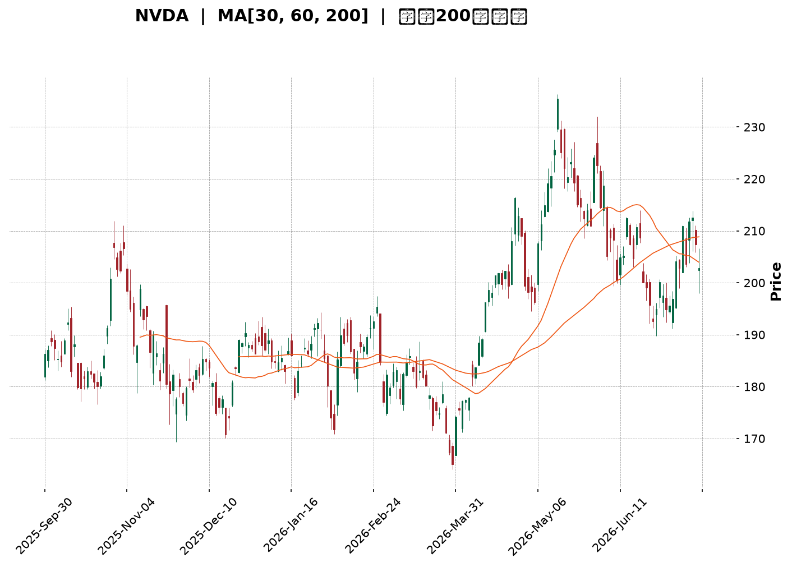
</details>

<html>
<head><meta charset="utf-8" /></head>
<body>
    <div style="height:500px; width:100%;">                        <script>window.PlotlyConfig = {MathJaxConfig: 'local'};</script>
        <script charset="utf-8" src="https://cdn.plot.ly/plotly-3.7.0.min.js" integrity="sha256-jvTGqxNp8AGWEcvNLVuKr+8j5dGe9Yw51LQkmDH+IYA=" crossorigin="anonymous"></script>                <div id="candlestick-chart" class="plotly-graph-div" style="height:100%; width:100%;"></div>            <script>                window.PLOTLYENV=window.PLOTLYENV || {};                                if (document.getElementById("candlestick-chart")) {                    Plotly.newPlot(                        "candlestick-chart",                        [{"close":{"dtype":"f8","bdata":"AAAAYPRKZ0AAAABgDGBnQAAAAODHlGdAAAAAIDFsZ0AAAACAtylnQAAAAMC8GWdAAAAAwM+bZ0AAAAAAZApoQAAAAICn3WZAAAAAYJCCZ0AAAAAgn3lmQAAAAOA6c2ZAAAAAYIKyZkAAAABgkt9mQAAAACAJzWZAAAAAYLydZkAAAACAnIFmQAAAAOCxvWZAAAAAILpAZ0AAAADg3+dnQAAAACDEGGlAAAAAQNfYaUAAAADANVRpQAAAACBtR2lAAAAAILrTaUAAAAAg+81oQAAAAGDDXmhAAAAA4OR6Z0AAAABgIX1nQAAAAKB82WhAAAAAID8daEAAAABAszFoQAAAAEDnU2dAAAAAILC9Z0AAAAAgmEtnQAAAAKAgpGZAAAAAgAlJZ0AAAADgHY1mQAAAAEDeVGZAAAAAoCjKZkAAAADg\u002fTJmQAAAAMD4gGZAAAAAAMkYZkAAAABAG3ZmQAAAAOBSp2ZAAAAAQI9rZkAAAADgAuVmQAAAAGACxmZAAAAAAF4qZ0AAAABg1BdnQAAAAMDL8WZAAAAA4LSWZkAAAABA0dllQAAAAEBoAmZAAAAAoBwwZkAAAACAaldlQAAAAACxvWVAAAAAAKCYZkAAAABg6+5mQAAAAEBYn2dAAAAA4CqMZ0AAAABgiMlnQAAAAOCzf2dAAAAAIPhpZ0AAAADAukhnQAAAAKDWk2dAAAAAwIF8Z0AAAACgYWBnQAAAAOAlnGdAAAAAABEaZ0AAAABAUBRnQAAAAODeFmdAAAAAQK0yZ0AAAABAV91mQAAAAOBOWmdAAAAAoBlAZ0AAAACATDtmQAAAACAY42ZAAAAAoKwTZ0AAAADAH25nQAAAAGDFR2dAAAAAgEqJZ0AAAACALOlnQAAAAMDQCGhAAAAAoLXcZ0AAAADASCxnQAAAAIDZg2ZAAAAAQEq\u002fZUAAAADAdXVlQAAAAIDkJWdAAAAAIN+5Z0AAAAAg7olnQAAAACAxumdAAAAAAMtWZ0AAAAAgy9JmQAAAAGDUF2dAAAAAIAh4Z0AAAACgeXVnQAAAAEDXsmdAAAAAACLqZ0AAAADArhNoQAAAAOBLamhAAAAAwEUVZ0AAAABALB9mQAAAACA\u002fyGZAAAAAwJR6ZkAAAAAAJdpmQAAAAIC742ZAAAAAAE8zZkAAAAAArs1mQAAAAOBvEWdAAAAAoAc6Z0AAAABgqN1mQAAAAABJgWZAAAAAADfgZkAAAACA+7ZmQAAAAGAUhmZAAAAAoERLZkAAAABg949lQAAAAODv7WVAAAAAgN\u002ffZUAAAACAGk9mQAAAACBNYWVAAAAAQGbqZEAAAACASZ9kQAAAAKBNxmVAAAAAAHTxZUAAAAAg3yVmQAAAAMDcLWZAAAAAwJA8ZkAAAAAAx7tmQAAAAOBE9mZAAAAAICKNZ0AAAAAg3qJnQAAAAOD\u002fiGhAAAAAgG7UaEAAAACgz8NoQAAAACA\u002fLmlAAAAAgGQ6aUAAAADgtvRoQAAAAOB0SGlAAAAAAAvtaEAAAACg4QBqQAAAAGBzC2tAAAAAwH+dakAAAACANCBqQAAAAEDO6mhAAAAA4AHHaEAAAABA98doQAAAAACuiGhAAAAAYNHyaUAAAAAAH2hqQAAAACBi3mpAAAAAwOdla0AAAABAvJBrQAAAAMAlMmxAAAAAAOZubUAAAADA2CFsQAAAAGD1wWtAAAAAQE2La0AAAAAgt+ZrQAAAAIAkaGtAAAAA4IniakAAAAAghNNqQAAAAMBHi2pAAAAAwATAakAAAABgnVxqQAAAAIApA2xAAAAAgPDRa0AAAAAAANBqQAAAAMAeVWtAAAAAQDOjaUAAAADgehRqQAAAAIAUBmpAAAAAoHANaUAAAAAA15tpQAAAAIAUpmlAAAAAYGaOakAAAADAHu1pQAAAAMDMlGlAAAAAgBRWakAAAADAzBRqQAAAAKBHAWlAAAAAAADgaEAAAAAgrndoQAAAAMD1EGhAAAAAQApfaEAAAABA4QJpQAAAAGCPsmhAAAAAYI9aaEAAAACgmXFoQAAAAIDCnWhAAAAAANeDaUAAAADA9VhpQAAAAGC4XmpAAAAAwPVwaUAAAACgmXlqQAAAAAAAkGpAAAAAwMzsaUAAAACA61lpQA=="},"high":{"dtype":"f8","bdata":"WWcAN5BjZ0DpKOq7z3xnQLyWDBbQ2WdASbk7qMLDZ0CcFVxdul9nQLi\u002fN602mmdAa8gCw3irZ0CVIxWjo2FoQPtpTrvda2hACAVFUsW7Z0DGLoU5ERJnQHryjOhNFGdApf45SX3hZkAJxjgxsvtmQFWQrenZHmdAtHjHPdTRZkB3s11GmuZmQMf44st\u002f2WZAPeJs32VnZ0B89JVtLPhnQKTfDwGFXGlA8hMHY259akCTJcaAt7xpQBef1xCQ9mlAL8lN1UNiakCy4urGuXZpQOvUACwrVWlAbwa89MiraEDodtNZkIJnQDYvlzbu9WhABnC9anllaECSL6uwfnRoQOAzOdVG5mdAzDr7m4jYZ0DUaufUS5hnQBRteToREmdATexQxNxzZ0DVPXC3AnhoQPZ0lHllCmdAOmUYFoXoZkCVJ7aT2z1mQAFAc\u002fip1WZA+kOWuvhhZkAZPutIQIJmQNIpgWyNLWdAWzP\u002fh\u002fbGZkA0QXNfcglnQJ47w+vrDWdAjTMb7at4Z0A7a\u002fjjzC9nQFWgASkhKGdARSiX+yujZkD4oMcIHdNmQEsnF\u002f57RmZA3hzB0LhIZkDeRwU0S\u002f1lQBF11NDu\u002fWVAjsfgqFOnZkCHA0Xv8P1mQH42dQ0uo2dApFSPgcGVZ0CMJciRkQ5oQCAtbRz2kGdAeyCwJ1CYZ0C6DU67fcpnQJqPqig9FmhAohf+w5wsaEBuvYHt8v1nQGRTMTJh5GdAKsbt\u002fTWqZ0AMc9ianUNnQHw+nJ6LXGdAfy4x7C98Z0DqJ7+ThwdnQNXInS0Br2dA7chf\u002fKfGZ0DdKlX9DMVmQN3uaBHvJGdAYx4mui4+Z0DA8T8dz6tnQPJy7q13nGdANvnl2pe4Z0DgYHCXswNoQMuX7FHRJ2hAHg0QOBlIaECJfLBxLsJnQKuY5\u002fFgQWdAk92DVo9rZkDaw7bzWBNmQNvAD+K1WGdAN5PKH5ItaECSF3VO2wdoQOy1t1fJIGhAYn5tEPkraEAg6g7SsGhnQIRhwh6BXWdAPz\u002f4JWvEZ0DvSwAWaoZnQLOEIQkkw2dA2N9xzNY2aEA7lrAxFjFoQPFwjbd0rGhAsfYlsbRBaECRCX4cw8tmQKhwZZiR52ZA4ohnZL+VZkCToicvMw9nQAVjd5C++mZAg4TyEzLRZkAA2L1n\u002fdVmQGWmXdXPRmdAu6opttlsZ0A2L5zVMBdnQILyLY7yO2dA9qozxh+VZ0AZwWmo5CVnQOrzzjRU5WZAoC84tad4ZkBMEMDZrUFmQPjbGvcxRWZALfmypXkAZkCUIuYGSqBmQG78YZ6+CWZABcP\u002fuKtYZUBWtCxvFihlQDwY6sZVzWVAtvQgjTslZkDGLtdrESlmQEfSzBGoMmZA4TKkYrhAZkAKqq4sayFnQPvO+OCz+2ZAHYZcD+y4Z0B\u002fUIEJDq5nQAAAAOD\u002fiGhASBnLqFUFaUC2Fd5RwfNoQJJMKc\u002fiLmlASmpxk+g9aUA3pXeBclBpQAAAAOB0SGlAsgq4ivdyaUATNPGQilZqQN5\u002f44Z7EmtAxk6MX1zPakB0QZaoHY9qQB1IsQvEQWpANT78G3BYaUB2HVZB2C9pQI0v+3Q4AGlAsW\u002fJreEAakBhoEega75qQIVlgZR8MWtATZeNmVHBa0Bywhgtqu9rQOIa63RkcmxAMYH23neIbUASrZxQYOdsQEVRwqJut2xAXtjiV\u002f8GbEAtgAGCvDtsQPTcoSFUZGxArbElNRaYa0BQa87WoT1rQLYy33fSvGpAOUBmg5zoakBUrXaKZzNrQN0y64J2E2xA79kRiE4AbUDl0\u002fuJ8NFrQAAAAEAzs2tAAAAAANfbakAAAABACk9qQAAAAMDMbGpAAAAAQArnaUAAAADAHrVpQAAAAIA94mlAAAAAYLiWakAAAAAgrm9qQAAAAGC4JmpAAAAA4HpsakAAAAAgrr9qQAAAAOCjeGlAAAAAoHA1aUAAAACgmRlpQAAAAKCZcWhAAAAAgMKFaEAAAAAAKRRpQAAAAEAz+2hAAAAAgOsBaUAAAACgmbFoQAAAAMAezWhAAAAAwB6laUAAAABA4ZJpQAAAAAAAYGpAAAAAgD1SakAAAACgmZFqQAAAAIDruWpAAAAAYI9iakAAAADgo9RpQA=="},"hovertemplate":"\u003cb\u003e%{x|%Y-%m-%d}\u003c\u002fb\u003e\u003cbr\u003e\u958b: $%{open:.2f}\u003cbr\u003e\u9ad8: $%{high:.2f}\u003cbr\u003e\u4f4e: $%{low:.2f}\u003cbr\u003e\u6536: $%{close:.2f}\u003cextra\u003e\u003c\u002fextra\u003e","low":{"dtype":"f8","bdata":"W0o3WPanZkDBUOvZTfVmQFJ9KClBemdAdjgBgJokZ0DDobpPFuNmQGjpK\u002fp\u002f+GZA3P50Ea1JZ0DrB9jBIdpnQB9KLPUtumZAyPlt4CM3Z0CdLo8xE29mQLvWLqENImZAAKBgCVBxZkCLb39VrHBmQLdm0t7zr2ZAhYj+cEVyZkA18lZbHRFmQGPJRHvzcWZAkqdrDYXoZkBjk5suFIZnQHN5XElM9WdAu88D9ZyQaUColooR6SRpQF2o+eEAOmlAwVRZZoqpaUB6t00OsbVoQBDZ+5fdTGhAU8UJPZBEZ0DwErfL01VmQLDoyoJhMWhAXmy7aM3hZ0D1tsd8XtxnQKrKvci082ZAtoxQ8zKLZkAbr40qugJnQOZUEBh6bWZAam2FgRvTZkCUcmF+3nNmQO3eyte1lmVAtW3ydyoIZkANyQdNsCplQBBkcBRqQGZAcgGvN84IZkC1GYA8rq5lQFyPIbypeGZAbQI6IjhcZkBmPKZhtHdmQOyCKFgRlmZAI7kuj7DFZkAC4z8XGONmQLcoNP0uumZAat0uY\u002fQMZkAShe5dCM1lQPfnIvMi2mVARlOyRPvVZUBkxprJR0NlQNhMKMeKc2VAkboxhwEEZkA4P1d\u002fF8RmQH0vsper1WZAmLqnKJtLZ0DtVXTfq3hnQCB9k23fNWdAh6taFnlWZ0Br1Ij5aEhnQAGVVCP7gGdAESqdKIs9Z0BMrfQw9VJnQFW9t7KlSmdAENfRBY\u002fvZkBggkSgR+5mQAWPKWmB2WZAvHLTjKblZkAv+QpajZJmQH8Ags9LQ2dAHWwzX047Z0A1lSu3mCxmQCkn9HjYRWZAVQXa9Jb2ZkAfp4ob9VJnQAG7RApuOGdALzGSJCkvZ0BSDzukerNnQN\u002fy5b2qOmdAB+PhcKenZ0AV4Qnp8xRnQMR4TmR9AGZAlPiQQGt2ZUCBb4X7SlplQBsrIeBkzGVAaoZlpjr3ZkDZpfiwgXxnQB1u5iVIkWdAWxOGqgxJZ0AX19YMzatmQBc8xWfGXmZANMHjDApRZ0Cvo4z64S1nQLeKJPjUNmdAAzQAaSurZ0DYmRejfmVnQM4wAKq5MWhAx00zEA4DZ0AXf1LVSAVmQMCamByszWVAABCu\u002fIoWZkDFSA6d5npmQAtXwL05NWZANVSs+lgTZkCjZCCBE+tlQOjaeWs5uWZA9L9vUYcHZ0ALNHDBOrFmQGC01HRgd2ZAjszBwlymZkDPO1ji\u002fa5mQNKu36rXg2ZAqryuKrvyZUBd\u002f5KYpHBlQPQHaETP0WVAKe+V4uC4ZUC+sayznBRmQJIPJdQaXmVAxwkqHRnaZEBxKytVhYJkQDAUIDOA2GRA4zFJiX3RZUC9BYOpdGVlQG6A563F8WVAkU3jl6auZUDXDIM54oJmQIIiH4AcjWZA0pkNC7wCZ0DWH63LwjBnQN7NKJ2I0WdAXi5JeWNwaEBkWzsZoHJoQIBwxns34WhAYpDEfoKzaED\u002fLVxElthoQDrRoUCW2GhA\u002fMISdLGfaEDum6buefJoQN5RIEZv5GlAjvNb5aT+aUCiowPN0+ppQIYVDWz\u002fzmhAo971Ln+caEDoYfHqbFBoQOd1ezuoeWhAQ7GGDR\u002fMaEDQL+euTshpQEhOfKeMlGpApZrbDYO0akDD3H0Cb9VqQNwzGYD8qWtAOMcx6g6hbEAOdaOsU\u002f9rQJ4KNIu0Q2tAeU61nwA1a0AbVs4yyYdrQEptXDGkNWtACavpLZnRakCz\u002fTNGGnhqQHfaIq4uEWpAnM935StfakBAS2aYS1xqQEZjNFZd7mpA7qDoRPSia0CBSvIpVMhqQAAAAEAKX2pAAAAAYI+KaUAAAAAAAMBpQAAAAEDh6mhAAAAAoHD9aEAAAACgR\u002fFoQAAAAIAUbmlAAAAAQOEKakAAAACgR+lpQAAAAGCPYmlAAAAAAADQaUAAAABACvdpQAAAAAAAAGlAAAAAYI+SaEAAAAAAKQRoQAAAAEAK52dAAAAAoJm5Z0AAAAAghWNoQAAAAGBmLmhAAAAAQDMLaEAAAAAgrj9oQAAAAOB65GdAAAAAgOthaEAAAABguN5oQAAAAKBwPWlAAAAAAABgaUAAAACgmXlpQAAAAKBHwWlAAAAAQDO7aUAAAABACr9oQA=="},"name":"\u50f9\u683c","open":{"dtype":"f8","bdata":"d0daVSO7ZkCgsnI+ISBnQByOYdd4q2dAFuLQPV6eZ0BsWdZKcChnQCOGGtXEP2dAZzlHoaJKZ0AGzk4shv9nQDsMzp9uKGhAJ7r+xmB3Z0D6hajJGxFnQJGghUMREmdAgg8Snu6\u002fZkAoF9lYan5mQC4lFiOy3GZAtHjHPdTRZkAUJZimGJ1mQNx9ROgVhmZA\u002f8sbwWLzZkAX1CSH77dnQEXqMES7GWhApT4E8eH2aUAYLtUKcJxpQFloWg38xWlAJxFB+hP6aUBMLTKmuVdpQAmlCrqJ0GhAW7grGm+FaEAkRQ1KQxVnQAuluTyRW2hAPG9HQSpdaEB3qM\u002fWD29oQD8fDAfQ2WdAwjVi6BDUZkB2Fu6ydTdnQKJE0Wuv5GZA5PySTb8RZ0DkIASdaXZoQE8kIL9KoGZA646+Dl1oZkCoYfl9\u002fdVlQLfC\u002fZPBrGZArgiR5gVZZkA6tpBXMtFlQOC1oz7psGZAoG+00y2bZkBRb5hwwqxmQGO38rpP9WZAPjUNSlzNZkDwk7u8rypnQGyL5F\u002fUF2dASMeanO6BZkCQfnS5dZxmQA4rbKgkN2ZAGT4Z0nIBZkA6LarAVfxlQHdfn\u002fsnymVAE9ImnI0OZkAixGs0RfZmQN2S2mTo12ZA3bSx78B2Z0CLdWJWCbZnQN\u002fG7hZnb2dAOgCyo1eAZ0D5fpWc2apnQARK0756s2dAjdkqTdjwZ0DdZbGkNslnQPmHkaPjimdAX4AJ4iWcZ0BZh+5NWBtnQM8ZN8rl32ZABxpM1ckYZ0ACCWgZDgNnQBxcL726SGdAnCPfbjCbZ0BjgpuHtbVmQDABZ9yeWmZAwYvrRcwQZ0A57k7SsGhnQCSWN\u002f3SXWdAMfclhmFgZ0A\u002fx7j+LuFnQBnGAs1r42dAm6udM0TfZ0C5OschGl9nQEnOi35rQGdAxhQPiblnZkAicyjQ8NZlQFBZ2UQxD2ZAWHFuDiMBZ0AF8Jsos+RnQDFw8uzlBmhA1H0iem8ZaECLMyolDWhnQF8sKELqsGZACRjGUKSQZ0BivfTBoFpnQD26r673SmdAxh4\u002fn1blZ0BJTWEyN+hnQGZg09PRRmhAejc3JBFBaEDvB9E776BmQEWLYWt\u002f2WVAkaKN0bhIZkCX5D\u002fSC4dmQL3MIohgnmZAwJmWl95zZkDXL5e0qhNmQGWtE2ewxWZAZyX1xDE2Z0D\u002f92JyvvpmQDWsnxaNFmdAnI1TYjnYZkAwEHmmBhtnQGk2B+qPyGZAsLrGPrA5ZkCqEoF0XjlmQPZWA223IWZA5idUBwzUZUBAAVVRmhxmQPnbhXCu+2VA4881uao5ZUA+6tkyrBJlQNnSufrR2GRAh7OtnXH5ZUCIbfJvWH9lQCWC4DOFHmZAMbQtOtDwZUAtqA6MIAlnQH1Qph0btGZAGC2n0g0DZ0DD6bGnBzpnQONJSVLF02dAM89DWPWJaEA3BSSmZ6ZoQOX1tVla9WhAT\u002f0k9uj3aEC7ehBroTxpQPaPYmYxGGlAOtJcmy1HaUDVWmlgRfdoQNzkK2D9LGpAeV8JWOAnakAwh2z5eY5qQH8FCnPwNWpAmyUPQ3YhaUBg1bllkehoQFwb8uss4mhAkRKQmAj1aEADjcViHgNqQCcfszEGmWpASBqpX065akDkq0RkdUlrQBqlOnVhFWxACRl0S6OybEA3K4nIwq9sQEgoJOBGs2xAxc\u002f5kKhra0CkAAMkct1rQGAtAr3\u002fwGtALYGyIZKUa0Czs5WaNglrQM5THAHdu2pAMEn90hZhakDDYOwRkcpqQGh998xS72pA1+Rj60tdbEBPaIbHx65rQAAAAMAevWpAAAAAwPXQakAAAACAwkVqQAAAAADXU2pAAAAAgMKNaUAAAAAgri9pQAAAACCFm2lAAAAAoHAdakAAAACAwmVqQAAAAMD1EGpAAAAAYI\u002fqaUAAAACAFG5qQAAAAKBwRWlAAAAAANcDaUAAAABgjwJpQAAAAADXI2hAAAAAQDM7aEAAAAAgrqdoQAAAAGBmhmhAAAAA4HqkaEAAAACgcE1oQAAAAADXC2hAAAAAgMJlaEAAAABguI5pQAAAAAAAQGlAAAAAoEcRakAAAABgZgZqQAAAAGC4fmpAAAAAoHBFakAAAADAzExpQA=="},"x":["2025-09-30T00:00:00-04:00","2025-10-01T00:00:00-04:00","2025-10-02T00:00:00-04:00","2025-10-03T00:00:00-04:00","2025-10-06T00:00:00-04:00","2025-10-07T00:00:00-04:00","2025-10-08T00:00:00-04:00","2025-10-09T00:00:00-04:00","2025-10-10T00:00:00-04:00","2025-10-13T00:00:00-04:00","2025-10-14T00:00:00-04:00","2025-10-15T00:00:00-04:00","2025-10-16T00:00:00-04:00","2025-10-17T00:00:00-04:00","2025-10-20T00:00:00-04:00","2025-10-21T00:00:00-04:00","2025-10-22T00:00:00-04:00","2025-10-23T00:00:00-04:00","2025-10-24T00:00:00-04:00","2025-10-27T00:00:00-04:00","2025-10-28T00:00:00-04:00","2025-10-29T00:00:00-04:00","2025-10-30T00:00:00-04:00","2025-10-31T00:00:00-04:00","2025-11-03T00:00:00-05:00","2025-11-04T00:00:00-05:00","2025-11-05T00:00:00-05:00","2025-11-06T00:00:00-05:00","2025-11-07T00:00:00-05:00","2025-11-10T00:00:00-05:00","2025-11-11T00:00:00-05:00","2025-11-12T00:00:00-05:00","2025-11-13T00:00:00-05:00","2025-11-14T00:00:00-05:00","2025-11-17T00:00:00-05:00","2025-11-18T00:00:00-05:00","2025-11-19T00:00:00-05:00","2025-11-20T00:00:00-05:00","2025-11-21T00:00:00-05:00","2025-11-24T00:00:00-05:00","2025-11-25T00:00:00-05:00","2025-11-26T00:00:00-05:00","2025-11-28T00:00:00-05:00","2025-12-01T00:00:00-05:00","2025-12-02T00:00:00-05:00","2025-12-03T00:00:00-05:00","2025-12-04T00:00:00-05:00","2025-12-05T00:00:00-05:00","2025-12-08T00:00:00-05:00","2025-12-09T00:00:00-05:00","2025-12-10T00:00:00-05:00","2025-12-11T00:00:00-05:00","2025-12-12T00:00:00-05:00","2025-12-15T00:00:00-05:00","2025-12-16T00:00:00-05:00","2025-12-17T00:00:00-05:00","2025-12-18T00:00:00-05:00","2025-12-19T00:00:00-05:00","2025-12-22T00:00:00-05:00","2025-12-23T00:00:00-05:00","2025-12-24T00:00:00-05:00","2025-12-26T00:00:00-05:00","2025-12-29T00:00:00-05:00","2025-12-30T00:00:00-05:00","2025-12-31T00:00:00-05:00","2026-01-02T00:00:00-05:00","2026-01-05T00:00:00-05:00","2026-01-06T00:00:00-05:00","2026-01-07T00:00:00-05:00","2026-01-08T00:00:00-05:00","2026-01-09T00:00:00-05:00","2026-01-12T00:00:00-05:00","2026-01-13T00:00:00-05:00","2026-01-14T00:00:00-05:00","2026-01-15T00:00:00-05:00","2026-01-16T00:00:00-05:00","2026-01-20T00:00:00-05:00","2026-01-21T00:00:00-05:00","2026-01-22T00:00:00-05:00","2026-01-23T00:00:00-05:00","2026-01-26T00:00:00-05:00","2026-01-27T00:00:00-05:00","2026-01-28T00:00:00-05:00","2026-01-29T00:00:00-05:00","2026-01-30T00:00:00-05:00","2026-02-02T00:00:00-05:00","2026-02-03T00:00:00-05:00","2026-02-04T00:00:00-05:00","2026-02-05T00:00:00-05:00","2026-02-06T00:00:00-05:00","2026-02-09T00:00:00-05:00","2026-02-10T00:00:00-05:00","2026-02-11T00:00:00-05:00","2026-02-12T00:00:00-05:00","2026-02-13T00:00:00-05:00","2026-02-17T00:00:00-05:00","2026-02-18T00:00:00-05:00","2026-02-19T00:00:00-05:00","2026-02-20T00:00:00-05:00","2026-02-23T00:00:00-05:00","2026-02-24T00:00:00-05:00","2026-02-25T00:00:00-05:00","2026-02-26T00:00:00-05:00","2026-02-27T00:00:00-05:00","2026-03-02T00:00:00-05:00","2026-03-03T00:00:00-05:00","2026-03-04T00:00:00-05:00","2026-03-05T00:00:00-05:00","2026-03-06T00:00:00-05:00","2026-03-09T00:00:00-04:00","2026-03-10T00:00:00-04:00","2026-03-11T00:00:00-04:00","2026-03-12T00:00:00-04:00","2026-03-13T00:00:00-04:00","2026-03-16T00:00:00-04:00","2026-03-17T00:00:00-04:00","2026-03-18T00:00:00-04:00","2026-03-19T00:00:00-04:00","2026-03-20T00:00:00-04:00","2026-03-23T00:00:00-04:00","2026-03-24T00:00:00-04:00","2026-03-25T00:00:00-04:00","2026-03-26T00:00:00-04:00","2026-03-27T00:00:00-04:00","2026-03-30T00:00:00-04:00","2026-03-31T00:00:00-04:00","2026-04-01T00:00:00-04:00","2026-04-02T00:00:00-04:00","2026-04-06T00:00:00-04:00","2026-04-07T00:00:00-04:00","2026-04-08T00:00:00-04:00","2026-04-09T00:00:00-04:00","2026-04-10T00:00:00-04:00","2026-04-13T00:00:00-04:00","2026-04-14T00:00:00-04:00","2026-04-15T00:00:00-04:00","2026-04-16T00:00:00-04:00","2026-04-17T00:00:00-04:00","2026-04-20T00:00:00-04:00","2026-04-21T00:00:00-04:00","2026-04-22T00:00:00-04:00","2026-04-23T00:00:00-04:00","2026-04-24T00:00:00-04:00","2026-04-27T00:00:00-04:00","2026-04-28T00:00:00-04:00","2026-04-29T00:00:00-04:00","2026-04-30T00:00:00-04:00","2026-05-01T00:00:00-04:00","2026-05-04T00:00:00-04:00","2026-05-05T00:00:00-04:00","2026-05-06T00:00:00-04:00","2026-05-07T00:00:00-04:00","2026-05-08T00:00:00-04:00","2026-05-11T00:00:00-04:00","2026-05-12T00:00:00-04:00","2026-05-13T00:00:00-04:00","2026-05-14T00:00:00-04:00","2026-05-15T00:00:00-04:00","2026-05-18T00:00:00-04:00","2026-05-19T00:00:00-04:00","2026-05-20T00:00:00-04:00","2026-05-21T00:00:00-04:00","2026-05-22T00:00:00-04:00","2026-05-26T00:00:00-04:00","2026-05-27T00:00:00-04:00","2026-05-28T00:00:00-04:00","2026-05-29T00:00:00-04:00","2026-06-01T00:00:00-04:00","2026-06-02T00:00:00-04:00","2026-06-03T00:00:00-04:00","2026-06-04T00:00:00-04:00","2026-06-05T00:00:00-04:00","2026-06-08T00:00:00-04:00","2026-06-09T00:00:00-04:00","2026-06-10T00:00:00-04:00","2026-06-11T00:00:00-04:00","2026-06-12T00:00:00-04:00","2026-06-15T00:00:00-04:00","2026-06-16T00:00:00-04:00","2026-06-17T00:00:00-04:00","2026-06-18T00:00:00-04:00","2026-06-22T00:00:00-04:00","2026-06-23T00:00:00-04:00","2026-06-24T00:00:00-04:00","2026-06-25T00:00:00-04:00","2026-06-26T00:00:00-04:00","2026-06-29T00:00:00-04:00","2026-06-30T00:00:00-04:00","2026-07-01T00:00:00-04:00","2026-07-02T00:00:00-04:00","2026-07-06T00:00:00-04:00","2026-07-07T00:00:00-04:00","2026-07-08T00:00:00-04:00","2026-07-09T00:00:00-04:00","2026-07-10T00:00:00-04:00","2026-07-13T00:00:00-04:00","2026-07-14T00:00:00-04:00","2026-07-15T00:00:00-04:00","2026-07-16T00:00:00-04:00","2026-07-17T00:00:00-04:00"],"type":"candlestick"},{"hovertemplate":"MA30: $%{y:.2f}\u003cextra\u003e\u003c\u002fextra\u003e","line":{"color":"#2196F3","dash":"dash","width":2},"mode":"lines","name":"MA30","x":["2025-09-30T00:00:00-04:00","2025-10-01T00:00:00-04:00","2025-10-02T00:00:00-04:00","2025-10-03T00:00:00-04:00","2025-10-06T00:00:00-04:00","2025-10-07T00:00:00-04:00","2025-10-08T00:00:00-04:00","2025-10-09T00:00:00-04:00","2025-10-10T00:00:00-04:00","2025-10-13T00:00:00-04:00","2025-10-14T00:00:00-04:00","2025-10-15T00:00:00-04:00","2025-10-16T00:00:00-04:00","2025-10-17T00:00:00-04:00","2025-10-20T00:00:00-04:00","2025-10-21T00:00:00-04:00","2025-10-22T00:00:00-04:00","2025-10-23T00:00:00-04:00","2025-10-24T00:00:00-04:00","2025-10-27T00:00:00-04:00","2025-10-28T00:00:00-04:00","2025-10-29T00:00:00-04:00","2025-10-30T00:00:00-04:00","2025-10-31T00:00:00-04:00","2025-11-03T00:00:00-05:00","2025-11-04T00:00:00-05:00","2025-11-05T00:00:00-05:00","2025-11-06T00:00:00-05:00","2025-11-07T00:00:00-05:00","2025-11-10T00:00:00-05:00","2025-11-11T00:00:00-05:00","2025-11-12T00:00:00-05:00","2025-11-13T00:00:00-05:00","2025-11-14T00:00:00-05:00","2025-11-17T00:00:00-05:00","2025-11-18T00:00:00-05:00","2025-11-19T00:00:00-05:00","2025-11-20T00:00:00-05:00","2025-11-21T00:00:00-05:00","2025-11-24T00:00:00-05:00","2025-11-25T00:00:00-05:00","2025-11-26T00:00:00-05:00","2025-11-28T00:00:00-05:00","2025-12-01T00:00:00-05:00","2025-12-02T00:00:00-05:00","2025-12-03T00:00:00-05:00","2025-12-04T00:00:00-05:00","2025-12-05T00:00:00-05:00","2025-12-08T00:00:00-05:00","2025-12-09T00:00:00-05:00","2025-12-10T00:00:00-05:00","2025-12-11T00:00:00-05:00","2025-12-12T00:00:00-05:00","2025-12-15T00:00:00-05:00","2025-12-16T00:00:00-05:00","2025-12-17T00:00:00-05:00","2025-12-18T00:00:00-05:00","2025-12-19T00:00:00-05:00","2025-12-22T00:00:00-05:00","2025-12-23T00:00:00-05:00","2025-12-24T00:00:00-05:00","2025-12-26T00:00:00-05:00","2025-12-29T00:00:00-05:00","2025-12-30T00:00:00-05:00","2025-12-31T00:00:00-05:00","2026-01-02T00:00:00-05:00","2026-01-05T00:00:00-05:00","2026-01-06T00:00:00-05:00","2026-01-07T00:00:00-05:00","2026-01-08T00:00:00-05:00","2026-01-09T00:00:00-05:00","2026-01-12T00:00:00-05:00","2026-01-13T00:00:00-05:00","2026-01-14T00:00:00-05:00","2026-01-15T00:00:00-05:00","2026-01-16T00:00:00-05:00","2026-01-20T00:00:00-05:00","2026-01-21T00:00:00-05:00","2026-01-22T00:00:00-05:00","2026-01-23T00:00:00-05:00","2026-01-26T00:00:00-05:00","2026-01-27T00:00:00-05:00","2026-01-28T00:00:00-05:00","2026-01-29T00:00:00-05:00","2026-01-30T00:00:00-05:00","2026-02-02T00:00:00-05:00","2026-02-03T00:00:00-05:00","2026-02-04T00:00:00-05:00","2026-02-05T00:00:00-05:00","2026-02-06T00:00:00-05:00","2026-02-09T00:00:00-05:00","2026-02-10T00:00:00-05:00","2026-02-11T00:00:00-05:00","2026-02-12T00:00:00-05:00","2026-02-13T00:00:00-05:00","2026-02-17T00:00:00-05:00","2026-02-18T00:00:00-05:00","2026-02-19T00:00:00-05:00","2026-02-20T00:00:00-05:00","2026-02-23T00:00:00-05:00","2026-02-24T00:00:00-05:00","2026-02-25T00:00:00-05:00","2026-02-26T00:00:00-05:00","2026-02-27T00:00:00-05:00","2026-03-02T00:00:00-05:00","2026-03-03T00:00:00-05:00","2026-03-04T00:00:00-05:00","2026-03-05T00:00:00-05:00","2026-03-06T00:00:00-05:00","2026-03-09T00:00:00-04:00","2026-03-10T00:00:00-04:00","2026-03-11T00:00:00-04:00","2026-03-12T00:00:00-04:00","2026-03-13T00:00:00-04:00","2026-03-16T00:00:00-04:00","2026-03-17T00:00:00-04:00","2026-03-18T00:00:00-04:00","2026-03-19T00:00:00-04:00","2026-03-20T00:00:00-04:00","2026-03-23T00:00:00-04:00","2026-03-24T00:00:00-04:00","2026-03-25T00:00:00-04:00","2026-03-26T00:00:00-04:00","2026-03-27T00:00:00-04:00","2026-03-30T00:00:00-04:00","2026-03-31T00:00:00-04:00","2026-04-01T00:00:00-04:00","2026-04-02T00:00:00-04:00","2026-04-06T00:00:00-04:00","2026-04-07T00:00:00-04:00","2026-04-08T00:00:00-04:00","2026-04-09T00:00:00-04:00","2026-04-10T00:00:00-04:00","2026-04-13T00:00:00-04:00","2026-04-14T00:00:00-04:00","2026-04-15T00:00:00-04:00","2026-04-16T00:00:00-04:00","2026-04-17T00:00:00-04:00","2026-04-20T00:00:00-04:00","2026-04-21T00:00:00-04:00","2026-04-22T00:00:00-04:00","2026-04-23T00:00:00-04:00","2026-04-24T00:00:00-04:00","2026-04-27T00:00:00-04:00","2026-04-28T00:00:00-04:00","2026-04-29T00:00:00-04:00","2026-04-30T00:00:00-04:00","2026-05-01T00:00:00-04:00","2026-05-04T00:00:00-04:00","2026-05-05T00:00:00-04:00","2026-05-06T00:00:00-04:00","2026-05-07T00:00:00-04:00","2026-05-08T00:00:00-04:00","2026-05-11T00:00:00-04:00","2026-05-12T00:00:00-04:00","2026-05-13T00:00:00-04:00","2026-05-14T00:00:00-04:00","2026-05-15T00:00:00-04:00","2026-05-18T00:00:00-04:00","2026-05-19T00:00:00-04:00","2026-05-20T00:00:00-04:00","2026-05-21T00:00:00-04:00","2026-05-22T00:00:00-04:00","2026-05-26T00:00:00-04:00","2026-05-27T00:00:00-04:00","2026-05-28T00:00:00-04:00","2026-05-29T00:00:00-04:00","2026-06-01T00:00:00-04:00","2026-06-02T00:00:00-04:00","2026-06-03T00:00:00-04:00","2026-06-04T00:00:00-04:00","2026-06-05T00:00:00-04:00","2026-06-08T00:00:00-04:00","2026-06-09T00:00:00-04:00","2026-06-10T00:00:00-04:00","2026-06-11T00:00:00-04:00","2026-06-12T00:00:00-04:00","2026-06-15T00:00:00-04:00","2026-06-16T00:00:00-04:00","2026-06-17T00:00:00-04:00","2026-06-18T00:00:00-04:00","2026-06-22T00:00:00-04:00","2026-06-23T00:00:00-04:00","2026-06-24T00:00:00-04:00","2026-06-25T00:00:00-04:00","2026-06-26T00:00:00-04:00","2026-06-29T00:00:00-04:00","2026-06-30T00:00:00-04:00","2026-07-01T00:00:00-04:00","2026-07-02T00:00:00-04:00","2026-07-06T00:00:00-04:00","2026-07-07T00:00:00-04:00","2026-07-08T00:00:00-04:00","2026-07-09T00:00:00-04:00","2026-07-10T00:00:00-04:00","2026-07-13T00:00:00-04:00","2026-07-14T00:00:00-04:00","2026-07-15T00:00:00-04:00","2026-07-16T00:00:00-04:00","2026-07-17T00:00:00-04:00"],"y":{"dtype":"f8","bdata":"AAAAAAAA+H8AAAAAAAD4fwAAAAAAAPh\u002fAAAAAAAA+H8AAAAAAAD4fwAAAAAAAPh\u002fAAAAAAAA+H8AAAAAAAD4fwAAAAAAAPh\u002fAAAAAAAA+H8AAAAAAAD4fwAAAAAAAPh\u002fAAAAAAAA+H8AAAAAAAD4fwAAAAAAAPh\u002fAAAAAAAA+H8AAAAAAAD4fwAAAAAAAPh\u002fAAAAAAAA+H8AAAAAAAD4fwAAAAAAAPh\u002fAAAAAAAA+H8AAAAAAAD4fwAAAAAAAPh\u002fAAAAAAAA+H8AAAAAAAD4fwAAAAAAAPh\u002fAAAAAAAA+H8AAAAAAAD4fxERERE5sGdA7+7ujju3Z0BmZmaWOL5nQHd3d\u002fcOvGdAZmZmZsa+Z0DNzMx8579nQCIiIuL7u2dAq6qqijm5Z0AREREBhKxnQDMzM8P0p2dAvLu7K8+hZ0BmZmZ2dJ9nQJqZmbnpn2dAIiIi8smaZ0CamZn5RZdnQKuqqioElmdA7+7u\u002fleUZ0BVVVU1qJdnQImIiCjvl2dAq6qqWjCXZ0CamZkJQZBnQM3MzGzjfWdAq6qqehViZ0BmZmZ2Z0RnQGZmZuaAKGdA3t3dHXMJZ0AzMzPD5etmQHd3dzd21WZAMzMzY+vNZkCrqqraLclmQM3MzCy1vmZAq6qqKt+5ZkBVVVVFZrZmQGZmZgbct2ZAAAAAoBG1ZkDe3d0t+bRmQGZmZrb2vGZAvLu7662+ZkBmZma2uMVmQAAAAICh0GZAERERYUvTZkAAAAAgztpmQDMzM0PN32ZAzczMvDLpZkC8u7uro+xmQBEREQGb8mZA7+7urrD5ZkCJiIh4CPRmQJqZmakA9WZAREREBD\u002f0ZkBVVVVlH\u002fdmQM3MzAz9+WZAq6qqGhMCZ0BmZmY2pxNnQGZmZvbuJGdAREREVDgzZ0BmZmZW2UJnQJqZmUl0SWdAIiIisjVCZ0BVVVW1oDVnQBEREVGUMWdAMzMzUxozZ0BVVVWV+zBnQBEREbHuMmdA3t3dDUsyZ0CrqqqqXC5nQFVVVXU6KmdAVVVVRRQqZ0BVVVVFyCpnQKuqquqJK2dAq6qqankyZ0ARERGR\u002fDpnQAAAAABNRmdAVVVVFVJFZ0ARERFR+z5nQM3MzOwcOmdA3t3dbYczZ0CamZnp0jhnQLy7u1vYOGdAVVVVxV0xZ0BVVVWlBCxnQO\u002fu7v40KmdAIiIiopAnZ0BERETUpR5nQFVVVcWYEWdAZmZmJi4JZ0DNzMwsRQVnQERERDRYBWdA7+7urgIKZ0Dv7u7e5ApnQJqZmdl+AGdAAAAAELLwZkCrqqqKM+ZmQBEREfEr0mZAq6qq6n29ZkBERERUtapmQKuqqhp1n2ZAq6qqKnCSZkCamZlZQIdmQBERERFJemZAzczMbPdrZkBERETEgGBmQCIiIiIaVGZAIiIi8hhYZkBmZmZGBWVmQCIiIqL6c2ZAzczMbAqIZkCamZnpXJhmQFVVVdXpq2ZAIiIi4r\u002fFZkC8u7sLHthmQM3MzJwE62ZAmpmZuYT5ZkBmZmbmShRnQLy7uwsIO2dA7+7u3vBaZ0Dv7u5eDHhnQHd3d\u002fd4jGdAERER8amhZ0B3d3dnIb1nQBEREfFa02dAzczMvB72Z0CrqqpaFhloQDMzM2PsR2hAERERgT1\u002faEAAAAAQfbpoQImIiIhI8WhAvLu7uzIxaUBmZmaWQ2RpQCIiIgLek2lA7+7ujijBaUARERGhQe1pQLy7u3svE2pAAAAA4KEvakC8u7ub2kpqQDMzMyP\u002fW2pAMzMzA2JsakCJiIh4AnpqQKuqqmoskmpA7+7urkqoakBERER0IrhqQFVVVZWfyWpA3t3d\u002fbHPakC8u7s7WdBqQO\u002fu7t6ix2pAiYiICE26akBERESE47VqQHd3d5chvGpAvLu7m0\u002fLakARERExFdVqQGZmZiYF3mpAAAAAMFThakDe3d0tjd5qQFVVVeWlzmpAvLu7Kx65akBERETErp5qQO\u002fu7m5xe2pAERERcT9QakB3d3eXnTVqQHd3d5eAG2pAAAAAEEcAakBEREQUxuJpQDMzMwP2ymlAIiIiYkW\u002faUCamZkJp7JpQKuqqsoqsWlAAAAAoP+laUB3d3f39qZpQHd3d7eXmmlAvLu722uKaUBVVVW1831pQA=="},"type":"scatter"},{"hovertemplate":"MA60: $%{y:.2f}\u003cextra\u003e\u003c\u002fextra\u003e","line":{"color":"#9C27B0","dash":"dash","width":2},"mode":"lines","name":"MA60","x":["2025-09-30T00:00:00-04:00","2025-10-01T00:00:00-04:00","2025-10-02T00:00:00-04:00","2025-10-03T00:00:00-04:00","2025-10-06T00:00:00-04:00","2025-10-07T00:00:00-04:00","2025-10-08T00:00:00-04:00","2025-10-09T00:00:00-04:00","2025-10-10T00:00:00-04:00","2025-10-13T00:00:00-04:00","2025-10-14T00:00:00-04:00","2025-10-15T00:00:00-04:00","2025-10-16T00:00:00-04:00","2025-10-17T00:00:00-04:00","2025-10-20T00:00:00-04:00","2025-10-21T00:00:00-04:00","2025-10-22T00:00:00-04:00","2025-10-23T00:00:00-04:00","2025-10-24T00:00:00-04:00","2025-10-27T00:00:00-04:00","2025-10-28T00:00:00-04:00","2025-10-29T00:00:00-04:00","2025-10-30T00:00:00-04:00","2025-10-31T00:00:00-04:00","2025-11-03T00:00:00-05:00","2025-11-04T00:00:00-05:00","2025-11-05T00:00:00-05:00","2025-11-06T00:00:00-05:00","2025-11-07T00:00:00-05:00","2025-11-10T00:00:00-05:00","2025-11-11T00:00:00-05:00","2025-11-12T00:00:00-05:00","2025-11-13T00:00:00-05:00","2025-11-14T00:00:00-05:00","2025-11-17T00:00:00-05:00","2025-11-18T00:00:00-05:00","2025-11-19T00:00:00-05:00","2025-11-20T00:00:00-05:00","2025-11-21T00:00:00-05:00","2025-11-24T00:00:00-05:00","2025-11-25T00:00:00-05:00","2025-11-26T00:00:00-05:00","2025-11-28T00:00:00-05:00","2025-12-01T00:00:00-05:00","2025-12-02T00:00:00-05:00","2025-12-03T00:00:00-05:00","2025-12-04T00:00:00-05:00","2025-12-05T00:00:00-05:00","2025-12-08T00:00:00-05:00","2025-12-09T00:00:00-05:00","2025-12-10T00:00:00-05:00","2025-12-11T00:00:00-05:00","2025-12-12T00:00:00-05:00","2025-12-15T00:00:00-05:00","2025-12-16T00:00:00-05:00","2025-12-17T00:00:00-05:00","2025-12-18T00:00:00-05:00","2025-12-19T00:00:00-05:00","2025-12-22T00:00:00-05:00","2025-12-23T00:00:00-05:00","2025-12-24T00:00:00-05:00","2025-12-26T00:00:00-05:00","2025-12-29T00:00:00-05:00","2025-12-30T00:00:00-05:00","2025-12-31T00:00:00-05:00","2026-01-02T00:00:00-05:00","2026-01-05T00:00:00-05:00","2026-01-06T00:00:00-05:00","2026-01-07T00:00:00-05:00","2026-01-08T00:00:00-05:00","2026-01-09T00:00:00-05:00","2026-01-12T00:00:00-05:00","2026-01-13T00:00:00-05:00","2026-01-14T00:00:00-05:00","2026-01-15T00:00:00-05:00","2026-01-16T00:00:00-05:00","2026-01-20T00:00:00-05:00","2026-01-21T00:00:00-05:00","2026-01-22T00:00:00-05:00","2026-01-23T00:00:00-05:00","2026-01-26T00:00:00-05:00","2026-01-27T00:00:00-05:00","2026-01-28T00:00:00-05:00","2026-01-29T00:00:00-05:00","2026-01-30T00:00:00-05:00","2026-02-02T00:00:00-05:00","2026-02-03T00:00:00-05:00","2026-02-04T00:00:00-05:00","2026-02-05T00:00:00-05:00","2026-02-06T00:00:00-05:00","2026-02-09T00:00:00-05:00","2026-02-10T00:00:00-05:00","2026-02-11T00:00:00-05:00","2026-02-12T00:00:00-05:00","2026-02-13T00:00:00-05:00","2026-02-17T00:00:00-05:00","2026-02-18T00:00:00-05:00","2026-02-19T00:00:00-05:00","2026-02-20T00:00:00-05:00","2026-02-23T00:00:00-05:00","2026-02-24T00:00:00-05:00","2026-02-25T00:00:00-05:00","2026-02-26T00:00:00-05:00","2026-02-27T00:00:00-05:00","2026-03-02T00:00:00-05:00","2026-03-03T00:00:00-05:00","2026-03-04T00:00:00-05:00","2026-03-05T00:00:00-05:00","2026-03-06T00:00:00-05:00","2026-03-09T00:00:00-04:00","2026-03-10T00:00:00-04:00","2026-03-11T00:00:00-04:00","2026-03-12T00:00:00-04:00","2026-03-13T00:00:00-04:00","2026-03-16T00:00:00-04:00","2026-03-17T00:00:00-04:00","2026-03-18T00:00:00-04:00","2026-03-19T00:00:00-04:00","2026-03-20T00:00:00-04:00","2026-03-23T00:00:00-04:00","2026-03-24T00:00:00-04:00","2026-03-25T00:00:00-04:00","2026-03-26T00:00:00-04:00","2026-03-27T00:00:00-04:00","2026-03-30T00:00:00-04:00","2026-03-31T00:00:00-04:00","2026-04-01T00:00:00-04:00","2026-04-02T00:00:00-04:00","2026-04-06T00:00:00-04:00","2026-04-07T00:00:00-04:00","2026-04-08T00:00:00-04:00","2026-04-09T00:00:00-04:00","2026-04-10T00:00:00-04:00","2026-04-13T00:00:00-04:00","2026-04-14T00:00:00-04:00","2026-04-15T00:00:00-04:00","2026-04-16T00:00:00-04:00","2026-04-17T00:00:00-04:00","2026-04-20T00:00:00-04:00","2026-04-21T00:00:00-04:00","2026-04-22T00:00:00-04:00","2026-04-23T00:00:00-04:00","2026-04-24T00:00:00-04:00","2026-04-27T00:00:00-04:00","2026-04-28T00:00:00-04:00","2026-04-29T00:00:00-04:00","2026-04-30T00:00:00-04:00","2026-05-01T00:00:00-04:00","2026-05-04T00:00:00-04:00","2026-05-05T00:00:00-04:00","2026-05-06T00:00:00-04:00","2026-05-07T00:00:00-04:00","2026-05-08T00:00:00-04:00","2026-05-11T00:00:00-04:00","2026-05-12T00:00:00-04:00","2026-05-13T00:00:00-04:00","2026-05-14T00:00:00-04:00","2026-05-15T00:00:00-04:00","2026-05-18T00:00:00-04:00","2026-05-19T00:00:00-04:00","2026-05-20T00:00:00-04:00","2026-05-21T00:00:00-04:00","2026-05-22T00:00:00-04:00","2026-05-26T00:00:00-04:00","2026-05-27T00:00:00-04:00","2026-05-28T00:00:00-04:00","2026-05-29T00:00:00-04:00","2026-06-01T00:00:00-04:00","2026-06-02T00:00:00-04:00","2026-06-03T00:00:00-04:00","2026-06-04T00:00:00-04:00","2026-06-05T00:00:00-04:00","2026-06-08T00:00:00-04:00","2026-06-09T00:00:00-04:00","2026-06-10T00:00:00-04:00","2026-06-11T00:00:00-04:00","2026-06-12T00:00:00-04:00","2026-06-15T00:00:00-04:00","2026-06-16T00:00:00-04:00","2026-06-17T00:00:00-04:00","2026-06-18T00:00:00-04:00","2026-06-22T00:00:00-04:00","2026-06-23T00:00:00-04:00","2026-06-24T00:00:00-04:00","2026-06-25T00:00:00-04:00","2026-06-26T00:00:00-04:00","2026-06-29T00:00:00-04:00","2026-06-30T00:00:00-04:00","2026-07-01T00:00:00-04:00","2026-07-02T00:00:00-04:00","2026-07-06T00:00:00-04:00","2026-07-07T00:00:00-04:00","2026-07-08T00:00:00-04:00","2026-07-09T00:00:00-04:00","2026-07-10T00:00:00-04:00","2026-07-13T00:00:00-04:00","2026-07-14T00:00:00-04:00","2026-07-15T00:00:00-04:00","2026-07-16T00:00:00-04:00","2026-07-17T00:00:00-04:00"],"y":{"dtype":"f8","bdata":"AAAAAAAA+H8AAAAAAAD4fwAAAAAAAPh\u002fAAAAAAAA+H8AAAAAAAD4fwAAAAAAAPh\u002fAAAAAAAA+H8AAAAAAAD4fwAAAAAAAPh\u002fAAAAAAAA+H8AAAAAAAD4fwAAAAAAAPh\u002fAAAAAAAA+H8AAAAAAAD4fwAAAAAAAPh\u002fAAAAAAAA+H8AAAAAAAD4fwAAAAAAAPh\u002fAAAAAAAA+H8AAAAAAAD4fwAAAAAAAPh\u002fAAAAAAAA+H8AAAAAAAD4fwAAAAAAAPh\u002fAAAAAAAA+H8AAAAAAAD4fwAAAAAAAPh\u002fAAAAAAAA+H8AAAAAAAD4fwAAAAAAAPh\u002fAAAAAAAA+H8AAAAAAAD4fwAAAAAAAPh\u002fAAAAAAAA+H8AAAAAAAD4fwAAAAAAAPh\u002fAAAAAAAA+H8AAAAAAAD4fwAAAAAAAPh\u002fAAAAAAAA+H8AAAAAAAD4fwAAAAAAAPh\u002fAAAAAAAA+H8AAAAAAAD4fwAAAAAAAPh\u002fAAAAAAAA+H8AAAAAAAD4fwAAAAAAAPh\u002fAAAAAAAA+H8AAAAAAAD4fwAAAAAAAPh\u002fAAAAAAAA+H8AAAAAAAD4fwAAAAAAAPh\u002fAAAAAAAA+H8AAAAAAAD4fwAAAAAAAPh\u002fAAAAAAAA+H8AAAAAAAD4f+\u002fu7h53N2dAzczMXI04Z0De3d1tTzpnQO\u002fu7n71OWdAMzMzA+w5Z0BVVVVVcDpnQEREREx5PGdAMzMzu\u002fM7Z0C8u7tbHjlnQJqZmSFLPGdAZmZmRo06Z0AzMzNLIT1nQGZmZn7bP2dAd3d3V\u002f5BZ0CrqqrS9EFnQN7d3ZVPRGdA7+7uVgRHZ0Dv7u5W2EVnQBEREel3RmdAd3d3r7dFZ0B3d3c3sENnQM3MzDzwO2dAq6qqShQyZ0BmZmZWByxnQGZmZu63JmdAERERuVUeZ0DNzMyMXxdnQImIiEB1D2dAq6qqihAIZ0AAAABIZ\u002f9mQO\u002fu7r4k+GZA7+7uvnz2ZkBVVVXtsPNmQLy7u1tl9WZA7+7uVq7zZkBERETsqvFmQN7d3ZWY82ZAiYiIGGH0ZkDe3d19QPhmQFVVVbUV\u002fmZA3t3dZeICZ0CJiIhY5QpnQJqZmSENE2dAERERaUIXZ0BmZmZ+zxVnQO\u002fu7vZbFmdAZmZmDpwWZ0ARERGxbRZnQKuqqoLsFmdAzczMZM4SZ0BVVVUFkhFnQN7d3QUZEmdAZmZm3tEUZ0BVVVWFJhlnQN7d3d1DG2dAVVVVPTMeZ0CamZlBDyRnQO\u002fu7j5mJ2dAiYiIMBwmZ0AiIiLKQiBnQFVVVZUJGWdAmpmZMeYRZ0AAAACQlwtnQBEREVGNAmdAREREfOT3ZkB3d3f\u002fiOxmQAAAAMjX5GZAAAAAOELeZkB3d3dPBNlmQN7d3X3p0mZAvLu7azjPZkCrqqqqvs1mQBEREZEzzWZAvLu7g7XOZkC8u7tLANJmQHd3d8cL12ZAVVVV7cjdZkCamZnpl+hmQImIiBhh8mZAvLu70477ZkCJiIhYEQJnQN7d3c2cCmdA3t3drYoQZ0BVVVVdeBlnQImIiGhQJmdAq6qqgg8yZ0De3d3FqD5nQN7d3ZXoSGdAAAAAUNZVZ0AzMzMjA2RnQFVVVeXsaWdAZmZmZmhzZ0CrqqrypH9nQCIiIioMjWdA3t3dtV2eZ0AiIiIymbJnQJqZmdFeyGdAMzMzc9HhZ0AAAAD4wfVnQJqZmYkTB2hA3t3d\u002fY8WaECrqqoy4SZoQO\u002fu7s6kM2hAERERad1DaEARERHx71doQKuqquL8Z2hAAAAAODZ6aEARERGxL4loQAAAACALn2hAiYiISAW3aEAAAABAIMhoQBERERlS2mhAvLu7W5vkaEARERERUvJoQFVVVXVVAWlAvLu7854KaUCamZnx9xZpQHd3d0dNJGlAZmZmxnw2aUBERERMG0lpQLy7uwuwWGlAZmZmdrlraUBERETE0XtpQERERCRJi2lAZmZm1i2caUAiIiLqlaxpQLy7u\u002ftctmlAZmZmFrnAaUDv7u6W8MxpQM3MzEyv12lAd3d3z7fgaUCrqqraA+hpQHd3d78S72lAERERoXP3aUCrqqrSwP5pQO\u002fu7vaUBmpAmpmZ0TAJakAAAAC4fBBqQBERERFiFmpAVVVVRVsZakDNzMwUCxtqQA=="},"type":"scatter"},{"hovertemplate":"MA200: $%{y:.2f}\u003cextra\u003e\u003c\u002fextra\u003e","line":{"color":"#FF6F00","dash":"solid","width":2},"mode":"lines","name":"MA200","x":["2025-09-30T00:00:00-04:00","2025-10-01T00:00:00-04:00","2025-10-02T00:00:00-04:00","2025-10-03T00:00:00-04:00","2025-10-06T00:00:00-04:00","2025-10-07T00:00:00-04:00","2025-10-08T00:00:00-04:00","2025-10-09T00:00:00-04:00","2025-10-10T00:00:00-04:00","2025-10-13T00:00:00-04:00","2025-10-14T00:00:00-04:00","2025-10-15T00:00:00-04:00","2025-10-16T00:00:00-04:00","2025-10-17T00:00:00-04:00","2025-10-20T00:00:00-04:00","2025-10-21T00:00:00-04:00","2025-10-22T00:00:00-04:00","2025-10-23T00:00:00-04:00","2025-10-24T00:00:00-04:00","2025-10-27T00:00:00-04:00","2025-10-28T00:00:00-04:00","2025-10-29T00:00:00-04:00","2025-10-30T00:00:00-04:00","2025-10-31T00:00:00-04:00","2025-11-03T00:00:00-05:00","2025-11-04T00:00:00-05:00","2025-11-05T00:00:00-05:00","2025-11-06T00:00:00-05:00","2025-11-07T00:00:00-05:00","2025-11-10T00:00:00-05:00","2025-11-11T00:00:00-05:00","2025-11-12T00:00:00-05:00","2025-11-13T00:00:00-05:00","2025-11-14T00:00:00-05:00","2025-11-17T00:00:00-05:00","2025-11-18T00:00:00-05:00","2025-11-19T00:00:00-05:00","2025-11-20T00:00:00-05:00","2025-11-21T00:00:00-05:00","2025-11-24T00:00:00-05:00","2025-11-25T00:00:00-05:00","2025-11-26T00:00:00-05:00","2025-11-28T00:00:00-05:00","2025-12-01T00:00:00-05:00","2025-12-02T00:00:00-05:00","2025-12-03T00:00:00-05:00","2025-12-04T00:00:00-05:00","2025-12-05T00:00:00-05:00","2025-12-08T00:00:00-05:00","2025-12-09T00:00:00-05:00","2025-12-10T00:00:00-05:00","2025-12-11T00:00:00-05:00","2025-12-12T00:00:00-05:00","2025-12-15T00:00:00-05:00","2025-12-16T00:00:00-05:00","2025-12-17T00:00:00-05:00","2025-12-18T00:00:00-05:00","2025-12-19T00:00:00-05:00","2025-12-22T00:00:00-05:00","2025-12-23T00:00:00-05:00","2025-12-24T00:00:00-05:00","2025-12-26T00:00:00-05:00","2025-12-29T00:00:00-05:00","2025-12-30T00:00:00-05:00","2025-12-31T00:00:00-05:00","2026-01-02T00:00:00-05:00","2026-01-05T00:00:00-05:00","2026-01-06T00:00:00-05:00","2026-01-07T00:00:00-05:00","2026-01-08T00:00:00-05:00","2026-01-09T00:00:00-05:00","2026-01-12T00:00:00-05:00","2026-01-13T00:00:00-05:00","2026-01-14T00:00:00-05:00","2026-01-15T00:00:00-05:00","2026-01-16T00:00:00-05:00","2026-01-20T00:00:00-05:00","2026-01-21T00:00:00-05:00","2026-01-22T00:00:00-05:00","2026-01-23T00:00:00-05:00","2026-01-26T00:00:00-05:00","2026-01-27T00:00:00-05:00","2026-01-28T00:00:00-05:00","2026-01-29T00:00:00-05:00","2026-01-30T00:00:00-05:00","2026-02-02T00:00:00-05:00","2026-02-03T00:00:00-05:00","2026-02-04T00:00:00-05:00","2026-02-05T00:00:00-05:00","2026-02-06T00:00:00-05:00","2026-02-09T00:00:00-05:00","2026-02-10T00:00:00-05:00","2026-02-11T00:00:00-05:00","2026-02-12T00:00:00-05:00","2026-02-13T00:00:00-05:00","2026-02-17T00:00:00-05:00","2026-02-18T00:00:00-05:00","2026-02-19T00:00:00-05:00","2026-02-20T00:00:00-05:00","2026-02-23T00:00:00-05:00","2026-02-24T00:00:00-05:00","2026-02-25T00:00:00-05:00","2026-02-26T00:00:00-05:00","2026-02-27T00:00:00-05:00","2026-03-02T00:00:00-05:00","2026-03-03T00:00:00-05:00","2026-03-04T00:00:00-05:00","2026-03-05T00:00:00-05:00","2026-03-06T00:00:00-05:00","2026-03-09T00:00:00-04:00","2026-03-10T00:00:00-04:00","2026-03-11T00:00:00-04:00","2026-03-12T00:00:00-04:00","2026-03-13T00:00:00-04:00","2026-03-16T00:00:00-04:00","2026-03-17T00:00:00-04:00","2026-03-18T00:00:00-04:00","2026-03-19T00:00:00-04:00","2026-03-20T00:00:00-04:00","2026-03-23T00:00:00-04:00","2026-03-24T00:00:00-04:00","2026-03-25T00:00:00-04:00","2026-03-26T00:00:00-04:00","2026-03-27T00:00:00-04:00","2026-03-30T00:00:00-04:00","2026-03-31T00:00:00-04:00","2026-04-01T00:00:00-04:00","2026-04-02T00:00:00-04:00","2026-04-06T00:00:00-04:00","2026-04-07T00:00:00-04:00","2026-04-08T00:00:00-04:00","2026-04-09T00:00:00-04:00","2026-04-10T00:00:00-04:00","2026-04-13T00:00:00-04:00","2026-04-14T00:00:00-04:00","2026-04-15T00:00:00-04:00","2026-04-16T00:00:00-04:00","2026-04-17T00:00:00-04:00","2026-04-20T00:00:00-04:00","2026-04-21T00:00:00-04:00","2026-04-22T00:00:00-04:00","2026-04-23T00:00:00-04:00","2026-04-24T00:00:00-04:00","2026-04-27T00:00:00-04:00","2026-04-28T00:00:00-04:00","2026-04-29T00:00:00-04:00","2026-04-30T00:00:00-04:00","2026-05-01T00:00:00-04:00","2026-05-04T00:00:00-04:00","2026-05-05T00:00:00-04:00","2026-05-06T00:00:00-04:00","2026-05-07T00:00:00-04:00","2026-05-08T00:00:00-04:00","2026-05-11T00:00:00-04:00","2026-05-12T00:00:00-04:00","2026-05-13T00:00:00-04:00","2026-05-14T00:00:00-04:00","2026-05-15T00:00:00-04:00","2026-05-18T00:00:00-04:00","2026-05-19T00:00:00-04:00","2026-05-20T00:00:00-04:00","2026-05-21T00:00:00-04:00","2026-05-22T00:00:00-04:00","2026-05-26T00:00:00-04:00","2026-05-27T00:00:00-04:00","2026-05-28T00:00:00-04:00","2026-05-29T00:00:00-04:00","2026-06-01T00:00:00-04:00","2026-06-02T00:00:00-04:00","2026-06-03T00:00:00-04:00","2026-06-04T00:00:00-04:00","2026-06-05T00:00:00-04:00","2026-06-08T00:00:00-04:00","2026-06-09T00:00:00-04:00","2026-06-10T00:00:00-04:00","2026-06-11T00:00:00-04:00","2026-06-12T00:00:00-04:00","2026-06-15T00:00:00-04:00","2026-06-16T00:00:00-04:00","2026-06-17T00:00:00-04:00","2026-06-18T00:00:00-04:00","2026-06-22T00:00:00-04:00","2026-06-23T00:00:00-04:00","2026-06-24T00:00:00-04:00","2026-06-25T00:00:00-04:00","2026-06-26T00:00:00-04:00","2026-06-29T00:00:00-04:00","2026-06-30T00:00:00-04:00","2026-07-01T00:00:00-04:00","2026-07-02T00:00:00-04:00","2026-07-06T00:00:00-04:00","2026-07-07T00:00:00-04:00","2026-07-08T00:00:00-04:00","2026-07-09T00:00:00-04:00","2026-07-10T00:00:00-04:00","2026-07-13T00:00:00-04:00","2026-07-14T00:00:00-04:00","2026-07-15T00:00:00-04:00","2026-07-16T00:00:00-04:00","2026-07-17T00:00:00-04:00"],"y":{"dtype":"f8","bdata":"AAAAAAAA+H8AAAAAAAD4fwAAAAAAAPh\u002fAAAAAAAA+H8AAAAAAAD4fwAAAAAAAPh\u002fAAAAAAAA+H8AAAAAAAD4fwAAAAAAAPh\u002fAAAAAAAA+H8AAAAAAAD4fwAAAAAAAPh\u002fAAAAAAAA+H8AAAAAAAD4fwAAAAAAAPh\u002fAAAAAAAA+H8AAAAAAAD4fwAAAAAAAPh\u002fAAAAAAAA+H8AAAAAAAD4fwAAAAAAAPh\u002fAAAAAAAA+H8AAAAAAAD4fwAAAAAAAPh\u002fAAAAAAAA+H8AAAAAAAD4fwAAAAAAAPh\u002fAAAAAAAA+H8AAAAAAAD4fwAAAAAAAPh\u002fAAAAAAAA+H8AAAAAAAD4fwAAAAAAAPh\u002fAAAAAAAA+H8AAAAAAAD4fwAAAAAAAPh\u002fAAAAAAAA+H8AAAAAAAD4fwAAAAAAAPh\u002fAAAAAAAA+H8AAAAAAAD4fwAAAAAAAPh\u002fAAAAAAAA+H8AAAAAAAD4fwAAAAAAAPh\u002fAAAAAAAA+H8AAAAAAAD4fwAAAAAAAPh\u002fAAAAAAAA+H8AAAAAAAD4fwAAAAAAAPh\u002fAAAAAAAA+H8AAAAAAAD4fwAAAAAAAPh\u002fAAAAAAAA+H8AAAAAAAD4fwAAAAAAAPh\u002fAAAAAAAA+H8AAAAAAAD4fwAAAAAAAPh\u002fAAAAAAAA+H8AAAAAAAD4fwAAAAAAAPh\u002fAAAAAAAA+H8AAAAAAAD4fwAAAAAAAPh\u002fAAAAAAAA+H8AAAAAAAD4fwAAAAAAAPh\u002fAAAAAAAA+H8AAAAAAAD4fwAAAAAAAPh\u002fAAAAAAAA+H8AAAAAAAD4fwAAAAAAAPh\u002fAAAAAAAA+H8AAAAAAAD4fwAAAAAAAPh\u002fAAAAAAAA+H8AAAAAAAD4fwAAAAAAAPh\u002fAAAAAAAA+H8AAAAAAAD4fwAAAAAAAPh\u002fAAAAAAAA+H8AAAAAAAD4fwAAAAAAAPh\u002fAAAAAAAA+H8AAAAAAAD4fwAAAAAAAPh\u002fAAAAAAAA+H8AAAAAAAD4fwAAAAAAAPh\u002fAAAAAAAA+H8AAAAAAAD4fwAAAAAAAPh\u002fAAAAAAAA+H8AAAAAAAD4fwAAAAAAAPh\u002fAAAAAAAA+H8AAAAAAAD4fwAAAAAAAPh\u002fAAAAAAAA+H8AAAAAAAD4fwAAAAAAAPh\u002fAAAAAAAA+H8AAAAAAAD4fwAAAAAAAPh\u002fAAAAAAAA+H8AAAAAAAD4fwAAAAAAAPh\u002fAAAAAAAA+H8AAAAAAAD4fwAAAAAAAPh\u002fAAAAAAAA+H8AAAAAAAD4fwAAAAAAAPh\u002fAAAAAAAA+H8AAAAAAAD4fwAAAAAAAPh\u002fAAAAAAAA+H8AAAAAAAD4fwAAAAAAAPh\u002fAAAAAAAA+H8AAAAAAAD4fwAAAAAAAPh\u002fAAAAAAAA+H8AAAAAAAD4fwAAAAAAAPh\u002fAAAAAAAA+H8AAAAAAAD4fwAAAAAAAPh\u002fAAAAAAAA+H8AAAAAAAD4fwAAAAAAAPh\u002fAAAAAAAA+H8AAAAAAAD4fwAAAAAAAPh\u002fAAAAAAAA+H8AAAAAAAD4fwAAAAAAAPh\u002fAAAAAAAA+H8AAAAAAAD4fwAAAAAAAPh\u002fAAAAAAAA+H8AAAAAAAD4fwAAAAAAAPh\u002fAAAAAAAA+H8AAAAAAAD4fwAAAAAAAPh\u002fAAAAAAAA+H8AAAAAAAD4fwAAAAAAAPh\u002fAAAAAAAA+H8AAAAAAAD4fwAAAAAAAPh\u002fAAAAAAAA+H8AAAAAAAD4fwAAAAAAAPh\u002fAAAAAAAA+H8AAAAAAAD4fwAAAAAAAPh\u002fAAAAAAAA+H8AAAAAAAD4fwAAAAAAAPh\u002fAAAAAAAA+H8AAAAAAAD4fwAAAAAAAPh\u002fAAAAAAAA+H8AAAAAAAD4fwAAAAAAAPh\u002fAAAAAAAA+H8AAAAAAAD4fwAAAAAAAPh\u002fAAAAAAAA+H8AAAAAAAD4fwAAAAAAAPh\u002fAAAAAAAA+H8AAAAAAAD4fwAAAAAAAPh\u002fAAAAAAAA+H8AAAAAAAD4fwAAAAAAAPh\u002fAAAAAAAA+H8AAAAAAAD4fwAAAAAAAPh\u002fAAAAAAAA+H8AAAAAAAD4fwAAAAAAAPh\u002fAAAAAAAA+H8AAAAAAAD4fwAAAAAAAPh\u002fAAAAAAAA+H8AAAAAAAD4fwAAAAAAAPh\u002fAAAAAAAA+H8AAAAAAAD4fwAAAAAAAPh\u002fAAAAAAAA+H8K16NsWwZoQA=="},"type":"scatter"}],                        {"template":{"data":{"barpolar":[{"marker":{"line":{"color":"rgb(17,17,17)","width":0.5},"pattern":{"fillmode":"overlay","size":10,"solidity":0.2}},"type":"barpolar"}],"bar":[{"error_x":{"color":"#f2f5fa"},"error_y":{"color":"#f2f5fa"},"marker":{"line":{"color":"rgb(17,17,17)","width":0.5},"pattern":{"fillmode":"overlay","size":10,"solidity":0.2}},"type":"bar"}],"carpet":[{"aaxis":{"endlinecolor":"#A2B1C6","gridcolor":"#506784","linecolor":"#506784","minorgridcolor":"#506784","startlinecolor":"#A2B1C6"},"baxis":{"endlinecolor":"#A2B1C6","gridcolor":"#506784","linecolor":"#506784","minorgridcolor":"#506784","startlinecolor":"#A2B1C6"},"type":"carpet"}],"choropleth":[{"colorbar":{"outlinewidth":0,"ticks":""},"type":"choropleth"}],"contourcarpet":[{"colorbar":{"outlinewidth":0,"ticks":""},"type":"contourcarpet"}],"contour":[{"colorbar":{"outlinewidth":0,"ticks":""},"colorscale":[[0.0,"#0d0887"],[0.1111111111111111,"#46039f"],[0.2222222222222222,"#7201a8"],[0.3333333333333333,"#9c179e"],[0.4444444444444444,"#bd3786"],[0.5555555555555556,"#d8576b"],[0.6666666666666666,"#ed7953"],[0.7777777777777778,"#fb9f3a"],[0.8888888888888888,"#fdca26"],[1.0,"#f0f921"]],"type":"contour"}],"heatmap":[{"colorbar":{"outlinewidth":0,"ticks":""},"colorscale":[[0.0,"#0d0887"],[0.1111111111111111,"#46039f"],[0.2222222222222222,"#7201a8"],[0.3333333333333333,"#9c179e"],[0.4444444444444444,"#bd3786"],[0.5555555555555556,"#d8576b"],[0.6666666666666666,"#ed7953"],[0.7777777777777778,"#fb9f3a"],[0.8888888888888888,"#fdca26"],[1.0,"#f0f921"]],"type":"heatmap"}],"histogram2dcontour":[{"colorbar":{"outlinewidth":0,"ticks":""},"colorscale":[[0.0,"#0d0887"],[0.1111111111111111,"#46039f"],[0.2222222222222222,"#7201a8"],[0.3333333333333333,"#9c179e"],[0.4444444444444444,"#bd3786"],[0.5555555555555556,"#d8576b"],[0.6666666666666666,"#ed7953"],[0.7777777777777778,"#fb9f3a"],[0.8888888888888888,"#fdca26"],[1.0,"#f0f921"]],"type":"histogram2dcontour"}],"histogram2d":[{"colorbar":{"outlinewidth":0,"ticks":""},"colorscale":[[0.0,"#0d0887"],[0.1111111111111111,"#46039f"],[0.2222222222222222,"#7201a8"],[0.3333333333333333,"#9c179e"],[0.4444444444444444,"#bd3786"],[0.5555555555555556,"#d8576b"],[0.6666666666666666,"#ed7953"],[0.7777777777777778,"#fb9f3a"],[0.8888888888888888,"#fdca26"],[1.0,"#f0f921"]],"type":"histogram2d"}],"histogram":[{"marker":{"pattern":{"fillmode":"overlay","size":10,"solidity":0.2}},"type":"histogram"}],"mesh3d":[{"colorbar":{"outlinewidth":0,"ticks":""},"type":"mesh3d"}],"parcoords":[{"line":{"colorbar":{"outlinewidth":0,"ticks":""}},"type":"parcoords"}],"pie":[{"automargin":true,"type":"pie"}],"scatter3d":[{"line":{"colorbar":{"outlinewidth":0,"ticks":""}},"marker":{"colorbar":{"outlinewidth":0,"ticks":""}},"type":"scatter3d"}],"scattercarpet":[{"marker":{"colorbar":{"outlinewidth":0,"ticks":""}},"type":"scattercarpet"}],"scattergeo":[{"marker":{"colorbar":{"outlinewidth":0,"ticks":""}},"type":"scattergeo"}],"scattergl":[{"marker":{"line":{"color":"#283442"}},"type":"scattergl"}],"scattermapbox":[{"marker":{"colorbar":{"outlinewidth":0,"ticks":""}},"type":"scattermapbox"}],"scattermap":[{"marker":{"colorbar":{"outlinewidth":0,"ticks":""}},"type":"scattermap"}],"scatterpolargl":[{"marker":{"colorbar":{"outlinewidth":0,"ticks":""}},"type":"scatterpolargl"}],"scatterpolar":[{"marker":{"colorbar":{"outlinewidth":0,"ticks":""}},"type":"scatterpolar"}],"scatter":[{"marker":{"line":{"color":"#283442"}},"type":"scatter"}],"scatterternary":[{"marker":{"colorbar":{"outlinewidth":0,"ticks":""}},"type":"scatterternary"}],"surface":[{"colorbar":{"outlinewidth":0,"ticks":""},"colorscale":[[0.0,"#0d0887"],[0.1111111111111111,"#46039f"],[0.2222222222222222,"#7201a8"],[0.3333333333333333,"#9c179e"],[0.4444444444444444,"#bd3786"],[0.5555555555555556,"#d8576b"],[0.6666666666666666,"#ed7953"],[0.7777777777777778,"#fb9f3a"],[0.8888888888888888,"#fdca26"],[1.0,"#f0f921"]],"type":"surface"}],"table":[{"cells":{"fill":{"color":"#506784"},"line":{"color":"rgb(17,17,17)"}},"header":{"fill":{"color":"#2a3f5f"},"line":{"color":"rgb(17,17,17)"}},"type":"table"}]},"layout":{"annotationdefaults":{"arrowcolor":"#f2f5fa","arrowhead":0,"arrowwidth":1},"autotypenumbers":"strict","coloraxis":{"colorbar":{"outlinewidth":0,"ticks":""}},"colorscale":{"diverging":[[0,"#8e0152"],[0.1,"#c51b7d"],[0.2,"#de77ae"],[0.3,"#f1b6da"],[0.4,"#fde0ef"],[0.5,"#f7f7f7"],[0.6,"#e6f5d0"],[0.7,"#b8e186"],[0.8,"#7fbc41"],[0.9,"#4d9221"],[1,"#276419"]],"sequential":[[0.0,"#0d0887"],[0.1111111111111111,"#46039f"],[0.2222222222222222,"#7201a8"],[0.3333333333333333,"#9c179e"],[0.4444444444444444,"#bd3786"],[0.5555555555555556,"#d8576b"],[0.6666666666666666,"#ed7953"],[0.7777777777777778,"#fb9f3a"],[0.8888888888888888,"#fdca26"],[1.0,"#f0f921"]],"sequentialminus":[[0.0,"#0d0887"],[0.1111111111111111,"#46039f"],[0.2222222222222222,"#7201a8"],[0.3333333333333333,"#9c179e"],[0.4444444444444444,"#bd3786"],[0.5555555555555556,"#d8576b"],[0.6666666666666666,"#ed7953"],[0.7777777777777778,"#fb9f3a"],[0.8888888888888888,"#fdca26"],[1.0,"#f0f921"]]},"colorway":["#636efa","#EF553B","#00cc96","#ab63fa","#FFA15A","#19d3f3","#FF6692","#B6E880","#FF97FF","#FECB52"],"font":{"color":"#f2f5fa"},"geo":{"bgcolor":"rgb(17,17,17)","lakecolor":"rgb(17,17,17)","landcolor":"rgb(17,17,17)","showlakes":true,"showland":true,"subunitcolor":"#506784"},"hoverlabel":{"align":"left"},"hovermode":"closest","mapbox":{"style":"dark"},"paper_bgcolor":"rgb(17,17,17)","plot_bgcolor":"rgb(17,17,17)","polar":{"angularaxis":{"gridcolor":"#506784","linecolor":"#506784","ticks":""},"bgcolor":"rgb(17,17,17)","radialaxis":{"gridcolor":"#506784","linecolor":"#506784","ticks":""}},"scene":{"xaxis":{"backgroundcolor":"rgb(17,17,17)","gridcolor":"#506784","gridwidth":2,"linecolor":"#506784","showbackground":true,"ticks":"","zerolinecolor":"#C8D4E3"},"yaxis":{"backgroundcolor":"rgb(17,17,17)","gridcolor":"#506784","gridwidth":2,"linecolor":"#506784","showbackground":true,"ticks":"","zerolinecolor":"#C8D4E3"},"zaxis":{"backgroundcolor":"rgb(17,17,17)","gridcolor":"#506784","gridwidth":2,"linecolor":"#506784","showbackground":true,"ticks":"","zerolinecolor":"#C8D4E3"}},"shapedefaults":{"line":{"color":"#f2f5fa"}},"sliderdefaults":{"bgcolor":"#C8D4E3","bordercolor":"rgb(17,17,17)","borderwidth":1,"tickwidth":0},"ternary":{"aaxis":{"gridcolor":"#506784","linecolor":"#506784","ticks":""},"baxis":{"gridcolor":"#506784","linecolor":"#506784","ticks":""},"bgcolor":"rgb(17,17,17)","caxis":{"gridcolor":"#506784","linecolor":"#506784","ticks":""}},"title":{"x":0.05},"updatemenudefaults":{"bgcolor":"#506784","borderwidth":0},"xaxis":{"automargin":true,"gridcolor":"#283442","linecolor":"#506784","ticks":"","title":{"standoff":15},"zerolinecolor":"#283442","zerolinewidth":2},"yaxis":{"automargin":true,"gridcolor":"#283442","linecolor":"#506784","ticks":"","title":{"standoff":15},"zerolinecolor":"#283442","zerolinewidth":2}}},"xaxis":{"rangeslider":{"visible":false},"title":{"text":"\u65e5\u671f"}},"font":{"size":11},"title":{"text":"NVDA  |  MA(30\u002f60\u002f200)  |  \u6700\u8fd1200\u4ea4\u6613\u65e5"},"yaxis":{"title":{"text":"\u80a1\u50f9 (USD)"}},"hovermode":"x unified","height":500},                        {"responsive": true}                    )                };            </script>        </div>
</body>
</html>

# NVDA 技術分析報告

> **報告日期**：2026-07-18 ｜ **語言**：繁體中文 ｜ **數據來源**：Yahoo Finance ｜ **當前價格**：$202.81

---

## 目錄

| 章節 | 內容 |
|------|------|
| [1. 技術面概覽](#1-技術面概覽) | 訊號儀表板、核心指標、評分卡 |
| [2. 趨勢分析](#2-趨勢分析) | 多時框趨勢、長中短期走勢 |
| [3. 圖表形態分析](#3-圖表形態分析) | 形態識別、K線組合、目標價 |
| [4. 支撐與阻力](#4-支撐與阻力) | 關鍵價位、斐波那契回調 |
| [5. 技術指標深度解讀](#5-技術指標深度解讀) | MA/RSI/MACD/布林/成交量 |
| [6. 動能與波動率](#6-動能與波動率) | 動能評估、ATR、Beta |
| [7. 多時框架總結](#7-多時框架總結) | 時框架評分矩陣 |
| [8. 交易策略建議](#8-交易策略建議) | 多空策略、風險報酬比 |
| [9. 風險提示與監控](#9-風險提示與監控) | 監控指標、風險場景 |

---

## 1. 技術面概覽

### 🎯 技術訊號儀表板

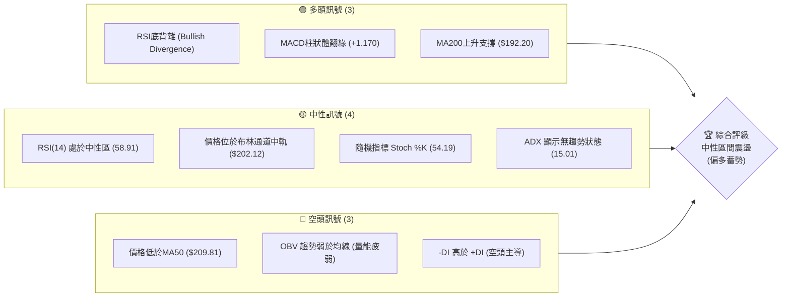

### 📊 核心指標速覽表

| 指標類別 | 指標名稱 | 當前數值 | 訊號 | 解讀 |
|----------|----------|----------|------|------|
| **價格** | 當前價格 | $202.81 | 🟡 中性 | 位於52週區間的 53.8%，處於中軸位置 |
| **均線** | MA20 | $202.12 | 🟢 看多 | 價格略高於MA20，短期獲得支撐 |
| **均線** | MA50 | $209.81 | 🔴 看空 | 價格受制於中期均線，上方存在壓力 |
| **均線** | MA200 | $192.20 | 🟢 看多 | 長期上升趨勢未破，強大底部防線 |
| **動能** | RSI(14) | 58.91 | 🟢 看多 | 數值中性，但日線與週線出現顯著「底背離」 |
| **動能** | MACD | 0.147 | 🟢 看多 | MACD柱狀體為 +1.170，黃金交叉後動能釋放中 |
| **波動** | ATR(14) | $7.35 | 🟡 中性 | 每日波動率約 3.62%，有利於區間波段操作 |

### 🏆 技術評分卡

```
技術評分卡 — NVDA (2026-07-18)
════════════════════════════════════════════════════
趨勢強度      ██████░░░░░░░░░░░░░░  30/100  🟡 中性 (ADX=15.01)
動能指標      ████████████░░░░░░░░  60/100  🟢 看多 (MACD/RSI背離)
支撐穩定度    ██████████████░░░░░░  70/100  🟢 看多 (Fib 50%與S1重疊)
成交量配合    ████████░░░░░░░░░░░░  40/100  🔴 看空 (OBV弱於均線)
形態完整度    ██████████░░░░░░░░░░  50/100  🟡 中性 (W底右肩構築中)
均線排列      ██████████░░░░░░░░░░  50/100  🟡 中性 (混合排列)
════════════════════════════════════════════════════
綜合評分      ███████████░░░░░░░░░  55/100  ⚖️ 中性偏多
════════════════════════════════════════════════════
```

---

## 2. 趨勢分析

### 🌐 多時框趨勢分析

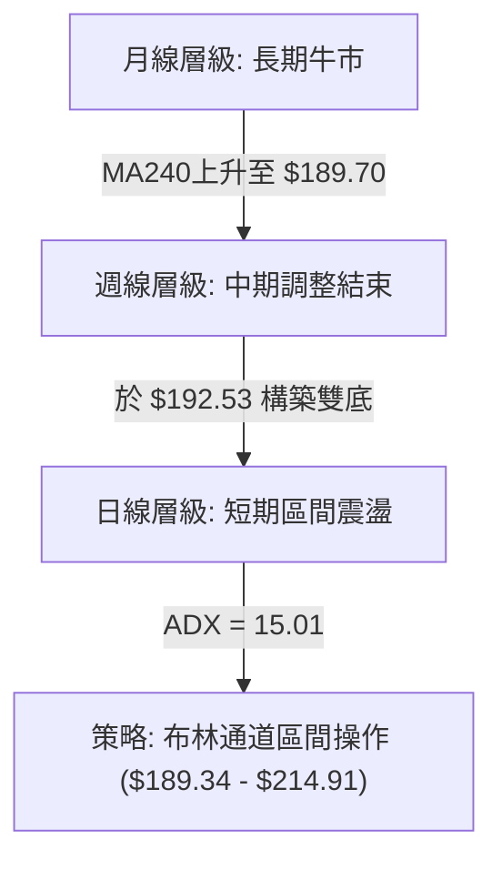

### 📈 長期趨勢 — 12個月走勢圖（Unicode）

NVDA 過去 12 個月呈現「高位震盪、中線回檔、低位企穩」的結構。

```
NVDA 月線走勢圖（過去12個月）
價格軸 ($)
$210.89 ┤                                                 ● (2026-05)
$202.81 ┤                                 ● (2025-10)     │      ● (現在)
$186.34 ┤                 ● (2025-09)     │               │  ● (2026-06)
$177.63 ┤  ● (2025-07)    │   ● (2025-11) ┼───────────────┼──┘
$163.85 ┤  │   ● (2025-08)┘   │           ● (2026-03低點) ┘
        └─┬────┬────┬────┬────┬────┬────┬────┬────┬────┬────┬────┬──
         M07  M08  M09  M10  M11  M12  M01  M02  M03  M04  M05  M06  M07
```

**走勢特徵分析表格**：

| 階段 | 時間區間 | 價格區間 | 漲跌幅 | 走勢特徵 |
|------|----------|----------|--------|----------|
| **第 I 階段** | 2025-07 ~ 2025-10 | $177.63 → $202.23 | +13.85% | 震盪上行，AI 基礎設施需求持續推升股價。 |
| **第 II 階段** | 2025-11 ~ 2026-03 | $202.23 → $174.20 | -13.86% | 中期獲利回吐，價格回踩年線支撐。 |
| **第 III 階段** | 2026-04 ~ 2026-07 | $174.20 → $202.81 | +16.42% | 構築中期雙底，價格重回 $200 關卡，進入橫盤整理。 |

### 📊 中期趨勢（週線分析）

從近 20 週的收盤走勢來看，NVDA 在 2026 年 3 月底觸及 $167.32 的波段低點後，展開了一波強勁的 V 型反彈至 $225.06（5月中旬）。隨後股價再度回撤至 $192.53（6月底），並在該位置獲得支撐。

```
中期週線支撐與阻力示意圖：
[阻力 R2: $232.01] ──────────────────────────────────────────────────
[阻力 R1: $214.16] ───────────────▲ (5月中高點 $225.06) ─────────────
[當前價格: $202.81] ━━━━━━━━━━━━━━━■ (目前位置) ━━━━━━━━━━━━━━━━━━━━
[支撐 S1: $199.34] ──────────────────────────────────────────────────
[支撐 S2: $194.51] ───────────────▼ (6月底低點 $192.53) ─────────────
```

這兩次低點（$167.32 與 $192.53）呈現「低點一底比一底高」的偏多格局，暗示中期買盤在 $190 附近具有極強的防守意願。

### ⚡ 趨勢強度評估（ADX 解讀）

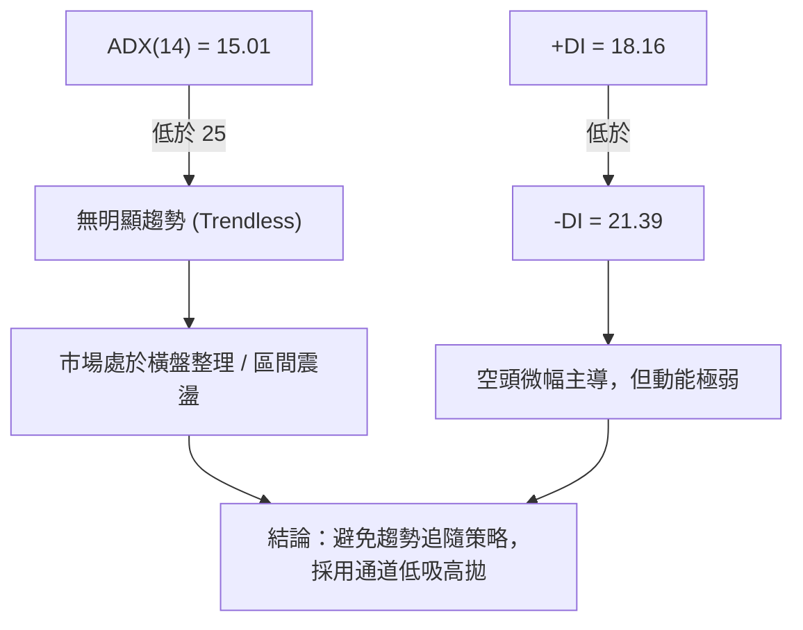

**ADX 趨勢強度對照表**：

| ADX 數值區間 | 趨勢強度 | 適用交易策略 | 當前 NVDA 狀態 |
|--------------|----------|--------------|----------------|
| **< 20** | **極弱 / 無趨勢** | **網格交易 / 布林通道逆勢策略** | **✓ (當前 15.01，典型盤整)** |
| **20 - 25** | **過渡期 / 溫和趨勢**| **觀望 / 尋找突破方向** | |
| **> 25** | **強趨勢** | **均線跟隨 / 突破追單** | |

---

## 3. 圖表形態分析

### 🔍 形態識別系統

根據近期日線與週線的價格走勢，我們識別出一個正在發展中的**雙重底（W底）**形態。

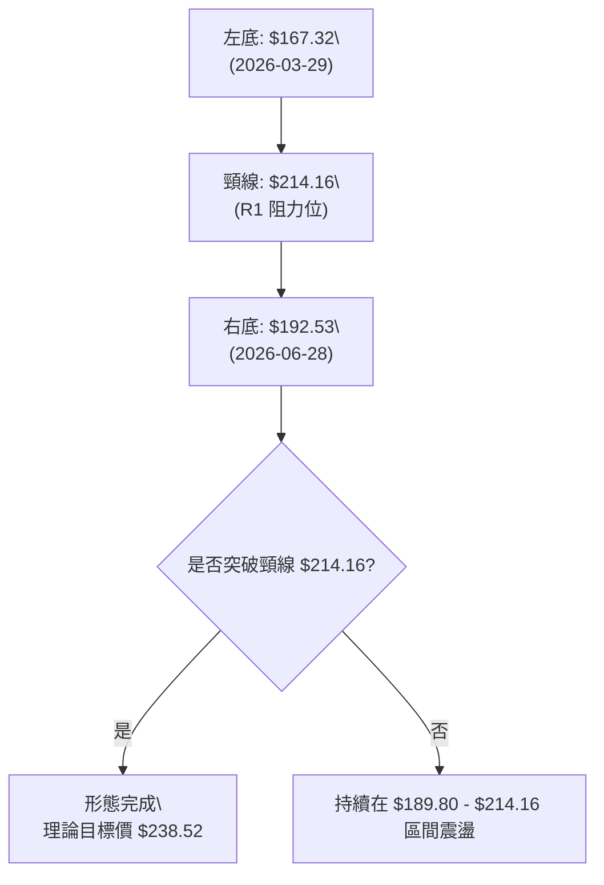

**形態信心度評估表**：

| 形態名稱 | 信心度 | 判斷依據（引用數據） | 完成度 | 目標價（附計算式） |
|----------|--------|----------------------|--------|--------------------|
| **雙重底 (W-Bottom)** | **55%** 🟡 中性 | 左底 $167.32，右底 $192.53（高於左底，健康）。但目前量能萎縮（量比 0.96x），尚未突破頸線。 | 70% | 頸線 $214.16 + 形態高度 ($214.16 - $189.80) = **$238.52** (接近 R3 $236.26) |

*註：由於 ADX 僅 15.01，若量能持續無法放大，此形態有轉化為「箱型整理」的風險。*

### 🕯️ 重要K線形態分析

| 日期/月份 | 收盤價 | K線形態 | 解讀 | 訊號 |
|-----------|--------|---------|------|------|
| **2026-06-28** (週線) | $192.53 | **錘頭線 (Hammer)** | 在 S3 ($189.80) 附近留有長下影線，顯示下方買盤強勁。 | 🟢 看多 |
| **2026-07-12** (週線) | $210.96 | **大陽線 (Marubozu)** | 幾乎以最高點收盤，收復多條短期均線，確認右底企穩。 | 🟢 看多 |
| **2026-07-19** (當前週) | $202.81 | **孕線 (Harami)** | 實體完全包覆在前一週的大陽線內，顯示反彈後進入整理。 | 🟡 中性 |

### 📉 ASCII 走勢形態示意圖

```
NVDA 雙重底 (W-Bottom) 構築示意圖
價格 ($)
$214.16 ┤          [頸線位] ───●
        │                     / \
$202.81 ┤                    /   ● [當前位置]
        │                   /     \
$192.53 ┤                  /       ● [右底: 2026-06-28]
        │   ●             /
$167.32 ┤───┴─●──────────┘
             [左底: 2026-03-29]
```

### 🎯 形態目標價計算

當價格確認有效突破並站穩頸線 **$214.16** (R1) 時，雙重底形態正式宣告完成。
* **形態高度 (H)** = 頸線 ($214.16) - 右底低點 ($189.80，取自關鍵支撐 S3) = **$24.36**
* **最小測幅滿足點** = 頸線 ($214.16) + H ($24.36) = **$238.52**
* **第一目標價**：**$232.01** (R2 阻力位)
* **第二目標價**：**$236.26** (52W 高點 / R3 阻力位)

---

## 4. 支撐與阻力

### 🗺️ 關鍵價位分布圖（Unicode）

```
NVDA 價位結構分布圖
═══════════════════════════════════════════════════
$236.26 ║████████████████████████║ 52W 歷史高點 / 強阻力 R3
$232.01 ║████████████████████    ║ 密集籌碼套牢區 / 阻力 R2
$214.16 ║████████████████████████║ 雙底頸線 / 關鍵阻力 R1
$202.81 ╠════════════════════════╣ ◄ 當前價格
$199.34 ║▓▓▓▓▓▓▓▓▓▓▓▓▓▓▓▓        ║ 短期買盤防守線 / 近期支撐 S1
$194.51 ║████████████████████    ║ 箱體中軸支撐 / 支撐 S2
$189.80 ║████████████████████████║ 布林下軌與密集波段低點 / 強支撐 S3
═══════════════════════════════════════════════════
```

### 🚧 阻力位分析表

| 阻力級別 | 價位 | 形成原因 | 突破難度 | 重要性 |
|----------|------|----------|----------|--------|
| **R1** | **$214.16** | 近一年波段高點聚類、雙底頸線、布林上軌 ($214.91) | ⚠️ 中等 | 極高。此關卡為多空分水嶺，突破則宣告波段漲勢啟動。 |
| **R2** | **$232.01** | 前期密集成交套牢區、歷史次高點 | 🔥 困難 | 高。此處累積大量歷史套牢盤，需要成交量顯著放大方能消化。 |
| **R3** | **$236.26** | 52週歷史最高點 | 🛑 極難 | 中等。突破此處將打開上行無阻力空間。 |

### 🛡️ 支撐位分析表

| 支撐級別 | 價位 | 形成原因 | 守住機率 | 重要性 |
|----------|------|----------|----------|--------|
| **S1** | **$199.34** | 近一年波段低點聚類、斐波那契 50.0% 回調位 ($200.06) | 🟢 偏高 | 高。整數關卡與斐波那契重合，為短線多頭必須死守的防線。 |
| **S2** | **$194.51** | 近期回撤低點聚類、MA120 均線支撐 ($196.45) | 🟢 高 | 中等。若跌破此處，中期多頭結構將受損。 |
| **S3** | **$189.80** | 波段最低點聚類、布林下軌 ($189.34)、MA240 ($189.70) | █ 極高 | 極高。此處為長期牛市的「馬奇諾防線」，跌破則中期趨勢轉空。 |

### 📐 斐波那契回調位分析

當前價格 **$202.81** 正好處於斐波那契 **38.2% ($208.60)** 與 **50.0% ($200.06)** 之間。

```
斐波那契回調位與現價關係：
0.0%   (52W High) ── $236.26
23.6%             ── $219.18
38.2%             ── $208.60  ◄ 上方第一技術壓力
[當前價格]         ── $202.81
50.0%             ── $200.06  ◄ 下方第一強支撐 (與 S1 $199.34 重疊)
61.8%             ── $191.51  ◄ 黃金分割強支撐 (與 S3 $189.80 重疊)
```

**解讀**：
1. **50.0% 回調位 ($200.06)** 提供了強大的心理與技術支撐，與近期密集支撐區 S1 ($199.34) 形成「共振支撐帶」。
2. **38.2% 回調位 ($208.60)** 則與 MA50 ($209.81) 形成共振阻力帶。股價必須有效站穩 $208.60，才能進一步挑戰頸線 $214.16。

---

## 5. 技術指標深度解讀

### 🎛️ 指標訊號總覽

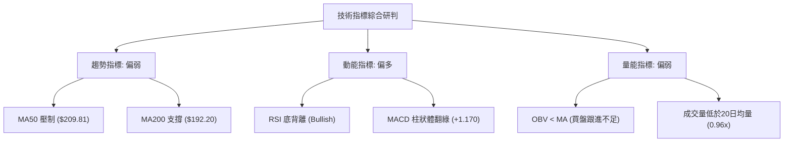

### 📈 移動平均線排列分析

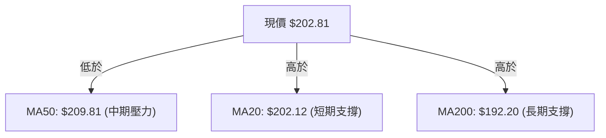

**均線狀態說明表**：

| 均線名稱 | 當前數值 | 走勢方向 | 與現價關係 | 技術含義 |
|----------|----------|----------|------------|----------|
| **MA 5** | $207.61 | ▼ 下行 | 現價低於此線 | 短線面臨輕微回吐壓力。 |
| **MA 20**| $202.12 | ▲ 上行 | 現價高於此線 | 短期多頭奪回主導權，提供即時支撐。 |
| **MA 50**| $209.81 | ▼ 下行 | 現價低於此線 | 中期趨勢仍受壓制，為多頭上攻的最大障礙。 |
| **MA200**| $192.20 | ▲ 上行 | 現價高於此線 | 長期牛市格局未變，中長線資金在此積極護盤。 |

### 📉 RSI(14) 分析

* **當前數值**：**58.91** 
* **強度展示**：███████████░░░░░░░░░ 58.91% (中性偏強)

```
RSI(14) 底背離示意圖：
價格走勢：  $167.32 (3/29)  ───────────►  $192.53 (6/28)  [低點抬高 ↗]
RSI(14)：   31.4 (3/29)     ─── 🟢 ───►  38.7 (6/28)     [指標顯著抬高 ↗]
```

**背離判斷**：日線與週線均出現顯著的**底背離 (Bullish Divergence)**。當價格在6月底回踩低點時，RSI並未同步創下新低（維持在 38.7，遠高於3月的 31.4）。這通常是**賣壓耗盡、中期底部確立**的強烈訊號。

### 📊 MACD(12/26/9) 訊號解讀

* **MACD 線**：0.147
* **訊號線 (Signal)**：-1.023
* **柱狀圖 (Histogram)**：**+1.170** (🟢 看多)

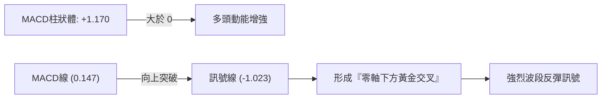

### 📦 布林通道分析

* **BB 上軌**：$214.91 (壓制位)
* **BB 中軌**：$202.12 (多空平衡點)
* **BB 下軌**：$189.34 (強支撐)
* **當前 %B**：**0.53** (幾乎精確貼合中軌)

```
布林通道與現價位置示意圖：
$214.91 ├─────────────────────────── [布林上軌]
        │
$202.81 ├───────────────● [現價] ─── [布林中軌: $202.12]
        │
$189.34 ├─────────────────────────── [布林下軌]
```

**解讀**：布林帶寬度正在收窄，且 %B 處於 0.53 的平衡位置。這意味著市場正在進行**蓄勢整理（Squeeze）**。在 ADX < 25 的背景下，股價預計將在下軌 $189.34 至上軌 $214.91 之間進行區間震盪，直到成交量放大引導突破。

### 💹 成交量分析（量價配合度）

* **最新成交量**：138,213,660
* **20日均量**：144,691,088 (量比: **0.96x**)
* **OBV 趨勢**：OBV < MA (量能疲弱)

**量價背離警告**：雖然價格從 6 月底的 $192.53 反彈至目前的 $202.81，但整體成交量並未同步放大（量比低於 1.0x），且 OBV 指標依然受制於其移動平均線。這顯示**當前的反彈主要是由於「賣壓減輕」，而非「買盤強烈追價」**。若要有效突破 R1 ($214.16)，必須見到日成交量回升至 1.5 億股以上。

---

## 6. 動能與波動率

### ⚡ 動能評估四象限

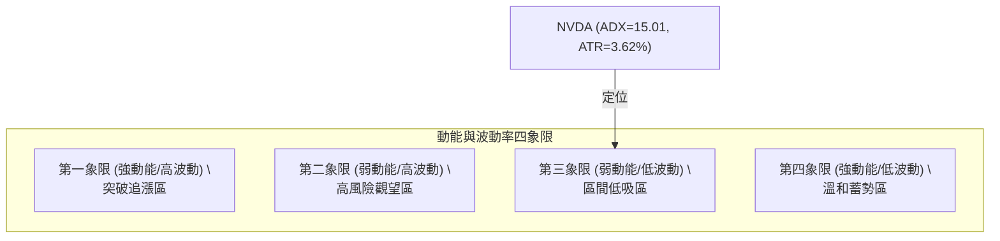

| 象限 | 動能 (RSI/MACD) | 波動 (ATR/BB帶寬) | 當前狀態 | 交易策略 |
|------|------|------|----------|------|
| **Q1** | 強 | 高 | - | 突破跟隨，追漲買入 |
| **Q2** | 弱 | 高 | - | 避開，波動大且無方向 |
| **Q3** | **弱 (橫盤)** | **低 (收縮)** | **✓ (當前狀態)** | **網格交易，低吸高拋** |
| **Q4** | 強 | 低 | - | 鎖定利潤，等待突破 |

### 📊 ATR 波動率分析

* **ATR(14)**：**$7.35** (佔當前股價之 **3.62%**)
* **技術意義**：此數值代表 NVDA 的每日正常波動區間。在設置止損時，應避免將止損點設在 1 倍 ATR 之內，以防被市場噪音隨機掃出場。
* **風控建議**：
  * **短線交易止損距離**：1.5 倍 ATR = $11.03
  * **波段交易止損距離**：2.0 倍 ATR = $14.70

### 📐 Beta 與市場相關性

* **Beta 值**：**2.211**
* **解讀**：NVDA 的波動性是大盤（S&P 500）的 2.21 倍。在市場出現系統性風險時，NVDA 的跌幅可能顯著大於大盤；同理，在大盤企穩反彈時，其彈性也將最為強勁。

---

## 7. 多時框架總結

### 📋 時框架評分表

| 時框架 | 趨勢方向 | 動能 | 均線排列 | 形態 | 綜合評分 | 建議 |
|--------|----------|------|----------|------|----------|------|
| **日線** | 🟡 橫盤震盪 | 🟢 偏多 (MACD金叉) | 🟡 混合 (MA20支撐) | 🟡 W底右肩 | **55/100** | 布林通道內高拋低吸 |
| **週線** | 🟢 震盪上行 | 🟢 看多 (RSI底背離) | 🟢 多頭排列 | 🟢 雙底結構 | **70/100** | 逢回調分批佈局中線多單 |
| **月線** | 🟢 強勢多頭 | 🟡 中性 | 🟢 完美多頭排列 | 🟢 上升通道 | **85/100** | 長線堅定持有 |

### 🔲 綜合訊號矩陣

```
           【短期 (日線)】      【中期 (週線)】      【長期 (月線)】
趨勢指標       🟡 中性              🟢 看多              🟢 看多
動能指標       🟢 看多              🟢 看多              🟡 中性
量能配合       🔴 看空              🟡 中性              🟢 看多
支撐強度       🟢 看多              🟢 看多              🟢 看多
```

### ⚖️ 多時框收斂結論

> **當前市場定位：盤整行情 (ADX = 15.01 < 25)**
> 
> **收斂邏輯**：
> 依據「多時框收斂規則」，當前 ADX 低於 25，市場定義為**盤整行情**。此時應**以日線布林通道上下軌 ($189.34 - $214.91) 為主要交易區間**。
> 
> 雖然中長期（週線/月線）趨勢依然維持多頭格局，但短期受制於 MA50 ($209.81) 阻力，且量能不足（量比 0.96x），不具備連續單邊暴漲的條件。因此，**最終方向性結論定性為：中性區間震盪，偏多蓄勢**。

---

## 8. 交易策略建議

### 🗺️ 策略決策流程圖

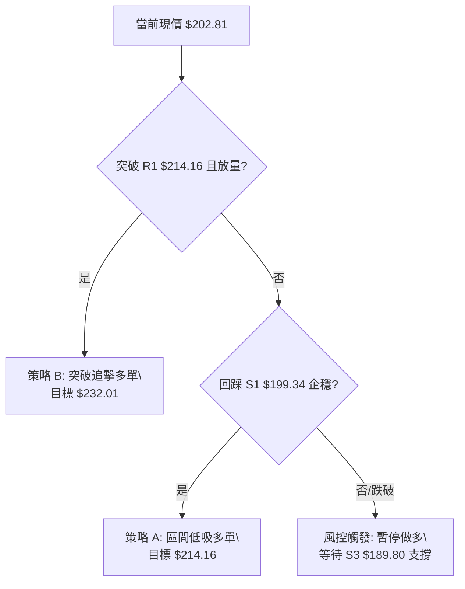

### 🧭 策略路由

* **當前主策略方向**：**中性區間震盪操作（偏多低吸）**（依綜合評分 55/100）
* **核心邏輯**：在未放量突破 $214.16 之前，不盲目追高。利用 RSI 底背離與 Fib 50% 的共振支撐，在區間下軌附近逢低佈局。

### 🎯 價格情境階梯（Price Scenarios）

| 觸發條件 | 下一目標 | 後續延伸 | 情境含義 |
|----------|----------|----------|----------|
| **放量突破 R1 $214.16** | **R2 $232.01** | **R3 $236.26** | 雙底形態確立，中期調整結束，重回多頭軌道。 |
| **站穩現價區間 $202.81** | **Fib 38.2% $208.60** | **R1 $214.16** | 區間內溫和震盪，時間換取空間。 |
| **跌破 S1 $199.34** | **S2 $194.51** | **S3 $189.80** | 短期轉弱，多頭防線後移，需注意防守。 |

### 📊 情境機率分佈

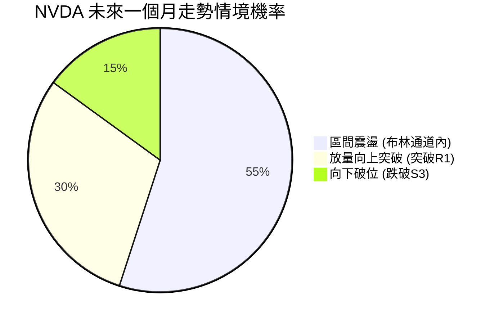

* **區間震盪 (55%)**：ADX 低迷，暑期市場交投清淡，缺乏催化劑。
* **向上突破 (30%)**：RSI底背離與MACD黃金交叉提供上攻動能，若有買盤配合隨時可能發動。
* **向下破位 (15%)**：長期均線 MA200 支撐強勁，大跌機率較低。

### 🟢 主策略詳情

| 策略要素 | 策略 A（區間低吸 - 主力策略） | 策略 B（突破追擊 - 備用策略） |
|----------|--------------------------------|--------------------------------|
| **進場條件** | 價格回踩 S1 企穩，日線 RSI 守住 50 | 日線收盤價有效突破 R1，且成交量 > 1.5 億股 |
| **進場價格** | **$200.06** (Fib 50.0%) 至 **$199.34** (S1) | **$215.00** (突破 R1 後確認) |
| **目標價 T1**| **$208.60** (Fib 38.2% 壓力位) | **$232.01** (R2 強阻力位) |
| **目標價 T2**| **$214.16** (R1 頸線位) | **$236.26** (52W 歷史高點) |
| **止損價格** | **$192.50** (略低於右底與 MA120) | **$208.60** (跌回突破口下方) |
| **風險報酬比**| **1 : 2.05** (風險 $7.56，利潤 $15.5) | **1 : 2.69** (風險 $6.40，利潤 $17.26) |
| **成功機率** | **65%** | **55%** |
| **建議倉位** | **15%** | **10%** |

### 🔴 反向風險觸發點（對沖提示）

若日線收盤價**跌破 $189.34** (布林下軌 / MA240)，宣告主策略失效。此時應：
1. 立即停止所有多單進場。
2. 多頭部位實施減碼或全額止損。
3. 可考慮利用期權進行下行對沖，目標看至 **$179.35** (Fib 78.6%)。

### ⭐ 整體訊號強度評星

```
做多訊號強度：★★★☆☆  (3.5/5星 - RSI底背離與週線雙底支持)
做空訊號強度：★★☆☆☆  (2.0/5星 - 長期牛市格局下，做空空間有限)
整體可信度：  ★★★☆☆  (3.5/5星 - 盤整市況中，技術指標信賴度中等)
```

---

## 9. 風險提示與監控

### ✅ 關鍵監控指標 Checklist

```
╔══════════════════════════════════════════════════════════════╗
║              NVDA 每日交易監控清單                             ║
╠══════════════════════════════════════════════════════════════╣
║ [ ] 成交量是否突破 1.5 億股？ (確認突破有效性)                ║
║ [ ] 價格是否跌破 $199.34 (S1)？ (警惕短期轉弱)               ║
║ [ ] RSI(14) 是否跌破 50 中軸？ (動能轉弱訊號)                ║
║ [ ] MACD 柱狀體是否由綠翻紅？ (反彈動能衰竭)                 ║
║ [ ] ADX 是否突破 20 並向上彎頭？ (趨勢即將啟動)               ║
╚══════════════════════════════════════════════════════════════╝
```

### ⚠️ 風險場景分析

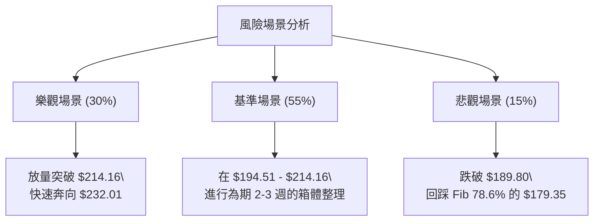

### 🛡️ 風險管理重要提醒

1. **波動率管理**：NVDA 的 Beta 高達 2.211，意味著其波動幅度遠超一般個股。在盤整行情中，切忌在箱體中間位置（如當前 $202.81 附近）重倉追漲殺跌，應嚴格執行「非支撐不買，非阻力不賣」的紀律。
2. **倉位控制**：鑑於 ADX 顯示當前無強烈單邊趨勢，整體技術部位持倉建議控制在 **25% 總資金量**以內，保留充足現金以應對可能的破位回踩。
3. **事件風險**：技術分析無法預測突發的半導體出口管制政策或大客戶砍單傳聞。一旦出現基本面重大利空，應無視技術支撐，嚴格執行價格止損。

---

## 📋 報告總結

```
NVDA 技術分析報告總結
════════════════════════════════════════════════════════
報告日期：2026-07-18
當前價格：$202.81
分析評級：⚖️ 中性偏多 (區間震盪，蓄勢突破)

關鍵結論：
├─ 長期趨勢：🟢 看多 (MA200 保持上行，長期牛市結構完整)
├─ 中期趨勢：🟢 看多 (週線 W 底右肩企穩，RSI 出現強烈底背離)
├─ 短期趨勢：🟡 中性 (受制於 MA50 $209.81，短期量能不足)
├─ 關鍵支撐：$199.34 (S1) / $189.80 (S3)
├─ 關鍵阻力：$214.16 (R1) / $232.01 (R2)
└─ 分析師目標均值：$301.97 (相較現價有 48.8% 溢價空間)

最優策略組合：
1. 🥇 最佳機會：在 $199.34 - $200.06 區域逢低佈局多單，止損 $192.50，目標 $214.16。
2. 🥈 次選機會：若股價放量突破 $214.16，順勢追擊多單，目標 $232.01。
3. 🥉 保守選擇：在 ADX 升至 20 以上前，保持觀望，或使用網格工具在 $190 - $214 區間套利。
════════════════════════════════════════════════════════
```

---

> ⚠️ **免責聲明**：本報告為 AI 自動生成之技術分析，所有數據及估算均基於提供的歷史價格資訊。本報告**僅供研究與學術參考**，**不構成任何投資建議**。投資有風險，入市需謹慎。

---

*報告生成時間：2026-07-18 ｜ 數據來源：Yahoo Finance ｜ 分析框架：多時框技術分析*