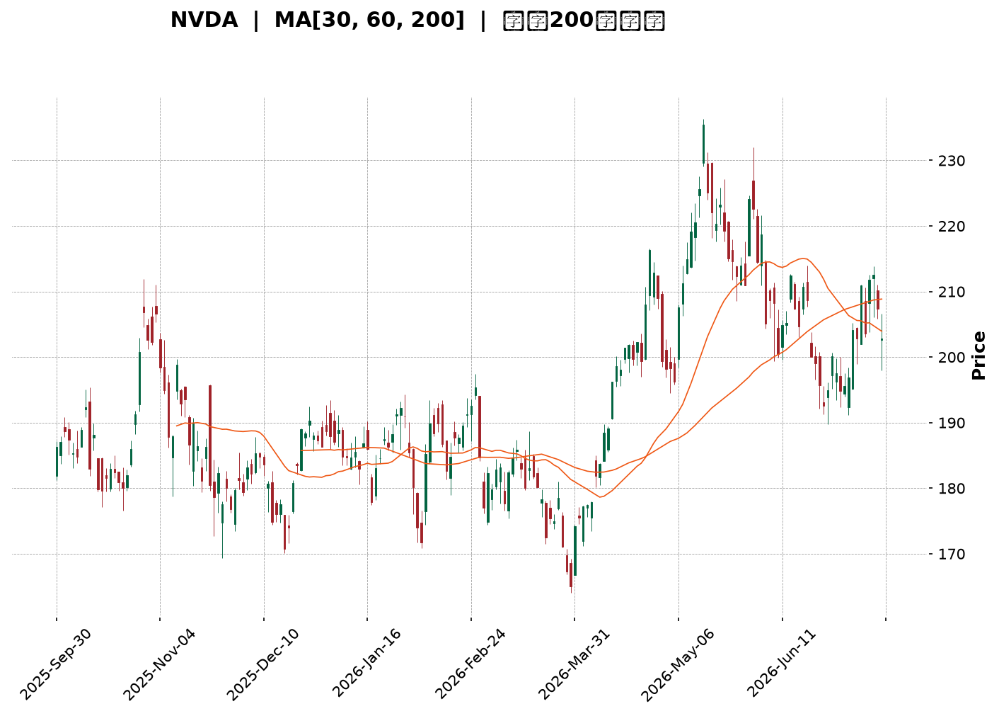
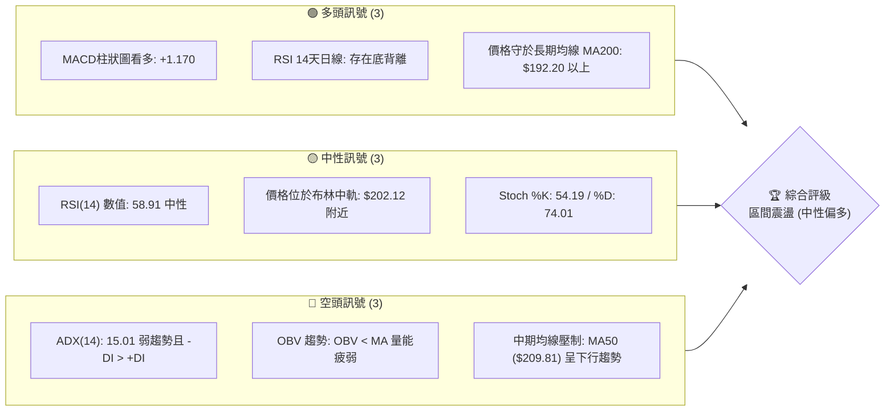
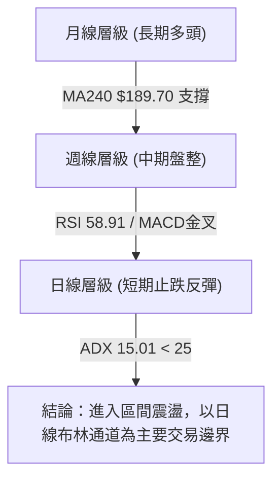
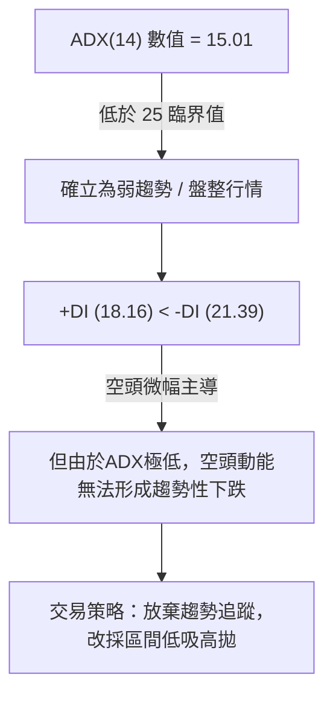
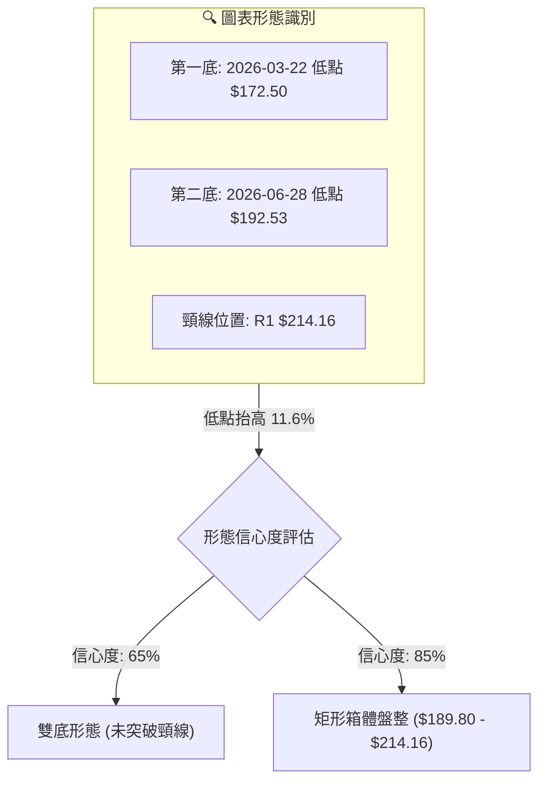
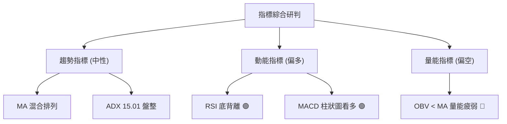
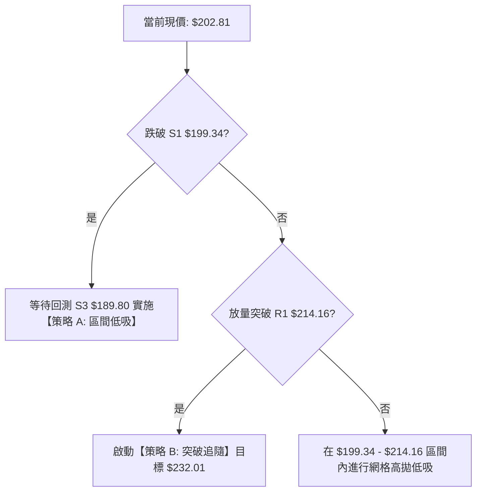
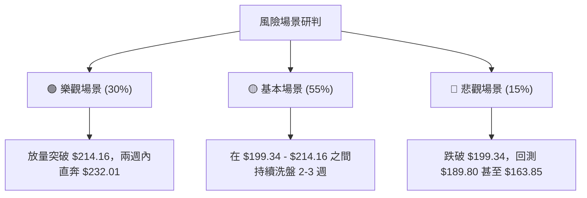

<details>
<summary>📊 靜態圖表 (點擊展開)</summary>

</details>

<html>
<head><meta charset="utf-8" /></head>
<body>
    <div style="height:500px; width:100%;">                        <script>window.PlotlyConfig = {MathJaxConfig: 'local'};</script>
        <script charset="utf-8" src="https://cdn.plot.ly/plotly-3.7.0.min.js" integrity="sha256-jvTGqxNp8AGWEcvNLVuKr+8j5dGe9Yw51LQkmDH+IYA=" crossorigin="anonymous"></script>                <div id="candlestick-chart" class="plotly-graph-div" style="height:100%; width:100%;"></div>            <script>                window.PLOTLYENV=window.PLOTLYENV || {};                                if (document.getElementById("candlestick-chart")) {                    Plotly.newPlot(                        "candlestick-chart",                        [{"close":{"dtype":"f8","bdata":"AAAAYPRKZ0AAAABgDGBnQAAAAODHlGdAAAAAIDFsZ0AAAACAtylnQAAAAMC8GWdAAAAAwM+bZ0AAAAAAZApoQAAAAICn3WZAAAAAYJCCZ0AAAAAgn3lmQAAAAOA6c2ZAAAAAYIKyZkAAAABgkt9mQAAAACAJzWZAAAAAYLydZkAAAACAnIFmQAAAAOCxvWZAAAAAILpAZ0AAAADg3+dnQAAAACDEGGlAAAAAQNfYaUAAAADANVRpQAAAACBtR2lAAAAAILrTaUAAAAAg+81oQAAAAGDDXmhAAAAA4OR6Z0AAAABgIX1nQAAAAKB82WhAAAAAID8daEAAAABAszFoQAAAAEDnU2dAAAAAILC9Z0AAAAAgmEtnQAAAAKAgpGZAAAAAgAlJZ0AAAADgHY1mQAAAAEDeVGZAAAAAoCjKZkAAAADg\u002fTJmQAAAAMD4gGZAAAAAAMkYZkAAAABAG3ZmQAAAAOBSp2ZAAAAAQI9rZkAAAADgAuVmQAAAAGACxmZAAAAAAF4qZ0AAAABg1BdnQAAAAMDL8WZAAAAA4LSWZkAAAABA0dllQAAAAEBoAmZAAAAAoBwwZkAAAACAaldlQAAAAACxvWVAAAAAAKCYZkAAAABg6+5mQAAAAEBYn2dAAAAA4CqMZ0AAAABgiMlnQAAAAOCzf2dAAAAAIPhpZ0AAAADAukhnQAAAAKDWk2dAAAAAwIF8Z0AAAACgYWBnQAAAAOAlnGdAAAAAABEaZ0AAAABAUBRnQAAAAODeFmdAAAAAQK0yZ0AAAABAV91mQAAAAOBOWmdAAAAAoBlAZ0AAAACATDtmQAAAACAY42ZAAAAAoKwTZ0AAAADAH25nQAAAAGDFR2dAAAAAgEqJZ0AAAACALOlnQAAAAMDQCGhAAAAAoLXcZ0AAAADASCxnQAAAAIDZg2ZAAAAAQEq\u002fZUAAAADAdXVlQAAAAIDkJWdAAAAAIN+5Z0AAAAAg7olnQAAAACAxumdAAAAAAMtWZ0AAAAAgy9JmQAAAAGDUF2dAAAAAIAh4Z0AAAACgeXVnQAAAAEDXsmdAAAAAACLqZ0AAAADArhNoQAAAAOBLamhAAAAAwEUVZ0AAAABALB9mQAAAACA\u002fyGZAAAAAwJR6ZkAAAAAAJdpmQAAAAIC742ZAAAAAAE8zZkAAAAAArs1mQAAAAOBvEWdAAAAAoAc6Z0AAAABgqN1mQAAAAABJgWZAAAAAADfgZkAAAACA+7ZmQAAAAGAUhmZAAAAAoERLZkAAAABg949lQAAAAODv7WVAAAAAgN\u002ffZUAAAACAGk9mQAAAACBNYWVAAAAAQGbqZEAAAACASZ9kQAAAAKBNxmVAAAAAAHTxZUAAAAAg3yVmQAAAAMDcLWZAAAAAwJA8ZkAAAAAAx7tmQAAAAOBE9mZAAAAAICKNZ0AAAAAg3qJnQAAAAOD\u002fiGhAAAAAgG7UaEAAAACgz8NoQAAAACA\u002fLmlAAAAAgGQ6aUAAAADgtvRoQAAAAOB0SGlAAAAAAAvtaEAAAACg4QBqQAAAAGBzC2tAAAAAwH+dakAAAACANCBqQAAAAEDO6mhAAAAA4AHHaEAAAABA98doQAAAAACuiGhAAAAAYNHyaUAAAAAAH2hqQAAAACBi3mpAAAAAwOdla0AAAABAvJBrQAAAAMAlMmxAAAAAAOZubUAAAADA2CFsQAAAAGD1wWtAAAAAQE2La0AAAAAgt+ZrQAAAAIAkaGtAAAAA4IniakAAAAAghNNqQAAAAMBHi2pAAAAAwATAakAAAABgnVxqQAAAAIApA2xAAAAAgPDRa0AAAAAAANBqQAAAAMAeVWtAAAAAQDOjaUAAAADgehRqQAAAAIAUBmpAAAAAoHANaUAAAAAA15tpQAAAAIAUpmlAAAAAYGaOakAAAADAHu1pQAAAAMDMlGlAAAAAgBRWakAAAADAzBRqQAAAAKBHAWlAAAAAAADgaEAAAAAgrndoQAAAAMD1EGhAAAAAQApfaEAAAABA4QJpQAAAAGCPsmhAAAAAYI9aaEAAAACgmXFoQAAAAIDCnWhAAAAAANeDaUAAAADA9VhpQAAAAGC4XmpAAAAAwPVwaUAAAACgmXlqQAAAAAAAkGpAAAAAwMzsaUAAAACA61lpQA=="},"high":{"dtype":"f8","bdata":"WWcAN5BjZ0DpKOq7z3xnQLyWDBbQ2WdASbk7qMLDZ0CcFVxdul9nQLi\u002fN602mmdAa8gCw3irZ0CVIxWjo2FoQPtpTrvda2hACAVFUsW7Z0DGLoU5ERJnQHryjOhNFGdApf45SX3hZkAJxjgxsvtmQFWQrenZHmdAtHjHPdTRZkB3s11GmuZmQMf44st\u002f2WZAPeJs32VnZ0B89JVtLPhnQKTfDwGFXGlA8hMHY259akCTJcaAt7xpQBef1xCQ9mlAL8lN1UNiakCy4urGuXZpQOvUACwrVWlAbwa89MiraEDodtNZkIJnQDYvlzbu9WhABnC9anllaECSL6uwfnRoQOAzOdVG5mdAzDr7m4jYZ0DUaufUS5hnQBRteToREmdATexQxNxzZ0DVPXC3AnhoQPZ0lHllCmdAOmUYFoXoZkCVJ7aT2z1mQAFAc\u002fip1WZA+kOWuvhhZkAZPutIQIJmQNIpgWyNLWdAWzP\u002fh\u002fbGZkA0QXNfcglnQJ47w+vrDWdAjTMb7at4Z0A7a\u002fjjzC9nQFWgASkhKGdARSiX+yujZkD4oMcIHdNmQEsnF\u002f57RmZA3hzB0LhIZkDeRwU0S\u002f1lQBF11NDu\u002fWVAjsfgqFOnZkCHA0Xv8P1mQH42dQ0uo2dApFSPgcGVZ0CMJciRkQ5oQCAtbRz2kGdAeyCwJ1CYZ0C6DU67fcpnQJqPqig9FmhAohf+w5wsaEBuvYHt8v1nQGRTMTJh5GdAKsbt\u002fTWqZ0AMc9ianUNnQHw+nJ6LXGdAfy4x7C98Z0DqJ7+ThwdnQNXInS0Br2dA7chf\u002fKfGZ0DdKlX9DMVmQN3uaBHvJGdAYx4mui4+Z0DA8T8dz6tnQPJy7q13nGdANvnl2pe4Z0DgYHCXswNoQMuX7FHRJ2hAHg0QOBlIaECJfLBxLsJnQKuY5\u002fFgQWdAk92DVo9rZkDaw7bzWBNmQNvAD+K1WGdAN5PKH5ItaECSF3VO2wdoQOy1t1fJIGhAYn5tEPkraEAg6g7SsGhnQIRhwh6BXWdAPz\u002f4JWvEZ0DvSwAWaoZnQLOEIQkkw2dA2N9xzNY2aEA7lrAxFjFoQPFwjbd0rGhAsfYlsbRBaECRCX4cw8tmQKhwZZiR52ZA4ohnZL+VZkCToicvMw9nQAVjd5C++mZAg4TyEzLRZkAA2L1n\u002fdVmQGWmXdXPRmdAu6opttlsZ0A2L5zVMBdnQILyLY7yO2dA9qozxh+VZ0AZwWmo5CVnQOrzzjRU5WZAoC84tad4ZkBMEMDZrUFmQPjbGvcxRWZALfmypXkAZkCUIuYGSqBmQG78YZ6+CWZABcP\u002fuKtYZUBWtCxvFihlQDwY6sZVzWVAtvQgjTslZkDGLtdrESlmQEfSzBGoMmZA4TKkYrhAZkAKqq4sayFnQPvO+OCz+2ZAHYZcD+y4Z0B\u002fUIEJDq5nQAAAAOD\u002fiGhASBnLqFUFaUC2Fd5RwfNoQJJMKc\u002fiLmlASmpxk+g9aUA3pXeBclBpQAAAAOB0SGlAsgq4ivdyaUATNPGQilZqQN5\u002f44Z7EmtAxk6MX1zPakB0QZaoHY9qQB1IsQvEQWpANT78G3BYaUB2HVZB2C9pQI0v+3Q4AGlAsW\u002fJreEAakBhoEega75qQIVlgZR8MWtATZeNmVHBa0Bywhgtqu9rQOIa63RkcmxAMYH23neIbUASrZxQYOdsQEVRwqJut2xAXtjiV\u002f8GbEAtgAGCvDtsQPTcoSFUZGxArbElNRaYa0BQa87WoT1rQLYy33fSvGpAOUBmg5zoakBUrXaKZzNrQN0y64J2E2xA79kRiE4AbUDl0\u002fuJ8NFrQAAAAEAzs2tAAAAAANfbakAAAABACk9qQAAAAMDMbGpAAAAAQArnaUAAAADAHrVpQAAAAIA94mlAAAAAYLiWakAAAAAgrm9qQAAAAGC4JmpAAAAA4HpsakAAAAAgrr9qQAAAAOCjeGlAAAAAoHA1aUAAAACgmRlpQAAAAKCZcWhAAAAAgMKFaEAAAAAAKRRpQAAAAEAz+2hAAAAAgOsBaUAAAACgmbFoQAAAAMAezWhAAAAAwB6laUAAAABA4ZJpQAAAAAAAYGpAAAAAgD1SakAAAACgmZFqQAAAAIDruWpAAAAAYI9iakAAAADAzNRpQA=="},"hovertemplate":"\u003cb\u003e%{x|%Y-%m-%d}\u003c\u002fb\u003e\u003cbr\u003e\u958b: $%{open:.2f}\u003cbr\u003e\u9ad8: $%{high:.2f}\u003cbr\u003e\u4f4e: $%{low:.2f}\u003cbr\u003e\u6536: $%{close:.2f}\u003cextra\u003e\u003c\u002fextra\u003e","low":{"dtype":"f8","bdata":"W0o3WPanZkDBUOvZTfVmQFJ9KClBemdAdjgBgJokZ0DDobpPFuNmQGjpK\u002fp\u002f+GZA3P50Ea1JZ0DrB9jBIdpnQB9KLPUtumZAyPlt4CM3Z0CdLo8xE29mQLvWLqENImZAAKBgCVBxZkCLb39VrHBmQLdm0t7zr2ZAhYj+cEVyZkA18lZbHRFmQGPJRHvzcWZAkqdrDYXoZkBjk5suFIZnQHN5XElM9WdAu88D9ZyQaUColooR6SRpQF2o+eEAOmlAwVRZZoqpaUB6t00OsbVoQBDZ+5fdTGhAU8UJPZBEZ0DwErfL01VmQLDoyoJhMWhAXmy7aM3hZ0D1tsd8XtxnQKrKvci082ZAtoxQ8zKLZkAbr40qugJnQOZUEBh6bWZAam2FgRvTZkCUcmF+3nNmQO3eyte1lmVAtW3ydyoIZkANyQdNsCplQBBkcBRqQGZAcgGvN84IZkC1GYA8rq5lQFyPIbypeGZAbQI6IjhcZkBmPKZhtHdmQOyCKFgRlmZAI7kuj7DFZkAC4z8XGONmQLcoNP0uumZAat0uY\u002fQMZkAShe5dCM1lQPfnIvMi2mVARlOyRPvVZUBkxprJR0NlQNhMKMeKc2VAkboxhwEEZkA4P1d\u002fF8RmQH0vsper1WZAmLqnKJtLZ0DtVXTfq3hnQCB9k23fNWdAh6taFnlWZ0Br1Ij5aEhnQAGVVCP7gGdAESqdKIs9Z0BMrfQw9VJnQFW9t7KlSmdAENfRBY\u002fvZkBggkSgR+5mQAWPKWmB2WZAvHLTjKblZkAv+QpajZJmQH8Ags9LQ2dAHWwzX047Z0A1lSu3mCxmQCkn9HjYRWZAVQXa9Jb2ZkAfp4ob9VJnQAG7RApuOGdALzGSJCkvZ0BSDzukerNnQN\u002fy5b2qOmdAB+PhcKenZ0AV4Qnp8xRnQMR4TmR9AGZAlPiQQGt2ZUCBb4X7SlplQBsrIeBkzGVAaoZlpjr3ZkDZpfiwgXxnQB1u5iVIkWdAWxOGqgxJZ0AX19YMzatmQBc8xWfGXmZANMHjDApRZ0Cvo4z64S1nQLeKJPjUNmdAAzQAaSurZ0DYmRejfmVnQM4wAKq5MWhAx00zEA4DZ0AXf1LVSAVmQMCamByszWVAABCu\u002fIoWZkDFSA6d5npmQAtXwL05NWZANVSs+lgTZkCjZCCBE+tlQOjaeWs5uWZA9L9vUYcHZ0ALNHDBOrFmQGC01HRgd2ZAjszBwlymZkDPO1ji\u002fa5mQNKu36rXg2ZAqryuKrvyZUBd\u002f5KYpHBlQPQHaETP0WVAKe+V4uC4ZUC+sayznBRmQJIPJdQaXmVAxwkqHRnaZEBxKytVhYJkQDAUIDOA2GRA4zFJiX3RZUC9BYOpdGVlQG6A563F8WVAkU3jl6auZUDXDIM54oJmQIIiH4AcjWZA0pkNC7wCZ0DWH63LwjBnQN7NKJ2I0WdAXi5JeWNwaEBkWzsZoHJoQIBwxns34WhAYpDEfoKzaED\u002fLVxElthoQDrRoUCW2GhA\u002fMISdLGfaEDum6buefJoQN5RIEZv5GlAjvNb5aT+aUCiowPN0+ppQIYVDWz\u002fzmhAo971Ln+caEDoYfHqbFBoQOd1ezuoeWhAQ7GGDR\u002fMaEDQL+euTshpQEhOfKeMlGpApZrbDYO0akDD3H0Cb9VqQNwzGYD8qWtAOMcx6g6hbEAOdaOsU\u002f9rQJ4KNIu0Q2tAeU61nwA1a0AbVs4yyYdrQEptXDGkNWtACavpLZnRakCz\u002fTNGGnhqQHfaIq4uEWpAnM935StfakBAS2aYS1xqQEZjNFZd7mpA7qDoRPSia0CBSvIpVMhqQAAAAEAKX2pAAAAAYI+KaUAAAAAAAMBpQAAAAEDh6mhAAAAAoHD9aEAAAACgR\u002fFoQAAAAIAUbmlAAAAAQOEKakAAAACgR+lpQAAAAGCPYmlAAAAAAADQaUAAAABACvdpQAAAAAAAAGlAAAAAYI+SaEAAAAAAKQRoQAAAAEAK52dAAAAAoJm5Z0AAAAAghWNoQAAAAGBmLmhAAAAAQDMLaEAAAAAgrj9oQAAAAOB65GdAAAAAgOthaEAAAABguN5oQAAAAKBwPWlAAAAAAABgaUAAAACgmXlpQAAAAKBHwWlAAAAAQDO7aUAAAABACr9oQA=="},"name":"\u50f9\u683c","open":{"dtype":"f8","bdata":"d0daVSO7ZkCgsnI+ISBnQByOYdd4q2dAFuLQPV6eZ0BsWdZKcChnQCOGGtXEP2dAZzlHoaJKZ0AGzk4shv9nQDsMzp9uKGhAJ7r+xmB3Z0D6hajJGxFnQJGghUMREmdAgg8Snu6\u002fZkAoF9lYan5mQC4lFiOy3GZAtHjHPdTRZkAUJZimGJ1mQNx9ROgVhmZA\u002f8sbwWLzZkAX1CSH77dnQEXqMES7GWhApT4E8eH2aUAYLtUKcJxpQFloWg38xWlAJxFB+hP6aUBMLTKmuVdpQAmlCrqJ0GhAW7grGm+FaEAkRQ1KQxVnQAuluTyRW2hAPG9HQSpdaEB3qM\u002fWD29oQD8fDAfQ2WdAwjVi6BDUZkB2Fu6ydTdnQKJE0Wuv5GZA5PySTb8RZ0DkIASdaXZoQE8kIL9KoGZA646+Dl1oZkCoYfl9\u002fdVlQLfC\u002fZPBrGZArgiR5gVZZkA6tpBXMtFlQOC1oz7psGZAoG+00y2bZkBRb5hwwqxmQGO38rpP9WZAPjUNSlzNZkDwk7u8rypnQGyL5F\u002fUF2dASMeanO6BZkCQfnS5dZxmQA4rbKgkN2ZAGT4Z0nIBZkA6LarAVfxlQHdfn\u002fsnymVAE9ImnI0OZkAixGs0RfZmQN2S2mTo12ZA3bSx78B2Z0CLdWJWCbZnQN\u002fG7hZnb2dAOgCyo1eAZ0D5fpWc2apnQARK0756s2dAjdkqTdjwZ0DdZbGkNslnQPmHkaPjimdAX4AJ4iWcZ0BZh+5NWBtnQM8ZN8rl32ZABxpM1ckYZ0ACCWgZDgNnQBxcL726SGdAnCPfbjCbZ0BjgpuHtbVmQDABZ9yeWmZAwYvrRcwQZ0A57k7SsGhnQCSWN\u002f3SXWdAMfclhmFgZ0A\u002fx7j+LuFnQBnGAs1r42dAm6udM0TfZ0C5OschGl9nQEnOi35rQGdAxhQPiblnZkAicyjQ8NZlQFBZ2UQxD2ZAWHFuDiMBZ0AF8Jsos+RnQDFw8uzlBmhA1H0iem8ZaECLMyolDWhnQF8sKELqsGZACRjGUKSQZ0BivfTBoFpnQD26r673SmdAxh4\u002fn1blZ0BJTWEyN+hnQGZg09PRRmhAejc3JBFBaEDvB9E776BmQEWLYWt\u002f2WVAkaKN0bhIZkCX5D\u002fSC4dmQL3MIohgnmZAwJmWl95zZkDXL5e0qhNmQGWtE2ewxWZAZyX1xDE2Z0D\u002f92JyvvpmQDWsnxaNFmdAnI1TYjnYZkAwEHmmBhtnQGk2B+qPyGZAsLrGPrA5ZkCqEoF0XjlmQPZWA223IWZA5idUBwzUZUBAAVVRmhxmQPnbhXCu+2VA4881uao5ZUA+6tkyrBJlQNnSufrR2GRAh7OtnXH5ZUCIbfJvWH9lQCWC4DOFHmZAMbQtOtDwZUAtqA6MIAlnQH1Qph0btGZAGC2n0g0DZ0DD6bGnBzpnQONJSVLF02dAM89DWPWJaEA3BSSmZ6ZoQOX1tVla9WhAT\u002f0k9uj3aEC7ehBroTxpQPaPYmYxGGlAOtJcmy1HaUDVWmlgRfdoQNzkK2D9LGpAeV8JWOAnakAwh2z5eY5qQH8FCnPwNWpAmyUPQ3YhaUBg1bllkehoQFwb8uss4mhAkRKQmAj1aEADjcViHgNqQCcfszEGmWpASBqpX065akDkq0RkdUlrQBqlOnVhFWxACRl0S6OybEA3K4nIwq9sQEgoJOBGs2xAxc\u002f5kKhra0CkAAMkct1rQGAtAr3\u002fwGtALYGyIZKUa0Czs5WaNglrQM5THAHdu2pAMEn90hZhakDDYOwRkcpqQGh998xS72pA1+Rj60tdbEBPaIbHx65rQAAAAMAevWpAAAAAwPXQakAAAACAwkVqQAAAAADXU2pAAAAAgMKNaUAAAAAgri9pQAAAACCFm2lAAAAAoHAdakAAAACAwmVqQAAAAMD1EGpAAAAAYI\u002fqaUAAAACAFG5qQAAAAKBwRWlAAAAAANcDaUAAAABgjwJpQAAAAADXI2hAAAAAQDM7aEAAAAAgrqdoQAAAAGBmhmhAAAAA4HqkaEAAAACgcE1oQAAAAADXC2hAAAAAgMJlaEAAAABguI5pQAAAAAAAQGlAAAAAoEcRakAAAABgZgZqQAAAAGC4fmpAAAAAoHBFakAAAADgelRpQA=="},"x":["2025-09-30T00:00:00-04:00","2025-10-01T00:00:00-04:00","2025-10-02T00:00:00-04:00","2025-10-03T00:00:00-04:00","2025-10-06T00:00:00-04:00","2025-10-07T00:00:00-04:00","2025-10-08T00:00:00-04:00","2025-10-09T00:00:00-04:00","2025-10-10T00:00:00-04:00","2025-10-13T00:00:00-04:00","2025-10-14T00:00:00-04:00","2025-10-15T00:00:00-04:00","2025-10-16T00:00:00-04:00","2025-10-17T00:00:00-04:00","2025-10-20T00:00:00-04:00","2025-10-21T00:00:00-04:00","2025-10-22T00:00:00-04:00","2025-10-23T00:00:00-04:00","2025-10-24T00:00:00-04:00","2025-10-27T00:00:00-04:00","2025-10-28T00:00:00-04:00","2025-10-29T00:00:00-04:00","2025-10-30T00:00:00-04:00","2025-10-31T00:00:00-04:00","2025-11-03T00:00:00-05:00","2025-11-04T00:00:00-05:00","2025-11-05T00:00:00-05:00","2025-11-06T00:00:00-05:00","2025-11-07T00:00:00-05:00","2025-11-10T00:00:00-05:00","2025-11-11T00:00:00-05:00","2025-11-12T00:00:00-05:00","2025-11-13T00:00:00-05:00","2025-11-14T00:00:00-05:00","2025-11-17T00:00:00-05:00","2025-11-18T00:00:00-05:00","2025-11-19T00:00:00-05:00","2025-11-20T00:00:00-05:00","2025-11-21T00:00:00-05:00","2025-11-24T00:00:00-05:00","2025-11-25T00:00:00-05:00","2025-11-26T00:00:00-05:00","2025-11-28T00:00:00-05:00","2025-12-01T00:00:00-05:00","2025-12-02T00:00:00-05:00","2025-12-03T00:00:00-05:00","2025-12-04T00:00:00-05:00","2025-12-05T00:00:00-05:00","2025-12-08T00:00:00-05:00","2025-12-09T00:00:00-05:00","2025-12-10T00:00:00-05:00","2025-12-11T00:00:00-05:00","2025-12-12T00:00:00-05:00","2025-12-15T00:00:00-05:00","2025-12-16T00:00:00-05:00","2025-12-17T00:00:00-05:00","2025-12-18T00:00:00-05:00","2025-12-19T00:00:00-05:00","2025-12-22T00:00:00-05:00","2025-12-23T00:00:00-05:00","2025-12-24T00:00:00-05:00","2025-12-26T00:00:00-05:00","2025-12-29T00:00:00-05:00","2025-12-30T00:00:00-05:00","2025-12-31T00:00:00-05:00","2026-01-02T00:00:00-05:00","2026-01-05T00:00:00-05:00","2026-01-06T00:00:00-05:00","2026-01-07T00:00:00-05:00","2026-01-08T00:00:00-05:00","2026-01-09T00:00:00-05:00","2026-01-12T00:00:00-05:00","2026-01-13T00:00:00-05:00","2026-01-14T00:00:00-05:00","2026-01-15T00:00:00-05:00","2026-01-16T00:00:00-05:00","2026-01-20T00:00:00-05:00","2026-01-21T00:00:00-05:00","2026-01-22T00:00:00-05:00","2026-01-23T00:00:00-05:00","2026-01-26T00:00:00-05:00","2026-01-27T00:00:00-05:00","2026-01-28T00:00:00-05:00","2026-01-29T00:00:00-05:00","2026-01-30T00:00:00-05:00","2026-02-02T00:00:00-05:00","2026-02-03T00:00:00-05:00","2026-02-04T00:00:00-05:00","2026-02-05T00:00:00-05:00","2026-02-06T00:00:00-05:00","2026-02-09T00:00:00-05:00","2026-02-10T00:00:00-05:00","2026-02-11T00:00:00-05:00","2026-02-12T00:00:00-05:00","2026-02-13T00:00:00-05:00","2026-02-17T00:00:00-05:00","2026-02-18T00:00:00-05:00","2026-02-19T00:00:00-05:00","2026-02-20T00:00:00-05:00","2026-02-23T00:00:00-05:00","2026-02-24T00:00:00-05:00","2026-02-25T00:00:00-05:00","2026-02-26T00:00:00-05:00","2026-02-27T00:00:00-05:00","2026-03-02T00:00:00-05:00","2026-03-03T00:00:00-05:00","2026-03-04T00:00:00-05:00","2026-03-05T00:00:00-05:00","2026-03-06T00:00:00-05:00","2026-03-09T00:00:00-04:00","2026-03-10T00:00:00-04:00","2026-03-11T00:00:00-04:00","2026-03-12T00:00:00-04:00","2026-03-13T00:00:00-04:00","2026-03-16T00:00:00-04:00","2026-03-17T00:00:00-04:00","2026-03-18T00:00:00-04:00","2026-03-19T00:00:00-04:00","2026-03-20T00:00:00-04:00","2026-03-23T00:00:00-04:00","2026-03-24T00:00:00-04:00","2026-03-25T00:00:00-04:00","2026-03-26T00:00:00-04:00","2026-03-27T00:00:00-04:00","2026-03-30T00:00:00-04:00","2026-03-31T00:00:00-04:00","2026-04-01T00:00:00-04:00","2026-04-02T00:00:00-04:00","2026-04-06T00:00:00-04:00","2026-04-07T00:00:00-04:00","2026-04-08T00:00:00-04:00","2026-04-09T00:00:00-04:00","2026-04-10T00:00:00-04:00","2026-04-13T00:00:00-04:00","2026-04-14T00:00:00-04:00","2026-04-15T00:00:00-04:00","2026-04-16T00:00:00-04:00","2026-04-17T00:00:00-04:00","2026-04-20T00:00:00-04:00","2026-04-21T00:00:00-04:00","2026-04-22T00:00:00-04:00","2026-04-23T00:00:00-04:00","2026-04-24T00:00:00-04:00","2026-04-27T00:00:00-04:00","2026-04-28T00:00:00-04:00","2026-04-29T00:00:00-04:00","2026-04-30T00:00:00-04:00","2026-05-01T00:00:00-04:00","2026-05-04T00:00:00-04:00","2026-05-05T00:00:00-04:00","2026-05-06T00:00:00-04:00","2026-05-07T00:00:00-04:00","2026-05-08T00:00:00-04:00","2026-05-11T00:00:00-04:00","2026-05-12T00:00:00-04:00","2026-05-13T00:00:00-04:00","2026-05-14T00:00:00-04:00","2026-05-15T00:00:00-04:00","2026-05-18T00:00:00-04:00","2026-05-19T00:00:00-04:00","2026-05-20T00:00:00-04:00","2026-05-21T00:00:00-04:00","2026-05-22T00:00:00-04:00","2026-05-26T00:00:00-04:00","2026-05-27T00:00:00-04:00","2026-05-28T00:00:00-04:00","2026-05-29T00:00:00-04:00","2026-06-01T00:00:00-04:00","2026-06-02T00:00:00-04:00","2026-06-03T00:00:00-04:00","2026-06-04T00:00:00-04:00","2026-06-05T00:00:00-04:00","2026-06-08T00:00:00-04:00","2026-06-09T00:00:00-04:00","2026-06-10T00:00:00-04:00","2026-06-11T00:00:00-04:00","2026-06-12T00:00:00-04:00","2026-06-15T00:00:00-04:00","2026-06-16T00:00:00-04:00","2026-06-17T00:00:00-04:00","2026-06-18T00:00:00-04:00","2026-06-22T00:00:00-04:00","2026-06-23T00:00:00-04:00","2026-06-24T00:00:00-04:00","2026-06-25T00:00:00-04:00","2026-06-26T00:00:00-04:00","2026-06-29T00:00:00-04:00","2026-06-30T00:00:00-04:00","2026-07-01T00:00:00-04:00","2026-07-02T00:00:00-04:00","2026-07-06T00:00:00-04:00","2026-07-07T00:00:00-04:00","2026-07-08T00:00:00-04:00","2026-07-09T00:00:00-04:00","2026-07-10T00:00:00-04:00","2026-07-13T00:00:00-04:00","2026-07-14T00:00:00-04:00","2026-07-15T00:00:00-04:00","2026-07-16T00:00:00-04:00","2026-07-17T00:00:00-04:00"],"type":"candlestick"},{"hovertemplate":"MA30: $%{y:.2f}\u003cextra\u003e\u003c\u002fextra\u003e","line":{"color":"#2196F3","dash":"dash","width":2},"mode":"lines","name":"MA30","x":["2025-09-30T00:00:00-04:00","2025-10-01T00:00:00-04:00","2025-10-02T00:00:00-04:00","2025-10-03T00:00:00-04:00","2025-10-06T00:00:00-04:00","2025-10-07T00:00:00-04:00","2025-10-08T00:00:00-04:00","2025-10-09T00:00:00-04:00","2025-10-10T00:00:00-04:00","2025-10-13T00:00:00-04:00","2025-10-14T00:00:00-04:00","2025-10-15T00:00:00-04:00","2025-10-16T00:00:00-04:00","2025-10-17T00:00:00-04:00","2025-10-20T00:00:00-04:00","2025-10-21T00:00:00-04:00","2025-10-22T00:00:00-04:00","2025-10-23T00:00:00-04:00","2025-10-24T00:00:00-04:00","2025-10-27T00:00:00-04:00","2025-10-28T00:00:00-04:00","2025-10-29T00:00:00-04:00","2025-10-30T00:00:00-04:00","2025-10-31T00:00:00-04:00","2025-11-03T00:00:00-05:00","2025-11-04T00:00:00-05:00","2025-11-05T00:00:00-05:00","2025-11-06T00:00:00-05:00","2025-11-07T00:00:00-05:00","2025-11-10T00:00:00-05:00","2025-11-11T00:00:00-05:00","2025-11-12T00:00:00-05:00","2025-11-13T00:00:00-05:00","2025-11-14T00:00:00-05:00","2025-11-17T00:00:00-05:00","2025-11-18T00:00:00-05:00","2025-11-19T00:00:00-05:00","2025-11-20T00:00:00-05:00","2025-11-21T00:00:00-05:00","2025-11-24T00:00:00-05:00","2025-11-25T00:00:00-05:00","2025-11-26T00:00:00-05:00","2025-11-28T00:00:00-05:00","2025-12-01T00:00:00-05:00","2025-12-02T00:00:00-05:00","2025-12-03T00:00:00-05:00","2025-12-04T00:00:00-05:00","2025-12-05T00:00:00-05:00","2025-12-08T00:00:00-05:00","2025-12-09T00:00:00-05:00","2025-12-10T00:00:00-05:00","2025-12-11T00:00:00-05:00","2025-12-12T00:00:00-05:00","2025-12-15T00:00:00-05:00","2025-12-16T00:00:00-05:00","2025-12-17T00:00:00-05:00","2025-12-18T00:00:00-05:00","2025-12-19T00:00:00-05:00","2025-12-22T00:00:00-05:00","2025-12-23T00:00:00-05:00","2025-12-24T00:00:00-05:00","2025-12-26T00:00:00-05:00","2025-12-29T00:00:00-05:00","2025-12-30T00:00:00-05:00","2025-12-31T00:00:00-05:00","2026-01-02T00:00:00-05:00","2026-01-05T00:00:00-05:00","2026-01-06T00:00:00-05:00","2026-01-07T00:00:00-05:00","2026-01-08T00:00:00-05:00","2026-01-09T00:00:00-05:00","2026-01-12T00:00:00-05:00","2026-01-13T00:00:00-05:00","2026-01-14T00:00:00-05:00","2026-01-15T00:00:00-05:00","2026-01-16T00:00:00-05:00","2026-01-20T00:00:00-05:00","2026-01-21T00:00:00-05:00","2026-01-22T00:00:00-05:00","2026-01-23T00:00:00-05:00","2026-01-26T00:00:00-05:00","2026-01-27T00:00:00-05:00","2026-01-28T00:00:00-05:00","2026-01-29T00:00:00-05:00","2026-01-30T00:00:00-05:00","2026-02-02T00:00:00-05:00","2026-02-03T00:00:00-05:00","2026-02-04T00:00:00-05:00","2026-02-05T00:00:00-05:00","2026-02-06T00:00:00-05:00","2026-02-09T00:00:00-05:00","2026-02-10T00:00:00-05:00","2026-02-11T00:00:00-05:00","2026-02-12T00:00:00-05:00","2026-02-13T00:00:00-05:00","2026-02-17T00:00:00-05:00","2026-02-18T00:00:00-05:00","2026-02-19T00:00:00-05:00","2026-02-20T00:00:00-05:00","2026-02-23T00:00:00-05:00","2026-02-24T00:00:00-05:00","2026-02-25T00:00:00-05:00","2026-02-26T00:00:00-05:00","2026-02-27T00:00:00-05:00","2026-03-02T00:00:00-05:00","2026-03-03T00:00:00-05:00","2026-03-04T00:00:00-05:00","2026-03-05T00:00:00-05:00","2026-03-06T00:00:00-05:00","2026-03-09T00:00:00-04:00","2026-03-10T00:00:00-04:00","2026-03-11T00:00:00-04:00","2026-03-12T00:00:00-04:00","2026-03-13T00:00:00-04:00","2026-03-16T00:00:00-04:00","2026-03-17T00:00:00-04:00","2026-03-18T00:00:00-04:00","2026-03-19T00:00:00-04:00","2026-03-20T00:00:00-04:00","2026-03-23T00:00:00-04:00","2026-03-24T00:00:00-04:00","2026-03-25T00:00:00-04:00","2026-03-26T00:00:00-04:00","2026-03-27T00:00:00-04:00","2026-03-30T00:00:00-04:00","2026-03-31T00:00:00-04:00","2026-04-01T00:00:00-04:00","2026-04-02T00:00:00-04:00","2026-04-06T00:00:00-04:00","2026-04-07T00:00:00-04:00","2026-04-08T00:00:00-04:00","2026-04-09T00:00:00-04:00","2026-04-10T00:00:00-04:00","2026-04-13T00:00:00-04:00","2026-04-14T00:00:00-04:00","2026-04-15T00:00:00-04:00","2026-04-16T00:00:00-04:00","2026-04-17T00:00:00-04:00","2026-04-20T00:00:00-04:00","2026-04-21T00:00:00-04:00","2026-04-22T00:00:00-04:00","2026-04-23T00:00:00-04:00","2026-04-24T00:00:00-04:00","2026-04-27T00:00:00-04:00","2026-04-28T00:00:00-04:00","2026-04-29T00:00:00-04:00","2026-04-30T00:00:00-04:00","2026-05-01T00:00:00-04:00","2026-05-04T00:00:00-04:00","2026-05-05T00:00:00-04:00","2026-05-06T00:00:00-04:00","2026-05-07T00:00:00-04:00","2026-05-08T00:00:00-04:00","2026-05-11T00:00:00-04:00","2026-05-12T00:00:00-04:00","2026-05-13T00:00:00-04:00","2026-05-14T00:00:00-04:00","2026-05-15T00:00:00-04:00","2026-05-18T00:00:00-04:00","2026-05-19T00:00:00-04:00","2026-05-20T00:00:00-04:00","2026-05-21T00:00:00-04:00","2026-05-22T00:00:00-04:00","2026-05-26T00:00:00-04:00","2026-05-27T00:00:00-04:00","2026-05-28T00:00:00-04:00","2026-05-29T00:00:00-04:00","2026-06-01T00:00:00-04:00","2026-06-02T00:00:00-04:00","2026-06-03T00:00:00-04:00","2026-06-04T00:00:00-04:00","2026-06-05T00:00:00-04:00","2026-06-08T00:00:00-04:00","2026-06-09T00:00:00-04:00","2026-06-10T00:00:00-04:00","2026-06-11T00:00:00-04:00","2026-06-12T00:00:00-04:00","2026-06-15T00:00:00-04:00","2026-06-16T00:00:00-04:00","2026-06-17T00:00:00-04:00","2026-06-18T00:00:00-04:00","2026-06-22T00:00:00-04:00","2026-06-23T00:00:00-04:00","2026-06-24T00:00:00-04:00","2026-06-25T00:00:00-04:00","2026-06-26T00:00:00-04:00","2026-06-29T00:00:00-04:00","2026-06-30T00:00:00-04:00","2026-07-01T00:00:00-04:00","2026-07-02T00:00:00-04:00","2026-07-06T00:00:00-04:00","2026-07-07T00:00:00-04:00","2026-07-08T00:00:00-04:00","2026-07-09T00:00:00-04:00","2026-07-10T00:00:00-04:00","2026-07-13T00:00:00-04:00","2026-07-14T00:00:00-04:00","2026-07-15T00:00:00-04:00","2026-07-16T00:00:00-04:00","2026-07-17T00:00:00-04:00"],"y":{"dtype":"f8","bdata":"AAAAAAAA+H8AAAAAAAD4fwAAAAAAAPh\u002fAAAAAAAA+H8AAAAAAAD4fwAAAAAAAPh\u002fAAAAAAAA+H8AAAAAAAD4fwAAAAAAAPh\u002fAAAAAAAA+H8AAAAAAAD4fwAAAAAAAPh\u002fAAAAAAAA+H8AAAAAAAD4fwAAAAAAAPh\u002fAAAAAAAA+H8AAAAAAAD4fwAAAAAAAPh\u002fAAAAAAAA+H8AAAAAAAD4fwAAAAAAAPh\u002fAAAAAAAA+H8AAAAAAAD4fwAAAAAAAPh\u002fAAAAAAAA+H8AAAAAAAD4fwAAAAAAAPh\u002fAAAAAAAA+H8AAAAAAAD4fxERERE5sGdA7+7ujju3Z0BmZmaWOL5nQHd3d\u002fcOvGdAZmZmZsa+Z0DNzMx8579nQCIiIuL7u2dAq6qqijm5Z0AREREBhKxnQDMzM8P0p2dAvLu7K8+hZ0BmZmZ2dJ9nQJqZmbnpn2dAIiIi8smaZ0CamZn5RZdnQKuqqioElmdA7+7u\u002fleUZ0BVVVU1qJdnQImIiCjvl2dAq6qqWjCXZ0CamZkJQZBnQM3MzGzjfWdAq6qqehViZ0BmZmZ2Z0RnQGZmZuaAKGdA3t3dHXMJZ0AzMzPD5etmQHd3dzd21WZAMzMzY+vNZkCrqqraLclmQM3MzCy1vmZAq6qqKt+5ZkBVVVVFZrZmQGZmZgbct2ZAAAAAoBG1ZkDe3d0t+bRmQGZmZrb2vGZAvLu7662+ZkBmZma2uMVmQAAAAICh0GZAERERYUvTZkAAAAAgztpmQDMzM0PN32ZAzczMvDLpZkC8u7uro+xmQBEREQGb8mZA7+7urrD5ZkCJiIh4CPRmQJqZmakA9WZAREREBD\u002f0ZkBVVVVlH\u002fdmQM3MzAz9+WZAq6qqGhMCZ0BmZmY2pxNnQGZmZvbuJGdAREREVDgzZ0BmZmZW2UJnQJqZmUl0SWdAIiIisjVCZ0BVVVW1oDVnQBEREVGUMWdAMzMzUxozZ0BVVVWV+zBnQBEREbHuMmdA3t3dDUsyZ0CrqqqqXC5nQFVVVXU6KmdAVVVVRRQqZ0BVVVVFyCpnQKuqquqJK2dAq6qqankyZ0ARERGR\u002fDpnQAAAAABNRmdAVVVVFVJFZ0ARERFR+z5nQM3MzOwcOmdA3t3dbYczZ0CamZnp0jhnQLy7u1vYOGdAVVVVxV0xZ0BVVVWlBCxnQO\u002fu7v40KmdAIiIiopAnZ0BERETUpR5nQFVVVcWYEWdAZmZmJi4JZ0DNzMwsRQVnQERERDRYBWdA7+7urgIKZ0Dv7u7e5ApnQJqZmdl+AGdAAAAAELLwZkCrqqqKM+ZmQBEREfEr0mZAq6qq6n29ZkBERERUtapmQKuqqhp1n2ZAq6qqKnCSZkCamZlZQIdmQBERERFJemZAzczMbPdrZkBERETEgGBmQCIiIiIaVGZAIiIi8hhYZkBmZmZGBWVmQCIiIqL6c2ZAzczMbAqIZkCamZnpXJhmQFVVVdXpq2ZAIiIi4r\u002fFZkC8u7sLHthmQM3MzJwE62ZAmpmZuYT5ZkBmZmbmShRnQLy7uwsIO2dA7+7u3vBaZ0Dv7u5eDHhnQHd3d\u002fd4jGdAERER8amhZ0B3d3dnIb1nQBEREfFa02dAzczMvB72Z0CrqqpaFhloQDMzM2PsR2hAERERgT1\u002faEAAAAAQfbpoQImIiIhI8WhAvLu7uzIxaUBmZmaWQ2RpQCIiIgLek2lA7+7ujijBaUARERGhQe1pQLy7u3svE2pAAAAA4KEvakC8u7ub2kpqQDMzMyP\u002fW2pAMzMzA2JsakCJiIh4AnpqQKuqqmoskmpA7+7urkqoakBERER0IrhqQFVVVZWfyWpA3t3d\u002fbHPakC8u7s7WdBqQO\u002fu7t6ix2pAiYiICE26akBERESE47VqQHd3d5chvGpAvLu7m0\u002fLakARERExFdVqQGZmZiYF3mpAAAAAMFThakDe3d0tjd5qQFVVVeWlzmpAvLu7Kx65akBERETErp5qQO\u002fu7m5xe2pAERERcT9QakB3d3eXnTVqQHd3d5eAG2pAAAAAEEcAakBEREQUxuJpQDMzMwP2ymlAIiIiYkW\u002faUCamZkJp7JpQKuqqsoqsWlAAAAAoP+laUB3d3f39qZpQHd3d7eXmmlAvLu722uKaUBVVVW1831pQA=="},"type":"scatter"},{"hovertemplate":"MA60: $%{y:.2f}\u003cextra\u003e\u003c\u002fextra\u003e","line":{"color":"#9C27B0","dash":"dash","width":2},"mode":"lines","name":"MA60","x":["2025-09-30T00:00:00-04:00","2025-10-01T00:00:00-04:00","2025-10-02T00:00:00-04:00","2025-10-03T00:00:00-04:00","2025-10-06T00:00:00-04:00","2025-10-07T00:00:00-04:00","2025-10-08T00:00:00-04:00","2025-10-09T00:00:00-04:00","2025-10-10T00:00:00-04:00","2025-10-13T00:00:00-04:00","2025-10-14T00:00:00-04:00","2025-10-15T00:00:00-04:00","2025-10-16T00:00:00-04:00","2025-10-17T00:00:00-04:00","2025-10-20T00:00:00-04:00","2025-10-21T00:00:00-04:00","2025-10-22T00:00:00-04:00","2025-10-23T00:00:00-04:00","2025-10-24T00:00:00-04:00","2025-10-27T00:00:00-04:00","2025-10-28T00:00:00-04:00","2025-10-29T00:00:00-04:00","2025-10-30T00:00:00-04:00","2025-10-31T00:00:00-04:00","2025-11-03T00:00:00-05:00","2025-11-04T00:00:00-05:00","2025-11-05T00:00:00-05:00","2025-11-06T00:00:00-05:00","2025-11-07T00:00:00-05:00","2025-11-10T00:00:00-05:00","2025-11-11T00:00:00-05:00","2025-11-12T00:00:00-05:00","2025-11-13T00:00:00-05:00","2025-11-14T00:00:00-05:00","2025-11-17T00:00:00-05:00","2025-11-18T00:00:00-05:00","2025-11-19T00:00:00-05:00","2025-11-20T00:00:00-05:00","2025-11-21T00:00:00-05:00","2025-11-24T00:00:00-05:00","2025-11-25T00:00:00-05:00","2025-11-26T00:00:00-05:00","2025-11-28T00:00:00-05:00","2025-12-01T00:00:00-05:00","2025-12-02T00:00:00-05:00","2025-12-03T00:00:00-05:00","2025-12-04T00:00:00-05:00","2025-12-05T00:00:00-05:00","2025-12-08T00:00:00-05:00","2025-12-09T00:00:00-05:00","2025-12-10T00:00:00-05:00","2025-12-11T00:00:00-05:00","2025-12-12T00:00:00-05:00","2025-12-15T00:00:00-05:00","2025-12-16T00:00:00-05:00","2025-12-17T00:00:00-05:00","2025-12-18T00:00:00-05:00","2025-12-19T00:00:00-05:00","2025-12-22T00:00:00-05:00","2025-12-23T00:00:00-05:00","2025-12-24T00:00:00-05:00","2025-12-26T00:00:00-05:00","2025-12-29T00:00:00-05:00","2025-12-30T00:00:00-05:00","2025-12-31T00:00:00-05:00","2026-01-02T00:00:00-05:00","2026-01-05T00:00:00-05:00","2026-01-06T00:00:00-05:00","2026-01-07T00:00:00-05:00","2026-01-08T00:00:00-05:00","2026-01-09T00:00:00-05:00","2026-01-12T00:00:00-05:00","2026-01-13T00:00:00-05:00","2026-01-14T00:00:00-05:00","2026-01-15T00:00:00-05:00","2026-01-16T00:00:00-05:00","2026-01-20T00:00:00-05:00","2026-01-21T00:00:00-05:00","2026-01-22T00:00:00-05:00","2026-01-23T00:00:00-05:00","2026-01-26T00:00:00-05:00","2026-01-27T00:00:00-05:00","2026-01-28T00:00:00-05:00","2026-01-29T00:00:00-05:00","2026-01-30T00:00:00-05:00","2026-02-02T00:00:00-05:00","2026-02-03T00:00:00-05:00","2026-02-04T00:00:00-05:00","2026-02-05T00:00:00-05:00","2026-02-06T00:00:00-05:00","2026-02-09T00:00:00-05:00","2026-02-10T00:00:00-05:00","2026-02-11T00:00:00-05:00","2026-02-12T00:00:00-05:00","2026-02-13T00:00:00-05:00","2026-02-17T00:00:00-05:00","2026-02-18T00:00:00-05:00","2026-02-19T00:00:00-05:00","2026-02-20T00:00:00-05:00","2026-02-23T00:00:00-05:00","2026-02-24T00:00:00-05:00","2026-02-25T00:00:00-05:00","2026-02-26T00:00:00-05:00","2026-02-27T00:00:00-05:00","2026-03-02T00:00:00-05:00","2026-03-03T00:00:00-05:00","2026-03-04T00:00:00-05:00","2026-03-05T00:00:00-05:00","2026-03-06T00:00:00-05:00","2026-03-09T00:00:00-04:00","2026-03-10T00:00:00-04:00","2026-03-11T00:00:00-04:00","2026-03-12T00:00:00-04:00","2026-03-13T00:00:00-04:00","2026-03-16T00:00:00-04:00","2026-03-17T00:00:00-04:00","2026-03-18T00:00:00-04:00","2026-03-19T00:00:00-04:00","2026-03-20T00:00:00-04:00","2026-03-23T00:00:00-04:00","2026-03-24T00:00:00-04:00","2026-03-25T00:00:00-04:00","2026-03-26T00:00:00-04:00","2026-03-27T00:00:00-04:00","2026-03-30T00:00:00-04:00","2026-03-31T00:00:00-04:00","2026-04-01T00:00:00-04:00","2026-04-02T00:00:00-04:00","2026-04-06T00:00:00-04:00","2026-04-07T00:00:00-04:00","2026-04-08T00:00:00-04:00","2026-04-09T00:00:00-04:00","2026-04-10T00:00:00-04:00","2026-04-13T00:00:00-04:00","2026-04-14T00:00:00-04:00","2026-04-15T00:00:00-04:00","2026-04-16T00:00:00-04:00","2026-04-17T00:00:00-04:00","2026-04-20T00:00:00-04:00","2026-04-21T00:00:00-04:00","2026-04-22T00:00:00-04:00","2026-04-23T00:00:00-04:00","2026-04-24T00:00:00-04:00","2026-04-27T00:00:00-04:00","2026-04-28T00:00:00-04:00","2026-04-29T00:00:00-04:00","2026-04-30T00:00:00-04:00","2026-05-01T00:00:00-04:00","2026-05-04T00:00:00-04:00","2026-05-05T00:00:00-04:00","2026-05-06T00:00:00-04:00","2026-05-07T00:00:00-04:00","2026-05-08T00:00:00-04:00","2026-05-11T00:00:00-04:00","2026-05-12T00:00:00-04:00","2026-05-13T00:00:00-04:00","2026-05-14T00:00:00-04:00","2026-05-15T00:00:00-04:00","2026-05-18T00:00:00-04:00","2026-05-19T00:00:00-04:00","2026-05-20T00:00:00-04:00","2026-05-21T00:00:00-04:00","2026-05-22T00:00:00-04:00","2026-05-26T00:00:00-04:00","2026-05-27T00:00:00-04:00","2026-05-28T00:00:00-04:00","2026-05-29T00:00:00-04:00","2026-06-01T00:00:00-04:00","2026-06-02T00:00:00-04:00","2026-06-03T00:00:00-04:00","2026-06-04T00:00:00-04:00","2026-06-05T00:00:00-04:00","2026-06-08T00:00:00-04:00","2026-06-09T00:00:00-04:00","2026-06-10T00:00:00-04:00","2026-06-11T00:00:00-04:00","2026-06-12T00:00:00-04:00","2026-06-15T00:00:00-04:00","2026-06-16T00:00:00-04:00","2026-06-17T00:00:00-04:00","2026-06-18T00:00:00-04:00","2026-06-22T00:00:00-04:00","2026-06-23T00:00:00-04:00","2026-06-24T00:00:00-04:00","2026-06-25T00:00:00-04:00","2026-06-26T00:00:00-04:00","2026-06-29T00:00:00-04:00","2026-06-30T00:00:00-04:00","2026-07-01T00:00:00-04:00","2026-07-02T00:00:00-04:00","2026-07-06T00:00:00-04:00","2026-07-07T00:00:00-04:00","2026-07-08T00:00:00-04:00","2026-07-09T00:00:00-04:00","2026-07-10T00:00:00-04:00","2026-07-13T00:00:00-04:00","2026-07-14T00:00:00-04:00","2026-07-15T00:00:00-04:00","2026-07-16T00:00:00-04:00","2026-07-17T00:00:00-04:00"],"y":{"dtype":"f8","bdata":"AAAAAAAA+H8AAAAAAAD4fwAAAAAAAPh\u002fAAAAAAAA+H8AAAAAAAD4fwAAAAAAAPh\u002fAAAAAAAA+H8AAAAAAAD4fwAAAAAAAPh\u002fAAAAAAAA+H8AAAAAAAD4fwAAAAAAAPh\u002fAAAAAAAA+H8AAAAAAAD4fwAAAAAAAPh\u002fAAAAAAAA+H8AAAAAAAD4fwAAAAAAAPh\u002fAAAAAAAA+H8AAAAAAAD4fwAAAAAAAPh\u002fAAAAAAAA+H8AAAAAAAD4fwAAAAAAAPh\u002fAAAAAAAA+H8AAAAAAAD4fwAAAAAAAPh\u002fAAAAAAAA+H8AAAAAAAD4fwAAAAAAAPh\u002fAAAAAAAA+H8AAAAAAAD4fwAAAAAAAPh\u002fAAAAAAAA+H8AAAAAAAD4fwAAAAAAAPh\u002fAAAAAAAA+H8AAAAAAAD4fwAAAAAAAPh\u002fAAAAAAAA+H8AAAAAAAD4fwAAAAAAAPh\u002fAAAAAAAA+H8AAAAAAAD4fwAAAAAAAPh\u002fAAAAAAAA+H8AAAAAAAD4fwAAAAAAAPh\u002fAAAAAAAA+H8AAAAAAAD4fwAAAAAAAPh\u002fAAAAAAAA+H8AAAAAAAD4fwAAAAAAAPh\u002fAAAAAAAA+H8AAAAAAAD4fwAAAAAAAPh\u002fAAAAAAAA+H8AAAAAAAD4f+\u002fu7h53N2dAzczMXI04Z0De3d1tTzpnQO\u002fu7n71OWdAMzMzA+w5Z0BVVVVVcDpnQEREREx5PGdAMzMzu\u002fM7Z0C8u7tbHjlnQJqZmSFLPGdAZmZmRo06Z0AzMzNLIT1nQGZmZn7bP2dAd3d3V\u002f5BZ0CrqqrS9EFnQN7d3ZVPRGdA7+7uVgRHZ0Dv7u5W2EVnQBEREel3RmdAd3d3r7dFZ0B3d3c3sENnQM3MzDzwO2dAq6qqShQyZ0BmZmZWByxnQGZmZu63JmdAERERuVUeZ0DNzMyMXxdnQImIiEB1D2dAq6qqihAIZ0AAAABIZ\u002f9mQO\u002fu7r4k+GZA7+7uvnz2ZkBVVVXtsPNmQLy7u1tl9WZA7+7uVq7zZkBERETsqvFmQN7d3ZWY82ZAiYiIGGH0ZkDe3d19QPhmQFVVVbUV\u002fmZA3t3dZeICZ0CJiIhY5QpnQJqZmSENE2dAERERaUIXZ0BmZmZ+zxVnQO\u002fu7vZbFmdAZmZmDpwWZ0ARERGxbRZnQKuqqoLsFmdAzczMZM4SZ0BVVVUFkhFnQN7d3QUZEmdAZmZm3tEUZ0BVVVWFJhlnQN7d3d1DG2dAVVVVPTMeZ0CamZlBDyRnQO\u002fu7j5mJ2dAiYiIMBwmZ0AiIiLKQiBnQFVVVZUJGWdAmpmZMeYRZ0AAAACQlwtnQBEREVGNAmdAREREfOT3ZkB3d3f\u002fiOxmQAAAAMjX5GZAAAAAOELeZkB3d3dPBNlmQN7d3X3p0mZAvLu7azjPZkCrqqqqvs1mQBEREZEzzWZAvLu7g7XOZkC8u7tLANJmQHd3d8cL12ZAVVVV7cjdZkCamZnpl+hmQImIiBhh8mZAvLu70477ZkCJiIhYEQJnQN7d3c2cCmdA3t3drYoQZ0BVVVVdeBlnQImIiGhQJmdAq6qqgg8yZ0De3d3FqD5nQN7d3ZXoSGdAAAAAUNZVZ0AzMzMjA2RnQFVVVeXsaWdAZmZmZmhzZ0CrqqrypH9nQCIiIioMjWdA3t3dtV2eZ0AiIiIymbJnQJqZmdFeyGdAMzMzc9HhZ0AAAAD4wfVnQJqZmYkTB2hA3t3d\u002fY8WaECrqqoy4SZoQO\u002fu7s6kM2hAERERad1DaEARERHx71doQKuqquL8Z2hAAAAAODZ6aEARERGxL4loQAAAACALn2hAiYiISAW3aEAAAABAIMhoQBERERlS2mhAvLu7W5vkaEARERERUvJoQFVVVXVVAWlAvLu7854KaUCamZnx9xZpQHd3d0dNJGlAZmZmxnw2aUBERERMG0lpQLy7uwuwWGlAZmZmdrlraUBERETE0XtpQERERCRJi2lAZmZm1i2caUAiIiLqlaxpQLy7u\u002ftctmlAZmZmFrnAaUDv7u6W8MxpQM3MzEyv12lAd3d3z7fgaUCrqqraA+hpQHd3d78S72lAERERoXP3aUCrqqrSwP5pQO\u002fu7vaUBmpAmpmZ0TAJakAAAAC4fBBqQBERERFiFmpAVVVVRVsZakDNzMwUCxtqQA=="},"type":"scatter"},{"hovertemplate":"MA200: $%{y:.2f}\u003cextra\u003e\u003c\u002fextra\u003e","line":{"color":"#FF6F00","dash":"solid","width":2},"mode":"lines","name":"MA200","x":["2025-09-30T00:00:00-04:00","2025-10-01T00:00:00-04:00","2025-10-02T00:00:00-04:00","2025-10-03T00:00:00-04:00","2025-10-06T00:00:00-04:00","2025-10-07T00:00:00-04:00","2025-10-08T00:00:00-04:00","2025-10-09T00:00:00-04:00","2025-10-10T00:00:00-04:00","2025-10-13T00:00:00-04:00","2025-10-14T00:00:00-04:00","2025-10-15T00:00:00-04:00","2025-10-16T00:00:00-04:00","2025-10-17T00:00:00-04:00","2025-10-20T00:00:00-04:00","2025-10-21T00:00:00-04:00","2025-10-22T00:00:00-04:00","2025-10-23T00:00:00-04:00","2025-10-24T00:00:00-04:00","2025-10-27T00:00:00-04:00","2025-10-28T00:00:00-04:00","2025-10-29T00:00:00-04:00","2025-10-30T00:00:00-04:00","2025-10-31T00:00:00-04:00","2025-11-03T00:00:00-05:00","2025-11-04T00:00:00-05:00","2025-11-05T00:00:00-05:00","2025-11-06T00:00:00-05:00","2025-11-07T00:00:00-05:00","2025-11-10T00:00:00-05:00","2025-11-11T00:00:00-05:00","2025-11-12T00:00:00-05:00","2025-11-13T00:00:00-05:00","2025-11-14T00:00:00-05:00","2025-11-17T00:00:00-05:00","2025-11-18T00:00:00-05:00","2025-11-19T00:00:00-05:00","2025-11-20T00:00:00-05:00","2025-11-21T00:00:00-05:00","2025-11-24T00:00:00-05:00","2025-11-25T00:00:00-05:00","2025-11-26T00:00:00-05:00","2025-11-28T00:00:00-05:00","2025-12-01T00:00:00-05:00","2025-12-02T00:00:00-05:00","2025-12-03T00:00:00-05:00","2025-12-04T00:00:00-05:00","2025-12-05T00:00:00-05:00","2025-12-08T00:00:00-05:00","2025-12-09T00:00:00-05:00","2025-12-10T00:00:00-05:00","2025-12-11T00:00:00-05:00","2025-12-12T00:00:00-05:00","2025-12-15T00:00:00-05:00","2025-12-16T00:00:00-05:00","2025-12-17T00:00:00-05:00","2025-12-18T00:00:00-05:00","2025-12-19T00:00:00-05:00","2025-12-22T00:00:00-05:00","2025-12-23T00:00:00-05:00","2025-12-24T00:00:00-05:00","2025-12-26T00:00:00-05:00","2025-12-29T00:00:00-05:00","2025-12-30T00:00:00-05:00","2025-12-31T00:00:00-05:00","2026-01-02T00:00:00-05:00","2026-01-05T00:00:00-05:00","2026-01-06T00:00:00-05:00","2026-01-07T00:00:00-05:00","2026-01-08T00:00:00-05:00","2026-01-09T00:00:00-05:00","2026-01-12T00:00:00-05:00","2026-01-13T00:00:00-05:00","2026-01-14T00:00:00-05:00","2026-01-15T00:00:00-05:00","2026-01-16T00:00:00-05:00","2026-01-20T00:00:00-05:00","2026-01-21T00:00:00-05:00","2026-01-22T00:00:00-05:00","2026-01-23T00:00:00-05:00","2026-01-26T00:00:00-05:00","2026-01-27T00:00:00-05:00","2026-01-28T00:00:00-05:00","2026-01-29T00:00:00-05:00","2026-01-30T00:00:00-05:00","2026-02-02T00:00:00-05:00","2026-02-03T00:00:00-05:00","2026-02-04T00:00:00-05:00","2026-02-05T00:00:00-05:00","2026-02-06T00:00:00-05:00","2026-02-09T00:00:00-05:00","2026-02-10T00:00:00-05:00","2026-02-11T00:00:00-05:00","2026-02-12T00:00:00-05:00","2026-02-13T00:00:00-05:00","2026-02-17T00:00:00-05:00","2026-02-18T00:00:00-05:00","2026-02-19T00:00:00-05:00","2026-02-20T00:00:00-05:00","2026-02-23T00:00:00-05:00","2026-02-24T00:00:00-05:00","2026-02-25T00:00:00-05:00","2026-02-26T00:00:00-05:00","2026-02-27T00:00:00-05:00","2026-03-02T00:00:00-05:00","2026-03-03T00:00:00-05:00","2026-03-04T00:00:00-05:00","2026-03-05T00:00:00-05:00","2026-03-06T00:00:00-05:00","2026-03-09T00:00:00-04:00","2026-03-10T00:00:00-04:00","2026-03-11T00:00:00-04:00","2026-03-12T00:00:00-04:00","2026-03-13T00:00:00-04:00","2026-03-16T00:00:00-04:00","2026-03-17T00:00:00-04:00","2026-03-18T00:00:00-04:00","2026-03-19T00:00:00-04:00","2026-03-20T00:00:00-04:00","2026-03-23T00:00:00-04:00","2026-03-24T00:00:00-04:00","2026-03-25T00:00:00-04:00","2026-03-26T00:00:00-04:00","2026-03-27T00:00:00-04:00","2026-03-30T00:00:00-04:00","2026-03-31T00:00:00-04:00","2026-04-01T00:00:00-04:00","2026-04-02T00:00:00-04:00","2026-04-06T00:00:00-04:00","2026-04-07T00:00:00-04:00","2026-04-08T00:00:00-04:00","2026-04-09T00:00:00-04:00","2026-04-10T00:00:00-04:00","2026-04-13T00:00:00-04:00","2026-04-14T00:00:00-04:00","2026-04-15T00:00:00-04:00","2026-04-16T00:00:00-04:00","2026-04-17T00:00:00-04:00","2026-04-20T00:00:00-04:00","2026-04-21T00:00:00-04:00","2026-04-22T00:00:00-04:00","2026-04-23T00:00:00-04:00","2026-04-24T00:00:00-04:00","2026-04-27T00:00:00-04:00","2026-04-28T00:00:00-04:00","2026-04-29T00:00:00-04:00","2026-04-30T00:00:00-04:00","2026-05-01T00:00:00-04:00","2026-05-04T00:00:00-04:00","2026-05-05T00:00:00-04:00","2026-05-06T00:00:00-04:00","2026-05-07T00:00:00-04:00","2026-05-08T00:00:00-04:00","2026-05-11T00:00:00-04:00","2026-05-12T00:00:00-04:00","2026-05-13T00:00:00-04:00","2026-05-14T00:00:00-04:00","2026-05-15T00:00:00-04:00","2026-05-18T00:00:00-04:00","2026-05-19T00:00:00-04:00","2026-05-20T00:00:00-04:00","2026-05-21T00:00:00-04:00","2026-05-22T00:00:00-04:00","2026-05-26T00:00:00-04:00","2026-05-27T00:00:00-04:00","2026-05-28T00:00:00-04:00","2026-05-29T00:00:00-04:00","2026-06-01T00:00:00-04:00","2026-06-02T00:00:00-04:00","2026-06-03T00:00:00-04:00","2026-06-04T00:00:00-04:00","2026-06-05T00:00:00-04:00","2026-06-08T00:00:00-04:00","2026-06-09T00:00:00-04:00","2026-06-10T00:00:00-04:00","2026-06-11T00:00:00-04:00","2026-06-12T00:00:00-04:00","2026-06-15T00:00:00-04:00","2026-06-16T00:00:00-04:00","2026-06-17T00:00:00-04:00","2026-06-18T00:00:00-04:00","2026-06-22T00:00:00-04:00","2026-06-23T00:00:00-04:00","2026-06-24T00:00:00-04:00","2026-06-25T00:00:00-04:00","2026-06-26T00:00:00-04:00","2026-06-29T00:00:00-04:00","2026-06-30T00:00:00-04:00","2026-07-01T00:00:00-04:00","2026-07-02T00:00:00-04:00","2026-07-06T00:00:00-04:00","2026-07-07T00:00:00-04:00","2026-07-08T00:00:00-04:00","2026-07-09T00:00:00-04:00","2026-07-10T00:00:00-04:00","2026-07-13T00:00:00-04:00","2026-07-14T00:00:00-04:00","2026-07-15T00:00:00-04:00","2026-07-16T00:00:00-04:00","2026-07-17T00:00:00-04:00"],"y":{"dtype":"f8","bdata":"AAAAAAAA+H8AAAAAAAD4fwAAAAAAAPh\u002fAAAAAAAA+H8AAAAAAAD4fwAAAAAAAPh\u002fAAAAAAAA+H8AAAAAAAD4fwAAAAAAAPh\u002fAAAAAAAA+H8AAAAAAAD4fwAAAAAAAPh\u002fAAAAAAAA+H8AAAAAAAD4fwAAAAAAAPh\u002fAAAAAAAA+H8AAAAAAAD4fwAAAAAAAPh\u002fAAAAAAAA+H8AAAAAAAD4fwAAAAAAAPh\u002fAAAAAAAA+H8AAAAAAAD4fwAAAAAAAPh\u002fAAAAAAAA+H8AAAAAAAD4fwAAAAAAAPh\u002fAAAAAAAA+H8AAAAAAAD4fwAAAAAAAPh\u002fAAAAAAAA+H8AAAAAAAD4fwAAAAAAAPh\u002fAAAAAAAA+H8AAAAAAAD4fwAAAAAAAPh\u002fAAAAAAAA+H8AAAAAAAD4fwAAAAAAAPh\u002fAAAAAAAA+H8AAAAAAAD4fwAAAAAAAPh\u002fAAAAAAAA+H8AAAAAAAD4fwAAAAAAAPh\u002fAAAAAAAA+H8AAAAAAAD4fwAAAAAAAPh\u002fAAAAAAAA+H8AAAAAAAD4fwAAAAAAAPh\u002fAAAAAAAA+H8AAAAAAAD4fwAAAAAAAPh\u002fAAAAAAAA+H8AAAAAAAD4fwAAAAAAAPh\u002fAAAAAAAA+H8AAAAAAAD4fwAAAAAAAPh\u002fAAAAAAAA+H8AAAAAAAD4fwAAAAAAAPh\u002fAAAAAAAA+H8AAAAAAAD4fwAAAAAAAPh\u002fAAAAAAAA+H8AAAAAAAD4fwAAAAAAAPh\u002fAAAAAAAA+H8AAAAAAAD4fwAAAAAAAPh\u002fAAAAAAAA+H8AAAAAAAD4fwAAAAAAAPh\u002fAAAAAAAA+H8AAAAAAAD4fwAAAAAAAPh\u002fAAAAAAAA+H8AAAAAAAD4fwAAAAAAAPh\u002fAAAAAAAA+H8AAAAAAAD4fwAAAAAAAPh\u002fAAAAAAAA+H8AAAAAAAD4fwAAAAAAAPh\u002fAAAAAAAA+H8AAAAAAAD4fwAAAAAAAPh\u002fAAAAAAAA+H8AAAAAAAD4fwAAAAAAAPh\u002fAAAAAAAA+H8AAAAAAAD4fwAAAAAAAPh\u002fAAAAAAAA+H8AAAAAAAD4fwAAAAAAAPh\u002fAAAAAAAA+H8AAAAAAAD4fwAAAAAAAPh\u002fAAAAAAAA+H8AAAAAAAD4fwAAAAAAAPh\u002fAAAAAAAA+H8AAAAAAAD4fwAAAAAAAPh\u002fAAAAAAAA+H8AAAAAAAD4fwAAAAAAAPh\u002fAAAAAAAA+H8AAAAAAAD4fwAAAAAAAPh\u002fAAAAAAAA+H8AAAAAAAD4fwAAAAAAAPh\u002fAAAAAAAA+H8AAAAAAAD4fwAAAAAAAPh\u002fAAAAAAAA+H8AAAAAAAD4fwAAAAAAAPh\u002fAAAAAAAA+H8AAAAAAAD4fwAAAAAAAPh\u002fAAAAAAAA+H8AAAAAAAD4fwAAAAAAAPh\u002fAAAAAAAA+H8AAAAAAAD4fwAAAAAAAPh\u002fAAAAAAAA+H8AAAAAAAD4fwAAAAAAAPh\u002fAAAAAAAA+H8AAAAAAAD4fwAAAAAAAPh\u002fAAAAAAAA+H8AAAAAAAD4fwAAAAAAAPh\u002fAAAAAAAA+H8AAAAAAAD4fwAAAAAAAPh\u002fAAAAAAAA+H8AAAAAAAD4fwAAAAAAAPh\u002fAAAAAAAA+H8AAAAAAAD4fwAAAAAAAPh\u002fAAAAAAAA+H8AAAAAAAD4fwAAAAAAAPh\u002fAAAAAAAA+H8AAAAAAAD4fwAAAAAAAPh\u002fAAAAAAAA+H8AAAAAAAD4fwAAAAAAAPh\u002fAAAAAAAA+H8AAAAAAAD4fwAAAAAAAPh\u002fAAAAAAAA+H8AAAAAAAD4fwAAAAAAAPh\u002fAAAAAAAA+H8AAAAAAAD4fwAAAAAAAPh\u002fAAAAAAAA+H8AAAAAAAD4fwAAAAAAAPh\u002fAAAAAAAA+H8AAAAAAAD4fwAAAAAAAPh\u002fAAAAAAAA+H8AAAAAAAD4fwAAAAAAAPh\u002fAAAAAAAA+H8AAAAAAAD4fwAAAAAAAPh\u002fAAAAAAAA+H8AAAAAAAD4fwAAAAAAAPh\u002fAAAAAAAA+H8AAAAAAAD4fwAAAAAAAPh\u002fAAAAAAAA+H8AAAAAAAD4fwAAAAAAAPh\u002fAAAAAAAA+H8AAAAAAAD4fwAAAAAAAPh\u002fAAAAAAAA+H8AAAAAAAD4fwAAAAAAAPh\u002fAAAAAAAA+H8AAAAAAAD4fwAAAAAAAPh\u002fAAAAAAAA+H8K16NsWwZoQA=="},"type":"scatter"}],                        {"template":{"data":{"barpolar":[{"marker":{"line":{"color":"rgb(17,17,17)","width":0.5},"pattern":{"fillmode":"overlay","size":10,"solidity":0.2}},"type":"barpolar"}],"bar":[{"error_x":{"color":"#f2f5fa"},"error_y":{"color":"#f2f5fa"},"marker":{"line":{"color":"rgb(17,17,17)","width":0.5},"pattern":{"fillmode":"overlay","size":10,"solidity":0.2}},"type":"bar"}],"carpet":[{"aaxis":{"endlinecolor":"#A2B1C6","gridcolor":"#506784","linecolor":"#506784","minorgridcolor":"#506784","startlinecolor":"#A2B1C6"},"baxis":{"endlinecolor":"#A2B1C6","gridcolor":"#506784","linecolor":"#506784","minorgridcolor":"#506784","startlinecolor":"#A2B1C6"},"type":"carpet"}],"choropleth":[{"colorbar":{"outlinewidth":0,"ticks":""},"type":"choropleth"}],"contourcarpet":[{"colorbar":{"outlinewidth":0,"ticks":""},"type":"contourcarpet"}],"contour":[{"colorbar":{"outlinewidth":0,"ticks":""},"colorscale":[[0.0,"#0d0887"],[0.1111111111111111,"#46039f"],[0.2222222222222222,"#7201a8"],[0.3333333333333333,"#9c179e"],[0.4444444444444444,"#bd3786"],[0.5555555555555556,"#d8576b"],[0.6666666666666666,"#ed7953"],[0.7777777777777778,"#fb9f3a"],[0.8888888888888888,"#fdca26"],[1.0,"#f0f921"]],"type":"contour"}],"heatmap":[{"colorbar":{"outlinewidth":0,"ticks":""},"colorscale":[[0.0,"#0d0887"],[0.1111111111111111,"#46039f"],[0.2222222222222222,"#7201a8"],[0.3333333333333333,"#9c179e"],[0.4444444444444444,"#bd3786"],[0.5555555555555556,"#d8576b"],[0.6666666666666666,"#ed7953"],[0.7777777777777778,"#fb9f3a"],[0.8888888888888888,"#fdca26"],[1.0,"#f0f921"]],"type":"heatmap"}],"histogram2dcontour":[{"colorbar":{"outlinewidth":0,"ticks":""},"colorscale":[[0.0,"#0d0887"],[0.1111111111111111,"#46039f"],[0.2222222222222222,"#7201a8"],[0.3333333333333333,"#9c179e"],[0.4444444444444444,"#bd3786"],[0.5555555555555556,"#d8576b"],[0.6666666666666666,"#ed7953"],[0.7777777777777778,"#fb9f3a"],[0.8888888888888888,"#fdca26"],[1.0,"#f0f921"]],"type":"histogram2dcontour"}],"histogram2d":[{"colorbar":{"outlinewidth":0,"ticks":""},"colorscale":[[0.0,"#0d0887"],[0.1111111111111111,"#46039f"],[0.2222222222222222,"#7201a8"],[0.3333333333333333,"#9c179e"],[0.4444444444444444,"#bd3786"],[0.5555555555555556,"#d8576b"],[0.6666666666666666,"#ed7953"],[0.7777777777777778,"#fb9f3a"],[0.8888888888888888,"#fdca26"],[1.0,"#f0f921"]],"type":"histogram2d"}],"histogram":[{"marker":{"pattern":{"fillmode":"overlay","size":10,"solidity":0.2}},"type":"histogram"}],"mesh3d":[{"colorbar":{"outlinewidth":0,"ticks":""},"type":"mesh3d"}],"parcoords":[{"line":{"colorbar":{"outlinewidth":0,"ticks":""}},"type":"parcoords"}],"pie":[{"automargin":true,"type":"pie"}],"scatter3d":[{"line":{"colorbar":{"outlinewidth":0,"ticks":""}},"marker":{"colorbar":{"outlinewidth":0,"ticks":""}},"type":"scatter3d"}],"scattercarpet":[{"marker":{"colorbar":{"outlinewidth":0,"ticks":""}},"type":"scattercarpet"}],"scattergeo":[{"marker":{"colorbar":{"outlinewidth":0,"ticks":""}},"type":"scattergeo"}],"scattergl":[{"marker":{"line":{"color":"#283442"}},"type":"scattergl"}],"scattermapbox":[{"marker":{"colorbar":{"outlinewidth":0,"ticks":""}},"type":"scattermapbox"}],"scattermap":[{"marker":{"colorbar":{"outlinewidth":0,"ticks":""}},"type":"scattermap"}],"scatterpolargl":[{"marker":{"colorbar":{"outlinewidth":0,"ticks":""}},"type":"scatterpolargl"}],"scatterpolar":[{"marker":{"colorbar":{"outlinewidth":0,"ticks":""}},"type":"scatterpolar"}],"scatter":[{"marker":{"line":{"color":"#283442"}},"type":"scatter"}],"scatterternary":[{"marker":{"colorbar":{"outlinewidth":0,"ticks":""}},"type":"scatterternary"}],"surface":[{"colorbar":{"outlinewidth":0,"ticks":""},"colorscale":[[0.0,"#0d0887"],[0.1111111111111111,"#46039f"],[0.2222222222222222,"#7201a8"],[0.3333333333333333,"#9c179e"],[0.4444444444444444,"#bd3786"],[0.5555555555555556,"#d8576b"],[0.6666666666666666,"#ed7953"],[0.7777777777777778,"#fb9f3a"],[0.8888888888888888,"#fdca26"],[1.0,"#f0f921"]],"type":"surface"}],"table":[{"cells":{"fill":{"color":"#506784"},"line":{"color":"rgb(17,17,17)"}},"header":{"fill":{"color":"#2a3f5f"},"line":{"color":"rgb(17,17,17)"}},"type":"table"}]},"layout":{"annotationdefaults":{"arrowcolor":"#f2f5fa","arrowhead":0,"arrowwidth":1},"autotypenumbers":"strict","coloraxis":{"colorbar":{"outlinewidth":0,"ticks":""}},"colorscale":{"diverging":[[0,"#8e0152"],[0.1,"#c51b7d"],[0.2,"#de77ae"],[0.3,"#f1b6da"],[0.4,"#fde0ef"],[0.5,"#f7f7f7"],[0.6,"#e6f5d0"],[0.7,"#b8e186"],[0.8,"#7fbc41"],[0.9,"#4d9221"],[1,"#276419"]],"sequential":[[0.0,"#0d0887"],[0.1111111111111111,"#46039f"],[0.2222222222222222,"#7201a8"],[0.3333333333333333,"#9c179e"],[0.4444444444444444,"#bd3786"],[0.5555555555555556,"#d8576b"],[0.6666666666666666,"#ed7953"],[0.7777777777777778,"#fb9f3a"],[0.8888888888888888,"#fdca26"],[1.0,"#f0f921"]],"sequentialminus":[[0.0,"#0d0887"],[0.1111111111111111,"#46039f"],[0.2222222222222222,"#7201a8"],[0.3333333333333333,"#9c179e"],[0.4444444444444444,"#bd3786"],[0.5555555555555556,"#d8576b"],[0.6666666666666666,"#ed7953"],[0.7777777777777778,"#fb9f3a"],[0.8888888888888888,"#fdca26"],[1.0,"#f0f921"]]},"colorway":["#636efa","#EF553B","#00cc96","#ab63fa","#FFA15A","#19d3f3","#FF6692","#B6E880","#FF97FF","#FECB52"],"font":{"color":"#f2f5fa"},"geo":{"bgcolor":"rgb(17,17,17)","lakecolor":"rgb(17,17,17)","landcolor":"rgb(17,17,17)","showlakes":true,"showland":true,"subunitcolor":"#506784"},"hoverlabel":{"align":"left"},"hovermode":"closest","mapbox":{"style":"dark"},"paper_bgcolor":"rgb(17,17,17)","plot_bgcolor":"rgb(17,17,17)","polar":{"angularaxis":{"gridcolor":"#506784","linecolor":"#506784","ticks":""},"bgcolor":"rgb(17,17,17)","radialaxis":{"gridcolor":"#506784","linecolor":"#506784","ticks":""}},"scene":{"xaxis":{"backgroundcolor":"rgb(17,17,17)","gridcolor":"#506784","gridwidth":2,"linecolor":"#506784","showbackground":true,"ticks":"","zerolinecolor":"#C8D4E3"},"yaxis":{"backgroundcolor":"rgb(17,17,17)","gridcolor":"#506784","gridwidth":2,"linecolor":"#506784","showbackground":true,"ticks":"","zerolinecolor":"#C8D4E3"},"zaxis":{"backgroundcolor":"rgb(17,17,17)","gridcolor":"#506784","gridwidth":2,"linecolor":"#506784","showbackground":true,"ticks":"","zerolinecolor":"#C8D4E3"}},"shapedefaults":{"line":{"color":"#f2f5fa"}},"sliderdefaults":{"bgcolor":"#C8D4E3","bordercolor":"rgb(17,17,17)","borderwidth":1,"tickwidth":0},"ternary":{"aaxis":{"gridcolor":"#506784","linecolor":"#506784","ticks":""},"baxis":{"gridcolor":"#506784","linecolor":"#506784","ticks":""},"bgcolor":"rgb(17,17,17)","caxis":{"gridcolor":"#506784","linecolor":"#506784","ticks":""}},"title":{"x":0.05},"updatemenudefaults":{"bgcolor":"#506784","borderwidth":0},"xaxis":{"automargin":true,"gridcolor":"#283442","linecolor":"#506784","ticks":"","title":{"standoff":15},"zerolinecolor":"#283442","zerolinewidth":2},"yaxis":{"automargin":true,"gridcolor":"#283442","linecolor":"#506784","ticks":"","title":{"standoff":15},"zerolinecolor":"#283442","zerolinewidth":2}}},"xaxis":{"rangeslider":{"visible":false},"title":{"text":"\u65e5\u671f"}},"font":{"size":11},"title":{"text":"NVDA  |  MA(30\u002f60\u002f200)  |  \u6700\u8fd1200\u4ea4\u6613\u65e5"},"yaxis":{"title":{"text":"\u80a1\u50f9 (USD)"}},"hovermode":"x unified","height":500},                        {"responsive": true}                    )                };            </script>        </div>
</body>
</html>

# NVDA 技術分析報告

> **報告日期**：2026-07-19 ｜ **語言**：繁體中文 ｜ **數據來源**：Yahoo Finance ｜ **當前價格**：$202.81

---

## 目錄

| 章節 | 內容 |
|------|------|
| [1. 技術面概覽](#1-技術面概覽) | 訊號儀表板、核心指標、評分卡 |
| [2. 趨勢分析](#2-趨勢分析) | 多時框趨勢、長中短期走勢 |
| [3. 圖表形態分析](#3-圖表形態分析) | 形態識別、K線組合、目標價 |
| [4. 支撐與阻力](#4-支撐與阻力) | 關鍵價位、斐波那契回調 |
| [5. 技術指標深度解讀](#5-技術指標深度解讀) | MA/RSI/MACD/布林/成交量 |
| [6. 動能與波動率](#6-動能與波動率) | 動能評估、ATR、Beta |
| [7. 多時框架總結](#7-多時框架總結) | 時框架評分矩陣 |
| [8. 交易策略建議](#8-交易策略建議) | 多空策略、風險報酬比 |
| [9. 風險提示與監控](#9-風險提示與監控) | 監控指標、風險場景 |

---

## 1. 技術面概覽

### 🎯 技術訊號儀表板



### 📊 核心指標速覽表

| 指標類別 | 指標名稱 | 當前數值 | 訊號 | 解讀 |
|----------|----------|----------|------|------|
| **價格** | 當前價格 | $202.81 | 🟡 中性 | 處於52W區間的中間偏下位置 (53.8%)，在多空分水嶺附近震盪 |
| **均線** | MA20 | $202.12 | 🟢 看多 | 價格微幅站上20日均線，短期有止跌企穩跡象 |
| **均線** | MA50 | $209.81 | 🔴 看空 | 價格位於50日均線下方，中期均線呈下行趨勢，構成上方壓力 |
| **均線** | MA200 | $192.20 | 🟢 看多 | 價格遠高於200日生命線，長期多頭格局未被破壞 |
| **動能** | RSI(14) | 58.91 | 🟡 中性 | 數值處於50-60中性偏強區間，且日線級別出現底背離訊號 |
| **動能** | MACD | 0.147 | 🟢 看多 | MACD 柱狀圖轉為 +1.170，訊號線黃金交叉，多頭動能轉強 |
| **波動** | ATR(14) | $7.35 | 🟡 中性 | 每日波動率約 3.62%，波動幅度適中，適合進行區間操作 |
| **量能** | OBV | OBV < MA | 🔴 看空 | 量能指標落後於均線，量能配合度不足，限制了突破的爆發力 |

### 🏆 技術評分卡

```
技術評分卡 — NVDA (2026-07-19)
════════════════════════════════════════════════════
趨勢強度      ████░░░░░░░░░░░░░░░░  20/100  🔴 弱趨勢
動能指標      ████████████░░░░░░░░  60/100  🟢 多頭占優
支撐穩定度    ██████████████░░░░░░  70/100  🟢 支撐強勁
成交量配合    ████████░░░░░░░░░░░░  40/100  🟡 量能不足
形態完整度    ████████████░░░░░░░░  60/100  🟡 區間盤整
均線排列      ██████████░░░░░░░░░░  50/100  🟡 混合排列
════════════════════════════════════════════════════
綜合評分      ██████████░░░░░░░░░░  52/100  ⚖️ 區間震盪
════════════════════════════════════════════════════
```

---

## 2. 趨勢分析

### 🌐 多時框趨勢分析



### 📈 長期趨勢 — 12個月走勢圖（Unicode）

以下為 NVDA 過去 12 個月（2025-07 至 2026-07）的月線收盤價走勢圖：

```
NVDA 月線走勢圖（過去12個月）
價格軸 ($)
$211 ┤                                                     ● (2026-05: $210.89)
$202 ┤                                                 ●               ● (2026-07: $202.81)
$193 ┤                                 ● (2026-01) 
$184 ┤                     ● (2025-09)             ● (2026-02)     ● (2026-06)
$175 ┤ ● (2025-07)     ● (2025-08)             ● (2026-03)
$166 ┤
$157 ┤
$148 ┤
$139 ┤
$130 ┤
$121 ┤
$112 ┤
     └─────────────────────────────────────────────────────────────────────────────
      07   08   09   10   11   12   01   02   03   04   05   06   07  (月份)
```

**走勢特徵分析表格**：

| 階段 | 時間區間 | 收盤價變動 | 漲跌幅 | 走勢特徵與量能分析 |
| :--- | :--- | :--- | :--- | :--- |
| **第一階段** | 2025-07 至 2025-10 | $177.63 → $202.23 | +13.85% | 震盪上行，AI 基礎建設需求持續推升股價，買盤溫和放大。 |
| **第二階段** | 2025-10 至 2026-03 | $202.23 → $174.20 | -13.86% | 獲利回吐與中期回檔，股價於 2026-03 探底至 $174.20 後獲得強力支撐。 |
| **第三階段** | 2026-03 至 2026-05 | $174.20 → $210.89 | +21.06% | 強勁多頭反彈，突破前高並創下波段高點。 |
| **第四階段** | 2026-05 至 2026-07 | $210.89 → $202.81 | -3.83% | 高檔震盪盤整，均線開始糾結，市場等待新的催化劑。 |

### 📊 中期趨勢（週線分析）

從週線走勢來看，近 20 週的收盤價呈現明顯的「雙底」或「大箱體震盪」格局。

```
NVDA 近期壓力與支撐週線示意圖
$236.26 ─────────────────────────────────────────────────── 52W 高點 (強阻力 R3)
                                      ▲
                                     / \
$214.16 ───────────▲───────────────/   \─────────▲───────── 阻力位 R1
                  / \             /     \       / \
                 /   \           /       \     /   \
$202.81 ────────/─────\─────────/─────────\───/─────\────── 當前價格
               /       \       /           \ /       \
$199.34 ──────/─────────▼─────/─────────────▼─────────▼──── 支撐位 S1
             /           \   /
$189.80 ────▼─────────────▼─▼────────────────────────────── 強支撐位 S3 / 50% 斐波那契
```

*   **中期高點聚類**：主要集中於 $214.16 (R1) 與 $232.01 (R2)。
*   **中期低點聚類**：主要守在 $199.34 (S1) 與 $189.80 (S3)。
*   **趨勢判斷**：週線級別的 MACD 柱狀圖在經歷 5 月至 6 月的修正後，於 7 月初重新轉為正值（+1.234 與 +1.170），顯示中期調整有結束跡象，股價正在構築中期底部。

### ⚡ 趨勢強度評估（ADX 解讀）



**ADX 趨勢強度對照表**：

| ADX 數值區間 | 趨勢強度 | 適用交易策略 | NVDA 當前狀態 |
| :--- | :--- | :--- | :--- |
| **0 - 15** | 極弱 / 無趨勢 | 網格交易、極限區間震盪 | **✓ 15.01 (處於此邊界)** |
| **15 - 25** | 弱趨勢 / 盤整 | 布林通道區間操作、箱體交易 | **✓ 當前狀態** |
| **25 - 50** | 強趨勢 | 均線突破、順勢加碼 | ❌ 非當前狀態 |
| **50 - 100** | 極強趨勢 | 趨勢跟蹤、強烈動能交易 | ❌ 非當前狀態 |

---

## 3. 圖表形態分析

### 🔍 形態識別系統

根據近 24 個月的價格走勢與近期週線收盤數據，NVDA 在日線與週線圖表上呈現出**「未完成的雙重底 (Double Bottom)」**以及**「矩形箱體盤整 (Rectangle Range)」**形態。



**形態評估矩陣**：

| 識別形態 | 信心度 | 判斷依據（引用數據） | 完成度 | 目標價（附計算式） |
| :--- | :--- | :--- | :--- | :--- |
| **雙重底 (Double Bottom)** | **65%** | 第一底 $172.50 (2026-03)，第二底 $192.53 (2026-06) 獲得支撐。兩個低點未在同一水平，但呈現「低點抬高」的偏多特徵。 | **70%** (需突破頸線 $214.16) | **$235.79**<br>計算式：`頸線 $214.16 + (頸線 $214.16 - 第二底 $192.53) = $235.79` (極接近 52W 高點 $236.26) |
| **矩形箱體盤整 (Rectangle)** | **85%** | 價格在 $189.80 (S3) 至 $214.16 (R1) 之間反覆震盪，且 ADX(14) 僅 15.01，量能維持均量，符合典型箱體特徵。 | **90%** (目前處於箱體中軌附近) | **$238.52** (若向上突破)<br>計算式：`R1 $214.16 + (R1 $214.16 - S3 $189.80) = $238.52` |

### 🕯️ 重要 K 線形態分析

觀察近 5 週的 K 線組合，展現了多頭在低檔的承接意願：

| 日期 | 收盤價 | K 線形態 | 解讀 | 訊號強度 |
| :--- | :--- | :--- | :--- | :--- |
| **2026-06-21** | $210.69 | 長上影線 | 股價上攻 R1 阻力位未果，短線遭遇獲利回吐賣壓。 | 🔴 弱空頭 |
| **2026-06-28** | $192.53 | 大陰線 (實體長) | 股價快速回檔，測試 S3 ($189.80) 與 50% 斐波那契位 ($200.06)，收盤價創近期新低。 | 🔴 強空頭 |
| **2026-07-05** | $194.83 | 錘頭線 (Hammer) | 下探至 $192.53 後迅速拉回，留有長下影線，顯示 S3 支撐強勁，買盤進場。 | 🟢 強多頭 |
| **2026-07-12** | $210.96 | 長陽線 (Bullish Engulfing) | 一舉收復前兩週失地，包覆前一週陰線，多頭動能爆發，確認底部支撐。 | 🟢 極強多頭 |
| **2026-07-19** | $202.81 | 孕線 (Harami) | 股價在長陽線實體內震盪，進行技術性修整，等待方向選擇。 | 🟡 中性 |

### 📉 ASCII 走勢形態示意圖（雙底與箱體收斂）

```
                     [頸線 R1: $214.16]
                         ┌─▲─────────▲─┐
                         │/ \       / \│  ◄─── 突破此處將啟動雙底目標價 $235.79
                         │   \     /   \
   ──────────────────────┼────\───/────┼───────────────────────── [現價: $202.81]
                         │     \ /     │
                         │      ▼      │
                         │  [第二底]   │  ◄─── 低點抬高 (Bullish)
                         │  $192.53    │
                         │             │
       [第一底]          │             │
       $172.50           │             │
          ▼              └─────────────┘
   ───────┴─────────────────────────────┴───────────────────────── [強支撐 S3: $189.80]
```

---

## 4. 支撐與阻力

### 🗺️ 關鍵價位分布圖（Unicode）

```
NVDA 價位結構分布圖
═══════════════════════════════════════════════════
$236.26 ║████████████████████████║ 強阻力 R3 (52W最高點)
$232.01 ║████████████████████    ║ 阻力 R2 (中期波段高點)
$214.16 ║████████████████████████║ 關鍵阻力 R1 (箱體上軌 / 頸線)
$202.81 ╠════════════════════════╣ ◄ 當前價格
$199.34 ║▓▓▓▓▓▓▓▓▓▓▓▓▓▓▓▓        ║ 近期支撐 S1 (日線守位)
$194.51 ║████████████████        ║ 支撐 S2 (波段低點聚類)
$189.80 ║████████████████████████║ 強支撐 S3 (箱體下軌 / MA240)
═══════════════════════════════════════════════════
```

### 🚧 阻力位分析表

| 阻力級別 | 價位 | 形成原因 | 突破難度 | 重要性 |
| :--- | :--- | :--- | :--- | :--- |
| **R1** | **$214.16** | 近一年波段高點聚類、日線布林上軌 ($214.91) 重合區。 | ▓▓▓▓▓░░░░░ 50% | **極高**。此處為雙底形態頸線與箱體上軌，站穩此處將打開波段上漲空間。 |
| **R2** | **$232.01** | 歷史高點前最後一波密集套牢區。 | ▓▓▓▓▓▓▓░░░ 70% | **中等**。屬於多頭上攻歷史高點的哨站。 |
| **R3** | **$236.26** | 52週歷史最高點，心理關卡與籌碼真空邊界。 | ▓▓▓▓▓▓▓▓▓░ 90% | **高**。突破此處將進入無套牢盤的「天空無限」狀態。 |

### 🛡️ 支撐位分析表

| 支撐級別 | 價位 | 形成原因 | 守住機率 | 重要性 |
| :--- | :--- | :--- | :--- | :--- |
| **S1** | **$199.34** | 近期波段低點、50% 斐波那契回調位 ($200.06) 守位。 | ▓▓▓▓▓▓░░░░ 60% | **中等**。短線多空分水嶺，跌破則回測箱體下軌。 |
| **S2** | **$194.51** | 近期週線級別錘頭線下影線密集區。 | ▓▓▓▓▓▓▓▓░░ 80% | **高**。中期多頭防線，不容有失。 |
| **S3** | **$189.80** | 箱體下軌、布林下軌 ($189.34) 與 MA240 ($189.70) 三重共振強支撐。 | ▓▓▓▓▓▓▓▓▓░ 90% | **極高**。長期牛市底線，此處具備極高性價比的買盤承接力。 |

### 📐 斐波那契回調位分析（52週區間 $163.85 → $236.26）

當前價格 **$202.81** 正好處於 **38.2% ($208.60)** 與 **50.0% ($200.06)** 兩大關鍵回調位之間。

*   **50% 回調位 ($200.06)** 提供了極為關鍵的心理與技術支撐。近兩週股價雖數次跌破 $200 關卡，但收盤皆成功收復，顯示此處有強力的長線資金進行「價值錨定」。
*   上方 **38.2% 回調位 ($208.60)** 為短線第一阻力，若能有效突破並站穩此處，多頭將直接挑戰 **23.6% ($219.18)**。

---

## 5. 技術指標深度解讀

### 🎛️ 指標訊號總覽



### 📈 移動平均線排列分析

目前 NVDA 均線系統呈現**「混合排列」**狀態，顯示市場處於無趨勢的震盪期：

*   **短期均線**：MA5 ($207.61) 與 MA10 ($204.84) 呈現下行趨勢，股價暫時承壓於其下。但 MA20 ($202.12) 呈微幅上揚趨勢（▲ +0.34%），現價 $202.81 剛好站上 MA20，短線多空陷入膠著。
*   **中期均線**：MA50 ($209.81) 與 MA60 ($208.85) 呈下行趨勢，對股價形成泰山壓頂之勢，這解釋了為何股價在觸及 $210.96 後遭遇阻力。
*   **長期均線**：MA120 ($196.45) 與 MA200 ($192.20) 保持上揚，且長期支撐線 MA240 處於 $189.70（▲ +6.91%），為股價提供了堅實的「安全墊」。

### 📉 RSI(14) 深度分析與背離判定

```
RSI(14) 強度：████████████░░░░░░░░  58.91 (中性偏多)
```

*   **數值解讀**：58.91 脫離了 30-50 的弱勢區，進入多頭控盤區，但尚未進入 >70 的超買區，具備向上延伸的空間。
*   **底背離確認 (Bullish Divergence) 🟢**：
    *   **價格走勢**：NVDA 股價在 2026-03-29 收盤價為 **$167.32**，隨後在 2026-06-28 跌至 **$192.53**，價格低點顯著抬高。
    *   **RSI 走勢**：然而，對應的週線 RSI 卻從 2026-03-29 的 **31.4**，上升至 2026-06-28 的 **38.7**，再到當前的 **58.91**。
    *   **結論**：日線與週線級別均出現典型的**底背離**。這意味著雖然股價經歷了回檔，但內在的下跌動能正在急劇衰減，多頭正在暗中積蓄力量，是極具價值的波段築底訊號。

### 📊 MACD(12/26/9) 訊號解讀

*   **當前數值**：MACD = 0.147，Signal = -1.023。
*   **柱狀圖 (Histogram)**：**+1.170**。
*   **解讀**：MACD 柱狀圖在零軸下方連續收縮後，目前已成功翻紅並擴張至 +1.170。DIF 線（MACD）與 DEA 線（Signal）在低檔完成**黃金交叉**。此為強烈的波段買入訊號，確認了 $192.53 作為中期底部的有效性。

### 📦 布林通道分析（Bollinger Bands）

```
布林通道寬度與現價位置示意圖
$214.91 ─────────────────────────────────────────────────── BB 上軌
                                 ● (2026-07-12: $210.96)
$202.12 ───────────────────────●─────────────────────────── BB 中軌 (現價 $202.81, %B = 0.53)
$189.34 ─────────────────────────────────────────────────── BB 下軌
```

*   **通道寬度**：上軌 $214.91，下軌 $189.34，帶寬 (Bandwidth) 僅 12.6%，顯示波動率已擠壓至極限，預示著未來 2-4 週內將迎來一次**爆發性的單邊突破行情**。
*   **現價位置**：%B 數值為 **0.53**，幾乎精確坐落於中軌（MA20 = $202.12）上方。這表明市場處於極度平衡狀態，在未跌破中軌前，多頭微幅占優。

### 💹 成交量分析（量價配合度）

*   **最新成交量**：144,033,900，相較於 20 日均量（144,982,100）量比為 **0.99x**，屬於完全的「平量」狀態。
*   **OBV 指標**：`OBV < MA`，量能疲弱。
*   **量價背離警訊 🔴**：雖然股價從 $192.53 反彈至 $202.81，且 MACD 翻紅，但成交量並未同步放大。平量反彈意味著此波上漲主要是由於「空頭回補」與「賣壓竭盡」，而非「新增主力資金強力掃貨」。若要有效突破 R1 ($214.16)，日成交量必須放大至 50 日均量（159,371,610）的 1.2 倍以上，否則容易形成假突破。

---

## 6. 動能與波動率

### ⚡ 動能評估四象限

根據當前技術指標，NVDA 處於 **Q2 象限（低波動、弱動能）**，但正在向 **Q1 象限（低波動、強動能）** 過渡。

| 象限 | 動能強度 | 波動率 (ATR) | 當前狀態 | 交易策略指引 |
| :--- | :--- | :--- | :--- | :--- |
| **Q1 (高歌猛進)** | 強 (RSI > 60) | 低 (ATR 收縮) | ❌ 臨近 | 順勢突破買入，迎接單邊主升段 |
| **Q2 (蓄勢待發)** | 弱 (RSI 50-60) | 低 (ATR 收縮) | **✓ 當前定位 (RSI 58.91, ATR 3.62%)** | **區間低吸，網格交易，靜待變盤** |
| **Q3 (狂野震盪)** | 強 (RSI > 60) | 高 (ATR 擴張) | ❌ 非當前 | 提高止損距離，分批獲利了結 |
| **Q4 (陰跌不止)** | 弱 (RSI < 40) | 高 (ATR 擴張) | ❌ 非當前 | 嚴格止損，持幣觀望 |

### 📊 ATR 波動率分析

*   **ATR(14)**：**$7.35**（佔股價 3.62%）。
*   **止損距離設定建議**：
    *   **短線交易 (1.5x ATR)**：止損寬度應設為 `$7.35 × 1.5 = $11.03`。
    *   **波段交易 (2.0x ATR)**：止損寬度應設為 `$7.35 × 2.0 = $14.70`。
*   **解讀**：當前 ATR 處於近半年相對低位，意味著市場殺跌動能已竭，進入低波動盤整期。

### 📐 Beta 與市場相關性

*   **Beta 係數**：**2.211**。
*   **解讀**：NVDA 擁有極高的系統性風險敏感度。當大盤（S&P 500）上漲 1% 時，NVDA 理論上將上漲 2.21%；同理，大盤下跌時跌幅亦會加倍。在當前盤整期，需密切監控大盤走向，若市場環境轉佳，高 Beta 屬性將助推 NVDA 迅速突破阻力。

---

## 7. 多時框架總結

### 📋 時框架評分表

| 時框架 | 趨勢方向 | 動能 (RSI) | 均線排列 | 形態識別 | 綜合評分 | 交易建議 |
| :--- | :--- | :--- | :--- | :--- | :--- | :--- |
| **日線 (短期)** | 🟢 止跌反彈 | 🟢 58.91 (底背離) | 🟡 混合排列 (站上MA20) | 🟡 矩形中軌震盪 | **65/100** | 逢低佈局，中軌附近買入 |
| **週線 (中期)** | 🟡 區間盤整 | 🟡 50.3 (中性) | 🟡 MA50 壓制，MA200 支撐 | 🟢 雙底構築中 | **55/100** | 區間操作，突破頸線加碼 |
| **月線 (長期)** | 🟢 震盪上行 | 🟢 58.9 (偏多) | 🟢 MA240 完美多頭支撐 | 🟢 大雙底結構 | **75/100** | 長線鎖倉，分批定投 |

### 🔲 綜合訊號矩陣

```
  短期 (日線) ────►  🟢 偏多 (MACD金叉 + RSI底背離確認)
       │
  中期 (週線) ────►  🟡 中性 (受制於 MA50 $209.81，但守穩 50% 斐波那契)
       │
  長期 (月線) ────►  🟢 看多 (MA200 $192.20 與 MA240 $189.70 提供鋼鐵支撐)
```

### ⚖️ 多時框收斂結論

> **市場狀態判定**：**盤整行情（ADX = 15.01 < 25）**

依據多時框收斂規則，在盤整行情中，應**以日線布林通道上下軌（$189.34 - $214.91）為主要交易區間**。
雖然長期（月線）與短期（日線）均釋放偏多訊號（RSI 底背離與 MACD 翻紅），但中期（週線）仍受到 MA50 ($209.81) 的實質壓制。

因此，**最終收斂結論為：中性偏多，採取「區間低吸」策略**。在未放量突破 R1 ($214.16) 之前，不宜盲目追高，應在靠近布林下軌及強支撐 S3 ($189.80) 附近逢低佈局。

---

## 8. 交易策略建議

### 🗺️ 策略決策流程圖



### 🧭 策略路由

*   **當前主策略方向**：**區間震盪操作（技術評分：52/100）**
*   **核心邏輯**：由於 ADX 顯示極弱趨勢，且 OBV 量能未配合，股價大概率在布林通道上下軌之間反覆拉鋸。因此，最優解為「在支撐位買入，在阻力位賣出」，並在突破關鍵水位時進行策略轉換。

### 🎯 價格情境階梯（Price Scenarios）

| 觸發條件 | 下一目標價 | 後續延伸位 | 情境含義 | 應對策略 |
| :--- | :--- | :--- | :--- | :--- |
| **向上突破 R1 $214.16** | **R2 $232.01** | **R3 $236.26** | 雙底形態確立，中期轉向強烈多頭。 | 轉為順勢多頭，加碼買進。 |
| **守穩現價區間 $202.81**| — | — | 繼續在 $199.34 - $208.60 窄幅震盪。| 執行網格交易，不追漲殺跌。 |
| **跌破 S1 $199.34** | **S2 $194.51** | **S3 $189.80** | 短線轉弱，回測箱體下軌尋求支撐。 | 暫停短多，等待 $189.80 附近企穩。 |

### 📊 情境機率分佈

```
【情境一：區間震盪】   ██████████████████████████ 55% (ADX低迷，帶寬收窄)
【情境二：向上突破】   ██████████████ 30% (RSI底背離，MACD看多)
【情境三：向下破位】   ███████ 15% (基本面極強，MA200支撐強勁)
```

### 🟢 交易策略詳情

#### 🥇 策略 A：區間低吸策略（主推）

*   **適用場景**：股價回落至箱體下軌或斐波那契關鍵支撐區。
*   **進場條件**：股價回檔至 **$199.34 (S1)** 至 **$200.06 (50% 斐波那契)** 區間，且日線收盤未跌破該區間。
*   **進場價格**：**$200.00**
*   **目標價 T1**：**$214.16** (箱體上軌，預期收益率：+7.08%)
*   **目標價 T2**：**$219.18** (23.6% 斐波那契回調位，預期收益率：+9.59%)
*   **止損價格**：**$193.50** (跌破 S2 $194.51，留出 0.5x ATR 緩衝空間)
*   **風險報酬比**：**1 : 2.18** (風險 $6.50，期望利潤 $14.16)
*   **成功機率**：**65%**
*   **建議倉位**：**15%**

#### 🥈 策略 B：突破追隨策略（備選）

*   **適用場景**：日線級別收盤價放量突破箱體上軌。
*   **進場條件**：日收盤價突破 **$214.16 (R1)**，且當日成交量大於 1.6 億股（大於 20 日均量）。
*   **進場價格**：**$215.00**
*   **目標價 T1**：**$232.01** (R2 阻力位，預期收益率：+7.91%)
*   **目標價 T2**：**$236.26** (52W 最高點，預期收益率：+9.89%)
*   **止損價格**：**$207.50** (重新跌回 38.2% 斐波那契位 $208.60 以下)
*   **風險報酬比**：**1 : 2.27** (風險 $7.50，期望利潤 $17.01)
*   **成功機率**：**55%**
*   **建議倉位**：**10%**

### 🔴 反向風險觸發點（對沖提示）

*   **觸發價位**：**$189.34** (布林下軌與 S3 $189.80 徹底失守)。
*   **技術訊號**：日線收盤價跌破 $189.34，且 MACD 柱狀圖重新轉綠擴張，-DI 向上飆升突破 30。
*   **風控行動**：多頭頭寸無條件止損，並可適度買入認沽期權（Put Option）進行套期保值，防範股價進一步下探至 52W 低點 **$163.85**。

### ⭐ 整體訊號強度評星

*   **做多訊號強度**：★★★☆☆ (3.5 / 5星) — RSI 底背離與 MACD 金叉提供良好基礎，唯量能不足。
*   **做空訊號強度**：★☆☆☆☆ (1.5 / 5星) — 長期均線多頭排列，殺跌動能不足。
*   **整體可信度**：  ★★★★☆ (4.0 / 5星) — 多指標共振於盤整區間，邊界清晰。

---

## 9. 風險提示與監控

### ✅ 關鍵監控指標 Checklist

```
╔══════════════════════════════════════════════════════════════╗
║              NVDA 每日交易監控清單                             ║
╠══════════════════════════════════════════════════════════════╣
║  [ ] 價格是否跌破 S1 $199.34 (50% 斐波那契支撐)              ║
║  [ ] 日成交量是否突破 1.6 億股 (確認突破有效性)              ║
║  [ ] MACD 柱狀圖是否持續維持在零軸上方                       ║
║  [ ] RSI(14) 是否突破 60 (確認進入強勢動能區)                ║
║  [ ] 大盤 (SPY/QQQ) 是否出現系統性破位                       ║
╚══════════════════════════════════════════════════════════════╝
```

### ⚠️ 風險場景分析



### 🛡️ 風險管理重要提醒

1.  **防範假突破風險**：當前 OBV 指標（OBV < MA）暗示量能並未完全同步。若股價觸及 **$214.16** 但成交量低於 20 日均量，切勿盲目追高，極易形成「雙頭」假突破。
2.  **Beta 放大效應**：NVDA 的 Beta 達 **2.211**，意味著波動極大。在操作時，務必嚴格執行單筆交易虧損不超過總資金 **1.5%** 的風控原則。
3.  **時間窗口**：布林帶寬目前極度收窄（12.6%），變盤窗口預計在未來 **10 個交易日**之內到來。在此之前，控制倉位在 **30%** 以下，靜待方向明確後再行重倉。

---

## 📋 報告總結

```
NVDA 技術分析報告總結
════════════════════════════════════════════════════════
報告日期：2026-07-19
當前價格：$202.81
分析評級：⚖️ 區間震盪（中性偏多）

關鍵結論：
├─ 長期趨勢：🟢 看多 (MA200 $192.20 與 MA240 $189.70 保持完好)
├─ 中期趨勢：🟡 中性 (受制於 MA50 $209.81，在 $189.80 - $214.16 箱體盤整)
├─ 短期趨勢：🟢 偏多 (MACD 金叉，RSI 14 出現顯著底背離)
├─ 關鍵支撐：$199.34 (S1) / $189.80 (S3)
├─ 關鍵阻力：$214.16 (R1) / $232.01 (R2)
└─ 分析師目標均值：$302.31 (當前價格具備 49% 的潛在套利空間)

最優策略組合：
1. 🥇 最佳機會：在 $200.00 附近逢低佈局（策略 A），止損設於 $193.50，目標直指 $214.16。
2. 🥈 次選機會：靜待放量突破 $214.16 後順勢追多（策略 B），目標 $232.01。
3. 🥉 保守選擇：在布林通道帶寬極度收緊期，暫時觀望，待日線級別收盤方向確立後再行介入。
════════════════════════════════════════════════════════
```

---

> ⚠️ **免責聲明**：本報告為 AI 自動生成之技術分析，所有數據及估算均基於提供的歷史價格資訊。本報告**僅供研究與學術參考**，**不構成任何投資建議**。投資有風險，入市需謹慎。

---

*報告生成時間：2026-07-19 ｜ 數據來源：Yahoo Finance ｜ 分析框架：多時框技術分析*