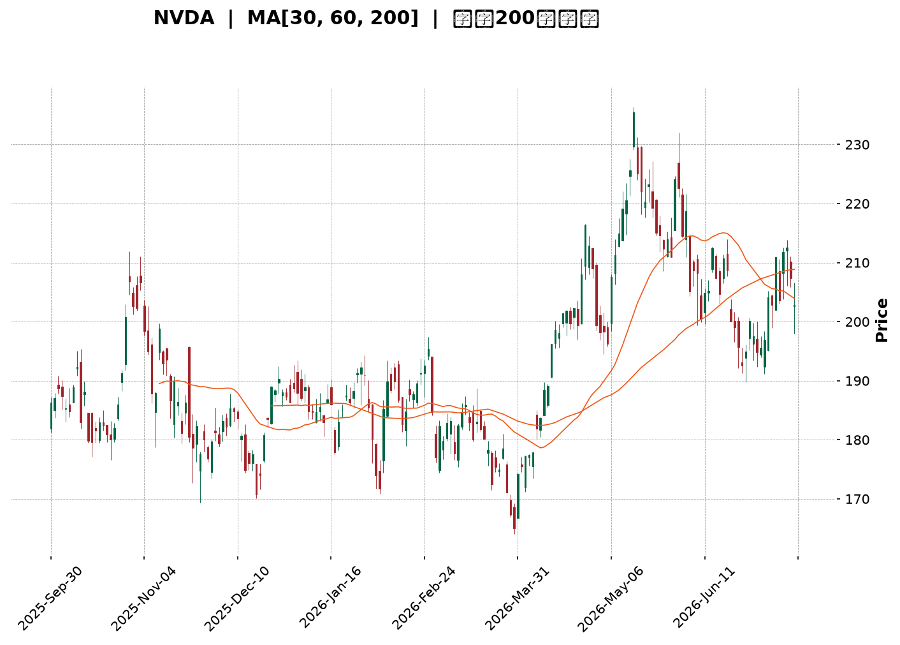
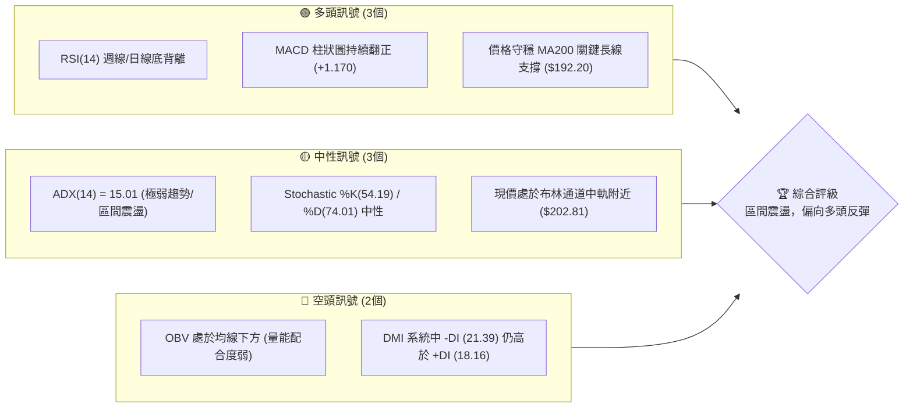
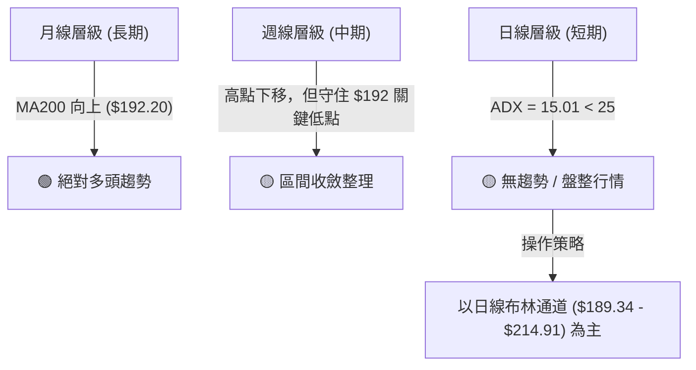
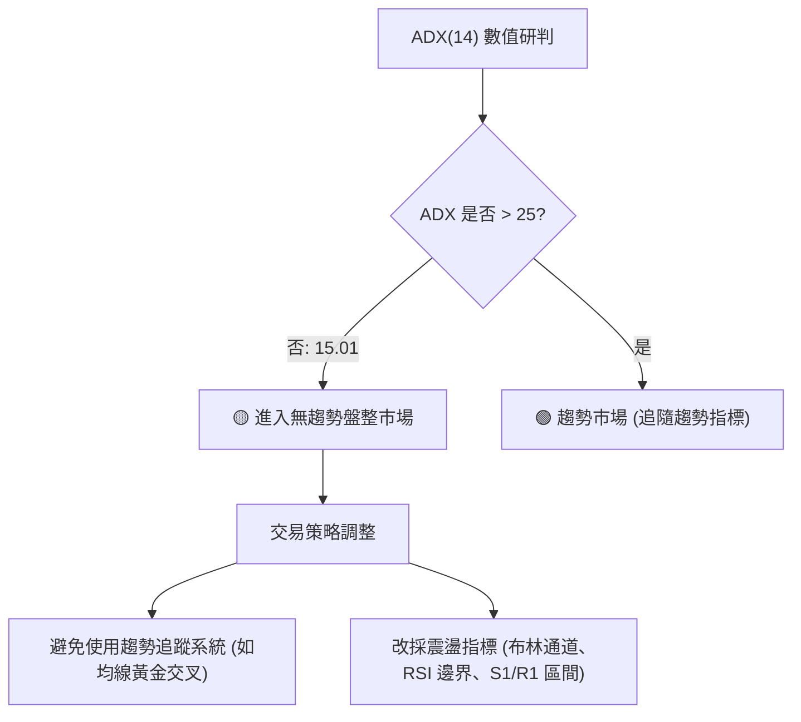
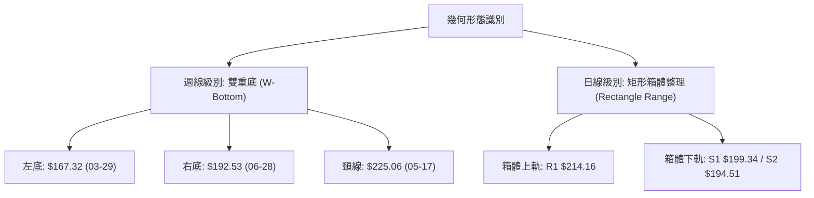
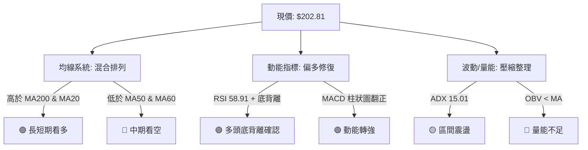
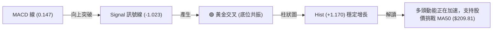
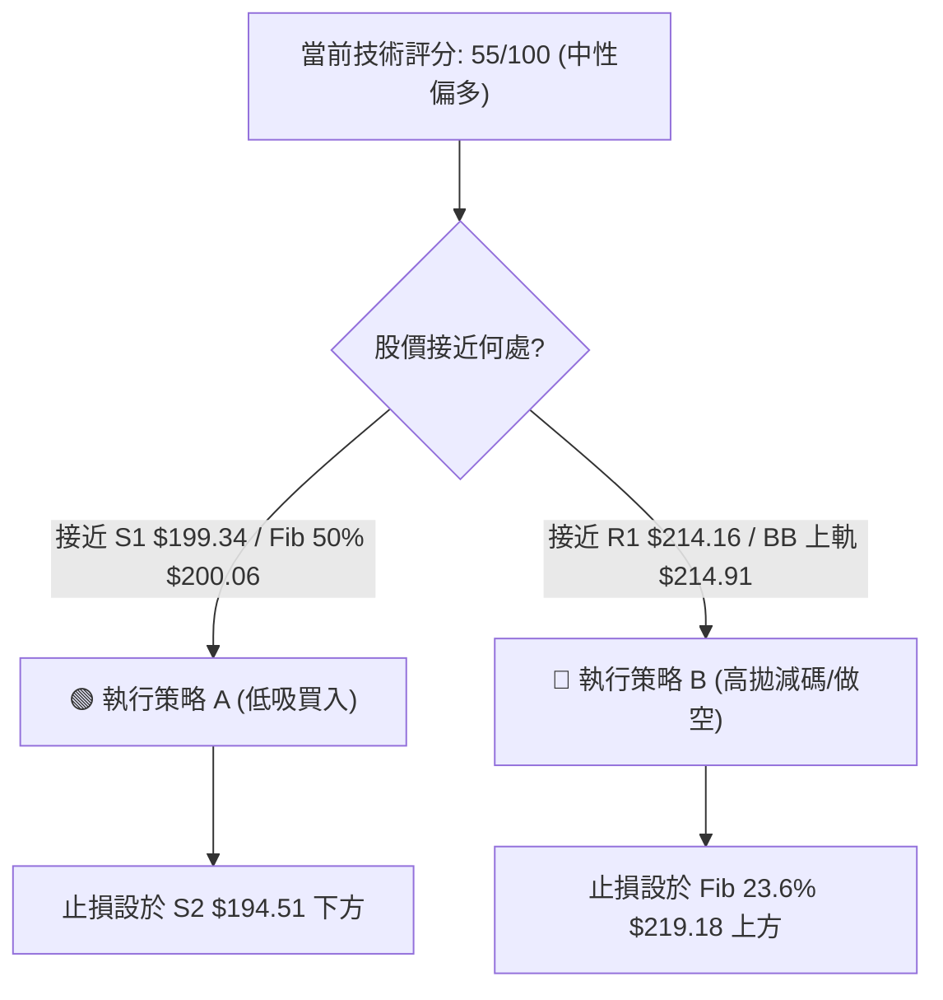
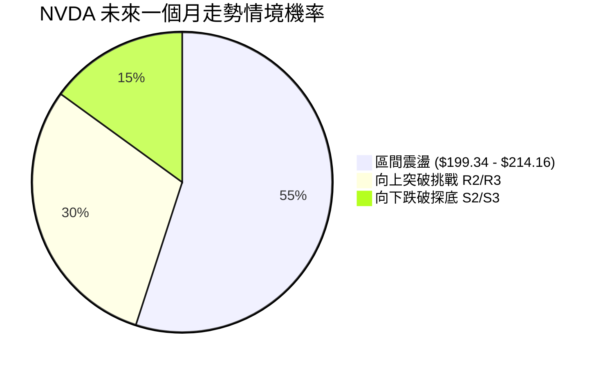
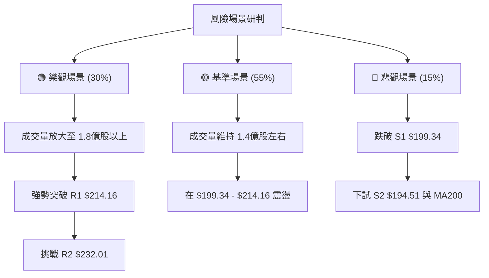

<details>
<summary>📊 靜態圖表 (點擊展開)</summary>

</details>

<html>
<head><meta charset="utf-8" /></head>
<body>
    <div style="height:500px; width:100%;">                        <script>window.PlotlyConfig = {MathJaxConfig: 'local'};</script>
        <script charset="utf-8" src="https://cdn.plot.ly/plotly-3.7.0.min.js" integrity="sha256-jvTGqxNp8AGWEcvNLVuKr+8j5dGe9Yw51LQkmDH+IYA=" crossorigin="anonymous"></script>                <div id="candlestick-chart" class="plotly-graph-div" style="height:100%; width:100%;"></div>            <script>                window.PLOTLYENV=window.PLOTLYENV || {};                                if (document.getElementById("candlestick-chart")) {                    Plotly.newPlot(                        "candlestick-chart",                        [{"close":{"dtype":"f8","bdata":"AAAAYPRKZ0AAAABADGBnQAAAAODHlGdAAAAAIDFsZ0AAAACAtylnQAAAAMC8GWdAAAAAwM+bZ0AAAAAAZApoQAAAAICn3WZAAAAAYJCCZ0AAAAAAn3lmQAAAAOA6c2ZAAAAAYIKyZkAAAABgkt9mQAAAAAAJzWZAAAAAQLydZkAAAACAnIFmQAAAAOCxvWZAAAAAILpAZ0AAAADg3+dnQAAAACDEGGlAAAAAQNfYaUAAAADANVRpQAAAACBtR2lAAAAAILrTaUAAAAAg+81oQAAAAGDDXmhAAAAAwOR6Z0AAAACAIX1nQAAAAKB82WhAAAAAID8daEAAAABgszFoQAAAACDnU2dAAAAAQLC9Z0AAAAAAmEtnQAAAAKAgpGZAAAAAYAlJZ0AAAADgHY1mQAAAAGDeVGZAAAAAwCjKZkAAAADg\u002fTJmQAAAAOD4gGZAAAAAAMkYZkAAAABAG3ZmQAAAAMBSp2ZAAAAAQI9rZkAAAAAAA+VmQAAAAGACxmZAAAAAAF4qZ0AAAABg1BdnQAAAAMDL8WZAAAAA4LSWZkAAAABA0dllQAAAAGBoAmZAAAAAwBwwZkAAAACgaldlQAAAAACxvWVAAAAA4J+YZkAAAABg6+5mQAAAACBYn2dAAAAA4CqMZ0AAAABgiMlnQAAAAOCzf2dAAAAAIPhpZ0AAAADgukhnQAAAAKDWk2dAAAAAwIF8Z0AAAACgYWBnQAAAAOAlnGdAAAAAIBEaZ0AAAABAUBRnQAAAAODeFmdAAAAAQK0yZ0AAAAAgV91mQAAAAABPWmdAAAAAoBlAZ0AAAABgTDtmQAAAACAY42ZAAAAAoKwTZ0AAAADAH25nQAAAAGDFR2dAAAAAgEqJZ0AAAACgLOlnQAAAAMDQCGhAAAAAoLXcZ0AAAADgSCxnQAAAAIDZg2ZAAAAAIEq\u002fZUAAAACgdXVlQAAAAGDkJWdAAAAAIN+5Z0AAAAAg7olnQAAAAAAxumdAAAAAAMtWZ0AAAABAy9JmQAAAAGDUF2dAAAAAIAh4Z0AAAACgeXVnQAAAAEDXsmdAAAAAICLqZ0AAAADArhNoQAAAAOBLamhAAAAAwEUVZ0AAAABALB9mQAAAACA\u002fyGZAAAAAwJR6ZkAAAAAAJdpmQAAAAKC742ZAAAAA4E4zZkAAAAAArs1mQAAAAABwEWdAAAAAoAc6Z0AAAABgqN1mQAAAAABJgWZAAAAAADfgZkAAAACA+7ZmQAAAAGAUhmZAAAAAoERLZkAAAABg949lQAAAAODv7WVAAAAAgN\u002ffZUAAAACAGk9mQAAAACBNYWVAAAAAQGbqZEAAAACASZ9kQAAAAKBNxmVAAAAAAHTxZUAAAAAg3yVmQAAAAMDcLWZAAAAAwJA8ZkAAAAAAx7tmQAAAAOBE9mZAAAAAICKNZ0AAAAAg3qJnQAAAAOD\u002fiGhAAAAAgG7UaEAAAACgz8NoQAAAACA\u002fLmlAAAAAgGQ6aUAAAADgtvRoQAAAAOB0SGlAAAAAAAvtaEAAAACg4QBqQAAAAGBzC2tAAAAAwH+dakAAAACANCBqQAAAAEDO6mhAAAAA4AHHaEAAAABA98doQAAAAACuiGhAAAAAYNHyaUAAAAAAH2hqQAAAACBi3mpAAAAAwOdla0AAAABAvJBrQAAAAMAlMmxAAAAAAOZubUAAAADA2CFsQAAAAGD1wWtAAAAAQE2La0AAAAAgt+ZrQAAAAIAkaGtAAAAA4IniakAAAAAghNNqQAAAAMBHi2pAAAAAwATAakAAAABgnVxqQAAAAIApA2xAAAAAgPDRa0AAAAAAANBqQAAAAMAeVWtAAAAAQDOjaUAAAADgehRqQAAAAIAUBmpAAAAAoHANaUAAAAAA15tpQAAAAIAUpmlAAAAAYGaOakAAAADAHu1pQAAAAMDMlGlAAAAAgBRWakAAAADAzBRqQAAAAKBHAWlAAAAAAADgaEAAAAAgrndoQAAAAMD1EGhAAAAAQApfaEAAAABA4QJpQAAAAGCPsmhAAAAAYI9aaEAAAACgmXFoQAAAAIDCnWhAAAAAANeDaUAAAADA9VhpQAAAAGC4XmpAAAAAwPVwaUAAAACgmXlqQAAAAAAAkGpAAAAAwMzsaUAAAACA61lpQA=="},"high":{"dtype":"f8","bdata":"WWcAN5BjZ0CryMKbz3xnQLyWDBbQ2WdASbk7qMLDZ0CcFVxdul9nQLi\u002fN602mmdAa8gCw3irZ0CVIxWjo2FoQPtpTrvda2hACAVFUsW7Z0B1IawYERJnQHryjOhNFGdApf45SX3hZkAJxjgxsvtmQFO9OsnZHmdAjcN9HdTRZkB3s11GmuZmQMf44st\u002f2WZAPeJs32VnZ0B89JVtLPhnQKTfDwGFXGlA8hMHY259akCTJcaAt7xpQBef1xCQ9mlAL8lN1UNiakCy4urGuXZpQOvUACwrVWlAd4Ac08iraEDo3dp5kIJnQDYvlzbu9WhABnC9anllaEDghwPRfnRoQPlpcLRG5mdAFmofvIjYZ0DiDX60S5hnQBRteToREmdA8hEWpNxzZ0DVPXC3AnhoQASUmJplCmdA4gZDNoXoZkCVJ7aT2z1mQFKu6xiq1WZA+kOWuvhhZkAZPutIQIJmQAaOw0uNLWdAWzP\u002fh\u002fbGZkBZLqZ\u002fcglnQJ47w+vrDWdAjTMb7at4Z0A7a\u002fjjzC9nQFWgASkhKGdARSiX+yujZkD4oMcIHdNmQOcheh58RmZAKZvk8LhIZkCkAP5US\u002f1lQBF11NDu\u002fWVAlPXLiFOnZkCHA0Xv8P1mQIAEcO0to2dApFSPgcGVZ0CMJciRkQ5oQCAtbRz2kGdAeyCwJ1CYZ0CEYwDcfcpnQJqPqig9FmhAohf+w5wsaEBuvYHt8v1nQGRTMTJh5GdAZHC1HjaqZ0AMc9ianUNnQHw+nJ6LXGdAfy4x7C98Z0BlHIRzhwdnQNHXEU4Br2dA7chf\u002fKfGZ0CA447cDMVmQN3uaBHvJGdAYx4mui4+Z0DA8T8dz6tnQPJy7q13nGdANvnl2pe4Z0Bu4ZO3swNoQMuX7FHRJ2hAHg0QOBlIaEB5e3+SLsJnQKuY5\u002fFgQWdA8WCGNY9rZkCdUcvSWBNmQJWAycG1WGdAN5PKH5ItaECSF3VO2wdoQIJYLTfJIGhAYn5tEPkraECzFOHysGhnQIRhwh6BXWdAPz\u002f4JWvEZ0DvSwAWaoZnQLOEIQkkw2dAw4PY7NY2aEA7lrAxFjFoQPFwjbd0rGhAsfYlsbRBaECRCX4cw8tmQKhwZZiR52ZA4ohnZL+VZkCToicvMw9nQNKOl7C++mZA5O8O8zHRZkAA2L1n\u002fdVmQP2wp\u002fXPRmdAu6opttlsZ0A2L5zVMBdnQILyLY7yO2dA9qozxh+VZ0AZwWmo5CVnQOrzzjRU5WZAoC84tad4ZkBMEMDZrUFmQPjbGvcxRWZALfmypXkAZkCUIuYGSqBmQG78YZ6+CWZABcP\u002fuKtYZUBWtCxvFihlQDwY6sZVzWVAtvQgjTslZkDGLtdrESlmQEfSzBGoMmZA4TKkYrhAZkAKqq4sayFnQPvO+OCz+2ZAHYZcD+y4Z0B\u002fUIEJDq5nQAAAAOD\u002fiGhASBnLqFUFaUC2Fd5RwfNoQJJMKc\u002fiLmlASmpxk+g9aUA3pXeBclBpQAAAAOB0SGlAsgq4ivdyaUATNPGQilZqQN5\u002f44Z7EmtAxk6MX1zPakB0QZaoHY9qQB1IsQvEQWpANT78G3BYaUB2HVZB2C9pQI0v+3Q4AGlAsW\u002fJreEAakBhoEega75qQIVlgZR8MWtATZeNmVHBa0Bywhgtqu9rQOIa63RkcmxAMYH23neIbUASrZxQYOdsQEVRwqJut2xAXtjiV\u002f8GbEAtgAGCvDtsQPTcoSFUZGxArbElNRaYa0BQa87WoT1rQLYy33fSvGpAOUBmg5zoakBUrXaKZzNrQN0y64J2E2xA79kRiE4AbUDl0\u002fuJ8NFrQAAAAEAzs2tAAAAAANfbakAAAABACk9qQAAAAMDMbGpAAAAAQArnaUAAAADAHrVpQAAAAIA94mlAAAAAYLiWakAAAAAgrm9qQAAAAGC4JmpAAAAA4HpsakAAAAAgrr9qQAAAAOCjeGlAAAAAoHA1aUAAAACgmRlpQAAAAKCZcWhAAAAAgMKFaEAAAAAAKRRpQAAAAEAz+2hAAAAAgOsBaUAAAACgmbFoQAAAAMAezWhAAAAAwB6laUAAAABA4ZJpQAAAAAAAYGpAAAAAgD1SakAAAACgmZFqQAAAAIDruWpAAAAAYI9iakAAAADAzNRpQA=="},"hovertemplate":"\u003cb\u003e%{x|%Y-%m-%d}\u003c\u002fb\u003e\u003cbr\u003e\u958b: $%{open:.2f}\u003cbr\u003e\u9ad8: $%{high:.2f}\u003cbr\u003e\u4f4e: $%{low:.2f}\u003cbr\u003e\u6536: $%{close:.2f}\u003cextra\u003e\u003c\u002fextra\u003e","low":{"dtype":"f8","bdata":"W0o3WPanZkAGcn26TfVmQFJ9KClBemdAdjgBgJokZ0DDobpPFuNmQGjpK\u002fp\u002f+GZA3P50Ea1JZ0DrB9jBIdpnQB9KLPUtumZAyPlt4CM3Z0DGMp4RE29mQLvWLqENImZAAKBgCVBxZkCLb39VrHBmQMY3+77zr2ZANwg8UUVyZkA18lZbHRFmQGPJRHvzcWZAkqdrDYXoZkBjk5suFIZnQHN5XElM9WdAu88D9ZyQaUColooR6SRpQF2o+eEAOmlAwVRZZoqpaUB6t00OsbVoQBDZ+5fdTGhA1dBTHZBEZ0BuxCTq01VmQLDoyoJhMWhAXmy7aM3hZ0BT2lacXtxnQDHAQam082ZAY3CzETOLZkB0x\u002fEKugJnQOZUEBh6bWZAPX4nYhvTZkCUcmF+3nNmQDliuva1lmVA4QjilioIZkANyQdNsCplQG6XFDRqQGZAcgGvN84IZkC1GYA8rq5lQM54Y5ypeGZAbQI6IjhcZkD1dA2BtHdmQOyCKFgRlmZAI7kuj7DFZkAC4z8XGONmQLcoNP0uumZAat0uY\u002fQMZkAShe5dCM1lQAZb6BIj2mVATFYwZPvVZUBGlXzpR0NlQNhMKMeKc2VAwTIEaAEEZkA4P1d\u002fF8RmQPJhw3ir1WZAmLqnKJtLZ0DtVXTfq3hnQCB9k23fNWdAh6taFnlWZ0AIZIgZaUhnQAGVVCP7gGdAESqdKIs9Z0BMrfQw9VJnQFW9t7KlSmdAp\u002fWWJY\u002fvZkBggkSgR+5mQAWPKWmB2WZAvHLTjKblZkCwpHM6jZJmQAx4Yu9LQ2dAHWwzX047Z0DDvkCXmCxmQCkn9HjYRWZAVQXa9Jb2ZkAfp4ob9VJnQAG7RApuOGdALzGSJCkvZ0ApM\u002fPDerNnQN\u002fy5b2qOmdAB+PhcKenZ0AUqekI9BRnQMR4TmR9AGZAgzL8IGt2ZUCm8q3bSlplQMrJ\u002fsFkzGVAaoZlpjr3ZkDZpfiwgXxnQJCaHQZIkWdAWxOGqgxJZ0CJK6AszatmQBc8xWfGXmZANMHjDApRZ0Cvo4z64S1nQLeKJPjUNmdAzPOriCurZ0DYmRejfmVnQM4wAKq5MWhAx00zEA4DZ0AXf1LVSAVmQMCamByszWVAABCu\u002fIoWZkDFSA6d5npmQGlgzNw5NWZA42Xa2lgTZkCjZCCBE+tlQJx8\u002f4o5uWZA9L9vUYcHZ0ALNHDBOrFmQGC01HRgd2ZAjszBwlymZkDPO1ji\u002fa5mQNKu36rXg2ZAqryuKrvyZUBd\u002f5KYpHBlQPQHaETP0WVAKe+V4uC4ZUC+sayznBRmQJIPJdQaXmVAxwkqHRnaZEBxKytVhYJkQDAUIDOA2GRA4zFJiX3RZUC9BYOpdGVlQG6A563F8WVAkU3jl6auZUDXDIM54oJmQIIiH4AcjWZA0pkNC7wCZ0DWH63LwjBnQN7NKJ2I0WdAXi5JeWNwaEBkWzsZoHJoQIBwxns34WhAYpDEfoKzaED\u002fLVxElthoQDrRoUCW2GhA\u002fMISdLGfaEDum6buefJoQN5RIEZv5GlAjvNb5aT+aUCiowPN0+ppQIYVDWz\u002fzmhAo971Ln+caEDoYfHqbFBoQOd1ezuoeWhAQ7GGDR\u002fMaEDQL+euTshpQEhOfKeMlGpApZrbDYO0akDD3H0Cb9VqQNwzGYD8qWtAOMcx6g6hbEAOdaOsU\u002f9rQJ4KNIu0Q2tAeU61nwA1a0AbVs4yyYdrQEptXDGkNWtACavpLZnRakCz\u002fTNGGnhqQHfaIq4uEWpAnM935StfakBAS2aYS1xqQEZjNFZd7mpA7qDoRPSia0CBSvIpVMhqQAAAAEAKX2pAAAAAYI+KaUAAAAAAAMBpQAAAAEDh6mhAAAAAoHD9aEAAAACgR\u002fFoQAAAAIAUbmlAAAAAQOEKakAAAACgR+lpQAAAAGCPYmlAAAAAAADQaUAAAABACvdpQAAAAAAAAGlAAAAAYI+SaEAAAAAAKQRoQAAAAEAK52dAAAAAoJm5Z0AAAAAghWNoQAAAAGBmLmhAAAAAQDMLaEAAAAAgrj9oQAAAAOB65GdAAAAAgOthaEAAAABguN5oQAAAAKBwPWlAAAAAAABgaUAAAACgmXlpQAAAAKBHwWlAAAAAQDO7aUAAAABACr9oQA=="},"name":"\u50f9\u683c","open":{"dtype":"f8","bdata":"d0daVSO7ZkBOM8oeISBnQByOYdd4q2dAFuLQPV6eZ0BsWdZKcChnQCOGGtXEP2dAZzlHoaJKZ0AGzk4shv9nQDsMzp9uKGhAJ7r+xmB3Z0Ad1tCoGxFnQJGghUMREmdAgg8Snu6\u002fZkAoF9lYan5mQLkqAAOy3GZAjcN9HdTRZkAUJZimGJ1mQNx9ROgVhmZA\u002f8sbwWLzZkAX1CSH77dnQEXqMES7GWhApT4E8eH2aUAYLtUKcJxpQFloWg38xWlAJxFB+hP6aUBMLTKmuVdpQAmlCrqJ0GhAvHbA+G6FaEAWxH9pQxVnQAuluTyRW2hAPG9HQSpdaEAu0SD3D29oQFtuVObP2WdAv1AnBxHUZkDuvgmTdTdnQKJE0Wuv5GZAZ\u002fjeLb8RZ0DkIASdaXZoQHc4jN9KoGZAXz01Ll1oZkCoYfl9\u002fdVlQHkFPLTBrGZArgiR5gVZZkA6tpBXMtFlQOIqlh7psGZAoG+00y2bZkCsz0mQwqxmQGO38rpP9WZAPjUNSlzNZkDwk7u8rypnQGyL5F\u002fUF2dASMeanO6BZkCQfnS5dZxmQJ\u002fXuMgkN2ZAj\u002fHV8XIBZkD3daHhVfxlQHdfn\u002fsnymVAf1rqfI0OZkAixGs0RfZmQGG96EXo12ZA3bSx78B2Z0CLdWJWCbZnQN\u002fG7hZnb2dAOgCyo1eAZ0CJWBy92apnQARK0756s2dAjdkqTdjwZ0DdZbGkNslnQPmHkaPjimdA1K+9AiacZ0BZh+5NWBtnQM8ZN8rl32ZABxpM1ckYZ0CjQDP5DQNnQKJFF926SGdAnCPfbjCbZ0AsUOtmtbVmQDABZ9yeWmZAwYvrRcwQZ0A57k7SsGhnQCSWN\u002f3SXWdAMfclhmFgZ0C8Fa4eL+FnQBnGAs1r42dAm6udM0TfZ0CeZw1CGl9nQEnOi35rQGdA0DwXaLlnZkBzFZev8NZlQEegWiYxD2ZAWHFuDiMBZ0AF8Jsos+RnQOP8iszlBmhA1H0iem8ZaECiePtFDWhnQF8sKELqsGZACRjGUKSQZ0BivfTBoFpnQD26r673SmdAbbQ4v1blZ0BJTWEyN+hnQGZg09PRRmhAejc3JBFBaEDvB9E776BmQEWLYWt\u002f2WVAkaKN0bhIZkCX5D\u002fSC4dmQALXwadgnmZApoo5d95zZkDXL5e0qhNmQJ2ZqoawxWZAZyX1xDE2Z0D\u002f92JyvvpmQDWsnxaNFmdAnI1TYjnYZkAwEHmmBhtnQGk2B+qPyGZAsLrGPrA5ZkCqEoF0XjlmQPZWA223IWZA5idUBwzUZUBAAVVRmhxmQPnbhXCu+2VA4881uao5ZUA+6tkyrBJlQNnSufrR2GRAh7OtnXH5ZUCIbfJvWH9lQCWC4DOFHmZAMbQtOtDwZUAtqA6MIAlnQH1Qph0btGZAGC2n0g0DZ0DD6bGnBzpnQONJSVLF02dAM89DWPWJaEA3BSSmZ6ZoQOX1tVla9WhAT\u002f0k9uj3aEC7ehBroTxpQPaPYmYxGGlAOtJcmy1HaUDVWmlgRfdoQNzkK2D9LGpAeV8JWOAnakAwh2z5eY5qQH8FCnPwNWpAmyUPQ3YhaUBg1bllkehoQFwb8uss4mhAkRKQmAj1aEADjcViHgNqQCcfszEGmWpASBqpX065akDkq0RkdUlrQBqlOnVhFWxACRl0S6OybEA3K4nIwq9sQEgoJOBGs2xAxc\u002f5kKhra0CkAAMkct1rQGAtAr3\u002fwGtALYGyIZKUa0Czs5WaNglrQM5THAHdu2pAMEn90hZhakDDYOwRkcpqQGh998xS72pA1+Rj60tdbEBPaIbHx65rQAAAAMAevWpAAAAAwPXQakAAAACAwkVqQAAAAADXU2pAAAAAgMKNaUAAAAAgri9pQAAAACCFm2lAAAAAoHAdakAAAACAwmVqQAAAAMD1EGpAAAAAYI\u002fqaUAAAACAFG5qQAAAAKBwRWlAAAAAANcDaUAAAABgjwJpQAAAAADXI2hAAAAAQDM7aEAAAAAgrqdoQAAAAGBmhmhAAAAA4HqkaEAAAACgcE1oQAAAAADXC2hAAAAAgMJlaEAAAABguI5pQAAAAAAAQGlAAAAAoEcRakAAAABgZgZqQAAAAGC4fmpAAAAAoHBFakAAAADgelRpQA=="},"x":["2025-09-30T00:00:00-04:00","2025-10-01T00:00:00-04:00","2025-10-02T00:00:00-04:00","2025-10-03T00:00:00-04:00","2025-10-06T00:00:00-04:00","2025-10-07T00:00:00-04:00","2025-10-08T00:00:00-04:00","2025-10-09T00:00:00-04:00","2025-10-10T00:00:00-04:00","2025-10-13T00:00:00-04:00","2025-10-14T00:00:00-04:00","2025-10-15T00:00:00-04:00","2025-10-16T00:00:00-04:00","2025-10-17T00:00:00-04:00","2025-10-20T00:00:00-04:00","2025-10-21T00:00:00-04:00","2025-10-22T00:00:00-04:00","2025-10-23T00:00:00-04:00","2025-10-24T00:00:00-04:00","2025-10-27T00:00:00-04:00","2025-10-28T00:00:00-04:00","2025-10-29T00:00:00-04:00","2025-10-30T00:00:00-04:00","2025-10-31T00:00:00-04:00","2025-11-03T00:00:00-05:00","2025-11-04T00:00:00-05:00","2025-11-05T00:00:00-05:00","2025-11-06T00:00:00-05:00","2025-11-07T00:00:00-05:00","2025-11-10T00:00:00-05:00","2025-11-11T00:00:00-05:00","2025-11-12T00:00:00-05:00","2025-11-13T00:00:00-05:00","2025-11-14T00:00:00-05:00","2025-11-17T00:00:00-05:00","2025-11-18T00:00:00-05:00","2025-11-19T00:00:00-05:00","2025-11-20T00:00:00-05:00","2025-11-21T00:00:00-05:00","2025-11-24T00:00:00-05:00","2025-11-25T00:00:00-05:00","2025-11-26T00:00:00-05:00","2025-11-28T00:00:00-05:00","2025-12-01T00:00:00-05:00","2025-12-02T00:00:00-05:00","2025-12-03T00:00:00-05:00","2025-12-04T00:00:00-05:00","2025-12-05T00:00:00-05:00","2025-12-08T00:00:00-05:00","2025-12-09T00:00:00-05:00","2025-12-10T00:00:00-05:00","2025-12-11T00:00:00-05:00","2025-12-12T00:00:00-05:00","2025-12-15T00:00:00-05:00","2025-12-16T00:00:00-05:00","2025-12-17T00:00:00-05:00","2025-12-18T00:00:00-05:00","2025-12-19T00:00:00-05:00","2025-12-22T00:00:00-05:00","2025-12-23T00:00:00-05:00","2025-12-24T00:00:00-05:00","2025-12-26T00:00:00-05:00","2025-12-29T00:00:00-05:00","2025-12-30T00:00:00-05:00","2025-12-31T00:00:00-05:00","2026-01-02T00:00:00-05:00","2026-01-05T00:00:00-05:00","2026-01-06T00:00:00-05:00","2026-01-07T00:00:00-05:00","2026-01-08T00:00:00-05:00","2026-01-09T00:00:00-05:00","2026-01-12T00:00:00-05:00","2026-01-13T00:00:00-05:00","2026-01-14T00:00:00-05:00","2026-01-15T00:00:00-05:00","2026-01-16T00:00:00-05:00","2026-01-20T00:00:00-05:00","2026-01-21T00:00:00-05:00","2026-01-22T00:00:00-05:00","2026-01-23T00:00:00-05:00","2026-01-26T00:00:00-05:00","2026-01-27T00:00:00-05:00","2026-01-28T00:00:00-05:00","2026-01-29T00:00:00-05:00","2026-01-30T00:00:00-05:00","2026-02-02T00:00:00-05:00","2026-02-03T00:00:00-05:00","2026-02-04T00:00:00-05:00","2026-02-05T00:00:00-05:00","2026-02-06T00:00:00-05:00","2026-02-09T00:00:00-05:00","2026-02-10T00:00:00-05:00","2026-02-11T00:00:00-05:00","2026-02-12T00:00:00-05:00","2026-02-13T00:00:00-05:00","2026-02-17T00:00:00-05:00","2026-02-18T00:00:00-05:00","2026-02-19T00:00:00-05:00","2026-02-20T00:00:00-05:00","2026-02-23T00:00:00-05:00","2026-02-24T00:00:00-05:00","2026-02-25T00:00:00-05:00","2026-02-26T00:00:00-05:00","2026-02-27T00:00:00-05:00","2026-03-02T00:00:00-05:00","2026-03-03T00:00:00-05:00","2026-03-04T00:00:00-05:00","2026-03-05T00:00:00-05:00","2026-03-06T00:00:00-05:00","2026-03-09T00:00:00-04:00","2026-03-10T00:00:00-04:00","2026-03-11T00:00:00-04:00","2026-03-12T00:00:00-04:00","2026-03-13T00:00:00-04:00","2026-03-16T00:00:00-04:00","2026-03-17T00:00:00-04:00","2026-03-18T00:00:00-04:00","2026-03-19T00:00:00-04:00","2026-03-20T00:00:00-04:00","2026-03-23T00:00:00-04:00","2026-03-24T00:00:00-04:00","2026-03-25T00:00:00-04:00","2026-03-26T00:00:00-04:00","2026-03-27T00:00:00-04:00","2026-03-30T00:00:00-04:00","2026-03-31T00:00:00-04:00","2026-04-01T00:00:00-04:00","2026-04-02T00:00:00-04:00","2026-04-06T00:00:00-04:00","2026-04-07T00:00:00-04:00","2026-04-08T00:00:00-04:00","2026-04-09T00:00:00-04:00","2026-04-10T00:00:00-04:00","2026-04-13T00:00:00-04:00","2026-04-14T00:00:00-04:00","2026-04-15T00:00:00-04:00","2026-04-16T00:00:00-04:00","2026-04-17T00:00:00-04:00","2026-04-20T00:00:00-04:00","2026-04-21T00:00:00-04:00","2026-04-22T00:00:00-04:00","2026-04-23T00:00:00-04:00","2026-04-24T00:00:00-04:00","2026-04-27T00:00:00-04:00","2026-04-28T00:00:00-04:00","2026-04-29T00:00:00-04:00","2026-04-30T00:00:00-04:00","2026-05-01T00:00:00-04:00","2026-05-04T00:00:00-04:00","2026-05-05T00:00:00-04:00","2026-05-06T00:00:00-04:00","2026-05-07T00:00:00-04:00","2026-05-08T00:00:00-04:00","2026-05-11T00:00:00-04:00","2026-05-12T00:00:00-04:00","2026-05-13T00:00:00-04:00","2026-05-14T00:00:00-04:00","2026-05-15T00:00:00-04:00","2026-05-18T00:00:00-04:00","2026-05-19T00:00:00-04:00","2026-05-20T00:00:00-04:00","2026-05-21T00:00:00-04:00","2026-05-22T00:00:00-04:00","2026-05-26T00:00:00-04:00","2026-05-27T00:00:00-04:00","2026-05-28T00:00:00-04:00","2026-05-29T00:00:00-04:00","2026-06-01T00:00:00-04:00","2026-06-02T00:00:00-04:00","2026-06-03T00:00:00-04:00","2026-06-04T00:00:00-04:00","2026-06-05T00:00:00-04:00","2026-06-08T00:00:00-04:00","2026-06-09T00:00:00-04:00","2026-06-10T00:00:00-04:00","2026-06-11T00:00:00-04:00","2026-06-12T00:00:00-04:00","2026-06-15T00:00:00-04:00","2026-06-16T00:00:00-04:00","2026-06-17T00:00:00-04:00","2026-06-18T00:00:00-04:00","2026-06-22T00:00:00-04:00","2026-06-23T00:00:00-04:00","2026-06-24T00:00:00-04:00","2026-06-25T00:00:00-04:00","2026-06-26T00:00:00-04:00","2026-06-29T00:00:00-04:00","2026-06-30T00:00:00-04:00","2026-07-01T00:00:00-04:00","2026-07-02T00:00:00-04:00","2026-07-06T00:00:00-04:00","2026-07-07T00:00:00-04:00","2026-07-08T00:00:00-04:00","2026-07-09T00:00:00-04:00","2026-07-10T00:00:00-04:00","2026-07-13T00:00:00-04:00","2026-07-14T00:00:00-04:00","2026-07-15T00:00:00-04:00","2026-07-16T00:00:00-04:00","2026-07-17T00:00:00-04:00"],"type":"candlestick"},{"hovertemplate":"MA30: $%{y:.2f}\u003cextra\u003e\u003c\u002fextra\u003e","line":{"color":"#2196F3","dash":"dash","width":2},"mode":"lines","name":"MA30","x":["2025-09-30T00:00:00-04:00","2025-10-01T00:00:00-04:00","2025-10-02T00:00:00-04:00","2025-10-03T00:00:00-04:00","2025-10-06T00:00:00-04:00","2025-10-07T00:00:00-04:00","2025-10-08T00:00:00-04:00","2025-10-09T00:00:00-04:00","2025-10-10T00:00:00-04:00","2025-10-13T00:00:00-04:00","2025-10-14T00:00:00-04:00","2025-10-15T00:00:00-04:00","2025-10-16T00:00:00-04:00","2025-10-17T00:00:00-04:00","2025-10-20T00:00:00-04:00","2025-10-21T00:00:00-04:00","2025-10-22T00:00:00-04:00","2025-10-23T00:00:00-04:00","2025-10-24T00:00:00-04:00","2025-10-27T00:00:00-04:00","2025-10-28T00:00:00-04:00","2025-10-29T00:00:00-04:00","2025-10-30T00:00:00-04:00","2025-10-31T00:00:00-04:00","2025-11-03T00:00:00-05:00","2025-11-04T00:00:00-05:00","2025-11-05T00:00:00-05:00","2025-11-06T00:00:00-05:00","2025-11-07T00:00:00-05:00","2025-11-10T00:00:00-05:00","2025-11-11T00:00:00-05:00","2025-11-12T00:00:00-05:00","2025-11-13T00:00:00-05:00","2025-11-14T00:00:00-05:00","2025-11-17T00:00:00-05:00","2025-11-18T00:00:00-05:00","2025-11-19T00:00:00-05:00","2025-11-20T00:00:00-05:00","2025-11-21T00:00:00-05:00","2025-11-24T00:00:00-05:00","2025-11-25T00:00:00-05:00","2025-11-26T00:00:00-05:00","2025-11-28T00:00:00-05:00","2025-12-01T00:00:00-05:00","2025-12-02T00:00:00-05:00","2025-12-03T00:00:00-05:00","2025-12-04T00:00:00-05:00","2025-12-05T00:00:00-05:00","2025-12-08T00:00:00-05:00","2025-12-09T00:00:00-05:00","2025-12-10T00:00:00-05:00","2025-12-11T00:00:00-05:00","2025-12-12T00:00:00-05:00","2025-12-15T00:00:00-05:00","2025-12-16T00:00:00-05:00","2025-12-17T00:00:00-05:00","2025-12-18T00:00:00-05:00","2025-12-19T00:00:00-05:00","2025-12-22T00:00:00-05:00","2025-12-23T00:00:00-05:00","2025-12-24T00:00:00-05:00","2025-12-26T00:00:00-05:00","2025-12-29T00:00:00-05:00","2025-12-30T00:00:00-05:00","2025-12-31T00:00:00-05:00","2026-01-02T00:00:00-05:00","2026-01-05T00:00:00-05:00","2026-01-06T00:00:00-05:00","2026-01-07T00:00:00-05:00","2026-01-08T00:00:00-05:00","2026-01-09T00:00:00-05:00","2026-01-12T00:00:00-05:00","2026-01-13T00:00:00-05:00","2026-01-14T00:00:00-05:00","2026-01-15T00:00:00-05:00","2026-01-16T00:00:00-05:00","2026-01-20T00:00:00-05:00","2026-01-21T00:00:00-05:00","2026-01-22T00:00:00-05:00","2026-01-23T00:00:00-05:00","2026-01-26T00:00:00-05:00","2026-01-27T00:00:00-05:00","2026-01-28T00:00:00-05:00","2026-01-29T00:00:00-05:00","2026-01-30T00:00:00-05:00","2026-02-02T00:00:00-05:00","2026-02-03T00:00:00-05:00","2026-02-04T00:00:00-05:00","2026-02-05T00:00:00-05:00","2026-02-06T00:00:00-05:00","2026-02-09T00:00:00-05:00","2026-02-10T00:00:00-05:00","2026-02-11T00:00:00-05:00","2026-02-12T00:00:00-05:00","2026-02-13T00:00:00-05:00","2026-02-17T00:00:00-05:00","2026-02-18T00:00:00-05:00","2026-02-19T00:00:00-05:00","2026-02-20T00:00:00-05:00","2026-02-23T00:00:00-05:00","2026-02-24T00:00:00-05:00","2026-02-25T00:00:00-05:00","2026-02-26T00:00:00-05:00","2026-02-27T00:00:00-05:00","2026-03-02T00:00:00-05:00","2026-03-03T00:00:00-05:00","2026-03-04T00:00:00-05:00","2026-03-05T00:00:00-05:00","2026-03-06T00:00:00-05:00","2026-03-09T00:00:00-04:00","2026-03-10T00:00:00-04:00","2026-03-11T00:00:00-04:00","2026-03-12T00:00:00-04:00","2026-03-13T00:00:00-04:00","2026-03-16T00:00:00-04:00","2026-03-17T00:00:00-04:00","2026-03-18T00:00:00-04:00","2026-03-19T00:00:00-04:00","2026-03-20T00:00:00-04:00","2026-03-23T00:00:00-04:00","2026-03-24T00:00:00-04:00","2026-03-25T00:00:00-04:00","2026-03-26T00:00:00-04:00","2026-03-27T00:00:00-04:00","2026-03-30T00:00:00-04:00","2026-03-31T00:00:00-04:00","2026-04-01T00:00:00-04:00","2026-04-02T00:00:00-04:00","2026-04-06T00:00:00-04:00","2026-04-07T00:00:00-04:00","2026-04-08T00:00:00-04:00","2026-04-09T00:00:00-04:00","2026-04-10T00:00:00-04:00","2026-04-13T00:00:00-04:00","2026-04-14T00:00:00-04:00","2026-04-15T00:00:00-04:00","2026-04-16T00:00:00-04:00","2026-04-17T00:00:00-04:00","2026-04-20T00:00:00-04:00","2026-04-21T00:00:00-04:00","2026-04-22T00:00:00-04:00","2026-04-23T00:00:00-04:00","2026-04-24T00:00:00-04:00","2026-04-27T00:00:00-04:00","2026-04-28T00:00:00-04:00","2026-04-29T00:00:00-04:00","2026-04-30T00:00:00-04:00","2026-05-01T00:00:00-04:00","2026-05-04T00:00:00-04:00","2026-05-05T00:00:00-04:00","2026-05-06T00:00:00-04:00","2026-05-07T00:00:00-04:00","2026-05-08T00:00:00-04:00","2026-05-11T00:00:00-04:00","2026-05-12T00:00:00-04:00","2026-05-13T00:00:00-04:00","2026-05-14T00:00:00-04:00","2026-05-15T00:00:00-04:00","2026-05-18T00:00:00-04:00","2026-05-19T00:00:00-04:00","2026-05-20T00:00:00-04:00","2026-05-21T00:00:00-04:00","2026-05-22T00:00:00-04:00","2026-05-26T00:00:00-04:00","2026-05-27T00:00:00-04:00","2026-05-28T00:00:00-04:00","2026-05-29T00:00:00-04:00","2026-06-01T00:00:00-04:00","2026-06-02T00:00:00-04:00","2026-06-03T00:00:00-04:00","2026-06-04T00:00:00-04:00","2026-06-05T00:00:00-04:00","2026-06-08T00:00:00-04:00","2026-06-09T00:00:00-04:00","2026-06-10T00:00:00-04:00","2026-06-11T00:00:00-04:00","2026-06-12T00:00:00-04:00","2026-06-15T00:00:00-04:00","2026-06-16T00:00:00-04:00","2026-06-17T00:00:00-04:00","2026-06-18T00:00:00-04:00","2026-06-22T00:00:00-04:00","2026-06-23T00:00:00-04:00","2026-06-24T00:00:00-04:00","2026-06-25T00:00:00-04:00","2026-06-26T00:00:00-04:00","2026-06-29T00:00:00-04:00","2026-06-30T00:00:00-04:00","2026-07-01T00:00:00-04:00","2026-07-02T00:00:00-04:00","2026-07-06T00:00:00-04:00","2026-07-07T00:00:00-04:00","2026-07-08T00:00:00-04:00","2026-07-09T00:00:00-04:00","2026-07-10T00:00:00-04:00","2026-07-13T00:00:00-04:00","2026-07-14T00:00:00-04:00","2026-07-15T00:00:00-04:00","2026-07-16T00:00:00-04:00","2026-07-17T00:00:00-04:00"],"y":{"dtype":"f8","bdata":"AAAAAAAA+H8AAAAAAAD4fwAAAAAAAPh\u002fAAAAAAAA+H8AAAAAAAD4fwAAAAAAAPh\u002fAAAAAAAA+H8AAAAAAAD4fwAAAAAAAPh\u002fAAAAAAAA+H8AAAAAAAD4fwAAAAAAAPh\u002fAAAAAAAA+H8AAAAAAAD4fwAAAAAAAPh\u002fAAAAAAAA+H8AAAAAAAD4fwAAAAAAAPh\u002fAAAAAAAA+H8AAAAAAAD4fwAAAAAAAPh\u002fAAAAAAAA+H8AAAAAAAD4fwAAAAAAAPh\u002fAAAAAAAA+H8AAAAAAAD4fwAAAAAAAPh\u002fAAAAAAAA+H8AAAAAAAD4f83MzAw5sGdAq6qqiju3Z0BERESUOL5nQERERPQOvGdAREREZMa+Z0CamZl5579nQO\u002fu7t77u2dAZmZmhjm5Z0DNzMz8g6xnQAAAAMD0p2dAmpmZKc+hZ0BVVVV1dJ9nQJqZmbnpn2dAIiIi8smaZ0CamZn5RZdnQKuqqioElmdAAAAAAFiUZ0B3d3c3qJdnQKuqqirvl2dAzczMXDCXZ0C8u7sLQZBnQO\u002fu7m7jfWdAzczMfBViZ0CJiIh4Z0RnQJqZmemAKGdAIiIiInMJZ0CJiIjI5etmQM3MzDx21WZAiYiIaOvNZkDv7u7eLclmQAAAADC1vmZA3t3dLd+5ZkB3d3dHZrZmQJqZmQnct2ZAIiIiohG1ZkAiIiIy+bRmQKuqqrr2vGZAERER8a2+ZkC8u7u7uMVmQERERISh0GZAVVVVZUvTZkBEREQkztpmQGZmZkbN32ZAAAAAwDLpZkDe3d2to+xmQFVVVQWb8mZAMzMzs7D5ZkCrqqp6CPRmQLy7u6sA9WZAZmZmBj\u002f0ZkB3d3dnH\u002fdmQO\u002fu7g79+WZAzczMHBMCZ0CamZk5pxNnQImIiPjuJGdAVVVVVTgzZ0B3d3dX2UJnQKuqqkp0SWdAMzMzszVCZ0BVVVW1oDVnQBEREVGUMWdAMzMzUxozZ0BVVVWV+zBnQAAAALDuMmdAzczMDEsyZ0CamZmpXC5nQERERHQ6KmdARERERBQqZ0BEREREyCpnQJqZmemJK2dAmpmZaXkyZ0AAAACQ\u002fDpnQO\u002fu7v5MRmdAREREFFJFZ0ARERFR+z5nQLy7u+scOmdAzczMbIczZ0CamZnp0jhnQM3MzFzYOGdAVVVVxV0xZ0BVVVWlBCxnQAAAAAA1KmdAMzMzo5AnZ0BERETUpR5nQFVVVcWYEWdAZmZmJi4JZ0C8u7srRQVnQDMzMzNYBWdA7+7urgIKZ0AAAADg5ApnQLy7u9t+AGdAIiIiErLwZkDNzMyMM+ZmQERERPQr0mZA3t3d7X29ZkBmZmZWtapmQM3MzBx1n2ZAzczMLHCSZkC8u7tbQIdmQDMzMxNJemZA3t3dbfdrZkBVVVXFgGBmQDMzMyMaVGZAMzMz8xhYZkB3d3dHBWVmQDMzM6P6c2ZA3t3dbQqIZkCrqqrqXJhmQFVVVdXpq2ZAMzMz47\u002fFZkDNzMwMHthmQM3MzJwE62ZAmpmZuYT5ZkBmZmbmShRnQLy7uwsIO2dA7+7u3vBaZ0Dv7u5eDHhnQHd3d\u002fd4jGdAERER8amhZ0B3d3dnIb1nQBEREfFa02dAzczMvB72Z0CrqqpaFhloQDMzM2PsR2hAERERgT1\u002faEAAAAAQfbpoQImIiIhI8WhAvLu7uzIxaUBmZmaWQ2RpQCIiIgLek2lA7+7ujijBaUARERGhQe1pQLy7u3svE2pAAAAA4KEvakC8u7ub2kpqQDMzMyP\u002fW2pAMzMzA2JsakCJiIh4AnpqQKuqqmoskmpA7+7urkqoakBERER0IrhqQFVVVZWfyWpA3t3d\u002fbHPakC8u7s7WdBqQO\u002fu7t6ix2pAiYiICE26akBERESE47VqQHd3d5chvGpAvLu7m0\u002fLakARERExFdVqQGZmZiYF3mpAAAAAMFThakDe3d0tjd5qQFVVVeWlzmpAvLu7Kx65akBERETErp5qQO\u002fu7m5xe2pAERERcT9QakB3d3eXnTVqQHd3d5eAG2pAAAAAEEcAakBEREQUxuJpQDMzMwP2ymlAIiIiYkW\u002faUCamZkJp7JpQKuqqsoqsWlAAAAAoP+laUB3d3f39qZpQHd3d7eXmmlAvLu722uKaUBVVVW1831pQA=="},"type":"scatter"},{"hovertemplate":"MA60: $%{y:.2f}\u003cextra\u003e\u003c\u002fextra\u003e","line":{"color":"#9C27B0","dash":"dash","width":2},"mode":"lines","name":"MA60","x":["2025-09-30T00:00:00-04:00","2025-10-01T00:00:00-04:00","2025-10-02T00:00:00-04:00","2025-10-03T00:00:00-04:00","2025-10-06T00:00:00-04:00","2025-10-07T00:00:00-04:00","2025-10-08T00:00:00-04:00","2025-10-09T00:00:00-04:00","2025-10-10T00:00:00-04:00","2025-10-13T00:00:00-04:00","2025-10-14T00:00:00-04:00","2025-10-15T00:00:00-04:00","2025-10-16T00:00:00-04:00","2025-10-17T00:00:00-04:00","2025-10-20T00:00:00-04:00","2025-10-21T00:00:00-04:00","2025-10-22T00:00:00-04:00","2025-10-23T00:00:00-04:00","2025-10-24T00:00:00-04:00","2025-10-27T00:00:00-04:00","2025-10-28T00:00:00-04:00","2025-10-29T00:00:00-04:00","2025-10-30T00:00:00-04:00","2025-10-31T00:00:00-04:00","2025-11-03T00:00:00-05:00","2025-11-04T00:00:00-05:00","2025-11-05T00:00:00-05:00","2025-11-06T00:00:00-05:00","2025-11-07T00:00:00-05:00","2025-11-10T00:00:00-05:00","2025-11-11T00:00:00-05:00","2025-11-12T00:00:00-05:00","2025-11-13T00:00:00-05:00","2025-11-14T00:00:00-05:00","2025-11-17T00:00:00-05:00","2025-11-18T00:00:00-05:00","2025-11-19T00:00:00-05:00","2025-11-20T00:00:00-05:00","2025-11-21T00:00:00-05:00","2025-11-24T00:00:00-05:00","2025-11-25T00:00:00-05:00","2025-11-26T00:00:00-05:00","2025-11-28T00:00:00-05:00","2025-12-01T00:00:00-05:00","2025-12-02T00:00:00-05:00","2025-12-03T00:00:00-05:00","2025-12-04T00:00:00-05:00","2025-12-05T00:00:00-05:00","2025-12-08T00:00:00-05:00","2025-12-09T00:00:00-05:00","2025-12-10T00:00:00-05:00","2025-12-11T00:00:00-05:00","2025-12-12T00:00:00-05:00","2025-12-15T00:00:00-05:00","2025-12-16T00:00:00-05:00","2025-12-17T00:00:00-05:00","2025-12-18T00:00:00-05:00","2025-12-19T00:00:00-05:00","2025-12-22T00:00:00-05:00","2025-12-23T00:00:00-05:00","2025-12-24T00:00:00-05:00","2025-12-26T00:00:00-05:00","2025-12-29T00:00:00-05:00","2025-12-30T00:00:00-05:00","2025-12-31T00:00:00-05:00","2026-01-02T00:00:00-05:00","2026-01-05T00:00:00-05:00","2026-01-06T00:00:00-05:00","2026-01-07T00:00:00-05:00","2026-01-08T00:00:00-05:00","2026-01-09T00:00:00-05:00","2026-01-12T00:00:00-05:00","2026-01-13T00:00:00-05:00","2026-01-14T00:00:00-05:00","2026-01-15T00:00:00-05:00","2026-01-16T00:00:00-05:00","2026-01-20T00:00:00-05:00","2026-01-21T00:00:00-05:00","2026-01-22T00:00:00-05:00","2026-01-23T00:00:00-05:00","2026-01-26T00:00:00-05:00","2026-01-27T00:00:00-05:00","2026-01-28T00:00:00-05:00","2026-01-29T00:00:00-05:00","2026-01-30T00:00:00-05:00","2026-02-02T00:00:00-05:00","2026-02-03T00:00:00-05:00","2026-02-04T00:00:00-05:00","2026-02-05T00:00:00-05:00","2026-02-06T00:00:00-05:00","2026-02-09T00:00:00-05:00","2026-02-10T00:00:00-05:00","2026-02-11T00:00:00-05:00","2026-02-12T00:00:00-05:00","2026-02-13T00:00:00-05:00","2026-02-17T00:00:00-05:00","2026-02-18T00:00:00-05:00","2026-02-19T00:00:00-05:00","2026-02-20T00:00:00-05:00","2026-02-23T00:00:00-05:00","2026-02-24T00:00:00-05:00","2026-02-25T00:00:00-05:00","2026-02-26T00:00:00-05:00","2026-02-27T00:00:00-05:00","2026-03-02T00:00:00-05:00","2026-03-03T00:00:00-05:00","2026-03-04T00:00:00-05:00","2026-03-05T00:00:00-05:00","2026-03-06T00:00:00-05:00","2026-03-09T00:00:00-04:00","2026-03-10T00:00:00-04:00","2026-03-11T00:00:00-04:00","2026-03-12T00:00:00-04:00","2026-03-13T00:00:00-04:00","2026-03-16T00:00:00-04:00","2026-03-17T00:00:00-04:00","2026-03-18T00:00:00-04:00","2026-03-19T00:00:00-04:00","2026-03-20T00:00:00-04:00","2026-03-23T00:00:00-04:00","2026-03-24T00:00:00-04:00","2026-03-25T00:00:00-04:00","2026-03-26T00:00:00-04:00","2026-03-27T00:00:00-04:00","2026-03-30T00:00:00-04:00","2026-03-31T00:00:00-04:00","2026-04-01T00:00:00-04:00","2026-04-02T00:00:00-04:00","2026-04-06T00:00:00-04:00","2026-04-07T00:00:00-04:00","2026-04-08T00:00:00-04:00","2026-04-09T00:00:00-04:00","2026-04-10T00:00:00-04:00","2026-04-13T00:00:00-04:00","2026-04-14T00:00:00-04:00","2026-04-15T00:00:00-04:00","2026-04-16T00:00:00-04:00","2026-04-17T00:00:00-04:00","2026-04-20T00:00:00-04:00","2026-04-21T00:00:00-04:00","2026-04-22T00:00:00-04:00","2026-04-23T00:00:00-04:00","2026-04-24T00:00:00-04:00","2026-04-27T00:00:00-04:00","2026-04-28T00:00:00-04:00","2026-04-29T00:00:00-04:00","2026-04-30T00:00:00-04:00","2026-05-01T00:00:00-04:00","2026-05-04T00:00:00-04:00","2026-05-05T00:00:00-04:00","2026-05-06T00:00:00-04:00","2026-05-07T00:00:00-04:00","2026-05-08T00:00:00-04:00","2026-05-11T00:00:00-04:00","2026-05-12T00:00:00-04:00","2026-05-13T00:00:00-04:00","2026-05-14T00:00:00-04:00","2026-05-15T00:00:00-04:00","2026-05-18T00:00:00-04:00","2026-05-19T00:00:00-04:00","2026-05-20T00:00:00-04:00","2026-05-21T00:00:00-04:00","2026-05-22T00:00:00-04:00","2026-05-26T00:00:00-04:00","2026-05-27T00:00:00-04:00","2026-05-28T00:00:00-04:00","2026-05-29T00:00:00-04:00","2026-06-01T00:00:00-04:00","2026-06-02T00:00:00-04:00","2026-06-03T00:00:00-04:00","2026-06-04T00:00:00-04:00","2026-06-05T00:00:00-04:00","2026-06-08T00:00:00-04:00","2026-06-09T00:00:00-04:00","2026-06-10T00:00:00-04:00","2026-06-11T00:00:00-04:00","2026-06-12T00:00:00-04:00","2026-06-15T00:00:00-04:00","2026-06-16T00:00:00-04:00","2026-06-17T00:00:00-04:00","2026-06-18T00:00:00-04:00","2026-06-22T00:00:00-04:00","2026-06-23T00:00:00-04:00","2026-06-24T00:00:00-04:00","2026-06-25T00:00:00-04:00","2026-06-26T00:00:00-04:00","2026-06-29T00:00:00-04:00","2026-06-30T00:00:00-04:00","2026-07-01T00:00:00-04:00","2026-07-02T00:00:00-04:00","2026-07-06T00:00:00-04:00","2026-07-07T00:00:00-04:00","2026-07-08T00:00:00-04:00","2026-07-09T00:00:00-04:00","2026-07-10T00:00:00-04:00","2026-07-13T00:00:00-04:00","2026-07-14T00:00:00-04:00","2026-07-15T00:00:00-04:00","2026-07-16T00:00:00-04:00","2026-07-17T00:00:00-04:00"],"y":{"dtype":"f8","bdata":"AAAAAAAA+H8AAAAAAAD4fwAAAAAAAPh\u002fAAAAAAAA+H8AAAAAAAD4fwAAAAAAAPh\u002fAAAAAAAA+H8AAAAAAAD4fwAAAAAAAPh\u002fAAAAAAAA+H8AAAAAAAD4fwAAAAAAAPh\u002fAAAAAAAA+H8AAAAAAAD4fwAAAAAAAPh\u002fAAAAAAAA+H8AAAAAAAD4fwAAAAAAAPh\u002fAAAAAAAA+H8AAAAAAAD4fwAAAAAAAPh\u002fAAAAAAAA+H8AAAAAAAD4fwAAAAAAAPh\u002fAAAAAAAA+H8AAAAAAAD4fwAAAAAAAPh\u002fAAAAAAAA+H8AAAAAAAD4fwAAAAAAAPh\u002fAAAAAAAA+H8AAAAAAAD4fwAAAAAAAPh\u002fAAAAAAAA+H8AAAAAAAD4fwAAAAAAAPh\u002fAAAAAAAA+H8AAAAAAAD4fwAAAAAAAPh\u002fAAAAAAAA+H8AAAAAAAD4fwAAAAAAAPh\u002fAAAAAAAA+H8AAAAAAAD4fwAAAAAAAPh\u002fAAAAAAAA+H8AAAAAAAD4fwAAAAAAAPh\u002fAAAAAAAA+H8AAAAAAAD4fwAAAAAAAPh\u002fAAAAAAAA+H8AAAAAAAD4fwAAAAAAAPh\u002fAAAAAAAA+H8AAAAAAAD4fwAAAAAAAPh\u002fAAAAAAAA+H8AAAAAAAD4f2ZmZh53N2dAREREXI04Z0De3d1tTzpnQO\u002fu7n71OWdAMzMzA+w5Z0De3d1VcDpnQM3MzEx5PGdAvLu7u\u002fM7Z0BERERcHjlnQCIiIiJLPGdAd3d3R406Z0DNzMxMIT1nQAAAAIDbP2dAERERWf5BZ0C8u7vT9EFnQAAAAJhPRGdAmpmZWQRHZ0ARERFZ2EVnQDMzM+t3RmdAmpmZsbdFZ0CamZk5sENnQO\u002fu7j7wO2dAzczMTBQyZ0ARERFZByxnQBEREfG3JmdAvLu7u1UeZ0AAAACQXxdnQLy7u0N1D2dA3t3djRAIZ0AiIiJKZ\u002f9mQImIiMAk+GZAiYiIwHz2ZkBmZmbusPNmQM3MzFxl9WZAd3d3V67zZkDe3d3tqvFmQHd3d5eY82ZAq6qqGmH0ZkAAAACAQPhmQO\u002fu7rYV\u002fmZAd3d3Z+ICZ0AiIiJa5QpnQKuqqiINE2dAIiIiakIXZ0B3d3d\u002fzxVnQImIiPhbFmdAAAAAEJwWZ0AiIiKybRZnQERERITsFmdA3t3dZc4SZ0BmZmYGkhFnQHd3dwcZEmdAAAAA4NEUZ0Dv7u6GJhlnQO\u002fu7t5DG2dA3t3dPTMeZ0CamZlBDyRnQO\u002fu7j5mJ2dAERERMRwmZ0CrqqrKQiBnQGZmZpYJGWdAq6qqMuYRZ0ARERGRlwtnQCIiIlKNAmdAVVVVfeT3ZkAAAAAAiexmQImIiMjX5GZAiYiIOELeZkAAAABQBNlmQGZmZn7p0mZAvLu7azjPZkCrqqqqvs1mQBEREZEzzWZAvLu7g7XOZkBERERMANJmQHd3d8cL12ZAVVVV7cjdZkAiIiLql+hmQBERERlh8mZARERE1I77ZkARERFZEQJnQGZmZs6cCmdAZmZmrooQZ0BVVVVdeBlnQImIiGhQJmdAq6qqgg8yZ0BVVVXFqD5nQFVVVZXoSGdAAAAAUNZVZ0C8u7sjA2RnQGZmZubsaWdAd3d3Z2hzZ0C8u7vzpH9nQLy7uysMjWdAd3d3t12eZ0AzMzMzmbJnQKuqqtJeyGdAREREdNHhZ0ARERH5wfVnQKuqqooTB2hAZmZm\u002fo8WaEAzMzMz4SZoQHd3d8+kM2hAmpmZad1DaECamZnx71doQDMzM+P8Z2hAiYiIODZ6aECamZmxL4loQAAAACALn2hAERERSQW3aECJiIhAIMhoQBERERlS2mhAvLu7W5vkaEARERERUvJoQFVVVXVVAWlAvLu7854KaUCamZnx9xZpQHd3d0dNJGlAZmZmxnw2aUBERERMG0lpQLy7uwuwWGlAZmZmdrlraUBERETE0XtpQERERCRJi2lAZmZm1i2caUAiIiLqlaxpQLy7u\u002ftctmlAZmZmFrnAaUDv7u6W8MxpQM3MzEyv12lAd3d3z7fgaUCrqqraA+hpQHd3d78S72lAERERoXP3aUCrqqrSwP5pQO\u002fu7vaUBmpAmpmZ0TAJakAAAAC4fBBqQBERERFiFmpAVVVVRVsZakDNzMwUCxtqQA=="},"type":"scatter"},{"hovertemplate":"MA200: $%{y:.2f}\u003cextra\u003e\u003c\u002fextra\u003e","line":{"color":"#FF6F00","dash":"solid","width":2},"mode":"lines","name":"MA200","x":["2025-09-30T00:00:00-04:00","2025-10-01T00:00:00-04:00","2025-10-02T00:00:00-04:00","2025-10-03T00:00:00-04:00","2025-10-06T00:00:00-04:00","2025-10-07T00:00:00-04:00","2025-10-08T00:00:00-04:00","2025-10-09T00:00:00-04:00","2025-10-10T00:00:00-04:00","2025-10-13T00:00:00-04:00","2025-10-14T00:00:00-04:00","2025-10-15T00:00:00-04:00","2025-10-16T00:00:00-04:00","2025-10-17T00:00:00-04:00","2025-10-20T00:00:00-04:00","2025-10-21T00:00:00-04:00","2025-10-22T00:00:00-04:00","2025-10-23T00:00:00-04:00","2025-10-24T00:00:00-04:00","2025-10-27T00:00:00-04:00","2025-10-28T00:00:00-04:00","2025-10-29T00:00:00-04:00","2025-10-30T00:00:00-04:00","2025-10-31T00:00:00-04:00","2025-11-03T00:00:00-05:00","2025-11-04T00:00:00-05:00","2025-11-05T00:00:00-05:00","2025-11-06T00:00:00-05:00","2025-11-07T00:00:00-05:00","2025-11-10T00:00:00-05:00","2025-11-11T00:00:00-05:00","2025-11-12T00:00:00-05:00","2025-11-13T00:00:00-05:00","2025-11-14T00:00:00-05:00","2025-11-17T00:00:00-05:00","2025-11-18T00:00:00-05:00","2025-11-19T00:00:00-05:00","2025-11-20T00:00:00-05:00","2025-11-21T00:00:00-05:00","2025-11-24T00:00:00-05:00","2025-11-25T00:00:00-05:00","2025-11-26T00:00:00-05:00","2025-11-28T00:00:00-05:00","2025-12-01T00:00:00-05:00","2025-12-02T00:00:00-05:00","2025-12-03T00:00:00-05:00","2025-12-04T00:00:00-05:00","2025-12-05T00:00:00-05:00","2025-12-08T00:00:00-05:00","2025-12-09T00:00:00-05:00","2025-12-10T00:00:00-05:00","2025-12-11T00:00:00-05:00","2025-12-12T00:00:00-05:00","2025-12-15T00:00:00-05:00","2025-12-16T00:00:00-05:00","2025-12-17T00:00:00-05:00","2025-12-18T00:00:00-05:00","2025-12-19T00:00:00-05:00","2025-12-22T00:00:00-05:00","2025-12-23T00:00:00-05:00","2025-12-24T00:00:00-05:00","2025-12-26T00:00:00-05:00","2025-12-29T00:00:00-05:00","2025-12-30T00:00:00-05:00","2025-12-31T00:00:00-05:00","2026-01-02T00:00:00-05:00","2026-01-05T00:00:00-05:00","2026-01-06T00:00:00-05:00","2026-01-07T00:00:00-05:00","2026-01-08T00:00:00-05:00","2026-01-09T00:00:00-05:00","2026-01-12T00:00:00-05:00","2026-01-13T00:00:00-05:00","2026-01-14T00:00:00-05:00","2026-01-15T00:00:00-05:00","2026-01-16T00:00:00-05:00","2026-01-20T00:00:00-05:00","2026-01-21T00:00:00-05:00","2026-01-22T00:00:00-05:00","2026-01-23T00:00:00-05:00","2026-01-26T00:00:00-05:00","2026-01-27T00:00:00-05:00","2026-01-28T00:00:00-05:00","2026-01-29T00:00:00-05:00","2026-01-30T00:00:00-05:00","2026-02-02T00:00:00-05:00","2026-02-03T00:00:00-05:00","2026-02-04T00:00:00-05:00","2026-02-05T00:00:00-05:00","2026-02-06T00:00:00-05:00","2026-02-09T00:00:00-05:00","2026-02-10T00:00:00-05:00","2026-02-11T00:00:00-05:00","2026-02-12T00:00:00-05:00","2026-02-13T00:00:00-05:00","2026-02-17T00:00:00-05:00","2026-02-18T00:00:00-05:00","2026-02-19T00:00:00-05:00","2026-02-20T00:00:00-05:00","2026-02-23T00:00:00-05:00","2026-02-24T00:00:00-05:00","2026-02-25T00:00:00-05:00","2026-02-26T00:00:00-05:00","2026-02-27T00:00:00-05:00","2026-03-02T00:00:00-05:00","2026-03-03T00:00:00-05:00","2026-03-04T00:00:00-05:00","2026-03-05T00:00:00-05:00","2026-03-06T00:00:00-05:00","2026-03-09T00:00:00-04:00","2026-03-10T00:00:00-04:00","2026-03-11T00:00:00-04:00","2026-03-12T00:00:00-04:00","2026-03-13T00:00:00-04:00","2026-03-16T00:00:00-04:00","2026-03-17T00:00:00-04:00","2026-03-18T00:00:00-04:00","2026-03-19T00:00:00-04:00","2026-03-20T00:00:00-04:00","2026-03-23T00:00:00-04:00","2026-03-24T00:00:00-04:00","2026-03-25T00:00:00-04:00","2026-03-26T00:00:00-04:00","2026-03-27T00:00:00-04:00","2026-03-30T00:00:00-04:00","2026-03-31T00:00:00-04:00","2026-04-01T00:00:00-04:00","2026-04-02T00:00:00-04:00","2026-04-06T00:00:00-04:00","2026-04-07T00:00:00-04:00","2026-04-08T00:00:00-04:00","2026-04-09T00:00:00-04:00","2026-04-10T00:00:00-04:00","2026-04-13T00:00:00-04:00","2026-04-14T00:00:00-04:00","2026-04-15T00:00:00-04:00","2026-04-16T00:00:00-04:00","2026-04-17T00:00:00-04:00","2026-04-20T00:00:00-04:00","2026-04-21T00:00:00-04:00","2026-04-22T00:00:00-04:00","2026-04-23T00:00:00-04:00","2026-04-24T00:00:00-04:00","2026-04-27T00:00:00-04:00","2026-04-28T00:00:00-04:00","2026-04-29T00:00:00-04:00","2026-04-30T00:00:00-04:00","2026-05-01T00:00:00-04:00","2026-05-04T00:00:00-04:00","2026-05-05T00:00:00-04:00","2026-05-06T00:00:00-04:00","2026-05-07T00:00:00-04:00","2026-05-08T00:00:00-04:00","2026-05-11T00:00:00-04:00","2026-05-12T00:00:00-04:00","2026-05-13T00:00:00-04:00","2026-05-14T00:00:00-04:00","2026-05-15T00:00:00-04:00","2026-05-18T00:00:00-04:00","2026-05-19T00:00:00-04:00","2026-05-20T00:00:00-04:00","2026-05-21T00:00:00-04:00","2026-05-22T00:00:00-04:00","2026-05-26T00:00:00-04:00","2026-05-27T00:00:00-04:00","2026-05-28T00:00:00-04:00","2026-05-29T00:00:00-04:00","2026-06-01T00:00:00-04:00","2026-06-02T00:00:00-04:00","2026-06-03T00:00:00-04:00","2026-06-04T00:00:00-04:00","2026-06-05T00:00:00-04:00","2026-06-08T00:00:00-04:00","2026-06-09T00:00:00-04:00","2026-06-10T00:00:00-04:00","2026-06-11T00:00:00-04:00","2026-06-12T00:00:00-04:00","2026-06-15T00:00:00-04:00","2026-06-16T00:00:00-04:00","2026-06-17T00:00:00-04:00","2026-06-18T00:00:00-04:00","2026-06-22T00:00:00-04:00","2026-06-23T00:00:00-04:00","2026-06-24T00:00:00-04:00","2026-06-25T00:00:00-04:00","2026-06-26T00:00:00-04:00","2026-06-29T00:00:00-04:00","2026-06-30T00:00:00-04:00","2026-07-01T00:00:00-04:00","2026-07-02T00:00:00-04:00","2026-07-06T00:00:00-04:00","2026-07-07T00:00:00-04:00","2026-07-08T00:00:00-04:00","2026-07-09T00:00:00-04:00","2026-07-10T00:00:00-04:00","2026-07-13T00:00:00-04:00","2026-07-14T00:00:00-04:00","2026-07-15T00:00:00-04:00","2026-07-16T00:00:00-04:00","2026-07-17T00:00:00-04:00"],"y":{"dtype":"f8","bdata":"AAAAAAAA+H8AAAAAAAD4fwAAAAAAAPh\u002fAAAAAAAA+H8AAAAAAAD4fwAAAAAAAPh\u002fAAAAAAAA+H8AAAAAAAD4fwAAAAAAAPh\u002fAAAAAAAA+H8AAAAAAAD4fwAAAAAAAPh\u002fAAAAAAAA+H8AAAAAAAD4fwAAAAAAAPh\u002fAAAAAAAA+H8AAAAAAAD4fwAAAAAAAPh\u002fAAAAAAAA+H8AAAAAAAD4fwAAAAAAAPh\u002fAAAAAAAA+H8AAAAAAAD4fwAAAAAAAPh\u002fAAAAAAAA+H8AAAAAAAD4fwAAAAAAAPh\u002fAAAAAAAA+H8AAAAAAAD4fwAAAAAAAPh\u002fAAAAAAAA+H8AAAAAAAD4fwAAAAAAAPh\u002fAAAAAAAA+H8AAAAAAAD4fwAAAAAAAPh\u002fAAAAAAAA+H8AAAAAAAD4fwAAAAAAAPh\u002fAAAAAAAA+H8AAAAAAAD4fwAAAAAAAPh\u002fAAAAAAAA+H8AAAAAAAD4fwAAAAAAAPh\u002fAAAAAAAA+H8AAAAAAAD4fwAAAAAAAPh\u002fAAAAAAAA+H8AAAAAAAD4fwAAAAAAAPh\u002fAAAAAAAA+H8AAAAAAAD4fwAAAAAAAPh\u002fAAAAAAAA+H8AAAAAAAD4fwAAAAAAAPh\u002fAAAAAAAA+H8AAAAAAAD4fwAAAAAAAPh\u002fAAAAAAAA+H8AAAAAAAD4fwAAAAAAAPh\u002fAAAAAAAA+H8AAAAAAAD4fwAAAAAAAPh\u002fAAAAAAAA+H8AAAAAAAD4fwAAAAAAAPh\u002fAAAAAAAA+H8AAAAAAAD4fwAAAAAAAPh\u002fAAAAAAAA+H8AAAAAAAD4fwAAAAAAAPh\u002fAAAAAAAA+H8AAAAAAAD4fwAAAAAAAPh\u002fAAAAAAAA+H8AAAAAAAD4fwAAAAAAAPh\u002fAAAAAAAA+H8AAAAAAAD4fwAAAAAAAPh\u002fAAAAAAAA+H8AAAAAAAD4fwAAAAAAAPh\u002fAAAAAAAA+H8AAAAAAAD4fwAAAAAAAPh\u002fAAAAAAAA+H8AAAAAAAD4fwAAAAAAAPh\u002fAAAAAAAA+H8AAAAAAAD4fwAAAAAAAPh\u002fAAAAAAAA+H8AAAAAAAD4fwAAAAAAAPh\u002fAAAAAAAA+H8AAAAAAAD4fwAAAAAAAPh\u002fAAAAAAAA+H8AAAAAAAD4fwAAAAAAAPh\u002fAAAAAAAA+H8AAAAAAAD4fwAAAAAAAPh\u002fAAAAAAAA+H8AAAAAAAD4fwAAAAAAAPh\u002fAAAAAAAA+H8AAAAAAAD4fwAAAAAAAPh\u002fAAAAAAAA+H8AAAAAAAD4fwAAAAAAAPh\u002fAAAAAAAA+H8AAAAAAAD4fwAAAAAAAPh\u002fAAAAAAAA+H8AAAAAAAD4fwAAAAAAAPh\u002fAAAAAAAA+H8AAAAAAAD4fwAAAAAAAPh\u002fAAAAAAAA+H8AAAAAAAD4fwAAAAAAAPh\u002fAAAAAAAA+H8AAAAAAAD4fwAAAAAAAPh\u002fAAAAAAAA+H8AAAAAAAD4fwAAAAAAAPh\u002fAAAAAAAA+H8AAAAAAAD4fwAAAAAAAPh\u002fAAAAAAAA+H8AAAAAAAD4fwAAAAAAAPh\u002fAAAAAAAA+H8AAAAAAAD4fwAAAAAAAPh\u002fAAAAAAAA+H8AAAAAAAD4fwAAAAAAAPh\u002fAAAAAAAA+H8AAAAAAAD4fwAAAAAAAPh\u002fAAAAAAAA+H8AAAAAAAD4fwAAAAAAAPh\u002fAAAAAAAA+H8AAAAAAAD4fwAAAAAAAPh\u002fAAAAAAAA+H8AAAAAAAD4fwAAAAAAAPh\u002fAAAAAAAA+H8AAAAAAAD4fwAAAAAAAPh\u002fAAAAAAAA+H8AAAAAAAD4fwAAAAAAAPh\u002fAAAAAAAA+H8AAAAAAAD4fwAAAAAAAPh\u002fAAAAAAAA+H8AAAAAAAD4fwAAAAAAAPh\u002fAAAAAAAA+H8AAAAAAAD4fwAAAAAAAPh\u002fAAAAAAAA+H8AAAAAAAD4fwAAAAAAAPh\u002fAAAAAAAA+H8AAAAAAAD4fwAAAAAAAPh\u002fAAAAAAAA+H8AAAAAAAD4fwAAAAAAAPh\u002fAAAAAAAA+H8AAAAAAAD4fwAAAAAAAPh\u002fAAAAAAAA+H8AAAAAAAD4fwAAAAAAAPh\u002fAAAAAAAA+H8AAAAAAAD4fwAAAAAAAPh\u002fAAAAAAAA+H8AAAAAAAD4fwAAAAAAAPh\u002fAAAAAAAA+H8AAAAAAAD4fwAAAAAAAPh\u002fAAAAAAAA+H\u002fNzMxsWwZoQA=="},"type":"scatter"}],                        {"template":{"data":{"barpolar":[{"marker":{"line":{"color":"rgb(17,17,17)","width":0.5},"pattern":{"fillmode":"overlay","size":10,"solidity":0.2}},"type":"barpolar"}],"bar":[{"error_x":{"color":"#f2f5fa"},"error_y":{"color":"#f2f5fa"},"marker":{"line":{"color":"rgb(17,17,17)","width":0.5},"pattern":{"fillmode":"overlay","size":10,"solidity":0.2}},"type":"bar"}],"carpet":[{"aaxis":{"endlinecolor":"#A2B1C6","gridcolor":"#506784","linecolor":"#506784","minorgridcolor":"#506784","startlinecolor":"#A2B1C6"},"baxis":{"endlinecolor":"#A2B1C6","gridcolor":"#506784","linecolor":"#506784","minorgridcolor":"#506784","startlinecolor":"#A2B1C6"},"type":"carpet"}],"choropleth":[{"colorbar":{"outlinewidth":0,"ticks":""},"type":"choropleth"}],"contourcarpet":[{"colorbar":{"outlinewidth":0,"ticks":""},"type":"contourcarpet"}],"contour":[{"colorbar":{"outlinewidth":0,"ticks":""},"colorscale":[[0.0,"#0d0887"],[0.1111111111111111,"#46039f"],[0.2222222222222222,"#7201a8"],[0.3333333333333333,"#9c179e"],[0.4444444444444444,"#bd3786"],[0.5555555555555556,"#d8576b"],[0.6666666666666666,"#ed7953"],[0.7777777777777778,"#fb9f3a"],[0.8888888888888888,"#fdca26"],[1.0,"#f0f921"]],"type":"contour"}],"heatmap":[{"colorbar":{"outlinewidth":0,"ticks":""},"colorscale":[[0.0,"#0d0887"],[0.1111111111111111,"#46039f"],[0.2222222222222222,"#7201a8"],[0.3333333333333333,"#9c179e"],[0.4444444444444444,"#bd3786"],[0.5555555555555556,"#d8576b"],[0.6666666666666666,"#ed7953"],[0.7777777777777778,"#fb9f3a"],[0.8888888888888888,"#fdca26"],[1.0,"#f0f921"]],"type":"heatmap"}],"histogram2dcontour":[{"colorbar":{"outlinewidth":0,"ticks":""},"colorscale":[[0.0,"#0d0887"],[0.1111111111111111,"#46039f"],[0.2222222222222222,"#7201a8"],[0.3333333333333333,"#9c179e"],[0.4444444444444444,"#bd3786"],[0.5555555555555556,"#d8576b"],[0.6666666666666666,"#ed7953"],[0.7777777777777778,"#fb9f3a"],[0.8888888888888888,"#fdca26"],[1.0,"#f0f921"]],"type":"histogram2dcontour"}],"histogram2d":[{"colorbar":{"outlinewidth":0,"ticks":""},"colorscale":[[0.0,"#0d0887"],[0.1111111111111111,"#46039f"],[0.2222222222222222,"#7201a8"],[0.3333333333333333,"#9c179e"],[0.4444444444444444,"#bd3786"],[0.5555555555555556,"#d8576b"],[0.6666666666666666,"#ed7953"],[0.7777777777777778,"#fb9f3a"],[0.8888888888888888,"#fdca26"],[1.0,"#f0f921"]],"type":"histogram2d"}],"histogram":[{"marker":{"pattern":{"fillmode":"overlay","size":10,"solidity":0.2}},"type":"histogram"}],"mesh3d":[{"colorbar":{"outlinewidth":0,"ticks":""},"type":"mesh3d"}],"parcoords":[{"line":{"colorbar":{"outlinewidth":0,"ticks":""}},"type":"parcoords"}],"pie":[{"automargin":true,"type":"pie"}],"scatter3d":[{"line":{"colorbar":{"outlinewidth":0,"ticks":""}},"marker":{"colorbar":{"outlinewidth":0,"ticks":""}},"type":"scatter3d"}],"scattercarpet":[{"marker":{"colorbar":{"outlinewidth":0,"ticks":""}},"type":"scattercarpet"}],"scattergeo":[{"marker":{"colorbar":{"outlinewidth":0,"ticks":""}},"type":"scattergeo"}],"scattergl":[{"marker":{"line":{"color":"#283442"}},"type":"scattergl"}],"scattermapbox":[{"marker":{"colorbar":{"outlinewidth":0,"ticks":""}},"type":"scattermapbox"}],"scattermap":[{"marker":{"colorbar":{"outlinewidth":0,"ticks":""}},"type":"scattermap"}],"scatterpolargl":[{"marker":{"colorbar":{"outlinewidth":0,"ticks":""}},"type":"scatterpolargl"}],"scatterpolar":[{"marker":{"colorbar":{"outlinewidth":0,"ticks":""}},"type":"scatterpolar"}],"scatter":[{"marker":{"line":{"color":"#283442"}},"type":"scatter"}],"scatterternary":[{"marker":{"colorbar":{"outlinewidth":0,"ticks":""}},"type":"scatterternary"}],"surface":[{"colorbar":{"outlinewidth":0,"ticks":""},"colorscale":[[0.0,"#0d0887"],[0.1111111111111111,"#46039f"],[0.2222222222222222,"#7201a8"],[0.3333333333333333,"#9c179e"],[0.4444444444444444,"#bd3786"],[0.5555555555555556,"#d8576b"],[0.6666666666666666,"#ed7953"],[0.7777777777777778,"#fb9f3a"],[0.8888888888888888,"#fdca26"],[1.0,"#f0f921"]],"type":"surface"}],"table":[{"cells":{"fill":{"color":"#506784"},"line":{"color":"rgb(17,17,17)"}},"header":{"fill":{"color":"#2a3f5f"},"line":{"color":"rgb(17,17,17)"}},"type":"table"}]},"layout":{"annotationdefaults":{"arrowcolor":"#f2f5fa","arrowhead":0,"arrowwidth":1},"autotypenumbers":"strict","coloraxis":{"colorbar":{"outlinewidth":0,"ticks":""}},"colorscale":{"diverging":[[0,"#8e0152"],[0.1,"#c51b7d"],[0.2,"#de77ae"],[0.3,"#f1b6da"],[0.4,"#fde0ef"],[0.5,"#f7f7f7"],[0.6,"#e6f5d0"],[0.7,"#b8e186"],[0.8,"#7fbc41"],[0.9,"#4d9221"],[1,"#276419"]],"sequential":[[0.0,"#0d0887"],[0.1111111111111111,"#46039f"],[0.2222222222222222,"#7201a8"],[0.3333333333333333,"#9c179e"],[0.4444444444444444,"#bd3786"],[0.5555555555555556,"#d8576b"],[0.6666666666666666,"#ed7953"],[0.7777777777777778,"#fb9f3a"],[0.8888888888888888,"#fdca26"],[1.0,"#f0f921"]],"sequentialminus":[[0.0,"#0d0887"],[0.1111111111111111,"#46039f"],[0.2222222222222222,"#7201a8"],[0.3333333333333333,"#9c179e"],[0.4444444444444444,"#bd3786"],[0.5555555555555556,"#d8576b"],[0.6666666666666666,"#ed7953"],[0.7777777777777778,"#fb9f3a"],[0.8888888888888888,"#fdca26"],[1.0,"#f0f921"]]},"colorway":["#636efa","#EF553B","#00cc96","#ab63fa","#FFA15A","#19d3f3","#FF6692","#B6E880","#FF97FF","#FECB52"],"font":{"color":"#f2f5fa"},"geo":{"bgcolor":"rgb(17,17,17)","lakecolor":"rgb(17,17,17)","landcolor":"rgb(17,17,17)","showlakes":true,"showland":true,"subunitcolor":"#506784"},"hoverlabel":{"align":"left"},"hovermode":"closest","mapbox":{"style":"dark"},"paper_bgcolor":"rgb(17,17,17)","plot_bgcolor":"rgb(17,17,17)","polar":{"angularaxis":{"gridcolor":"#506784","linecolor":"#506784","ticks":""},"bgcolor":"rgb(17,17,17)","radialaxis":{"gridcolor":"#506784","linecolor":"#506784","ticks":""}},"scene":{"xaxis":{"backgroundcolor":"rgb(17,17,17)","gridcolor":"#506784","gridwidth":2,"linecolor":"#506784","showbackground":true,"ticks":"","zerolinecolor":"#C8D4E3"},"yaxis":{"backgroundcolor":"rgb(17,17,17)","gridcolor":"#506784","gridwidth":2,"linecolor":"#506784","showbackground":true,"ticks":"","zerolinecolor":"#C8D4E3"},"zaxis":{"backgroundcolor":"rgb(17,17,17)","gridcolor":"#506784","gridwidth":2,"linecolor":"#506784","showbackground":true,"ticks":"","zerolinecolor":"#C8D4E3"}},"shapedefaults":{"line":{"color":"#f2f5fa"}},"sliderdefaults":{"bgcolor":"#C8D4E3","bordercolor":"rgb(17,17,17)","borderwidth":1,"tickwidth":0},"ternary":{"aaxis":{"gridcolor":"#506784","linecolor":"#506784","ticks":""},"baxis":{"gridcolor":"#506784","linecolor":"#506784","ticks":""},"bgcolor":"rgb(17,17,17)","caxis":{"gridcolor":"#506784","linecolor":"#506784","ticks":""}},"title":{"x":0.05},"updatemenudefaults":{"bgcolor":"#506784","borderwidth":0},"xaxis":{"automargin":true,"gridcolor":"#283442","linecolor":"#506784","ticks":"","title":{"standoff":15},"zerolinecolor":"#283442","zerolinewidth":2},"yaxis":{"automargin":true,"gridcolor":"#283442","linecolor":"#506784","ticks":"","title":{"standoff":15},"zerolinecolor":"#283442","zerolinewidth":2}}},"xaxis":{"rangeslider":{"visible":false},"title":{"text":"\u65e5\u671f"}},"font":{"size":11},"title":{"text":"NVDA  |  MA(30\u002f60\u002f200)  |  \u6700\u8fd1200\u4ea4\u6613\u65e5"},"yaxis":{"title":{"text":"\u80a1\u50f9 (USD)"}},"hovermode":"x unified","height":500},                        {"responsive": true}                    )                };            </script>        </div>
</body>
</html>

# NVDA 技術分析報告

> **報告日期**：2026-07-20 ｜ **語言**：繁體中文 ｜ **數據來源**：Yahoo Finance ｜ **當前價格**：$202.81

---

## 目錄

| 章節 | 內容 |
|------|------|
| [1. 技術面概覽](#1-技術面概覽) | 訊號儀表板、核心指標、評分卡 |
| [2. 趨勢分析](#2-趨勢分析) | 多時框趨勢、長中短期走勢 |
| [3. 圖表形態分析](#3-圖表形態分析) | 形態識別、K線組合、目標價 |
| [4. 支撐與阻力](#4-支撐與阻力) | 關鍵價位、斐波那契回調 |
| [5. 技術指標深度解讀](#5-技術指標深度解讀) | MA/RSI/MACD/布林/成交量 |
| [6. 動能與波動率](#6-動能與波動率) | 動能評估、ATR、Beta |
| [7. 多時框架總結](#7-多時框架總結) | 時框架評分矩陣 |
| [8. 交易策略建議](#8-交易策略建議) | 多空策略、風險報酬比 |
| [9. 風險提示與監控](#9-風險提示與監控) | 監控指標、風險場景 |

---

## 1. 技術面概覽

### 🎯 技術訊號儀表板

本儀表板整合 NVDA 當前多空訊號。當前市場處於低趨勢強度的盤整格局（ADX = 15.01），但日線與週線層面出現明顯的底背離與動能修復跡象，多頭在關鍵支撐位展現出較強的防守意願。



### 📊 核心指標速覽表

| 指標類別 | 指標名稱 | 當前數值 | 訊號 | 解讀 |
|----------|----------|----------|------|------|
| **價格** | 當前價格 | $202.81 | 🟡 中性 | 位於52週區間的 53.8%，處於中軸位置，多空拉鋸 |
| **均線** | MA20 | $202.12 | 🟢 看多 | 價格成功站上20日均線，短期趨勢有轉強跡象 |
| **均線** | MA50 | $209.81 | 🔴 看空 | 價格處於50日均線下方，中期下行壓力尚未完全解除 |
| **均線** | MA200 | $192.20 | 🟢 看多 | 長期上升趨勢線守穩，提供極強的結構性支撐 |
| **動能** | RSI(14) | 58.91 | 🟡 中性 | 數值回升至中軸上方，且伴隨明確的底背離看多訊號 |
| **動能** | MACD | 0.147 | 🟢 看多 | MACD 穿越訊號線，柱狀圖正值放大至 +1.170，多頭佔優 |
| **波動** | ATR(14) | $7.35 | 🟡 中性 | 佔股價 3.62%，波動率適中，適合進行波段區間操作 |

### 🏆 技術評分卡

根據當前技術指標的量化表現，NVDA 的綜合技術評分為 **55/100**。由於 ADX 顯示當前為典型盤整行情，指標間存在多空互斥，但多頭動能正在低位緩步凝聚。

```
技術評分卡 — NVDA (2026-07-20)
════════════════════════════════════════════════════
趨勢強度      ██████░░░░░░░░░░░░░░  30/100  🟡 中性 (ADX=15.01)
動能指標      ████████████░░░░░░░░  60/100  🟢 看多 (MACD黃金交叉)
支撐穩定度    ██████████████░░░░░░  70/100  🟢 看多 (S1/S2防守強勁)
成交量配合    ████████░░░░░░░░░░░░  40/100  🔴 看空 (OBV偏弱)
形態完整度    ██████████░░░░░░░░░░  50/100  🟡 中性 (區間整理)
均線排列      ██████████░░░░░░░░░░  50/100  🟡 中性 (混合排列)
════════════════════════════════════════════════════
綜合評分      ███████████░░░░░░░░░  55/100  ⚖️ 區間震盪，偏多反彈
════════════════════════════════════════════════════
```

---

## 2. 趨勢分析

### 🌐 多時框趨勢分析

在多時框架分析中，NVDA 呈現「長期看多、中期調整、短期築底」的收斂格局。



### 📈 長期趨勢 — 12個月走勢圖（Unicode）

NVDA 在過去 12 個月經歷了顯著的震盪上升，於 2025 年 10 月達到 $202.23 後經歷短暫修正，並在 2026 年 5 月創下 $210.89 的波段高點。隨後股價回落整理，目前在 $202.81 進行築底。

```
NVDA 月線走勢圖（過去12個月）
價格軸 ($)
$215 ┤                                                 ● (2026-05: $210.89)
$205 ┤                     ● (2025-10: $202.23)                    ● (現在: $202.81)
$195 ┤                                               ●             
$185 ┤         ●                                 ●   
$175 ┤ ●━━━━━━━━━━━● (2025-11: $176.77)   ●       
$165 ┤                                 ● (2026-03: $174.20)
     └────────────────────────────────────────────────────────────────────────
      08/25 09/25 10/25 11/25 12/25 01/26 02/26 03/26 04/26 05/26 06/26 07/26
```

**走勢特徵分析表格**：

| 階段 | 時間區間 | 價格區間 | 走勢特徵 | 成交量狀態 |
|------|----------|----------|----------|------------|
| 階段一 | 2025-08 ~ 2025-10 | $173.95 → $202.23 | 穩步上攻，創下階段新高 | 溫和放量，買盤強勁 |
| 階段二 | 2025-11 ~ 2026-03 | $176.77 → $174.20 | 震盪回調，雙重底結構測試 | 縮量整理，籌碼洗盤 |
| 階段三 | 2026-04 ~ 2026-05 | $199.34 → $210.89 | 強勢突破，多頭主導行情 | 顯著放量，機構建倉 |
| 階段四 | 2026-06 ~ 2026-07 | $200.09 → $202.81 | 縮量盤整，尋求均線支撐 | 交易量萎縮，靜待方向 |

### 📊 中期趨勢（週線分析）

從週線級別來看，NVDA 目前正處於一個大型的對稱三角形收斂末端。下方的關鍵支撐帶位於 $192.53 至 $194.83 之間（對應 S2 支撐位 $194.51 與 MA200 $192.20），上方的中期阻力位於 $210.96 至 $214.16（R1 阻力位）。

```
週線級別支撐與阻力示意圖
═══════════════════════════════════════════════════════════════
[阻力帶]   $214.16 ----------------------------------- (R1 阻力，近一年高點聚類)
               \                               /
                \                             /
[平衡帶]   $202.81 ===========[現價]=========== (MA20 中軌附近)
                /                             \
               /                               \
[支撐帶]   $194.51 ----------------------------------- (S2 支撐，多頭強防守線)
═══════════════════════════════════════════════════════════════
```

### ⚡ 趨勢強度評估（ADX 解讀）

當前 ADX(14) 數值為 **15.01**，遠低於臨界值 25。這表明 NVDA 當前**完全不具備趨勢行情**，市場處於極度壓縮的盤整狀態。



**ADX 趨勢強度對照表**：

| ADX 區間 | 趨勢強度 | 適用交易策略 | NVDA 當前狀態 |
|----------|----------|--------------|---------------|
| 0 - 15 | 極弱趨勢 | 網格交易、布林軌道高拋低吸 | **✓ 15.01 (極度壓縮，醞釀突破)** |
| 15 - 25 | 弱趨勢 / 盤整 | 支撐阻力區間操作 | 邊界內震盪 |
| 25 - 50 | 強趨勢 | 均線突破、順勢加碼 | 無 |
| 50 - 100 | 極強趨勢 | 動能追逐、移動止損 | 無 |

---

## 3. 圖表形態分析

### 🔍 形態識別系統

在日線與週線圖表中，我們識別出兩個關鍵的幾何形態。



**形態信心度與判斷依據**：

| 形態 | 信心度 | 判斷依據（引用數據） | 完成度 | 目標價（附計算式） |
|------|--------|----------------------|--------|--------------------|
| **週線雙重底** | 65% | 1. 左底 $167.32 (03-29)，右底 $192.53 (06-28) 呈現底底高。<br>2. 右底伴隨 RSI 底背離。 | 70% | **$282.80**<br>計算式：頸線 $225.06 + (頸線 $225.06 - 左底 $167.32) |
| **日線矩形箱體** | 85% | 1. 價格多次在 $199.34 (S1) 獲得支撐。<br>2. 價格多次受阻於 $214.16 (R1)。<br>3. ADX = 15.01 證實箱體特徵。 | 95% | **$228.98**<br>計算式：箱體上軌 $214.16 + (上軌 $214.16 - 下軌 $199.34) |

### 🕯️ 重要K線形態分析

觀察近期週線 K 線，多頭在低位展現了極強的反彈動能：

| 日期 | 收盤價 | K線形態 | 解讀 | 訊號 |
|------|--------|---------|------|------|
| 2026-06-28 | $192.53 | **錘頭線 (Hammer)** | 股價盤中跌破 $190，但收盤拉回，留下長下影線，表明 S3 $189.80 支撐強勁 | 🟢 強烈看多 |
| 2026-07-12 | $210.96 | **大陽線 (Marubozu)** | 幾乎以全週最高點收盤，一舉收復多條短期均線，確認中期築底成功 | 🟢 看多 |
| 2026-07-19 | $202.81 | **孕線 (Harami)** | 收盤價縮在上一週大陽線實體內，顯示突破阻力 R1 ($214.16) 前的短線休整 | 🟡 中性 |

### 📉 ASCII 走勢形態示意圖

以下為日線級別「矩形箱體整理」與「週線雙底」疊加的示意圖：

```
                              [頸線: $225.06]
                                     ▲
                                    / \
             [箱體上軌 R1: $214.16] ───/───\─── (阻力位)
             /                   \   /     \
            /                     \ /       \
===========/======================[現價: $202.81]=================== (箱體中軸)
          /                         \
         /                           \
   [左底: $167.32]             [箱體下軌 S1: $199.34] (支撐位)
                                     │
                               [右底: $192.53]
```

### 🎯 形態目標價計算

根據**日線矩形箱體突破**原理：
*   **箱體高度** = 阻力位 $214.16 - 支撐位 $199.34 = $14.82
*   **向上突破目標價** = $214.16 + $14.82 = **$228.98** (接近斐波那契 23.6% 回調位 $219.18 的上方延伸)
*   **向下跌破目標價** = $199.34 - $14.82 = **$184.52** (接近斐波那契 78.6% 回調位 $179.35)

---

## 4. 支撐與阻力

### 🗺️ 關鍵價位分布圖（Unicode）

NVDA 當前的價格結構呈現出「下有重兵防守，上有層層關卡」的特徵。現價 $202.81 剛好處於斐波那契 50% 回調位 ($200.06) 與 38.2% 回調位 ($208.60) 之間的黃金緩衝地帶。

```
NVDA 價位結構分布圖
═══════════════════════════════════════════════════
$236.26 ║████████████████████████║ 強阻力 R3 (52W High / Fib 0.0%)
$232.01 ║████████████████████    ║ 阻力 R2 (波段高點聚類)
$219.18 ║▒▒▒▒▒▒▒▒▒▒▒▒▒▒▒▒▒▒▒▒    ║ 斐波那契 23.6% 阻力位
$214.16 ║████████████████████████║ 關鍵阻力 R1 (箱體上軌 / BB上軌 $214.91)
$208.60 ║▒▒▒▒▒▒▒▒▒▒▒▒            ║ 斐波那契 38.2% 阻力位
$202.81 ╠════════════════════════╣ ◄ 現價 (BB中軌 $202.12)
$200.06 ║▓▓▓▓▓▓▓▓▓▓▓▓▓▓▓▓        ║ 斐波那契 50.0% 關鍵支撐
$199.34 ║▓▓▓▓▓▓▓▓▓▓▓▓▓▓▓▓▓▓▓▓    ║ 近期支撐 S1 (箱體下軌)
$194.51 ║████████████████████████║ 強支撐 S2 (密集交易區)
$191.51 ║▓▓▓▓▓▓▓▓▓▓▓▓▓▓▓▓▓▓▓▓▓▓▓▓║ 斐波那契 61.8% 黃金分割支撐 (MA200 $192.20)
$189.80 ║████████████████████████║ 強支撐 S3 (BB下軌 $189.34)
═══════════════════════════════════════════════════
```

### 🚧 阻力位分析表

| 阻力級別 | 價位 | 形成原因 | 突破難度 | 重要性 |
|----------|------|----------|----------|--------|
| **R1** | $214.16 | 1. 近一年日線箱體上軌<br>2. 布林通道上軌 ($214.91) 壓制<br>3. 50日均線 ($209.81) 附近阻力 | 🟡 中等 | **極高**。突破此位意味著日線級別箱體整理結束，將重啟中期多頭。 |
| **R2** | $232.01 | 1. 歷史波段次高點聚類<br>2. 斐波那契 23.6% ($219.18) 上方的籌碼密集套牢區 | 🔴 高 | **中等**。屬於多頭上攻歷史高點前的最後洗盤區。 |
| **R3** | $236.26 | 1. 52週歷史高點 (52W High)<br>2. 斐波那契 0.0% 極限阻力 | 🔴 極高 | **高**。突破此位將打開無套牢盤的全新上升空間。 |

### 🛡️ 支撐位分析表

| 支撐級別 | 價位 | 形成原因 | 守住機率 | 重要性 |
|----------|------|----------|----------|--------|
| **S1** | $199.34 | 1. 斐波那契 50% 關鍵位 ($200.06) 心理關口<br>2. 近期日線箱體下軌 | 🟢 高 (80%) | **極高**。日線級別多頭的防守前線，不容有失。 |
| **S2** | $194.51 | 1. 近一年波段低點聚類<br>2. 週線級別雙底的右底支撐區 | 🟢 極高 (90%) | **高**。跌破此位將直接威脅長期牛市結構。 |
| **S3** | $189.80 | 1. 布林通道下軌 ($189.34) 共振<br>2. 240日均線 ($189.70) 強支撐 | 🟢 極高 (95%) | **極高**。長期牛熊分界線，此處具備極強的機構買盤支撐。 |

### 📐 斐波那契回調位分析

當前價格 **$202.81** 正處於 **38.2% ($208.60)** 與 **50.0% ($200.06)** 之間。
*   **50.0% ($200.06) 的意義**：NVDA 在此處展現了經典的「支撐互換」。50% 回調位通常是強勢股修正的極限，股價在此處獲得支撐並反彈，說明長線買盤（機構資金）依然將 $200 視為極具價值的建倉區。
*   **61.8% ($191.51) 的意義**：此位置與 MA200 ($192.20) 完美重合，構成「雙重黃金支撐帶」。只要股價維持在 $191.51 之上，長線牛市格局就不會改變。

---

## 5. 技術指標深度解讀

### 🎛️ 指標訊號總覽



### 📈 移動平均線排列分析

目前 NVDA 的均線系統呈現**混合排列（震盪整理特徵）**：
*   **短期（MA5, MA10, MA20）**：MA20 ($202.12) 呈現微幅上揚（▲ +0.34%），且現價高於 MA20，代表短期多頭奪回主導權。
*   **中期（MA50, MA60）**：MA50 ($209.81) 與 MA60 ($208.85) 呈現下行趨勢（▼），壓制股價，說明中期空頭賣壓仍待消化。
*   **長期（MA120, MA200, MA240）**：MA200 ($192.20) 與 MA240 ($189.70) 均穩定上揚（▲ +6.91%），奠定了堅實的長期牛市基礎。

### 📉 RSI(14) 分析

RSI(14) 當前數值為 **58.91**，脫離了 30-50 的弱勢區間，進入多頭主導的多空過渡區。

```
RSI(14) 強度顯示
░░░░░░░░░░░░░░░░░░░░░░░░░░░░█▓▓▓▓▓▓▓▓▓░░░░░░░░░░ 58.91% (中性偏多)
[超賣 0-30]                [中性區 30-70]          [超買 70-100]
```

**⚠️ 底背離 (Bullish Divergence) 深度研判**：
在 2026 年 6 月底，NVDA 股價創下收盤新低 $192.53（06-28），然而當時的日線 RSI 卻守在 38.7，並未跌破 3 月底股價 $172.50 時的 RSI 37.4。這種「**股價底底高（或平底），RSI 顯著抬升**」的現象，是極為標準的**日線/週線級底背離**。這表明雖然股價在調整，但下行的殺跌動能已嚴重衰竭，預示著隨後出現了 $192.53 到當前 $202.81 的強勁反彈。

### 📊 MACD(12/26/9) 訊號解讀

MACD 展現了明確的**黃金交叉與動能紅柱放大**訊號：
*   **MACD 線**：0.147
*   **Signal 訊號線**：-1.023
*   **MACD 柱狀圖 (Hist)**：+1.170 (🟢 看多)



### 📦 布林通道分析

布林通道目前呈現**收斂窄幅整理（Bollinger Squeeze）**狀態，帶寬正在壓縮，預示著大級別變盤即將到來。

```
布林通道現狀示意圖
═══════════════════════════════════════════════════════════════
[BB 上軌]  $214.91 -------------------------------------------
                               \
[現價]     $202.81 =============●============================= (BB %B = 0.53)
                                 \
[BB 中軌]  $202.12 ───────────────●─────────────────────────── (MA20)
                                 /
[BB 下軌]  $189.34 -------------------------------------------
═══════════════════════════════════════════════════════════════
```
*   **現價位置**：$202.81 剛好站上中軌 $202.12，%B 數值為 **0.53**，顯示股價擺脫了下軌危機，目前由中軌向外軌發起進攻。
*   **通道帶寬**：(上軌 $214.91 - 下軌 $189.34) / 中軌 $202.12 = **12.6%**。這是一個極低的帶寬值，表明波動率已壓抑至極限。

### 💹 成交量分析（量價配合度）

*   **最新成交量**：144,033,900
*   **20日均量**：144,982,100 (量比: 0.99x)
*   **OBV 趨勢**：OBV < MA。
*   **解讀**：雖然價格反彈，但成交量僅維持在均量水平（0.99x），且 OBV 仍處於其移動平均線下方。這構成了**輕微的量價背離**。這意味著當前的反彈主要是由於「空頭回補」與「賣壓竭盡」所致，而非強烈的「機構主動買盤建倉」。若要突破 R1 ($214.16)，必須見到日成交量放大至 1.8 億股以上（即 1.25x 均量以上）。

---

## 6. 動能與波動率

### ⚡ 動能評估四象限

根據動能（RSI、MACD）與波動率（ATR、布林帶寬）的綜合評估，NVDA 目前處於 **Q2（弱動能、低波動）向 Q1（強動能、低波動）過渡** 的邊界。

| 象限 | 動能狀態 | 波動率狀態 | 當前狀態 | 交易策略導向 |
|------|----------|------------|----------|--------------|
| **Q1 (蓄勢爆發)** | 強 (RSI > 55) | 低 (Bandwidth < 15%) | **★ 正在切入** | 突破買入，準備迎接大趨勢 |
| **Q2 (區間震盪)** | 弱 (RSI 40-55) | 低 (Bandwidth < 15%) | **✓ 當前主體** | 網格交易，低吸高拋 (S1-R1) |
| **Q3 (高歌猛進)** | 強 (RSI > 65) | 高 (Bandwidth > 25%) | - | 順勢追多，移動止損 |
| **Q4 (恐慌殺跌)** | 弱 (RSI < 35) | 高 (Bandwidth > 25%) | - | 避開，或等待極限反彈 |

### 📊 ATR 波動率分析

當前 **ATR(14) 為 $7.35**（佔股價的 3.62%）。這為我們提供了精確的波動標準差，用於設定止損與倉位控制：
*   **1.0x ATR** = $7.35（適合日內交易止損）
*   **1.5x ATR** = $11.03（適合波段交易止損，對應現價 $202.81 - $11.03 = $191.78，完美契合 MA200 支撐）
*   **2.0x ATR** = $14.70（適合中長線底倉止損）

### 📐 Beta 與市場相關性

*   **Beta 數值**：**2.211**。
*   **解讀**：NVDA 的波動性是大盤（S&P 500）的 2.2 倍。在當前無趨勢的盤整行情中，這意味著大盤若出現 1% 的波動，NVDA 將產生約 2.2% 的震盪。因此，在操作 NVDA 時，必須嚴格控制整體倉位，避免在高 Beta 標的上過度曝險。

---

## 7. 多時框架總結

### 📋 時框架評分表

| 時框架 | 趨勢方向 | 動能指標 | 均線排列 | 關鍵 K 線 / 形態 | 綜合評分 | 交易建議 |
|--------|----------|----------|----------|------------------|----------|----------|
| **日線 (短期)** | 🟡 橫盤 | 🟢 MACD 金叉 | 🟡 混合糾纏 | 箱體震盪，守穩中軌 | **60/100** | 區間內低吸，突破 R1 加碼 |
| **週線 (中期)** | 🟡 收斂 | 🟢 RSI 底背離 | 🟡 MA20 走平 | 雙底結構，右底築底完成 | **65/100** | 逢低分批布局中線底倉 |
| **月線 (長期)** | 🟢 多頭 | 🟡 中性回落 | 🟢 MA200 支撐 | 長期上升通道下軌守穩 | **80/100** | 長線持有，無視短期震盪 |

### 🔲 綜合訊號矩陣

*   **多頭共振點**：日線 MACD 金叉、週線 RSI 底背離、長線 MA200 支撐。這三者在 $190 - $200 區間形成了極強的**多頭共振防守帶**。
*   **空頭共振點**：日線 OBV 疲弱、中期 MA50 壓制、DMI 系統 -DI 佔優。這限制了股價直接 V 型反轉的可能性，預示著突破前仍需時間震盪洗盤。

### ⚖️ 多時框收斂結論

> **⚖️ 最終收斂結論**：
> 鑑於當前 **ADX(14) = 15.01 < 25**，市場被定義為**典型盤整行情**。依據收斂規則，當前交易應以**日線布林通道 ($189.34 - $214.91) 與 50% 斐波那契位 ($200.06)** 為核心交易區間。
>
> 雖然中期與長期趨勢偏多，但缺乏成交量配合與強勢趨勢動能。因此，**拒絕盲目追高**，整體維持「**中性偏多、區間操作**」的交易方針。

---

## 8. 交易策略建議

### 🗺️ 策略決策流程圖



### 🧭 策略路由：當前主策略方向 = 🟡 區間震盪低吸高拋（評分 55/100）

由於評分處於 40–60 的中性區間，且 ADX 證實無趨勢，我們**不進行方向性單邊豪賭**，而是採取「**箱體邊界網格化操作**」，並在突破發生時進行策略切換。

### 🎯 價格情境階梯（Price Scenarios）

| 觸發條件 | 下一目標 | 後續延伸 | 情境含義 |
|----------|----------|----------|----------|
| **向上突破 R1 $214.16** | R2 $232.01 | R3 $236.26 | 結束盤整，重啟中期牛市，空單必須止損，多頭加碼。 |
| **維持在 $199.34 - $214.16** | — | — | 繼續在箱體內震盪，維持高拋低吸。 |
| **向下跌破 S1 $199.34** | S2 $194.51 | S3 $189.80 | 短期走弱，測試週線雙底與 MA200 的極限防守。 |

### 📊 情境機率分佈



*   **區間震盪 (55%)**：ADX 低迷，布林帶寬收窄，市場缺乏宏觀催化劑，大概率維持震盪。
*   **向上突破 (30%)**：RSI 底背離與 MACD 金叉提供向上動能，若大盤轉暖，突破機率較高。
*   **向下跌破 (15%)**：長線 MA200 與機構 $200 關口防守極強，大跌概率較低。

### 🟢 主策略詳情

#### 🥇 策略 A：箱體下軌多頭布局（當前首選）

*   **進場條件**：股價回踩 S1 $199.34 附近，且日線 15 分鐘 K 線出現止跌信號。
*   **進場價格**：**$200.06** (斐波那契 50.0% 位) 至 **$199.34** (S1) 區間。
*   **目標價 T1**：**$208.60** (斐波那契 38.2% 阻力，落袋為安部分倉位)。
*   **目標價 T2**：**$214.16** (R1 箱體上軌，波段止盈點)。
*   **止損價格**：**$194.51** (跌破 S2 強支撐，宣告此波反彈失敗)。
*   **風險報酬比**：
    *   挑戰 T1：($208.60 - $200.06) / ($200.06 - $194.51) = 8.54 / 5.55 = **1.54 : 1**
    *   挑戰 T2：($214.16 - $200.06) / ($200.06 - $194.51) = 14.10 / 5.55 = **2.54 : 1**
*   **成功機率**：**65%**。
*   **建議倉位**：**15% - 20%** 總資金。

#### 🥈 策略 B：箱體上軌空頭對衝（次選）

*   **進場條件**：股價反彈至 R1 阻力位，但成交量未能放大（量比 < 1.0x），且 RSI 觸及 65 附近受阻。
*   **進場價格**：**$214.16** (R1) 至 **$214.91** (布林上軌) 區間。
*   **目標價 T1**：**$202.12** (布林中軌 / MA20)。
*   **目標價 T2**：**$199.34** (S1 箱體下軌)。
*   **止損價格**：**$219.18** (斐波那契 23.6% 阻力位，突破此處代表空頭必須無條件投降)。
*   **風險報酬比**：
    *   挑戰 T1：($214.16 - $202.12) / ($219.18 - $214.16) = 12.04 / 5.02 = **2.40 : 1**
    *   挑戰 T2：($214.16 - $199.34) / ($219.18 - $214.16) = 14.82 / 5.02 = **2.95 : 1**
*   **成功機率**：**50%**。
*   **建議倉位**：**5% - 10%**（僅限對衝或短線敏捷交易者）。

### 🔴 反向風險觸發點（對沖提示）

若股價收盤**跌破 $194.51 (S2)**，必須立即暫停所有多頭策略，並買入對衝期權，因為這意味著股價將向下測試 **$189.80 (S3)** 乃至 **$179.35 (Fib 78.6%)**。

### ⭐ 整體訊號強度評星

```
做多訊號強度：★★★☆☆  (3.5/5星 - 底背離與金叉支持反彈)
做空訊號強度：★★☆☆☆  (2.0/5星 - 長期牛市格局未破，做空空間受限)
整體可信度：  ★★★★☆  (4.0/5星 - 價格結構與指標高度收斂)
```

---

## 9. 風險提示與監控

### ✅ 關鍵監控指標 Checklist

每日收盤後，交易員應檢視以下指標以評估變盤信號：

```
╔══════════════════════════════════════════════════════════════╗
║              NVDA 每日交易監控 Checklist                   ║
╠══════════════════════════════════════════════════════════════╣
║ [ ] 價格是否跌破 $199.34 (S1)？ -> 觸發警報，多頭減碼         ║
║ [ ] 價格是否突破 $214.16 (R1)？ -> 確立突破，多頭加碼         ║
║ [ ] 日成交量是否突破 1.8 億股？  -> 確認突破之有效性          ║
║ [ ] MACD 柱狀圖是否由紅翻綠？   -> 警惕反彈動能衰竭          ║
║ [ ] ADX(14) 是否突破 25？      -> 宣告重新進入趨勢行情        ║
╚══════════════════════════════════════════════════════════════╝
```

### ⚠️ 風險場景分析



### 🛡️ 風險管理重要提醒

1.  **波動率陷阱**：由於當前布林帶寬極度收窄（12.6%），**假突破**的概率大幅上升。在股價突破 $214.16 或跌破 $199.34 時，**切勿在突破的第一個小時追單**，必須等待日線收盤確認，或配合成交量是否放大 1.5 倍以上。
2.  **Beta 曝險控制**：由於 NVDA Beta 高達 2.211，若市場（S&P 500 / Nasdaq 100）出現系統性回調，NVDA 將首當其衝。在整體投資組合中，NVDA 的倉位權重不宜超過 15%。

---

## 📋 報告總結

```
NVDA 技術分析報告總結
════════════════════════════════════════════════════════
報告日期：2026-07-20
當前價格：$202.81
分析評級：⚖️ 區間震盪，偏多築底 (技術評分: 55/100)

關鍵結論：
├─ 長期趨勢：🟢 絕對多頭 (MA200 $192.20 與 Fib 61.8% 雙重守穩)
├─ 中期趨勢：🟡 區間收斂 (週線對稱三角形末端，雙底築底中)
├─ 短期趨勢：🟡 橫盤整理 (ADX=15.01 顯示無單邊趨勢)
├─ 關鍵支撐：$199.34 (S1) / $194.51 (S2)
├─ 關鍵阻力：$214.16 (R1) / $232.01 (R2)
└─ 分析師目標：平均共識 $302.31 (相較現價有 49% 溢價空間)

最優策略組合：
1. 🥇 最佳機會：在 $199.34 - $200.06 區間逢低吸納，止損設於 $194.51，目標挑戰 $214.16。
2. 🥈 次選機會：若股價無量反彈至 $214.16 附近，可輕倉做空或買入 Put 對衝，止損設於 $219.18。
3. 🥉 保守選擇：等待日線收盤價強勢突破 $214.16 且伴隨放量，再行順勢追多。
════════════════════════════════════════════════════════
```

---

> ⚠️ **免責聲明**：本報告為 AI 自動生成之技術分析，所有數據及估算均基於提供的歷史價格資訊。本報告**僅供研究與學術參考**，**不構成任何投資建議**。投資有風險，入市需謹慎。

---

*報告生成時間：2026-07-20 ｜ 數據來源：Yahoo Finance ｜ 分析框架：多時框技術分析*