<details>
<summary>📊 靜態圖表 (點擊展開)</summary>
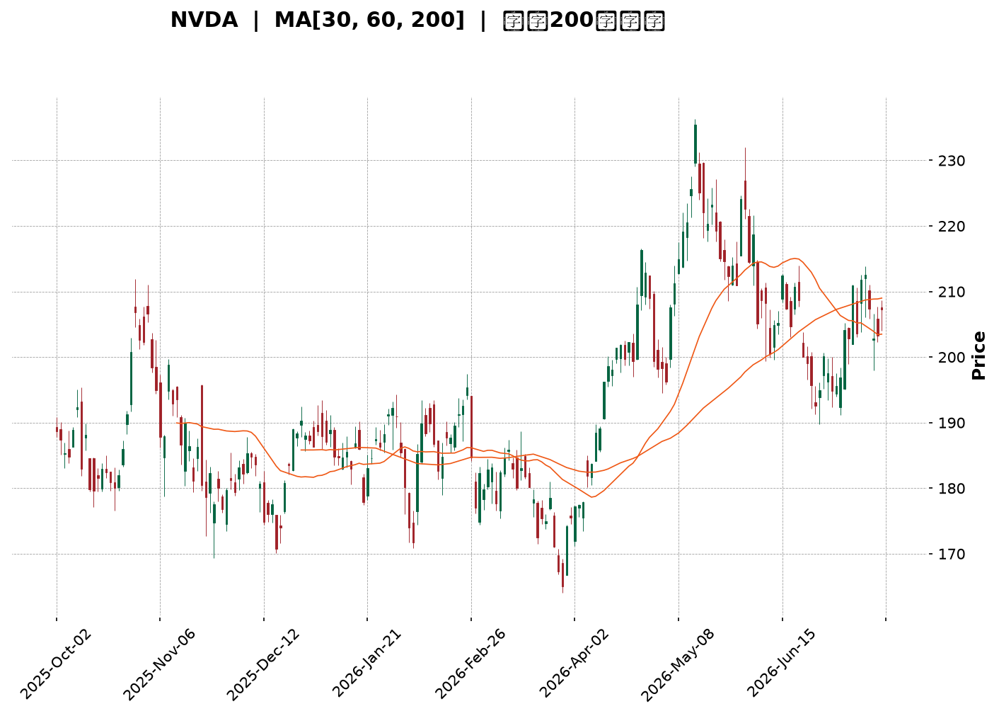
</details>

<html>
<head><meta charset="utf-8" /></head>
<body>
    <div style="height:500px; width:100%;">                        <script>window.PlotlyConfig = {MathJaxConfig: 'local'};</script>
        <script charset="utf-8" src="https://cdn.plot.ly/plotly-3.7.0.min.js" integrity="sha256-jvTGqxNp8AGWEcvNLVuKr+8j5dGe9Yw51LQkmDH+IYA=" crossorigin="anonymous"></script>                <div id="candlestick-chart" class="plotly-graph-div" style="height:100%; width:100%;"></div>            <script>                window.PLOTLYENV=window.PLOTLYENV || {};                                if (document.getElementById("candlestick-chart")) {                    Plotly.newPlot(                        "candlestick-chart",                        [{"close":{"dtype":"f8","bdata":"AAAA4MeUZ0AAAAAgMWxnQAAAAKC3KWdAAAAAwLwZZ0AAAADAz5tnQAAAAABkCmhAAAAAgKfdZkAAAACAkIJnQAAAACCfeWZAAAAA4DpzZkAAAABAgrJmQAAAAGCS32ZAAAAAAAnNZkAAAABgvJ1mQAAAAICcgWZAAAAA4LG9ZkAAAABAukBnQAAAAADg52dAAAAAAMQYaUAAAABA19hpQAAAAMA1VGlAAAAAIG1HaUAAAABAutNpQAAAACD7zWhAAAAAYMNeaEAAAADg5HpnQAAAAEAhfWdAAAAAoHzZaEAAAAAgPx1oQAAAAECzMWhAAAAAQOdTZ0AAAAAgsL1nQAAAACCYS2dAAAAAwCCkZkAAAACACUlnQAAAAOAdjWZAAAAAYN5UZkAAAADAKMpmQAAAAAD+MmZAAAAAwPiAZkAAAAAAyRhmQAAAACAbdmZAAAAA4FKnZkAAAABgj2tmQAAAAOAC5WZAAAAAYALGZkAAAAAAXipnQAAAAGDUF2dAAAAAwMvxZkAAAADgtJZmQAAAAEDR2WVAAAAAQGgCZkAAAACgHDBmQAAAAIBqV2VAAAAAALG9ZUAAAAAAoJhmQAAAAGDr7mZAAAAAQFifZ0AAAADgKoxnQAAAAGCIyWdAAAAA4LN\u002fZ0AAAAAg+GlnQAAAAMC6SGdAAAAAoNaTZ0AAAADAgXxnQAAAAKBhYGdAAAAA4CWcZ0AAAAAAERpnQAAAAEBQFGdAAAAA4N4WZ0AAAABArTJnQAAAAEBX3WZAAAAA4E5aZ0AAAACgGUBnQAAAAIBMO2ZAAAAAIBjjZkAAAACgrBNnQAAAAMAfbmdAAAAAYMVHZ0AAAACASolnQAAAAIAs6WdAAAAAwNAIaEAAAACgtdxnQAAAAMBILGdAAAAAgNmDZkAAAABASr9lQAAAAMB1dWVAAAAAgOQlZ0AAAAAg37lnQAAAACDuiWdAAAAAIDG6Z0AAAAAAy1ZnQAAAACDL0mZAAAAAYNQXZ0AAAAAgCHhnQAAAAKB5dWdAAAAAQNeyZ0AAAAAAIupnQAAAAMCuE2hAAAAA4EtqaEAAAADARRVnQAAAAEAsH2ZAAAAAID\u002fIZkAAAADAlHpmQAAAAAAl2mZAAAAAgLvjZkAAAAAATzNmQAAAAACuzWZAAAAA4G8RZ0AAAACgBzpnQAAAAGCo3WZAAAAAAEmBZkAAAAAAN+BmQAAAAID7tmZAAAAAYBSGZkAAAACgREtmQAAAAGD3j2VAAAAA4O\u002ftZUAAAACA399lQAAAAIAaT2ZAAAAAIE1hZUAAAABAZupkQAAAAIBJn2RAAAAAoE3GZUAAAAAAdPFlQAAAACDfJWZAAAAAwNwtZkAAAADAkDxmQAAAAADHu2ZAAAAA4ET2ZkAAAAAgIo1nQAAAACDeomdAAAAA4P+IaEAAAACAbtRoQAAAAKDPw2hAAAAAID8uaUAAAACAZDppQAAAAOC29GhAAAAA4HRIaUAAAAAAC+1oQAAAAKDhAGpAAAAAYHMLa0AAAADAf51qQAAAAIA0IGpAAAAAQM7qaEAAAADgAcdoQAAAAED3x2hAAAAAAK6IaEAAAABg0fJpQAAAAAAfaGpAAAAAIGLeakAAAADA52VrQAAAAEC8kGtAAAAAwCUybEAAAAAA5m5tQAAAAMDYIWxAAAAAYPXBa0AAAABATYtrQAAAACC35mtAAAAAgCRoa0AAAADgieJqQAAAACCE02pAAAAAwEeLakAAAADABMBqQAAAAGCdXGpAAAAAgCkDbEAAAACA8NFrQAAAAAAA0GpAAAAAwB5Va0AAAABAM6NpQAAAAOB6FGpAAAAAgBQGakAAAACgcA1pQAAAAADXm2lAAAAAgBSmaUAAAABgZo5qQAAAAMAe7WlAAAAAwMyUaUAAAACAFFZqQAAAAMDMFGpAAAAAoEcBaUAAAAAAAOBoQAAAACCud2hAAAAAwPUQaEAAAABACl9oQAAAAEDhAmlAAAAAYI+yaEAAAABgj1poQAAAAKCZcWhAAAAAgMKdaEAAAAAA14NpQAAAAMD1WGlAAAAAYLheakAAAADA9XBpQAAAAKCZeWpAAAAAAACQakAAAADAzOxpQAAAAIDrWWlAAAAAwPVoaUAAAACgR+lpQA=="},"high":{"dtype":"f8","bdata":"vJYMFtDZZ0BJuTuowsNnQKWzpn26X2dAuL83rTaaZ0BryALDeKtnQJUjFaOjYWhA+2lOu91raECX4pJyxbtnQMYuhTkREmdAevKM6E0UZ0BkwvcofeFmQAnGODGy+2ZAU706ydkeZ0C0eMc91NFmQHezXUaa5mZAx\u002fjiy3\u002fZZkAIGqL\u002fZWdnQNLFq40s+GdAx3u54IRcaUDyEwdjbn1qQJMlxoC3vGlAF5\u002fXEJD2aUBSZP71Q2JqQLLi6sa5dmlA69QALCtVaUBvBrz0yKtoQOgPzDmQgmdANi+XNu71aEAGcL1qeWVoQJIvq7B+dGhA4DM51UbmZ0DMOvubiNhnQNRq59RLmGdAd88UWxESZ0BN7FDE3HNnQNU9cLcCeGhABJSYmmUKZ0DiBkM2hehmQGPRxbPbPWZAAUBz+KnVZkD6Q5a6+GFmQMHw2ShAgmZA0imBbI0tZ0DaqIGo9sZmQDRBc19yCWdAnjvD6+sNZ0CNMxvtq3hnQDtr+OPML2dAVaABKSEoZ0BFKJf7K6NmQPigxwgd02ZASycX\u002fntGZkDeHMHQuEhmQN5HBTRL\u002fWVAEXXU0O79ZUCOx+CoU6dmQIcDRe\u002fw\u002fWZAfjZ1DS6jZ0CkVI+BwZVnQIwlyJGRDmhAIC1tHPaQZ0B7ILAnUJhnQLoNTrt9ymdAmo+qKD0WaECiF\u002f7DnCxoQG69ge3y\u002fWdAZFMxMmHkZ0Aqxu39NapnQAxz2JqdQ2dAfD6cnotcZ0B\u002fLjHsL3xnQOonv5OHB2dA1cidLQGvZ0DtyF\u002f8p8ZnQN0qVf0MxWZA3e5oEe8kZ0BjHia6Lj5nQMDxPx3Pq2dA8nLurXecZ0A2+eXal7hnQOBgcJezA2hAy5fsUdEnaEAeDRA4GUhoQIl8sHEuwmdAq5jn8WBBZ0CT3YNWj2tmQNrDtvNYE2ZA28AP4rVYZ0A3k8ofki1oQJIXdU7bB2hA7LW3V8kgaEBifm0Q+StoQCDqDtKwaGdAhGHCHoFdZ0A\u002fP\u002fgla8RnQO9LABZqhmdAs4QhCSTDZ0DY33HM1jZoQDuWsDEWMWhA8XCNt3SsaECx9iWxtEFoQJEJfhzDy2ZAqHBlmJHnZkDiiGdkv5VmQJOiJy8zD2dABWN3kL76ZkCDhPITMtFmQADYvWf91WZAZaZd1c9GZ0C7qim22WxnQDYvnNUwF2dAgvItjvI7Z0D2qjPGH5VnQBnBaajkJWdA6vPONFTlZkCgLzi1p3hmQEwQwNmtQWZA+Nsa9zFFZkAt+bKleQBmQJQi5gZKoGZAbvxhnr4JZkAFw\u002f+4q1hlQFa0LG8WKGVAPBjqxlXNZUC29CCNOyVmQMYu12sRKWZAR9LMEagyZkDhMqRiuEBmQAqqrixrIWdA+8744LP7ZkAdhlwP7LhnQH9QgQkOrmdAAAAA4P+IaEBIGcuoVQVpQLYV3lHB82hAkkwpz+IuaUBKanGT6D1pQDeld4FyUGlAAAAA4HRIaUCyCriK93JpQBM08ZCKVmpA3n\u002fjhnsSa0DGToxfXM9qQHRBlqgdj2pAHUixC8RBakA1PvwbcFhpQHYdVkHYL2lAjS\u002f7dDgAaUCxb8mt4QBqQGGgR6BrvmpAhWWBlHwxa0BNl42ZUcFrQHLCGC2q72tA4hrrdGRybEAxgfbed4htQBKtnFBg52xARVHCom63bEBe2OJX\u002fwZsQC2AAYK8O2xA9NyhIVRkbECtsSU1FphrQFBrztahPWtAtjLfd9K8akA5QGaDnOhqQFStdopnM2tA3TLrgnYTbEDv2RGITgBtQOXT+4nw0WtAAAAAQDOza0AAAAAA19tqQAAAAEAKT2pAAAAAwMxsakAAAABACudpQAAAAMAetWlAAAAAgD3iaUAAAABguJZqQAAAACCub2pAAAAAYLgmakAAAADgemxqQAAAACCuv2pAAAAA4KN4aUAAAACgcDVpQAAAAKCZGWlAAAAAoJlxaEAAAACAwoVoQAAAAAApFGlAAAAAQDP7aEAAAACA6wFpQAAAAKCZsWhAAAAAwB7NaEAAAADAHqVpQAAAAEDhkmlAAAAAAABgakAAAACAPVJqQAAAAKCZkWpAAAAAgOu5akAAAABgj2JqQAAAAMDM1GlAAAAAIK73aUAAAADAzBRqQA=="},"hovertemplate":"\u003cb\u003e%{x|%Y-%m-%d}\u003c\u002fb\u003e\u003cbr\u003e\u958b: $%{open:.2f}\u003cbr\u003e\u9ad8: $%{high:.2f}\u003cbr\u003e\u4f4e: $%{low:.2f}\u003cbr\u003e\u6536: $%{close:.2f}\u003cextra\u003e\u003c\u002fextra\u003e","low":{"dtype":"f8","bdata":"Un0oKUF6Z0B2OAGAmiRnQE4OWW8W42ZAaOkr+n\u002f4ZkDc\u002fnQRrUlnQOsH2MEh2mdAH0os9S26ZkCOUAcAJDdnQJ0ujzETb2ZAu9YuoQ0iZkAHi7zpT3FmQItvf1WscGZAxjf7vvOvZkCFiP5wRXJmQDXyVlsdEWZAY8lEe\u002fNxZkAKRPIshehmQN6qGE4UhmdAkB3QKkz1Z0C7zwP1nJBpQKiWihHpJGlAXaj54QA6aUDIDyWGiqlpQHq3TQ6xtWhAENn7l91MaEBTxQk9kERnQHNhSa3TVWZAsOjKgmExaEBebLtozeFnQPW2x3xe3GdAqsq9yLTzZkC2jFDzMotmQBuvjSq6AmdARxfDN3ptZkBqbYWBG9NmQJRyYX7ec2ZAOWK69rWWZUDhCOKWKghmQEfLimuwKmVAEGRwFGpAZkByAa83zghmQF43nB2urmVAXI8hvKl4ZkBNHSRCOFxmQGY8pmG0d2ZA7IIoWBGWZkAjuS6PsMVmQALjPxcY42ZAtyg0\u002fS66ZkBq3S5j9AxmQBKF7l0IzWVA9+ci8yLaZUBGU7JE+9VlQGTGmslHQ2VA2Ewox4pzZUCRujGHAQRmQDg\u002fV38XxGZAfS+yl6vVZkCYuqcom0tnQO1VdN+reGdAIH2Tbd81Z0CHq1oWeVZnQGvUiPloSGdAAZVUI\u002fuAZ0ARKp0oiz1nQEyt9DD1UmdAVb23sqVKZ0AQ19EFj+9mQGCCRKBH7mZABY8paYHZZkC8ctOMpuVmQC\u002f5ClqNkmZAfwCCz0tDZ0AdbDNfTjtnQDWVK7eYLGZAKSf0eNhFZkBVBdr0lvZmQB+nihv1UmdAAbtECm44Z0AvMZIkKS9nQFIPO6R6s2dA3\u002fLlvao6Z0AH4+Fwp6dnQBXhCenzFGdAxHhOZH0AZkCU+JBAa3ZlQIFvhftKWmVAGysh4GTMZUBqhmWmOvdmQNml+LCBfGdAHW7mJUiRZ0BbE4aqDElnQBfX1gzNq2ZAFzzFZ8ZeZkA0weMMClFnQK+jjPrhLWdAt4ok+NQ2Z0ADNABpK6tnQNiZF6N+ZWdAzjAAqrkxaEDHTTMQDgNnQBd\u002fUtVIBWZAwJqYHKzNZUAAEK78ihZmQMVIDp3memZAC1fAvTk1ZkA1VKz6WBNmQKNkIIET62VA6Np5azm5ZkD0v29RhwdnQAs0cME6sWZAYLTUdGB3ZkCOzMHCXKZmQM87WOL9rmZA0q7fqteDZkCqvK4qu\u002fJlQF3\u002fkpikcGVA9AdoRM\u002fRZUAp75Xi4LhlQL6xrLOcFGZAkg8l1BpeZUDHCSodGdpkQHErK1WFgmRAMBQgM4DYZEDjMUmJfdFlQL0Fg6l0ZWVAboDnrcXxZUCRTeOXpq5lQNcMgznigmZAgiIfgByNZkDSmQ0LvAJnQNYfrcvCMGdA3s0onYjRZ0BeLkl5Y3BoQGRbOxmgcmhAgHDGezfhaEBikMR+grNoQP8tXESW2GhAOtGhQJbYaED8whJ0sZ9oQO6bpu558mhA3lEgRm\u002fkaUCO81vlpP5pQKKjA83T6mlAhhUNbP\u002fOaECj3vUuf5xoQOhh8epsUGhA53V7O6h5aEBDsYYNH8xoQNAv565OyGlASE58p4yUakClmtsNg7RqQMPcfQJv1WpA3DMZgPypa0A4xzHqDqFsQA51o6xT\u002f2tAngo0i7RDa0B5TrWfADVrQBtWzjLJh2tASm1cMaQ1a0AJq+ktmdFqQLP9M0YaeGpAd9oiri4RakCcz3flK19qQEBLZphLXGpARmM0Vl3uakDuoOhE9KJrQIFK8ilUyGpAAAAAQApfakAAAABgj4ppQAAAAAAAwGlAAAAAQOHqaEAAAACgcP1oQAAAAKBH8WhAAAAAgBRuaUAAAABA4QpqQAAAAKBH6WlAAAAAYI9iaUAAAAAAANBpQAAAAEAK92lAAAAAAAAAaUAAAABgj5JoQAAAAAApBGhAAAAAQArnZ0AAAACgmblnQAAAACCFY2hAAAAAYGYuaEAAAABAMwtoQAAAACCuP2hAAAAA4HrkZ0AAAACA62FoQAAAAGC43mhAAAAAoHA9aUAAAAAAAGBpQAAAAKCZeWlAAAAAoEfBaUAAAABAM7tpQAAAAEAKv2hAAAAAwPVIaUAAAADAUoBpQA=="},"name":"\u50f9\u683c","open":{"dtype":"f8","bdata":"HI5h13irZ0AW4tA9Xp5nQGGV1GpwKGdAI4Ya1cQ\u002fZ0BnOUehokpnQAbOTiyG\u002f2dAOwzOn24oaEBygO\u002fmYHdnQPqFqMkbEWdAkaCFQxESZ0DkIv997r9mQCgX2VhqfmZAuSoAA7LcZkC0eMc91NFmQBQlmKYYnWZA3H1E6BWGZkCTXLHgYvNmQHWo5Kbvt2dA3hl2JbsZaEClPgTx4fZpQBgu1QpwnGlAWWhaDfzFaUCUlXAaFPppQEwtMqa5V2lACaUKuonQaEBbuCsab4VoQDLGmipDFWdAC6W5PJFbaEA8b0dBKl1oQHeoz9YPb2hAPx8MB9DZZ0DCNWLoENRmQHYW7rJ1N2dA6IIsjK\u002fkZkDk\u002fJJNvxFnQOQgBJ1pdmhAdziM30qgZkBfPTUuXWhmQANSc5391WVAt8L9k8GsZkCuCJHmBVlmQFynezgy0WVA4LWjPumwZkAVZ\u002fjzLZtmQFFvmHDCrGZAY7fyuk\u002f1ZkA+NQ1KXM1mQPCTu7yvKmdAbIvkX9QXZ0BIx5qc7oFmQJB+dLl1nGZADitsqCQ3ZkAZPhnScgFmQDotqsBV\u002fGVAd1+f+yfKZUAT0iacjQ5mQCLEazRF9mZA3ZLaZOjXZkDdtLHvwHZnQIt1YlYJtmdA38buFmdvZ0A6ALKjV4BnQPl+lZzZqmdABErTvnqzZ0CN2SpN2PBnQN1lsaQ2yWdA+YeRo+OKZ0BfgAniJZxnQFmH7k1YG2dAzxk3yuXfZkAHGkzVyRhnQAIJaBkOA2dAHFwvvbpIZ0CcI99uMJtnQGOCm4e1tWZAMAFn3J5aZkDBi+tFzBBnQDnuTtKwaGdAJJY3\u002fdJdZ0Ax9yWGYWBnQD\u002fHuP4u4WdAGcYCzWvjZ0Cbq50zRN9nQLk6xyEaX2dASc6LfmtAZ0DGFA+JuWdmQCJzKNDw1mVAUFnZRDEPZkBYcW4OIwFnQAXwmyiz5GdAMXDy7OUGaEDUfSJ6bxloQIszKiUNaGdAXywoQuqwZkAJGMZQpJBnQGK99MGgWmdAPbqvrvdKZ0DGHj+fVuVnQElNYTI36GdAZmDT09FGaEB6NzckEUFoQO8H0TvvoGZARYtha3\u002fZZUCRoo3RuEhmQJfkP9ILh2ZAvcwiiGCeZkDAmZaX3nNmQNcvl7SqE2ZAZa0TZ7DFZkBnJfXEMTZnQP\u002f3YnK++mZANayfFo0WZ0CcjVNiOdhmQDAQeaYGG2dAaTYH6o\u002fIZkCwusY+sDlmQKoSgXReOWZA9lYDbbchZkDmJ1QHDNRlQEABVVGaHGZA+duFcK77ZUDjzzW5qjllQD7q2TKsEmVA2dK5+tHYZECHs62dcfllQIht8m9Yf2VAJYLgM4UeZkAxtC060PBlQC2oDowgCWdAfVCmHRu0ZkAYLafSDQNnQMPpsacHOmdA40lJUsXTZ0Azz0NY9YloQDcFJKZnpmhA5fW1WVr1aEBP\u002fST26PdoQLt6EGuhPGlA9o9iZjEYaUA60lybLUdpQNVaaWBF92hA3OQrYP0sakB5XwlY4CdqQDCHbPl5jmpAfwUKc\u002fA1akCbJQ9DdiFpQGDVuWWR6GhAXBvy6yziaECREpCYCPVoQAONxWIeA2pAJx+zMQaZakBIGqlfTrlqQOSrRGR1SWtAGqU6dWEVbEAJGXRLo7JsQDcricjCr2xASCgk4EazbEDFz\u002fmQqGtrQKQAAyRy3WtAYC0Cvf\u002fAa0AtgbIhkpRrQLOzlZo2CWtAzlMcAd27akAwSf3SFmFqQMNg7BGRympAaH33zFLvakDX5GPrS11sQE9ohsfHrmtAAAAAwB69akAAAADA9dBqQAAAAIDCRWpAAAAAANdTakAAAACAwo1pQAAAACCuL2lAAAAAIIWbaUAAAACgcB1qQAAAAIDCZWpAAAAAwPUQakAAAABgj+ppQAAAAIAUbmpAAAAAoHBFaUAAAAAA1wNpQAAAAGCPAmlAAAAAANcjaEAAAABAMztoQAAAACCup2hAAAAAYGaGaEAAAADgeqRoQAAAAKBwTWhAAAAAANcLaEAAAACAwmVoQAAAAGC4jmlAAAAAAABAaUAAAACgRxFqQAAAAGBmBmpAAAAAYLh+akAAAACgcEVqQAAAAOB6VGlAAAAAANe7aUAAAACgR\u002fFpQA=="},"x":["2025-10-02T00:00:00-04:00","2025-10-03T00:00:00-04:00","2025-10-06T00:00:00-04:00","2025-10-07T00:00:00-04:00","2025-10-08T00:00:00-04:00","2025-10-09T00:00:00-04:00","2025-10-10T00:00:00-04:00","2025-10-13T00:00:00-04:00","2025-10-14T00:00:00-04:00","2025-10-15T00:00:00-04:00","2025-10-16T00:00:00-04:00","2025-10-17T00:00:00-04:00","2025-10-20T00:00:00-04:00","2025-10-21T00:00:00-04:00","2025-10-22T00:00:00-04:00","2025-10-23T00:00:00-04:00","2025-10-24T00:00:00-04:00","2025-10-27T00:00:00-04:00","2025-10-28T00:00:00-04:00","2025-10-29T00:00:00-04:00","2025-10-30T00:00:00-04:00","2025-10-31T00:00:00-04:00","2025-11-03T00:00:00-05:00","2025-11-04T00:00:00-05:00","2025-11-05T00:00:00-05:00","2025-11-06T00:00:00-05:00","2025-11-07T00:00:00-05:00","2025-11-10T00:00:00-05:00","2025-11-11T00:00:00-05:00","2025-11-12T00:00:00-05:00","2025-11-13T00:00:00-05:00","2025-11-14T00:00:00-05:00","2025-11-17T00:00:00-05:00","2025-11-18T00:00:00-05:00","2025-11-19T00:00:00-05:00","2025-11-20T00:00:00-05:00","2025-11-21T00:00:00-05:00","2025-11-24T00:00:00-05:00","2025-11-25T00:00:00-05:00","2025-11-26T00:00:00-05:00","2025-11-28T00:00:00-05:00","2025-12-01T00:00:00-05:00","2025-12-02T00:00:00-05:00","2025-12-03T00:00:00-05:00","2025-12-04T00:00:00-05:00","2025-12-05T00:00:00-05:00","2025-12-08T00:00:00-05:00","2025-12-09T00:00:00-05:00","2025-12-10T00:00:00-05:00","2025-12-11T00:00:00-05:00","2025-12-12T00:00:00-05:00","2025-12-15T00:00:00-05:00","2025-12-16T00:00:00-05:00","2025-12-17T00:00:00-05:00","2025-12-18T00:00:00-05:00","2025-12-19T00:00:00-05:00","2025-12-22T00:00:00-05:00","2025-12-23T00:00:00-05:00","2025-12-24T00:00:00-05:00","2025-12-26T00:00:00-05:00","2025-12-29T00:00:00-05:00","2025-12-30T00:00:00-05:00","2025-12-31T00:00:00-05:00","2026-01-02T00:00:00-05:00","2026-01-05T00:00:00-05:00","2026-01-06T00:00:00-05:00","2026-01-07T00:00:00-05:00","2026-01-08T00:00:00-05:00","2026-01-09T00:00:00-05:00","2026-01-12T00:00:00-05:00","2026-01-13T00:00:00-05:00","2026-01-14T00:00:00-05:00","2026-01-15T00:00:00-05:00","2026-01-16T00:00:00-05:00","2026-01-20T00:00:00-05:00","2026-01-21T00:00:00-05:00","2026-01-22T00:00:00-05:00","2026-01-23T00:00:00-05:00","2026-01-26T00:00:00-05:00","2026-01-27T00:00:00-05:00","2026-01-28T00:00:00-05:00","2026-01-29T00:00:00-05:00","2026-01-30T00:00:00-05:00","2026-02-02T00:00:00-05:00","2026-02-03T00:00:00-05:00","2026-02-04T00:00:00-05:00","2026-02-05T00:00:00-05:00","2026-02-06T00:00:00-05:00","2026-02-09T00:00:00-05:00","2026-02-10T00:00:00-05:00","2026-02-11T00:00:00-05:00","2026-02-12T00:00:00-05:00","2026-02-13T00:00:00-05:00","2026-02-17T00:00:00-05:00","2026-02-18T00:00:00-05:00","2026-02-19T00:00:00-05:00","2026-02-20T00:00:00-05:00","2026-02-23T00:00:00-05:00","2026-02-24T00:00:00-05:00","2026-02-25T00:00:00-05:00","2026-02-26T00:00:00-05:00","2026-02-27T00:00:00-05:00","2026-03-02T00:00:00-05:00","2026-03-03T00:00:00-05:00","2026-03-04T00:00:00-05:00","2026-03-05T00:00:00-05:00","2026-03-06T00:00:00-05:00","2026-03-09T00:00:00-04:00","2026-03-10T00:00:00-04:00","2026-03-11T00:00:00-04:00","2026-03-12T00:00:00-04:00","2026-03-13T00:00:00-04:00","2026-03-16T00:00:00-04:00","2026-03-17T00:00:00-04:00","2026-03-18T00:00:00-04:00","2026-03-19T00:00:00-04:00","2026-03-20T00:00:00-04:00","2026-03-23T00:00:00-04:00","2026-03-24T00:00:00-04:00","2026-03-25T00:00:00-04:00","2026-03-26T00:00:00-04:00","2026-03-27T00:00:00-04:00","2026-03-30T00:00:00-04:00","2026-03-31T00:00:00-04:00","2026-04-01T00:00:00-04:00","2026-04-02T00:00:00-04:00","2026-04-06T00:00:00-04:00","2026-04-07T00:00:00-04:00","2026-04-08T00:00:00-04:00","2026-04-09T00:00:00-04:00","2026-04-10T00:00:00-04:00","2026-04-13T00:00:00-04:00","2026-04-14T00:00:00-04:00","2026-04-15T00:00:00-04:00","2026-04-16T00:00:00-04:00","2026-04-17T00:00:00-04:00","2026-04-20T00:00:00-04:00","2026-04-21T00:00:00-04:00","2026-04-22T00:00:00-04:00","2026-04-23T00:00:00-04:00","2026-04-24T00:00:00-04:00","2026-04-27T00:00:00-04:00","2026-04-28T00:00:00-04:00","2026-04-29T00:00:00-04:00","2026-04-30T00:00:00-04:00","2026-05-01T00:00:00-04:00","2026-05-04T00:00:00-04:00","2026-05-05T00:00:00-04:00","2026-05-06T00:00:00-04:00","2026-05-07T00:00:00-04:00","2026-05-08T00:00:00-04:00","2026-05-11T00:00:00-04:00","2026-05-12T00:00:00-04:00","2026-05-13T00:00:00-04:00","2026-05-14T00:00:00-04:00","2026-05-15T00:00:00-04:00","2026-05-18T00:00:00-04:00","2026-05-19T00:00:00-04:00","2026-05-20T00:00:00-04:00","2026-05-21T00:00:00-04:00","2026-05-22T00:00:00-04:00","2026-05-26T00:00:00-04:00","2026-05-27T00:00:00-04:00","2026-05-28T00:00:00-04:00","2026-05-29T00:00:00-04:00","2026-06-01T00:00:00-04:00","2026-06-02T00:00:00-04:00","2026-06-03T00:00:00-04:00","2026-06-04T00:00:00-04:00","2026-06-05T00:00:00-04:00","2026-06-08T00:00:00-04:00","2026-06-09T00:00:00-04:00","2026-06-10T00:00:00-04:00","2026-06-11T00:00:00-04:00","2026-06-12T00:00:00-04:00","2026-06-15T00:00:00-04:00","2026-06-16T00:00:00-04:00","2026-06-17T00:00:00-04:00","2026-06-18T00:00:00-04:00","2026-06-22T00:00:00-04:00","2026-06-23T00:00:00-04:00","2026-06-24T00:00:00-04:00","2026-06-25T00:00:00-04:00","2026-06-26T00:00:00-04:00","2026-06-29T00:00:00-04:00","2026-06-30T00:00:00-04:00","2026-07-01T00:00:00-04:00","2026-07-02T00:00:00-04:00","2026-07-06T00:00:00-04:00","2026-07-07T00:00:00-04:00","2026-07-08T00:00:00-04:00","2026-07-09T00:00:00-04:00","2026-07-10T00:00:00-04:00","2026-07-13T00:00:00-04:00","2026-07-14T00:00:00-04:00","2026-07-15T00:00:00-04:00","2026-07-16T00:00:00-04:00","2026-07-17T00:00:00-04:00","2026-07-20T00:00:00-04:00","2026-07-21T00:00:00-04:00"],"type":"candlestick"},{"hovertemplate":"MA30: $%{y:.2f}\u003cextra\u003e\u003c\u002fextra\u003e","line":{"color":"#2196F3","dash":"dash","width":2},"mode":"lines","name":"MA30","x":["2025-10-02T00:00:00-04:00","2025-10-03T00:00:00-04:00","2025-10-06T00:00:00-04:00","2025-10-07T00:00:00-04:00","2025-10-08T00:00:00-04:00","2025-10-09T00:00:00-04:00","2025-10-10T00:00:00-04:00","2025-10-13T00:00:00-04:00","2025-10-14T00:00:00-04:00","2025-10-15T00:00:00-04:00","2025-10-16T00:00:00-04:00","2025-10-17T00:00:00-04:00","2025-10-20T00:00:00-04:00","2025-10-21T00:00:00-04:00","2025-10-22T00:00:00-04:00","2025-10-23T00:00:00-04:00","2025-10-24T00:00:00-04:00","2025-10-27T00:00:00-04:00","2025-10-28T00:00:00-04:00","2025-10-29T00:00:00-04:00","2025-10-30T00:00:00-04:00","2025-10-31T00:00:00-04:00","2025-11-03T00:00:00-05:00","2025-11-04T00:00:00-05:00","2025-11-05T00:00:00-05:00","2025-11-06T00:00:00-05:00","2025-11-07T00:00:00-05:00","2025-11-10T00:00:00-05:00","2025-11-11T00:00:00-05:00","2025-11-12T00:00:00-05:00","2025-11-13T00:00:00-05:00","2025-11-14T00:00:00-05:00","2025-11-17T00:00:00-05:00","2025-11-18T00:00:00-05:00","2025-11-19T00:00:00-05:00","2025-11-20T00:00:00-05:00","2025-11-21T00:00:00-05:00","2025-11-24T00:00:00-05:00","2025-11-25T00:00:00-05:00","2025-11-26T00:00:00-05:00","2025-11-28T00:00:00-05:00","2025-12-01T00:00:00-05:00","2025-12-02T00:00:00-05:00","2025-12-03T00:00:00-05:00","2025-12-04T00:00:00-05:00","2025-12-05T00:00:00-05:00","2025-12-08T00:00:00-05:00","2025-12-09T00:00:00-05:00","2025-12-10T00:00:00-05:00","2025-12-11T00:00:00-05:00","2025-12-12T00:00:00-05:00","2025-12-15T00:00:00-05:00","2025-12-16T00:00:00-05:00","2025-12-17T00:00:00-05:00","2025-12-18T00:00:00-05:00","2025-12-19T00:00:00-05:00","2025-12-22T00:00:00-05:00","2025-12-23T00:00:00-05:00","2025-12-24T00:00:00-05:00","2025-12-26T00:00:00-05:00","2025-12-29T00:00:00-05:00","2025-12-30T00:00:00-05:00","2025-12-31T00:00:00-05:00","2026-01-02T00:00:00-05:00","2026-01-05T00:00:00-05:00","2026-01-06T00:00:00-05:00","2026-01-07T00:00:00-05:00","2026-01-08T00:00:00-05:00","2026-01-09T00:00:00-05:00","2026-01-12T00:00:00-05:00","2026-01-13T00:00:00-05:00","2026-01-14T00:00:00-05:00","2026-01-15T00:00:00-05:00","2026-01-16T00:00:00-05:00","2026-01-20T00:00:00-05:00","2026-01-21T00:00:00-05:00","2026-01-22T00:00:00-05:00","2026-01-23T00:00:00-05:00","2026-01-26T00:00:00-05:00","2026-01-27T00:00:00-05:00","2026-01-28T00:00:00-05:00","2026-01-29T00:00:00-05:00","2026-01-30T00:00:00-05:00","2026-02-02T00:00:00-05:00","2026-02-03T00:00:00-05:00","2026-02-04T00:00:00-05:00","2026-02-05T00:00:00-05:00","2026-02-06T00:00:00-05:00","2026-02-09T00:00:00-05:00","2026-02-10T00:00:00-05:00","2026-02-11T00:00:00-05:00","2026-02-12T00:00:00-05:00","2026-02-13T00:00:00-05:00","2026-02-17T00:00:00-05:00","2026-02-18T00:00:00-05:00","2026-02-19T00:00:00-05:00","2026-02-20T00:00:00-05:00","2026-02-23T00:00:00-05:00","2026-02-24T00:00:00-05:00","2026-02-25T00:00:00-05:00","2026-02-26T00:00:00-05:00","2026-02-27T00:00:00-05:00","2026-03-02T00:00:00-05:00","2026-03-03T00:00:00-05:00","2026-03-04T00:00:00-05:00","2026-03-05T00:00:00-05:00","2026-03-06T00:00:00-05:00","2026-03-09T00:00:00-04:00","2026-03-10T00:00:00-04:00","2026-03-11T00:00:00-04:00","2026-03-12T00:00:00-04:00","2026-03-13T00:00:00-04:00","2026-03-16T00:00:00-04:00","2026-03-17T00:00:00-04:00","2026-03-18T00:00:00-04:00","2026-03-19T00:00:00-04:00","2026-03-20T00:00:00-04:00","2026-03-23T00:00:00-04:00","2026-03-24T00:00:00-04:00","2026-03-25T00:00:00-04:00","2026-03-26T00:00:00-04:00","2026-03-27T00:00:00-04:00","2026-03-30T00:00:00-04:00","2026-03-31T00:00:00-04:00","2026-04-01T00:00:00-04:00","2026-04-02T00:00:00-04:00","2026-04-06T00:00:00-04:00","2026-04-07T00:00:00-04:00","2026-04-08T00:00:00-04:00","2026-04-09T00:00:00-04:00","2026-04-10T00:00:00-04:00","2026-04-13T00:00:00-04:00","2026-04-14T00:00:00-04:00","2026-04-15T00:00:00-04:00","2026-04-16T00:00:00-04:00","2026-04-17T00:00:00-04:00","2026-04-20T00:00:00-04:00","2026-04-21T00:00:00-04:00","2026-04-22T00:00:00-04:00","2026-04-23T00:00:00-04:00","2026-04-24T00:00:00-04:00","2026-04-27T00:00:00-04:00","2026-04-28T00:00:00-04:00","2026-04-29T00:00:00-04:00","2026-04-30T00:00:00-04:00","2026-05-01T00:00:00-04:00","2026-05-04T00:00:00-04:00","2026-05-05T00:00:00-04:00","2026-05-06T00:00:00-04:00","2026-05-07T00:00:00-04:00","2026-05-08T00:00:00-04:00","2026-05-11T00:00:00-04:00","2026-05-12T00:00:00-04:00","2026-05-13T00:00:00-04:00","2026-05-14T00:00:00-04:00","2026-05-15T00:00:00-04:00","2026-05-18T00:00:00-04:00","2026-05-19T00:00:00-04:00","2026-05-20T00:00:00-04:00","2026-05-21T00:00:00-04:00","2026-05-22T00:00:00-04:00","2026-05-26T00:00:00-04:00","2026-05-27T00:00:00-04:00","2026-05-28T00:00:00-04:00","2026-05-29T00:00:00-04:00","2026-06-01T00:00:00-04:00","2026-06-02T00:00:00-04:00","2026-06-03T00:00:00-04:00","2026-06-04T00:00:00-04:00","2026-06-05T00:00:00-04:00","2026-06-08T00:00:00-04:00","2026-06-09T00:00:00-04:00","2026-06-10T00:00:00-04:00","2026-06-11T00:00:00-04:00","2026-06-12T00:00:00-04:00","2026-06-15T00:00:00-04:00","2026-06-16T00:00:00-04:00","2026-06-17T00:00:00-04:00","2026-06-18T00:00:00-04:00","2026-06-22T00:00:00-04:00","2026-06-23T00:00:00-04:00","2026-06-24T00:00:00-04:00","2026-06-25T00:00:00-04:00","2026-06-26T00:00:00-04:00","2026-06-29T00:00:00-04:00","2026-06-30T00:00:00-04:00","2026-07-01T00:00:00-04:00","2026-07-02T00:00:00-04:00","2026-07-06T00:00:00-04:00","2026-07-07T00:00:00-04:00","2026-07-08T00:00:00-04:00","2026-07-09T00:00:00-04:00","2026-07-10T00:00:00-04:00","2026-07-13T00:00:00-04:00","2026-07-14T00:00:00-04:00","2026-07-15T00:00:00-04:00","2026-07-16T00:00:00-04:00","2026-07-17T00:00:00-04:00","2026-07-20T00:00:00-04:00","2026-07-21T00:00:00-04:00"],"y":{"dtype":"f8","bdata":"AAAAAAAA+H8AAAAAAAD4fwAAAAAAAPh\u002fAAAAAAAA+H8AAAAAAAD4fwAAAAAAAPh\u002fAAAAAAAA+H8AAAAAAAD4fwAAAAAAAPh\u002fAAAAAAAA+H8AAAAAAAD4fwAAAAAAAPh\u002fAAAAAAAA+H8AAAAAAAD4fwAAAAAAAPh\u002fAAAAAAAA+H8AAAAAAAD4fwAAAAAAAPh\u002fAAAAAAAA+H8AAAAAAAD4fwAAAAAAAPh\u002fAAAAAAAA+H8AAAAAAAD4fwAAAAAAAPh\u002fAAAAAAAA+H8AAAAAAAD4fwAAAAAAAPh\u002fAAAAAAAA+H8AAAAAAAD4f3d3d5c4vmdAiYiI+A68Z0B3d3dnxr5nQM3MzHznv2dAMzMz4\u002fu7Z0C8u7uLOblnQCIiIgKErGdAVVVVxfSnZ0De3d0tz6FnQJqZmXl0n2dAzczMvOmfZ0BmZmb2yZpnQM3MzPxFl2dA7+7uLgSWZ0BEREQEWJRnQKuqqjqol2dA3t3dLe+XZ0Dv7u5eMJdnQM3MzAxBkGdAERERceN9Z0Dv7u5+FWJnQKuqqnpnRGdAq6qq6oAoZ0AREREhcwlnQGZmZsbl62ZAq6qqOnbVZkBmZmZm681mQO\u002fu7t4tyWZAERERMbW+ZkDv7u4u37lmQJqZmUlmtmZAq6qqCty3ZkBERESkEbVmQCIiIjL5tGZAmpmZufa8ZkDv7u7urb5mQJqZmbm4xWZAIiIigqHQZkAiIiJiS9NmQAAAACDO2mZAMzMzQ83fZkDNzMy8MulmQM3MzKyj7GZAIiIiApvyZkDv7u6usPlmQImIiHgI9GZAmpmZqQD1ZkBEREQEP\u002fRmQFVVVWUf92ZAzczMDP35ZkCrqqoaEwJnQGZmZjanE2dAZmZm9u4kZ0BERERUODNnQGZmZlbZQmdAmpmZSXRJZ0AiIiKyNUJnQFVVVbWgNWdAERERUZQxZ0AzMzNTGjNnQFVVVZX7MGdAERERse4yZ0De3d0NSzJnQKuqqqpcLmdAVVVVdToqZ0BVVVVFFCpnQFVVVUXIKmdAq6qq6okrZ0CrqqpqeTJnQBEREZH8OmdAAAAAAE1GZ0BVVVUVUkVnQBEREVH7PmdAzczM7Bw6Z0De3d1thzNnQJqZmenSOGdAvLu7W9g4Z0BVVVXFXTFnQFVVVaUELGdA7+7u\u002fjQqZ0AiIiKikCdnQERERNSlHmdAVVVVxZgRZ0BmZmYmLglnQM3MzCxFBWdARERENFgFZ0Dv7u6uAgpnQO\u002fu7t7kCmdAmpmZ2X4AZ0AAAAAQsvBmQKuqqooz5mZAERER8SvSZkCrqqrqfb1mQERERFS1qmZAq6qqGnWfZkCrqqoqcJJmQJqZmVlAh2ZAEREREUl6ZkDNzMxs92tmQERERMSAYGZAIiIiIhpUZkAiIiLyGFhmQGZmZkYFZWZAIiIiovpzZkDNzMxsCohmQJqZmelcmGZAVVVV1emrZkAiIiLiv8VmQLy7uwse2GZAzczMnATrZkCamZm5hPlmQGZmZuZKFGdAvLu7Cwg7Z0Dv7u7e8FpnQO\u002fu7l4MeGdAd3d393iMZ0ARERHxqaFnQHd3d2chvWdAERER8VrTZ0DNzMy8HvZnQKuqqloWGWhAMzMzY+xHaEARERGBPX9oQAAAABB9umhAiYiIiEjxaEC8u7u7MjFpQGZmZpZDZGlAIiIiAt6TaUDv7u6OKMFpQBEREaFB7WlAvLu7ey8TakAAAADgoS9qQLy7u5vaSmpAMzMzI\u002f9bakAzMzMDYmxqQImIiHgCempAq6qqaiySakDv7u6uSqhqQERERHQiuGpAVVVVlZ\u002fJakDe3d39sc9qQLy7uztZ0GpA7+7u3qLHakCJiIgITbpqQERERITjtWpAd3d3lyG8akC8u7ubT8tqQBERETEV1WpAZmZmJgXeakAAAAAwVOFqQN7d3S2N3mpAVVVV5aXOakC8u7srHrlqQERERMSunmpA7+7ubnF7akARERFxP1BqQHd3d5edNWpAd3d3l4AbakAAAAAQRwBqQERERBTG4mlAMzMzA\u002fbKaUAiIiJiRb9pQJqZmQmnsmlAq6qqyiqxaUAAAACg\u002f6VpQHd3d\u002ff2pmlAd3d3t5eaaUC8u7vba4ppQFVVVbXzfWlAERER8YttaUBERET04W9pQA=="},"type":"scatter"},{"hovertemplate":"MA60: $%{y:.2f}\u003cextra\u003e\u003c\u002fextra\u003e","line":{"color":"#9C27B0","dash":"dash","width":2},"mode":"lines","name":"MA60","x":["2025-10-02T00:00:00-04:00","2025-10-03T00:00:00-04:00","2025-10-06T00:00:00-04:00","2025-10-07T00:00:00-04:00","2025-10-08T00:00:00-04:00","2025-10-09T00:00:00-04:00","2025-10-10T00:00:00-04:00","2025-10-13T00:00:00-04:00","2025-10-14T00:00:00-04:00","2025-10-15T00:00:00-04:00","2025-10-16T00:00:00-04:00","2025-10-17T00:00:00-04:00","2025-10-20T00:00:00-04:00","2025-10-21T00:00:00-04:00","2025-10-22T00:00:00-04:00","2025-10-23T00:00:00-04:00","2025-10-24T00:00:00-04:00","2025-10-27T00:00:00-04:00","2025-10-28T00:00:00-04:00","2025-10-29T00:00:00-04:00","2025-10-30T00:00:00-04:00","2025-10-31T00:00:00-04:00","2025-11-03T00:00:00-05:00","2025-11-04T00:00:00-05:00","2025-11-05T00:00:00-05:00","2025-11-06T00:00:00-05:00","2025-11-07T00:00:00-05:00","2025-11-10T00:00:00-05:00","2025-11-11T00:00:00-05:00","2025-11-12T00:00:00-05:00","2025-11-13T00:00:00-05:00","2025-11-14T00:00:00-05:00","2025-11-17T00:00:00-05:00","2025-11-18T00:00:00-05:00","2025-11-19T00:00:00-05:00","2025-11-20T00:00:00-05:00","2025-11-21T00:00:00-05:00","2025-11-24T00:00:00-05:00","2025-11-25T00:00:00-05:00","2025-11-26T00:00:00-05:00","2025-11-28T00:00:00-05:00","2025-12-01T00:00:00-05:00","2025-12-02T00:00:00-05:00","2025-12-03T00:00:00-05:00","2025-12-04T00:00:00-05:00","2025-12-05T00:00:00-05:00","2025-12-08T00:00:00-05:00","2025-12-09T00:00:00-05:00","2025-12-10T00:00:00-05:00","2025-12-11T00:00:00-05:00","2025-12-12T00:00:00-05:00","2025-12-15T00:00:00-05:00","2025-12-16T00:00:00-05:00","2025-12-17T00:00:00-05:00","2025-12-18T00:00:00-05:00","2025-12-19T00:00:00-05:00","2025-12-22T00:00:00-05:00","2025-12-23T00:00:00-05:00","2025-12-24T00:00:00-05:00","2025-12-26T00:00:00-05:00","2025-12-29T00:00:00-05:00","2025-12-30T00:00:00-05:00","2025-12-31T00:00:00-05:00","2026-01-02T00:00:00-05:00","2026-01-05T00:00:00-05:00","2026-01-06T00:00:00-05:00","2026-01-07T00:00:00-05:00","2026-01-08T00:00:00-05:00","2026-01-09T00:00:00-05:00","2026-01-12T00:00:00-05:00","2026-01-13T00:00:00-05:00","2026-01-14T00:00:00-05:00","2026-01-15T00:00:00-05:00","2026-01-16T00:00:00-05:00","2026-01-20T00:00:00-05:00","2026-01-21T00:00:00-05:00","2026-01-22T00:00:00-05:00","2026-01-23T00:00:00-05:00","2026-01-26T00:00:00-05:00","2026-01-27T00:00:00-05:00","2026-01-28T00:00:00-05:00","2026-01-29T00:00:00-05:00","2026-01-30T00:00:00-05:00","2026-02-02T00:00:00-05:00","2026-02-03T00:00:00-05:00","2026-02-04T00:00:00-05:00","2026-02-05T00:00:00-05:00","2026-02-06T00:00:00-05:00","2026-02-09T00:00:00-05:00","2026-02-10T00:00:00-05:00","2026-02-11T00:00:00-05:00","2026-02-12T00:00:00-05:00","2026-02-13T00:00:00-05:00","2026-02-17T00:00:00-05:00","2026-02-18T00:00:00-05:00","2026-02-19T00:00:00-05:00","2026-02-20T00:00:00-05:00","2026-02-23T00:00:00-05:00","2026-02-24T00:00:00-05:00","2026-02-25T00:00:00-05:00","2026-02-26T00:00:00-05:00","2026-02-27T00:00:00-05:00","2026-03-02T00:00:00-05:00","2026-03-03T00:00:00-05:00","2026-03-04T00:00:00-05:00","2026-03-05T00:00:00-05:00","2026-03-06T00:00:00-05:00","2026-03-09T00:00:00-04:00","2026-03-10T00:00:00-04:00","2026-03-11T00:00:00-04:00","2026-03-12T00:00:00-04:00","2026-03-13T00:00:00-04:00","2026-03-16T00:00:00-04:00","2026-03-17T00:00:00-04:00","2026-03-18T00:00:00-04:00","2026-03-19T00:00:00-04:00","2026-03-20T00:00:00-04:00","2026-03-23T00:00:00-04:00","2026-03-24T00:00:00-04:00","2026-03-25T00:00:00-04:00","2026-03-26T00:00:00-04:00","2026-03-27T00:00:00-04:00","2026-03-30T00:00:00-04:00","2026-03-31T00:00:00-04:00","2026-04-01T00:00:00-04:00","2026-04-02T00:00:00-04:00","2026-04-06T00:00:00-04:00","2026-04-07T00:00:00-04:00","2026-04-08T00:00:00-04:00","2026-04-09T00:00:00-04:00","2026-04-10T00:00:00-04:00","2026-04-13T00:00:00-04:00","2026-04-14T00:00:00-04:00","2026-04-15T00:00:00-04:00","2026-04-16T00:00:00-04:00","2026-04-17T00:00:00-04:00","2026-04-20T00:00:00-04:00","2026-04-21T00:00:00-04:00","2026-04-22T00:00:00-04:00","2026-04-23T00:00:00-04:00","2026-04-24T00:00:00-04:00","2026-04-27T00:00:00-04:00","2026-04-28T00:00:00-04:00","2026-04-29T00:00:00-04:00","2026-04-30T00:00:00-04:00","2026-05-01T00:00:00-04:00","2026-05-04T00:00:00-04:00","2026-05-05T00:00:00-04:00","2026-05-06T00:00:00-04:00","2026-05-07T00:00:00-04:00","2026-05-08T00:00:00-04:00","2026-05-11T00:00:00-04:00","2026-05-12T00:00:00-04:00","2026-05-13T00:00:00-04:00","2026-05-14T00:00:00-04:00","2026-05-15T00:00:00-04:00","2026-05-18T00:00:00-04:00","2026-05-19T00:00:00-04:00","2026-05-20T00:00:00-04:00","2026-05-21T00:00:00-04:00","2026-05-22T00:00:00-04:00","2026-05-26T00:00:00-04:00","2026-05-27T00:00:00-04:00","2026-05-28T00:00:00-04:00","2026-05-29T00:00:00-04:00","2026-06-01T00:00:00-04:00","2026-06-02T00:00:00-04:00","2026-06-03T00:00:00-04:00","2026-06-04T00:00:00-04:00","2026-06-05T00:00:00-04:00","2026-06-08T00:00:00-04:00","2026-06-09T00:00:00-04:00","2026-06-10T00:00:00-04:00","2026-06-11T00:00:00-04:00","2026-06-12T00:00:00-04:00","2026-06-15T00:00:00-04:00","2026-06-16T00:00:00-04:00","2026-06-17T00:00:00-04:00","2026-06-18T00:00:00-04:00","2026-06-22T00:00:00-04:00","2026-06-23T00:00:00-04:00","2026-06-24T00:00:00-04:00","2026-06-25T00:00:00-04:00","2026-06-26T00:00:00-04:00","2026-06-29T00:00:00-04:00","2026-06-30T00:00:00-04:00","2026-07-01T00:00:00-04:00","2026-07-02T00:00:00-04:00","2026-07-06T00:00:00-04:00","2026-07-07T00:00:00-04:00","2026-07-08T00:00:00-04:00","2026-07-09T00:00:00-04:00","2026-07-10T00:00:00-04:00","2026-07-13T00:00:00-04:00","2026-07-14T00:00:00-04:00","2026-07-15T00:00:00-04:00","2026-07-16T00:00:00-04:00","2026-07-17T00:00:00-04:00","2026-07-20T00:00:00-04:00","2026-07-21T00:00:00-04:00"],"y":{"dtype":"f8","bdata":"AAAAAAAA+H8AAAAAAAD4fwAAAAAAAPh\u002fAAAAAAAA+H8AAAAAAAD4fwAAAAAAAPh\u002fAAAAAAAA+H8AAAAAAAD4fwAAAAAAAPh\u002fAAAAAAAA+H8AAAAAAAD4fwAAAAAAAPh\u002fAAAAAAAA+H8AAAAAAAD4fwAAAAAAAPh\u002fAAAAAAAA+H8AAAAAAAD4fwAAAAAAAPh\u002fAAAAAAAA+H8AAAAAAAD4fwAAAAAAAPh\u002fAAAAAAAA+H8AAAAAAAD4fwAAAAAAAPh\u002fAAAAAAAA+H8AAAAAAAD4fwAAAAAAAPh\u002fAAAAAAAA+H8AAAAAAAD4fwAAAAAAAPh\u002fAAAAAAAA+H8AAAAAAAD4fwAAAAAAAPh\u002fAAAAAAAA+H8AAAAAAAD4fwAAAAAAAPh\u002fAAAAAAAA+H8AAAAAAAD4fwAAAAAAAPh\u002fAAAAAAAA+H8AAAAAAAD4fwAAAAAAAPh\u002fAAAAAAAA+H8AAAAAAAD4fwAAAAAAAPh\u002fAAAAAAAA+H8AAAAAAAD4fwAAAAAAAPh\u002fAAAAAAAA+H8AAAAAAAD4fwAAAAAAAPh\u002fAAAAAAAA+H8AAAAAAAD4fwAAAAAAAPh\u002fAAAAAAAA+H8AAAAAAAD4fwAAAAAAAPh\u002fAAAAAAAA+H8AAAAAAAD4f4mIiHBPOmdAmpmZgfU5Z0De3d0F7DlnQHd3d1dwOmdAZmZmTnk8Z0BVVVW98ztnQN7d3V0eOWdAvLu7I0s8Z0AAAABIjTpnQM3MzEwhPWdAAAAAgNs\u002fZ0CamZlZ\u002fkFnQM3MzNT0QWdAiYiImE9EZ0CamZlZBEdnQJqZmVnYRWdAvLu763dGZ0CamZmxt0VnQBERETmwQ2dA7+7uPvA7Z0DNzMxMFDJnQImIiFgHLGdAiYiI8LcmZ0Crqqq6VR5nQGZmZo5fF2dAIiIiQnUPZ0BERESMEAhnQCIiIkpn\u002f2ZAERERwST4ZkARERHBfPZmQHd3d++w82ZA3t3dXWX1ZkARERFZrvNmQGZmZu6q8WZAd3d3l5jzZkAiIiIaYfRmQHd3d39A+GZAZmZmthX+ZkBmZmZm4gJnQImIiFjlCmdAmpmZIQ0TZ0ARERFpQhdnQO\u002fu7n7PFWdAd3d391sWZ0BmZmYOnBZnQBEREbFtFmdAq6qqguwWZ0DNzMxkzhJnQFVVVQWSEWdA3t3dBRkSZ0BmZmbe0RRnQFVVVYUmGWdA3t3d3UMbZ0BVVVU9Mx5nQJqZmUEPJGdA7+7uPmYnZ0CJiIgwHCZnQCIiIspCIGdAVVVVlQkZZ0CamZkx5hFnQAAAAJCXC2dAERERUY0CZ0BERER85PdmQHd3d\u002f+I7GZAAAAAyNfkZkAAAAA4Qt5mQHd3d08E2WZA3t3dfenSZkC8u7trOM9mQKuqqqq+zWZAERERkTPNZkC8u7uDtc5mQLy7u0sA0mZAd3d3xwvXZkBVVVXtyN1mQJqZmemX6GZAiYiIGGHyZkC8u7vTjvtmQImIiFgRAmdA3t3dzZwKZ0De3d2tihBnQFVVVV14GWdAiYiIaFAmZ0CrqqqCDzJnQN7d3cWoPmdA3t3dlehIZ0AAAABQ1lVnQDMzMyMDZGdAVVVV5expZ0BmZmZmaHNnQKuqqvKkf2dAIiIiKgyNZ0De3d21XZ5nQCIiIjKZsmdAmpmZ0V7IZ0AzMzNz0eFnQAAAAPjB9WdAmpmZiRMHaEDe3d39jxZoQKuqqjLhJmhA7+7uzqQzaEARERFp3UNoQBEREfHvV2hAq6qq4vxnaEAAAAA4NnpoQBEREbEviWhAAAAAIAufaECJiIhIBbdoQAAAAEAgyGhAERERGVLaaEC8u7tbm+RoQBERERFS8mhAVVVVdVUBaUC8u7vzngppQJqZmfH3FmlAd3d3R00kaUBmZmbGfDZpQEREREwbSWlAvLu7C7BYaUBmZmZ2uWtpQERERMTRe2lAREREJEmLaUBmZmbWLZxpQCIiIuqVrGlAvLu7+1y2aUBmZmYWucBpQO\u002fu7pbwzGlAzczMTK\u002fXaUB3d3fPt+BpQKuqqtoD6GlAd3d3vxLvaUARERGhc\u002fdpQKuqqtLA\u002fmlA7+7u9pQGakCamZnRMAlqQAAAALh8EGpAEREREWIWakBVVVVFWxlqQM3MzBQLG2pAMzMzw5UbakARERH5yR9qQA=="},"type":"scatter"},{"hovertemplate":"MA200: $%{y:.2f}\u003cextra\u003e\u003c\u002fextra\u003e","line":{"color":"#FF6F00","dash":"solid","width":2},"mode":"lines","name":"MA200","x":["2025-10-02T00:00:00-04:00","2025-10-03T00:00:00-04:00","2025-10-06T00:00:00-04:00","2025-10-07T00:00:00-04:00","2025-10-08T00:00:00-04:00","2025-10-09T00:00:00-04:00","2025-10-10T00:00:00-04:00","2025-10-13T00:00:00-04:00","2025-10-14T00:00:00-04:00","2025-10-15T00:00:00-04:00","2025-10-16T00:00:00-04:00","2025-10-17T00:00:00-04:00","2025-10-20T00:00:00-04:00","2025-10-21T00:00:00-04:00","2025-10-22T00:00:00-04:00","2025-10-23T00:00:00-04:00","2025-10-24T00:00:00-04:00","2025-10-27T00:00:00-04:00","2025-10-28T00:00:00-04:00","2025-10-29T00:00:00-04:00","2025-10-30T00:00:00-04:00","2025-10-31T00:00:00-04:00","2025-11-03T00:00:00-05:00","2025-11-04T00:00:00-05:00","2025-11-05T00:00:00-05:00","2025-11-06T00:00:00-05:00","2025-11-07T00:00:00-05:00","2025-11-10T00:00:00-05:00","2025-11-11T00:00:00-05:00","2025-11-12T00:00:00-05:00","2025-11-13T00:00:00-05:00","2025-11-14T00:00:00-05:00","2025-11-17T00:00:00-05:00","2025-11-18T00:00:00-05:00","2025-11-19T00:00:00-05:00","2025-11-20T00:00:00-05:00","2025-11-21T00:00:00-05:00","2025-11-24T00:00:00-05:00","2025-11-25T00:00:00-05:00","2025-11-26T00:00:00-05:00","2025-11-28T00:00:00-05:00","2025-12-01T00:00:00-05:00","2025-12-02T00:00:00-05:00","2025-12-03T00:00:00-05:00","2025-12-04T00:00:00-05:00","2025-12-05T00:00:00-05:00","2025-12-08T00:00:00-05:00","2025-12-09T00:00:00-05:00","2025-12-10T00:00:00-05:00","2025-12-11T00:00:00-05:00","2025-12-12T00:00:00-05:00","2025-12-15T00:00:00-05:00","2025-12-16T00:00:00-05:00","2025-12-17T00:00:00-05:00","2025-12-18T00:00:00-05:00","2025-12-19T00:00:00-05:00","2025-12-22T00:00:00-05:00","2025-12-23T00:00:00-05:00","2025-12-24T00:00:00-05:00","2025-12-26T00:00:00-05:00","2025-12-29T00:00:00-05:00","2025-12-30T00:00:00-05:00","2025-12-31T00:00:00-05:00","2026-01-02T00:00:00-05:00","2026-01-05T00:00:00-05:00","2026-01-06T00:00:00-05:00","2026-01-07T00:00:00-05:00","2026-01-08T00:00:00-05:00","2026-01-09T00:00:00-05:00","2026-01-12T00:00:00-05:00","2026-01-13T00:00:00-05:00","2026-01-14T00:00:00-05:00","2026-01-15T00:00:00-05:00","2026-01-16T00:00:00-05:00","2026-01-20T00:00:00-05:00","2026-01-21T00:00:00-05:00","2026-01-22T00:00:00-05:00","2026-01-23T00:00:00-05:00","2026-01-26T00:00:00-05:00","2026-01-27T00:00:00-05:00","2026-01-28T00:00:00-05:00","2026-01-29T00:00:00-05:00","2026-01-30T00:00:00-05:00","2026-02-02T00:00:00-05:00","2026-02-03T00:00:00-05:00","2026-02-04T00:00:00-05:00","2026-02-05T00:00:00-05:00","2026-02-06T00:00:00-05:00","2026-02-09T00:00:00-05:00","2026-02-10T00:00:00-05:00","2026-02-11T00:00:00-05:00","2026-02-12T00:00:00-05:00","2026-02-13T00:00:00-05:00","2026-02-17T00:00:00-05:00","2026-02-18T00:00:00-05:00","2026-02-19T00:00:00-05:00","2026-02-20T00:00:00-05:00","2026-02-23T00:00:00-05:00","2026-02-24T00:00:00-05:00","2026-02-25T00:00:00-05:00","2026-02-26T00:00:00-05:00","2026-02-27T00:00:00-05:00","2026-03-02T00:00:00-05:00","2026-03-03T00:00:00-05:00","2026-03-04T00:00:00-05:00","2026-03-05T00:00:00-05:00","2026-03-06T00:00:00-05:00","2026-03-09T00:00:00-04:00","2026-03-10T00:00:00-04:00","2026-03-11T00:00:00-04:00","2026-03-12T00:00:00-04:00","2026-03-13T00:00:00-04:00","2026-03-16T00:00:00-04:00","2026-03-17T00:00:00-04:00","2026-03-18T00:00:00-04:00","2026-03-19T00:00:00-04:00","2026-03-20T00:00:00-04:00","2026-03-23T00:00:00-04:00","2026-03-24T00:00:00-04:00","2026-03-25T00:00:00-04:00","2026-03-26T00:00:00-04:00","2026-03-27T00:00:00-04:00","2026-03-30T00:00:00-04:00","2026-03-31T00:00:00-04:00","2026-04-01T00:00:00-04:00","2026-04-02T00:00:00-04:00","2026-04-06T00:00:00-04:00","2026-04-07T00:00:00-04:00","2026-04-08T00:00:00-04:00","2026-04-09T00:00:00-04:00","2026-04-10T00:00:00-04:00","2026-04-13T00:00:00-04:00","2026-04-14T00:00:00-04:00","2026-04-15T00:00:00-04:00","2026-04-16T00:00:00-04:00","2026-04-17T00:00:00-04:00","2026-04-20T00:00:00-04:00","2026-04-21T00:00:00-04:00","2026-04-22T00:00:00-04:00","2026-04-23T00:00:00-04:00","2026-04-24T00:00:00-04:00","2026-04-27T00:00:00-04:00","2026-04-28T00:00:00-04:00","2026-04-29T00:00:00-04:00","2026-04-30T00:00:00-04:00","2026-05-01T00:00:00-04:00","2026-05-04T00:00:00-04:00","2026-05-05T00:00:00-04:00","2026-05-06T00:00:00-04:00","2026-05-07T00:00:00-04:00","2026-05-08T00:00:00-04:00","2026-05-11T00:00:00-04:00","2026-05-12T00:00:00-04:00","2026-05-13T00:00:00-04:00","2026-05-14T00:00:00-04:00","2026-05-15T00:00:00-04:00","2026-05-18T00:00:00-04:00","2026-05-19T00:00:00-04:00","2026-05-20T00:00:00-04:00","2026-05-21T00:00:00-04:00","2026-05-22T00:00:00-04:00","2026-05-26T00:00:00-04:00","2026-05-27T00:00:00-04:00","2026-05-28T00:00:00-04:00","2026-05-29T00:00:00-04:00","2026-06-01T00:00:00-04:00","2026-06-02T00:00:00-04:00","2026-06-03T00:00:00-04:00","2026-06-04T00:00:00-04:00","2026-06-05T00:00:00-04:00","2026-06-08T00:00:00-04:00","2026-06-09T00:00:00-04:00","2026-06-10T00:00:00-04:00","2026-06-11T00:00:00-04:00","2026-06-12T00:00:00-04:00","2026-06-15T00:00:00-04:00","2026-06-16T00:00:00-04:00","2026-06-17T00:00:00-04:00","2026-06-18T00:00:00-04:00","2026-06-22T00:00:00-04:00","2026-06-23T00:00:00-04:00","2026-06-24T00:00:00-04:00","2026-06-25T00:00:00-04:00","2026-06-26T00:00:00-04:00","2026-06-29T00:00:00-04:00","2026-06-30T00:00:00-04:00","2026-07-01T00:00:00-04:00","2026-07-02T00:00:00-04:00","2026-07-06T00:00:00-04:00","2026-07-07T00:00:00-04:00","2026-07-08T00:00:00-04:00","2026-07-09T00:00:00-04:00","2026-07-10T00:00:00-04:00","2026-07-13T00:00:00-04:00","2026-07-14T00:00:00-04:00","2026-07-15T00:00:00-04:00","2026-07-16T00:00:00-04:00","2026-07-17T00:00:00-04:00","2026-07-20T00:00:00-04:00","2026-07-21T00:00:00-04:00"],"y":{"dtype":"f8","bdata":"AAAAAAAA+H8AAAAAAAD4fwAAAAAAAPh\u002fAAAAAAAA+H8AAAAAAAD4fwAAAAAAAPh\u002fAAAAAAAA+H8AAAAAAAD4fwAAAAAAAPh\u002fAAAAAAAA+H8AAAAAAAD4fwAAAAAAAPh\u002fAAAAAAAA+H8AAAAAAAD4fwAAAAAAAPh\u002fAAAAAAAA+H8AAAAAAAD4fwAAAAAAAPh\u002fAAAAAAAA+H8AAAAAAAD4fwAAAAAAAPh\u002fAAAAAAAA+H8AAAAAAAD4fwAAAAAAAPh\u002fAAAAAAAA+H8AAAAAAAD4fwAAAAAAAPh\u002fAAAAAAAA+H8AAAAAAAD4fwAAAAAAAPh\u002fAAAAAAAA+H8AAAAAAAD4fwAAAAAAAPh\u002fAAAAAAAA+H8AAAAAAAD4fwAAAAAAAPh\u002fAAAAAAAA+H8AAAAAAAD4fwAAAAAAAPh\u002fAAAAAAAA+H8AAAAAAAD4fwAAAAAAAPh\u002fAAAAAAAA+H8AAAAAAAD4fwAAAAAAAPh\u002fAAAAAAAA+H8AAAAAAAD4fwAAAAAAAPh\u002fAAAAAAAA+H8AAAAAAAD4fwAAAAAAAPh\u002fAAAAAAAA+H8AAAAAAAD4fwAAAAAAAPh\u002fAAAAAAAA+H8AAAAAAAD4fwAAAAAAAPh\u002fAAAAAAAA+H8AAAAAAAD4fwAAAAAAAPh\u002fAAAAAAAA+H8AAAAAAAD4fwAAAAAAAPh\u002fAAAAAAAA+H8AAAAAAAD4fwAAAAAAAPh\u002fAAAAAAAA+H8AAAAAAAD4fwAAAAAAAPh\u002fAAAAAAAA+H8AAAAAAAD4fwAAAAAAAPh\u002fAAAAAAAA+H8AAAAAAAD4fwAAAAAAAPh\u002fAAAAAAAA+H8AAAAAAAD4fwAAAAAAAPh\u002fAAAAAAAA+H8AAAAAAAD4fwAAAAAAAPh\u002fAAAAAAAA+H8AAAAAAAD4fwAAAAAAAPh\u002fAAAAAAAA+H8AAAAAAAD4fwAAAAAAAPh\u002fAAAAAAAA+H8AAAAAAAD4fwAAAAAAAPh\u002fAAAAAAAA+H8AAAAAAAD4fwAAAAAAAPh\u002fAAAAAAAA+H8AAAAAAAD4fwAAAAAAAPh\u002fAAAAAAAA+H8AAAAAAAD4fwAAAAAAAPh\u002fAAAAAAAA+H8AAAAAAAD4fwAAAAAAAPh\u002fAAAAAAAA+H8AAAAAAAD4fwAAAAAAAPh\u002fAAAAAAAA+H8AAAAAAAD4fwAAAAAAAPh\u002fAAAAAAAA+H8AAAAAAAD4fwAAAAAAAPh\u002fAAAAAAAA+H8AAAAAAAD4fwAAAAAAAPh\u002fAAAAAAAA+H8AAAAAAAD4fwAAAAAAAPh\u002fAAAAAAAA+H8AAAAAAAD4fwAAAAAAAPh\u002fAAAAAAAA+H8AAAAAAAD4fwAAAAAAAPh\u002fAAAAAAAA+H8AAAAAAAD4fwAAAAAAAPh\u002fAAAAAAAA+H8AAAAAAAD4fwAAAAAAAPh\u002fAAAAAAAA+H8AAAAAAAD4fwAAAAAAAPh\u002fAAAAAAAA+H8AAAAAAAD4fwAAAAAAAPh\u002fAAAAAAAA+H8AAAAAAAD4fwAAAAAAAPh\u002fAAAAAAAA+H8AAAAAAAD4fwAAAAAAAPh\u002fAAAAAAAA+H8AAAAAAAD4fwAAAAAAAPh\u002fAAAAAAAA+H8AAAAAAAD4fwAAAAAAAPh\u002fAAAAAAAA+H8AAAAAAAD4fwAAAAAAAPh\u002fAAAAAAAA+H8AAAAAAAD4fwAAAAAAAPh\u002fAAAAAAAA+H8AAAAAAAD4fwAAAAAAAPh\u002fAAAAAAAA+H8AAAAAAAD4fwAAAAAAAPh\u002fAAAAAAAA+H8AAAAAAAD4fwAAAAAAAPh\u002fAAAAAAAA+H8AAAAAAAD4fwAAAAAAAPh\u002fAAAAAAAA+H8AAAAAAAD4fwAAAAAAAPh\u002fAAAAAAAA+H8AAAAAAAD4fwAAAAAAAPh\u002fAAAAAAAA+H8AAAAAAAD4fwAAAAAAAPh\u002fAAAAAAAA+H8AAAAAAAD4fwAAAAAAAPh\u002fAAAAAAAA+H8AAAAAAAD4fwAAAAAAAPh\u002fAAAAAAAA+H8AAAAAAAD4fwAAAAAAAPh\u002fAAAAAAAA+H8AAAAAAAD4fwAAAAAAAPh\u002fAAAAAAAA+H8AAAAAAAD4fwAAAAAAAPh\u002fAAAAAAAA+H8AAAAAAAD4fwAAAAAAAPh\u002fAAAAAAAA+H8AAAAAAAD4fwAAAAAAAPh\u002fAAAAAAAA+H8AAAAAAAD4fwAAAAAAAPh\u002fAAAAAAAA+H8fhes1UAxoQA=="},"type":"scatter"}],                        {"template":{"data":{"barpolar":[{"marker":{"line":{"color":"rgb(17,17,17)","width":0.5},"pattern":{"fillmode":"overlay","size":10,"solidity":0.2}},"type":"barpolar"}],"bar":[{"error_x":{"color":"#f2f5fa"},"error_y":{"color":"#f2f5fa"},"marker":{"line":{"color":"rgb(17,17,17)","width":0.5},"pattern":{"fillmode":"overlay","size":10,"solidity":0.2}},"type":"bar"}],"carpet":[{"aaxis":{"endlinecolor":"#A2B1C6","gridcolor":"#506784","linecolor":"#506784","minorgridcolor":"#506784","startlinecolor":"#A2B1C6"},"baxis":{"endlinecolor":"#A2B1C6","gridcolor":"#506784","linecolor":"#506784","minorgridcolor":"#506784","startlinecolor":"#A2B1C6"},"type":"carpet"}],"choropleth":[{"colorbar":{"outlinewidth":0,"ticks":""},"type":"choropleth"}],"contourcarpet":[{"colorbar":{"outlinewidth":0,"ticks":""},"type":"contourcarpet"}],"contour":[{"colorbar":{"outlinewidth":0,"ticks":""},"colorscale":[[0.0,"#0d0887"],[0.1111111111111111,"#46039f"],[0.2222222222222222,"#7201a8"],[0.3333333333333333,"#9c179e"],[0.4444444444444444,"#bd3786"],[0.5555555555555556,"#d8576b"],[0.6666666666666666,"#ed7953"],[0.7777777777777778,"#fb9f3a"],[0.8888888888888888,"#fdca26"],[1.0,"#f0f921"]],"type":"contour"}],"heatmap":[{"colorbar":{"outlinewidth":0,"ticks":""},"colorscale":[[0.0,"#0d0887"],[0.1111111111111111,"#46039f"],[0.2222222222222222,"#7201a8"],[0.3333333333333333,"#9c179e"],[0.4444444444444444,"#bd3786"],[0.5555555555555556,"#d8576b"],[0.6666666666666666,"#ed7953"],[0.7777777777777778,"#fb9f3a"],[0.8888888888888888,"#fdca26"],[1.0,"#f0f921"]],"type":"heatmap"}],"histogram2dcontour":[{"colorbar":{"outlinewidth":0,"ticks":""},"colorscale":[[0.0,"#0d0887"],[0.1111111111111111,"#46039f"],[0.2222222222222222,"#7201a8"],[0.3333333333333333,"#9c179e"],[0.4444444444444444,"#bd3786"],[0.5555555555555556,"#d8576b"],[0.6666666666666666,"#ed7953"],[0.7777777777777778,"#fb9f3a"],[0.8888888888888888,"#fdca26"],[1.0,"#f0f921"]],"type":"histogram2dcontour"}],"histogram2d":[{"colorbar":{"outlinewidth":0,"ticks":""},"colorscale":[[0.0,"#0d0887"],[0.1111111111111111,"#46039f"],[0.2222222222222222,"#7201a8"],[0.3333333333333333,"#9c179e"],[0.4444444444444444,"#bd3786"],[0.5555555555555556,"#d8576b"],[0.6666666666666666,"#ed7953"],[0.7777777777777778,"#fb9f3a"],[0.8888888888888888,"#fdca26"],[1.0,"#f0f921"]],"type":"histogram2d"}],"histogram":[{"marker":{"pattern":{"fillmode":"overlay","size":10,"solidity":0.2}},"type":"histogram"}],"mesh3d":[{"colorbar":{"outlinewidth":0,"ticks":""},"type":"mesh3d"}],"parcoords":[{"line":{"colorbar":{"outlinewidth":0,"ticks":""}},"type":"parcoords"}],"pie":[{"automargin":true,"type":"pie"}],"scatter3d":[{"line":{"colorbar":{"outlinewidth":0,"ticks":""}},"marker":{"colorbar":{"outlinewidth":0,"ticks":""}},"type":"scatter3d"}],"scattercarpet":[{"marker":{"colorbar":{"outlinewidth":0,"ticks":""}},"type":"scattercarpet"}],"scattergeo":[{"marker":{"colorbar":{"outlinewidth":0,"ticks":""}},"type":"scattergeo"}],"scattergl":[{"marker":{"line":{"color":"#283442"}},"type":"scattergl"}],"scattermapbox":[{"marker":{"colorbar":{"outlinewidth":0,"ticks":""}},"type":"scattermapbox"}],"scattermap":[{"marker":{"colorbar":{"outlinewidth":0,"ticks":""}},"type":"scattermap"}],"scatterpolargl":[{"marker":{"colorbar":{"outlinewidth":0,"ticks":""}},"type":"scatterpolargl"}],"scatterpolar":[{"marker":{"colorbar":{"outlinewidth":0,"ticks":""}},"type":"scatterpolar"}],"scatter":[{"marker":{"line":{"color":"#283442"}},"type":"scatter"}],"scatterternary":[{"marker":{"colorbar":{"outlinewidth":0,"ticks":""}},"type":"scatterternary"}],"surface":[{"colorbar":{"outlinewidth":0,"ticks":""},"colorscale":[[0.0,"#0d0887"],[0.1111111111111111,"#46039f"],[0.2222222222222222,"#7201a8"],[0.3333333333333333,"#9c179e"],[0.4444444444444444,"#bd3786"],[0.5555555555555556,"#d8576b"],[0.6666666666666666,"#ed7953"],[0.7777777777777778,"#fb9f3a"],[0.8888888888888888,"#fdca26"],[1.0,"#f0f921"]],"type":"surface"}],"table":[{"cells":{"fill":{"color":"#506784"},"line":{"color":"rgb(17,17,17)"}},"header":{"fill":{"color":"#2a3f5f"},"line":{"color":"rgb(17,17,17)"}},"type":"table"}]},"layout":{"annotationdefaults":{"arrowcolor":"#f2f5fa","arrowhead":0,"arrowwidth":1},"autotypenumbers":"strict","coloraxis":{"colorbar":{"outlinewidth":0,"ticks":""}},"colorscale":{"diverging":[[0,"#8e0152"],[0.1,"#c51b7d"],[0.2,"#de77ae"],[0.3,"#f1b6da"],[0.4,"#fde0ef"],[0.5,"#f7f7f7"],[0.6,"#e6f5d0"],[0.7,"#b8e186"],[0.8,"#7fbc41"],[0.9,"#4d9221"],[1,"#276419"]],"sequential":[[0.0,"#0d0887"],[0.1111111111111111,"#46039f"],[0.2222222222222222,"#7201a8"],[0.3333333333333333,"#9c179e"],[0.4444444444444444,"#bd3786"],[0.5555555555555556,"#d8576b"],[0.6666666666666666,"#ed7953"],[0.7777777777777778,"#fb9f3a"],[0.8888888888888888,"#fdca26"],[1.0,"#f0f921"]],"sequentialminus":[[0.0,"#0d0887"],[0.1111111111111111,"#46039f"],[0.2222222222222222,"#7201a8"],[0.3333333333333333,"#9c179e"],[0.4444444444444444,"#bd3786"],[0.5555555555555556,"#d8576b"],[0.6666666666666666,"#ed7953"],[0.7777777777777778,"#fb9f3a"],[0.8888888888888888,"#fdca26"],[1.0,"#f0f921"]]},"colorway":["#636efa","#EF553B","#00cc96","#ab63fa","#FFA15A","#19d3f3","#FF6692","#B6E880","#FF97FF","#FECB52"],"font":{"color":"#f2f5fa"},"geo":{"bgcolor":"rgb(17,17,17)","lakecolor":"rgb(17,17,17)","landcolor":"rgb(17,17,17)","showlakes":true,"showland":true,"subunitcolor":"#506784"},"hoverlabel":{"align":"left"},"hovermode":"closest","mapbox":{"style":"dark"},"paper_bgcolor":"rgb(17,17,17)","plot_bgcolor":"rgb(17,17,17)","polar":{"angularaxis":{"gridcolor":"#506784","linecolor":"#506784","ticks":""},"bgcolor":"rgb(17,17,17)","radialaxis":{"gridcolor":"#506784","linecolor":"#506784","ticks":""}},"scene":{"xaxis":{"backgroundcolor":"rgb(17,17,17)","gridcolor":"#506784","gridwidth":2,"linecolor":"#506784","showbackground":true,"ticks":"","zerolinecolor":"#C8D4E3"},"yaxis":{"backgroundcolor":"rgb(17,17,17)","gridcolor":"#506784","gridwidth":2,"linecolor":"#506784","showbackground":true,"ticks":"","zerolinecolor":"#C8D4E3"},"zaxis":{"backgroundcolor":"rgb(17,17,17)","gridcolor":"#506784","gridwidth":2,"linecolor":"#506784","showbackground":true,"ticks":"","zerolinecolor":"#C8D4E3"}},"shapedefaults":{"line":{"color":"#f2f5fa"}},"sliderdefaults":{"bgcolor":"#C8D4E3","bordercolor":"rgb(17,17,17)","borderwidth":1,"tickwidth":0},"ternary":{"aaxis":{"gridcolor":"#506784","linecolor":"#506784","ticks":""},"baxis":{"gridcolor":"#506784","linecolor":"#506784","ticks":""},"bgcolor":"rgb(17,17,17)","caxis":{"gridcolor":"#506784","linecolor":"#506784","ticks":""}},"title":{"x":0.05},"updatemenudefaults":{"bgcolor":"#506784","borderwidth":0},"xaxis":{"automargin":true,"gridcolor":"#283442","linecolor":"#506784","ticks":"","title":{"standoff":15},"zerolinecolor":"#283442","zerolinewidth":2},"yaxis":{"automargin":true,"gridcolor":"#283442","linecolor":"#506784","ticks":"","title":{"standoff":15},"zerolinecolor":"#283442","zerolinewidth":2}}},"xaxis":{"rangeslider":{"visible":false},"title":{"text":"\u65e5\u671f"}},"font":{"size":11},"title":{"text":"NVDA  |  MA(30\u002f60\u002f200)  |  \u6700\u8fd1200\u4ea4\u6613\u65e5"},"yaxis":{"title":{"text":"\u80a1\u50f9 (USD)"}},"hovermode":"x unified","height":500},                        {"responsive": true}                    )                };            </script>        </div>
</body>
</html>

# NVDA 技術分析報告

> **報告日期**：2026-07-22 ｜ **語言**：繁體中文 ｜ **數據來源**：Yahoo Finance ｜ **當前價格**：$207.29

---

## 目錄

| 章節 | 內容 |
|------|------|
| [1. 技術面概覽](#1-技術面概覽) | 訊號儀表板、核心指標、評分卡 |
| [2. 趨勢分析](#2-趨勢分析) | 多時框趨勢、長中短期走勢 |
| [3. 圖表形態分析](#3-圖表形態分析) | 形態識別、K線組合、目標價 |
| [4. 支撐與阻力](#4-支撐與阻力) | 關鍵價位、斐波那契回調 |
| [5. 技術指標深度解讀](#5-技術指標深度解讀) | MA/RSI/MACD/布林/成交量 |
| [6. 動能與波動率](#6-動能與波動率) | 動能評估、ATR、Beta |
| [7. 多時框架總結](#7-多時框架總結) | 時框架評分矩陣 |
| [8. 交易策略建議](#8-交易策略建議) | 多空策略、風險報酬比 |
| [9. 風險提示與監控](#9-風險提示與監控) | 監控指標、風險場景 |

---

## 1. 技術面概覽

### 🎯 技術訊號儀表板

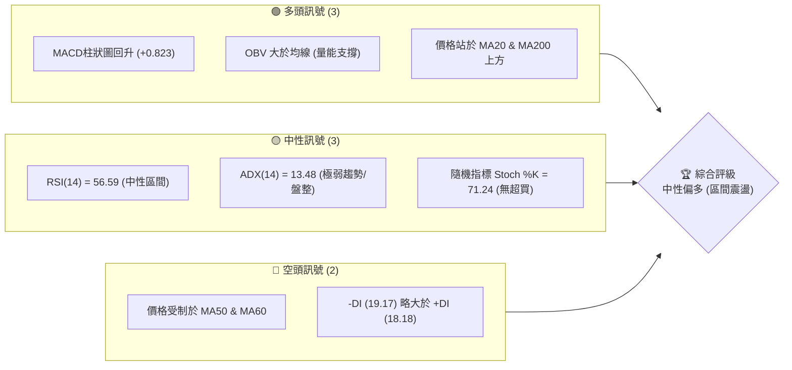

### 📊 核心指標速覽表

| 指標類別 | 指標名稱 | 當前數值 | 訊號 | 解讀 |
|----------|----------|----------|------|------|
| **價格** | 當前價格 | $207.29 | 🟡 中性 | 處於52週高低區間之 60.0% 位置，短線進行區間整理 |
| **均線** | MA20 | $201.69 | 🟢 看多 | 價格在 MA20 上方，MA20 呈現上行趨勢 (▲+2.78%) |
| **均線** | MA50 | $209.65 | 🔴 看空 | 價格在 MA50 下方，均線微幅下傾 (▼-0.82%)，構成短期阻力 |
| **均線** | MA200 | $192.38 | 🟢 看多 | 價格遠高於長期牛熊分界線，長期多頭趨勢未變 |
| **動能** | RSI(14) | 56.59 | 🟡 中性 | 動能處於中性偏多區間，無超買或超賣跡象，無背離 |
| **動能** | MACD | 0.211 | 🟢 看多 | MACD 柱狀圖為 +0.823，黃金交叉後多頭動能持續釋放 |
| **波動** | ATR(14) | $7.26 | 🟡 中性 | 佔股價 3.50%，波動度適中，適合進行區間內高出低吸 |

### 🏆 技術評分卡

```
技術評分卡 — NVDA (2026-07-22)
════════════════════════════════════════════════════
趨勢強度      ██████░░░░░░░░░░░░░░  30/100  🔴 弱趨勢
動能指標      ████████████░░░░░░░░  60/100  🟢 偏多
支撐穩定度    ████████████████░░░░  80/100  🟢 極強
成交量配合    ██████████░░░░░░░░░░  50/100  🟡 中性
形態完整度    ████████████░░░░░░░░  60/100  🟡 區間
均線排列      ██████████░░░░░░░░░░  50/100  🟡 混合
════════════════════════════════════════════════════
綜合評分      ████████████░░░░░░░░  56/100  🟡 中性偏多
════════════════════════════════════════════════════
```

---

## 2. 趨勢分析

### 🌐 多時框趨勢分析

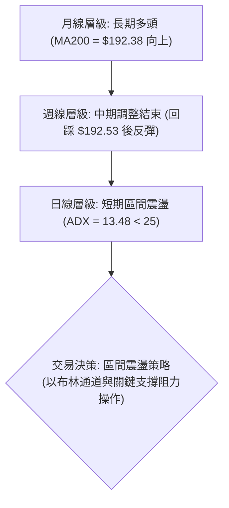

### 📈 長期趨勢 — 12個月走勢圖（Unicode）

NVDA 過去 12 個月的月線收盤走勢呈現出顯著的「階梯式上漲 ➔ 築頂 ➔ 回檔 ➔ 企穩」過程。

```
NVDA 月線走勢圖（過去12個月）
價格軸 ($)
$215 ┤                                                 ● (5月: 210.89)
$205 ┤                                     ● (10月: 202.23)    ● (7月: 207.29)
$195 ┤                                                         
$185 ┤                         ● (9月: 186.34)     ● (12月: 186.27)
$175 ┤             ● (7月: 177.63)                 
$165 ┤                                                         
$155 ┤         ● (6月: 157.78)                                 
$145 ┤                                                         
$135 ┤     ● (5月: 134.94)                                     
$125 ┤                                                         
$115 ┤ ● (2025-04: 108.77)                                     
     └──────────────────────────────────────────────────────────────
       M1  M2  M3  M4  M5  M6  M7  M8  M9  M10 M11 M12 (2026-07)
```

**走勢特徵分析表格**：

| 階段 | 時間區間 | 價格區間 | 走勢特徵 | 關鍵技術事件 |
|------|----------|----------|----------|--------------|
| **第一階段：主升段** | 2025-04 至 2025-10 | $108.77 → $202.23 | 強烈多頭趨勢，量增價漲 | 突破 $150 心理關卡，MA50 轉為陡峭上行 |
| **第二階段：中期調整** | 2025-11 至 2026-03 | $176.77 → $174.20 | 寬幅震盪洗盤，進行籌碼換手 | 兩度回踩 $170 附近（3月低點 $172.50） |
| **第三階段：衝高回落** | 2026-04 至 2026-06 | $199.34 → $200.09 | 創歷史新高 $236.26 後快速拉回 | 出現頂部獲利回吐，回測 120日均線支撐 |
| **第四階段：築底企穩** | 2026-07 至今 | $202.81 → $207.29 | 縮量築底，於 $190-$200 區間獲得強支撐 | MACD 底部金叉，OBV 顯示資金重新流入 |

### 📊 中期趨勢（週線分析）

中期週線圖顯示，NVDA 在經歷了 2026 年 5 月中旬的高點 $225.06 後，展開了一波 ABC 三浪調整，並於 2026 年 6 月 28 日當週收盤 $192.53 完成築底，該位置精確落在長期上升支撐線與 MA200 附近。

```
中期週線支撐與阻力通道
============================================================
[阻力區]  $214.16 - $219.18 ══════════════════════ (R1 & 23.6% 斐波那契位)
                  ▲
                  │  (短線反彈空間)
                  ▼
[現價]    $207.29 ------------------------------------------
                  ▲
                  │  (強烈買盤支撐帶)
                  ▼
[支撐區]  $199.34 - $200.06 ══════════════════════ (S1 & 50.0% 斐波那契位)
============================================================
```

### ⚡ 趨勢強度評估（ADX 解讀）

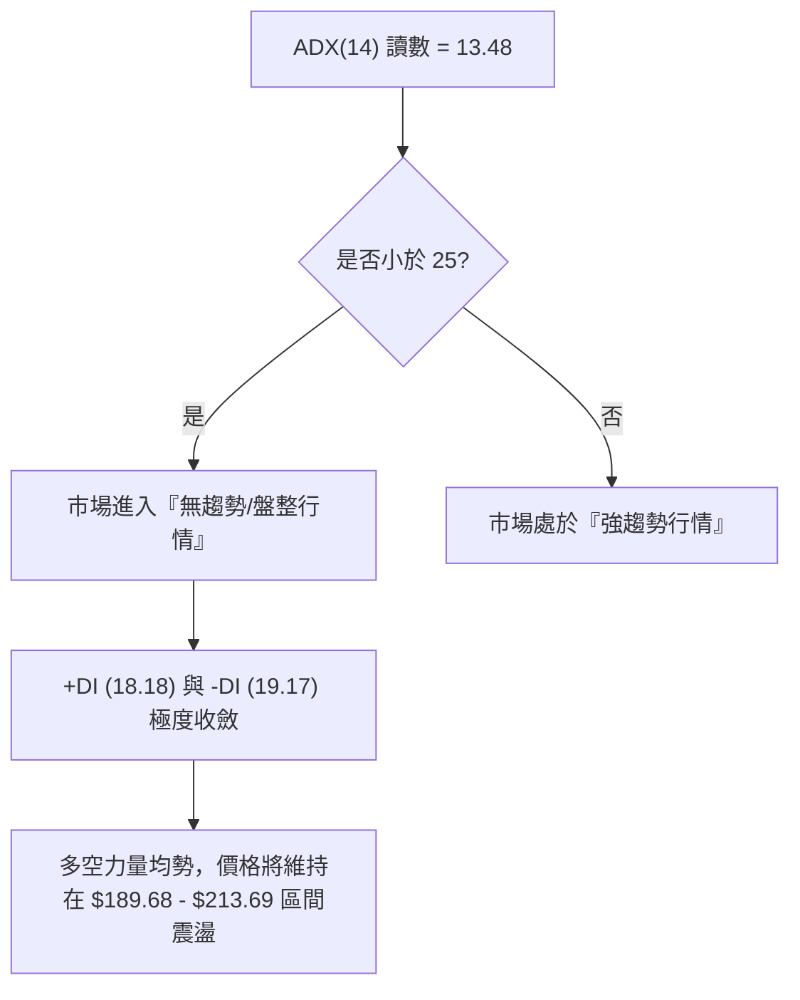

| ADX 數值區間 | 趨勢強度 | 適用交易策略 | NVDA 當前狀態 |
|--------------|----------|--------------|---------------|
| **0 - 15** | **極弱 / 無趨勢** | **網格交易、布林通道高吸低拋** | **✓ 處於此區間 (13.48)** |
| 15 - 25 | 弱趨勢 / 盤整 | 區間突破突破順勢交易 | ❌ 否 |
| 25 - 50 | 強趨勢 | 均線順勢操作、波段持有 | ❌ 否 |
| > 50 | 極強趨勢 | 強勢股動能追逐 | ❌ 否 |

---

## 3. 圖表形態分析

### 🔍 形態識別系統

由於當前 ADX(14) 僅為 13.48，顯示市場缺乏明確的單邊趨勢。因此，傳統的複雜幾何形態（如大型頭肩頂）可靠性較低。然而，在日線與週線圖上，我們能清晰識別出一個**箱型整理形態（Rectangle Range）**與一個正在成型的**雙底形態（Double Bottom）**。

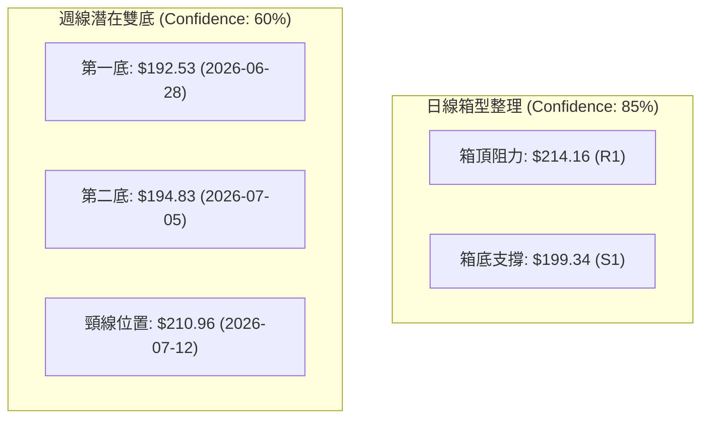

**形態信心度與特徵表**：

| 識別形態 | 信心度 | 判斷依據（引用數據） | 當前完成度 | 形態目標價（附計算式） |
|----------|--------|----------------------|------------|------------------------|
| **箱型整理** | **85%** | 價格在 $199.34 (S1) 至 $214.16 (R1) 之間反覆震盪，且 ADX < 25 | 90% (處於箱體上軌附近) | 突破箱頂後：$214.16 + ($214.16 - $199.34) = **$228.98** (接近 R2 $232.01) |
| **雙底形態** | **60%** | 週線級別兩次探底不破 $192.53 與 $194.83，且 MACD 柱狀圖翻紅 | 70% (等待日線收盤確認突破頸線) | 突破頸線後：$210.96 + ($210.96 - $192.53) = **$229.39** (接近 R2 $232.01) |

### 🕯️ 重要 K 線形態分析

觀察近期的日線與週線 K 線組合，多頭在關鍵支撐位展現了強烈的防守意願：

| 日期 / 週期 | 收盤價 | K 線形態 | 技術解讀 | 訊號強度 |
|-------------|--------|----------|----------|----------|
| **2026-06-28 (週線)** | $192.53 | **長下影錘頭線 (Hammer)** | 股價盤中跌破 $190，但收盤強勢拉回，顯示 $189.80 (S3) 附近買盤極強 | 🟢🟢🟢 強看多 |
| **2026-07-12 (週線)** | $210.96 | **大陽線 (Bullish Marubozu)** | 幾乎以全週最高點收盤，一舉吞噬前兩週陰線，確認中期底部 | 🟢🟢🟢 強看多 |
| **2026-07-19 (週線)** | $202.81 | **縮量孕線 (Inside Bar)** | 股價回檔但並未跌破前週大陽線實體之半，且成交量萎縮，屬於健康回檔 | 🟡 中性整理 |
| **2026-07-22 (今日)** | $207.29 | **小陽線 (Spinning Top)** | 價格在 50 日均線 ($209.65) 前遇阻，多空雙方在 38.2% 斐波那契位 ($208.60) 展開拉鋸 | 🟡 多空均衡 |

### 📉 ASCII 走勢形態示意圖

```
NVDA 雙底與箱型整理 K 線示意圖 (日線)
價格 ($)
$214.16 ┤          ┌───┐ (箱頂阻力 R1)
        │          │   │         ▲
$210.96 ┤          │   │  ┌───┐  │ (雙底頸線)
        │   ┌───┐  │   │  │   │  │   ┌───┐
$207.29 ┤───│   │──┼───┼──│   │──┼───│   │ (現價)
        │   │   │  │   │  │   │  │   │   │
$201.69 ┤   │   │  │   │  │   │  │   │   │ (MA20 / 箱體中軌)
        │   │   │  │   │  │   │  │   │   │
$199.34 ┤   │   │  └───┘  └───┘  │   └───┘ (箱底支撐 S1)
        │   │   │                │
$192.53 ┤───┴───┴────────────────┴───────── (雙底 1: $192.53 / 雙底 2: $194.83)
        └─────────────────────────────────────────
             5月       6月       7月       現在
```

### 🎯 形態目標價計算

根據**雙底形態**與**箱型整理**的突破原理，我們可推算其理論目標價：

1. **雙底突破理論目標價**：
   $$\text{目標價} = \text{頸線價格} + (\text{頸線價格} - \text{最低點價格})$$
   $$\text{目標價} = 210.96 + (210.96 - 192.53) = 210.96 + 18.43 = \mathbf{229.39}$$
   *(註：此目標價與近一年波段高點聚類阻力位 R2 $232.01 極為接近)*

2. **箱型突破理論目標價**：
   $$\text{目標價} = \text{箱頂阻力} + (\text{箱頂阻力} - \text{箱底支撐})$$
   $$\text{目標價} = 214.16 + (214.16 - 199.34) = 214.16 + 14.82 = \mathbf{228.98}$$

---

## 4. 支撐與阻力

### 🗺️ 關鍵價位分布圖（Unicode）

本圖表展示了 NVDA 當前價格相對於核心技術支撐與阻力位的幾何空間分布。

```
NVDA 價位結構分布圖
═══════════════════════════════════════════════════
$236.26 ║████████████████████████║ 52W 歷史高點 / 強阻力 R3
$232.01 ║████████████████████    ║ 近一年波段高點聚類 / 阻力 R2
$219.18 ║▓▓▓▓▓▓▓▓▓▓▓▓▓▓▓▓▓▓      ║ 23.6% 斐波那契回調位
$214.16 ║████████████████████████║ 箱體頂部 / 關鍵阻力 R1 (BB上軌 $213.69)
$208.60 ║░░░░░░░░░░░░░░░░░░░░░░░░║ 38.2% 斐波那契回調位 ◄ 現價附近 ($207.29)
$201.69 ╠════════════════════════╣ MA20 / 布林中軌
$200.06 ║▓▓▓▓▓▓▓▓▓▓▓▓▓▓▓▓        ║ 50.0% 斐波那契回調位 / 心理關卡
$199.34 ║████████████████████████║ 近期波段低點聚類 / 關鍵支撐 S1
$194.51 ║████████████████████████║ 強支撐 S2 (MA200 = $192.38)
$189.80 ║████████████████████████║ 箱體底部 / 極強支撐 S3 (BB下軌 $189.68)
═══════════════════════════════════════════════════
```

### 🚧 阻力位分析表

價位完全引用自數據包中「關鍵價位」區塊。

| 阻力級別 | 價位 | 形成原因 | 突破難度 | 重要性 |
|----------|------|----------|----------|--------|
| **R1** | **$214.16** | 箱體上軌、近一年波段高點聚類、布林通道上軌 ($213.69) 重合區 | 🔴🔴🔴 中高 | **極高**。突破此位意味著箱型整理結束，開啟新一輪中期多頭趨勢。 |
| **R2** | **$232.01** | 近一年波段次高點、雙底形態理論目標價聚類區 | 🔴🔴🔴🔴 高 | **中等**。屬於多頭上攻歷史高點前的最後一道籌碼密集壓力區。 |
| **R3** | **$236.26** | 52週歷史最高點，歷史套牢盤與心理壓力關卡 | 🔴🔴🔴🔴🔴 極高 | **高**。突破此位將打開無套牢盤的真空上漲空間。 |

### 🛡️ 支撐位分析表

價位完全引用自數據包中「關鍵價位」區塊。

| 支撐級別 | 價位 | 形成原因 | 守住機率 | 重要性 |
|----------|------|----------|----------|--------|
| **S1** | **$199.34** | 近一年波段低點聚類、50.0% 斐波那契回調位 ($200.06) 雙重支撐 | 🟢🟢🟢🟢 高 | **極高**。整數心理關卡，也是日線多頭必須死守的防線。 |
| **S2** | **$194.51** | 近期週線雙底低點、長期 MA200 ($192.38) 守護區 | 🟢🟢🟢🟢🟢 極高 | **高**。中期多空分水嶺，跌破此位意味著長期多頭趨勢遭到破壞。 |
| **S3** | **$189.80** | 近一年波段最低點聚類、布林通道下軌 ($189.68) | 🟢🟢🟢🟢🟢 極高 | **中等**。極端悲觀情況下的黃金買點。 |

### 📐 斐波那契回調位分析

當前 NVDA 價格為 **$207.29**，精確運行於 52 週高低區間（$163.85 至 $236.26）的斐波那契回調位之間：

*   **上方阻力**：**38.2% 斐波那契位 ($208.60)**。現價與該阻力僅差 0.63%，這解釋了為何股價近期在 $207-$209 區間出現震盪。若日線能收盤站穩 $208.60，多頭將直接挑戰 23.6% 斐波那契位 ($219.18)。
*   **下方支撐**：**50.0% 斐波那契位 ($200.06)**。該位置與關鍵支撐 S1 ($199.34) 高度重合，構成一個極其強大的「黃金支撐帶」。在沒有重大基本面利空的情況下，股價極難有效跌破此支撐帶。

---

## 5. 技術指標深度解讀

### 🎛️ 指標訊號總覽

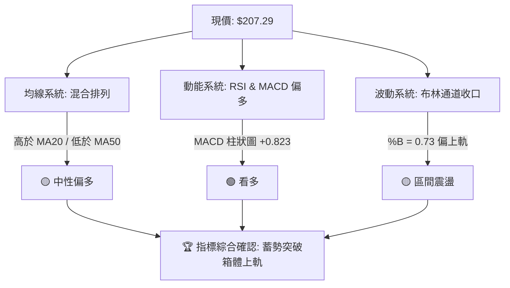

### 📈 移動平均線排列分析

NVDA 當前的均線系統呈現「**短期多頭、中期整理、長期看多**」的混合排列狀態：

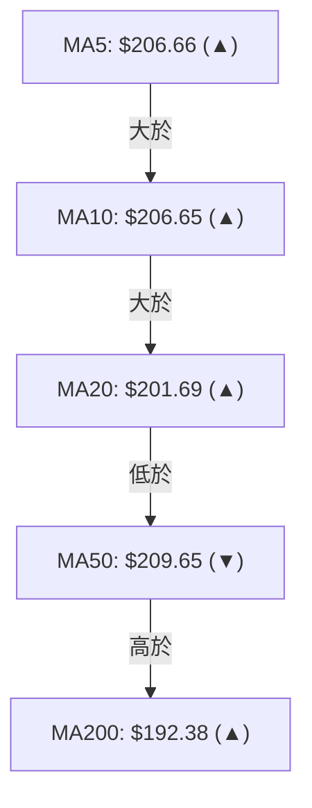

*   **短期均線 (MA5, MA10, MA20)** 已經完成多頭排列，且 MA20 以每日 +2.78% 的斜率向上攀升，提供強大的短期動態支撐。
*   **中期均線 (MA50, MA60)** 仍壓制在股價上方（MA50 = $209.65），且 MA60 呈微幅下行趨勢，說明中期套牢盤仍待消化。
*   **長期均線 (MA120, MA200, MA240)** 保持健康的上行姿態，股價高於 MA200 達 7.75%，確認大趨勢依然由多頭主導。

### 📉 RSI(14) 分析

*   **當前數值**：**56.59**
*   **強度進度條**：
    ```
    RSI(14) 強度: [███████████░░░░░░░░░] 56.59% (中性偏強)
    ```
*   **背離分析**：
    *   **日線層級**：股價在 6 月底至 7 月初創下波段低點（$192.53 ➔ $194.83），而 RSI 則由 38.7 提升至 40.4，呈現微幅的**底背離預示**，隨後股價確實展開反彈。
    *   **當前狀態**：RSI 處於 50-60 的強勢整理區間，未進入超買區（>70），顯示上行空間並未受到限制。

### 📊 MACD(12/26/9) 訊號解讀

*   **MACD 線**：0.211
*   **訊號線 (Signal Line)**：-0.612
*   **柱狀圖 (Histogram)**：**+0.823** 🟢 看多


MACD 於零軸下方完成黃金交叉，且柱狀圖正值持續擴大（+0.823），這是極具指標意義的**底部起漲訊號**，表明短期買盤力量正在加速集結，有力支持股價挑戰 MA50 ($209.65) 與 R1 ($214.16)。

### 📦 布林通道分析

*   **上軌**：$213.69
*   **中軌 (MA20)**：$201.69
*   **下軌**：$189.68
*   **%B 指標**：**0.73** （0 = 下軌，0.5 = 中軌，1 = 上軌）

```
布林通道現價幾何位置示意圖
╟─────────────────────────────────────────────────────────╢
$189.68                                $201.69   $207.29  $213.69
[下軌]                                  [中軌]    [現價]   [上軌]
                                                 ( %B = 0.73 )
```

布林帶寬度正在收窄，這是典型的**波動率擠壓（Volatility Squeeze）**。當前 %B 達 0.73，顯示股價已站穩中軌並向強勢區（上軌）靠攏。一旦帶寬重新放大且股價突破上軌（$213.69），將引發強烈的突破性買盤。

### 💹 成交量分析（量價配合度）

*   **最新日成交量**：108,223,095
*   **20日均量**：136,675,060 (量比：0.79x)
*   **OBV 趨勢**：OBV > MA 🟢 看多

**量價關係診斷**：
1.  **縮量回檔，放量上漲**：觀察近 20 週數據，2026-07-12 當週反彈收陽，成交量維持在 6.61 億股；而 2026-07-19 回檔收陰，成交量萎縮至 6.37 億股，量價配合健康。
2.  **OBV 支撐**：OBV 指標持續運行於其移動平均線上方，表明主流資金並未因近期股價回檔而流出，反而呈現持續的「暗中吸籌」特徵。
3.  **突破缺口**：當前量比 0.79x 顯示市場觀望情緒濃厚。若要有效突破 R1 ($214.16)，日成交量必須放大至 20 日均量的 1.2 倍以上（約 1.6 億股）。

---

## 6. 動能與波動率

### ⚡ 動能評估

根據當前技術指標，我們將 NVDA 定位於「**中等動能、低波動率**」的蓄勢象限：

| 象限 | 動能強度 | 波動率 (ATR) | 當前狀態 | 交易策略指引 |
|------|----------|--------------|----------|--------------|
| **Q1 (強動能/高波動)** | 極強 | 高 | - | 突破追多、趨勢追蹤 |
| **Q2 (弱動能/低波動)** | 弱 | 低 | - | 觀望、等待方向選擇 |
| **Q3 (強動能/低波動)** | **中等偏強** | **低 (擠壓中)** | **✓ 當前定位** | **區間低吸，佈局突破** |
| **Q4 (弱動能/高波動)** | 弱 | 高 | - | 寬幅震盪、高拋低吸 |

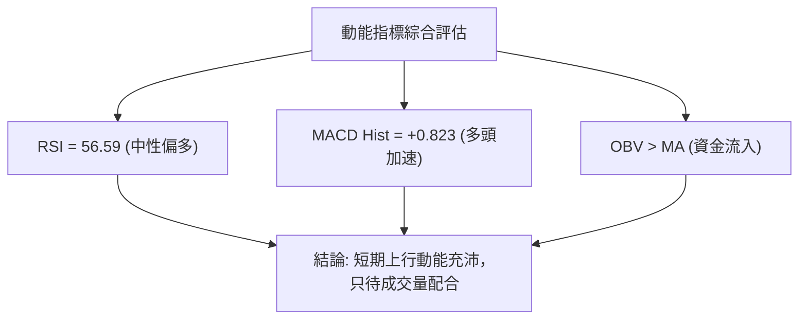

### 📊 ATR 波動率分析

*   **ATR(14) 數值**：**$7.26**
*   **ATR 佔比**：**3.50%**
*   **波動率解讀**：目前波動率處於近一年來的相對低位，這與 ADX 偏低和布林通道收口相吻合。
*   **風控應用（止損設置）**：
    *   **短線交易止損距離 (1.5x ATR)**：$7.26 × 1.5 = **$10.89**。以現價 $207.29 計算，短線止損應設於 **$196.40**。
    *   **波段交易止損距離 (2.0x ATR)**：$7.26 × 2.0 = **$14.52**。以現價 $207.29 計算，波段止損應設於 **$192.77**（此位置與 MA200 $192.38 完美重合，極具風控參考價值）。

### 📐 Beta 與市場相關性

*   **Beta 係數**：**2.211**
*   **解讀**：NVDA 具有極高的市場敏感度（Beta > 2）。當標普 500 指數 (SPY) 上漲 1% 時，NVDA 理論上將上漲 2.21%；反之亦然。在當前大盤企穩的背景下，高 Beta 屬性將放大 NVDA 的反彈力道。

---

## 7. 多時框架總結

### 📋 時框架評分表

| 時框架 | 趨勢方向 | 動能 | 均線排列 | 形態 | 綜合評分 | 交易建議 |
|--------|----------|------|----------|------|----------|----------|
| **日線 (Daily)** | 🟡 中性 | 🟢 偏多 | 🟡 混合 | 🟡 箱型 | **58/100** | 區間操作，低吸為主 |
| **週線 (Weekly)** | 🟢 偏多 | 🟡 中性 | 🟢 多頭 | 🟢 雙底 | **65/100** | 分批建倉，持股待漲 |
| **月線 (Monthly)**| 🟢 強多 | 🟢 強多 | 🟢 多頭 | 🟢 主升 | **85/100** | 長線鎖定，忽略波動 |

### 🔲 綜合訊號矩陣

```
               【 短期 (日線) 】       【 中期 (週線) 】       【 長期 (月線) 】
趨勢指標 (MA)  🟡 混合排列 (MA50壓制)   🟢 多頭排列 (MA20支撐)  🟢 強勢多頭排列
動能指標 (MACD) 🟢 金叉 (柱狀圖擴大)     🟢 柱狀圖翻紅           🟢 零軸上方運行
波動指標 (BB)   🟡 通道收窄 (擠壓中)     🟡 站穩中軌             🟢 沿著上軌運行
成交量 (Volume) 🔴 萎縮 (量比 0.79x)     🟡 溫和放量             🟢 保持長線增量
```

### ⚖️ 多時框收斂結論

> **⚖️ 收斂判定規則應用**：
> 當前 **ADX(14) = 13.48 (< 25)**，市場被明確定義為 **盤整/區間震盪行情**。
> 根據「多時框收斂規則」，在盤整行情中，應以**日線布林通道上下軌（$189.68 - $213.69）及關鍵水平支撐阻力位（S1 $199.34 - R1 $214.16）**為主要交易區間。
> 
> **唯一方向性結論**：**中性偏多，區間震盪蓄勢**。
> 雖然長期多頭趨勢不變（MA200 向上），但短期受制於 MA50 ($209.65) 與箱頂 R1 ($214.16) 壓制，股價大概率在突破前進行最後的縮量震盪整理。

---

## 8. 交易策略建議

### 🗺️ 策略決策流程圖

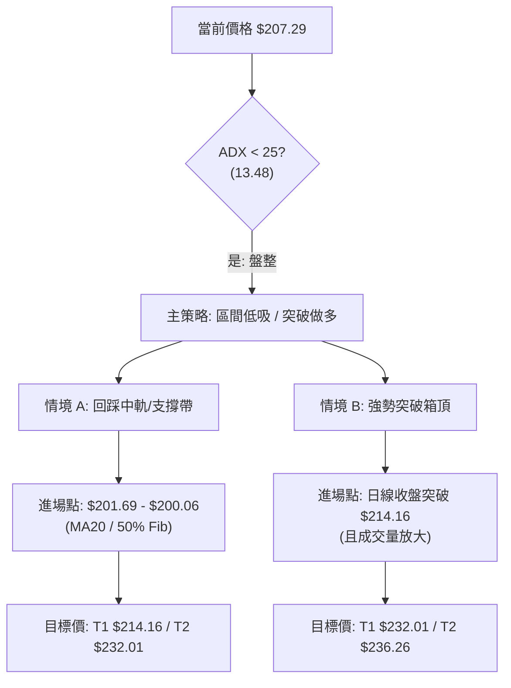

### 🧭 策略路由

> **當前主策略方向**：**區間低吸（Dip Buying）與突破做多（Breakout Buying）雙軌並行**。
> **依據**：技術綜合評分 **56/100**，多頭在長期均線佔優，且短期動能（MACD）轉強，但受限於無趨勢環境（ADX < 25），不宜在高位盲目追高，應採取「下軌附近低吸，或確認突破箱頂後追擊」的策略。

### 🎯 價格情境階梯（Price Scenarios）

所有價位完全引用自前文關鍵數據，嚴禁憑空捏造。

| 觸發條件 | 下一目標 | 後續延伸 | 情境含義 |
|----------|----------|----------|----------|
| **強勢突破 R1 ($214.16)** | **R2 ($232.01)** | **R3 ($236.26)** | 中期調整結束，開啟新一輪主升浪 |
| **站穩現價區間 ($207.29)** | 38.2% Fib ($208.60) | MA50 ($209.65) | 蓄勢整理，時間換取空間 |
| **跌破 S1 ($199.34)** | **S2 ($194.51)** | **S3 ($189.80)** | 短期轉弱，測試長期均線支撐 |

### 📊 情境機率分佈

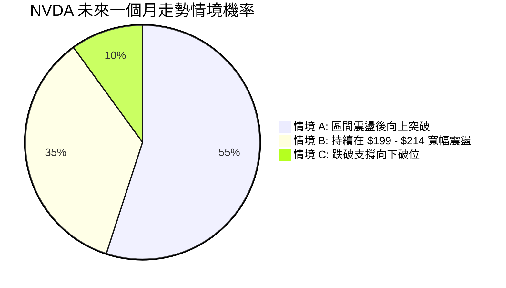

1.  **情境 A：區間震盪後向上突破 (55% 機率)**
    *   *依據*：MACD 零軸下金叉且紅柱持續放大，OBV 指標呈多頭排列，長期均線（MA200）支撐強勁。
2.  **情境 B：持續在 $199.34 - $214.16 寬幅震盪 (35% 機率)**
    *   *依據*：ADX(14) 處於 13.48 極低水位，市場整體缺乏催化劑，成交量低於均量。
3.  **情境 C：跌破支撐向下破位 (10% 機率)**
    *   *依據*：大盤系統性風險引發集體殺跌，跌破 MA200 關鍵防線。

### 🟢 主策略詳情

本報告為多頭背景下的操作，主推以下兩套多頭策略。

| 策略要素 | 策略 A：區間低吸策略（網格/波段） | 策略 B：右側突破做多策略 |
|----------|----------------------------------|--------------------------|
| **進場條件** | 股價回踩布林中軌或 50% 斐波那契支撐帶 | 日線收盤價有效突破 R1，且成交量大於 1.5 億股 |
| **進場價格** | **$201.69 至 $200.06** | **$214.50** (突破 $214.16 後確認) |
| **目標價 T1** | **$214.16** (箱頂阻力) | **$232.01** (R2 阻力) |
| **目標價 T2** | **$232.01** (R2 阻力) | **$236.26** (52W 歷史高點) |
| **止損價格** | **$194.51** (跌破 S2 止損) | **$208.60** (跌回 38.2% 斐波那契位以下) |
| **風險報酬比** | **1 : 2.54** (以進場 $201, 止損 $194.51, T1 $214.16 計算) | **1 : 2.97** (以進場 $214.50, 止損 $208.60, T1 $232.01 計算) |
| **成功機率** | **65%** | **55%** |
| **建議倉位** | **15%** | **10%** |

### 🔴 反向風險觸發點（對沖/減碼提示）

若發生以下事件，必須無條件執行多頭減碼或對沖：
1.  **日線收盤價跌破 $199.34 (S1)**：意味著箱體下軌失守，短線將向下尋求 MA200 ($192.38) 支撐。
2.  **MACD 柱狀圖在零軸上方死叉**：宣告本輪反彈動能衰竭。

### ⭐ 整體訊號強度評星

```
做多訊號強度：★★★★☆  (4/5 星，長期均線與短期動能共振)
做空訊號強度：★☆☆☆☆  (1/5 星，無明顯頂背離與作空形態)
整體可信度：  ★★★☆☆  (3/5 星，受限於低 ADX，需等待量能確認)
```

---

## 9. 風險提示與監控

### ✅ 關鍵監控指標 Checklist

```
╔══════════════════════════════════════════════════════════════╗
║              NVDA 每日交易監控清單 (Checklist)               ║
╠══════════════════════════════════════════════════════════════╣
║ [ ] 價格是否站穩 MA20 ($201.69)？                             ║
║ [ ] 日成交量是否突破 1.36 億股 (20日均量)？                   ║
║ [ ] RSI(14) 是否突破 60 進入強勢區？                          ║
║ [ ] MACD 柱狀圖是否保持在正值區 ( > 0 )？                    ║
║ [ ] 股價是否跌破黃金支撐帶 $199.34 - $200.06？                ║
╚══════════════════════════════════════════════════════════════╝
```

### ⚠️ 風險場景分析

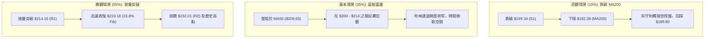

### 🛡️ 風險管理重要提醒

1.  **高 Beta 屬性管理**：NVDA 的 Beta 值高達 2.211，這意味著市場波動將被顯著放大。在進行期權或高槓桿交易時，必須嚴格控制單筆交易的風險敞口不超過總資金的 **2%**。
2.  **防範假突破**：在低 ADX (13.48) 的環境下，極易出現「盤中突破箱頂 $214.16 但收盤跌回」的**假突破（Bull Trap）**。因此，策略 B 必須堅持「**日線收盤確認**」原則，切忌在盤中急於追高。
3.  **資金分批部署**：鑑於目前處於震盪蓄勢期，最穩健的建倉方式為**金字塔式分批買入法**。在 $201.69-$200.06 區間先建立 50% 底倉，待日線確認放量突破 $214.16 後，再行加碼 50%。

---

## 📋 報告總結

```
NVDA 技術分析報告總結
════════════════════════════════════════════════════════
報告日期：2026-07-22
當前價格：$207.29
分析評級：⚖️ 中性偏多（蓄勢整理，等待突破）

關鍵結論：
├─ 長期趨勢：🟢 看多 (股價高於 MA200 $192.38，牛市格局未變)
├─ 中期趨勢：🟡 中性 (週線完成雙底築底，處於 $199 - $214 寬幅箱體)
├─ 短期趨勢：🟢 看多 (MACD 零軸下金叉，短期買盤動能加速)
├─ 關鍵支撐：$199.34 (S1) / $194.51 (S2)
├─ 關鍵阻力：$214.16 (R1) / $232.01 (R2)
└─ 分析師共識目標價：$302.31 (相較現價有 45.8% 上行空間)

最優策略組合：
1. 🥇 最佳機會：回踩 $201.69 - $200.06 區間逢低分批佈局做多（策略 A）。
2. 🥈 次選機會：待日線收盤放量突破 $214.16 後，順勢追擊做多（策略 B）。
3. 🥉 保守選擇：在 ADX < 25 期間，採用網格交易工具在 $199 - $214 內高拋低吸。
════════════════════════════════════════════════════════
```

---

> ⚠️ **免責聲明**：本報告為 AI 自動生成之技術分析，所有數據及估算均基於提供的歷史價格資訊。本報告**僅供研究與學術參考**，**不構成任何投資建議**。投資有風險，入市需謹慎。

---

*報告生成時間：2026-07-22 ｜ 數據來源：Yahoo Finance ｜ 分析框架：多時框技術分析*