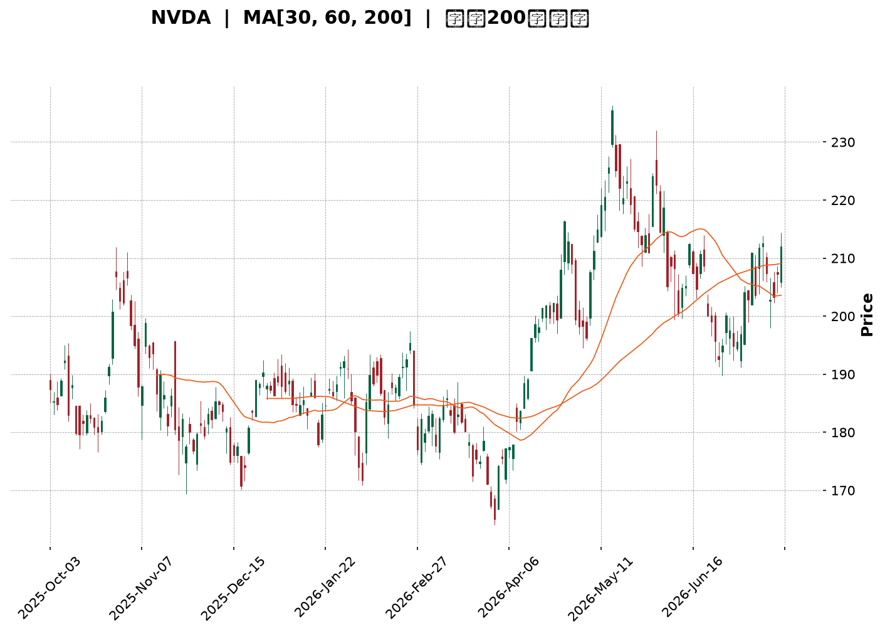
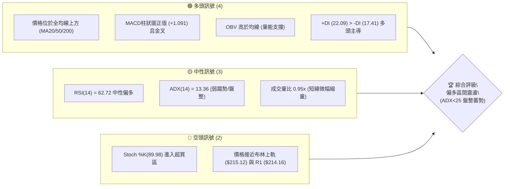
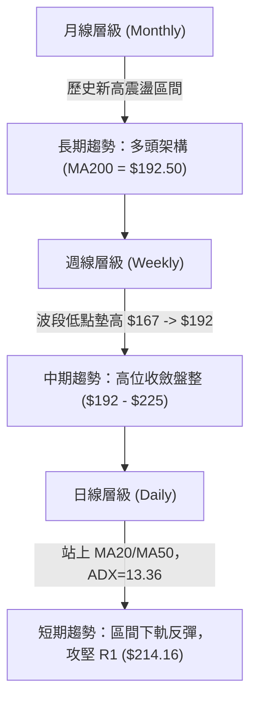
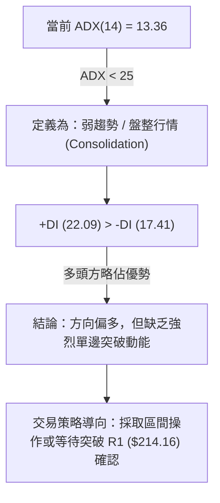
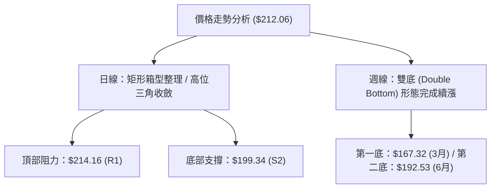
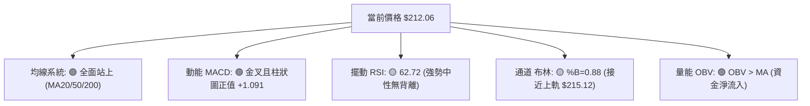
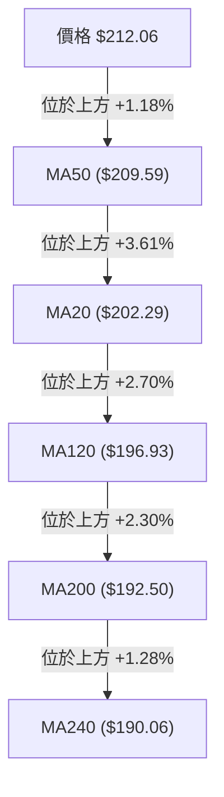
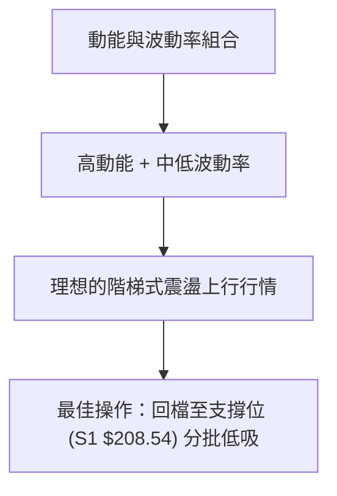
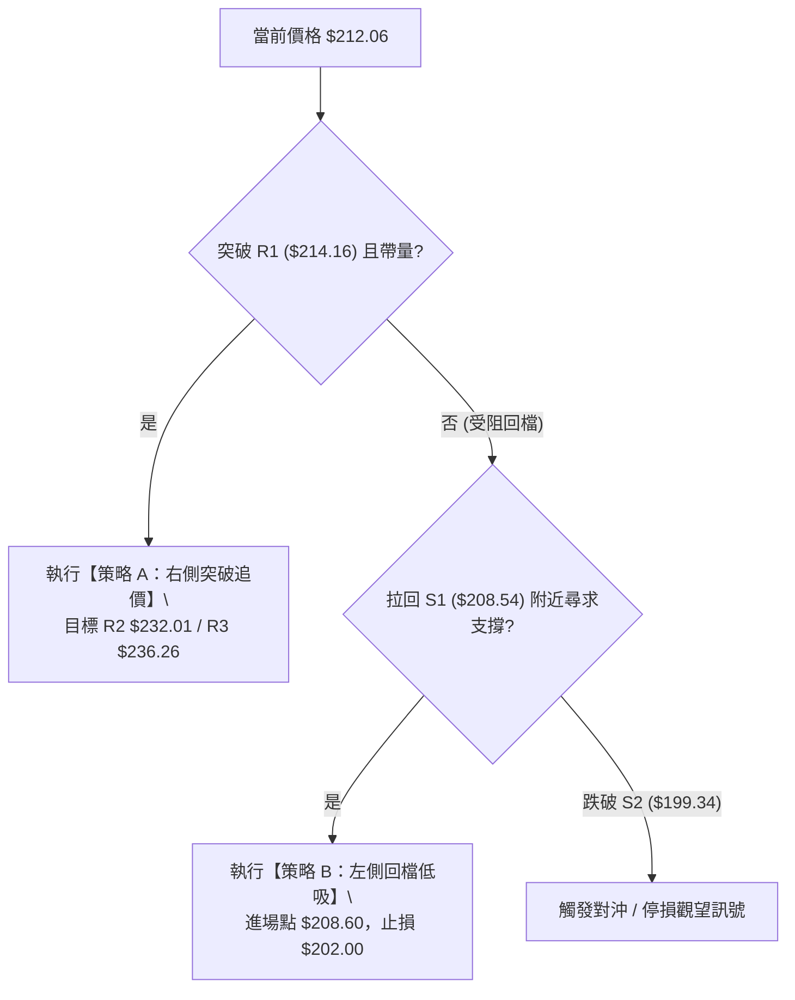
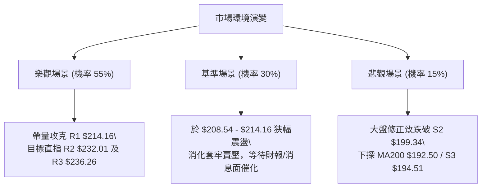

<details>
<summary>📊 靜態圖表 (點擊展開)</summary>

</details>

<html>
<head><meta charset="utf-8" /></head>
<body>
    <div style="height:500px; width:100%;">                        <script>window.PlotlyConfig = {MathJaxConfig: 'local'};</script>
        <script charset="utf-8" src="https://cdn.plot.ly/plotly-3.7.0.min.js" integrity="sha256-jvTGqxNp8AGWEcvNLVuKr+8j5dGe9Yw51LQkmDH+IYA=" crossorigin="anonymous"></script>                <div id="candlestick-chart" class="plotly-graph-div" style="height:100%; width:100%;"></div>            <script>                window.PLOTLYENV=window.PLOTLYENV || {};                                if (document.getElementById("candlestick-chart")) {                    Plotly.newPlot(                        "candlestick-chart",                        [{"close":{"dtype":"f8","bdata":"AAAAQDFsZ0AAAACAtylnQAAAAMC8GWdAAAAAwM+bZ0AAAAAAZApoQAAAAICn3WZAAAAAYJCCZ0AAAAAAn3lmQAAAAOA6c2ZAAAAAYIKyZkAAAABgkt9mQAAAAAAJzWZAAAAAQLydZkAAAACAnIFmQAAAAOCxvWZAAAAAILpAZ0AAAADg3+dnQAAAACDEGGlAAAAAQNfYaUAAAADANVRpQAAAACBtR2lAAAAAILrTaUAAAAAg+81oQAAAAGDDXmhAAAAAwOR6Z0AAAACAIX1nQAAAAKB82WhAAAAAID8daEAAAABgszFoQAAAACDnU2dAAAAAILC9Z0AAAAAAmEtnQAAAAKAgpGZAAAAAgAlJZ0AAAADgHY1mQAAAAGDeVGZAAAAAwCjKZkAAAADg\u002fTJmQAAAAOD4gGZAAAAAAMkYZkAAAABAG3ZmQAAAAMBSp2ZAAAAAQI9rZkAAAAAAA+VmQAAAAGACxmZAAAAAAF4qZ0AAAABg1BdnQAAAAMDL8WZAAAAA4LSWZkAAAABA0dllQAAAAGBoAmZAAAAAwBwwZkAAAACgaldlQAAAAACxvWVAAAAA4J+YZkAAAABg6+5mQAAAACBYn2dAAAAA4CqMZ0AAAABgiMlnQAAAAOCzf2dAAAAAIPhpZ0AAAADgukhnQAAAAKDWk2dAAAAAwIF8Z0AAAACgYWBnQAAAAOAlnGdAAAAAIBEaZ0AAAABAUBRnQAAAAODeFmdAAAAAQK0yZ0AAAAAgV91mQAAAAABPWmdAAAAAoBlAZ0AAAABgTDtmQAAAACAY42ZAAAAAoKwTZ0AAAADAH25nQAAAAGDFR2dAAAAAgEqJZ0AAAACgLOlnQAAAAMDQCGhAAAAAoLXcZ0AAAADgSCxnQAAAAIDZg2ZAAAAAIEq\u002fZUAAAACgdXVlQAAAAGDkJWdAAAAAIN+5Z0AAAAAg7olnQAAAAAAxumdAAAAAAMtWZ0AAAABAy9JmQAAAAGDUF2dAAAAAIAh4Z0AAAACgeXVnQAAAAEDXsmdAAAAAICLqZ0AAAADArhNoQAAAAOBLamhAAAAAwEUVZ0AAAABALB9mQAAAACA\u002fyGZAAAAAwJR6ZkAAAAAAJdpmQAAAAKC742ZAAAAA4E4zZkAAAAAArs1mQAAAAABwEWdAAAAAoAc6Z0AAAABgqN1mQAAAAABJgWZAAAAAADfgZkAAAACA+7ZmQAAAAGAUhmZAAAAAoERLZkAAAABg949lQAAAAODv7WVAAAAAgN\u002ffZUAAAACAGk9mQAAAACBNYWVAAAAAQGbqZEAAAACASZ9kQAAAAKBNxmVAAAAAAHTxZUAAAAAg3yVmQAAAAMDcLWZAAAAAwJA8ZkAAAAAAx7tmQAAAAOBE9mZAAAAAICKNZ0AAAAAg3qJnQAAAAOD\u002fiGhAAAAAgG7UaEAAAACgz8NoQAAAACA\u002fLmlAAAAAgGQ6aUAAAADgtvRoQAAAAOB0SGlAAAAAAAvtaEAAAACg4QBqQAAAAGBzC2tAAAAAwH+dakAAAACANCBqQAAAAEDO6mhAAAAA4AHHaEAAAABA98doQAAAAACuiGhAAAAAYNHyaUAAAAAAH2hqQAAAACBi3mpAAAAAwOdla0AAAABAvJBrQAAAAMAlMmxAAAAAAOZubUAAAADA2CFsQAAAAGD1wWtAAAAAQE2La0AAAAAgt+ZrQAAAAIAkaGtAAAAA4IniakAAAAAghNNqQAAAAMBHi2pAAAAAwATAakAAAABgnVxqQAAAAIApA2xAAAAAgPDRa0AAAAAAANBqQAAAAMAeVWtAAAAAQDOjaUAAAADgehRqQAAAAIAUBmpAAAAAoHANaUAAAAAA15tpQAAAAIAUpmlAAAAAYGaOakAAAADAHu1pQAAAAMDMlGlAAAAAgBRWakAAAADAzBRqQAAAAKBHAWlAAAAAAADgaEAAAAAgrndoQAAAAMD1EGhAAAAAQApfaEAAAABA4QJpQAAAAGCPsmhAAAAAYI9aaEAAAACgmXFoQAAAAIDCnWhAAAAAANeDaUAAAADA9VhpQAAAAGC4XmpAAAAAwPVwaUAAAACgmXlqQAAAAAAAkGpAAAAAwMzsaUAAAACA61lpQAAAAMD1aGlAAAAAoEfpaUAAAACA64FqQA=="},"high":{"dtype":"f8","bdata":"IVyzyMLDZ0CcFVxdul9nQLi\u002fN602mmdAa8gCw3irZ0CVIxWjo2FoQPtpTrvda2hACAVFUsW7Z0B1IawYERJnQHryjOhNFGdApf45SX3hZkAJxjgxsvtmQFO9OsnZHmdAjcN9HdTRZkB3s11GmuZmQMf44st\u002f2WZAPeJs32VnZ0B89JVtLPhnQKTfDwGFXGlA8hMHY259akCTJcaAt7xpQBef1xCQ9mlAL8lN1UNiakCy4urGuXZpQOvUACwrVWlAd4Ac08iraEDo3dp5kIJnQDYvlzbu9WhABnC9anllaEDghwPRfnRoQPlpcLRG5mdAzDr7m4jYZ0DiDX60S5hnQBRteToREmdATexQxNxzZ0DVPXC3AnhoQASUmJplCmdA4gZDNoXoZkCVJ7aT2z1mQFKu6xiq1WZA+kOWuvhhZkAZPutIQIJmQAaOw0uNLWdAWzP\u002fh\u002fbGZkBZLqZ\u002fcglnQJ47w+vrDWdAjTMb7at4Z0A7a\u002fjjzC9nQFWgASkhKGdARSiX+yujZkD4oMcIHdNmQOcheh58RmZAKZvk8LhIZkCkAP5US\u002f1lQBF11NDu\u002fWVAlPXLiFOnZkCHA0Xv8P1mQIAEcO0to2dApFSPgcGVZ0CMJciRkQ5oQCAtbRz2kGdAeyCwJ1CYZ0CEYwDcfcpnQJqPqig9FmhAohf+w5wsaEBuvYHt8v1nQGRTMTJh5GdAZHC1HjaqZ0AMc9ianUNnQHw+nJ6LXGdAfy4x7C98Z0BlHIRzhwdnQNHXEU4Br2dA7chf\u002fKfGZ0CA447cDMVmQN3uaBHvJGdAYx4mui4+Z0DA8T8dz6tnQPJy7q13nGdANvnl2pe4Z0Bu4ZO3swNoQMuX7FHRJ2hAHg0QOBlIaEB5e3+SLsJnQKuY5\u002fFgQWdA8WCGNY9rZkCdUcvSWBNmQJWAycG1WGdAN5PKH5ItaECSF3VO2wdoQIJYLTfJIGhAYn5tEPkraECzFOHysGhnQIRhwh6BXWdAPz\u002f4JWvEZ0DvSwAWaoZnQLOEIQkkw2dAw4PY7NY2aEA7lrAxFjFoQPFwjbd0rGhAsfYlsbRBaECRCX4cw8tmQKhwZZiR52ZA4ohnZL+VZkCToicvMw9nQNKOl7C++mZA5O8O8zHRZkAA2L1n\u002fdVmQP2wp\u002fXPRmdAu6opttlsZ0A2L5zVMBdnQILyLY7yO2dA9qozxh+VZ0AZwWmo5CVnQOrzzjRU5WZAoC84tad4ZkBMEMDZrUFmQPjbGvcxRWZALfmypXkAZkCUIuYGSqBmQG78YZ6+CWZABcP\u002fuKtYZUBWtCxvFihlQDwY6sZVzWVAtvQgjTslZkDGLtdrESlmQEfSzBGoMmZA4TKkYrhAZkAKqq4sayFnQPvO+OCz+2ZAHYZcD+y4Z0B\u002fUIEJDq5nQAAAAOD\u002fiGhASBnLqFUFaUC2Fd5RwfNoQJJMKc\u002fiLmlASmpxk+g9aUA3pXeBclBpQAAAAOB0SGlAsgq4ivdyaUATNPGQilZqQN5\u002f44Z7EmtAxk6MX1zPakB0QZaoHY9qQB1IsQvEQWpANT78G3BYaUB2HVZB2C9pQI0v+3Q4AGlAsW\u002fJreEAakBhoEega75qQIVlgZR8MWtATZeNmVHBa0Bywhgtqu9rQOIa63RkcmxAMYH23neIbUASrZxQYOdsQEVRwqJut2xAXtjiV\u002f8GbEAtgAGCvDtsQPTcoSFUZGxArbElNRaYa0BQa87WoT1rQLYy33fSvGpAOUBmg5zoakBUrXaKZzNrQN0y64J2E2xA79kRiE4AbUDl0\u002fuJ8NFrQAAAAEAzs2tAAAAAANfbakAAAABACk9qQAAAAMDMbGpAAAAAQArnaUAAAADAHrVpQAAAAIA94mlAAAAAYLiWakAAAAAgrm9qQAAAAGC4JmpAAAAA4HpsakAAAAAgrr9qQAAAAOCjeGlAAAAAoHA1aUAAAACgmRlpQAAAAKCZcWhAAAAAgMKFaEAAAAAAKRRpQAAAAEAz+2hAAAAAgOsBaUAAAACgmbFoQAAAAMAezWhAAAAAwB6laUAAAABA4ZJpQAAAAAAAYGpAAAAAgD1SakAAAACgmZFqQAAAAIDruWpAAAAAYI9iakAAAADAzNRpQAAAACCu92lAAAAAwMwUakAAAADgesxqQA=="},"hovertemplate":"\u003cb\u003e%{x|%Y-%m-%d}\u003c\u002fb\u003e\u003cbr\u003e\u958b: $%{open:.2f}\u003cbr\u003e\u9ad8: $%{high:.2f}\u003cbr\u003e\u4f4e: $%{low:.2f}\u003cbr\u003e\u6536: $%{close:.2f}\u003cextra\u003e\u003c\u002fextra\u003e","low":{"dtype":"f8","bdata":"nmqfn5okZ0DDobpPFuNmQGjpK\u002fp\u002f+GZA3P50Ea1JZ0DrB9jBIdpnQB9KLPUtumZAyPlt4CM3Z0DGMp4RE29mQLvWLqENImZAAKBgCVBxZkCLb39VrHBmQMY3+77zr2ZANwg8UUVyZkA18lZbHRFmQGPJRHvzcWZAkqdrDYXoZkBjk5suFIZnQHN5XElM9WdAu88D9ZyQaUColooR6SRpQF2o+eEAOmlAwVRZZoqpaUB6t00OsbVoQBDZ+5fdTGhA1dBTHZBEZ0BuxCTq01VmQLDoyoJhMWhAXmy7aM3hZ0BT2lacXtxnQDHAQam082ZAtoxQ8zKLZkB0x\u002fEKugJnQOZUEBh6bWZAam2FgRvTZkCUcmF+3nNmQDliuva1lmVA4QjilioIZkANyQdNsCplQG6XFDRqQGZAcgGvN84IZkC1GYA8rq5lQM54Y5ypeGZAbQI6IjhcZkD1dA2BtHdmQOyCKFgRlmZAI7kuj7DFZkAC4z8XGONmQLcoNP0uumZAat0uY\u002fQMZkAShe5dCM1lQAZb6BIj2mVATFYwZPvVZUBGlXzpR0NlQNhMKMeKc2VAwTIEaAEEZkA4P1d\u002fF8RmQPJhw3ir1WZAmLqnKJtLZ0DtVXTfq3hnQCB9k23fNWdAh6taFnlWZ0AIZIgZaUhnQAGVVCP7gGdAESqdKIs9Z0BMrfQw9VJnQFW9t7KlSmdAp\u002fWWJY\u002fvZkBggkSgR+5mQAWPKWmB2WZAvHLTjKblZkCwpHM6jZJmQAx4Yu9LQ2dAHWwzX047Z0DDvkCXmCxmQCkn9HjYRWZAVQXa9Jb2ZkAfp4ob9VJnQAG7RApuOGdALzGSJCkvZ0ApM\u002fPDerNnQN\u002fy5b2qOmdAB+PhcKenZ0AUqekI9BRnQMR4TmR9AGZAgzL8IGt2ZUCm8q3bSlplQMrJ\u002fsFkzGVAaoZlpjr3ZkDZpfiwgXxnQJCaHQZIkWdAWxOGqgxJZ0CJK6AszatmQBc8xWfGXmZANMHjDApRZ0Cvo4z64S1nQLeKJPjUNmdAzPOriCurZ0DYmRejfmVnQM4wAKq5MWhAx00zEA4DZ0AXf1LVSAVmQMCamByszWVAABCu\u002fIoWZkDFSA6d5npmQGlgzNw5NWZA42Xa2lgTZkCjZCCBE+tlQJx8\u002f4o5uWZA9L9vUYcHZ0ALNHDBOrFmQGC01HRgd2ZAjszBwlymZkDPO1ji\u002fa5mQNKu36rXg2ZAqryuKrvyZUBd\u002f5KYpHBlQPQHaETP0WVAKe+V4uC4ZUC+sayznBRmQJIPJdQaXmVAxwkqHRnaZEBxKytVhYJkQDAUIDOA2GRA4zFJiX3RZUC9BYOpdGVlQG6A563F8WVAkU3jl6auZUDXDIM54oJmQIIiH4AcjWZA0pkNC7wCZ0DWH63LwjBnQN7NKJ2I0WdAXi5JeWNwaEBkWzsZoHJoQIBwxns34WhAYpDEfoKzaED\u002fLVxElthoQDrRoUCW2GhA\u002fMISdLGfaEDum6buefJoQN5RIEZv5GlAjvNb5aT+aUCiowPN0+ppQIYVDWz\u002fzmhAo971Ln+caEDoYfHqbFBoQOd1ezuoeWhAQ7GGDR\u002fMaEDQL+euTshpQEhOfKeMlGpApZrbDYO0akDD3H0Cb9VqQNwzGYD8qWtAOMcx6g6hbEAOdaOsU\u002f9rQJ4KNIu0Q2tAeU61nwA1a0AbVs4yyYdrQEptXDGkNWtACavpLZnRakCz\u002fTNGGnhqQHfaIq4uEWpAnM935StfakBAS2aYS1xqQEZjNFZd7mpA7qDoRPSia0CBSvIpVMhqQAAAAEAKX2pAAAAAYI+KaUAAAAAAAMBpQAAAAEDh6mhAAAAAoHD9aEAAAACgR\u002fFoQAAAAIAUbmlAAAAAQOEKakAAAACgR+lpQAAAAGCPYmlAAAAAAADQaUAAAABACvdpQAAAAAAAAGlAAAAAYI+SaEAAAAAAKQRoQAAAAEAK52dAAAAAoJm5Z0AAAAAghWNoQAAAAGBmLmhAAAAAQDMLaEAAAAAgrj9oQAAAAOB65GdAAAAAgOthaEAAAABguN5oQAAAAKBwPWlAAAAAAABgaUAAAACgmXlpQAAAAKBHwWlAAAAAQDO7aUAAAABACr9oQAAAAMD1SGlAAAAA4FGAaUAAAABgZp5pQA=="},"name":"\u50f9\u683c","open":{"dtype":"f8","bdata":"F28VXl6eZ0BsWdZKcChnQCOGGtXEP2dAZzlHoaJKZ0AGzk4shv9nQDsMzp9uKGhAJ7r+xmB3Z0Ad1tCoGxFnQJGghUMREmdAgg8Snu6\u002fZkAoF9lYan5mQLkqAAOy3GZAjcN9HdTRZkAUJZimGJ1mQNx9ROgVhmZA\u002f8sbwWLzZkAX1CSH77dnQEXqMES7GWhApT4E8eH2aUAYLtUKcJxpQFloWg38xWlAJxFB+hP6aUBMLTKmuVdpQAmlCrqJ0GhAvHbA+G6FaEAWxH9pQxVnQAuluTyRW2hAPG9HQSpdaEAu0SD3D29oQFtuVObP2WdAwjVi6BDUZkDuvgmTdTdnQKJE0Wuv5GZA5PySTb8RZ0DkIASdaXZoQHc4jN9KoGZAXz01Ll1oZkCoYfl9\u002fdVlQHkFPLTBrGZArgiR5gVZZkA6tpBXMtFlQOIqlh7psGZAoG+00y2bZkCsz0mQwqxmQGO38rpP9WZAPjUNSlzNZkDwk7u8rypnQGyL5F\u002fUF2dASMeanO6BZkCQfnS5dZxmQJ\u002fXuMgkN2ZAj\u002fHV8XIBZkD3daHhVfxlQHdfn\u002fsnymVAf1rqfI0OZkAixGs0RfZmQGG96EXo12ZA3bSx78B2Z0CLdWJWCbZnQN\u002fG7hZnb2dAOgCyo1eAZ0CJWBy92apnQARK0756s2dAjdkqTdjwZ0DdZbGkNslnQPmHkaPjimdA1K+9AiacZ0BZh+5NWBtnQM8ZN8rl32ZABxpM1ckYZ0CjQDP5DQNnQKJFF926SGdAnCPfbjCbZ0AsUOtmtbVmQDABZ9yeWmZAwYvrRcwQZ0A57k7SsGhnQCSWN\u002f3SXWdAMfclhmFgZ0C8Fa4eL+FnQBnGAs1r42dAm6udM0TfZ0CeZw1CGl9nQEnOi35rQGdA0DwXaLlnZkBzFZev8NZlQEegWiYxD2ZAWHFuDiMBZ0AF8Jsos+RnQOP8iszlBmhA1H0iem8ZaECiePtFDWhnQF8sKELqsGZACRjGUKSQZ0BivfTBoFpnQD26r673SmdAbbQ4v1blZ0BJTWEyN+hnQGZg09PRRmhAejc3JBFBaEDvB9E776BmQEWLYWt\u002f2WVAkaKN0bhIZkCX5D\u002fSC4dmQALXwadgnmZApoo5d95zZkDXL5e0qhNmQJ2ZqoawxWZAZyX1xDE2Z0D\u002f92JyvvpmQDWsnxaNFmdAnI1TYjnYZkAwEHmmBhtnQGk2B+qPyGZAsLrGPrA5ZkCqEoF0XjlmQPZWA223IWZA5idUBwzUZUBAAVVRmhxmQPnbhXCu+2VA4881uao5ZUA+6tkyrBJlQNnSufrR2GRAh7OtnXH5ZUCIbfJvWH9lQCWC4DOFHmZAMbQtOtDwZUAtqA6MIAlnQH1Qph0btGZAGC2n0g0DZ0DD6bGnBzpnQONJSVLF02dAM89DWPWJaEA3BSSmZ6ZoQOX1tVla9WhAT\u002f0k9uj3aEC7ehBroTxpQPaPYmYxGGlAOtJcmy1HaUDVWmlgRfdoQNzkK2D9LGpAeV8JWOAnakAwh2z5eY5qQH8FCnPwNWpAmyUPQ3YhaUBg1bllkehoQFwb8uss4mhAkRKQmAj1aEADjcViHgNqQCcfszEGmWpASBqpX065akDkq0RkdUlrQBqlOnVhFWxACRl0S6OybEA3K4nIwq9sQEgoJOBGs2xAxc\u002f5kKhra0CkAAMkct1rQGAtAr3\u002fwGtALYGyIZKUa0Czs5WaNglrQM5THAHdu2pAMEn90hZhakDDYOwRkcpqQGh998xS72pA1+Rj60tdbEBPaIbHx65rQAAAAMAevWpAAAAAwPXQakAAAACAwkVqQAAAAADXU2pAAAAAgMKNaUAAAAAgri9pQAAAACCFm2lAAAAAoHAdakAAAACAwmVqQAAAAMD1EGpAAAAAYI\u002fqaUAAAACAFG5qQAAAAKBwRWlAAAAAANcDaUAAAABgjwJpQAAAAADXI2hAAAAAQDM7aEAAAAAgrqdoQAAAAGBmhmhAAAAA4HqkaEAAAACgcE1oQAAAAADXC2hAAAAAgMJlaEAAAABguI5pQAAAAAAAQGlAAAAAoEcRakAAAABgZgZqQAAAAGC4fmpAAAAAoHBFakAAAADgelRpQAAAAADXu2lAAAAAoEfxaUAAAACAwrlpQA=="},"x":["2025-10-03T00:00:00-04:00","2025-10-06T00:00:00-04:00","2025-10-07T00:00:00-04:00","2025-10-08T00:00:00-04:00","2025-10-09T00:00:00-04:00","2025-10-10T00:00:00-04:00","2025-10-13T00:00:00-04:00","2025-10-14T00:00:00-04:00","2025-10-15T00:00:00-04:00","2025-10-16T00:00:00-04:00","2025-10-17T00:00:00-04:00","2025-10-20T00:00:00-04:00","2025-10-21T00:00:00-04:00","2025-10-22T00:00:00-04:00","2025-10-23T00:00:00-04:00","2025-10-24T00:00:00-04:00","2025-10-27T00:00:00-04:00","2025-10-28T00:00:00-04:00","2025-10-29T00:00:00-04:00","2025-10-30T00:00:00-04:00","2025-10-31T00:00:00-04:00","2025-11-03T00:00:00-05:00","2025-11-04T00:00:00-05:00","2025-11-05T00:00:00-05:00","2025-11-06T00:00:00-05:00","2025-11-07T00:00:00-05:00","2025-11-10T00:00:00-05:00","2025-11-11T00:00:00-05:00","2025-11-12T00:00:00-05:00","2025-11-13T00:00:00-05:00","2025-11-14T00:00:00-05:00","2025-11-17T00:00:00-05:00","2025-11-18T00:00:00-05:00","2025-11-19T00:00:00-05:00","2025-11-20T00:00:00-05:00","2025-11-21T00:00:00-05:00","2025-11-24T00:00:00-05:00","2025-11-25T00:00:00-05:00","2025-11-26T00:00:00-05:00","2025-11-28T00:00:00-05:00","2025-12-01T00:00:00-05:00","2025-12-02T00:00:00-05:00","2025-12-03T00:00:00-05:00","2025-12-04T00:00:00-05:00","2025-12-05T00:00:00-05:00","2025-12-08T00:00:00-05:00","2025-12-09T00:00:00-05:00","2025-12-10T00:00:00-05:00","2025-12-11T00:00:00-05:00","2025-12-12T00:00:00-05:00","2025-12-15T00:00:00-05:00","2025-12-16T00:00:00-05:00","2025-12-17T00:00:00-05:00","2025-12-18T00:00:00-05:00","2025-12-19T00:00:00-05:00","2025-12-22T00:00:00-05:00","2025-12-23T00:00:00-05:00","2025-12-24T00:00:00-05:00","2025-12-26T00:00:00-05:00","2025-12-29T00:00:00-05:00","2025-12-30T00:00:00-05:00","2025-12-31T00:00:00-05:00","2026-01-02T00:00:00-05:00","2026-01-05T00:00:00-05:00","2026-01-06T00:00:00-05:00","2026-01-07T00:00:00-05:00","2026-01-08T00:00:00-05:00","2026-01-09T00:00:00-05:00","2026-01-12T00:00:00-05:00","2026-01-13T00:00:00-05:00","2026-01-14T00:00:00-05:00","2026-01-15T00:00:00-05:00","2026-01-16T00:00:00-05:00","2026-01-20T00:00:00-05:00","2026-01-21T00:00:00-05:00","2026-01-22T00:00:00-05:00","2026-01-23T00:00:00-05:00","2026-01-26T00:00:00-05:00","2026-01-27T00:00:00-05:00","2026-01-28T00:00:00-05:00","2026-01-29T00:00:00-05:00","2026-01-30T00:00:00-05:00","2026-02-02T00:00:00-05:00","2026-02-03T00:00:00-05:00","2026-02-04T00:00:00-05:00","2026-02-05T00:00:00-05:00","2026-02-06T00:00:00-05:00","2026-02-09T00:00:00-05:00","2026-02-10T00:00:00-05:00","2026-02-11T00:00:00-05:00","2026-02-12T00:00:00-05:00","2026-02-13T00:00:00-05:00","2026-02-17T00:00:00-05:00","2026-02-18T00:00:00-05:00","2026-02-19T00:00:00-05:00","2026-02-20T00:00:00-05:00","2026-02-23T00:00:00-05:00","2026-02-24T00:00:00-05:00","2026-02-25T00:00:00-05:00","2026-02-26T00:00:00-05:00","2026-02-27T00:00:00-05:00","2026-03-02T00:00:00-05:00","2026-03-03T00:00:00-05:00","2026-03-04T00:00:00-05:00","2026-03-05T00:00:00-05:00","2026-03-06T00:00:00-05:00","2026-03-09T00:00:00-04:00","2026-03-10T00:00:00-04:00","2026-03-11T00:00:00-04:00","2026-03-12T00:00:00-04:00","2026-03-13T00:00:00-04:00","2026-03-16T00:00:00-04:00","2026-03-17T00:00:00-04:00","2026-03-18T00:00:00-04:00","2026-03-19T00:00:00-04:00","2026-03-20T00:00:00-04:00","2026-03-23T00:00:00-04:00","2026-03-24T00:00:00-04:00","2026-03-25T00:00:00-04:00","2026-03-26T00:00:00-04:00","2026-03-27T00:00:00-04:00","2026-03-30T00:00:00-04:00","2026-03-31T00:00:00-04:00","2026-04-01T00:00:00-04:00","2026-04-02T00:00:00-04:00","2026-04-06T00:00:00-04:00","2026-04-07T00:00:00-04:00","2026-04-08T00:00:00-04:00","2026-04-09T00:00:00-04:00","2026-04-10T00:00:00-04:00","2026-04-13T00:00:00-04:00","2026-04-14T00:00:00-04:00","2026-04-15T00:00:00-04:00","2026-04-16T00:00:00-04:00","2026-04-17T00:00:00-04:00","2026-04-20T00:00:00-04:00","2026-04-21T00:00:00-04:00","2026-04-22T00:00:00-04:00","2026-04-23T00:00:00-04:00","2026-04-24T00:00:00-04:00","2026-04-27T00:00:00-04:00","2026-04-28T00:00:00-04:00","2026-04-29T00:00:00-04:00","2026-04-30T00:00:00-04:00","2026-05-01T00:00:00-04:00","2026-05-04T00:00:00-04:00","2026-05-05T00:00:00-04:00","2026-05-06T00:00:00-04:00","2026-05-07T00:00:00-04:00","2026-05-08T00:00:00-04:00","2026-05-11T00:00:00-04:00","2026-05-12T00:00:00-04:00","2026-05-13T00:00:00-04:00","2026-05-14T00:00:00-04:00","2026-05-15T00:00:00-04:00","2026-05-18T00:00:00-04:00","2026-05-19T00:00:00-04:00","2026-05-20T00:00:00-04:00","2026-05-21T00:00:00-04:00","2026-05-22T00:00:00-04:00","2026-05-26T00:00:00-04:00","2026-05-27T00:00:00-04:00","2026-05-28T00:00:00-04:00","2026-05-29T00:00:00-04:00","2026-06-01T00:00:00-04:00","2026-06-02T00:00:00-04:00","2026-06-03T00:00:00-04:00","2026-06-04T00:00:00-04:00","2026-06-05T00:00:00-04:00","2026-06-08T00:00:00-04:00","2026-06-09T00:00:00-04:00","2026-06-10T00:00:00-04:00","2026-06-11T00:00:00-04:00","2026-06-12T00:00:00-04:00","2026-06-15T00:00:00-04:00","2026-06-16T00:00:00-04:00","2026-06-17T00:00:00-04:00","2026-06-18T00:00:00-04:00","2026-06-22T00:00:00-04:00","2026-06-23T00:00:00-04:00","2026-06-24T00:00:00-04:00","2026-06-25T00:00:00-04:00","2026-06-26T00:00:00-04:00","2026-06-29T00:00:00-04:00","2026-06-30T00:00:00-04:00","2026-07-01T00:00:00-04:00","2026-07-02T00:00:00-04:00","2026-07-06T00:00:00-04:00","2026-07-07T00:00:00-04:00","2026-07-08T00:00:00-04:00","2026-07-09T00:00:00-04:00","2026-07-10T00:00:00-04:00","2026-07-13T00:00:00-04:00","2026-07-14T00:00:00-04:00","2026-07-15T00:00:00-04:00","2026-07-16T00:00:00-04:00","2026-07-17T00:00:00-04:00","2026-07-20T00:00:00-04:00","2026-07-21T00:00:00-04:00","2026-07-22T00:00:00-04:00"],"type":"candlestick"},{"hovertemplate":"MA30: $%{y:.2f}\u003cextra\u003e\u003c\u002fextra\u003e","line":{"color":"#2196F3","dash":"dash","width":2},"mode":"lines","name":"MA30","x":["2025-10-03T00:00:00-04:00","2025-10-06T00:00:00-04:00","2025-10-07T00:00:00-04:00","2025-10-08T00:00:00-04:00","2025-10-09T00:00:00-04:00","2025-10-10T00:00:00-04:00","2025-10-13T00:00:00-04:00","2025-10-14T00:00:00-04:00","2025-10-15T00:00:00-04:00","2025-10-16T00:00:00-04:00","2025-10-17T00:00:00-04:00","2025-10-20T00:00:00-04:00","2025-10-21T00:00:00-04:00","2025-10-22T00:00:00-04:00","2025-10-23T00:00:00-04:00","2025-10-24T00:00:00-04:00","2025-10-27T00:00:00-04:00","2025-10-28T00:00:00-04:00","2025-10-29T00:00:00-04:00","2025-10-30T00:00:00-04:00","2025-10-31T00:00:00-04:00","2025-11-03T00:00:00-05:00","2025-11-04T00:00:00-05:00","2025-11-05T00:00:00-05:00","2025-11-06T00:00:00-05:00","2025-11-07T00:00:00-05:00","2025-11-10T00:00:00-05:00","2025-11-11T00:00:00-05:00","2025-11-12T00:00:00-05:00","2025-11-13T00:00:00-05:00","2025-11-14T00:00:00-05:00","2025-11-17T00:00:00-05:00","2025-11-18T00:00:00-05:00","2025-11-19T00:00:00-05:00","2025-11-20T00:00:00-05:00","2025-11-21T00:00:00-05:00","2025-11-24T00:00:00-05:00","2025-11-25T00:00:00-05:00","2025-11-26T00:00:00-05:00","2025-11-28T00:00:00-05:00","2025-12-01T00:00:00-05:00","2025-12-02T00:00:00-05:00","2025-12-03T00:00:00-05:00","2025-12-04T00:00:00-05:00","2025-12-05T00:00:00-05:00","2025-12-08T00:00:00-05:00","2025-12-09T00:00:00-05:00","2025-12-10T00:00:00-05:00","2025-12-11T00:00:00-05:00","2025-12-12T00:00:00-05:00","2025-12-15T00:00:00-05:00","2025-12-16T00:00:00-05:00","2025-12-17T00:00:00-05:00","2025-12-18T00:00:00-05:00","2025-12-19T00:00:00-05:00","2025-12-22T00:00:00-05:00","2025-12-23T00:00:00-05:00","2025-12-24T00:00:00-05:00","2025-12-26T00:00:00-05:00","2025-12-29T00:00:00-05:00","2025-12-30T00:00:00-05:00","2025-12-31T00:00:00-05:00","2026-01-02T00:00:00-05:00","2026-01-05T00:00:00-05:00","2026-01-06T00:00:00-05:00","2026-01-07T00:00:00-05:00","2026-01-08T00:00:00-05:00","2026-01-09T00:00:00-05:00","2026-01-12T00:00:00-05:00","2026-01-13T00:00:00-05:00","2026-01-14T00:00:00-05:00","2026-01-15T00:00:00-05:00","2026-01-16T00:00:00-05:00","2026-01-20T00:00:00-05:00","2026-01-21T00:00:00-05:00","2026-01-22T00:00:00-05:00","2026-01-23T00:00:00-05:00","2026-01-26T00:00:00-05:00","2026-01-27T00:00:00-05:00","2026-01-28T00:00:00-05:00","2026-01-29T00:00:00-05:00","2026-01-30T00:00:00-05:00","2026-02-02T00:00:00-05:00","2026-02-03T00:00:00-05:00","2026-02-04T00:00:00-05:00","2026-02-05T00:00:00-05:00","2026-02-06T00:00:00-05:00","2026-02-09T00:00:00-05:00","2026-02-10T00:00:00-05:00","2026-02-11T00:00:00-05:00","2026-02-12T00:00:00-05:00","2026-02-13T00:00:00-05:00","2026-02-17T00:00:00-05:00","2026-02-18T00:00:00-05:00","2026-02-19T00:00:00-05:00","2026-02-20T00:00:00-05:00","2026-02-23T00:00:00-05:00","2026-02-24T00:00:00-05:00","2026-02-25T00:00:00-05:00","2026-02-26T00:00:00-05:00","2026-02-27T00:00:00-05:00","2026-03-02T00:00:00-05:00","2026-03-03T00:00:00-05:00","2026-03-04T00:00:00-05:00","2026-03-05T00:00:00-05:00","2026-03-06T00:00:00-05:00","2026-03-09T00:00:00-04:00","2026-03-10T00:00:00-04:00","2026-03-11T00:00:00-04:00","2026-03-12T00:00:00-04:00","2026-03-13T00:00:00-04:00","2026-03-16T00:00:00-04:00","2026-03-17T00:00:00-04:00","2026-03-18T00:00:00-04:00","2026-03-19T00:00:00-04:00","2026-03-20T00:00:00-04:00","2026-03-23T00:00:00-04:00","2026-03-24T00:00:00-04:00","2026-03-25T00:00:00-04:00","2026-03-26T00:00:00-04:00","2026-03-27T00:00:00-04:00","2026-03-30T00:00:00-04:00","2026-03-31T00:00:00-04:00","2026-04-01T00:00:00-04:00","2026-04-02T00:00:00-04:00","2026-04-06T00:00:00-04:00","2026-04-07T00:00:00-04:00","2026-04-08T00:00:00-04:00","2026-04-09T00:00:00-04:00","2026-04-10T00:00:00-04:00","2026-04-13T00:00:00-04:00","2026-04-14T00:00:00-04:00","2026-04-15T00:00:00-04:00","2026-04-16T00:00:00-04:00","2026-04-17T00:00:00-04:00","2026-04-20T00:00:00-04:00","2026-04-21T00:00:00-04:00","2026-04-22T00:00:00-04:00","2026-04-23T00:00:00-04:00","2026-04-24T00:00:00-04:00","2026-04-27T00:00:00-04:00","2026-04-28T00:00:00-04:00","2026-04-29T00:00:00-04:00","2026-04-30T00:00:00-04:00","2026-05-01T00:00:00-04:00","2026-05-04T00:00:00-04:00","2026-05-05T00:00:00-04:00","2026-05-06T00:00:00-04:00","2026-05-07T00:00:00-04:00","2026-05-08T00:00:00-04:00","2026-05-11T00:00:00-04:00","2026-05-12T00:00:00-04:00","2026-05-13T00:00:00-04:00","2026-05-14T00:00:00-04:00","2026-05-15T00:00:00-04:00","2026-05-18T00:00:00-04:00","2026-05-19T00:00:00-04:00","2026-05-20T00:00:00-04:00","2026-05-21T00:00:00-04:00","2026-05-22T00:00:00-04:00","2026-05-26T00:00:00-04:00","2026-05-27T00:00:00-04:00","2026-05-28T00:00:00-04:00","2026-05-29T00:00:00-04:00","2026-06-01T00:00:00-04:00","2026-06-02T00:00:00-04:00","2026-06-03T00:00:00-04:00","2026-06-04T00:00:00-04:00","2026-06-05T00:00:00-04:00","2026-06-08T00:00:00-04:00","2026-06-09T00:00:00-04:00","2026-06-10T00:00:00-04:00","2026-06-11T00:00:00-04:00","2026-06-12T00:00:00-04:00","2026-06-15T00:00:00-04:00","2026-06-16T00:00:00-04:00","2026-06-17T00:00:00-04:00","2026-06-18T00:00:00-04:00","2026-06-22T00:00:00-04:00","2026-06-23T00:00:00-04:00","2026-06-24T00:00:00-04:00","2026-06-25T00:00:00-04:00","2026-06-26T00:00:00-04:00","2026-06-29T00:00:00-04:00","2026-06-30T00:00:00-04:00","2026-07-01T00:00:00-04:00","2026-07-02T00:00:00-04:00","2026-07-06T00:00:00-04:00","2026-07-07T00:00:00-04:00","2026-07-08T00:00:00-04:00","2026-07-09T00:00:00-04:00","2026-07-10T00:00:00-04:00","2026-07-13T00:00:00-04:00","2026-07-14T00:00:00-04:00","2026-07-15T00:00:00-04:00","2026-07-16T00:00:00-04:00","2026-07-17T00:00:00-04:00","2026-07-20T00:00:00-04:00","2026-07-21T00:00:00-04:00","2026-07-22T00:00:00-04:00"],"y":{"dtype":"f8","bdata":"AAAAAAAA+H8AAAAAAAD4fwAAAAAAAPh\u002fAAAAAAAA+H8AAAAAAAD4fwAAAAAAAPh\u002fAAAAAAAA+H8AAAAAAAD4fwAAAAAAAPh\u002fAAAAAAAA+H8AAAAAAAD4fwAAAAAAAPh\u002fAAAAAAAA+H8AAAAAAAD4fwAAAAAAAPh\u002fAAAAAAAA+H8AAAAAAAD4fwAAAAAAAPh\u002fAAAAAAAA+H8AAAAAAAD4fwAAAAAAAPh\u002fAAAAAAAA+H8AAAAAAAD4fwAAAAAAAPh\u002fAAAAAAAA+H8AAAAAAAD4fwAAAAAAAPh\u002fAAAAAAAA+H8AAAAAAAD4f1VVVfUOvGdAMzMzY8a+Z0CJiIh4579nQN7d3d37u2dAZmZmhjm5Z0DNzMz8g6xnQAAAAMD0p2dAmpmZKc+hZ0BVVVV1dJ9nQJqZmbnpn2dAIiIi8smaZ0CamZn5RZdnQKuqqioElmdAAAAAAFiUZ0B3d3c3qJdnQKuqqirvl2dAzczMXDCXZ0C8u7sLQZBnQO\u002fu7m7jfWdAzczMfBViZ0CJiIh4Z0RnQJqZmemAKGdAIiIiInMJZ0CJiIjI5etmQM3MzDx21WZAiYiIaOvNZkDv7u7eLclmQAAAADC1vmZA3t3dLd+5ZkB3d3dHZrZmQJqZmQnct2ZAMzMzoxG1ZkAzMzMz+bRmQLy7u7v2vGZAERER8a2+ZkC8u7u7uMVmQERERISh0GZAVVVVZUvTZkBEREQkztpmQGZmZkbN32ZAAAAAwDLpZkDe3d2to+xmQFVVVQWb8mZAMzMzs7D5ZkCrqqp6CPRmQLy7u6sA9WZAZmZmBj\u002f0ZkB3d3dnH\u002fdmQO\u002fu7g79+WZAzczMHBMCZ0CamZk5pxNnQImIiPjuJGdAVVVVVTgzZ0B3d3dX2UJnQKuqqkp0SWdAMzMzszVCZ0BVVVW1oDVnQBEREVGUMWdAMzMzUxozZ0BVVVWV+zBnQAAAALDuMmdAzczMDEsyZ0CamZmpXC5nQERERHQ6KmdARERERBQqZ0BEREREyCpnQJqZmemJK2dAmpmZaXkyZ0AAAACQ\u002fDpnQO\u002fu7v5MRmdAREREFFJFZ0ARERFR+z5nQLy7u+scOmdAzczMbIczZ0CamZnp0jhnQM3MzFzYOGdAVVVVxV0xZ0BVVVWlBCxnQAAAAAA1KmdAMzMzo5AnZ0BERETUpR5nQFVVVcWYEWdAZmZmJi4JZ0C8u7srRQVnQDMzMzNYBWdA7+7urgIKZ0AAAADg5ApnQLy7u9t+AGdAIiIiErLwZkDNzMyMM+ZmQERERPQr0mZA3t3d7X29ZkBmZmZWtapmQM3MzBx1n2ZAzczMLHCSZkC8u7tbQIdmQDMzMxNJemZA3t3dbfdrZkBVVVXFgGBmQDMzMyMaVGZAMzMz8xhYZkB3d3dHBWVmQDMzM6P6c2ZA3t3dbQqIZkCrqqrqXJhmQFVVVdXpq2ZAMzMz47\u002fFZkDNzMwMHthmQM3MzJwE62ZAmpmZuYT5ZkBmZmbmShRnQLy7uwsIO2dA7+7u3vBaZ0Dv7u5eDHhnQHd3d\u002fd4jGdAERER8amhZ0B3d3dnIb1nQBEREfFa02dAzczMvB72Z0CrqqpaFhloQDMzM2PsR2hAERERgT1\u002faEAAAAAQfbpoQImIiIhI8WhAvLu7uzIxaUBmZmaWQ2RpQCIiIgLek2lA7+7ujijBaUARERGhQe1pQLy7u3svE2pAAAAA4KEvakC8u7ub2kpqQDMzMyP\u002fW2pAMzMzA2JsakCJiIh4AnpqQKuqqmoskmpA7+7urkqoakBERER0IrhqQFVVVZWfyWpA3t3d\u002fbHPakC8u7s7WdBqQO\u002fu7t6ix2pAiYiICE26akBERESE47VqQHd3d5chvGpAvLu7m0\u002fLakARERExFdVqQGZmZiYF3mpAAAAAMFThakDe3d0tjd5qQFVVVeWlzmpAvLu7Kx65akBERETErp5qQO\u002fu7m5xe2pAERERcT9QakB3d3eXnTVqQHd3d5eAG2pAAAAAEEcAakBEREQUxuJpQDMzMwP2ymlAIiIiYkW\u002faUCamZkJp7JpQKuqqsoqsWlAAAAAoP+laUB3d3f39qZpQHd3d7eXmmlAvLu722uKaUBVVVW1831pQBEREfGLbWlARERE9OFvaUB3d3fXh3NpQA=="},"type":"scatter"},{"hovertemplate":"MA60: $%{y:.2f}\u003cextra\u003e\u003c\u002fextra\u003e","line":{"color":"#9C27B0","dash":"dash","width":2},"mode":"lines","name":"MA60","x":["2025-10-03T00:00:00-04:00","2025-10-06T00:00:00-04:00","2025-10-07T00:00:00-04:00","2025-10-08T00:00:00-04:00","2025-10-09T00:00:00-04:00","2025-10-10T00:00:00-04:00","2025-10-13T00:00:00-04:00","2025-10-14T00:00:00-04:00","2025-10-15T00:00:00-04:00","2025-10-16T00:00:00-04:00","2025-10-17T00:00:00-04:00","2025-10-20T00:00:00-04:00","2025-10-21T00:00:00-04:00","2025-10-22T00:00:00-04:00","2025-10-23T00:00:00-04:00","2025-10-24T00:00:00-04:00","2025-10-27T00:00:00-04:00","2025-10-28T00:00:00-04:00","2025-10-29T00:00:00-04:00","2025-10-30T00:00:00-04:00","2025-10-31T00:00:00-04:00","2025-11-03T00:00:00-05:00","2025-11-04T00:00:00-05:00","2025-11-05T00:00:00-05:00","2025-11-06T00:00:00-05:00","2025-11-07T00:00:00-05:00","2025-11-10T00:00:00-05:00","2025-11-11T00:00:00-05:00","2025-11-12T00:00:00-05:00","2025-11-13T00:00:00-05:00","2025-11-14T00:00:00-05:00","2025-11-17T00:00:00-05:00","2025-11-18T00:00:00-05:00","2025-11-19T00:00:00-05:00","2025-11-20T00:00:00-05:00","2025-11-21T00:00:00-05:00","2025-11-24T00:00:00-05:00","2025-11-25T00:00:00-05:00","2025-11-26T00:00:00-05:00","2025-11-28T00:00:00-05:00","2025-12-01T00:00:00-05:00","2025-12-02T00:00:00-05:00","2025-12-03T00:00:00-05:00","2025-12-04T00:00:00-05:00","2025-12-05T00:00:00-05:00","2025-12-08T00:00:00-05:00","2025-12-09T00:00:00-05:00","2025-12-10T00:00:00-05:00","2025-12-11T00:00:00-05:00","2025-12-12T00:00:00-05:00","2025-12-15T00:00:00-05:00","2025-12-16T00:00:00-05:00","2025-12-17T00:00:00-05:00","2025-12-18T00:00:00-05:00","2025-12-19T00:00:00-05:00","2025-12-22T00:00:00-05:00","2025-12-23T00:00:00-05:00","2025-12-24T00:00:00-05:00","2025-12-26T00:00:00-05:00","2025-12-29T00:00:00-05:00","2025-12-30T00:00:00-05:00","2025-12-31T00:00:00-05:00","2026-01-02T00:00:00-05:00","2026-01-05T00:00:00-05:00","2026-01-06T00:00:00-05:00","2026-01-07T00:00:00-05:00","2026-01-08T00:00:00-05:00","2026-01-09T00:00:00-05:00","2026-01-12T00:00:00-05:00","2026-01-13T00:00:00-05:00","2026-01-14T00:00:00-05:00","2026-01-15T00:00:00-05:00","2026-01-16T00:00:00-05:00","2026-01-20T00:00:00-05:00","2026-01-21T00:00:00-05:00","2026-01-22T00:00:00-05:00","2026-01-23T00:00:00-05:00","2026-01-26T00:00:00-05:00","2026-01-27T00:00:00-05:00","2026-01-28T00:00:00-05:00","2026-01-29T00:00:00-05:00","2026-01-30T00:00:00-05:00","2026-02-02T00:00:00-05:00","2026-02-03T00:00:00-05:00","2026-02-04T00:00:00-05:00","2026-02-05T00:00:00-05:00","2026-02-06T00:00:00-05:00","2026-02-09T00:00:00-05:00","2026-02-10T00:00:00-05:00","2026-02-11T00:00:00-05:00","2026-02-12T00:00:00-05:00","2026-02-13T00:00:00-05:00","2026-02-17T00:00:00-05:00","2026-02-18T00:00:00-05:00","2026-02-19T00:00:00-05:00","2026-02-20T00:00:00-05:00","2026-02-23T00:00:00-05:00","2026-02-24T00:00:00-05:00","2026-02-25T00:00:00-05:00","2026-02-26T00:00:00-05:00","2026-02-27T00:00:00-05:00","2026-03-02T00:00:00-05:00","2026-03-03T00:00:00-05:00","2026-03-04T00:00:00-05:00","2026-03-05T00:00:00-05:00","2026-03-06T00:00:00-05:00","2026-03-09T00:00:00-04:00","2026-03-10T00:00:00-04:00","2026-03-11T00:00:00-04:00","2026-03-12T00:00:00-04:00","2026-03-13T00:00:00-04:00","2026-03-16T00:00:00-04:00","2026-03-17T00:00:00-04:00","2026-03-18T00:00:00-04:00","2026-03-19T00:00:00-04:00","2026-03-20T00:00:00-04:00","2026-03-23T00:00:00-04:00","2026-03-24T00:00:00-04:00","2026-03-25T00:00:00-04:00","2026-03-26T00:00:00-04:00","2026-03-27T00:00:00-04:00","2026-03-30T00:00:00-04:00","2026-03-31T00:00:00-04:00","2026-04-01T00:00:00-04:00","2026-04-02T00:00:00-04:00","2026-04-06T00:00:00-04:00","2026-04-07T00:00:00-04:00","2026-04-08T00:00:00-04:00","2026-04-09T00:00:00-04:00","2026-04-10T00:00:00-04:00","2026-04-13T00:00:00-04:00","2026-04-14T00:00:00-04:00","2026-04-15T00:00:00-04:00","2026-04-16T00:00:00-04:00","2026-04-17T00:00:00-04:00","2026-04-20T00:00:00-04:00","2026-04-21T00:00:00-04:00","2026-04-22T00:00:00-04:00","2026-04-23T00:00:00-04:00","2026-04-24T00:00:00-04:00","2026-04-27T00:00:00-04:00","2026-04-28T00:00:00-04:00","2026-04-29T00:00:00-04:00","2026-04-30T00:00:00-04:00","2026-05-01T00:00:00-04:00","2026-05-04T00:00:00-04:00","2026-05-05T00:00:00-04:00","2026-05-06T00:00:00-04:00","2026-05-07T00:00:00-04:00","2026-05-08T00:00:00-04:00","2026-05-11T00:00:00-04:00","2026-05-12T00:00:00-04:00","2026-05-13T00:00:00-04:00","2026-05-14T00:00:00-04:00","2026-05-15T00:00:00-04:00","2026-05-18T00:00:00-04:00","2026-05-19T00:00:00-04:00","2026-05-20T00:00:00-04:00","2026-05-21T00:00:00-04:00","2026-05-22T00:00:00-04:00","2026-05-26T00:00:00-04:00","2026-05-27T00:00:00-04:00","2026-05-28T00:00:00-04:00","2026-05-29T00:00:00-04:00","2026-06-01T00:00:00-04:00","2026-06-02T00:00:00-04:00","2026-06-03T00:00:00-04:00","2026-06-04T00:00:00-04:00","2026-06-05T00:00:00-04:00","2026-06-08T00:00:00-04:00","2026-06-09T00:00:00-04:00","2026-06-10T00:00:00-04:00","2026-06-11T00:00:00-04:00","2026-06-12T00:00:00-04:00","2026-06-15T00:00:00-04:00","2026-06-16T00:00:00-04:00","2026-06-17T00:00:00-04:00","2026-06-18T00:00:00-04:00","2026-06-22T00:00:00-04:00","2026-06-23T00:00:00-04:00","2026-06-24T00:00:00-04:00","2026-06-25T00:00:00-04:00","2026-06-26T00:00:00-04:00","2026-06-29T00:00:00-04:00","2026-06-30T00:00:00-04:00","2026-07-01T00:00:00-04:00","2026-07-02T00:00:00-04:00","2026-07-06T00:00:00-04:00","2026-07-07T00:00:00-04:00","2026-07-08T00:00:00-04:00","2026-07-09T00:00:00-04:00","2026-07-10T00:00:00-04:00","2026-07-13T00:00:00-04:00","2026-07-14T00:00:00-04:00","2026-07-15T00:00:00-04:00","2026-07-16T00:00:00-04:00","2026-07-17T00:00:00-04:00","2026-07-20T00:00:00-04:00","2026-07-21T00:00:00-04:00","2026-07-22T00:00:00-04:00"],"y":{"dtype":"f8","bdata":"AAAAAAAA+H8AAAAAAAD4fwAAAAAAAPh\u002fAAAAAAAA+H8AAAAAAAD4fwAAAAAAAPh\u002fAAAAAAAA+H8AAAAAAAD4fwAAAAAAAPh\u002fAAAAAAAA+H8AAAAAAAD4fwAAAAAAAPh\u002fAAAAAAAA+H8AAAAAAAD4fwAAAAAAAPh\u002fAAAAAAAA+H8AAAAAAAD4fwAAAAAAAPh\u002fAAAAAAAA+H8AAAAAAAD4fwAAAAAAAPh\u002fAAAAAAAA+H8AAAAAAAD4fwAAAAAAAPh\u002fAAAAAAAA+H8AAAAAAAD4fwAAAAAAAPh\u002fAAAAAAAA+H8AAAAAAAD4fwAAAAAAAPh\u002fAAAAAAAA+H8AAAAAAAD4fwAAAAAAAPh\u002fAAAAAAAA+H8AAAAAAAD4fwAAAAAAAPh\u002fAAAAAAAA+H8AAAAAAAD4fwAAAAAAAPh\u002fAAAAAAAA+H8AAAAAAAD4fwAAAAAAAPh\u002fAAAAAAAA+H8AAAAAAAD4fwAAAAAAAPh\u002fAAAAAAAA+H8AAAAAAAD4fwAAAAAAAPh\u002fAAAAAAAA+H8AAAAAAAD4fwAAAAAAAPh\u002fAAAAAAAA+H8AAAAAAAD4fwAAAAAAAPh\u002fAAAAAAAA+H8AAAAAAAD4fwAAAAAAAPh\u002fAAAAAAAA+H8AAAAAAAD4f3d3d3\u002f1OWdAMzMzA+w5Z0De3d1VcDpnQM3MzEx5PGdAvLu7u\u002fM7Z0BERERcHjlnQCIiIiJLPGdAd3d3R406Z0DNzMxMIT1nQAAAAIDbP2dAERERWf5BZ0C8u7vT9EFnQAAAAJhPRGdAmpmZWQRHZ0ARERFZ2EVnQDMzM+t3RmdAmpmZsbdFZ0CamZk5sENnQO\u002fu7j7wO2dAzczMTBQyZ0ARERFZByxnQBEREfG3JmdAvLu7u1UeZ0AAAACQXxdnQLy7u0N1D2dA3t3djRAIZ0AiIiJKZ\u002f9mQImIiMAk+GZAiYiIwHz2ZkBmZmbusPNmQM3MzFxl9WZAAAAAWK7zZkBmZmbuqvFmQAAAAJiY82ZAq6qqGmH0ZkAAAACAQPhmQO\u002fu7rYV\u002fmZAd3d3Z+ICZ0AiIiJa5QpnQKuqqiINE2dAIiIiakIXZ0B3d3d\u002fzxVnQImIiPhbFmdAAAAAEJwWZ0AiIiKybRZnQERERITsFmdA3t3dZc4SZ0BmZmYGkhFnQHd3dwcZEmdAAAAA4NEUZ0Dv7u6GJhlnQO\u002fu7t5DG2dA3t3dPTMeZ0CamZlBDyRnQO\u002fu7j5mJ2dAERERMRwmZ0CrqqrKQiBnQGZmZpYJGWdAq6qqMuYRZ0ARERGRlwtnQCIiIlKNAmdAVVVVfeT3ZkAAAAAAiexmQImIiMjX5GZAiYiIOELeZkAAAABQBNlmQGZmZn7p0mZAvLu7azjPZkCrqqqqvs1mQBEREZEzzWZAvLu7g7XOZkBERERMANJmQHd3d8cL12ZAVVVV7cjdZkAiIiLql+hmQBERERlh8mZARERE1I77ZkARERFZEQJnQGZmZs6cCmdAZmZmrooQZ0BVVVVdeBlnQImIiGhQJmdAq6qqgg8yZ0BVVVXFqD5nQFVVVZXoSGdAAAAAUNZVZ0C8u7sjA2RnQGZmZubsaWdAd3d3Z2hzZ0C8u7vzpH9nQLy7uysMjWdAd3d3t12eZ0AzMzMzmbJnQKuqqtJeyGdAREREdNHhZ0ARERH5wfVnQKuqqooTB2hAZmZm\u002fo8WaEAzMzMz4SZoQHd3d8+kM2hAmpmZad1DaECamZnx71doQDMzM+P8Z2hAiYiIODZ6aECamZmxL4loQAAAACALn2hAERERSQW3aECJiIhAIMhoQBERERlS2mhAvLu7W5vkaEARERERUvJoQFVVVXVVAWlAvLu7854KaUCamZnx9xZpQHd3d0dNJGlAZmZmxnw2aUBERERMG0lpQLy7uwuwWGlAZmZmdrlraUBERETE0XtpQERERCRJi2lAZmZm1i2caUAiIiLqlaxpQLy7u\u002ftctmlAZmZmFrnAaUDv7u6W8MxpQM3MzEyv12lAd3d3z7fgaUCrqqraA+hpQHd3d78S72lAERERoXP3aUCrqqrSwP5pQO\u002fu7vaUBmpAmpmZ0TAJakAAAAC4fBBqQBERERFiFmpAVVVVRVsZakDNzMwUCxtqQDMzM8OVG2pAERER+ckfakCamZmJ8CFqQA=="},"type":"scatter"},{"hovertemplate":"MA200: $%{y:.2f}\u003cextra\u003e\u003c\u002fextra\u003e","line":{"color":"#FF6F00","dash":"solid","width":2},"mode":"lines","name":"MA200","x":["2025-10-03T00:00:00-04:00","2025-10-06T00:00:00-04:00","2025-10-07T00:00:00-04:00","2025-10-08T00:00:00-04:00","2025-10-09T00:00:00-04:00","2025-10-10T00:00:00-04:00","2025-10-13T00:00:00-04:00","2025-10-14T00:00:00-04:00","2025-10-15T00:00:00-04:00","2025-10-16T00:00:00-04:00","2025-10-17T00:00:00-04:00","2025-10-20T00:00:00-04:00","2025-10-21T00:00:00-04:00","2025-10-22T00:00:00-04:00","2025-10-23T00:00:00-04:00","2025-10-24T00:00:00-04:00","2025-10-27T00:00:00-04:00","2025-10-28T00:00:00-04:00","2025-10-29T00:00:00-04:00","2025-10-30T00:00:00-04:00","2025-10-31T00:00:00-04:00","2025-11-03T00:00:00-05:00","2025-11-04T00:00:00-05:00","2025-11-05T00:00:00-05:00","2025-11-06T00:00:00-05:00","2025-11-07T00:00:00-05:00","2025-11-10T00:00:00-05:00","2025-11-11T00:00:00-05:00","2025-11-12T00:00:00-05:00","2025-11-13T00:00:00-05:00","2025-11-14T00:00:00-05:00","2025-11-17T00:00:00-05:00","2025-11-18T00:00:00-05:00","2025-11-19T00:00:00-05:00","2025-11-20T00:00:00-05:00","2025-11-21T00:00:00-05:00","2025-11-24T00:00:00-05:00","2025-11-25T00:00:00-05:00","2025-11-26T00:00:00-05:00","2025-11-28T00:00:00-05:00","2025-12-01T00:00:00-05:00","2025-12-02T00:00:00-05:00","2025-12-03T00:00:00-05:00","2025-12-04T00:00:00-05:00","2025-12-05T00:00:00-05:00","2025-12-08T00:00:00-05:00","2025-12-09T00:00:00-05:00","2025-12-10T00:00:00-05:00","2025-12-11T00:00:00-05:00","2025-12-12T00:00:00-05:00","2025-12-15T00:00:00-05:00","2025-12-16T00:00:00-05:00","2025-12-17T00:00:00-05:00","2025-12-18T00:00:00-05:00","2025-12-19T00:00:00-05:00","2025-12-22T00:00:00-05:00","2025-12-23T00:00:00-05:00","2025-12-24T00:00:00-05:00","2025-12-26T00:00:00-05:00","2025-12-29T00:00:00-05:00","2025-12-30T00:00:00-05:00","2025-12-31T00:00:00-05:00","2026-01-02T00:00:00-05:00","2026-01-05T00:00:00-05:00","2026-01-06T00:00:00-05:00","2026-01-07T00:00:00-05:00","2026-01-08T00:00:00-05:00","2026-01-09T00:00:00-05:00","2026-01-12T00:00:00-05:00","2026-01-13T00:00:00-05:00","2026-01-14T00:00:00-05:00","2026-01-15T00:00:00-05:00","2026-01-16T00:00:00-05:00","2026-01-20T00:00:00-05:00","2026-01-21T00:00:00-05:00","2026-01-22T00:00:00-05:00","2026-01-23T00:00:00-05:00","2026-01-26T00:00:00-05:00","2026-01-27T00:00:00-05:00","2026-01-28T00:00:00-05:00","2026-01-29T00:00:00-05:00","2026-01-30T00:00:00-05:00","2026-02-02T00:00:00-05:00","2026-02-03T00:00:00-05:00","2026-02-04T00:00:00-05:00","2026-02-05T00:00:00-05:00","2026-02-06T00:00:00-05:00","2026-02-09T00:00:00-05:00","2026-02-10T00:00:00-05:00","2026-02-11T00:00:00-05:00","2026-02-12T00:00:00-05:00","2026-02-13T00:00:00-05:00","2026-02-17T00:00:00-05:00","2026-02-18T00:00:00-05:00","2026-02-19T00:00:00-05:00","2026-02-20T00:00:00-05:00","2026-02-23T00:00:00-05:00","2026-02-24T00:00:00-05:00","2026-02-25T00:00:00-05:00","2026-02-26T00:00:00-05:00","2026-02-27T00:00:00-05:00","2026-03-02T00:00:00-05:00","2026-03-03T00:00:00-05:00","2026-03-04T00:00:00-05:00","2026-03-05T00:00:00-05:00","2026-03-06T00:00:00-05:00","2026-03-09T00:00:00-04:00","2026-03-10T00:00:00-04:00","2026-03-11T00:00:00-04:00","2026-03-12T00:00:00-04:00","2026-03-13T00:00:00-04:00","2026-03-16T00:00:00-04:00","2026-03-17T00:00:00-04:00","2026-03-18T00:00:00-04:00","2026-03-19T00:00:00-04:00","2026-03-20T00:00:00-04:00","2026-03-23T00:00:00-04:00","2026-03-24T00:00:00-04:00","2026-03-25T00:00:00-04:00","2026-03-26T00:00:00-04:00","2026-03-27T00:00:00-04:00","2026-03-30T00:00:00-04:00","2026-03-31T00:00:00-04:00","2026-04-01T00:00:00-04:00","2026-04-02T00:00:00-04:00","2026-04-06T00:00:00-04:00","2026-04-07T00:00:00-04:00","2026-04-08T00:00:00-04:00","2026-04-09T00:00:00-04:00","2026-04-10T00:00:00-04:00","2026-04-13T00:00:00-04:00","2026-04-14T00:00:00-04:00","2026-04-15T00:00:00-04:00","2026-04-16T00:00:00-04:00","2026-04-17T00:00:00-04:00","2026-04-20T00:00:00-04:00","2026-04-21T00:00:00-04:00","2026-04-22T00:00:00-04:00","2026-04-23T00:00:00-04:00","2026-04-24T00:00:00-04:00","2026-04-27T00:00:00-04:00","2026-04-28T00:00:00-04:00","2026-04-29T00:00:00-04:00","2026-04-30T00:00:00-04:00","2026-05-01T00:00:00-04:00","2026-05-04T00:00:00-04:00","2026-05-05T00:00:00-04:00","2026-05-06T00:00:00-04:00","2026-05-07T00:00:00-04:00","2026-05-08T00:00:00-04:00","2026-05-11T00:00:00-04:00","2026-05-12T00:00:00-04:00","2026-05-13T00:00:00-04:00","2026-05-14T00:00:00-04:00","2026-05-15T00:00:00-04:00","2026-05-18T00:00:00-04:00","2026-05-19T00:00:00-04:00","2026-05-20T00:00:00-04:00","2026-05-21T00:00:00-04:00","2026-05-22T00:00:00-04:00","2026-05-26T00:00:00-04:00","2026-05-27T00:00:00-04:00","2026-05-28T00:00:00-04:00","2026-05-29T00:00:00-04:00","2026-06-01T00:00:00-04:00","2026-06-02T00:00:00-04:00","2026-06-03T00:00:00-04:00","2026-06-04T00:00:00-04:00","2026-06-05T00:00:00-04:00","2026-06-08T00:00:00-04:00","2026-06-09T00:00:00-04:00","2026-06-10T00:00:00-04:00","2026-06-11T00:00:00-04:00","2026-06-12T00:00:00-04:00","2026-06-15T00:00:00-04:00","2026-06-16T00:00:00-04:00","2026-06-17T00:00:00-04:00","2026-06-18T00:00:00-04:00","2026-06-22T00:00:00-04:00","2026-06-23T00:00:00-04:00","2026-06-24T00:00:00-04:00","2026-06-25T00:00:00-04:00","2026-06-26T00:00:00-04:00","2026-06-29T00:00:00-04:00","2026-06-30T00:00:00-04:00","2026-07-01T00:00:00-04:00","2026-07-02T00:00:00-04:00","2026-07-06T00:00:00-04:00","2026-07-07T00:00:00-04:00","2026-07-08T00:00:00-04:00","2026-07-09T00:00:00-04:00","2026-07-10T00:00:00-04:00","2026-07-13T00:00:00-04:00","2026-07-14T00:00:00-04:00","2026-07-15T00:00:00-04:00","2026-07-16T00:00:00-04:00","2026-07-17T00:00:00-04:00","2026-07-20T00:00:00-04:00","2026-07-21T00:00:00-04:00","2026-07-22T00:00:00-04:00"],"y":{"dtype":"f8","bdata":"AAAAAAAA+H8AAAAAAAD4fwAAAAAAAPh\u002fAAAAAAAA+H8AAAAAAAD4fwAAAAAAAPh\u002fAAAAAAAA+H8AAAAAAAD4fwAAAAAAAPh\u002fAAAAAAAA+H8AAAAAAAD4fwAAAAAAAPh\u002fAAAAAAAA+H8AAAAAAAD4fwAAAAAAAPh\u002fAAAAAAAA+H8AAAAAAAD4fwAAAAAAAPh\u002fAAAAAAAA+H8AAAAAAAD4fwAAAAAAAPh\u002fAAAAAAAA+H8AAAAAAAD4fwAAAAAAAPh\u002fAAAAAAAA+H8AAAAAAAD4fwAAAAAAAPh\u002fAAAAAAAA+H8AAAAAAAD4fwAAAAAAAPh\u002fAAAAAAAA+H8AAAAAAAD4fwAAAAAAAPh\u002fAAAAAAAA+H8AAAAAAAD4fwAAAAAAAPh\u002fAAAAAAAA+H8AAAAAAAD4fwAAAAAAAPh\u002fAAAAAAAA+H8AAAAAAAD4fwAAAAAAAPh\u002fAAAAAAAA+H8AAAAAAAD4fwAAAAAAAPh\u002fAAAAAAAA+H8AAAAAAAD4fwAAAAAAAPh\u002fAAAAAAAA+H8AAAAAAAD4fwAAAAAAAPh\u002fAAAAAAAA+H8AAAAAAAD4fwAAAAAAAPh\u002fAAAAAAAA+H8AAAAAAAD4fwAAAAAAAPh\u002fAAAAAAAA+H8AAAAAAAD4fwAAAAAAAPh\u002fAAAAAAAA+H8AAAAAAAD4fwAAAAAAAPh\u002fAAAAAAAA+H8AAAAAAAD4fwAAAAAAAPh\u002fAAAAAAAA+H8AAAAAAAD4fwAAAAAAAPh\u002fAAAAAAAA+H8AAAAAAAD4fwAAAAAAAPh\u002fAAAAAAAA+H8AAAAAAAD4fwAAAAAAAPh\u002fAAAAAAAA+H8AAAAAAAD4fwAAAAAAAPh\u002fAAAAAAAA+H8AAAAAAAD4fwAAAAAAAPh\u002fAAAAAAAA+H8AAAAAAAD4fwAAAAAAAPh\u002fAAAAAAAA+H8AAAAAAAD4fwAAAAAAAPh\u002fAAAAAAAA+H8AAAAAAAD4fwAAAAAAAPh\u002fAAAAAAAA+H8AAAAAAAD4fwAAAAAAAPh\u002fAAAAAAAA+H8AAAAAAAD4fwAAAAAAAPh\u002fAAAAAAAA+H8AAAAAAAD4fwAAAAAAAPh\u002fAAAAAAAA+H8AAAAAAAD4fwAAAAAAAPh\u002fAAAAAAAA+H8AAAAAAAD4fwAAAAAAAPh\u002fAAAAAAAA+H8AAAAAAAD4fwAAAAAAAPh\u002fAAAAAAAA+H8AAAAAAAD4fwAAAAAAAPh\u002fAAAAAAAA+H8AAAAAAAD4fwAAAAAAAPh\u002fAAAAAAAA+H8AAAAAAAD4fwAAAAAAAPh\u002fAAAAAAAA+H8AAAAAAAD4fwAAAAAAAPh\u002fAAAAAAAA+H8AAAAAAAD4fwAAAAAAAPh\u002fAAAAAAAA+H8AAAAAAAD4fwAAAAAAAPh\u002fAAAAAAAA+H8AAAAAAAD4fwAAAAAAAPh\u002fAAAAAAAA+H8AAAAAAAD4fwAAAAAAAPh\u002fAAAAAAAA+H8AAAAAAAD4fwAAAAAAAPh\u002fAAAAAAAA+H8AAAAAAAD4fwAAAAAAAPh\u002fAAAAAAAA+H8AAAAAAAD4fwAAAAAAAPh\u002fAAAAAAAA+H8AAAAAAAD4fwAAAAAAAPh\u002fAAAAAAAA+H8AAAAAAAD4fwAAAAAAAPh\u002fAAAAAAAA+H8AAAAAAAD4fwAAAAAAAPh\u002fAAAAAAAA+H8AAAAAAAD4fwAAAAAAAPh\u002fAAAAAAAA+H8AAAAAAAD4fwAAAAAAAPh\u002fAAAAAAAA+H8AAAAAAAD4fwAAAAAAAPh\u002fAAAAAAAA+H8AAAAAAAD4fwAAAAAAAPh\u002fAAAAAAAA+H8AAAAAAAD4fwAAAAAAAPh\u002fAAAAAAAA+H8AAAAAAAD4fwAAAAAAAPh\u002fAAAAAAAA+H8AAAAAAAD4fwAAAAAAAPh\u002fAAAAAAAA+H8AAAAAAAD4fwAAAAAAAPh\u002fAAAAAAAA+H8AAAAAAAD4fwAAAAAAAPh\u002fAAAAAAAA+H8AAAAAAAD4fwAAAAAAAPh\u002fAAAAAAAA+H8AAAAAAAD4fwAAAAAAAPh\u002fAAAAAAAA+H8AAAAAAAD4fwAAAAAAAPh\u002fAAAAAAAA+H8AAAAAAAD4fwAAAAAAAPh\u002fAAAAAAAA+H8AAAAAAAD4fwAAAAAAAPh\u002fAAAAAAAA+H8AAAAAAAD4fwAAAAAAAPh\u002fAAAAAAAA+H8AAAAAAAD4fwAAAAAAAPh\u002fAAAAAAAA+H+4HoUbDxBoQA=="},"type":"scatter"}],                        {"template":{"data":{"barpolar":[{"marker":{"line":{"color":"rgb(17,17,17)","width":0.5},"pattern":{"fillmode":"overlay","size":10,"solidity":0.2}},"type":"barpolar"}],"bar":[{"error_x":{"color":"#f2f5fa"},"error_y":{"color":"#f2f5fa"},"marker":{"line":{"color":"rgb(17,17,17)","width":0.5},"pattern":{"fillmode":"overlay","size":10,"solidity":0.2}},"type":"bar"}],"carpet":[{"aaxis":{"endlinecolor":"#A2B1C6","gridcolor":"#506784","linecolor":"#506784","minorgridcolor":"#506784","startlinecolor":"#A2B1C6"},"baxis":{"endlinecolor":"#A2B1C6","gridcolor":"#506784","linecolor":"#506784","minorgridcolor":"#506784","startlinecolor":"#A2B1C6"},"type":"carpet"}],"choropleth":[{"colorbar":{"outlinewidth":0,"ticks":""},"type":"choropleth"}],"contourcarpet":[{"colorbar":{"outlinewidth":0,"ticks":""},"type":"contourcarpet"}],"contour":[{"colorbar":{"outlinewidth":0,"ticks":""},"colorscale":[[0.0,"#0d0887"],[0.1111111111111111,"#46039f"],[0.2222222222222222,"#7201a8"],[0.3333333333333333,"#9c179e"],[0.4444444444444444,"#bd3786"],[0.5555555555555556,"#d8576b"],[0.6666666666666666,"#ed7953"],[0.7777777777777778,"#fb9f3a"],[0.8888888888888888,"#fdca26"],[1.0,"#f0f921"]],"type":"contour"}],"heatmap":[{"colorbar":{"outlinewidth":0,"ticks":""},"colorscale":[[0.0,"#0d0887"],[0.1111111111111111,"#46039f"],[0.2222222222222222,"#7201a8"],[0.3333333333333333,"#9c179e"],[0.4444444444444444,"#bd3786"],[0.5555555555555556,"#d8576b"],[0.6666666666666666,"#ed7953"],[0.7777777777777778,"#fb9f3a"],[0.8888888888888888,"#fdca26"],[1.0,"#f0f921"]],"type":"heatmap"}],"histogram2dcontour":[{"colorbar":{"outlinewidth":0,"ticks":""},"colorscale":[[0.0,"#0d0887"],[0.1111111111111111,"#46039f"],[0.2222222222222222,"#7201a8"],[0.3333333333333333,"#9c179e"],[0.4444444444444444,"#bd3786"],[0.5555555555555556,"#d8576b"],[0.6666666666666666,"#ed7953"],[0.7777777777777778,"#fb9f3a"],[0.8888888888888888,"#fdca26"],[1.0,"#f0f921"]],"type":"histogram2dcontour"}],"histogram2d":[{"colorbar":{"outlinewidth":0,"ticks":""},"colorscale":[[0.0,"#0d0887"],[0.1111111111111111,"#46039f"],[0.2222222222222222,"#7201a8"],[0.3333333333333333,"#9c179e"],[0.4444444444444444,"#bd3786"],[0.5555555555555556,"#d8576b"],[0.6666666666666666,"#ed7953"],[0.7777777777777778,"#fb9f3a"],[0.8888888888888888,"#fdca26"],[1.0,"#f0f921"]],"type":"histogram2d"}],"histogram":[{"marker":{"pattern":{"fillmode":"overlay","size":10,"solidity":0.2}},"type":"histogram"}],"mesh3d":[{"colorbar":{"outlinewidth":0,"ticks":""},"type":"mesh3d"}],"parcoords":[{"line":{"colorbar":{"outlinewidth":0,"ticks":""}},"type":"parcoords"}],"pie":[{"automargin":true,"type":"pie"}],"scatter3d":[{"line":{"colorbar":{"outlinewidth":0,"ticks":""}},"marker":{"colorbar":{"outlinewidth":0,"ticks":""}},"type":"scatter3d"}],"scattercarpet":[{"marker":{"colorbar":{"outlinewidth":0,"ticks":""}},"type":"scattercarpet"}],"scattergeo":[{"marker":{"colorbar":{"outlinewidth":0,"ticks":""}},"type":"scattergeo"}],"scattergl":[{"marker":{"line":{"color":"#283442"}},"type":"scattergl"}],"scattermapbox":[{"marker":{"colorbar":{"outlinewidth":0,"ticks":""}},"type":"scattermapbox"}],"scattermap":[{"marker":{"colorbar":{"outlinewidth":0,"ticks":""}},"type":"scattermap"}],"scatterpolargl":[{"marker":{"colorbar":{"outlinewidth":0,"ticks":""}},"type":"scatterpolargl"}],"scatterpolar":[{"marker":{"colorbar":{"outlinewidth":0,"ticks":""}},"type":"scatterpolar"}],"scatter":[{"marker":{"line":{"color":"#283442"}},"type":"scatter"}],"scatterternary":[{"marker":{"colorbar":{"outlinewidth":0,"ticks":""}},"type":"scatterternary"}],"surface":[{"colorbar":{"outlinewidth":0,"ticks":""},"colorscale":[[0.0,"#0d0887"],[0.1111111111111111,"#46039f"],[0.2222222222222222,"#7201a8"],[0.3333333333333333,"#9c179e"],[0.4444444444444444,"#bd3786"],[0.5555555555555556,"#d8576b"],[0.6666666666666666,"#ed7953"],[0.7777777777777778,"#fb9f3a"],[0.8888888888888888,"#fdca26"],[1.0,"#f0f921"]],"type":"surface"}],"table":[{"cells":{"fill":{"color":"#506784"},"line":{"color":"rgb(17,17,17)"}},"header":{"fill":{"color":"#2a3f5f"},"line":{"color":"rgb(17,17,17)"}},"type":"table"}]},"layout":{"annotationdefaults":{"arrowcolor":"#f2f5fa","arrowhead":0,"arrowwidth":1},"autotypenumbers":"strict","coloraxis":{"colorbar":{"outlinewidth":0,"ticks":""}},"colorscale":{"diverging":[[0,"#8e0152"],[0.1,"#c51b7d"],[0.2,"#de77ae"],[0.3,"#f1b6da"],[0.4,"#fde0ef"],[0.5,"#f7f7f7"],[0.6,"#e6f5d0"],[0.7,"#b8e186"],[0.8,"#7fbc41"],[0.9,"#4d9221"],[1,"#276419"]],"sequential":[[0.0,"#0d0887"],[0.1111111111111111,"#46039f"],[0.2222222222222222,"#7201a8"],[0.3333333333333333,"#9c179e"],[0.4444444444444444,"#bd3786"],[0.5555555555555556,"#d8576b"],[0.6666666666666666,"#ed7953"],[0.7777777777777778,"#fb9f3a"],[0.8888888888888888,"#fdca26"],[1.0,"#f0f921"]],"sequentialminus":[[0.0,"#0d0887"],[0.1111111111111111,"#46039f"],[0.2222222222222222,"#7201a8"],[0.3333333333333333,"#9c179e"],[0.4444444444444444,"#bd3786"],[0.5555555555555556,"#d8576b"],[0.6666666666666666,"#ed7953"],[0.7777777777777778,"#fb9f3a"],[0.8888888888888888,"#fdca26"],[1.0,"#f0f921"]]},"colorway":["#636efa","#EF553B","#00cc96","#ab63fa","#FFA15A","#19d3f3","#FF6692","#B6E880","#FF97FF","#FECB52"],"font":{"color":"#f2f5fa"},"geo":{"bgcolor":"rgb(17,17,17)","lakecolor":"rgb(17,17,17)","landcolor":"rgb(17,17,17)","showlakes":true,"showland":true,"subunitcolor":"#506784"},"hoverlabel":{"align":"left"},"hovermode":"closest","mapbox":{"style":"dark"},"paper_bgcolor":"rgb(17,17,17)","plot_bgcolor":"rgb(17,17,17)","polar":{"angularaxis":{"gridcolor":"#506784","linecolor":"#506784","ticks":""},"bgcolor":"rgb(17,17,17)","radialaxis":{"gridcolor":"#506784","linecolor":"#506784","ticks":""}},"scene":{"xaxis":{"backgroundcolor":"rgb(17,17,17)","gridcolor":"#506784","gridwidth":2,"linecolor":"#506784","showbackground":true,"ticks":"","zerolinecolor":"#C8D4E3"},"yaxis":{"backgroundcolor":"rgb(17,17,17)","gridcolor":"#506784","gridwidth":2,"linecolor":"#506784","showbackground":true,"ticks":"","zerolinecolor":"#C8D4E3"},"zaxis":{"backgroundcolor":"rgb(17,17,17)","gridcolor":"#506784","gridwidth":2,"linecolor":"#506784","showbackground":true,"ticks":"","zerolinecolor":"#C8D4E3"}},"shapedefaults":{"line":{"color":"#f2f5fa"}},"sliderdefaults":{"bgcolor":"#C8D4E3","bordercolor":"rgb(17,17,17)","borderwidth":1,"tickwidth":0},"ternary":{"aaxis":{"gridcolor":"#506784","linecolor":"#506784","ticks":""},"baxis":{"gridcolor":"#506784","linecolor":"#506784","ticks":""},"bgcolor":"rgb(17,17,17)","caxis":{"gridcolor":"#506784","linecolor":"#506784","ticks":""}},"title":{"x":0.05},"updatemenudefaults":{"bgcolor":"#506784","borderwidth":0},"xaxis":{"automargin":true,"gridcolor":"#283442","linecolor":"#506784","ticks":"","title":{"standoff":15},"zerolinecolor":"#283442","zerolinewidth":2},"yaxis":{"automargin":true,"gridcolor":"#283442","linecolor":"#506784","ticks":"","title":{"standoff":15},"zerolinecolor":"#283442","zerolinewidth":2}}},"xaxis":{"rangeslider":{"visible":false},"title":{"text":"\u65e5\u671f"}},"font":{"size":11},"title":{"text":"NVDA  |  MA(30\u002f60\u002f200)  |  \u6700\u8fd1200\u4ea4\u6613\u65e5"},"yaxis":{"title":{"text":"\u80a1\u50f9 (USD)"}},"hovermode":"x unified","height":500},                        {"responsive": true}                    )                };            </script>        </div>
</body>
</html>

# NVDA 技術分析報告

> **報告日期**：2026-07-23 ｜ **語言**：繁體中文 ｜ **數據來源**：Yahoo Finance ｜ **當前價格**：$212.06

---

## 目錄

| 章節 | 內容 |
|------|------|
| [1. 技術面概覽](#1-技術面概覽) | 訊號儀表板、核心指標、評分卡 |
| [2. 趨勢分析](#2-趨勢分析) | 多時框趨勢、長中短期走勢、12個月ASCII圖 |
| [3. 圖表形態分析](#3-圖表形態分析) | 形態識別、信心度矩陣、K線組合、形態目標價 |
| [4. 支撐與阻力](#4-支撐與阻力) | 關鍵價位分布圖、阻力位、支撐位、斐波那契回調 |
| [5. 技術指標深度解讀](#5-技術指標深度解讀) | 均線系統、RSI、MACD、布林通道、成交量與OBV |
| [6. 動能與波動率](#6-動能與波動率) | 動能象限、ATR波動率分析、Beta市場相關性 |
| [7. 多時框架總結](#7-多時框架總結) | 時框架評分矩陣、多時框收斂規則結論 |
| [8. 交易策略建議](#8-交易策略建議) | 策略路由、價格情境階梯、進出場與風險報酬比 |
| [9. 風險提示與監控](#9-風險提示與監控) | 關鍵監控Checklist、風險場景與對沖提示 |

---

## 1. 技術面概覽

### 🎯 技術訊號儀表板



---

### 📊 核心指標速覽表

| 指標類別 | 指標名稱 | 當前數值 | 訊號 | 解讀 |
|----------|----------|----------|------|------|
| **價格** | 當前收盤價 | $212.06 | 🟢 | 位於52週區間 66.6% 位置，站穩多頭關鍵均線 |
| **均線** | MA20 | $202.29 | 🟢 | 價格在MA20上方 (+4.83%)，短線支撐強勁 |
| **均線** | MA50 | $209.59 | 🟢 | 價格在MA50上方 (+1.18%)，中軌支撐有效 |
| **均線** | MA200 | $192.50 | 🟢 | 價格在MA200上方 (+10.16%)，長線多頭基底穩固 |
| **動能** | RSI(14) | 62.72 | 🟡 | 健康強勢區間，無頂背離跡象，未達極端超買 |
| **動能** | MACD | Hist +1.091 | 🟢 | MACD(0.752) 突破 Signal(-0.339)，多頭動能擴展 |
| **擺動** | Stoch %K/%D | 89.98 / 71.59 | 🔴 | 進入超買區域，短線可能面臨R1壓制震盪 |
| **趨勢** | ADX(14) | 13.36 | 🟡 | ADX < 25 指示當前為盤整/弱趨勢行情 |
| **波動** | ATR(14) | $7.46 | 🟡 | 每日波幅 3.52%，波動度屬正常合理範圍 |
| **量能** | OBV | OBV > MA | 🟢 | 資金持續流入，量能有效支撐價格上行 |

---

### 🏆 技術評分卡

```
╔══════════════════════════════════════════════════════════════════╗
║                技術評分卡 — NVDA (2026-07-23)                   ║
╠══════════════════════════════════════════════════════════════════╣
║ 趨勢強度 (ADX)   ███████░░░░░░░░░░░░░  35/100  🟡 弱趨勢/區間震盪║
║ 動能指標 (MACD)  ███████████████░░░░░  75/100  🟢 多頭交叉擴展   ║
║ 支撐穩定度       ████████████████░░░░  80/100  🟢 S1/S2防線明確  ║
║ 成交量配合       █████████████░░░░░░░  65/100  🟢 OBV多頭排列    ║
║ 形態完整度       ██████████████░░░░░░  70/100  🟢 高位收斂向上   ║
║ 均線排列         ██████████████░░░░░░  70/100  🟢 全均線上方支撐 ║
╠══════════════════════════════════════════════════════════════════╣
║ 綜合評分         █████████████░░░░░░░  68/100  🟢 偏多整理突破在即║
╚══════════════════════════════════════════════════════════════════╝
```

---

## 2. 趨勢分析

### 🌐 多時框趨勢分析



---

### 📈 長期趨勢 — 24個月歷史走勢圖（ASCII）

```
NVDA 歷史收盤價走勢圖（2024-07 至 2026-07）
價格軸 ($)
$240 ┤                                                    ●(52W High $236.26)
$220 ┤                                                ●  ●  ●←現價 $212.06
$200 ┤                                      ●      ●
$180 ┤                                ●  ●     ●
$160 ┤                            ●
$140 ┤        ●  ●  ●
$120 ┤●  ●  ●          ●  ●
$100 ┤                   ●  ● (波段低點 $108)
     └┬──┬──┬──┬──┬──┬──┬──┬──┬──┬──┬──┬──┬──┬──┬──┬──┬──┬──┬──┬──┬──┬──┬──┬──┬
     07 08 09 10 11 12 01 02 03 04 05 06 07 08 09 10 11 12 01 02 03 04 05 06 07
     ─────── 2024 年 ───────┴────────────── 2025 年 ──────────────┴── 2026 年 ──
```

#### 走勢特徵分析表

| 階段區間 | 價格變動區間 | 漲跌幅 (%) | 走勢特徵與市場行為解讀 |
|----------|--------------|------------|------------------------|
| **2024-07 ~ 2025-02** | $116.83 → $124.73 | +6.76% | 110-140 美元區間箱型築底，籌碼充分換手 |
| **2025-03 ~ 2025-04** | $124.73 → $108.23 | -13.23% | 築底回測，觸及兩年最低點 $108.23，完成洗盤 |
| **2025-05 ~ 2025-10** | $108.77 → $202.23 | +85.92% | 主升段行情，AI 伺服器需求爆發，強勢拉升 |
| **2025-11 ~ 2026-03** | $202.23 → $174.20 | -13.86% | 高位獲利了結與籌碼整理，回測 52W 低點 $163.85 區域 |
| **2026-04 ~ 2026-07** | $174.20 → $212.06 | +21.73% | 再次發動攻勢，向上挑戰 $214 - $236 歷史高點壓力牆 |

---

### 📊 中期趨勢（週線分析）

近 20 週數據顯示，NVDA 於 2026 年 3 月底觸及 $167.32 (接近 52W 低點 $163.85) 後展開強勁反彈，5 月創下 $225.06 的波段高點。6 月回檔至 $192.53 (守住 MA120 及 61.8% 斐波那契回調位 $191.51) 後再次獲得買盤支撐，目前回升至 $212.06，呈現典型的「底底高 (Higher Lows)」結構。

```
週線壓力與支撐結構示意圖
$236.26 ────────────────────────────────────── 52週最高點 (R3)
$225.06 ─────────────────●──────────────────── 5月波段高點 (R2 區域)
$214.16 ───────────────────────●────────────── 近期阻力 (R1) / 當前 $212.06
$199.34 ───────────●───────────────●────────── 中期頸線支撐 (S2)
$167.32 ─────●──────────────────────────────── 3月波段低點 (接近 52W Low $163.85)
```

---

### ⚡ 趨勢強度評估（ADX 解讀）



#### ADX 強度對照與 NVDA 當前定位

| ADX 數值區間 | 市場狀態 | 適用交易工具 | NVDA 當前狀態定位 |
|--------------|----------|--------------|-------------------|
| **0 – 20** | **極弱趨勢 / 盤整** | 擺動指標 (RSI, Stoch)、布林通道 | █ **13.36 (位於此區間)** 🟢 |
| **20 – 25** | 趨勢形成中 | 均線交叉、突破策略 | ░ 尚未達到突破臨界點 |
| **25 – 50** | **強勁單邊趨勢** | 順勢指標 (MACD, MA) | ░ 暫無單邊飆漲/暴跌動能 |
| **50 – 100** | 極端強勢趨勢 | 嚴格移動止損 | ░ 否 |

---

## 3. 圖表形態分析

### 🔍 形態識別系統



#### 形態識別信心度與目標價計算表

| 形態名稱 | 信心度 | 判斷依據（引用數據） | 完成度 | 目標價計算公式與精確數值 |
|----------|--------|----------------------|--------|--------------------------|
| **高位箱型整理** | **75%** | 上軌阻力 R1 $214.16，下軌支撐 S2 $199.34，ADX=13.36 指示盤整 | 85% | 突破箱頂目標 = R1 + (R1 - S2) = $214.16 + ($214.16 - $199.34) = **$228.98** |
| **週線雙底 (Higher Low)** | **65%** | 3月低點 $167.32 與 6月低點 $192.53 (底部墊高)，頸線位 $225.06 | 70% | 雙底突破目標 = 頸線 $225.06 + (頸線 - 底2 $192.53) = **$257.59** |
| **頭肩底形態** | **35%** | 幾何數據不足（缺乏明確左肩與右肩對稱點） | 0% | 訊號不足，僅做指標型解讀，不編造目標價 |

---

### 🕯️ 重要 K 線形態分析

| 月份 | 收盤價 | K 線形態類型 | 解讀與市場心理 | 多空訊號 |
|------|--------|--------------|----------------|----------|
| **2026-03** | $174.20 | 長下影錘子線 | 探底 $167.32 後獲得強烈買盤支撐，宣告賣壓竭盡 | 🟢 底態確立 |
| **2026-05** | $210.89 | 大陽棒 (Marubozu) | 強勢單邊上攻突破 200 美元整數關卡，主力資金拉抬 | 🟢 強烈看多 |
| **2026-06** | $200.09 | 高位十字星/小陰線 | 遭遇歷史高點壓力阻撓，多空進行換手整理 | 🟡 中性吸收 |
| **2026-07** | $212.06 | 實體中陽線 | 下探 $192.53 後拉升，收復 MA20/MA50，再次臨門一腳 | 🟢 偏多攻堅 |

---

### 📉 ASCII 走勢形態示意圖

```
NVDA 日線高位箱型收斂形態示意圖
$215.12 ─────────────────────────────────── 布林上軌 / 阻力區
$214.16 ─────────── Upper Resistance (R1) ─┼─── 近期攻堅目標
                   /                      /
$212.06 ──────────/──────── Current Price ●
                 /
$202.29 ────────/─── Lower Support (MA20 / S1 $208.54)
$199.34 ───────●───── Base Support (S2)
```

---

## 4. 支撐與阻力

### 🗺️ 關鍵價位分布圖（ASCII）

```
NVDA 價位結構分布圖 (當前價格：$212.06)
═══════════════════════════════════════════════════════════════════
$236.26 ║████████████████████████████████████████║ 52週最高點 (R3 / 0.0% Fib)
$232.01 ║████████████████████████████            ║ 強力波段阻力 (R2)
$219.18 ║▓▓▓▓▓▓▓▓▓▓▓▓▓▓▓▓▓▓▓▓▓▓▓▓▓▓▓▓            ║ 23.6% 斐波那契回調位
$214.16 ║████████████████████████████████████    ║ 近期關鍵阻力 (R1) / BB上軌 $215.12
$212.06 ╠════════════════════════════════════════╣ ◄ 當前收盤價 ($212.06)
$208.60 ║▓▓▓▓▓▓▓▓▓▓▓▓▓▓▓▓▓▓▓▓▓▓▓▓▓▓▓▓            ║ 38.2% 斐波那契回調位 / 近期支撐 S1 ($208.54)
$200.06 ║▓▓▓▓▓▓▓▓▓▓▓▓▓▓▓▓▓▓▓▓▓▓                  ║ 50.0% 斐波那契回調位 / MA20 ($202.29)
$199.34 ║████████████████████████████████        ║ 波段關鍵支撐 (S2)
$194.51 ║████████████████████████                ║ 強支撐 (S3) / MA200 ($192.50)
$191.51 ║▓▓▓▓▓▓▓▓▓▓▓▓▓▓▓▓▓▓▓▓▓▓                  ║ 61.8% 斐波那契黃金分割位
═══════════════════════════════════════════════════════════════════
```

---

### 🚧 阻力位分析表

| 阻力級別 | 價格 | 形成原因（由數據導出） | 突破難度 | 戰略重要性 |
|----------|------|------------------------|----------|------------|
| **R1** | **$214.16** | 近一年波段高點聚類、布林通道上軌 ($215.12) 重疊區 | 🟡 中等 | 短線多空分水嶺，突破則打開向上空間 |
| **R2** | **$232.01** | 近一年波段高點聚類、5月反彈高點 $225-$232 密集套牢區 | 🔴 偏高 | 中期強阻力，需大量配合方能克敵 |
| **R3** | **$236.26** | 52 週最高歷史紀錄點位 | 🔴 極高 | 歷史天花板，突破即創歷史新高 |

---

### 🛡️ 支撐位分析表

| 支撐級別 | 價格 | 形成原因（由數據導出） | 守住機率 | 戰略重要性 |
|----------|------|------------------------|----------|------------|
| **S1** | **$208.54** | 近一年波段低點聚類、斐波那契 38.2% ($208.60)、MA50 ($209.59) | 🟢 75% | 短線防守第一線，跌破則轉為弱勢震盪 |
| **S2** | **$199.34** | 近一年波段低點聚類、斐波那契 50.0% ($200.06)、MA20 ($202.29) | 🟢 85% | 中期關鍵多空護城河，多頭不容有失 |
| **S3** | **$194.51** | 近一年波段低點聚類、MA200 ($192.50)、斐波 61.8% ($191.51) | 🟢 90% | 牛熊生死線，跌破則長期多頭結構瓦解 |

---

### 📐 斐波那契回調位分析（基於 52週區間 $163.85 → $236.26）

- **0.0% (52W High)**: $236.26
- **23.6% 回調位**: $219.18
- **38.2% 回調位**: $208.60  *(當前價 $212.06 落於 23.6% 至 38.2% 區間)*
- **50.0% 回調位**: $200.06
- **61.8% 回調位**: $191.51  *(黃金分割強支撐)*
- **78.6% 回調位**: $179.35
- **100.0% (52W Low)**: $163.85

**解讀**：價格成功站穩在 38.2% ($208.60) 之上，顯示回檔幅度屬於健康的多頭修正，市場買盤在 50% ($200.06) 至 38.2% 區域極為強勁，目前正向上試探 23.6% ($219.18) 的壓力關卡。

---

## 5. 技術指標深度解讀

### 🎛️ 指標訊號總覽



---

### 📈 移動平均線排列分析



- **短天期均線**: MA5 ($206.57)、MA10 ($207.44) 呈多頭扣抵上揚。
- **中天期均線**: MA20 ($202.29)、MA50 ($209.59) 正向交叉，提供重重支撐。
- **長天期均線**: MA120 ($196.93)、MA200 ($192.50)、MA240 ($190.06) 多頭排列，底座極為紮實。

---

### 📉 RSI(14) 分析

```
RSI(14) 強度條：
[0] ─────────────── [30] ───────────────── [60] █▓▒░ [70] ─────────── [100]
                          超賣區                62.72 (健康強勢)  超買區
```

- **當前數值**: **62.72** (位於 50-70 健康多頭推進區)。
- **背離分析**: RSI 與價格走勢保持同步（價格創近期新高，RSI 亦同步走揚），**無明顯頂背離或底背離**現象，顯示當前漲勢屬於健康的資金推升。

---

### 📊 MACD(12,26,9) 訊號解讀

- **MACD 線**: +0.752
- **Signal 線**: -0.339
- **MACD 柱狀圖 (Histogram)**: **+1.091** 🟢


---

### 📦 布林通道 (Bollinger Bands) 分析

```
ASCII 布林通道走勢結構
$215.12 ─────────────────────────────────── Upper Band (BB上軌)
$212.06 ─────────────────────────●───────── Current Price (%B = 0.88)
$202.29 ─────────────────────────────────── Middle Band (MA20 中軌)
$189.46 ─────────────────────────────────── Lower Band (BB下軌)
```

- **通道帶寬**: 上軌 $215.12 與下軌 $189.46，帶寬維持穩定，無極端擠壓 (Squeeze) 或爆發擴張。
- **%B 指標**: **0.88**（接近 1.0），代表價格貼近布林通道上軌運行，反映短線強勢，但上方空間受到上軌 $215.12 直接壓制。

---

### 💹 成交量與 OBV 分析

- **最新成交量**: 128,176,151 股
- **20 日均量**: 135,432,183 股 (量比：**0.95x**，微幅低於均量)
- **OBV (能量潮)**: **OBV > MA** 🟢
- **分析結論**: 雖然最新一日成交量略低於 20 日均量，但 OBV 指標長期高於其均線，顯示法人與中長期資金持續呈現淨買超積累，量能結構完好，無主力拉高出貨之跡象。

---

## 6. 動能與波動率

### ⚡ 動能評估

| 維度指標 | 當前評估狀態 | 對應市場心理 | 交易策略意涵 |
|----------|--------------|--------------|--------------|
| **動能強度 (Momentum)** | **偏強** (RSI 62.72 / MACD 柱正向) | 買方控制盤面，追高意願溫和 | 適合逢低佈局或突破追進 |
| **波動率 (Volatility)** | **中低** (ADX 13.36 / ATR 3.52%) | 市場無恐慌，震盪整理為主 | 避免頻繁短線交易，設定合理止損 |



---

### 📊 ATR 波動率分析

- **ATR(14)**: **$7.46** (佔當前股價 3.52%)
- **每日波動區間參考**: $212.06 ± $7.46 → **$204.60 至 $219.52**
- **風控止損距建議**:
  - **短線緊密止損 (1.0 x ATR)**: $212.06 - $7.46 = **$204.60**
  - **波段標準止損 (1.5 x ATR)**: $212.06 - (1.5 × $7.46) = **$208.87** (恰好落在 S1 $208.54 附近)
  - **寬鬆防守止損 (2.0 x ATR)**: $212.06 - (2.0 × $7.46) = **$197.14** (低於 S2 $199.34)

---

### 📐 Beta 與市場相關性

- **Beta 係數**: **2.211** (高貝塔成長股)
- **解讀**: NVDA 波動度約為標普 500 指數 (S&P 500) 的 2.21 倍。當大盤上漲 1% 時，NVDA 預期平均上漲 2.21%；反之亦然。在多頭氛圍下，高 Beta 提供顯著的超額收益 (Alpha) 潛力。

---

## 7. 多時框架總結

### 📋 時框架評分矩陣

| 時框架 | 趨勢方向 | 動能 (RSI/MACD) | 均線排列 | 關鍵圖表形態 | 綜合評分 | 建議 |
|--------|----------|-----------------|----------|--------------|----------|------|
| **日線 (Daily)** | 偏多整理 | 🟢 MACD金叉 | 🟢 站上MA20/50 | 高位箱型震盪 | **70/100** | 逢低做多 / 突破買進 |
| **週線 (Weekly)**| 中期看多 | 🟢 RSI 50-60 | 🟢 MA50/120支撐 | 週線雙底完成 | **72/100** | 持股續抱 |
| **月線 (Monthly)**| 長期牛市 | 🟢 趨勢強勁 | 🟢 MA200多頭排列 | 歷史高點整理 | **80/100** | 長線重倉配置 |

---

### 🔲 綜合訊號矩陣

```
           短線 (Daily)   中線 (Weekly)   長線 (Monthly)
趨勢方向：    🟡 盤整         🟢 上升         🟢 強勢牛市
動能訊號：    🟢 偏多         🟢 偏多         🟢 偏多
均線支撐：    🟢 穩固         🟢 穩固         🟢 極強
成交量配合：  🟡 中性         🟢 充沛         🟢 充沛
```

---

### ⚖️ 多時框收斂規則結論

依據多時框收斂規則：
1. **當前 ADX = 13.36 (< 25)**，確認市場處於**盤整/區間行情**。
2. 主導時框交由**週線/月線中長期多頭方向**引導，日線僅用於尋找精準進場點。
3. **收斂唯一結論**：**整體趨勢保持偏多，短期處於 $208.54 (S1) 至 $214.16 (R1) 之高位收斂區間。操作上以「順中長期多頭勢，於日線區間下軌或突破點佈局」為唯一主軸。**

---

## 8. 交易策略建議

### 🗺️ 策略決策流程圖



---

### 🧭 策略路由

**當前主策略方向 = 偏多 (依綜合評分 68/100 分分流，主推做多策略)**

---

### 🎯 價格情境階梯 (Price Scenarios)

| 觸發條件 | 第一目標 (T1) | 第二目標 (T2) | 情境含義與操作指引 |
|----------|---------------|---------------|----------------────|
| **帶量突破阻力 R1 $214.16** | **$232.01 (R2)** | **$236.26 (R3)** | 短線轉為單邊強勢突破，加碼追進 |
| **站穩現價區間 ($208.54 - $214.16)** | — | — | 區間震盪蓄勢，高拋低吸或持股觀望 |
| **跌破支撐 S1 $208.54** | **$199.34 (S2)** | **$194.51 (S3)** | 短線轉弱，尋求 MA20 / MA200 重心防禦 |

---

### 📊 情境機率分佈

```
    突破上行 (策略A/B) : ██████████████████████  55% (MACD金叉/全均線上方)
    區間震盪 (箱型整理) : ████████████            30% (ADX=13.36 弱趨勢)
    回落探底 (跌破S2)   : ████                    15% (大盤極端系統性風險)
```

---

### 🟢 主策略詳情

#### 策略明細表

| 策略要素 | 策略 A：右側帶量突破買進 | 策略 B：左側回檔低吸佈局 |
|----------|──────────────────────────|──────────────────────────|
| **策略類型** | 順勢突破做多 | 支撐位拉回逢低買進 |
| **進場條件** | 日線收盤突破 R1 $214.16 或盤中帶量站上 $214.50 | 股價回檔至 S1 $208.54 / 38.2% 斐波位 $208.60 附近 |
| **精確進場價**| **$214.50** | **$208.60** |
| **第一目標價 (T1)**| **$232.01** (波段高點 R2) | **$214.16** (阻力 R1) |
| **第二目標價 (T2)**| **$236.26** (52週新高 R3) | **$232.01** (波段高點 R2) |
| **嚴格止損價**| **$208.00** (跌破 S1 支撐) | **$202.00** (跌破 MA20 $202.29) |
| **潛在獲利空間**| T1: +$17.51 (+8.16%) / T2: +$21.76 (+10.14%) | T1: +$5.56 (+2.67%) / T2: +$23.41 (+11.22%) |
| **潛在風險空間**| -$6.50 (-3.03%) | -$6.60 (-3.16%) |
| **風險報酬比 (R/R)**| **2.69 : 1** (以 T1 計算) / **3.35 : 1** (以 T2 計算) | **0.84 : 1** (T1) / **3.55 : 1** (T2) |
| **估計成功機率**| **60%** | **65%** |
| **建議倉位配置**| **15% - 20%** 總資金 | **10% - 15%** 總資金 |

---

### 🔴 反向風險觸發點（對沖與風控提示）

- **觸發對沖條件**: 若股價收盤無條件跌破 **$199.34 (S2 支撐)** 且成交量放量超過 1.5 倍（>200M 股）。
- **風險處置動作**: 全數出清多頭部位，或買入 Put 期權 / NVDA 反向 ETF 進行部位對沖，下看 S3 ($194.51) 與 52W 低點區間。

---

### ⭐ 整體訊號強度評星

```
做多訊號強度： ★★★★☆  (4/5 星) — 均線與 MACD 多頭，受限於 R1 壓制
做空訊號強度： ★★☆☆☆  (2/5 星) — 長期多頭基底穩固，無做空優勢
整體可信度：   ★★██☆  (4/5 星) — 多指標相互確認，數據品質極高
```

---

## 9. 風險提示與監控

### ✅ 關鍵監控指標 Checklist

```
╔══════════════════════════════════════════════════════════════════╗
║                   關鍵監控指標 CHECKLIST                         ║
╠══════════════════════════════════════════════════════════════════╣
║ [ ] 阻力突破：日線是否成功收高於 $214.16 (R1)                    ║
║ [ ] 支撐防守：日線是否維持在 $208.54 (S1) 與 $199.34 (S2) 上方    ║
║ [ ] 量能確認：突破 $214.16 時成交量是否突破 20日均量 (135.4M)    ║
║ [ ] 趨勢轉強：ADX 指標是否由 13.36 向上突破 25 關卡              ║
║ [ ] 動能續航：MACD 柱狀圖是否持續維持正值擴張 (> +1.091)        ║
╚══════════════════════════════════════════════════════════════════╝
```

---

### ⚠️ 風險場景分析



---

### 🛡️ 風險管理重要提醒

1. **資金與倉位控管**: NVDA Beta 為 2.211，波動度較高。單一股票持倉建議不超過總投資組合的 **15%–20%**。
2. **嚴格執行止損**: 無論執行策略 A 或策略 B，一旦觸發指定止損價（策略 A: $208.00 / 策略 B: $202.00），必須紀律執行，切勿將短線交易變成被動套牢長線。
3. **留意事件風險**: 密切關注半導體產業政策、供應鏈變化及公司財報發布日，避開財報前夕進行高槓桿突破追價。

---

## 📋 報告總結

```
╔══════════════════════════════════════════════════════════════════╗
║                   NVDA 技術分析報告總結                          ║
════════════════════════════════════════════════════════════════════
 報告日期：2026-07-23
 當前價格：$212.06
 分析評級：🟢 偏多區間整理 (多頭蓄勢突破)

 關鍵價位速查：
 ├─ 阻力三關：R1 $214.16 ｜ R2 $232.01 ｜ R3 $236.26 (52W High)
 ├─ 當前價格：$212.06 (位於 MA20/MA50/MA200 全均線上方)
 ├─ 支撐三關：S1 $208.54 ｜ S2 $199.34 ｜ S3 $194.51 (MA200 $192.50)
 └─ 分析師共識目標價：$302.83 (Mean)

 最優策略組合：
 1. 🥇 首選策略 (策略 A)：突破 R1 $214.16 後追進，目標 $232.01 / $236.26，止損 $208.00
 2. 🥈 次選策略 (策略 B)：回檔至 S1 $208.54 逢低分批低吸，目標 $214.16 / $232.01，止損 $202.00
 3. 🥉 風控防禦：若放量跌破 S2 $199.34 則多單全數出場觀望
╚══════════════════════════════════════════════════════════════════╝
```

---

> ⚠️ **免責聲明**：本報告為 AI 自動生成之技術分析，所有數據及估算均基於 Yahoo Finance 提供的歷史價格資訊。本報告**僅供研究與學術參考**，**不構成任何投資建議或買賣邀約**。投資有風險，入市需謹慎，投資人應自行承擔交易風險與損失。

---

*報告生成時間：2026-07-23 ｜ 數據來源：Yahoo Finance ｜ 分析框架：多時框技術分析 (Multi-Timeframe Technical Analysis)*