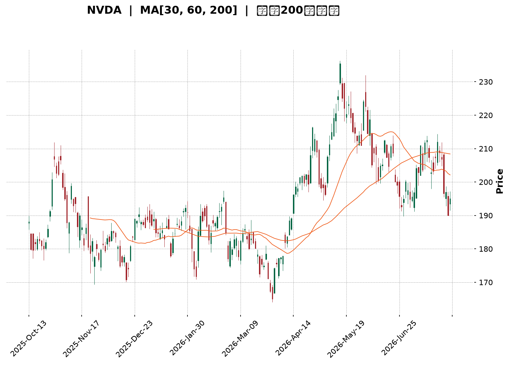
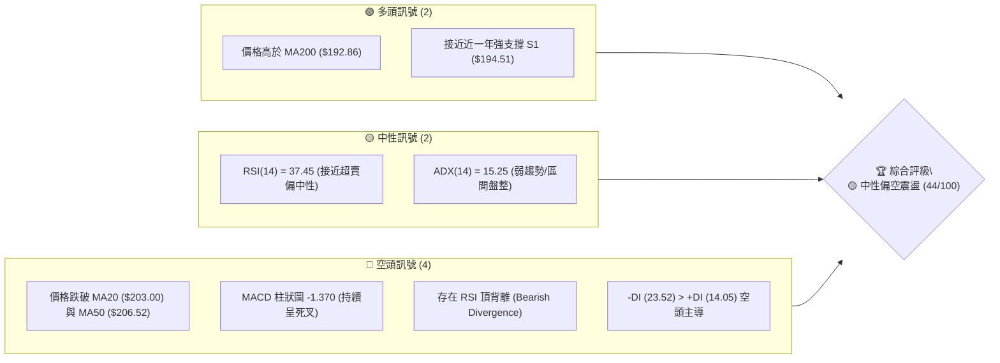
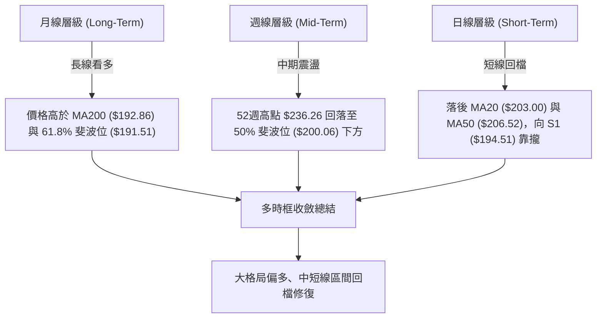
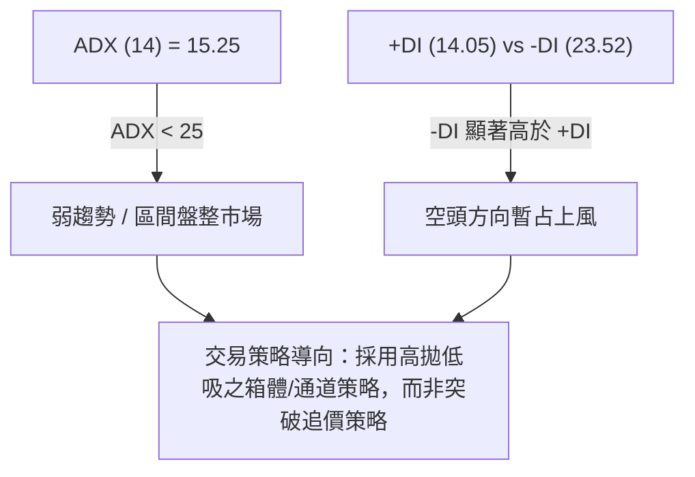
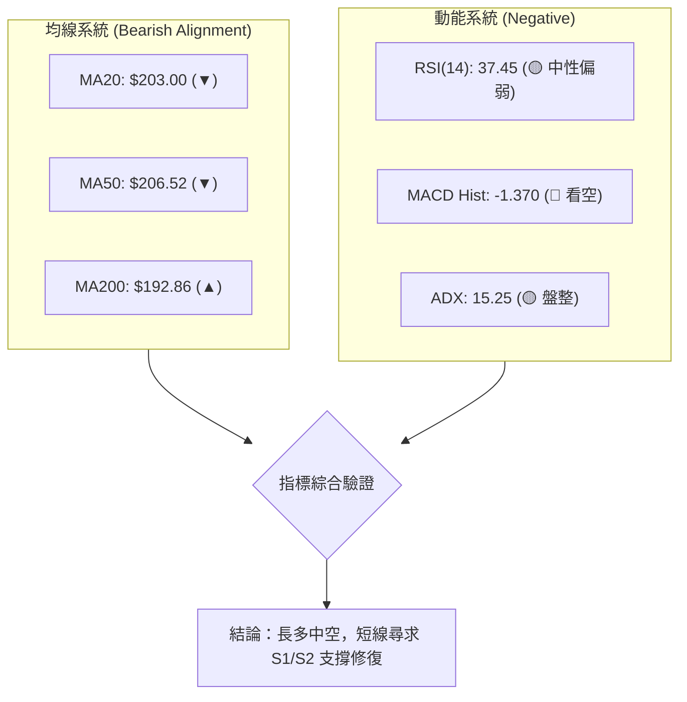
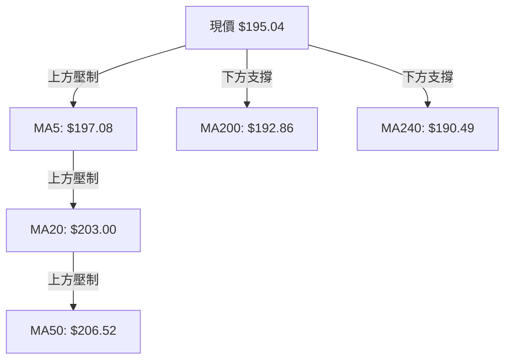
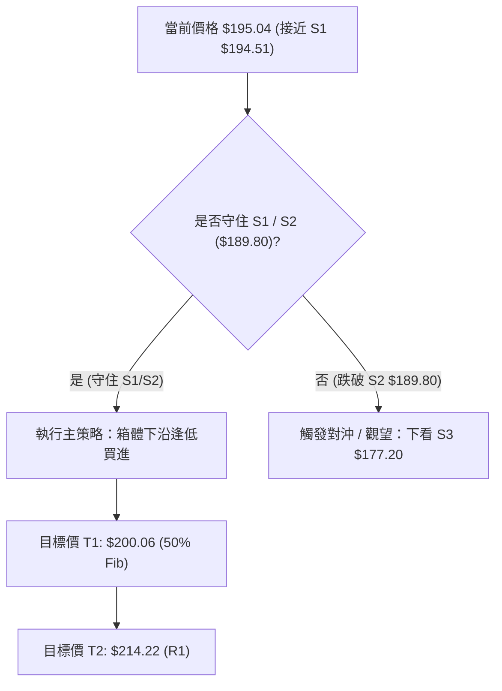
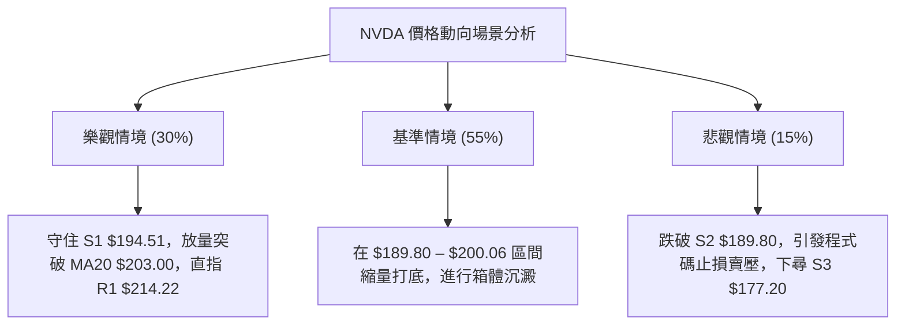

<details markdown="1">
<summary>📊 靜態圖表 (點擊展開)</summary>



</details>

<html>
<head><meta charset="utf-8" /></head>
<body>
    <div style="height:500px; width:100%;">                        <script>window.PlotlyConfig = {MathJaxConfig: 'local'};</script>
        <script charset="utf-8" src="https://cdn.plot.ly/plotly-3.7.0.min.js" integrity="sha256-jvTGqxNp8AGWEcvNLVuKr+8j5dGe9Yw51LQkmDH+IYA=" crossorigin="anonymous"></script>                <div id="candlestick-chart" class="plotly-graph-div" style="height:100%; width:100%;"></div>            <script>                window.PLOTLYENV=window.PLOTLYENV || {};                                if (document.getElementById("candlestick-chart")) {                    Plotly.newPlot(                        "candlestick-chart",                        [{"close":{"dtype":"f8","bdata":"AAAAYJCCZ0AAAAAAn3lmQAAAAOA6c2ZAAAAAYIKyZkAAAABgkt9mQAAAAAAJzWZAAAAAQLydZkAAAACAnIFmQAAAAOCxvWZAAAAAILpAZ0AAAADg3+dnQAAAACDEGGlAAAAAQNfYaUAAAADANVRpQAAAACBtR2lAAAAAILrTaUAAAAAg+81oQAAAAGDDXmhAAAAAwOR6Z0AAAACAIX1nQAAAAKB82WhAAAAAID8daEAAAABgszFoQAAAACDnU2dAAAAAILC9Z0AAAAAAmEtnQAAAAKAgpGZAAAAAgAlJZ0AAAADgHY1mQAAAAGDeVGZAAAAAwCjKZkAAAADg\u002fTJmQAAAAOD4gGZAAAAAAMkYZkAAAABAG3ZmQAAAAMBSp2ZAAAAAQI9rZkAAAAAAA+VmQAAAAGACxmZAAAAAAF4qZ0AAAABg1BdnQAAAAMDL8WZAAAAA4LSWZkAAAABA0dllQAAAAGBoAmZAAAAAwBwwZkAAAACgaldlQAAAAACxvWVAAAAA4J+YZkAAAABg6+5mQAAAACBYn2dAAAAA4CqMZ0AAAABgiMlnQAAAAOCzf2dAAAAAIPhpZ0AAAADgukhnQAAAAKDWk2dAAAAAwIF8Z0AAAACgYWBnQAAAAOAlnGdAAAAAIBEaZ0AAAABAUBRnQAAAAODeFmdAAAAAQK0yZ0AAAAAgV91mQAAAAABPWmdAAAAAoBlAZ0AAAABgTDtmQAAAACAY42ZAAAAAoKwTZ0AAAADAH25nQAAAAGDFR2dAAAAAgEqJZ0AAAACgLOlnQAAAAMDQCGhAAAAAoLXcZ0AAAADgSCxnQAAAAIDZg2ZAAAAAIEq\u002fZUAAAACgdXVlQAAAAGDkJWdAAAAAIN+5Z0AAAAAg7olnQAAAAAAxumdAAAAAAMtWZ0AAAABAy9JmQAAAAGDUF2dAAAAAIAh4Z0AAAACgeXVnQAAAAEDXsmdAAAAAICLqZ0AAAADArhNoQAAAAOBLamhAAAAAwEUVZ0AAAABALB9mQAAAACA\u002fyGZAAAAAwJR6ZkAAAAAAJdpmQAAAAKC742ZAAAAA4E4zZkAAAAAArs1mQAAAAABwEWdAAAAAoAc6Z0AAAABgqN1mQAAAAABJgWZAAAAAADfgZkAAAACA+7ZmQAAAAGAUhmZAAAAAoERLZkAAAABg949lQAAAAODv7WVAAAAAgN\u002ffZUAAAACAGk9mQAAAACBNYWVAAAAAQGbqZEAAAACASZ9kQAAAAKBNxmVAAAAAAHTxZUAAAAAg3yVmQAAAAMDcLWZAAAAAwJA8ZkAAAAAAx7tmQAAAAOBE9mZAAAAAICKNZ0AAAAAg3qJnQAAAAOD\u002fiGhAAAAAgG7UaEAAAACgz8NoQAAAACA\u002fLmlAAAAAgGQ6aUAAAADgtvRoQAAAAOB0SGlAAAAAAAvtaEAAAACg4QBqQAAAAGBzC2tAAAAAwH+dakAAAACANCBqQAAAAEDO6mhAAAAA4AHHaEAAAABA98doQAAAAACuiGhAAAAAYNHyaUAAAAAAH2hqQAAAACBi3mpAAAAAwOdla0AAAABAvJBrQAAAAMAlMmxAAAAAAOZubUAAAADA2CFsQAAAAGD1wWtAAAAAQE2La0AAAAAgt+ZrQAAAAIAkaGtAAAAA4IniakAAAAAghNNqQAAAAMBHi2pAAAAAwATAakAAAABgnVxqQAAAAIApA2xAAAAAgPDRa0AAAAAAANBqQAAAAMAeVWtAAAAAQDOjaUAAAADgehRqQAAAAIAUBmpAAAAAoHANaUAAAAAA15tpQAAAAIAUpmlAAAAAYGaOakAAAADAHu1pQAAAAMDMlGlAAAAAgBRWakAAAADAzBRqQAAAAKBHAWlAAAAAAADgaEAAAAAgrndoQAAAAMD1EGhAAAAAQApfaEAAAABA4QJpQAAAAGCPsmhAAAAAYI9aaEAAAACgmXFoQAAAAIDCnWhAAAAAANeDaUAAAADA9VhpQAAAAGC4XmpAAAAAwPVwaUAAAACgmXlqQAAAAAAAkGpAAAAAwMzsaUAAAACA61lpQAAAAMD1aGlAAAAAoEfpaUAAAACA64FqQAAAAOBRGGpAAAAAQOHaaUAAAADgUZBoQAAAAOBRoGhAAAAA4FHAZ0AAAACgR2FoQA=="},"high":{"dtype":"f8","bdata":"CAVFUsW7Z0B1IawYERJnQHryjOhNFGdApf45SX3hZkAJxjgxsvtmQFO9OsnZHmdAjcN9HdTRZkB3s11GmuZmQMf44st\u002f2WZAPeJs32VnZ0B89JVtLPhnQKTfDwGFXGlA8hMHY259akCTJcaAt7xpQBef1xCQ9mlAL8lN1UNiakCy4urGuXZpQOvUACwrVWlAd4Ac08iraEDo3dp5kIJnQDYvlzbu9WhABnC9anllaEDghwPRfnRoQPlpcLRG5mdAzDr7m4jYZ0DiDX60S5hnQBRteToREmdATexQxNxzZ0DVPXC3AnhoQASUmJplCmdA4gZDNoXoZkCVJ7aT2z1mQFKu6xiq1WZA+kOWuvhhZkAZPutIQIJmQAaOw0uNLWdAWzP\u002fh\u002fbGZkBZLqZ\u002fcglnQJ47w+vrDWdAjTMb7at4Z0A7a\u002fjjzC9nQFWgASkhKGdARSiX+yujZkD4oMcIHdNmQOcheh58RmZAKZvk8LhIZkCkAP5US\u002f1lQBF11NDu\u002fWVAlPXLiFOnZkCHA0Xv8P1mQIAEcO0to2dApFSPgcGVZ0CMJciRkQ5oQCAtbRz2kGdAeyCwJ1CYZ0CEYwDcfcpnQJqPqig9FmhAohf+w5wsaEBuvYHt8v1nQGRTMTJh5GdAZHC1HjaqZ0AMc9ianUNnQHw+nJ6LXGdAfy4x7C98Z0BlHIRzhwdnQNHXEU4Br2dA7chf\u002fKfGZ0CA447cDMVmQN3uaBHvJGdAYx4mui4+Z0DA8T8dz6tnQPJy7q13nGdANvnl2pe4Z0Bu4ZO3swNoQMuX7FHRJ2hAHg0QOBlIaEB5e3+SLsJnQKuY5\u002fFgQWdA8WCGNY9rZkCdUcvSWBNmQJWAycG1WGdAN5PKH5ItaECSF3VO2wdoQIJYLTfJIGhAYn5tEPkraECzFOHysGhnQIRhwh6BXWdAPz\u002f4JWvEZ0DvSwAWaoZnQLOEIQkkw2dAw4PY7NY2aEA7lrAxFjFoQPFwjbd0rGhAsfYlsbRBaECRCX4cw8tmQKhwZZiR52ZA4ohnZL+VZkCToicvMw9nQNKOl7C++mZA5O8O8zHRZkAA2L1n\u002fdVmQP2wp\u002fXPRmdAu6opttlsZ0A2L5zVMBdnQILyLY7yO2dA9qozxh+VZ0AZwWmo5CVnQOrzzjRU5WZAoC84tad4ZkBMEMDZrUFmQPjbGvcxRWZALfmypXkAZkCUIuYGSqBmQG78YZ6+CWZABcP\u002fuKtYZUBWtCxvFihlQDwY6sZVzWVAtvQgjTslZkDGLtdrESlmQEfSzBGoMmZA4TKkYrhAZkAKqq4sayFnQPvO+OCz+2ZAHYZcD+y4Z0B\u002fUIEJDq5nQAAAAOD\u002fiGhASBnLqFUFaUC2Fd5RwfNoQJJMKc\u002fiLmlASmpxk+g9aUA3pXeBclBpQAAAAOB0SGlAsgq4ivdyaUATNPGQilZqQN5\u002f44Z7EmtAxk6MX1zPakB0QZaoHY9qQB1IsQvEQWpANT78G3BYaUB2HVZB2C9pQI0v+3Q4AGlAsW\u002fJreEAakBhoEega75qQIVlgZR8MWtATZeNmVHBa0Bywhgtqu9rQOIa63RkcmxAMYH23neIbUASrZxQYOdsQEVRwqJut2xAXtjiV\u002f8GbEAtgAGCvDtsQPTcoSFUZGxArbElNRaYa0BQa87WoT1rQLYy33fSvGpAOUBmg5zoakBUrXaKZzNrQN0y64J2E2xA79kRiE4AbUDl0\u002fuJ8NFrQAAAAEAzs2tAAAAAANfbakAAAABACk9qQAAAAMDMbGpAAAAAQArnaUAAAADAHrVpQAAAAIA94mlAAAAAYLiWakAAAAAgrm9qQAAAAGC4JmpAAAAA4HpsakAAAAAgrr9qQAAAAOCjeGlAAAAAoHA1aUAAAACgmRlpQAAAAKCZcWhAAAAAgMKFaEAAAAAAKRRpQAAAAEAz+2hAAAAAgOsBaUAAAACgmbFoQAAAAMAezWhAAAAAwB6laUAAAABA4ZJpQAAAAAAAYGpAAAAAgD1SakAAAACgmZFqQAAAAIDruWpAAAAAYI9iakAAAADAzNRpQAAAACCu92lAAAAAwMwUakAAAADgesxqQAAAAADXW2pAAAAAwB59akAAAAAAABhqQAAAAGBm1mhAAAAAgD2iaEAAAAAAAKhoQA=="},"hovertemplate":"\u003cb\u003e%{x|%Y-%m-%d}\u003c\u002fb\u003e\u003cbr\u003e\u958b: $%{open:.2f}\u003cbr\u003e\u9ad8: $%{high:.2f}\u003cbr\u003e\u4f4e: $%{low:.2f}\u003cbr\u003e\u6536: $%{close:.2f}\u003cextra\u003e\u003c\u002fextra\u003e","low":{"dtype":"f8","bdata":"yPlt4CM3Z0DGMp4RE29mQLvWLqENImZAAKBgCVBxZkCLb39VrHBmQMY3+77zr2ZANwg8UUVyZkA18lZbHRFmQGPJRHvzcWZAkqdrDYXoZkBjk5suFIZnQHN5XElM9WdAu88D9ZyQaUColooR6SRpQF2o+eEAOmlAwVRZZoqpaUB6t00OsbVoQBDZ+5fdTGhA1dBTHZBEZ0BuxCTq01VmQLDoyoJhMWhAXmy7aM3hZ0BT2lacXtxnQDHAQam082ZAtoxQ8zKLZkB0x\u002fEKugJnQOZUEBh6bWZAam2FgRvTZkCUcmF+3nNmQDliuva1lmVA4QjilioIZkANyQdNsCplQG6XFDRqQGZAcgGvN84IZkC1GYA8rq5lQM54Y5ypeGZAbQI6IjhcZkD1dA2BtHdmQOyCKFgRlmZAI7kuj7DFZkAC4z8XGONmQLcoNP0uumZAat0uY\u002fQMZkAShe5dCM1lQAZb6BIj2mVATFYwZPvVZUBGlXzpR0NlQNhMKMeKc2VAwTIEaAEEZkA4P1d\u002fF8RmQPJhw3ir1WZAmLqnKJtLZ0DtVXTfq3hnQCB9k23fNWdAh6taFnlWZ0AIZIgZaUhnQAGVVCP7gGdAESqdKIs9Z0BMrfQw9VJnQFW9t7KlSmdAp\u002fWWJY\u002fvZkBggkSgR+5mQAWPKWmB2WZAvHLTjKblZkCwpHM6jZJmQAx4Yu9LQ2dAHWwzX047Z0DDvkCXmCxmQCkn9HjYRWZAVQXa9Jb2ZkAfp4ob9VJnQAG7RApuOGdALzGSJCkvZ0ApM\u002fPDerNnQN\u002fy5b2qOmdAB+PhcKenZ0AUqekI9BRnQMR4TmR9AGZAgzL8IGt2ZUCm8q3bSlplQMrJ\u002fsFkzGVAaoZlpjr3ZkDZpfiwgXxnQJCaHQZIkWdAWxOGqgxJZ0CJK6AszatmQBc8xWfGXmZANMHjDApRZ0Cvo4z64S1nQLeKJPjUNmdAzPOriCurZ0DYmRejfmVnQM4wAKq5MWhAx00zEA4DZ0AXf1LVSAVmQMCamByszWVAABCu\u002fIoWZkDFSA6d5npmQGlgzNw5NWZA42Xa2lgTZkCjZCCBE+tlQJx8\u002f4o5uWZA9L9vUYcHZ0ALNHDBOrFmQGC01HRgd2ZAjszBwlymZkDPO1ji\u002fa5mQNKu36rXg2ZAqryuKrvyZUBd\u002f5KYpHBlQPQHaETP0WVAKe+V4uC4ZUC+sayznBRmQJIPJdQaXmVAxwkqHRnaZEBxKytVhYJkQDAUIDOA2GRA4zFJiX3RZUC9BYOpdGVlQG6A563F8WVAkU3jl6auZUDXDIM54oJmQIIiH4AcjWZA0pkNC7wCZ0DWH63LwjBnQN7NKJ2I0WdAXi5JeWNwaEBkWzsZoHJoQIBwxns34WhAYpDEfoKzaED\u002fLVxElthoQDrRoUCW2GhA\u002fMISdLGfaEDum6buefJoQN5RIEZv5GlAjvNb5aT+aUCiowPN0+ppQIYVDWz\u002fzmhAo971Ln+caEDoYfHqbFBoQOd1ezuoeWhAQ7GGDR\u002fMaEDQL+euTshpQEhOfKeMlGpApZrbDYO0akDD3H0Cb9VqQNwzGYD8qWtAOMcx6g6hbEAOdaOsU\u002f9rQJ4KNIu0Q2tAeU61nwA1a0AbVs4yyYdrQEptXDGkNWtACavpLZnRakCz\u002fTNGGnhqQHfaIq4uEWpAnM935StfakBAS2aYS1xqQEZjNFZd7mpA7qDoRPSia0CBSvIpVMhqQAAAAEAKX2pAAAAAYI+KaUAAAAAAAMBpQAAAAEDh6mhAAAAAoHD9aEAAAACgR\u002fFoQAAAAIAUbmlAAAAAQOEKakAAAACgR+lpQAAAAGCPYmlAAAAAAADQaUAAAABACvdpQAAAAAAAAGlAAAAAYI+SaEAAAAAAKQRoQAAAAEAK52dAAAAAoJm5Z0AAAAAghWNoQAAAAGBmLmhAAAAAQDMLaEAAAAAgrj9oQAAAAOB65GdAAAAAgOthaEAAAABguN5oQAAAAKBwPWlAAAAAAABgaUAAAACgmXlpQAAAAKBHwWlAAAAAQDO7aUAAAABACr9oQAAAAMD1SGlAAAAA4FGAaUAAAABgZp5pQAAAAGC4vmlAAAAAgOuZaUAAAACAFG5oQAAAACCuF2hAAAAA4FHAZ0AAAADgo\u002fBnQA=="},"name":"\u50f9\u683c","open":{"dtype":"f8","bdata":"J7r+xmB3Z0Ad1tCoGxFnQJGghUMREmdAgg8Snu6\u002fZkAoF9lYan5mQLkqAAOy3GZAjcN9HdTRZkAUJZimGJ1mQNx9ROgVhmZA\u002f8sbwWLzZkAX1CSH77dnQEXqMES7GWhApT4E8eH2aUAYLtUKcJxpQFloWg38xWlAJxFB+hP6aUBMLTKmuVdpQAmlCrqJ0GhAvHbA+G6FaEAWxH9pQxVnQAuluTyRW2hAPG9HQSpdaEAu0SD3D29oQFtuVObP2WdAwjVi6BDUZkDuvgmTdTdnQKJE0Wuv5GZA5PySTb8RZ0DkIASdaXZoQHc4jN9KoGZAXz01Ll1oZkCoYfl9\u002fdVlQHkFPLTBrGZArgiR5gVZZkA6tpBXMtFlQOIqlh7psGZAoG+00y2bZkCsz0mQwqxmQGO38rpP9WZAPjUNSlzNZkDwk7u8rypnQGyL5F\u002fUF2dASMeanO6BZkCQfnS5dZxmQJ\u002fXuMgkN2ZAj\u002fHV8XIBZkD3daHhVfxlQHdfn\u002fsnymVAf1rqfI0OZkAixGs0RfZmQGG96EXo12ZA3bSx78B2Z0CLdWJWCbZnQN\u002fG7hZnb2dAOgCyo1eAZ0CJWBy92apnQARK0756s2dAjdkqTdjwZ0DdZbGkNslnQPmHkaPjimdA1K+9AiacZ0BZh+5NWBtnQM8ZN8rl32ZABxpM1ckYZ0CjQDP5DQNnQKJFF926SGdAnCPfbjCbZ0AsUOtmtbVmQDABZ9yeWmZAwYvrRcwQZ0A57k7SsGhnQCSWN\u002f3SXWdAMfclhmFgZ0C8Fa4eL+FnQBnGAs1r42dAm6udM0TfZ0CeZw1CGl9nQEnOi35rQGdA0DwXaLlnZkBzFZev8NZlQEegWiYxD2ZAWHFuDiMBZ0AF8Jsos+RnQOP8iszlBmhA1H0iem8ZaECiePtFDWhnQF8sKELqsGZACRjGUKSQZ0BivfTBoFpnQD26r673SmdAbbQ4v1blZ0BJTWEyN+hnQGZg09PRRmhAejc3JBFBaEDvB9E776BmQEWLYWt\u002f2WVAkaKN0bhIZkCX5D\u002fSC4dmQALXwadgnmZApoo5d95zZkDXL5e0qhNmQJ2ZqoawxWZAZyX1xDE2Z0D\u002f92JyvvpmQDWsnxaNFmdAnI1TYjnYZkAwEHmmBhtnQGk2B+qPyGZAsLrGPrA5ZkCqEoF0XjlmQPZWA223IWZA5idUBwzUZUBAAVVRmhxmQPnbhXCu+2VA4881uao5ZUA+6tkyrBJlQNnSufrR2GRAh7OtnXH5ZUCIbfJvWH9lQCWC4DOFHmZAMbQtOtDwZUAtqA6MIAlnQH1Qph0btGZAGC2n0g0DZ0DD6bGnBzpnQONJSVLF02dAM89DWPWJaEA3BSSmZ6ZoQOX1tVla9WhAT\u002f0k9uj3aEC7ehBroTxpQPaPYmYxGGlAOtJcmy1HaUDVWmlgRfdoQNzkK2D9LGpAeV8JWOAnakAwh2z5eY5qQH8FCnPwNWpAmyUPQ3YhaUBg1bllkehoQFwb8uss4mhAkRKQmAj1aEADjcViHgNqQCcfszEGmWpASBqpX065akDkq0RkdUlrQBqlOnVhFWxACRl0S6OybEA3K4nIwq9sQEgoJOBGs2xAxc\u002f5kKhra0CkAAMkct1rQGAtAr3\u002fwGtALYGyIZKUa0Czs5WaNglrQM5THAHdu2pAMEn90hZhakDDYOwRkcpqQGh998xS72pA1+Rj60tdbEBPaIbHx65rQAAAAMAevWpAAAAAwPXQakAAAACAwkVqQAAAAADXU2pAAAAAgMKNaUAAAAAgri9pQAAAACCFm2lAAAAAoHAdakAAAACAwmVqQAAAAMD1EGpAAAAAYI\u002fqaUAAAACAFG5qQAAAAKBwRWlAAAAAANcDaUAAAABgjwJpQAAAAADXI2hAAAAAQDM7aEAAAAAgrqdoQAAAAGBmhmhAAAAA4HqkaEAAAACgcE1oQAAAAADXC2hAAAAAgMJlaEAAAABguI5pQAAAAAAAQGlAAAAAoEcRakAAAABgZgZqQAAAAGC4fmpAAAAAoHBFakAAAADgelRpQAAAAADXu2lAAAAAoEfxaUAAAACA67lpQAAAAGC4LmpAAAAAYGbuaUAAAABgZgZqQAAAAAAAYGhAAAAAQDN7aEAAAABgZi5oQA=="},"x":["2025-10-13T00:00:00-04:00","2025-10-14T00:00:00-04:00","2025-10-15T00:00:00-04:00","2025-10-16T00:00:00-04:00","2025-10-17T00:00:00-04:00","2025-10-20T00:00:00-04:00","2025-10-21T00:00:00-04:00","2025-10-22T00:00:00-04:00","2025-10-23T00:00:00-04:00","2025-10-24T00:00:00-04:00","2025-10-27T00:00:00-04:00","2025-10-28T00:00:00-04:00","2025-10-29T00:00:00-04:00","2025-10-30T00:00:00-04:00","2025-10-31T00:00:00-04:00","2025-11-03T00:00:00-05:00","2025-11-04T00:00:00-05:00","2025-11-05T00:00:00-05:00","2025-11-06T00:00:00-05:00","2025-11-07T00:00:00-05:00","2025-11-10T00:00:00-05:00","2025-11-11T00:00:00-05:00","2025-11-12T00:00:00-05:00","2025-11-13T00:00:00-05:00","2025-11-14T00:00:00-05:00","2025-11-17T00:00:00-05:00","2025-11-18T00:00:00-05:00","2025-11-19T00:00:00-05:00","2025-11-20T00:00:00-05:00","2025-11-21T00:00:00-05:00","2025-11-24T00:00:00-05:00","2025-11-25T00:00:00-05:00","2025-11-26T00:00:00-05:00","2025-11-28T00:00:00-05:00","2025-12-01T00:00:00-05:00","2025-12-02T00:00:00-05:00","2025-12-03T00:00:00-05:00","2025-12-04T00:00:00-05:00","2025-12-05T00:00:00-05:00","2025-12-08T00:00:00-05:00","2025-12-09T00:00:00-05:00","2025-12-10T00:00:00-05:00","2025-12-11T00:00:00-05:00","2025-12-12T00:00:00-05:00","2025-12-15T00:00:00-05:00","2025-12-16T00:00:00-05:00","2025-12-17T00:00:00-05:00","2025-12-18T00:00:00-05:00","2025-12-19T00:00:00-05:00","2025-12-22T00:00:00-05:00","2025-12-23T00:00:00-05:00","2025-12-24T00:00:00-05:00","2025-12-26T00:00:00-05:00","2025-12-29T00:00:00-05:00","2025-12-30T00:00:00-05:00","2025-12-31T00:00:00-05:00","2026-01-02T00:00:00-05:00","2026-01-05T00:00:00-05:00","2026-01-06T00:00:00-05:00","2026-01-07T00:00:00-05:00","2026-01-08T00:00:00-05:00","2026-01-09T00:00:00-05:00","2026-01-12T00:00:00-05:00","2026-01-13T00:00:00-05:00","2026-01-14T00:00:00-05:00","2026-01-15T00:00:00-05:00","2026-01-16T00:00:00-05:00","2026-01-20T00:00:00-05:00","2026-01-21T00:00:00-05:00","2026-01-22T00:00:00-05:00","2026-01-23T00:00:00-05:00","2026-01-26T00:00:00-05:00","2026-01-27T00:00:00-05:00","2026-01-28T00:00:00-05:00","2026-01-29T00:00:00-05:00","2026-01-30T00:00:00-05:00","2026-02-02T00:00:00-05:00","2026-02-03T00:00:00-05:00","2026-02-04T00:00:00-05:00","2026-02-05T00:00:00-05:00","2026-02-06T00:00:00-05:00","2026-02-09T00:00:00-05:00","2026-02-10T00:00:00-05:00","2026-02-11T00:00:00-05:00","2026-02-12T00:00:00-05:00","2026-02-13T00:00:00-05:00","2026-02-17T00:00:00-05:00","2026-02-18T00:00:00-05:00","2026-02-19T00:00:00-05:00","2026-02-20T00:00:00-05:00","2026-02-23T00:00:00-05:00","2026-02-24T00:00:00-05:00","2026-02-25T00:00:00-05:00","2026-02-26T00:00:00-05:00","2026-02-27T00:00:00-05:00","2026-03-02T00:00:00-05:00","2026-03-03T00:00:00-05:00","2026-03-04T00:00:00-05:00","2026-03-05T00:00:00-05:00","2026-03-06T00:00:00-05:00","2026-03-09T00:00:00-04:00","2026-03-10T00:00:00-04:00","2026-03-11T00:00:00-04:00","2026-03-12T00:00:00-04:00","2026-03-13T00:00:00-04:00","2026-03-16T00:00:00-04:00","2026-03-17T00:00:00-04:00","2026-03-18T00:00:00-04:00","2026-03-19T00:00:00-04:00","2026-03-20T00:00:00-04:00","2026-03-23T00:00:00-04:00","2026-03-24T00:00:00-04:00","2026-03-25T00:00:00-04:00","2026-03-26T00:00:00-04:00","2026-03-27T00:00:00-04:00","2026-03-30T00:00:00-04:00","2026-03-31T00:00:00-04:00","2026-04-01T00:00:00-04:00","2026-04-02T00:00:00-04:00","2026-04-06T00:00:00-04:00","2026-04-07T00:00:00-04:00","2026-04-08T00:00:00-04:00","2026-04-09T00:00:00-04:00","2026-04-10T00:00:00-04:00","2026-04-13T00:00:00-04:00","2026-04-14T00:00:00-04:00","2026-04-15T00:00:00-04:00","2026-04-16T00:00:00-04:00","2026-04-17T00:00:00-04:00","2026-04-20T00:00:00-04:00","2026-04-21T00:00:00-04:00","2026-04-22T00:00:00-04:00","2026-04-23T00:00:00-04:00","2026-04-24T00:00:00-04:00","2026-04-27T00:00:00-04:00","2026-04-28T00:00:00-04:00","2026-04-29T00:00:00-04:00","2026-04-30T00:00:00-04:00","2026-05-01T00:00:00-04:00","2026-05-04T00:00:00-04:00","2026-05-05T00:00:00-04:00","2026-05-06T00:00:00-04:00","2026-05-07T00:00:00-04:00","2026-05-08T00:00:00-04:00","2026-05-11T00:00:00-04:00","2026-05-12T00:00:00-04:00","2026-05-13T00:00:00-04:00","2026-05-14T00:00:00-04:00","2026-05-15T00:00:00-04:00","2026-05-18T00:00:00-04:00","2026-05-19T00:00:00-04:00","2026-05-20T00:00:00-04:00","2026-05-21T00:00:00-04:00","2026-05-22T00:00:00-04:00","2026-05-26T00:00:00-04:00","2026-05-27T00:00:00-04:00","2026-05-28T00:00:00-04:00","2026-05-29T00:00:00-04:00","2026-06-01T00:00:00-04:00","2026-06-02T00:00:00-04:00","2026-06-03T00:00:00-04:00","2026-06-04T00:00:00-04:00","2026-06-05T00:00:00-04:00","2026-06-08T00:00:00-04:00","2026-06-09T00:00:00-04:00","2026-06-10T00:00:00-04:00","2026-06-11T00:00:00-04:00","2026-06-12T00:00:00-04:00","2026-06-15T00:00:00-04:00","2026-06-16T00:00:00-04:00","2026-06-17T00:00:00-04:00","2026-06-18T00:00:00-04:00","2026-06-22T00:00:00-04:00","2026-06-23T00:00:00-04:00","2026-06-24T00:00:00-04:00","2026-06-25T00:00:00-04:00","2026-06-26T00:00:00-04:00","2026-06-29T00:00:00-04:00","2026-06-30T00:00:00-04:00","2026-07-01T00:00:00-04:00","2026-07-02T00:00:00-04:00","2026-07-06T00:00:00-04:00","2026-07-07T00:00:00-04:00","2026-07-08T00:00:00-04:00","2026-07-09T00:00:00-04:00","2026-07-10T00:00:00-04:00","2026-07-13T00:00:00-04:00","2026-07-14T00:00:00-04:00","2026-07-15T00:00:00-04:00","2026-07-16T00:00:00-04:00","2026-07-17T00:00:00-04:00","2026-07-20T00:00:00-04:00","2026-07-21T00:00:00-04:00","2026-07-22T00:00:00-04:00","2026-07-23T00:00:00-04:00","2026-07-24T00:00:00-04:00","2026-07-27T00:00:00-04:00","2026-07-28T00:00:00-04:00","2026-07-29T00:00:00-04:00","2026-07-30T00:00:00-04:00"],"type":"candlestick"},{"hovertemplate":"MA30: $%{y:.2f}\u003cextra\u003e\u003c\u002fextra\u003e","line":{"color":"#2196F3","dash":"dash","width":2},"mode":"lines","name":"MA30","x":["2025-10-13T00:00:00-04:00","2025-10-14T00:00:00-04:00","2025-10-15T00:00:00-04:00","2025-10-16T00:00:00-04:00","2025-10-17T00:00:00-04:00","2025-10-20T00:00:00-04:00","2025-10-21T00:00:00-04:00","2025-10-22T00:00:00-04:00","2025-10-23T00:00:00-04:00","2025-10-24T00:00:00-04:00","2025-10-27T00:00:00-04:00","2025-10-28T00:00:00-04:00","2025-10-29T00:00:00-04:00","2025-10-30T00:00:00-04:00","2025-10-31T00:00:00-04:00","2025-11-03T00:00:00-05:00","2025-11-04T00:00:00-05:00","2025-11-05T00:00:00-05:00","2025-11-06T00:00:00-05:00","2025-11-07T00:00:00-05:00","2025-11-10T00:00:00-05:00","2025-11-11T00:00:00-05:00","2025-11-12T00:00:00-05:00","2025-11-13T00:00:00-05:00","2025-11-14T00:00:00-05:00","2025-11-17T00:00:00-05:00","2025-11-18T00:00:00-05:00","2025-11-19T00:00:00-05:00","2025-11-20T00:00:00-05:00","2025-11-21T00:00:00-05:00","2025-11-24T00:00:00-05:00","2025-11-25T00:00:00-05:00","2025-11-26T00:00:00-05:00","2025-11-28T00:00:00-05:00","2025-12-01T00:00:00-05:00","2025-12-02T00:00:00-05:00","2025-12-03T00:00:00-05:00","2025-12-04T00:00:00-05:00","2025-12-05T00:00:00-05:00","2025-12-08T00:00:00-05:00","2025-12-09T00:00:00-05:00","2025-12-10T00:00:00-05:00","2025-12-11T00:00:00-05:00","2025-12-12T00:00:00-05:00","2025-12-15T00:00:00-05:00","2025-12-16T00:00:00-05:00","2025-12-17T00:00:00-05:00","2025-12-18T00:00:00-05:00","2025-12-19T00:00:00-05:00","2025-12-22T00:00:00-05:00","2025-12-23T00:00:00-05:00","2025-12-24T00:00:00-05:00","2025-12-26T00:00:00-05:00","2025-12-29T00:00:00-05:00","2025-12-30T00:00:00-05:00","2025-12-31T00:00:00-05:00","2026-01-02T00:00:00-05:00","2026-01-05T00:00:00-05:00","2026-01-06T00:00:00-05:00","2026-01-07T00:00:00-05:00","2026-01-08T00:00:00-05:00","2026-01-09T00:00:00-05:00","2026-01-12T00:00:00-05:00","2026-01-13T00:00:00-05:00","2026-01-14T00:00:00-05:00","2026-01-15T00:00:00-05:00","2026-01-16T00:00:00-05:00","2026-01-20T00:00:00-05:00","2026-01-21T00:00:00-05:00","2026-01-22T00:00:00-05:00","2026-01-23T00:00:00-05:00","2026-01-26T00:00:00-05:00","2026-01-27T00:00:00-05:00","2026-01-28T00:00:00-05:00","2026-01-29T00:00:00-05:00","2026-01-30T00:00:00-05:00","2026-02-02T00:00:00-05:00","2026-02-03T00:00:00-05:00","2026-02-04T00:00:00-05:00","2026-02-05T00:00:00-05:00","2026-02-06T00:00:00-05:00","2026-02-09T00:00:00-05:00","2026-02-10T00:00:00-05:00","2026-02-11T00:00:00-05:00","2026-02-12T00:00:00-05:00","2026-02-13T00:00:00-05:00","2026-02-17T00:00:00-05:00","2026-02-18T00:00:00-05:00","2026-02-19T00:00:00-05:00","2026-02-20T00:00:00-05:00","2026-02-23T00:00:00-05:00","2026-02-24T00:00:00-05:00","2026-02-25T00:00:00-05:00","2026-02-26T00:00:00-05:00","2026-02-27T00:00:00-05:00","2026-03-02T00:00:00-05:00","2026-03-03T00:00:00-05:00","2026-03-04T00:00:00-05:00","2026-03-05T00:00:00-05:00","2026-03-06T00:00:00-05:00","2026-03-09T00:00:00-04:00","2026-03-10T00:00:00-04:00","2026-03-11T00:00:00-04:00","2026-03-12T00:00:00-04:00","2026-03-13T00:00:00-04:00","2026-03-16T00:00:00-04:00","2026-03-17T00:00:00-04:00","2026-03-18T00:00:00-04:00","2026-03-19T00:00:00-04:00","2026-03-20T00:00:00-04:00","2026-03-23T00:00:00-04:00","2026-03-24T00:00:00-04:00","2026-03-25T00:00:00-04:00","2026-03-26T00:00:00-04:00","2026-03-27T00:00:00-04:00","2026-03-30T00:00:00-04:00","2026-03-31T00:00:00-04:00","2026-04-01T00:00:00-04:00","2026-04-02T00:00:00-04:00","2026-04-06T00:00:00-04:00","2026-04-07T00:00:00-04:00","2026-04-08T00:00:00-04:00","2026-04-09T00:00:00-04:00","2026-04-10T00:00:00-04:00","2026-04-13T00:00:00-04:00","2026-04-14T00:00:00-04:00","2026-04-15T00:00:00-04:00","2026-04-16T00:00:00-04:00","2026-04-17T00:00:00-04:00","2026-04-20T00:00:00-04:00","2026-04-21T00:00:00-04:00","2026-04-22T00:00:00-04:00","2026-04-23T00:00:00-04:00","2026-04-24T00:00:00-04:00","2026-04-27T00:00:00-04:00","2026-04-28T00:00:00-04:00","2026-04-29T00:00:00-04:00","2026-04-30T00:00:00-04:00","2026-05-01T00:00:00-04:00","2026-05-04T00:00:00-04:00","2026-05-05T00:00:00-04:00","2026-05-06T00:00:00-04:00","2026-05-07T00:00:00-04:00","2026-05-08T00:00:00-04:00","2026-05-11T00:00:00-04:00","2026-05-12T00:00:00-04:00","2026-05-13T00:00:00-04:00","2026-05-14T00:00:00-04:00","2026-05-15T00:00:00-04:00","2026-05-18T00:00:00-04:00","2026-05-19T00:00:00-04:00","2026-05-20T00:00:00-04:00","2026-05-21T00:00:00-04:00","2026-05-22T00:00:00-04:00","2026-05-26T00:00:00-04:00","2026-05-27T00:00:00-04:00","2026-05-28T00:00:00-04:00","2026-05-29T00:00:00-04:00","2026-06-01T00:00:00-04:00","2026-06-02T00:00:00-04:00","2026-06-03T00:00:00-04:00","2026-06-04T00:00:00-04:00","2026-06-05T00:00:00-04:00","2026-06-08T00:00:00-04:00","2026-06-09T00:00:00-04:00","2026-06-10T00:00:00-04:00","2026-06-11T00:00:00-04:00","2026-06-12T00:00:00-04:00","2026-06-15T00:00:00-04:00","2026-06-16T00:00:00-04:00","2026-06-17T00:00:00-04:00","2026-06-18T00:00:00-04:00","2026-06-22T00:00:00-04:00","2026-06-23T00:00:00-04:00","2026-06-24T00:00:00-04:00","2026-06-25T00:00:00-04:00","2026-06-26T00:00:00-04:00","2026-06-29T00:00:00-04:00","2026-06-30T00:00:00-04:00","2026-07-01T00:00:00-04:00","2026-07-02T00:00:00-04:00","2026-07-06T00:00:00-04:00","2026-07-07T00:00:00-04:00","2026-07-08T00:00:00-04:00","2026-07-09T00:00:00-04:00","2026-07-10T00:00:00-04:00","2026-07-13T00:00:00-04:00","2026-07-14T00:00:00-04:00","2026-07-15T00:00:00-04:00","2026-07-16T00:00:00-04:00","2026-07-17T00:00:00-04:00","2026-07-20T00:00:00-04:00","2026-07-21T00:00:00-04:00","2026-07-22T00:00:00-04:00","2026-07-23T00:00:00-04:00","2026-07-24T00:00:00-04:00","2026-07-27T00:00:00-04:00","2026-07-28T00:00:00-04:00","2026-07-29T00:00:00-04:00","2026-07-30T00:00:00-04:00"],"y":{"dtype":"f8","bdata":"AAAAAAAA+H8AAAAAAAD4fwAAAAAAAPh\u002fAAAAAAAA+H8AAAAAAAD4fwAAAAAAAPh\u002fAAAAAAAA+H8AAAAAAAD4fwAAAAAAAPh\u002fAAAAAAAA+H8AAAAAAAD4fwAAAAAAAPh\u002fAAAAAAAA+H8AAAAAAAD4fwAAAAAAAPh\u002fAAAAAAAA+H8AAAAAAAD4fwAAAAAAAPh\u002fAAAAAAAA+H8AAAAAAAD4fwAAAAAAAPh\u002fAAAAAAAA+H8AAAAAAAD4fwAAAAAAAPh\u002fAAAAAAAA+H8AAAAAAAD4fwAAAAAAAPh\u002fAAAAAAAA+H8AAAAAAAD4fwAAAMD0p2dAmpmZKc+hZ0BVVVV1dJ9nQJqZmbnpn2dAIiIi8smaZ0CamZn5RZdnQKuqqioElmdAAAAAAFiUZ0B3d3c3qJdnQKuqqirvl2dAzczMXDCXZ0C8u7sLQZBnQO\u002fu7m7jfWdAzczMfBViZ0CJiIh4Z0RnQJqZmemAKGdAIiIiInMJZ0CJiIjI5etmQM3MzDx21WZAiYiIaOvNZkDv7u7eLclmQAAAADC1vmZA3t3dLd+5ZkB3d3dHZrZmQJqZmQnct2ZAMzMzoxG1ZkAzMzMz+bRmQLy7u7v2vGZAERER8a2+ZkC8u7u7uMVmQERERISh0GZAVVVVZUvTZkBEREQkztpmQGZmZkbN32ZAAAAAwDLpZkDe3d2to+xmQFVVVQWb8mZAMzMzs7D5ZkCrqqp6CPRmQLy7u6sA9WZAZmZmBj\u002f0ZkB3d3dnH\u002fdmQO\u002fu7g79+WZAzczMHBMCZ0CamZk5pxNnQImIiPjuJGdAVVVVVTgzZ0B3d3dX2UJnQKuqqkp0SWdAMzMzszVCZ0BVVVW1oDVnQBEREVGUMWdAMzMzUxozZ0BVVVWV+zBnQAAAALDuMmdAzczMDEsyZ0CamZmpXC5nQERERHQ6KmdARERERBQqZ0BEREREyCpnQJqZmemJK2dAmpmZaXkyZ0AAAACQ\u002fDpnQO\u002fu7v5MRmdAREREFFJFZ0ARERFR+z5nQLy7u+scOmdAzczMbIczZ0CamZnp0jhnQM3MzFzYOGdAVVVVxV0xZ0BVVVWlBCxnQAAAAAA1KmdAMzMzo5AnZ0BERETUpR5nQFVVVcWYEWdAZmZmJi4JZ0C8u7srRQVnQDMzMzNYBWdA7+7urgIKZ0AAAADg5ApnQLy7u9t+AGdAIiIiErLwZkDNzMyMM+ZmQERERPQr0mZA3t3d7X29ZkBmZmZWtapmQM3MzBx1n2ZAzczMLHCSZkC8u7tbQIdmQDMzMxNJemZA3t3dbfdrZkBVVVXFgGBmQDMzMyMaVGZAMzMz8xhYZkB3d3dHBWVmQDMzM6P6c2ZA3t3dbQqIZkCrqqrqXJhmQFVVVdXpq2ZAMzMz47\u002fFZkDNzMwMHthmQM3MzJwE62ZAmpmZuYT5ZkBmZmbmShRnQLy7uwsIO2dA7+7u3vBaZ0Dv7u5eDHhnQHd3d\u002fd4jGdAERER8amhZ0B3d3dnIb1nQBEREfFa02dAzczMvB72Z0CrqqpaFhloQDMzM2PsR2hAERERgT1\u002faEAAAAAQfbpoQImIiIhI8WhAvLu7uzIxaUBmZmaWQ2RpQCIiIgLek2lA7+7ujijBaUARERGhQe1pQLy7u3svE2pAAAAA4KEvakC8u7ub2kpqQDMzMyP\u002fW2pAMzMzA2JsakCJiIh4AnpqQKuqqmoskmpA7+7urkqoakBERER0IrhqQFVVVZWfyWpA3t3d\u002fbHPakC8u7s7WdBqQO\u002fu7t6ix2pAiYiICE26akBERESE47VqQHd3d5chvGpAvLu7m0\u002fLakARERExFdVqQGZmZiYF3mpAAAAAMFThakDe3d0tjd5qQFVVVeWlzmpAvLu7Kx65akBERETErp5qQO\u002fu7m5xe2pAERERcT9QakB3d3eXnTVqQHd3d5eAG2pAAAAAEEcAakBEREQUxuJpQDMzMwP2ymlAIiIiYkW\u002faUCamZkJp7JpQKuqqsoqsWlAAAAAoP+laUB3d3f39qZpQHd3d7eXmmlAvLu722uKaUBVVVW1831pQBEREfGLbWlARERE9OFvaUB3d3fXh3NpQM3MzHwjdGlAMzMzk\u002fx6aUDNzMy8EXJpQM3MzAxYaWlA7+7ubmhRaUCJiIiYNkRpQA=="},"type":"scatter"},{"hovertemplate":"MA60: $%{y:.2f}\u003cextra\u003e\u003c\u002fextra\u003e","line":{"color":"#9C27B0","dash":"dash","width":2},"mode":"lines","name":"MA60","x":["2025-10-13T00:00:00-04:00","2025-10-14T00:00:00-04:00","2025-10-15T00:00:00-04:00","2025-10-16T00:00:00-04:00","2025-10-17T00:00:00-04:00","2025-10-20T00:00:00-04:00","2025-10-21T00:00:00-04:00","2025-10-22T00:00:00-04:00","2025-10-23T00:00:00-04:00","2025-10-24T00:00:00-04:00","2025-10-27T00:00:00-04:00","2025-10-28T00:00:00-04:00","2025-10-29T00:00:00-04:00","2025-10-30T00:00:00-04:00","2025-10-31T00:00:00-04:00","2025-11-03T00:00:00-05:00","2025-11-04T00:00:00-05:00","2025-11-05T00:00:00-05:00","2025-11-06T00:00:00-05:00","2025-11-07T00:00:00-05:00","2025-11-10T00:00:00-05:00","2025-11-11T00:00:00-05:00","2025-11-12T00:00:00-05:00","2025-11-13T00:00:00-05:00","2025-11-14T00:00:00-05:00","2025-11-17T00:00:00-05:00","2025-11-18T00:00:00-05:00","2025-11-19T00:00:00-05:00","2025-11-20T00:00:00-05:00","2025-11-21T00:00:00-05:00","2025-11-24T00:00:00-05:00","2025-11-25T00:00:00-05:00","2025-11-26T00:00:00-05:00","2025-11-28T00:00:00-05:00","2025-12-01T00:00:00-05:00","2025-12-02T00:00:00-05:00","2025-12-03T00:00:00-05:00","2025-12-04T00:00:00-05:00","2025-12-05T00:00:00-05:00","2025-12-08T00:00:00-05:00","2025-12-09T00:00:00-05:00","2025-12-10T00:00:00-05:00","2025-12-11T00:00:00-05:00","2025-12-12T00:00:00-05:00","2025-12-15T00:00:00-05:00","2025-12-16T00:00:00-05:00","2025-12-17T00:00:00-05:00","2025-12-18T00:00:00-05:00","2025-12-19T00:00:00-05:00","2025-12-22T00:00:00-05:00","2025-12-23T00:00:00-05:00","2025-12-24T00:00:00-05:00","2025-12-26T00:00:00-05:00","2025-12-29T00:00:00-05:00","2025-12-30T00:00:00-05:00","2025-12-31T00:00:00-05:00","2026-01-02T00:00:00-05:00","2026-01-05T00:00:00-05:00","2026-01-06T00:00:00-05:00","2026-01-07T00:00:00-05:00","2026-01-08T00:00:00-05:00","2026-01-09T00:00:00-05:00","2026-01-12T00:00:00-05:00","2026-01-13T00:00:00-05:00","2026-01-14T00:00:00-05:00","2026-01-15T00:00:00-05:00","2026-01-16T00:00:00-05:00","2026-01-20T00:00:00-05:00","2026-01-21T00:00:00-05:00","2026-01-22T00:00:00-05:00","2026-01-23T00:00:00-05:00","2026-01-26T00:00:00-05:00","2026-01-27T00:00:00-05:00","2026-01-28T00:00:00-05:00","2026-01-29T00:00:00-05:00","2026-01-30T00:00:00-05:00","2026-02-02T00:00:00-05:00","2026-02-03T00:00:00-05:00","2026-02-04T00:00:00-05:00","2026-02-05T00:00:00-05:00","2026-02-06T00:00:00-05:00","2026-02-09T00:00:00-05:00","2026-02-10T00:00:00-05:00","2026-02-11T00:00:00-05:00","2026-02-12T00:00:00-05:00","2026-02-13T00:00:00-05:00","2026-02-17T00:00:00-05:00","2026-02-18T00:00:00-05:00","2026-02-19T00:00:00-05:00","2026-02-20T00:00:00-05:00","2026-02-23T00:00:00-05:00","2026-02-24T00:00:00-05:00","2026-02-25T00:00:00-05:00","2026-02-26T00:00:00-05:00","2026-02-27T00:00:00-05:00","2026-03-02T00:00:00-05:00","2026-03-03T00:00:00-05:00","2026-03-04T00:00:00-05:00","2026-03-05T00:00:00-05:00","2026-03-06T00:00:00-05:00","2026-03-09T00:00:00-04:00","2026-03-10T00:00:00-04:00","2026-03-11T00:00:00-04:00","2026-03-12T00:00:00-04:00","2026-03-13T00:00:00-04:00","2026-03-16T00:00:00-04:00","2026-03-17T00:00:00-04:00","2026-03-18T00:00:00-04:00","2026-03-19T00:00:00-04:00","2026-03-20T00:00:00-04:00","2026-03-23T00:00:00-04:00","2026-03-24T00:00:00-04:00","2026-03-25T00:00:00-04:00","2026-03-26T00:00:00-04:00","2026-03-27T00:00:00-04:00","2026-03-30T00:00:00-04:00","2026-03-31T00:00:00-04:00","2026-04-01T00:00:00-04:00","2026-04-02T00:00:00-04:00","2026-04-06T00:00:00-04:00","2026-04-07T00:00:00-04:00","2026-04-08T00:00:00-04:00","2026-04-09T00:00:00-04:00","2026-04-10T00:00:00-04:00","2026-04-13T00:00:00-04:00","2026-04-14T00:00:00-04:00","2026-04-15T00:00:00-04:00","2026-04-16T00:00:00-04:00","2026-04-17T00:00:00-04:00","2026-04-20T00:00:00-04:00","2026-04-21T00:00:00-04:00","2026-04-22T00:00:00-04:00","2026-04-23T00:00:00-04:00","2026-04-24T00:00:00-04:00","2026-04-27T00:00:00-04:00","2026-04-28T00:00:00-04:00","2026-04-29T00:00:00-04:00","2026-04-30T00:00:00-04:00","2026-05-01T00:00:00-04:00","2026-05-04T00:00:00-04:00","2026-05-05T00:00:00-04:00","2026-05-06T00:00:00-04:00","2026-05-07T00:00:00-04:00","2026-05-08T00:00:00-04:00","2026-05-11T00:00:00-04:00","2026-05-12T00:00:00-04:00","2026-05-13T00:00:00-04:00","2026-05-14T00:00:00-04:00","2026-05-15T00:00:00-04:00","2026-05-18T00:00:00-04:00","2026-05-19T00:00:00-04:00","2026-05-20T00:00:00-04:00","2026-05-21T00:00:00-04:00","2026-05-22T00:00:00-04:00","2026-05-26T00:00:00-04:00","2026-05-27T00:00:00-04:00","2026-05-28T00:00:00-04:00","2026-05-29T00:00:00-04:00","2026-06-01T00:00:00-04:00","2026-06-02T00:00:00-04:00","2026-06-03T00:00:00-04:00","2026-06-04T00:00:00-04:00","2026-06-05T00:00:00-04:00","2026-06-08T00:00:00-04:00","2026-06-09T00:00:00-04:00","2026-06-10T00:00:00-04:00","2026-06-11T00:00:00-04:00","2026-06-12T00:00:00-04:00","2026-06-15T00:00:00-04:00","2026-06-16T00:00:00-04:00","2026-06-17T00:00:00-04:00","2026-06-18T00:00:00-04:00","2026-06-22T00:00:00-04:00","2026-06-23T00:00:00-04:00","2026-06-24T00:00:00-04:00","2026-06-25T00:00:00-04:00","2026-06-26T00:00:00-04:00","2026-06-29T00:00:00-04:00","2026-06-30T00:00:00-04:00","2026-07-01T00:00:00-04:00","2026-07-02T00:00:00-04:00","2026-07-06T00:00:00-04:00","2026-07-07T00:00:00-04:00","2026-07-08T00:00:00-04:00","2026-07-09T00:00:00-04:00","2026-07-10T00:00:00-04:00","2026-07-13T00:00:00-04:00","2026-07-14T00:00:00-04:00","2026-07-15T00:00:00-04:00","2026-07-16T00:00:00-04:00","2026-07-17T00:00:00-04:00","2026-07-20T00:00:00-04:00","2026-07-21T00:00:00-04:00","2026-07-22T00:00:00-04:00","2026-07-23T00:00:00-04:00","2026-07-24T00:00:00-04:00","2026-07-27T00:00:00-04:00","2026-07-28T00:00:00-04:00","2026-07-29T00:00:00-04:00","2026-07-30T00:00:00-04:00"],"y":{"dtype":"f8","bdata":"AAAAAAAA+H8AAAAAAAD4fwAAAAAAAPh\u002fAAAAAAAA+H8AAAAAAAD4fwAAAAAAAPh\u002fAAAAAAAA+H8AAAAAAAD4fwAAAAAAAPh\u002fAAAAAAAA+H8AAAAAAAD4fwAAAAAAAPh\u002fAAAAAAAA+H8AAAAAAAD4fwAAAAAAAPh\u002fAAAAAAAA+H8AAAAAAAD4fwAAAAAAAPh\u002fAAAAAAAA+H8AAAAAAAD4fwAAAAAAAPh\u002fAAAAAAAA+H8AAAAAAAD4fwAAAAAAAPh\u002fAAAAAAAA+H8AAAAAAAD4fwAAAAAAAPh\u002fAAAAAAAA+H8AAAAAAAD4fwAAAAAAAPh\u002fAAAAAAAA+H8AAAAAAAD4fwAAAAAAAPh\u002fAAAAAAAA+H8AAAAAAAD4fwAAAAAAAPh\u002fAAAAAAAA+H8AAAAAAAD4fwAAAAAAAPh\u002fAAAAAAAA+H8AAAAAAAD4fwAAAAAAAPh\u002fAAAAAAAA+H8AAAAAAAD4fwAAAAAAAPh\u002fAAAAAAAA+H8AAAAAAAD4fwAAAAAAAPh\u002fAAAAAAAA+H8AAAAAAAD4fwAAAAAAAPh\u002fAAAAAAAA+H8AAAAAAAD4fwAAAAAAAPh\u002fAAAAAAAA+H8AAAAAAAD4fwAAAAAAAPh\u002fAAAAAAAA+H8AAAAAAAD4fyIiIiJLPGdAd3d3R406Z0DNzMxMIT1nQAAAAIDbP2dAERERWf5BZ0C8u7vT9EFnQAAAAJhPRGdAmpmZWQRHZ0ARERFZ2EVnQDMzM+t3RmdAmpmZsbdFZ0CamZk5sENnQO\u002fu7j7wO2dAzczMTBQyZ0ARERFZByxnQBEREfG3JmdAvLu7u1UeZ0AAAACQXxdnQLy7u0N1D2dA3t3djRAIZ0AiIiJKZ\u002f9mQImIiMAk+GZAiYiIwHz2ZkBmZmbusPNmQM3MzFxl9WZAAAAAWK7zZkBmZmbuqvFmQAAAAJiY82ZAq6qqGmH0ZkAAAACAQPhmQO\u002fu7rYV\u002fmZAd3d3Z+ICZ0AiIiJa5QpnQKuqqiINE2dAIiIiakIXZ0B3d3d\u002fzxVnQImIiPhbFmdAAAAAEJwWZ0AiIiKybRZnQERERITsFmdA3t3dZc4SZ0BmZmYGkhFnQHd3dwcZEmdAAAAA4NEUZ0Dv7u6GJhlnQO\u002fu7t5DG2dA3t3dPTMeZ0CamZlBDyRnQO\u002fu7j5mJ2dAERERMRwmZ0CrqqrKQiBnQGZmZpYJGWdAq6qqMuYRZ0ARERGRlwtnQCIiIlKNAmdAVVVVfeT3ZkAAAAAAiexmQImIiMjX5GZAiYiIOELeZkAAAABQBNlmQGZmZn7p0mZAvLu7azjPZkCrqqqqvs1mQBEREZEzzWZAvLu7g7XOZkBERERMANJmQHd3d8cL12ZAVVVV7cjdZkAiIiLql+hmQBERERlh8mZARERE1I77ZkARERFZEQJnQGZmZs6cCmdAZmZmrooQZ0BVVVVdeBlnQImIiGhQJmdAq6qqgg8yZ0BVVVXFqD5nQFVVVZXoSGdAAAAAUNZVZ0C8u7sjA2RnQGZmZubsaWdAd3d3Z2hzZ0C8u7vzpH9nQLy7uysMjWdAd3d3t12eZ0AzMzMzmbJnQKuqqtJeyGdAREREdNHhZ0ARERH5wfVnQKuqqooTB2hAZmZm\u002fo8WaEAzMzMz4SZoQHd3d8+kM2hAmpmZad1DaECamZnx71doQDMzM+P8Z2hAiYiIODZ6aECamZmxL4loQAAAACALn2hAERERSQW3aECJiIhAIMhoQBERERlS2mhAvLu7W5vkaEARERERUvJoQFVVVXVVAWlAvLu7854KaUCamZnx9xZpQHd3d0dNJGlAZmZmxnw2aUBERERMG0lpQLy7uwuwWGlAZmZmdrlraUBERETE0XtpQERERCRJi2lAZmZm1i2caUAiIiLqlaxpQLy7u\u002ftctmlAZmZmFrnAaUDv7u6W8MxpQM3MzEyv12lAd3d3z7fgaUCrqqraA+hpQHd3d78S72lAERERoXP3aUCrqqrSwP5pQO\u002fu7vaUBmpAmpmZ0TAJakAAAAC4fBBqQBERERFiFmpAVVVVRVsZakDNzMwUCxtqQDMzM8OVG2pAERER+ckfakCamZmJ8CFqQN7d3S3jHWpA3t3dzaQaakCJiIig+hNqQCIiItK8EmpAVVVVBVwOakDNzMzkpQxqQA=="},"type":"scatter"},{"hovertemplate":"MA200: $%{y:.2f}\u003cextra\u003e\u003c\u002fextra\u003e","line":{"color":"#FF6F00","dash":"solid","width":2},"mode":"lines","name":"MA200","x":["2025-10-13T00:00:00-04:00","2025-10-14T00:00:00-04:00","2025-10-15T00:00:00-04:00","2025-10-16T00:00:00-04:00","2025-10-17T00:00:00-04:00","2025-10-20T00:00:00-04:00","2025-10-21T00:00:00-04:00","2025-10-22T00:00:00-04:00","2025-10-23T00:00:00-04:00","2025-10-24T00:00:00-04:00","2025-10-27T00:00:00-04:00","2025-10-28T00:00:00-04:00","2025-10-29T00:00:00-04:00","2025-10-30T00:00:00-04:00","2025-10-31T00:00:00-04:00","2025-11-03T00:00:00-05:00","2025-11-04T00:00:00-05:00","2025-11-05T00:00:00-05:00","2025-11-06T00:00:00-05:00","2025-11-07T00:00:00-05:00","2025-11-10T00:00:00-05:00","2025-11-11T00:00:00-05:00","2025-11-12T00:00:00-05:00","2025-11-13T00:00:00-05:00","2025-11-14T00:00:00-05:00","2025-11-17T00:00:00-05:00","2025-11-18T00:00:00-05:00","2025-11-19T00:00:00-05:00","2025-11-20T00:00:00-05:00","2025-11-21T00:00:00-05:00","2025-11-24T00:00:00-05:00","2025-11-25T00:00:00-05:00","2025-11-26T00:00:00-05:00","2025-11-28T00:00:00-05:00","2025-12-01T00:00:00-05:00","2025-12-02T00:00:00-05:00","2025-12-03T00:00:00-05:00","2025-12-04T00:00:00-05:00","2025-12-05T00:00:00-05:00","2025-12-08T00:00:00-05:00","2025-12-09T00:00:00-05:00","2025-12-10T00:00:00-05:00","2025-12-11T00:00:00-05:00","2025-12-12T00:00:00-05:00","2025-12-15T00:00:00-05:00","2025-12-16T00:00:00-05:00","2025-12-17T00:00:00-05:00","2025-12-18T00:00:00-05:00","2025-12-19T00:00:00-05:00","2025-12-22T00:00:00-05:00","2025-12-23T00:00:00-05:00","2025-12-24T00:00:00-05:00","2025-12-26T00:00:00-05:00","2025-12-29T00:00:00-05:00","2025-12-30T00:00:00-05:00","2025-12-31T00:00:00-05:00","2026-01-02T00:00:00-05:00","2026-01-05T00:00:00-05:00","2026-01-06T00:00:00-05:00","2026-01-07T00:00:00-05:00","2026-01-08T00:00:00-05:00","2026-01-09T00:00:00-05:00","2026-01-12T00:00:00-05:00","2026-01-13T00:00:00-05:00","2026-01-14T00:00:00-05:00","2026-01-15T00:00:00-05:00","2026-01-16T00:00:00-05:00","2026-01-20T00:00:00-05:00","2026-01-21T00:00:00-05:00","2026-01-22T00:00:00-05:00","2026-01-23T00:00:00-05:00","2026-01-26T00:00:00-05:00","2026-01-27T00:00:00-05:00","2026-01-28T00:00:00-05:00","2026-01-29T00:00:00-05:00","2026-01-30T00:00:00-05:00","2026-02-02T00:00:00-05:00","2026-02-03T00:00:00-05:00","2026-02-04T00:00:00-05:00","2026-02-05T00:00:00-05:00","2026-02-06T00:00:00-05:00","2026-02-09T00:00:00-05:00","2026-02-10T00:00:00-05:00","2026-02-11T00:00:00-05:00","2026-02-12T00:00:00-05:00","2026-02-13T00:00:00-05:00","2026-02-17T00:00:00-05:00","2026-02-18T00:00:00-05:00","2026-02-19T00:00:00-05:00","2026-02-20T00:00:00-05:00","2026-02-23T00:00:00-05:00","2026-02-24T00:00:00-05:00","2026-02-25T00:00:00-05:00","2026-02-26T00:00:00-05:00","2026-02-27T00:00:00-05:00","2026-03-02T00:00:00-05:00","2026-03-03T00:00:00-05:00","2026-03-04T00:00:00-05:00","2026-03-05T00:00:00-05:00","2026-03-06T00:00:00-05:00","2026-03-09T00:00:00-04:00","2026-03-10T00:00:00-04:00","2026-03-11T00:00:00-04:00","2026-03-12T00:00:00-04:00","2026-03-13T00:00:00-04:00","2026-03-16T00:00:00-04:00","2026-03-17T00:00:00-04:00","2026-03-18T00:00:00-04:00","2026-03-19T00:00:00-04:00","2026-03-20T00:00:00-04:00","2026-03-23T00:00:00-04:00","2026-03-24T00:00:00-04:00","2026-03-25T00:00:00-04:00","2026-03-26T00:00:00-04:00","2026-03-27T00:00:00-04:00","2026-03-30T00:00:00-04:00","2026-03-31T00:00:00-04:00","2026-04-01T00:00:00-04:00","2026-04-02T00:00:00-04:00","2026-04-06T00:00:00-04:00","2026-04-07T00:00:00-04:00","2026-04-08T00:00:00-04:00","2026-04-09T00:00:00-04:00","2026-04-10T00:00:00-04:00","2026-04-13T00:00:00-04:00","2026-04-14T00:00:00-04:00","2026-04-15T00:00:00-04:00","2026-04-16T00:00:00-04:00","2026-04-17T00:00:00-04:00","2026-04-20T00:00:00-04:00","2026-04-21T00:00:00-04:00","2026-04-22T00:00:00-04:00","2026-04-23T00:00:00-04:00","2026-04-24T00:00:00-04:00","2026-04-27T00:00:00-04:00","2026-04-28T00:00:00-04:00","2026-04-29T00:00:00-04:00","2026-04-30T00:00:00-04:00","2026-05-01T00:00:00-04:00","2026-05-04T00:00:00-04:00","2026-05-05T00:00:00-04:00","2026-05-06T00:00:00-04:00","2026-05-07T00:00:00-04:00","2026-05-08T00:00:00-04:00","2026-05-11T00:00:00-04:00","2026-05-12T00:00:00-04:00","2026-05-13T00:00:00-04:00","2026-05-14T00:00:00-04:00","2026-05-15T00:00:00-04:00","2026-05-18T00:00:00-04:00","2026-05-19T00:00:00-04:00","2026-05-20T00:00:00-04:00","2026-05-21T00:00:00-04:00","2026-05-22T00:00:00-04:00","2026-05-26T00:00:00-04:00","2026-05-27T00:00:00-04:00","2026-05-28T00:00:00-04:00","2026-05-29T00:00:00-04:00","2026-06-01T00:00:00-04:00","2026-06-02T00:00:00-04:00","2026-06-03T00:00:00-04:00","2026-06-04T00:00:00-04:00","2026-06-05T00:00:00-04:00","2026-06-08T00:00:00-04:00","2026-06-09T00:00:00-04:00","2026-06-10T00:00:00-04:00","2026-06-11T00:00:00-04:00","2026-06-12T00:00:00-04:00","2026-06-15T00:00:00-04:00","2026-06-16T00:00:00-04:00","2026-06-17T00:00:00-04:00","2026-06-18T00:00:00-04:00","2026-06-22T00:00:00-04:00","2026-06-23T00:00:00-04:00","2026-06-24T00:00:00-04:00","2026-06-25T00:00:00-04:00","2026-06-26T00:00:00-04:00","2026-06-29T00:00:00-04:00","2026-06-30T00:00:00-04:00","2026-07-01T00:00:00-04:00","2026-07-02T00:00:00-04:00","2026-07-06T00:00:00-04:00","2026-07-07T00:00:00-04:00","2026-07-08T00:00:00-04:00","2026-07-09T00:00:00-04:00","2026-07-10T00:00:00-04:00","2026-07-13T00:00:00-04:00","2026-07-14T00:00:00-04:00","2026-07-15T00:00:00-04:00","2026-07-16T00:00:00-04:00","2026-07-17T00:00:00-04:00","2026-07-20T00:00:00-04:00","2026-07-21T00:00:00-04:00","2026-07-22T00:00:00-04:00","2026-07-23T00:00:00-04:00","2026-07-24T00:00:00-04:00","2026-07-27T00:00:00-04:00","2026-07-28T00:00:00-04:00","2026-07-29T00:00:00-04:00","2026-07-30T00:00:00-04:00"],"y":{"dtype":"f8","bdata":"AAAAAAAA+H8AAAAAAAD4fwAAAAAAAPh\u002fAAAAAAAA+H8AAAAAAAD4fwAAAAAAAPh\u002fAAAAAAAA+H8AAAAAAAD4fwAAAAAAAPh\u002fAAAAAAAA+H8AAAAAAAD4fwAAAAAAAPh\u002fAAAAAAAA+H8AAAAAAAD4fwAAAAAAAPh\u002fAAAAAAAA+H8AAAAAAAD4fwAAAAAAAPh\u002fAAAAAAAA+H8AAAAAAAD4fwAAAAAAAPh\u002fAAAAAAAA+H8AAAAAAAD4fwAAAAAAAPh\u002fAAAAAAAA+H8AAAAAAAD4fwAAAAAAAPh\u002fAAAAAAAA+H8AAAAAAAD4fwAAAAAAAPh\u002fAAAAAAAA+H8AAAAAAAD4fwAAAAAAAPh\u002fAAAAAAAA+H8AAAAAAAD4fwAAAAAAAPh\u002fAAAAAAAA+H8AAAAAAAD4fwAAAAAAAPh\u002fAAAAAAAA+H8AAAAAAAD4fwAAAAAAAPh\u002fAAAAAAAA+H8AAAAAAAD4fwAAAAAAAPh\u002fAAAAAAAA+H8AAAAAAAD4fwAAAAAAAPh\u002fAAAAAAAA+H8AAAAAAAD4fwAAAAAAAPh\u002fAAAAAAAA+H8AAAAAAAD4fwAAAAAAAPh\u002fAAAAAAAA+H8AAAAAAAD4fwAAAAAAAPh\u002fAAAAAAAA+H8AAAAAAAD4fwAAAAAAAPh\u002fAAAAAAAA+H8AAAAAAAD4fwAAAAAAAPh\u002fAAAAAAAA+H8AAAAAAAD4fwAAAAAAAPh\u002fAAAAAAAA+H8AAAAAAAD4fwAAAAAAAPh\u002fAAAAAAAA+H8AAAAAAAD4fwAAAAAAAPh\u002fAAAAAAAA+H8AAAAAAAD4fwAAAAAAAPh\u002fAAAAAAAA+H8AAAAAAAD4fwAAAAAAAPh\u002fAAAAAAAA+H8AAAAAAAD4fwAAAAAAAPh\u002fAAAAAAAA+H8AAAAAAAD4fwAAAAAAAPh\u002fAAAAAAAA+H8AAAAAAAD4fwAAAAAAAPh\u002fAAAAAAAA+H8AAAAAAAD4fwAAAAAAAPh\u002fAAAAAAAA+H8AAAAAAAD4fwAAAAAAAPh\u002fAAAAAAAA+H8AAAAAAAD4fwAAAAAAAPh\u002fAAAAAAAA+H8AAAAAAAD4fwAAAAAAAPh\u002fAAAAAAAA+H8AAAAAAAD4fwAAAAAAAPh\u002fAAAAAAAA+H8AAAAAAAD4fwAAAAAAAPh\u002fAAAAAAAA+H8AAAAAAAD4fwAAAAAAAPh\u002fAAAAAAAA+H8AAAAAAAD4fwAAAAAAAPh\u002fAAAAAAAA+H8AAAAAAAD4fwAAAAAAAPh\u002fAAAAAAAA+H8AAAAAAAD4fwAAAAAAAPh\u002fAAAAAAAA+H8AAAAAAAD4fwAAAAAAAPh\u002fAAAAAAAA+H8AAAAAAAD4fwAAAAAAAPh\u002fAAAAAAAA+H8AAAAAAAD4fwAAAAAAAPh\u002fAAAAAAAA+H8AAAAAAAD4fwAAAAAAAPh\u002fAAAAAAAA+H8AAAAAAAD4fwAAAAAAAPh\u002fAAAAAAAA+H8AAAAAAAD4fwAAAAAAAPh\u002fAAAAAAAA+H8AAAAAAAD4fwAAAAAAAPh\u002fAAAAAAAA+H8AAAAAAAD4fwAAAAAAAPh\u002fAAAAAAAA+H8AAAAAAAD4fwAAAAAAAPh\u002fAAAAAAAA+H8AAAAAAAD4fwAAAAAAAPh\u002fAAAAAAAA+H8AAAAAAAD4fwAAAAAAAPh\u002fAAAAAAAA+H8AAAAAAAD4fwAAAAAAAPh\u002fAAAAAAAA+H8AAAAAAAD4fwAAAAAAAPh\u002fAAAAAAAA+H8AAAAAAAD4fwAAAAAAAPh\u002fAAAAAAAA+H8AAAAAAAD4fwAAAAAAAPh\u002fAAAAAAAA+H8AAAAAAAD4fwAAAAAAAPh\u002fAAAAAAAA+H8AAAAAAAD4fwAAAAAAAPh\u002fAAAAAAAA+H8AAAAAAAD4fwAAAAAAAPh\u002fAAAAAAAA+H8AAAAAAAD4fwAAAAAAAPh\u002fAAAAAAAA+H8AAAAAAAD4fwAAAAAAAPh\u002fAAAAAAAA+H8AAAAAAAD4fwAAAAAAAPh\u002fAAAAAAAA+H8AAAAAAAD4fwAAAAAAAPh\u002fAAAAAAAA+H8AAAAAAAD4fwAAAAAAAPh\u002fAAAAAAAA+H8AAAAAAAD4fwAAAAAAAPh\u002fAAAAAAAA+H8AAAAAAAD4fwAAAAAAAPh\u002fAAAAAAAA+H8AAAAAAAD4fwAAAAAAAPh\u002fAAAAAAAA+H8AAAAAAAD4fwAAAAAAAPh\u002fAAAAAAAA+H+4HoUvqxtoQA=="},"type":"scatter"}],                        {"template":{"data":{"barpolar":[{"marker":{"line":{"color":"rgb(17,17,17)","width":0.5},"pattern":{"fillmode":"overlay","size":10,"solidity":0.2}},"type":"barpolar"}],"bar":[{"error_x":{"color":"#f2f5fa"},"error_y":{"color":"#f2f5fa"},"marker":{"line":{"color":"rgb(17,17,17)","width":0.5},"pattern":{"fillmode":"overlay","size":10,"solidity":0.2}},"type":"bar"}],"carpet":[{"aaxis":{"endlinecolor":"#A2B1C6","gridcolor":"#506784","linecolor":"#506784","minorgridcolor":"#506784","startlinecolor":"#A2B1C6"},"baxis":{"endlinecolor":"#A2B1C6","gridcolor":"#506784","linecolor":"#506784","minorgridcolor":"#506784","startlinecolor":"#A2B1C6"},"type":"carpet"}],"choropleth":[{"colorbar":{"outlinewidth":0,"ticks":""},"type":"choropleth"}],"contourcarpet":[{"colorbar":{"outlinewidth":0,"ticks":""},"type":"contourcarpet"}],"contour":[{"colorbar":{"outlinewidth":0,"ticks":""},"colorscale":[[0.0,"#0d0887"],[0.1111111111111111,"#46039f"],[0.2222222222222222,"#7201a8"],[0.3333333333333333,"#9c179e"],[0.4444444444444444,"#bd3786"],[0.5555555555555556,"#d8576b"],[0.6666666666666666,"#ed7953"],[0.7777777777777778,"#fb9f3a"],[0.8888888888888888,"#fdca26"],[1.0,"#f0f921"]],"type":"contour"}],"heatmap":[{"colorbar":{"outlinewidth":0,"ticks":""},"colorscale":[[0.0,"#0d0887"],[0.1111111111111111,"#46039f"],[0.2222222222222222,"#7201a8"],[0.3333333333333333,"#9c179e"],[0.4444444444444444,"#bd3786"],[0.5555555555555556,"#d8576b"],[0.6666666666666666,"#ed7953"],[0.7777777777777778,"#fb9f3a"],[0.8888888888888888,"#fdca26"],[1.0,"#f0f921"]],"type":"heatmap"}],"histogram2dcontour":[{"colorbar":{"outlinewidth":0,"ticks":""},"colorscale":[[0.0,"#0d0887"],[0.1111111111111111,"#46039f"],[0.2222222222222222,"#7201a8"],[0.3333333333333333,"#9c179e"],[0.4444444444444444,"#bd3786"],[0.5555555555555556,"#d8576b"],[0.6666666666666666,"#ed7953"],[0.7777777777777778,"#fb9f3a"],[0.8888888888888888,"#fdca26"],[1.0,"#f0f921"]],"type":"histogram2dcontour"}],"histogram2d":[{"colorbar":{"outlinewidth":0,"ticks":""},"colorscale":[[0.0,"#0d0887"],[0.1111111111111111,"#46039f"],[0.2222222222222222,"#7201a8"],[0.3333333333333333,"#9c179e"],[0.4444444444444444,"#bd3786"],[0.5555555555555556,"#d8576b"],[0.6666666666666666,"#ed7953"],[0.7777777777777778,"#fb9f3a"],[0.8888888888888888,"#fdca26"],[1.0,"#f0f921"]],"type":"histogram2d"}],"histogram":[{"marker":{"pattern":{"fillmode":"overlay","size":10,"solidity":0.2}},"type":"histogram"}],"mesh3d":[{"colorbar":{"outlinewidth":0,"ticks":""},"type":"mesh3d"}],"parcoords":[{"line":{"colorbar":{"outlinewidth":0,"ticks":""}},"type":"parcoords"}],"pie":[{"automargin":true,"type":"pie"}],"scatter3d":[{"line":{"colorbar":{"outlinewidth":0,"ticks":""}},"marker":{"colorbar":{"outlinewidth":0,"ticks":""}},"type":"scatter3d"}],"scattercarpet":[{"marker":{"colorbar":{"outlinewidth":0,"ticks":""}},"type":"scattercarpet"}],"scattergeo":[{"marker":{"colorbar":{"outlinewidth":0,"ticks":""}},"type":"scattergeo"}],"scattergl":[{"marker":{"line":{"color":"#283442"}},"type":"scattergl"}],"scattermapbox":[{"marker":{"colorbar":{"outlinewidth":0,"ticks":""}},"type":"scattermapbox"}],"scattermap":[{"marker":{"colorbar":{"outlinewidth":0,"ticks":""}},"type":"scattermap"}],"scatterpolargl":[{"marker":{"colorbar":{"outlinewidth":0,"ticks":""}},"type":"scatterpolargl"}],"scatterpolar":[{"marker":{"colorbar":{"outlinewidth":0,"ticks":""}},"type":"scatterpolar"}],"scatter":[{"marker":{"line":{"color":"#283442"}},"type":"scatter"}],"scatterternary":[{"marker":{"colorbar":{"outlinewidth":0,"ticks":""}},"type":"scatterternary"}],"surface":[{"colorbar":{"outlinewidth":0,"ticks":""},"colorscale":[[0.0,"#0d0887"],[0.1111111111111111,"#46039f"],[0.2222222222222222,"#7201a8"],[0.3333333333333333,"#9c179e"],[0.4444444444444444,"#bd3786"],[0.5555555555555556,"#d8576b"],[0.6666666666666666,"#ed7953"],[0.7777777777777778,"#fb9f3a"],[0.8888888888888888,"#fdca26"],[1.0,"#f0f921"]],"type":"surface"}],"table":[{"cells":{"fill":{"color":"#506784"},"line":{"color":"rgb(17,17,17)"}},"header":{"fill":{"color":"#2a3f5f"},"line":{"color":"rgb(17,17,17)"}},"type":"table"}]},"layout":{"annotationdefaults":{"arrowcolor":"#f2f5fa","arrowhead":0,"arrowwidth":1},"autotypenumbers":"strict","coloraxis":{"colorbar":{"outlinewidth":0,"ticks":""}},"colorscale":{"diverging":[[0,"#8e0152"],[0.1,"#c51b7d"],[0.2,"#de77ae"],[0.3,"#f1b6da"],[0.4,"#fde0ef"],[0.5,"#f7f7f7"],[0.6,"#e6f5d0"],[0.7,"#b8e186"],[0.8,"#7fbc41"],[0.9,"#4d9221"],[1,"#276419"]],"sequential":[[0.0,"#0d0887"],[0.1111111111111111,"#46039f"],[0.2222222222222222,"#7201a8"],[0.3333333333333333,"#9c179e"],[0.4444444444444444,"#bd3786"],[0.5555555555555556,"#d8576b"],[0.6666666666666666,"#ed7953"],[0.7777777777777778,"#fb9f3a"],[0.8888888888888888,"#fdca26"],[1.0,"#f0f921"]],"sequentialminus":[[0.0,"#0d0887"],[0.1111111111111111,"#46039f"],[0.2222222222222222,"#7201a8"],[0.3333333333333333,"#9c179e"],[0.4444444444444444,"#bd3786"],[0.5555555555555556,"#d8576b"],[0.6666666666666666,"#ed7953"],[0.7777777777777778,"#fb9f3a"],[0.8888888888888888,"#fdca26"],[1.0,"#f0f921"]]},"colorway":["#636efa","#EF553B","#00cc96","#ab63fa","#FFA15A","#19d3f3","#FF6692","#B6E880","#FF97FF","#FECB52"],"font":{"color":"#f2f5fa"},"geo":{"bgcolor":"rgb(17,17,17)","lakecolor":"rgb(17,17,17)","landcolor":"rgb(17,17,17)","showlakes":true,"showland":true,"subunitcolor":"#506784"},"hoverlabel":{"align":"left"},"hovermode":"closest","mapbox":{"style":"dark"},"paper_bgcolor":"rgb(17,17,17)","plot_bgcolor":"rgb(17,17,17)","polar":{"angularaxis":{"gridcolor":"#506784","linecolor":"#506784","ticks":""},"bgcolor":"rgb(17,17,17)","radialaxis":{"gridcolor":"#506784","linecolor":"#506784","ticks":""}},"scene":{"xaxis":{"backgroundcolor":"rgb(17,17,17)","gridcolor":"#506784","gridwidth":2,"linecolor":"#506784","showbackground":true,"ticks":"","zerolinecolor":"#C8D4E3"},"yaxis":{"backgroundcolor":"rgb(17,17,17)","gridcolor":"#506784","gridwidth":2,"linecolor":"#506784","showbackground":true,"ticks":"","zerolinecolor":"#C8D4E3"},"zaxis":{"backgroundcolor":"rgb(17,17,17)","gridcolor":"#506784","gridwidth":2,"linecolor":"#506784","showbackground":true,"ticks":"","zerolinecolor":"#C8D4E3"}},"shapedefaults":{"line":{"color":"#f2f5fa"}},"sliderdefaults":{"bgcolor":"#C8D4E3","bordercolor":"rgb(17,17,17)","borderwidth":1,"tickwidth":0},"ternary":{"aaxis":{"gridcolor":"#506784","linecolor":"#506784","ticks":""},"baxis":{"gridcolor":"#506784","linecolor":"#506784","ticks":""},"bgcolor":"rgb(17,17,17)","caxis":{"gridcolor":"#506784","linecolor":"#506784","ticks":""}},"title":{"x":0.05},"updatemenudefaults":{"bgcolor":"#506784","borderwidth":0},"xaxis":{"automargin":true,"gridcolor":"#283442","linecolor":"#506784","ticks":"","title":{"standoff":15},"zerolinecolor":"#283442","zerolinewidth":2},"yaxis":{"automargin":true,"gridcolor":"#283442","linecolor":"#506784","ticks":"","title":{"standoff":15},"zerolinecolor":"#283442","zerolinewidth":2}}},"xaxis":{"rangeslider":{"visible":false},"title":{"text":"\u65e5\u671f"}},"font":{"size":11},"title":{"text":"NVDA  |  MA(30\u002f60\u002f200)  |  \u6700\u8fd1200\u4ea4\u6613\u65e5"},"yaxis":{"title":{"text":"\u80a1\u50f9 (USD)"}},"hovermode":"x unified","height":500},                        {"responsive": true}                    )                };            </script>        </div>
</body>
</html>

# NVDA 技術分析報告

> **報告日期**：2026-07-31 ｜ **語言**：繁體中文 ｜ **數據來源**：Yahoo Finance ｜ **當前價格**：$195.04

---

## 目錄

| 章節 | 內容 |
|------|------|
| [1. 技術面概覽](#1-技術面概覽) | 訊號儀表板、核心指標、評分卡 |
| [2. 趨勢分析](#2-趨勢分析) | 多時框趨勢、長中短期走勢 |
| [3. 圖表形態分析](#3-圖表形態分析) | 形態識別、K線組合、目標價 |
| [4. 支撐與阻力](#4-支撐與阻力) | 關鍵價位、斐波那契回調 |
| [5. 技術指標深度解讀](#5-技術指標深度解讀) | MA/RSI/MACD/布林/成交量 |
| [6. 動能與波動率](#6-動能與波動率) | 動能評估、ATR、Beta |
| [7. 多時框架總結](#7-多時框架總結) | 時框架評分矩陣 |
| [8. 交易策略建議](#8-交易策略建議) | 多空策略、風險報酬比 |
| [9. 風險提示與監控](#9-風險提示與監控) | 監控指標、風險場景 |

---

## 1. 技術面概覽

### 🎯 技術訊號儀表板



### 📊 核心指標速覽表

| 指標類別 | 指標名稱 | 當前數值 | 訊號 | 解讀 |
|----------|----------|----------|------|------|
| **價格** | 當前價格 | $195.04 | 🟡 中性 | 處於 52 週區間 ($163.85–$236.26) 之 43.1% 分位 |
| **均線** | MA20 | $203.00 | 🔴 空頭 | 現價落後 MA20 約 -3.92%，短線承壓 |
| **均線** | MA50 | $206.52 | 🔴 空頭 | 現價落後 MA50 約 -5.56%，中線走弱 |
| **均線** | MA200 | $192.86 | 🟢 多頭 | 現價位於 MA200 上方 +1.13%，長線支撐仍在 |
| **動能** | RSI(14) | 37.45 | 🟡 中性 | 進入 30–40 弱勢區，但尚未觸及超賣 (<30) |
| **動能** | MACD | -2.107 | 🔴 空頭 | MACD 線低於 Signal (-0.737)，Hist 為 -1.370 |
| **波動** | ATR(14) | $7.71 | 🟡 中性 | 佔當前股價 3.95%，每日平均波動區間尚屬溫和 |
| **趨勢** | ADX(14) | 15.25 | 🟡 盤整 | ADX < 25 表示無明確強趨勢，呈現箱體震盪 |

### 🏆 技術評分卡

```
╔══════════════════════════════════════════════════════════════╗
║             NVDA 技術指標評分卡 (2026-07-31)                 ║
╠══════════════════════════════════════════════════════════════╣
║ 趨勢強度 (ADX)     ▓▓▓▓▓░░░░░░░░░░░░░░░  25/100  🟡 盤整無主趨勢 ║
║ 動能指標 (RSI/MACD) ▓▓▓▓▓▓▓░░░░░░░░░░░░░  35/100  🔴 動能向下衰退 ║
║ 支撐穩定度 (S1/S2)  ▓▓▓▓▓▓▓▓▓▓▓▓▓▓░░░░░░  70/100  🟢 臨近S1強支撐 ║
║ 成交量配合 (OBV)   ▓▓▓▓▓▓▓▓░░░░░░░░░░░░  40/100  🔴 量能低於均量 ║
║ 形態完整度 (Bollinger)▓▓▓▓▓▓▓▓▓▓░░░░░░░░░  50/100  🟡 接近通道下軌 ║
║ 均線排列 (MA System)▓▓▓▓▓▓▓▓░░░░░░░░░░░░  40/100  🔴 短中均線向下 ║
╠══════════════════════════════════════════════════════════════╣
║ 綜合技術評分       ▓▓▓▓▓▓▓▓▓░░░░░░░░░░░  44/100  🟡 中性偏空震盪 ║
╚══════════════════════════════════════════════════════════════╝
```

---

## 2. 趨勢分析

### 🌐 多時框趨勢分析



### 📈 長期趨勢 — 12個月走勢圖（Unicode）

```
NVDA 月線走勢圖（過去12個月：2025-08 至 2026-07）
價格軸 ($)
$215 ┤                               ● (2026-05: $210.89)
$205 ┤                 ● (2025-10: $202.23)     ● (2026-06: $200.09)
$195 ┤                                                  ● 現在 ($195.04)
$185 ┤       ● (2025-09: $186.34) ● (2025-12: $186.27)
$175 ┤● (2025-08: $173.95) ● (2025-11: $176.77) ● (2026-03: $174.20)
     └─────────────────────────────────────────────────────────────
      08/25  09/25  10/25  11/25  12/25  01/26  02/26  03/26  04/26  05/26  06/26  07/26
```

#### 走勢特徵分析表

| 階段 | 時間區間 | 月收盤價變動 | 漲跌幅 | 走勢特徵解讀 |
|------|----------|--------------|--------|--------------|
| 階段一 | 2025-08 ~ 2025-10 | $173.95 → $202.23 | +16.26% | 突破 $200 關卡，多頭動能強勁 |
| 階段二 | 2025-11 ~ 2026-03 | $202.23 → $174.20 | -13.86% | 區間回檔築底，二次測試 $174.20 (接近 S3 $177.20) |
| 階段三 | 2026-04 ~ 2026-05 | $174.20 → $210.89 | +21.06% | 強力反彈衝高，創近一波段高點 |
| 階段四 | 2026-06 ~ 2026-07 | $210.89 → $195.04 | -7.52% | 獲利結利壓制，回落至 61.8% 斐波那契位 ($191.51) 上方 |

### 📊 中期趨勢（週線分析）

從近 20 週數據觀察，股價在 2026 年 5 月中旬達到波段高點 $225.06（當週 RSI 達到 56.2，前兩週在 $201.45 時 RSI 高達 92.8），隨後於 2026-07-31 回落至 $195.04。

週線層級形成 **「波段高點降低」** 的短中期壓制，目前價格跌破週線 50% 回調位 ($200.06)，正測試 61.8% 回調位 ($191.51) 與近一年強支撐 S1 ($194.51) 的交會區域。

### ⚡ 趨勢強度評估（ADX 解讀）



#### ADX 趨勢強度對照

| 指標項 | 當前數值 | 門檻分類 | 趨勢判定 | 策略含義 |
|--------|----------|----------|----------|----------|
| **ADX(14)** | **15.25** | < 20 (極弱) | 盤整無趨勢 | 不宜採用單邊趨勢突破策略 |
| **+DI(14)** | **14.05** | 多方力道 | 弱 | 多頭推升動能不足 |
| **-DI(14)** | **23.52** | 空方力道 | 中等 | 空頭控制短線步調，但強度尚未形成單邊崩跌 |

---

## 3. 圖表形態分析

### 🔍 形態識別系統

在當前 OHLCV 數據與均線結構下，並未形成高確信度的典型幾何形態（如標準頭肩頂或雙底）。依數據紀律（規則 15），針對可能的形態進行信心度評估：

| 形態 | 信心度 | 判斷依據（引用數據） | 完成度 | 目標價（附計算式） |
|------|--------|----------------------|--------|--------------------|
| **箱體震盪** | **75%** | 價格介於上軌 $216.53 與下軌 $189.47 之間，ADX=15.25 | 90% | 下軌買點 $189.80 / 上軌賣點 $214.22 |
| **布林通道下軌尋找支撐** | **65%** | BB %B = 0.21，接近下軌 $189.47 | 80% | 彈回中軌 MA20 ($203.00) |
| **頭肩頂形態** | **30%** | 數據不足以支撐幾何形態 | 15% | 訊號不足，僅做指標型解讀 |

### 🕯️ 重要K線形態分析

| 週別/月份 | 收盤價 | K線形態 | 解讀 | 訊號 |
|-----------|--------|---------|------|------|
| 2026-05-17 | $225.06 | 長陽衝高 | 衝高測試高位，但留有上影線 | 🟡 警訊 |
| 2026-06-28 | $192.53 | 長陰回落 | 跌破 50% 斐波位 ($200.06)，短線轉弱 | 🔴 看空 |
| 2026-07-12 | $210.96 | 中陽反彈 | 受阻於 MA50 ($206.52) 與 R1 ($214.22) 區間 | 🟡 假突破 |
| 2026-07-31 | $195.04 | 陰線刺穿 | 再次回測 S1 ($194.51)，收盤臨近支撐邊緣 | 🔴 看空 |

### 📉 ASCII 走勢形態示意圖

```
NVDA 近期日線布林箱體與關鍵支撐阻力示意圖
$236.26 ─────────────────────────────────────────── R3 / 52W High
$216.53 ───────────────── Upper BB ────────────────
$214.22 ─────────────────────────────────────────── R1 (波段阻力)
$203.00 ┈┈┈┈┈┈┈┈┈┈┈┈┈┈┈┈ MA20 / Mid BB ┈┈┈┈┈┈┈┈┈┈┈┈ ($203.00)
$195.04 ─────────────── 現價 ($195.04) ────────────── ◄ 目前位置 (%B=0.21)
$194.51 ─────────────────────────────────────────── S1 (近一年強支撐)
$191.51 ┈┈┈┈┈┈┈┈┈┈┈┈┈┈┈┈ 61.8% Fib ┈┈┈┈┈┈┈┈┈┈┈┈┈┈┈┈ ($191.51)
$189.80 ─────────────────────────────────────────── S2 / Lower BB ($189.47)
```

### 🎯 形態目標價計算

基於箱體震盪與斐波那契擴展計算（若形成支撐反彈）：
- **箱體反彈目標 1**：中軌 MA20 與 50% 斐波那契重合區
  $$\text{目標價 1} = \$200.06$$
- **箱體反彈目標 2**：波段阻力 R1
  $$\text{目標價 2} = \$214.22$$
- **箱體向下突破支撐延伸**：若跌破 S2 ($189.80)，向下尋求 S3
  $$\text{向下目標} = \$177.20$$

---

## 4. 支撐與阻力

### 🗺️ 關鍵價位分布圖（Unicode）

```
NVDA 價位結構分布圖 (當前價格 $195.04)
═══════════════════════════════════════════════════════════════
$236.26 ║████████████████████████████████████████║ 52W 高點 / R3
$232.01 ║████████████████████████████████        ║ 強波段阻力 R2
$219.18 ║▓▓▓▓▓▓▓▓▓▓▓▓▓▓▓▓▓▓▓▓▓▓▓▓▓▓▓▓            ║ 23.6% 斐波那契位
$214.22 ║████████████████████████████            ║ 關鍵阻力 R1
$208.60 ║▓▓▓▓▓▓▓▓▓▓▓▓▓▓▓▓▓▓▓▓▓                   ║ 38.2% 斐波那契位 / MA50 ($206.52)
$200.06 ║▓▓▓▓▓▓▓▓▓▓▓▓▓▓▓▓▓                       ║ 50.0% 斐波那契位 / MA20 ($203.00)
$195.04 ╠════════════════════════════════════════╣ ◄ 當前價格 $195.04
$194.51 ║████████████████████                    ║ 近一年波段支撐 S1
$191.51 ║▓▓▓▓▓▓▓▓▓▓▓▓▓▓▓                         ║ 61.8% 斐波那契關鍵位
$189.80 ║████████████████████████                ║ 強支撐 S2 / 布林下軌 ($189.47)
$179.35 ║▓▓▓▓▓▓▓▓▓▓                              ║ 78.6% 斐波那契位
$177.20 ║██████████████████████████████████████  ║ 長線強支撐 S3
$163.85 ║████████████████████████████████████████║ 52W 低點 (100.0% Fib)
═══════════════════════════════════════════════════════════════
```

### 🚧 阻力位分析表

| 阻力級別 | 精確價位 | 形成原因（引用數據） | 突破難度 | 重要性 |
|----------|----------|----------------------|----------|--------|
| **R1** | **$214.22** | 近一年波段高點聚類與 2026-07-12 高點附近 | 🔴 偏高 | 🟢🟢🟢 關鍵短線多空分水嶺 |
| **R2** | **$232.01** | 近一年次高點聚類 | 🔴 高 | 🟢🟢 中期強壓 |
| **R3** | **$236.26** | 52 週歷史高點 (52W High) | 🔴 極高 | 🟢🟢🟢 歷史高點阻力 |

### 🛡️ 支撐位分析表

| 支撐級別 | 精確價位 | 形成原因（引用數據） | 守住機率 | 重要性 |
|----------|----------|----------------------|----------|--------|
| **S1** | **$194.51** | 近一年波段低點聚類，距離現價僅 -0.27% | 🟡 中等 | 🟢🟢🟢 近期第一道防線 |
| **S2** | **$189.80** | 近一年波段低點聚類，重合布林下軌 ($189.47) | 🟢 偏高 | 🟢🟢🟢 箱體下沿關鍵強支撐 |
| **S3** | **$177.20** | 近一年波段低點聚類，重合 78.6% 斐波位 ($179.35) | 🟢 高 | 🟢🟢 中長期防守底線 |

### 📐 斐波那契回調位分析

基於 52 週高低點 ($163.85 → $236.26) 計算之官方數據：

- **0.0% (52W High)**: $236.26
- **23.6%**: $219.18
- **38.2%**: $208.60 （與 MA50 $206.52 形成上方複合阻力帶）
- **50.0%**: $200.06 （心理關卡，與 MA20 $203.00 重合區）
- **61.8%**: $191.51 （黃金回調位）
- **78.6%**: $179.35
- **100.0% (52W Low)**: $163.85

**現價分析解讀**：當前股價 $195.04 落於 **50.0% ($200.06)** 與 **61.8% ($191.51)** 回調位之間。61.8% 位（$191.51）與 S2（$189.80）交織成極具技術意義的「黃金支撐叢集區」，若股價在此獲得支撐，常為技術性反彈的觸發點。

---

## 5. 技術指標深度解讀

### 🎛️ 指標訊號總覽



### 📈 移動平均線排列分析



- **均線排列狀態**：短中期均線（MA5/MA10/MA20/MA50）呈死亡交叉且位於價格上方，形成重重反彈壓力帶。
- **長線均線防守**：長線 MA200 ($192.86) 與 MA240 ($190.49) 位於價格下方，向上提供強烈長線扣抵支撐。

### 📉 RSI(14) 分析

- **當前數值**：37.45
- **進度條**：`▓▓▓▓▓▓▓▓▓▓▓▓▓░░░░░░░` 37.45/100
- **背離分析**：數據顯示存在 **⚠️ 頂背離 (Bearish Divergence)** 警訊。先前股價在 2026 年 5 月創高過程時（2026-04-19 達到 92.8 極值後回落），後續價格反彈但 RSI 高點逐步下降，隨後引發本波修正。目前 RSI 降至 37.45，漸趨超賣區，短線殺跌動能正逐漸減緩。

### 📊 MACD(12/26/9) 訊號解讀

- **MACD 線**：-2.107
- **Signal 線**：-0.737
- **柱狀圖 (Histogram)**：-1.370 🔴 看空
- **解讀**：MACD 線與訊號線雙雙位於零軸下方，且柱狀圖維持負值（-1.370），顯示空頭主導短線方向。但因 ADX 為 15.25， MACD 的負向擴張預計將在布林通道下軌附近受阻並轉為收縮。

### 📦 布林通道分析

```
ASCII 布林通道位置示意圖
上軌 (Upper Band): $216.53 ────────────────────────
中軌 (Middle MA20): $203.00 ┈┈┈┈┈┈┈┈┈┈┈┈┈┈┈┈┈┈┈┈┈┈┈┈
現價 (Current Price): $195.04 ◄── %B = 0.21 (靠近下軌)
下軌 (Lower Band): $189.47 ────────────────────────
```

- **%B 指標**：0.21（0 表示下軌，0.5 表示中軌，1 表示上軌）。%B 位於 0.21 代表股價已高度偏向通道下軌（$189.47），短線超賣風險積聚，易觸發均值回歸反彈。

### 💹 成交量分析（量價配合度）

- **最新成交量**：123,110,210 股
- **20 日均量**：128,029,330 股 (量比：0.96x)
- **50 日均量**：152,341,164 股
- **OBV 趨勢**：OBV < MA → 量能表現平淡，顯示當前下跌並非 Panic Selling（恐慌性拋售），而是買盤觀望所致的縮量陰跌。

---

## 6. 動能與波動率

### ⚡ 動能評估四象限

| 象限 | 動能強度 | 波動率 | 當前狀態 | 策略建議 |
|------|----------|--------|----------|----------|
| Q1 (高動能/低波動) | 強 | 低 | — | 最佳趨勢跟隨區 |
| Q2 (低動能/低波動) | 弱 | 低 | **✓ (當前狀態)** | **區間高拋低吸，留意蓄勢突破** |
| Q3 (高動能/高波動) | 強 | 高 | — | 追漲殺跌高風險區 |
| Q4 (低動能/高波動) | 弱 | 高 | — | 離場觀望避險區 |

當前 NVDA 之 ADX 為 15.25（弱趨勢/低動能），ATR 為 $7.71（3.95% 溫和波動），精確落在 **Q2 象限**。

### 📊 ATR 波動率分析

- **ATR(14)**：$7.71
- **百分比**：3.95%
- **風控應用**：
  - **短線止損距離 (1.0 x ATR)**：$7.71
  - **標準止損距離 (1.5 x ATR)**：$11.57
  - **寬鬆止損距離 (2.0 x ATR)**：$15.42

### 📐 Beta 與市場相關性

- **Beta 係數**：2.211
- **解讀**：NVDA 的波動度約為標普 500 指數的 2.21 倍。當美股大盤反彈時，NVDA 具備更強彈性；反之在避險情境下修幅亦較深。

---

## 7. 多時框架總結

### 📋 時框架評分表

| 時框架 | 趨勢方向 | 動能 (RSI/MACD) | 均線排列 | 形態狀態 | 綜合評分 | 建議 |
|--------|----------|-----------------|----------|----------|----------|------|
| **日線 (Short)** | 🔴 看空 | 🔴 弱勢 (-1.370) | 🔴 混合偏空 | 🟡 下軌探底 | **38/100** | 靜待支撐止跌訊號 |
| **週線 (Mid)** | 🟡 震盪 | 🟡 中性 (37.45) | 🟡 MA20處交會 | 🟡 箱體震盪 | **48/100** | 箱體區間操作 |
| **月線 (Long)** | 🟢 看多 | 🟢 多頭底氣 | 🟢 MA200上方 | 🟢 長多格局 | **68/100** | 逢低分批佈局 |

### 🔲 綜合訊號矩陣

```
╔══════════════════════════════════════════════════════════════╗
║                     多時框架訊號矩陣                         ║
╠══════════════════════╦══════════════╦══════════════╦═════════╣
║ 維度                 ║ 短期 (日線)  ║ 中期 (週線)  ║ 長期    ║
╠══════════════════════╬══════════════╬══════════════╬═════════╣
║ 均線系統             ║ 🔴 低於 MA20 ║ 🟡 測試 MA50 ║ 🟢 高於 MA200║
║ 動能指標             ║ 🔴 MACD死叉  ║ 🟡 RSI 37.45  ║ 🟢 長線偏多  ║
║ 成交量能             ║ 🟡 縮量平淡  ║ 🟡 均量持平  ║ 🟢 機構持股70%║
╠══════════════════════╬══════════════╬══════════════╬═════════╣
║ 時框綜合定向         ║ 🔴 短線修正  ║ 🟡 區間盤整  ║ 🟢 長線看好  ║
╚══════════════════════╩══════════════╩══════════════╩═════════╝
```

### ⚖️ 多時框收斂結論

依多時框收斂規則（規則 14）：
1. **行情性質判定**：ADX(14) = 15.25 (< 25)，確定當前市場為 **「盤整行情（Consolidation Market）」**。
2. **主導區間**：以布林通道下軌（$189.47）至上軌（$216.53）與關鍵支撐 S1 ($194.51) / S2 ($189.80) 為主要交割區間。
3. **收斂方向**：長線多頭基底（MA200 $192.86）依然完好，短期殺跌已接近箱體底部。**最終綜合評估為：🟡 中性偏空震盪，接近箱體下沿尋求反彈支撐。**

---

## 8. 交易策略建議

### 🗺️ 策略決策流程圖



### 🧭 策略路由

**當前主策略方向 = 🟡 區間低吸 / 逢低做多（依評分 44/100，定位於箱體下沿反彈）**

由於 ADX < 25 且股價已極度接近 S1 ($194.51) 與布林下軌區域 ($189.47)，短線不宜在箱體底部追空，主策略採 **「箱體下沿右側低吸」**。

### 🎯 價格情境階梯 (Price Scenarios)

| 觸發條件 | 下一目標 | 後續延伸 | 情境含義 |
|----------|----------|----------|----------|
| 突破 R1 $214.22 | R2 $232.01 | R3 $236.26 | 箱體向上突破，重啟多頭 |
| 站穩 S1 $194.51 區間 | $200.06 (50% Fib) | R1 $214.22 | 箱體內部均值回歸反彈 |
| 跌破 S2 $189.80 | S3 $177.20 | $163.85 (52W Low) | 箱體下軌失守，中期轉弱 |

### 📊 情境機率分佈

| 情境 | 機率 | 主要依據 |
|------|------|----------|
| **區間下沿支撐反彈** | **55%** | 價格臨近 S1 ($194.51) 與 61.8% Fib ($191.51)，RSI 已降至 37.45 接近超賣 |
| **持續寬幅區間震盪** | **30%** | ADX = 15.25 顯示無單邊大趨勢，量能呈縮量狀態 |
| **跌破 S2 向下尋底** | **15%** | MACD 仍為負向 (-1.370)，-DI > +DI |

### 🟢 主策略詳情（區間低吸多頭策略）

| 策略要素 | 策略 A（保守型：首批試點） | 策略 B（穩健型：確認止跌加碼） |
|----------|----------------------------|--------------------------------|
| **進場條件** | 股價回測 S1 ($194.51) 至 61.8% Fib ($191.51) 區間止跌 | 日線收盤重新站上 MA5 ($197.08) |
| **進場價格** | **$194.51** | **$197.08** |
| **目標價 T1** | **$200.06** (50% Fib) | **$200.06** (50% Fib) |
| **目標價 T2** | **$214.22** (R1 阻力位) | **$214.22** (R1 阻力位) |
| **止損價格** | **$189.80** (跌破 S2 止損) | **$189.80** (跌破 S2 止損) |
| **止損距離** | $4.71 (約 0.61 個 ATR) | $7.28 (約 0.94 個 ATR) |
| **風險報酬比** | **1 : 4.18** (至 T2) | **1 : 2.35** (至 T2) |
| **建議倉位** | **10% - 15%** | **15% - 20%** |

### 🔴 反向風險觸發點（對沖提示）

- **關鍵破位價**：跌破 **S2 $189.80** 且日線收盤確認。
- **風險對沖動作**：若 $189.80 失守，多頭部位應立即止損出場；空頭可順勢開倉或對沖，下一下行目標指引至 **S3 $177.20**。

### ⭐ 整體訊號強度評星

```
做多訊號強度：★★★☆☆  (3/5星 — 靠近箱體下沿支撐)
做空訊號強度：★★☆☆☆  (2/5星 — ADX過低，底部追空盈虧比差)
整體可信度：  ★★★☆☆  (3/5星 — 箱體盤整格局可信度高)
```

---

## 9. 風險提示與監控

### ✅ 關鍵監控指標 Checklist

```
╔══════════════════════════════════════════════════════════════╗
║              NVDA 每日盤後技術監控清單                      ║
╠══════════════════════════════════════════════════════════════╣
║ [ ] 1. 現價與 S1 ($194.51) / S2 ($189.80) 支撐距離            ║
║ [ ] 2. MACD 柱狀圖 (當前 -1.370) 是否出現綠柱縮短 (底背離前兆)║
║ [ ] 3. RSI(14) (當前 37.45) 是否跌破 30 超賣界線               ║
║ [ ] 4. 成交量是否突破 20 日均量 (128.03M) 形成帶量反彈        ║
║ [ ] 5. ADX(14) (當前 15.25) 是否升破 25 啟動單邊新趨勢         ║
╚══════════════════════════════════════════════════════════════╝
```

### ⚠️ 風險場景分析



### 🛡️ 風險管理重要提醒

1. **嚴格執行數據紀律**：禁止在 ADX < 25 的盤整區間中央（如 $203.00 附近）盲目追價，應堅持於支撐區（$189.80–$194.51）佈局。
2. **倉位管控**：當前科技股 Beta 達 2.211，單一股票風險敞口建議不超過總投資組合之 20%。
3. **ATR 動態止損**：設定止損點至少預留 1.0 個 ATR ($7.71) 之空間，避免遭市場正常噪音洗盤出場。

---

## 📋 報告總結

```
╔══════════════════════════════════════════════════════════════╗
║                NVDA 技術分析報告總結                        ║
════════════════════════════════════════════════════════════════
報告日期：2026-07-31
當前價格：$195.04
分析評級：🟡 中性偏空震盪 (箱體下沿尋求支撐，評分 44/100)

關鍵價位與趨勢總覽：
├─ 長期趨勢：🟢 多頭 (位於 MA200 $192.86 上方)
├─ 中期趨勢：🟡 震盪 (ADX = 15.25，無單邊趨勢)
├─ 短期趨勢：🔴 弱勢 (落後 MA20 $203.00，測試 S1 $194.51)
├─ 關鍵支撐：S1 $194.51 ｜ S2 $189.80 (布林下軌 $189.47)
├─ 關鍵阻力：R1 $214.22 ｜ R2 $232.01
└─ 分析師目標價：均價 $302.83 (華爾街共識 Strong Buy)

最優策略組合：
1. 🥇 最佳機會：回測 S1 ($194.51) ~ 61.8% Fib ($191.51) 區間低吸做多
2. 🥈 風控防線：嚴格以跌破 S2 ($189.80) 作為多頭停損點
3. 🥉 目標管理：第一目標價看 $200.06 (50% Fib)，第二目標價看 $214.22 (R1)
════════════════════════════════════════════════════════════════
```

---

> ⚠️ **免責聲明**：本報告為 AI 自動生成之技術分析，所有數據及估算均基於提供的歷史價格資訊。本報告**僅供研究與學術參考**，**不構成任何投資建議**。投資有風險，入市需謹慎。

---

*報告生成時間：2026-07-31 ｜ 數據來源：Yahoo Finance ｜ 分析框架：多時框技術分析*