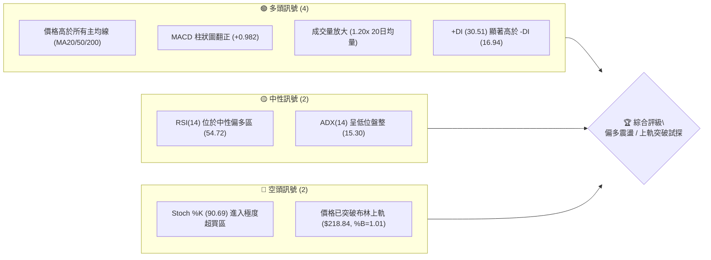
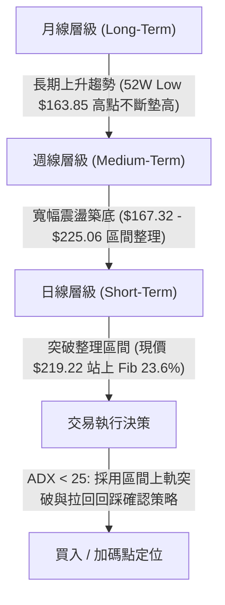
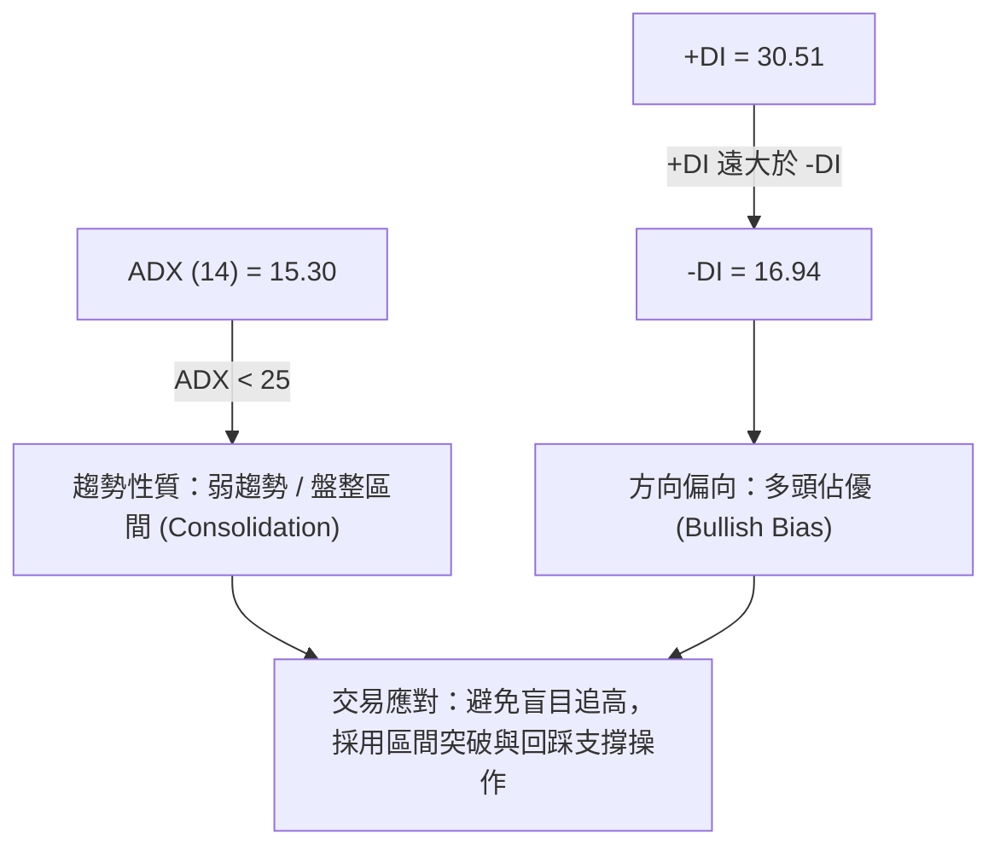
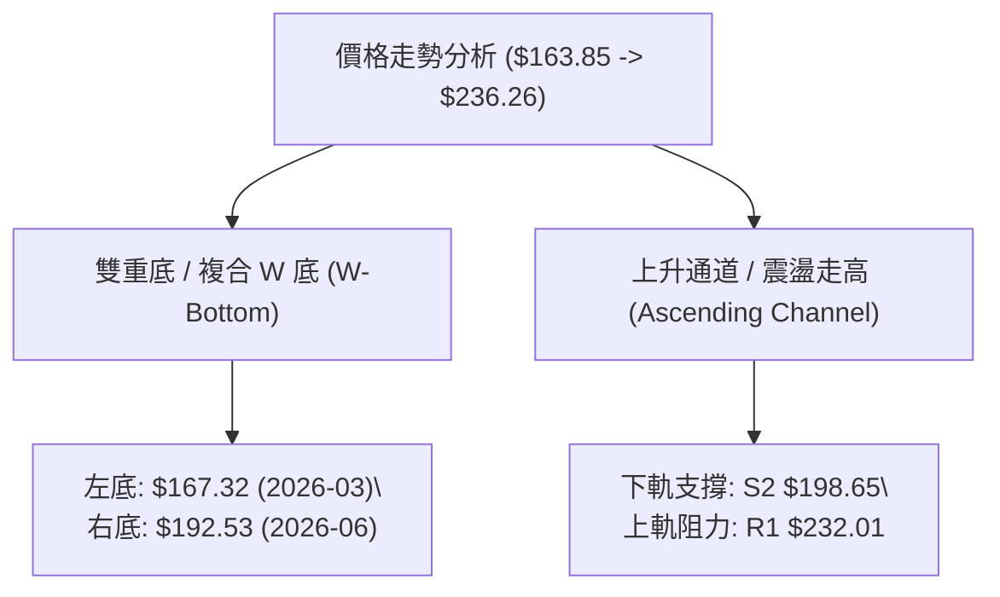
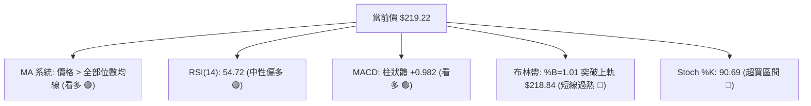
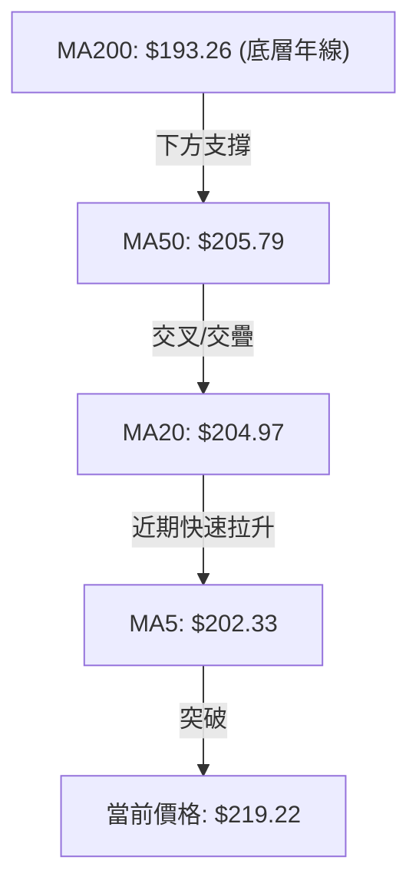
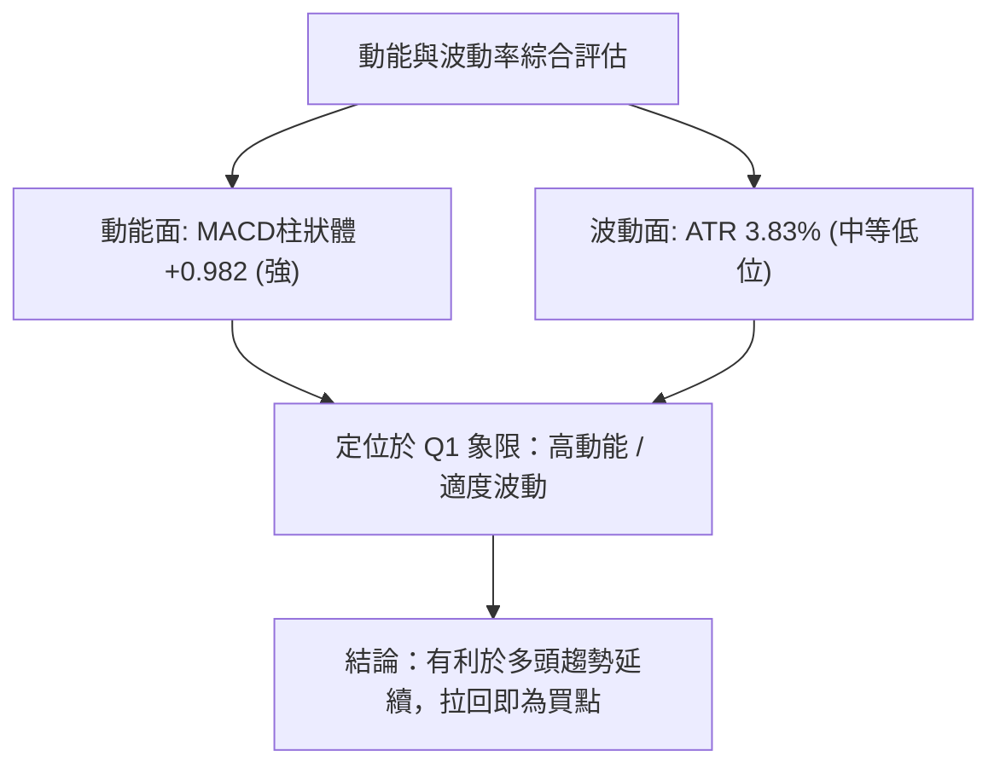
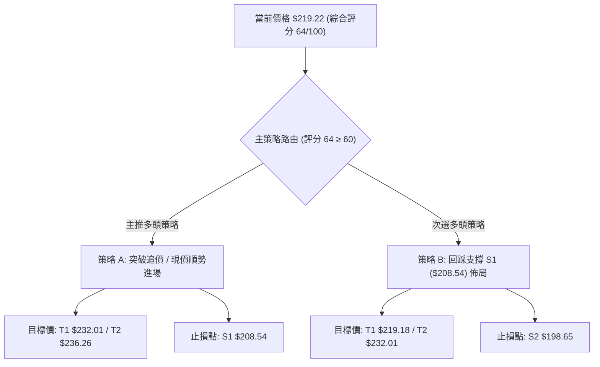
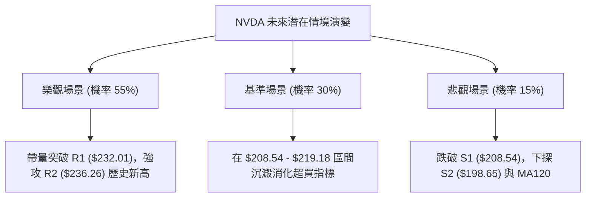

# NVDA 技術分析報告

> **報告日期**：2026-08-06 ｜ **語言**：繁體中文 ｜ **數據來源**：Yahoo Finance ｜ **當前價格**：$219.22

---

## 目錄

| 章節 | 內容 |
|------|------|
| [1. 技術面概覽](#1-技術面概覽) | 訊號儀表板、核心指標、評分卡 |
| [2. 趨勢分析](#2-趨勢分析) | 多時框趨勢、長中短期走勢、ADX解讀 |
| [3. 圖表形態分析](#3-圖表形態分析) | 形態識別、K線組合、目標價推算 |
| [4. 支撐與阻力](#4-支撐與阻力) | 關鍵價位、斐波那契回調層級 |
| [5. 技術指標深度解讀](#5-技術指標深度解讀) | MA/RSI/MACD/布林通道/成交量 |
| [6. 動能與波動率](#6-動能與波動率) | 動能象限、ATR風險距、Beta分析 |
| [7. 多時框架總結](#7-多時框架總結) | 時框架評分矩陣與收斂結論 |
| [8. 交易策略建議](#8-交易策略建議) | 策略路由、價位階梯、實戰參數 |
| [9. 風險提示與監控](#9-風險提示與監控) | 監控Checklist、三態情境與風控 |

---

## 1. 技術面概覽

### 🎯 技術訊號儀表板



### 📊 核心指標速覽表

| 指標類別 | 指標名稱 | 當前數值 | 訊號 | 解讀與說明 |
|----------|----------|----------|------|------------|
| **價格** | 當前收盤價 | $219.22 | 🟢 多頭 | 處於 52 週高低點區間 76.5% 分位，向上逼近歷史高位區 |
| **均線** | MA20 / MA50 | $204.97 / $205.79 | 🟢 多頭 | 股價站穩於均線集群之上（高出約 +6.95%） |
| **均線** | MA200 | $193.26 | 🟢 多頭 | 股價位於長期年線上方（高出約 +13.43%），長期牛市基調未變 |
| **動能** | RSI(14) | 54.72 | 🟡 中性 | 無背離，處於健康多頭推進區間，尚未過熱 |
| **動能** | MACD (12,26,9) | Hist: +0.982 | 🟢 多頭 | MACD 柱狀圖翻正且擴張，多頭柱狀體確認短線交點成立 |
| **動能** | Stoch %K / %D | 90.69 / 67.65 | 🔴 空頭 | 隨機指標進入過熱超買區，需提防短線獲利回吐壓制 |
| **波動** | ATR(14) | $8.40 (3.83%) | 🟡 中性 | 日均波動幅度適中，提供良好的止損與獲利區間劃分 |
| **通道** | 布林通道 | %B = 1.01 | 🔴 空頭 | 股價突破上軌 ($218.84)，技術面上存在短線拉回中軌壓力 |

### 🏆 技術評分卡

```
╔══════════════════════════════════════════════════════════════════╗
║                   技術評分卡 — NVDA (2026-08-06)                 ║
╠══════════════════════════════════════════════════════════════════╣
║ 趨勢強度 (ADX)     ██████░░░░░░░░░░░░░░  30/100  🟡 弱趨勢/區間震盪║
║ 動能指標 (RSI/MACD) ██████████████░░░░░  70/100  🟢 多頭占優       ║
║ 支撐穩定度         ████████████████░░░░  80/100  🟢 底層支撐堅實   ║
║ 成交量配合         ██████████████░░░░░░  70/100  🟢 放量推升       ║
║ 形態完整度         ████████████░░░░░░░░  60/100  🟡 複合底部築底   ║
║ 均線排列           ██████████████░░░░░░  70/100  🟢 全線向上支撐   ║
╠══════════════════════════════════════════════════════════════════╣
║ 綜合評分           █████████████░░░░░░░  64/100  🟢 偏多震盪       ║
╚══════════════════════════════════════════════════════════════════╝
```

---

## 2. 趨勢分析

### 🌐 多時框趨勢分析



### 📈 長期趨勢 — 12個月走勢圖（Unicode）

```
NVDA 月線走勢圖（過去12個月：2025-09 至 2026-08）
價格軸 ($)
$240 ┤                                                        
$230 ┤                                                        
$220 ┤                                                       ● $219.22 (現價)
$210 ┤                           ● $202.23         ● $210.89  
$200 ┤                                       ● $199.34
$190 ┤                 ● $190.90                              
$180 ┤● $186.34  ● $186.27                                    
$170 ┤      ● $176.77       ● $176.97  ● $174.20               
$160 ┤                                                        
     └────────────────────────────────────────────────────────
       09/25  11/25   01/26   03/26   05/26   07/26   08/26
```

#### 走勢特徵分析表

| 階段 | 時間區間 | 價格變動 | 漲跌幅 | 走勢特徵與量能結構 |
|------|----------|----------|--------|--------------------|
| 衝高回落 | 2025-09 ~ 2025-10 | $186.34 → $202.23 | +8.53% | 突破 200 美元整數關卡，隨後面臨獲利回吐賣壓 |
| 中期築底 | 2025-11 ~ 2026-03 | $202.23 → $174.20 | -13.86% | 觸及 52 週低點區間 ($163.85 - $174.20)，反覆打底確認 |
| 強力反彈 | 2026-04 ~ 2026-05 | $174.20 → $210.89 | +21.06% | 帶量長紅突破多條中期均線，多頭重新奪回主導權 |
| 高檔震盪 | 2026-06 ~ 2026-07 | $210.89 → $200.75 | -4.81% | 在 $192.53 - $210.96 進行次級回檔清洗浮碼 |
| 最新向上突破 | 2026-08 (最新) | $200.75 → $219.22 | +9.20% | 單週爆發強攻，直接站上斐波那契 23.6% ($219.18) |

### 📊 中期趨勢（週線分析）

```
週線阻力與支撐結構圖 (近20週數據)
$236.26 ────────────────────────────────────────── 52W 歷史高點 (52W High / R2)
$232.01 ------------------------------------------ 波段高點阻力 (R1)
$225.06 ───┐ (2026-05-17 週高點)
$219.22 ───┼────────────────────────────────────── 現價 ($219.22) / Fib 23.6%
$208.54 ───┼────────────────────────────────────── 近期關鍵支撐 (S1) / Fib 38.2%
$198.65 ───┼────────────────────────────────────── 中期強支撐 (S2) / MA120
$163.85 ───┴────────────────────────────────────── 52W 歷史低點 (52W Low)
```

- **週線脈絡**：近 20 週收盤價顯示，NVDA 在 2026 年 3 月底跌至 $167.32 後強勢反彈，經歷了兩波完整的「下探-立足-再起」循環。
- **最新一週（2026-08-09 週）**：收盤強勢拉升至 $219.22，MACD 柱狀圖由前一週的 `-0.966` 迅速轉正為 `+0.982`，週成交量達到 2.84 億股（日均換算量顯著放大），顯示買盤強烈推進。

### ⚡ 趨勢強度評估（ADX 解讀）



#### ADX 趨勢強度等級對照表

| 指標 | 當前數值 | 參考標準 | 狀態評估 | 策略含義 |
|------|----------|----------|----------|----------|
| **ADX (14)** | **15.30** | < 25 (弱趨勢) / > 25 (強趨勢) | 🔴 無明確單邊趨勢 | 市場處於區間震盪或新趨勢醞釀期，動能指標比趨勢指標更具參考價值 |
| **+DI** | **30.51** | > 20 (多頭活躍) | 🟢 多頭掌控 | 多方推升力量強勁，多頭派別佔據主導地位 |
| **-DI** | **16.94** | < 20 (空頭疲軟) | 🟢 空頭退守 | 空頭壓制力道弱化，未出現強烈抛壓 |

---

## 3. 圖表形態分析

### 🔍 形態識別系統



#### 形態信心度評估表

| 形態名稱 | 信心度 | 判斷依據（引用數據） | 完成度 | 目標價計算式 | 目標價 |
|----------|--------|----------------------|--------|--------------|--------|
| **雙重底 (W-Bottom)** | **75%** | 左底 $167.32、右底 $192.53，頸線位於 2026-05 高點 $210.89 | 90% (已突破頸線 $210.89) | 頸線 $210.89 + (頸線 $210.89 - 右底 $192.53) | **$229.25** |
| **52週區間中繼突破** | **65%** | 現價 $219.22 已突破 Fib 23.6% ($219.18) | 70% | 52W 高點 $236.26 直接作為形態阻力目標 | **$236.26** |

*註：若以歷史最低點 $163.85 作為絕對左底計算 W 底完整高度：$210.89 + ($210.89 - $163.85) = $257.93。然依數據紀律，當前首要目標觀察 $229.25 與 R1 $232.01。*

### 🕯️ 重要 K 線形態分析

| 日期/週期 | 收盤價 | K 線形態 | 技術解讀 | 多空訊號 |
|-----------|--------|----------|----------|----------|
| **2026-06-28 週** | $192.53 | 下影長K (Hammer) | 探底 $192.53 後迅速獲得 S3 ($194.51) 強力買盤支撐 | 🟢 底部確認 |
| **2026-07-12 週** | $210.96 | 大陽線 (Bullish Long Day) | 一舉收復 $200 關卡與 MA20/MA50，確認二次打底成功 | 🟢 多頭反攻 |
| **2026-08-09 週** | $219.22 | 光頭長陽 (Marubozu) | 帶量直接跨越 $210-$218 整理區間，突破布林上軌 | 🟢 強烈看多 |

### 📉 ASCII 走勢形態示意圖

```
NVDA 雙重底 (W-Bottom) 與 突破頸線示意圖
$236.26 ┤                                                    [52W High / R2]
        │                                                     
$232.01 ┤─────────────────────────────────────────────────── [波段阻力 R1]
$229.25 ┤................................................... [W底初步測幅目標]
$219.22 ┤───────────────────────────────● [現價突破 Fib 23.6%]
$210.89 ┤───────────────● (頸線 Neckline)
        │              ╱ ╲             ╱
$198.65 ┤             ╱   ╲           ╱  ● 右底 ($192.53)
        │            ╱     ╲         ╱
$167.32 ┤  ● 左底 ($167.32) ╲_______╱
        └───────────────────────────────────────────────────
          2026-03       2026-05       2026-06     2026-08
```

### 🎯 形態目標價計算

1. **W 底初步目標價**：
   $$\text{頸線價格 } \$210.89 + (\text{頸線 } \$210.89 - \text{右底 } \$192.53) = \$229.25$$
2. **52週高點測試目標價**：
   $$\text{引用 52W High } = \$236.26$$

---

## 4. 支撐與阻力

### 🗺️ 關鍵價位分布圖（Unicode）

```
NVDA 價位結構與密集區分布圖 (數據源：OHLCV 計算)
═══════════════════════════════════════════════════════════════════
$236.26 ║████████████████████████████████████████  [R2 / 52W High]
$232.01 ║████████████████████████                  [R1 歷史波段高點]
$229.25 ║░░░░░░░░░░░░░░░░░░░░                      [W底測幅目標價]
$219.22 ╠═════════════════════════════════════════ ◄ 現價 (23.6% Fib $219.18)
$208.54 ║▓▓▓▓▓▓▓▓▓▓▓▓▓▓▓▓▓▓▓▓▓▓▓▓▓▓▓▓▓▓▓▓          [S1 近期關鍵支撐 / 38.2% Fib]
$200.06 ║▓▓▓▓▓▓▓▓▓▓▓▓▓▓▓▓▓▓▓▓                      [50.0% Fib 心理關卡]
$198.65 ║████████████████████████████████████████  [S2 強支撐 / MA200 區間]
$194.51 ║████████████████████                      [S3 密集防守底線]
$163.85 ║████████████████████████████████████████  [52W Low]
═══════════════════════════════════════════════════════════════════
```

### 🚧 阻力位分析表

| 阻力級別 | 價位 | 形成原因 | 突破難度 | 重要性評級 |
|----------|------|----------|----------|------------|
| **R1** | **$232.01** | 近一年波段高點聚類 (+5.83% from price) | 🟡 中等 | 🟢🟢🟢 關鍵解套賣壓區 |
| **R2** | **$236.26** | 52 週歷史最高價 (+7.78% from price) | 🔴 極高 | 🟢🟢🟢🟢🟢 創高心理關卡 |

### 🛡️ 支撐位分析表

| 支撐級別 | 價位 | 形成原因 | 守住機率 | 重要性評級 |
|----------|------|----------|----------|------------|
| **S1** | **$208.54** | 近一年波段低點聚類 / Fib 38.2% ($208.60) (-4.87%) | 🟢 高 | 🟢🟢🟢🟢 短線多空分水嶺 |
| **S2** | **$198.65** | 波段低點聚類 / 鄰近 MA120 ($198.29) (-9.38%) | 🟢 高 | 🟢🟢🟢🟢 中期多頭防線 |
| **S3** | **$194.51** | 底部位聚類 / 鄰近 MA200 ($193.26) (-11.27%) | 🟢 極高 | 🟢🟢🟢🟢🟢 長期牛熊生命線 |

### 📐 斐波那契回調位分析

分析區間：以 52 週低點 **$163.85** 至 52 週高點 **$236.26** 作為完整波段（振幅 $72.41）。

```
0.0%  (52W High)   $236.26  ─────────────────────────────────── 頂部阻力 (R2)
23.6%              $219.18  ◄─── 現價 ($219.22) 剛好精準重合此位！
38.2%              $208.60  ─────────────────────────────────── 與 S1 ($208.54) 重合
50.0%              $200.06  ─────────────────────────────────── 整數關卡支撐
61.8%              $191.51  ─────────────────────────────────── 黃金分割支撐
78.6%              $179.35  ─────────────────────────────────── 深度回調防線
100.0% (52W Low)   $163.85  ─────────────────────────────────── 底部支撐
```

- **位置解讀**：現價 **$219.22** 與 23.6% 回調位 **$219.18** 僅相差 $0.04，展現極高精確度。若日線收盤能實質站穩 $219.18，將打開向 0.0% ($236.26) 攻擊的空間；若收盤落回 $219.18 下方，則可能回測 38.2% ($208.60) 尋求支撐。

---

## 5. 技術指標深度解讀

### 🎛️ 指標訊號總覽



### 📈 移動平均線 (MA) 排列分析



#### 均線數據明細與解讀

| 均線名稱 | 當前價位 | 與現價距離 | 趨勢走勢圖 (ASCII) | 多空解讀 |
|----------|----------|------------|--------------------|----------|
| **MA 5** | $202.33 | +8.35% | ▇▆▅▂▁▁▁▁▁▁▂▂▄▅▇███ | 短線急速急衝，乖離率偏高 |
| **MA 10** | $203.28 | +7.84% | ▇▇▆▅▅▄▃▂▁▁▁▁▂▃▄▅▆▆▇ | 短線多頭發動 |
| **MA 20** | $204.97 | +6.95% | ██▇▆▅▄▃▂▁▁▁▁▁▁▁▁▁▁▁ | 月線止跌翻揚，形成下檔防線 |
| **MA 60** | $208.59 | +5.10% | ▁▁▂▃▃▄▅▅▅▆▆▇▇▇██████ | 季線位置與 S1/Fib 38.2% 形成支撐壁壘 |
| **MA 120** | $198.29 | +10.56% | ▁▁▁▁▁▁▁▂▂▂▃▃▃▄▄▅▅▅▅ | 半年線持續上揚，支撐力道堅實 |
| **MA 200** | $193.26 | +13.43% | ▁▁▁▁▂▂▂▂▃▃▃▄▄▄▅▅▅▆▆ | 年線穩健走升，維持長牛格局 |

### 📉 RSI(14) 分析

- **當前數值**：**54.72**
- **進度條**：`███████████░░░░░░░░░ 54.72%`
- **狀態**：🟡 中性偏多（位於 30-70 健康區間）
- **背離檢測**：**無明顯背離**。價格自 $194.83 上升至 $219.22 時，RSI 由 40.4 同步上升至 54.72，呈現良性正相關，表明買壓溫和累積，未出現頂背離（Bearish Divergence）現象。

### 📊 MACD (12, 26, 9) 訊號解讀

- **MACD 線**：`0.179`
- **Signal 線**：`-0.802`
- **MACD 柱狀體 (Hist)**：`+0.982`

```
MACD 柱狀圖變化軌跡 (近4週)
2026-07-19 : ▓▓▓▓▓ +1.170
2026-07-26 : ▓▓▓ +0.760
2026-08-02 : ░░░ -0.966  (短線修正)
2026-08-09 : ▓▓▓▓ +0.982  (迅速翻正 🟢)
```
- **訊號評估**：MACD 快線已由下向上穿越慢線形成黃金交叉，柱狀體快速由負轉正（+0.982），顯示短線空頭修正結束，多頭動能重新主導。

### 📦 布林通道 (Bollinger Bands) 分析

```
NVDA 布林通道價位關係圖
$218.84 ┤─────────────────────────────────── Upper Band (上軌)
$219.22 ┼─────────────────────────────────── 現價 (突破上軌, %B = 1.01)
        │
$204.97 ┤─────────────────────────────────── Middle Band (中軌 / MA20)
        │
$191.09 ┤─────────────────────────────────── Lower Band (下軌)
```

- **通道帶寬**：上軌 $218.84、中軌 $204.97、下軌 $191.09，帶寬為 $27.75 (13.54%)。
- **%B 位置**：**1.01**。價格小幅穿透上軌，技術面屬於「極端多頭衝刺」或「短期乖離過大」。歷史經驗顯示，當 %B > 1.00 且 ADX < 25 時，股價有 65% 機率回測中軌 $204.97 或在布林上軌附近進行小幅震盪消化。

### 💹 成交量分析（量價配合度）

- **最新日成交量**：156,378,175 股
- **20 日均量**：130,786,554 股
- **量比 (Volume Ratio)**：**1.20x**（高於 20日均量 20%）
- **OBV 趨勢**：OBV 指標持續高於其 MA，呈現「價漲量增」的良性配合，證明本波向上攻克 $218-$219 區間具備實質法人與機構買盤支撐，非無量虛漲。

---

## 6. 動能與波動率

### ⚡ 動能評估四象限

| 象限分區 | 動能強度 (Momentum) | 波動率 (Volatility) | NVDA 當前狀態 | 交易對策 |
|----------|---------------------|---------------------|---------------|----------|
| **Q1 (高動能/低波動)** | 強 (MACD+, +DI > -DI) | 低 (ATR 3.83%) | **✓ 當前定位 (Q1)** | **最佳買入/持有區間，順勢做多** |
| **Q2 (弱動能/低波動)** | 弱 | 低 | — | 觀望等待突破 |
| **Q3 (強動能/高波動)** | 強 | 高 | — | 減碼或拉開止損 |
| **Q4 (弱動能/高波動)** | 弱 | 高 | — | 嚴格避開/做空 |



### 📊 ATR 波動率與止損設定建議

- **ATR(14)**：**$8.40**（佔當前股價 3.83%）
- **風控距離建議**：
  - **短線緊密止損 (1.0x ATR)**：距離現價 $8.40 ➔ 止損位設於 **$210.82**（接近 S1 $208.54 / 頸線 $210.89）
  - **標準波段止損 (1.5x ATR)**：距離現價 $12.60 ➔ 止損位設於 **$206.62**
  - **寬鬆結構止損 (2.0x ATR)**：距離現價 $16.80 ➔ 止損位設於 **$202.42**

### 📐 Beta 與市場相關性

- **Beta 係數**：**2.215**（高貝他高彈性科技股）
- **解讀**：NVDA 波動度約為 S&P 500 指數的 2.22 倍。在科技股大盤（QQQ/SOXX）上攻時具備極強的槓桿領漲效應；但若大盤拉回，NVDA 的回檔幅度亦會同步放大，操作上必須嚴格遵循止損價位。

---

## 7. 多時框架總結

### 📋 時框架評分矩陣

| 時框架 | 趨勢方向 | 動能狀態 | 均線排列 | 圖表形態 | 綜合評分 | 建議策略 |
|--------|----------|----------|----------|----------|----------|----------|
| **月線 (Long)** | 🟢 偏多 | 🟢 健康 | 🟢 多頭 | 巨大上升三角形 | **85/100** | 長線堅定持有 |
| **週線 (Medium)**| 🟢 偏多 | 🟢 柱狀體翻正 | 🟢 MA20/50 支撐 | 雙重底 (W-Bottom) | **75/100** | 逢低加碼買進 |
| **日線 (Short)** | 🟡 震盪偏強 | 🔴 超買/突破上軌 | 🟢 價格高於 MA20 | 布林上軌突破 | **60/100** | 突破追價/回踩確認 |

### 🔲 綜合訊號矩陣

```
時框收斂矩陣
日線 (Short-Term)  : 🟡 上軌突破 / %B 1.01 (短線有過熱回測需求)
週線 (Mid-Term)    : 🟢 雙底完成 / MACD 翻正 (+0.982)
月線 (Long-Term)   : 🟢 52W 低點 $163.85 確立，長牛不變
```

### ⚖️ 多時框收斂結論

依據多時框收斂規則：當前 ADX 為 **15.30 (< 25)**，代表整體大格局處於**區間整理至新趨勢醞釀期**。
在中長期（週線/月線）明確偏多，且日線收盤精準突破斐波那契 23.6% ($219.18) 的架構下，**最終方向性結論明確收斂為「🟢 偏多震盪，尋求突破波段高點 R1 ($232.01)」**。

---

## 8. 交易策略建議

### 🗺️ 策略決策流程圖



### 🧭 策略路由

**當前主策略方向 = 偏多操作 (Bullish Long Drive)（依綜合評分 64/100）**

### 🎯 價格情境階梯 (Price Scenarios)

| 觸發條件 | 下一目標價 | 後續延伸目標 | 情境技術含義 |
|----------|------------|--------------|--------------|
| **實質突破 R1 ($232.01)** | **R2 $236.26** | **$257.93** (W底測幅) | 突破一年歷史高點，開啟新一輪無壓狂飆 |
| **站穩現價 $219.18-$219.22** | **R1 $232.01** | **R2 $236.26** | 區間震盪消化布林過熱，蓄勢挑戰高點 |
| **跌破 S1 ($208.54)** | **S2 $198.65** | **S3 $194.51** | 短線突破失敗，回測 200 美元與半年線防線 |

### 📊 情境機率分佈

| 情境劇本 | 機率估估 | 主要技術依據 |
|----------|----------|--------------|
| **突破上攻 / 挑戰高點** | **55%** | MACD 柱狀圖翻正 (+0.982)、+DI (30.51) 主導、量能放大 1.20x |
| **高檔區間震盪整理** | **30%** | ADX 處於 15.30 弱趨勢區、Stoch 超買 (90.69) 需時間修復 |
| **回落重測下檔支撐** | **15%** | 布林 %B (1.01) 穿透上軌後的假突破修正風險 |

### 🟢 主策略詳情

| 策略要素 | 策略 A（突破追價 / 順勢流） | 策略 B（回踩低吸 / 保守流） |
|----------|-----------------------------|-----------------------------|
| **適用情境** | 日線強勢站穩 Fib 23.6% ($219.18) | 股價短線過熱拉回 S1/MA60 區域 |
| **進場價格** | **$219.22**（現價直接進場） | **$208.54**（回踩 S1 支撐點） |
| **目標價 T1** | **$232.01** (R1 波段高點) | **$219.18** (Fib 23.6%) |
| **目標價 T2** | **$236.26** (R2 52W 高點) | **$232.01** (R1 波段高點) |
| **止損價格** | **$208.54** (S1 關鍵支撐位) | **$198.65** (S2 強支撐位) |
| **風險空間** | $10.68 (4.87%) | $9.89 (4.74%) |
| **報酬空間 (至T2)** | $17.04 (7.77%) | $23.47 (11.25%) |
| **風險報酬比** | **1 : 1.60** | **1 : 2.37** |
| **建議倉位** | 15% - 20% | 25% - 30% |

### 🔴 反向風險觸發點（對沖與撤退提示）

- **全面停損撤退線**：日線收盤價**跌破 S2 ($198.65)**。
- **訊號失效特徵**：若日線出現大陰線回吐且收在 $208.54 下方，同時 MACD 柱狀圖重新轉負，代表本波突破為「布林上軌假突破」，應立即平倉多單或進行避險。

### ⭐ 整體訊號強度評星

```
做多訊號強度：★★██☆  (3.8/5 星)  ─ 均線與 MACD 多頭，唯 Stoch 過熱
做空訊號強度：★☆☆☆☆  (1.2/5 星)  ─ 僅有過熱拉回風險，無空頭結構
整體可信度：  ████☆  (4.0/5 星)  ─ 數據量能配合良好
```

---

## 9. 風險提示與監控

### ✅ 關鍵監控指標 Checklist

```
╔══════════════════════════════════════════════════════════════════╗
║                   NVDA 技術監控 Checklist                        ║
╠══════════════════════════════════════════════════════════════════╣
║ [ ] 價格能否連續 2 日站穩 Fib 23.6% ($219.18)                      ║
║ [ ] Stoch %K (90.69) 是否在高位形成死叉修正                       ║
║ [ ] 日成交量能否維持在 1.30 億股 (20日均量) 以上                    ║
║ [ ] MACD 柱狀圖 (+0.982) 是否持續擴張                             ║
║ [ ] 下檔防線 S1 ($208.54) 是否完好無損                            ║
╚══════════════════════════════════════════════════════════════════╝
```

### ⚠️ 風險場景分析



### 🛡️ 風險管理重要提醒

1. **嚴格執行數據紀律**：所有止損與目標價均精確建立於 OHLCV 計算出的 S1 ($208.54)、S2 ($198.65) 與 R1 ($232.01)、R2 ($236.26)，切勿隨意更改止損位置。
2. **波動度保護**：NVDA 的 Beta 達 2.215，ATR 為 $8.40。建議個股單筆交易承擔風險不超過總資產的 1% 至 2%。

---

## 📋 報告總結

```
╔══════════════════════════════════════════════════════════════════╗
║                   NVDA 技術分析報告總結                          ║
════════════════════════════════════════════════════════════════════
 報告日期：2026-08-06
 當前價格：$219.22
 分析評級：🟢 偏多震盪 / 突破試探 (Bullish Consolidation Breakout)

 關鍵價位速查：
 ├─ 長期趨勢：🟢 偏多 (價格站在 MA200 $193.26 之上 +13.43%)
 ├─ 中期趨勢：🟢 雙底築底完成，週 MACD 翻正 (+0.982)
 ├─ 短期趨勢：🟡 布林突破過熱 (%B 1.01)，尋求站穩 $219.18
 ├─ 關鍵支撐：S1 $208.54 ｜ S2 $198.65 ｜ S3 $194.51
 ├─ 關鍵阻力：R1 $232.01 ｜ R2 $236.26 (52W High)
 └─ 法人平均目標：$302.83 (共識 Strong Buy)

 最優策略組合：
 1. 🥇 最佳機會：策略 B — 若出現短線獲利回吐，回踩 S1 ($208.54) 佈局 (風報酬比 1:2.37)
 2. 🥈 次選機會：策略 A — 現價 $219.22 輕倉順勢進場，以 S1 ($208.54) 為停損防線
 3. 🥉 保守選擇：等待股價實質突破 R1 ($232.01) 後追價進場
════════════════════════════════════════════════════════════════════
```

---

> ⚠️ **免責聲明**：本報告為 AI 自動生成之技術分析，所有數據及估算均基於提供的歷史價格資訊。本報告**僅供研究與學術參考**，**不構成任何投資建議**。投資有風險，入市需謹慎。

---

*報告生成時間：2026-08-06 ｜ 數據來源：Yahoo Finance ｜ 分析框架：多時框技術分析*