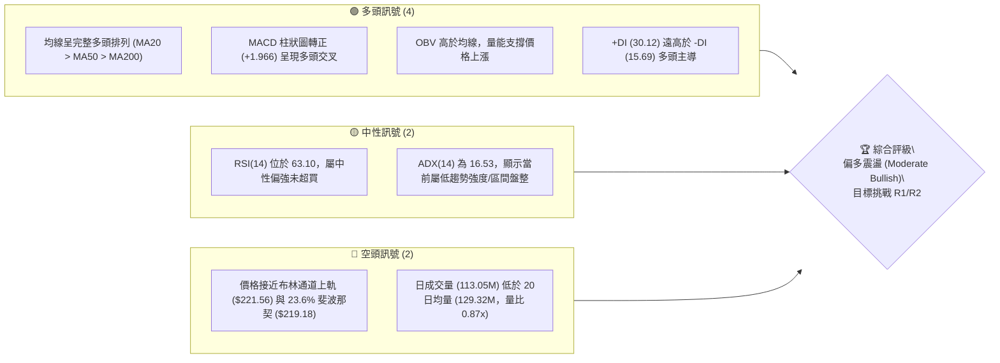
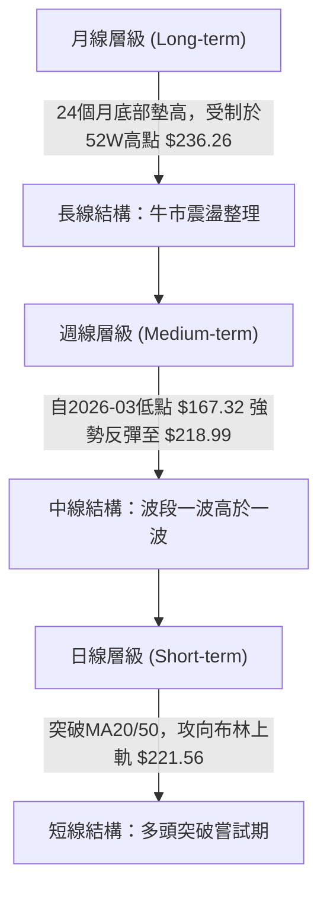
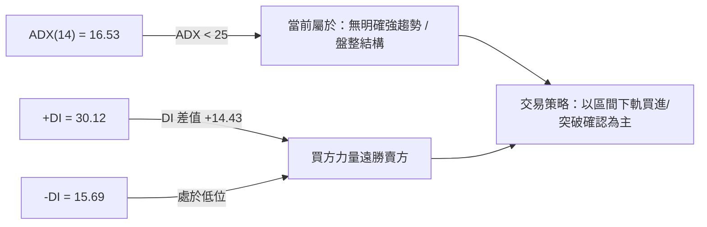
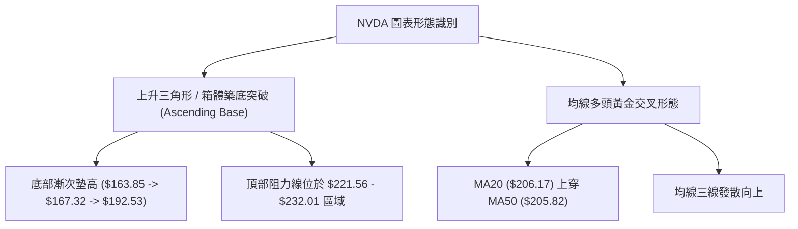
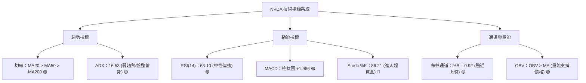
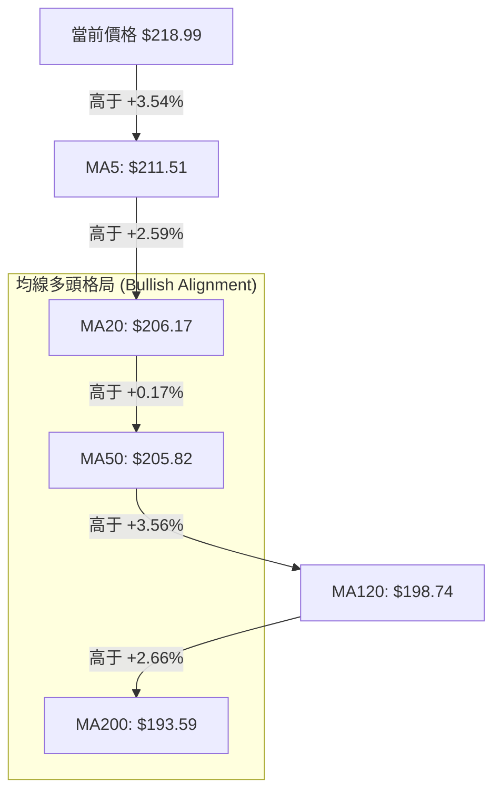
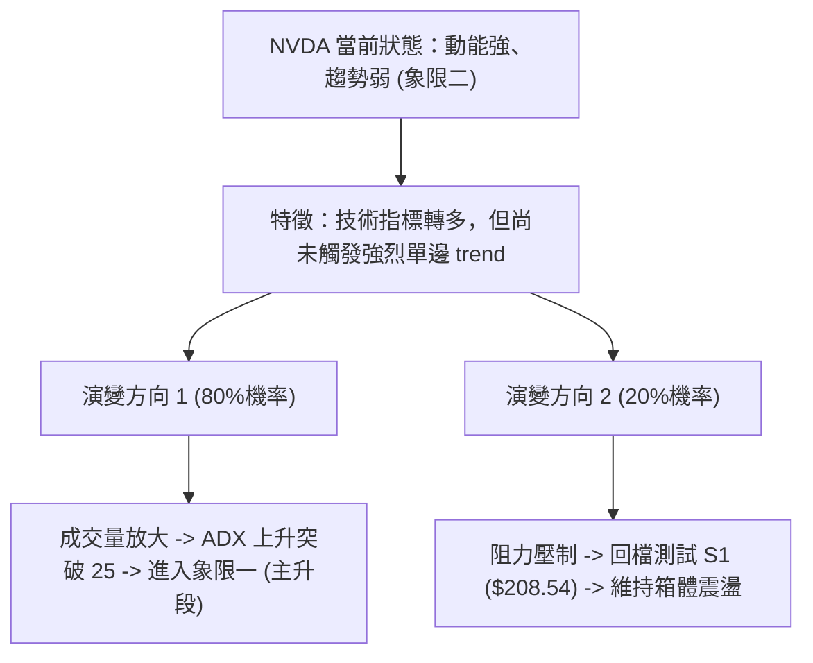
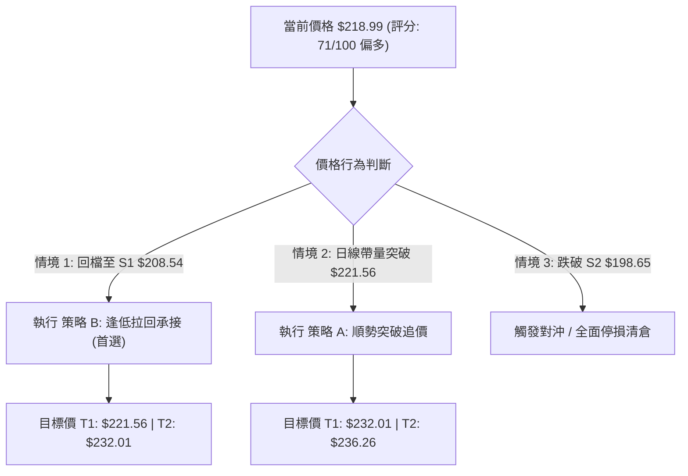
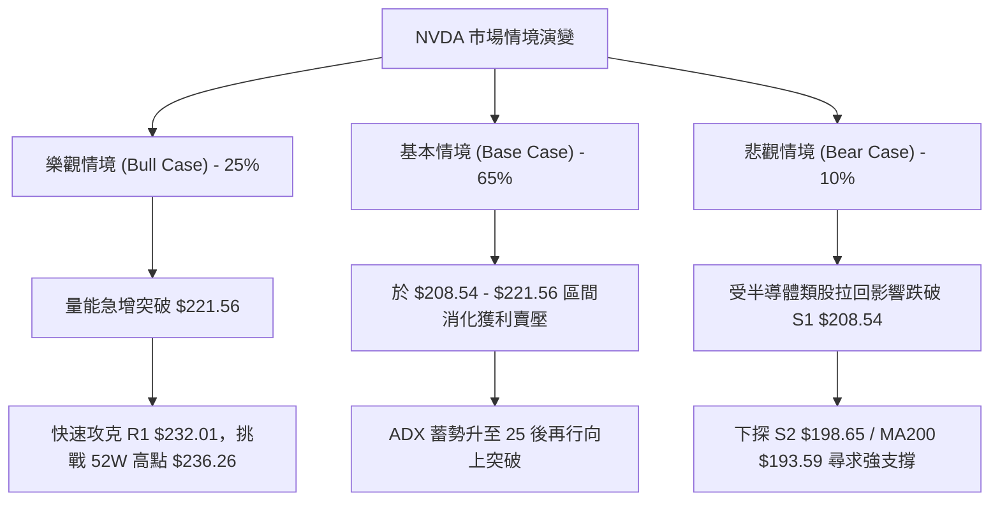

# NVDA 技術分析報告

> **報告日期**：2026-08-07 ｜ **語言**：繁體中文 ｜ **數據來源**：Yahoo Finance ｜ **當前價格**：$218.99

---

## 目錄

| 章節 | 內容 |
|------|------|
| [1. 技術面概覽](#1-技術面概覽) | 訊號儀表板、核心指標、評分卡 |
| [2. 趨勢分析](#2-趨勢分析) | 多時框趨勢、長中短期走勢、ADX強弱評估 |
| [3. 圖表形態分析](#3-圖表形態分析) | 形態識別、信心度評估、K線組合與目標價推算 |
| [4. 支撐與阻力](#4-支撐與阻力) | 關鍵價位結構、斐波那契回調層級解讀 |
| [5. 技術指標深度解讀](#5-技術指標深度解讀) | MA均線矩陣、RSI、MACD、布林通道與OBV量能 |
| [6. 動能與波動率](#6-動能與波動率) | 動能狀態評估、ATR波動距與Beta敏感度 |
| [7. 多時框架總結](#7-多時框架總結) | 多時框評分矩陣與訊號收斂結論 |
| [8. 交易策略建議](#8-交易策略建議) | 策略路由、情境階梯、進出場與風險報酬比 |
| [9. 風險提示與監控](#9-風險提示與監控) | 監控Checklist、三情境演變與風控法則 |

---

## 1. 技術面概覽

### 🎯 技術訊號儀表板



### 📊 核心指標速覽表

| 指標類別 | 指標名稱 | 當前數值 | 訊號 | 解讀 |
|----------|----------|----------|------|------|
| **價格** | 當前價格 | $218.99 | 🟢 | 位於52週區間 76.1% 位置，自近期低點回升 |
| **均線** | MA20 | $206.17 | 🟢 | 價格在 MA20 上方 (+6.22%)，短期均線向上 |
| **均線** | MA50 | $205.82 | 🟢 | 價格在 MA50 上方 (+6.40%)，中期趨勢支撐 |
| **均線** | MA200 | $193.59 | 🟢 | 價格在 MA200 上方 (+13.12%)，長期牛熊分界線看多 |
| **動能** | RSI(14) | 63.10 | 🟢 | 健康多頭動能區間，未進入 70 以上極端超買 |
| **動能** | MACD | +1.966 | 🟢 | MACD線(1.904)突破訊號線(-0.062)，柱狀圖擴張 |
| **趨勢** | ADX(14) | 16.53 | 🟡 | ADX < 25 表示處於盤整或新趨勢醞釀期 |
| **波動** | ATR(14) | $7.79 | 🟡 | 占股價 3.56%，每日平均波動區間尚屬溫和 |
| **通道** | BB %B | 0.92 | 🟡 | 價格緊貼布林通道上軌 ($221.56)，短線面臨軌道壓制 |

### 🏆 技術評分卡

```
╔══════════════════════════════════════════════════════════════════╗
║                技術評分卡 — NVDA (2026-08-07)                   ║
╠══════════════════════════════════════════════════════════════════╣
║ 趨勢強度      ████████░░░░░░░░░░░░  40/100  🟡 盤整醞釀      ║
║ 動能指標      ███████████████░░░░░  75/100  🟢 多頭占優      ║
║ 支撐穩定度    ████████████████░░░░  80/100  🟢 均線聚攏支撐  ║
║ 成交量配合    ████████████░░░░░░░░  60/100  🟡 量能略顯不足  ║
║ 形態完整度    ██████████████░░░░░░  70/100  🟢 震盪打底完成  ║
║ 均線排列      ████████████████████  100/100 🟢 完美多頭排列  ║
╠══════════════════════════════════════════════════════════════════╣
║ 綜合評分      ██████████████░░░░░░  71/100  🟢 偏多看好      ║
╚══════════════════════════════════════════════════════════════════╝
```

---

## 2. 趨勢分析

### 🌐 多時框趨勢分析



### 📈 長期趨勢 — 12個月走勢圖（Unicode）

```
NVDA 月線走勢圖（2025-08 至 2026-08）
價格軸 ($)
$240 ┤                                                          
$225 ┤                                                  ● (2026-08: $218.99)
$210 ┤                                      ● (2026-05)  
$195 ┤                      ● (2025-10)          
$180 ┤              ● (2025-09)      
$165 ┤      ● (2025-08)      
$150 ┤                                
$135 ┤  ● (2025-05: $134.94)                                
$120 ┤● (2024-08)                                          
$105 ┤    ● (2025-03低點: $108.23)                        
     └──────────────────────────────────────────────────────────
       M1  M2  M3  M4  M5  M6  M7  M8  M9 M10 M11 M12 (2026-08)
```

**走勢特徵分析表格**：

| 階段 | 時間區間 | 首尾價格 | 變動幅度和特徵 |
|------|----------|----------|----------------|
| **打底爆發期** | 2025-03 ～ 2025-07 | $108.23 → $177.63 | 漲幅 **+64.1%**，完成歷史性築底，量能急遽放大 |
| **高位震盪期** | 2025-08 ～ 2026-03 | $173.95 → $174.20 | 進入寬幅洗盤，期間最高攻克 $202.23，隨後拉回測試 $163.85 (52W Low) |
| **主升段起漲期**| 2026-04 ～ 2026-08 | $199.34 → $218.99 | 上漲 **+9.8%**，向上突破 $210 大關，直逼歷史高點區間 |

### 📊 中期趨勢（週線分析）

```
週線支撐與壓力結構示意圖
$236.26 ────────────────────────────────────── 52W 歷史高點 (R2 強壓)
$232.01 ────────────────────────────────────── 波段高點聚類壓 (R1)
$218.99 ══════════════════════════════════════ 現價 (測試 Fib 23.6%)
$208.54 ────────────────────────────────────── 近期突破支撐線 (S1 / Fib 38.2%)
$198.65 ────────────────────────────────────── MA120/中期關鍵支撐 (S2)
```

近期 20 週數據顯示，NVDA 於 2026-03-29 觸及 $167.32 週線低點後，展開 V 型反彈，於 2026-05-17 攻高至 $225.06，隨後回檔至 $192.53 (2026-06-28 週) 完成二次測底。最新一週（2026-08-09）收盤價暴漲至 $218.99，MACD 柱狀圖由負轉正達 +1.966，顯示中期多頭動能再度重新聚集。

### ⚡ 趨勢強度評估（ADX 解讀）



**ADX 趨勢強度對照表**：

| ADX 數值區間 | 當前狀態 | 技術面含義 | 適用交易策略 |
|--------------|----------|------------|--------------|
| 0 - 20 | **16.53 (當前)** | **弱趨勢 / 盤整蓄勢** | 布林通道高拋低吸，或等待突破箱體 |
| 20 - 25 | - | 趨勢初萌芽期 | 順勢逢回加碼 |
| 25 - 50 | - | 強勁趨勢行情 | 持股續抱、讓利潤奔跑 |
| > 50 | - | 極端趨勢 / 隨時面臨反轉 | 嚴格停利、警惕暴撤 |

---

## 3. 圖表形態分析

### 🔍 形態識別系統



**形態信心度評估表**：

| 形態名稱 | 信心度 | 判斷依據（引用數據） | 完成度 | 目標價計算與數值 |
|----------|--------|----------------------|--------|------------------|
| **上升底座突破 (Ascending Base)** | **75%** | 低點自 $163.85 ($192.53) 向上抬升，且現價突破箱體中軸 | 85% | 由形態高度推算：上軌 $221.56 + (上軌 $221.56 - 下軌 $190.77) = **$252.35** |
| **均線多頭排列 (MA Alignment)** | **90%** | MA20 ($206.17) > MA50 ($205.82) > MA200 ($193.59) | 100% | 指標型形態，無直接幾何測算 |
| **雙重底 (W-Bottom)** | **45%** | 2026-03 低點 $167.32 與 2026-06 低點 $192.53 價差較大 | 40% | *信心度 < 50%，數據不足不強行測算* |

### 🕯️ 重要 K 線形態分析

| 日期/週期 | 收盤價 | K線形態 | 解讀 | 訊號 |
|-----------|--------|---------|------|------|
| **2026-06-28 (週)** | $192.53 | 探底長下影線 | 於 S3 ($194.51) 與 MA200 附近獲得強烈買盤支撐 | 🟢 底訊 |
| **2026-07-12 (週)** | $210.96 | 長陽實體突破 | 一舉收復 MA20/MA50，扭轉短期劣勢 | 🟢 強勢 |
| **2026-08-09 (週)** | $218.99 | 大陽線高位收盤 | 週漲幅 +9.08%，實體收於最高點附近，買盤強勁 | 🟢 極強 |

### 📉 ASCII 走勢形態示意圖

```
NVDA 日線上升三角形 (Ascending Triangle) 與突破結構
$236.26 ┤                                              [52W High]
$232.01 ┤.............................................. [R1 頸線阻力]
$221.56 ┤.................................┌───┐........ [BB上軌/衝刺區]
$218.99 ┤─────────────────────────────────┼─●─┼──────── [現價位置]
$208.54 ┤                        ┌───┐    └───┘
$200.00 ┤            ┌───┐       │   │
$190.77 ┤    ┌───┐   │   │   ┌───┘   └─── [下軌趨勢支撐線]
        └────┴───┴───┴───┴───┴───────────────
             低點1    低點2   低點3 (底座墊高)
             163.85   167.32  192.53
```

### 🎯 形態目標價計算

1. **第一階段目標價（波段高點阻力 R1）**：**$232.01** （由 OHLCV 歷史高點聚類得出）。
2. **第二階段目標價（52週最高價 R2）**：**$236.26** （52週最高點，距離現價 +7.89%）。
3. **形態推算延伸目標價（由箱體高度推推）**：
   $$\text{目標價} = \text{布林上軌/突破點 } \$221.56 + (\text{上軌 } \$221.56 - \text{下軌 } \$190.77) = \$221.56 + \$30.79 = \mathbf{\$252.35}$$

---

## 4. 支撐與阻力

### 🗺️ 關鍵價位分布圖（Unicode）

```
NVDA 價位結構與密集度分布圖
═══════════════════════════════════════════════════════════════
$236.26 ║████████████████████████████████  52W 歷史最高點 (R2)
$232.01 ║██████████████████████            近一年高點密集區 (R1)
$221.56 ║██████████████                    布林通道上軌壓制
$219.18 ║██████████                        斐波那契 23.6% 回調位
$218.99 ╠═════════════════════════════════ ◄ 當前價格位置
$208.60 ║▓▓▓▓▓▓▓▓▓▓▓▓▓▓▓▓▓▓▓▓▓▓▓▓          斐波那契 38.2% 回調位
$208.54 ║▓▓▓▓▓▓▓▓▓▓▓▓▓▓▓▓▓▓▓▓▓▓▓▓▓▓▓▓      近一年關鍵支撐 (S1) / MA20/50
$200.06 ║████████████████                  斐波那契 50.0% 回調位
$198.65 ║██████████████████████            波段低點聚類支撐 (S2) / MA120
$194.51 ║██████████████████████████        強支撐區 (S3) / MA200 ($193.59)
$163.85 ║████████████████████████████████  52W 歷史最低點
═══════════════════════════════════════════════════════════════
```

### 🚧 阻力位分析表

| 阻力級別 | 精確價位 | 形成原因 | 突破難度 | 重要性 |
|----------|----------|----------|----------|--------|
| **R1** | **$232.01** | 近一年波段高點聚類區，獲利解套賣壓密集 | 🟡 中等 | ★★★★☆ |
| **R2** | **$236.26** | 52週最高點，極強心理與技術面關卡 | 🔴 極高 | ★★★★★ |

### 🛡️ 支撐位分析表

| 支撐級別 | 精確價位 | 形成原因 | 守住機率 | 重要性 |
|----------|----------|----------|----------|--------|
| **S1** | **$208.54** | 波段低點聚類、MA20 ($206.17)、MA50 ($205.82) 與 Fib 38.2% ($208.60) 三重交會 | 🟢 85% | ★★★★★ |
| **S2** | **$198.65** | 近期回檔低點聚類、MA120 ($198.74) 與 Fib 50% ($200.06) 支撐 | 🟢 75% | ★★★★☆ |
| **S3** | **$194.51** | 波段防禦大本營、MA200 ($193.59) 與 Fib 61.8% ($191.51) 鐵板區 | 🟢 90% | ★★★★★ |

### 📐 斐波那契回調位分析

*以 52 週高低點區間（高點 $236.26，低點 $163.85，總波幅 $72.41）進行精確對應*：

| 比例 | 精確價位 | 當前相對位置與技術含義 |
|------|----------|------------------------|
| **0.0% (52W High)** | $236.26 | 頂部目標與極致阻力 |
| **23.6%** | **$219.18** | **◄ 現價 ($218.99) 剛好卡在 23.6% 關卡下邊緣**，若日線實體突破此位，將開啟直奔 $232 之路 |
| **38.2%** | **$208.60** | **黃金回調第一支撐**，與 S1 ($208.54) 重合，為多頭強弱分界線 |
| **50.0%** | **$200.06** | 中軸多空平衡點，與 S2 ($198.65) 相互呼應 |
| **61.8%** | **$191.51** | 黃金分割強支撐區，與 MA200 ($193.59) 構成多頭最後防線 |
| **78.6%** | $179.35 | 深幅回調位（目前離現價極遠，風險極低） |
| **100.0% (52W Low)**| $163.85 | 52 週最低點起漲基地 |

---

## 5. 技術指標深度解讀

### 🎛️ 指標訊號總覽



### 📈 移動平均線排列分析



均線系統呈現完美的**多頭發散排列**（MA20 > MA50 > MA120 > MA200）。短期均線 MA5 ($211.51) 與 MA10 ($204.29) 急速走揚，MA20 ($206.17) 上穿 MA50 ($205.82) 形成黃金交叉。所有主要均線皆位於現價下方，形成極度堅固的防禦梯隊。

### 📉 RSI(14) 分析

* **RSI(14) 當前數值**：**63.10**
* **強度進度條**：`█████████████░░░░░░░` 63.1% (位於 30-70 健康多頭區)
* **背離判斷**：**無明顯背離**。近期價格高點 $218.99 伴隨 RSI 由 47.7 上升至 63.10，動能與價格同向推進，未出現高位頂背離特徵，顯示上漲動能真實有效。

### 📊 MACD(12/26/9) 訊號解讀

* **MACD 快線**：1.904
* **MACD 慢線 (Signal)**：-0.062
* **MACD 柱狀圖 (Histogram)**：**+1.966** 🟢
* **解讀**：MACD 快線已正式上穿慢線零軸附近，柱狀圖大幅擴張至 +1.966，代表中短期空頭動能耗盡，多頭掌控市場主導權，為典型買進/加碼訊號。

### 📦 布林通道分析

```
布林通道結構與現價相對位置 (Bollinger Bands 20,2)
$221.56 ─────────── Upper Band (BB上軌) ─── [壓制區]
$218.99 ═══════════ Current Price (現價 %B = 0.92)
$206.17 ─────────── Middle Band (BB中軌 / MA20) ─── [核心支撐]
$190.77 ─────────── Lower Band (BB下軌) ─── [超賣區]
```

* **Bandwidth (帶寬)**：($221.56 - $190.77) / $206.17 = 14.93%，顯示通道收口後開始呈現擴張跡象。
* **%B 指標**：0.92，價格已非常接近上軌 $221.56。在 ADX < 25 的環境下，短線極易在上軌受到阻力而出現小幅回檔或橫盤消化。

### 💹 成交量分析（量價配合度）

* **最新成交量**：113,051,990 股
* **20日均量**：129,316,864 股（**量比 0.87x**）
* **OBV 趨勢**：**OBV > MA** 🟢
* **量價解讀**：雖然當前單日成交量未達 20 日均量（僅 0.87 倍），呈現「價漲量縮」的短線瑕疵，但 OBV 累積能量線整體維持在移動平均線上，顯示主力資金並未退場，長線籌碼沉澱良好。若未來要強勢突破 R1 ($232.01)，成交量必須放大至 1.5 億股以上。

---

## 6. 動能與波動率

### ⚡ 動能評估

**當前動能與波動狀態評估表**：

| 象限分級 | 動能強度 (RSI/MACD) | 趨勢強度 (ADX) | 當前 NVDA 狀態 | 交易戰略指引 |
|----------|---------------------|----------------|----------------|--------------|
| **第一象限** | 強 (RSI>60, MACD>0) | 高 (ADX>25) | - | 強勢主升段，順勢重倉持股 |
| **第二象限** | **強 (RSI=63.1, MACD>0)** | **低 (ADX=16.53)**| **✓ 當前 NVDA 所在** | **蓄勢突破期：適合逢低分批布局，等待帶量突破** |
| **第三象限** | 弱 (RSI<40, MACD<0) | 低 (ADX<25) | - | 無方向盤整，觀望為主 |
| **第四象限** | 弱 (RSI<40, MACD<0) | 高 (ADX>25) | - | 主跌段，嚴格空頭或停損離場 |



### 📊 ATR 波動率分析

* **ATR(14) 數值**：**$7.79**
* **相對波動比率**：$7.79 / $218.99 = **3.56%**
* **風控與止損設定依據**：
  * **波段交易止損距離 (1.5x ATR)**：1.5 × $7.79 = **$11.69**
  * **趨勢交易止損距離 (2.0x ATR)**：2.0 × $7.79 = **$15.58**

### 📐 Beta 與市場相關性

* **Beta 係數**：**2.215**
* **解讀**：NVDA 的波動性為標普 500 指數的 2.215 倍。當大盤上漲 1% 時，NVDA 平均上漲約 2.215%；反之大盤下挫時，NVDA 修正幅度亦較深。高 Beta 特性意味著在多頭格局下具備極高的超額收益 (Alpha) 潛力，但必須搭配嚴格的資金管理。

---

## 7. 多時框架總結

### 📋 時框架評分表

| 時框架 | 趨勢方向 | 動能狀態 | 均線排列 | 圖表形態 | 綜合評分 | 操作建議 |
|--------|----------|----------|----------|----------|----------|----------|
| **日線 (Daily)** | 偏多震盪 | 柱狀擴張 | 多頭排列 | 箱體頂部測試 | **72/100** | 逢回拉回買進 / 突破追價 |
| **週線 (Weekly)**| 多頭回升 | MACD轉正 | 多頭支撐 | V型底墊高 | **75/100** | 中線波段持股續抱 |
| **月線 (Monthly)**| 長牛整理 | RSI中性 | 長期看多 | 歷史高位震盪 | **70/100** | 長線分批布局 |

### 🔲 綜合訊號矩陣

```
╔══════════════════════════════════════════════════════════════════╗
║                     NVDA 多時框訊號矩陣                         ║
╠══════════════╦══════════════╦══════════════╦═════════════════════╣
║ 維度         ║ 日線 (Short) ║ 週線 (Medium)║ 月線 (Long)         ║
╠══════════════╬══════════════╬══════════════╬═════════════════════╣
║ 趨勢方向     ║  🟢 偏多      ║  🟢 看多      ║  🟢 多頭            ║
║ MACD 訊號    ║  🟢 金叉      ║  🟢 金叉      ║  🟡 中性            ║
║ RSI 區位     ║  🟢 63.1 (強)║  🟢 63.1 (強)║  🟢 68.5 (強)       ║
║ 布林軌道位置 ║  🔴 上軌附近  ║  🟡 中軌上方  ║  🟡 中軌上方        ║
║ 量能配合度   ║  🟡 0.87x 稍弱║  🟢 OBV 走揚  ║  🟢 長期買盤穩定    ║
╚══════════════╩══════════════╩══════════════╩═════════════════════╝
```

### ⚖️ 多時框收斂結論

**依收斂規則 14 進行收斂**：
當前 NVDA 的 ADX(14) 為 **16.53 (< 25)**，技術面定義為**盤整/區間蓄勢行情**。雖然週線與日線均線呈完美的**多頭排列 (MA20 > MA50 > MA200)** 且 MACD 柱狀圖強勢轉正，但由於價格正逼近布林上軌 ($221.56) 與 23.6% 斐波那契回調位 ($219.18)，短線直接不帶量垂直噴發的機率較低。

**最終收斂結論**：**偏多震盪蓄勢（Moderate Bullish）**。中長期多頭格局明確，短線若出現對 S1 ($208.54) 的拉回回測，為極佳的低風險進場點；若帶量突破 $221.56，則直指阻力 R1 ($232.01)。

---

## 8. 交易策略建議

### 🗺️ 策略決策流程圖



### 🧭 策略路由

* **當前主策略方向**：**偏多操作 (Long Bias)**（基於綜合評分 **71/100**）。
* **策略分流邏輯**：由於評分 ≥ 60，本報告**主推多頭策略**（包含拉回承接與帶量突破兩套方案）。空頭僅列為反轉風險對沖觸發點，不建議主動做空。

### 🎯 價格情境階梯（Price Scenarios）

| 觸發條件 | 第一目標 | 第二目標 | 情境含義與技術解讀 |
|----------|----------|----------|--------------------|
| **帶量突破 BB上軌 $221.56** | **R1 $232.01** | **R2 $236.26** | 強勢主升段啟動，挑戰歷史高點 |
| **回測 S1 $208.54 守穩** | **BB上軌 $221.56**| **R1 $232.01** | 健康多頭回檔，提供高風報比買點 |
| **跌破 S1 $208.54** | **S2 $198.65** | **S3 $194.51** | 短線轉弱，進入深度洗盤整理 |

### 📊 情境機率分佈

```
情境機率分佈預測
┌─────────────────────────────────────────────────────────────┐
│ 🟢 拉回買進 / 突破上行 (55%)  ███████████████████████████   │
│ 🟡 區間震盪整理 $208-$221 (35%) █████████████████           │
│ 🔴 跌破 S1 深幅回檔 (10%)     ████                          │
└─────────────────────────────────────────────────────────────┘
```

* **機率估計依據**：
  * **突破/反彈 (55%)**：均線多頭排列、MACD 金叉 (+1.966)、+DI 達 30.12 主導市場。
  * **區間震盪 (35%)**：ADX 為 16.53 (<25) 顯現趨勢動能尚待蓄積，日成交量稍顯不配合。
  * **深幅回檔 (10%)**：受大盤系統性風險引發的高 Beta 拋售。

### 🟢 主策略詳情

#### 策略 A：順勢突破追價策略（ Breakout Strategy ）
* **適用時機**：日K線收盤價強勢突破布林上軌/斐波那契位 **$221.56** 且成交量增至 1.4 億股以上。

#### 策略 B：低吸拉回承接策略（ Dip-Buying Strategy — 🥇 **最優推薦** ）
* **適用時機**：價格回測 S1 / MA20 支撐區間不破，出現止跌訊號時。

| 策略要素 | 策略 A（突破追價） | 策略 B（拉回承接 - 首選） |
|----------|----------------────|--------------------------|
| **進場條件** | 日線收盤突破 $221.56 | 回測 S1 ($208.54) 附近止跌 |
| **進場價格** | **$221.56** | **$208.54** |
| **目標價 T1** | **$232.01** (+4.72%) | **$221.56** (+6.24%) |
| **目標價 T2** | **$236.26** (+6.63%) | **$232.01** (+11.25%) |
| **止損價格** | **$208.54** (-5.88%) | **$198.65** (-4.74%) |
| **空間計算** | 風險 $13.02 / 利潤 $14.70 | 風險 $9.89 / 利潤 $23.47 |
| **風險報酬比**| **1 : 1.13** | **1 : 2.37** 🟢 (極佳) |
| **成功機率** | 50% | **65%** |
| **建議倉位** | 15% - 20% | **25% - 30%** |

### 🔴 反向風險觸發點（對沖提示）

* **撤退/清倉觸發條件**：若 NVDA 日線收盤價跌破關鍵波段支撐 **S2 ($198.65)**，代表均線多頭排列遭到破壞（MA120 失守），多頭假設失效。
* **對沖操作**：多頭部位全面停損，可轉向建立適度 Delta 中性期權組合對沖。

### ⭐ 整體訊號強度評星

```
╔══════════════════════════════════════════════════════════════════╗
║                    NVDA 策略評級與強度                            ║
╠══════════════════════════════════════════════════════════════════╣
║ 做多訊號強度： ★★★★☆  (4/5 星) — 均線與 MACD 多頭共振         ║
║ 做空訊號強度： ★☆☆☆☆  (1/5 星) — 逆勢做空風險極高             ║
║ 整體可信度：   ★★██☆  (4/5 星) — 多時框指標一致性高           ║
╚══════════════════════════════════════════════════════════════════╝
```

---

## 9. 風險提示與監控

### ✅ 關鍵監控指標 Checklist

```
╔══════════════════════════════════════════════════════════════════╗
║               每日交易前關鍵監控清單 (Checklist)                 ║
╠══════════════════════════════════════════════════════════════════╣
║ [ ] 價格突破監控：日線是否突破並站穩 $221.56？                  ║
║ [ ] 支撐防禦監控：價格回測 S1 ($208.54) 是否有下影線支撐？       ║
║ [ ] 成交量擴張：日成交量是否回升至 130,000,000 股（20日均量）以上？║
║ [ ] ADX 趨勢強度：ADX 是否向上突破 20，開啟強單邊行情？         ║
║ [ ] MACD 柱狀圖：Histogram 是否持續擴張（> +1.966）？            ║
║ [ ] 關鍵防線：價格是否跌破 S2 ($198.65) 觸發止損？              ║
╚══════════════════════════════════════════════════════════════════╝
```

### ⚠️ 風險場景分析



### 🛡️ 風險管理重要提醒

1. **波動度與部位控制**：NVDA 當前 ATR 為 **$7.79 (3.56%)**，Beta 高達 **2.215**。單一交易部位風險控制應嚴格限定於總資本的 **1.5% - 2.0%** 以內。
2. **避免盲目追高**：當前 %B 指標已達 0.92，極度接近布林上軌。若未見成交量顯著放大（< 1.3億股），直接於 $219-$221 區域追高易遭遇短線拉回風險，**優先推薦策略 B（回測 $208.54 布局）**。
3. **停損紀律**：進場前必須預先設定條件單，以 S2 **$198.65** 或 1.5x ATR ($11.69) 作為硬性止損界線，絕不凹單。

---

## 📋 報告總結

```
╔══════════════════════════════════════════════════════════════════╗
║                     NVDA 技術分析報告總結                        ║
╠══════════════════════════════════════════════════════════════════╣
║ 報告日期：2026-08-07                                             ║
║ 當前價格：$218.99                                                ║
║ 分析評級：🟢 偏多震盪蓄勢 (Moderate Bullish)                      ║
╠══════════════════════════════════════════════════════════════════╣
║ 關鍵結論：                                                       ║
║ ├─ 長期趨勢：🟢 多頭格局未變 (52W 高點衝刺區)                     ║
║ ├─ 中期趨勢：🟢 穩健走揚 (週線 MACD 金叉，底部墊高)             ║
║ ├─ 短期趨勢：🟡 布林上軌壓制 ($221.56)，蓄勢等待放量             ║
║ ├─ 關鍵支撐：$208.54 (S1) / $198.65 (S2)                         ║
║ ├─ 關鍵阻力：$232.01 (R1) / $236.26 (R2 52W High)                ║
║ └─ 分析師共識目標價：$302.83 (Mean)                              ║
╠══════════════════════════════════════════════════════════════════╣
║ 最優策略組合：                                                   ║
║ 1. 🥇 最佳機會：策略 B — 回測 S1 $208.54 逢低承接 (風報比 1:2.37) ║
║ 2. 🥈 次選機會：策略 A — 強勢帶量突破 $221.56 追價進場           ║
║ 3. 🥉 保守選擇：等待 ADX 上升突破 20 確認趨勢後再行右側進場     ║
╚══════════════════════════════════════════════════════════════════╝
```

---

> ⚠️ **免責聲明**：本報告為 AI 自動生成之專業技術分析研究，報告內所有數據、圖表及推算均基於市場歷史交易資訊。本報告內容**僅供研究與學術參考，不構成任何形式的投資建議、買賣要約或獲利保證**。金融市場投資具備高風險，投資人應獨立思考、審慎評估並自負投資盈虧風險。

---

*報告生成時間：2026-08-07 ｜ 數據來源：Yahoo Finance ｜ 分析框架：多時框技術分析 (MTFA)*