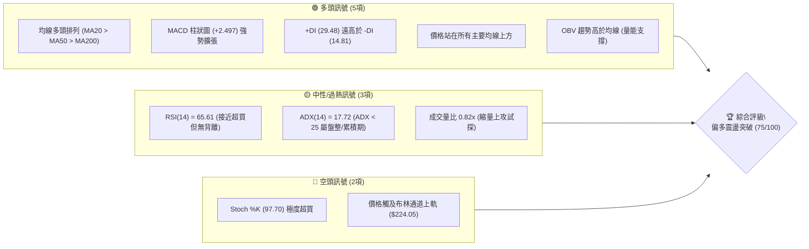
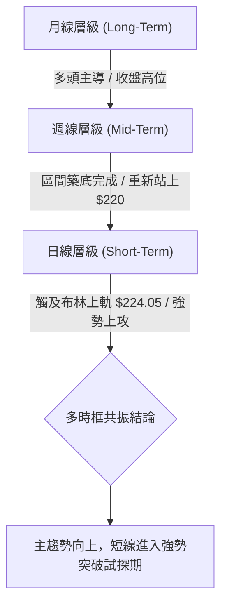
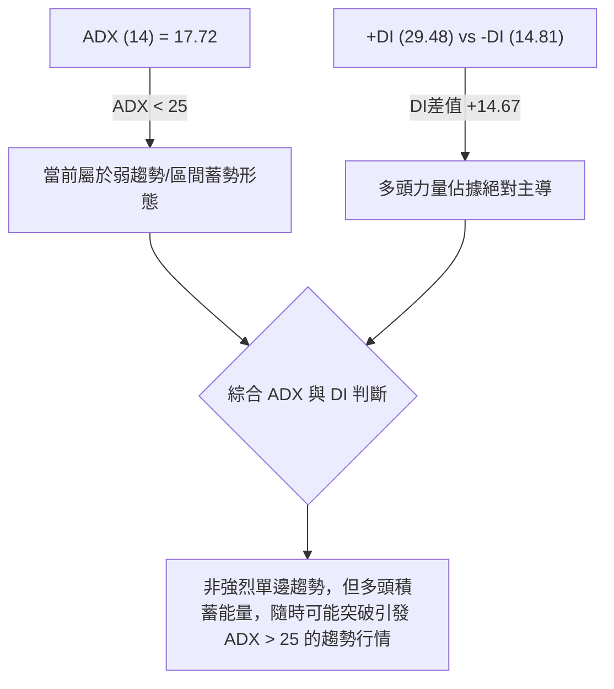
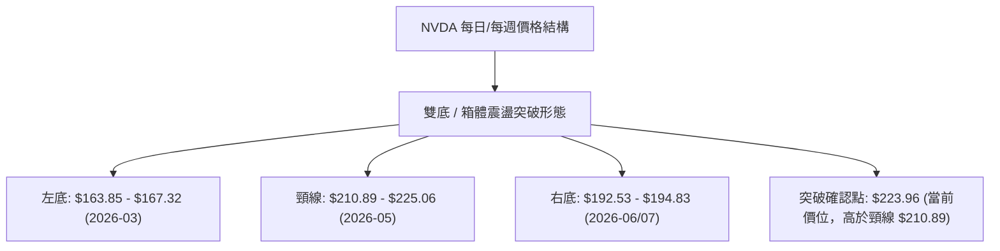
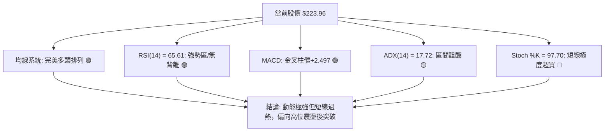
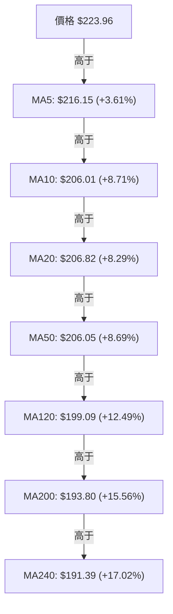
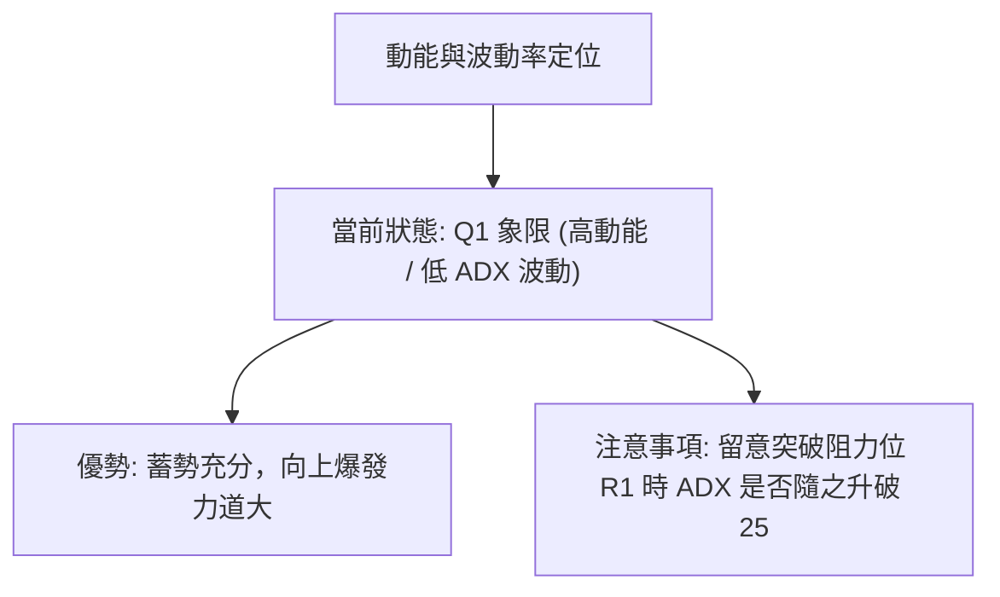
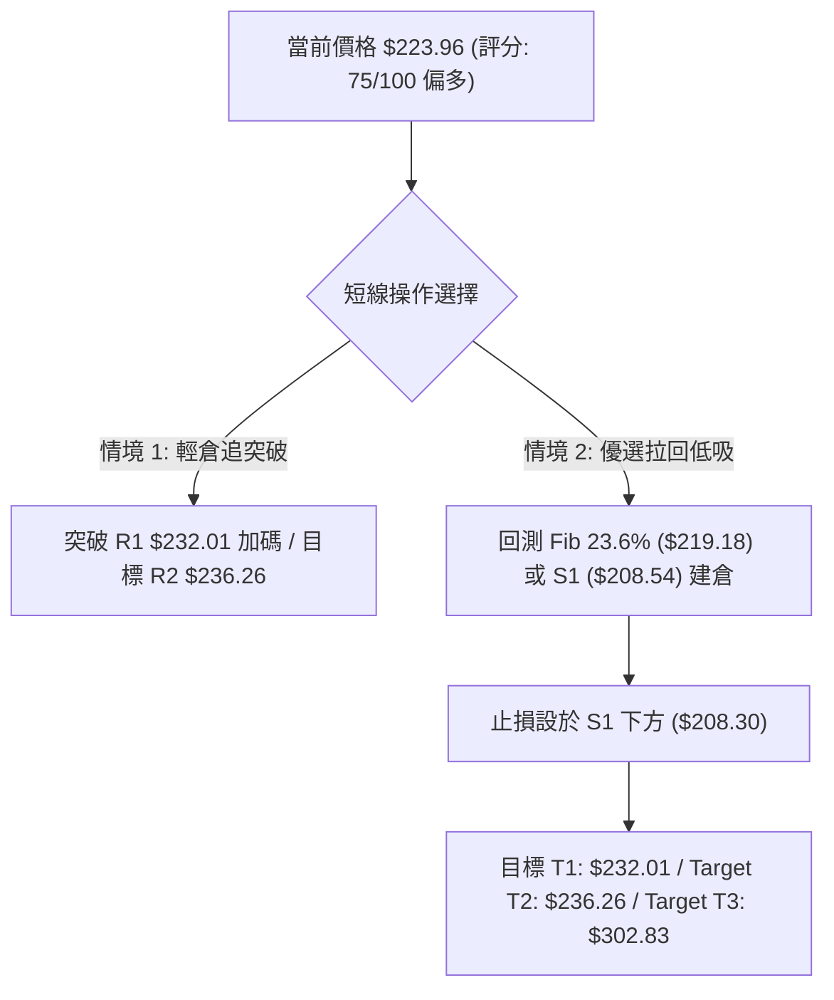
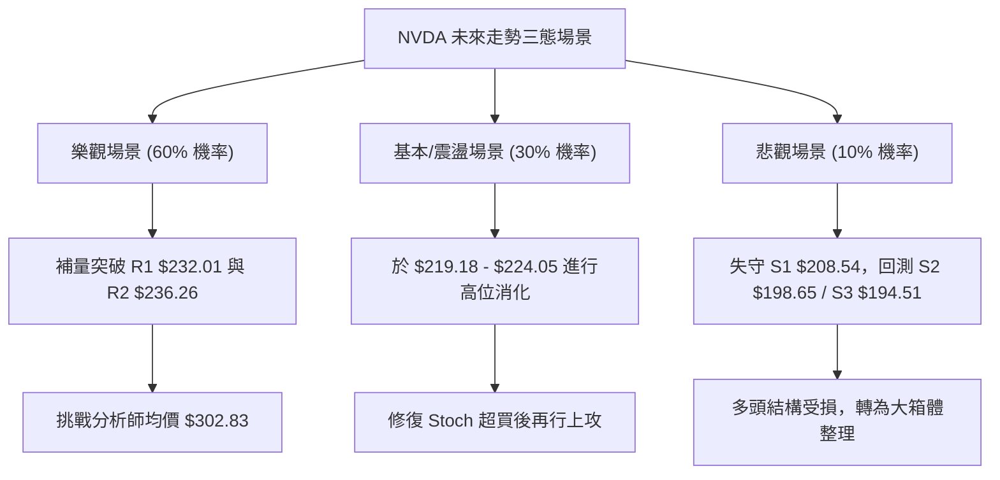

# NVDA 技術分析報告

> **報告日期**：2026-08-08 ｜ **語言**：繁體中文 ｜ **數據來源**：Yahoo Finance ｜ **當前價格**：$223.96

---

## 目錄

| 章節 | 內容 |
|------|------|
| [1. 技術面概覽](#1-技術面概覽) | 訊號儀表板、核心指標、評分卡 |
| [2. 趨勢分析](#2-趨勢分析) | 多時框趨勢、長中短期走勢、ADX強度 |
| [3. 圖表形態分析](#3-圖表形態分析) | 形態識別、信心度、K線組合、形態目標價 |
| [4. 支撐與阻力](#4-支撐與阻力) | 關鍵價位分布、阻力與支撐表、斐波那契回調 |
| [5. 技術指標深度解讀](#5-技術指標深度解讀) | MA排列、RSI背離、MACD、布林通道、成交量 |
| [6. 動能與波動率](#6-動能與波動率) | 動能矩陣、ATR波動率止損、Beta相關性 |
| [7. 多時框架總結](#7-多時框架總結) | 時框架評分矩陣、多時框收斂結論 |
| [8. 交易策略建議](#8-交易策略建議) | 策略路由、價格情境、多空策略細節、風險報酬比 |
| [9. 風險提示與監控](#9-風險提示與監控) | 關鍵監控清單、三態風險場景、倉位管理 |
| [10. 報告總結](#10-報告總結) | 綜合評級與最優策略總覽 |

---

## 1. 技術面概覽

### 🎯 技術訊號儀表板



### 📊 核心指標速覽表

| 指標類別 | 指標名稱 | 當前數值 | 訊號 | 解讀 |
|----------|----------|----------|------|------|
| **價格** | 當前價格 | $223.96 | 🟢 看多 | 位於52週區間 83.0% 位置，逼近歷史高點區間 |
| **均線** | MA20 | $206.82 | 🟢 看多 | 價格在MA20上方 (+8.29%)，短期多頭強勁 |
| **均線** | MA50 | $206.05 | 🟢 看多 | 價格在MA50上方 (+8.69%)，中期趨勢向上 |
| **均線** | MA200 | $193.80 | 🟢 看多 | 價格在MA200上方 (+15.56%)，長期牛市確立 |
| **動能** | RSI(14) | 65.61 | 🟡 中性偏多 | 處於強勢區間 (50-70)，尚未出現頂背離 |
| **動能** | MACD | 3.059 / Hist +2.497 | 🟢 看多 | MACD金叉向上且柱體迅速放大，動能強勁 |
| **動能** | Stoch %K/%D | 97.70 / 91.53 | 🔴 短期過熱 | 入侵超買區，隨時可能觸發短線指標修正 |
| **趨勢** | ADX(14) | 17.72 | 🟡 盤整/醞釀 | ADX < 25 顯示大區間震盪，但 +DI 占絕對優勢 |
| **波動** | 布林 %B | 1.00 ($224.05) | 🔴 上軌壓制 | 股價貼近上軌，預示可能面臨短線衝高回落 |
| **波動** | ATR(14) | $7.83 (3.50%) | 🟡 中等波動 | 日均波幅約 $7.83，提供適度交易空間 |
| **成交量** | 20日均量比 | 0.82x (1.04億) | 🟡 量能平穩 | 量能稍微低於均量，突破關鍵阻力需量能放大 |

### 🏆 技術評分卡

```
╔══════════════════════════════════════════════════════════════╗
║                NVDA 技術面綜合評分卡 (2026-08-08)             ║
╠══════════════════════════════════════════════════════════════╣
║  趨勢強度      ████████████░░░░░░░░  62/100  🟡 (ADX累積中)  ║
║  動能指標      ████████████████░░░░  78/100  🟢 (MACD強勁)   ║
║  支撐穩定度    ████████████████░░░░  82/100  🟢 (層層強支撐) ║
║  成交量配合    █████████████░░░░░░░  68/100  🟡 (OBV偏多)    ║
║  形態完整度    ██████████████░░░░░░  70/100  🟢 (W底突破)    ║
║  均線排列      ██████████████████░░  90/100  🟢 (完美多頭)   ║
╠══════════════════════════════════════════════════════════════╣
║  綜合總評      ███████████████░░░░░  75/100  🟢 偏多/突破在即║
╚══════════════════════════════════════════════════════════════╝
```

---

## 2. 趨勢分析

### 🌐 多時框趨勢分析



### 📈 長期趨勢 — 12個月走勢圖（Unicode）

近12個月（2025-09 至 2026-08）價格呈現高位拉回震盪築底後、再次發起新一輪衝鋒的完整軌跡：

```
NVDA 月線走勢圖（過去12個月：2025-09 至 2026-08）
價格軸 ($)
$240 ┤                                                     
$230 ┤                                                 ● (2026-08現價 $223.96)
$220 ┤                                             ●   │
$210 ┤                                         ●   │   │
$200 ┤        ●                                │   │   │
$190 ┤  ●     │   ●   ●                ●       │   ██  ██
$180 ┤  │  ●  │   │   │   ●    ●       │       ██  ██  ██
$170 ┤  │  │  ██  │   │   │    │   ●   ██  ●   ██  ██  ██
$160 ┤  ██ ██ ██  ██  ██  ██   ██  │   ██  │   ██  ██  ██
     └────────────────────────────────────────────────────────────
       09  10  11  12  01  02   03  04  05  06  07  08  (月份)
```

#### 走勢特徵分析表

| 時段 | 價格區間 ($) | 漲跌特徵 | 關鍵技術驅動因素 |
|------|--------------|----------|------------------|
| **2025-09~10** | $186.34 → $202.23 | 衝高拉回 | 突破 $200 大關，創下當時歷史高點，後引發獲利賣壓 |
| **2025-11~2026-03** | $202.23 → $174.20 | 中期回檔震盪 | 尋求下檔支撐，於 $163.85~$174.20 區間打底構築強支撐 |
| **2026-04~05** | $174.20 → $210.89 | 迅猛反彈 | 多頭發力突破 MA50，形成第一波波段低點反彈 |
| **2026-06~07** | $210.89 → $200.75 | 橫盤二次確認 | 價格回測 MA120/MA200（$192.53~$194.83），形成二次腳支撐 |
| **2026-08 (最新)** | $200.75 → $223.96 | 強力突破爆發 | 單週暴漲逼近 52 週高點 $236.26，突破日線布林中軌與上軌 |

### 📊 中期趨勢（週線分析）

中期走勢顯示，NVDA 在 2026 年 3 月底觸及 52 週低點區間（$163.85~$167.32）後，完成標準的 **W 底（雙重底）構造**。
- **第一底**：2026-03-29 收盤 $167.32（RSI 31.4）
- **頸線突破**：2026-05-17 衝高至 $225.06
- **二次回測（第二底）**：2026-06-28 / 2026-07-05 收盤於 $192.53 / $194.83
- **最新收盤**：2026-08-09（週線資料截至08-08）強勢收在 $223.96，已重新站上頸線上方，確立中期牛市延續。

### ⚡ 趨勢強度評估（ADX 解讀）



| ADX 數值區間 | 趨勢類型 | NVDA 當前狀態 | 交易策略導向 |
|--------------|----------|---------------|--------------|
| 0 – 20 | 無趨勢 / 弱震盪 | **17.72（當前位置）** | 區間下軌/支撐買進，阻力位分批止盈 |
| 20 – 25 | 趨勢醞釀期 | 蓄勢階段 | 關注高點突破訊號，準備切換至趨勢跟隨 |
| 25 – 50 | 強勁趨勢 | 尚未達到 | 順勢加碼，持有直到指標背離 |

---

## 3. 圖表形態分析

### 🔍 形態識別系統



#### 形態信心度與參數表

| 形態名稱 | 信心度 | 判斷依據（引用數據） | 完成度 | 目標價（附計算式） |
|----------|--------|----------------------|--------|--------------------|
| **W底 (雙重底)** | **75%** | 兩次下探 $167.32 與 $192.53 均獲得強烈買盤支撐；當前 $223.96 突破頸線 $210.89 | 85% | **$229.25**<br/>(頸線 $210.89 + 形態高度 [$210.89 - $192.53 = $18.36] = $229.25) |
| **布林通道擠壓突破** | **68%** | 價格帶量站上 MA20 ($206.82) 並推升至上軌 $224.05 | 90% | **$232.01**<br/>(測試阻力 R1) |

### 🕯️ 重要 K 線形態分析

| 時間 | 收盤價 | K線形態/組合 | 解讀 | 訊號 |
|------|--------|---------------|------|------|
| **2026-06-28** | $192.53 | 長下影陰線 | 探底測試 MA120 ($199.09) 與 S3 ($194.51)，空頭力竭 | 🟢 打底 |
| **2026-07-12** | $210.96 | 大陽線吞噬 | 一舉吞噬前兩週陰線實體，MACD 柱狀圖轉正 (+1.234) | 🟢 轉強 |
| **2026-08-09** | $223.96 | 強力長陽線 | 吞噬前三週盤整區，收盤於全週最高點附近，買盤強烈 | 🟢 強勢看多 |

### 📉 ASCII 走勢形態示意圖

```
NVDA 近期 W 底突破示意圖
===================================================================
$236.26 ┤                                                    [52W高點 R2]
$232.01 ┤                                              R1    
$223.96 ┤...........................................●....... [當前價]
$210.89 ┤               ● (頸線位)                 / \
$200.06 ┤              / \                       /   \  [Fib 50%]
$192.53 ┤             /   \             ●───────┘     \
$174.20 ┤   ●        /     \           /   (右底 S3)
$163.85 ┤────┴──────┘───────┴─────────┘──────────────────── [52W低點]
            2026-03       2026-05    2026-07      2026-08
===================================================================
```

### 🎯 形態目標價計算

1. **基本 W 底形態目標價**：
   - 頸線位置 ($N$) = $210.89
   - 右底最低價 ($B$) = $192.53
   - 形態高度 ($H$) = $210.89 - $192.53 = $18.36
   - **第一最小目標價** = $N + H = \$210.89 + \$18.36 = \mathbf{\$229.25}$

2. **擴展波段目標價**：
   - 若突破阻力位 R1 ($232.01)，第二目標價將直接指向 52 週高點 R2 ($\mathbf{\$236.26}$)。

---

## 4. 支撐與阻力

### 🗺️ 關鍵價位分布圖（Unicode）

```
NVDA 價位結構分布圖 (當前價格: $223.96)
═══════════════════════════════════════════════════════════════════
$236.26 ║████████████████████████████████████████║ 52W 高點 / 強阻力 R2
$232.01 ║██████████████████████████              ║ 關鍵波段阻力 R1
$224.05 ║▓▓▓▓▓▓▓▓▓▓▓▓▓▓▓▓▓▓▓▓▓▓▓▓▓               ║ 布林通道上軌
$223.96 ╠════════════════════════════════════════╣ ◄ 當前價格 $223.96
$219.18 ║▒▒▒▒▒▒▒▒▒▒▒▒▒▒▒▒▒▒▒▒                    ║ 斐波那契 23.6% 回調位
$208.60 ║████████████████████████              ║ Fib 38.2% / 強支撐 S1 ($208.54)
$206.82 ║▓▓▓▓▓▓▓▓▓▓▓▓▓▓▓▓▓▓▓▓                    ║ MA20 / MA50 均線重疊帶
$200.06 ║████████████████████                    ║ Fib 50.0% / 心理關卡
$198.65 ║████████████████████                    ║ 支撐位 S2
$194.51 ║████████████████                        ║ 支撐位 S3 / Fib 61.8% ($191.51)
$163.85 ║████████████████████████████████████████║ 52W 低點
═══════════════════════════════════════════════════════════════════
```

### 🚧 阻力位分析表

| 阻力級別 | 精確價位 | 形成原因（引用數據） | 突破難度 | 重要性 |
|----------|----------|----------------------|----------|--------|
| **阻力 R1** | **$232.01** | 近一年波段高點聚類位 | 🟡 中等 | 突破後將開啟挑戰歷史新高之旅 |
| **阻力 R2** | **$236.26** | 52 週最高點 / 斐波那契 0.0% 回調位 | 🔴 極高 | 歷史天花板，獲利賣壓重鎮 |

### 🛡️ 支撐位分析表

| 支撐級別 | 精確價位 | 形成原因（引用數據） | 守住機率 | 重要性 |
|----------|----------|----------------------|----------|--------|
| **支撐 S1** | **$208.54** | 近一年波段低點聚類 + MA20 ($206.82) + MA50 ($206.05) + Fib 38.2% ($208.60) | 🟢 90% | **核心樞紐**，多空強弱分水嶺 |
| **支撐 S2** | **$198.65** | 近一年波段低點聚類 + Fib 50.0% ($200.06) + MA120 ($199.09) | 🟢 85% | 中期防線，多頭最後堡壘 |
| **支撐 S3** | **$194.51** | 近一年波段低點聚類 + MA200 ($193.80) + Fib 61.8% ($191.51) | 🟢 95% | **牛熊分界線**，不容有失 |

### 📐 斐波那契回調位分析

基於 52 週高低點區間（高點 **$236.26** 至 低點 **$163.85**，總價差 $72.41）：

| 斐波那契層級 | 精確價位 | 與現價 ($223.96) 關係 | 技術面解讀 |
|--------------|----------|-----------------------|------------|
| **0.0% (52W High)** | **$236.26** | 現價下方 -5.21% | 終極多頭目標點 |
| **23.6%** | **$219.18** | 現價下方 -2.13% | **第一回測防線**，當前股價落於 0.0% ~ 23.6% 強勢區間 |
| **38.2%** | **$208.60** | 現價下方 -6.86% | 與 S1 ($208.54) 及 MA20/50 密集交會，為極強支撐 |
| **50.0%** | **$200.06** | 現價下方 -10.67% | 中性多空分水嶺 |
| **61.8%** | **$191.51** | 現價下方 -14.49% | 與 S3 ($194.51) 及 MA200 ($193.80) 重疊 |
| **78.6%** | **$179.35** | 現價下方 -19.92% | 深幅回檔區 |
| **100.0% (52W Low)**| **$163.85** | 現價下方 -26.84% | 52 週最低點 |

**解讀**：現價 $223.96 正好處於 Fib 23.6% ($219.18) 與 Fib 0.0% ($236.26) 之間的**極度強勢區**，只要不跌破 Fib 23.6% ($219.18)，短線多頭掌控絕對發球權。

---

## 5. 技術指標深度解讀

### 🎛️ 指標訊號總覽



### 📈 移動平均線排列分析



- **排列型態**：`MA20 ($206.82) > MA50 ($206.05) > MA200 ($193.80)`，呈典型的**完美多頭排列**。
- **扣抵位置**：MA5 ($216.15) 與 MA10 ($206.01) 快速向上揚升，對短線股價提供極佳的動態推升力。MA20 與 MA50 在 $206.00~$206.80 區間粘合後向上張口，形成極強的中期支撐墊。

### 📉 RSI(14) 分析

```
RSI(14) 當前強度數值: 65.61
0        30        50        65.61    70       100
├────────┼─────────┼───────────█──────┼────────┤
   超賣      弱勢      多空分界    當前    超買區
```

- **超買超賣判斷**：RSI(14) 目前為 **65.61**，位於 50~70 的多頭強勢區，尚未進入 >70 的極端超買區。
- **背離判斷**：比較近期價格與 RSI 軌跡，股價創近期新高 $223.96，RSI 同步上升至 65.61（相較於前週 47.7 大幅揚升），**無頂背離現象**，顯示價格上漲由真實動能推動。

### 📊 MACD(12,26,9) 訊號解讀

- **MACD 快線**：`3.059`
- **Signal 慢線**：`0.562`
- **MACD 柱狀圖 (Histogram)**：`+2.497`

```
MACD 柱狀圖趨勢 (最近5週):
2026-07-12: █ (+1.234)
2026-07-19: █ (+1.170)
2026-07-26: ▋ (+0.760)
2026-08-02: ░ (-0.966)
2026-08-09: █████ (+2.497) 🟢 柱體大幅擴張
```

- **解讀**：MACD 柱狀圖在經歷上一週短暫陰轉紅後，本週呈爆發式擴張（自 -0.966 翻正至 +2.497），快線向上拉開與慢線距離，發出強烈買進與續漲訊號。

### 📦 布林通道分析

```
NVDA 布林通道 (Bollinger Bands) 示意圖
──────────────────────────────────────────────────────────
$224.05 ─────────── Upper Band (上軌)  ◄── 當前價 $223.96 (貼近上軌)
$215.00 ─────────── 價格延伸區
$206.82 ─────────── Middle Band (MA20 中軌)
$198.00 ─────────── 價格回檔區
$189.58 ─────────── Lower Band (下軌)
──────────────────────────────────────────────────────────
```

- **通道位置**：%B 為 `1.00`，股價幾乎精確觸及布林帶上軌（$224.05）。
- **帶寬型態**：上軌 ($224.05) 與下軌 ($189.58) 帶寬持續張開，表明波動率正在放大，股價沿上軌運行是典型的**強勢攻擊特徵**。

### 💹 成交量分析（量價配合度）

- **最新成交量**：104,730,601 股
- **20日均量**：127,176,775 股（量比 0.82x）
- **OBV 趨勢**：數據顯示 `OBV > MA`，能量潮指標領先價格走高，表明法人與機構籌碼處於淨收集狀態。
- **量價評價**：當前股價大漲逼近 $224，但成交量為均量的 82%，呈現「溫和縮量上攻」。若要有效突破阻力 R1 ($232.01) 與 R2 ($236.26)，未來幾個交易日必須補量至 1.3 億股以上。

---

## 6. 動能與波動率

### ⚡ 動能評估四象限

| 象限區塊 | 動能強度 (RSI/MACD) | 波動率 (ADX/ATR) | 當前 NVDA 歸屬 | 策略與特徵 |
|----------|---------------------|------------------|----------------|------------|
| **Q1 (最佳機會)** | **強 (MACD+2.497)** | **低 (ADX 17.72)** | **✓ NVDA 所在位置** | **低波動高動能**：最佳多頭起漲點，變盤向上機率高 |
| **Q2 (謹慎觀望)** | 弱 | 低 | — | 無方向，資金效率低 |
| **Q3 (高風險高收益)** | 強 | 高 | — | 強烈單邊趨勢，波動劇烈，止損需放寬 |
| **Q4 (避開區域)** | 弱 | 高 | — | 空頭主導且高波動，爆倉風險高 |



### 📊 ATR 波動率與止損分析

- **ATR(14)**：`$7.83`（佔當前股價 3.50%）
- **每日預期波動區間**：$223.96 ± $7.83 ($216.13 ~$231.79)
- **波段止損建議乘數**：
  - **短線緊密止損 (1.0x ATR)**：$223.96 - $7.83 = **$216.13**（正好保護在 MA5 $216.15 附近）
  - **標準波段止損 (2.0x ATR)**：$223.96 - (2 × $7.83) = **$208.30**（高度吻合 S1 支撐位 $208.54 與 Fib 38.2% $208.60！）

### 📐 Beta 與市場相關性

- **Beta 係數**：`2.215`（高 Beta 成長股）
- **解讀**：NVDA 的波動程度是大盤 (S&P 500) 的 2.215 倍。在市場整體風險偏好上升（Risk-on）環境下，NVDA 將提供顯著超越大盤的超額收益 (Alpha)；反之，若大盤拉回，NVDA 修正幅度亦會較大。

---

## 7. 多時框架總結

### 📋 時框架評分表

| 時框架 | 趨勢方向 | 動能狀態 | 均線排列 | 圖表形態 | 綜合評分 | 建議方向 |
|--------|----------|----------|----------|----------|----------|----------|
| **月線 (Long)** | 🟢 多頭 | 🟢 強勁 | 🟢 多頭 | 牛市主升段 | **85/100** | 長線堅定持有 |
| **週線 (Mid)** | 🟢 多頭 | 🟢 擴張 | 🟢 多頭 | W底頸線突破 | **80/100** | 逢回檔加碼 |
| **日線 (Short)**| 🟡 震盪偏多 | 🔴 超買壓制 | 🟢 多頭 | 觸及布林上軌 | **68/100** | 勿盲目追高，等待拉回 |

### 🔲 綜合訊號矩陣

```
時框一致性分析：
───────────────────────────────────────────────────────────
短期 (日線)  : 🟡 偏多但短線面臨布林上軌 $224.05 阻力
中期 (週線)  : 🟢 突破 W 底頸線 $210.89，目標指向 $232-$236
長期 (月線)  : 🟢 牛市格局未變，法人評級 Strong Buy
───────────────────────────────────────────────────────────
共振結論     : 🟢 中長期極度看多，短期呈「高位過熱+突破試探」
```

### ⚖️ 多時框收斂結論

依據多時框收斂規則：
1. **當前 ADX(14) = 17.72 (< 25)**，技術架構歸類為 **「大區間震盪蓄勢/突破初期」**。
2. 日線雖有 Stoch (97.70) 短線過熱與布林上軌 ($224.05) 壓制，但週線與月線均呈現完美的均線多頭排列（MA20 > MA50 > MA200）與 MACD 柱狀圖爆發 (+2.497)。
3. **優先級收斂**：以中長期（週線/MA20/MA50）看多方向為主導，日線短線過熱僅代表「不宜在 $223.96 立即重倉追高」，而應「利用短線回測 S1 ($208.54) 或 Fib 23.6% ($219.18) 時建立多頭部位」。
4. **唯一方向結論**：**🟢 偏多震盪蓄勢，尋求回檔建立多頭部位**。

---

## 8. 交易策略建議

### 🗺️ 策略決策流程圖



### 🧭 策略路由

> **當前主策略方向 = 🟢 多頭拉回低吸與突破跟隨策略（依評分卡 75/100）**

綜合評分為 75 分（偏多），故本報告**主推多頭策略**。空頭僅作為反轉風險觸發與對沖提示。

### 🎯 價格情境階梯 (Price Scenarios)

| 觸發條件 | 下一目標 | 後續延伸目標 | 情境技術含義 |
|----------|----------|--------------|--------------|
| **帶量突破 R1 $232.01** | **R2 $236.26** | **$302.83** (分析師均價) | 刷新歷史高點，開啟新一波主升段 |
| **於 $219.18 - $224.05 震盪** | **$232.01** | — | 高位橫盤消化短線過熱指標 |
| **跌破 Fib 23.6% $219.18** | **S1 $208.54** | **S2 $198.65** | 短線拉回清洗浮籌，測試 MA20 強支撐 |

### 📊 情境機率分佈

| 情境劇本 | 機率 | 主要依據 |
|----------|------|----------|
| **高位震盪後突破 R1/R2** | **60%** | MACD 柱狀圖 +2.497 爆發、+DI (29.48) 主導、均線完美多頭 |
| **回測 S1 ($208.54) 尋求支撐** | **30%** | Stoch %K (97.70) 極度超買、觸及布林上軌 $224.05、成交量 0.82x 略顯不足 |
| **深度拉回跌破 S2 ($198.65)** | **10%** | 需大盤出現極端黑天鵝事件，否則受限於強烈波段買盤 |

### 🟢 主策略詳情

#### 策略 A：拉回低吸多單（首選，勝率較高）
- **進場條件**：股價回測 Fib 23.6% ($219.18) 附近或 MA5 ($216.15) 出現止跌K線
- **進場價格**：**$219.18**
- **止損價格**：**$208.30**（位於 S1 $208.54 與 Fib 38.2% $208.60 下方 2x ATR）
- **目標價 T1**：**$232.01** (波段阻力 R1)
- **目標價 T2**：**$236.26** (52週高點 R2)
- **目標價 T3**：**$302.83** (分析師平均目標價)
- **風險報酬比 (以 T2 計算)**：
  $$\text{Risk} = \$219.18 - \$208.30 = \$10.88$$
  $$\text{Reward} = \$236.26 - \$219.18 = \$17.08$$
  $$\text{R/R Ratio} = 17.08 / 10.88 = \mathbf{1.57 : 1}$$ (若算至 T3 則 R/R > 7.6:1)
- **建議倉位**：15% - 20%

#### 策略 B：突破追漲多單（備選，順勢強攻）
- **進場條件**：日線收盤價強勢突破阻力 R1 ($232.01) 且成交量 > 1.3 億股
- **進場價格**：**$232.50**
- **止損價格**：**$223.96**（回到當前突破點下方）
- **目標價 T1**：**$236.26**
- **目標價 T2**：**$302.83**
- **風險報酬比 (以 T2 計算)**：
  $$\text{Risk} = \$232.50 - \$223.96 = \$8.54$$
  $$\text{Reward} = \$302.83 - \$232.50 = \$70.33$$
  $$\text{R/R Ratio} = 70.33 / 8.54 = \mathbf{8.24 : 1}$$
- **建議倉位**：10% - 15%

### 🔴 反向風險觸發點（對沖提示）

若股價未如預期上攻，反向跌破 **S1 ($208.54)** 且 MACD 柱狀圖由正轉負，表明短線假突破發生。多頭應立即清倉觀望；激進者可於跌破 $208.54 時進行短線對沖，下檔目標看 **S2 ($198.65)**。

### ⭐ 整體訊號強度評星

```
做多訊號強度：★★██☆  (4/5星 - 中長期極強，短線指標過熱)
做空訊號強度：★☆☆☆☆  (1/5星 - 無明顯空頭背離或結構破壞)
整體可信度：  ★★██☆  (4/5星 - 均線與動能指標高度共振)
```

---

## 9. 風險提示與監控

### ✅ 關鍵監控指標 Checklist

```
╔══════════════════════════════════════════════════════════════╗
║                NVDA 技術面每日關鍵監控清單                   ║
╠══════════════════════════════════════════════════════════════╣
║ [ ] 股價是否站穩 Fib 23.6% ($219.18) 上方                   ║
║ [ ] 突破 $232.01 時成交量是否擴張至 1.3 億股以上 (當前1.04億)  ║
║ [ ] Stoch %K (97.70) 是否出現高位死叉向下進行指標修復        ║
║ [ ] MACD 柱狀圖 (+2.497) 能否維持遞增擴張態勢               ║
║ [ ] ADX (17.72) 是否開始突破 20 並向上拉升引發單邊趨勢      ║
║ [ ] 支撐位 S1 ($208.54) 與 MA20 ($206.82) 的守備有效性      ║
╚══════════════════════════════════════════════════════════════╝
```

### ⚠️ 風險場景分析



### 🛡️ 風險管理重要提醒

1. **波動率風險**：NVDA 的 Beta 為 2.215，ATR 高達 $7.83 (3.50%)。單日波動放大屬正常現象，交易者應嚴格依據 ATR 控制倉位，避免槓桿過高。
2. **追高風險**：目前 Stoch %K 為 97.70，股價緊貼布林帶上軌 ($224.05)，短線指標嚴重過熱。直接在當前價位 $223.96 全倉追漲風險較高，分批佈局或等待回測 $219.18 是更穩健的做法。
3. **止損紀律**：若收盤價跌破 $208.30（S1 支撐區），必須無條件執行止損，以防止回測 $194.51 (MA200) 帶來的深幅虧損。

---

## 📋 報告總結

```
NVDA 技術分析報告總結
════════════════════════════════════════════════════════
報告日期：2026-08-08
當前價格：$223.96
分析評級：🟢 75/100 (偏多震盪蓄勢 / 突破在即)

關鍵結論：
├─ 長期趨勢：🟢 完美多頭排列 (MA20 > MA50 > MA200)，牛市格局穩固
├─ 中期趨勢：🟢 週線 W 底形態完成突破，目標指向 $229.25 - $236.26
├─ 短期趨勢：🟡 短線動能極強 (MACD+2.497)，但 Stoch (97.70) 過熱
├─ 關鍵支撐：S1: $208.54 ｜ S2: $198.65 ｜ S3: $194.51
├─ 關鍵阻力：R1: $232.01 ｜ R2: $236.26 (52W高點)
└─ 分析師目標：均價 $302.83 ｜ 最高 $500.00

最優策略組合：
1. 🥇 最佳機會：拉回至 Fib 23.6% ($219.18) 分批建倉，止損 $208.30
2. 🥈 次選機會：帶量突破 R1 ($232.01) 後順勢加碼，目標 $236.26 / $302.83
3. 🥉 保守選擇：等待 Stoch 指標回落至 50 附近且 S1 ($208.54) 經確認後再行進場
════════════════════════════════════════════════════════
```

---

> ⚠️ **免責聲明**：本報告為 AI 依據數據自動生成之技術分析報告，所有價位與指標解讀均基於歷史價格資訊。本報告**僅供研究與學術參考**，**不構成任何投資建議**。投資有風險，入市需謹慎。

---

*報告生成時間：2026-08-08 ｜ 數據來源：Yahoo Finance ｜ 分析框架：多時框技術分析*