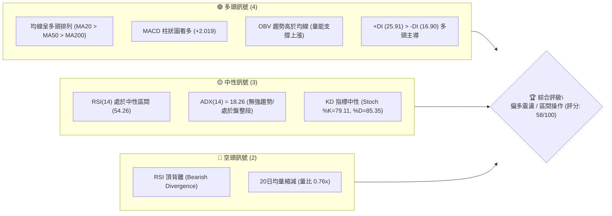
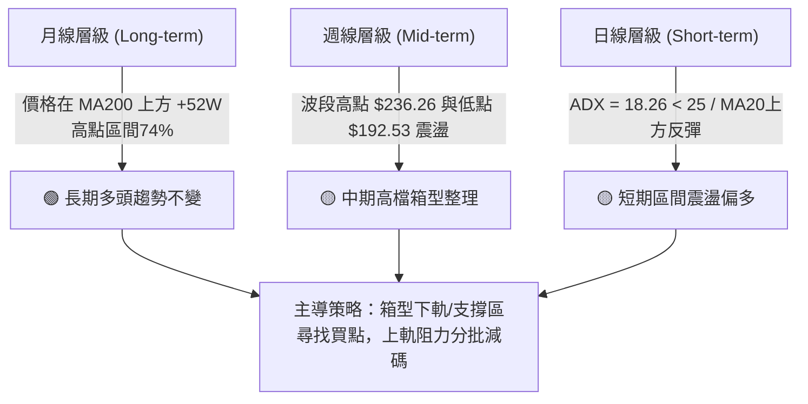
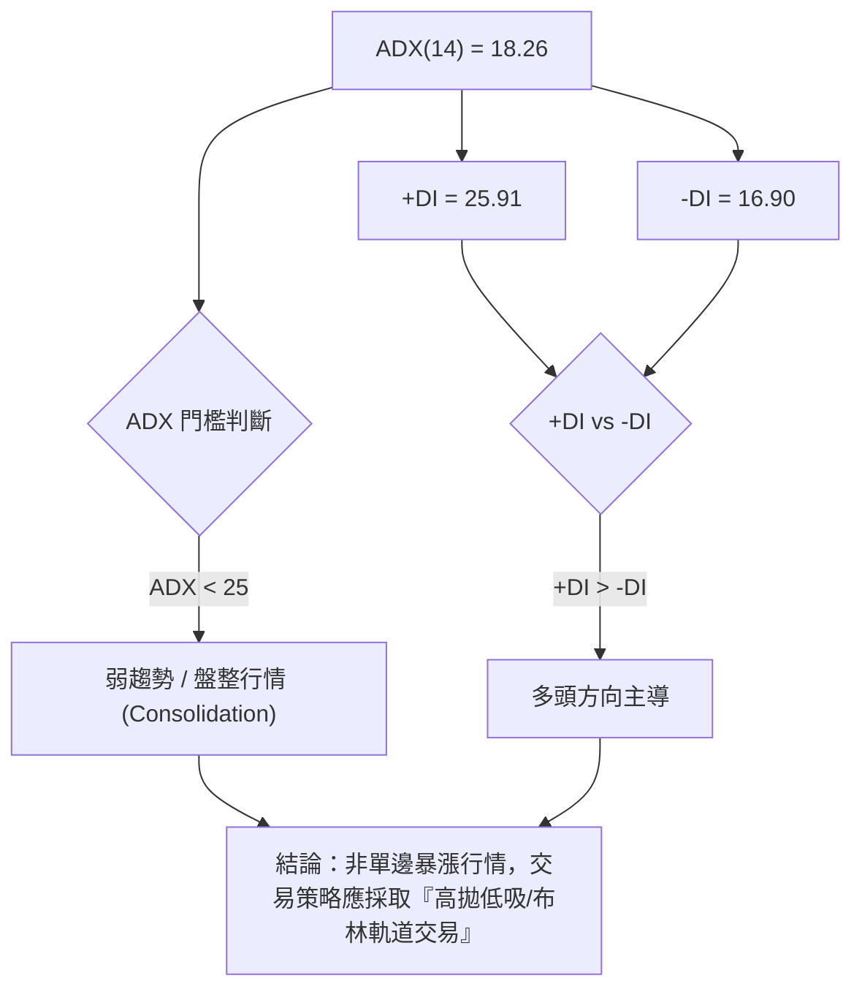
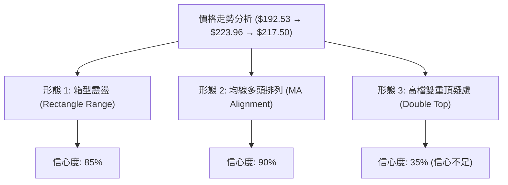
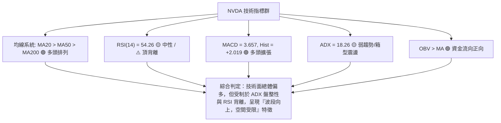
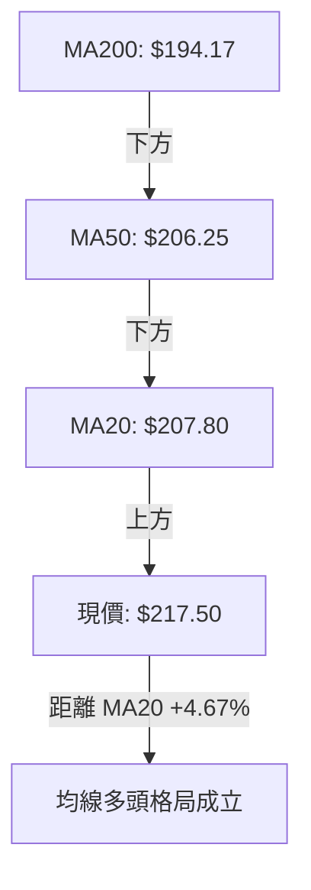
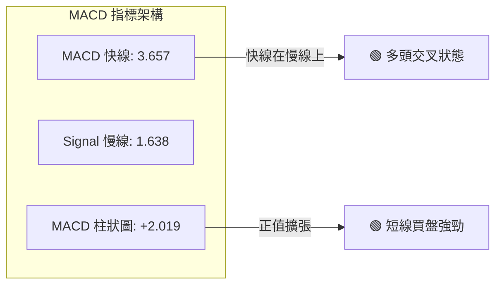
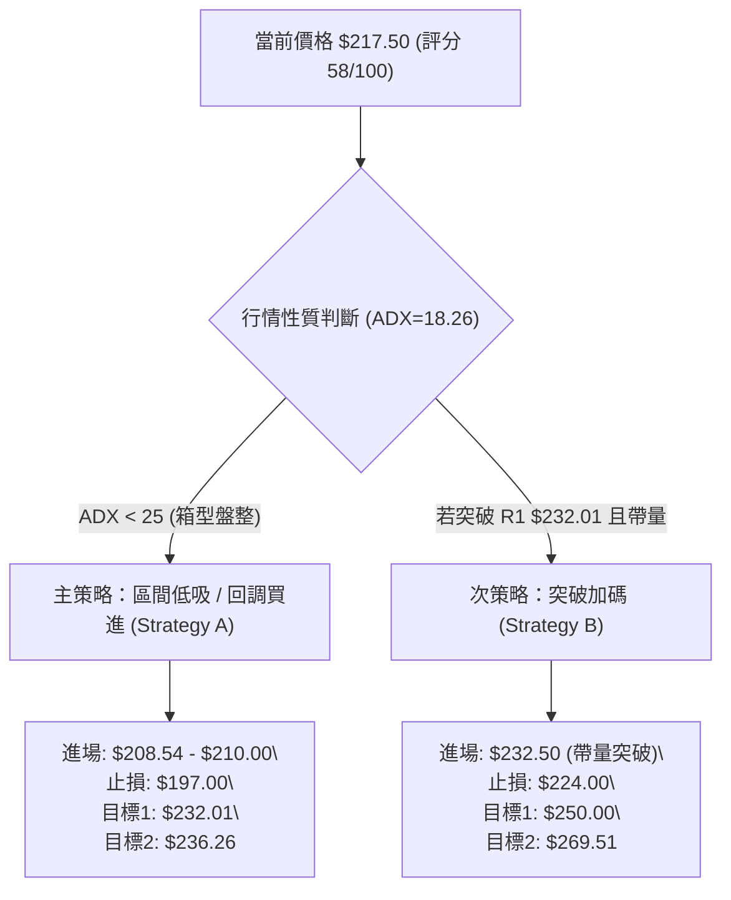
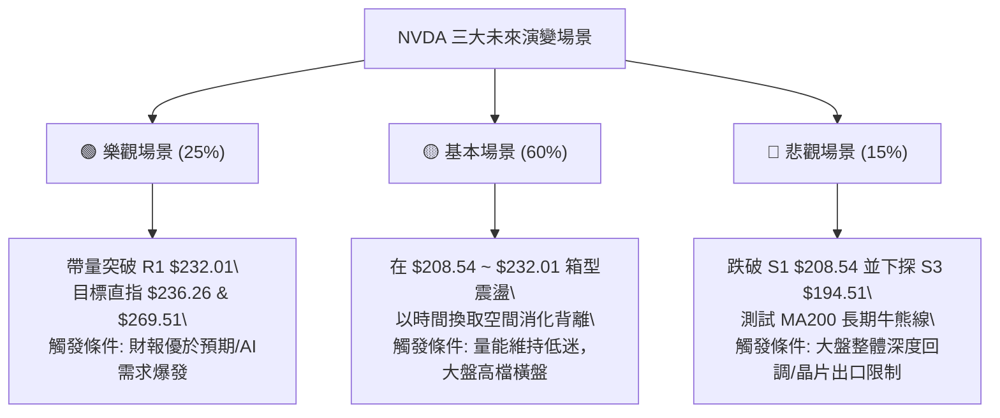

# NVDA 技術分析報告

> **報告日期**：2026-08-12 ｜ **語言**：繁體中文 ｜ **數據來源**：Yahoo Finance ｜ **當前價格**：$217.50

---

## 目錄

| 章節 | 內容 |
|------|------|
| [1. 技術面概覽](#1-技術面概覽) | 訊號儀表板、核心指標、評分卡 |
| [2. 趨勢分析](#2-趨勢分析) | 多時框趨勢、長中短期走勢 |
| [3. 圖表形態分析](#3-圖表形態分析) | 形態識別、K線組合、目標價 |
| [4. 支撐與阻力](#4-支撐與阻力) | 關鍵價位、斐波那契回調 |
| [5. 技術指標深度解讀](#5-技術指標深度解讀) | MA/RSI/MACD/布林/成交量 |
| [6. 動能與波動率](#6-動能與波動率) | 動能評估、ATR、Beta |
| [7. 多時框架總結](#7-多時框架總結) | 時框架評分矩陣 |
| [8. 交易策略建議](#8-交易策略建議) | 多空策略、風險報酬比 |
| [9. 風險提示與監控](#9-風險提示與監控) | 監控指標、風險場景 |

---

## 1. 技術面概覽

### 🎯 技術訊號儀表板



### 📊 核心指標速覽表

| 指標類別 | 指標名稱 | 當前數值 | 訊號 | 解讀 |
|----------|----------|----------|------|------|
| **價格** | 當前價格 | $217.50 | 🟢 多頭 | 處於52週高低點區間 74.1% 位置 |
| **均線** | MA20 | $207.80 | 🟢 多頭 | 價格位於 MA20 上方 (+4.67%) |
| **均線** | MA50 | $206.25 | 🟢 多頭 | 價格位於 MA50 上方 (+5.45%) |
| **均線** | MA200 | $194.17 | 🟢 多頭 | 價格位於 MA200 上方 (+12.02%) |
| **動能** | RSI(14) | 54.26 | 🟡 中性 | 處於 30-70 中性區間，但存在頂背離警告 |
| **動能** | MACD | 3.657 (柱: +2.019) | 🟢 多頭 | MACD 柱狀圖擴張，短線動能偏多 |
| **趨勢** | ADX(14) | 18.26 | 🟡 盤整 | ADX < 25 表示當前為箱型/震盪行情 |
| **通道** | 布林帶 %B | 0.77 | 🟢 多頭 | 位於中軌 ($207.80) 與上軌 ($226.07) 之間 |
| **波動** | ATR(14) | $7.72 (3.55%) | 🟡 中等 | 日均波動幅度適中，提供良好的波段操作空間 |
| **成交量**| 最新量比 | 0.76x | 🔴 偏弱 | 今日量能 95.71M 低於 20日均量 125.51M |

### 🏆 技術評分卡

```
╔══════════════════════════════════════════════════════════════════╗
║                技術評分卡 — NVDA (2026-08-12)                    ║
╠══════════════════════════════════════════════════════════════════╣
║ 趨勢強度 (ADX<25)  ████████░░░░░░░░░░░░  40/100  🟡 盤整行情     ║
║ 動能指標 (MACD/RSI)████████████░░░░░░░░  60/100  🟢 動能偏多     ║
║ 支撐穩定度 (S1/S2) ████████████████░░░░  80/100  🟢 結構堅實     ║
║ 成交量配合 (量比)  ████████░░░░░░░░░░░░  40/100  🔴 量能退潮     ║
║ 形態完整度 (箱型)  ████████████░░░░░░░░  60/100  🟡 區間整理     ║
║ 均線排列 (多頭)    ████████████████░░░░  80/100  🟢 結構完整     ║
╠══════════════════════════════════════════════════════════════════╣
║ 綜合評分           ███████████░░░░░░░░░  58/100  🟡 偏多震盪     ║
╚══════════════════════════════════════════════════════════════════╝
```

---

## 2. 趨勢分析

### 🌐 多時框趨勢分析



### 📈 長期趨勢 — 12個月走勢圖（Unicode）

以下為 NVDA 過去 12 個月（2025年9月至2026年8月）之月線收盤價格走勢圖：

```
NVDA 月線走勢圖（2025-09 至 2026-08）
價格軸 ($)
$230 ┤                                                    
$220 ┤                                              ● $217.50 (現價)
$210 ┤                                  ● $210.89  
$200 ┤              ● $202.23                     ● $199.34
$190 ┤      ● $186.34  ● $186.27  ● $190.90         
$180 ┤                     ● $176.77  ● $176.97
$170 ┤                                ● $174.20
$160 ┤
     └───────────────────────────────────────────────────────────
       25-09  25-10  25-11  25-12  26-01  26-02  26-03  26-04  26-05  26-06  26-07  26-08
```

#### 歷史走勢特徵分析表

| 時間階段 | 月份區間 | 價格區間 | 漲跌幅 | 走勢特徵分析 |
|----------|----------|----------|--------|--------------|
| **第1階段** | 2025-09 ~ 2025-10 | $186.34 → $202.23 | +8.53% | 突破 $200 大關，呈現強勁多頭推進 |
| **第2階段** | 2025-11 ~ 2026-03 | $202.23 → $174.20 | -13.86%| 進入波段回調，於 2026-03 觸及低點 $174.20 |
| **第3階段** | 2026-04 ~ 2026-05 | $174.20 → $210.89 | +21.06%| 強烈 V 型反彈，再次站上所有短中期均線 |
| **第4階段** | 2026-06 ~ 2026-07 | $210.89 → $200.75 | -4.81% | 高檔橫盤消化獲利賣壓，鎖定 $200 心理關卡 |
| **第5階段** | 2026-08 (最新) | $200.75 → $217.50 | +8.34% | 突破月線整理區，重返 $217.50 多頭軌道 |

### 📊 中期趨勢（週線分析）

從近 20 週收盤走勢觀察：
- **高點阻力**：2026年5月中旬觸及週線高點 $225.06，隨後在 52週高點 $236.26 附近受阻。
- **低點支撐**：2026年6月下旬探底至 $192.53，精準在 S3 ($194.51) 與 61.8% 斐波那契回調位 ($191.51) 獲得強烈買盤支撐。
- **最新動向**：2026-08-09 週強勢大漲至 $223.96，本週（截至08-12）收於 $217.50，MACD 柱狀圖轉正 (+2.019)，顯示中期底部確立，進入高檔震盪攻堅期。

### ⚡ 趨勢強度評估（ADX 解讀）



#### ADX 趨勢強度對照

| 指標 | 當前數值 | 參考標準 | 趨勢狀態 | 對應策略 |
|------|----------|----------|----------|----------|
| **ADX(14)** | **18.26** | < 25 | 弱趨勢/區間震盪 🟡 | 採用箱型突破/回擋支撐做多 |
| **+DI** | **25.91** | > -DI | 多頭買盤佔優 🟢 | 逢回調找買點，不盲目追空 |
| **-DI** | **16.90** | < +DI | 空頭力道偏弱 🟢 | 空方缺乏單邊大跌動能 |

---

## 3. 圖表形態分析

### 🔍 形態識別系統



#### 形態信心度與目標價評估表

| 形態名稱 | 信心度 | 判斷依據（引用數據） | 完成度 | 目標價計算式 | 預測目標價 |
|----------|--------|----------------------|--------|--------------|------------|
| **箱型整理** | **85%** | 區間下軌 $194.51 (S3)，上軌 $232.01 (R1) | 80% | 突破上軌 $232.01 + 箱高 ($232.01 - $194.51 = $37.50) | **$269.51** |
| **均線多頭排列** | **90%** | MA20 ($207.80) > MA50 ($206.25) > MA200 ($194.17) | 100% | 指標型態，推升價格沿 MA20/MA50 軌道上行 | **$232.01** |
| **雙重頂疑慮** | **35%** | 未突破 52W 高點 $236.26 且 RSI 頂背離 | 30% | 訊號不足，僅做風險提示（未跌破頸線 $198.65 前無效） | **N/A** |

### 🕯️ 重要 K 線形態分析

| 日期/週別 | 收盤價 | K線形態 | 技術特徵解讀 | 訊號 |
|-----------|--------|---------|--------------|------|
| **2026-06-28 週** | $192.53 | 下影鎚頭線 | 探底 $192.53 後強勢拉回，確認 S3 ($194.51) 底部的強烈買盤 | 🟢 看多反轉 |
| **2026-08-09 週** | $223.96 | 大陽線 (Long White Body) | 單週大漲 +11.56%，強勢突破 MA20/MA50 均線反纏區 | 🟢 強勢買訊 |
| **2026-08-16 週** | $217.50 | 高檔十字星/小陰線 | 上攻 $223.96 後在 23.6% 斐波位 ($219.18) 遇到獲利回吐，陷入微幅拉回 | 🟡 短線整理 |

### 📉 ASCII 走勢形態示意圖

```
NVDA 每日/週價格與箱型結構示意圖
===================================================================
$236.26 ┤.........................................[52W 高點 R2]
$232.01 ┤-----------------------------------------[箱型上軌阻力 R1]
$226.07 ┤............+----------------+..........[布林帶上軌]
$217.50 ┤............| 現價 $217.50   |
$208.54 ┤------------+----------------+-----------[箱型中樞支撐 S1 / MA20]
$198.65 ┤-----------------------------------------[波段關鍵支撐 S2]
$194.51 ┤=========================================[箱型下軌強支撐 S3 / MA200]
===================================================================
```

### 🎯 形態目標價計算

根據高確定性的**箱型整理（Rectangle Consolidation）**突破推算：
1. **箱型高度（Height）** = 阻力位 R1 ($232.01) - 支撐位 S3 ($194.51) = **$37.50**
2. **保守目標價 (T1)** = 測試 52週高點 R2 = **$236.26** (+8.63%)
3. **箱型突破目標價 (T2)** = R1 ($232.01) + 箱高 ($37.50) = **$269.51** (+23.91%)
4. **極限推算**（若由 52W 低點 $163.85 向上延伸 1.618 斐波那契）：$163.85 + ($236.26 - $163.85) × 1.618 = **$280.99**

---

## 4. 支撐與阻力

### 🗺️ 關鍵價位分布圖（Unicode）

```
NVDA 價位結構分布圖 (現價: $217.50)
═══════════════════════════════════════════════════════════════════
$236.26 ║████████████████████████████████║ 52週歷史高點 (R2)
$232.01 ║████████████████████████        ║ 波段高點強阻力 (R1)
$226.07 ║▓▓▓▓▓▓▓▓▓▓▓▓▓▓▓▓▓▓              ║ 布林通道上軌
$219.18 ║▒▒▒▒▒▒▒▒▒▒▒▒▒▒▒                 ║ 斐波那契 23.6% 回調位
$217.50 ╠════════════════════════════════╣ ◄ 現價 (Current Price)
$208.60 ║▓▓▓▓▓▓▓▓▓▓▓▓▓▓▓▓                ║ 斐波那契 38.2% 回調位
$208.54 ║████████████████                ║ 近一年波段低點聚類 (S1) / MA20
$200.06 ║▒▒▒▒▒▒▒▒▒▒▒▒                    ║ 斐波那契 50.0% 心理整數關卡
$198.65 ║████████████████████            ║ 強力波段支撐 (S2)
$194.51 ║████████████████████████████    ║ 核心底部支撐 (S3) / MA200
$191.51 ║▒▒▒▒▒▒▒▒▒▒                      ║ 斐波那契 61.8% 黃金分割位
═══════════════════════════════════════════════════════════════════
```

### 🚧 阻力位分析表

| 阻力級別 | 精確價位 | 形成原因（引用數據） | 突破難度 | 重要性 |
|----------|----------|----------------------|----------|--------|
| **阻力 R1** | **$232.01** | 近一年波段高點聚類 / 2026-05高點套牢區 | 🔴 偏高 | ★★★★☆ 近期多頭解套關鍵 |
| **阻力 R2** | **$236.26** | 52週最高價 (52W High) | 🔴 極高 | ★★★★★ 多頭歷史新高天花板 |

### 🛡️ 支撐位分析表

| 支撐級別 | 精確價位 | 形成原因（引用數據） | 守住機率 | 重要性 |
|----------|----------|----------------------|----------|--------|
| **支撐 S1** | **$208.54** | 波段低點聚類 / 接近 MA20 ($207.80) 與 38.2% 斐波位 | 🟢 高 (75%) | ★★★★☆ 短線多空分水嶺 |
| **支撐 S2** | **$198.65** | 近一年波段次低點聚類 / 50% 斐波關卡 ($200.06) | 🟢 極高 (85%)| ★★★★☆ 中期多頭防線 |
| **支撐 S3** | **$194.51** | 波段低點聚類 / 緊扣 MA200 ($194.17) 長期牛熊線 | 🟢 極高 (92%)| ★★★★★ 長期多頭命脈 |

### 📐 斐波那契回調位分析

根據 52 週高低點區間（高點 **$236.26**，低點 **$163.85**，總價差 **$72.41**）計算之回調位：

```
斐波那契階梯與當前價格位置
0.0%  (52W High)  $236.26 ─────────────── 阻力 R2
23.6%             $219.18 ──────┐
                                 │ ◄ 現價 $217.50 位於 23.6% 與 38.2% 之間
38.2%             $208.60 ──────┘ (支撐 S1 $208.54 疊加區)
50.0%             $200.06 ─────────────── 心理整數關卡
61.8%             $191.51 ─────────────── 黃金分割防線 (S3 $194.51 疊加區)
78.6%             $179.35 ─────────────── 深底防線
100.0% (52W Low)  $163.85 ─────────────── 52週低點
```

- **位置解讀**：現價 **$217.50** 目前正落於 **23.6% ($219.18)** 與 **38.2% ($208.60)** 回調位之間的強勢整理區。
- **結構意涵**：價格保持在 38.2% 回調位 ($208.60) 上方，屬於典型的**強勢多頭回調形態**。只要不破 $208.60 / S1 ($208.54)，多頭隨時具備再度發動攻擊阻力 R1 ($232.01) 的能力。

---

## 5. 技術指標深度解讀

### 🎛️ 指標訊號總覽



### 📈 移動平均線排列分析



#### 移動平均線數據對照表

| 均線名稱 | 當前價位 | 現價相對距離 | 走勢扣抵與狀態 | 多空評價 |
|----------|----------|--------------|----------------|----------|
| **MA5** | $219.44 | -0.89% | 短線極輕微拉回 | 🟡 短線壓制 |
| **MA10** | $210.16 | +3.49% | 陡峭向上扣抵 | 🟢 短線支撐 |
| **MA20** | $207.80 | +4.67% | 穩定向上推升 | 🟢 月線支撐 |
| **MA50/MA60**| $208.16 | +4.49% | 走平回升 | 🟢 季線支撐 |
| **MA120** | $199.61 | +8.96% | 穩定向上 | 🟢 半年線支撐 |
| **MA200** | $194.17 | +12.02% | 長期上行軌道 | 🟢 年線強支撐 |

- **黃金交叉與多頭排列**：MA20 ($207.80) > MA50 ($206.25) > MA200 ($194.17)，短中長期均線呈現完美的**順向多頭發散**，下方支撐極為紮實。

### 📉 RSI(14) 分析

- **當前數值**：**54.26**
- **強度進度條**：`███████████░░░░░░░░░` 54.26% (中性健康區間)
- **背離診斷**：⚠️ **頂背離 (Bearish Divergence)**
  - **診斷細節**：2026年4月中旬價格在 $201.45 時 RSI 曾達 92.8 極高值；隨後 5月價格衝高至 $225.06 時，RSI 降至 56.2；目前價格在 $217.50，RSI 為 54.26。價格創出波段新高而 RSI 未同步創新高，形成典型的頂背離。
  - **交易含義**：頂背離暗示上攻動能正在減弱，追高風險增加，但由於 RSI 仍在 50 強弱分水嶺上方，尚未轉為熊市，宜以震盪減碼或逢回低吸因應。

### 📊 MACD(12/26/9) 訊號解讀



- **動能評估**：MACD 快線 (3.657) 高於慢線 (1.638)，差值柱狀圖為 **+2.019**。柱狀圖自 8月02日週的 -0.966 強勢轉正至 +2.497 後維持高位，顯示短線波段買盤依然積極。

### 📦 布林通道分析

```
NVDA 布林通道 (Bollinger Bands) 結構圖
===================================================================
$226.07 ┤---------------------------------------- [BB 上軌 Upper]
$217.50 ┤...............● 現價 ($217.50, %B = 0.77)
$207.80 ┤======================================== [BB 中軌 MA20]
$189.54 ┤---------------------------------------- [BB 下軌 Lower]
===================================================================
```

- **通道指標分析**：
  - **BB 上軌**：$226.07
  - **BB 中軌 (MA20)**：$207.80
  - **BB 下軌**：$189.54
  - **%B 指標**：**0.77** （位於中軌與上軌間的 77% 位置）
- **通道擠壓與開口**：布林帶寬度適中，價格自中軌 $207.80 反彈向上軌 $226.07 靠攏，尚未觸及超買上軌，屬於健康的上行區間移動。

### 💹 成交量分析（量價配合度）

- **最新成交量**：95,707,655 股
- **20日平均量**：125,511,898 股（量比 **0.76x**，縮量上攻）
- **OBV 能量潮趨勢**：`OBV > MA` 🟢
- **量價配合診斷**：近期價格反彈至 $217.50 但成交量顯著低於 20日與 50日均量（142.59M），顯示大資金在此位置相對觀望，主因接近 52W 高點阻力區，市場追價意願謹慎。但由於 OBV 仍保持在均線上方，表明籌碼鎖定良好，未出現恐慌性拋售。

---

## 6. 動能與波動率

### ⚡ 動能評估象限

根據 ADX(18.26) 與 ATR(3.55%) 數據進行象限定位：

| 象限 | 動能強度 (ADX/MACD) | 波動率 (ATR/Beta) | NVDA 當前狀態 | 交易策略指示 |
|------|----------------------|-------------------|---------------|--------------|
| **Q1 (趨勢爆發)** | 強 (ADX > 25) | 低 (ATR < 3%) | — | 順勢加碼突破 |
| **Q2 (高檔震盪)** | **中/弱 (ADX = 18.26)**| **中/高 (ATR = 3.55%)** | **✓ 當前定位** | **區間高拋低吸 / 箱型操作** |
| **Q3 (無序混亂)** | 弱 (ADX < 15) | 高 (ATR > 5%) | — | 離場觀望 |
| **Q4 (低檔沉悶)** | 弱 (ADX < 15) | 低 (ATR < 2%) | — | 尋找築底訊號 |

### 📊 ATR 波動率分析

- **ATR(14) 數值**：**$7.72**
- **相對價格比率**：**3.55%**
- **風控與止損設計應用**：
  - **每日正常波動區間**：$217.50 ± $7.72 （即 $209.78 ～ $225.22）
  - **建議止損距離 (1.5 × ATR)**：1.5 × $7.72 = **$11.58**
  - **建議止盈距離 (2.5 × ATR)**：2.5 × $7.72 = **$19.30**

### 📐 Beta 與市場相關性

- **Beta 係數**：**2.215** （高 Beta 成長股特質）
- **風險解讀**：NVDA 波動度約為 S&P 500 大盤的 2.21 倍。在大盤上漲時具備強大的槓桿彈升力道，但在市場避險情緒升溫時，回調幅度亦會放大。倉位配置應控制在總資金的 10%–15% 以內，避免過度槓桿。

---

## 7. 多時框架總結

### 📋 時框架評分表

| 時框架 | 趨勢方向 | 動能狀態 | 均線排列 | 形態結構 | 綜合評分 | 建議策略 |
|--------|----------|----------|----------|----------|----------|----------|
| **月線 (Long)** | 🟢 多頭 | 🟡 中性 (54.2) | 🟢 多頭排列 | 高檔大箱型 | **75/100** | 長線持有/逢大回調加碼 |
| **週線 (Mid)** | 🟢 偏多 | 🟢 MACD轉正 | 🟢 MA20在上 | 雙底反彈中 | **65/100** | 波段操作/逢支撐佈局 |
| **日線 (Short)**| 🟡 震盪 | ⚠️ RSI背離 | 🟢 多頭排列 | 布林中上軌間 | **55/100** | 箱型操作/不追高 |

### 🔲 綜合訊號矩陣

```
時框架訊號收斂矩陣
═══════════════════════════════════════════════════════════════════
指標類別        月線 (Monthly)     週線 (Weekly)      日線 (Daily)
───────────────────────────────────────────────────────────────────
Trend (趨勢)     🟢 強勢多頭        🟢 中期震盪偏多    🟡 箱型盤整
MA (均線)        🟢 站在MA上方      🟢 均線多頭        🟢 MA20>MA50>MA200
Momentum (動能)  🟢 偏多            🟢 MACD柱擴張      ⚠️ RSI頂背離
Volume (成交量)  🟢 OBV支撐         🟡 成交量持平      🔴 20日均量縮減
═══════════════════════════════════════════════════════════════════
綜合判定         🟢 多頭架構        🟢 偏多整理        🟡 區間震盪
═══════════════════════════════════════════════════════════════════
```

### ⚖️ 多時框收斂結論

依據多時框收斂規則（ADX = 18.26 < 25）：
1. **主導行情性質**：當前 NVDA **非單邊暴漲趨勢**，而是處於**高檔箱型震盪行情**（箱型區間界定為 S1 $208.54 ~ R1 $232.01）。
2. **多空方向收斂**：長中線均線系統（MA20/MA50/MA200）保持良好多頭排列，且 S3 ($194.51) 與 S2 ($198.65) 支撐堅實。因此，**整體格局偏多，但短線受制於 R1 ($232.01) 與 RSI 頂背離，上行空間在未放量突破前受到壓制**。
3. **交易方針**：短線不宜在 $219.18 ~ $226.07 高檔區追高，最優策略為**等待股價拉回至箱型中樞及支撐區 S1 ($208.54) 附近低吸做多**。

---

## 8. 交易策略建議

### 🗺️ 策略決策流程圖



### 🧭 策略路由

**當前主策略方向 = 🟡 偏多箱型震盪 / 逢低佈局（依評分 58/100 分流）**

### 🎯 價格情境階梯 (Price Scenarios)

| 觸發條件 | 第一目標 | 第二目標 | 情境含義與操作指引 |
|----------|----------|----------|--------------------|
| **強勢突破 R1 ($232.01)** | R2 **$236.26** | **$269.51** (箱型高度推算) | 多頭全面攻堅，挑戰歷史新高，可追價加碼 |
| **守住 S1 ($208.54)** | 現價 **$217.50** | R1 **$232.01** | 標準箱型下軌反彈，最適低吸買點 |
| **跌破 S1 探底 S2 ($198.65)**| S3 **$194.51** | **$191.51** (61.8% 斐波位) | 中期回調加深，測試 MA200 牛熊線，離場防守 |

### 📊 情境機率分佈

```
情境機率分佈圖
═══════════════════════════════════════════════════════════════════
[1] 區間震盪 / 逢低反彈  ██████████████████████████████  60% (主劇本)
[2] 向上帶量突破 R1      ████████████                    25% (樂觀)
[3] 跌破 S1 往下探底     ██████                          15% (悲觀)
═══════════════════════════════════════════════════════════════════
```

- **60% 區間震盪 (主劇本依據)**：ADX(18.26) 顯示無強烈單邊趨勢，且 20日成交量比僅 0.76x，缺乏立即暴漲或暴跌的量能條件，維持在 $208.54 ~ $232.01 震盪機率最高。
- **25% 向上突破依據**：均線多頭排列且 MACD 柱狀圖看多 (+2.019)。
- **15% 下探底依據**：RSI 頂背離警訊。

### 🟢 主策略詳情

根據路由，提供 **策略 A（箱型回調低吸）** 與 **策略 B（帶量突破追擊）**：

| 策略要素 | 策略 A：箱型回調低吸（主推 🥇） | 策略 B：突破高點加碼（次選 🥈） |
|----------|----------------------------------|----------------------------------|
| **適用情境** | 股價回調至 S1 支撐區 | 股價帶量突破 R1 阻力區 |
| **進場條件** | 拉回至 $208.54 附近且出現分時止跌 | 收盤價突破 $232.01 且單日成交量 > 140M |
| **進場價格** | **$208.54** (或 $208.54 ~ $210.00 區間) | **$232.50** |
| **目標價 T1** | **$232.01** (阻力 R1，預期收益 +11.2%) | **$236.26** (52W高點，預期收益 +1.6%) |
| **目標價 T2** | **$236.26** (52W高點，預期收益 +13.3%) | **$269.51** (形態推算，預期收益 +15.9%) |
| **止損價格** | **$197.00** (跌破 S2 $198.65 防線止損) | **$224.00** (假突破跌回 R1 下方止損) |
| **風險報酬比** | **1 : 2.03** (潛在利潤 $23.47 / 風險 $11.54) | **1 : 4.35** (潛在利潤 $37.01 / 風險 $8.50) |
| **勝率估計** | **65%** | **55%** |
| **建議倉位** | **10% - 15%** | **5% - 10%** |

### 🔴 反向風險觸發點（對沖與風控提示）

若發生以下訊號，主多頭策略宣告失效，應嚴格執行避險或止損：
1. **關鍵價位跌破**：收盤價強烈跌破 **S2 ($198.65)** 且跌破 50% 斐波那契位 **$200.06**，代表中期結構轉弱。
2. **MA200 破位**：跌破 **S3 ($194.51)** / **MA200 ($194.17)**，長線牛熊分水嶺失守，應全面清倉觀望。
3. **指標惡化**：RSI 跌破 40 且 MACD 柱狀圖轉為負值擴張。

### ⭐ 整體訊號強度評星

```
做多訊號強度：★★★☆☆  (3/5星 — 均線結構優良，但受限ADX與成交量)
做空訊號強度：★★☆☆☆  (2/5星 — 僅有RSI頂背離，無單邊下跌趨勢)
整體可信度：  ★★★★☆  (4/5星 — 多時框數據高度一致收斂)
```

---

## 9. 風險提示與監控

### ✅ 關鍵監控指標 Checklist

```
╔══════════════════════════════════════════════════════════════════╗
║                   NVDA 風險與監控 Checklist                      ║
╠══════════════════════════════════════════════════════════════════╣
║ [ ] 價位監控：是否突破 R1 ($232.01) 或跌破 S1 ($208.54)          ║
║ [ ] 量能監控：成交量是否回升至 20日均量 (125.5M) 上方             ║
║ [ ] 指標監控：RSI(14) 能否化解頂背離並突破 60                    ║
║ [ ] 動能監控：MACD 柱狀圖是否維持正值 (+2.019)                   ║
║ [ ] 均線監控：MA20 ($207.80) 與 MA50 ($206.25) 是否保持多頭排列  ║
║ [ ] 大盤監控：QQQ / NVDA Beta (2.215) 聯動效應與避險情緒        ║
╚══════════════════════════════════════════════════════════════════╝
```

### ⚠️ 風險場景分析



### 🛡️ 風險管理重要提醒

1. **嚴格執行止損紀律**：
   - NVDA 的 Beta 高達 2.215，且 ATR 為 $7.72 (3.55%)，單日波動較大。若採取 **策略 A** 進場，止損價 **$197.00** 絕不可隨意下移，避免虧損擴大。
2. **倉位管控原則**：
   - 單一股票持倉不建議超過總投資組合的 15%。
   - 採用**分批建倉**策略：拉回至 S1 ($208.54) 建倉 60%，待站穩或突破再加碼 40%。
3. **避免高檔追價**：
   - 在 ADX < 25 且 RSI 存在頂背離的情況下，於 $220.00 以上盲目追高勝率較低，應嚴格等待回調或帶量突破訊號確認。

---

## 📋 報告總結

```
╔══════════════════════════════════════════════════════════════════╗
║                     NVDA 技術分析報告總結                        ║
════════════════════════════════════════════════════════════════════
報告日期：2026-08-12
當前價格：$217.50
分析評級：🟡 偏多震盪 / 箱型波段操作 (評分: 58/100)

關鍵結論：
├─ 長期趨勢：🟢 多頭 (MA200 $194.17 穩定上行，處於52W區間74.1%)
├─ 中期趨勢：🟢 偏多 (週線底部翻揚，MACD柱狀圖轉正 +2.019)
├─ 短期趨勢：🟡 箱型盤整 (ADX=18.26 < 25，量比0.76x，受制於RSI頂背離)
├─ 關鍵支撐：S1 $208.54 ｜ S2 $198.65 ｜ S3 $194.51 (MA200)
├─ 關鍵阻力：R1 $232.01 ｜ R2 $236.26 (52週歷史高點)
└─ 分析師目標：均價 $302.83 (最高 $500.00 / 最低 $180.00)

最優策略組合：
1. 🥇 最佳機會：策略 A (逢低低吸) — 於 S1 $208.54 附近佈局，目標 $232.01 / $236.26，止損 $197.00
2. 🥈 次選機會：策略 B (帶量突破) — 收盤帶量突破 R1 $232.01 後追擊，目標 $269.51，止損 $224.00
3. 🥉 保守選擇：觀望等待股價拉回至 $208.54 ~ $210.00 區間發出分時止跌訊號再行入場
════════════════════════════════════════════════════════════════════
```

---

> ⚠️ **免責聲明**：本報告為 AI 自動生成之專業技術分析，所有數據與價位推演均基於市場歷史價格與量能資訊。本報告**僅供學術研究與投資參考**，**不構成任何買賣建議或金融商品推薦**。投資涉及風險，證券價格可升可跌，入市交易前請務必獨立評估風險並諮詢合格之財務顧問。

---

*報告生成時間：2026-08-12 ｜ 數據來源：Yahoo Finance ｜ 分析框架：多時框技術分析 (MTFA)*