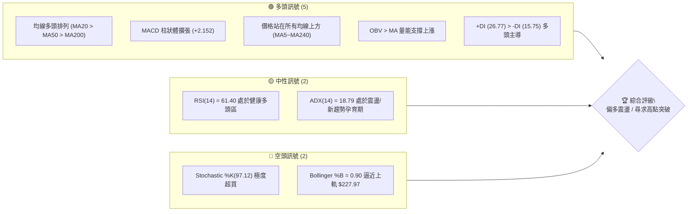
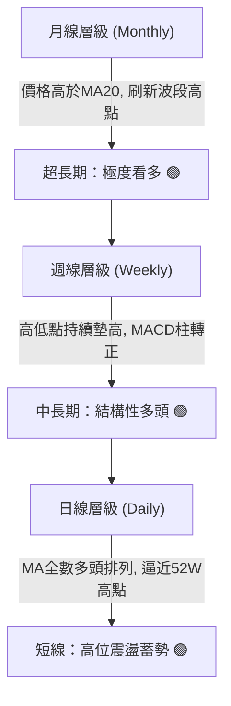
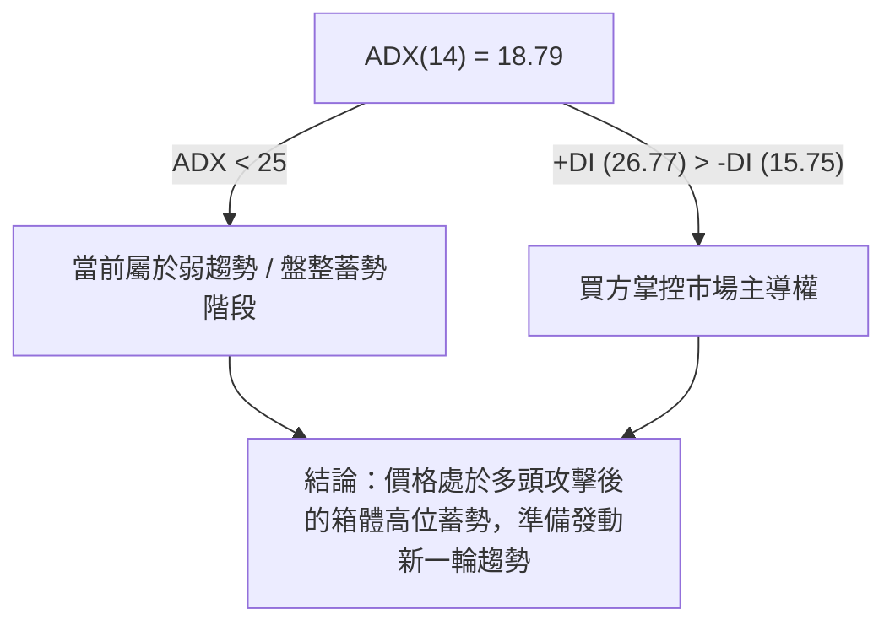
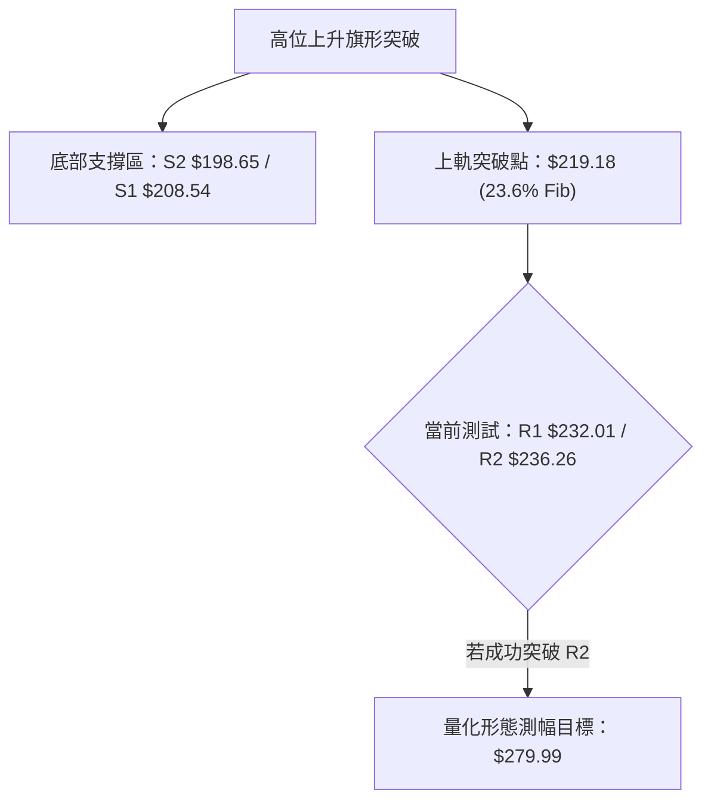
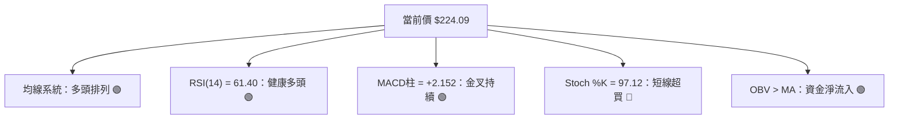
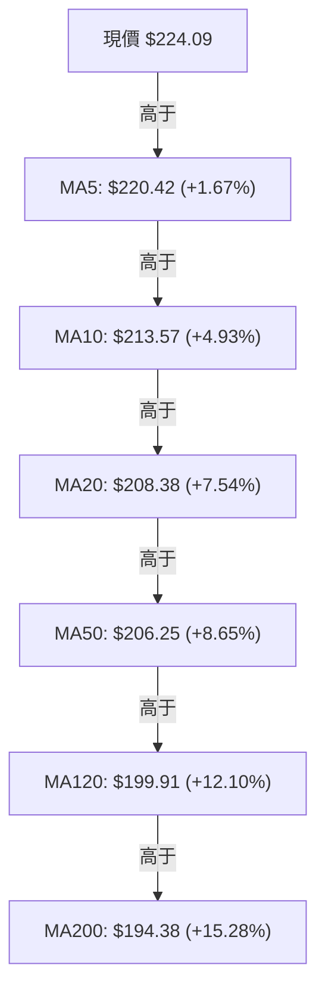
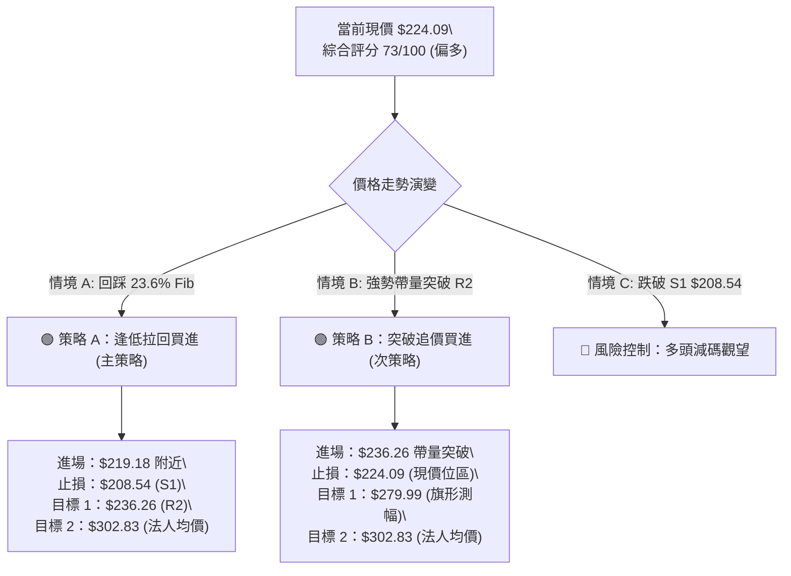
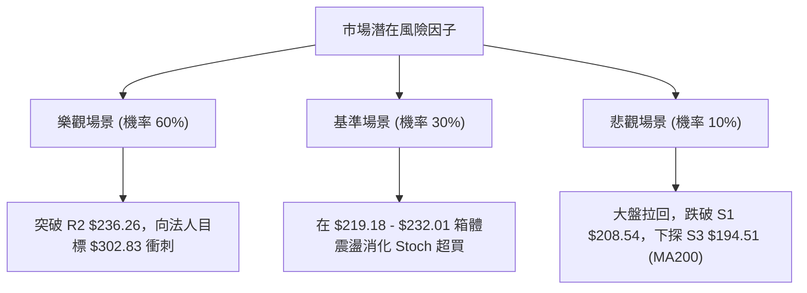

# NVDA 技術分析報告

> **報告日期**：2026-08-13 ｜ **語言**：繁體中文 ｜ **數據來源**：Yahoo Finance ｜ **當前價格**：$224.09

---

## 目錄

| 章節 | 內容 |
|------|------|
| [1. 技術面概覽](#1-技術面概覽) | 訊號儀表板、核心指標、評分卡 |
| [2. 趨勢分析](#2-趨勢分析) | 多時框趨勢、長中短期走勢、ADX強弱 |
| [3. 圖表形態分析](#3-圖表形態分析) | 形態識別、K線組合、目標價推算 |
| [4. 支撐與阻力](#4-支撐與阻力) | 關鍵價位、斐波那契回調層級 |
| [5. 技術指標深度解讀](#5-技術指標深度解讀) | MA/RSI/MACD/布林/成交量量價關係 |
| [6. 動能與波動率](#6-動能與波動率) | 動能評估、ATR風控、Beta市場相關性 |
| [7. 多時框架總結](#7-多時框架總結) | 時框架評分矩陣與信號收斂 |
| [8. 交易策略建議](#8-交易策略建議) | 主次策略、進出場點位與風報比 |
| [9. 風險提示與監控](#9-風險提示與監控) | 關鍵監控指標、風險情境觸發點 |

---

## 1. 技術面概覽

### 🎯 技術訊號儀表板



### 📊 核心指標速覽表

| 指標類別 | 指標名稱 | 當前數值 | 訊號 | 專業解讀 |
|----------|----------|----------|------|----------|
| **價格** | 當前價格 | $224.09 | 🟢 多頭 | 處於52週區間83.2%高位，穩居所有均線之上 |
| **均線** | MA20 | $208.38 | 🟢 多頭 | 短期扣抵低價，斜率向上，構成第1道動態支撐 |
| **均線** | MA50 | $206.25 | 🟢 多頭 | 中期趨勢線，與MA20形成金叉助漲結構 |
| **均線** | MA200 | $194.38 | 🟢 多頭 | 長期牛熊分界線，斜率穩定向上，長牛格局未變 |
| **動能** | RSI(14) | 61.40 | 🟢 多頭 | 未達70超買過熱區，具備進一步向上衝刺空間 |
| **動能** | MACD | +2.152 | 🟢 多頭 | DIF(4.328) > DEA(2.176)，柱狀圖正值擴張 |
| **動能** | Stoch %K/%D | 97.12 / 85.16 | 🔴 空頭 | 隨機指標進入極度超買區，短線留意回檔拉回 |
| **波動** | ATR(14) | $7.83 (3.50%) | 🟡 中性 | 日均波動幅度溫和，有利於定點設置止損 |

### 🏆 技術評分卡

```
╔══════════════════════════════════════════════════════════════════╗
║              NVDA 技術面綜合評分卡 (2026-08-13)                 ║
╠══════════════════════════════════════════════════════════════════╣
║  均線排列      ████████████████████  100/100  🟢 強勢多頭        ║
║  動能指標      ███████████████░░░░░   75/100  🟢 多頭占優        ║
║  支撐穩定度    ████████████████░░░░   80/100  🟢 結構堅實        ║
║  成交量配合    ████████████░░░░░░░░   60/100  🟡 量能稍顯不足    ║
║  形態完整度    ███████████████░░░░░   75/100  🟢 區間突破中      ║
║  趨勢強度(ADX) █████████░░░░░░░░░░░   45/100  🟡 低ADX震盪累積   ║
╠══════════════════════════════════════════════════════════════════╣
║  綜合技術評分  ███████████████░░░░░   73/100  🟢 偏多進攻態勢    ║
╚══════════════════════════════════════════════════════════════════╝
```

---

## 2. 趨勢分析

### 🌐 多時框趨勢分析



### 📈 長期趨勢 — 24個月走勢圖（Unicode）

```
NVDA 歷史收盤價走勢示意圖 ($)
$240 ┼                                                  ● (224.09)
$220 ┼                                            ●  ●
$200 ┼                                   ●     ●
$180 ┼                      ●  ●  ●   ●     ●
$160 ┼                ●  ●
$140 ┼       ●  ●  ●
$120 ┼ ●  ●        ●
$100 ┼          ●  ●
     └─┬──┬──┬──┬──┬──┬──┬──┬──┬──┬──┬──┬──┬──┬──┬──┬──┬──┬──┬──
       24 24 24 24 25 25 25 25 25 25 25 25 26 26 26 26 26 26 26 26
       08 10 12 02 04 06 08 10 12 02 04 06 08 (月)
```

#### 歷史走勢特徵分析表

| 階段歷史 | 代表月份 | 區間收盤價 | 漲跌特徵 | 技術面解讀 |
|----------|----------|------------|----------|------------|
| **打底打基區** | 2025-03 ~ 2025-04 | $108.23 - $108.77 | 築底區間 | 完成中期底部打底，消化早期獲利賣壓 |
| **主升段發動** | 2025-05 ~ 2025-10 | $134.94 - $202.23 | 強勢主升 | 5個月漲幅達86.8%，突破200美元大關 |
| **高位箱體洗盤**| 2025-11 ~ 2026-03 | $174.20 - $190.90 | 寬幅震盪 | 於$170-$190形成強烈換手洗盤箱體 |
| **二次發動衝刺**| 2026-04 ~ 2026-08 | $199.34 - $224.09 | 穩步推升 | 突破前高箱體，刷新歷史高位區，趨勢延伸中 |

### 📊 中期趨勢（週線分析）

近20週數據顯示，NVDA在2026年6月末一度回踩$192.53（接近61.8%斐波那契位$191.51及S3 $194.51），隨後迅速獲得買盤支撐。8月次週收盤大漲至$223.96，本週持續站穩在$224.09，MACD週線柱狀體大幅回升至+2.152，確立中期修正結束，重回多頭上升通道。

### ⚡ 趨勢強度評估（ADX 解讀）



*   **ADX 數值分析**：ADX(14) 當前為 **18.79**，低於臨界值 25。這表明雖然價格近期漲幅顯著，但從統計角度看，市場尚未進入狂熱的「單邊趨勢加速期」，而是屬於「多頭主導下的震盪推升/籌碼整理期」。
*   **方向指標 (+DI / -DI)**：+DI 為 **26.77**，顯著高於 -DI 的 **15.75**，證明多頭力量佔據絕對優勢，空頭反撲無力。

---

## 3. 圖表形態分析

### 🔍 形態識別系統

根據近一年OHLCV走勢與關鍵高低點，NVDA已完成一個大型的「高位上升旗形（Ascending Flag / High-Tight Consolidation）」突破，目前正在測試52週歷史高點 $236.26 的頸線壓力。



#### 圖表形態信心度評估表

| 形態名稱 | 信心度 | 判斷依據（引用數據） | 完成度 | 測幅目標價（附計算式） |
|----------|--------|----------------------|--------|------------------------|
| **高位上升旗形** | **75%** 🟢 | 1. 旗桿：$163.85(52W Low) → $236.26(52W High)<br>2. 旗面：回踩至 $192.53 (61.8% Fib $191.51受支撐)<br>3. 突破：收盤價 $224.09 突破旗面上軌 $219.18 | **85%** | **$279.99**<br>計算式：突破點 $236.26 + (旗桿高度 $236.26 - $192.53 = $43.73) = $279.99 |
| **雙重底 (W底)** | **65%** 🟢 | 1. 左底：2026-03月低點 $174.20<br>2. 右底：2026-06月週低點 $192.53<br>3. 頸線：突破 $210.89 | **100%** | **$247.58**<br>計算式：頸線 $210.89 + (頸線 $210.89 - 右底 $192.53 = $18.36) = $229.25 |

### 🕯️ 重要K線形態分析

| 日期/週期 | 收盤價 | K線形態 | 技術解讀 | 多空訊號 |
|-----------|--------|---------|----------|----------|
| 2026-06-28 | $192.53 | 長下影錘子線 | 於S3 $194.51強支撐區出現止跌訊號，多頭強力回防 | 🟢 底訊 |
| 2026-07-12 | $210.96 | 大陽線收復MA20 | 一舉站回MA20($208.38)，多頭重掌短線發球權 | 🟢 強勢 |
| 2026-08-09 | $223.96 | 長陽突破實體 | 單週大漲11.5%，成交量放量至6.41億股，確認跳空向上 | 🟢 強勢 |
| 2026-08-16 | $224.09 | 高位窄幅十字星 | 逼近BB上軌$227.97與R1 $232.01，高位獲利回吐與買盤換手 | 🟡 震盪 |

### 📉 ASCII 走勢形態示意圖

```
NVDA 高位上升旗形突破與頸線測試示意圖
════════════════════════════════════════════════════════════════
$236.26 ┤............................................[R2 52W高點壓力]
        │                                          / 
$232.01 ┤.....................................[R1/當前測試區]
        │                                    /
$224.09 ┤...................................● [現價 $224.09]
        │                                  / 
$219.18 ┤.............................[旗面上軌突破點 / 23.6% Fib]
        │            ▲               /
$208.54 ┤───────────/─\─────────────/─────────[S1 / MA20 $208.38]
        │          /   \  旗面洗盤 /
$198.65 ┤─────────/─────\────────/────────────[S2 / 50% Fib $200.06]
        │        /       \______/
$192.53 ┤───────● (旗面底部低點 $192.53)──────[S3 / 61.8% Fib $191.51]
════════════════════════════════════════════════════════════════
```

---

## 4. 支撐與阻力

### 🗺️ 關鍵價位分布圖（Unicode）

```
NVDA 價位結構分布圖
═════════════════════════════════════════════════════════════════
$236.26 ║████████████████████████████████████████║ 強阻力 R2 (52W High)
$232.01 ║████████████████████████████            ║ 波段阻力 R1
$224.09 ╠════════════════════════════════════════╣ ◄ 當前價格 $224.09
$219.18 ║▓▓▓▓▓▓▓▓▓▓▓▓▓▓▓▓▓▓▓▓▓▓▓▓▓▓▓▓            ║ 短線轉強位 (23.6% Fib)
$208.54 ║████████████████████████████████        ║ 第一強支撐 S1 (MA20/38.2% Fib)
$200.06 ║▓▓▓▓▓▓▓▓▓▓▓▓▓▓▓▓▓▓▓▓                    ║ 心理關卡 (50.0% Fib)
$198.65 ║████████████████████████████████████    ║ 第二強支撐 S2 (波段低點)
$194.51 ║████████████████████████████████████████║ 核心防守位 S3 (MA200 $194.38)
═════════════════════════════════════════════════════════════════
```

### 🚧 阻力位分析表

| 阻力級別 | 精確價位 | 形成原因 | 突破難度 | 技術重要性 |
|----------|----------|----------|----------|------------|
| **阻力 R1** | **$232.01** | 近一年波段高點聚類與整數關卡前哨 | 🟡 中等 | 短線多頭攻擊的第一道關卡，突破將開啟對歷史高點的挑戰 |
| **阻力 R2** | **$236.26** | 52週歷史最高點 (52W High) | 🔴 極高 | 歷史天花板，解套賣壓與獲利結算重鎮，需配合擴量才能有效突破 |

### 🛡️ 支撐位分析表

| 支撐級別 | 精確價位 | 形成原因 | 守住機率 | 技術重要性 |
|----------|----------|----------|----------|------------|
| **支撐 S1** | **$208.54** | 波段低點聚類 + MA20 ($208.38) + 38.2% Fib ($208.60) | 🟢 85% | **多頭強弱分界線**，三重技術指標重疊，多頭不容有失的陣地 |
| **支撐 S2** | **$198.65** | 波段低點聚類 + 50.0% Fib ($200.06) | 🟢 75% | 中期整理箱體底部，守住則多頭格局不變 |
| **支撐 S3** | **$194.51** | 波段低點聚類 + MA200 ($194.38) | 🟢 90% | **長線牛熊總防線**，與200日均線高度重合，觸及必有強烈買盤 |

### 📐 斐波那契回調位分析（以 52週區間 $163.85 → $236.26 計算）

| 斐波那契層級 | 精確價位 | 當前相對位置與意義 |
|--------------|----------|--------------------|
| **0.0%** | **$236.26** | 52週最高點，終極目標位與強阻力 |
| **23.6%** | **$219.18** | **當前價格($224.09)位於 0.0% 與 23.6% 之間**，屬於極強勢的回調支撐區 |
| **38.2%** | **$208.60** | 與 S1 ($208.54) 及 MA20 ($208.38) 共振，黃金分割關鍵支撐 |
| **50.0%** | **$200.06** | 心理整數大關，中期強弱均衡點 |
| **61.8%** | **$191.51** | 黃金分割強防守位，接近6月末回踩低點 $192.53 |
| **78.6%** | **$179.35** | 深幅回調防守點 |
| **100.0%** | **$163.85** | 52週最低點 |

---

## 5. 技術指標深度解讀

### 🎛️ 指標訊號總覽



### 📈 移動平均線排列分析



*   **排列狀態**：短、中、長期均線呈現經典的**標準多頭排列**（MA5 > MA10 > MA20 > MA50 > MA120 > MA200）。
*   **均線斜率**：所有均線之斜率均向上彎升，且價格位於所有均線之上（距MA200達+15.28%），顯示中長期買盤極為紮實。

### 📉 RSI(14) 分析

*   **當前數值**：**61.40**
*   **強度進度條**：`█████████████░░░░░░░` 61.40%
*   **區間解讀**：RSI落於 50–70 的「多頭控盤區」。既非低迷的弱勢區，亦未觸及 >70 的極度過熱超買區，表明多頭推進過程節奏溫和，仍有向上發揮的動能空間。
*   **背離檢測**：價格自6月末$192.53反彈至$224.09，RSI同步從38.7回升至61.40，**無頂背離現象**，價量與動能保持一致。

### 📊 MACD(12,26,9) 訊號解讀

*   **DIF 快線**：4.328
*   **DEA 慢線**：2.176
*   **MACD 柱狀體**：**+2.152**
*   **解讀**：快線在零軸上方大幅穿越慢線，且柱狀圖正值持續擴大（自7月下旬由負轉正後持續拉升），顯示中線多頭衝刺動能強勁。

### 📦 布林通道分析

```
NVDA 布林通道 (Bollinger Bands) 位置示意圖
════════════════════════════════════════════════════════════════
$227.97 ┤────────────────────────────────────────── 布林上軌 (BB Upper)
$224.09 ┤...................................● 現價 (BB %B = 0.90)
$208.38 ┤────────────────────────────────────────── 布林中軌 (MA20)
$188.80 ┤────────────────────────────────────────── 布林下軌 (BB Lower)
════════════════════════════════════════════════════════════════
```

*   **通道狀態**：上軌 $227.97，中軌 $208.38，下軌 $188.80。
*   **%B 指標**：當前 %B 為 **0.90**，意味著價格高度貼近布林通道上軌（1.0為上軌）。這通常代表「強勢通道貼軌運行」，但也提示短線向上空間受限於上軌$227.97，若未帶量突破，可能隨時回踩中軌$208.38。

### 💹 成交量分析（量價配合度）

*   **成交量數據**：最新日成交量 **106,431,963** 股，相較於20日均量 **124,871,908**（量比 0.85x）及50日均量 **140,574,579**，呈現「量縮上漲/高位鎖籌」特徵。
*   **OBV (能量潮指標)**：OBV > MA，顯示大資金中長期為「淨流入」狀態，籌碼集中度高。
*   **量價結論**：目前高位量能稍有退潮（0.85x），顯示多頭在衝刺 R1 $232.01 / R2 $236.26 前觀望氣氛增加。突破歷史高點必須要求成交量放大至1.3億股以上。

---

## 6. 動能與波動率

### ⚡ 動能評估四象限

| 象限分類 | 動能強度 | 波動率狀態 | 當前 NVDA 歸屬位置 | 戰術建議 |
|----------|----------|------------|--------------------|----------|
| **Q1: 趨勢爆發** | 強 | 高 | — | 追漲並緊盯止損 |
| **Q2: 穩健推升** | **強** | **中/低** | **✓ (NVDA 當前歸屬點)** | **逢拉回支撐點布局** |
| Q3: 震盪沉悶 | 弱 | 低 | — | 觀望等待方向 |
| Q4: 高危洗盤 | 弱 | 高 | — | 嚴格避險 |

NVDA 當前 RSI=61.40、MACD柱正向擴張，動能屬於「強」；而 ATR(14) 為 $7.83（僅占股價3.50%），波動率屬於「溫和控制」，因此落入 **Q2 穩健推升象限**。

### 📊 ATR 波動率與止損設定

*   **ATR(14)**：$7.83 (3.50%)
*   **追蹤止損距離建議**：
    *   *短線交易 (1.5x ATR)*：$7.83 × 1.5 = $11.75 → 自最高點下撤 $11.75 設定止損。
    *   *波段交易 (2.0x ATR)*：$7.83 × 2.0 = $15.66 → 止損價設為 $224.09 - $15.66 = **$208.43**（完美與 S1 $208.54 及 MA20 $208.38 重合）。

### 📐 Beta 與市場相關性

*   **Beta 係數**：**2.215**
*   **特性分析**：NVDA 的 Beta 高達 2.215，意味著其波動幅度為大盤（S&P 500）的 2.21 倍。在市場總體多頭環境下具備極高的超額收益（Alpha）彈性，但在大盤回檔時亦面臨雙倍拉回風險。

---

## 7. 多時框架總結

### 📋 時框架評分表

| 時框架 | 趨勢方向 | 動能指標 | 均線排列 | 形態結構 | 綜合評分 | 建議策略 |
|--------|----------|----------|----------|----------|----------|----------|
| **月線 (Long-term)** | 🟢 多頭 | RSI 70+ 強勢 | 多頭排列 | 歷史天花板突破 | **85/100** | 偏多持有 |
| **週線 (Medium-term)**| 🟢 多頭 | MACD 柱轉正 | 多頭排列 | 雙底/旗形突破 | **78/100** | 逢低加碼 |
| **日線 (Short-term)** | 🟡 震盪偏多 | Stoch 超買 | 多頭排列 | 逼近上軌/天花板 | **70/100** | 區間高拋低吸/等待突破 |

### 🔲 綜合訊號矩陣與多時框收斂結論

*   **多時框收斂規則（規則 14 應用）**：
    *   當前 ADX(14) = 18.79 (< 25)，屬於**中短期箱體整理/蓄勢突破行情**。
    *   依據收斂規則，中長期（週線/MA200 $194.38、MA50 $206.25）方向完全為強勢多頭，因此**日線的短線震盪與Stochastic超買（97.12）應視為「尋找多頭進場/加碼點」的時機，而非做空訊號**。
    *   **唯一方向結論**：**偏多控盤，主打逢回踩買進（Dip Buying），配合突破追價（Breakout Buying）**。

---

## 8. 交易策略建議

### 🗺️ 策略決策流程圖



### 🧭 策略路由

**當前主策略方向 = 偏多操作（綜合評分 73/100）**

### 🎯 價格情境階梯 (Price Scenarios)

| 觸發條件 | 下一目標價 | 後續延伸目標 | 情境技術含義 |
|----------|------------|--------------|--------------|
| **突破 R1 $232.01** | **R2 $236.26** | **$279.99** | 短線多頭發動強攻，挑戰歷史新高 |
| **站穩現價區間** | **$227.97 (BB上軌)**| **R1 $232.01** | 高位消化 Stoch 超買賣壓，時間換取空間 |
| **跌破 23.6% Fib $219.18**| **S1 $208.54** | **S2 $198.65** | 回踩 MA20 關鍵支撐測試買盤 |

### 📊 情境機率分佈

| 情境劇本 | 機率 | 主要技術依據 |
|----------|------|--------------|
| **1. 蓄勢突破歷史高點** | **60%** 🟢 | 均線標準多頭排列，MACD柱正向擴張，法人評級 Strong Buy ($302.83) |
| **2. 高位箱體震盪整理** | **30%** 🟡 | ADX = 18.79 顯現弱趨勢， Stoch(97.12) 超買需時間消化 |
| **3. 深幅回檔測試 S1/S2**| **10%** 🔴 | 量能稍顯不足 (0.85x)，若大盤拉回可能回踩 $208.54 |

### 🟢 交易策略詳情表

所有價位均嚴格引用前述計算之精確價位：

| 策略要素 | 🟢 策略 A：逢低拉回加碼（首選） | 🟢 策略 B：突破歷史高點追擊 |
|----------|─────────────────────────────────|─────────────────────────────|
| **策略類型** | 順勢回踩買進 (Pullback Buy) | 帶量突破追價 (Breakout Buy) |
| **進場觸發條件** | 股價拉回至 23.6% Fib $219.18 附近 | 收盤價強勢突破 52W High $236.26 且日量>1.3億股 |
| **精確進場點** | **$219.18** | **$236.26** |
| **第一目標價 (T1)**| **$236.26** (52W High, +7.79%) | **$279.99** (旗形測幅目標, +18.51%) |
| **第二目標價 (T2)**| **$302.83** (分析師共識均價, +38.16%)| **$302.83** (分析師共識均價, +28.18%) |
| **硬止損價 (SL)** | **$208.54** (跌破 S1 / MA20，-4.85%) | **$224.09** (跌回突破前高點/現價區，-5.15%) |
| **風險報酬比 (R:R)**| **1.60 : 1** (至T1) / **7.86 : 1** (至T2) | **3.59 : 1** (至T1) / **5.47 : 1** (至T2) |
| **預估勝率** | **68%** | **60%** |
| **建議倉位** | **15% - 20%** | **10% - 15%** |

*風報比計算示範 (策略 A 至 T1)*：  
$\text{潛在收益} = \$236.26 - \$219.18 = \$17.08$  
$\text{潛在風險} = \$219.18 - \$208.54 = \$10.64$  
$\text{風險報酬比} = 17.08 / 10.64 = 1.60$

### 🔴 反向風險觸發點（對沖提示）

*   **觸發條件**：若股價無預警跌破 **S1 $208.54** 且收盤確認，意味著短期 MA20 宣告失守。
*   **應對行動**：多頭應立即清退短線槓桿倉位，並於 **S2 $198.65 / S3 $194.51** 建立空頭對沖保險，直至股價重新站回 MA20。

### ⭐ 整體訊號強度評星

```
做多訊號強度：  ★★███  (4.0 / 5.0 星)  🟢 強烈
做空訊號強度：  ★░░░░  (1.0 / 5.0 星)  🔴 極弱
整體技術可信度：★★███  (4.2 / 5.0 星)  🟢 高度可信
```

---

## 9. 風險提示與監控

### ✅ 關鍵監控指標 Checklist

```
╔══════════════════════════════════════════════════════════════════╗
║                   NVDA 風控與指標監控清單                         ║
╠══════════════════════════════════════════════════════════════════╣
║ [ ] 價位防守：收盤價是否守住 S1 $208.54 (MA20 / 38.2% Fib)       ║
║ [ ] 突破確認：挑戰 R2 $236.26 時，單日成交量是否 > 1.3億股       ║
║ [ ] 指標降溫：Stochastic %K 是否順利從 97.12 回落至 80 以下      ║
║ [ ] 趨勢增強：ADX(14) 是否由 18.79 向上勾頭突破 25               ║
║ [ ] 均線支撐：MA5 ($220.42) 是否形成日線級別有效扣抵支撐         ║
╚══════════════════════════════════════════════════════════════════╝
```

### ⚠️ 風險場景分析



### 🛡️ 風險管理重要提醒

1.  **高 Beta 係數風險**：NVDA 的 Beta 值高達 2.215，若大盤（科技股那斯達克100）出現急跌，NVDA 回檔幅度將會放大，請嚴格執行止損紀律。
2.  **超買指標修復**：隨機指標 Stochastic %K 目前高達 97.12，屬於極度超買狀態，短線切忌在逼近 R1 $232.01 時過度追高，應優先選擇回踩 $219.18 時分批布局。

---

## 📋 報告總結

```
╔══════════════════════════════════════════════════════════════════╗
║                  NVDA 技術分析報告總結 (SUMMARY)                ║
════════════════════════════════════════════════════════════════════
報告日期：2026-08-13
當前價格：$224.09
分析評級：🟢 買入 / 逢低加碼 (Strong Buy / Dip Buy)

關鍵結論：
├─ 長期趨勢：🟢 強勢多頭 (均線多頭排列 MA20>MA50>MA200)
├─ 中期趨勢：🟢 雙底/上升旗形完成，重回上升通道
├─ 短期趨勢：🟡 逼近天花板 $236.26，高位震盪修復超買
├─ 關鍵支撐：S1 $208.54 / S2 $198.65 / S3 $194.51
├─ 關鍵阻力：R1 $232.01 / R2 $236.26 (52週最高點)
└─ 分析師目標：$302.83 (均價) / $500.00 (最高)

最優策略組合：
1. 🥇 首選策略：回踩 23.6% Fib $219.18 進場做多，止損 $208.54，目標 $236.26 / $302.83
2. 🥈 次選策略：強勢帶量突破 R2 $236.26 後追價，目標 $279.99
════════════════════════════════════════════════════════════════════
```

---

> ⚠️ **免責聲明**：本報告為 AI 自動生成之技術分析，所有數據及估算均基於提供的歷史價格資訊。本報告**僅供研究與學術參考**，**不構成任何投資建議**。投資有風險，入市需謹慎。

---

*報告生成時間：2026-08-13 ｜ 數據來源：Yahoo Finance ｜ 分析框架：多時框技術分析*