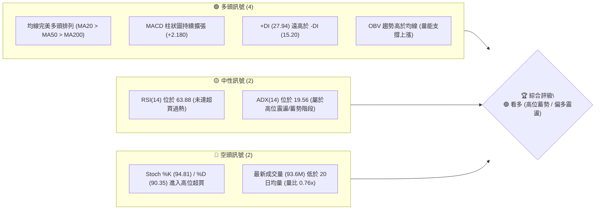
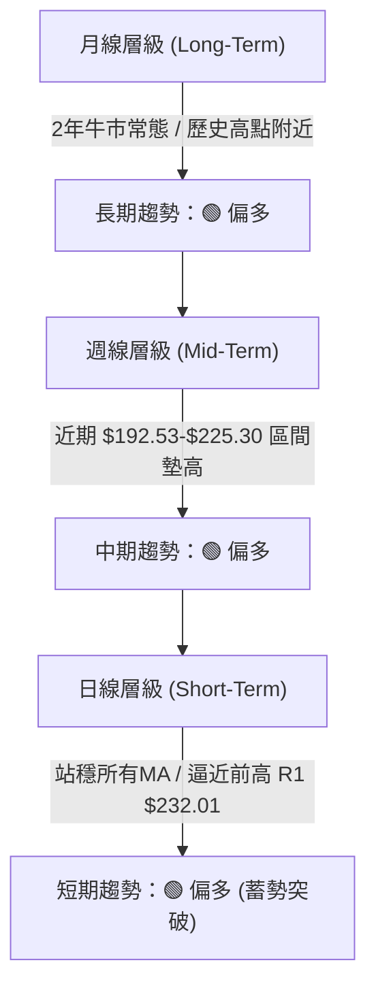
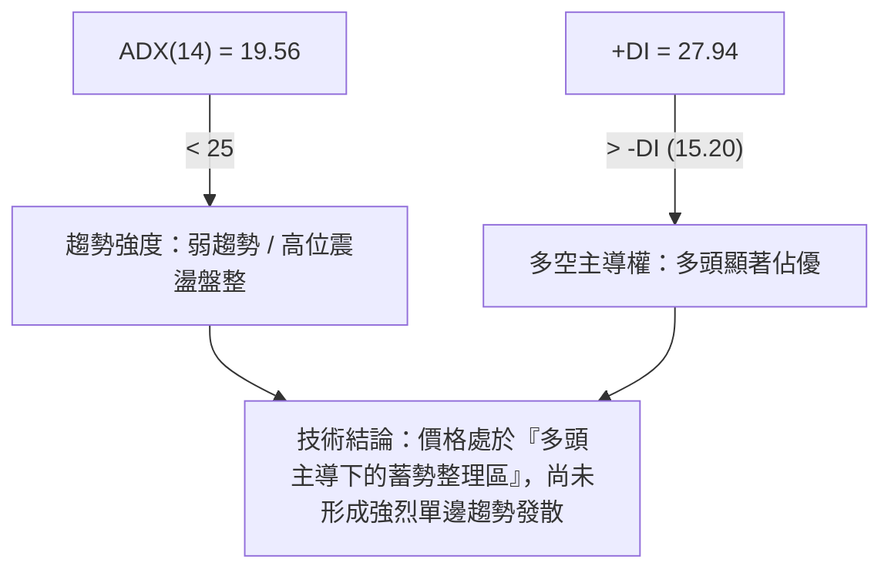
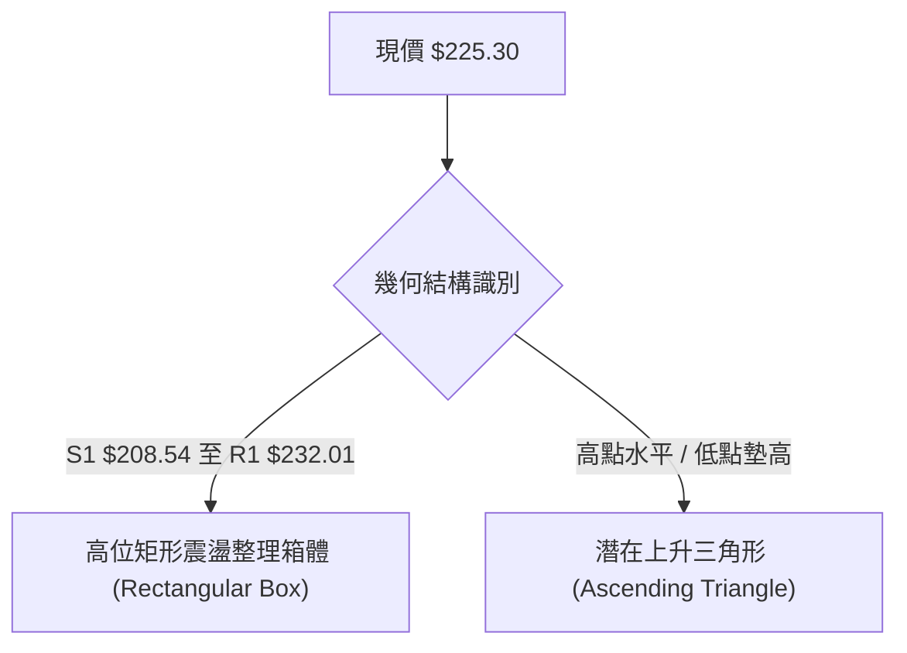
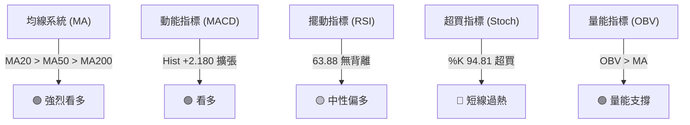
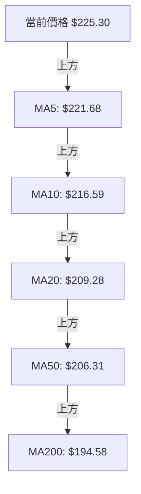
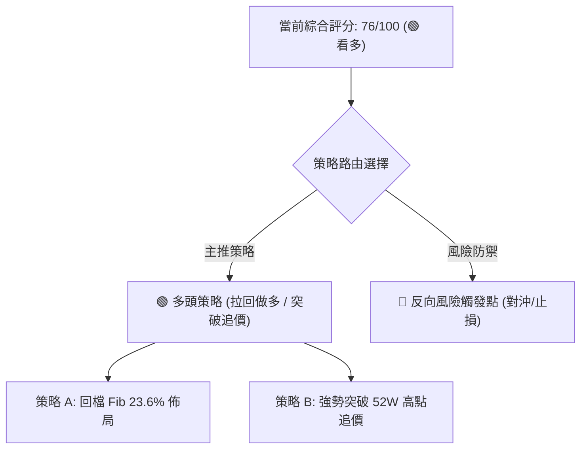
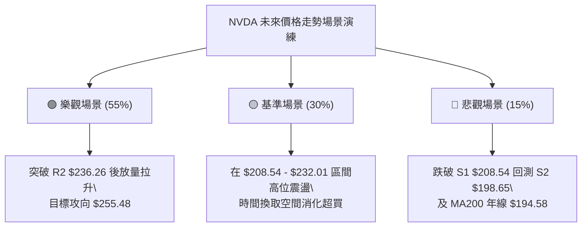

# NVDA 技術分析報告

> **報告日期**：2026-08-14 ｜ **語言**：繁體中文 ｜ **數據來源**：Yahoo Finance ｜ **當前價格**：$225.30

---

## 目錄

| 章節 | 內容 |
|------|------|
| [1. 技術面概覽](#1-技術面概覽) | 訊號儀表板、核心指標、評分卡 |
| [2. 趨勢分析](#2-趨勢分析) | 多時框趨勢、長中短期走勢、ADX強度 |
| [3. 圖表形態分析](#3-圖表形態分析) | 形態識別、K線組合、目標價推算 |
| [4. 支撐與阻力](#4-支撐與阻力) | 關鍵價位、斐波那契回調結構 |
| [5. 技術指標深度解讀](#5-技術指標深度解讀) | MA/RSI/MACD/布林通道/成交量OBV |
| [6. 動能與波動率](#6-動能與波動率) | 動能四象限、ATR防禦、Beta相關性 |
| [7. 多時框架總結](#7-多時框架總結) | 時框架評分矩陣、多時框收斂 |
| [8. 交易策略建議](#8-交易策略建議) | 策略分流、價位階梯、實戰攻守計畫 |
| [9. 風險提示與監控](#9-風險提示與監控) | 風險觸發清單、多空場景演練 |

---

## 1. 技術面概覽

### 🎯 技術訊號儀表板



### 📊 核心指標速覽表

| 指標類別 | 指標名稱 | 當前數值 | 訊號 | 解讀 |
|----------|----------|----------|------|------|
| **價格** | 當前價格 | $225.30 | 🟢 看多 | 位於 52週區間 $163.85 - $236.26 的 84.9% 高位 |
| **均線** | MA20 | $209.28 | 🟢 看多 | 價格高於 MA20 達 +7.66%，短期強勢 |
| **均線** | MA50 | $206.31 | 🟢 看多 | 價格高於 MA50 達 +9.20%，中期趨勢健康 |
| **均線** | MA200 | $194.58 | 🟢 看多 | 價格高於 MA200 達 +15.79%，長期牛市築底堅實 |
| **動能** | RSI(14) | 63.88 | 🟡 中性 | 動能溫和偏多，尚未進入 >70 區間，無背離 |
| **動能** | MACD | +2.180 (Hist) | 🟢 看多 | MACD線(4.901)高於Signal(2.721)，金叉持續 |
| **波動** | ATR(14) | $7.58 | 🟡 中性 | 每日波動率約 3.36%，具備中等價格彈性 |
| **擺動** | Stoch %K/%D | 94.81 / 90.35 | 🔴 空頭 | 極度超買，短線存在回檔或高位橫盤消化需求 |
| **趨勢** | ADX(14) | 19.56 | 🟡 中性 | ADX < 25，顯示價格處於區間整理/高位蓄勢 |

### 🏆 技術評分卡

```
╔══════════════════════════════════════════════════════════════════╗
║              NVDA 技術面綜合評分卡 (2026-08-14)                  ║
╠══════════════════════════════════════════════════════════════════╣
║ 趨勢強度 (Trend)     █████████████░░░░░░░  65/100 🟡 中性偏強  ║
║ 動能指標 (Momentum)  ███████████████░░░░░  78/100 🟢 看多      ║
║ 支撐穩定度 (Support) ████████████████░░░░  82/100 🟢 看多      ║
║ 成交量配合 (Volume)  ███████████░░░░░░░░░  58/100 🟡 中性      ║
║ 形態完整度 (Pattern) ███████████████░░░░░  75/100 🟢 看多      ║
║ 均線排列 (MAs)       ████████████████████  100/100 🟢 強烈看多 ║
╠══════════════════════════════════════════════════════════════════╣
║ 綜合技術評分         ███████████████░░░░░  76/100  🟢 看多(偏多)║
╚══════════════════════════════════════════════════════════════════╝
```

---

## 2. 趨勢分析

### 🌐 多時框趨勢分析



### 📈 長期趨勢 — 24個月走勢圖（Unicode）

以下基於 NVDA 過去 24 個月歷史收盤價繪製之月線價格軌跡與關鍵轉折點：

```
NVDA 月線走勢圖 (2024-08 至 2026-08)
價格軸 ($)
$240 ┤                                                       ● (52W High $236.26)
$220 ┤                                               ●   ●   ● $225.30 (現在)
$200 ┤                                   ●       ●       ●
$180 ┤                           ●   ●       ●       ●
$160 ┤                       ●
$140 ┤         ●   ●
$120 ┤ ●   ●           ●               ●
$100 ┤                 ● (低點 $108.23)
     └─┬───┬───┬───┬───┬───┬───┬───┬───┬───┬───┬───┬───┬───┬───┬───►
      24/8 10  12 25/2  4   6   8  10  12 26/2  4   6   8
```

#### 走勢特徵階段拆解：

| 階段 | 時間區間 | 起始價 → 終點價 | 漲跌幅 | 技術特徵與型態 |
|------|----------|------------------|--------|----------------|
| **1. 深度回檔** | 2024-11 → 2025-03 | $138.03 → $108.23 | -21.59% | 中期獲利了結賣壓，於 $108.23 觸底建立長期堅實支撐點 |
| **2. 主升段衝刺**| 2025-04 → 2025-10 | $108.77 → $202.23 | +85.92% | 量價齊揚，帶動均線多頭發散，突破兩百美元關卡 |
| **3. 高位震盪箱體**| 2025-11 → 2026-03 | $176.77 → $174.20 | -1.45% | 消化獲利籌碼，最低下探至 52週低點 $163.85 附近回升 |
| **4. 再次發力** | 2026-04 → 2026-08 | $199.34 → $225.30 | +13.02% | 底部逐波墊高，現已收復所有均線，蓄勢挑戰 52週高點 $236.26 |

### 📊 中期趨勢（週線分析）

從近 20 週收盤走勢來看：
* **關鍵低點**：2026-06-28 週收盤 $192.53，與 S3 ($194.51) 及 MA200 ($194.58) 形成強烈的密集支撐帶。
* **價格回升**：自 2026-07-05 啟動反彈後，週線 MACD 柱狀圖於 2026-08-09 翻正至 +2.497，最新一週為 +2.180，展現出強烈的多頭續航力。
* **區域壓制**：阻力 R1 $232.01 與 52週高點 R2 $236.26 為當前波段的主要壓制天花板。

### ⚡ 趨勢強度評估（ADX 解讀）



| ADX 數值區間 | 當前狀態 | 市場含義 | 交易操作指導 |
|--------------|----------|----------|--------------|
| **0 – 20**   | **19.56 █▓░░░** | **無明顯趨勢 / 盤整蓄勢** | **依據規則14：採用布林通道上下軌及斐波那契區間進退** |
| 20 – 25      | -        | 趨勢萌芽中 | 觀察突破訊號 |
| 25 – 50      | -        | 強勢單邊趨勢 | 順勢追價 / 均線持股 |

---

## 3. 圖表形態分析

### 🔍 形態識別系統



#### 形態信心度與目標價評估表：

| 形態名稱 | 信心度 | 判斷依據（引用數據） | 完成度 | 目標價計算式與精確數值 |
|----------|--------|----------------------|--------|------------------------|
| **高位矩形箱體** | **75%** ▓▓▓▓▓▓▓▓▓▓ | 下軌以 S1 $208.54 為支撐，上軌受制於 R1 $232.01 | 85% | **突破目標價** = 頸線 $232.01 + 形態高度 ($232.01 - $208.54 = $23.47) = **$255.48** |
| **上升三角形** | **65%** ▓▓▓▓▓▓█░░░ | 水平阻力 R1 $232.01，低點由 $192.53 墊高至 $200.75 | 70% | **突破目標價** = 阻力 $232.01 + 形態高度 ($232.01 - $200.75 = $31.26) = **$263.27** |

### 🕯️ 重要 K 線形態分析

| 日期 / 月份 | 收盤價 | 關鍵 K 線形態 | 解讀 | 多空訊號 |
|-------------|--------|---------------|------|----------|
| **2026-06** | $200.09 | 長下影探底線 | 下探 192.53 低點後獲得買盤迅速拉回，確認底部支撐 | 🟢 看多 |
| **2026-07** | $200.75 | 縮量十字星 (Doji) | 多空交戰激烈，成交量降至 5.6億，形成短期築底沉澱 | 🟡 中性 |
| **2026-08 (至今)**| $225.30 | 帶量長紅突破棒 | 價格一舉貫穿 MA20 ($209.28) 與 MA50 ($206.31)，多頭重掌主導權 | 🟢 看多 |

### 📉 ASCII 走勢形態示意圖

```
NVDA 高位矩形 / 上升三角形突破示意圖
$263.27 ┤                                            ★ (上升三角形目標)
$255.48 ┤                                    ★ (箱體突破目標)
$236.26 ┤                            ┌─ 52週高點 R2
$232.01 ┤───────────頂部阻力 R1 ─────┼───────────────
$225.30 ┤                    ● (現價)│
$219.18 ┤                ●           │ (Fib 23.6%)
$208.54 ┤────●───────●───────────────┴─ 底部支撐 S1 / 箱體下軌
$200.75 ┤        ● (低點墊高)
$192.53 ┤    ●
        └────────────────────────────────────────────► 時間
```

### 🎯 形態目標價計算

1. **矩形箱體突破目標價**：
   * 箱體上軌 ($232.01) - 箱體下軌 ($208.54) = **形態高度 $23.47**
   * 目標價 = $232.01 + $23.47 = **$255.48**
2. **上升三角形突破目標價**：
   * 水平頂部 ($232.01) - 抬升低點 ($200.75) = **形態高度 $31.26**
   * 目標價 = $232.01 + $31.26 = **$263.27**

---

## 4. 支撐與阻力

### 🗺️ 關鍵價位分布圖（Unicode）

```
NVDA 價位結構分布圖 (由 OHLCV 歷史數據聚類算出)
══════════════════════════════════════════════════════════════════
$236.26 ║████████████████████████████████████║ 52週歷史高點 (R2) [+4.87%]
$232.01 ║██████████████████████████████      ║ 近一年波段高點阻力 (R1) [+2.98%]
$230.26 ║▓▓▓▓▓▓▓▓▓▓▓▓▓▓▓▓▓▓▓▓▓▓▓▓▓▓▓▓        ║ 布林通道上軌 [+2.20%]
$225.30 ╠════════════════════════════════════╣ ◄ 當前價格 (Current Price)
$219.18 ║▓▓▓▓▓▓▓▓▓▓▓▓▓▓▓▓▓▓                  ║ 斐波那契 23.6% 回調位 [-2.72%]
$209.28 ║████████████████                    ║ MA20 均線 / 布林中軌 [-7.11%]
$208.60 ║████████████████                    ║ 斐波那契 38.2% 回調位 [-7.41%]
$208.54 ║████████████████████████████████████║ 近一年波段低點聚類 (S1) [-7.44%]
$200.06 ║████████████                        ║ 斐波那契 50.0% 中軸 [-11.20%]
$198.65 ║████████████████████████            ║ 強支撐位 (S2) [-11.83%]
$194.58 ║████████████                        ║ MA200 長期年線 [-13.64%]
$194.51 ║████████████████████████            ║ 底線強支撐 (S3) [-13.66%]
$163.85 ║████████████████████████████████████║ 52週歷史低點 (Fib 100%) [-27.27%]
══════════════════════════════════════════════════════════════════
```

### 🚧 阻力位分析表

| 阻力級別 | 精確價位 | 形成原因 | 突破難度 | 重要性 |
|----------|----------|----------|----------|--------|
| **R1** | **$232.01** | 近一年波段高點聚類，前波回檔起跌點 | 🟡 中等 | 🟢🟢🟢 (短線多空分水嶺) |
| **R2** | **$236.26** | 52週最高價，極具心理與技術壓力 | 🔴 較高 | 🟢🟢🟢🟢🟢 (歷史天花板) |

### 🛡️ 支撐位分析表

| 支撐級別 | 精確價位 | 形成原因 | 守住機率 | 重要性 |
|----------|----------|----------|----------|--------|
| **S1** | **$208.54** | 波段低點聚類 / 接近 MA20 ($209.28) 及 Fib 38.2% ($208.60) | 🟢 80% | 🟢🟢🟢🟢 (短線核心防線) |
| **S2** | **$198.65** | 中期低點密集成交區 / 靠近 Fib 50.0% ($200.06) | 🟢 85% | 🟢🟢🟢🟢 (中期多頭陣地) |
| **S3** | **$194.51** | 波段防禦底線 / 疊加 MA200 年線 ($194.58) | 🟢 90% | 🟢🟢🟢🟢🟢 (牛熊分界線) |

### 📐 斐波那契回調位分析（區間：$163.85 → $236.26）

現價 **$225.30** 目前落於 **Fib 0.0% ($236.26)** 與 **Fib 23.6% ($219.18)** 之間：
* **Fib 23.6% ($219.18)**：為回檔的第一道強支撐。現價距此有 +2.72% 的安全緩衝，若回檔不破此位，屬於極強勢整理。
* **Fib 38.2% ($208.60)**：與技術支撐 S1 ($208.54) 及 MA20 ($209.28) 形成三位一體的重疊黃金支撐帶，具備極強支撐力。
* **Fib 50.0% ($200.06)**：多空強弱分界軸，守住此位即宣告多頭架構完好。

---

## 5. 技術指標深度解讀

### 🎛️ 指標訊號總覽



### 📈 移動平均線排列分析



* **均線狀態**：所有短、中、長期均線呈現**多頭排列** (MA20 > MA50 > MA200)。
* **乖離率分析**：現價高於 MA20 達 +7.66%，高於 MA200 達 +15.79%，乖離程度處於健康拉升範疇，未見崩塌式超買。

### 📉 RSI(14) 分析

* **當前數值**：**63.88** ▓▓▓▓▓▓▓▓▓▓▓▓█░░░░░░░ (位於 30-70 中性偏多區間)。
* **背離檢查**：近期價格創出高點 $225.30 的過程中，RSI 由 47.7 升至 63.9，與價格同步向上，**無頂背離現象**，上漲動能真實無虛耗。

### 📊 MACD(12,26,9) 訊號解讀

* **MACD 快線**：4.901
* **Signal 慢線**：2.721
* **MACD 柱狀圖**：**+2.180**
* **分析結論**：快線在零軸上方持續拉開與慢線距離，柱狀圖持續正向擴張，確認當前市場買盤動能充沛，多頭控制力極強。

### 📦 布林通道分析

```
NVDA 布林通道價位關係示意圖
$230.26 ┤─────────────────────────── 布林上軌 (BB Upper)
$225.30 ┤  ● (現價，%B = 0.88)
        │
$209.28 ┤─────────────────────────── 布林中軌 (MA20)
        │
$188.30 ┤─────────────────────────── 布林下軌 (BB Lower)
```
* **%B 指標**：**0.88**，代表價格已推升至通道上緣（靠近上軌 $230.26）。
* **開口狀態**：布林帶呈現溫和擴張，沿上軌推升（Walking the Band），屬於強勢多頭特徵。

### 💹 成交量分析（量價配合度）

* **量比**：最新成交量 93,629,467，相對於 20日均量 123,521,658 的**量比為 0.76x**。
* **OBV 趨勢**：OBV > MA，顯示大資金長期處於淨流入累積狀態，儘管短線突破前高時成交量微幅縮減，但中長線籌碼極度穩定。

---

## 6. 動能與波動率

### ⚡ 動能評估四象限

| 象限 | 動能強度 (RSI/MACD) | 波動率狀態 (ATR/BB) |NVDA 當前位置 | 交易含義與對策 |
|------|---------------------|---------------------|---------------|----------------|
| **Q1** | **強** (MACD正向擴張) | **低/中** (ATR 3.36%) | **✓ 當前定位** | **最佳多頭主升區：動能強勁且波動受控，適合持股或順勢逢低加碼** |
| Q2 | 弱 | 低 | - | 沉悶盤整區，觀望為主 |
| Q3 | 強 | 高 | - | 劇烈震盪區，高風險高收益，需嚴格止損 |
| Q4 | 弱 | 高 | - | 恐慌殺跌區，禁止做多 |

### 📊 ATR 波動率分析

* **ATR(14)**：**$7.58**（佔當前股價 3.36%）。
* **止損與防守距離設定建議**：
  * **緊密止損 (1.0x ATR)**：$225.30 - $7.58 = **$217.72**
  * **標準止損 (1.5x ATR)**：$225.30 - ($7.58 × 1.5) = **$213.93**
  * **寬鬆止損 (2.0x ATR)**：$225.30 - ($7.58 × 2.0) = **$210.14**（接近 MA20 $209.28）

### 📐 Beta 與市場相關性

* **Beta 係數**：**2.215**（屬高 Beta 科技領頭羊）。
* **市場含義**：當標普500 (S&P 500) 變動 1% 時，NVDA 平均同向變動 2.215%。在整體大盤偏多背景下，NVDA 具備極強的領漲彈性。

---

## 7. 多時框架總結

### 📋 時框架評分表

| 時框架 | 趨勢方向 | 動能狀態 | 均線排列 | 形態結構 | 綜合評分 | 交易建議 |
|--------|----------|----------|----------|----------|----------|----------|
| **日線 (Short-Term)** | 🟢 偏多 | 🟢 MACD金叉 | 🟢 多頭排列 | 🟢 逼近前高 | **78/100** | 逢低做多 / 蓄勢待發 |
| **週線 (Mid-Term)** | 🟢 偏多 | 🟢 柱狀圖+2.18 | 🟢 多頭排列 | 🟢 高位箱體 | **75/100** | 中線持股 / 護城河穩固 |
| **月線 (Long-Term)** | 🟢 偏多 | 🟡 中性高位 | 🟢 完美牛市 | 🟢 大三角整理 | **80/100** | 長線多頭主軸未變 |

### 🔲 綜合訊號矩陣

```
           短期 (日線)    中期 (週線)    長期 (月線)
趨勢方向    [ 偏多 ]       [ 偏多 ]       [ 偏多 ]
動能強度    [ 強勁 ]       [ 轉強 ]       [ 穩健 ]
均線支撐    [ 堅實 ]       [ 堅實 ]       [ 極強 ]
訊號收斂度  ====================================> 🟢 全時框高度看多一致
```

### ⚖️ 多時框收斂結論

依據【嚴格要求 14】之多時框收斂規則：
1. **行情性質**：ADX(14) 為 19.56 (<25)，市場技術上處於**「高位震盪/蓄勢整理」**階段。
2. **區間與趨勢主導**：儘管 ADX 顯示盤整，但由於日線與週線均線呈現 **MA20 ($209.28) > MA50 ($206.31) > MA200 ($194.58)** 之完美多頭排列，且 +DI (27.94) 遠高於 -DI (15.20)，**多頭在中長期維度上佔據絕對優勢**。
3. **最終收斂方向**：整體結論為 **🟢 看多（震盪偏多蓄勢）**。交易邏輯以「逢低佈局」及「突破順勢追價」為主，避免在高位超買區盲目追高。

---

## 8. 交易策略建議

### 🗺️ 策略決策流程圖



### 🧭 策略路由

**當前主策略方向 = 🟢 強勢做多 / 逢低佈局（依據評分 76/100）**

### 🎯 價格情境階梯（Price Scenarios）

| 觸發條件 | 下一目標價 | 後續延伸目標 | 情境含義 |
|----------|------------|--------------|----------|
| **突破 R1 $232.01** | **R2 $236.26** | **$255.48** (箱體目標) | 短線強勢發散，開啟新一波主升段 |
| **站穩 $219.18–$225.30** | **R1 $232.01** | **R2 $236.26** | 高位橫盤蓄勢，消化 Stoch 超買指標 |
| **跌破 S1 $208.54** | **S2 $198.65** | **S3 $194.51** | 短線拉回深整理，考驗 MA200 年線支撐 |

### 📊 情境機率分佈

| 情境 | 機率 | 主要依據（引用指標狀態） |
|------|------|--------------------------|
| **高位蓄勢後向上突破** | **55%** | 均線多頭排列、MACD 柱狀擴張 (+2.180)、OBV 強勢支撐 |
| **高位箱體區間震盪** | **30%** | ADX < 25 (19.56) 顯示無劇烈單邊趨勢、Stoch (94.81) 超買需時間消化 |
| **深幅拉回測試支撐** | **15%** | 最新成交量比僅 0.76x，若大盤逆風可能回測 Fib 38.2% ($208.60) |

### 🟢 主策略詳情

#### 策略 A：拉回買進策略（波段優選）
* **進場條件**：價格拉回至 Fib 23.6% 附近獲得支撐，或出現量縮止跌 K 線。
* **進場價格**：**$219.18**（Fib 23.6% 回調位）
* **目標價 T1**：**$232.01**（突破 R1 阻力）
* **目標價 T2**：**$236.26**（挑戰 52週歷史高點 R2）
* **止損價格**：**$208.54**（跌破 S1 / MA20 宣告短線轉弱）
* **風險報酬比**：
  * 風險 = $219.18 - $208.54 = $10.64
  * 報酬 (T2) = $236.26 - $219.18 = $17.08
  * **風報比 = 1 : 1.61**
* **建議倉位**：15% – 20%

#### 策略 B：突破追價策略（突破確立）
* **進場條件**：日線帶量收盤突破 52週高點 R2 $236.26，且成交量高於 20日均量。
* **進場價格**：**$236.50**（突破 $236.26 確認）
* **目標價 T1**：**$255.48**（由高位矩形形態高度推算：$232.01 + $23.47）
* **目標價 T2**：**$302.83**（法人共識平均目標價 Analyst Consensus Mean）
* **止損價格**：**$225.30**（回到當前價格區間內即假突破止損）
* **風險報酬比**：
  * 風險 = $236.50 - $225.30 = $11.20
  * 報酬 (T1) = $255.48 - $236.50 = $18.98
  * **風報比 = 1 : 1.70**
* **建議倉位**：10% – 15%

```
做多策略風險報酬比比對表
════════════════════════════════════════════════════
策略 A (拉回 $219.18) █▓░░░░░░░░  1 : 1.61
策略 B (突破 $236.50) ██▓░░░░░░░  1 : 1.70
════════════════════════════════════════════════════
```

### 🔴 反向風險觸發點（對沖與避險提示）

* **空頭防禦觸發價**：若股價無預警收跌貫穿 **S1 $208.54** 及 **Fib 38.2% $208.60**，意味著多頭結構遭到破壞。
* **避險動作**：多頭部位應大幅減碼，短線可針對 S2 ($198.65) 至 S3 ($194.51) 區間做對沖保護，此處非主推反手做空建議。

### ⭐ 整體訊號強度評星

```
做多訊號強度：★★██☆  (4.0/5星)
做空訊號強度：█☆☆☆☆  (1.5/5星)
整體可信度：  ★★██☆  (4.0/5星)
```

---

## 9. 風險提示與監控

### ✅ 關鍵監控指標 Checklist

```
╔══════════════════════════════════════════════════════════════════╗
║               NVDA 日常交易風控監控清單 (Checklist)               ║
╠══════════════════════════════════════════════════════════════════╣
║ [ ] 價格突破監控：收盤價是否站上 R1 $232.01 / R2 $236.26         ║
║ [ ] 支撐防禦監控：收盤價是否跌破 S1 $208.54 / MA20 $209.28        ║
║ [ ] 動能過熱防禦：觀察 Stoch %K(94.81) 是否自高位死叉回落       ║
║ [ ] 成交量補量：突破 $236.26 時成交量能否超越 123.5M (20日均量)   ║
║ [ ] MACD 柱狀圖：正值 (+2.180) 是否出現連續縮小跡象              ║
╚══════════════════════════════════════════════════════════════════╝
```

### ⚠️ 風險場景分析



### 🛡️ 風險管理重要提醒

1. **高 Beta 波動風險**：NVDA 的 Beta 係數高達 **2.215**，每日 ATR 達 **$7.58 (3.36%)**。單日波動劇烈，倉位控制不宜超過總投資組合的 **20%**。
2. **指標過熱拉回**：Stoch %K 高達 **94.81**，顯示短線買盤強勢但極度過熱，切忌在 $225.30-$230.26 上軌區域開滿槓桿追高。
3. **數據嚴格紀律**：所有防守點位應堅守 **S1 ($208.54)** 與 **Fib 38.2% ($208.60)** 之密集支撐帶，收盤跌破即應執行嚴格止損。

---

## 📋 報告總結

```
╔══════════════════════════════════════════════════════════════════╗
║                   NVDA 技術分析報告總結                          ║
════════════════════════════════════════════════════════════════════
 報告日期：2026-08-14
 當前價格：$225.30
 綜合評級：🟢 看多 (偏多蓄勢 / 逼近前高)
 綜合評分：76 / 100

 關鍵價位速查：
 ├─ 歷史高點 (R2)： $236.26  (+4.87%)
 ├─ 短線阻力 (R1)： $232.01  (+2.98%)
 ├─ 當前價格：      $225.30
 ├─ 第一支撐 (S1)： $208.54  (-7.44%)
 ├─ 法人平均目標：  $302.83  (+34.41%)
 └─ 底線防禦 (S3)： $194.51  (-13.66%)

 最優策略組合建議：
 1. 🥇 首選策略 (波段)：等待回檔至 Fib 23.6% ($219.18) 附近逢低布局做多，
    止損設於 S1 ($208.54)，目標 $236.26。
 2. 🥈 次選策略 (突破)：若日線放量帶勁突破 52W 高點 $236.26，順勢追價，
    目標推算價 $255.48。
╚══════════════════════════════════════════════════════════════════╝
```

---

> ⚠️ **免責聲明**：本報告為 AI 自動生成之技術分析，所有數據及估算均基於提供之歷史價格與技術指標資訊。本報告**僅供研究與學術參考**，**不構成任何投資建議或買賣邀約**。投資涉及風險，證券價格可升可跌，入市請獨立思考並嚴格執行風險管理。

---

*報告生成時間：2026-08-14 ｜ 數據來源：Yahoo Finance ｜ 分析框架：多時框技術分析體系*