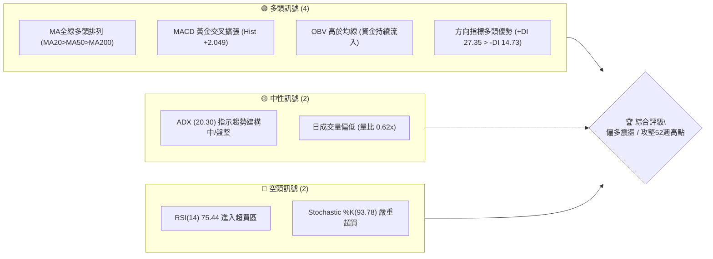
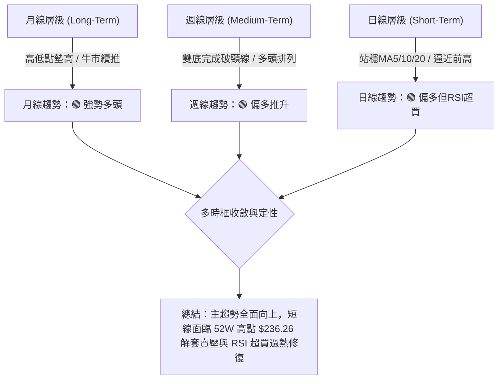
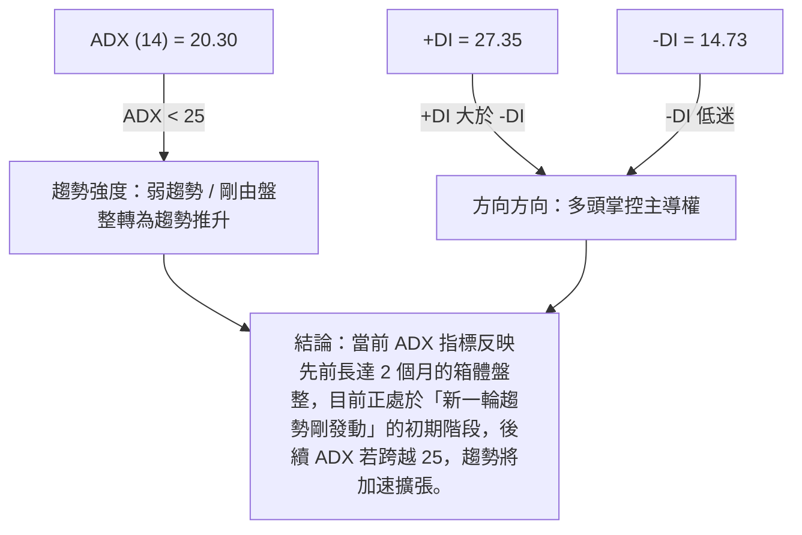
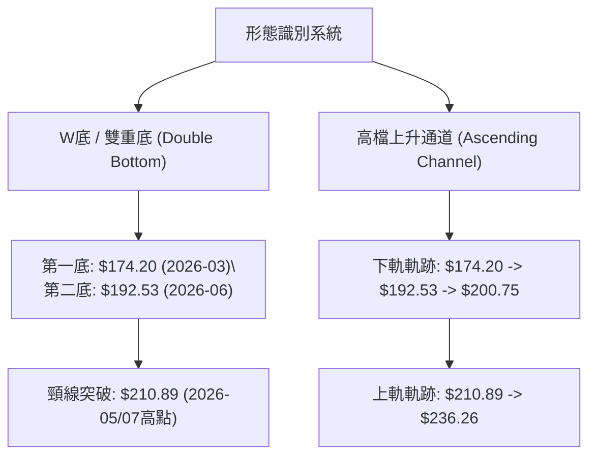
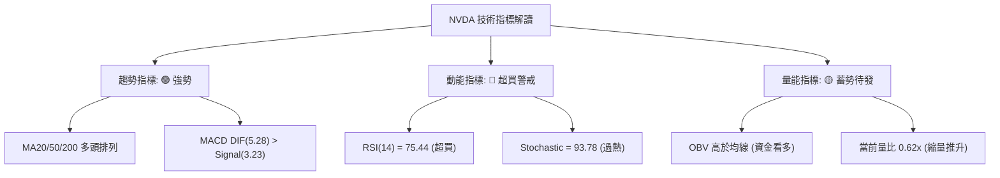
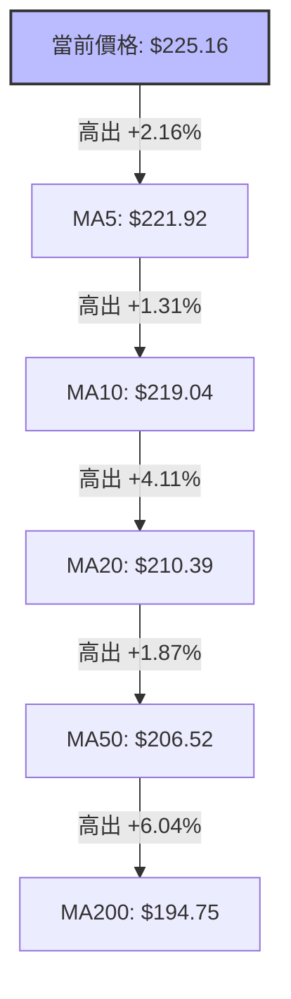
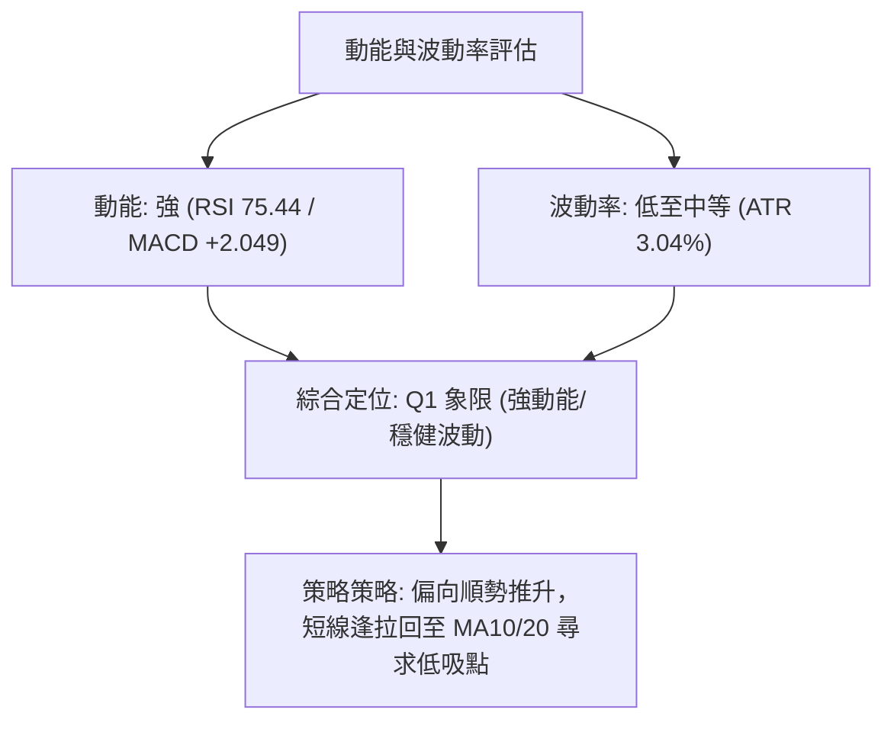
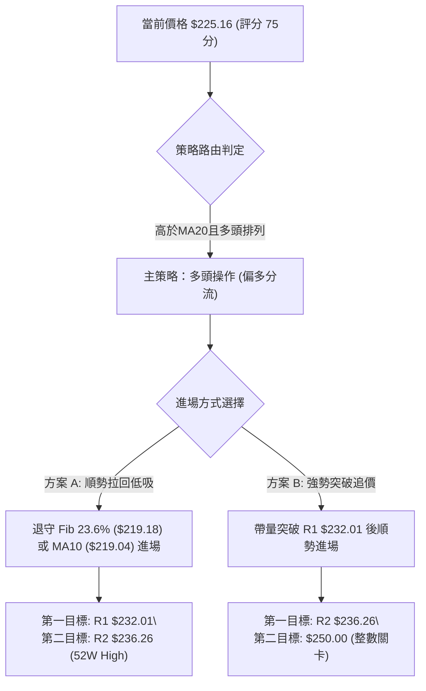
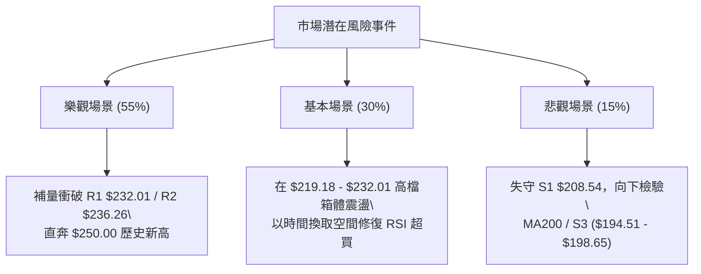

# NVDA 技術分析報告

> **報告日期**：2026-08-15 ｜ **語言**：繁體中文 ｜ **數據來源**：Yahoo Finance ｜ **當前價格**：$225.16

---

## 目錄

| 章節 | 內容 |
|------|------|
| [1. 技術面概覽](#1-技術面概覽) | 訊號儀表板、核心指標、評分卡 |
| [2. 趨勢分析](#2-趨勢分析) | 多時框趨勢、長中短期走勢 |
| [3. 圖表形態分析](#3-圖表形態分析) | 形態識別、K線組合、目標價 |
| [4. 支撐與阻力](#4-支撐與阻力) | 關鍵價位、斐波那契回調 |
| [5. 技術指標深度解讀](#5-技術指標深度解讀) | MA/RSI/MACD/布林/成交量 |
| [6. 動能與波動率](#6-動能與波動率) | 動能評估、ATR、Beta |
| [7. 多時框架總結](#7-多時框架總結) | 時框架評分矩陣 |
| [8. 交易策略建議](#8-交易策略建議) | 多空策略、風險報酬比 |
| [9. 風險提示與監控](#9-風險提示與監控) | 監控指標、風險場景 |

---

## 1. 技術面概覽

### 🎯 技術訊號儀表板



### 📊 核心指標速覽表

| 指標類別 | 指標名稱 | 當前數值 | 訊號 | 解讀 |
|----------|----------|----------|------|------|
| **價格** | 當前價格 | $225.16 | 🟢 看多 | 位於 52 週區間頂端 84.7% 處，逼近歷史高點區間 |
| **均線** | MA20 | $210.39 | 🟢 看多 | 價格高於 MA20（高出 +7.02%），提供強勁短期支撐 |
| **均線** | MA50 | $206.52 | 🟢 看多 | 價格高於 MA50（高出 +9.03%），中期多頭趨勢確立 |
| **均線** | MA200 | $194.75 | 🟢 看多 | 價格高於 MA200（高出 +15.61%），長期牛市結構完整 |
| **動能** | RSI(14) | 75.44 | 🔴 超買 | 強勢攻堅，但短期進入超買區，需留意短線拉回修復 |
| **動能** | MACD | 5.283 / +2.049 | 🟢 看多 | DIF 高於 Signal(3.233)，柱線擴張，動能強勁 |
| **波動** | ATR(14) | $6.84 (3.04%) | 🟡 中性 | 每日波幅適中，具備良性趨勢推升條件 |

### 🏆 技術評分卡

```
╔══════════════════════════════════════════════════════════════╗
║              技術評分卡 — NVDA (2026-08-15)                  ║
╠══════════════════════════════════════════════════════════════╣
║ 趨勢強度      ▓▓▓▓▓▓▓▓▓▓▓▓▓▓░░░░░░  70/100  🟢 偏多          ║
║ 動能指標      ▓▓▓▓▓▓▓▓▓▓▓▓▓▓▓▓░░░░  80/100  🟢 強勁(超買)    ║
║ 支撐穩定度    ▓▓▓▓▓▓▓▓▓▓▓▓▓▓▓▓░░░░  80/100  🟢 穩固          ║
║ 成交量配合    ▓▓▓▓▓▓▓▓▓▓░░░░░░░░░░  50/100  🟡 縮量攻堅      ║
║ 形態完整度    ▓▓▓▓▓▓▓▓▓▓▓▓▓▓▓▓░░░░  80/100  🟢 雙底完成推升  ║
║ 均線排列      ▓▓▓▓▓▓▓▓▓▓▓▓▓▓▓▓▓▓░░  90/100  🟢 完美多頭      ║
╠══════════════════════════════════════════════════════════════╣
║ 綜合評分      ▓▓▓▓▓▓▓▓▓▓▓▓▓▓▓█░░░░  75/100  🟢 強勢偏多      ║
╚══════════════════════════════════════════════════════════════╝
```

---

## 2. 趨勢分析

### 🌐 多時框趨勢分析



### 📈 長期趨勢 — 12個月走勢圖（Unicode）

```
NVDA 月線走勢圖（2025-09 至 2026-08）
價格軸 ($)
$240 ┤                                                ● $225.16 (現價)
$220 ┤                                        ●       █
$200 ┤                ●               ●       █   █   █
$180 ┤        ●       █   ●   ●       █   █   █   █   █
$160 ┤        █   █   █   █   █   ●   █   █   █   █   █
$140 ┤        █   █   █   █   █   █   █   █   █   █   █
     └──────────────────────────────────────────────────────────
       25-09 25-10 25-11 25-12 26-01 26-02 26-03 26-04 26-05 26-06 26-07 26-08
```

#### 走勢特徵分析表格

| 時間階段 | 收盤價範圍 | 漲跌幅特徵 | 技術面解讀 |
|----------|------------|------------|------------|
| **2025-09 至 2025-10** | $186.34 ➔ $202.23 | ↗ +8.5% | 創高段，首度突破 $200 大關，建立中長期高點 |
| **2025-11 至 2026-03** | $202.23 ➔ $174.20 | ↘ -13.9% | 深度波段回調，於 2026-03 探底 $163.85 (52W Low) |
| **2026-04 至 2026-05** | $174.20 ➔ $210.89 | ↗ +21.1% | 強勢 V 型反彈，再次攻克 $200 關卡 |
| **2026-06 至 2026-07** | $210.89 ➔ $200.75 | ↘ -4.8% | 高檔箱體震盪沉澱，打出第二隻腳 ($192.53 - $194.83) |
| **2026-08 (迄今)**     | $200.75 ➔ $225.16 | ↗ +12.2% | 帶量（週級別）噴發突破，逼近 52 週歷史高點 $236.26 |

### 📊 中期趨勢（週線分析）

近 20 週數據顯示，NVDA 從 2026 年 6 月底低點 $192.53 展開築底後，經歷了連續 3 週的帶量上攻（8 月前兩週收盤分別為 $200.75 ➔ $223.96 ➔ $225.16）。週線 MACD 柱線由負轉正（+2.497 ➔ +2.049），確認中期反轉上升波成立。

```
週線支撐與阻力結構示意圖：
$236.26 ─────────────────────────────────────────────────── 52W 歷史高點 (強阻力 R2)
$232.01 ─────────────────────────────────────────────────── 波段高點聚類 (阻力 R1)
$225.16 ◄────────────────────────────────────────────────── 當前收盤價
$219.18 ─────────────────────────────────────────────────── Fib 23.6% 短線退守點
$208.54 ─────────────────────────────────────────────────── MA20 / Fib 38.2% 核心支撐 (S1)
```

### ⚡ 趨勢強度評估（ADX 解讀）



#### ADX 強度對照與解讀

| 指標項 | 數據 | 標準判讀 | NVDA 當前狀態與交易策略含義 |
|--------|------|----------|──────────────────────────────|
| **ADX 數值** | 20.30 | < 25（盤整/新趨勢醞釀） | 剛從 $190-$210 震盪帶脫離，趨勢強度尚未爆發但具爆發潛力 |
| **+DI / -DI** | 27.35 / 14.73 | +DI 遠高於 -DI | 多頭買盤力道顯著壓制空頭，多方控盤 |
| **市場行情定性** | **新發動之趨勢行情** | 結合 MA 多頭排列，定位為「強勢突破後的初期階段」 |

---

## 3. 圖表形態分析

### 🔍 形態識別系統



#### 形態信心度評估表

| 形態類型 | 信心度 | 判斷依據（引用數據） | 完成度 | 目標價（附計算式） |
|----------|--------|----------------------|--------|--------------------|
| **雙重底 (W底)** | **85%** 🟢 | 兩次波段低點 $174.20 (2026-03) 與 $192.53 (2026-06) 形成墊高底；收盤價 $225.16 已成功突破頸線 $210.89 | 100% (已突破) | **$229.25**（已達標：$210.89 + ($210.89 - $192.53) = $229.25）<br>延伸目標：**$236.26** (52W High) |
| **上升通道突破** | **70%** 🟢 | 支撐底線持續墊高（$174.20 ➔ $192.53 ➔ $200.75），當前價格沿通道上軌推升 | 80% | 通道上軌對應目標：**$236.26** ~ **$242.00** |

### 🕯️ 重要K線形態分析

| 日期/期間 | 收盤價 | K線形態 | 技術面解讀 | 訊號強度 |
|-----------|--------|---------|------------|----------|
| **2026-07-26 週** | $206.84 | 探底十字星 (Hammer/Doji) | 在 MA50 ($206.52) 附近獲得強勁支撐，提示回調結束 | 🟢 看多 |
| **2026-08-09 週** | $223.96 | 大陽線 (Long White Candle) | 一舉貫穿所有短期均線與箱體頂部，成交量 6.41 億股，確立突破 | 🟢🟢 強勢看多 |
| **2026-08-16 週** | $225.16 | 高檔高掛長上影小陽線 | 攻高至 $225.16 後略受阻，成交量縮至 4.99 億股，顯示高檔賣壓初現 | 🟡 中性偏多 |

### 📉 ASCII 走勢形態示意圖

```
NVDA 日線雙底突破與箱體推升形態示意圖：
$236.26 ────────────────────────────────────────── (52W High 歷史高點 R2)
                                          ▲
                                         / 攻堅段
$210.89 ─────────────── 頸線突破點 ───────/─────── (前波高點 / 現轉強支撐)
               ▲                         /
              / \                       /  第二腳墊高
$192.53 ─────/───\─────────────────────/───────── (第二底 S2)
            /     \                   /
$174.20 ───●───────\─────────────────/─────────── (第一底 52W Low 區域)
        (2026-03)   (回調沉澱)    (2026-06/07)
```

### 🎯 形態目標價計算

1. **雙底最小測量目標價 (Measured Target)**：
   $$\text{頸線價位} + (\text{頸線價位} - \text{第二底價位}) = 210.89 + (210.89 - 192.53) = \$229.25$$
   *(當前價格 $225.16 已接近此第一目標區間)*

2. **擴展波段測量目標價 (Extended Target)**：
   以第一底 $174.20 至頸線 $210.89 之垂直高度（$36.69）疊加至突破點：
   $$\text{頸線價位} + \text{形態最大高度} = 210.89 + 36.69 = \$247.58$$
   *(第一階段解套壓在 $236.26 52W 高點，突破後將指向 $247.58)*

---

## 4. 支撐與阻力

### 🗺️ 關鍵價位分布圖（Unicode）

```
NVDA 價位結構分布圖 (由 OHLCV 歷史數據計算)
════════════════════════════════════════════════════════════
$236.26 ║████████████████████████████████████████║ 強阻力 R2 (52W High)
$232.01 ║██████████████████████████            ║ 近期波段高點阻力 R1
$225.16 ╠════════════════════════════════════════╣ ◄ 現價 (Current Price)
$219.18 ║▓▓▓▓▓▓▓▓▓▓▓▓▓▓▓▓▓▓▓▓▓▓▓▓▓▓▓▓▓          ║ 斐波那契 23.6% 首要退守位
$208.54 ║████████████████████████████████████    ║ 關鍵波段支撐 S1 (MA20/Fib 38.2%)
$198.65 ║██████████████████████                  ║ 中期強支撐 S2 (Fib 50.0%)
$194.51 ║██████████████                          ║ 長期防禦支撐 S3 (MA200 區域)
════════════════════════════════════════════════════════════
```

### 🚧 阻力位分析表

| 阻力級別 | 精確價位 | 形成原因 | 突破難度 | 重要性 |
|----------|----------|----------|----------|--------|
| **阻力 R1** | **$232.01** | 近一年波段高點密集聚類區 (+3.04%) | 🟡 中等 | 歷史次高點，短線多頭突破首要關卡 |
| **阻力 R2** | **$236.26** | 52 週歷史最高價 (+4.93%) | 🔴 極高 | 解套賣壓與心理關卡，突破即創歷史新高 |

### 🛡️ 支撐位分析表

| 支撐級別 | 精確價位 | 形成原因 | 守住機率 | 重要性 |
|----------|----------|----------|----------|--------|
| **支撐 S1** | **$208.54** | 波段低點聚類、MA20 ($210.39) 與 MA50 ($206.52) 交會區 (-7.38%) | 🟢 85% | 多頭防線核心，失守將轉為震盪 |
| **支撐 S2** | **$198.65** | 近一年次級波段低點聚類區 (-11.77%) | 🟢 90% | 中期多空分水嶺 |
| **支撐 S3** | **$194.51** | 波段防禦低點、接近 MA200 ($194.75) (-13.61%) | 🟢 95% | 牛熊分界線，長期買盤強烈防禦 |

### 📐 斐波那契回調位分析

基於 52 週波段區間：**最低價 $163.85 ➔ 最高價 $236.26**（波段總振幅 $72.41）：

| 斐波那契層級 | 精確價位 | 當前價格相對位置與技術意義 |
|--------------|----------|─────────────────────────────|
| **0.0% (52W High)** | **$236.26** | 阻力 R2 歷史高點 |
| **23.6%** | **$219.18** | **現價 ($225.16) 位於 0.0% 與 23.6% 之間**。$219.18 為回調第一支撐點 |
| **38.2%** | **$208.60** | 與支撐 S1 ($208.54) 完全重合，為強烈黃金交叉支撐帶 |
| **50.0%** | **$200.06** | 與支撐 S2 ($198.65) 重合，整數心理關卡 |
| **61.8%** | **$191.51** | 黃金分割強支撐區，接近 MA200 ($194.75) |
| **78.6%** | **$179.35** | 深度回調防禦位 |
| **100.0% (52W Low)**| **$163.85** | 52 週最低點 |

---

## 5. 技術指標深度解讀

### 🎛️ 指標訊號總覽



### 📈 移動平均線排列分析



#### 均線數據與結構分析

| 均線名稱 | 當前價位 | 價格相對位置 | 趨勢方向 | 技術面診斷 |
|----------|----------|--------------|----------|------------|
| **MA5** | $221.92 | +1.46% | ▲ 上升 | 短線極強，緊貼價格推升 |
| **MA10** | $219.04 | +2.80% | ▲ 上升 | 與 Fib 23.6% ($219.18) 重合，短線買盤強支撐 |
| **MA20** | $210.39 | +7.02% | ▲ 上升 | 布林中軌，月線生命線 |
| **MA50** | $206.52 | +9.03% | ▲ 上升 | 季線趨勢強勁，中期多頭基石 |
| **MA200** | $194.75 | +15.61% | ▲ 上升 | 年線牛熊分界，呈標準上揚態勢 |

**診斷結論**：MA20 > MA50 > MA200 呈現**標準均線多頭排列**，且價格站於所有均線之上，技術面多頭結構極其完整。

### 📉 RSI(14) 分析

* **當前 RSI 數值**：**75.44**
* **進度條**：`███████████████░░░░░ 75.44%`（已進入 >70 超買區）
* **背離狀態**：**無明顯背離**。近期價格創高，RSI 亦同步上升至高位，屬於「強勢動能推升型超買」。
* **解讀**：RSI 指標展現強烈的買盤動能，但在 >70 區間若缺乏持續量能配合，短線容易誘發獲利了結回調，回測 60-65 支撐區。

### 📊 MACD(12/26/9) 訊號解讀

* **DIF (MACD 線)**：`5.283`
* **Signal (訊號線)**：`3.233`
* **Histogram (柱狀圖)**：`+2.049` 🟢 看多
* **解讀**：DIF 於零軸上方持續擴張，柱狀圖保持強勁正值（+2.049），顯示中短期向上衝刺動能旺盛，尚未出現高檔死叉或背離訊號。

### 📦 布林通道分析

```
布林通道現況示意圖：
$232.29 ────────────────────────────────────────── 布林上軌 ( Upper Band )
$225.16 ◄───────────────────────────────────────── 當前價格 (%B = 0.84)
$210.39 ────────────────────────────────────────── 布林中軌 ( MA20 )
$188.50 ────────────────────────────────────────── 布林下軌 ( Lower Band )
```

* **通道帶寬**：上軌 $232.29，下軌 $188.50，中軌 $210.39。
* **%B 指標**：`0.84`（0=下軌, 0.5=中軌, 1=上軌）。
* **解讀**：價格貼近上軌（%B = 0.84），呈現通道向上擴張的「開口喇叭形態」，屬於強勢單邊行情特徵，上軌 $232.29 為即時動態阻力。

### 💹 成交量分析（量價配合度）

* **當日成交量**：75,161,211 股
* **20 日均量**：120,327,511 股（量比：**0.62x**）
* **50 日均量**：137,016,782 股
* **OBV 趨勢**：OBV > MA，量能累積趨勢向上。
* **解讀**：日線最新成交量為 20 日均量的 0.62 倍，呈現「縮量夾心上攻」特徵。雖然 OBV 中長期維持資金流入，但短期縮量逼近歷史高點 $236.26，顯示追高意願放緩，突破 R1/R2 需要補量（高於 1.2 億股）方能有效站穩。

---

## 6. 動能與波動率

### ⚡ 動能評估四象限

| 象限 | 動能強度 | 波動率 | NVDA 當前狀態 | 技術面評估與操作導引 |
|------|----------|--------|───────────────|──────────────────────|
| **Q1** | 強 (High) | 低 (Low) | **✓ 當前定位** | **最佳趨勢推升期**：ATR 僅 3.04%，動能強勁且波動受控，適合持股或順勢逢低布局 |
| **Q2** | 弱 (Low) | 低 (Low) | — | 沉悶盤整期 |
| **Q3** | 強 (High) | 高 (High) | — | 劇烈甩轎衝刺期 |
| **Q4** | 弱 (Low) | 高 (High) | — | 高風險崩跌/築底期 |



### 📊 ATR 波動率分析

* **ATR(14)**：`$6.84`（佔股價 **3.04%**）
* **波幅解讀**：每日平均波動約 6.84 美元，波動度處於常態合理區間。
* **風控止損參考距離**：
  * **短線風控 (1.5x ATR)**：$6.84 \times 1.5 = \$10.26$（自現價下調至 **$214.90**）
  * **中線風控 (2.0x ATR)**：$6.84 \times 2.0 = \$13.68$（自現價下調至 **$211.48**，接近 MA20 $210.39）

### 📐 Beta 與市場相關性

* **Beta 係數**：`2.215`（高 Beta 大盤放大器）
* **解讀**：NVDA 的波動幅度為標普 500 指數的 2.215 倍。在大盤上漲階段具備極高的超額收益（Alpha）彈性，但若整體美股大盤出現拉回，NVDA 的回調幅度亦會同步放大，倉位配置上需控制風險敞口。

---

## 7. 多時框架總結

### 📋 時框架評分表

| 時框架 | 趨勢方向 | 動能指標 | 均線排列 | 圖表形態 | 綜合評分 | 交易建議 |
|--------|----------|----------|----------|----------|----------|----------|
| **月線 (Long)** | 🟢 多頭 | 🟢 強勁 | 🟢 多頭排列 | 上升通道 | **85/100** | 長期堅定持有 |
| **週線 (Med)** | 🟢 多頭 | 🟢 黃金交叉 | 🟢 多頭排列 | 雙底突破 | **80/100** | 逢低偏多布局 |
| **日線 (Short)** | 🟢 偏多 | 🔴 超買警戒 | 🟢 多頭排列 | 逼近前高 | **70/100** | 避免盲目追高，等待拉回或突破確認 |

### 🔲 綜合訊號矩陣

```
                     週線趨勢 (中期)
                 多頭 (Bull)    空頭 (Bear)
              ┌──────────────┬──────────────┐
  日線動能    │ 🟢 強力順勢  │ 🟡 逆勢反彈  │
  超買/偏多   │ (NVDA現況)   │              │
              ├──────────────┼──────────────┤
  日線動能    │ 🟢 最佳買點  │ 🔴 觀望/做空 │
  回調/超賣   │ (拉回沉澱)   │              │
              └──────────────┴──────────────┘
```

### ⚖️ 多時框收斂結論

1. **行情定性收斂**：雖然 ADX(14) 為 20.30（指示趨勢剛發動或處於盤整邊緣），但週線與日線均線系統均呈完美多頭排列（MA20 > MA50 > MA200），+DI 27.35 遠超 -DI 14.73。因此，**整體行情收斂定性為「長中期多頭主導下的高檔攻堅階段」**。
2. **衝突排除**：日線 RSI(14) = 75.44 呈現超買，且日成交量 0.62x 縮量，與強勁的均線結構產生短線微幅背離。根據多時框收斂規則（順長逆短），**日線超買僅提示短線不宜在 $225.16 一線過度追高，但不改變中長期看多方向**。
3. **最終方向性結論**：**強勢偏多**（綜合評分 75/100）。主策略為**順勢多頭交易**。

---

## 8. 交易策略建議

### 🗺️ 策略決策流程圖



### 🧭 策略路由

* **當前主策略方向**：**🟢 多頭主導策略（綜合評分 75 / 100）**
* **路由說明**：由於綜合評分 ≥ 60，且均線呈標準多頭排列，策略全面鎖定做多方向；空頭操作僅作為風控觸發與避險對沖提示，不作為主推策略。

### 🎯 價格情境階梯（Price Scenarios）

| 觸發條件 | 下一目標 | 後續延伸 | 情境含義 |
|----------|----------|----------|----------|
| **帶量突破 R1 $232.01** | **R2 $236.26** | **$250.00** | 短線攻堅啟動，挑戰歷史新高 |
| **現價 $225.16 區間震盪** | **$219.18** | **$232.01** | RSI 高檔過熱修復，消化獲利賣壓 |
| **跌破 S1 $208.54** | **S2 $198.65** | **S3 $194.51** | 中期多頭結構受挫，轉為箱體二次築底 |

### 📊 情境機率分佈

```
情境機率分佈示意圖：
┌─────────────────────────────────────────┬───────────────────────────┬──────────────┐
│  突破 / 震盪上攻 (55%)                  │  拉回 $219 整理 (30%)     │ 深幅回調(15%)│
└─────────────────────────────────────────┴───────────────────────────┴──────────────┘
```

| 情境 | 機率 | 主要依據（引用指標狀態） |
|------|------|──────────────────────────|
| **帶量突破 / 續創新高** | **55%** | MACD 柱狀圖 (+2.049) 擴張，MA 全線支撐，週線雙底形態確立 |
| **回調至 $219 震盪消化** | **30%** | RSI 75.44 進入超買，日成交量 (0.62x) 尚未完全放量，需要指標修復 |
| **深度回測 S1 ($208.54)** | **15%** | 大盤出現突發性拉回，帶動高 Beta (2.215) 個股技術性回補缺口 |

### 🟢 主策略詳情

#### 策略 A：拉回低吸策略（首選 - 穩健型）

* **進場條件**：價格拉回至 Fib 23.6% ($219.18) 至 MA10 ($219.04) 支撐帶，且日線止跌出現下影線。
* **進場價格**：**$219.18**
* **止損價格**：**$208.00**（跌破 S1 $208.54 與 Fib 38.2% $208.60 核心支撐帶止損）
* **目標價 T1**：**$232.01** (阻力 R1)
* **目標價 T2**：**$236.26** (阻力 R2 / 52W High)
* **風險報酬比 (R:R)**：
  $$\text{T1 R:R} = \frac{232.01 - 219.18}{219.18 - 208.00} = \frac{12.83}{11.18} = 1.15 : 1$$
  $$\text{T2 R:R} = \frac{236.26 - 219.18}{219.18 - 208.00} = \frac{17.08}{11.18} = 1.53 : 1$$
* **建議倉位**：15% - 20%

#### 策略 B：突破追價策略（次選 - 激進型）

* **進場條件**：日線收盤價帶量突破阻力 R1 ($232.01)，且單日成交量突破 1.2 億股（接近 20 日均量）。
* **進場價格**：**$232.50**（確認突破後進場）
* **止損價格**：**$224.50**（跌破突破平台與當前收盤價下方）
* **目標價 T1**：**$236.26** (阻力 R2)
* **目標價 T2**：**$250.00**（由形態最大高度 $36.69 與突破點推算之整數延伸目標）
* **風險報酬比 (R:R)**：
  $$\text{T2 R:R} = \frac{250.00 - 232.50}{232.50 - 224.50} = \frac{17.50}{8.00} = 2.19 : 1$$
* **建議倉位**：10% - 15%

### 🔴 反向風險觸發點（對沖提示）

* **觸發條件**：若日線收盤價無量跌破 **S1 $208.54**，且 MACD 出現高檔死亡交叉。
* **風險處置**：多頭部位應立即停損或減碼 50% 以上；保守型交易員可建立適度反向對沖部位，下看 S2 $198.65。

### ⭐ 整體訊號強度評星

```
做多訊號強度：★★██☆  (4.0 / 5 星)  - 均線與形態極佳，惟受制於縮量與RSI超買
做空訊號強度：★☆☆☆☆  (1.0 / 5 星)  - 逆勢操作風險極高，缺乏空頭形態
整體可信度：  ★★██☆  (4.0 / 5 星)  - 多時框訊號收斂一致，數據支撐度高
```

---

## 9. 風險提示與監控

### ✅ 關鍵監控指標 Checklist

```
╔══════════════════════════════════════════════════════════════╗
║              關鍵技術監控 Checklist                          ║
╠══════════════════════════════════════════════════════════════╣
║ [ ] 52週高點衝刺量能：日成交量是否放大至 >1.2 億股           ║
║ [ ] RSI(14) 過熱修復：觀察 RSI 是否能在 60-70 區間完成築底     ║
║ [ ] 關鍵退守位捍衛：Fib 23.6% ($219.18) 是否具備買盤支撐     ║
║ [ ] MACD 柱線動能：柱狀圖能否維持在 +1.5 以上之多頭擴張區    ║
║ [ ] 核心生命線守備：MA20 ($210.39) 與 S1 ($208.54) 是否完好  ║
╚══════════════════════════════════════════════════════════════╝
```

### ⚠️ 風險場景分析



### 🛡️ 風險管理重要提醒

1. **Beta 係數調適 (Beta = 2.215)**：NVDA 屬於高波動放大資產，在大盤波動加劇時，個股單日振幅可能大幅超越 ATR ($6.84)。建議整體 NVDA 倉位不宜超過總投資組合的 **20%-25%**。
2. **止損紀律執行**：嚴格以 **$208.00**（S1 下方）作為多頭保護止損線。若日線收盤價跌破該位置，說明中期多頭形態被破壞，切勿盲目抗單。
3. **分析師目標價與技術面之對照**：雖然華爾街 58 位分析師平均目標價高達 **$302.83**（買入評級），但技術面上短期仍須一步一步克服 $232.01 與 $236.26 兩道實體賣壓牆。

---

## 📋 報告總結

```
NVDA 技術分析報告總結
════════════════════════════════════════════════════════
報告日期：2026-08-15
當前價格：$225.16
分析評級：🟢 強勢偏多 (技術總分: 75/100)

關鍵結論：
├─ 長期趨勢：🟢 多頭 (MA200 $194.75 強勢上揚，月線結構完整)
├─ 中期趨勢：🟢 多頭 (週線雙底完成突破，MA20/50 多頭排列)
├─ 短期趨勢：🟢 偏多 (站穩全數均線，逼近前高，唯 RSI 75.44 稍顯超買)
├─ 關鍵支撐：$219.18 (Fib 23.6%) / $208.54 (S1 / MA20)
├─ 關鍵阻力：$232.01 (R1 波段高點) / $236.26 (R2 52W High)
└─ 分析師平均目標價：$302.83 (共 58 位分析師 Consensus)

最優策略組合：
1. 🥇 最佳機會（穩健）：等待拉回至 $219.18 (Fib 23.6%) 逢低布局，止損設 $208.00，目標 $232.01 / $236.26。
2. 🥈 次選機會（激進）：待帶量突破 R1 $232.01 後於 $232.50 追價進場，止損 $224.50，目標 $250.00。
3. 🥉 保守選擇：手中有持股者繼續安心持有，並將移動止盈點（Trailing Stop）隨 MA10 ($219.04) 向上推升。
════════════════════════════════════════════════════════
```

---

> ⚠️ **免責聲明**：本報告為 AI 自動生成之技術分析，所有數據及估算均基於提供的歷史價格資訊。本報告**僅供研究與學術參考**，**不構成任何投資建議**。投資有風險，入市需謹慎。

---

*報告生成時間：2026-08-15 ｜ 數據來源：Yahoo Finance ｜ 分析框架：多時框技術分析*