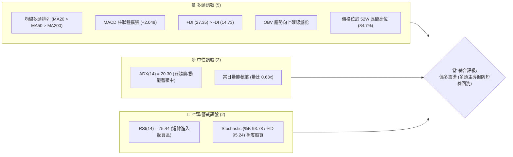
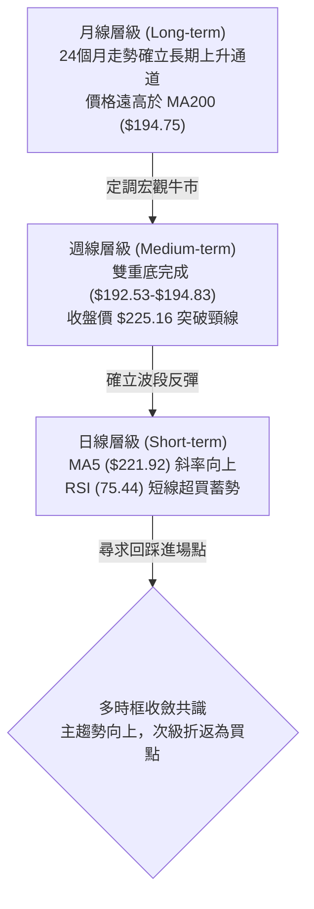
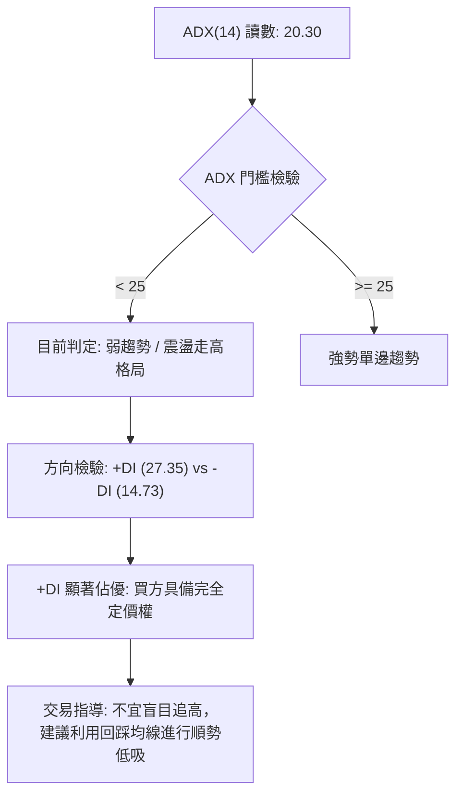
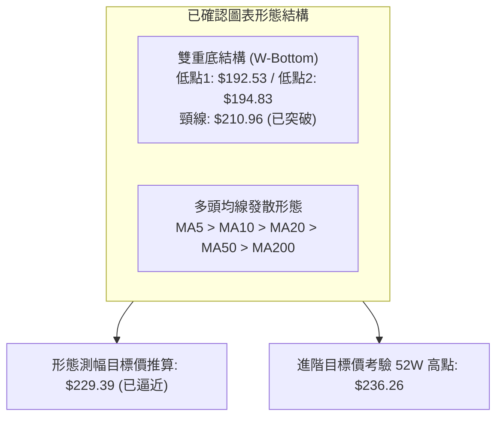
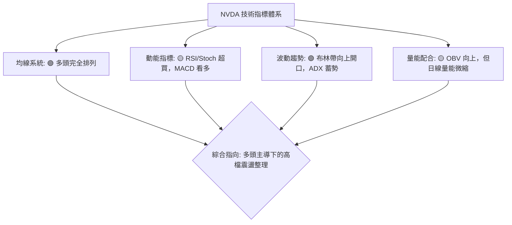
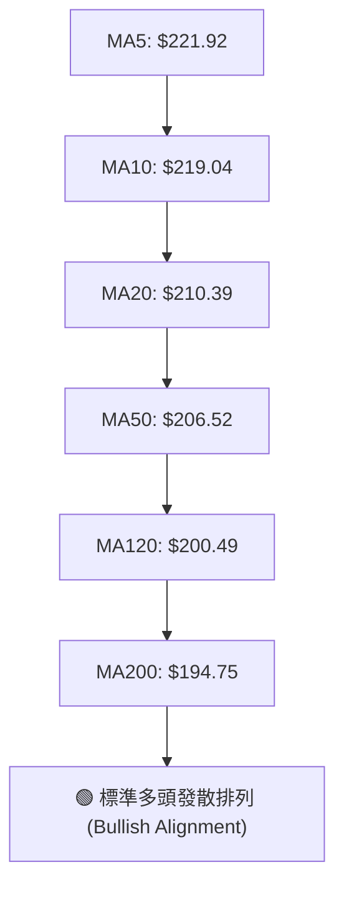
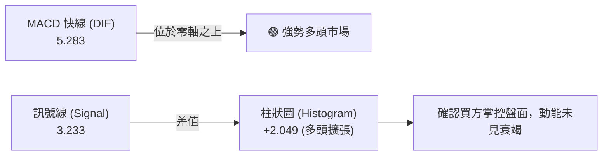
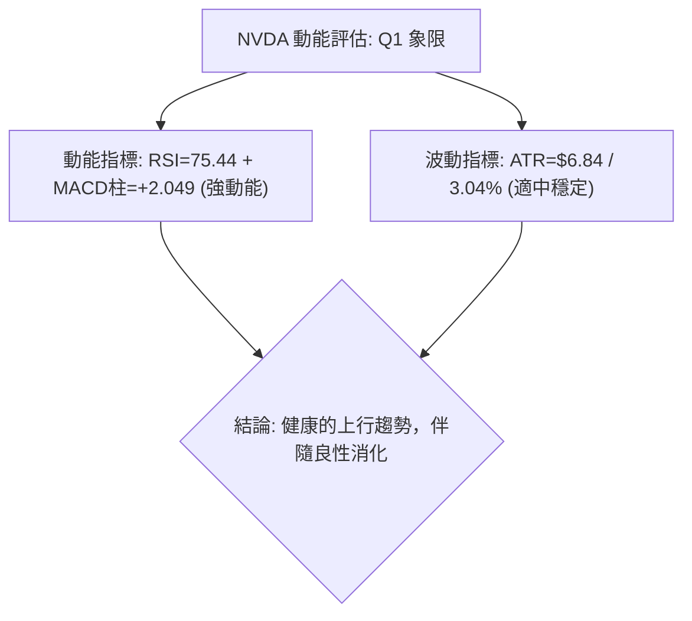
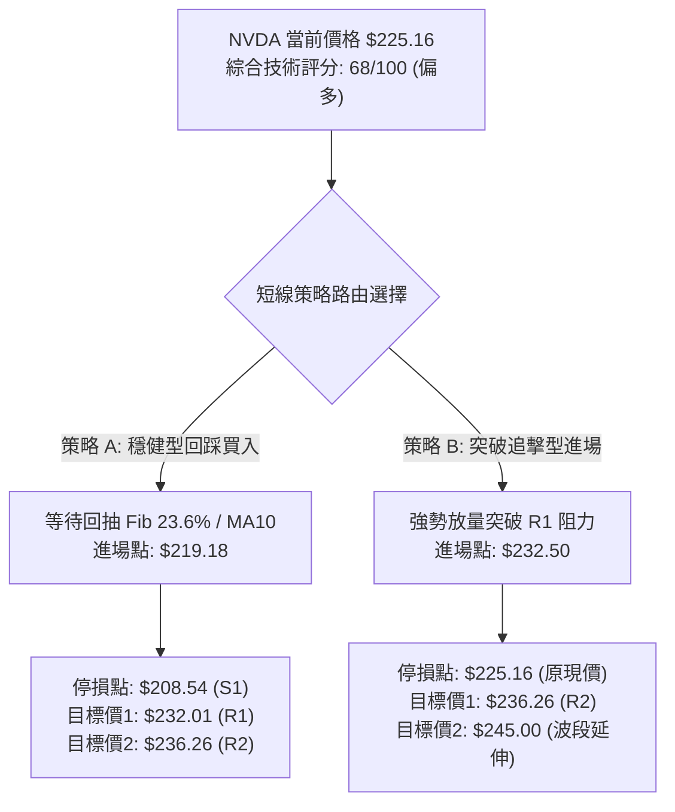
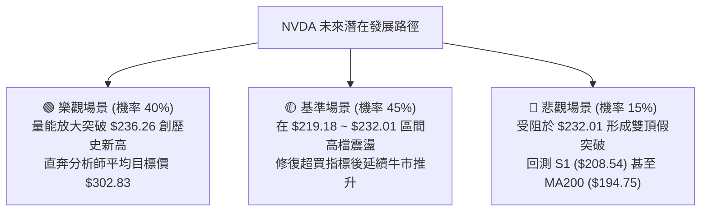

# NVDA 技術分析報告

> **報告日期**：2026-08-16 ｜ **語言**：繁體中文 ｜ **數據來源**：Yahoo Finance ｜ **當前價格**：$225.16

---

## 目錄

| 章節 | 內容 |
|------|------|
| [1. 技術面概覽](#1-技術面概覽) | 訊號儀表板、核心指標、評分卡 |
| [2. 趨勢分析](#2-趨勢分析) | 多時框趨勢、長中短期走勢 |
| [3. 圖表形態分析](#3-圖表形態分析) | 形態識別、K線組合、目標價 |
| [4. 支撐與阻力](#4-支撐與阻力) | 關鍵價位、斐波那契回調 |
| [5. 技術指標深度解讀](#5-技術指標深度解讀) | MA/RSI/MACD/布林/成交量 |
| [6. 動能與波動率](#6-動能與波動率) | 動能評估、ATR、Beta |
| [7. 多時框架總結](#7-多時框架總結) | 時框架評分矩陣 |
| [8. 交易策略建議](#8-交易策略建議) | 多空策略、風險報酬比 |
| [9. 風險提示與監控](#9-風險提示與監控) | 監控指標、風險場景 |
| [10. 報告總結](#-報告總結) | 關鍵結論與最優策略組合 |

---

## 1. 技術面概覽

### 🎯 技術訊號儀表板



---

### 📊 核心指標速覽表

| 指標類別 | 指標名稱 | 當前數值 | 訊號 | 專業解讀 |
|:---|:---|:---|:---:|:---|
| **價格動態** | 當前收盤價 | $225.16 | 🟢 | 位於 52 週高低區間之 84.7%，逼近歷史高位區間 |
| **短期均線** | MA20 | $210.39 | 🟢 | 價格在 MA20 之上 +7.02%，短期動能強勁 |
| **中期均線** | MA50 | $206.52 | 🟢 | 價格在 MA50 之上 +9.03%，中期結構穩固 |
| **長期均線** | MA200 | $194.75 | 🟢 | 價格在 MA200 之上 +15.61%，長期牛市基調不變 |
| **動能指標** | RSI(14) | 75.44 | 🔴 | 進入 >70 超買區間，短線追高盈虧比收窄 |
| **動能指標** | MACD (12,26,9) | 5.283 / 3.233 | 🟢 | DIF 線上穿 MACD Signal，柱狀圖 +2.049 持續走揚 |
| **隨機指標** | Stoch %K / %D | 93.78 / 95.24 | 🔴 | 超買高檔鈍化，預示短線可能出現技術性回踩 |
| **趨勢強度** | ADX (14) | 20.30 | 🟡 | 數值 <25，屬震盪偏多蓄勢格局，尚未進入單邊爆發期 |
| **方向指標** | +DI / -DI | 27.35 / 14.73 | 🟢 | 多方買盤佔據主導優勢，空方力道受到壓制 |
| **波動指標** | ATR (14) | $6.84 (3.04%) | 🟡 | 每日平均波動約 $6.84，提供合理的停損安全墊空間 |
| **通道位置** | Bollinger %B | 0.84 | 🟢 | 運行於中軌 ($210.39) 與上軌 ($232.29) 之間強勢區 |
| **量能狀態** | 成交量 / 20MA | 75.50M / 120.34M | 🟡 | 量比 0.63x，創高過程中呈現量縮微背離現象 |

---

### 🏆 技術評分卡

```
╔══════════════════════════════════════════════════════════════════╗
║              NVDA 技術面量化評分卡 (2026-08-16)                   ║
╠══════════════════════════════════════════════════════════════════╣
║ 均線系統排列  ██████████████████░░  90/100 🟢 強烈多頭排列       ║
║ 動能指標強度  ████████████░░░░░░░░  60/100 🟡 超買但多頭主導     ║
║ 支撐穩定結構  ████████████████░░░░  80/100 🟢 關鍵均線支撐密集   ║
║ 成交量配合度  ██████████░░░░░░░░░░  50/100 🟡 量能稍顯不足       ║
║ 形態結構完整  ██████████████░░░░░░  70/100 🟢 雙底突破延續中     ║
║ 趨勢強度指標  ██████████░░░░░░░░░░  50/100 🟡 ADX<25 震盪蓄勢    ║
╠══════════════════════════════════════════════════════════════════╣
║ 綜合技術評分  ██████████████░░░░░░  68/100 🟢 偏多進攻 / 防範回洗║
╚══════════════════════════════════════════════════════════════════╝
```

---

## 2. 趨勢分析

### 🌐 多時框趨勢分析



---

### 📈 長期趨勢 — 12個月走勢圖（ASCII）

```
NVDA 月線歷史價格走勢圖（2025-08 至 2026-08）
價格 ($)
$230 ┤                                                    ● $225.16 (現價)
$220 ┤                                              ● $210.89
$210 ┤                                  ● $202.23         
$200 ┤                             ● $199.34        ● $200.75
$190 ┤                 ● $186.34              ● $190.90
$180 ┤     ● $173.95             ● $176.77
$170 ┤                                  ● $174.20
     └─────┬─────┬─────┬─────┬─────┬─────┬─────┬─────┬─────┬─────┬─────┬─────
         08/25 09/25 10/25 11/25 12/25 01/26 02/26 03/26 04/26 05/26 06/26 08/26
```

#### 走勢特徵分析表格

| 階段區間 | 起止價格 | 漲跌幅 | 結構特徵與走勢解讀 |
|:---|:---|:---:|:---|
| **2025-08 ~ 2025-10** | $173.95 → $202.23 | +16.26% | 突破 $200 整數大關，形成第 1 波衝高波段。 |
| **2025-11 ~ 2026-03** | $176.77 → $174.20 | -1.45% | 箱體回調整理，最低下探至 52W 低點 $163.85 附近回穩。 |
| **2026-04 ~ 2026-05** | $199.34 → $210.89 | +5.79% | 重新站回 $200，形成多頭次級推升浪。 |
| **2026-06 ~ 2026-07** | $200.09 → $200.75 | +0.33% | 築底夯實，在 $192.53 ~ $200.75 構築紮實底部。 |
| **2026-08 (當前)** | $200.75 → $225.16 | +12.16% | 強勢大陽線突破，直逼 52 週高點 $236.26。 |

---

### 📊 中期趨勢（週線分析）

```
NVDA 近期週線壓力支撐架構圖
══════════════════════════════════════════════════════════════
 52W 高點阻力位 R2      $236.26 ──────────────────────────────
 近期波段高點阻力 R1    $232.01 ──────────────────────────────
 當前現價              $225.16  ◄◄◄ [多頭進攻中，RSI=75.44]
 斐波那契 23.6% 支撐    $219.18 ┄┄┄┄┄┄┄┄┄┄┄┄┄┄┄┄┄┄┄┄┄┄┄┄┄┄┄┄
 MA20 / 關鍵支撐 S1    $208.54 ══════════════════════════════
 MA50 支撐位           $206.52 ┄┄┄┄┄┄┄┄┄┄┄┄┄┄┄┄┄┄┄┄┄┄┄┄┄┄┄┄
 形態頸線支撐 S2        $198.65 ══════════════════════════════
 MA200 / 長期支撐 S3   $194.51 ══════════════════════════════
══════════════════════════════════════════════════════════════
```

---

### ⚡ 趨勢強度評估（ADX 解讀）



| 指標變數 | 當前數值 | 參考標準 | 結論與交易指引 |
|:---|:---:|:---|:---|
| **ADX(14)** | **20.30** | <20 無趨勢；20-25 弱趨勢/轉折中；>25 強趨勢 | 趨勢動能正在醞釀，價格雖漲但未達單邊加速噴出階段。 |
| **+DI** | **27.35** | 衡量上升動能強度 | 多方動能充沛，持續壓制空方。 |
| **-DI** | **14.73** | 衡量下降動能強度 | 空方動能衰退，拋壓極輕。 |

---

## 3. 圖表形態分析

### 🔍 形態識別系統



#### 形態信心度與目標價評估

| 形態名稱 | 信心度 | 判斷依據（嚴格引用數據） | 完成度 | 目標價（附計算公式） |
|:---|:---:|:---|:---:|:---|
| **雙重底 (W-Bottom)** | **85%** | 2026-06-28 低點 $192.53 與 2026-07-05 低點 $194.83 構成雙底，2026-07-12 帶量突破頸線 $210.96。 | 95% | 頸線 $210.96 + (頸線 $210.96 - 最低點 $192.53) = **$229.39**（現價 $225.16 接近達成） |
| **均線多頭排列突破** | **90%** | 當前 MA20 ($210.39) > MA50 ($206.52) > MA200 ($194.75)，價格完全站上所有均線。 | 100% | 依據阻力群測算，第一波段目標為 R1 **$232.01**，終極波段目標為 52W 高點 R2 **$236.26** |
| **旗形整理突破 (Bull Flag)**| **60%** | 2026-07-19 至 08-02 於 $200.75 ~ $206.84 進行旗面整理後於 08-09 向上跳空放量突破。 | 90% | 旗桿起點 $194.83 至 $210.96 (高 $16.13)，突破點 $206.84 + $16.13 = **$222.97** (已達標) |

---

### 🕯️ 重要K線形態分析

| 統計週別 | 收盤價 | K線形態 | 技術解讀 | 訊號 |
|:---|:---:|:---|:---|:---:|
| **2026-07-12** | $210.96 | 大陽線突破 | 突破雙底頸線，RSI 回升至 50.3，MACD 柱由負轉正 (+1.234) | 🟢 |
| **2026-07-26** | $206.84 | 縮量十字星 | 於 MA20 上方進行技術性回踩確認，拋壓迅速減輕 | 🟡 |
| **2026-08-09** | $223.96 | 長陽實體線 | 強勢多頭反撲，一舉吞沒前兩週整理區間，MACD 柱放大至 +2.497 | 🟢 |
| **2026-08-16** | $225.16 | 高檔小陽線 | 創波段新高，但量能降至 500M，顯示高檔追價意願轉為謹慎 | 🟡 |

---

### 📉 ASCII 走勢形態示意圖

```
NVDA 雙重底 (W-Bottom) 突破與量能結構圖
價格 ($)
$230 ┤                                                      ● 現價 $225.16
$225 ┤                                                ╭─────╯
$220 ┤                                                │
$215 ┤                                                ● 2026-08-09 ($223.96)
$210 ┤                     ● 頸線 ($210.96)            │
$205 ┤                 ╭───┴───╮                  ╭───╯
$200 ┤                 │       │       ● 旗面回踩 ($200.75)
$195 ┤        ● 低點1 ($192.53) ╰───────● 低點2 ($194.83)
$190 ┴────────┴─────────────────────────┴──────────────────────────────
             2026-06-28                2026-07-05         2026-08-16
```

---

## 4. 支撐與阻力

### 🗺️ 關鍵價位分布圖（ASCII）

```
NVDA 價位空間結構圖
════════════════════════════════════════════════════════════════════
$236.26 ║████████████████████████████████████████║ 52W 高點強阻力 (R2)
$232.01 ║██████████████████████████              ║ 近期波段高點阻力 (R1) / BB上軌($232.29)
$225.16 ╠════════════════════════════════════════╣ ◄◄ 現價 ($225.16)
$219.18 ║▓▓▓▓▓▓▓▓▓▓▓▓▓▓▓▓▓▓▓▓                    ║ 斐波那契 23.6% 回調位
$208.54 ║████████████████████████████████        ║ 關鍵支撐 (S1) / 38.2% ($208.60) / MA20
$198.65 ║████████████████████████                ║ 波段低點強支撐 (S2) / 50.0% ($200.06)
$194.51 ║████████████████████████████████████████║ 長期牛熊分界線 (S3) / MA200 ($194.75)
════════════════════════════════════════════════════════════════════
```

---

### 🚧 阻力位分析表

| 阻力級別 | 精確價位 | 形成原因與技術共振 | 突破難度 | 重要性 |
|:---|:---:|:---|:---:|:---:|
| **R1 (關鍵阻力)** | **$232.01** | 近一年波段高點聚類區，且與布林通道日線上軌 ($232.29) 形成共振壓制。 | 中等偏高 | ★★★★☆ |
| **R2 (強阻力)** | **$236.26** | 52 週歷史高點，斐波那契 0.0% 基準點，為極重要的心理與籌碼天花板。 | 極高 | ★★★★★ |

---

### 🛡️ 支撐位分析表

| 支撐級別 | 精確價位 | 形成原因與技術共振 | 守住機率 | 重要性 |
|:---|:---:|:---|:---:|:---:|
| **S1 (首要支撐)** | **$208.54** | 近一年波段低點聚類，與 Fib 38.2% ($208.60)、MA20 ($210.39) 形成密集支撐帶。 | 75% | ★★★★☆ |
| **S2 (中期支撐)** | **$198.65** | 7 月波段起漲平台，與 Fib 50.0% ($200.06) 整數心理關卡高度重疊。 | 85% | ★★★★☆ |
| **S3 (強支撐)** | **$194.51** | 長期趨勢基石，與 200 日均線 MA200 ($194.75) 及 6 月雙底低點形成共振防線。 | 95% | ★★★★★ |

---

### 📐 斐波那契回調位分析

> 計算基線：52 週低點 **$163.85** 至 52 週高點 **$236.26**（波段總振幅 $72.41）

```
斐波那契回調層級分析
┌─────────────────────────────────────────────────────────────┐
│ 0.0%  (52W High) : $236.26  ── 極限目標阻力區              │
│ [現價落點區間: $225.16 位於 0.0% 與 23.6% 之間的高位強勢區]  │
│ 23.6%            : $219.18  ── 第一回踩動態支撐 (MA10附近) │
│ 38.2%            : $208.60  ── 強共振黃金分割支撐 (近S1)    │
│ 50.0%            : $200.06  ── 多空分水嶺整數大關 (近S2)    │
│ 61.8%            : $191.51  ── 深幅回撤防守底線 (近MA240)  │
│ 78.6%            : $179.35  ── 空頭極限測試區              │
│ 100.0%(52W Low)  : $163.85  ── 宏觀起漲基準點              │
└─────────────────────────────────────────────────────────────┘
```

**解讀**：現價 $225.16 穩穩運行於 23.6% ($219.18) 回調位之上，顯示此波漲勢屬於「強勢回檔/強勢進攻」格局。若股價出現短線拉回，只要守穩 38.2% ($208.60) 及 MA20，整體多頭波段結構均不受破壞。

---

## 5. 技術指標深度解讀

### 🎛️ 指標訊號總覽



---

### 📈 移動平均線排列分析



| 均線名稱 | 當前價格 | 與現價乖離率 | 歷史斜率走勢特徵 | 訊號解讀 |
|:---|:---:|:---:|:---|:---:|
| **MA 5** | $221.92 | +1.46% | ▁▁▁▁▂▃▄▄▅▄▄▄▄▄▄▄▃▂▁▁▁▂▄▅▇▇████ | 短線強勢貼線進攻 |
| **MA 10** | $219.04 | +2.80% | ▁▁▁▁▁▂▂▃▃▃▄▄▄▅▄▄▄▃▂▂▂▃▃▃▄▅▅▇██ | 短期上行支撐防線 |
| **MA 20** | $210.39 | +7.02% | ▁▁▁▁▁▁▁▁▁▁▁▁▁▂▂▂▂▂▂▂▃▃▄▅▅▆▆▇██ | 月線支撐，波段生命線 |
| **MA 50** | $206.52 | +9.03% | 中期上升趨勢確立 | 季線防守底線 |
| **MA 60** | $208.28 | +8.11% | ▁▁▃▄▅▅▆▇▇█████▇▇▆▆▆▆▆▆▆▆▆▆▅▄▅▅ | 底部翻揚完成 |
| **MA 120**| $200.49 | +12.30% | ▁▁▁▁▁▂▂▂▃▃▃▃▃▄▄▄▄▄▅▅▅▅▆▆▇▇▇███ | 半年線持續穩健爬升 |
| **MA 200**| $194.75 | +15.61% | 長期多空分水嶺，支撐極強 | 宏觀多頭牛市支柱 |
| **MA 240**| $192.28 | +17.10% | ▁▁▁▁▂▂▂▃▃▃▃▃▄▄▄▄▅▅▅▅▅▅▆▆▇▇▇███ | 年線長多防線 |

---

### 📉 RSI(14) 分析與背離判斷

```
RSI(14) 數值量表: 75.44
0 ──────────── 30 ──────────────── 50 ──────────────── 70 ──── 75.44 ── 100
[   超賣區    ] [      弱勢區      ] [      強勢區      ] [🔴 超買區 ]
進度條: ███████████████████████████████████░░░░░░░░░░  75.44%
```

- **超買超賣評估**：RSI(14) 達到 **75.44**，進入 >70 之技術性超買區；同時 Stochastic %K (93.78) 與 %D (95.24) 亦處於極高檔。
- **背離分析判斷**：
  - 比對 2026-04-19（股價 $201.45，RSI 92.8）與當前（股價 $225.16，RSI 75.44），雖然指標峰值低於 4 月，但主因 4 月為爆發性噴出；
  - 比對近期 2026-08-09（收盤 $223.96，RSI 65.6）至 2026-08-16（收盤 $225.16，RSI 75.44），價格創新高同時 RSI 亦創近期新高，**目前無明顯頂背離現象**，屬於動能推升型超買。

---

### 📊 MACD(12,26,9) 訊號解讀



- **數值**：MACD = 5.283，Signal = 3.233，Histogram = **+2.049**。
- **解讀**：DIF 線與 Signal 線均在零軸上方快速發散，柱狀圖連續兩週維持在 +2.0 以上高檔（08-09 為 +2.497，08-16 為 +2.049），顯示中期多頭進攻動能依然充沛，趨勢未見反轉訊號。

---

### 📦 布林通道分析（Bollinger Bands）

```
NVDA 日線布林通道位置示意圖 (帶寬: $43.79)
══════════════════════════════════════════════════════════════
 BB 上軌  $232.29 ───────────────────────────────────────────
                  ▲
 現價位置 $225.16 ◄── [ %B = 0.84，處於中軌至上軌之超強通道區 ]
                  ▼
 BB 中軌  $210.39 ────────────────── (MA20 基準線) ───────────

 BB 下軌  $188.50 ───────────────────────────────────────────
══════════════════════════════════════════════════════════════
```

- **帶寬與位置**：%B 值為 **0.84**，股價緊貼上軌（$232.29）與中軌（$210.39）之間的強勢多頭通道運行。
- **通道開口**：通道呈現向上擴張姿態，顯示波動度正在放大，有利於多頭波段續攻；但在觸及上軌 $232.29（鄰近 R1 $232.01）時易引發短線技術壓制。

---

### 💹 成交量分析（量價配合度）

- **量能指標數據**：
  - 最新單日成交量：**75,504,000 股**
  - 20 日平均成交量：**120,344,650 股**（量比僅 **0.63x**，顯著量縮）
  - 50 日平均成交量：**137,023,638 股**
- **OBV 能量潮趨勢**：OBV > MA(OBV)，整體能量潮趨勢仍維持多頭擴張，顯示主力大資金未見明顯派發出逃跡象。
- **量價診斷**：價格推升至 $225.16 高位但量能縮減至 75.5M（週量亦由 5 月高點的 800M+ 縮至 500M 左右），呈現「**價漲量縮**」的輕度量價背離。此現象意味著籌碼鎖定良好、浮額沉澱，但也警示若無增量資金介入，突破 52W 高點 R2 ($236.26) 可能引發假突破震盪。

---

## 6. 動能與波動率

### ⚡ 動能評估分析

| 象限分區 | 動能維度 | 波動度維度 | 當前狀態判定 | 交易策略指導 |
|:---:|:---:|:---:|:---:|:---|
| **Q1** | 強動能 (MACD>0, RSI>70) | 低波動 (ATR 3.04%) | **✓ 當前 NVDA 所處象限** | **最佳波段持倉區間：順勢持股，回調低吸，避免追高** |
| **Q2** | 弱動能 | 低波動 | — | 區間震盪觀望 |
| **Q3** | 強動能 | 高波動 | — | 突破加速期，需嚴格設定移動停利 |
| **Q4** | 弱動能 | 高波動 | — | 主跌浪危險區，應全面規避 |



---

### 📊 ATR 波動率分析與停損距離設定

- **ATR(14) 數值**：**$6.84**（佔當前股價之 **3.04%**）。
- **風控參數計算**：
  - **短線防守緩衝（1.0 × ATR）**：$6.84 $\rightarrow$ 價格回撤防守空間至 **$218.32**（與 Fib 23.6% $219.18 完美呼應）。
  - **波段安全停損（1.5 × ATR）**：$1.5 \times \$6.84 = \$10.26$ $\rightarrow$ 停損價位設於 **$214.90**。
  - **寬鬆趨勢停損（2.0 × ATR）**：$2.0 \times \$6.84 = \$13.68$ $\rightarrow$ 停損價位設於 **$211.48**（緊貼 MA20 支撐 $210.39）。

---

### 📐 Beta 與市場相關性

- **Beta 係數**：**2.215**（高彈性成長標的）。
- **解讀**：NVDA 的市場波動敏感度為標普 500 指數的 2.2 倍以上。在美股大盤處於多頭環境下，其具備極強的超額報酬（Alpha）爆發力；但若大盤出現系統性回檔，需提防其以 2 倍以上的振幅向下尋求支撐。

---

## 7. 多時框架總結

### 📋 時框架評分表

| 時框架 | 趨勢方向 | 動能指標 | 均線排列 | 形態結構 | 綜合評分 | 操作建議 |
|:---|:---:|:---:|:---:|:---:|:---:|:---|
| **長期 (月線)** | 🟢 強烈看多 | 🟢 MACD 多頭 | 🟢 完全多頭排列 | 🟢 上升趨勢通道 | **90/100** | 長期投資者堅定持股續抱 |
| **中期 (週線)** | 🟢 看多 | 🟢 柱狀體擴張 | 🟢 站穩所有均線 | 🟢 雙底突破延續 | **80/100** | 波段操作者逢回調支撐加碼 |
| **短期 (日線)** | 🟡 偏多震盪 | 🔴 RSI/Stoch 超買 | 🟢 MA5>MA10>MA20 | 🟡 量縮逼近阻力 | **65/100** | 短線禁止追高，等待拉回低吸 |

---

### 🔲 綜合訊號矩陣

```
時框訊號一致性矩陣
┌──────────────┬──────────────┬──────────────┬──────────────┐
│ 維度         │ 短期 (日線)  │ 中期 (週線)  │ 長期 (月線)  │
├──────────────┼──────────────┼──────────────┼──────────────┤
│ 趨勢方向     │ 🟢 向上      │ 🟢 向上      │ 🟢 向上      │
│ 動能強度     │ 🔴 極度超買  │ 🟢 穩定增強  │ 🟢 強勁      │
│ 均線架構     │ 🟢 多頭排列  │ 🟢 多頭排列  │ 🟢 多頭排列  │
│ 籌碼量能     │ 🟡 量縮背離  │ 🟢 沉澱換手  │ 🟢 主力控盤  │
│ 一致性判斷   │ 🟡 短期過熱  │ 🟢 波段健康  │ 🟢 大勢所趨  │
└──────────────┴──────────────┴──────────────┴──────────────┘
```

---

### ⚖️ 多時框收斂結論

依據多時框收斂規則（規則 14）：
1. **行情屬性判定**：當前 ADX(14) 為 **20.30**（<25，弱趨勢/區間向趨勢過渡期）。
2. **時框主導權重**：依規則，在 ADX < 25 的震盪偏多蓄勢環境中，日線級別指標出現 RSI (75.44) 與 Stochastic (93.78/95.24) 的嚴重超買，不可在日線頂部盲目追單；而中長期週線/MA50 ($206.52)/MA200 ($194.75) 方向保持堅定向上。
3. **唯一方向性結論**：**【中長多結構完好，短線以布林通道與均線支撐為防守，採取「偏多回調低吸」為主導策略】**。

---

## 8. 交易策略建議

### 🗺️ 策略決策流程圖



---

### 🧭 策略路由

> **當前主策略方向 = 多頭進攻（回踩低吸為主，突破加碼為輔）**  
> （依據第 1 章技術評分卡：綜合評分 **68/100 $\ge$ 60**，全面執行多頭交易系統，空頭僅作為風險觸發與防守參考）。

---

### 🎯 價格情境階梯（Price Scenarios）

| 觸發條件 | 下一目標價位 | 後續延伸價位 | 情境技術含義與應對方案 |
|:---|:---:|:---:|:---|
| **放量突破 R1 ($232.01)** | **R2: $236.26** | **分析師目標: $302.83** | 突破 52 週高點，展開歷史級主升浪，全速推進。 |
| **於現價區間震盪 ($219.18~$232.01)** | **$225.16 (現價)** | **布林上軌: $232.29** | 消化短線 RSI 超買指標，以時間換取空間。 |
| **跌破關鍵支撐 S1 ($208.54)** | **S2: $198.65** | **S3: $194.51 (MA200)** | 中期上升結構轉弱，短線多單必須全面離場觀望。 |

---

### 📊 情境機率分佈

| 情境劇本 | 發生機率 | 主要技術依據 |
|:---|:---:|:---|
| **高檔強勢震盪後上行突破** | **60%** | 均線多頭排列完好，MACD 柱狀體擴張 (+2.049)，OBV 量能維持向上，+DI (27.35) 壓制空方。 |
| **技術性回抽消化超買 (區間整理)** | **30%** | RSI(14) 達 75.44，Stoch 極度超買，日線成交量萎縮至 0.63x，ADX(20.30) 顯示趨勢未完全加速。 |
| **跌破 S1 轉向深度回調** | **10%** | 需遭遇重大外生利空方能跌破 MA20 ($210.39) 與 S1 ($208.54) 密集支撐帶。 |

---

### 🟢 主策略詳情

| 策略要素 | 策略 A（穩健型：回踩支撐買入） | 策略 B（進取型：突破追擊買入） |
|:---|:---|:---|
| **適用場景** | 短線指標超買引發技術性回踩 | 買盤帶量強勢突破阻力區 |
| **進場條件** | 股價回踩 Fib 23.6% 且出現止跌 K 線 | 盤中放量有效站上 R1 阻力位 |
| **進場價格** | **$219.18**（Fib 23.6% 支撐位） | **$232.50**（突破 R1 $232.01 確認） |
| **目標價 T1** | **$232.01**（R1 阻力位，獲利 +5.85%） | **$236.26**（R2 / 52W 高點，獲利 +1.62%） |
| **目標價 T2** | **$236.26**（R2 52W 高點，獲利 +7.79%） | **$245.00**（形態延伸測幅，獲利 +5.38%） |
| **止損價格** | **$208.54**（S1 支撐位 / 跌破 MA20） | **$225.16**（跌回突破前現價支撐） |
| **風險報酬比** | **1.60 : 1**（計算至 T2 為 **1.26:1**） | **1.70 : 1**（計算至 T2 為 **1.35:1**） |
| **成功機率** | **70%** | **60%** |
| **建議倉位** | **15% ~ 20%** | **10%**（輕倉試單） |

---

### 🔴 反向風險觸發點（對沖與風控提示）

- **警示訊號 1**：若收盤價跌破 **$219.18**（Fib 23.6%），短線多頭動能減弱，應暫停追價。
- **警示訊號 2**：若日線實體陰線跌破 **$208.54**（S1 / MA20），多頭形態破位，多單應立即執行硬性止損。
- **空頭對沖條件**：若股價於 **$232.01 ~ $236.26** 阻力區出現長上影線、巨量滯漲且 RSI 出現明確頂背離，可考慮以 **5% 倉位** 介入反向保護性認售期權（Put）進行對沖。

---

### ⭐ 整體訊號強度評星

```
╔══════════════════════════════════════════════════════════════════╗
║ 做多訊號強度：★★★★☆  (4.0/5.0 星)  ── 均線動能齊備，短線防回踩 ║
║ 做空訊號強度：★☆☆☆☆  (1.0/5.0 星)  ── 逆勢操作，勝率與盈虧比極差 ║
║ 整體可信度：  ★★★★☆  (4.2/5.0 星)  ── 歷史支撐阻力結構清晰共振 ║
╚══════════════════════════════════════════════════════════════════╝
```

---

## 9. 風險提示與監控

### ✅ 關鍵監控指標 Checklist

```
╔══════════════════════════════════════════════════════════════════╗
║              NVDA 盤面動態監控檢核清單 (Checklist)               ║
╠══════════════════════════════════════════════════════════════════╣
║ [ ] 1. RSI(14) 是否在 75 以上形成鈍化或轉折向下跌破 70          ║
║ [ ] 2. 股價回踩 $219.18 (Fib 23.6%) 時，量能是否呈現健康量縮    ║
║ [ ] 3. MA20 ($210.39) 生命線是否持續保持向上斜率                ║
║ [ ] 4. 日成交量能否回升至 20 日均量 (1.20 億股) 以上配合攻堅     ║
║ [ ] 5. 向上挑戰 R1 ($232.01) 與 R2 ($236.26) 時的盤中拋壓表現   ║
║ [ ] 6. 大盤環境 (Beta=2.215) 是否出現科技股系統性殺估值回調      ║
╚══════════════════════════════════════════════════════════════════╝
```

---

### ⚠️ 風險場景分析



---

### 🛡️ 風險管理重要提醒

1. **嚴格控制單筆風險**：單筆交易的最大虧損金額嚴格控制在總投資組合淨值的 **1.0% ~ 1.5%** 以內。
2. **高 Beta 波動防護**：NVDA 當前 Beta 高達 **2.215**，每日 ATR 波動達 **$6.84**。切勿在 RSI > 75 之際使用高槓桿工具追價。
3. **分批建倉原則**：強烈建議採用「金字塔式建倉」，於 $219.18 建立首批倉位（40%），確認企穩回升後於 $225.00 以上加碼（30%），突破 $232.01 後再行加滿剩餘部位。

---

## 📋 報告總結

```
NVDA 技術分析報告總結
════════════════════════════════════════════════════════
報告日期：2026-08-16
當前價格：$225.16
分析評級：🟢 偏多進攻（評分 68/100）

關鍵結論：
├─ 長期趨勢：🟢 強烈多頭，運行於 24 個月上升軌道，遠在 MA200 ($194.75) 上方
├─ 中期趨勢：🟢 雙重底形態突破頸線 ($210.96)，量價架構健康向上
├─ 短期趨勢：🟡 多頭推升但 RSI(75.44) 進入超買，需防範技術性回踩
├─ 關鍵支撐：S1: $208.54 ｜ S2: $198.65 ｜ S3: $194.51 (MA200)
├─ 關鍵阻力：R1: $232.01 ｜ R2: $236.26 (52W 高點)
└─ 分析師目標：華爾街平均目標價 $302.83 (最高 $500.00)

最優策略組合：
1. 🥇 最佳機會（策略 A）：回踩 Fib 23.6% ($219.18) 低吸，止損設於 $208.54，目標 $236.26
2. 🥈 次選機會（策略 B）：放量突破 R1 ($232.50) 右側追擊，目標看 $245.00，止損 $225.16
3. 🥉 保守選擇：現階段暫不開新倉，靜待股價回測 MA20 ($210.39) 附近企穩後再行佈局
════════════════════════════════════════════════════════
```

---

> ⚠️ **免責聲明**：本報告為技術分析研究，所有數據、圖表及價位推算均基於歷史量價數據（Yahoo Finance）。本報告**僅供學術研究與投資策略參考**，**不構成任何形式的個人化投資建議或買賣邀約**。金融市場具有高波動風險，投資人應獨立評估風險並自負盈虧。

---

*報告生成時間：2026-08-16 ｜ 數據來源：Yahoo Finance ｜ 分析框架：多時框架量化技術分析*