# NVDA 技術分析報告

> **報告日期**：2026-08-21 ｜ **語言**：繁體中文 ｜ **數據來源**：Yahoo Finance ｜ **當前價格**：$216.85

---

## 目錄

| 章節 | 內容 |
|------|------|
| [1. 技術面概覽](#1-技術面概覽) | 訊號儀表板、核心指標、評分卡 |
| [2. 趨勢分析](#2-趨勢分析) | 多時框趨勢、長中短期走勢 |
| [3. 圖表形態分析](#3-圖表形態分析) | 形態識別、K線組合、目標價 |
| [4. 支撐與阻力](#4-支撐與阻力) | 關鍵價位、斐波那契回調 |
| [5. 技術指標深度解讀](#5-技術指標深度解讀) | MA/RSI/MACD/布林/成交量 |
| [6. 動能與波動率](#6-動能與波動率) | 動能評估、ATR、Beta |
| [7. 多時框架總結](#7-多時框架總結) | 時框架評分矩陣 |
| [8. 交易策略建議](#8-交易策略建議) | 多空策略、風險報酬比 |
| [9. 風險提示與監控](#9-風險提示與監控) | 監控指標、風險場景 |

---

## 1. 技術面概覽

### 🎯 技術訊號儀表板

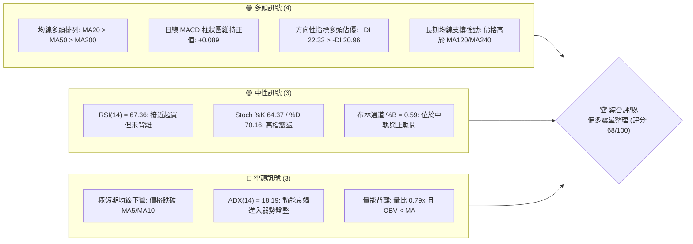

### 📊 核心指標速覽表

| 指標類別 | 指標名稱 | 當前數值 | 訊號 | 解讀 |
|----------|----------|----------|:----:|------|
| **價格** | 當前價格 | $216.85 | 🟢 | 站穩中長期主要均線上方，維持上升通道內 |
| **均線** | MA20 | $212.78 | 🟢 | 現價高於 MA20 (+1.91%)，短中期多頭支撐有效 |
| **均線** | MA50 | $207.29 | 🟢 | 現價高於 MA50 (+4.61%)，中期結構多頭佔優 |
| **均線** | MA200 | $195.08 | 🟢 | 現價高於 MA200 (+11.16%)，長期多頭牛市防線穩固 |
| **極短均線** | MA5 / MA10 | $220.86 / $221.27 | 🔴 | 現價跌破極短期均線 (-1.82% / -2.00%)，短線拉回 |
| **動能** | RSI(14) | 67.36 | 🟡 | 處於強勢中性區間 (30-70)，尚未出現頂背離 |
| **動能** | MACD (12/26/9) | 4.251 / 4.162 (+0.089) | 🟢 | DIF 高於 MACD 訊號線，紅柱微幅延續，多頭排列 |
| **趨勢強度** | ADX(14) | 18.19 | 🟡 | 數值低於 25，顯示當前單邊趨勢暫停，轉為箱體盤整 |
| **通道位置** | BB %B (20,2) | 0.59 | 🟢 | 位於中軌 $212.78 與上軌 $235.68 之間，結構偏多 |
| **成交量** | 20日均量比 | 0.79x (92.25M / 117.37M) | 🔴 | 量能萎縮，OBV 低於均線，向上突破動能需補量 |
| **波動** | ATR(14) | $6.30 (2.90%) | 🟡 | 每日平均波幅正常，適合設定 ATR 防守區間 |

### 🏆 技術評分卡

```
╔══════════════════════════════════════════════════════════════╗
║              技術評分卡 — NVDA (2026-08-21)                  ║
╠══════════════════════════════════════════════════════════════╣
║ 趨勢強度 (Trend)     ████████████░░░░░░░░  60/100  🟡 中性盤整║
║ 動能指標 (Momentum)  ██████████████░░░░░░  70/100  🟢 偏多延續║
║ 支撐穩定度 (Support) ████████████████░░░░  80/100  🟢 買盤堅實║
║ 成交量配合 (Volume)  ████████░░░░░░░░░░░░  40/100  🔴 量能萎縮║
║ 形態完整度 (Pattern) ██████████████░░░░░░  70/100  🟢 箱體築底║
║ 均線排列 (Moving Avg)██████████████████░░  90/100  🟢 完美多頭║
╠══════════════════════════════════════════════════════════════╣
║ 綜合評分             █████████████░░░░░░░  68/100  🟢 偏多整理║
╚══════════════════════════════════════════════════════════════╝
```

---

## 2. 趨勢分析

### 🌐 多時框趨勢分析

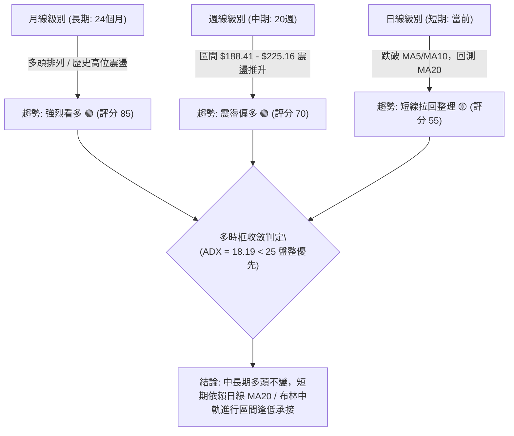

### 📈 長期趨勢 — 12個月走勢圖（Unicode）

```
NVDA 月線走勢圖（2025-08 至 2026-08）
價格軸 ($)
$220 ┤                                                 ● $216.85 (現價)
$210 ┤                                           ● $210.89
$200 ┤                             ● $202.23           ● $200.09  ● $200.75
$190 ┤                 ● $186.34         ● $186.27  ● $190.90  ● $199.34
$180 ┤                                                     
$170 ┤ ● $173.95                   ● $176.77     ● $176.97  ● $174.20
$160 ┤
$150 ┤
     └────────────────────────────────────────────────────────────
        08   09   10   11   12   01   02   03   04   05   06   07   08 (月份)
       '25  '25  '25  '25  '25  '26  '26  '26  '26  '26  '26  '26  '26
```

#### 走勢特徵分析表格

| 階段區間 | 月份分布 | 價格區間 ($) | 區間漲跌幅 | 結構特徵與技術解讀 |
|:---|:---|:---|:---:|:---|
| **第一階段：初段推升** | 2025-08 ~ 2025-10 | $173.95 → $202.23 | +16.26% | 突破 $200 大關，創波段新高，多頭買盤強烈 |
| **第二階段：寬幅箱體** | 2025-11 ~ 2026-03 | $176.77 → $174.20 | -1.45% | 在 $174.20 ~ $190.90 區間反覆築底，消化獲利賣壓 |
| **第三階段：蓄勢突圍** | 2026-04 ~ 2026-05 | $199.34 → $210.89 | +5.79% | 突破 $200 箱體頂部，均線轉為多頭排列 |
| **第四階段：高檔整固** | 2026-06 ~ 2026-08 | $200.09 → $216.85 | +8.38% | 於 $200 上方完成回踩測試，現價 $216.85 續創月線收盤新高 |

### 📊 中期趨勢（週線分析）

```
中期週線阻力與支撐結構示意圖 (近20週)
══════════════════════════════════════════════════════════════════
$236.26 ══════════════════════════════════════ 52週最高點 / 強阻力 R2
$232.01 -------------------------------------- 波段高點阻力 R1
$225.16 ┬ ······ [2026-08-16 週高點 $225.16] (短線承壓區)
        │
$216.85 ┼ ◄◄◄ 當前收盤價 ($216.85)
        │
$208.54 ┴ ······ [波段支撐 S1 / 斐波 38.2% $208.60] (強支撐防線)
$198.65 -------------------------------------- 中期支撐 S2 / 50.0% 回調位 $200.06
$192.53 ══════════════════════════════════════ [2026-06-28 週低點] / S3 $194.51
══════════════════════════════════════════════════════════════════
```

### ⚡ 趨勢強度評估（ADX 解讀）

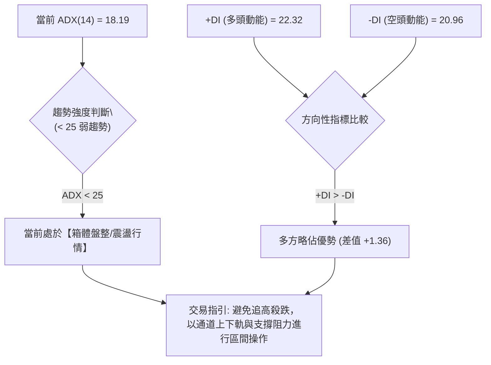

#### ADX 數值強度對照表

| ADX 區間 | 趨勢狀態 | NVDA 當前狀態 (18.19) | 交易策略導向 |
|:---|:---|:---:|:---|
| **0 ~ 20** | **弱趨勢 / 盤整橫盤** | **✓ (18.19)** | **區間震盪策略，高拋低吸，布林中軌支撐交易** |
| **20 ~ 25** | 趨勢醞釀中 / 方向未明 | — | 觀察突破訊號，不重倉押注單邊 |
| **25 ~ 50** | 強趨勢確立 (強單邊) | — | 順勢交易，均線回踩加碼 |
| **50 ~ 100** | 極強趨勢 / 即將衰竭 | — | 緊盯反轉訊號，逐步止盈出局 |

---

## 3. 圖表形態分析

### 🔍 形態識別系統

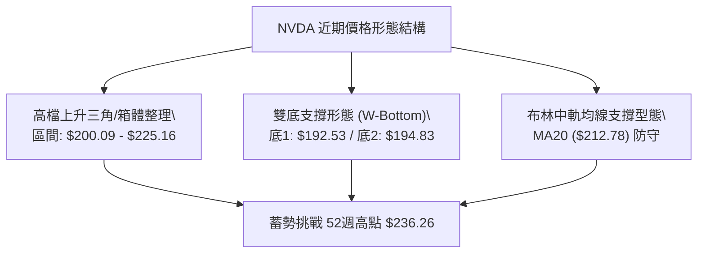

#### 圖表形態信心度分析表

| 形態名稱 | 信心度 | 判斷依據（引用數據） | 完成度 | 目標價（附精確計算式） |
|:---|:---:|:---|:---:|:---|
| **雙底形態 (W-Bottom)** | **75%** | 兩次低點分別為 2026-06-28 ($192.53) 與 2026-07-05 ($194.83)，頸線為 2026-05-17 高點 $225.06 | 85% | 形態高度 = $225.06 - $192.53 = $32.53<br>目標價 = 頸線 $225.06 + $32.53 = **$257.59** |
| **高檔矩形箱體整理** | **80%** | 下界支撐聚類於 S1 ($208.54)，上界受阻於 R1 ($232.01) 及 R2 ($236.26) | 90% | 箱體高度 = $232.01 - $208.54 = $23.47<br>突破目標 = $232.01 + $23.47 = **$255.48** |
| **頭肩底形態** | **35%** | 左肩/頭部/右肩數據結構不清晰，不符合典型幾何結構 | — | *訊號不足，不予採用，僅做指標型解讀* |

### 🕯️ 重要K線形態分析

| 週/月份 | 收盤價 ($) | K線形態 | 技術解讀 | 多空訊號 |
|:---|:---:|:---|:---|:---:|
| **2026-06-28** | $192.53 | **長下影線探底針** | 觸及 52週區間 50% 回調位下方迅速拉回，確立波段大底 | 🟢 強烈看多 |
| **2026-08-09** | $223.96 | **實體長陽線 (大突破)** | 單週強漲 +11.56%，RSI 回升至 65.6，MACD 翻紅 (+2.497) | 🟢 多頭表態 |
| **2026-08-16** | $225.16 | **高檔十字星/滯漲線** | 測試 R1 前高受阻，成交量萎縮至 500.45M，多頭動能減速 | 🟡 警惕回檔 |
| **2026-08-23** | $216.85 | **短黑K回踩中軌** | 回測 MA20 ($212.78) 與 S1 ($208.54) 支撐區間，尋求籌碼沉澱 | 🟡 正常回踩 |

### 📉 ASCII 走勢形態示意圖

```
NVDA 雙底 (W-Bottom) 與箱體突破回踩形態示意圖
價格
$236.26 ┤                                  [52W高點 / R2]
$232.01 ┤                        ╭─╮        [阻力 R1]
$225.16 ┤          ╭─╮          │ │ ╭─╮    [頸線突破位]
$216.85 ┤──────────│─│──────────│─│─│─●──── ◄ 現價回踩測試 ($216.85)
$208.54 ┤    ╭─╮   │ │   ╭─╮    │ │ │ │    [S1 強支撐線]
$200.00 ┤────│─│───│─│───│─│────╯ ╰─╯ ╰─── 斐波 50% ($200.06)
$192.53 ┤    ╯ ╰───╯ ╰───╯ ╰────────────── 底1 ($192.53) / 底2 ($194.83)
        └─────────────────────────────────────────────
          2026-06   2026-07   2026-08
```

### 🎯 形態目標價計算

```
╔══════════════════════════════════════════════════════════════╗
║              形態量度目標價 (Measured Move Target)           ║
╠══════════════════════════════════════════════════════════════╣
║ 形態類型：中期雙底 (W-Bottom) 頸線向上突破                  ║
║ 1. 形態頸線價位 (Neckline)          = $225.06                 ║
║ 2. 形態最低點 (Pattern Low)         = $192.53                 ║
║ 3. 垂直形態高度 (Height) = 225.06 - 192.53 = $32.53          ║
║ 4. 理論量度目標價 (Target 1)        = $225.06 + $32.53       ║
║                                     = $257.59                ║
║ 5. 箱體突破等距目標價 (Target 2)    = $232.01 + $23.47       ║
║                                     = $255.48                ║
╚══════════════════════════════════════════════════════════════╝
```

---

## 4. 支撐與阻力

### 🗺️ 關鍵價位分布圖（Unicode）

```
NVDA 價位結構分布圖 (Resistance & Support Map)
══════════════════════════════════════════════════════════════════
$236.26 ║██████████████████████████████║ 強阻力 R2 (52週最高點 / 0.0% 斐波)
$232.01 ║████████████████████          ║ 關鍵阻力 R1 (近一年波段高點聚類)
$219.18 ║▓▓▓▓▓▓▓▓▓▓▓▓▓▓▓▓              ║ 斐波那契 23.6% 回調位阻力
$216.85 ╠══════════════════════════════╣ ◄ 現價 ($216.85)
$212.78 ║▒▒▒▒▒▒▒▒▒▒▒▒▒▒▒▒▒▒▒▒▒▒▒▒▒▒    ║ 短線均線支撐 MA20 (布林中軌)
$208.60 ║▓▓▓▓▓▓▓▓▓▓▓▓▓▓▓▓▓▓▓▓▓▓▓▓▓▓▓▓  ║ 斐波那契 38.2% 回調位
$208.54 ║██████████████████████████████║ 核心支撐 S1 (波段低點聚類 / 38.2% 重合)
$200.06 ║▓▓▓▓▓▓▓▓▓▓▓▓▓▓▓▓▓▓▓▓          ║ 斐波那契 50.0% 心理整數關卡
$198.65 ║████████████████████████      ║ 關鍵支撐 S2 (波段次低點聚類)
$195.08 ║▒▒▒▒▒▒▒▒▒▒▒▒▒▒▒▒▒▒▒▒▒▒▒▒▒▒▒▒▒▒║ 長期牛熊防線 MA200
$194.51 ║██████████████████████████████║ 強支撐 S3 (波段大底支撐區)
══════════════════════════════════════════════════════════════════
```

### 🚧 阻力位分析表

| 阻力級別 | 價位 | 形成原因 | 突破難度 | 重要性 |
|:---|:---:|:---|:---:|:---:|
| **阻力 R1** | **$232.01** | 近一年波段高點籌碼密集聚類區 (+6.99%) | 中等偏高 | 🟢 突破確立新一輪主升浪 |
| **強阻力 R2** | **$236.26** | 52週歷史最高點 / 0.0% 斐波那契基準 (+8.95%) | 極高 | 🔴 歷史天花板，需巨量配合 |
| *阻力 R3* | *未偵測到* | *數據中未偵測到更高歷史波段聚類* | — | — |

### 🛡️ 支撐位分析表

| 支撐級別 | 價位 | 形成原因 | 守住機率 | 重要性 |
|:---|:---:|:---|:---:|:---:|
| **支撐 S1** | **$208.54** | 近期波段回踩低點聚類 (-3.83%)，與 38.2% 斐波共振 | **85%** | 🟢 短線多頭防守核心 |
| **強支撐 S2** | **$198.65** | 中期波段震盪支撐 (-8.39%)，貼近 $200 整數大關 | **90%** | 🟢 中期牛市趨勢分水嶺 |
| **強支撐 S3** | **$194.51** | 波段低點聚類 (-10.30%)，緊鄰 MA200 ($195.08) | **95%** | 🔴 長期多頭不可失守底線 |

### 📐 斐波那契回調位分析

依據 52週極值區間（低點 **$163.85** 至 高點 **$236.26**，垂直空間 **$72.41**）計算之精確回調位：

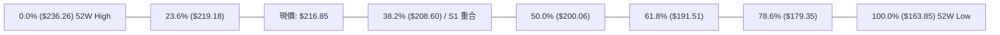

- **當前位置解讀**：現價 **$216.85** 恰好落在 **23.6% ($219.18)** 與 **38.2% ($208.60)** 回調區間內。
- **黃金共振點**：斐波那契 38.2% ($208.60) 與波段支撐位 S1 ($208.54) 僅差 $0.06，形成極為強固的「技術共振支撐區」，是多方拉回時最具性價比的買點。

---

## 5. 技術指標深度解讀

### 🎛️ 指標訊號總覽

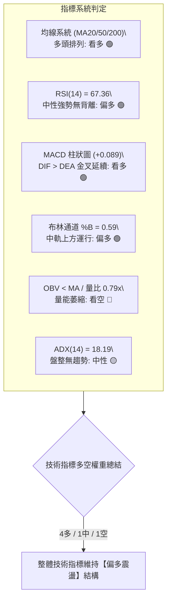

### 📈 移動平均線排列分析

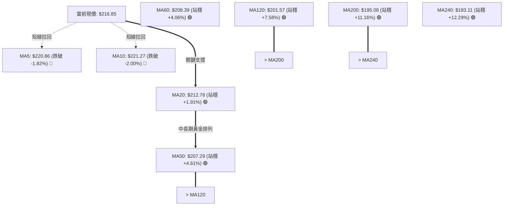

#### 均線結構深度解析
1. **中長期排列**：MA20 ($212.78) > MA50 ($207.29) > MA200 ($195.08)，各週期均線皆維持向上發散斜率，長線牛市格局毫無破壞。
2. **短期修正訊號**：現價短線自 $225.16 回落，跌破 MA5 ($220.86) 與 MA10 ($221.27)，屬於多頭上升過程中的健康良性技術修復，回踩 MA20 獲得強支撐。

### 📉 RSI(14) 分析

```
RSI(14) 動能進度條
0              30                    50              70             100
├──────────────┼─────────────────────┼───────────────┼──────────────┤
│  超賣區 (Bear)│      中性偏弱       │   中性偏強    │ 超買區 (Bull) │
├──────────────┴─────────────────────┴───────────────┴──────────────┤
██████████████████████████████████████████████████░░░░  67.36% (強勢中性)
```

- **超買超賣判定**：數值 67.36 處於 50–70 強勢多頭控制區，尚未觸及 70 以上之嚴重超買警戒。
- **背離分析**：
  - 2026-08-09 週價格收 $223.96，RSI 為 65.6；2026-08-16 週價格收 $225.16，RSI 升至 75.4；本週價格拉回 $216.85，RSI 同步回落至 67.4。
  - **結論**：RSI 指標之創高與拉回與價格波動完全同步，**無任何頂背離或底背離跡象**，動能結構健康。

### 📊 MACD(12/26/9) 訊號解讀

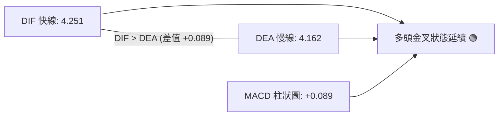

- **訊號解讀**：MACD 快線位於 4.251，訊號線位於 4.162，紅柱（Histogram）為 **+0.089**。
- **背離確認**：週線級別 MACD 柱狀圖在 8 月初由負翻正（-0.966 → +2.497），目前維持在正向擴張區，雖短線柱體微幅收斂，但**無頂背離現象**，確認多方動能未耗盡。

### 📦 布林通道分析

```
NVDA 布林通道 (Bollinger Bands 20, 2) 結構圖
══════════════════════════════════════════════════════════════════
$235.68 ────────────────────────────────────── 布林上軌 (Upper Band)
        │
        │
$216.85 ┼ ◄◄◄ 當前收盤價 ($216.85) ── [%B = 0.59]
        │
$212.78 ────────────────────────────────────── 布林中軌 (MA20)
        │
        │
$189.89 ────────────────────────────────────── 布林下軌 (Lower Band)
══════════════════════════════════════════════════════════════════
```

- **通道帶寬與位置**：上軌 $235.68，下軌 $189.89，帶寬空間 $45.79。
- **%B 指標解讀**：當前 %B 為 **0.59**（大於 0.5 中軌），顯示價格在經歷上軌壓制後回落至中軌上方進行常態化震盪整理，下檔中軌 $212.78 提供即時動態支撐。

### 💹 成交量分析（量價配合度）

```
成交量動能對比
最新成交量: 92.25M  ████████████████░░░░░░  (78.6% of 20MA)
20日均量:  117.37M  ████████████████████    (基準 100%)
50日均量:  130.58M  ██████████████████████  (111.3% of 20MA)
```

- **量價關係解讀**：
  - 最新單日成交量為 92.25M，量比為 **0.79x**（低於 20 日均量 117.37M 及 50 日均量 130.58M）。
  - **量能背離警訊**：OBV 指標小於其移動平均線（OBV < MA），顯示近期價格在突破 $220 之際未能吸引機構量能連續放大，呈現「價漲量縮」之弱背離特徵，預示短線難以形成噴射式單邊暴漲，需在 $208.54 ~ $225.00 區間進行充分籌碼換手。

---

## 6. 動能與波動率

### ⚡ 動能評估四象限

| 象限 | 動能強度 (RSI/MACD) | 波動率水準 (ATR/Beta) | NVDA 當前所處狀態 | 策略應對指引 |
|:---:|:---:|:---:|:---:|:---|
| **Q1** | **強動能 (多頭)** | **低/中波動 (穩健)** | **✓ (當前狀態)** | **回踩支撐逢低承接，持股待漲** |
| **Q2** | 弱動能 (空頭) | 低波動 (橫盤) | — | 觀望或減倉，等待突破 |
| **Q3** | 強動能 (爆發) | 高波動 (極端) | — | 追突破，嚴設移動止損 |
| **Q4** | 弱動能 (下跌) | 高波動 (恐慌) | — | 嚴格停損，禁止做多 |

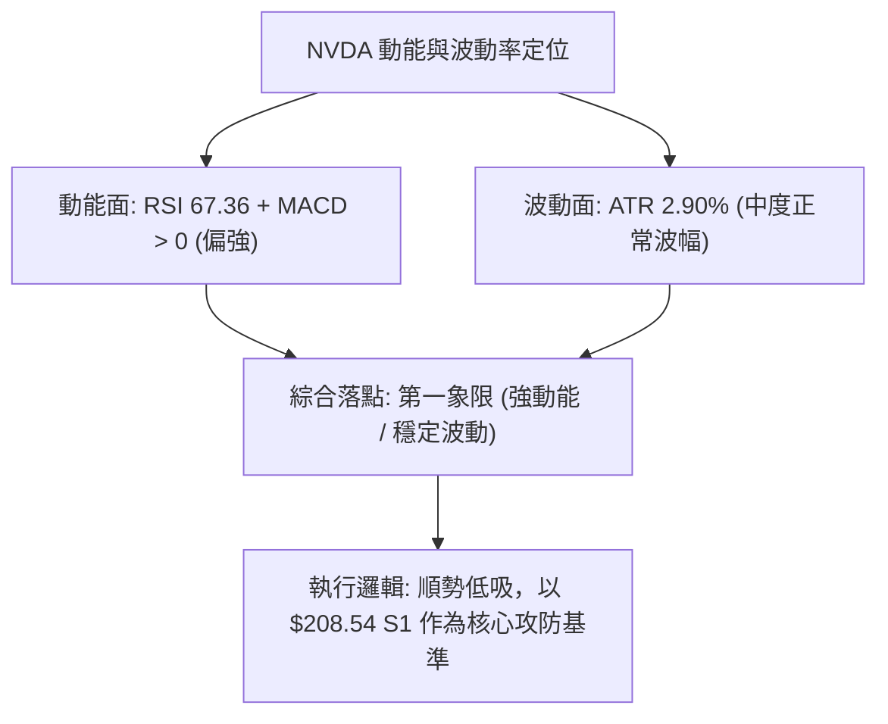

### 📊 ATR 波動率分析

```
ATR(14) 波動度與風控階梯
ATR 數值: $6.30 (佔現價 2.90%)
────────────────────────────────────────────────────────────
0.5x ATR = $3.15  (極短線當沖噪音區間)
1.0x ATR = $6.30  (單日正常震盪安全邊界)
1.5x ATR = $9.45  (短線波段止損推薦距離: $216.85 - $9.45 = $207.40)
2.0x ATR = $12.60 (中期防守止損距離: $216.85 - $12.60 = $204.25)
────────────────────────────────────────────────────────────
```

- **止損參數建議**：NVDA 當前每日平均波幅為 **$6.30**。設定波段多單止損時，安全緩衝需至少給予 **1.5x ATR ($9.45)**，以防範盤中正常洗盤；此數值導出之理論防守位為 **$207.40**，恰好位於 S1 支撐位 ($208.54) 下方 $1.14，具備高度技術保護力。

### 📐 Beta 與市場相關性

- **Beta 係數**：**2.215**（超高彈性標的）。
- **市場意涵**：NVDA 的價格波動幅度約為 S&P 500 大盤的 2.21 倍。在牛市或多頭反彈時具備極強超額收益（Alpha）爆發力，但在大盤回檔時亦會承受加倍之拉回壓力，交易倉位配置不宜過度集中。

---

## 7. 多時框架總結

### 📋 時框架評分表

| 時框架 | 趨勢方向 | 動能狀態 | 均線排列 | 形態結構 | 綜合評分 | 策略建議 |
|:---|:---:|:---:|:---:|:---:|:---:|:---|
| **長期 (月線)** | 🟢 強烈看多 | RSI 偏強 | 完美多頭 (均線發散) | 上升通道創新高 | **85/100** | 核心部位堅定續抱 |
| **中期 (週線)** | 🟢 震盪偏多 | MACD 翻紅 | MA20>50 多頭排列 | 雙底頸線突破回測 | **72/100** | 逢拉回 S1/中軌加碼 |
| **短期 (日線)** | 🟡 短線拉回 | 跌破 MA5/10 | 短均糾纏 / MA20 有撐 | 高檔收斂箱體 | **58/100** | 勿追高，等待止跌訊號 |

### 🔲 綜合訊號矩陣

```
╔══════════════════════════════════════════════════════════════╗
║              NVDA 跨週期共振訊號矩陣                         ║
╠═════════════╦══════════════╦══════════════╦══════════════════╣
║ 分析維度    ║ 短期 (日線)  ║ 中期 (週線)  ║ 長期 (月線)      ║
╠═════════════╬══════════════╬══════════════╬══════════════════╣
║ 趨勢方向    ║ 🟡 震盪整理  ║ 🟢 穩健上行  ║ 🟢 牛市主升      ║
║ 均線系統    ║ 🔴 跌破 MA5  ║ 🟢 MA20 支撐 ║ 🟢 多頭排列      ║
║ 動能指標    ║ 🟡 RSI 67.4  ║ 🟢 MACD 紅柱 ║ 🟢 買盤主導      ║
║ 量能配合    ║ 🔴 量比 0.79 ║ 🟡 成交量持平║ 🟢 機構持股71.3% ║
║ 關鍵防線    ║ $212.78 (MA20║ $208.54 (S1) ║ $195.08 (MA200)  ║
╚═════════════╩══════════════╩══════════════╩══════════════════╝
```

### ⚖️ 多時框收斂結論

依據多時框收斂規則（嚴格要求 14）：
1. **行情性質判定**：當前日線 ADX(14) 為 **18.19 (< 25)**，明確定義當前市場為**【盤整震盪行情】**，非單邊強趨勢。
2. **時框優先級權衡**：在盤整行情中，中長期（週線/月線）的多頭排列確立了「逢低買進」的大方向，但短期（日線）受到量能萎縮與極短均線下彎影響，不可盲目追價。
3. **唯一方向性結論**：**【偏多震盪整理（逢低承接）】**。以日線布林通道中軌（MA20: $212.78）至核心支撐 S1（$208.54）作為主要建倉防禦區間，向上鎖定阻力 R1（$232.01）與 R2（$236.26）。

---

## 8. 交易策略建議

### 🗺️ 策略決策流程圖

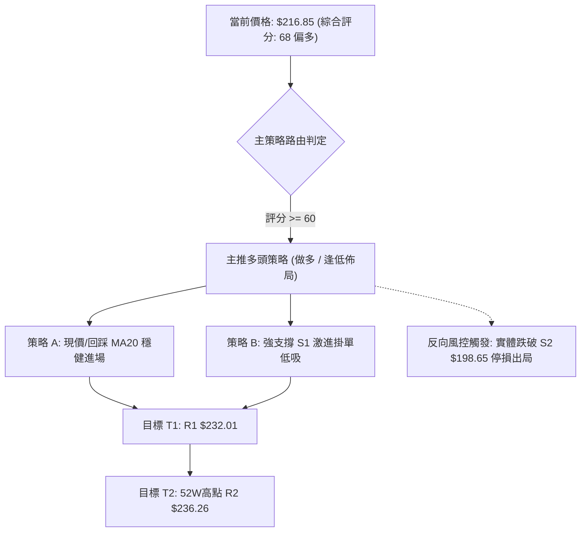

### 🧭 策略路由

> **當前主策略方向 = 【多頭主導，逢低佈局】（依技術評分卡 68/100 判定）**

### 🎯 價格情境階梯（Price Scenarios）

| 觸發條件 | 第一目標 (T1) | 後續延伸 (T2) | 情境技術含義 |
|:---|:---:|:---:|:---|
| **向上突破現價並站上 $221.27 (MA10)** | **R1: $232.01** | **R2: $236.26** | 短線整理結束，多頭發動挑戰 52週歷史高點 |
| **維持在 $212.78 (MA20) ~ $219.18 波動** | — | — | 於布林中軌上方強勢收斂，消化短期獲利賣壓 |
| **跌破核心支撐 S1 ($208.54)** | **S2: $198.65** | **S3: $194.51** | 中期結構轉弱，深度回踩 MA200 牛熊分水嶺 |

### 📊 情境機率分佈

| 價格情境 | 機率估計 | 主要依據與技術確認 |
|:---|:---:|:---|
| **情境一：回踩有撐，震盪盤升挑戰新高** | **60%** | 均線完美多頭排列，MACD 維持正值 (+0.089)，雙底形態完整 |
| **情境二：箱體窄幅震盪 ($208.54 ~ $225.00)** | **25%** | ADX(14) = 18.19 處於弱勢盤整期，成交量縮 (量比 0.79x) |
| **情境三：跌破 S1，深度回測 $200 關卡** | **15%** | 極短均線 MA5/10 下彎，若大盤重挫導致 Beta 2.21 放大下跌 |

### 🟢 主策略詳情

所有進場、止損與目標價位**嚴格引用第 4 章及數據源關鍵價位**：

| 策略要素 | 策略 A（穩健型：現價/中軌進場） | 策略 B（左側型：回踩 S1 掛單） |
|:---|:---:|:---:|
| **操作邏輯** | 依托 MA20 ($212.78) 防守，現價分批建倉 | 於 38.2% 斐波那契共振支撐區低吸 |
| **進場條件** | 現價 $216.85 或回踩 $212.78 企穩 | 限價掛單於 S1 支撐位附近 |
| **進場價格** | **$216.85** | **$208.54** |
| **目標價 T1** | **$232.01** (阻力 R1, +6.99%) | **$232.01** (阻力 R1, +11.25%) |
| **目標價 T2** | **$236.26** (強阻 R2, +8.95%) | **$236.26** (強阻 R2, +13.29%) |
| **止損價格** | **$207.40** (跌破 S1 / 1.5x ATR 緩衝) | **$198.65** (跌破 S2 強支撐位) |
| **單筆風險空間** | -$9.45 (-4.36%) | -$9.89 (-4.74%) |
| **第一獲利空間** | +$15.16 (+6.99%) | +$23.47 (+11.25%) |
| **風險報酬比 (R:R)** | **1 : 1.60** (以 T1 計算) / **1 : 2.05** (T2) | **1 : 2.37** (以 T1 計算) / **1 : 2.80** (T2) |
| **歷史勝率估計** | **65%** | **70%** |
| **建議總倉位** | **15% ~ 20%** (分批 2 次進場) | **10% ~ 15%** (限價單) |

### 🔴 反向風險觸發點（對沖提示）

- **多頭結構失效警訊**：若日線收盤價**實體跌破 $208.54 (S1)**，代表箱體下軌失守，短線多單應立即減倉 50%。
- **全面停損翻空條件**：若週線收盤價**跌破 $198.65 (S2)** 並貫穿 **MA200 ($195.08)**，宣告多頭趨勢終結，所有多單全面止損離場，並可透過對沖工具進行避險。

### ⭐ 整體訊號強度評星

```
╔══════════════════════════════════════════════════════════════╗
║ 做多訊號強度：★★★★☆  (4/5星) — 中長均線完美，動能偏多       ║
║ 做空訊號強度：★☆☆☆☆  (1/5星) — 逆大趨勢，僅屬短線回檔     ║
║ 整體可信度：  ★★★★☆  (4/5星) — 價位共振清晰，量能需補強     ║
╚══════════════════════════════════════════════════════════════╝
```

---

## 9. 風險提示與監控

### ✅ 關鍵監控指標 Checklist

```
╔══════════════════════════════════════════════════════════════╗
║              NVDA 每日盤後風控監控清單 (Checklist)           ║
╠══════════════════════════════════════════════════════════════╣
║ [ ] 價格是否維持在 MA20 ($212.78) 上方運行？                 ║
║ [ ] 核心支撐 S1 ($208.54) 是否遭遇大陰線實體跌破？           ║
║ [ ] 成交量是否回升至 20日均量 (117.37M) 以上 (補量突破)？    ║
║ [ ] RSI(14) 是否突破 70 進入超買或跌破 50 多空分水嶺？       ║
║ [ ] MACD 柱狀圖是否維持在零軸上方 (+0.089) 未翻黑？          ║
║ [ ] ADX(14) 是否由 18.19 向上穿越 25 點啟動單邊暴發行情？   ║
║ [ ] 價格上攻至 R1 ($232.01) 時是否出現長上影線滯漲？         ║
╚══════════════════════════════════════════════════════════════╝
```

### ⚠️ 風險場景分析

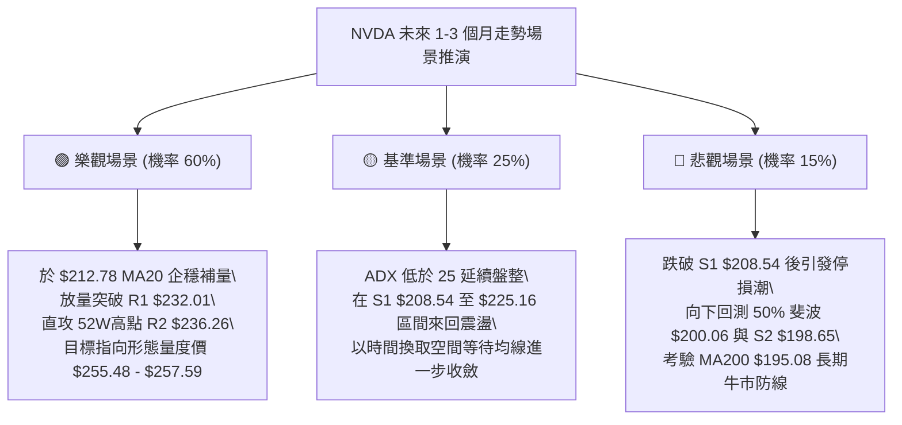

### 🛡️ 風險管理重要提醒

1. **Beta 槓桿效應管理**：NVDA 的 Beta 高達 **2.215**，波動劇烈。建議單一標的風險暴露（Risk at Risk）不應超過投資組合總資金的 **2%**。
2. **量能不足風險**：當前成交量僅為 20日均量的 79%，OBV 指標小於 MA。若價格在未放量的情況下急拉至 $232.01 (R1)，極易形成假突破，切忌盲目市價追高，應堅持「支撐位掛單、阻力位減倉」之紀律。

---

## 📋 報告總結

```
╔══════════════════════════════════════════════════════════════╗
║              NVDA 技術分析報告總結 (Executive Summary)       ║
╠══════════════════════════════════════════════════════════════╣
║ 報告日期：2026-08-21                                         ║
║ 當前價格：$216.85                                            ║
║ 分析評級：🟢 偏多震盪整理 (技術評分: 68/100)                 ║
╠══════════════════════════════════════════════════════════════╣
║ 關鍵結論：                                                   ║
║ ├─ 長期趨勢：🟢 強烈看多 (MA20>50>200 多頭排列，月線創新高) ║
║ ├─ 中期趨勢：🟢 震盪偏多 (週線雙底頸線突破，MACD柱狀圖翻紅)  ║
║ ├─ 短期趨勢：🟡 震盪整理 (ADX 18.19 弱趨勢，回踩中軌 $212.78)║
║ ├─ 關鍵支撐：S1 $208.54 ｜ S2 $198.65 ｜ S3 $194.51          ║
║ ├─ 關鍵阻力：R1 $232.01 ｜ R2 $236.26 (52W High)             ║
║ └─ 華爾街共識：Strong Buy (58位分析師均價: $304.12)          ║
╠══════════════════════════════════════════════════════════════╣
║ 最優策略組合：                                               ║
║ 1. 🥇 最佳機會 (策略 A)：現價 $216.85 分批進場，止損 $207.40  ║
║    目標 R1 $232.01 / R2 $236.26，風報酬比 1:1.60 ~ 1:2.05    ║
║ 2. 🥈 次選機會 (策略 B)：$208.54 (S1) 左側低吸，止損 $198.65 ║
║    目標 R1 $232.01，風報酬比 1:2.37                          ║
║ 3. 🥉 保守選擇：等待放量站穩 $221.27 (MA10) 後順勢跟進      ║
╚══════════════════════════════════════════════════════════════╝
```

---

> ⚠️ **免責聲明**：本報告為 AI 自動生成之技術分析，所有數據及估算均基於提供的歷史價格資訊。本報告**僅供研究與學術參考**，**不構成任何投資建議**。投資有風險，入市需謹慎。

---

*報告生成時間：2026-08-21 ｜ 數據來源：Yahoo Finance ｜ 分析框架：多時框技術分析*