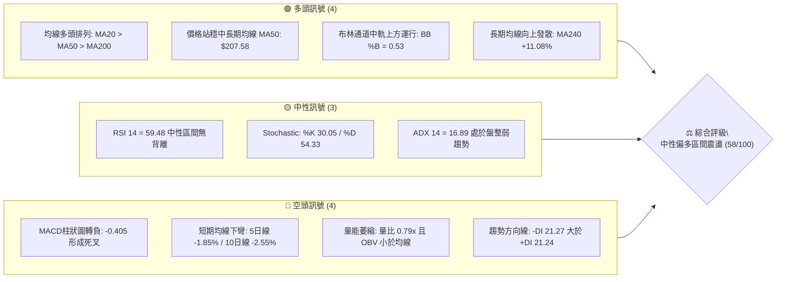
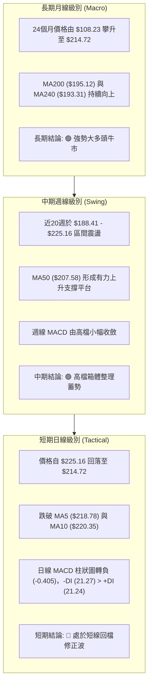
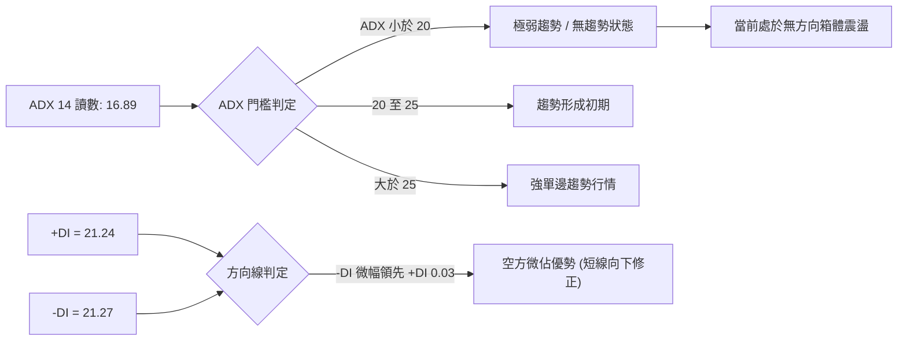
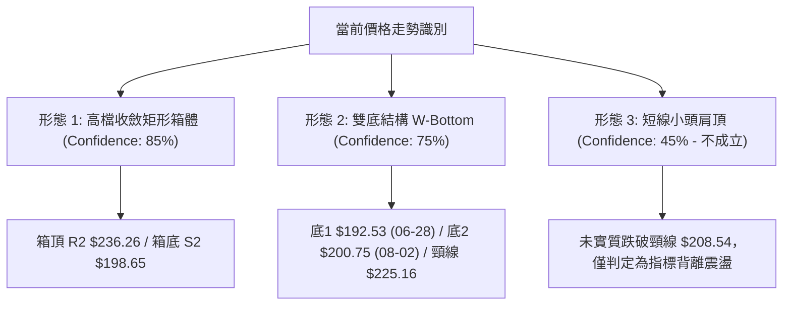
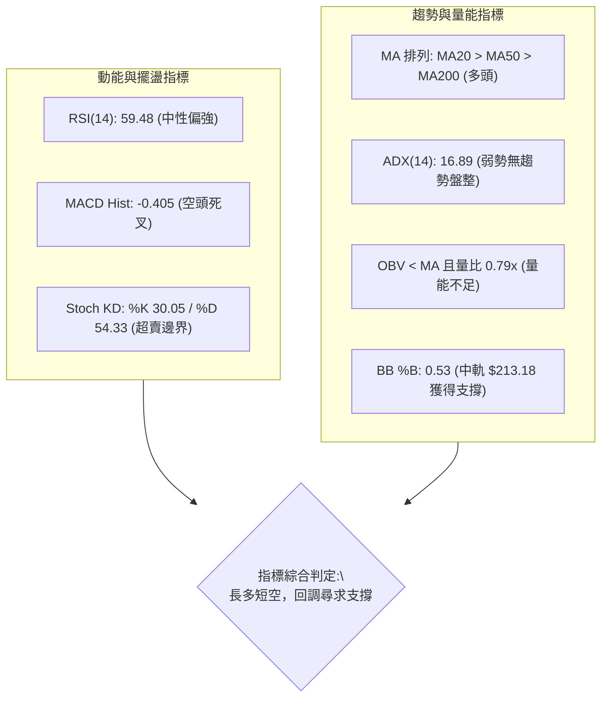
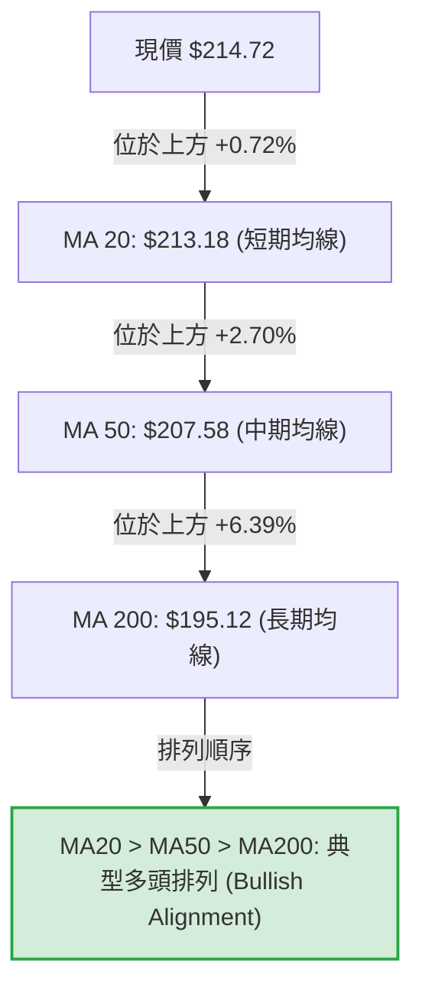
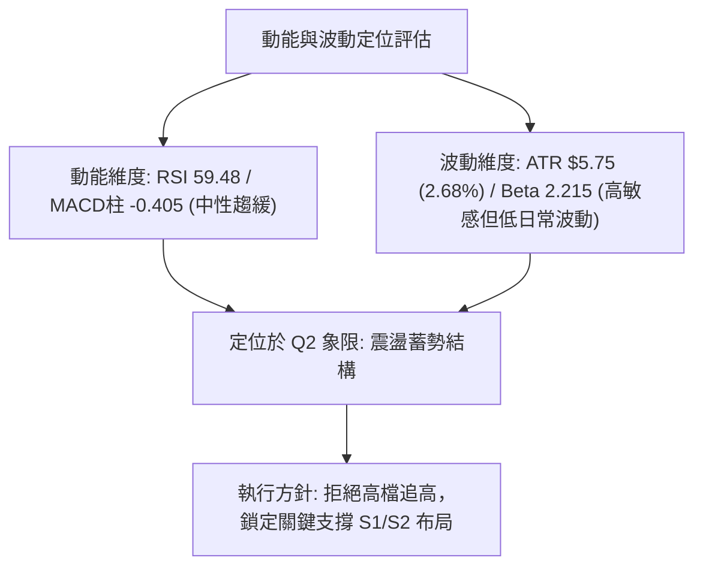
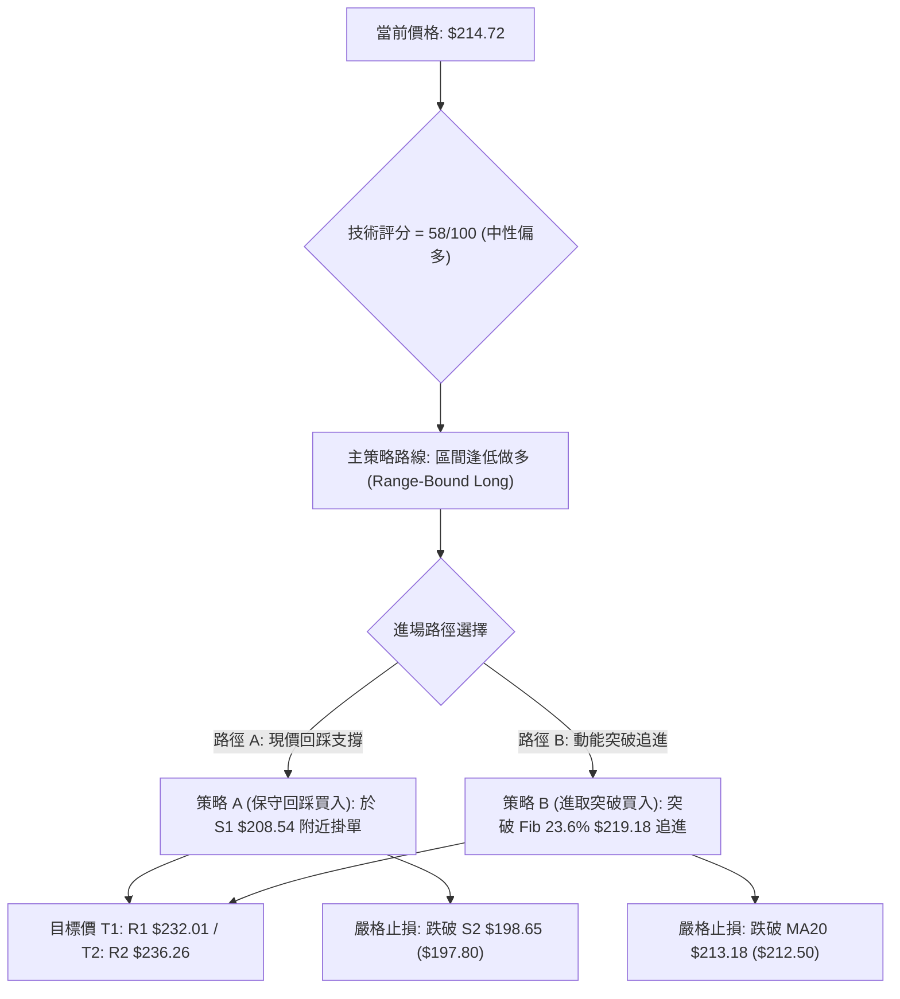
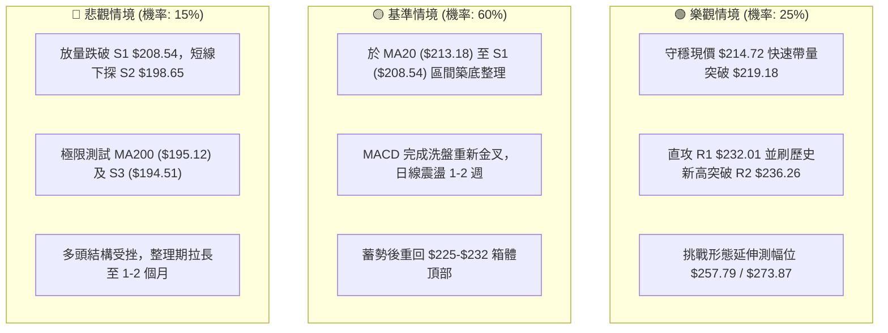

# NVDA 技術分析報告

> **報告日期**：2026-08-22 ｜ **語言**：繁體中文 ｜ **數據來源**：Yahoo Finance ｜ **當前價格**：$214.72

---

## 目錄

| 章節 | 內容 |
|------|------|
| [1. 技術面概覽](#1-技術面概覽) | 訊號儀表板、核心指標、評分卡 |
| [2. 趨勢分析](#2-趨勢分析) | 多時框趨勢、長中短期走勢、ADX解讀 |
| [3. 圖表形態分析](#3-圖表形態分析) | 形態識別、K線組合、形態目標價 |
| [4. 支撐與阻力](#4-支撐與阻力) | 關鍵價位、斐波那契回調結構 |
| [5. 技術指標深度解讀](#5-技術指標深度解讀) | MA/RSI/MACD/布林/成交量量價關係 |
| [6. 動能與波動率](#6-動能與波動率) | 動能評估四象限、ATR、Beta分析 |
| [7. 多時框架總結](#7-多時框架總結) | 時框架評分矩陣與多時框收斂 |
| [8. 交易策略建議](#8-交易策略建議) | 策略路由、多空情境階梯、風報比 |
| [9. 風險提示與監控](#9-風險提示與監控) | 關鍵監控清單、情境推演與風控 |
| [10. 報告總結](#10-報告總結) | 核心結論與交易決策指引 |

---

## 1. 技術面概覽

### 🎯 技術訊號儀表板



### 📊 核心指標速覽表

| 指標類別 | 指標名稱 | 當前數值 | 訊號 | 解讀 |
|:---|:---|:---|:---:|:---|
| **價格** | 當前收盤價 | $214.72 | 🟢 | 位於52週區間 70.2% 位置，守住中長期上升軌道 |
| **均線** | MA20 (月線) | $213.18 | 🟢 | 價格在 MA20 上方 (+0.72%)，短線獲得布林中軌支撐 |
| **均線** | MA50 (季線) | $207.58 | 🟢 | 價格在 MA50 上方 (+3.44%)，中期多頭基底穩固 |
| **均線** | MA200 (年線) | $195.12 | 🟢 | 價格在 MA200 上方 (+10.04%)，長期多頭牛市結構 |
| **均線** | MA5 / MA10 | $218.78 / $220.35 | 🔴 | 超短期均線空頭下彎，短線面臨回檔修正壓力 |
| **動能** | RSI(14) | 59.48 | 🟡 | 位於 50–60 健康中性偏強區間，無明顯頂底背離 |
| **動能** | MACD (12,26,9) | 3.656 / 4.061 | 🔴 | DIF 下穿 Signal，柱狀圖為 -0.405，短線動能趨緩 |
| **動能** | KD (%K / %D) | 30.05 / 54.33 | 🟡 | %K 由高檔滑落至超賣邊界，短線修正接近尾聲 |
| **趨勢** | ADX(14) | 16.89 | 🟡 | ADX < 25 表明市場無強單邊趨勢，處於區間震盪整理 |
| **量能** | 20日成交量比 | 0.79x (91.59M) | 🔴 | 量能低於20日均量(116.22M)，OBV < MA 量能配合偏弱 |
| **波動** | ATR(14) | $5.75 (2.68%) | 🟡 | 每日平均波動幅度約 $5.75，波動度適中偏低 |

### 🏆 技術評分卡

```
╔══════════════════════════════════════════════════════════════════╗
║                   技術評分卡 — NVDA (2026-08-22)                 ║
╠══════════════════════════════════════════════════════════════════╣
║ 趨勢強度 (ADX/方向線)    ██████░░░░░░░░░░░░░░  32/100  🟡 弱勢盤整 ║
║ 動能指標 (RSI/MACD/KD)   ██████████░░░░░░░░░░  52/100  🟡 短線轉弱 ║
║ 支撐穩定度 (S1-S3防守)   ████████████████░░░░  80/100  🟢 支撐紮實 ║
║ 成交量配合 (OBV/量比)    ████████░░░░░░░░░░░░  40/100  🔴 量能背離 ║
║ 形態完整度 (區間收斂)    ██████████████░░░░░░  70/100  🟢 平台蓄勢 ║
║ 均線排列 (MA20/50/200)   █████████████████░░░  85/100  🟢 完美多頭 ║
╠══════════════════════════════════════════════════════════════════╣
║ 綜合評分                 ███████████░░░░░░░░░  58/100  🟡 中性偏多 ║
╚══════════════════════════════════════════════════════════════════╝
```

---

## 2. 趨勢分析

### 🌐 多時框趨勢分析



### 📈 長期趨勢 — 12個月走勢圖（Unicode）

```
NVDA 月線走勢圖（過去12個月：2025-09 至 2026-08）
價格軸 ($)
$220 ┤                                                 ● $214.72 (現價)
$210 ┤                                           ● $210.89
$200 ┤              ● $202.23              ● $199.34       ● $200.75
$190 ┤       ● $186.34       ● $186.27 ● $190.90
$180 ┤                            ● $176.77    ● $176.97 ● $174.20
$170 ┤ ● $173.95
     └───────────────────────────────────────────────────────────
        09    10    11    12    01    02    03    04    05    06    07    08
       '25   '25   '25   '25   '26   '26   '26   '26   '26   '26   '26   '26
```

#### 走勢特徵分析表格

| 階段區間 | 起止價格 | 漲跌幅 | 走勢特徵與量價結構 |
|:---|:---|:---:|:---|
| **2025-08 ~ 2025-10** | $173.95 → $202.23 | **+16.26%** | 主升浪突破，首次攻克 $200 整數大關，動能充沛。 |
| **2025-11 ~ 2026-03** | $176.77 → $174.20 | **-1.45%** | 寬幅箱體洗盤，低點精確回測 52週低點回升波段的均線支撐。 |
| **2026-04 ~ 2026-05** | $199.34 → $210.89 | **+5.79%** | 二次發力上攻，創出 $210.89 階段收盤新高。 |
| **2026-06 ~ 2026-08** | $200.09 → $214.72 | **+7.31%** | 於 $200.00 之上築起堅實底部，8月最新收盤上探至 $214.72。 |

### 📊 中期趨勢（週線分析）

```
週線級別箱體震盪結構（2026年5月 - 2026年8月）
阻力位 R2 ── $236.26 ────────────────────────────────── (52W High)
阻力位 R1 ── $232.01 ────────── 頂部受阻區間 ─────────────
                     ▲                     ▲
                   $225.06               $225.16
────────────────────────────────────────────────────────
現價     ── $214.72 ────────── 箱體中軸上方運行 ──────────
────────────────────────────────────────────────────────
支撐位 S1 ── $208.54 ──────────────── (MA50 & Fib 38.2%)
                     ▼
                   $192.53 (7月洗盤低點)
支撐位 S2 ── $198.65 ──────────────── (箱體下邊界 / Fib 50.0%)
```

### ⚡ 趨勢強度評估（ADX 解讀）



#### ADX 趨勢強度對照

```
當前 ADX(14) 數值: 16.89
強度進度條: ██████░░░░░░░░░░░░░░  16.89 / 100 (無單邊趨勢，盤整主導)
───────────────────────────────────────────────────────────────
• ADX < 20 (當前: 16.89)  : 盤整震盪市場，均線交叉易出現假訊號。
• 策略意涵                 : 嚴禁追漲殺跌，應採用「箱體邊界低吸高拋」與「通道回踩確認」。
```

---

## 3. 圖表形態分析

### 🔍 形態識別系統



#### 形態識別與信心度評估表

| 形態名稱 | 信心度 | 判斷依據（引用數據） | 完成度 | 目標價（附嚴格計算式） |
|:---|:---:|:---|:---:|:---|
| **高檔矩形整理箱體** | **85%** | 價格於 52週高點 $236.26 與 Fib 50% 回調位 $200.06 (S2 $198.65) 之間進行寬幅收斂，已持續 16 週。 | 80% | **箱體突破目標價**：<br>箱頂 $236.26 + 形態高度 ($236.26 - $198.65 = $37.61) = **$273.87** |
| **中期雙重底 (W-Bottom)** | **75%** | 2026-06-28 低點 $192.53 (左底) 與 2026-08-02 低點 $200.75 (右底抬高)，中間頸線為 2026-05-17 高點 $225.06 及 2026-08-16 高點 $225.16。 | 70% | **雙底測幅目標價**：<br>頸線 $225.16 + 形態高度 ($225.16 - $192.53 = $32.63) = **$257.79** |
| **頭肩頂反轉形態** | **30%** | 數據不足以確認幾何頭肩頂，頸線支撐 S1 ($208.54) 完好無損，ADX 處於 16.89 弱勢震盪，訊號不足，僅做短線指標修正解讀。 | 0% | *不適用（形態未觸發）* |

### 🕯️ 重要K線形態分析

| 週/月週期 | 收盤價 | K線形態 | 解讀 | 訊號 |
|:---|:---:|:---|:---|:---:|
| **2026-06-28 週** | $192.53 | **長下影線錘子線 (Hammer)** | 價格下探回測 MA200 ($195.12) 後強勢收斂，空方力竭，形成波段重要底部。 | 🟢 |
| **2026-08-09 週** | $223.96 | **實體長陽線 (Bullish Marubozu)** | 單週大漲 +11.56%，RSI 回升至 65.6，MACD 柱狀擴大至 +2.497，展現多頭反攻企圖。 | 🟢 |
| **2026-08-16 週** | $225.16 | **高檔十字星 / 倒錘 (Shooting Star)** | 上攻 52週高點聚類受阻於 R1 ($232.01) 之前，週量萎縮至 500M，顯示高檔追價意願不足。 | 🔴 |
| **2026-08-23 週** | $214.72 | **回檔陰線 (Pullback Candle)** | 跌破 5日均線 ($218.78)，回測 20日均線 ($213.18) 尋求支撐，屬正常技術性回調。 | 🟡 |

### 📉 ASCII 走勢形態示意圖

```
NVDA 中期雙底與高檔箱體收斂形態圖
價格 ($)
$236.26 ┬────────────────────────────────────────── 52W High (R2)
        │                      [頂1] $225.06         [頂2] $225.16
$225.00 ┤                        /\                   /\
        │                       /  \                 /  \   現價 $214.72
$214.72 ┼──────────────────────/────\───────────────/────● (回測MA20)
        │                     /      \   [中底]    /
$205.00 ┤                    /        \  $200.75  /
        │                   /          \───/\────/
$195.00 ┤         [左底]   /               \/
        │        $192.53  /
$190.00 ┴───────────\/───/───────────────────────── S3 $194.51 / Fib 61.8% $191.51
        └─────────────────────────────────────────────────────────────► 時間
                 2026-06            2026-07           2026-08
```

---

## 4. 支撐與阻力

### 🗺️ 關鍵價位分布圖（Unicode）

```
NVDA 價位結構與斐波那契回調分布圖
══════════════════════════════════════════════════════════════════════
$236.26 ║██████████████████████████████║ 強阻力 R2 (52W High / Fib 0.0%)
$232.01 ║██████████████████████░░░░░░░░║ 關鍵阻力 R1 (波段高點聚類)
$219.18 ║▓▓▓▓▓▓▓▓▓▓▓▓▓▓▓▓▓▓░░░░░░░░░░░░║ 短線阻力 (Fib 23.6% / MA5 $218.78)
$214.72 ╠══════════════════════════════╣ ◄ 現價 ($214.72)
$213.18 ║▒▒▒▒▒▒▒▒▒▒▒▒▒▒▒▒▒▒▒▒▒▒▒▒▒▒▒▒▒▒║ 動態支撐 (MA20 / 布林中軌)
$208.54 ║████████████████████░░░░░░░░░░║ 第一核心支撐 S1 (Fib 38.2% $208.60 / MA50 $207.58)
$198.65 ║████████████████████████░░░░░░║ 第二核心支撐 S2 (Fib 50.0% $200.06 / MA200 $195.12)
$194.51 ║██████████████████████████████║ 終極鐵底支撐 S3 (波段起漲低點聚類)
══════════════════════════════════════════════════════════════════════
```

### 🚧 阻力位分析表

| 阻力級別 | 價位 | 形成原因（嚴格引用數據） | 突破難度 | 重要性 |
|:---|:---:|:---|:---:|:---:|
| **短線阻力** | **$219.18** | **Fibonacci 23.6% 回調位** 疊合 5日均線 ($218.78) 及 10日均線 ($220.35)。 | 中等 | 🟡 短線多空強弱分水嶺 |
| **阻力 R1** | **$232.01** | 近一年波段高點聚類區，距離現價 **+8.05%**，接近 2026年5月與8月上影線高檔套牢區。 | 較高 | 🟢 波段主升浪確認點 |
| **阻力 R2** | **$236.26** | **52週歷史最高價 (52W High)**，距離現價 **+10.03%**，布林上軌 ($235.92) 壓制位。 | 極高 | 🔴 歷史天花板壓力 |

### 🛡️ 支撐位分析表

| 支撐級別 | 價位 | 形成原因（嚴格引用數據） | 守住機率 | 重要性 |
|:---|:---:|:---|:---:|:---:|
| **動態支撐** | **$213.18** | **20日均線 (MA20)** 疊合布林通道中軌，距離現價僅 -0.72%。 | 70% | 🟡 日線級別防守點 |
| **支撐 S1** | **$208.54** | **近一年波段低點聚類**，疊合 **Fib 38.2% ($208.60)** 與 **MA50 ($207.58)**，距離現價 **-2.88%**。 | 85% | 🟢 中期多頭關鍵防線 |
| **支撐 S2** | **$198.65** | **波段低點聚類**，疊合 **Fib 50.0% ($200.06)** 與 **$200整數心理關卡**，距離現價 **-7.48%**。 | 90% | 🟢 多頭趨勢生命線 |
| **支撐 S3** | **$194.51** | **波段起漲低點聚類**，疊合 **MA200 ($195.12)** 與 **Fib 61.8% ($191.51)**，距離現價 **-9.41%**。 | 95% | 🔴 長期牛市底線 |

### 📐 斐波那契回調位分析

依據 52週極值區間（低點 **$163.85** 至 高點 **$236.26**，垂直振幅 **$72.41**）計算之精確回調位分布：

```
0.0%  (52W High)  ── $236.26  ════════════════════════════════════
23.6%             ── $219.18  ──────────────── (上方第一阻力)
                      ▲
現價              ── $214.72  ◄ 處於 Fib 23.6% 與 38.2% 之間
                      ▼
38.2%             ── $208.60  ──────────────── (共振 S1 $208.54 & MA50 $207.58)
50.0%             ── $200.06  ──────────────── (共振 S2 $198.65 & 整數大關)
61.8%             ── $191.51  ──────────────── (黃金分割強支撐 / 接近 MA200 $195.12)
78.6%             ── $179.35  ──────────────── (深幅回調防守位)
100.0%(52W Low)   ── $163.85  ════════════════════════════════════
```

- **位置解讀**：現價 $214.72 穩固運行於 **Fib 38.2% ($208.60)** 之上。在道氏理論與斐波那契法則中，回調未跌破 38.2% 即屬「強勢整理」，表明自 $163.85 以來的大級別上升趨勢未遭破壞。

---

## 5. 技術指標深度解讀

### 🎛️ 指標訊號總覽



### 📈 移動平均線排列分析



#### 各週期移動平均線數據解析

| 均線名稱 | 當前價格 | 與現價乖離 | 近期走勢特徵 | 訊號解讀 |
|:---|:---:|:---:|:---|:---:|
| **MA 5** | $218.78 | -1.85% | 走勢下彎（-4.06），短期獲利回吐賣壓浮現 | 🔴 短線壓制 |
| **MA 10** | $220.35 | -2.55% | 走勢下彎（-5.63），構成極短線反彈第一道反壓 | 🔴 短線阻力 |
| **MA 20** | $213.18 | +0.72% | 持續向上（+1.54），月線級別提供即時緩衝支撐 | 🟢 支撐有效 |
| **MA 60** | $208.43 | +3.02% | 平穩向上（+6.29），與 S1 支撐 ($208.54) 形成密集群 | 🟢 中期防線 |
| **MA 120**| $201.84 | +6.38% | 向上攀升（+12.88），半年線支撐強勁 | 🟢 多頭中流砥柱 |
| **MA 200**| $195.12 | +10.04%| 長期上揚（+21.41），年線形成實質長期牛熊分界 | 🟢 大多頭格局 |

### 📉 RSI(14) 分析

```
RSI(14) 數值: 59.48
區間展示:
[超賣 0] ────────── [30] ────────── [50] ────●───── [70] ────────── [100 超買]
                                          59.48
進度條: ████████████░░░░░░░░  59.48 / 100
─────────────────────────────────────────────────────────────────────────
• 區間定位 : 59.48 位於 50–70 強勢中性區間，遠離 70 超買區與 30 超賣區。
• 背離檢驗 : 比對近20週走勢，2026-04-19 週高點 RSI 為 92.8，隨後在 2026-08-16 測試 $225.16 時
             RSI 為 75.4，屬高檔動能收斂，但日線 RSI(14)=59.48「無明顯頂背離或底背離」，
             反映健康的技術指標修正。
```

### 📊 MACD(12,26,9) 訊號解讀

```
MACD 指標數值 (日線):
• DIF (MACD Line)    : 3.656
• Signal (9 EMA)     : 4.061
• MACD Histogram     : -0.405 (DIF < Signal, 柱狀圖處於零軸下方)

視覺化解析:
           Signal Line (4.061) ───────┐
                                     ▼
           DIF Line    (3.656) ───╳─── (死叉向下)
                                 / \
────────────────────────────────/───\─────────────────────────── [零軸 0.00]
  Histogram: -0.405            █     (柱狀圖由正轉負，短線動能處於空方修正)
```

- **訊號解讀**：MACD 線與訊號線雙雙維持在零軸上方（3.656 > 0），顯示大格局仍屬多頭掌控；但柱狀圖由正轉負（-0.405），確認短線進入拉回修正週期。

### 📦 布林通道分析

```
NVDA 布林通道 (Bollinger Bands, 20, 2) 結構圖
價格 ($)
$235.92 ┬────────────────────────────────────────── BB 上軌 (Upper Band)
        │
$220.00 ┤
        │                           現價: $214.72 (%B = 0.53)
$213.18 ┼───────────────────────────●────────────── BB 中軌 (MA20)
        │
$200.00 ┤
        │
$190.44 ┴────────────────────────────────────────── BB 下軌 (Lower Band)
```

- **通道帶寬與位置**：上軌 $235.92、中軌 $213.18、下軌 $190.44。帶寬為 $45.48。
- **%B 指標解析**：%B = 0.53，說明價格精確坐落於中軌上方（0.50 為中軌基準）。在 ADX 處於 16.89 的盤整市中，布林中軌 $213.18 是極具參考價值的動態支撐，若能守穩，價格將再度往上軌 $235.92 靠攏。

### 💹 成交量分析（量價配合度）

```
成交量結構分析:
最新成交量 :  91,591,112 股
20日均量   : 116,217,371 股  (量比: 0.79x)  ████████░░░░░░░░ 78.8%
50日均量   : 129,185,030 股  (量比: 0.71x)  ███████░░░░░░░░░ 70.9%

OBV 狀態   : OBV < OBV_MA ── 量能配合偏弱
```

- **量價背離分析**：近 3 週成交量由 641M 縮減至 500M 再降至 477M，而價格維持在 $214–$225 高檔。量能未能隨價格創高而同步放大（OBV 疲弱），顯示當前上攻主要由籌碼鎖定推動（機構持股 71.3%），缺乏場外增量資金追價。因此在量能重新放大至 1.2x 均量前，行情更傾向於「區間震盪」而非「單邊暴漲」。

---

## 6. 動能與波動率

### ⚡ 動能評估四象限

| 象限 | 動能強度 (RSI/MACD) | 波動率水準 (ATR/Beta) | NVDA 當前狀態 | 交易策略意涵 |
|:---:|:---:|:---:|:---:|:---|
| **第一象限 (Q1)** | 強動能 (Bullish) | 低波動 (Low Vol) | — | 最佳波段加碼與單邊持倉區 |
| **第二象限 (Q2)** | **中弱動能 (Corrective)** | **中低波動 (Low-Mid Vol)** | **✓ [當前定位]** | **高檔箱體震盪，宜低吸高拋、防守中軌** |
| **第三象限 (Q3)** | 強動能 (Breakout) | 高波動 (High Vol) | — | 趨勢突破追價，需嚴設寬幅止損 |
| **第四象限 (Q4)** | 弱動能 (Bearish) | 高波動 (High Vol) | — | 恐慌殺跌行情，應空倉或反手對沖 |



### 📊 ATR 波動率分析

- **ATR(14) 絕對值**：**$5.75**
- **ATR 佔股價比例**：**2.68%**（處於正常健康波動區間）
- **止損距離與風控計算**：
  - **保守型止損 (1.5 × ATR)**：$5.75 × 1.5 = **$8.63** ➔ 建議自進場點下設 $8.63 之防守緩衝。
  - **進取型止損 (1.0 × ATR)**：$5.75 × 1.0 = **$5.75** ➔ 適用於突破跟進策略。

### 📐 Beta 與市場相關性

- **Beta 係數**：**2.215**（高貝塔特性，對標普500與納斯達克100指數具 2.21 倍的波動放大效應）。
- **短空比例 (Short Float)**：僅 **1.3%**，Short Ratio 為 **2.23**。表明空頭力量極弱，市場無大規模作空意願，回檔主要來自多頭內部籌碼換手。

---

## 7. 多時框架總結

### 📋 時框架評分表

| 時框架 | 趨勢方向 | 動能狀態 | 均線系統排列 | 圖表形態特徵 | 綜合評分 | 操作建議 |
|:---|:---:|:---:|:---:|:---|:---:|:---|
| **月線 (長期)** | 🟢 強勢多頭 | 🟢 多頭主導 | 🟢 完美多頭 (MA200向上) | 長期上升擴張通道 | **90/100** | 長線多頭堅定持股，逢大回調加碼 |
| **週線 (中期)** | 🟢 箱體偏多 | 🟡 高檔收斂 | 🟢 均線支撐完好 (MA50上揚)| 雙重底頸線測試與高檔箱體 | **72/100** | 箱體操作，靠近 S1/S2 分批做多 |
| **日線 (短期)** | 🔴 震盪回調 | 🔴 死叉修正 | 🟡 跌破MA5/10，測試MA20 | 布林中軌回踩測試 | **48/100** | 短線勿追高，等待止跌K線確認 |

### 🔲 綜合訊號矩陣

```
時框維度       長期 (月線)        中期 (週線)        短期 (日線)
─────────────────────────────────────────────────────────────
趨勢判斷       🟢 強勢上行        🟢 箱體震盪        🔴 短線回落
動能指標       🟢 充沛強勁        🟡 逐漸趨緩        🔴 死叉向下
量能結構       🟢 機構鎖倉        🟡 萎縮觀望        🔴 低於均量
均線狀態       🟢 發散多頭        🟢 MA50多頭防守    🟡 測試MA20
關鍵價位       $195.12 (MA200)    $208.54 (S1)       $213.18 (MA20)
```

### ⚖️ 多時框收斂結論

> **依據「嚴格要求 14」收斂規則判定**：
> 1. **趨勢/盤整判定**：當前 ADX(14) = **16.89 (< 25)**，嚴格定義為「**盤整震盪行情**」。
> 2. **主導時框與交易區間**：在無強趨勢單邊狀態下，日線布林通道（上軌 **$235.92** 至 下軌 **$190.44**）與中期箱體（支撐 S1 **$208.54** / 阻力 R1 **$232.01**）為主要交易區間。
> 3. **訊號衝突取捨**：雖然日線短線出現 MACD 死叉與均線下彎（偏空），但週線 MA50 ($207.58) 及 S1 ($208.54) 支撐力道極強，長線多頭排列未變。
> 4. **唯一方向性結論**：**中性偏多（區間震盪低吸）**。第 8 章交易策略將完全對齊此結論，主推依託支撐的區間多頭策略，空頭僅列為風險觸發條件。

---

## 8. 交易策略建議

### 🗺️ 策略決策流程圖



### 🧭 策略路由

- **當前主策略方向**：**區間多頭低吸策略（依技術評分 58/100 判定）**。
- **策略執行原則**：由於 ADX = 16.89 且量能萎縮，絕不在阻力區（$232.01–$236.26）追價，嚴格採取「回測核心支撐低吸」與「關鍵阻力帶止盈」紀律。

### 🎯 價格情境階梯（Price Scenarios）

| 觸發條件 | 目標價位 1 | 目標價位 2 | 後續延伸 (若突破) | 情境技術含義 |
|:---|:---:|:---:|:---:|:---|
| **向上突破 Fib 23.6% ($219.18)** | **R1 ($232.01)** | **R2 ($236.26)** | 形態測幅 $257.79 | 短線修正結束，重啟攻頂測試波 |
| **守穩 MA20 ($213.18) ~ S1 ($208.54)** | $219.18 | R1 ($232.01) | — | 典型布林中軌與箱體中軸健康蓄勢 |
| **向下跌破支撐 S1 ($208.54)** | **S2 ($198.65)** | **S3 ($194.51)** | Fib 61.8% $191.51 | 中期箱體下探，回測年線與整數關卡 |

### 📊 情境機率分佈

| 運行情境 | 估計機率 | 主要技術依據 |
|:---|:---:|:---|
| **情境一：區間震盪後向上反彈** | **55%** | 均線呈現完美多頭排列 (MA20>50>200)，現價守在布林中軌上方 (%B=0.53)，機構籌碼高度鎖定 (71.3%)。 |
| **情境二：箱體寬幅震盪 (回踩S1)** | **35%** | ADX 僅 16.89，成交量萎縮至 0.79x 均量，日線 MACD 柱狀圖為負 (-0.405)，需時間消化短線賣壓。 |
| **情境三：跌破平台深幅回落 (探S2/S3)** | **10%** | 需遭遇大盤系統性風險，否則在 PEG=0.6、本益比僅 32.88 倍的基本面與年線 $195.12 托底下，深跌機率極低。 |

### 🟢 主策略詳情

所有價位均嚴格引用第 4 章數據與關鍵價位聚類：

| 策略要素 | 策略 A（保守型：S1 支撐低吸） | 策略 B（進取型：突破動能跟進） |
|:---|:---:|:---:|
| **操作邏輯** | 回踩 50日線與 Fib 38.2% 密集群低吸 | 站上 5日線與 Fib 23.6% 確認短線止跌 |
| **進場條件** | 價格回落至 $208.54–$209.50 出現止跌K線 | 價格日K收盤實體突破 **$219.18** |
| **進場價格** | **$209.00** | **$219.50** |
| **第一目標 (T1)** | **$232.01 (阻力 R1, +11.01%)** | **$232.01 (阻力 R1, +5.70%)** |
| **第二目標 (T2)** | **$236.26 (阻力 R2, +13.04%)** | **$236.26 (阻力 R2, +7.64%)** |
| **止損價格** | **$197.80 (跌破 S2 $198.65 下方 1.5xATR)** | **$212.50 (跌破 MA20 $213.18 下方)** |
| **風險空間** | **$11.20 (-5.36%)** | **$7.00 (-3.19%)** |
| **利潤空間 (至T2)**| **$27.26 (+13.04%)** | **$16.76 (+7.64%)** |
| **風險報酬比 (R:R)**| **1 : 2.43** | **1 : 2.39** |
| **成功機率估計** | **70%** | **60%** |
| **建議倉位** | **15% - 20%** | **10% - 15%** |

### 🔴 反向風險觸發點（對沖提示）

若出現以下訊號，代表多頭主策略失效，應即刻減倉或買入反向保護：
1. **關鍵價位跌破**：日K收盤價**實體跌破支撐 S1 ($208.54)**，意味著 MA50 失守，行情將滑向 S2 ($198.65)。
2. **量能異動**：若跌破 $208.54 時伴隨**單日成交量放大至 1.5x 均量 (約 1.7億股以上)**，觸發放量破位。
3. **指標惡化**：RSI(14) 跌破 45 且 ADX 拐頭向上突破 25，確認轉為單邊空頭下跌趨勢。

### ⭐ 整體訊號強度評星

```
做多訊號強度：★★★★☆  (4.0/5星 — 長期均線完美，回調提供低吸機會)
做空訊號強度：★☆☆☆☆  (1.5/5星 — 僅限超短線微幅回檔，做空盈虧比極差)
整體可信度：  ★★★★☆  (4.2/5星 — 多時框價位聚類高度吻合)
```

---

## 9. 風險提示與監控

### ✅ 關鍵監控指標 Checklist

```
╔══════════════════════════════════════════════════════════════════╗
║                   NVDA 關鍵技術監控清單 (Checklist)              ║
╠══════════════════════════════════════════════════════════════════╣
║ [ ] 價格是否跌破動態生命線 MA20 ($213.18)？                       ║
║ [ ] RSI(14) 是否能維持在 50 水準之上（當前 59.48）？             ║
║ [ ] 日線 MACD 柱狀圖何時由負翻正（收窄目前 -0.405 缺口）？         ║
║ [ ] 成交量是否回升突破 20日均量 116.22M 股？                      ║
║ [ ] 價格能否收盤突破 Fib 23.6% ($219.18) 解除短線警報？          ║
║ [ ] 核心支撐 S1 ($208.54) 是否提供強有力買盤承接？               ║
╚══════════════════════════════════════════════════════════════════╝
```

### ⚠️ 風險場景分析



### 🛡️ 風險管理重要提醒

1. **Beta 敏感度風控**：NVDA 的 Beta 高達 **2.215**，大盤（QQQ/SPY）若回檔 2%，NVDA 日內可能波動 4.5%–5.5%。個股持倉比例建議控制在總投資組合的 **15%–20%** 以內。
2. **ATR 波動防護**：單日 ATR 為 **$5.75**，日內震盪極易掃掉過窄的止損。止損幅度務必保留 **1.5 倍 ATR ($8.63)** 以上的緩衝空間，切忌將止損直接貼在現價下方 $1–$2 處。
3. **流動性與籌碼面優勢**：機構持股佔比達 **71.3%**，空頭比例僅 **1.3%**，籌碼結構極為穩固，任何非基本面惡化的急跌通常為機構資金的再平衡加碼點。

---

## 10. 報告總結

```
╔══════════════════════════════════════════════════════════════════╗
║                   NVDA 技術分析報告總結 (Executive Summary)      ║
╠══════════════════════════════════════════════════════════════════╣
║ 報告日期：2026-08-22                當前價格：$214.72            ║
║ 分析評級：⚖️ 中性偏多 (58/100) — 盤整蓄勢，支撐上方逢低做多     ║
╠══════════════════════════════════════════════════════════════════╣
║ 關鍵結論：                                                       ║
║ ├─ 長期趨勢：🟢 完美多頭 (MA20>MA50>MA200，MA200 $195.12 強支撐) ║
║ ├─ 中期趨勢：🟢 高檔收斂 (週線於 $192.53-$225.16 構築雙重底)     ║
║ ├─ 短期趨勢：🔴 震盪回檔 (跌破5/10日線，日線MACD死叉柱狀 -0.405) ║
║ ├─ 核心支撐：S1 $208.54 (Fib 38.2% / MA50) ｜ S2 $198.65 ($200關卡)║
║ ├─ 核心阻力：R1 $232.01 (波段高點聚類) ｜ R2 $236.26 (52W High)  ║
║ └─ 法人共識：58位分析師 Strong Buy (平均目標價 $304.12)           ║
╠══════════════════════════════════════════════════════════════════╣
║ 最優策略組合：                                                   ║
║ 1. 🥇 最佳機會（策略 A）：回踩 S1 $208.54–$209.00 掛單做多，     ║
║     目標 $232.01 / $236.26，止損 $197.80 (風報比 1:2.43)。       ║
║ 2. 🥈 次選機會（策略 B）：放量突破 Fib 23.6% $219.18 追多，       ║
║     目標 $232.01 / $236.26，止損 $212.50 (風報比 1:2.39)。       ║
║ 3. 🥉 保守選擇：持股續抱，以 $207.58 (MA50) 作為中線移動保護。   ║
╚══════════════════════════════════════════════════════════════════╝
```

---

> ⚠️ **免責聲明**：本報告為 AI 自動生成之量化技術分析研究報告，所有數據、圖表及價位推算均基於歷史量價資訊（Yahoo Finance）。本報告**僅供學術研究與投資決策參考**，**不構成任何要約、招攬或具體投資建議**。金融市場具有高波動風險，投資人應獨立評估自身風險承受能力並自負盈虧。

---

*報告生成時間：2026-08-22 ｜ 數據來源：Yahoo Finance ｜ 分析框架：多時框收斂技術分析系統*