# NVDA 技術分析報告

> **報告日期**：2026-08-23 ｜ **語言**：繁體中文 ｜ **數據來源**：Yahoo Finance ｜ **當前價格**：$214.72

---

## 目錄

| 章節 | 內容 |
|------|------|
| [1. 技術面概覽](#1-技術面概覽) | 訊號儀表板、核心指標、評分卡 |
| [2. 趨勢分析](#2-趨勢分析) | 多時框趨勢、長中短期走勢 |
| [3. 圖表形態分析](#3-圖表形態分析) | 形態識別、K線組合、目標價 |
| [4. 支撐與阻力](#4-支撐與阻力) | 關鍵價位、斐波那契回調 |
| [5. 技術指標深度解讀](#5-技術指標深度解讀) | MA/RSI/MACD/布林/成交量 |
| [6. 動能與波動率](#6-動能與波動率) | 動能評估、ATR、Beta |
| [7. 多時框架總結](#7-多時框架總結) | 時框架評分矩陣 |
| [8. 交易策略建議](#8-交易策略建議) | 多空策略、風險報酬比 |
| [9. 風險提示與監控](#9-風險提示與監控) | 監控指標、風險場景 |
| [10. 報告總結](#10-報告總結) | 核心總結與策略彙整 |

---

## 1. 技術面概覽

### 🎯 技術訊號儀表板

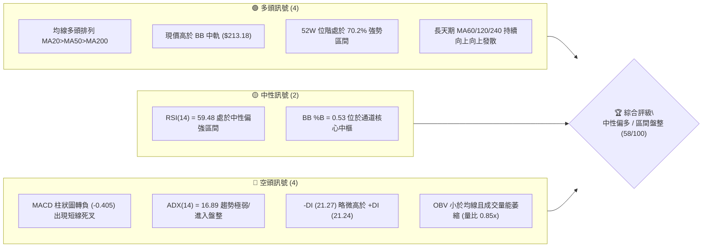

### 📊 核心指標速覽表

| 指標類別 | 指標名稱 | 當前數值 | 訊號 | 解讀 |
|:---|:---|:---|:---:|:---|
| **價格** | 當前價格 | $214.72 | 🟢 | 位於 MA20 ($213.18) 上方，處於 52 週區間之 70.2% 高位 |
| **均線** | MA20 (月線) | $213.18 | 🟢 | 現價於上方 +0.72%，短線獲得支撐，但斜率趨緩 |
| **均線** | MA50 (季線) | $207.58 | 🟢 | 現價於上方 +3.44%，中期多頭防線穩固 |
| **均線** | MA200 (年線) | $195.12 | 🟢 | 現價於上方 +10.04%，長期多頭生命線支撐強勁 |
| **短均** | MA5 / MA10 | $218.78 / $220.35 | 🔴 | 現價跌破 5 日與 10 日均線，短線出現拉回整理壓力 |
| **動能** | RSI(14) | 59.48 | 🟡 | 位於 30-70 常態中性偏多區間，無極端超買或超賣 |
| **動能** | MACD (12,26,9) | DIF: 3.656 / DEA: 4.061 | 🔴 | MACD 柱狀圖為 -0.405，快線下穿慢線，短線動能減弱 |
| **隨機指標** | Stoch %K / %D | %K: 30.05 / %D: 54.33 | 🟡 | %K 進入弱勢區，尚未觸及超賣超跌區間 (<20) |
| **趨勢強度**| ADX(14) | 16.89 (+DI: 21.24, -DI: 21.27) | 🔴 | ADX < 25 代表非單邊強趨勢行情，進入無方向之箱體震盪 |
| **通道指標**| 布林通道 (%B) | 上軌 $235.92 / 下軌 $190.44 (%B: 0.53) | 🟡 | 價格貼近中軌運行，通道開口未顯著放大，為典型盤整結構 |
| **成交量能**| 20日均量比 | 98.55M / 116.57M (量比 0.85x) | 🔴 | 量能低於 20 日均量，OBV 疲軟，追價動能不足 |
| **波動** | ATR(14) | $5.75 (佔股價 2.68%) | 🟡 | 波動率處於中等水平，每日正常震盪區間約 ±$5.75 |

### 🏆 技術評分卡

```
╔══════════════════════════════════════════════════════════════╗
║               技術評分卡 — NVDA (2026-08-23)                 ║
╠══════════════════════════════════════════════════════════════╣
║ 趨勢強度 (ADX/DI)   ████░░░░░░░░░░░░░░░░  35/100  🔴 盤整無向 ║
║ 動能指標 (RSI/MACD) ██████████░░░░░░░░░░  50/100  🟡 動能減速 ║
║ 支撐穩定度 (S1/S2)  ████████████████░░░░  80/100  🟢 多重支撐 ║
║ 成交量配合 (OBV/VOL)████████░░░░░░░░░░░░  40/100  🔴 量能背離 ║
║ 形態完整度 (結構)   ████████████░░░░░░░░  60/100  🟡 箱體整理 ║
║ 均線排列 (MA系統)   ████████████████░░░░  82/100  🟢 標準多頭 ║
╠══════════════════════════════════════════════════════════════╣
║ 綜合評分            ███████████░░░░░░░░░  58/100  🟡 中性偏多 ║
╚══════════════════════════════════════════════════════════════╝
```

---

## 2. 趨勢分析

### 🌐 多時框趨勢分析

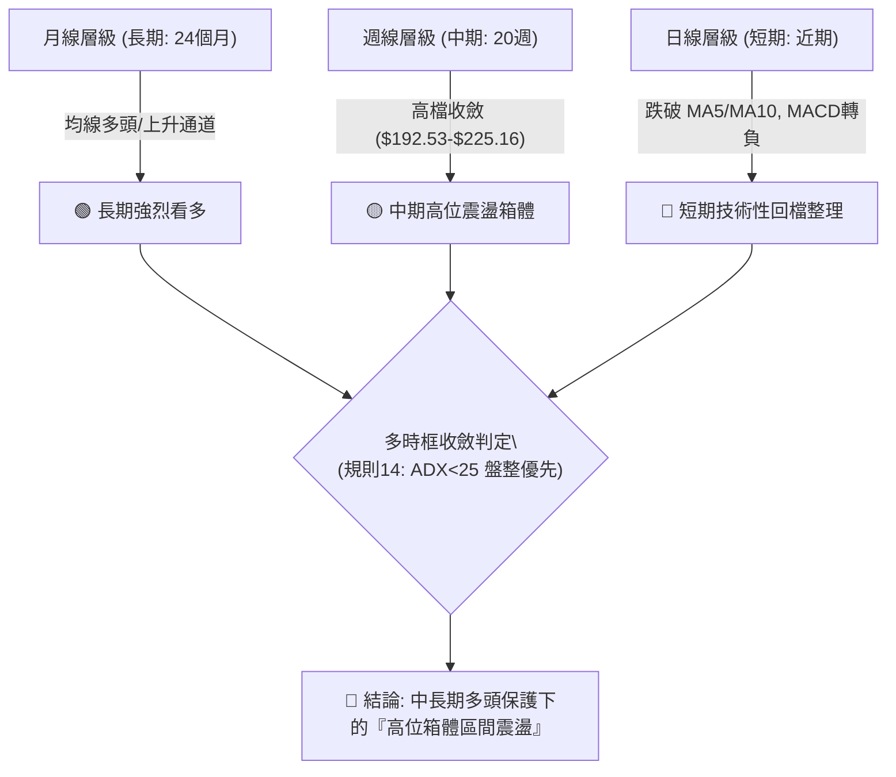

### 📈 長期趨勢 — 12個月走勢圖（Unicode）

```
NVDA 月線走勢圖（2025-09 至 2026-08）
價格軸 ($)
$220 ┤                                                 ● $214.72 (現價)
$210 ┤                                         ● $210.89
$200 ┤                   ● $202.23     ● $199.34       ● $200.75
$190 ┤           ● $186.34       ● $190.90
$180 ┤                               ● $176.97   ● $174.20
$170 ┤                                   (回測支撐)
     └─────────────────────────────────────────────────────────────►
       09   10   11   12   01   02   03   04   05   06   07   08 (月份)
```

**走勢特徵分析表格**：

| 階段區間 | 起止月份 | 價格變化 ($) | 漲跌幅 (%) | 走勢特徵與量價結構解讀 |
|:---|:---:|:---:|:---:|:---|
| **第一波衝頂** | 2025-09 → 2025-10 | $186.34 → $202.23 | +8.53% | 突破 $200 大關，呈現強勢推升，創下當時波段新高。 |
| **中級回檔整理**| 2025-11 → 2026-03 | $202.23 → $174.20 | -13.86% | 觸及 52 週低點區間後反覆築底，於 $174-$176 建立強固防守平台。 |
| **主升浪突破** | 2026-04 → 2026-05 | $174.20 → $210.89 | +21.06% | 帶量突破前高，形成中期上升波段，推升均線架構全面多頭發散。 |
| **高位箱體震盪**| 2026-06 → 2026-08 | $200.09 → $214.72 | +7.31% | 價格在 $190.44 (BB下軌) 與 $236.26 (52W高點) 之間進行寬幅洗盤。 |

### 📊 中期趨勢（週線分析）

```
NVDA 近 20 週關鍵壓力與支撐示意圖
══════════════════════════════════════════════════════════════════
 52W 高點 / R2  $236.26 ────────────────────────────────────────── (歷史強阻力)
 波段高點 / R1  $232.01 ───┐ (08/16 觸頂 $225.16 後回落)
                           │
 現價位階       $214.72 ───┼── 現價 (回測 MA20 $213.18)
                           │
 波段支撐 / S1  $208.54 ───┴── 07/26、08/02 震盪低點防線 (Fib 38.2% $208.60)
 中期支撐 / S2  $198.65 ────── Fib 50.0% ($200.06) 及 MA120 ($201.84)
 長期防線 / S3  $194.51 ────── 06/28 週低點 $192.53 聚類 / MA200 ($195.12)
══════════════════════════════════════════════════════════════════
```

### ⚡ 趨勢強度評估（ADX 解讀）

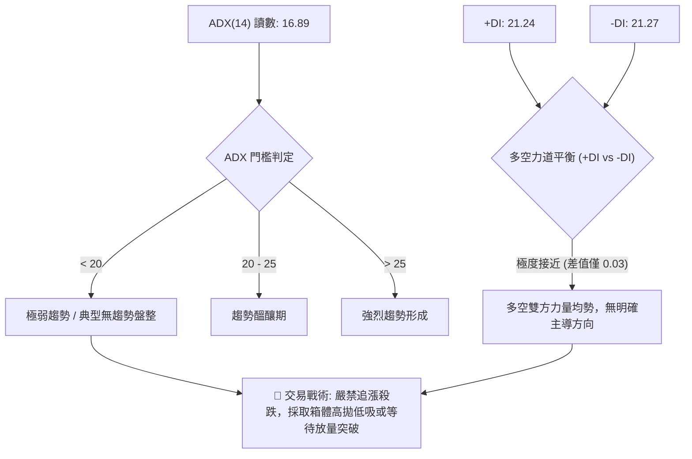

| 指標 | 數值 | 狀態 | 意涵與操作指引 |
|:---|:---:|:---:|:---|
| **ADX(14)** | 16.89 | 弱趨勢/無方向 | 遠低於 25 臨界值，代表當前非單邊單向行情，趨勢跟隨策略容易反覆停損。 |
| **+DI (14)** | 21.24 | 買盤力道平平 | 多頭動能減退，未能有效拉開與空方的差距。 |
| **-DI (14)** | 21.27 | 賣盤略佔上風 | 雖然空方微幅領先 0.03，但尚未形成實質空頭攻擊趨勢。 |

---

## 3. 圖表形態分析

### 🔍 形態識別系統

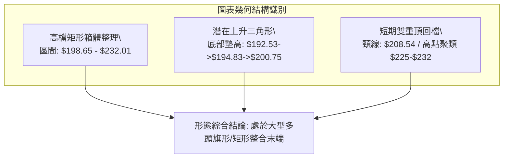

**形態信心度與目標價評估表**（依規則 15 嚴格標注）：

| 形態名稱 | 信心度 (%) | 判斷依據（嚴格引用數據） | 完成度 (%) | 形態目標價（附計算式） |
|:---|:---:|:---|:---:|:---|
| **高位矩形箱體** | 75% | 頂部受阻於 R1 $232.01 / R2 $236.26；底部獲 S1 $208.54 / S2 $198.65 支撐。 | 85% | 向上突破目標 = 頸線 $232.01 + 形態高度 ($232.01 - $208.54 = $23.47) = **$255.48** *(註：數據中阻力聚類最高為 R2 $236.26，突破後方看推算位)* |
| **上升支撐三角** | 60% | 週線低點持續墊高 (06/28 $192.53 → 07/05 $194.83 → 08/02 $200.75)，但上方於 $225-$232 承壓。 | 70% | 向上突破目標 = 頂部 $232.01 + 最大波幅 ($232.01 - $192.53 = $39.48) = **$271.49** *(需待站穩 R2 $236.26)* |
| **短線雙頂回跌** | 45% | 08/09 收盤 $223.96 與 08/16 收盤 $225.16 形成微幅雙頂，本週跌破 MA5/MA10。 | 50% | *信心度不足 50%，僅作短線回踩指標解讀，下看支撐 S1 $208.54。* |

### 🕯️ 重要K線形態分析

| 週期/日期 | 收盤價 | K線形態特徵 | 技術面解讀 | 訊號 |
|:---|:---:|:---|:---|:---:|
| **2026-08-09 (週線)** | $223.96 | 長陽實體突破 | 大幅吞噬前週黑K，動能充沛，推升 MACD 柱狀圖至 +2.497。 | 🟢 |
| **2026-08-16 (週線)** | $225.16 | 高檔縮量十字星 | 創波段反彈收盤新高但成交量萎縮至 500M，顯示追價買盤乏力。 | 🟡 |
| **2026-08-23 (最新)** | $214.72 | 實體中陰線回調 | 吞噬前週漲幅，跌破短均線 MA5 ($218.78)，回測 MA20 ($213.18) 尋求支撐。 | 🔴 |

### 📉 ASCII 走勢形態示意圖

```
NVDA 高位震盪箱體與支撐測試示意圖
$236.26 ┬────────────────────────────────────────── 52W High (R2)
        │            ▲ 高點 1 ($225.06)    ▲ 高點 2 ($225.16)
$225.00 ┤           ╱ ╲                   ╱ ╲
        │          ╱   ╲                 ╱   ╲
$214.72 ┼─────────╱─────╲───────────────╱─────● (當前位置: 回測 MA20 $213.18)
        │        ╱       ╲             ╱       
$208.54 ┼───────╱─────────●───────────●────────── 關鍵頸線/波段支撐 (S1)
        │      ╱         (06/21 $210.69)
$198.65 ┴─────● ($192.53) ──────────────────────── 箱體底部防線 (S2)
```

---

## 4. 支撐與阻力

### 🗺️ 關鍵價位分布圖（Unicode）

```
NVDA 價位結構分布圖（OHLCV 精確計算）
══════════════════════════════════════════════════════════════
$236.26 ║██████████████████████████████║ 強阻力 R2 (52W歷史高點 / Fib 0.0%)
$232.01 ║██████████████████████░░░░░░║ 關鍵阻力 R1 (近一年波段高點聚類)
$219.18 ║▓▓▓▓▓▓▓▓▓▓▓▓▓▓▓▓░░░░░░░░░░░░║ 短線阻力 (Fib 23.6% 回調位 / MA10)
════════╬══════════════════════════════╬═════════════════════════════
$214.72 ╠══════════════════════════════╣ ◄ 現價 (距 S1: -2.88%, 距 R1: +8.05%)
════════╬══════════════════════════════╬═════════════════════════════
$213.18 ║░░░░░░░░░░░░░░░░░░░░░░░░░░░░║ 動態支撐 (MA20 / 布林中軌)
$208.54 ║████████████████████░░░░░░░░║ 關鍵支撐 S1 (波段低點聚類 / Fib 38.2%)
$198.65 ║████████████████████████░░░░║ 中期強支撐 S2 (波段低點 / Fib 50.0%)
$194.51 ║████████████████████████████║ 長期生命線 S3 (波段底 / MA200 $195.12)
══════════════════════════════════════════════════════════════
```

### 🚧 阻力位分析表

| 阻力級別 | 精確價位 | 形成原因（依據數據） | 突破難度 | 技術重要性 |
|:---|:---:|:---|:---:|:---|
| **第一阻力 (R1)** | **$232.01** | 近一年波段高點聚類區間，接近 2026-08 上旬反彈高位。 | 🟡 中等偏高 | 若能放量突破此位，宣告高位箱體整理結束，重啟主升浪。 |
| **第二阻力 (R2)** | **$236.26** | 52 週歷史最高價，斐波那契 0.0% 起算基準點。 | 🔴 極高 | 歷史極限解套賣壓區，需單日成交量放大至 1.5x 均量方可攻克。 |

### 🛡️ 支撐位分析表

| 支撐級別 | 精確價位 | 形成原因（依據數據） | 守住機率 | 技術重要性 |
|:---|:---:|:---|:---:|:---|
| **第一支撐 (S1)** | **$208.54** | 近一年波段低點聚類，與斐波那契 38.2% ($208.60) 及 MA60 ($208.43) 重合。 | 🟢 75% | 短線多頭防線，失守將考驗 $200 整數心理關卡。 |
| **第二支撐 (S2)** | **$198.65** | 近一年重要波段支撐聚類，緊鄰斐波那契 50.0% ($200.06) 與 MA120 ($201.84)。 | 🟢 85% | 中期多空格局分水嶺，守穩則中期多頭架構完好無損。 |
| **第三支撐 (S3)** | **$194.51** | 波段底部密集聚類區，貼近 MA200 ($195.12) 及布林下軌 ($190.44)。 | 🟢 95% | 長期多頭最後防線（年線防護罩），極具左側逢低配置價值。 |

### 📐 斐波那契回調位分析

依據 52 週區間 **$163.85 (52W Low)** 至 **$236.26 (52W High)** 計算之回調架構：

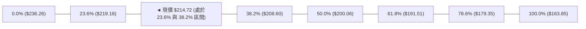

- **當前價位解讀**：現價 **$214.72** 精確運行於 **23.6% ($219.18)** 與 **38.2% ($208.60)** 之間。
- **回調深度評估**：自高點回調幅度未達 38.2%，屬於強勢整理格局（Healthy Pullback）。
- **關鍵共振點**：斐波那契 38.2% ($208.60) 與波段支撐 S1 ($208.54) 及 MA60 ($208.43) 形成**三重強共振支撐帶**，為短線最強技術防線。

---

## 5. 技術指標深度解讀

### 🎛️ 指標訊號總覽

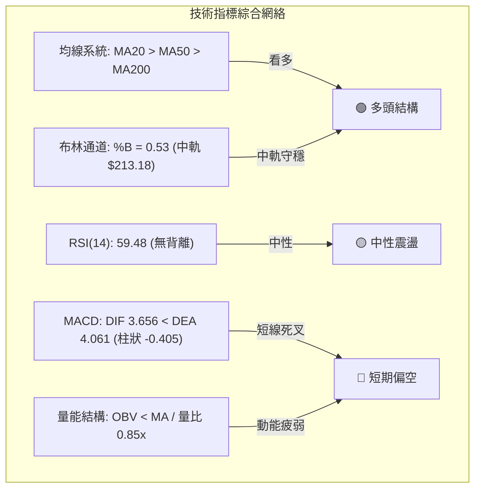

### 📈 移動平均線排列分析

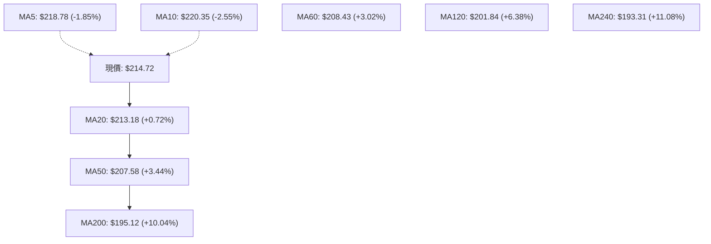

- **均線排列架構**：MA20 ($213.18) > MA50 ($207.58) > MA200 ($195.12)，呈現標準的**大週期多頭排列**。
- **短線乖離修正**：現價跌破 MA5 與 MA10，短線均線下彎形成上方第一道壓制，目前價格正回測 MA20 尋求扣抵支撐。
- **長線趨勢基石**：半年線 MA120 ($201.84) 與年線 MA200 ($195.12) 穩定向上發散（年線正乖離 +10.04%），確保長線多頭基底穩固。

### 📉 RSI(14) 分析

- **當前讀數**：`59.48` 
- **強度進度條**：`████████████░░░░░░░░` 59.5%
- **超買/超賣判定**：處於 50–70 強勢中性區間，自前週 75.4（過熱區）回落，成功釋放短線超買壓力。
- **背離分析**：
  - 價格於 2026-08 創反彈高點 $225.16 時，週線 RSI 為 75.4，低於 2026-04 高點時的 RSI 92.8；然而日線層級上隨價格震盪回落，RSI 同步滑落至 59.48。
  - **結論**：**無明顯日線底背離或頂背離**，RSI 走勢與價格拉回完全吻合，反映常態獲利了結。

### 📊 MACD(12,26,9) 訊號解讀

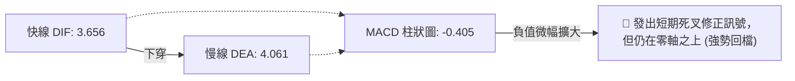

- **數值狀態**：DIF 3.656 跌破 DEA 4.061，MACD 柱狀圖翻負至 -0.405。
- **深度解讀**：雙線依然遠在零軸上方運行，顯示本次死叉為「**零軸上方強勢整理**」而非「轉為空頭市場」，下行空間受限於零軸支撐。

### 📦 布林通道分析

```
NVDA 布林通道 (20, 2) 結構圖
$235.92 ┬────────────────────────────────────────── BB 上軌 (阻力帶)
        │
$214.72 ┼─────────────────● 現價 (BB %B = 0.53)
$213.18 ┼─────────────────■ BB 中軌 (MA20 動態防線)
        │
$190.44 ┴────────────────────────────────────────── BB 下軌 (超跌支撐)
```

- **通道帶寬**：通道處於收斂後的水平延展狀態，帶寬未顯著張開。
- **%B 指標**：當前 %B 為 **0.53**，精確座落於中軌（0.50）上方，表明價格處於常態震盪中樞，下軌 $190.44 具備極強的下檔保護。

### 💹 成交量分析（量價配合度）

- **量能現狀**：最新成交量為 **98,545,600 股**，相較 20 日均量 (116.57M) 量比僅 **0.85x**，相較 50 日均量 (129.32M) 明顯萎縮。
- **OBV 趨勢**：OBV 低於其移動平均線，顯示資金追高意願減弱，主力資金於高檔處於觀望與洗盤狀態。
- **量價背離結論**：週線級別成交量自 5 月的 845M 逐週縮減至當前的 484M，呈現「**價平量縮**」之高位換手整理，並非恐慌性放量出逃。

---

## 6. 動能與波動率

### ⚡ 動能評估四象限

| 象限分類 | 動能特徵 | 波動率特徵 | 當前狀態判定 | 操作指引與含義 |
|:---|:---:|:---:|:---:|:---|
| **第一象限 (Q1)** | 強動能 (ADX>25, RSI>60) | 低波動 (ATR% < 2%) | — | 最佳趨勢加速買點 |
| **第二象限 (Q2)** | **弱動能 (ADX 16.89, RSI 59.5)** | **中低波動 (ATR% 2.68%)** | **✓ 當前落點** | **適合區間操作 / 箱體高拋低吸** |
| **第三象限 (Q3)** | 強動能 (ADX>25) | 高波動 (ATR% > 4%) | — | 高風險單邊行情，順勢追擊 |
| **第四象限 (Q4)** | 弱動能 (ADX<20) | 高波動 (ATR% > 4%) | — | 劇烈洗盤，應避免進場 |

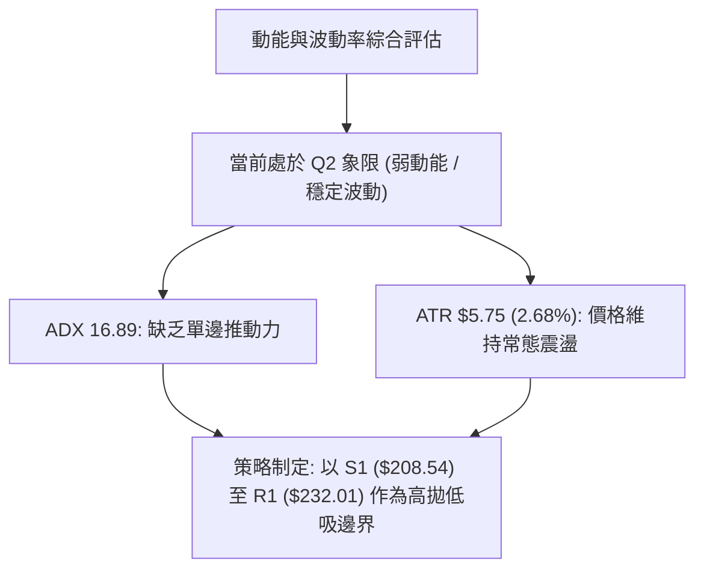

### 📊 ATR 波動率分析

- **ATR(14) 數值**：**$5.75**（佔當前股價之 **2.68%**）。
- **日內安全波動範圍**：當日震盪預期區間為 **$208.97 ～ $220.47**。
- **止損距離量化建議**：
  - **短線交易（1.5x ATR）**：安全止損距離為 $5.75 × 1.5 = **$8.63**。
  - **波段交易（2.0x ATR）**：安全止損距離為 $5.75 × 2.0 = **$11.50**。

### 📐 Beta 與市場相關性

- **Beta 係數**：**2.215**（極高彈性標的）。
- **市場敏感度解讀**：NVDA 的價格波動幅度約為 S&P 500 / Nasdaq 指數的 2.21 倍。若大盤拉回 1%，NVDA 預期將拉回約 2.2%；反之大盤反彈時亦具備更強之爆發力，操作時需嚴格控管槓桿與單筆曝險。

---

## 7. 多時框架總結

### 📋 時框架評分表

| 時框架 | 趨勢方向 | 動能指標 | 均線系統排列 | 圖表形態 | 綜合評分 | 戰術建議 |
|:---|:---:|:---:|:---:|:---:|:---:|:---|
| **長期 (月線)** | 🟢 強烈看多 | 🟢 RSI 偏強 | 🟢 MA60/120/240 發散 | 🟢 沿上升趨勢線運行 | **88/100** | 長期核心部位堅定持有 |
| **中期 (週線)** | 🟡 高位盤整 | 🟡 MACD 柱微弱 | 🟢 站穩 MA50 ($207.58) | 🟡 矩形高檔整理 | **65/100** | 支撐位附近分批逢低佈局 |
| **短期 (日線)** | 🔴 震盪拉回 | 🔴 MACD 死叉 | 🟡 跌破 MA5/10, 測 MA20 | 🔴 雙頂回踩測試頸線 | **45/100** | 不宜追高，耐心等待回踩止跌 |

### 🔲 綜合訊號矩陣

```
時框架一致性分析矩陣
══════════════════════════════════════════════════════════════
維度            短期 (日線)      中期 (週線)      長期 (月線)
──────────────────────────────────────────────────────────────
趨勢方向        🔴 偏空回調      🟡 箱體震盪      🟢 強烈多頭
動能強弱        🔴 轉弱 (-0.405) 🟡 中性 (59.5)   🟢 充沛 (偏多)
均線支撐        🟡 回測 MA20     🟢 站穩 MA50     🟢 遠高於 MA200
形態結構        🔴 短線回檔      🟡 高位旗形      🟢 主升通道
──────────────────────────────────────────────────────────────
結論收斂        短期拉回不破中長期多頭架構，提供逢低進場契機
══════════════════════════════════════════════════════════════
```

### ⚖️ 多時框收斂結論

> **依規則 14 進行多時框嚴格收斂**：
> 1. **行情性質判定**：當前 ADX(14) 為 **16.89 (<25)**，明確定義當前市場為**高位震盪盤整行情**而非單邊趨勢行情。
> 2. **主導時框收斂**：依收斂規則，盤整行情中日線短期波動以布林通道與箱體邊界為主；同時受制於長期均線多頭保護，下檔空間有限。
> 3. **唯一方向性結論**：**中性偏多（區間震盪逢低佈局）**。評分 **58/100**，操作重心應放在「支撐位 S1/S2 之防守買點」，而非追逐突破。

---

## 8. 交易策略建議

### 🗺️ 策略決策流程圖

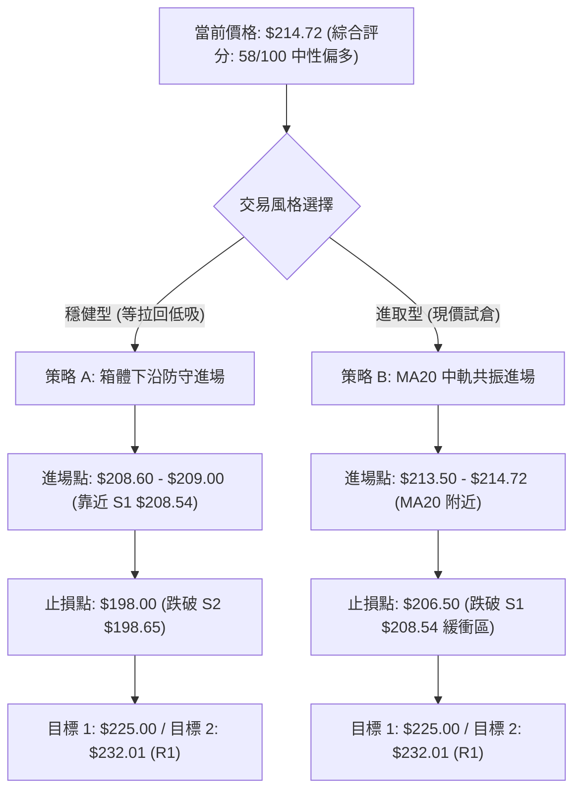

### 🧭 策略路由（依評分卡分流）

- **當前技術評分卡總分**：**58/100（中性偏多）**
- **主策略方向**：**區間操作／高位箱體逢低做多（主推多頭策略，空頭僅列為風險對沖觸發點）**。

### 🎯 價格情境階梯（Price Scenarios）

| 觸發條件 | 第一目標 (T1) | 第二目標 (T2) | 後續延伸目標 | 情境含義與操作指引 |
|:---|:---:|:---:|:---:|:---|
| **放量突破 R1 $232.01** | $236.26 (R2) | $255.48 (形態推算) | $271.49 (三角推算) | 多頭重啟主升浪，可全面加碼追擊。 |
| **守穩 MA20 現價區間** | $220.35 (MA10) | $225.16 (前高) | $232.01 (R1) | 維持高位強勢震盪，以箱體上沿為目標。 |
| **跌破 S1 $208.54** | $201.84 (MA120) | $198.65 (S2) | $194.51 (S3) | 短線轉弱回測箱體下沿，波段多單逢低分批接刀。 |
| **跌破 S3 $194.51 (年線)** | $190.44 (BB下軌) | $179.35 (Fib 78.6%) | $163.85 (52W Low) | 長期多頭架構遭到破壞，全面停損並啟動對沖。 |

### 📊 情境機率分佈

| 情境分類 | 發生機率 | 主要依據與指標佐證 |
|:---|:---:|:---|
| **高位區間震盪** | **55%** | ADX 16.89 顯示無趨勢；布林通道 %B 0.53 貼近中軌；均線向上提供強力托底。 |
| **拉回測試支撐後反彈** | **30%** | MACD 柱翻負 (-0.405) 與量能萎縮 (0.85x) 顯示短線需進一步回測 S1 $208.54 消化浮額。 |
| **直接破位大跌** | **15%** | 長天期均線 (MA50/120/200) 呈多頭排列，基本面 ROE 114.3% 極強，大跌機率低。 |

### 🟢 主策略詳情（多頭交易策略）

| 策略要素 | 策略 A（穩健型：S1 支撐低吸） | 策略 B（進取型：MA20 現價支撐試倉） |
|:---|:---:|:---:|
| **策略邏輯** | 回踩斐波 38.2% 與 S1 共振區進場 | 依託 MA20 ($213.18) 中軌支撐左側進場 |
| **進場價格區間** | **$208.60 ～ $209.50** | **$213.50 ～ $214.72** |
| **第一目標價 (T1)** | **$225.00**（波段前高，獲利空間 +7.8%） | **$225.00**（波段前高，獲利空間 +4.8%） |
| **第二目標價 (T2)** | **$232.01**（阻力位 R1，獲利空間 +11.2%） | **$232.01**（阻力位 R1，獲利空間 +8.1%） |
| **精確止損價格** | **$198.00**（跌破 S2 $198.65 及整數關卡） | **$206.50**（跌破 S1 $208.54 緩衝 1x ATR） |
| **最大風險 / 報酬** | 風險 $10.80 / 預期回報 $23.21 | 風險 $8.22 / 預期回報 $17.29 |
| **風險報酬比 (R:R)** | **1 : 2.15** 🟢 (優良) | **1 : 2.10** 🟢 (優良) |
| **預估勝率** | **65%** | **55%** |
| **建議配置倉位** | **15% - 20%** 總資金 | **10%** 總資金（突破加碼） |

### 🔴 反向風險觸發點（對沖與停損提示）

若出現以下訊號，宣告多頭策略失效，應即刻減倉或建立空頭對沖：
1. **收盤價實體跌破 S1 $208.54** 且 MACD 負柱狀圖進一步擴大至 -1.5 以下。
2. **週線收盤跌破 S2 $198.65 (Fib 50.0%)**，觸發多頭趨勢反轉警報。
3. **對沖操作建議**：若跌破 $208.54，可買入價外 Put 或減碼 50% 現貨倉位。

### ⭐ 整體訊號強度評星

```
╔══════════════════════════════════════════════════════════════╗
║ 做多訊號強度：  ★★★☆☆  (3.5/5星 - 均線多頭但動能整理)        ║
║ 做空訊號強度：  ★★☆☆☆  (2.0/5星 - 長期多頭托底，空間有限)    ║
║ 整體訊號可信度：★★★★☆  (4.0/5星 - 價位聚類與支撐明確)        ║
╚══════════════════════════════════════════════════════════════╝
```

---

## 9. 風險提示與監控

### ✅ 關鍵監控指標 Checklist

```
╔══════════════════════════════════════════════════════════════╗
║                   每日盤後技術監控清單 (Checklist)           ║
╠══════════════════════════════════════════════════════════════╣
║ [ ] 1. 價格防守: 收盤價是否穩守 MA20 ($213.18) 及 S1 ($208.54)║
║ [ ] 2. 均線扣抵: MA5 ($218.78) 是否止跌走平並重新金叉 MA10   ║
║ [ ] 3. 動能指標: MACD 柱狀圖是否由負轉正 (回升至 0 軸上方)   ║
║ [ ] 4. 擺動指標: RSI(14) 是否在 50 榮枯線獲得支撐並回升      ║
║ [ ] 5. 量能變化: 日成交量是否放大至 116.5M (20日均量) 之上  ║
║ [ ] 6. 趨勢爆發: ADX(14) 是否自 16.89 向上穿越 25 臨界線     ║
╚══════════════════════════════════════════════════════════════╝
```

### ⚠️ 風險場景分析

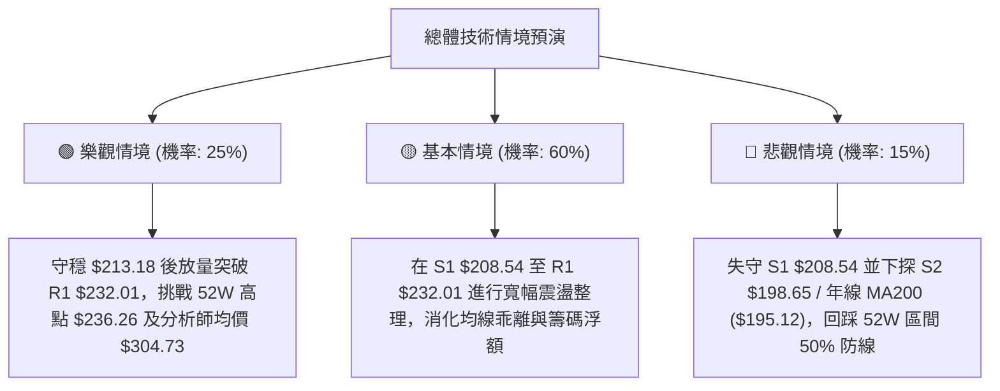

### 🛡️ 風險管理重要提醒

1. **Beta 槓桿風險**：NVDA 的 Beta 高達 **2.215**，在震盪盤整市中，單日波動極易觸發過窄之止損點。建議止損幅度務必保留 **1.5x 至 2.0x ATR ($8.63 ～ $11.50)** 緩衝空間。
2. **籌碼與流動性結構**：機構持股佔比達 **71.3%**，空單餘額僅 **1.3%**（Short Ratio 2.23），籌碼面極為安定，發生無預警崩盤式連續重挫的機率極低。
3. **倉位管理紀律**：在 ADX < 25 的盤整環境下，總持倉部位建議控制在 **50% - 60%** 以內，預留現金於 S1 ($208.54) 與 S2 ($198.65) 分批承接。

---

## 10. 報告總結

```
╔══════════════════════════════════════════════════════════════╗
║                 NVDA 技術分析報告核心總結                    ║
╠══════════════════════════════════════════════════════════════╣
║ 報告日期：2026-08-23          當前價格：$214.72              ║
║ 綜合技術評分：58/100 (中性偏多) 分析評級：⚖️ 區間震盪 / 逢低佈局 ║
╠══════════════════════════════════════════════════════════════╣
║ 核心趨勢結論：                                               ║
║ ├─ 長期趨勢：🟢 強烈看多 (MA200 $195.12 向上，多頭排列完整)  ║
║ ├─ 中期趨勢：🟡 箱體震盪 ($198.65 - $232.01 寬幅整合)        ║
║ ├─ 短期趨勢：🔴 弱勢回調 (跌破 MA5/10，MACD 負柱狀 -0.405)   ║
║ ├─ 關鍵支撐：S1 $208.54 ｜ S2 $198.65 ｜ S3 $194.51         ║
║ ├─ 關鍵阻力：R1 $232.01 ｜ R2 $236.26 (52W High)            ║
║ └─ 華爾街共識目標：$304.73 (59 位分析師 Strong Buy)          ║
╠══════════════════════════════════════════════════════════════╣
║ 最優交易策略組合：                                           ║
║ 1. 🥇 最佳機會：回踩 S1 $208.60 逢低做多 (目標 $232.01, R:R 2.15)║
║ 2. 🥈 次選機會：依託 MA20 $213.50 試倉進場 (目標 $225.00, R:R 2.10)║
║ 3. 🥉 保守選擇：等待放量突破 R1 $232.01 順勢追多至 $255.48   ║
╚══════════════════════════════════════════════════════════════╝
```

---

> ⚠️ **免責聲明**：本報告為技術分析研究成果，所有數據、圖表及價位推算均基於歷史量價數據（OHLCV）。本報告**僅供學術研究與投資策略參考**，**不構成任何形式的個人化投資要約或買賣建議**。市場具有高波動風險，投資人應獨立評估風險並自負盈虧。

---

*報告生成時間：2026-08-23 ｜ 數據來源：Yahoo Finance ｜ 分析框架：多時框技術分析模型*