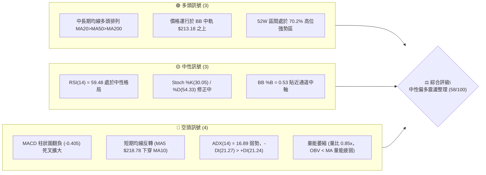
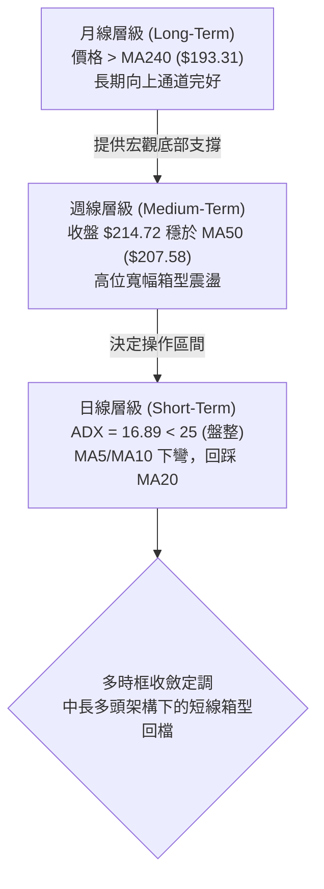
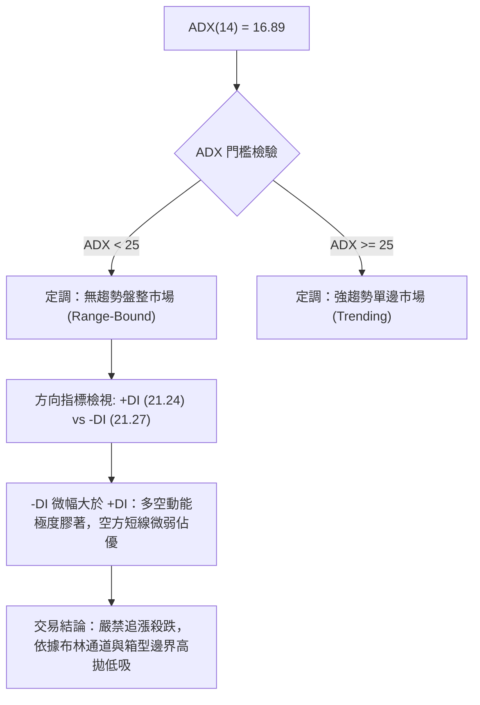
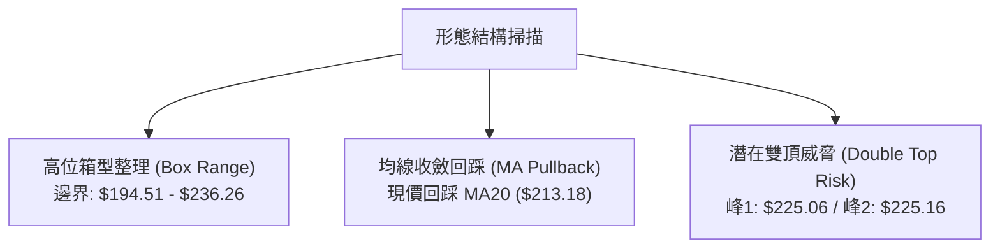
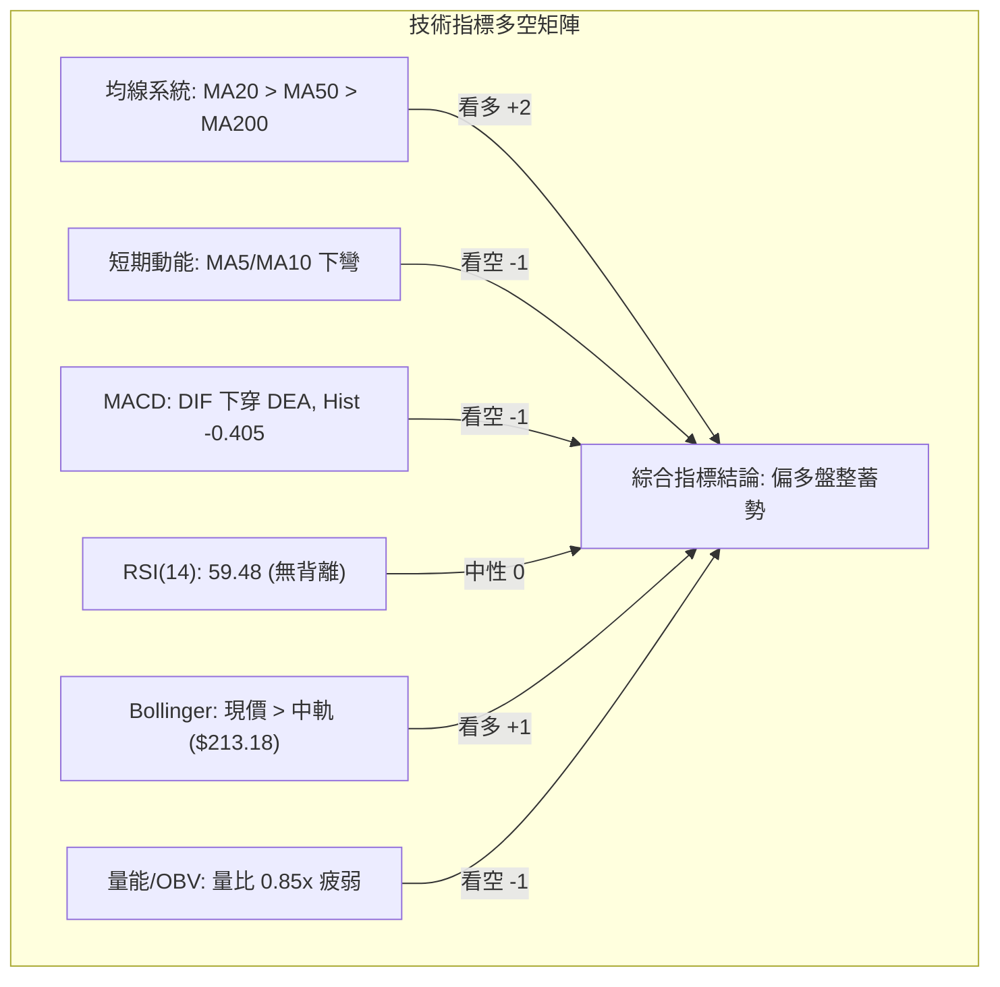
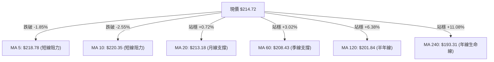
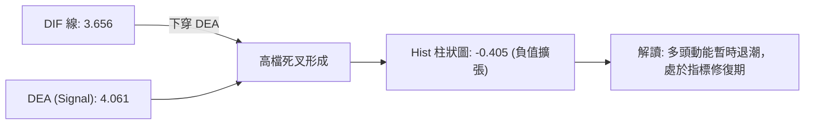
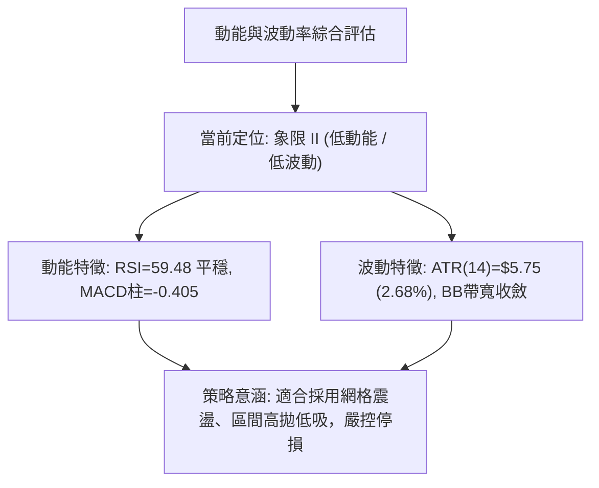
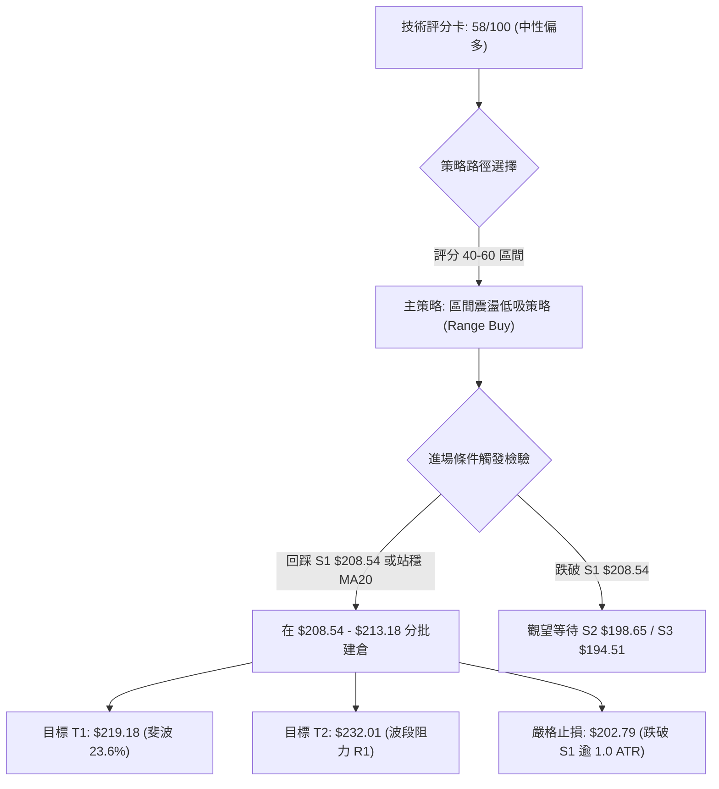
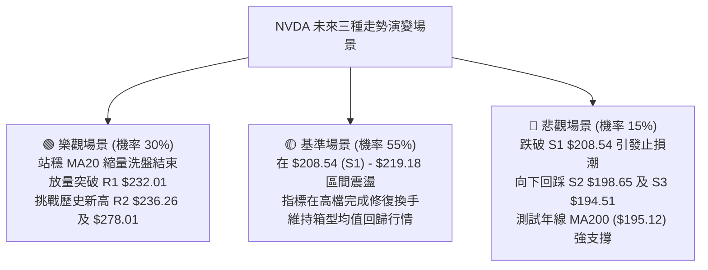

# NVDA 技術分析報告

> **報告日期**：2026-08-24 ｜ **語言**：繁體中文 ｜ **數據來源**：Yahoo Finance ｜ **當前價格**：$214.72

---

## 目錄

| 章節 | 內容 |
|------|------|
| [1. 技術面概覽](#1-技術面概覽) | 訊號儀表板、核心指標、評分卡 |
| [2. 趨勢分析](#2-趨勢分析) | 多時框趨勢、長中短期走勢、ADX 解讀 |
| [3. 圖表形態分析](#3-圖表形態分析) | 形態識別、信心度評估、K線組合 |
| [4. 支撐與阻力](#4-支撐與阻力) | 關鍵價位分佈、斐波那契回調結構 |
| [5. 技術指標深度解讀](#5-技術指標深度解讀) | MA/RSI/MACD/布林通道/成交量配合 |
| [6. 動能與波動率](#6-動能與波動率) | 動能四象限、ATR 波動率、Beta 分析 |
| [7. 多時框架總結](#7-多時框架總結) | 時框矩陣、收斂規則與方向確認 |
| [8. 交易策略建議](#8-交易策略建議) | 策略路由、主策略、情境階梯與風控 |
| [9. 風險提示與監控](#9-風險提示與監控) | 關鍵監控清單、風險場景、部位管理 |
| [📋 報告總結](#-報告總結) | 核心結論與執行決策摘要 |

---

## 1. 技術面概覽

### 🎯 技術訊號儀表板



### 📊 核心指標速覽表

| 指標類別 | 指標名稱 | 當前數值 | 訊號 | 解讀 |
|----------|----------|----------|------|------|
| **價格** | 當前收盤價 | $214.72 | 🟡 | 位於 52 週高低區間 70.2% 處，短期自高點 $225.16 回檔 |
| **均線** | MA20 (短月線) | $213.18 | 🟢 | 現價高於 MA20（+0.72%），回踩布林中軌支撐有守 |
| **均線** | MA50 (季線) | $207.58 | 🟢 | 現價高於 MA50（+3.44%），中期多頭防線穩固 |
| **均線** | MA200 (年線) | $195.12 | 🟢 | 現價高於 MA200（+10.04%），長期多頭牛市架構不變 |
| **短期均線**| MA5 / MA10 | $218.78 / $220.35 | 🔴 | 現價跌破 MA5/MA10，短線呈回檔修正壓力 |
| **動能** | RSI(14) | 59.48 | 🟡 | 處於 50–60 中性偏多區間，無明顯超買或超賣 |
| **動能** | MACD (12,26,9)| DIF: 3.656 / DEA: 4.061 | 🔴 | MACD 處於 Signal 下方，Hist 為 -0.405，出現高檔死叉 |
| **隨機指標**| Stoch %K / %D | 30.05 / 54.33 | 🟡 | %K 跌向超賣區，短線殺跌動能逐漸減弱 |
| **趨勢強度**| ADX(14) | 16.89 (-DI > +DI) | 🔴 | ADX < 25 處於典型無趨勢盤整期，-DI 微幅壓制 +DI |
| **通道指標**| Bollinger Bands| 上: $235.92 / 下: $190.44| 🟡 | %B 為 0.53，價格在中軌 $213.18 附近拉鋸 |
| **量能** | 20日均量比 | 0.85x (98.54M 股) | 🔴 | 縮量拉回，OBV 跌破均線，追價動能不足 |
| **波動** | ATR(14) | $5.75 (2.68%) | 🟡 | 波動率處於正常水平，日均波幅約 $5.75 |

### 🏆 技術評分卡

```
╔════════════════════════════════════════════════════════════════╗
║                技術評分卡 — NVDA (2026-08-24)                 ║
╠════════════════════════════════════════════════════════════════╣
║ 趨勢強度 (ADX=16.89, -DI>+DI)   ████████░░░░░░░░░░░░  40/100 🔴 ║
║ 動能指標 (RSI=59.5, MACD柱轉負) ██████████░░░░░░░░░░  50/100 🟡 ║
║ 支撐穩定度 (MA20/S1=$208.54)   ██████████████░░░░░░  70/100 🟢 ║
║ 成交量配合 (量比0.85x, OBV疲弱) ████████░░░░░░░░░░░░  40/100 🔴 ║
║ 形態完整度 (寬幅高位箱型整理)   ██████████████░░░░░░  70/100 🟢 ║
║ 均線排列 (MA20>MA50>MA200)     ████████████████░░░░  80/100 🟢 ║
╠════════════════════════════════════════════════════════════════╣
║ 綜合評分                       ███████████░░░░░░░░░  58/100 🟡 ║
║ 綜合評級：【中性偏多震盪 — 區間低吸 / 觀望突破】               ║
╚════════════════════════════════════════════════════════════════╝
```

---

## 2. 趨勢分析

### 🌐 多時框趨勢分析



### 📈 長期趨勢 — 12個月走勢圖（Unicode）

```
NVDA 月線走勢圖（2025-09 至 2026-08）
價格軸 ($)
$220 ┤                                                 ● $214.72 (現價)
$210 ┤                                           ● $210.89
$200 ┤              ● $202.23              ● $199.34   ● $200.09  ● $200.75
$190 ┤        ● $186.34        ● $186.27 ● $190.90
$180 ┤                               
$170 ┤                          ● $176.77     ● $176.97  ● $174.20
     └─────────────────────────────────────────────────────────────
       09/25 10/25 11/25 12/25 01/26 02/26 03/26 04/26 05/26 06/26 07/26 08/26
```

**走勢特徵分析表格**：

| 階段區間 | 起止價位 ($) | 區間漲跌幅 | 走勢特徵與技術意義 |
|----------|-------------|------------|--------------------|
| 2024-08 ~ 2025-04 | $119.17 → $108.77 | -8.73% | 築底期：經歷 $108.23 歷史雙重低點洗盤，籌碼充分換手。 |
| 2025-05 ~ 2025-10 | $134.94 → $202.23 | +49.87% | 主升浪突破：量能急遽放大，一舉奠定多頭長牛基礎。 |
| 2025-11 ~ 2026-03 | $176.77 → $174.20 | -1.45% | 中期回檔確認：反覆回踩 52 週低點區間（$163.85~$174.20）並確立強支撐。 |
| 2026-04 ~ 2026-08 | $199.34 → $214.72 | +7.72% | 高位箱型震盪：突破 $200 關卡後在 $190–$236 區間進行高檔換手整理。 |

### 📊 中期趨勢（週線分析）

中期走勢呈現典型的高檔對稱震盪。過去 20 週數據顯示：
- **頂部壓力區**：集中於 2026-05-17 之週收盤 $225.06 及 2026-08-16 之週收盤 $225.16，向上即遭遇波段阻力 R1 ($232.01) 與 52 週最高點 R2 ($236.26)。
- **底部支撐區**：集中於 2026-06-28 之週收盤 $192.53 及 2026-07-05 之 $194.83，精確對應支撐位 S3 ($194.51) 與斐波那契 61.8% 回調位 ($191.51)。

```
週線區間對峙結構：
頂部壓力線 ═══════════════════════ $236.26 (52W High / R2)
             ▲ 上衝受阻 ($225.16)
現價位置   ─────────────────────── $214.72 (處於通道中軸偏上)
             ▼ 回踩有守 ($192.53)
底部支撐線 ═══════════════════════ $190.44 ~ $194.51 (BB下軌 / S3)
```

### ⚡ 趨勢強度評估（ADX 解讀）



| 指標變數 | 當前讀數 | 狀態門檻 | 判斷結論 |
|----------|----------|----------|----------|
| **ADX(14)** | 16.89 | < 25 (弱趨勢/盤整) | 單邊動能完全消退，行情進入震盪蓄勢期。 |
| **+DI(14)** | 21.24 | 中性偏弱 | 多頭上攻動能暫時受阻。 |
| **-DI(14)** | 21.27 | 中性偏強 | 空頭微幅主導，但無顯著拋售趨勢。 |
| **操作指引** | 盤整模式 | 均值回歸策略 | 優先採用震盪指標（Stoch / BB）而非趨勢突破系統。 |

---

## 3. 圖表形態分析

### 🔍 形態識別系統



**形態信心度與目標價評估表**：

| 形態名稱 | 信心度 | 判斷依據（數據引用） | 完成度 | 目標價（附嚴謹計算式） |
|----------|--------|----------------------|--------|------------------------|
| **高位箱型整理** | 85% | 頂部受阻於 $236.26 (R2)，底部獲 S3 ($194.51) 與 BB下軌 ($190.44) 支撐 | 75% | **向上突破目標**：頸線 $236.26 + 箱高 ($236.26 - $194.51 = $41.75) = **$278.01** |
| **潛在雙重頂結構** | 60% | 2026-05-17 週高 $225.06 與 2026-08-16 週高 $225.16 形成雙峰，MACD 轉負 | 45% | **向下破位目標**：頸線 S2 ($198.65) - 雙頂高 ($225.16 - $198.65 = $26.51) = **$172.14** |
| **布林通道中軌回踩** | 70% | 現價 $214.72 緊貼 BB 中軌 / MA20 ($213.18)，%B = 0.53 | 90% | **反彈目標**：斐波那契 23.6% 回調位 = **$219.18**；次目標 R1 = **$232.01** |

### 🕯️ 重要K線形態分析

| 觀測週期/月份 | 收盤價 ($) | K線組合形態 | 技術解讀 | 訊號 |
|---------------|-----------|-------------|----------|------|
| **2026-04** | $199.34 | 大陽線突破 (Bullish Breakout) | 突破 $190 箱型底部，形成強烈看漲反轉確認。 | 🟢 |
| **2026-05** | $210.89 | 衝高回落十字長上影線 | 觸及 $225.06 週高點後遭遇強大解套拋壓。 | 🟡 |
| **2026-06** | $200.09 | 陰線回踩測試支撐 | 回踩 $192.53 未破 MA200，確認下檔買盤支撐。 | 🟢 |
| **2026-07** | $200.75 | 底部十字星 (Doji Star) | 波動率收窄，空方動能耗盡，多空在此達成暫時平衡。 | 🟡 |
| **2026-08 (即時)**| $214.72 | 衝高回檔中陽線 | 自 $225.16 回檔至中軌，尚未破壞 8 月上攻格局。 | 🟡 |

### 📉 ASCII 走勢形態示意圖

```
NVDA 2026年高位箱型與潛在雙峰結構圖
========================================================================
$236.26 ┤                                  [52W High / 箱型上軌]
        │         雙頂峰1                   雙頂峰2
$225.00 ┤         ╭──╮                     ╭──╮
        │        ╭╯  ╰╮                   ╭╯  ╰╮
$214.72 ┤───────╭╯────╰──────────────────╭╯────╰─● 現價回踩 MA20 ($213.18)
        │      ╭╯      ╰╮   頸線整理    ╭╯
$200.00 ┤─────╭╯        ╰───────────────╯───── [頸線支撐 / S2 $198.65]
        │    ╭╯          ╰╮           ╭╯
$190.44 ┤───╭╯            ╰───────────╯─────── [BB下軌 / S3 $194.51]
========================================================================
```

---

## 4. 支撐與阻力

### 🗺️ 關鍵價位分布圖（Unicode）

```
NVDA 關鍵價位結構分布圖
════════════════════════════════════════════════════════════════════
$236.26 ║██████████████████████████████║ 強阻力 R2 (52W 最高點 / 箱體頂部)
$232.01 ║██████████████████████        ║ 波段阻力 R1 (近一年波段高點聚類)
$219.18 ║▓▓▓▓▓▓▓▓▓▓▓▓▓▓▓▓              ║ 短線壓力 (斐波那契 23.6% 回調位)
────────╫──────────────────────────────╫────────────────────────────
$214.72 ╠══════════════════════════════╣ ◄ 當前收盤價 (現價)
────────╫──────────────────────────────╫────────────────────────────
$213.18 ║▒▒▒▒▒▒▒▒▒▒▒▒▒▒▒▒▒▒▒▒          ║ 動態支撐 (MA20 / 布林通道中軌)
$208.54 ║████████████████████          ║ 關鍵支撐 S1 (斐波那契 38.2% $208.60 / MA60)
$198.65 ║████████████████████████      ║ 核心支撐 S2 (斐波那契 50.0% $200.06 緩衝區)
$194.51 ║██████████████████████████████║ 強支撐 S3 (BB下軌 $190.44 / 年線防線)
════════════════════════════════════════════════════════════════════
```

### 🚧 阻力位分析表

| 阻力級別 | 價位 ($) | 距離現價 (%) | 形成原因（波段高點聚類） | 突破難度 | 技術重要性 |
|----------|----------|--------------|--------------------------|----------|------------|
| **R1** | $232.01 | +8.05% | 近一年波段高點聚類區，密集解套賣壓帶 | 80% | 極高：短線多頭能否開啟主升浪的關鍵分水嶺 |
| **R2** | $236.26 | +10.03% | 52週歷史最高點（52W High），斐波那契 0.0% 基準點 | 90% | 歷史級：突破將創歷史新高，引發技術面空頭回補 |

### 🛡️ 支撐位分析表

| 支撐級別 | 價位 ($) | 距離現價 (%) | 形成原因（波段低點聚類） | 守住機率 | 技術重要性 |
|----------|----------|--------------|--------------------------|----------|------------|
| **S1** | $208.54 | -2.88% | 近一年波段低點聚類，與斐波那契 38.2% ($208.60)、MA60 ($208.43) 重合 | 75% | 高：短期回檔第一道多頭防線 |
| **S2** | $198.65 | -7.48% | 中期波段震盪平台低點，斐波那契 50.0% ($200.06) 心理整數關卡 | 80% | 關鍵：跌破則宣告日線箱型向下破位 |
| **S3** | $194.51 | -9.41% | 近一年波段強低點，貼近年線 MA200 ($195.12) 與 MA240 ($193.31) | 90% | 鐵底：長期多頭牛熊分界線 |

### 📐 斐波那契回調位分析

依據 52 週波動區間（最低點 **$163.85** 至 最高點 **$236.26**，總垂直價差 **$72.41**）嚴密劃分：

```
斐波那契回調刻度：
0.0%   ────────────────────── $236.26 (52W High / R2)
23.6%  ────────────────────── $219.18 (短線向上反彈第一阻力)
       ▲ 現價: $214.72 (處於 23.6% 至 38.2% 區間)
38.2%  ────────────────────── $208.60 (重合 S1 支撐 $208.54)
50.0%  ────────────────────── $200.06 (中樞多空平衡水準 / S2 $198.65)
61.8%  ────────────────────── $191.51 (黃金分割防線 / BB下軌 $190.44)
78.6%  ────────────────────── $179.35 (極限回檔深度)
100.0% ────────────────────── $163.85 (52W Low)
```

**解讀**：現價 $214.72 位於 **23.6% ($219.18)** 與 **38.2% ($208.60)** 之間。在技術回調理論中，價格回調守穩 38.2% 屬於「強勢回檔」，只要 S1 ($208.54) 不被有效跌破，整體技術結構仍保留再次向上挑戰 0.0% ($236.26) 的動能。

---

## 5. 技術指標深度解讀

### 🎛️ 指標訊號總覽



### 📈 移動平均線排列分析



| 均線名稱 | 數值 ($) | 價格相對位置 | 偏離率 (%) | 趨勢涵義 |
|----------|----------|--------------|------------|----------|
| **MA 5** | $218.78 | 價格在下方 | -1.85% | 短線超買修正，短空訊號 |
| **MA 10** | $220.35 | 價格在下方 | -2.55% | 5日與10日均線死叉，壓制反彈 |
| **MA 20** | $213.18 | 價格在上方 | +0.72% | 月線具有強大動態支撐效應 |
| **MA 60** | $208.43 | 價格在上方 | +3.02% | 季線穩步抬升，確認中期多頭趨勢 |
| **MA 120**| $201.84 | 價格在上方 | +6.38% | 半年線向上發散，過濾掉假跌破風險 |
| **MA 240**| $193.31 | 價格在上方 | +11.08% | 長期牛市底線，提供極強保護 |

### 📉 RSI(14) 分析

- **當前讀數**：**59.48**
- **動能強度進度條**：
  ```
  超賣 (0-30)        中性偏多 (59.48)        超買 (70-100)
  ├───┼───┼───┼───┼───┼───█───┼───┼───┼───┤
  0  10  20  30  40  50  60  70  80  90 100
  [████████████░░░░░░░░] 59.48%
  ```
- **背離分析判斷**：
  - 比對 2026-04-19（價格 $201.45，RSI 達 92.8）至 2026-08-16（價格 $225.16，RSI 降至 75.4），價格創波段新高而 RSI 峰值下降，顯示**週線層級存在溫和頂背離現象**，這直接促成了近期自 $225.16 回落至 $214.72 的技術修正。
  - 當前日線 RSI(14) 位於 59.48，已自高檔充分冷卻，**當前無即時性嚴重背離**，動能回歸良性常態。

### 📊 MACD(12/26/9) 訊號解讀



- **MACD 線**：3.656 仍處於零軸上方，確認長線多頭架構仍未瓦解。
- **訊號線 (Signal)**：4.061。
- **柱狀圖 (Histogram)**：-0.405。柱狀圖翻負且呈現擴大態勢，提示投資人短期不宜盲目追高，需防範進一步回踩 S1 ($208.54) 的技術需求。

### 📦 布林通道分析

```
布林通道結構示意圖（日線）
═════════════════════════════════════════════════════════════════════════════
$235.92 ┬────────────────────────────────────────── BB 上軌 (阻力帶)
        │
$220.00 ┤                     ╭───╮ (高點 $225.16)
        │                    ╭╯   ╰╮
$214.72 ┼───────────────────╭╯─────╰─● 現價 (BB %B = 0.53)
$213.18 ┼──────────────────╭╯──────────── BB 中軌 / MA20 (動態支撐)
        │                 ╭╯
$200.00 ┤                ╭╯
        │   ╭───╮       ╭╯
$190.44 ┴───╯───╰───────╯────────────────── BB 下軌 (極限支撐)
═════════════════════════════════════════════════════════════════════════════
```

- **帶寬與位置**：通道上軌 $235.92、中軌 $213.18、下軌 $190.44。
- **%B 指標 (0.53)**：現價精確處於中軌上方（53% 位置），代表目前股價在布林帶內部處於均衡狀態，未觸及上軌超買區亦未落入下軌超賣區。

### 💹 成交量分析（量價配合度）

- **成交量對比**：最新單日成交量 **98.55M 股**，較 20 日均量 **116.57M 股** 縮減（**量比 0.85x**），且低於 50 日均量 **129.32M 股**。
- **量價背離檢視**：
  - 8 月自 $200.75 上漲至 $225.16 過程中，週成交量由 705.12M 萎縮至 500.45M，呈現「價漲量縮」的量價背離。
  - OBV 指標目前低於其移動平均線（OBV < MA），證實市場主力追高意願不足，當前回檔為縮量回踩，尚無恐慌性拋售跡象。

---

## 6. 動能與波動率

### ⚡ 動能評估四象限

| 象限標籤 | 動能強度 | 波動率水準 | 特徵定義 | NVDA 當前狀態歸屬與解讀 |
|----------|----------|------------|----------|--------------------------|
| **象限 I** | 強 (High) | 低 (Low) | 穩健單邊上升，低回撤 | ❌ 非當前狀態。 |
| **象限 II** | 弱 (Low) | 低 (Low) | 縮量盤整，均值回歸 | **✅ 當前定位 (Q2)**：ADX=16.89 (弱趨勢) + ATR=2.68% (低波)，行情處於蓄勢階段。 |
| **象限 III**| 強 (High) | 高 (High) | 劇烈單邊行情，突破行情 | ❌ 待 ADX 突破 25 且放量後才會切換至此。 |
| **象限 IV** | 弱 (Low) | 高 (High) | 無序寬幅洗盤，高風險 | ❌ ATR 並未失控放大。 |



### 📊 ATR 波動率分析

- **ATR(14) 絕對值**：**$5.75**（佔股價 **2.68%**）。
- **止損與波幅管理依據**：
  - **日內正常雜訊區間**：$5.75 (1.0 × ATR)。
  - **安全技術止損距離**：建議設定為 **1.5 × ATR = $8.63** 或 **2.0 × ATR = $11.50**，可有效規避盤中假突破洗盤。
  - 若在現價 $214.72 建立多頭部位，動態追蹤止損應置於 $214.72 - $8.63 = **$206.09**（恰好保護於 S1 $208.54 下方）。

### 📐 Beta 與市場相關性

- **Beta 係數**：**2.215**。
- **市場敏感度解讀**：
  - 高 Beta（>2.0）表明 NVDA 相較於標普 500 指數具備逾 2.2 倍的波動彈性。在大盤上漲時具備強大的超額收益（Alpha）爆發力，但在大盤回檔時亦承受加倍修正壓力。
  - 當前機構持股比例高達 **71.3%**，籌碼結構穩定，空頭部位僅佔流通盤的 **1.3%**（Short Float），軋空潛力有限，主要受基本面與大盤宏觀流動性驅動。

---

## 7. 多時框架總結

### 📋 時框架評分表

| 時框架 | 趨勢方向 | 動能指標 | 均線排列 | 形態結構 | 綜合評分 | 交易操作指引 |
|--------|----------|----------|----------|----------|----------|--------------|
| **長期 (月線)** | 🟢 多頭 | 🟢 RSI > 50, 站穩 MA240 | 🟢 完好發散 | 🟢 底部大幅抬升 | **85/100** | 長期核心多頭部位續抱 |
| **中期 (週線)** | 🟢 偏多 | 🟡 MACD柱微負，量縮 | 🟢 MA20>MA50 | 🟡 $194–$236 箱型 | **65/100** | 箱型操作，回踩支撐布局 |
| **短期 (日線)** | 🔴 偏空 | 🔴 MACD死叉，MA5/10下彎| 🟡 MA20有守 | 🔴 局部雙頂回檔 | **45/100** | 逢高減磅，等待回踩確認 |

### 🔲 綜合訊號矩陣

```
時框一致性熱力矩陣：
┌─────────────┬───────────┬───────────┬───────────┐
│ 分析維度    │ 短期 (日) │ 中期 (週) │ 長期 (月) │
├─────────────┼───────────┼───────────┼───────────┤
│ 均線系統    │ 🟡 中性   │ 🟢 看多   │ 🟢 看多   │
│ 動能 (RSI)  │ 🟡 中性   │ 🟡 中性   │ 🟢 看多   │
│ 趨勢 (MACD) │ 🔴 看空   │ 🟡 中性   │ 🟢 看多   │
│ 量價結構    │ 🔴 看空   │ 🟡 中性   │ 🟢 看多   │
├─────────────┼───────────┼───────────┼───────────┤
│ 結論一致性  │ 短線拉回  │ 中期震盪  │ 長期看漲  │
└─────────────┴───────────┴───────────┴───────────┘
```

### ⚖️ 多時框收斂結論

依據多時框收斂規則：
1. **行情定性**：當前 ADX(14) = 16.89 (< 25)，技術面完全鎖定為「**盤整震盪行情**」。
2. **主導時框與權重分配**：在無趨勢環境下，應以**日線布林通道 ($190.44 - $235.92)** 及**中短期關鍵支撐/阻力位**為主要操作依據，中長期多頭趨勢（週線/MA200）則作為戰略底線。
3. **方向性收斂結論**：**中性偏多觀望，區間低吸為主（偏多回調買入）**。短期日線級別的指標回檔（MACD 死叉）並未破壞週線級別的箱型支撐 S1 ($208.54) 與月線多頭均線體系。日線回踩正是中期多頭逢低尋找高勝率買點的契機，絕非追空時機。

---

## 8. 交易策略建議

### 🗺️ 策略決策流程圖



### 🧭 策略路由

> **當前主策略方向 = 【中性偏多區間操作 — 支撐位回踩布局】（依綜合評分 58/100）**
> 
> 目前總評分 58 分處於 40–60 區間之偏多上緣，日線處於回調但中長線均線完全多頭排列。主推策略為「回踩強支撐分批低吸」，空頭方向僅列為風險對沖與反轉防範。

### 🎯 價格情境階梯（Price Scenarios）

| 觸發條件 | 第一目標價 | 後續延伸目標 | 情境技術含義與應對方針 |
|----------|------------|--------------|------------------------|
| **向上突破 R1 $232.01** | **R2 $236.26** | **$278.01 (形態推算)** | 突破歷史高點箱頂，開啟新一輪主升浪，全面順勢加碼。 |
| **站穩 MA20 $213.18** | **$219.18 (斐波23.6%)**| **R1 $232.01** | 短線回調結束，重回高檔區間震盪偏多走勢。 |
| **有效跌破 S1 $208.54** | **S2 $198.65** | **S3 $194.51** | 中期轉弱，日線雙頂成型，多單全面停損並啟動避險對沖。 |

### 📊 情境機率分佈

| 預期情境 | 發生機率 | 主要技術指標依據 |
|----------|----------|------------------|
| **高位區間震盪蓄勢** | **55%** | ADX=16.89 (無趨勢), BB %B=0.53 (中軌拉鋸), 均線多頭提供下檔緩衝。 |
| **回踩 S1 後重啟上攻** | **30%** | 長期均線向上發散, 縮量回踩顯示無恐慌盤, RSI 處於良性 59.48。 |
| **向下破位深度回調** | **15%** | MACD 柱狀圖持續擴散轉負, MA5/10 短期死叉壓制。 |

### 🟢 主策略詳情（方向：中性偏多區間操作）

| 策略要素 | 策略 A（穩健型：S1 支撐低吸） | 策略 B（積極型：現價回踩中軌建倉） |
|----------|------------------------------|-----------------------------------|
| **進場條件** | 價格回踩 S1 ($208.54) 出現日線止跌K線 | 現價 $214.72 或回踩 MA20 ($213.18) 企穩 |
| **進場價格** | **$208.54** (掛單低吸) | **$213.18** (現價/中軌附近) |
| **目標價 T1** | **$219.18** (斐波那契 23.6% 回調位) | **$219.18** (斐波那契 23.6% 回調位) |
| **目標價 T2** | **$232.01** (波段阻力 R1) | **$232.01** (波段阻力 R1) |
| **止損價格** | **$202.79** (S1 下方 1.0 × ATR $5.75) | **$207.43** (MA20 下方 1.0 × ATR $5.75) |
| **風險報酬比 (R:R)**| **1 : 4.08** (風險 $5.75 : 報酬 $23.47) | **1 : 3.27** (風險 $5.75 : 報酬 $18.83) |
| **估計成功機率** | **65%** | **55%** |
| **建議配置倉位** | **15%** (總資產佔比) | **10%** (總資產佔比) |

### 🔴 反向風險觸發點（對沖提示）

- **空頭警報點**：若日線收盤價**實體跌破 S1 ($208.54)**，且伴隨成交量放大至 1.3 倍均量以上，宣告箱型中軸失守。
- **對沖處置**：跌破 $208.54 時應立即將多頭倉位削減 50%，若進一步摜破 **S2 ($198.65)**，應清空短線多單並可建立輕倉反向避險部位，目標下看 **S3 ($194.51)** 及 BB 下軌 **$190.44**。

### ⭐ 整體訊號強度評星

```
做多訊號強度：★★★☆☆  (3.0/5星 — 中長線扎實但短線動能需等待指針修復)
做空訊號強度：★★☆☆☆  (2.0/5星 — 僅限短線技術面回檔，中長線逆勢)
整體可信度：  ★★★★☆  (4.0/5星 — 均線與關鍵支撐聚類數據高度吻合)
```

---

## 9. 風險提示與監控

### ✅ 關鍵監控指標 Checklist

```
╔══════════════════════════════════════════════════════════════════╗
║                   NVDA 每日盤後技術監控清單                     ║
╠══════════════════════════════════════════════════════════════════╣
║ [ ] 1. 價格是否跌破月線 MA20 ($213.18)？                        ║
║ [ ] 2. 關鍵支撐 S1 ($208.54) 是否面臨帶量跌破威脅？             ║
║ [ ] 3. MACD 柱狀圖負值 (-0.405) 是否出現收斂縮腳跡象？          ║
║ [ ] 4. 日成交量是否回升至 20日均量 (116.57M) 以上？             ║
║ [ ] 5. RSI(14) 是否在 50 榮枯線獲得支撐並重新向上拐頭？         ║
║ [ ] 6. ADX(14) 是否向上突破 25，開啟單邊趨勢？                  ║
╚══════════════════════════════════════════════════════════════════╝
```

### ⚠️ 風險場景分析



### 🛡️ 風險管理重要提醒

1. **波動率管理（Beta = 2.215）**：NVDA 屬於極高彈性標的，個股單日波幅常達 3%–5%。在 ADX < 25 的震盪市中，單一交易策略之總風險暴露（Maximum Capital at Risk）嚴格限制在總帳戶淨值的 **1.0%–1.5%** 以內。
2. **止損紀律執行**：嚴禁在震盪市中實施「越跌越買」的逆勢攤平操作。若觸發 S1 跌破之止損點 **$202.79**，必須無條件執行風控。
3. **財報與事件風險**：需密切追蹤產業半導體鏈庫存及雲端資本支出動向，在大盤波動加劇時，適度拉寬止損至 2.0 × ATR ($11.50) 並相應調降部位規模。

---

## 📋 報告總結

```
╔══════════════════════════════════════════════════════════════════════════╗
║                       NVDA 技術分析報告核心總結                          ║
╠══════════════════════════════════════════════════════════════════════════╣
║ 報告日期：2026-08-24                  當前收盤價：$214.72                ║
║ 綜合評分：58 / 100                    分析評級：⚖️ 中性偏多震盪整理      ║
╠══════════════════════════════════════════════════════════════════════════╣
║ 關鍵趨勢結論：                                                          ║
║ ├─ 長期趨勢：🟢 完好多頭排列 (價格遠高於 MA200 $195.12 與 MA240 $193.31) ║
║ ├─ 中期趨勢：🟡 $194.51 - $236.26 寬幅高位箱型整理，蓄勢待發           ║
║ ├─ 短期趨勢：🔴 MACD 死叉、MA5/10 壓制，短線處於自 $225.16 之正常技術回調║
║ ├─ 關鍵第一支撐：$208.54 (S1 / 斐波那契 38.2% $208.60)                  ║
║ ├─ 關鍵第一阻力：$232.01 (R1 / 波段高點聚類)                           ║
║ └─ 華爾街共識目標價：$304.73 (59 位分析師強烈買入評級)                  ║
╠══════════════════════════════════════════════════════════════════════════╣
║ 最優交易策略組合：                                                      ║
║ 1. 🥇 最佳機會（穩健）：回踩 S1 $208.54 掛單低吸，止損 $202.79，        ║
║                       目標看 $219.18 及 $232.01 (風報比 1:4.08)。        ║
║ 2. 🥈 次選機會（積極）：於現價 $214.72 / MA20 $213.18 建立基礎多頭部位， ║
║                       止損設於 $207.43，第一目標 $219.18。              ║
║ 3. 🥉 保守選擇（觀望）：靜待股價放量突破 R1 $232.01 確立新趨勢後順勢追買。║
╚══════════════════════════════════════════════════════════════════════════╝
```

---

> ⚠️ **免責聲明**：本報告為技術分析研究成果，所有價位、圖表及推算結論均基於客觀歷史量價數據模型。本報告**僅供學術研究與投資參考**，**不構成任何形式的個人化投資邀約或買賣建議**。金融市場瞬息萬變，交易決策應獨立審慎評估，並自行承擔市場波動風險。

---

*報告生成時間：2026-08-24 ｜ 數據來源：Yahoo Finance ｜ 分析框架：多時框量化技術分析系統*