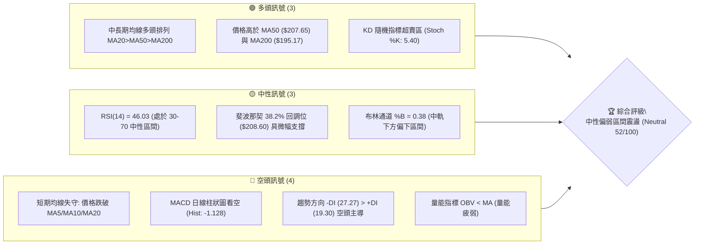
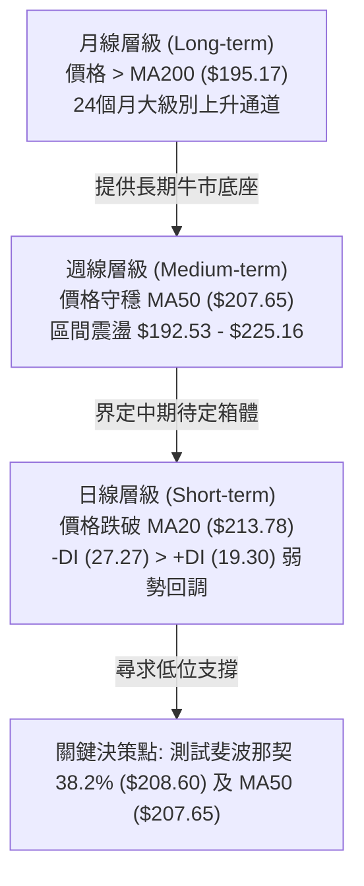
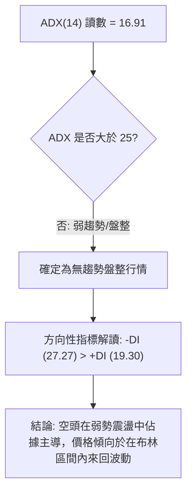
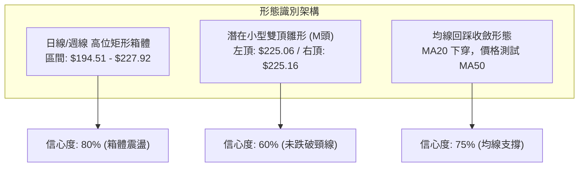
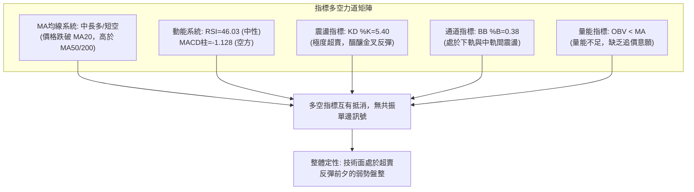
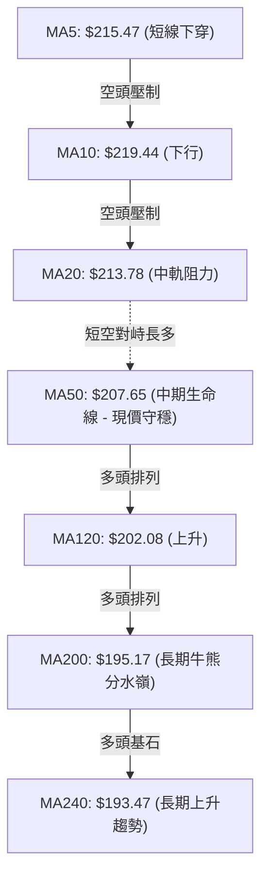
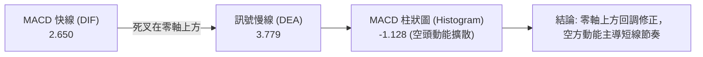
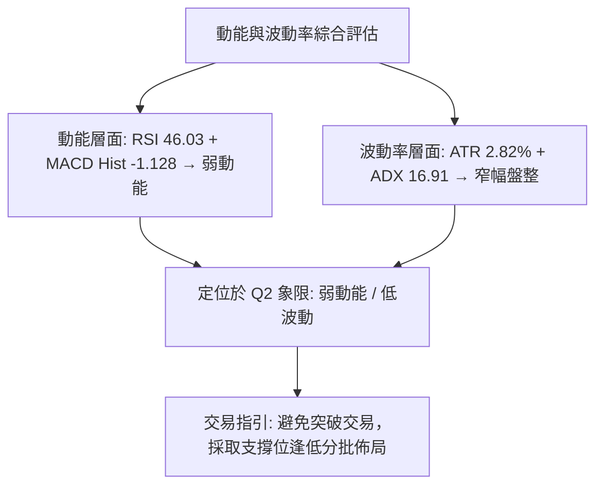
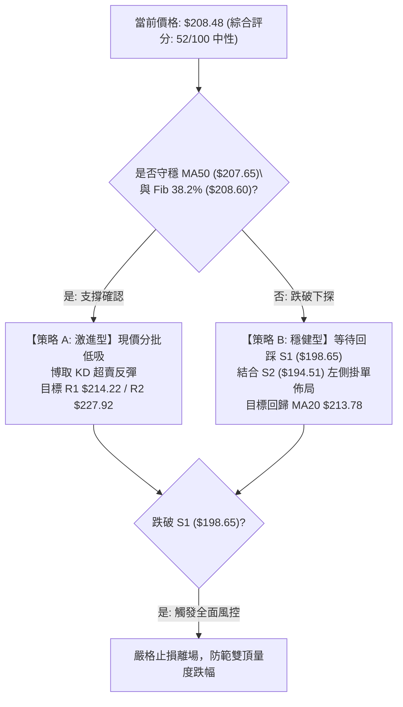
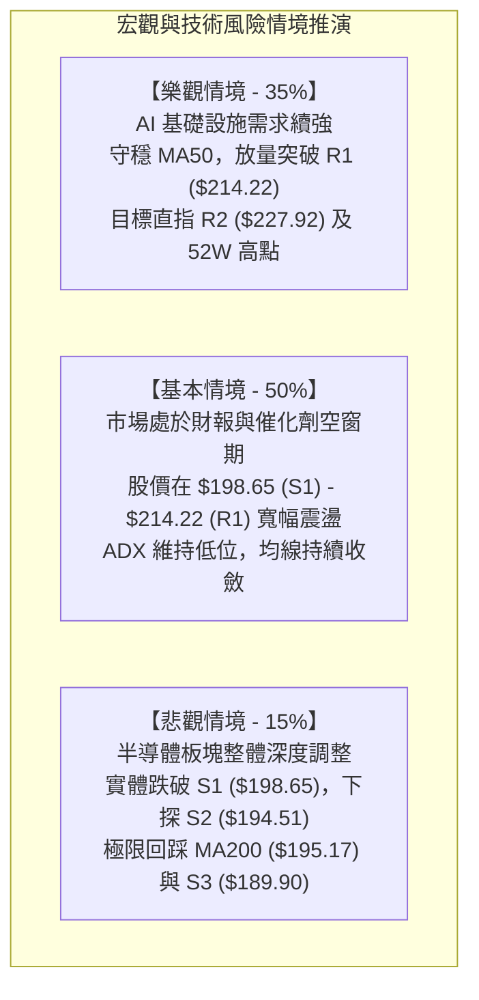

# NVDA 技術分析報告

> **報告日期**：2026-08-25 ｜ **語言**：繁體中文 ｜ **數據來源**：Yahoo Finance ｜ **當前價格**：$208.48

---

## 目錄

| 章節 | 內容 |
|------|------|
| [1. 技術面概覽](#1-技術面概覽) | 訊號儀表板、核心指標、評分卡 |
| [2. 趨勢分析](#2-趨勢分析) | 多時框趨勢、長中短期走勢、ADX解讀 |
| [3. 圖表形態分析](#3-圖表形態分析) | 形態識別、K線組合、目標價推算 |
| [4. 支撐與阻力](#4-支撐與阻力) | 關鍵價位分佈、斐波那契回調結構 |
| [5. 技術指標深度解讀](#5-技術指標深度解讀) | MA/RSI/MACD/布林/成交量全面剖析 |
| [6. 動能與波動率](#6-動能與波動率) | 動能四象限、ATR風控、Beta相關性 |
| [7. 多時框架總結](#7-多時框架總結) | 時框架評分矩陣與收斂結論 |
| [8. 交易策略建議](#8-交易策略建議) | 策略路由、價格階梯、主策略詳解 |
| [9. 風險提示與監控](#9-風險提示與監控) | 監控清單、極端情境與風控指引 |

---

## 1. 技術面概覽

### 🎯 技術訊號儀表板



### 📊 核心指標速覽表

| 指標類別 | 指標名稱 | 當前數值 | 訊號 | 解讀 |
|----------|----------|----------|:----:|------|
| **價格** | 當前價格 | $208.48 | 🟡 | 位於52週區間 61.6% 位置，處於斐波那契 38.2%（$208.60）邊緣 |
| **均線** | MA20 | $213.78 | 🔴 | 價格低於 MA20（-2.48%），短線動能轉弱，中軌承壓 |
| **均線** | MA50 | $207.65 | 🟢 | 價格守在 MA50 上方（+0.40%），中期多頭防線尚未跌破 |
| **均線** | MA200 | $195.17 | 🟢 | 價格遠高於牛熊分界線 MA200（+6.82%），長期多頭結構穩固 |
| **動能** | RSI(14) | 46.03 | 🟡 | 位於中性平衡區，無超買超賣，短線動能偏弱但未進入恐慌區 |
| **動能** | MACD | 2.650 / 3.779 | 🔴 | DIF 下穿 DEA，柱狀圖為 -1.128，短線呈現死叉修正訊號 |
| **動能** | Stoch %K / %D | 5.40 / 33.27 | 🟢 | %K 進入極度超賣區（<20），短線存在技術性反彈修復需求 |
| **趨勢** | ADX(14) | 16.91 | 🟡 | 數值小於 25，顯示當前缺乏單邊趨勢，處於典型的寬幅震盪整理市 |
| **通道** | BB %B | 0.38 | 🟡 | 位於中軌（$213.78）與下軌（$192.29）之間，偏向通道下半部 |
| **波動** | ATR(14) | $5.88 | 🟡 | 佔價格比例 2.82%，波動率適中，每日震盪區間約 $5.9 |

### 🏆 技術評分卡

```
╔══════════════════════════════════════════════════════════════════╗
║                 技術評分卡 — NVDA (2026-08-25)                   ║
╠══════════════════════════════════════════════════════════════════╣
║ 趨勢強度 (ADX/DI)   ███████░░░░░░░░░░░░░  35/100  🔴 空頭佔優盤整║
║ 動能指標 (RSI/MACD) █████████░░░░░░░░░░░  45/100  🟡 柱狀偏空超賣║
║ 支撐穩定度 (S1-S3)  ██████████████░░░░░░  70/100  🟢 MA50/S1守穩 ║
║ 成交量配合 (OBV/VOL)████████░░░░░░░░░░░░  40/100  🔴 量能跌破均線║
║ 形態完整度 (結構)   ████████████░░░░░░░░  60/100  🟡 區間箱體構築║
║ 均線排列 (多時框)   ██████████████░░░░░░  70/100  🟢 中長多頭排列║
╠══════════════════════════════════════════════════════════════════╣
║ 綜合評分            ██████████░░░░░░░░░░  52/100  🟡 中性區間震盪║
╚══════════════════════════════════════════════════════════════════╝
```

---

## 2. 趨勢分析

### 🌐 多時框趨勢分析



### 📈 長期趨勢 — 12個月走勢圖（Unicode）

```
NVDA 月線走勢圖（過去12個月：2025-09 至 2026-08）
價格軸 ($)
$215 ┤                                                 ● $210.89(26-05)
$210 ┤                                            ╭─╮  │
$205 ┤                 ● $202.23(25-10)           │ │  │       ● $208.48(現價)
$200 ┤                ╭╯╰╮                   ╭────╯ │  ● $200.09(26-06)
$195 ┤                │  │       ● $190.90   │      ╰─● $200.75(26-07)
$190 ┤   ● $186.34    │  │  ╭─●──╯(26-01)    │
$185 ┤  ╭╯(25-09)     │  ╰──╯ │              │
$180 ┤  │             │       ● $176.97(26-02)
$175 ┤  │             ● $176.77(25-11) ╰──● $174.20(26-03)
$170 ┤──┴─────────────────────────────────────────────────────────────
        09  10  11  12  01  02  03  04  05  06  07  08  (月份 2025-2026)
```

**走勢特徵分析表格**：

| 階段區間 | 起止月份 | 價格變動 | 區間漲跌幅 | 走勢特徵與結構意涵 |
|----------|----------|----------|:----------:|--------------------|
| **第 1 階段** | 2025-09 ~ 2025-10 | $186.34 → $202.23 | +8.53% | 多頭突破兩百大關，創波段高點後爆發獲利回吐 |
| **第 2 階段** | 2025-11 ~ 2026-03 | $176.77 → $174.20 | -1.45% | 半年寬幅築底，於 $174-$190 建立堅實的中期籌碼換手區 |
| **第 3 階段** | 2026-04 ~ 2026-05 | $199.34 → $210.89 | +5.79% | 帶量突破平台，向上拓展至五十二週高點 $236.26 區域 |
| **第 4 階段** | 2026-06 ~ 2026-08 | $200.09 → $208.48 | +4.19% | 於高位進行多空博弈，圍繞 $200-$225 區間構築高位箱體 |

### 📊 中期趨勢（週線分析）

```
中期週線關鍵多空分水嶺示意圖
┌─────────────────────────────────────────────────────────┐
│ [強阻力 R2/R3]   $227.92 - $232.01 (波段高點反壓區)      │
│         ▲                                               │
│         │ 短線反彈受阻回落 ($225.16 → $208.48)          │
│         ▼                                               │
│ [通道中軌/MA20]  $213.78 (短線空方防線)                  │
│ ─────────────────────────────────────────────────────── │
│ [當前價格]       $208.48 ◄── 斐波那契 38.2% ($208.60)    │
│ ─────────────────────────────────────────────────────── │
│ [中期生命線/MA50]$207.65 (多方重要防守線)                │
│         ▲                                               │
│         │ 多方最後防禦帶 ($198.65 - $194.51)            │
│         ▼                                               │
│ [強支撐 S1/S2]   $198.65 / $194.51 (MA200 $195.17 重疊) │
└─────────────────────────────────────────────────────────┘
```

從近 20 週收盤走勢觀察，NVDA 在 2026 年 8 月中旬衝高至 $225.16 後，近兩週連續回調（$225.16 → $214.72 → $208.48），週線 MACD 柱狀圖由正轉負（+2.049 → -0.405 → -1.128），確認中期走勢進入修正循環。

### ⚡ 趨勢強度評估（ADX 解讀）



**ADX 趨勢強度對照表**：

| 指標名稱 | 當前數值 | 狀態門檻 | 趨勢判定 | 操作指引 |
|----------|:--------:|:--------:|:--------:|----------|
| **ADX(14)** | **16.91** | < 20 (極弱/無趨勢) | 典型箱體盤整 | 避免使用追突破策略，以區間低吸高拋或網格操作為主 |
| **+DI (14)** | **19.30** | — | 多方動能偏弱 | 多頭暫無發力推升單邊趨勢的能力 |
| **-DI (14)** | **27.27** | — | 空方控制短線節奏 | 短線回調壓力猶存，但缺乏單邊暴跌的動能配合 |

---

## 3. 圖表形態分析

### 🔍 形態識別系統



**圖表形態信心度與目標價評估表**：

| 形態名稱 | 信心度 | 判斷依據（引用數據） | 完成度 | 目標價（附嚴格計算式） |
|----------|:------:|----------------------|:------:|------------------------|
| **高位矩形箱體震盪** | **80%** | 上軌阻力 R2（$227.92）與下軌支撐 S2（$194.51）多次測試未破；ADX=16.91 證實為盤整 | 85% | 箱體下軌目標 = **$194.51**；若向上突破則測試 R3 **$232.01** |
| **雙頂修正雛形 (M-Top)** | **60%** | 2026-05-17 週高收盤 $225.06 與 2026-08-16 週高收盤 $225.16 形成雙重頂部反壓 | 45% (頸線未破) | 頸線為 S1 $198.65；形態高度 = $225.16 - $198.65 = $26.51。破位目標 = $198.65 - $26.51 = **$172.14**（僅在跌破 S1 確認後生效） |
| **指標超賣修正反彈** | **75%** | Stoch %K=5.40 進入極度超賣區，價格觸及 MA50（$207.65）與斐波那契 38.2%（$208.60） | 70% | 反彈第一阻力目標 = R1 **$214.22**（MA20 與 BB中軌共振處） |

### 🕯️ 重要K線形態分析

| 週/月份 | 收盤價 | 走勢特徵與 K 線形態 | 技術面解讀 | 訊號強度 |
|----------|:------:|----------------------|------------|:--------:|
| **2026-05-17** | $225.06 | 長上影衝高受阻陽線 | 測試 $225 上方遭遇強大解套與獲利盤拋壓 | 🟡 滯漲警訊 |
| **2026-06-28** | $192.53 | 下影線長陰探底針 | 觸及 S3（$189.90）與布林下軌迅速獲得承接 | 🟢 底部確認 |
| **2026-08-16** | $225.16 | 高位十字星/流星形態 | 第二次挑戰 $225 失敗，成交量萎縮至 5.00 億股（量價背離） | 🔴 頂部受阻 |
| **2026-08-23** | $214.72 | 中實體陰線貫穿短均 | 實體跌破 MA20（$213.78），短線多轉空 | 🔴 空方控盤 |
| **2026-08-30** | $208.48 | 縮量小陰線回踩 MA50 | 於斐波那契 38.2%（$208.60）處收斂，尋求支撐 | 🟡 短線止跌觀察 |

### 📉 ASCII 走勢形態示意圖

```
NVDA 日線級別雙頂與箱體震盪結構圖
$228.00 ┤            頂部1: $225.06            頂部2: $225.16 (阻力 R2 $227.92)
$224.00 ┤               ╭───╮                     ╭───╮
$220.00 ┤              ╭╯   ╰╮                   ╭╯   ╰╮
$216.00 ┤             ╭╯     ╰╮                 ╭╯     ╰╮  ◄ MA20 / R1: $214.22
$212.00 ┤            ╭╯       ╰╮               ╭╯       ╰╮
$208.00 ┤───────────╭╯─────────╰╮─────────────╭╯─────────╰● 現價: $208.48 (MA50 $207.65)
$204.00 ┤          ╭╯           ╰╮           ╭╯
$200.00 ┤         ╭╯             ╰───────────╯ ◄── 頸線 / 初級支撐 S1: $198.65
$196.00 ┤        ╭╯
$192.00 ┤       ╭╯ ◄── 箱體底部 / 強支撐 S2: $194.51 (MA200 $195.17)
$188.00 ┤───────╯───────────────────────────────────────────────────────────
```

### 🎯 形態目標價計算

```
形態計算模型解析：
1. 區間震盪反彈目標（主情境）：
   - 當前支撐基準：MA50 ($207.65) 與 斐波那契 38.2% ($208.60)
   - 反彈目標 T1 = R1 ($214.22) — 漲幅空間約 +2.75%
   - 反彈目標 T2 = R2 ($227.92) — 漲幅空間約 +9.32%

2. 雙頂破位下跌目標（風險情境 — 僅在跌破頸線 S1 後觸發）：
   - 形態頭部高點 H = $225.16
   - 形態頸線低點 N = $198.65 (S1)
   - 垂直高度 Δ = H - N = $225.16 - $198.65 = $26.51
   - 破位量度跌幅目標 = N - Δ = $198.65 - $26.51 = $172.14（接近 52W 低點 $163.85 上方之 78.6% 回調位 $179.35）
```

---

## 4. 支撐與阻力

### 🗺️ 關鍵價位分布圖（Unicode）

```
NVDA 價位結構分佈圖
═══════════════════════════════════════════════════════════════════
$236.26 ║░░░░░░░░░░░░░░░░░░░░░░░░░░░░░░░░░░░░║ 52W 最高點 (0.0% Fib)
$232.01 ║████████████████████████████████████║ 強阻力 R3 (+11.29%)
$227.92 ║████████████████████████            ║ 波段高點阻力 R2 (+9.32%)
$214.22 ║████████████████                    ║ 關鍵短阻力 R1 / MA20 (+2.75%)
$208.60 ║▓▓▓▓▓▓▓▓▓▓▓▓▓▓▓▓▓▓▓▓▓▓▓▓▓▓▓▓▓▓▓▓    ║ 38.2% 斐波那契回調位
$208.48 ╠════════════════════════════════════╣ ◄─── 當前現價 ($208.48)
$207.65 ║▓▓▓▓▓▓▓▓▓▓▓▓▓▓▓▓▓▓▓▓▓▓▓▓            ║ MA50 中期生命線 (-0.40%)
$198.65 ║██████████████████████              ║ 近期波段支撐 S1 (-4.71%)
$194.51 ║████████████████████████████        ║ 強支撐 S2 / MA200 重疊 (-6.70%)
$189.90 ║████████████████████████████████████║ 極限強支撐 S3 (-8.91%)
═══════════════════════════════════════════════════════════════════
```

### 🚧 阻力位分析表

| 阻力級別 | 價位 | 距離現價 | 形成原因與技術共振 | 突破難度 | 重要性 |
|:--------:|:----:|:--------:|--------------------|:--------:|:------:|
| **R1** | **$214.22** | +2.75% | 近期日線反彈高點聚類，與布林中軌 MA20（$213.78）高度重疊 | 🟡 中等 | ★★★☆☆ |
| **R2** | **$227.92** | +9.32% | 2026 年 5 月與 8 月兩次衝頂未果的波段高點密集拋壓帶 | 🔴 困難 | ★★★★☆ |
| **R3** | **$232.01** | +11.29% | 逼近 52 週歷史高點 $236.26 前的最後籌碼解套阻力峰 | 🔴 極難 | ★★★★★ |

### 🛡️ 支撐位分析表

| 支撐級別 | 價位 | 距離現價 | 形成原因與技術共振 | 守住機率 | 重要性 |
|:--------:|:----:|:--------:|--------------------|:--------:|:------:|
| **S1** | **$198.65** | -4.71% | 近一年波段低點聚類，與斐波那契 50.0%（$200.06）形成整數關卡共振 | 🟢 75% | ★★★★☆ |
| **S2** | **$194.51** | -6.70% | 2026 年 7 月低點聚類，與長期牛熊線 MA200（$195.17）及布林下軌（$192.29）共振 | 🟢 85% | ★★★★★ |
| **S3** | **$189.90** | -8.91% | 近一年深次回調極限低點聚類，與斐波那契 61.8%（$191.51）黃金分割重疊 | 🟢 95% | ★★★★★ |

### 📐 斐波那契回調位分析

依據 52 週波段低點 **$163.85** 至波段高點 **$236.26**（波動總區間為 $72.41），標準回調位計算如下：

```
斐波那契回調梯形圖
0.0%  (52W High) ─── $236.26 ────────────────────────────── (歷史高點阻力)
23.6% ────────────── $219.18 ────────────────────────────── (多頭回調第一道防線)
38.2% ────────────── $208.60 ◄── 現價 $208.48 緊貼此處 ── (關鍵強弱分水嶺)
50.0% ────────────── $200.06 ────────────────────────────── (多空中樞與心理關口)
61.8% ────────────── $191.51 ────────────────────────────── (黃金分割防禦位，鄰近 S3 $189.90)
78.6% ────────────── $179.35 ────────────────────────────── (深度洗盤支撐位)
100.0%(52W Low)  ─── $163.85 ────────────────────────────── (年度基底支撐)
```

- **當前位置解讀**：現價 **$208.48** 正精確處於 **38.2% 回調位（$208.60）** 邊緣。在道氏與斐波那契理論中，強勢多頭市場的健康回調通常在 38.2% 處獲得支撐止跌；若實體跌破該位置，價格將順勢滑向 **50.0% 回調位（$200.06）** 及 S1（$198.65）尋求二級防禦。

---

## 5. 技術指標深度解讀

### 🎛️ 指標訊號總覽



### 📈 移動平均線排列分析



**移動平均線狀態詳解**：
1. **短週期死叉壓制**：MA5（$215.47）、MA10（$219.44）、MA20（$213.78）呈現空頭向下發散排列，現價（$208.48）位於其下方，構成短線上行重重阻力。
2. **中長週期多頭排列**：MA50（$207.65）> MA120（$202.08）> MA200（$195.17）> MA240（$193.47），且中長天期均線斜率均保持向上，顯示長線多頭架構完好，目前僅屬中級回調。

### 📉 RSI(14) 分析

- **數值狀態**：**46.03**
```
RSI(14) 狀態指示條:
0 ─────── 30 ──────────────── 46.03 ─────────────── 70 ─────── 100
[ 極度超賣 ]    [ 弱勢整理區間 (46.03) ]    [ 強勢多頭區間 ]    [ 極度超買 ]
██████████████████████░░░░░░░░░░░░░░░░░░░░░░░░░ (46.03%)
```
- **背離分析**：
  - **頂背離判定**：2026 年 8 月價格挑戰 $225.16 時，RSI 達到 75.4，低於 2026 年 4 月價格 $201.45 時的 RSI 92.8，存在中長週期「動能減速型弱頂背離」，促成了隨後的回調。
  - **底背離判定**：當前日線與週線級別 RSI 在 46 附近持平，並未出現價格創新低而 RSI 抬高的底背離現象。結論為**無底背離**。

### 📊 MACD(12/26/9) 訊號解讀


- **柱狀圖動態**：近三週週線 MACD 柱狀圖數值分別為 `+2.049` → `-0.405` → `-1.128`，負柱狀體持續拉長，說明空方修正動能尚未完全衰竭，短期內仍需時間進行指標低位修復。

### 📦 布林通道分析

```
NVDA 布林通道 (Bollinger Bands 20, 2) 結構圖
$235.26 ┤ ════════════════════════════════════════════════ 上軌 (+2σ)
        │
$224.52 ┤
        │
$213.78 ┤ ──────────────────────────────────────────────── 中軌 (MA20)
        │                   ● 現價 $208.48 (%B = 0.38)
$203.04 ┤
        │
$192.29 ┤ ════════════════════════════════════════════════ 下軌 (-2σ)
```
- **通道位置解讀**：布林帶寬為 $42.97（$192.29 至 $235.26），當前 **%B = 0.38**，表明價格處於中軌至下軌之間。若跌破 MA50（$207.65），價格將尋求布林下軌 $192.29 附近的強力支撐（與 S2 $194.51 形成重疊保護）。

### 💹 成交量分析（量價配合度）

```
量價數據對比：
- 最新日成交量: 134,405,887 股
- 20日均量:     115,583,889 股  (量比: 1.16x ── 溫和放量)
- 50日均量:     128,845,848 股
- OBV (能量潮):  OBV < MA  (量能疲弱)
```
- **量價背離診斷**：
  1. 近兩週價格從 $225.16 回跌至 $208.48 過程中，週成交量由 5.00 億股縮減至 1.34 億股（部分反映交易日未走完，但整體呈量縮下行）。
  2. 價格回調但無恐慌性拋盤放量，屬於**量縮回檔**的正常洗盤結構；然而由於 **OBV 跌破其移動平均線**，資金觀望氣氛濃厚，多頭主力尚未展現積極的左側回補動作。

---

## 6. 動能與波動率

### ⚡ 動能評估四象限

| 象限分區 | 動能強度 (Momentum) | 波動率水準 (Volatility) | NVDA 當前狀態 | 技術環境定性與應對 |
|:--------:|:-------------------:|:------------------------:|:-------------:|--------------------|
| **Q1** | 強 (High) | 低 (Low) | — | 穩定單邊上行，持股續抱 |
| **Q2** | **弱 (Low)** | **低 (Low)** | **✓ (當前所處區間)** | **低波動整理市，ADX=16.91，動能衰減，宜區間震盪操作** |
| **Q3** | 強 (High) | 高 (High) | — | 高波動突破行情，適合趨勢追蹤 |
| **Q4** | 弱 (Low) | 高 (High) | — | 恐慌拋售階段，風險極高需離場 |



### 📊 ATR 波動率分析

- **ATR(14) 數值**：**$5.88**（佔當前股價之 **2.82%**）
- **風控與止損設定依據**：
  - **日內震盪期望值**：常態交易日股價波動區間約為 $\pm \$5.88$。
  - **短線交易止損緩衝 (1.5x ATR)**：$1.5 \times \$5.88 = \$8.82$。若以現價進場，短線動態止損應設於現價下方至少 $8.82。
  - **波段交易止損緩衝 (2.0x ATR)**：$2.0 \times \$5.88 = \$11.76$。若跌破現價超過 $11.76（即跌破 $196.72），將擊穿 S1（$198.65）並逼近 S2（$194.51），波段多頭必須嚴格停損。

### 📐 Beta 與市場相關性

- **Beta 係數**：**2.215**
- **市場敏感度解讀**：
  - NVDA 的波動度為標普 500 指數的 **2.215 倍**，屬於典型的高彈性、高 Beta 成長科技股。
  - 在大盤指數（SPX/QQQ）回調 1% 時，NVDA 平均下挫約 2.2%；反之，大盤反彈時其上攻彈性亦顯著高於平均。當前高 Beta 配合低 ADX，表明個股正在消化大盤宏觀波動，等待科技股整體催化劑。

---

## 7. 多時框架總結

### 📋 時框架評分表

| 時框架 | 趨勢方向 | 動能狀態 | 均線排列 | 圖表形態 | 綜合評分 | 交易建議 |
|--------|:--------:|:--------:|:--------:|:--------:|:--------:|----------|
| **月線 (Long)** | 🟢 多頭 | 🟡 中性減速 | 🟢 多頭排列 (MA200向上) | 寬幅上升通道 | **78/100** | 長線多頭持股，逢低定投加碼 |
| **週線 (Medium)** | 🟡 震盪整理 | 🔴 柱狀轉負 | 🟢 MA50向上支撐 | 高位矩形箱體 ($194-$228) | **58/100** | 箱體操作，靠近箱底吸納，箱頂減碼 |
| **日線 (Short)** | 🔴 短線偏空 | 🟢 KD極度超賣 | 🔴 短均線下穿壓制 | 測試斐波那契 38.2% | **45/100** | 觀望或小倉位博取超賣技術反彈 |

### 🔲 綜合訊號矩陣

```
時框訊號收斂矩陣：
┌──────────────┬──────────────┬──────────────┬──────────────┐
│  指標維度    │ 日線 (短期)  │ 週線 (中期)  │ 月線 (長期)  │
├──────────────┼──────────────┼──────────────┼──────────────┤
│ 均線系統     │ 🔴 跌破MA20  │ 🟢 守在MA50  │ 🟢 遠超MA200 │
│ 動能 (RSI)   │ 🟡 46.03     │ 🟡 46.00     │ 🟢 60.00+    │
│ 趨勢 (MACD)  │ 🔴 死叉修訂  │ 🔴 綠柱擴大  │ 🟢 零軸上方  │
│ 震盪 (KD)    │ 🟢 超賣 (5.4)│ 🟡 40.00     │ 🟢 70.00     │
│ 形態共振     │ 🟡 尋求支撐  │ 🟡 箱體震盪  │ 🟢 多頭通道  │
└──────────────┴──────────────┴──────────────┴──────────────┘
```

### ⚖️ 多時框收斂結論

> **依據「多時框收斂規則」進行判定**：
> 1. **趨勢/盤整識別**：當前 ADX(14) = **16.91 (< 25)**，技術結構嚴格定義為**「盤整行情」**。
> 2. **主導規則**：在盤整行情中，依規則應以**日線與週線之布林通道及關鍵箱體上下軌**為核心交易依據，不可盲目追逐單邊突破。
> 3. **衝突收斂**：日線短空訊號（跌破 MA20、MACD 負柱）與月線長多訊號衝突。因 ADX<25 且日線 KD 已進入極度超賣區（%K=5.40），短線空頭下行動能正在衰竭，中長期 MA50（$207.65）與 S1（$198.65）提供強力下檔防護。
>
> 🎯 **最終唯一方向性結論**：**【中性觀望 / 區間下沿低吸】**。主策略鎖定在 $198.65 - $214.22 進行區間波段應對。

---

## 8. 交易策略建議

### 🗺️ 策略決策流程圖



### 🧭 策略路由

- **當前主策略方向 = 【中性區間波段操作（偏向逢低吸納）】（依評分 52/100 判定）**
- 評分處於 40–60 中性區間，且 ADX < 25，市場處於箱體震盪狀態。交易核心為「不追高、不殺跌、在支撐位佈局、在阻力位減碼」。

### 🎯 價格情境階梯（Price Scenarios）

| 觸發條件 | 第一目標 | 第二目標 | 後續延伸 | 情境含義與技術解讀 |
|----------|:--------:|:--------:|:--------:|--------------------|
| **向上突破 R1 $214.22** | R2 **$227.92** | R3 **$232.01** | 52W高 **$236.26** | 站穩布林中軌 MA20，短線回調結束，重啟箱體上軌攻勢 |
| **守穩當前區間 $207.65 - $208.60** | R1 **$214.22** | — | — | KD 超賣引發技術修復，在 MA50 與 MA20 之間窄幅震盪 |
| **有效跌破 S1 $198.65** | S2 **$194.51** | S3 **$189.90** | Fib 78.6% **$179.35** | 跌破整數關口與雙頂頸線，中期結構轉弱，考驗 MA200 支撐 |

### 📊 情境機率分佈

| 交易情境 | 發生機率 | 主要技術依據 |
|----------|:--------:|--------------|
| **情境一：守穩 MA50 並向 R1/R2 反彈** | **55%** | Stoch %K=5.40 極度超賣；現價緊貼 MA50（$207.65）與 Fib 38.2%（$208.60）；長多排列未破 |
| **情境二：在 $198.65 - $214.22 區間震盪** | **30%** | ADX=16.91 缺乏單邊趨勢；布林帶寬度充裕，均線系統呈纏繞收斂狀態 |
| **情境三：跌破 S1 $198.65 深度回調** | **15%** | MACD 柱狀圖（-1.128）擴大；-DI（27.27）佔優；若大盤劇烈回調可能跌破頸線 |

### 🟢 主策略詳情

依據評分卡 52/100 之路由規則，提供「超賣反彈短線策略」與「箱底埋伏波段策略」兩套執行方案：

| 策略要素 | 策略 A（激進型：現價超賣反彈） | 策略 B（穩健型：箱底支撐低吸） |
|----------|--------------------------------|--------------------------------|
| **策略邏輯** | 押注 MA50 守穩與 KD 極度超賣之技術修復 | 等待回踩 S1-S2 密集支撐區進行左側安全買入 |
| **進場條件** | 現價 $208.48 附近企穩，日線出現止跌K棒 | 價格回調至 S1（$198.65）至 S2（$194.51）區間 |
| **進場價格** | **$208.48** | **$198.65** |
| **目標價 T1** | **$214.22** (R1 / 預期回報 +2.75%) | **$213.78** (MA20 / 預期回報 +7.62%) |
| **目標價 T2** | **$227.92** (R2 / 預期回報 +9.32%) | **$227.92** (R2 / 預期回報 +14.73%) |
| **止損價格** | **$204.50** (跌破 MA50 下方 1.5% 處) | **$191.00** (跌破 S2 $194.51 及 Fib 61.8%) |
| **風險報酬比** | **1 : 4.88** (以 T2 計，風險 $3.98 / 報酬 $19.44) | **1 : 3.82** (以 T2 計，風險 $7.65 / 報酬 $29.27) |
| **勝率估計** | **58%** | **68%** |
| **建議倉位** | **10% - 15% (輕倉試單)** | **20% - 25% (標準波段倉位)** |

### 🔴 反向風險觸發點（對沖與風控提示）

1. **多頭失效觸發價位**：收盤價**實體跌破 S1（$198.65）**。若日線收盤低於該價位，表明雙頂形態成立，應立即將多頭部位平倉或建立空頭對沖部位。
2. **空頭反轉止損價位**：收盤價**帶量突破 R1（$214.22）** 且站穩 MA20。若日線突破該阻力，空方應全面平倉離場，短線動能將重回多方主導。

### ⭐ 整體訊號強度評星

```
╔══════════════════════════════════════════════════════════════════╗
║ 做多訊號強度：  ★★★☆☆  (3.0/5星 — 依托 MA50 支撐與超賣博反彈)  ║
║ 做空訊號強度：  ★★☆☆☆  (2.0/5星 — ADX弱且接近強支撐，空頭盈虧比差)║
║ 整體可信度：    ★★★★☆  (4.0/5星 — 多時框指標收斂性高)          ║
╚══════════════════════════════════════════════════════════════════╝
```

---

## 9. 風險提示與監控

### ✅ 關鍵監控指標 Checklist

```
╔══════════════════════════════════════════════════════════════════╗
║                     每日盤後技術監控清單                         ║
╠══════════════════════════════════════════════════════════════════╣
║ [ ] 價格是否跌破 MA50 ($207.65) 與 Fib 38.2% ($208.60)           ║
║ [ ] MACD 柱狀圖是否由負轉正 (-1.128 是否收窄縮頭)                ║
║ [ ] Stoch KD 是否在超賣區形成 %K 上穿 %D 黃金交叉               ║
║ [ ] 日成交量是否放大至 20 日均量 (1.15 億股) 以上確認反彈         ║
║ [ ] ADX(14) 讀數是否突破 25 (預示單邊趨勢來臨，需切換策略)       ║
║ [ ] 是否跌破 S1 頸線位 ($198.65) 觸發雙頂風控閥值                ║
╚══════════════════════════════════════════════════════════════════╝
```

### ⚠️ 風險場景分析



### 🛡️ 風險管理重要提醒

1. **波動率管理（Beta 2.215 & ATR $5.88）**：
   - 鑑於 NVDA 具備高 Beta 屬性，單日震盪常達 $6-$10。投資人應根據 ATR 水準設定**至少 $8.80 以上的動態止損緩衝**，切忌設定過窄的止損（如 $2-$3），以免在正常市場噪音中被震盪洗出場。
2. **倉位配置紀律**：
   - 在 ADX < 25 的震盪市場中，總持倉部位不宜超過總資金的 **30% - 40%**。
   - 嚴格遵守「分批進場」原則：於現價（$208.48）建倉第一筆（佔總部位 30%），若回踩 S1（$198.65）未破再加碼第二筆（佔總部位 70%），跌破止損點則全數離場。
3. **重大基本面事件防範**：
   - 需隨時留意半導體行業政策、地緣政治供應鏈動態及大客戶資本支出指引。技術指標在重大基本面利空衝擊下可能短暫失效，務必以硬性停損價（$198.65 / $191.00）為最高風控準則。

---

## 📋 報告總結

```
╔══════════════════════════════════════════════════════════════════╗
║                     NVDA 技術分析報告總結                        ║
╠══════════════════════════════════════════════════════════════════╣
║ 報告日期：2026-08-25                                             ║
║ 當前價格：$208.48                                                ║
║ 技術評級：⚖️ 中性觀望 / 逢低區間佈局 (評分: 52/100)               ║
╠══════════════════════════════════════════════════════════════════╣
║ 關鍵結論：                                                       ║
║ ├─ 長期趨勢：🟢 強烈多頭 (價格遠在 MA200 $195.17 之上，通道向上) ║
║ ├─ 中期趨勢：🟡 區間震盪 (受困於 $194.51 - $227.92 箱體結構)     ║
║ ├─ 短期趨勢：🔴 偏弱修正 (跌破 MA20，但 KD=5.4 進入極度超賣區)   ║
║ ├─ 關鍵支撐：S1 $198.65 / S2 $194.51 (MA200 重疊防線)            ║
║ ├─ 關鍵阻力：R1 $214.22 / R2 $227.92                             ║
║ └─ 分析師共識目標：$304.73 (59 位分析師強力買進評級)             ║
╠══════════════════════════════════════════════════════════════════╣
║ 最優策略組合：                                                   ║
║ 1. 🥇 最佳機會（穩健）：於 S1 $198.65 附近左側掛單佈局，博弈箱體 ║
║    反彈，目標看至 R1 $214.22 與 R2 $227.92，止損設於 $191.00。   ║
║ 2. 🥈 次選機會（激進）：現價 $208.48 輕倉試單博弈 KD 超賣反彈， ║
║    止損設於 $204.50，第一目標看 R1 $214.22。                     ║
║ 3. 🥉 保守選擇：空倉觀望，等待日線放量突破 R1 $214.22 或回踩     ║
║    MA200 ($195.17) 出現明確右側反轉 K 線後再行介入。            ║
╚══════════════════════════════════════════════════════════════════╝
```

---

> ⚠️ **免責聲明**：本報告為 AI 自動生成之技術分析研究，報告內所有數據、圖表、支撐阻力位與交易策略均基於歷史價格行為量化計算得出。本報告**僅供學術研究與投資參考**，**不構成任何形式的要約、招攬或個人化投資建議**。金融市場具有高度風險，標的價格可升可跌，投資人應獨立評估風險並自負盈虧。

---

*報告生成時間：2026-08-25 ｜ 數據來源：Yahoo Finance ｜ 分析框架：多時框圖表形態與量化技術分析*