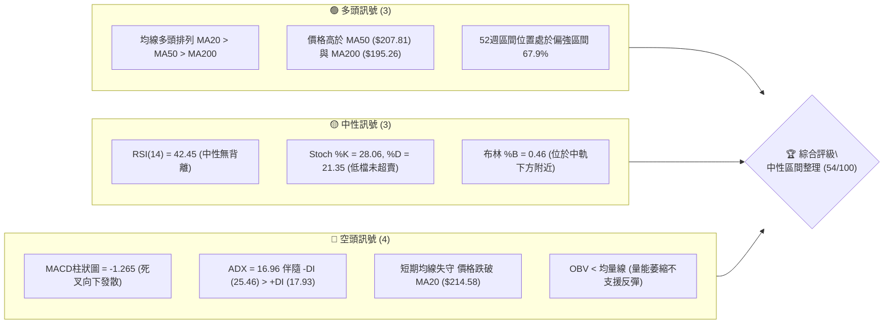
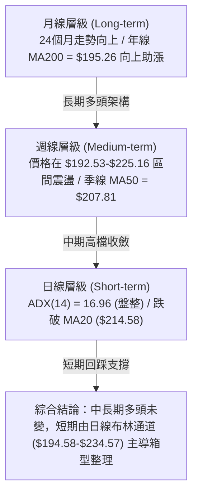
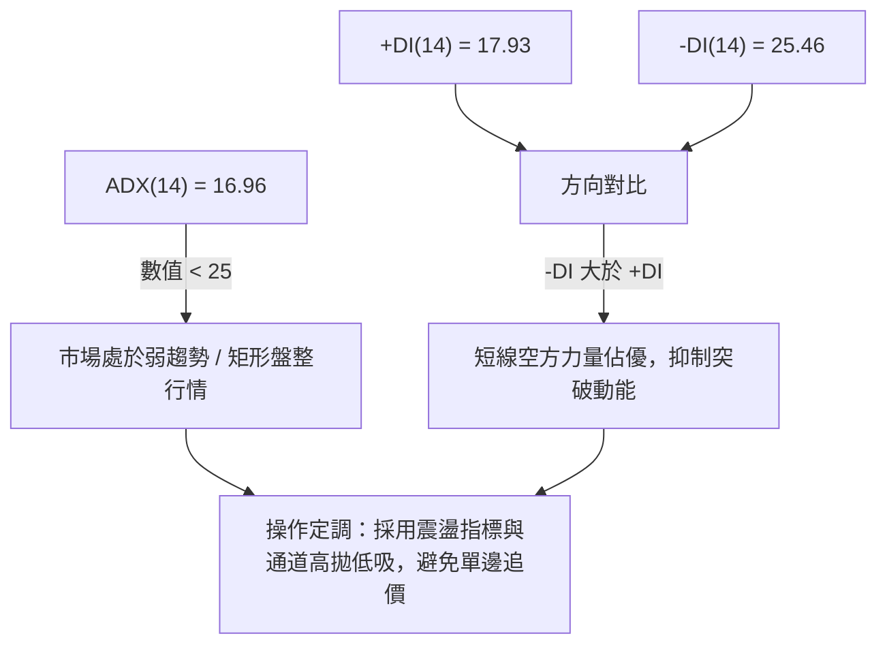
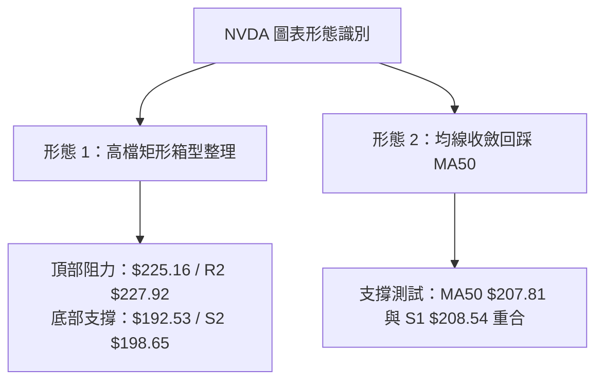
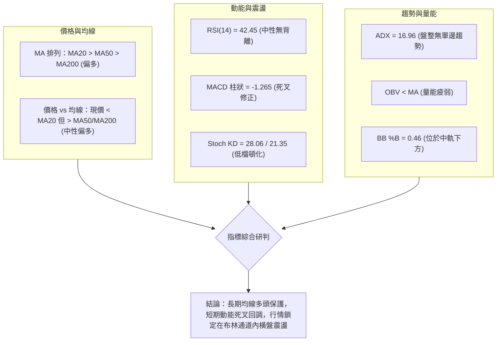
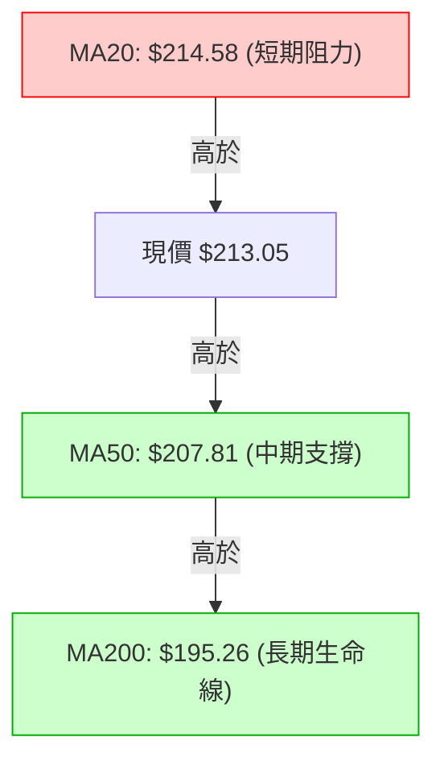
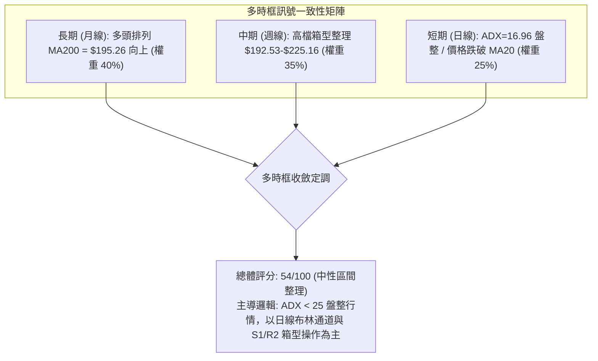
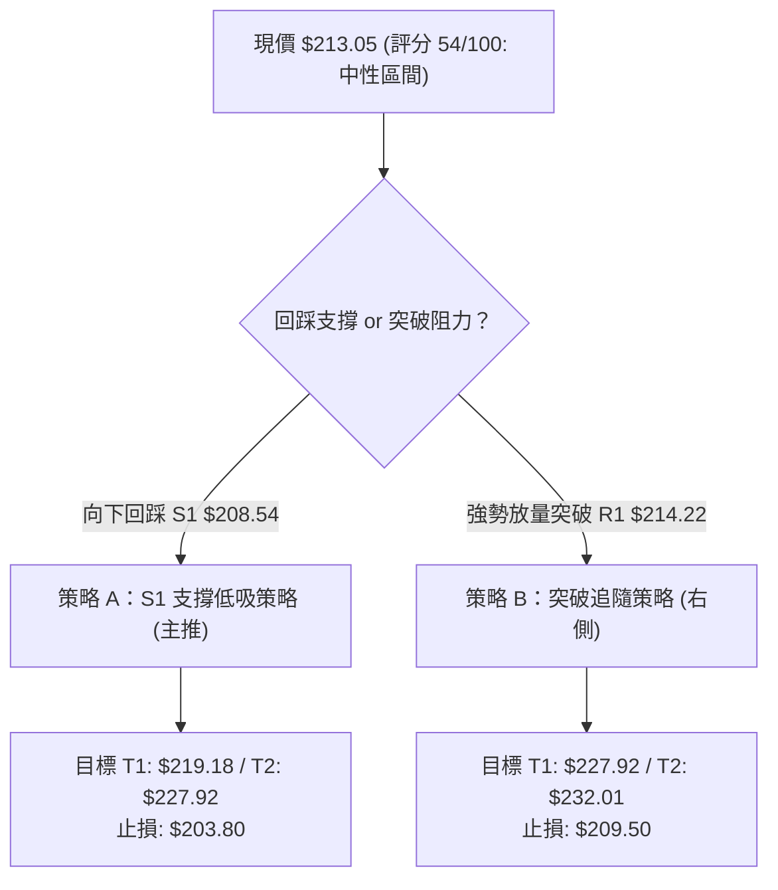
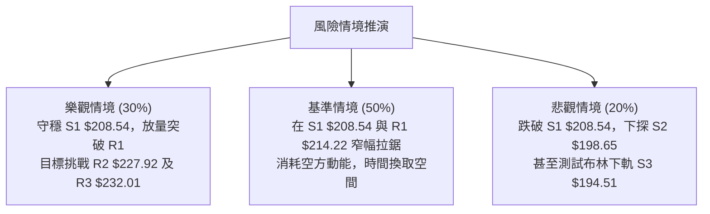

# NVDA 技術分析報告

> **報告日期**：2026-08-26 ｜ **語言**：繁體中文 ｜ **數據來源**：Yahoo Finance ｜ **當前價格**：$213.05

---

## 目錄

| 章節 | 內容 |
|------|------|
| [1. 技術面概覽](#1-技術面概覽) | 訊號儀表板、核心指標、評分卡 |
| [2. 趨勢分析](#2-趨勢分析) | 多時框趨勢、長中短期走勢、ADX解讀 |
| [3. 圖表形態分析](#3-圖表形態分析) | 形態識別、信心度、K線組合、目標價推算 |
| [4. 支撐與阻力](#4-支撐與阻力) | 關鍵價位聚類、斐波那契回調結構 |
| [5. 技術指標深度解讀](#5-技術指標深度解讀) | MA/RSI/MACD/布林/量價配合度 |
| [6. 動能與波動率](#6-動能與波動率) | 動能四象限、ATR止損模型、Beta敏感度 |
| [7. 多時框架總結](#7-多時框架總結) | 時框架矩陣、多時框收斂定調 |
| [8. 交易策略建議](#8-交易策略建議) | 策略路由、情境階梯、主策略明細 |
| [9. 風險提示與監控](#9-風險提示與監控) | 監控Checklist、情境圖、風控原則 |

---

## 1. 技術面概覽

### 🎯 技術訊號儀表板



### 📊 核心指標速覽表

| 指標類別 | 指標名稱 | 當前數值 | 訊號 | 解讀 |
|:---|:---|:---|:---:|:---|
| **價格** | 現行收盤價 | $213.05 | 🟡 | 位於52週區間（$163.85–$236.26）之 67.9% 分位 |
| **短期均線** | MA20 (月線) | $214.58 | 🔴 | 價格低於MA20（-0.71%），短線轉為承壓整理 |
| **中期均線** | MA50 (季線) | $207.81 | 🟢 | 價格高於MA50（+2.52%），中期上升波段結構未破 |
| **長期均線** | MA200 (年線)| $195.26 | 🟢 | 價格高於MA200（+9.11%），長期牛市基底穩固 |
| **動能震盪** | RSI(14) | 42.45 | 🟡 | 處於40–50中性偏弱區間，未出現頂底背離 |
| **趨勢指標** | MACD (12,26,9)| 2.197 / 3.462 | 🔴 | DIF跌破DEA，柱狀圖 -1.265，空方動能釋放中 |
| **趨勢強度** | ADX(14) | 16.96 | 🟡 | ADX < 25 處於無趨勢盤整期，-DI (25.46) 佔優 |
| **通道指標** | Bollinger %B | 0.46 | 🟡 | 位於布林中軌 $214.58 與下軌 $194.58 之間 |
| **量能指標** | OBV 趨勢 | OBV < MA | 🔴 | 量能指標落後於均量線，多頭追價意願不足 |
| **波動度** | ATR(14) | $5.60 | 🟡 | 佔股價 2.63%，日均波幅適中，利於區間設定 |

### 🏆 技術評分卡

```
╔══════════════════════════════════════════════════════════════╗
║              技術評分卡 — NVDA (2026-08-26)                  ║
╠══════════════════════════════════════════════════════════════╣
║ 趨勢強度 (ADX/方向)   █████░░░░░░░░░░░░░░░  35/100  🔴 盤整偏弱  ║
║ 動能指標 (RSI/MACD)   ██████░░░░░░░░░░░░░░  40/100  🔴 死叉修正  ║
║ 支撐穩定度 (S1/MA50)  ██████████████░░░░░░  70/100  🟢 買盤厚實  ║
║ 成交量配合 (OBV/量比) ████████░░░░░░░░░░░░  40/100  🔴 量能萎縮  ║
║ 形態完整度 (區間整理) ████████████░░░░░░░░  60/100  🟡 矩形蓄勢  ║
║ 均線系統 (排列/多空)  ████████████████░░░░  80/100  🟢 多頭排列  ║
╠══════════════════════════════════════════════════════════════╣
║ 綜合技術評分          ███████████░░░░░░░░░  54/100  🟡 區間震盪  ║
╚══════════════════════════════════════════════════════════════╝
```

---

## 2. 趨勢分析

### 🌐 多時框趨勢分析



### 📈 長期趨勢 — 12個月走勢圖（Unicode）

```
NVDA 月線走勢圖（過去12個月：2025-09 至 2026-08）
價格 ($)
$215 ┤                                                 ●(現價 $213.05)
$210 ┤                                         ●
$205 ┤                      ●
$200 ┤                                 ●               ●
$195 ┤                             ●
$190 ┤                 ●
$185 ┤         ●               ●
$180 ┤
$175 ┤ ●               ●                   ●   ●
     └─┬───────┬───────┬───────┬───────┬───────┬───────┬───────┬───────┬───────┬───────┬───────
     09/25   10/25   11/25   12/25   01/26   02/26   03/26   04/26   05/26   06/26   07/26   08/26
     186.34  202.23  176.77  186.27  190.90  176.97  174.20  199.34  210.89  200.09  200.75  213.05
```

**12個月走勢特徵分析**：

| 階段區間 | 起訖月份 | 價格變動 | 漲跌幅 | 走勢特徵與結構分析 |
|:---|:---:|:---:|:---:|:---|
| **主升浪推進** | 2025-09 ~ 2025-10 | $186.34 → $202.23 | +8.53% | 突破 $200 大關，創出當時波段新高 |
| **波段回洗整理** | 2025-11 ~ 2026-03 | $202.23 → $174.20 | -13.86% | 觸及 52 週低點區間（$163.85–$174.20），確立長期黃金底 |
| **春季強勁反彈** | 2026-04 ~ 2026-05 | $174.20 → $210.89 | +21.06% | 突破前高壓力，成交量放大，重回 $200 之上 |
| **高檔矩形收斂** | 2026-06 ~ 2026-08 | $200.09 → $213.05 | +6.48% | 圍繞 MA20/MA50 展開 $200–$225 區間蓄勢震盪 |

### 📊 中期趨勢（週線分析）

中期走勢呈現「高階箱型整理」。近 20 週收盤價於 2026-05-17 創下波段收盤高點 $225.06、於 2026-06-28 探至波段低點 $192.53，隨後於 2026-08-16 再次上探 $225.16 遇阻回落，目前收盤於 $213.05。

```
中期週線箱型結構示意圖
══════════════════════════════════════════════════════════════
$225.16 ──┬─────────────────────────────●───────────── (箱頂阻力區 / 08-16 高點)
          │                            / \
$213.05 ──┼───────────────────────────●   \────────── (現價位：箱體中軸上方)
          │                          /     \
$200.00 ──┼─────────────●───────────●       \──────── (心理整數關卡 / 50%回調位 $200.06)
          │            / \         /
$192.53 ──┴───────────●   \───────●─────────────────── (箱底支撐區 / 06-28 低點)
         2026-04     2026-06     2026-07     2026-08
══════════════════════════════════════════════════════════════
```

### ⚡ 趨勢強度評估（ADX 解讀）



| ADX 區間 | 趨勢狀態 | NVDA 當前狀態 (ADX=16.96) | 策略指導意義 |
|:---:|:---:|:---:|:---|
| **0 – 20** | **極弱趨勢 / 橫向震盪** | **● 當前落點 (16.96)** | 趨勢策略失效，以區間震盪與支撐阻力為主 |
| **20 – 25** | 趨勢萌芽 / 方向未明 | - | 觀察突破方向與成交量變化 |
| **25 – 40** | 強趨勢確立 | - | 順勢交易，均線追隨策略 |
| **40 – 60** | 極強單邊趨勢 | - | 持股續抱，警惕超買超賣背離 |

---

## 3. 圖表形態分析

### 🔍 形態識別系統



#### 形態信心度評估表

| 形態名稱 | 信心度 | 判斷依據（引用數據） | 完成度 | 目標價（附嚴格計算式） |
|:---|:---:|:---|:---:|:---|
| **矩形箱型震盪 (Rectangle)** | **75%** | 近期頂部（05-17收盤 $225.06、08-16收盤 $225.16）與底部（06-28收盤 $192.53、07-05收盤 $194.83）清晰 | **85%** | 向上突破目標：箱頂 $225.16 + (箱頂 $225.16 - 箱底 $192.53) = **$257.79**<br>向下破位目標：箱底 $192.53 - 箱體高度 $32.63 = **$159.90** |
| **MA50 動態回踩支撐** | **65%** | MA50 數值為 $207.81，高度貼合 S1 支撐位 $208.54，歷史多次在此止跌 | **70%** | 回踩企穩目標：反彈測 R1 **$214.22** 及 R2 **$227.92** |
| **頭肩底形態** | **35%** | 訊號不足，僅做指標型解讀（底部低點結構不對稱，無法定義為標準頭肩底） | 20% | 不適用（信心度不足 50%，不計算形態目標價） |

### 🕯️ 重要K線形態分析（近 8 週收盤走勢）

| 週別 (日期) | 週收盤價 | 週成交量 | K線形態特徵 | 訊號解讀 | 多空意涵 |
|:---:|:---:|:---:|:---|:---|:---:|
| **2026-07-12** | $210.96 | 661.0M | 長陽突破線 | 帶量脫離底部，MACD柱轉正 (+1.234) | 🟢 多頭推升 |
| **2026-07-26** | $206.84 | 560.3M | 縮量十字星 | 高檔震盪洗盤，多空勢均力敵 | 🟡 整理觀望 |
| **2026-08-09** | $223.96 | 641.1M | 實體大陽線 | 暴力拉升，逼近前高，RSI 升至 65.6 | 🟢 強勢進攻 |
| **2026-08-16** | $225.16 | 500.4M | 高檔吊頸陰線 (縮量) | 創波段高點後量能背離，RSI 達到 75.4 超買 | 🔴 頂部力竭 |
| **2026-08-23** | $214.72 | 484.9M | 中黑回調線 | 跌破短均線，MACD柱由正轉負 (-0.405) | 🔴 空方反撲 |
| **2026-08-30** | $213.05 | 255.6M | 縮量下探小陰線 | 測試 MA20 支撐未果，量能顯著縮減 | 🟡 跌勢趨緩 |

### 📉 ASCII 走勢形態示意圖

```
NVDA 日線/週線 高檔矩形箱型整理形態示意
$227.92 ── 阻力 R2 ──────────────────────────────────────────
$225.16 ── 箱頂阻力 ────────●─────────────────●────────────── (05-17 & 08-16 雙頂壓力)
                           / \               / \
$214.58 ── MA20 / BB中軌 ─/───\─────●───────/───\──● (現價 $213.05 跌破中軌)
                         /     \   / \     /     \
$208.54 ── 支撐 S1 / MA50───────\─/───\───/───────▼─────── (強支撐共振區 $207.81-$208.54)
                                 ●     \ /
$192.53 ── 箱底支撐 ────────────────────●──────────────────── (06-28 波段雙底回踩)
                                06/28  07/05
```

### 🎯 形態目標價計算

依據標準矩形形態高度測量法則（Measured Move Rule）：
1. **箱體頂部壓力**：$225.16（近20週最高收盤價）
2. **箱體底部支撐**：$192.53（近20週最低收盤價）
3. **箱體垂直高度**：$225.16 - $192.53 = **$32.63**
4. **多頭向上突破目標價**：
   $$\text{Target}_{\text{Bull}} = \text{箱頂} + \text{高度} = 225.16 + 32.63 = \mathbf{\$257.79}$$
5. **空頭向下跌破目標價**：
   $$\text{Target}_{\text{Bear}} = \text{箱底} - \text{高度} = 192.53 - 32.63 = \mathbf{\$159.90}$$

---

## 4. 支撐與阻力

### 🗺️ 關鍵價位分布圖（Unicode）

```
NVDA 價位結構分布圖 (當前現價: $213.05)
══════════════════════════════════════════════════════════════
$236.26 ║██████████████████████████████║ 52週歷史高點 (Fib 0.0%)
$232.01 ║████████████████████████      ║ 強阻力 R3
$227.92 ║████████████████████          ║ 阻力 R2 (箱頂密集區)
$219.18 ║████████████████              ║ Fib 23.6% 回調壓力
$214.22 ║████████████                  ║ 關鍵阻力 R1 (MA20 $214.58 共振)
$213.05 ╠══════════════════════════════╣ ◄◄ 當前收盤價 ($213.05)
$208.54 ║▓▓▓▓▓▓▓▓▓▓▓▓▓▓▓▓▓▓▓▓▓▓        ║ 近期強支撐 S1 (MA50 $207.81 & Fib 38.2% $208.60)
$200.06 ║▓▓▓▓▓▓▓▓▓▓▓▓▓▓▓▓▓▓            ║ Fib 50.0% 心理大關
$198.65 ║▓▓▓▓▓▓▓▓▓▓▓▓▓▓▓▓              ║ 波段支撐 S2
$194.51 ║▓▓▓▓▓▓▓▓▓▓▓▓▓▓▓▓▓▓▓▓▓▓        ║ 關鍵底線 S3 (布林下軌 $194.58 & MA200 $195.26)
$163.85 ║▓▓▓▓▓▓▓▓▓▓▓▓▓▓▓▓▓▓▓▓▓▓▓▓▓▓▓▓▓▓║ 52週歷史低點 (Fib 100.0%)
══════════════════════════════════════════════════════════════
```

### 🚧 阻力位分析表

| 阻力級別 | 價位 | 形成原因 | 突破難度 | 重要性 |
|:---:|:---:|:---|:---:|:---:|
| **R1** | **$214.22** | 近一年波段高點聚類，與 MA20 ($214.58) 形成重合共振壓制 | 🟡 中等 | ★★★☆☆ |
| **R2** | **$227.92** | 2026年5月與8月兩次週線收盤高點區間 ($225.06–$225.16) 上方密集套牢帶 | 🔴 極高 | ★★★★★ |
| **R3** | **$232.01** | 逼近 52 週高點 $236.26 前的最後籌碼籌碼出貨阻力區 | 🔴 極高 | ★★★★☆ |

### 🛡️ 支撐位分析表

| 支撐級別 | 價位 | 形成原因 | 守住機率 | 重要性 |
|:---:|:---:|:---|:---:|:---:|
| **S1** | **$208.54** | 波段低點聚類，與 MA50 ($207.81) 及 Fib 38.2% ($208.60) 形成三重共振 | 🟢 75% | ★★★★★ |
| **S2** | **$198.65** | 近一年波段次低點聚類，與 Fib 50.0% 整數心理位 ($200.06) 構成緩衝墊 | 🟢 85% | ★★★★☆ |
| **S3** | **$194.51** | 波段防守底線，與日線布林下軌 ($194.58) 及 MA200 ($195.26) 高度重疊 | 🟢 95% | ★★★★★ |

### 📐 斐波那契回調位分析（52週波段：$163.85 → $236.26）

現價 **$213.05** 處於 **Fib 23.6% ($219.18)** 與 **Fib 38.2% ($208.60)** 之間。

```
斐波那契回調結構位階
  0.0%  (52W High) ── $236.26 ──┐
                                │ 強阻力區間 (獲利了結區)
 23.6% ────────────── $219.18 ──┘
                             ▲
                現價 $213.05 ┼ 處於 23.6% - 38.2% 整理區間 (多空博弈帶)
                             ▼
 38.2% ────────────── $208.60 ──┐
                                │ 黃金支撐帶 (S1 $208.54 / MA50 $207.81 共振)
 50.0% ────────────── $200.06 ──┤
                                │ 深度防禦帶 (MA200 $195.26 / S3 $194.51 共振)
 61.8% ────────────── $191.51 ──┘
 78.6% ────────────── $179.35
100.0%  (52W Low)  ── $163.85
```

**解讀**：
- 股價回調至 38.2% 水平（$208.60）上方為典型的**強勢回調**。只要 S1（$208.54）與 Fib 38.2% 未被放量跌破，中期多頭結構未遭破壞。
- 若失守 $208.60，價格將向下尋求 Fib 50.0%（$200.06）及 Fib 61.8%（$191.51）與 MA200（$195.26）的多頭最後防線。

---

## 5. 技術指標深度解讀

### 🎛️ 指標訊號總覽



### 📈 移動平均線排列分析



- **均線系統排列**：`MA20 ($214.58) > MA50 ($207.81) > MA200 ($195.26)`，呈現標準**多頭排列**。
- **均線乖離與扣抵解讀**：
  - **短期均線 (MA5/MA10/MA20)**：MA5 ($214.13)、MA10 ($219.00)、MA20 ($214.58) 短線全數下彎，構成現價上方 $214.22–$219.00 的短壓帶。
  - **中長期均線 (MA60/MA120/MA240)**：MA60 ($208.38, +2.24%)、MA120 ($202.33, +5.30%)、MA240 ($193.62, +10.04%) 均穩定向上發散，顯示中長期多頭防線極為牢固。

### 📉 RSI(14) 分析

```
RSI(14) 當前數值：42.45
0 ────────── 30 ──────────────── 50 ────── 70 ────────── 100
[  超賣區   ] [     弱勢震盪     ] [  強勢  ] [  超買區   ]
░░░░░░░░░░░░░░███████████████░░░░░░░░░░░░░░░░░░░░░░░░░░░
                        ▲
                   RSI = 42.45
```

- **超買超賣狀態**：RSI(14) 報 42.45，位於中性偏弱區（40–50）。未進入超賣區（<30），表明尚未出現極端恐慌拋售。
- **背離分析**：
  - 檢視近 20 週數據：2026-08-16 收盤價 $225.16 時 RSI 為 75.4（高檔超買），隨後價格回落至 $213.05，RSI 降至 42.45，價格與 RSI 同步走低，**無頂背離或底背離現象**，指標走勢健康反映價格修正。

### 📊 MACD(12/26/9) 訊號解讀


- **MACD 指標狀態**：DIF (2.197) 跌破 DEA (3.462)，MACD 柱狀圖為 **-1.265**（負值且呈現綠柱）。
- **解讀**：MACD 在零軸上方發生死叉，代表此波回調為**上升趨勢中的中級整理**，而非空頭主跌段。若柱狀圖負值縮小並再度翻正，將構成二次進場訊號。

### 📦 布林通道分析

```
日線布林通道結構 (帶寬: $40.00)
$234.57 ── 上軌 (阻力帶)  ──────────────────────────────────────────
                          │
$214.58 ── 中軌 (MA20)   ─┼───────────── (短期阻力 $214.22)
                          │   ● 現價 $213.05 (%B = 0.46)
                          │
$194.58 ── 下軌 (支撐帶)  ─┴───────────── (強支撐 S3 $194.51 / MA200 $195.26)
```

- **通道參數**：上軌 $234.57、中軌 $214.58、下軌 $194.58。
- **指標位置**：%B = 0.46，位於中軌下方微幅偏空區域。布林通道帶寬維持擴張後的收斂期，因 ADX < 25，通道上下軌將構成明確的交易邊界。

### 💹 成交量分析（量價配合度）

- **成交量對比**：最新單日成交量為 120,441,439 股，20日均量為 114,939,457 股（量比 1.05x），50日均量為 129,030,269 股。
- **OBV 能量潮解讀**：`OBV < MA`，顯示成交量指標落後於其移動平均線。近幾週上漲時成交量（約 5.0–6.4 億股）未見爆發性放大，回調時亦呈現縮量（最新週量 2.55 億股）。**量能萎縮表明非主力恐慌出逃，但也缺乏新資金強力推升，支持區間震盪判斷。**

---

## 6. 動能與波動率

### ⚡ 動能評估四象限

```
動能與波動率四象限矩陣
    強動能 ▲
          │   [Q3: 高風險高收益]   │   [Q1: 主升浪爆發]
          │   (高動能 / 高波動)    │   (高動能 / 低波動)
          │                        │
  ────────┼────────────────────────┼────────────────────────▶
          │   [Q4: 震盪沉澱]       │   [Q2: 區間蓄勢]
          │   (弱動能 / 高波動)    │   (弱動能 / 低波動)
    弱動能 ▼                        │   ★ NVDA 當前落點 (Q2)
          └────────────────────────┴────────────────────────
          低波動 ◀────────────────────────────────▶ 高波動
```

| 象限分類 | 動能特徵 | 波動特徵 | 當前狀態 | 策略應對方針 |
|:---|:---:|:---:|:---:|:---|
| **Q1 最佳主升** | 強 | 低 | — | 順勢加碼持股續抱 |
| **Q2 區間蓄勢** | **弱** | **中低** | **✓ 落點** | **高拋低吸，依托 S1/S2 支撐低吸，布林中上軌減倉** |
| **Q3 突破爆發** | 強 | 高 | — | 帶量突破時追隨 |
| **Q4 風險沉澱** | 弱 | 高 | — | 嚴格停損觀望 |

### 📊 ATR 波動率分析

- **ATR(14) 數值**：**$5.60**（佔股價 $213.05 之 **2.63%**）。
- **交易風控意涵**：
  - **日內正常波動區間**：$213.05 ± $5.60 → **[$207.45, $218.65]**（恰好涵蓋 MA50 $207.81 至 MA10 $219.00）。
  - **保護性止損建議距離**：一般設為 $1.5 \times \text{ATR} = 1.5 \times \$5.60 = \mathbf{\$8.40}$；寬鬆止損設為 $2.0 \times \text{ATR} = \mathbf{\$11.20}$。

### 📐 Beta 與市場相關性

- **Beta 係數**：**2.215**（超高彈性個股）。
- **解讀**：NVDA 的波動幅度為標普500指數的 2.2 倍以上。在震盪行情中，大盤 1% 的回調可能引發 NVDA 2.2% 以上的劇烈晃動，因此倉位配置必須保持克制，不可過度使用槓桿。

---

## 7. 多時框架總結

### 📋 時框架評分表

| 時框架 | 趨勢方向 | 動能狀態 | 均線排列 | 形態結構 | 綜合評分 | 交易指導方針 |
|:---:|:---:|:---:|:---:|:---:|:---:|:---|
| **長期 (月線)** | 🟢 強烈看多 | 🟡 中性整理 | 🟢 多頭排列 | 🟢 震盪上行結構 | **85/100** | 長期投資者持股續抱 |
| **中期 (週線)** | 🟡 區間震盪 | 🔴 死叉修正 | 🟢 多頭排列 | 🟡 $192–$225 箱型 | **60/100** | 箱底支撐分批佈局 |
| **短期 (日線)** | 🔴 弱勢震盪 | 🔴 MACD死叉 | 🔴 跌破MA20 | 🔴 短期承壓回踩 | **40/100** | 短線不追高，等待止跌 |

### 🔲 綜合訊號矩陣



### ⚖️ 多時框收斂結論

> **依嚴格規則 14 執行收斂**：
> 1. **行情性質判定**：當前 ADX(14) = **16.96 < 25**，明確判定為**盤整行情**而非單邊趨勢行情。
> 2. **主導時框與交易邊界**：在盤整行情下，依規則應以**日線布林通道上下軌（$194.58 – $234.57）及近一年波段支撐阻力（S1 $208.54 / R2 $227.92）**作為主要交易區間。
> 3. **唯一方向性結論**：**中性觀望偏區間操作（Neutral-Rangebound）**。中長期均線多頭提供強烈下檔保護，短線指標死叉壓制反彈空間，不宜單邊盲目追多或殺跌。

---

## 8. 交易策略建議

### 🗺️ 策略決策流程圖



### 🧭 策略路由

> **當前主策略方向 = 區間震盪操作（依評分卡 54/100 判定）**
> 由於綜合評分處於 40–60 之中性區間，市場進入無趨勢盤整（ADX=16.96）。策略核心為**「支撐位低吸、阻力位高拋」**，嚴格依據關鍵價位執行，不進行單邊高位追價。

### 🎯 價格情境階梯（Price Scenarios）

所有價位嚴格引用第 4 章及數據計算值：

| 觸發條件 | 第一目標 | 第二目標 | 後續延伸 | 情境技術含義 |
|:---|:---:|:---:|:---:|:---|
| **向上突破 R1 ($214.22)** | R2 ($227.92) | R3 ($232.01) | 52W高點 ($236.26) | 重新站回 MA20，短線整理結束，挑戰箱頂 |
| **維持現價區間 ($208.54–$214.22)** | $214.58 (MA20) | $219.18 (Fib 23.6%) | — | 窄幅橫盤震盪，消化短期均線下彎壓力 |
| **向下跌破 S1 ($208.54)** | S2 ($198.65) | S3 ($194.51) | Fib 61.8% ($191.51) | 失守 MA50 季線，向下尋求年線 MA200 支撐 |

### 📊 情境機率分佈

```
情境機率分佈
區間震盪蓄勢 (45%)  ██████████████████████░░░░░░░░░░░░░░░░░░░░░
回踩支撐反彈 (35%)  █████████████████░░░░░░░░░░░░░░░░░░░░░░░░░░
跌破支撐下探 (20%)  ██████████░░░░░░░░░░░░░░░░░░░░░░░░░░░░░░░░░
```

| 情境劇本 | 預估機率 | 主要技術依據 |
|:---|:---:|:---|
| **1. 區間震盪蓄勢** | **45%** | ADX = 16.96 弱趨勢；布林帶寬收斂；OBV 縮量無明顯方向。 |
| **2. 回踩 S1 後反彈** | **35%** | MA50 ($207.81)、S1 ($208.54)、Fib 38.2% ($208.60) 形成強烈共振支撐。 |
| **3. 破位下探 S2/S3** | **20%** | MACD 柱狀圖為負 (-1.265)；-DI (25.46) 佔優；若大盤劇烈回調可能失守 S1。 |

### 🟢 主策略詳情（區間操作與回踩低吸）

| 策略要素 | 策略 A：S1 支撐分批低吸 (左側偏多) | 策略 B：突破 R1 右側追隨 (右側轉強) |
|:---|:---|:---|
| **適用場景** | 股價回踩 S1 / MA50 企穩出現下影線 | 股價放量突破 R1 站穩 MA20 上方 |
| **進場價格** | **$208.60**（Fib 38.2% 與 S1 $208.54 處） | **$214.80**（確認突破 R1 $214.22 及 MA20） |
| **目標價 T1** | **$219.18**（Fib 23.6% 回調位） | **$227.92**（阻力位 R2 / 箱頂） |
| **目標價 T2** | **$227.92**（阻力位 R2） | **$232.01**（阻力位 R3） |
| **止損價格** | **$203.80**（跌破 MA50 下方約 1.5×ATR） | **$209.50**（跌回 S1 下方） |
| **風險空間** | $208.60 - $203.80 = **$4.80** | $214.80 - $209.50 = **$5.30** |
| **報酬空間 (T1)** | $219.18 - $208.60 = **$10.58** | $227.92 - $214.80 = **$13.12** |
| **風險報酬比** | **1 : 2.20** (優良) | **1 : 2.48** (優良) |
| **勝率估計** | **65%** | **55%** |
| **建議倉位** | **15% – 20%** | **10% – 15%** |

### 🔴 反向風險觸發點（對沖提示）

- **多頭防守底線**：若日線收盤價**實體跌破 S1 ($208.54) 且成交量放大**，多頭應立即將倉位降至 10% 以下或進行保護性對沖（如買入看跌期權）。
- **深度回踩預警**：若進一步跌破 **S2 ($198.65)**，預示矩形箱型向下破位，價格將直奔 S3 ($194.51) 與年線 MA200 ($195.26)。

### ⭐ 整體訊號強度評星

```
╔══════════════════════════════════════════════════════════════╗
║ 做多訊號強度：  ★★★☆☆  (3.0/5星 — 長期偏多但短線缺乏量能)   ║
║ 做空訊號強度：  ★★☆☆☆  (2.0/5星 — 均線多頭支撐強勁)         ║
║ 整體可信度：    ★★★★☆  (4.0/5星 — 支撐阻力結構清晰)         ║
╚══════════════════════════════════════════════════════════════╝
```

---

## 9. 風險提示與監控

### ✅ 關鍵監控指標 Checklist

```
╔══════════════════════════════════════════════════════════════╗
║                 關鍵技術監控 CHECKLIST                       ║
╠══════════════════════════════════════════════════════════════╣
║ [ ] 價位監控：收盤價是否守穩 S1 ($208.54) 與 MA50 ($207.81)    ║
║ [ ] 動能監控：MACD 柱狀圖是否收窄翻正 (當前 -1.265)           ║
║ [ ] 震盪監控：RSI(14) 是否在 40 獲得支撐回升 (當前 42.45)       ║
║ [ ] 趨勢監控：ADX(14) 是否突破 25 迎來單邊破局 (當前 16.96)    ║
║ [ ] 均線監控：價格能否重新站上 MA20 ($214.58)                 ║
║ [ ] 量能監控：單日成交量是否放大至 50日均量 ($129M) 以上      ║
╚══════════════════════════════════════════════════════════════╝
```

### ⚠️ 風險場景分析



### 🛡️ 風險管理重要提醒

1. **高 Beta 波動防範**：NVDA 的 Beta 高達 **2.215**，每日正常波動幅度 ATR 達 **$5.60 (2.63%)**。單筆交易停損幅度切勿過窄，建議預留至少 $8.40 (1.5×ATR) 的安全空間。
2. **避免左側盲目抄底**：在 MACD 柱狀圖未出現收窄縮腳前，避免在 $213.05 附近過度加碼，應耐心等待回踩 S1 ($208.54) 企穩或放量突破 R1 ($214.22) 的明確訊號。
3. **倉位總量控管**：在盤整無趨勢行情（ADX < 25）中，總技術交易倉位應控制在 30% 以內，保持充裕現金以應對突破時的順勢追隨。

---

## 📋 報告總結

```
╔══════════════════════════════════════════════════════════════╗
║                 NVDA 技術分析報告總結                        ║
╠══════════════════════════════════════════════════════════════╣
║ 報告日期：2026-08-26                                         ║
║ 當前價格：$213.05                                             ║
║ 分析評級：⚖️ 中性觀望 / 區間震盪操作 (評分: 54/100)          ║
╠══════════════════════════════════════════════════════════════╣
║ 關鍵結論：                                                   ║
║ ├─ 長期趨勢：🟢 穩固多頭 (MA200 = $195.26 向上發散)           ║
║ ├─ 中期趨勢：🟡 高檔箱型整理 ($192.53 – $225.16)             ║
║ ├─ 短期趨勢：🔴 弱勢震盪 (ADX=16.96, MACD 死叉修正中)         ║
║ ├─ 關鍵支撐：S1 $208.54 / S2 $198.65 / S3 $194.51            ║
║ ├─ 關鍵阻力：R1 $214.22 / R2 $227.92 / R3 $232.01            ║
║ └─ 分析師共識目標價：$304.73 (59 位分析師, Strong Buy)        ║
╠══════════════════════════════════════════════════════════════╣
║ 最優策略組合：                                               ║
║ 1. 🥇 最佳機會：回踩 S1 ($208.60) 企穩分批低吸，目標看 $227.92 ║
║ 2. 🥈 次選機會：突破 R1 ($214.80) 右側追隨，止損設 $209.50    ║
║ 3. 🥉 保守選擇：等待股價回踩年線/S3 ($195 附近) 再做長線佈局 ║
╚══════════════════════════════════════════════════════════════╝
```

---

> ⚠️ **免責聲明**：本報告為 AI 自動生成之技術分析，所有數據及估算均基於提供的歷史價格資訊。本報告**僅供研究與學術參考**，**不構成任何投資建議**。投資有風險，入市需謹慎。

---

*報告生成時間：2026-08-26 ｜ 數據來源：Yahoo Finance ｜ 分析框架：多時框技術分析*