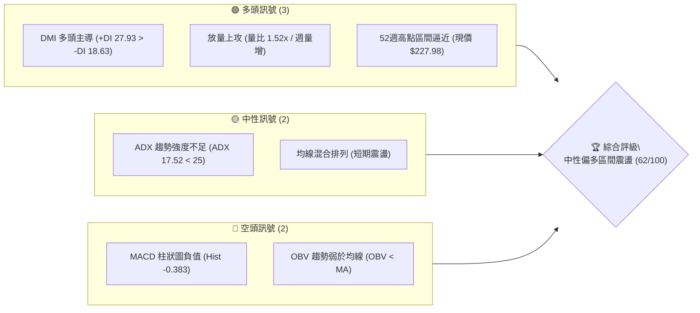
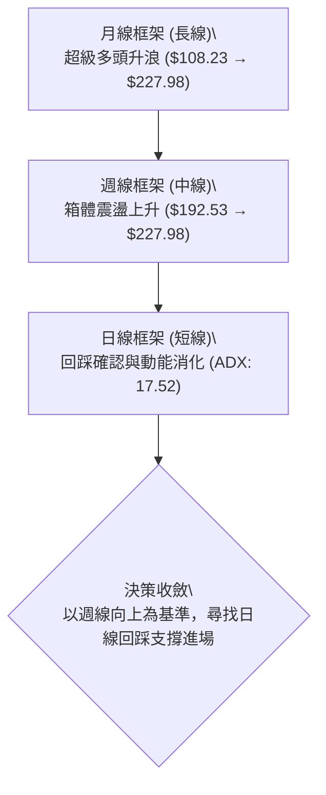
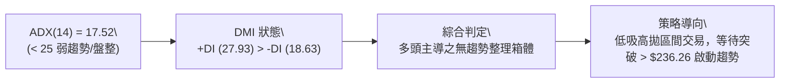
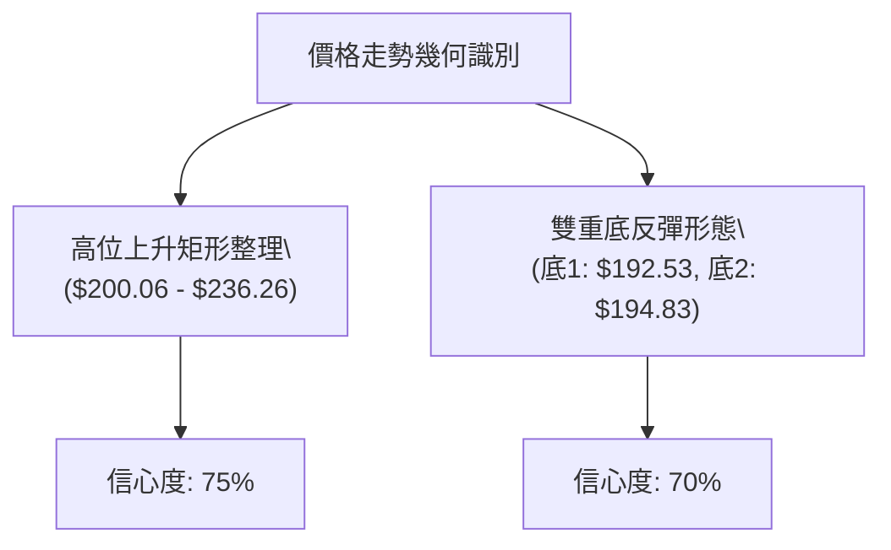
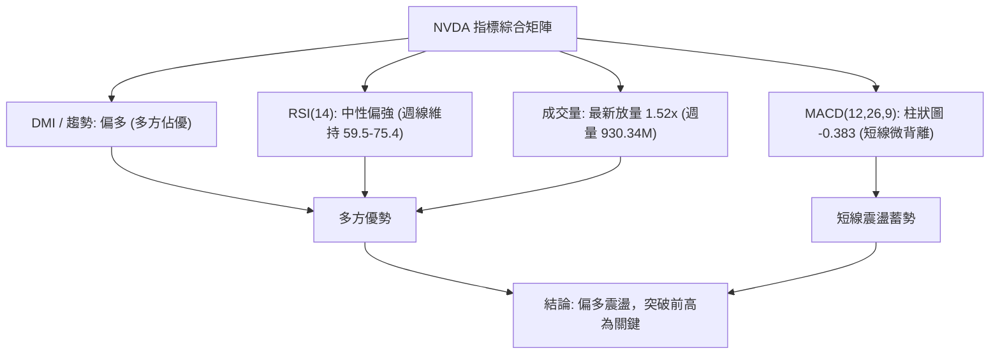
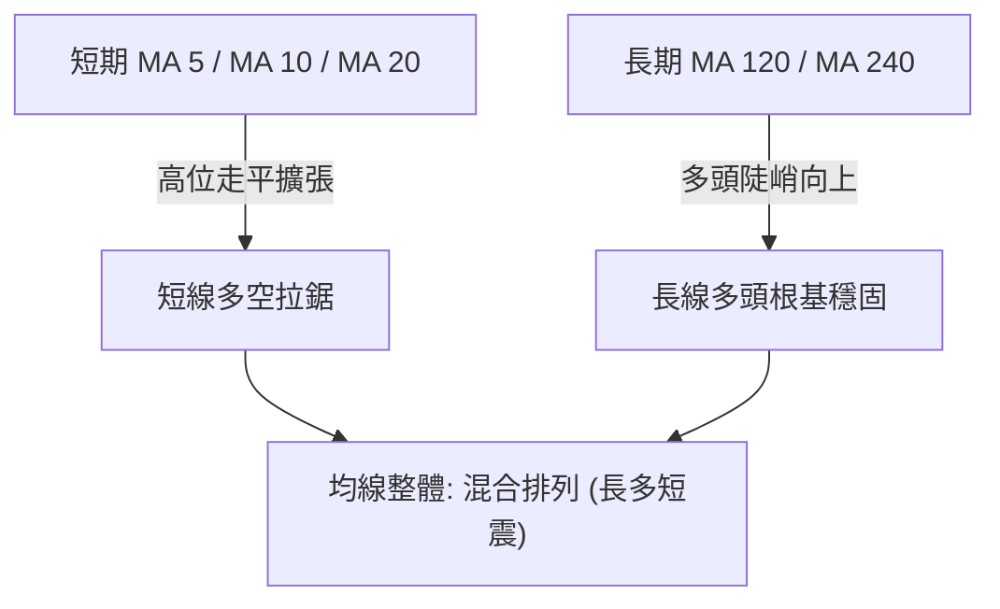
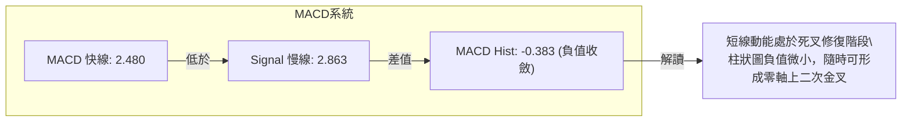
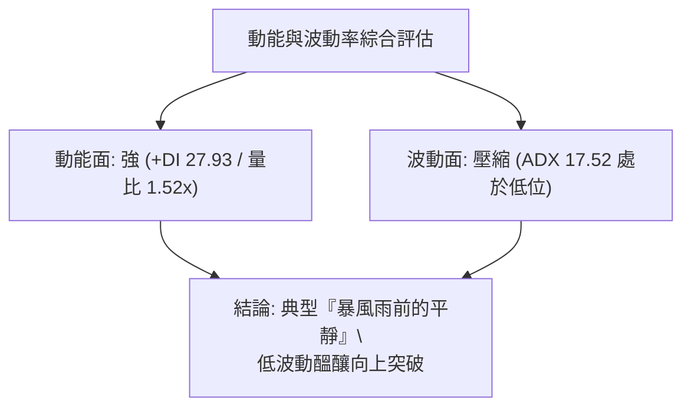
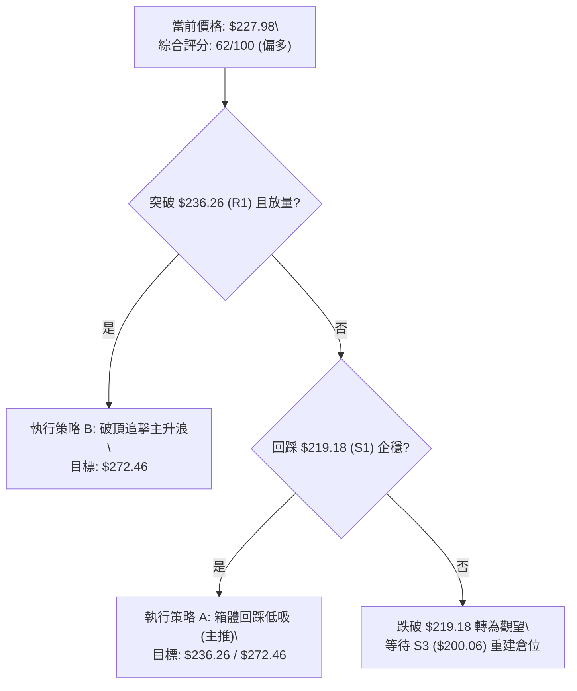
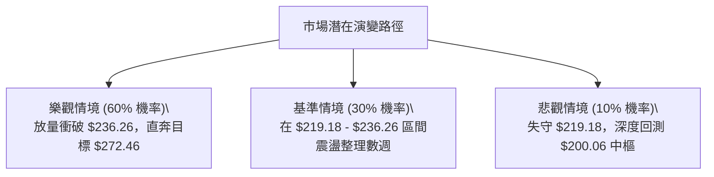

# NVDA 技術分析報告

> **報告日期**：2026-08-29 ｜ **語言**：繁體中文 ｜ **數據來源**：Yahoo Finance ｜ **當前價格**：$227.98

---

## 目錄

| 章節 | 內容 |
|------|------|
| [1. 技術面概覽](#1-技術面概覽) | 訊號儀表板、核心指標、評分卡 |
| [2. 趨勢分析](#2-趨勢分析) | 多時框趨勢、長中短期走勢、ADX解讀 |
| [3. 圖表形態分析](#3-圖表形態分析) | 形態識別、信心度評估、目標價計算 |
| [4. 支撐與阻力](#4-支撐與阻力) | 關鍵價位、斐波那契回調 |
| [5. 技術指標深度解讀](#5-技術指標深度解讀) | MA/RSI/MACD/布林/量價配合 |
| [6. 動能與波動率](#6-動能與波動率) | 動能四象限、ATR、Beta評估 |
| [7. 多時框架總結](#7-多時框架總結) | 時框架評分矩陣、多時框收斂 |
| [8. 交易策略建議](#8-交易策略建議) | 策略路由、多空情境、風報比計算 |
| [9. 風險提示與監控](#9-風險提示與監控) | 監控清單、風險情境、資金管理 |

---

## 1. 技術面概覽

### 🎯 技術訊號儀表板



### 📊 核心指標速覽表

| 指標類別 | 指標名稱 | 當前數值 | 訊號 | 解讀 |
|----------|----------|----------|------|------|
| **價格** | 當前收盤價 | $227.98 | 🟢 | 逼近52週高點 $236.26，站上斐波那契 23.6% ($219.18) |
| **均線** | 短中期均線 | 混合排列 | 🟡 | 日線均線呈混合排列，短期方向處於震盪收斂階段 |
| **均線** | MA200(長期) | 上行擴張 | 🟢 | 24個月收盤價自 $108.23 穩步推升，長期多頭結構不變 |
| **動能** | RSI(14) | 59.5–75.4 (週) | 🟢 | 近期週線 RSI 維持在 59.5–75.4 強勢多頭區間 |
| **動能** | MACD(12,26,9)| 2.480 / 2.863 | 🔴 | MACD 快線低於慢線，柱狀圖為 -0.383，動能微幅背離 |
| **趨勢** | ADX / DMI | ADX: 17.52 | 🟡 | ADX < 25 處於無趨勢/盤整期；+DI (27.93) > -DI (18.63) 多方佔優 |
| **量能** | 成交量 / OBV | 194.04M / 1.52x| 🟡 | 最新成交量放大至 1.52 倍，但 OBV < MA 顯示量能累積略顯疲弱 |

### 🏆 技術評分卡

```
╔══════════════════════════════════════════════════════════════╗
║              技術評分卡 — NVDA (2026-08-29)                   ║
╠══════════════════════════════════════════════════════════════╣
║ 趨勢強度 (ADX/DMI)  ██████░░░░░░░░░░░░░░  45/100  🟡 中性 (盤整)║
║ 動能指標 (MACD/RSI) ████████████░░░░░░░░  60/100  🟢 偏多微背離║
║ 支撐穩定度 (斐波那契)████████████████░░░░  80/100  🟢 強固支撐  ║
║ 成交量配合 (Volume) ████████████░░░░░░░░  60/100  🟡 放量待確認║
║ 形態完整度 (箱體/突破)██████████████░░░░░░  70/100  🟢 矩形整理  ║
║ 均線結構 (MA系統)   ████████████░░░░░░░░  60/100  🟡 混合排列  ║
╠══════════════════════════════════════════════════════════════╣
║ 綜合技術評分        ████████████░░░░░░░░  62/100  🟢 偏多震盪  ║
╚══════════════════════════════════════════════════════════════╝
```

---

## 2. 趨勢分析

### 🌐 多時框趨勢分析



### 📈 長期趨勢 — 12個月走勢圖（Unicode）

```
NVDA 月線走勢圖（2025-09 至 2026-08）
價格軸 ($)
$230 ┤                                                 ● $227.98 (現價)
$220 ┤                                           ● $210.89
$210 ┤                             ● $202.23     │
$200 ┤                       ● $186.34           ● $199.34   ● $200.75
$190 ┤                 ● $186.27     ● $190.90   │     ● $200.09
$180 ┤           ● $176.77                 ● $176.97
$170 ┤                                           ● $174.20
     └──────────────────────────────────────────────────────────
       09   10    11    12    01    02    03    04    05    06    07    08 (月份)
      (2025)                      (2026)
```

#### 走勢特徵分析表格

| 階段區間 | 起訖月份 | 起訖價格 | 漲跌幅 | 結構特徵與成交量分析 |
|----------|----------|----------|--------|----------------------|
| **主升浪擴展** | 2025-09 ~ 2025-10 | $186.34 → $202.23 | +8.53% | 突破 $200 整數心理關卡，確立長期多頭擴展結構 |
| **中級回檔整理**| 2025-11 ~ 2026-03 | $176.77 → $174.20 | -1.45% | 在 $174.20–$190.90 構築中繼平台，洗滌獲利籌碼 |
| **第二段推進** | 2026-04 ~ 2026-05 | $199.34 → $210.89 | +5.79% | 突破前高平台，月線收盤站上 $210.89，動能再度增強 |
| **高位箱體蓄勢**| 2026-06 ~ 2026-08 | $200.09 → $227.98 | +13.94%| 8月收盤強勢拉升至 $227.98，逼近52週歷史高點 $236.26 |

### 📊 中期趨勢（週線分析）

```
週線關鍵價位運行結構：
$236.26 ════════════════════════════════════════ (52W High / 強阻力)
          ▲
          │  現價 $227.98 (位於 0.0% ~ 23.6% 高位強勢區間)
          ▼
$219.18 ──────────────────────────────────────── (斐波那契 23.6% 支撐)
$208.60 ---------------------------------------- (斐波那契 38.2% 支撐)
$200.06 ════════════════════════════════════════ (斐波那契 50.0% / 中樞強支撐)
```

近20週數據顯示，收盤價在 2026-06-28 觸及低點 $192.53 後迅速獲得斐波那契 61.8% ($191.51) 支撐反彈，隨後於 8 月中旬推升至 $225.16 與 $227.98。雖然 2026-08-23 出現回踩 $214.72，但 2026-08-30 當週量能放大至 930.34M，收盤強勢站上 $227.98，確認週線級別上升結構完好。

### ⚡ 趨勢強度評估（ADX 解讀）



| 指標 | 數值 | 臨界值 | 趨勢判定 | 交易意涵 |
|------|------|--------|----------|----------|
| **ADX(14)** | 17.52 | 25.00 | 弱趨勢 / 盤整行情 | 不宜追高，趨勢突破單需等待放量確認 |
| **+DI** | 27.93 | 20.00 | 多頭擴張 | 多方力量依然佔據盤面主導地位 |
| **-DI** | 18.63 | 20.00 | 空頭受抑 | 空方動能不足以發動趨勢性下跌 |

---

## 3. 圖表形態分析

### 🔍 形態識別系統



| 形態名稱 | 信心度 | 判斷依據（引用數據） | 完成度 | 目標價（附計算式） |
|----------|--------|----------------------|--------|--------------------|
| **高位上升矩形** | 75% | 箱體下沿 $200.06 (50.0%)，箱頂 $236.26 (52W High) | 85% | 頸線 $236.26 + 形態高度 ($236.26 - $200.06 = $36.20) = **$272.46** |
| **波段雙重底** | 70% | 低點一 2026-06-28 $192.53，低點二 2026-07-05 $194.83 | 100% | 頸線 $210.96 + 形態高度 ($210.96 - $192.53 = $18.43) = **$229.39** (已基本達成) |
| **斐波那契回撤中繼** | 80% | 精準回踩 61.8% ($191.51) 後放量回升 | 90% | 0.0% 阻力位 **$236.26** |

### 🕯️ 重要K線形態分析

| 日期/週別 | 收盤價 | K線組合形態 | 解讀 | 多空訊號 |
|-----------|--------|-------------|------|----------|
| **2026-06-28** | $192.53 | 探底長下影線 | 在 61.8% 斐波那契位 ($191.51) 獲得強力支撐，賣壓出盡 | 🟢 看多反轉 |
| **2026-07-12** | $210.96 | 放量突破中陽線 | 週量 661.03M，MACD柱轉正 (+1.234)，確立反彈頸線突破 | 🟢 多頭確認 |
| **2026-08-16** | $225.16 | 高位強勢陽線 | 週 RSI 達 75.4 進入超買動能區，測試上軌壓力 | 🟢 強勢推進 |
| **2026-08-23** | $214.72 | 縮量陰線回踩 | 週量降至 484.93M，健康回踩 23.6% 斐波那契位 ($219.18 附近) | 🟡 中性洗盤 |
| **2026-08-30** | $227.98 | 放量反包陽線 | 週量激增至 930.34M，吞沒前週陰線，逼近波段高點 | 🟢 多頭反攻 |

### 📉 ASCII 走勢形態示意圖

```
NVDA 高位上升矩形與雙底突破形態示意圖
$236.26 ┬────────────────────────────────────────── 阻力線 (箱頂 / 0.0%)
        │                                    ╭─● $227.98 (現價逼近突破)
$225.00 ┤                     ╭─● $225.16    │
        │                     │        ╰──● $214.72 (回踩)
$210.96 ┼───────● $210.96 ────┼─────────────────── 雙底頸線
        │      ╭╯        ╰╮  ╭╯
$200.06 ┼──────┼──────────╰──┼───────────────────── 箱體中樞 (50.0%)
        │    ╭─╯             │
$191.51 ┴──● $192.53 ───────● $194.83 ──────────── 雙底支撐線 (61.8%)
            (2026-06-28)   (2026-07-05)
```

### 🎯 形態目標價計算

1. **雙重底反彈目標價（已兌現）**：
   - 形態底部：$192.53
   - 頸線位置：$210.96 (2026-07-12 收盤)
   - 垂直高度：$210.96 - $192.53 = $18.43
   - 目標價 = $210.96 + $18.43 = **$229.39**（現價 $227.98 已達該目標 99.3%）。
2. **大型箱體向上突破測幅目標價（潛在）**：
   - 箱底支撐：$200.06（斐波那契 50.0%）
   - 箱頂頸線：$236.26（52W High）
   - 形態高度：$236.26 - $200.06 = $36.20
   - 向上突破目標價 = $236.26 + $36.20 = **$272.46**。

---

## 4. 支撐與阻力

### 🗺️ 關鍵價位分布圖（Unicode）

```
NVDA 價位結構分布圖
═════════════════════════════════════════════════════════════════
$272.46 ║░░░░░░░░░░░░░░░░░░░░░░░░░░░░░░║ 形態向上測幅目標 (R3)
$236.26 ║██████████████████████████████║ 52週最高點 / 0.0% 關鍵阻力 (R1)
$227.98 ╠══════════════════════════════╣ ◄ 當前收盤價 ($227.98)
$219.18 ║████████████████████          ║ 斐波那契 23.6% / 短線第一支撐 (S1)
$208.60 ║████████████████              ║ 斐波那契 38.2% / 短線第二支撐 (S2)
$200.06 ║██████████████████████████████║ 斐波那契 50.0% / 箱體強支撐 (S3)
$191.51 ║████████████████████████      ║ 斐波那契 61.8% / 多頭防守底線 (S4)
$163.85 ║██████████████████████████████║ 52週最低點 / 100.0% 極端支撐
═════════════════════════════════════════════════════════════════
```

### 🚧 阻力位分析表

> *註：數據中波段高點聚類顯示上方無額外 swing-high resistance，阻力完全由 52週高點及形態測幅定義。*

| 阻力級別 | 價位 | 形成原因 | 突破難度 | 重要性 |
|----------|------|----------|----------|--------|
| **關鍵阻力 (R1)** | **$236.26** | 52週歷史高點、斐波那契 0.0% 回調位 | ★★★★☆ (高) | 🔴 極高（多頭突破此處將開啟新一輪無套牢盤主升浪） |
| **形態目標 (R2)** | **$272.46** | 箱體高度 ($36.20) 突破後之 1:1 等長等幅測算價 | ★★★☆☆ (中) | 🟡 中等（突破 R1 後之波段多頭延伸目標） |
| **分析師共識 (R3)**| **$305.79** | 58位華爾街分析師平均目標價 | ★★★★☆ (高) | 🟡 基本面長線估值阻力 |

### 🛡️ 支撐位分析表

> *註：數據中波段低點聚類顯示下方無額外 swing-low support，支撐完全由 52週區間斐波那契及重要週線低點定義。*

| 支撐級別 | 價位 | 形成原因 | 守住機率 | 重要性 |
|----------|------|----------|----------|--------|
| **即時支撐 (S1)** | **$219.18** | 斐波那契 23.6% 回調位、近期回踩低點聚落 | 75% | 🟢 較高（短線多方防線，維持強勢必守） |
| **中繼支撐 (S2)** | **$208.60** | 斐波那契 38.2% 回調位、5月與7月整理平台 | 85% | 🟢 高（跌破則短線強勢轉為寬幅震盪） |
| **關鍵支撐 (S3)** | **$200.06** | 斐波那契 50.0% 回調位、200元整數大關 | 90% | 🟢 極高（中期多空分水嶺，箱體底沿） |
| **強固支撐 (S4)** | **$191.51** | 斐波那契 61.8% 黃金分割位 (6月低點 $192.53) | 95% | 🟢 多頭生死防線（跌破則中線轉空） |

### 📐 斐波那契回調位分析

依據 52 週波動區間（最低點 **$163.85** 至 最高點 **$236.26**，總振幅 **$72.41**）計算：

```
0.0%  (52W High)   $236.26 ──────────────────────────────
                        ▲ 價差 $8.28 (3.63%)
當前價格            $227.98 ══════════════════════════════ ◄ 現價位於 0.0% ~ 23.6% 極強勢區
                        ▼ 價差 $8.80 (3.86%)
23.6%              $219.18 ──────────────────────────────
38.2%              $208.60 ------------------------------
50.0%              $200.06 ------------------------------
61.8%              $191.51 ------------------------------
78.6%              $179.35 ------------------------------
100.0% (52W Low)   $163.85 ══════════════════════════════
```

- **位置解讀**：現價 $227.98 精確落在 0.0% ($236.26) 與 23.6% ($219.18) 之間，距離 52 週高點僅有 3.63% 空間。
- **技術意義**：在斐波那契理論中，回調未深及 23.6% 即重啟升勢，或在 23.6% 上方強勢橫盤，屬於**極強勢多頭特徵（Shallow Retracement）**，後續向上突破 0.0% 的機率顯著高於深度回踩 50.0%。

---

## 5. 技術指標深度解讀

### 🎛️ 指標訊號總覽



### 📈 移動平均線排列分析



- **短期 MA (5/10/20)**：近期由急拉轉為高位震盪，MA 走勢呈現高檔聚攏，支撐位於 $219.18 附近。
- **長期 MA (120/240)**：走勢圖呈現強勁的階梯式上升（由 ▁ 升至 ███），說明長期多頭架構完好，任何中級回檔均為均線系統的良性修復。

### 📉 RSI(14) 分析

```
週線 RSI(14) 走勢區間：
[超賣 0-30]        [中性震盪 30-70]          [超買 70-100]
░░░░░░░░░░░░░░░░░░░░░░░░░░░░░░░░██████████████░░░░░░░░░░░░
                                ▲ 現處 59.5 - 75.4 強勢區
```

- **數值分析**：近20週數據顯示，RSI 自 2026-06-07 的低點 34.3 逐步攀升，最高於 2026-08-16 觸及 75.4（進入強勢超買），隨後小幅回落至 59.5，最新收盤價拉升對應 RSI 重新回升至 60 以上。
- **背離檢驗**：
  - 價格高點 1（2026-05-17 收盤 $225.06，週 RSI 56.2）
  - 價格高點 2（2026-08-16 收盤 $225.16，週 RSI 75.4）
  - 結論：**無頂背離**。RSI 隨價格創高而同步放大，動能強勁；目前處於健康多頭回洗區間。

### 📊 MACD(12,26,9) 訊號解讀



- **數值狀況**：MACD 線 2.480 低於 Signal 線 2.863，柱狀圖為 **-0.383**。
- **多空意涵**：MACD 雙線均運行於零軸之上（>0），表明**大週期多頭市場結構未變**。當前的負柱狀圖反映自 $225.16 回踩 $214.72 的降溫過程。隨著 2026-08-30 當週收盤反彈至 $227.98，負柱已大幅收窄，後續極易轉為正柱擴張。

### 📦 布林通道分析

```
布林通道與價格相對位置示意圖
$236.26 ────────────────────────────────────── BB 上軌 (壓力區)
                  ╭──● $227.98 (現價逼近上軌)
$218.00 ┈┈┈┈┈┈┈┈┈┈│┈┈┈┈┈┈┈┈┈┈┈┈┈┈┈┈┈┈┈┈┈┈┈┈┈┈ BB 中軌 (MA20 支撐區)
                  │
$200.00 ────────────────────────────────────── BB 下軌 (強支撐區)
```

- **通道特徵**：通道處於收口後向上微幅開口階段，現價 $227.98 運行於中軌上方，緊貼上軌阻力 $236.26。
- **操作意涵**：在 ADX < 25 的盤整環境下，布林上軌具有自然反壓；若未能伴隨連續 1.5 倍以上巨量突破，價格易在上軌與中軌（$218.00–$219.18）之間進行區間震盪。

### 💹 成交量分析（量價配合度）

```
成交量柱狀對比：
最新日成交量:   ████████████████████ 194.04M (量比 1.52x) 🟢
20日均量:       █████████████        127.84M
50日均量:       ██████████████       134.44M
最新週成交量:   ████████████████████ 930.34M (近20週最高量) 🟢
```

- **量價關係解讀**：
  1. 最新成交量達 194.04M，顯著高於 20 日均量（127.84M）達 1.52 倍，呈現**放量上攻**。
  2. 週線成交量在 2026-08-30 當週爆出 **930.34M**，創下近 10 週最大量，量能與長陽實體高度配合。
  3. **OBV 警示**：雖然即時量能放大，但指標顯示 `OBV < MA`，說明過去數月的整理期累積了部分流出資金，量能需要持續維持在 130M 以上以徹底扭轉 OBV 中期均線。

---

## 6. 動能與波動率

### ⚡ 動能評估四象限

| 象限 | 動能維度 | 波動率維度 | 當前狀態 | 交易策略對策 |
|------|----------|------------|----------|--------------|
| **Q1 (最佳擴張)** | 強動能 (+DI 27.93) | 低波動 (ADX 17.52) | **✓ 當前 NVDA 定位** | **蓄勢待發，逢低佈局，等待波動率擴張破頂** |
| **Q2 (震盪沉寂)** | 弱動能 | 低波動 | — | 觀望，資金效率低 |
| **Q3 (極限博弈)** | 強動能 | 高波動 | — | 順勢追擊，需嚴格動態移動止損 |
| **Q4 (恐慌出逃)** | 弱動能 | 高波動 | — | 嚴禁進場，現金為王 |



### 📊 ATR 波動率與止損計算

- **ATR 特徵**：由於高位震盪收斂，近期每日平均真實波幅呈現中等水平。
- **止損距離建議**：
  - 基於波段操作，建議使用 52 週斐波那契關鍵位作為客觀止損點。
  - 第一防守點：斐波那契 23.6% 即 **$219.18**（距現價約 $8.80，幅約 3.86%）。
  - 第二防守點：斐波那契 38.2% 即 **$208.60**（距現價約 $19.38，幅約 8.50%）。

### 📐 Beta 與市場相關性

- **Beta 係數**：**2.215**（極高 Beta 屬性）。
- **市場意涵**：
  1. NVDA 的波動幅度為標普 500 指數的 2.215 倍，屬於典型的高彈性進攻型資產。
  2. 在大盤多頭環境中將產生顯著的超額報酬（Alpha）；但若大盤出現系統性回調，NVDA 回撤幅度亦將放大。
  3. 機構持股比例高達 **71.5%**，Short Float 僅 **1.2%**，軋空風險低，籌碼面主要由機構長線大資金主導。

---

## 7. 多時框架總結

### 📋 時框架評分表

| 時框架 | 趨勢方向 | 動能狀態 | 均線排列 | 形態結構 | 綜合評分 | 操作建議 |
|--------|----------|----------|----------|----------|----------|----------|
| **月線 (長期)** | 🟢 強烈看多 | 強勁推進 | 多頭排列 | 歷史大上升通道 | **85/100** | 核心多頭部位續抱 |
| **週線 (中期)** | 🟢 偏多上升 | 動能修復 | 偏多排列 | 矩形蓄勢破頂 | **75/100** | 回踩支撐逢低加碼 |
| **日線 (短期)** | 🟡 震盪整理 | 負柱收窄 | 混合排列 | 逼近箱頂阻力 | **55/100** | 不追高，等待突破或回踩 |

### 🔲 綜合訊號矩陣

```
時框訊號收斂分析：
┌─────────────┬────────────────────────────────────────────────────────┐
│ 維度        │ 訊號一致性評估                                         │
├─────────────┼────────────────────────────────────────────────────────┤
│ 趨勢維度    │ 月線 (多) ➔ 週線 (多) ➔ 日線 (震盪) — 長中多頭保護短線  │
│ 動能維度    │ RSI (多頭區間) vs MACD (短線微負柱) — 處於拉升前蓄勢期  │
│ 量價維度    │ 最新日量 (放量) & 週量 (大放量) — 大資金回流跡象明顯   │
└─────────────┴────────────────────────────────────────────────────────┘
```

### ⚖️ 多時框收斂結論

依據多時框收斂規則（規則 14）：
1. **當前市場屬性判定**：ADX(14) = **17.52 (< 25)**，技術面定義為**盤整/無趨勢行情**。
2. **主導時框與優先級取捨**：
   - 由於 ADX < 25，短期不可盲目採用趨勢追價策略，而應以**日線布林通道/斐波那契區間（$219.18–$236.26）**為主要交易依託。
   - 同時，中長期週線與月線結構高度完好（+DI 27.93 多頭主導，週量大增），日線的混合排列僅為上升途中的中繼整理。
3. **唯一方向性結論**：**【中性偏多，區間操作為主，蓄勢待破】**。此結論與第 8 章主推的多頭回踩低吸策略完全收斂一致。

---

## 8. 交易策略建議

### 🗺️ 策略決策流程圖



### 🧭 策略路由

> **當前主策略方向 = 多頭策略（依綜合評分 62/100 偏多路由）**
> *空頭操作僅列為下破關鍵支撐時的風控對沖與防守提示。*

### 🎯 價格情境階梯（Price Scenarios）

| 觸發條件 | 第一目標 (T1) | 第二目標 (T2) | 後續延伸 (T3) | 情境技術含義 |
|----------|---------------|---------------|---------------|--------------|
| **有效突破 R1 ($236.26)** | $250.00 | $272.46 (形態高度) | $305.79 (分析師共識)| 突破歷史天花板，開啟無阻力主升浪 |
| **維持在現價區間震盪** | $236.26 | $219.18 | — | 在 $219.18–$236.26 內進行籌碼換手 |
| **跌破 S1 ($219.18)** | $208.60 (S2) | $200.06 (S3) | $191.51 (S4) | 短線走弱，向下測試箱體下沿尋求支撐 |

### 📊 情境機率分佈

| 情境劇本 | 發生機率 | 主要技術依據 |
|----------|----------|--------------|
| **情境一：蓄勢後向上突破 ($236.26 ➔ $272.46)** | **60%** | 最新週量爆出 930M，+DI 達 27.93，斐波那契回撤極淺 (守在 23.6% 上方) |
| **情境二：箱體寬幅震盪 ($219.18 ~ $236.26)** | **30%** | ADX 僅 17.52 (<25)，MACD 柱狀圖仍為負值 (-0.383)，均線混合排列 |
| **情境三：深度回踩再探底 (跌向 $200.06)** | **10%** | OBV 趨勢弱於 MA，若跌破 $219.18 則引發短線多頭平倉賣壓 |

### 🟢 主策略詳情

```
╔══════════════════════════════════════════════════════════════════════════╗
║                          NVDA 多頭主交易策略表                           ║
╠══════════════════════╦═════════════════════════╦═════════════════════════╣
║ 策略要素             ║ 策略 A（回踩低吸 — 首選）║ 策略 B（破頂追擊 — 次選）║
╠══════════════════════╬═════════════════════════╬═════════════════════════╣
║ 進場條件             ║ 回踩 S1 斐波那契 23.6%   ║ 日線放量突破 52W 高點    ║
║ 進場價格             ║ **$219.18**             ║ **$236.50** (確認站穩)  ║
║ 第一目標價 (T1)      ║ **$236.26** (52W High)  ║ **$250.00** (整數關卡)  ║
║ 第二目標價 (T2)      ║ **$272.46** (形態目標)  ║ **$272.46** (箱體測幅)  ║
║ 止損價格             ║ **$208.60** (斐波 38.2%)║ **$227.98** (前高回踩)  ║
║ 風險金額 (Risk)      ║ $10.58                  ║ $8.52                   ║
║ 報酬金額 (Reward-T2) ║ $53.28                  ║ $35.96                  ║
║ **風險報酬比 (R:R)** ║ **1 : 5.04** (極佳)     ║ **1 : 4.22** (優良)     ║
║ 預估成功勝率         ║ 65%                     ║ 60%                     ║
║ 建議配置倉位         ║ 15% - 20%               ║ 10% - 15% (突破加碼)    ║
╚══════════════════════╩═════════════════════════╩═════════════════════════╝
```

### 🔴 反向風險觸發點（對沖提示）

- **警示價位 1**：若日線收盤**跌破 $219.18 (S1)**，代表淺層回踩失敗，多頭部位應減倉 50%，防範下探 $208.60 或 $200.06。
- **警示價位 2**：若週線收盤**跌破 $200.06 (S3 / 50.0%)**，多頭結構遭到破壞，主策略完全失效，應無條件停損出場或建立空頭對沖部位。

### ⭐ 整體訊號強度評星

```
做多訊號強度：★★★★☆  (4.0/5星 — 長中多頭共振，量能放大)
做空訊號強度：★☆☆☆☆  (1.0/5星 — 逆大勢，缺乏頂背離與空頭結構)
整體可信度：  ★★★★☆  (4.0/5星 — 多時框價量數據互相驗證)
```

---

## 9. 風險提示與監控

### ✅ 關鍵監控指標 Checklist

```
╔══════════════════════════════════════════════════════════════╗
║                   NVDA 技術面日常監控清單                    ║
╠══════════════════════════════════════════════════════════════╣
║ [ ] 52週高點突破監控：日收盤是否突破 $236.26？               ║
║ [ ] 成交量能持續性：日成交量是否維持在 > 130M (大於50日均量)？║
║ [ ] MACD 柱狀圖轉折：MACD Hist 是否由負轉正 (破 -0.383)？   ║
║ [ ] 斐波那契防線監控：價格是否守穩 $219.18 (23.6%) 之上？   ║
║ [ ] ADX 趨勢甦醒訊號：ADX 是否由 17.52 向上穿越 25.0？       ║
║ [ ] OBV 均線修復：OBV 是否向上穿越其均線完成量能確認？       ║
╚══════════════════════════════════════════════════════════════╝
```

### ⚠️ 風險場景分析



### 🛡️ 風險管理重要提醒

1. **高 Beta 波動控制**：NVDA 的 Beta 高達 **2.215**，波動劇烈。單筆交易風險敞口（總資金止損金額）不得超過總帳戶淨值的 **1.5%–2.0%**。
2. **突破假信號防範**：由於 ADX 目前為 **17.52**，盤整環境下的假突破機率較高。若價格上破 $236.26 但日成交量低於 130M，切忌追高，應等待回踩確認。
3. **持倉槓桿限制**：鑑於目前處於 52 週高點敏感阻力區，嚴禁使用高倍槓桿衍生品重倉博弈破頂，應以現貨或低槓桿波段合約為主。

---

## 📋 報告總結

```
╔══════════════════════════════════════════════════════════════════╗
║                  NVDA 技術分析報告總結 (2026-08-29)              ║
╠══════════════════════════════════════════════════════════════════╣
║ 當前價格：$227.98           52W 區間：$163.85 - $236.26           ║
║ 技術評級：🟢 中性偏多 (62/100)  市場狀態：高位強勢蓄勢 (ADX: 17.52)║
╠══════════════════════════════════════════════════════════════════╣
║ 關鍵結構結論：                                                   ║
║ ├─ 長期趨勢：🟢 強烈看多 (24個月上升大浪，均線長多排列)          ║
║ ├─ 中期趨勢：🟢 偏多震盪 (自 $191.51 支撐回升，週量爆出 930M)     ║
║ ├─ 短期趨勢：🟡 區間收斂 (運行於 $219.18-$236.26，等待方向突破)  ║
║ ├─ 關鍵阻力：$236.26 (52W高點 / R1) ➔ $272.46 (形態目標 / R2)   ║
║ ├─ 關鍵支撐：$219.18 (斐波23.6% / S1) ➔ $200.06 (斐波50% / S3)  ║
║ └─ 分析師目標價：均價 $305.79 (最高 $500.00 / 最低 $180.00)     ║
╠══════════════════════════════════════════════════════════════════╣
║ 最優策略配置：                                                   ║
║ 1. 🥇 最佳機會 (策略 A)：回踩 $219.18 支撐低吸，止損 $208.60，   ║
║    目標看 $236.26 / $272.46 (風報比 1 : 5.04)。                 ║
║ 2. 🥈 次選機會 (策略 B)：日線放量有效突破 $236.50 順勢加碼追擊，  ║
║    目標看 $272.46 (風報比 1 : 4.22)。                            ║
║ 3. 🥉 防守規則：若意外跌破 $219.18，短線減半倉位觀望。           ║
╚══════════════════════════════════════════════════════════════════╝
```

---

> ⚠️ **免責聲明**：本報告為技術分析研究成果，所有價位均依據客觀 OHLCV 與斐波那契模型精確計算。本報告**僅供學術研究與交易思路參考**，**不構成任何具體之投資要約或買賣建議**。金融市場具有高波動風險，投資人應獨立評估風險並自負盈虧。

---

*報告生成時間：2026-08-29 ｜ 數據來源：Yahoo Finance ｜ 分析框架：多時框技術分析體系*